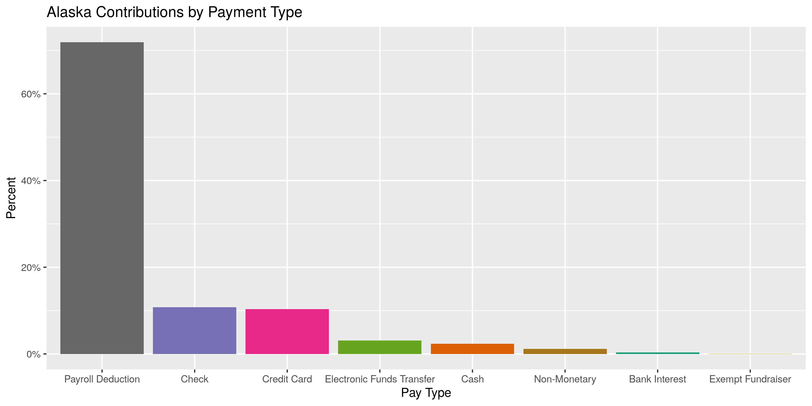
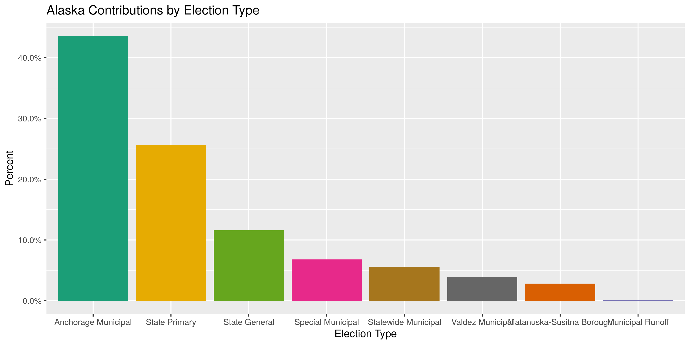
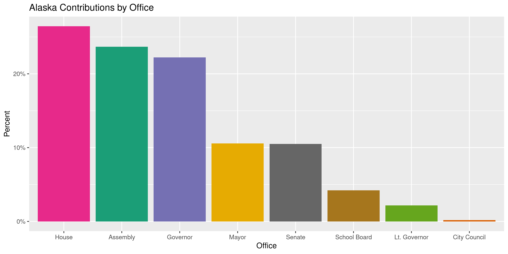
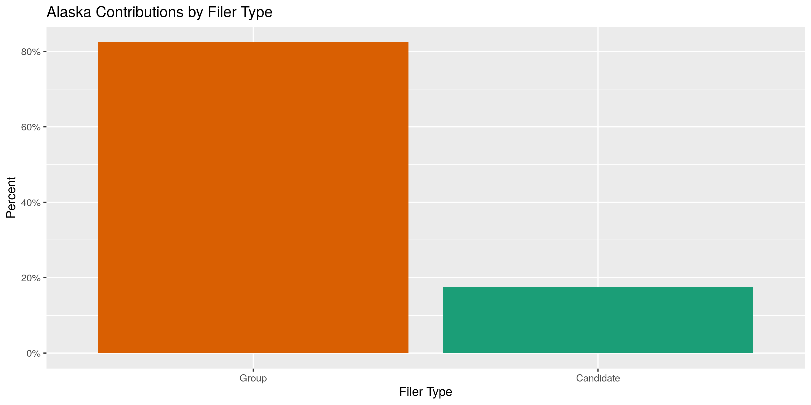
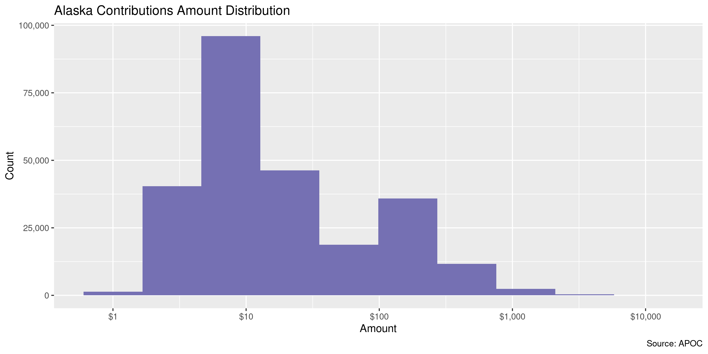
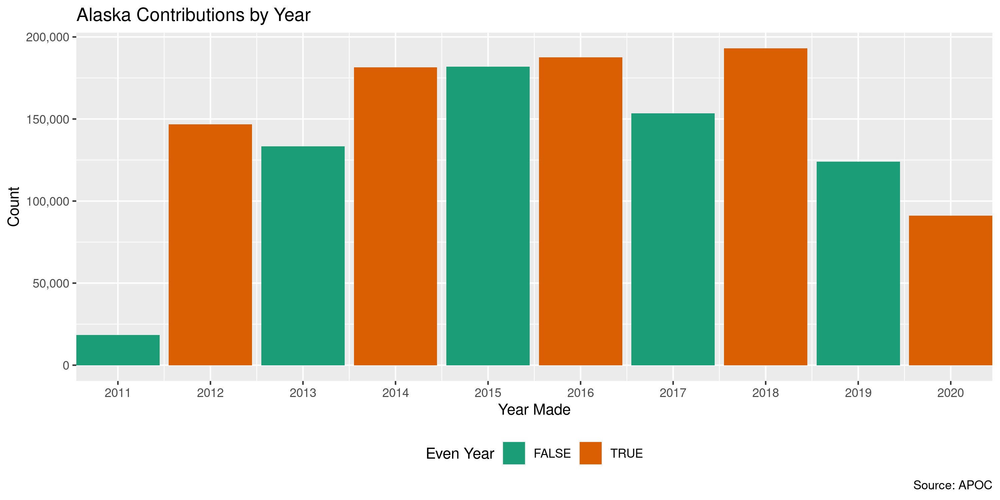
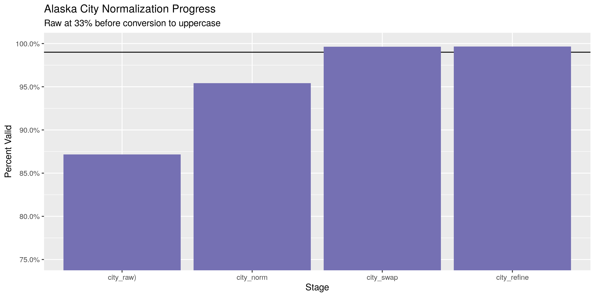

Alaska Contributions
================
Kiernan Nicholls
2020-04-13 15:10:33

  - [Project](#project)
  - [Objectives](#objectives)
  - [Packages](#packages)
  - [Data](#data)
  - [Import](#import)
  - [Explore](#explore)
  - [Wrangle](#wrangle)
  - [Conclude](#conclude)
  - [Export](#export)

<!-- Place comments regarding knitting here -->

## Project

The Accountability Project is an effort to cut across data silos and
give journalists, policy professionals, activists, and the public at
large a simple way to search across huge volumes of public data about
people and organizations.

Our goal is to standardizing public data on a few key fields by thinking
of each dataset row as a transaction. For each transaction there should
be (at least) 3 variables:

1.  All **parties** to a transaction.
2.  The **date** of the transaction.
3.  The **amount** of money involved.

## Objectives

This document describes the process used to complete the following
objectives:

1.  How many records are in the database?
2.  Check for entirely duplicated records.
3.  Check ranges of continuous variables.
4.  Is there anything blank or missing?
5.  Check for consistency issues.
6.  Create a five-digit ZIP Code called `zip`.
7.  Create a `year` field from the transaction date.
8.  Make sure there is data on both parties to a transaction.

## Packages

The following packages are needed to collect, manipulate, visualize,
analyze, and communicate these results. The `pacman` package will
facilitate their installation and attachment.

The IRW’s `campfin` package will also have to be installed from GitHub.
This package contains functions custom made to help facilitate the
processing of campaign finance data.

``` r
if (!require("pacman")) install.packages("pacman")
pacman::p_load_gh("irworkshop/campfin")
pacman::p_load(
  tidyverse, # data manipulation
  lubridate, # datetime strings
  magrittr, # pipe operators
  janitor, # dataframe clean
  refinr, # cluster and merge
  scales, # format strings
  knitr, # knit documents
  vroom, # read files fast
  glue, # combine strings
  httr, # http requests
  here, # relative storage
  fs # search storage 
)
```

This document should be run as part of the `R_campfin` project, which
lives as a sub-directory of the more general, language-agnostic
[`irworkshop/accountability_datacleaning`](https://github.com/irworkshop/accountability_datacleaning)
GitHub repository.

The `R_campfin` project uses the [RStudio
projects](https://support.rstudio.com/hc/en-us/articles/200526207-Using-Projects)
feature and should be run as such. The project also uses the dynamic
`here::here()` tool for file paths relative to *your* machine.

``` r
# where does this document knit?
here::here()
#> [1] "/home/kiernan/Code/accountability_datacleaning/R_campfin"
```

## Data

Data is obtained from the [Alaska Public Offices Commission
(APOC)](https://aws.state.ak.us/ApocReports/Campaign/#).

## Import

### Download

From the [APOC income
search](https://aws.state.ak.us/ApocReports/CampaignDisclosure/CDIncome.aspx),
we can search “Any” report year without any additional parameters to
return all income reports. From that search page we can “Export” *all*
results as a tab-delimited text file. We can do that by hand since the
`httr::GET()` request below does not have all the cookies needed.

``` r
raw_dir <- dir_create(here("ak", "contribs", "data", "raw"))
raw_path <- path(raw_dir, glue("CD_Transactions_{format(today(), '%m-%d-%Y')}.CSV"))
```

``` r
httr::GET(
  url = str_c(
    "https://aws.state.ak.us",
    "ApocReports",
    "CampaignDisclosure",
    "CDIncome.aspx",
    sep = "/"
  ),
  query = list(
    exportAll = "True",
    exportFormat = "CSV",
    isExport = "True"
  ),
  write_disk(raw_path)
)
```

``` r
ak_names <- names(clean_names(read_csv(raw_path, n_max = 0)))
```

### Read

This tab-delimited text file can be read with `readr::read_tsv()`.

``` r
fix_path <- file_temp(ext = "csv")
read_lines(raw_path, skip = 1) %>% 
  str_remove(",(?=$)") %>% 
  str_subset("^\\d") %>% 
  write_lines(fix_path)
```

``` r
akc <- vroom(
  file = fix_path,
  delim = ",",
  na = c("", "NA", "N/A"),
  escape_backslash = FALSE,
  escape_double = FALSE,
  .name_repair = make_clean_names,
  num_threads = 1,
  col_names = ak_names,
  col_types = cols(
    .default = col_character(),
    date = col_date_usa(),
    amount = col_number(),
    report_year = col_integer(),
    submitted = col_date_usa()
  )
)
```

``` r
count(akc, tran_type)
#> # A tibble: 7 x 2
#>   tran_type                                                                                       n
#>   <chr>                                                                                       <int>
#> 1 "000.00\",ASEA/AFSCME Local 52 PAC,,2601 Denali Street,Anchorage,Alaska,USA,USA,PAC,PAC,,…      1
#> 2 "Havelock & Duffy\",,,Year Start Report,2020 - State Primary Election,State Primary,,,Can…      1
#> 3 "Inc\",,,Year Start Report,2020 - State Primary Election,State Primary,,,Candidate,Matt C…      1
#> 4 "Income"                                                                                   261787
#> 5 "Sachse"                                                                                        1
#> 6 "STE 306\",Juneau,Alaska,99801,USA,PAC,PAC,,,Year Start Report,2018 - State Primary Elect…      1
#> 7  <NA>                                                                                           8
```

## Explore

``` r
head(akc)
#> # A tibble: 6 x 25
#>   id    date       tran_type pay_type pay_detail amount last  first address city  state zip  
#>   <chr> <date>     <chr>     <chr>    <chr>       <dbl> <chr> <chr> <chr>   <chr> <chr> <chr>
#> 1 1     2019-12-13 Income    Check    9365          500 McGr… Thom… 100 W.… Anch… Alas… 99501
#> 2 2     2019-12-20 Income    Check    5842          500 Penn… Robe… 913 Ke… Sold… Alas… 99669
#> 3 3     2019-12-20 Income    Check    2575          500 Penn… PJ    913 Ke… Sold… Alas… 99669
#> 4 4     2019-12-20 Income    Check    3947          500 Penn… Henry 2091 S… Anch… Alas… 99508
#> 5 5     2019-12-10 Income    Cash     <NA>          100 Fras… Cher… 2415 L… Anch… Alas… 99517
#> 6 6     2019-10-07 Income    Credit … <NA>          100 Ozer  Kerry PO Box… Anch… Alas… 99509
#> # … with 13 more variables: country <chr>, occupation <chr>, employer <chr>, expend_purpose <chr>,
#> #   report_type <chr>, election_name <chr>, election_type <chr>, municipality <chr>, office <chr>,
#> #   filer_type <chr>, filer <chr>, report_year <int>, submitted <date>
tail(akc)
#> # A tibble: 6 x 25
#>   id    date       tran_type pay_type pay_detail amount last  first address city  state zip  
#>   <chr> <date>     <chr>     <chr>    <chr>       <dbl> <chr> <chr> <chr>   <chr> <chr> <chr>
#> 1 4249… 2017-10-20 Income    Cash     <NA>          100 Voli… Evel… 1705 T… Anch… Alas… 99508
#> 2 4249… 2017-10-19 Income    Cash     <NA>          100 Wade  Scott PO Box… Two … Alas… 99716
#> 3 4249… 2017-09-12 Income    Cash     <NA>          100 Wagn… Rich… P.O. B… Fair… Alas… 99707
#> 4 4249… 2017-10-23 Income    Credit … <NA>          200 Wagn… Rich… P.O. B… Fair… Alas… 99707
#> 5 4249… 2017-10-17 Income    Credit … <NA>          100 Walk… Darl… P.O. B… Homer Alas… 99603
#> 6 4250… 2017-09-29 Income    Cash     <NA>          100 Walk… Nick  16060 … Anch… Alas… 99515
#> # … with 13 more variables: country <chr>, occupation <chr>, employer <chr>, expend_purpose <chr>,
#> #   report_type <chr>, election_name <chr>, election_type <chr>, municipality <chr>, office <chr>,
#> #   filer_type <chr>, filer <chr>, report_year <int>, submitted <date>
glimpse(sample_n(akc, 20))
#> Rows: 20
#> Columns: 25
#> $ id             <chr> "183258", "37685", "319043", "72048", "128207", "305235", "309734", "1344…
#> $ date           <date> 2018-05-16, 2019-03-18, 2019-01-09, 2019-08-20, 2019-11-05, 2018-11-08, …
#> $ tran_type      <chr> "Income", "Income", "Income", "Income", "Income", "Income", "Income", "In…
#> $ pay_type       <chr> "Payroll Deduction", "Payroll Deduction", "Check", "Payroll Deduction", "…
#> $ pay_detail     <chr> NA, "Payroll Deduction", "6444", NA, NA, "Individual", NA, "Individual", …
#> $ amount         <dbl> 13.76, 5.00, 400.00, 1.00, 5.00, 10.00, 14.28, 10.00, 8.96, 3.00, 12.64, …
#> $ last           <chr> "ASHENFELTER", "SUMRALL", "HUTCHINGS SALES & SERVICE", "Murphy", "Sides",…
#> $ first          <chr> "JASON", "SEAN", NA, "Michael", "Daniel Jacob", "Jacob", "J", "Joseph", "…
#> $ address        <chr> "3240 PENLAND PKWY #123", "1312 WOODSIDE DR", "P O BOX 895", "P.O. Box 24…
#> $ city           <chr> "ANCHORAGE", "KETCHIKAN", "SOLDOTNA", "ANC", "Wasilla", "Anchorage", "POR…
#> $ state          <chr> "Alaska", "Alaska", "Alaska", "Alaska", "Alaska", "Alaska", "Texas", "Ala…
#> $ zip            <chr> "99508", "99901", "99669", "99524", "99654", "99509", "77651", "99501", "…
#> $ country        <chr> "USA", "USA", "USA", "USA", "USA", "USA", "USA", "USA", "USA", "USA", "US…
#> $ occupation     <chr> "Laborer", NA, "RENTALS", "Fire Fighter", "Municipality of Anchorage", "L…
#> $ employer       <chr> "HOUSTON CONTRACTING", "SOA", "RENTALS", "AFD", "Fire Fighter", "State of…
#> $ expend_purpose <chr> NA, NA, "DONATION", NA, NA, "PAC Contributions", NA, "PAC Contribution", …
#> $ report_type    <chr> "Thirty Day Report", "Seven Day Report", "Thirty Day Report", "Thirty Day…
#> $ election_name  <chr> "2018 - Anchorage Municipal Special Election", "2019 - Anchorage Municipa…
#> $ election_type  <chr> "Special Municipal", "Anchorage Municipal", "Special Municipal", NA, NA, …
#> $ municipality   <chr> "Anchorage, City and Borough", "Anchorage, City and Borough", "Soldotna, …
#> $ office         <chr> NA, NA, NA, NA, NA, NA, NA, NA, NA, NA, NA, "Governor", "Mayor", NA, NA, …
#> $ filer_type     <chr> "Group", "Group", "Group", "Group", "Group", "Group", "Group", "Group", "…
#> $ filer          <chr> "Laborers' International Union of North America, 341 PAC", "Alaska State …
#> $ report_year    <int> 2018, 2019, 2018, 2019, 2019, 2018, 2018, 2019, 2019, 2017, 2019, 2018, 2…
#> $ submitted      <date> 2018-07-09, 2019-03-25, 2019-02-02, 2019-09-03, 2020-02-15, 2019-01-09, …
```

### Missing

``` r
col_stats(akc, count_na)
#> # A tibble: 25 x 4
#>    col            class       n         p
#>    <chr>          <chr>   <int>     <dbl>
#>  1 id             <chr>       0 0        
#>  2 date           <date>     13 0.0000497
#>  3 tran_type      <chr>       8 0.0000306
#>  4 pay_type       <chr>       8 0.0000306
#>  5 pay_detail     <chr>  134617 0.514    
#>  6 amount         <dbl>      12 0.0000458
#>  7 last           <chr>      16 0.0000611
#>  8 first          <chr>    5513 0.0211   
#>  9 address        <chr>     869 0.00332  
#> 10 city           <chr>     833 0.00318  
#> 11 state          <chr>      32 0.000122 
#> 12 zip            <chr>     881 0.00337  
#> 13 country        <chr>      12 0.0000458
#> 14 occupation     <chr>   60635 0.232    
#> 15 employer       <chr>   29163 0.111    
#> 16 expend_purpose <chr>  222678 0.851    
#> 17 report_type    <chr>    1350 0.00516  
#> 18 election_name  <chr>      28 0.000107 
#> 19 election_type  <chr>   85876 0.328    
#> 20 municipality   <chr>  144271 0.551    
#> 21 office         <chr>  203550 0.778    
#> 22 filer_type     <chr>      29 0.000111 
#> 23 filer          <chr>      29 0.000111 
#> 24 report_year    <int>     240 0.000917 
#> 25 submitted      <date>    240 0.000917
```

``` r
akc <- akc %>% flag_na(date, last, amount, filer)
sum(akc$na_flag)
#> [1] 35
```

### Duplicates

Quite a few records are entirely duplicated. We will not remove these
records, as they may very well be valid repetitions, but we can flag
them with `campfin::flag_dupes()`.

``` r
akc <- flag_dupes(akc, -id, .check = TRUE)
percent(mean(akc$dupe_flag), 0.1)
#> [1] "12.6%"
```

``` r
akc %>% 
  filter(dupe_flag) %>% 
  select(date, last, amount, filer)
#> # A tibble: 33,000 x 4
#>    date       last         amount filer          
#>    <date>     <chr>         <dbl> <chr>          
#>  1 2020-01-30 Hacker           25 Forrest Dunbar 
#>  2 2020-01-30 Hacker           25 Forrest Dunbar 
#>  3 2019-09-03 Shields         499 Jamin L. Burton
#>  4 2019-10-02 Maili            20 Jamin L. Burton
#>  5 2019-10-02 Blake            15 Jamin L. Burton
#>  6 2019-10-27 Burton           10 Jamin L. Burton
#>  7 2019-10-28 Krueger          10 Jamin L. Burton
#>  8 2019-10-28 Dault            20 Jamin L. Burton
#>  9 2019-10-29 Aki              20 Jamin L. Burton
#> 10 2019-11-03 Aube-Trammel     50 Jamin L. Burton
#> # … with 32,990 more rows
```

### Categorical

``` r
col_stats(akc, n_distinct)
#> # A tibble: 27 x 4
#>    col            class       n          p
#>    <chr>          <chr>   <int>      <dbl>
#>  1 id             <chr>  261795 1.00      
#>  2 date           <date>   1353 0.00517   
#>  3 tran_type      <chr>       7 0.0000267 
#>  4 pay_type       <chr>      14 0.0000535 
#>  5 pay_detail     <chr>   14299 0.0546    
#>  6 amount         <dbl>    4787 0.0183    
#>  7 last           <chr>   22706 0.0867    
#>  8 first          <chr>   10395 0.0397    
#>  9 address        <chr>   46077 0.176     
#> 10 city           <chr>    3572 0.0136    
#> 11 state          <chr>      73 0.000279  
#> 12 zip            <chr>    7866 0.0300    
#> 13 country        <chr>      24 0.0000917 
#> 14 occupation     <chr>    9201 0.0351    
#> 15 employer       <chr>   12452 0.0476    
#> 16 expend_purpose <chr>    3038 0.0116    
#> 17 report_type    <chr>      40 0.000153  
#> 18 election_name  <chr>      72 0.000275  
#> 19 election_type  <chr>      32 0.000122  
#> 20 municipality   <chr>      45 0.000172  
#> 21 office         <chr>      35 0.000134  
#> 22 filer_type     <chr>      28 0.000107  
#> 23 filer          <chr>     709 0.00271   
#> 24 report_year    <int>       6 0.0000229 
#> 25 submitted      <date>    447 0.00171   
#> 26 na_flag        <lgl>       2 0.00000764
#> 27 dupe_flag      <lgl>       2 0.00000764
```

<!-- -->

<!-- -->

<!-- -->

<!-- -->

<!-- -->

### Continuous

#### Amounts

``` r
summary(akc$amount)
#>      Min.   1st Qu.    Median      Mean   3rd Qu.      Max.      NA's 
#>       0.0       5.0      10.0     160.4      50.0 1450000.0        12
mean(akc$amount <= 0, na.rm = TRUE)
#> [1] 0.002360689
```

<!-- -->

#### Dates

``` r
akc <- akc %>% 
  mutate(
    date = date %>% 
      str_replace("^210(?=\\d-)", "201") %>% 
      as_date(),
    year = year(date)
  )
```

``` r
min(akc$date, na.rm = TRUE)
#> [1] "2006-10-15"
sum(akc$year < 2000, na.rm = TRUE)
#> [1] 0
max(akc$date, na.rm = TRUE)
#> [1] "2020-08-09"
sum(akc$date > today(), na.rm = TRUE)
#> [1] 1
```

<!-- -->

## Wrangle

To improve the searchability of the database, we will perform some
consistent, confident string normalization. For geographic variables
like city names and ZIP codes, the corresponding `campfin::normal_*()`
functions are tailor made to facilitate this process.

### Address

For the street `addresss` variable, the `campfin::normal_address()`
function will force consistence case, remove punctuation, and abbreviate
official USPS suffixes.

``` r
akc <- akc %>% 
  mutate(
    address_norm = normal_address(
      address = address,
      abbs = usps_street,
      na_rep = TRUE
    )
  )
```

``` r
akc %>% 
  select(contains("address")) %>% 
  distinct() %>% 
  sample_n(10)
#> # A tibble: 10 x 2
#>    address             address_norm      
#>    <chr>               <chr>             
#>  1 3215 Timberline Ct  3215 TIMBERLINE CT
#>  2 1093 Park Dr        1093 PARK DR      
#>  3 3109 E. 87th Street 3109 E 87 TH ST   
#>  4 6321 Brown Tree     6321 BROWN TREE   
#>  5 220 Capstan Drive   220 CAPSTAN DR    
#>  6 P.O. Box 246        PO BOX 246        
#>  7 8511 FLAMINGO DRIVE 8511 FLAMINGO DR  
#>  8 PO Box 58080        PO BOX 58080      
#>  9 628 Pleasure Dr     628 PLEASURE DR   
#> 10 P.O. BOX 10546      PO BOX 10546
```

### ZIP

For ZIP codes, the `campfin::normal_zip()` function will attempt to
create valid *five* digit codes by removing the ZIP+4 suffix and
returning leading zeroes dropped by other programs like Microsoft Excel.

``` r
akc <- akc %>% 
  mutate(
    zip_norm = normal_zip(
      zip = zip,
      na_rep = TRUE
    )
  )
```

``` r
progress_table(
  akc$zip,
  akc$zip_norm,
  compare = valid_zip
)
#> # A tibble: 2 x 6
#>   stage    prop_in n_distinct prop_na n_out n_diff
#>   <chr>      <dbl>      <dbl>   <dbl> <dbl>  <dbl>
#> 1 zip        0.967       7866 0.00337  8565   3764
#> 2 zip_norm   0.999       4743 0.00549   356    136
```

### State

Valid two digit state abbreviations can be made using the
`campfin::normal_state()` function.

``` r
akc <- akc %>% 
  mutate(
    state_norm = normal_state(
      state = state,
      abbreviate = TRUE,
      na_rep = TRUE,
      valid = valid_state
    )
  )
```

``` r
akc %>% 
  filter(state != state_norm) %>% 
  count(state, state_norm, sort = TRUE)
#> # A tibble: 53 x 3
#>    state         state_norm      n
#>    <chr>         <chr>       <int>
#>  1 Alaska        AK         247517
#>  2 Washington    WA           2139
#>  3 California    CA           2071
#>  4 New York      NY            784
#>  5 Oregon        OR            692
#>  6 Texas         TX            691
#>  7 Florida       FL            592
#>  8 Arizona       AZ            530
#>  9 Pennsylvania  PA            445
#> 10 Massachusetts MA            433
#> # … with 43 more rows
```

``` r
progress_table(
  akc$state,
  akc$state_norm,
  compare = valid_state
)
#> # A tibble: 2 x 6
#>   stage        prop_in n_distinct  prop_na  n_out n_diff
#>   <chr>          <dbl>      <dbl>    <dbl>  <dbl>  <dbl>
#> 1 state      0.0000306         73 0.000122 261760     68
#> 2 state_norm 1                 55 0.000202      0      1
```

### City

Cities are the most difficult geographic variable to normalize, simply
due to the wide variety of valid cities and formats.

#### Normal

The `campfin::normal_city()` function is a good start, again converting
case, removing punctuation, but *expanding* USPS abbreviations. We can
also remove `invalid_city` values.

``` r
akc <- akc %>% 
  mutate(
    city_norm = normal_city(
      city = city, 
      abbs = usps_city,
      states = c("AK", "DC", "ALASKA"),
      na = invalid_city,
      na_rep = TRUE
    )
  )
```

#### Swap

We can further improve normalization by comparing our normalized value
against the *expected* value for that record’s state abbreviation and
ZIP code. If the normalized value is either an abbreviation for or very
similar to the expected value, we can confidently swap those two.

``` r
akc <- akc %>% 
  rename(city_raw = city) %>% 
  left_join(
    y = zipcodes,
    by = c(
      "state_norm" = "state",
      "zip_norm" = "zip"
    )
  ) %>% 
  rename(city_match = city) %>% 
  mutate(
    match_abb = is_abbrev(city_norm, city_match),
    match_dist = str_dist(city_norm, city_match),
    city_swap = if_else(
      condition = !is.na(match_dist) & (match_abb | match_dist == 1),
      true = city_match,
      false = city_norm
    )
  ) %>% 
  select(
    -city_match,
    -match_dist,
    -match_abb
  )
```

#### Refine

The \[OpenRefine\] algorithms can be used to group similar strings and
replace the less common versions with their most common counterpart.
This can greatly reduce inconsistency, but with low confidence; we will
only keep any refined strings that have a valid city/state/zip
combination.

``` r
good_refine <- akc %>% 
  mutate(
    city_refine = city_swap %>% 
      key_collision_merge() %>% 
      n_gram_merge(numgram = 1)
  ) %>% 
  filter(city_refine != city_swap) %>% 
  inner_join(
    y = zipcodes,
    by = c(
      "city_refine" = "city",
      "state_norm" = "state",
      "zip_norm" = "zip"
    )
  )
```

    #> # A tibble: 6 x 5
    #>   state_norm zip_norm city_swap          city_refine     n
    #>   <chr>      <chr>    <chr>              <chr>       <int>
    #> 1 AK         99639    NILICHIK           NINILCHIK       3
    #> 2 TX         76262    RONAOAKE           ROANOKE         2
    #> 3 TX         76262    RONOAKE            ROANOKE         2
    #> 4 AK         99507    ANCHORAGEANCHORAGE ANCHORAGE       1
    #> 5 AK         99652    BIG LAKE AK        BIG LAKE        1
    #> 6 AK         99826    GASTUVUS           GUSTAVUS        1

Then we can join the refined values back to the database.

``` r
akc <- akc %>% 
  left_join(good_refine) %>% 
  mutate(city_refine = coalesce(city_refine, city_swap))
```

#### Progress

| stage        | prop\_in | n\_distinct | prop\_na | n\_out | n\_diff |
| :----------- | -------: | ----------: | -------: | -----: | ------: |
| city\_raw)   |    0.957 |        3119 |    0.003 |  11253 |     504 |
| city\_norm   |    0.959 |        3041 |    0.004 |  10568 |     408 |
| city\_swap   |    0.996 |        2856 |    0.004 |   1007 |     180 |
| city\_refine |    0.996 |        2850 |    0.004 |    997 |     174 |

You can see how the percentage of valid values increased with each
stage.

<!-- -->

More importantly, the number of distinct values decreased each stage. We
were able to confidently change many distinct invalid values to their
valid equivalent.

<!-- -->

## Conclude

``` r
akc <- akc %>% 
  select(
    -city_norm,
    -city_swap,
    city_clean = city_refine
  ) %>% 
  rename_all(~str_replace(., "_norm", "_clean"))
```

``` r
glimpse(sample_n(akc, 20))
#> Rows: 20
#> Columns: 32
#> $ id             <chr> "337936", "77558", "242296", "327292", "406697", "414561", "211815", "184…
#> $ date           <date> 2018-02-06, 2019-09-12, 2018-08-16, 2019-01-18, 2017-04-04, 2017-12-25, …
#> $ tran_type      <chr> "Income", "Income", "Income", "Income", "Income", "Income", "Income", "In…
#> $ pay_type       <chr> "Credit Card", "Payroll Deduction", "Payroll Deduction", "Payroll Deducti…
#> $ pay_detail     <chr> NA, NA, NA, "Payroll Deduction", NA, NA, NA, NA, NA, "Payroll Deduction",…
#> $ amount         <dbl> 200.00, 18.41, 12.35, 5.00, 25.00, 3.00, 100.00, 19.00, 30.00, 2.00, 2.00…
#> $ last           <chr> "Libbey", "SCOGGINS", "Eskew", "LANSANG", "Danner", "Crelan", "Larweth", …
#> $ first          <chr> "Karol", "DEREK", "Brandon", "KATHERINE", "Dawn", "Keeva", "Larry", "Patr…
#> $ address        <chr> "14901 Wildien Drive", "7680 VIRDA LEE CIRCLE", "12373 S Russian Cr Rd", …
#> $ city_raw       <chr> "Anchorage", "ANCHORAGE", "Kodiak", "ANCHORAGE", "Girdwood", "Stamford", …
#> $ state          <chr> "Alaska", "Alaska", "Alaska", "Alaska", "Alaska", "Connecticut", "Alaska"…
#> $ zip            <chr> "99516", "99507", "99615", "99502", "99587", "6906", "99705", "99517", "9…
#> $ country        <chr> "USA", "USA", "USA", "USA", "USA", "USA", "USA", "USA", "USA", "USA", "US…
#> $ occupation     <chr> "Retired", "Laborer", "Operator", "MOTOR VEHICLE CUSTOMER SERVICES REPRES…
#> $ employer       <chr> NA, "QAP", "Brechan Enterprise Inc.", "SOA", "Glacier City Realty Inc.", …
#> $ expend_purpose <chr> NA, NA, NA, NA, NA, NA, NA, NA, NA, NA, NA, "July 2018 Payroll", NA, NA, …
#> $ report_type    <chr> "Thirty Day Report", "Seven Day Report", "Thirty Day Report", "Year End R…
#> $ election_name  <chr> "2018 - Anchorage Municipal Election", "-", "-", "-", "2017 - Anchorage M…
#> $ election_type  <chr> "Anchorage Municipal", NA, NA, NA, "Anchorage Municipal", NA, "State Prim…
#> $ municipality   <chr> "Anchorage, City and Borough", NA, NA, NA, "Anchorage, City and Borough",…
#> $ office         <chr> "Mayor", NA, NA, NA, NA, NA, NA, NA, "Assembly", NA, NA, NA, NA, "Senate"…
#> $ filer_type     <chr> "Candidate", "Group", "Group", "Group", "Group", "Group", "Group", "Group…
#> $ filer          <chr> "Ethan Berkowitz", "Laborers' International Union of North America, 341 P…
#> $ report_year    <int> 2018, 2019, 2018, 2018, 2017, 2017, 2018, 2018, 2019, 2018, 2018, 2018, 2…
#> $ submitted      <date> 2019-02-15, 2019-09-23, 2018-09-04, 2019-02-14, 2017-10-26, 2018-01-10, …
#> $ na_flag        <lgl> FALSE, FALSE, FALSE, FALSE, FALSE, FALSE, FALSE, FALSE, FALSE, FALSE, FAL…
#> $ dupe_flag      <lgl> FALSE, FALSE, FALSE, FALSE, FALSE, FALSE, FALSE, FALSE, FALSE, FALSE, FAL…
#> $ year           <dbl> 2018, 2019, 2018, 2019, 2017, 2017, 2018, 2018, 2019, 2019, 2018, 2018, 2…
#> $ address_clean  <chr> "14901 WILDIEN DR", "7680 VIRDA LEE CIR", "12373 S RUSSIAN CR RD", "9224 …
#> $ zip_clean      <chr> "99516", "99507", "99615", "99502", "99587", "06906", "99705", "99517", "…
#> $ state_clean    <chr> "AK", "AK", "AK", "AK", "AK", "CT", "AK", "AK", "AK", "AK", "AK", "AK", "…
#> $ city_clean     <chr> "ANCHORAGE", "ANCHORAGE", "KODIAK", "ANCHORAGE", "GIRDWOOD", "STAMFORD", …
```

1.  There are 261,800 records in the database.
2.  There are 33,000 duplicate records in the database.
3.  The range and distribution of `amount` and `date` seem reasonable.
4.  There are 35 records missing key variables.
5.  Consistency in geographic data has been improved with
    `campfin::normal_*()`.
6.  The 4-digit `year` variable has been created with
    `lubridate::year()`.

## Export

``` r
clean_dir <- dir_create(here("ak", "contribs", "data", "clean"))
```

``` r
write_csv(
  x = akc,
  path = path(clean_dir, "ak_contribs_clean.csv"),
  na = ""
)
```
