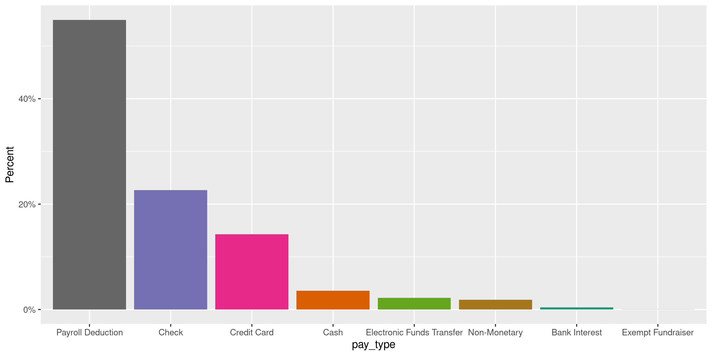
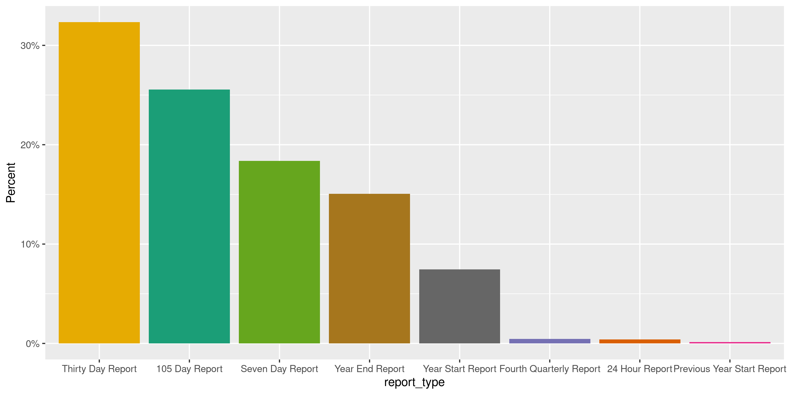
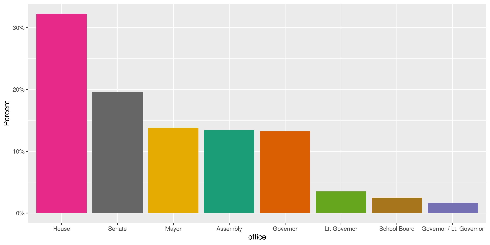
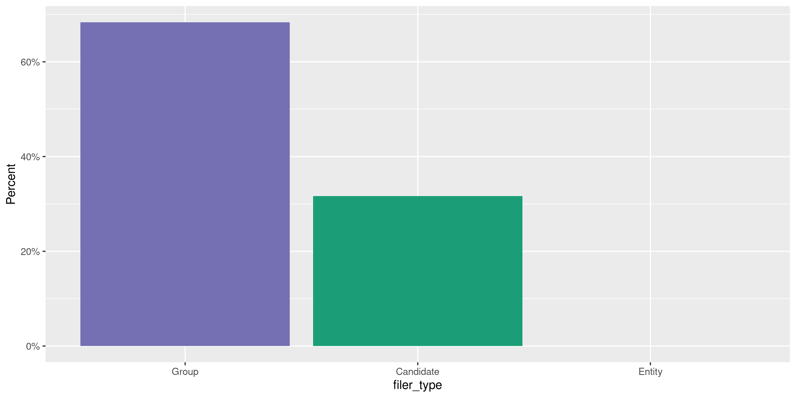

Alaska Contributions
================
Kiernan Nicholls
2020-09-29 13:03:18

  - [Project](#project)
  - [Objectives](#objectives)
  - [Packages](#packages)
  - [Data](#data)
  - [Download](#download)
  - [Read](#read)
  - [Explore](#explore)
  - [Wrangle](#wrangle)
  - [Conclude](#conclude)
  - [Export](#export)
  - [Upload](#upload)

<!-- Place comments regarding knitting here -->

## Project

The Accountability Project is an effort to cut across data silos and
give journalists, policy professionals, activists, and the public at
large a simple way to search across huge volumes of public data about
people and organizations.

Our goal is to standardizing public data on a few key fields by thinking
of each dataset row as a transaction. For each transaction there should
be (at least) 3 variables:

1.  All **parties** to a transaction.
2.  The **date** of the transaction.
3.  The **amount** of money involved.

## Objectives

This document describes the process used to complete the following
objectives:

1.  How many records are in the database?
2.  Check for entirely duplicated records.
3.  Check ranges of continuous variables.
4.  Is there anything blank or missing?
5.  Check for consistency issues.
6.  Create a five-digit ZIP Code called `zip`.
7.  Create a `year` field from the transaction date.
8.  Make sure there is data on both parties to a transaction.

## Packages

The following packages are needed to collect, manipulate, visualize,
analyze, and communicate these results. The `pacman` package will
facilitate their installation and attachment.

The IRW’s `campfin` package will also have to be installed from GitHub.
This package contains functions custom made to help facilitate the
processing of campaign finance data.

``` r
if (!require("pacman")) install.packages("pacman")
pacman::p_load_gh("irworkshop/campfin")
pacman::p_load(
  tidyverse, # data manipulation
  lubridate, # datetime strings
  magrittr, # pipe operators
  janitor, # dataframe clean
  aws.s3, # upload to aws s3
  refinr, # cluster and merge
  scales, # format strings
  knitr, # knit documents
  vroom, # read files fast
  glue, # combine strings
  httr, # http requests
  here, # relative storage
  fs # search storage 
)
```

This document should be run as part of the `R_campfin` project, which
lives as a sub-directory of the more general, language-agnostic
[`irworkshop/accountability_datacleaning`](https://github.com/irworkshop/accountability_datacleaning)
GitHub repository.

The `R_campfin` project uses the [RStudio
projects](https://support.rstudio.com/hc/en-us/articles/200526207-Using-Projects)
feature and should be run as such. The project also uses the dynamic
`here::here()` tool for file paths relative to *your* machine.

``` r
# where does this document knit?
here::here()
#> [1] "/home/kiernan/Code/tap/R_campfin"
```

## Data

Data is obtained from the [Alaska Public Offices Commission
(APOC)](https://aws.state.ak.us/ApocReports/Campaign/#).

## Download

Using the [APOC income
search](https://aws.state.ak.us/ApocReports/CampaignDisclosure/CDIncome.aspx),
we need to search for “All Completed Forms”, “Any Names”, and “Any”
type. Exporting “Any” report year only returns roughly 400,000 results
despite 1,411,206 results being listed in the search. We can export all
of the results if we instead search and export individually by report
year. As of now, this needs to be done by hand.

``` r
line_count <- function(path) {
  as.numeric(str_extract(system(paste("wc -l", path), intern = TRUE), "^\\d+"))
}
```

``` r
raw_dir <- dir_create(here("ak", "contribs", "data", "raw"))
raw_info <- dir_info(raw_dir)
sum(raw_info$size)
#> 362M
raw_info %>% 
  select(path, size, modification_time) %>% 
  rowwise() %>% 
  mutate(lines = line_count(path)) %>% 
  mutate(across(path, basename))
#> # A tibble: 11 x 4
#>    path                            size modification_time    lines
#>    <chr>                    <fs::bytes> <dttm>               <dbl>
#>  1 CD_Transactions_2011.CSV      159.2K 2020-09-28 12:47:28    786
#>  2 CD_Transactions_2012.CSV       41.7M 2020-09-28 12:48:58 173453
#>  3 CD_Transactions_2013.CSV       25.9M 2020-09-28 12:47:58 104586
#>  4 CD_Transactions_2014.CSV       52.1M 2020-09-28 12:47:44 206620
#>  5 CD_Transactions_2015.CSV       46.1M 2020-09-28 12:41:53 180326
#>  6 CD_Transactions_2016.CSV         51M 2020-09-28 12:44:29 194465
#>  7 CD_Transactions_2017.CSV       37.7M 2020-09-28 12:43:47 144581
#>  8 CD_Transactions_2018.CSV       50.7M 2020-09-28 12:45:50 198171
#>  9 CD_Transactions_2019.CSV       33.4M 2020-09-28 12:44:57 125833
#> 10 CD_Transactions_2020.CSV         23M 2020-09-28 12:45:08  84722
#> 11 CD_Transactions_2021.CSV       94.8K 2020-09-28 12:47:54    338
```

``` r
httr::GET(
  # does not work
  url = "https://aws.state.ak.us/ApocReports/CampaignDisclosure/CDIncome.aspx",
  write_disk(raw_path)
  query = list(
    exportAll = "True",
    exportFormat = "CSV",
    isExport = "True"
  ),
)
```

## Read

The exported delimited text files have two aspects we need to adjust
for; 1) There is a column called `--------` that is empty in every file,
and 2) there is an extra comma at the end of each line. We can read this
extra column at the end as a new `null` column.

``` r
ak_names <- make_clean_names(read_names(raw_info$path[1]))
```

All the files can be read into a single data frame using
`vroom::vroom()`.

``` r
# 1,411,206 items
akc <- vroom(
  file = raw_info$path,
  skip = 1,
  delim = ",",
  id = "file",
  num_threads = 1,
  na = c("", "NA", "N/A"),
  escape_double = FALSE,
  escape_backslash = FALSE,
  col_names = c(ak_names, "null"),
  col_types = cols(
    .default = col_character(),
    date = col_date_usa(),
    amount = col_number(),
    report_year = col_integer(),
    submitted = col_date_usa(),
    null = col_logical()
  )
)
```

We successfully read the same number of rows as search results.

``` r
nrow(akc) == 1411206
#> [1] TRUE
```

100% of rows have an “Income” type.

``` r
count(akc, tran_type)
#> # A tibble: 1 x 2
#>   tran_type       n
#>   <chr>       <int>
#> 1 Income    1411206
```

## Explore

There are 1,411,206 rows of 26 columns.

``` r
glimpse(akc)
#> Rows: 1,411,206
#> Columns: 26
#> $ id            <chr> "1", "2", "3", "4", "5", "6", "7", "8", "9", "10", "11", "12", "13", "14",…
#> $ date          <date> 2011-09-23, 2011-09-23, 2011-09-23, 2011-09-23, 2011-09-23, 2011-09-23, 2…
#> $ tran_type     <chr> "Income", "Income", "Income", "Income", "Income", "Income", "Income", "Inc…
#> $ pay_type      <chr> "Payroll Deduction", "Payroll Deduction", "Payroll Deduction", "Payroll De…
#> $ pay_detail    <chr> NA, NA, NA, NA, NA, NA, NA, NA, NA, NA, NA, NA, NA, NA, NA, NA, NA, NA, NA…
#> $ amount        <dbl> 500, 500, 500, 500, 500, 500, 500, 500, 500, 500, 500, 500, 500, 500, 500,…
#> $ last          <chr> "Anderson", "Antonsen", "Backen", "Baken", "Cathcart", "Charles", "Chaudha…
#> $ first         <chr> "David", "Hans", "Terrance", "Jeff", "Jim", "Don", "Norbert", "Michael", "…
#> $ address       <chr> "412 Front St.", "701 Carlanna Lake Rd.", "2417 Tongass Ave. Ste. 111-301"…
#> $ city          <chr> "Ketchikan", "Ketchikan", "Ketchikan", "Ketchikan", "Ketchikan", "Ketchika…
#> $ state         <chr> "Alaska", "Alaska", "Alaska", "Alaska", "Alaska", "Alaska", "Alaska", "Ala…
#> $ zip           <chr> "99901", "99901", "99901", "99901", "99901", "99901", "99901", "99901", "9…
#> $ country       <chr> "USA", "USA", "USA", "USA", "USA", "USA", "USA", "USA", "USA", "USA", "USA…
#> $ occupation    <chr> "Marine Pilot", "Marine Pilot", "Marine Pilot", "Marine Pilot", "Marine Pi…
#> $ employer      <chr> "Self", "Self", "Self", "Self", "Self", "Self", "Self", "Self", "Self", "S…
#> $ purpose       <chr> NA, NA, NA, NA, NA, NA, NA, NA, NA, NA, NA, NA, NA, NA, NA, NA, NA, NA, NA…
#> $ report_type   <chr> "Year End Report", "Year End Report", "Year End Report", "Year End Report"…
#> $ election_name <chr> "-", "-", "-", "-", "-", "-", "-", "-", "-", "-", "-", "-", "-", "-", "-",…
#> $ election_type <chr> NA, NA, NA, NA, NA, NA, NA, NA, NA, NA, NA, NA, NA, NA, NA, NA, NA, NA, NA…
#> $ municipality  <chr> NA, NA, NA, NA, NA, NA, NA, NA, NA, NA, NA, NA, NA, NA, NA, NA, NA, NA, NA…
#> $ office        <chr> NA, NA, NA, NA, NA, NA, NA, NA, NA, NA, NA, NA, NA, NA, NA, NA, NA, NA, NA…
#> $ filer_type    <chr> "Group", "Group", "Group", "Group", "Group", "Group", "Group", "Group", "G…
#> $ filer         <chr> "AK Sea Pilot PAC Fund", "AK Sea Pilot PAC Fund", "AK Sea Pilot PAC Fund",…
#> $ report_year   <int> 2011, 2011, 2011, 2011, 2011, 2011, 2011, 2011, 2011, 2011, 2011, 2011, 20…
#> $ submitted     <date> 2012-01-17, 2012-01-17, 2012-01-17, 2012-01-17, 2012-01-17, 2012-01-17, 2…
#> $ file          <chr> "CD_Transactions_2011.CSV", "CD_Transactions_2011.CSV", "CD_Transactions_2…
head(akc)
#> # A tibble: 6 x 26
#>   id    date       tran_type pay_type pay_detail amount last  first address city  state zip  
#>   <chr> <date>     <chr>     <chr>    <chr>       <dbl> <chr> <chr> <chr>   <chr> <chr> <chr>
#> 1 1     2011-09-23 Income    Payroll… <NA>          500 Ande… David 412 Fr… Ketc… Alas… 99901
#> 2 2     2011-09-23 Income    Payroll… <NA>          500 Anto… Hans  701 Ca… Ketc… Alas… 99901
#> 3 3     2011-09-23 Income    Payroll… <NA>          500 Back… Terr… 2417 T… Ketc… Alas… 99901
#> 4 4     2011-09-23 Income    Payroll… <NA>          500 Baken Jeff  P.O. B… Ketc… Alas… 99901
#> 5 5     2011-09-23 Income    Payroll… <NA>          500 Cath… Jim   2417 T… Ketc… Alas… 99901
#> 6 6     2011-09-23 Income    Payroll… <NA>          500 Char… Don   2417 T… Ketc… Alas… 99901
#> # … with 14 more variables: country <chr>, occupation <chr>, employer <chr>, purpose <chr>,
#> #   report_type <chr>, election_name <chr>, election_type <chr>, municipality <chr>, office <chr>,
#> #   filer_type <chr>, filer <chr>, report_year <int>, submitted <date>, file <chr>
```

### Missing

Columns vary in their degree of missing values.

``` r
col_stats(akc, count_na)
#> # A tibble: 26 x 4
#>    col           class        n         p
#>    <chr>         <chr>    <int>     <dbl>
#>  1 id            <chr>        0 0        
#>  2 date          <date>       0 0        
#>  3 tran_type     <chr>        0 0        
#>  4 pay_type      <chr>        0 0        
#>  5 pay_detail    <chr>   591211 0.419    
#>  6 amount        <dbl>        0 0        
#>  7 last          <chr>       52 0.0000368
#>  8 first         <chr>    61238 0.0434   
#>  9 address       <chr>     5594 0.00396  
#> 10 city          <chr>     5399 0.00383  
#> 11 state         <chr>      146 0.000103 
#> 12 zip           <chr>     5727 0.00406  
#> 13 country       <chr>        0 0        
#> 14 occupation    <chr>   329627 0.234    
#> 15 employer      <chr>   237952 0.169    
#> 16 purpose       <chr>  1226854 0.869    
#> 17 report_type   <chr>    13801 0.00978  
#> 18 election_name <chr>        0 0        
#> 19 election_type <chr>   464684 0.329    
#> 20 municipality  <chr>   947296 0.671    
#> 21 office        <chr>  1013422 0.718    
#> 22 filer_type    <chr>        0 0        
#> 23 filer         <chr>        0 0        
#> 24 report_year   <int>        0 0        
#> 25 submitted     <date>       0 0        
#> 26 file          <chr>        0 0
```

We can flag any rows that are missing a name, date, or amount needed to
identify a transaction.

``` r
key_vars <- c("date", "last", "amount", "filer")
akc <- flag_na(akc, all_of(key_vars))
sum(akc$na_flag)
#> [1] 52
```

All of these missing key values are the `last` name of the contributor.

``` r
akc %>% 
  filter(na_flag) %>% 
  select(all_of(key_vars)) %>% 
  sample_frac()
#> # A tibble: 52 x 4
#>    date       last   amount filer             
#>    <date>     <chr>   <dbl> <chr>             
#>  1 2012-02-08 <NA>  1500    Anchorage Tomorrow
#>  2 2019-11-08 <NA>     8.78 Local367PAC       
#>  3 2012-03-05 <NA>   500    Anchorage Tomorrow
#>  4 2012-03-01 <NA>  2500    Anchorage Tomorrow
#>  5 2019-09-10 <NA>     9.07 Local367PAC       
#>  6 2012-10-15 <NA>   100    Chris Tuck        
#>  7 2015-12-18 <NA>    25    MAT-SU DEMOCRATS  
#>  8 2012-02-15 <NA>   250    Anchorage Tomorrow
#>  9 2012-03-19 <NA>   500    Anchorage Tomorrow
#> 10 2012-02-08 <NA>  1000    Anchorage Tomorrow
#> # … with 42 more rows
```

``` r
akc %>% 
  filter(na_flag) %>% 
  select(all_of(key_vars)) %>% 
  col_stats(count_na)
#> # A tibble: 4 x 4
#>   col    class      n     p
#>   <chr>  <chr>  <int> <dbl>
#> 1 date   <date>     0     0
#> 2 last   <chr>     52     1
#> 3 amount <dbl>      0     0
#> 4 filer  <chr>      0     0
```

### Duplicates

Ignoring the supposedly unique `id` variable, quite a few records are
entirely duplicated. We will not remove these records, as they may very
well be valid repetitions, but we can flag them with a new logical
variable.

``` r
d1 <- duplicated(akc[, -1], fromLast = TRUE)
d2 <- duplicated(akc[, -1], fromLast = FALSE)
akc <- mutate(akc, dupe_flag = (d1 | d2))
percent(mean(akc$dupe_flag), 0.1)
#> [1] "11.5%"
rm(d1, d2); flush_memory()
```

``` r
akc %>% 
  filter(dupe_flag) %>% 
  select(id, all_of(key_vars))
#> # A tibble: 162,812 x 5
#>    id    date       last                       amount filer                               
#>    <chr> <date>     <chr>                       <dbl> <chr>                               
#>  1 43    2011-09-23 Moore                       500   AK Sea Pilot PAC Fund               
#>  2 44    2011-09-23 Moore                       500   AK Sea Pilot PAC Fund               
#>  3 565   2011-11-10 Wisniewski                   20   Alaska Democratic Labor Caucus      
#>  4 566   2011-11-10 Wisniewski                   20   Alaska Democratic Labor Caucus      
#>  5 63    2012-06-01 Walker                       25   Senate Democratic Campaign Committee
#>  6 64    2012-06-01 Walker                       25   Senate Democratic Campaign Committee
#>  7 221   2012-01-12 Hume                        100   Friends of the Interior             
#>  8 299   2012-01-12 Hume                        100   Friends of the Interior             
#>  9 496   2011-01-31 First National Bank Alaska    0.3 ABC Alaska PAC                      
#> 10 497   2011-02-28 First National Bank Alaska    0.3 ABC Alaska PAC                      
#> # … with 162,802 more rows
```

### Categorical

Columns also vary in their degree of distinctiveness. Some character
columns like `first` name are obviously mostly distinct, others like
`office` only have a few unique values, which we can count.

``` r
col_stats(akc, n_distinct)
#> # A tibble: 28 x 4
#>    col           class       n           p
#>    <chr>         <chr>   <int>       <dbl>
#>  1 id            <chr>  206605 0.146      
#>  2 date          <date>   3469 0.00246    
#>  3 tran_type     <chr>       1 0.000000709
#>  4 pay_type      <chr>      10 0.00000709 
#>  5 pay_detail    <chr>   31377 0.0222     
#>  6 amount        <dbl>    9006 0.00638    
#>  7 last          <chr>   50854 0.0360     
#>  8 first         <chr>   23526 0.0167     
#>  9 address       <chr>  122986 0.0871     
#> 10 city          <chr>    5765 0.00409    
#> 11 state         <chr>      87 0.0000616  
#> 12 zip           <chr>   14540 0.0103     
#> 13 country       <chr>      30 0.0000213  
#> 14 occupation    <chr>   27205 0.0193     
#> 15 employer      <chr>   38369 0.0272     
#> 16 purpose       <chr>   10176 0.00721    
#> 17 report_type   <chr>      14 0.00000992 
#> 18 election_name <chr>     128 0.0000907  
#> 19 election_type <chr>      10 0.00000709 
#> 20 municipality  <chr>      30 0.0000213  
#> 21 office        <chr>      12 0.00000850 
#> 22 filer_type    <chr>       3 0.00000213 
#> 23 filer         <chr>    1185 0.000840   
#> 24 report_year   <int>      11 0.00000779 
#> 25 submitted     <date>   1986 0.00141    
#> 26 file          <chr>      11 0.00000779 
#> 27 na_flag       <lgl>       2 0.00000142 
#> 28 dupe_flag     <lgl>       2 0.00000142
```

<!-- --><!-- --><!-- --><!-- --><!-- -->

### Amounts

``` r
noquote(map_chr(summary(akc$amount), dollar))
#>       Min.    1st Qu.     Median       Mean    3rd Qu.       Max. 
#>         $0         $5     $12.85    $189.20       $100 $3,004,994
percent(mean(akc$amount <= 0), 0.01)
#> [1] "0.24%"
```

There are only 9,006 values, which is an order of magnitude less than we
might expect from a distribution of values from a dataset of this size.

In fact, more than half of all `amount` values are $2, $5, $50, $100, or
$500 dollars even.

``` r
akc %>% 
  count(amount, sort = TRUE) %>% 
  add_prop(sum = TRUE)
#> # A tibble: 9,006 x 3
#>    amount      n     p
#>     <dbl>  <int> <dbl>
#>  1      5 263486 0.187
#>  2    100 152499 0.295
#>  3      2 149593 0.401
#>  4     50  82849 0.459
#>  5    500  70916 0.510
#>  6     10  68211 0.558
#>  7    250  46533 0.591
#>  8     25  40367 0.620
#>  9    200  32083 0.642
#> 10     20  29572 0.663
#> # … with 8,996 more rows
```

<!-- -->

### Dates

``` r
akc <- mutate(
  .data = akc,
  date_clean = date %>% 
    # fix bad years with regex
    str_replace("^(210)(?=\\d-)", "201") %>% 
    str_replace("^(202)(?=[13-9])", "201") %>% 
    str_replace("^(29)(?=\\d-)", "20") %>% 
    str_replace("^(291)(?=\\d-)", "201") %>% 
    str_replace("^(301)(?=\\d-)", "201") %>% 
    as_date(),
  year_clean = year(date_clean)
)
```

``` r
min(akc$date_clean)
#> [1] "2006-10-15"
sum(akc$year_clean < 2011)
#> [1] 61
max(akc$date_clean)
#> [1] "2020-12-31"
sum(akc$date_clean > today())
#> [1] 4
```

<!-- -->

## Wrangle

To improve the searchability of the database, we will perform some
consistent, confident string normalization. For geographic variables
like city names and ZIP codes, the corresponding `campfin::normal_*()`
functions are tailor made to facilitate this process.

### Address

For the street `addresss` variable, the `campfin::normal_address()`
function will force consistence case, remove punctuation, and abbreviate
official USPS suffixes.

``` r
akc <- akc %>% 
  mutate(
    address_norm = normal_address(
      address = address,
      abbs = usps_street,
      na_rep = TRUE
    )
  )
```

``` r
akc %>% 
  select(contains("address")) %>% 
  distinct() %>% 
  sample_n(10)
#> # A tibble: 10 x 2
#>    address                address_norm         
#>    <chr>                  <chr>                
#>  1 4420 Woronzof Drive    4420 WORONZOF DR     
#>  2 117 N. Gulkana Wk.     117 N GULKANA WK     
#>  3 P.O. Box 19288         PO BOX 19288         
#>  4 142 Gastineau          142 GASTINEAU        
#>  5 791 Goldstreak Rd      791 GOLDSTREAK RD    
#>  6 2210 Paxson Dr         2210 PAXSON DR       
#>  7 3429 Savannah Ln #2926 3429 SAVANNAH LN 2926
#>  8 13329 E Oceanview Rd   13329 E OCEANVIEW RD 
#>  9 P.O. Box 875485        PO BOX 875485        
#> 10 PO Box 618             PO BOX 618
```

### ZIP

For ZIP codes, the `campfin::normal_zip()` function will attempt to
create valid *five* digit codes by removing the ZIP+4 suffix and
returning leading zeroes dropped by other programs like Microsoft Excel.

``` r
akc <- akc %>% 
  mutate(
    zip_norm = normal_zip(
      zip = zip,
      na_rep = TRUE
    )
  )
```

``` r
progress_table(
  akc$zip,
  akc$zip_norm,
  compare = valid_zip
)
#> # A tibble: 2 x 6
#>   stage    prop_in n_distinct prop_na n_out n_diff
#>   <chr>      <dbl>      <dbl>   <dbl> <dbl>  <dbl>
#> 1 zip        0.963      14540 0.00406 51383   8546
#> 2 zip_norm   0.998       7011 0.00671  2475    431
```

### State

Valid two digit state abbreviations can be made using the
`campfin::normal_state()` function.

``` r
akc <- akc %>% 
  mutate(
    state_norm = normal_state(
      state = state,
      abbreviate = TRUE,
      na_rep = TRUE,
      valid = NULL
    )
  )
```

``` r
akc %>% 
  filter(state != state_norm) %>% 
  count(state, state_norm, sort = TRUE)
#> # A tibble: 71 x 3
#>    state                state_norm       n
#>    <chr>                <chr>        <int>
#>  1 Alaska               AK         1360861
#>  2 Washington           WA            9220
#>  3 California           CA            5731
#>  4 Texas                TX            3469
#>  5 Oregon               OR            3001
#>  6 Arizona              AZ            2206
#>  7 New York             NY            1995
#>  8 Florida              FL            1837
#>  9 Colorado             CO            1616
#> 10 District of Columbia DC            1313
#> # … with 61 more rows
```

``` r
akc %>% 
  filter(state_norm %out% valid_state) %>% 
  count(state, state_norm, sort = TRUE) %>% 
  print(n = Inf)
#> # A tibble: 27 x 3
#>    state                                    state_norm              n
#>    <chr>                                    <chr>               <int>
#>  1 <NA>                                     <NA>                  146
#>  2 Armed Forces - Europe including Canada   AE INCLUDING CANADA    14
#>  3 Alberta                                  ALBERTA                 8
#>  4 British Columbia                         BRITISH COLUMBIA        5
#>  5 Ontario                                  ONTARIO                 5
#>  6 Europe                                   EUROPE                  4
#>  7 CHE                                      CHE                     3
#>  8 DEU                                      DEU                     3
#>  9 Surry Hills                              SURRY HILLS             3
#> 10 Bulgaria                                 BULGARIA                2
#> 11 Gipuzkoa                                 GIPUZKOA                2
#> 12 GR                                       GR                      2
#> 13 NSW                                      NSW                     2
#> 14 philippines                              PHILIPPINES             2
#> 15 Phillipines                              PHILLIPINES             2
#> 16 SW                                       SW                      2
#> 17 0                                        <NA>                    1
#> 18 Armed Forces - Americas excluding Canada AA EXCLUDING CANADA     1
#> 19 Japan                                    JAPAN                   1
#> 20 n/a                                      <NA>                    1
#> 21 new zealand                              NEW ZEALAND             1
#> 22 New Zealand                              NEW ZEALAND             1
#> 23 none                                     NONE                    1
#> 24 NZL                                      NZL                     1
#> 25 Queensland                               QUEENSLAND              1
#> 26 RM                                       RM                      1
#> 27 Swerige                                  SWERIGE                 1
```

``` r
akc <- akc %>% 
  mutate(
    state_norm = state_norm %>% 
      na_in("NONE") %>% 
      str_replace("^ALBERTA$", "AB") %>% 
      str_replace("^BRITISH COLUMBIA$", "BC") %>% 
      str_replace("^NEW ZEALAND$", "NZ") %>% 
      str_replace("^NZL$", "NZ") %>% 
      str_replace("^ONTARIO$", "ON") %>% 
      str_replace("^PHILIPPINES$", "PH") %>% 
      str_replace("^PHILLIPINES$", "PH") %>% 
      str_replace("^SURRY HILLS$", "NSW") %>% 
      str_replace("^EUROPE$", "EU") %>% 
      str_remove("\\s\\w+ CANADA") %>% 
      str_squish()
  )
```

``` r
progress_table(
  akc$state,
  akc$state_norm,
  compare = valid_state
)
#> # A tibble: 2 x 6
#>   stage        prop_in n_distinct  prop_na   n_out n_diff
#>   <chr>          <dbl>      <dbl>    <dbl>   <dbl>  <dbl>
#> 1 state      0.0000135         87 0.000103 1411041     81
#> 2 state_norm 1.00              74 0.000106      52     18
```

### City

Cities are the most difficult geographic variable to normalize, simply
due to the wide variety of valid cities and formats.

#### Normal

The `campfin::normal_city()` function is a good start, again converting
case, removing punctuation, but *expanding* USPS abbreviations. We can
also remove `invalid_city` values.

``` r
akc <- akc %>% 
  mutate(
    city_norm = normal_city(
      city = city, 
      abbs = usps_city,
      states = c("AK", "DC", "ALASKA"),
      na = invalid_city,
      na_rep = TRUE
    )
  )
```

#### Swap

We can further improve normalization by comparing our normalized value
against the *expected* value for that record’s state abbreviation and
ZIP code. If the normalized value is either an abbreviation for or very
similar to the expected value, we can confidently swap those two.

``` r
akc <- akc %>% 
  rename(city_raw = city) %>% 
  left_join(
    y = zipcodes,
    by = c(
      "state_norm" = "state",
      "zip_norm" = "zip"
    )
  ) %>% 
  rename(city_match = city) %>% 
  mutate(
    match_abb = is_abbrev(city_norm, city_match),
    match_dist = str_dist(city_norm, city_match),
    city_swap = if_else(
      condition = !is.na(match_dist) & (match_abb | match_dist == 1),
      true = city_match,
      false = city_norm
    )
  ) %>% 
  select(
    -city_match,
    -match_dist,
    -match_abb
  )
```

#### Refine

The \[OpenRefine\] algorithms can be used to group similar strings and
replace the less common versions with their most common counterpart.
This can greatly reduce inconsistency, but with low confidence; we will
only keep any refined strings that have a valid city/state/zip
combination.

``` r
good_refine <- akc %>% 
  mutate(
    city_refine = city_swap %>% 
      key_collision_merge() %>% 
      n_gram_merge(numgram = 1)
  ) %>% 
  filter(city_refine != city_swap) %>% 
  inner_join(
    y = zipcodes,
    by = c(
      "city_refine" = "city",
      "state_norm" = "state",
      "zip_norm" = "zip"
    )
  )
```

    #> # A tibble: 29 x 5
    #>    state_norm zip_norm city_swap         city_refine      n
    #>    <chr>      <chr>    <chr>             <chr>        <int>
    #>  1 AK         99929    WRANGLER          WRANGELL        22
    #>  2 AK         99577    EAGLE RIVER ER    EAGLE RIVER      8
    #>  3 AK         99676    TALKENNTNA        TALKEETNA        7
    #>  4 AK         99801    JUNUEA            JUNEAU           5
    #>  5 AK         99639    NILICHIK          NINILCHIK        4
    #>  6 NV         89060    PARUMPH           PAHRUMP          4
    #>  7 AK         99676    TALLLKETNA        TALKEETNA        3
    #>  8 AR         72701    FAYETTEVILLEVILLE FAYETTEVILLE     3
    #>  9 TX         76262    RONAOAKE          ROANOKE          3
    #> 10 TX         76262    RONOAKE           ROANOKE          3
    #> # … with 19 more rows

Then we can join the refined values back to the database.

``` r
akc <- akc %>% 
  left_join(good_refine, by = names(.)) %>% 
  mutate(city_refine = coalesce(city_refine, city_swap))
```

#### Progress

| stage        | prop\_in | n\_distinct | prop\_na | n\_out | n\_diff |
| :----------- | -------: | ----------: | -------: | -----: | ------: |
| city\_raw)   |    0.958 |        4826 |    0.004 |  59566 |    1281 |
| city\_norm   |    0.960 |        4640 |    0.005 |  56462 |    1072 |
| city\_swap   |    0.997 |        4070 |    0.005 |   4396 |     455 |
| city\_refine |    0.997 |        4046 |    0.005 |   4308 |     431 |

You can see how the percentage of valid values increased with each
stage.

<!-- -->

More importantly, the number of distinct values decreased each stage. We
were able to confidently change many distinct invalid values to their
valid equivalent.

<!-- -->

## Conclude

``` r
akc <- akc %>% 
  select(
    -city_norm,
    -city_swap,
    city_clean = city_refine
  ) %>% 
  rename_all(~str_replace(., "_norm", "_clean"))
```

``` r
glimpse(sample_n(akc, 20))
#> Rows: 20
#> Columns: 34
#> $ id            <chr> "63667", "10181", "97865", "40625", "74682", "66594", "79634", "141919", "…
#> $ date          <date> 2013-10-28, 2018-03-16, 2013-11-06, 2018-03-04, 2015-07-31, 2018-02-23, 2…
#> $ tran_type     <chr> "Income", "Income", "Income", "Income", "Income", "Income", "Income", "Inc…
#> $ pay_type      <chr> "Payroll Deduction", "Payroll Deduction", "Check", "Electronic Funds Trans…
#> $ pay_detail    <chr> "Payroll Deduction", NA, "3302", NA, "Individual", NA, NA, NA, NA, NA, "Pa…
#> $ amount        <dbl> 5.00, 5.70, 100.00, 5.00, 5.00, 32.00, 26.17, 5.00, 100.00, 19.23, 5.00, 1…
#> $ last          <chr> "FALKNER", "BROWN", "Baker", "Mondrago", "Cano-Smith", "MOWRY", "Gillespie…
#> $ first         <chr> "SUSAN", "JOSHUA", "Larry", "Kate", "Joseph", "JOHN", "Jessie", "Ronald", …
#> $ address       <chr> "PO BOX 210365", "10951 TOTEM ROAD", "3947 Locarno Drive", "PO Box 324", "…
#> $ city_raw      <chr> "AUKE BAY", "ANCHORAGE", "Anchorage", "Kittredge", "Anchorage", "FAIRBANKS…
#> $ state         <chr> "Alaska", "Alaska", "Alaska", "Colorado", "Alaska", "Alaska", "Alaska", "A…
#> $ zip           <chr> "99821", "99516", "99508", "80457", "99501", "99712", "99709", "99501", "9…
#> $ country       <chr> "USA", "USA", "USA", "USA", "USA", "USA", "USA", "USA", "USA", "USA", "USA…
#> $ occupation    <chr> "ACCOUNTING CLERK", "Building Trades Plumber", "Senior Advisor", "Realtor"…
#> $ employer      <chr> "SOA", "Mantech Mechanical", "MOA", "ReMax Alliance", "State of Alaska", "…
#> $ purpose       <chr> NA, NA, NA, NA, "PAC Contribution", "AUCTION DONATION", NA, NA, NA, NA, NA…
#> $ report_type   <chr> "105 Day Report", "Seven Day Report", "Year Start Report", "Thirty Day Rep…
#> $ election_name <chr> "-", "2018 - Anchorage Municipal Election", "2014 - Anchorage Municipal El…
#> $ election_type <chr> NA, "Anchorage Municipal", "Anchorage Municipal", "State Primary", "Anchor…
#> $ municipality  <chr> NA, "Anchorage, City and Borough", "Anchorage, City and Borough", NA, "Anc…
#> $ office        <chr> NA, NA, "Assembly", NA, NA, NA, NA, "House", "Assembly", NA, NA, "Senate",…
#> $ filer_type    <chr> "Group", "Group", "Candidate", "Group", "Group", "Group", "Group", "Candid…
#> $ filer         <chr> "Alaska State Employees Association Local 52 Politcal Action Committee", "…
#> $ report_year   <int> 2013, 2018, 2014, 2018, 2015, 2018, 2018, 2014, 2020, 2018, 2018, 2016, 20…
#> $ submitted     <date> 2014-01-14, 2018-03-26, 2014-03-03, 2018-07-23, 2015-09-29, 2018-10-04, 2…
#> $ file          <chr> "CD_Transactions_2013.CSV", "CD_Transactions_2018.CSV", "CD_Transactions_2…
#> $ na_flag       <lgl> FALSE, FALSE, FALSE, FALSE, FALSE, FALSE, FALSE, FALSE, FALSE, FALSE, FALS…
#> $ dupe_flag     <lgl> FALSE, FALSE, FALSE, FALSE, FALSE, FALSE, FALSE, FALSE, FALSE, FALSE, FALS…
#> $ date_clean    <date> 2013-10-28, 2018-03-16, 2013-11-06, 2018-03-04, 2015-07-31, 2018-02-23, 2…
#> $ year_clean    <dbl> 2013, 2018, 2013, 2018, 2015, 2018, 2018, 2014, 2019, 2018, 2018, 2016, 20…
#> $ address_clean <chr> "PO BOX 210365", "10951 TOTEM RD", "3947 LOCARNO DR", "PO BOX 324", "203 E…
#> $ zip_clean     <chr> "99821", "99516", "99508", "80457", "99501", "99712", "99709", "99501", "9…
#> $ state_clean   <chr> "AK", "AK", "AK", "CO", "AK", "AK", "AK", "AK", "AK", "AK", "AK", "AK", "A…
#> $ city_clean    <chr> "AUKE BAY", "ANCHORAGE", "ANCHORAGE", "KITTREDGE", "ANCHORAGE", "FAIRBANKS…
```

1.  There are 1,411,206 records in the database.
2.  There are 162,812 duplicate records in the database.
3.  The range and distribution of `amount` and `date` seem reasonable.
4.  There are 52 records missing key variables.
5.  Consistency in geographic data has been improved with
    `campfin::normal_*()`.
6.  The 4-digit `year` variable has been created with
    `lubridate::year()`.

## Export

``` r
clean_dir <- dir_create(here("ak", "contribs", "data", "clean"))
clean_path <- path(clean_dir, "ak_contribs_clean.csv")
write_csv(akc, clean_path, na = "")
(clean_size <- file_size(clean_path))
#> 467M
file_encoding(clean_path) %>% 
  mutate(across(path, path.abbrev))
#> # A tibble: 1 x 3
#>   path                                           mime            charset 
#>   <chr>                                          <chr>           <chr>   
#> 1 ~/ak/contribs/data/clean/ak_contribs_clean.csv application/csv us-ascii
```

## Upload

We can use the `aws.s3::put_object()` to upload the text file to the IRW
server.

``` r
s3_path <- path("csv", basename(clean_path))
if (!object_exists(s3_path, "publicaccountability")) {
  put_object(
    file = clean_path,
    object = s3_path, 
    bucket = "publicaccountability",
    acl = "public-read",
    multipart = TRUE,
    show_progress = TRUE
  )
}
```

``` r
r <- head_object(s3_path, "publicaccountability")
(s3_size <- as_fs_bytes(attr(r, "content-length")))
#> 467M
unname(s3_size == clean_size)
#> [1] TRUE
```
