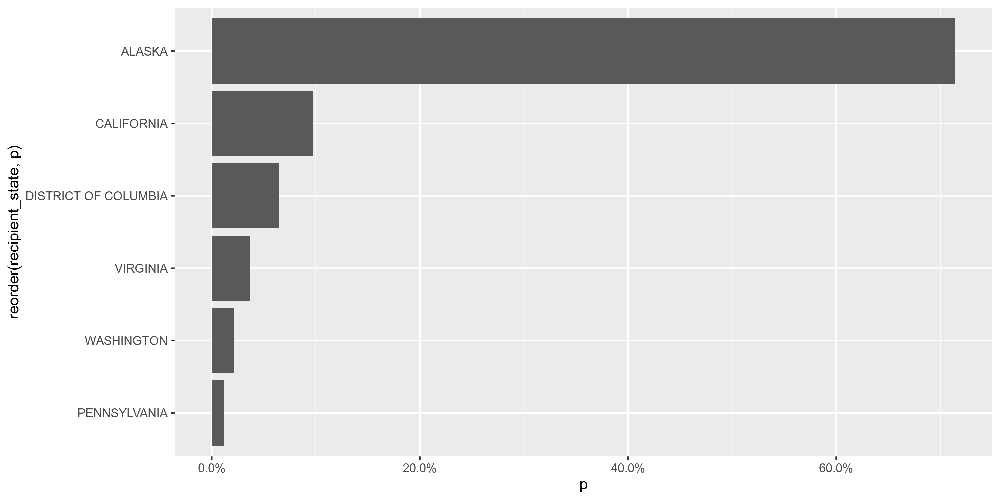
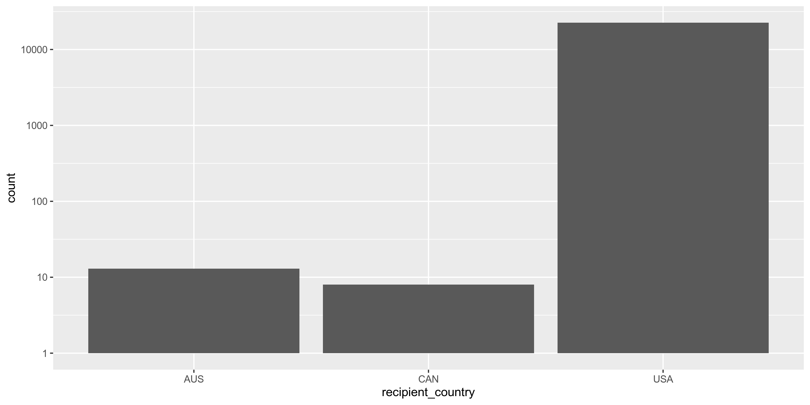
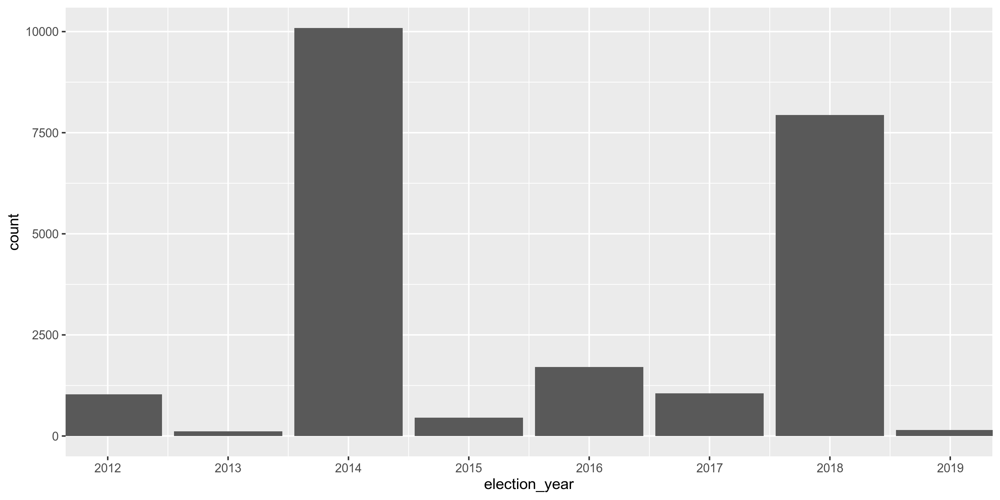
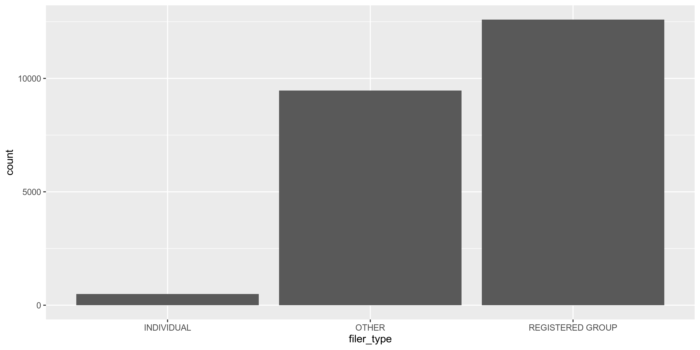

Alaska Expenditures
================
Kiernan Nicholls
2019-07-08 12:56:06

  - [Project](#project)
  - [Objectives](#objectives)
  - [Packages](#packages)
  - [Data](#data)
  - [Import](#import)
  - [Explore](#explore)
  - [Wrangle](#wrangle)
  - [Conclude](#conclude)
  - [Write](#write)

## Project

The Accountability Project is an effort to cut across data silos and
give journalists, policy professionals, activists, and the public at
large a simple way to search across huge volumes of public data about
people and organizations.

Our goal is to standardizing public data on a few key fields by thinking
of each dataset row as a transaction. For each transaction there should
be (at least) 3 variables:

1.  All **parties** to a transaction
2.  The **date** of the transaction
3.  The **amount** of money involved

## Objectives

This document describes the process used to complete the following
objectives:

1.  How many records are in the database?
2.  Check for duplicates
3.  Check ranges
4.  Is there anything blank or missing?
5.  Check for consistency issues
6.  Create a five-digit ZIP Code called `ZIP5`
7.  Create a `YEAR` field from the transaction date
8.  Make sure there is data on both parties to a transaction

## Packages

The following packages are needed to collect, manipulate, visualize,
analyze, and communicate these results. The `pacman` package will
facilitate their installation and attachment.

``` r
# install.packages("pacman")
pacman::p_load(
  stringdist, # levenshtein value
  tidyverse, # data manipulation
  lubridate, # datetime strings
  magrittr, # pipe opperators
  RSelenium, # read soda api
  janitor, # dataframe clean
  zipcode, # clean & database
  explore, # basic exploration
  batman, # parse yes & no
  refinr, # cluster & merge
  vroom,
  rvest, # scrape website
  knitr, # knit documents
  here, # relative storage
  fs # search storage 
)
```

This document should be run as part of the `R_campfin` project, which
lives as a sub-directory of the more general, language-agnostic
[`irworkshop/accountability_datacleaning`](https://github.com/irworkshop/accountability_datacleaning "TAP repo")
GitHub repository.

The `R_campfin` project uses the [RStudio
projects](https://support.rstudio.com/hc/en-us/articles/200526207-Using-Projects "Rproj")
feature and should be run as such. The project also uses the dynamic
`here::here()` tool for file paths relative to *your* machine.

``` r
# where dfs this document knit?
here::here()
#> [1] "/home/kiernan/R/accountability_datacleaning/R_campfin"
```

## Data

Describe *where* the data is coming from. [Link to the data
download](https://example.com "source") page if possible.

Describe the data set that is going to be cleaned. A file name, age, and
unit of observation.

### About

> If the publisher provides any information on the file, you can
> directly quote that here.

### Variables

Often the publisher will provide a dictionary to describe the variables
in the data (and potentially the key pairs between many relational
tables). [Link to the dictionary](https://example.com).

`variable_name`:

> Directly quote the definition given for variables of interest.

## Import

### Download

Download raw, immutable data file.

``` r
raw_dir <- here("ak", "expends", "data", "raw")
dir_create(raw_dir)

file.path(find.package("RSelenium"), "examples/serverUtils")
RSelenium::startServer()

rs_driver <- rsDriver(
  port = 4444L,
  browser = "firefox",
  extraCapabilities = RSelenium::makeFirefoxProfile(
    list(
      "browser.download.dir" = here::here(), # current wd
      "browser.download.folderList" = 2L,
      "browser.helperApps.neverAsk.saveToDisk" = "text/csv"
    )
  )
)

remote_driver <- rs_driver$client
remote_driver$navigate("https://aws.state.ak.us/ApocReports/IndependentExpenditures/IEExpenditures.aspx")

filed_box <- remote_driver$findElement(using = "css", "#M_C_csfFilter_txtBeginDate")
filed_box$sendKeysToElement(list("1/1/2008"))

export_button <- remote_driver$findElement(using = "css", "#M_C_csfFilter_btnExport")
export_button$send

csv_button <- remote_driver$findElement(using = "css", "#M_C_csfFilter_ExportDialog_hlAllCSV")
csv_button$clickElement()

remote_driver$close()
rs_driver$server$stop()
```

### Read

``` r
ak <- 
  read_csv(
    file = "ak/expends/data/raw/IE_Expenditure_07-08-2019.CSV",
    na = c("", "na", "n/a", "NA", "N/A"),
    col_types = cols(
      .default = col_character(),
      Date = col_date("%m/%d/%Y"),
      Amount = col_number(),
      `Election Year` = col_integer(),
      `Report Year` = col_integer(),
      Submitted = col_date("%m/%d/%Y")
    )
  ) %>% 
  clean_names() %>% 
  mutate_if(is.character, str_to_upper)
```

    #> Warning: 22561 parsing failures.
    #> row col   expected     actual                                                file
    #>   1  -- 21 columns 22 columns 'ak/expends/data/raw/IE_Expenditure_07-08-2019.CSV'
    #>   2  -- 21 columns 22 columns 'ak/expends/data/raw/IE_Expenditure_07-08-2019.CSV'
    #>   3  -- 21 columns 22 columns 'ak/expends/data/raw/IE_Expenditure_07-08-2019.CSV'
    #>   4  -- 21 columns 22 columns 'ak/expends/data/raw/IE_Expenditure_07-08-2019.CSV'
    #>   5  -- 21 columns 22 columns 'ak/expends/data/raw/IE_Expenditure_07-08-2019.CSV'
    #> ... ... .......... .......... ...................................................
    #> See problems(...) for more details.

## Explore

There are `nrow(df)` records of `length(df)` variables in the full
database.

``` r
glimpse(sample_frac(ak))
```

    #> Observations: 22,561
    #> Variables: 21
    #> $ result                <chr> "12679", "16556", "20562", "17358", "2332", "14231", "22200", "761…
    #> $ date                  <date> 2014-10-21, 2014-10-03, 2014-08-27, 2014-09-03, 2018-07-12, 2014-…
    #> $ payment_type          <chr> "NON-MONETARY", "CASH", "CASH", "CHECK", "DEBIT CARD", "NON-MONETA…
    #> $ payment_detail        <chr> "NON FEDERAL IN-KIND STAFF", NA, NA, NA, NA, "OBLIGATION INCURRED,…
    #> $ amount                <dbl> 94.54, 279.30, 55.86, 3113.29, 53.65, 1296.35, 837.50, 221.60, 220…
    #> $ recipient             <chr> "AFSCME SPECIAL ACCOUNT", "JOSHUA DUSHEWICH", "STEVEN GEORGE", "MA…
    #> $ recipient_address     <chr> "1625 L STREET, NW", "1106 HADDON AVE APT. B", "420 E 14TH AVE APT…
    #> $ recipient_city        <chr> "WASHINGTON", "COLLINGSWOOD", "ANCHORAGE", "NEWINGTON", "ANCHORAGE…
    #> $ recipient_state       <chr> "DISTRICT OF COLUMBIA", "NEW JERSEY", "ALASKA", "VIRGINIA", "ALASK…
    #> $ recipient_zip         <chr> "20036", "08108", "99501", "22122", "99508", "20013", "99501", "99…
    #> $ recipient_country     <chr> "USA", "USA", "USA", "USA", "USA", "USA", "USA", "USA", "USA", "US…
    #> $ election_year         <int> 2014, 2014, 2014, 2014, 2018, 2014, 2012, 2017, 2018, 2014, 2014, …
    #> $ election_name         <chr> "STATE GENERAL ELECTION", "STATE GENERAL ELECTION", "STATE GENERAL…
    #> $ candidate_proposition <chr> "BALLOT MEASURE", "MUNI PROP 1", "ALASKANS FOR A FAIR MINIMUM WAGE…
    #> $ position              <chr> "SUPPORTS", "OPPOSES", "SUPPORTS", "SUPPORTS", "OPPOSES", "SUPPORT…
    #> $ x                     <chr> NA, NA, NA, NA, NA, NA, NA, NA, NA, NA, NA, NA, NA, NA, NA, NA, NA…
    #> $ report_year           <int> 2014, 2014, 2014, 2014, 2018, 2014, 2012, 2017, 2018, 2014, 2014, …
    #> $ filer_type            <chr> "OTHER", "OTHER", "OTHER", "OTHER", "REGISTERED GROUP", "OTHER", "…
    #> $ filer_name            <chr> "WORKERS' VOICE ALASKA<BR/>MORTON, KIMBERLY Y", "WORKING AMERICA<B…
    #> $ submitted             <date> 2014-10-28, 2014-10-08, 2014-10-02, 2014-09-11, 2018-07-12, 2014-…
    #> $ status                <chr> "FILED", "FILED", "FILED", "FILED", "FILED", "FILED", "FILED", "FI…

### Distinct

The variables range in their degree of distinctness.

``` r
ak %>% 
  map(n_distinct) %>% 
  unlist() %>% 
  enframe(name = "variable", value = "n_distinct") %>%
  mutate(prop_distinct = round(n_distinct / nrow(ak), 4)) %>%
  print(n = length(ak))
```

    #> # A tibble: 21 x 3
    #>    variable              n_distinct prop_distinct
    #>    <chr>                      <int>         <dbl>
    #>  1 result                     22561        1     
    #>  2 date                        1389        0.0616
    #>  3 payment_type                  10        0.0004
    #>  4 payment_detail              1701        0.0754
    #>  5 amount                      5928        0.263 
    #>  6 recipient                   2268        0.100 
    #>  7 recipient_address           3038        0.135 
    #>  8 recipient_city               340        0.0151
    #>  9 recipient_state               44        0.002 
    #> 10 recipient_zip                477        0.0211
    #> 11 recipient_country              3        0.0001
    #> 12 election_year                 10        0.0004
    #> 13 election_name                 47        0.0021
    #> 14 candidate_proposition        759        0.0336
    #> 15 position                       2        0.0001
    #> 16 x                              1        0     
    #> 17 report_year                    9        0.0004
    #> 18 filer_type                     3        0.0001
    #> 19 filer_name                   456        0.0202
    #> 20 submitted                   1053        0.0467
    #> 21 status                         1        0

<!-- -->

<!-- -->

<!-- -->

<!-- -->

<!-- -->

### Missing

There are relatively few variables with much missing information, aside
from `payment_detail`.

``` r
ak %>% 
  map(function(var) sum(is.na(var))) %>% 
  unlist() %>% 
  enframe(name = "variable", value = "n_na") %>% 
  mutate(prop_na = n_na / nrow(ak)) %>% 
  print(n = length(ak))
```

    #> # A tibble: 21 x 3
    #>    variable               n_na  prop_na
    #>    <chr>                 <int>    <dbl>
    #>  1 result                    0 0       
    #>  2 date                      0 0       
    #>  3 payment_type           2104 0.0933  
    #>  4 payment_detail        13464 0.597   
    #>  5 amount                    0 0       
    #>  6 recipient                 3 0.000133
    #>  7 recipient_address        18 0.000798
    #>  8 recipient_city           23 0.00102 
    #>  9 recipient_state          13 0.000576
    #> 10 recipient_zip            30 0.00133 
    #> 11 recipient_country         0 0       
    #> 12 election_year             0 0       
    #> 13 election_name             0 0       
    #> 14 candidate_proposition     0 0       
    #> 15 position                  0 0       
    #> 16 x                     22561 1       
    #> 17 report_year               0 0       
    #> 18 filer_type                0 0       
    #> 19 filer_name                0 0       
    #> 20 submitted                 0 0       
    #> 21 status                    0 0

We will flag any records missing key values used to identify an
expenditure.

``` r
ak <- ak %>% mutate(na_flag = is.na(recipient))
```

### Duplicates

There are no duplicate rows.

``` r
ak_dupes <- get_dupes(ak)
nrow(ak_dupes)
#> [1] 0
rm(ak_dupes)
```

### Ranges

Explore the continuous variables with `ggplot2::geom_histogram()` and
`base::summary()`

#### Amounts

There are `sum(ak$amount == 0)` recods with an `amount` value of zero.

Below is a `glimpse()` at the smallest and largest `amount` records.

``` r
glimpse(ak %>% filter(amount == min(amount)))
```

    #> Observations: 107
    #> Variables: 22
    #> $ result                <chr> "3752", "7723", "9296", "9551", "9552", "9553", "9554", "9555", "9…
    #> $ date                  <date> 2018-07-02, 2017-05-05, 2016-07-06, 2016-11-06, 2016-11-06, 2016-…
    #> $ payment_type          <chr> "NON-MONETARY", "NON-MONETARY", NA, "NON-MONETARY", "NON-MONETARY"…
    #> $ payment_detail        <chr> "BOILERPLATE CONTRIBUTION REQUEST FORM", "FACEBOOK PAGE", NA, "ONL…
    #> $ amount                <dbl> 0, 0, 0, 0, 0, 0, 0, 0, 0, 0, 0, 0, 0, 0, 0, 0, 0, 0, 0, 0, 0, 0, …
    #> $ recipient             <chr> "JUSTIN MATHESON", "ERIN HOLLOWELL", "BAILEY STUART", "FACEBOOK", …
    #> $ recipient_address     <chr> "PO BOX 230434", "38859 FRITZ CREEK VALLEY RD", "5301 W HOLLYWOOD …
    #> $ recipient_city        <chr> "ANCHORAGE", "HOMER", "WASILLA", "MENLO PARK", "MENLO PARK", "MENL…
    #> $ recipient_state       <chr> "ALASKA", "ALASKA", "ALASKA", "CALIFORNIA", "CALIFORNIA", "CALIFOR…
    #> $ recipient_zip         <chr> "99523", "99603", "99623", "94205", "94205", "94205", "94205", "94…
    #> $ recipient_country     <chr> "USA", "USA", "USA", "USA", "USA", "USA", "USA", "USA", "USA", "US…
    #> $ election_year         <int> 2018, 2017, 2016, 2016, 2016, 2016, 2016, 2016, 2016, 2016, 2016, …
    #> $ election_name         <chr> "STATE PRIMARY ELECTION", "HOMER, CITY OF SPECIAL", "MATANUSKA-SUS…
    #> $ candidate_proposition <chr> "2018 - MICHAEL J. DUNLEAVY", "CITY COUNCIL RECALL", "B1", "2016 -…
    #> $ position              <chr> "OPPOSES", "OPPOSES", "OPPOSES", "SUPPORTS", "SUPPORTS", "OPPOSES"…
    #> $ x                     <chr> NA, NA, NA, NA, NA, NA, NA, NA, NA, NA, NA, NA, NA, NA, NA, NA, NA…
    #> $ report_year           <int> 2018, 2017, 2016, 2016, 2016, 2016, 2016, 2016, 2016, 2016, 2016, …
    #> $ filer_type            <chr> "REGISTERED GROUP", "REGISTERED GROUP", "OTHER", "REGISTERED GROUP…
    #> $ filer_name            <chr> "2018 - ALASKANS AGAINST DUNLEAVY", "2017 - HOMER CITIZENS AGAINST…
    #> $ submitted             <date> 2018-07-10, 2017-05-15, 2016-07-29, 2016-11-16, 2016-11-16, 2016-…
    #> $ status                <chr> "FILED", "FILED", "FILED", "FILED", "FILED", "FILED", "FILED", "FI…
    #> $ na_flag               <lgl> FALSE, FALSE, FALSE, FALSE, FALSE, FALSE, FALSE, FALSE, FALSE, FAL…

``` r
glimpse(ak %>% filter(amount == max(amount)))
```

    #> Observations: 1
    #> Variables: 22
    #> $ result                <chr> "1414"
    #> $ date                  <date> 2018-08-22
    #> $ payment_type          <chr> "CHECK"
    #> $ payment_detail        <chr> "261"
    #> $ amount                <dbl> 1363326
    #> $ recipient             <chr> "BRIGHT STRATEGY AND COMMUNICATIONS"
    #> $ recipient_address     <chr> "900 W. 5TH AVENUE #100"
    #> $ recipient_city        <chr> "ANCHORAGE"
    #> $ recipient_state       <chr> "ALASKA"
    #> $ recipient_zip         <chr> "99501"
    #> $ recipient_country     <chr> "USA"
    #> $ election_year         <int> 2018
    #> $ election_name         <chr> "STATE GENERAL ELECTION"
    #> $ candidate_proposition <chr> "ONE"
    #> $ position              <chr> "OPPOSES"
    #> $ x                     <chr> NA
    #> $ report_year           <int> 2018
    #> $ filer_type            <chr> "REGISTERED GROUP"
    #> $ filer_name            <chr> "2018 - STAND FOR ALASKA--VOTE NO ON ONE"
    #> $ submitted             <date> 2018-09-01
    #> $ status                <chr> "FILED"
    #> $ na_flag               <lgl> FALSE

### Dates

``` r
max(ak$date, na.rm = TRUE)
#> [1] "2048-11-30"
sum(ak$date > today(), na.rm = T)
#> [1] 1
ak <- ak %>% mutate(date_flag = date > today())
```

``` r
min(ak$date, na.rm = TRUE)
#> [1] "2011-03-27"
sum(year(ak$date) < 2010, na.rm = T)
#> [1] 0
```

## Wrangle

### Year

Add a `year` variable from `date` using `lubridate::year()` after
parsing the variable with `readr::col_date()`.

``` r
ak <- ak %>% mutate(year = year(date))
```

### Address

The `address` variable should be minimally cleaned by removing
punctuation and fixing white-space.

``` r
ak <- ak %>% mutate(address_clean = normalize_address(recipient_address))
```

### Zipcode

``` r
ak <- ak %>% mutate(zip_clean = normalize_zip(recipient_zip, na_rep = TRUE))
mean(ak$zip_clean %in% zipcode$zip)
#> [1] 0.9877665
ak$zip_clean[ak$zip_clean %out% zipcode$zip]
#>   [1] "48256" NA      NA      NA      "98618" "98618" "98618" "98618" "98618" "98618" "98618"
#>  [12] "98618" "98618" "88108" "88108" "88108" "88108" "88108" "88108" "88108" "88108" "88108"
#>  [23] "88108" "88108" "88108" "88108" "88108" "88108" "88108" "88108" "88108" "88108" "88108"
#>  [34] "88108" "88108" "88108" "88108" "88108" "88108" "88108" "88108" "88108" "88108" "88108"
#>  [45] "88108" "88108" "09953" "09953" "09953" "09951" "09951" "02000" "02000" "02000" "02000"
#>  [56] "02000" "09951" "09951" "09918" "09918" "99051" "99051" NA      NA      NA      NA     
#>  [67] NA      NA      "99601" "09983" "09983" "09983" "04000" "04000" "04000" "09963" "09963"
#>  [78] "09953" "09953" "09953" NA      NA      NA      NA      NA      NA      NA      NA     
#>  [89] NA      NA      NA      NA      "99617" "02000" "02000" "09970" "91515" NA      "09953"
#> [100] "09953" "42094" "02000" "02000" "02000" NA      NA      NA      NA      NA      NA     
#> [111] NA      NA      NA      "09901" NA      "99951" NA      NA      NA      NA      NA     
#> [122] NA      NA      NA      NA      NA      NA      NA      NA      NA      NA      NA     
#> [133] NA      NA      NA      NA      NA      "09453" "09453" NA      NA      NA      NA     
#> [144] NA      NA      NA      NA      NA      NA      NA      NA      NA      NA      NA     
#> [155] NA      NA      NA      NA      NA      NA      NA      NA      NA      NA      NA     
#> [166] NA      NA      NA      NA      NA      "32019" "32019" "32019" "09953" "09953" "09953"
#> [177] "09953" "00532" "19413" "19413" "19413" NA      NA      "03384" "03384" "03384" "03384"
#> [188] "03384" "11305" "72695" "99717" NA      NA      "01250" NA      NA      NA      NA     
#> [199] NA      NA      NA      NA      "02007" "02007" "02007" "02007" "02007" "02007" "02007"
#> [210] "32866" "32866" "32866" "32866" "32866" NA      "05586" "05586" "05586" NA      NA     
#> [221] NA      NA      NA      NA      NA      NA      NA      NA      NA      NA      "96131"
#> [232] NA      NA      "09518" "00528" "00528" "00528" "00528" "00528" "00528" NA      "07362"
#> [243] NA      NA      NA      NA      NA      NA      NA      NA      NA      NA      NA     
#> [254] NA      NA      NA      "00319" NA      NA      NA      NA      NA      NA      NA     
#> [265] NA      NA      NA      NA      NA      NA      NA      NA      NA      NA      "09970"
#> [276] "99601"
```

``` r
ak %>% 
  filter(zip_clean %out% zipcode$zip) %>% 
  select(starts_with("recipient")) %>% 
  distinct()
```

    #> # A tibble: 99 x 6
    #>    recipient      recipient_address   recipient_city recipient_state recipient_zip recipient_count…
    #>    <chr>          <chr>               <chr>          <chr>           <chr>         <chr>           
    #>  1 HARLAND CLARK… 15955 LACANTERRA P… SAN ANTONIO    TEXAS           48256         USA             
    #>  2 -              -                   -              ALASKA          -             USA             
    #>  3 AKISMET.COM    WWW.AKISMET.COM     <NA>           ALASKA          <NA>          USA             
    #>  4 ALASKA AIR CA… 19300 INTERNATIONA… SEATTLE        WASHINGTON      98618         USA             
    #>  5 ALASKA AIRLIN… ALASKA AIRLINES     SEATTLE        WASHINGTON      98618         USA             
    #>  6 ALASKA AIRLIN… 19300 INTERNATIONA… SEATTLE        WASHINGTON      98618         USA             
    #>  7 AMAZON         P.O. BOX 81226      SEATTLE        WASHINGTON      88108         USA             
    #>  8 AMAZON.COM     P.O. BOX 81226      SEATTLE        WASHINGTON      88108         USA             
    #>  9 BLAINE'S ART   1025 PHOTO AVE      ANCHORAGE      ALASKA          9953          USA             
    #> 10 BLUEPRINT ALA… 600 BARROW ST #400  ANCHORAGE      ALASKA          9951          USA             
    #> # … with 89 more rows

### State

The database uses full state names instead of the 2 character
abbreviations typically used. We can convert between them.

``` r
sample(ak$recipient_state, 10)
```

    #>  [1] "ALASKA"     "CALIFORNIA" "VIRGINIA"   "ALASKA"     "ALASKA"     "ALASKA"     "ALASKA"    
    #>  [8] "ALASKA"     "NEW JERSEY" "ALASKA"

``` r
states <- tibble(
  name = str_to_upper(c(state.name, "District of Columbia", "NSW", "Ontario", "British Columbia")),
  abb = c(state.abb, "DC", "NW", "ON", "BC")
)
```

``` r
ak$state_clean <- ak$recipient_state
for (i in seq_along(states$name)) {
  ak$state_clean <- str_replace(
    string = ak$state_clean,
    pattern = states$name[i],
    replacement = states$abb[i] 
  )
}
mean(na.omit(ak$state_clean) %in% states$abb)
#> [1] 1
```

### City

Cleaning city values is the most complicated. This process involves four
steps:

1.  Prepare raw city values by removing invalid data and reducing
    inconsistencies
2.  Match prepared city values with the *actual* city name of that
    record’s ZIP code
3.  swap prepared city values with the ZIP code match *if* only 1 edit
    is needed
4.  Refine swapped city values with key collision and n-gram
    fingerprints

<!-- end list -->

``` r
n_distinct(ak$recipient_city)
```

    #> [1] 340

``` r
valid_city <- unique(zipcode$city)
mean(ak$recipient_city %in% valid_city)
```

    #> [1] 0.9718984

#### Prep

``` r
ak <- ak %>% mutate(city_prep = normalize_city(recipient_city))
n_distinct(ak$city_prep)
#> [1] 327
mean(ak$city_prep %in% valid_city)
#> [1] 0.9723417
```

#### Swap

``` r
ak$city_match <- NULL
ak <- ak %>%
  left_join(
    zipcode,
    by = c(
      "zip_clean" = "zip",
      "state_clean" = "state"
    )
  ) %>%
  rename(city_match = city) %>%
  mutate(
    match_dist = stringdist(city_match, city_prep),
    city_swap = if_else(match_dist == 1, city_match, city_prep)
  )

summary(ak$match_dist)
#>    Min. 1st Qu.  Median    Mean 3rd Qu.    Max.    NA's 
#>  0.0000  0.0000  0.0000  0.2389  0.0000 49.0000     565
n_distinct(ak$city_swap)
#> [1] 240
mean(ak$city_swap %in% valid_city)
#> [1] 0.9606844
```

Each step of the cleaning process reduces the number of distinct city
values.

## Conclude

1.  There are 22561 records in the database
2.  There are 0 records with duplicate rows
3.  The ranges for dates and amounts are reasonable
4.  Consistency in strings has been fixed with the custom
    `normalize_*()` functions
5.  The five-digit `zip_clean` variable has been created
6.  The `expenditure_year` variable has been created with
    `lubridate::year()`
7.  There are 3 records with missing `recipient` values flagged with
    `na_flag`

## Write

``` r
dir_create("ak/expends/data/processed")
ak %>% 
  select(
   -recipient_address,
   -recipient_zip,
   -recipient_state,
   -recipient_city,
   -city_prep,
   -city_match,
   -match_dist
  ) %>% 
  write_csv(
    path = "ak/expends/data/processed/ak_expends_clean.csv",
    na = ""
  )
```
