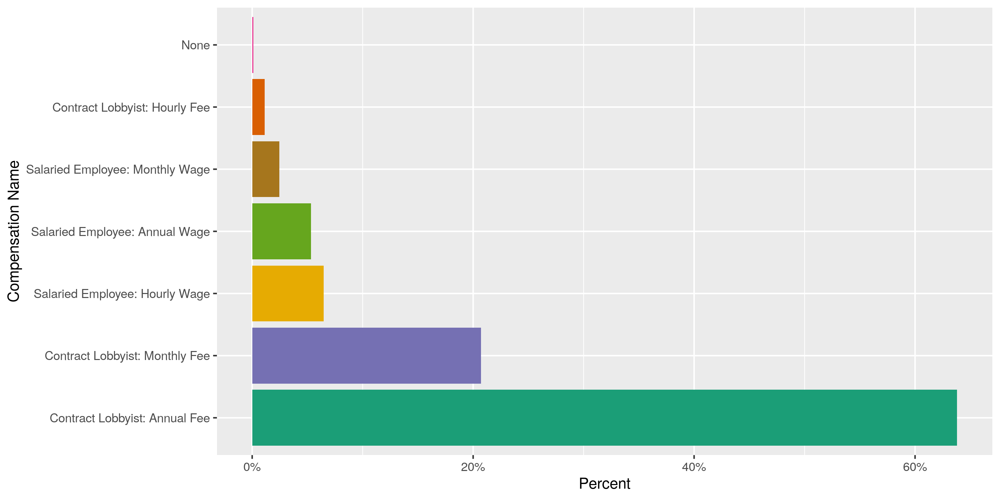
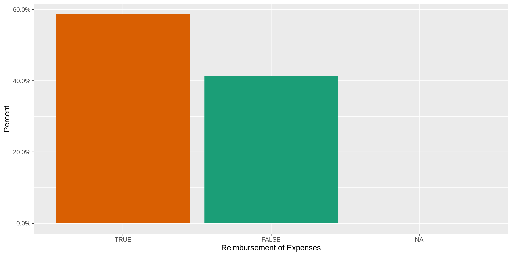
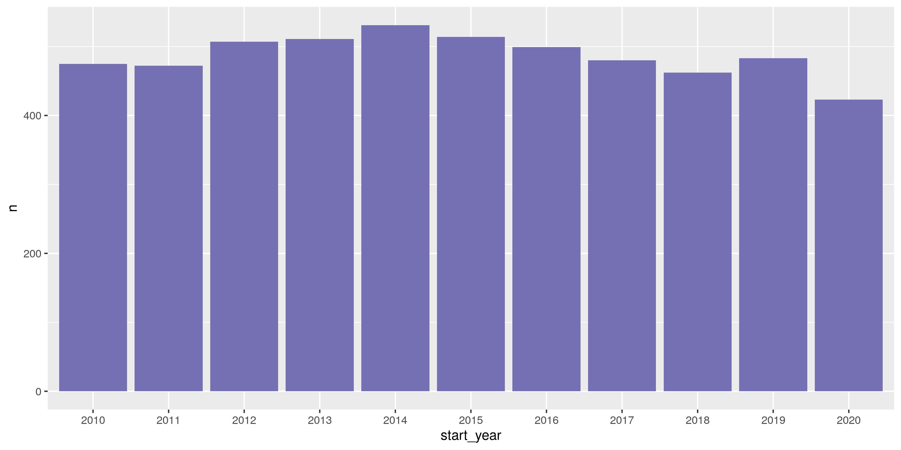

Alaksa Lobbyists
================
Kiernan Nicholls
2020-04-06 12:00:03

  - [Project](#project)
  - [Objectives](#objectives)
  - [Packages](#packages)
  - [Data](#data)
  - [Import](#import)
  - [Explore](#explore)
      - [Missing](#missing)
      - [Duplicate](#duplicate)
      - [Categorical](#categorical)
      - [Continuous](#continuous)
      - [Amounts](#amounts)
      - [Dates](#dates)
  - [Wrangle](#wrangle)
      - [Address](#address)
      - [ZIP](#zip)
      - [State](#state)
      - [City](#city)
  - [Export](#export)

<!-- Place comments regarding knitting here -->

## Project

The Accountability Project is an effort to cut across data silos and
give journalists, policy professionals, activists, and the public at
large a simple way to search across huge volumes of public data about
people and organizations.

Our goal is to standardizing public data on a few key fields by thinking
of each dataset row as a transaction. For each transaction there should
be (at least) 3 variables:

1.  All **parties** to a transaction
2.  The **date** of the transaction
3.  The **amount** of money involved

## Objectives

This document describes the process used to complete the following
objectives:

1.  How many records are in the database?
2.  Check for duplicates
3.  Check ranges
4.  Is there anything blank or missing?
5.  Check for consistency issues
6.  Create a five-digit ZIP Code called `ZIP5`
7.  Create a `YEAR` field from the transaction date
8.  Make sure there is data on both parties to a transaction

## Packages

The following packages are needed to collect, manipulate, visualize,
analyze, and communicate these results. The `pacman` package will
facilitate their installation and attachment.

The IRW’s `campfin` package will also have to be installed from GitHub.
This package contains functions custom made to help facilitate the
processing of campaign finance data.

``` r
if (!require("pacman")) install.packages("pacman")
pacman::p_load_gh("irworkshop/campfin")
pacman::p_load(
  tidyverse, # data manipulation
  lubridate, # datetime strings
  magrittr, # pipe opperators
  janitor, # dataframe clean
  refinr, # cluster and merge
  scales, # format strings
  knitr, # knit documents
  vroom, # read files fast
  glue, # combine strings
  here, # relative storage
  httr, # http queries
  fs # search storage 
)
```

This document should be run as part of the `R_campfin` project, which
lives as a sub-directory of the more general, language-agnostic
[`irworkshop/accountability_datacleaning`](https://github.com/irworkshop/accountability_datacleaning "TAP repo")
GitHub repository.

The `R_campfin` project uses the [RStudio
projects](https://support.rstudio.com/hc/en-us/articles/200526207-Using-Projects "Rproj")
feature and should be run as such. The project also uses the dynamic
`here::here()` tool for file paths relative to *your* machine.

``` r
# where does this document knit?
here::here()
#> [1] "/home/kiernan/Code/accountability_datacleaning/R_campfin"
```

## Data

Data is obtained from the [Alaska Public Offices
Commission](http://doa.alaska.gov/apoc/home.html) (APOC).

> #### Mission
> 
> To encourage the public’s confidence in their elected and appointed
> officials by administering Alaska’s disclosure statutes and publishing
> financial information regarding the activities of election campaigns,
> public officials, lobbyists and lobbyist employers.

On the APOC home page, we can see that lobbying disclosure data can be
searched.

> #### [Lobbying Disclosure](https://aws.state.ak.us/ApocReports/Lobbying/)
> 
> Search reports from Lobbyists and Employers of Lobbyists.

## Import

From the APOC website, we can query the database for any year and
download the data locally.

``` r
raw_dir <- here("ak", "lobby", "data", "raw")
dir_create(raw_dir)
```

We could also attemp this with `httr::GET()` (but not now).

``` r
response <- GET(
  url = "https://aws.state.ak.us/ApocReports/Lobbying/LORForms.aspx", 
  query = list(
    exportAll = "True", 
    exportFormat = "CSV", 
    isExport = "True"
  )
)
aklr <- content(response)
```

``` r
raw_file <- dir_ls(raw_dir)
length(raw_file) == 1
#> [1] TRUE
```

The raw file can be read using `vroom::vroom()`.

``` r
aklr <- vroom(
  file = raw_file,
  delim = ",",
  escape_backslash = FALSE,
  escape_double = FALSE,
  guess_max = 0,
  num_threads = 1,
  .name_repair = make_clean_names,
  col_types = cols(
    .default = col_character(),
    Result = col_double(),
    `Report Year` = col_integer(),
    Submitted = col_date_usa(),
    `Other Services Performed` = col_logical(),
    `Administrative Lobbying` = col_logical(),
    `Legislative Lobbying` = col_logical(),
    `Start Date` = col_date_usa(),
    `Compensation Amount` = col_double(),
    `Reimbursement Of Expenses` = col_logical(),
    `Other Compensation` = col_logical(),
    `Not Qualified As Lobbyist` = col_logical(),
    `Date Qualified As Lobbyist` = col_date_usa()
  )
)
```

We know the file properly read as the number of rows is equal to the
number of distinct `report` values, a unique row number variable.

``` r
n_distinct(aklr$result) == nrow(aklr)
#> [1] TRUE
```

``` r
aklr <- aklr %>% 
  clean_names("snake") %>% 
  remove_empty("cols") %>% 
  remove_empty("rows") %>%
  filter(!is.na(result))
```

``` r
n_distinct(aklr$result) == nrow(aklr)
#> [1] TRUE
```

## Explore

``` r
head(aklr)
#> # A tibble: 6 x 50
#>   result report_year submitted  status amending first_name last_name middle_name address city 
#>    <dbl>       <int> <date>     <chr>  <chr>    <chr>      <chr>     <chr>       <chr>   <chr>
#> 1      1        2020 2020-01-31 Misfi… <NA>     Nils       Andreass… <NA>        One Se… June…
#> 2      2        2020 2020-01-24 Filed  <NA>     Nils       Andreass… D           One Se… June…
#> 3      3        2020 2020-01-06 Filed  <NA>     Frank      Bickford  <NA>        PO Box… Anch…
#> 4      4        2020 2020-01-02 Filed  <NA>     Frank      Bickford  <NA>        PO Box… Anch…
#> 5      5        2020 2020-01-02 Filed  <NA>     Frank      Bickford  <NA>        PO Box… Anch…
#> 6      6        2020 2020-01-08 Filed  (Amende… Frank      Bickford  <NA>        PO Box… Anch…
#> # … with 40 more variables: state_region <chr>, zip <chr>, country <chr>, email <chr>,
#> #   phone <chr>, fax <chr>, legislative_address <chr>, legislative_city <chr>,
#> #   legislative_state_region <chr>, legislative_zip <chr>, legislative_country <chr>,
#> #   legislative_email <chr>, legislative_phone <chr>, legislative_fax <chr>, business_name <chr>,
#> #   voter_district_name <chr>, employer_name <chr>, employer_contact_first_name <chr>,
#> #   employer_contact_last_name <chr>, employer_contact_middle_name <chr>,
#> #   employer_contact_address <chr>, employer_contact_city <chr>,
#> #   employer_contact_state_region <chr>, employer_contact_zip <chr>,
#> #   employer_contact_country <chr>, employer_contact_email <chr>, employer_contact_phone <chr>,
#> #   employer_contact_fax <chr>, other_services_performed <lgl>,
#> #   other_services_performed_description <chr>, administrative_lobbying <lgl>,
#> #   legislative_lobbying <lgl>, start_date <date>, compensation_name <chr>,
#> #   compensation_amount <dbl>, reimbursement_of_expenses <lgl>, other_compensation <lgl>,
#> #   other_compensation_description <chr>, lobbying_interests_description <chr>,
#> #   not_qualified_as_lobbyist <lgl>
tail(aklr)
#> # A tibble: 6 x 50
#>   result report_year submitted  status amending first_name last_name middle_name address city 
#>    <dbl>       <int> <date>     <chr>  <chr>    <chr>      <chr>     <chr>       <chr>   <chr>
#> 1   5352        2010 2010-02-17 Filed  <NA>     John       Walsh     <NA>        POB 24… Doug…
#> 2   5353        2010 2010-03-09 Filed  <NA>     John       Walsh     <NA>        POB 24… Doug…
#> 3   5354        2010 2010-01-26 Filed  <NA>     Kathie     Wasserman <NA>        217 Se… June…
#> 4   5355        2010 2010-01-14 Filed  <NA>     royce      weller    <NA>        p.o. b… doug…
#> 5   5356        2010 2010-02-23 Filed  <NA>     Monte      Williams  <NA>        4020 G… Fort…
#> 6   5357        2010 2010-01-04 Filed  <NA>     Sheldon    Winters   <NA>        3000 V… June…
#> # … with 40 more variables: state_region <chr>, zip <chr>, country <chr>, email <chr>,
#> #   phone <chr>, fax <chr>, legislative_address <chr>, legislative_city <chr>,
#> #   legislative_state_region <chr>, legislative_zip <chr>, legislative_country <chr>,
#> #   legislative_email <chr>, legislative_phone <chr>, legislative_fax <chr>, business_name <chr>,
#> #   voter_district_name <chr>, employer_name <chr>, employer_contact_first_name <chr>,
#> #   employer_contact_last_name <chr>, employer_contact_middle_name <chr>,
#> #   employer_contact_address <chr>, employer_contact_city <chr>,
#> #   employer_contact_state_region <chr>, employer_contact_zip <chr>,
#> #   employer_contact_country <chr>, employer_contact_email <chr>, employer_contact_phone <chr>,
#> #   employer_contact_fax <chr>, other_services_performed <lgl>,
#> #   other_services_performed_description <chr>, administrative_lobbying <lgl>,
#> #   legislative_lobbying <lgl>, start_date <date>, compensation_name <chr>,
#> #   compensation_amount <dbl>, reimbursement_of_expenses <lgl>, other_compensation <lgl>,
#> #   other_compensation_description <chr>, lobbying_interests_description <chr>,
#> #   not_qualified_as_lobbyist <lgl>
glimpse(sample_frac(aklr))
#> Rows: 5,357
#> Columns: 50
#> $ result                               <dbl> 4930, 3947, 2745, 2255, 4985, 1833, 3797, 5342, 152…
#> $ report_year                          <int> 2010, 2012, 2015, 2016, 2010, 2017, 2013, 2010, 201…
#> $ submitted                            <date> 2010-01-21, 2012-01-04, 2015-01-12, 2016-04-01, 20…
#> $ status                               <chr> "Filed", "Filed", "Filed", "Filed", "Filed", "Filed…
#> $ amending                             <chr> NA, NA, NA, NA, NA, NA, NA, NA, NA, NA, NA, NA, NA,…
#> $ first_name                           <chr> "Patrick", "Patricia", "Paul", "Ashley", "Dennis", …
#> $ last_name                            <chr> "Carter", "Bielawski", "Quesnel", "Reed", "DeWitt",…
#> $ middle_name                          <chr> NA, NA, "Alexander", NA, NA, NA, NA, NA, "J", "Anne…
#> $ address                              <chr> "PO Box 90973", "Jade North, LLC", "PO Box 196612",…
#> $ city                                 <chr> "Anchorage", "Anchorage", "Anchorage", "Anchorage",…
#> $ state_region                         <chr> "Alaska", "Alaska", "Alaska", "Alaska", "Alaska", "…
#> $ zip                                  <chr> "99509", "99501", "99519-6612", "99501", "99803", "…
#> $ country                              <chr> "United States", "United States", "United States", …
#> $ email                                <chr> "carterco@mtaonline.net", "pattyb@jadenorth.com", "…
#> $ phone                                <chr> NA, "9072505504", "907 564 5585  907 242 9896", "90…
#> $ fax                                  <chr> NA, NA, NA, NA, NA, NA, NA, "9075238140", NA, NA, N…
#> $ legislative_address                  <chr> "PO Box 90973", "Jade North, LLC", "PO Box 196612",…
#> $ legislative_city                     <chr> "Anchorage", "Anchorage", "Anchorage", "Anchorage",…
#> $ legislative_state_region             <chr> "Alaska", "Alaska", "Alaska", "Alaska", "Alaska", "…
#> $ legislative_zip                      <chr> "99509", "99501", "99519-6612", "99501", "99803", "…
#> $ legislative_country                  <chr> "United States", "United States", "United States", …
#> $ legislative_email                    <chr> "carterco@mtaonline.net", "pattyb@jadenorth.com", "…
#> $ legislative_phone                    <chr> NA, "9072505504", "907 564 5585  907 242 9896", NA,…
#> $ legislative_fax                      <chr> NA, NA, NA, NA, NA, NA, NA, "9075238140", NA, NA, N…
#> $ business_name                        <chr> "The Carter Company", "Jade North, LLC", "Oil & gas…
#> $ voter_district_name                  <chr> "30O - Kenai / Soldotna", "26M - Huffman", "18I - S…
#> $ employer_name                        <chr> "PFIZER INC.", "TransCanada PipeLines Ltd.", "BP Ex…
#> $ employer_contact_first_name          <chr> "JENNIE", "Tony", "Phil", "Deb", "wendy", "Mark", "…
#> $ employer_contact_last_name           <chr> "UNGER EDDY", "Palmer", "Cochrane", "Cummins", "cha…
#> $ employer_contact_middle_name         <chr> NA, NA, NA, NA, NA, NA, NA, NA, NA, NA, NA, NA, NA,…
#> $ employer_contact_address             <chr> "C/O NIELSEN MERKSAMER ET AL, 2350 Kerner Blvd., St…
#> $ employer_contact_city                <chr> "San Rafael", "Calgary", "Anchorage", "Lakewood", "…
#> $ employer_contact_state_region        <chr> "California", "Alaska", "Alaska", "Washington", "Al…
#> $ employer_contact_zip                 <chr> "94901", "T2P 5H1", "99508", "98499", "99801", "996…
#> $ employer_contact_country             <chr> "United States", "Canada", "United States", "United…
#> $ employer_contact_email               <chr> "jeddy@nmgovlaw.com", "tony_palmer@transcanada.com"…
#> $ employer_contact_phone               <chr> "415-389-6800", "4039202035", "9075645465", "253-27…
#> $ employer_contact_fax                 <chr> "415-388-6874", NA, NA, NA, NA, NA, "907-565-6198",…
#> $ other_services_performed             <lgl> FALSE, FALSE, FALSE, TRUE, FALSE, TRUE, FALSE, FALS…
#> $ other_services_performed_description <chr> "Consulting on any and all matters relating to the …
#> $ administrative_lobbying              <lgl> TRUE, FALSE, TRUE, TRUE, TRUE, TRUE, TRUE, TRUE, TR…
#> $ legislative_lobbying                 <lgl> TRUE, TRUE, TRUE, TRUE, TRUE, TRUE, TRUE, TRUE, TRU…
#> $ start_date                           <date> 2010-01-19, 2012-01-17, 2015-01-12, 2016-04-01, 20…
#> $ compensation_name                    <chr> "Contract Lobbyist: Annual Fee", "Contract Lobbyist…
#> $ compensation_amount                  <dbl> 20000.00, 5000.00, 130.00, 6250.00, 4000.00, 22000.…
#> $ reimbursement_of_expenses            <lgl> TRUE, TRUE, TRUE, FALSE, TRUE, TRUE, FALSE, TRUE, F…
#> $ other_compensation                   <lgl> FALSE, TRUE, TRUE, FALSE, FALSE, TRUE, FALSE, FALSE…
#> $ other_compensation_description       <chr> NA, "Fee prorated from mthly retainer", "Stock Opti…
#> $ lobbying_interests_description       <chr> "Any and all aspects relating to the pharmaceutical…
#> $ not_qualified_as_lobbyist            <lgl> NA, FALSE, NA, NA, NA, NA, NA, NA, NA, NA, NA, NA, …
```

### Missing

*Very* few records are missing some of the variables we need to identify
a lobbyist.

``` r
col_stats(aklr, count_na)
#> # A tibble: 50 x 4
#>    col                                  class      n        p
#>    <chr>                                <chr>  <int>    <dbl>
#>  1 result                               <dbl>      0 0       
#>  2 report_year                          <int>      0 0       
#>  3 submitted                            <date>     0 0       
#>  4 status                               <chr>      0 0       
#>  5 amending                             <chr>   4833 0.902   
#>  6 first_name                           <chr>      0 0       
#>  7 last_name                            <chr>      0 0       
#>  8 middle_name                          <chr>   3670 0.685   
#>  9 address                              <chr>      0 0       
#> 10 city                                 <chr>      0 0       
#> 11 state_region                         <chr>     45 0.00840 
#> 12 zip                                  <chr>      0 0       
#> 13 country                              <chr>      0 0       
#> 14 email                                <chr>      0 0       
#> 15 phone                                <chr>    322 0.0601  
#> 16 fax                                  <chr>   3839 0.717   
#> 17 legislative_address                  <chr>      0 0       
#> 18 legislative_city                     <chr>      0 0       
#> 19 legislative_state_region             <chr>     47 0.00877 
#> 20 legislative_zip                      <chr>      0 0       
#> 21 legislative_country                  <chr>      0 0       
#> 22 legislative_email                    <chr>      0 0       
#> 23 legislative_phone                    <chr>    809 0.151   
#> 24 legislative_fax                      <chr>   3885 0.725   
#> 25 business_name                        <chr>    309 0.0577  
#> 26 voter_district_name                  <chr>      0 0       
#> 27 employer_name                        <chr>      0 0       
#> 28 employer_contact_first_name          <chr>      0 0       
#> 29 employer_contact_last_name           <chr>      1 0.000187
#> 30 employer_contact_middle_name         <chr>   5195 0.970   
#> 31 employer_contact_address             <chr>      0 0       
#> 32 employer_contact_city                <chr>      0 0       
#> 33 employer_contact_state_region        <chr>     79 0.0147  
#> 34 employer_contact_zip                 <chr>      0 0       
#> 35 employer_contact_country             <chr>      0 0       
#> 36 employer_contact_email               <chr>      2 0.000373
#> 37 employer_contact_phone               <chr>      0 0       
#> 38 employer_contact_fax                 <chr>   4058 0.758   
#> 39 other_services_performed             <lgl>      0 0       
#> 40 other_services_performed_description <chr>   3693 0.689   
#> 41 administrative_lobbying              <lgl>      1 0.000187
#> 42 legislative_lobbying                 <lgl>      0 0       
#> 43 start_date                           <date>     0 0       
#> 44 compensation_name                    <chr>     16 0.00299 
#> 45 compensation_amount                  <dbl>      0 0       
#> 46 reimbursement_of_expenses            <lgl>      0 0       
#> 47 other_compensation                   <lgl>      0 0       
#> 48 other_compensation_description       <chr>   5109 0.954   
#> 49 lobbying_interests_description       <chr>      1 0.000187
#> 50 not_qualified_as_lobbyist            <lgl>   4744 0.886
```

We can flag those rows with `campfin::na_flag()`.

``` r
aklr <- aklr %>% 
  flag_na(last_name, address, employer_contact_last_name, start_date)
sum(aklr$na_flag)
#> [1] 1
```

### Duplicate

There are no duplicate records that need to be flagged.

``` r
aklr <- flag_dupes(aklr, -result)
#> Warning in flag_dupes(aklr, -result): no duplicate rows, column not created
```

### Categorical

``` r
col_stats(aklr, n_distinct)
#> # A tibble: 51 x 4
#>    col                                  class      n        p
#>    <chr>                                <chr>  <int>    <dbl>
#>  1 result                               <dbl>   5357 1       
#>  2 report_year                          <int>     11 0.00205 
#>  3 submitted                            <date>  1071 0.200   
#>  4 status                               <chr>      2 0.000373
#>  5 amending                             <chr>      4 0.000747
#>  6 first_name                           <chr>    244 0.0455  
#>  7 last_name                            <chr>    301 0.0562  
#>  8 middle_name                          <chr>     75 0.0140  
#>  9 address                              <chr>    411 0.0767  
#> 10 city                                 <chr>     85 0.0159  
#> 11 state_region                         <chr>     19 0.00355 
#> 12 zip                                  <chr>    118 0.0220  
#> 13 country                              <chr>      2 0.000373
#> 14 email                                <chr>    363 0.0678  
#> 15 phone                                <chr>    424 0.0791  
#> 16 fax                                  <chr>    138 0.0258  
#> 17 legislative_address                  <chr>    432 0.0806  
#> 18 legislative_city                     <chr>     82 0.0153  
#> 19 legislative_state_region             <chr>     18 0.00336 
#> 20 legislative_zip                      <chr>    118 0.0220  
#> 21 legislative_country                  <chr>      2 0.000373
#> 22 legislative_email                    <chr>    373 0.0696  
#> 23 legislative_phone                    <chr>    402 0.0750  
#> 24 legislative_fax                      <chr>    135 0.0252  
#> 25 business_name                        <chr>    254 0.0474  
#> 26 voter_district_name                  <chr>     40 0.00747 
#> 27 employer_name                        <chr>    872 0.163   
#> 28 employer_contact_first_name          <chr>    821 0.153   
#> 29 employer_contact_last_name           <chr>   1360 0.254   
#> 30 employer_contact_middle_name         <chr>     59 0.0110  
#> 31 employer_contact_address             <chr>   1297 0.242   
#> 32 employer_contact_city                <chr>    251 0.0469  
#> 33 employer_contact_state_region        <chr>     43 0.00803 
#> 34 employer_contact_zip                 <chr>    403 0.0752  
#> 35 employer_contact_country             <chr>      3 0.000560
#> 36 employer_contact_email               <chr>   1498 0.280   
#> 37 employer_contact_phone               <chr>   1279 0.239   
#> 38 employer_contact_fax                 <chr>    334 0.0623  
#> 39 other_services_performed             <lgl>      2 0.000373
#> 40 other_services_performed_description <chr>    678 0.127   
#> 41 administrative_lobbying              <lgl>      3 0.000560
#> 42 legislative_lobbying                 <lgl>      2 0.000373
#> 43 start_date                           <date>   780 0.146   
#> 44 compensation_name                    <chr>      8 0.00149 
#> 45 compensation_amount                  <dbl>    646 0.121   
#> 46 reimbursement_of_expenses            <lgl>      2 0.000373
#> 47 other_compensation                   <lgl>      2 0.000373
#> 48 other_compensation_description       <chr>    133 0.0248  
#> 49 lobbying_interests_description       <chr>   4004 0.747   
#> 50 not_qualified_as_lobbyist            <lgl>      3 0.000560
#> 51 na_flag                              <lgl>      2 0.000373
```

<!-- -->

<!-- -->

### Continuous

### Amounts

<!-- -->

### Dates

``` r
aklr <- mutate(aklr, start_year = year(start_date))
```

``` r
min(aklr$start_date, na.rm = TRUE)
#> [1] "2010-01-01"
max(aklr$start_date, na.rm = TRUE)
#> [1] "2020-04-07"
```

<!-- -->

## Wrangle

### Address

``` r
aklr <- aklr %>% 
  mutate_at(
    .vars = vars(ends_with("address")),
    .funs = list(norm = normal_address),
    abbs = usps_street,
    na_rep = TRUE
  )
```

### ZIP

``` r
aklr <- aklr %>% 
  mutate_at(
    .vars = vars(ends_with("zip")),
    .funs = list(norm = normal_zip),
    na_rep = TRUE
  )
```

``` r
progress_table(
  aklr$zip,
  aklr$zip_norm,
  compare = valid_zip
)
#> # A tibble: 2 x 6
#>   stage    prop_in n_distinct prop_na n_out n_diff
#>   <chr>      <dbl>      <dbl>   <dbl> <dbl>  <dbl>
#> 1 zip        0.990        118       0    52     11
#> 2 zip_norm   0.999        110       0     8      2
progress_table(
  aklr$employer_contact_zip,
  aklr$employer_contact_zip_norm,
  compare = valid_zip
)
#> # A tibble: 2 x 6
#>   stage                     prop_in n_distinct prop_na n_out n_diff
#>   <chr>                       <dbl>      <dbl>   <dbl> <dbl>  <dbl>
#> 1 employer_contact_zip        0.919        403       0   434     75
#> 2 employer_contact_zip_norm   0.989        357       0    60      6
```

### State

``` r
aklr <- aklr %>% 
  mutate_at(
    .vars = vars(ends_with("state_region")),
    .funs = list(norm = normal_state),
    abbreviate = TRUE,
    na_rep = TRUE,
    valid = NULL
  )
```

``` r
progress_table(
  aklr$state_region,
  aklr$state_region_norm,
  compare = valid_state
)
#> # A tibble: 2 x 6
#>   stage             prop_in n_distinct prop_na n_out n_diff
#>   <chr>               <dbl>      <dbl>   <dbl> <dbl>  <dbl>
#> 1 state_region         0            19 0.00840  5312     19
#> 2 state_region_norm    1.00         19 0.00840     1      2
progress_table(
  aklr$employer_contact_state_region,
  aklr$employer_contact_state_region_norm,
  compare = valid_state
)
#> # A tibble: 2 x 6
#>   stage                              prop_in n_distinct prop_na n_out n_diff
#>   <chr>                                <dbl>      <dbl>   <dbl> <dbl>  <dbl>
#> 1 employer_contact_state_region        0             43  0.0147  5278     43
#> 2 employer_contact_state_region_norm   0.996         43  0.0147    22      5
```

``` r
count(aklr, state_region, state_region_norm, sort = TRUE)
#> # A tibble: 19 x 3
#>    state_region         state_region_norm     n
#>    <chr>                <chr>             <int>
#>  1 Alaska               AK                 5025
#>  2 Oregon               OR                   79
#>  3 Washington           WA                   74
#>  4 California           CA                   47
#>  5 <NA>                 <NA>                 45
#>  6 District of Columbia DC                   30
#>  7 Colorado             CO                   15
#>  8 Texas                TX                   14
#>  9 Utah                 UT                    6
#> 10 Arizona              AZ                    5
#> 11 Florida              FL                    4
#> 12 Montana              MT                    3
#> 13 New York             NY                    2
#> 14 Tennessee            TN                    2
#> 15 Virginia             VA                    2
#> 16 Alberta              ALBERTA               1
#> 17 Idaho                ID                    1
#> 18 Illinois             IL                    1
#> 19 Massachusetts        MA                    1
```

``` r
aklr <- mutate(
  .data = aklr,
  state_region_norm = state_region_norm %>% 
    str_replace("^ALBERTA$", "AB")
)
```

### City

``` r
aklr <- aklr %>% 
  mutate_at(
    .vars = vars(ends_with("city")),
    .funs = list(norm = normal_city),
    abbs = usps_city,
    states = c("AK", "DC", "ALASKA"),
    na = invalid_city,
    na_rep = TRUE
  )
```

``` r
aklr <- aklr %>%
  rename(city_raw = city) %>% 
  left_join(
    y = zipcodes,
    by = c(
      "state_region_norm" = "state",
      "zip_norm" = "zip"
    )
  ) %>% 
  rename(city_match = city) %>% 
  mutate(
    match_abb = is_abbrev(city_norm, city_match),
    match_dist = str_dist(city_norm, city_match),
    city_swap = if_else(
      condition = !is.na(city_match) & (match_abb | match_dist == 1),
      true = city_match, 
      false = city_norm
    )
  ) %>% 
  select(
    -city_match,
    -match_abb,
    -match_dist
  )
```

``` r
progress_table(
  str_to_upper(aklr$city_raw),
  aklr$city_norm,
  aklr$city_swap,
  compare = c(valid_city, extra_city)
)
#> # A tibble: 3 x 6
#>   stage     prop_in n_distinct prop_na n_out n_diff
#>   <chr>       <dbl>      <dbl>   <dbl> <dbl>  <dbl>
#> 1 city_raw)   0.995         75       0    25      4
#> 2 city_norm   0.997         74       0    17      3
#> 3 city_swap   0.998         74       0     9      2
```

``` r
aklr <- aklr %>%
  left_join(
    y = zipcodes,
    by = c(
      "employer_contact_state_region_norm" = "state",
      "employer_contact_zip_norm" = "zip"
    )
  ) %>% 
  rename(employer_city_match = city) %>% 
  mutate(
    match_abb = is_abbrev(
      abb = employer_contact_city_norm, 
      full = employer_city_match
    ),
    match_dist = str_dist(
      a = employer_contact_city_norm, 
      b = employer_city_match
    ),
    employer_contact_city_swap = if_else(
      condition = !is.na(employer_city_match) & (match_abb | match_dist == 1),
      true = employer_city_match, 
      false = employer_contact_city_norm
    )
  ) %>% 
  select(
    -employer_city_match,
    -match_abb,
    -match_dist
  )
```

``` r
progress_table(
  str_to_upper(aklr$employer_contact_city),
  aklr$employer_contact_city_norm,
  aklr$employer_contact_city_swap,
  compare = c(valid_city, extra_city)
)
#> # A tibble: 3 x 6
#>   stage                      prop_in n_distinct prop_na n_out n_diff
#>   <chr>                        <dbl>      <dbl>   <dbl> <dbl>  <dbl>
#> 1 employer_contact_city)       0.983        233       0    90     23
#> 2 employer_contact_city_norm   0.988        229       0    64     18
#> 3 employer_contact_city_swap   0.993        221       0    35      8
```

## Export

``` r
clean_dir <- dir_create(here("ak", "lobby", "data", "clean"))
```

``` r
aklr %>% 
  select(
    -ends_with("city_norm"),
    -contains("match")
  ) %>% 
  write_csv(
    path = path(clean_dir, "ak_lobbyists_clean.csv"),
    na = ""
  )
```
