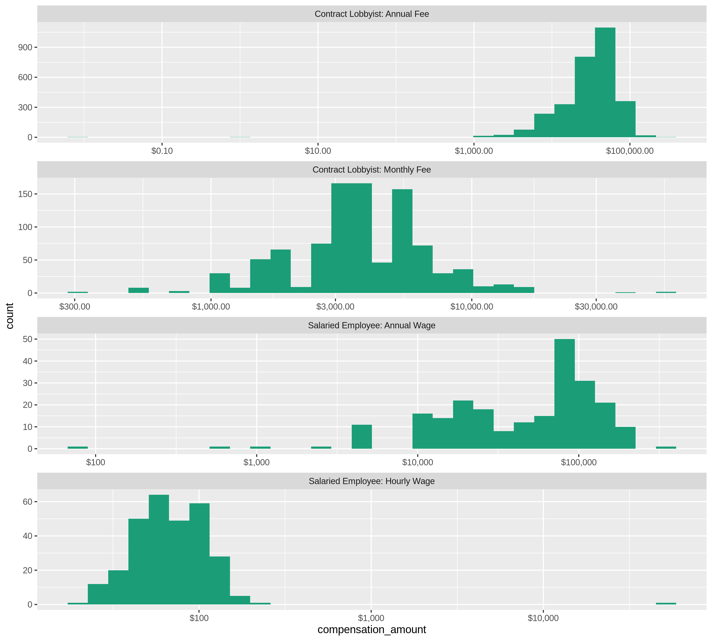
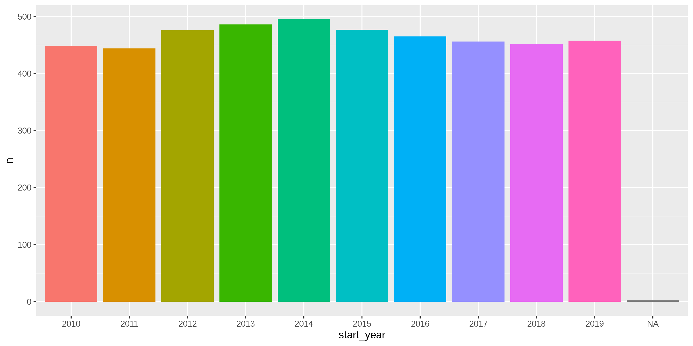

Alaksa Lobbyists
================
Kiernan Nicholls
2019-10-22 12:44:58

<!-- Place comments regarding knitting here -->

## Project

The Accountability Project is an effort to cut across data silos and
give journalists, policy professionals, activists, and the public at
large a simple way to search across huge volumes of public data about
people and organizations.

Our goal is to standardizing public data on a few key fields by thinking
of each dataset row as a transaction. For each transaction there should
be (at least) 3 variables:

1.  All **parties** to a transaction
2.  The **date** of the transaction
3.  The **amount** of money involved

## Objectives

This document describes the process used to complete the following
objectives:

1.  How many records are in the database?
2.  Check for duplicates
3.  Check ranges
4.  Is there anything blank or missing?
5.  Check for consistency issues
6.  Create a five-digit ZIP Code called `ZIP5`
7.  Create a `YEAR` field from the transaction date
8.  Make sure there is data on both parties to a transaction

## Packages

The following packages are needed to collect, manipulate, visualize,
analyze, and communicate these results. The `pacman` package will
facilitate their installation and attachment.

The IRW’s `campfin` package will also have to be installed from GitHub.
This package contains functions custom made to help facilitate the
processing of campaign finance data.

``` r
if (!require("pacman")) install.packages("pacman")
pacman::p_load_gh("irworkshop/campfin")
pacman::p_load(
  tidyverse, # data manipulation
  lubridate, # datetime strings
  magrittr, # pipe opperators
  janitor, # dataframe clean
  refinr, # cluster and merge
  scales, # format strings
  knitr, # knit documents
  vroom, # read files fast
  glue, # combine strings
  here, # relative storage
  httr, # http queries
  fs # search storage 
)
```

This document should be run as part of the `R_campfin` project, which
lives as a sub-directory of the more general, language-agnostic
[`irworkshop/accountability_datacleaning`](https://github.com/irworkshop/accountability_datacleaning "TAP repo")
GitHub repository.

The `R_campfin` project uses the [RStudio
projects](https://support.rstudio.com/hc/en-us/articles/200526207-Using-Projects "Rproj")
feature and should be run as such. The project also uses the dynamic
`here::here()` tool for file paths relative to *your* machine.

``` r
# where does this document knit?
here::here()
#> [1] "/home/kiernan/R/accountability_datacleaning/R_campfin"
```

## Data

Data is obtained from the [Alaska Public Offices
Commission](http://doa.alaska.gov/apoc/home.html) (APOC).

> #### Mission
> 
> To encourage the public’s confidence in their elected and appointed
> officials by administering Alaska’s disclosure statutes and publishing
> financial information regarding the activities of election campaigns,
> public officials, lobbyists and lobbyist employers.

On the APOC home page, we can see that lobbying disclosure data can be
searched.

> #### [Lobbying Disclosure](https://aws.state.ak.us/ApocReports/Lobbying/)
> 
> Search reports from Lobbyists and Employers of Lobbyists.

## Import

From the APOC website, we can query the database for any year and
download the data locally.

``` r
raw_dir <- here("ak", "lobbying", "reg", "data", "raw")
dir_create(raw_dir)
```

We could also attemp this with `httr::GET()` (but not now).

``` r
response <- GET(
  url = "https://aws.state.ak.us/ApocReports/Lobbying/LORForms.aspx", 
  query = list(
    exportAll = "True", 
    exportFormat = "CSV", 
    isExport = "True"
  )
)

aklr <- content(response)
```

``` r
raw_file <- dir_ls(raw_dir)
length(raw_file) == 1
#> [1] TRUE
```

The raw file can be read using `vroom::vroom()`.

``` r
aklr <- read_delim(
  file = raw_file,
  delim = ",",
  escape_backslash = FALSE,
  escape_double = FALSE,
  col_types = cols(
    .default = col_character(),
    Result = col_double(),
    `Report Year` = col_integer(),
    `Other Services Performed` = col_logical(),
    `Administrative Lobbying` = col_logical(),
    `Legislative Lobbying` = col_logical(),
    `Start Date` = col_date_usa(),
    `Compensation Amount` = col_double(),
    `Reimbursement Of Expenses` = col_logical(),
    `Other Compensation` = col_logical(),
    `Not Qualified As Lobbyist` = col_logical(),
    `Date Qualified As Lobbyist` = col_date_usa()
  )
)
```

We know the file was not properly read as the number of rows is not
equal to the number of distinct `report` values, a unique row number
variable.

``` r
n_distinct(aklr$Result) == nrow(aklr)
#> [1] FALSE
```

Using `readr::problems()`, we do see that, aside from the trailing
column, there are a couple dozen parsing problems. These typically
cascade from an incorrect number of delimeter or escape characters.

``` r
problems(aklr) %>% 
  filter(expected != "51 columns") %>% 
  group_by(row) %>% 
  select(-file)
#> # A tibble: 26 x 4
#>      row col                  expected        actual                                               
#>    <int> <chr>                <chr>           <chr>                                                
#>  1   467 Not Qualified As Lo… 1/0/T/F/TRUE/F… " John Middleton Co."                                
#>  2   467 Date Qualified As L… date like %m/%… " U.S. Smokelss Tobacco Co."                         
#>  3   555 Result               a double        "\",,,\r\n555,2018,1/8/2018,Filed,,John,Drescher,,\"…
#>  4   555 Report Year          an integer      " 28 Liberty Ship Way"                               
#>  5   555 Other Services Perf… 1/0/T/F/TRUE/F… 92.0000                                              
#>  6   555 Start Date           date like %m/%… Computer Utilization; Education                      
#>  7   730 Result               a double        "HB357\""                                            
#>  8   730 Report Year          an integer      True                                                 
#>  9   920 Not Qualified As Lo… 1/0/T/F/TRUE/F… " John Middleton Co."                                
#> 10   920 Date Qualified As L… date like %m/%… " U.S. Smokelss Tobacco Co."                         
#> # … with 16 more rows
```

For now, we can repair the data frame using the `janitor` package and by
filtering out those few incorrectly parsed rows.

``` r
aklr <- aklr %>% 
  clean_names("snake") %>% 
  remove_empty("cols") %>% 
  remove_empty("rows") %>%
  filter(!is.na(result))
```

``` r
n_distinct(aklr$result) == nrow(aklr)
#> [1] TRUE
```

## Explore

``` r
head(aklr)
#> # A tibble: 6 x 51
#>   result report_year submitted status amending first_name last_name middle_name address city 
#>    <dbl>       <int> <chr>     <chr>  <chr>    <chr>      <chr>     <chr>       <chr>   <chr>
#> 1      1        2019 2/5/2019  Filed  <NA>     Linda      Anderson  C           3165 R… Fair…
#> 2      2        2019 3/18/2019 Filed  <NA>     Nils       Andreass… D           One Se… June…
#> 3      3        2019 1/3/2019  Filed  <NA>     Frank      Bickford  <NA>        PO Box… "Anc…
#> 4      4        2019 1/2/2019  Filed  <NA>     Frank      Bickford  <NA>        PO Box… "Anc…
#> 5      5        2019 1/3/2019  Filed  <NA>     Frank      Bickford  <NA>        PO Box… "Anc…
#> 6      6        2019 1/4/2019  Filed  <NA>     Frank      Bickford  <NA>        PO Box… "Anc…
#> # … with 41 more variables: state_region <chr>, zip <chr>, country <chr>, email <chr>,
#> #   phone <chr>, fax <chr>, legislative_address <chr>, legislative_city <chr>,
#> #   legislative_state_region <chr>, legislative_zip <chr>, legislative_country <chr>,
#> #   legislative_email <chr>, legislative_phone <chr>, legislative_fax <chr>, business_name <chr>,
#> #   voter_district_name <chr>, employer_name <chr>, employer_contact_first_name <chr>,
#> #   employer_contact_last_name <chr>, employer_contact_middle_name <chr>,
#> #   employer_contact_address <chr>, employer_contact_city <chr>,
#> #   employer_contact_state_region <chr>, employer_contact_zip <chr>,
#> #   employer_contact_country <chr>, employer_contact_email <chr>, employer_contact_phone <chr>,
#> #   employer_contact_fax <chr>, other_services_performed <lgl>,
#> #   other_services_performed_description <chr>, administrative_lobbying <lgl>,
#> #   legislative_lobbying <lgl>, start_date <date>, compensation_name <chr>,
#> #   compensation_amount <dbl>, reimbursement_of_expenses <lgl>, other_compensation <lgl>,
#> #   other_compensation_description <chr>, lobbying_interests_description <chr>,
#> #   not_qualified_as_lobbyist <lgl>, date_qualified_as_lobbyist <date>
tail(aklr)
#> # A tibble: 6 x 51
#>   result report_year submitted status amending first_name last_name middle_name address city 
#>    <dbl>       <int> <chr>     <chr>  <chr>    <chr>      <chr>     <chr>       <chr>   <chr>
#> 1   4656        2010 2/17/2010 Filed  <NA>     John       Walsh     <NA>        POB 24… Doug…
#> 2   4657        2010 3/9/2010  Filed  <NA>     John       Walsh     <NA>        POB 24… Doug…
#> 3   4658        2010 1/26/2010 Filed  <NA>     Kathie     Wasserman <NA>        217 Se… June…
#> 4   4659        2010 1/14/2010 Filed  <NA>     royce      weller    <NA>        p.o. b… doug…
#> 5   4660        2010 2/23/2010 Filed  <NA>     Monte      Williams  <NA>        4020 G… Fort…
#> 6   4661        2010 1/4/2010  Filed  <NA>     Sheldon    Winters   <NA>        3000 V… June…
#> # … with 41 more variables: state_region <chr>, zip <chr>, country <chr>, email <chr>,
#> #   phone <chr>, fax <chr>, legislative_address <chr>, legislative_city <chr>,
#> #   legislative_state_region <chr>, legislative_zip <chr>, legislative_country <chr>,
#> #   legislative_email <chr>, legislative_phone <chr>, legislative_fax <chr>, business_name <chr>,
#> #   voter_district_name <chr>, employer_name <chr>, employer_contact_first_name <chr>,
#> #   employer_contact_last_name <chr>, employer_contact_middle_name <chr>,
#> #   employer_contact_address <chr>, employer_contact_city <chr>,
#> #   employer_contact_state_region <chr>, employer_contact_zip <chr>,
#> #   employer_contact_country <chr>, employer_contact_email <chr>, employer_contact_phone <chr>,
#> #   employer_contact_fax <chr>, other_services_performed <lgl>,
#> #   other_services_performed_description <chr>, administrative_lobbying <lgl>,
#> #   legislative_lobbying <lgl>, start_date <date>, compensation_name <chr>,
#> #   compensation_amount <dbl>, reimbursement_of_expenses <lgl>, other_compensation <lgl>,
#> #   other_compensation_description <chr>, lobbying_interests_description <chr>,
#> #   not_qualified_as_lobbyist <lgl>, date_qualified_as_lobbyist <date>
glimpse(sample_frac(aklr))
#> Observations: 4,660
#> Variables: 51
#> $ result                               <dbl> 3948, 2746, 2256, 1834, 3798, 1528, 4484, 3879, 827…
#> $ report_year                          <int> 2011, 2014, 2015, 2016, 2011, 2016, 2010, 2011, 201…
#> $ submitted                            <chr> "1/25/2011", "1/3/2014", "1/12/2015", "1/14/2016", …
#> $ status                               <chr> "Filed", "Filed", "Filed", "Filed", "Filed", "Filed…
#> $ amending                             <chr> NA, " Amendment", NA, NA, NA, NA, NA, NA, NA, NA, N…
#> $ first_name                           <chr> "Kim", "Len", "Dan", "NORMAN", "Frank", "LAURA", "L…
#> $ last_name                            <chr> "Hutchinson", "Sorrin", "Seckers", "WOOTEN", "Bickf…
#> $ middle_name                          <chr> "A", "H", NA, "D", NA, "J", "David", NA, NA, NA, "M…
#> $ address                              <chr> "2 Marine Way", "7001 220th Street SW", "16700 Wate…
#> $ city                                 <chr> "Juneau", "Mountlake Terrace", "Anchorage", "KODIAK…
#> $ state_region                         <chr> "Alaska", "Washington", "Alaska", "Alaska", "Alaska…
#> $ zip                                  <chr> "99801", "98043", "99516", "99615", "99509", "99517…
#> $ country                              <chr> "United States", "United States", "United States", …
#> $ email                                <chr> "trust@ptialaska.net", "leonard.sorrin@premera.com"…
#> $ phone                                <chr> "9075861776", "4259185786", "4153896800", "907-486-…
#> $ fax                                  <chr> "9075861476", "4259185635", "4153886874", NA, NA, N…
#> $ legislative_address                  <chr> "2 Marine Way", "7001 220th Street SW", "16700 Wate…
#> $ legislative_city                     <chr> "Juneau", "Mountlake Terrace", "Anchorage", "KODIAK…
#> $ legislative_state_region             <chr> "Alaska", "Washington", "Alaska", "Alaska", "Alaska…
#> $ legislative_zip                      <chr> "99801", "98043", "99516", "99615", "99509", "99517…
#> $ legislative_country                  <chr> "United States", "United States", "United States", …
#> $ legislative_email                    <chr> "trust@ptialaska.net", "leonard.sorrin@premera.com"…
#> $ legislative_phone                    <chr> "9075861776", "4259185786", "4153896800", NA, "9075…
#> $ legislative_fax                      <chr> "9075861476", "4259185635", "4153886874", NA, NA, N…
#> $ business_name                        <chr> "Trust Consultants", "Premera Blue Cross Blue Shiel…
#> $ voter_district_name                  <chr> "25M - Abbott", "Out of state", "32P - Kodiak / Cor…
#> $ employer_name                        <chr> "Medco Health Solutions, Inc.", "Premera Blue Cross…
#> $ employer_contact_first_name          <chr> "Peter", "Len", "Jennie", "Norman", "John", "Lisa",…
#> $ employer_contact_last_name           <chr> "Harty", "Sorrin", "Skelton", "Wooten", "Powers", "…
#> $ employer_contact_middle_name         <chr> NA, NA, "Unger", "D", NA, NA, NA, NA, NA, NA, NA, N…
#> $ employer_contact_address             <chr> "19520 Yellow Wing Court", "P.O. Box 327", "2350 Ke…
#> $ employer_contact_city                <chr> "Colorado Springs", "Seattle", "San Rafael", "Junea…
#> $ employer_contact_state_region        <chr> "Colorado", "Washington", "California", "Alaska", "…
#> $ employer_contact_zip                 <chr> "80908", "98111-0327", "94901", "99801", "99524-111…
#> $ employer_contact_country             <chr> "United States", "United States", "United States", …
#> $ employer_contact_email               <chr> "Peter_Harty@medco.com", "leonard.sorrin@premera.co…
#> $ employer_contact_phone               <chr> "7194873009", "4259185786", "4153896800", "90758610…
#> $ employer_contact_fax                 <chr> NA, "4259185635", "4153886874", "9075862995", NA, N…
#> $ other_services_performed             <lgl> FALSE, FALSE, TRUE, TRUE, FALSE, TRUE, FALSE, FALSE…
#> $ other_services_performed_description <chr> NA, "General business and administrative services a…
#> $ administrative_lobbying              <lgl> TRUE, TRUE, TRUE, TRUE, TRUE, TRUE, TRUE, TRUE, TRU…
#> $ legislative_lobbying                 <lgl> TRUE, TRUE, TRUE, TRUE, TRUE, TRUE, TRUE, TRUE, TRU…
#> $ start_date                           <date> 2011-01-19, 2014-01-06, 2015-01-12, 2016-01-15, 20…
#> $ compensation_name                    <chr> "Contract Lobbyist: Monthly Fee", "Salaried Employe…
#> $ compensation_amount                  <dbl> 4000.00, 89.90, 86000.00, 12000.00, 54000.00, 2500.…
#> $ reimbursement_of_expenses            <lgl> FALSE, TRUE, TRUE, TRUE, FALSE, FALSE, TRUE, TRUE, …
#> $ other_compensation                   <lgl> FALSE, FALSE, FALSE, TRUE, FALSE, FALSE, FALSE, FAL…
#> $ other_compensation_description       <chr> NA, NA, NA, "Executive Director of Association of A…
#> $ lobbying_interests_description       <chr> "Matters related to pharmacies and related issues."…
#> $ not_qualified_as_lobbyist            <lgl> NA, NA, TRUE, NA, NA, NA, NA, NA, NA, NA, NA, NA, N…
#> $ date_qualified_as_lobbyist           <date> NA, NA, NA, NA, NA, NA, NA, NA, NA, NA, NA, NA, NA…
```

### Missing

*Very* few records are missing some of the variables we need to identify
a lobbyist.

``` r
glimpse_fun(aklr, count_na)
#> # A tibble: 51 x 4
#>    col                                  type      n        p
#>    <chr>                                <chr> <dbl>    <dbl>
#>  1 result                               dbl       0 0       
#>  2 report_year                          int       0 0       
#>  3 submitted                            chr       0 0       
#>  4 status                               chr       0 0       
#>  5 amending                             chr    4419 0.948   
#>  6 first_name                           chr       0 0       
#>  7 last_name                            chr       0 0       
#>  8 middle_name                          chr    3198 0.686   
#>  9 address                              chr       0 0       
#> 10 city                                 chr       0 0       
#> 11 state_region                         chr      43 0.00923 
#> 12 zip                                  chr       0 0       
#> 13 country                              chr       0 0       
#> 14 email                                chr       0 0       
#> 15 phone                                chr     307 0.0659  
#> 16 fax                                  chr    3295 0.707   
#> 17 legislative_address                  chr       0 0       
#> 18 legislative_city                     chr       0 0       
#> 19 legislative_state_region             chr      45 0.00966 
#> 20 legislative_zip                      chr       0 0       
#> 21 legislative_country                  chr       0 0       
#> 22 legislative_email                    chr       0 0       
#> 23 legislative_phone                    chr     722 0.155   
#> 24 legislative_fax                      chr    3338 0.716   
#> 25 business_name                        chr     247 0.0530  
#> 26 voter_district_name                  chr       0 0       
#> 27 employer_name                        chr       0 0       
#> 28 employer_contact_first_name          chr       0 0       
#> 29 employer_contact_last_name           chr       1 0.000215
#> 30 employer_contact_middle_name         chr    4531 0.972   
#> 31 employer_contact_address             chr       0 0       
#> 32 employer_contact_city                chr       0 0       
#> 33 employer_contact_state_region        chr      73 0.0157  
#> 34 employer_contact_zip                 chr       0 0       
#> 35 employer_contact_country             chr       0 0       
#> 36 employer_contact_email               chr       2 0.000429
#> 37 employer_contact_phone               chr       0 0       
#> 38 employer_contact_fax                 chr    3537 0.759   
#> 39 other_services_performed             lgl       0 0       
#> 40 other_services_performed_description chr    3196 0.686   
#> 41 administrative_lobbying              lgl       4 0.000858
#> 42 legislative_lobbying                 lgl       0 0       
#> 43 start_date                           date      3 0.000644
#> 44 compensation_name                    chr      16 0.00343 
#> 45 compensation_amount                  dbl       3 0.000644
#> 46 reimbursement_of_expenses            lgl       3 0.000644
#> 47 other_compensation                   lgl       0 0       
#> 48 other_compensation_description       chr    4438 0.952   
#> 49 lobbying_interests_description       chr       4 0.000858
#> 50 not_qualified_as_lobbyist            lgl    4099 0.880   
#> 51 date_qualified_as_lobbyist           date   4613 0.990
```

We can flag those rows with
`campfin::na_flag()`.

``` r
aklr <- aklr %>% flag_na(last_name, address, employer_contact_last_name, start_date)
sum(aklr$na_flag)
#> [1] 4
```

### Duplicate

There are no duplicate records that need to be flagged.

``` r
aklr <- flag_dupes(aklr, -result)
if (sum(aklr$dupe_flag) == 0) {
  aklr <- select(aklr, -dupe_flag)
}
```

### Categorical

``` r
glimpse_fun(aklr, n_distinct)
#> # A tibble: 52 x 4
#>    col                                  type      n        p
#>    <chr>                                <chr> <dbl>    <dbl>
#>  1 result                               dbl    4660 1       
#>  2 report_year                          int      10 0.00215 
#>  3 submitted                            chr     975 0.209   
#>  4 status                               chr       2 0.000429
#>  5 amending                             chr       2 0.000429
#>  6 first_name                           chr     237 0.0509  
#>  7 last_name                            chr     289 0.0620  
#>  8 middle_name                          chr      74 0.0159  
#>  9 address                              chr     400 0.0858  
#> 10 city                                 chr      85 0.0182  
#> 11 state_region                         chr      19 0.00408 
#> 12 zip                                  chr     115 0.0247  
#> 13 country                              chr       2 0.000429
#> 14 email                                chr     349 0.0749  
#> 15 phone                                chr     435 0.0933  
#> 16 fax                                  chr     138 0.0296  
#> 17 legislative_address                  chr     420 0.0901  
#> 18 legislative_city                     chr      81 0.0174  
#> 19 legislative_state_region             chr      18 0.00386 
#> 20 legislative_zip                      chr     115 0.0247  
#> 21 legislative_country                  chr       2 0.000429
#> 22 legislative_email                    chr     360 0.0773  
#> 23 legislative_phone                    chr     409 0.0878  
#> 24 legislative_fax                      chr     135 0.0290  
#> 25 business_name                        chr     248 0.0532  
#> 26 voter_district_name                  chr      40 0.00858 
#> 27 employer_name                        chr     839 0.180   
#> 28 employer_contact_first_name          chr     893 0.192   
#> 29 employer_contact_last_name           chr    1289 0.277   
#> 30 employer_contact_middle_name         chr      58 0.0124  
#> 31 employer_contact_address             chr    1233 0.265   
#> 32 employer_contact_city                chr     245 0.0526  
#> 33 employer_contact_state_region        chr      42 0.00901 
#> 34 employer_contact_zip                 chr     390 0.0837  
#> 35 employer_contact_country             chr       3 0.000644
#> 36 employer_contact_email               chr    1392 0.299   
#> 37 employer_contact_phone               chr    1214 0.261   
#> 38 employer_contact_fax                 chr     328 0.0704  
#> 39 other_services_performed             lgl       2 0.000429
#> 40 other_services_performed_description chr     662 0.142   
#> 41 administrative_lobbying              lgl       3 0.000644
#> 42 legislative_lobbying                 lgl       2 0.000429
#> 43 start_date                           date    731 0.157   
#> 44 compensation_name                    chr      10 0.00215 
#> 45 compensation_amount                  dbl     607 0.130   
#> 46 reimbursement_of_expenses            lgl       3 0.000644
#> 47 other_compensation                   lgl       2 0.000429
#> 48 other_compensation_description       chr     130 0.0279  
#> 49 lobbying_interests_description       chr    3724 0.799   
#> 50 not_qualified_as_lobbyist            lgl       3 0.000644
#> 51 date_qualified_as_lobbyist           date     43 0.00923 
#> 52 na_flag                              lgl       2 0.000429
```

<!-- -->

<!-- -->

### Continuous

### Amounts

<!-- -->

### Dates

``` r
aklr <- mutate(aklr, start_year = year(start_date))
```

``` r
min(aklr$start_date, na.rm = TRUE)
#> [1] "2010-01-01"
max(aklr$start_date, na.rm = TRUE)
#> [1] "2019-10-01"
```

<!-- -->

## Wrangle

### Address

``` r
aklr <- aklr %>% 
  mutate_at(
    .vars = vars(ends_with("address")),
    .funs = list(norm = normal_address),
    add_abbs = usps_street,
    na_rep = TRUE
  )
```

### ZIP

``` r
aklr <- aklr %>% 
  mutate_at(
    .vars = vars(ends_with("zip")),
    .funs = list(norm = normal_zip),
    na_rep = TRUE
  )
```

``` r
progress_table(
  aklr$zip,
  aklr$zip_norm,
  compare = valid_zip
)
#> # A tibble: 2 x 6
#>   stage    prop_in n_distinct prop_na n_out n_diff
#>   <chr>      <dbl>      <dbl>   <dbl> <dbl>  <dbl>
#> 1 zip        0.990        115       0    48     11
#> 2 zip_norm   0.998        107       0     8      2
progress_table(
  aklr$legislative_zip,
  aklr$legislative_zip_norm,
  compare = valid_zip
)
#> # A tibble: 2 x 6
#>   stage                prop_in n_distinct prop_na n_out n_diff
#>   <chr>                  <dbl>      <dbl>   <dbl> <dbl>  <dbl>
#> 1 legislative_zip        0.989        115       0    51     15
#> 2 legislative_zip_norm   0.998        104       0     9      3
progress_table(
  aklr$employer_contact_zip,
  aklr$employer_contact_zip_norm,
  compare = valid_zip
)
#> # A tibble: 2 x 6
#>   stage                     prop_in n_distinct prop_na n_out n_diff
#>   <chr>                       <dbl>      <dbl>   <dbl> <dbl>  <dbl>
#> 1 employer_contact_zip        0.917        390       0   386     77
#> 2 employer_contact_zip_norm   0.988        343       0    55      6
```

### State

``` r
aklr <- aklr %>% 
  mutate_at(
    .vars = vars(ends_with("state_region")),
    .funs = list(norm = normal_state),
    abbreviate = TRUE,
    na_rep = TRUE,
    valid = NULL
  )
```

``` r
progress_table(
  aklr$state_region,
  aklr$state_region_norm,
  compare = valid_state
)
#> # A tibble: 2 x 6
#>   stage             prop_in n_distinct prop_na n_out n_diff
#>   <chr>               <dbl>      <dbl>   <dbl> <dbl>  <dbl>
#> 1 state_region        0             19 0.00923  4617     19
#> 2 state_region_norm   1.000         19 0.00923     1      2
progress_table(
  aklr$legislative_state_region,
  aklr$legislative_state_region_norm,
  compare = valid_state
)
#> # A tibble: 2 x 6
#>   stage                         prop_in n_distinct prop_na n_out n_diff
#>   <chr>                           <dbl>      <dbl>   <dbl> <dbl>  <dbl>
#> 1 legislative_state_region        0             18 0.00966  4615     18
#> 2 legislative_state_region_norm   1.000         18 0.00966     1      2
progress_table(
  aklr$employer_contact_state_region,
  aklr$employer_contact_state_region_norm,
  compare = valid_state
)
#> # A tibble: 2 x 6
#>   stage                              prop_in n_distinct prop_na n_out n_diff
#>   <chr>                                <dbl>      <dbl>   <dbl> <dbl>  <dbl>
#> 1 employer_contact_state_region        0             42  0.0157  4587     42
#> 2 employer_contact_state_region_norm   0.996         42  0.0157    20      5
```

``` r
aklr %>% 
  select(state_region, state_region_norm) %>% 
  distinct() %>% 
  sample_frac()
#> # A tibble: 19 x 2
#>    state_region         state_region_norm
#>    <chr>                <chr>            
#>  1 Arizona              AZ               
#>  2 Idaho                ID               
#>  3 Texas                TX               
#>  4 Florida              FL               
#>  5 Illinois             IL               
#>  6 Virginia             VA               
#>  7 Utah                 UT               
#>  8 New York             NY               
#>  9 Alberta              ALBERTA          
#> 10 California           CA               
#> 11 Alaska               AK               
#> 12 <NA>                 <NA>             
#> 13 District of Columbia DC               
#> 14 Washington           WA               
#> 15 Tennessee            TN               
#> 16 Oregon               OR               
#> 17 Colorado             CO               
#> 18 Montana              MT               
#> 19 Massachusetts        MA
```

### Phone

``` r
aklr %>% 
  select(phone, fax) %>% 
  distinct() %>% 
  sample_frac()
#> # A tibble: 516 x 2
#>    phone                              fax         
#>    <chr>                              <chr>       
#>  1 "907 230 08843  "                  <NA>        
#>  2 907-575-4464                       <NA>        
#>  3 (916) 340-0733                     <NA>        
#>  4 9075658236                         <NA>        
#>  5 9074633067  9074632533  9072278022 9074633922  
#>  6 907-723-6486                       907-463-3275
#>  7 9073213311                         907-789-7041
#>  8 907-321-2551                       907-586-1098
#>  9 "9072502855  "                     <NA>        
#> 10 907-789-9273                       <NA>        
#> # … with 506 more rows
```

``` r
multi_phone_norm <- function(number, ...) {
  number %>% 
    str_trim("both") %>% 
    str_split(pattern = "\\s\\s") %>% 
    map(normal_phone, ...) %>% 
    sapply(toString) %>% 
    na_if("NA")
}
```

``` r
aklr <- aklr %>% 
  mutate_at(
    .vars = vars(ends_with("phone")),
    .funs = list(norm = multi_phone_norm),
    format = "(%a) %e-%l",
    na_bad = FALSE,
    convert = FALSE,
    rm_ext = FALSE
  )
```

``` r
aklr <- aklr %>% 
  mutate_at(
    .vars = vars(ends_with("fax")),
    .funs = list(norm = multi_phone_norm),
    format = "(%a) %e-%l",
    na_bad = FALSE,
    convert = FALSE,
    rm_ext = FALSE
  )
```

``` r
aklr %>% 
  select(phone_norm, fax_norm) %>% 
  distinct() %>% 
  sample_frac()
#> # A tibble: 431 x 2
#>    phone_norm                                     fax_norm      
#>    <chr>                                          <chr>         
#>  1 (888) 264-8799                                 (901) 818-7194
#>  2 (512) 394-0049                                 (866) 953-4112
#>  3 (907) 883-4468, (907) 360-7438, (907) 360-7438 (907) 883-4468
#>  4 (907) 796-4999                                 (907) 796-4998
#>  5 (907) 764-5778                                 <NA>          
#>  6 (907) 230-1692                                 <NA>          
#>  7 (907) 230-1111                                 <NA>          
#>  8 (907) 229-8008                                 <NA>          
#>  9 (907) 459-2000                                 (907) 459-2060
#> 10 (907) 586-2264                                 (907) 586-1097
#> # … with 421 more rows
```

### City

``` r
aklr <- aklr %>% 
  mutate_at(
    .vars = vars(ends_with("city")),
    .funs = list(norm = normal_city),
    geo_abbs = usps_city,
    st_abbs = c("AK", "DC", "ALASKA"),
    na = invalid_city,
    na_rep = TRUE
  )
```

``` r
aklr <- aklr %>%
  rename(city_raw = city) %>% 
  left_join(
    y = zipcodes,
    by = c(
      "state_region_norm" = "state",
      "zip_norm" = "zip"
    )
  ) %>% 
  rename(city_match = city) %>% 
  mutate(
    match_abb = is_abbrev(city_norm, city_match),
    match_dist = str_dist(city_norm, city_match),
    city_swap = if_else(
      condition = match_abb | match_dist == 1,
      true = city_match, false = city_norm
    )
  )
```

``` r
progress_table(
  str_to_upper(aklr$city_raw),
  aklr$city_norm,
  aklr$city_swap,
  compare = valid_city
)
#> # A tibble: 3 x 6
#>   stage     prop_in n_distinct prop_na n_out n_diff
#>   <chr>       <dbl>      <dbl>   <dbl> <dbl>  <dbl>
#> 1 city_raw)   0.982         75  0         85      8
#> 2 city_norm   0.996         71  0         17      4
#> 3 city_swap   1.000         70  0.0124     1      2
```

``` r
aklr <- aklr %>%
  left_join(
    y = zipcodes,
    by = c(
      "legislative_state_region_norm" = "state",
      "legislative_zip_norm" = "zip"
    )
  ) %>% 
  rename(legislative_city_match = city) %>% 
  mutate(
    legislative_match_abb = is_abbrev(
      abb = legislative_city_norm, 
      full = legislative_city_match
    ),
    match_dist = str_dist(
      a = legislative_city_norm, 
      b = legislative_city_match
    ),
    legislative_city_swap = if_else(
      condition = match_abb | match_dist == 1,
      true = legislative_city_match, 
      false = legislative_city_norm
    )
  )
```

``` r
progress_table(
  str_to_upper(aklr$legislative_city),
  aklr$legislative_city_norm,
  aklr$legislative_city_swap,
  compare = valid_city
)
#> # A tibble: 3 x 6
#>   stage                 prop_in n_distinct prop_na n_out n_diff
#>   <chr>                   <dbl>      <dbl>   <dbl> <dbl>  <dbl>
#> 1 legislative_city)       0.981         71  0         87      7
#> 2 legislative_city_norm   0.996         68  0         17      4
#> 3 legislative_city_swap   1.000         67  0.0122     1      2
```

``` r
aklr <- aklr %>%
  left_join(
    y = zipcodes,
    by = c(
      "employer_contact_state_region_norm" = "state",
      "employer_contact_zip_norm" = "zip"
    )
  ) %>% 
  rename(employer_contact_city_match = city) %>% 
  mutate(
    employer_contact_match_abb = is_abbrev(
      abb = employer_contact_city_norm, 
      full = employer_contact_city_match
    ),
    match_dist = str_dist(
      a = employer_contact_city_norm, 
      b = employer_contact_city_match
    ),
    employer_contact_city_swap = if_else(
      condition = match_abb | match_dist == 1,
      true = employer_contact_city_match, 
      false = employer_contact_city_norm
    )
  )
```

``` r
progress_table(
  str_to_upper(aklr$employer_contact_city),
  aklr$employer_contact_city_norm,
  aklr$employer_contact_city_swap,
  compare = valid_city
)
#> # A tibble: 3 x 6
#>   stage                      prop_in n_distinct prop_na n_out n_diff
#>   <chr>                        <dbl>      <dbl>   <dbl> <dbl>  <dbl>
#> 1 employer_contact_city)       0.977        229  0        107     34
#> 2 employer_contact_city_norm   0.987        220  0         59     21
#> 3 employer_contact_city_swap   0.996        205  0.0395    17     10
```

## Export

``` r
proc_dir <- here("ak", "lobbying", "reg", "data", "processed")
dir_create(proc_dir)
```

``` r
aklr %>% 
  select(
    -ends_with("city_norm"),
    -contains("match")
  ) %>% 
  write_csv(
    path = glue("{proc_dir}/ak_lobbyists_clean.csv"),
    na = ""
  )
```
