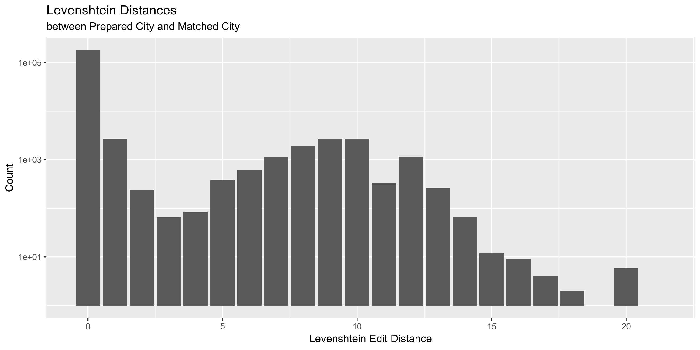

Data Diary
================
Kiernan Nicholls
2019-08-22 15:52:21

  - [Project](#project)
  - [Objectives](#objectives)
  - [Prerequisites](#prerequisites)
  - [Data](#data)
  - [Variables](#variables)
  - [Import](#import)
  - [Explore](#explore)
  - [Wrangle](#wrangle)
  - [Conclude](#conclude)
  - [Export](#export)

## Project

The Accountability Project is an effort to cut across data silos and
give journalists, policy professionals, activists, and the public at
large a simple way to search across huge volumes of public data about
people and organizations.

Our goal is to standardizing public data on a few key fields by thinking
of each dataset row as a transaction. For each transaction there should
be (at least) 3 variables:

1.  All **parties** to a transaction
2.  The **date** of the transaction
3.  The **amount** of money involved

## Objectives

This document describes the process used to complete the following
objectives:

1.  How many records are in the database?
2.  Check for duplicates
3.  Check ranges
4.  Is there anything blank or missing?
5.  Check for consistency issues
6.  Create a five-digit ZIP Code called `ZIP5`
7.  Create a `YEAR` field from the transaction date
8.  Make sure there is data on both parties to a transaction

## Prerequisites

The following packages are needed to collect, manipulate, visualize,
analyze, and communicate these results. The `pacman` package will
facilitate their installation and attachment.

``` r
pacman::p_load_gh("VerbalExpressions/RVerbalExpressions")
pacman::p_load_current_gh("kiernann/campfin")
pacman::p_load(
  stringdist, # levenshtein value
  tidyverse, # data manipulation
  lubridate, # datetime strings
  tidytext, # text mining tools
  magrittr, # pipe opperators
  janitor, # dataframe clean
  zipcode, # clean & databse
  batman, # parse logicals
  refinr, # cluster & merge
  rvest, # scrape website
  skimr, # summary stats
  vroom, # quickly read
  glue, # combine strings
  here, # locate storage
  fs # search storage 
)
```

This document should be run as part of the `R_campfin` project, which
lives as a sub-directory of the more general, language-agnostic
`irworkshop/accountability_datacleaning` [GitHub
repository](https://github.com/irworkshop/accountability_datacleaning).

The `R_campfin` project uses the [RStudio
projects](https://support.rstudio.com/hc/en-us/articles/200526207-Using-Projects)
feature and should be run as such. The project also uses the dynamic
`here::here()` tool for file paths relative to *your* machine.

``` r
# where does this document knit?
here::here()
#> [1] "/home/ubuntu/R/accountability_datacleaning/R_campfin"
```

## Data

Data is collected from the
[AlabamaVotes.gov](http://fcpa.alabamavotes.gov) website, which
publishes data in concordance with the Alabama Electronic Fair Campaign
Practices Act (FCPA).

> Welcome to the public disclosure website for the Alabama Electronic
> Fair Campaign Practices Act (FCPA) Reporting System. My staff and I
> developed this online system pursuant to Alabama Legislative Act
> 2011-687. It requires electronic reports of contributions and
> expenditures to increase the efficiency of data entry, provide more
> accurate data, enhance reporting capabilities and improve user
> navigation of the system.
> 
> This website contains detailed financial records and related
> information that candidates and political action committees are
> required by law to disclose. You can search the system in several ways
> and review the results online, print them or extract them for further
> analysis.

Per the “[Data
Download](http://fcpa.alabamavotes.gov/PublicSite/DataDownload.aspx)”
resource page of that website:

> This page provides comma separated value (CSV) downloadable files
> which contain annual data for Cash Contributions, In-Kind
> Contributions, Other Receipts, and Expenditures in a zipped file
> format. These files can be downloaded and imported into other
> applications (Microsoft Excel, Microsoft Access, etc.) for your use.
> This data is extracted from the Alabama Electronic FCPA Reporting
> System database as it existed as of 6/21/2019 12:35 AM.

As the
“[Help](https://fcpa.alabamavotes.gov/CampaignFinance/WebHelp/Public/PublicSite/DataDownload.htm)”
page for that page explains:

> You can access the Campaign Finance Data Download page to download
> contribution and expenditure data for import into other applications
> such as Microsoft Excel or Access. A weekly batch process is run that
> captures the year-to-date information for the current year. The data
> is available for each calendar year. The file is downloaded in CSV
> format.

## Variables

The Data Download page also links to PDF files with keys to the file
format. Per the [Expenditures
Key](https://en.wikipedia.org/wiki/List_of_cities_and_towns_in_Alabama):

`ORG ID`:

> This is the unique ID of the paying candidate or committee.

`EXPENDITURE AMOUNT`:

> Dollar amount of the expenditure.

`EXPENDITURE DATE`:

> Date of the expenditure.

`LAST NAME`:

> Last Name of Payee (entity paid), if an individual person. If not an
> individual, the entity full name will be in the LAST NAME field.

`FIRST NAME`:

> Payee First Name.

`ADDRESS`:

> Payee Address Number, Street, PO Box or other directional information.

`CITY`, `STATE`, `ZIP`:

> Payee City \[State, ZIP\]

`EXPENDITURE`:

> Dollar amount of the expenditure.

`EXPLANATION`:

> This is the explanation provided for the expenditure if “Other”
> purpose is used.

`EXPENDITURE ID`:

> This is the Expenditure internal ID. This ID is unique.

`FILED DATE`:

> Date the Expenditure was filed.

`PURPOSE`:

> Purpose of the Expenditure.

`EXPENDITURE TYPE`:

> Indicates the Type of Expenditure, Itemized, Non-Itemized, Itemized
> Line of Credit, Non-Itemized Line of Credit.

`COMMITTEE TYPE`:

> Type of committee making the expenditure. PCC or PAC

`COMMITTEE NAME`:

> This is the name of the Committee making the expenditure if a PAC.

`CANDIDATE NAME`:

> This is the name of the Candidate making the expenditure if a PCC.

`AMENDED`:

> Y/N Indicator to designate if this record has been amended.

## Import

To process our data in R, we will have to read each annual CSV file and
combine them into a single data frame. This combined data frame can be
cleaned and uploaded to TAP.

### Download

To read the files into R, we will first have to download them
individually from the. The files have a consistent naming convention,
all we have to do is change the year for each file.

``` r
base_url <- "http://fcpa.alabamavotes.gov/PublicSite/Docs/BulkDataDownloads/"
expend_urls <- glue(base_url, "{2013:2019}_ExpendituresExtract.csv.zip")
print(expend_urls)
```

    #> http://fcpa.alabamavotes.gov/PublicSite/Docs/BulkDataDownloads/2013_ExpendituresExtract.csv.zip
    #> http://fcpa.alabamavotes.gov/PublicSite/Docs/BulkDataDownloads/2014_ExpendituresExtract.csv.zip
    #> http://fcpa.alabamavotes.gov/PublicSite/Docs/BulkDataDownloads/2015_ExpendituresExtract.csv.zip
    #> http://fcpa.alabamavotes.gov/PublicSite/Docs/BulkDataDownloads/2016_ExpendituresExtract.csv.zip
    #> http://fcpa.alabamavotes.gov/PublicSite/Docs/BulkDataDownloads/2017_ExpendituresExtract.csv.zip
    #> http://fcpa.alabamavotes.gov/PublicSite/Docs/BulkDataDownloads/2018_ExpendituresExtract.csv.zip
    #> http://fcpa.alabamavotes.gov/PublicSite/Docs/BulkDataDownloads/2019_ExpendituresExtract.csv.zip

If recent versions of the ZIP files do not exists in the `data/raw`
directory, download them from the Alabama FCPA website with
`utils::download.file()`.

``` r
raw_dir <- here("al", "expends", "data", "raw")
dir_create(raw_dir)
if (!all_files_new(raw_dir, "*.zip$")) {
  for (url in expend_urls) {
    download.file(
      url = url,
      destfile = str_c(raw_dir, basename(url), sep = "/")
    ) 
  }
}
```

    #> # A tibble: 7 x 5
    #>   file                             type         size birth_time          modification_time  
    #>   <chr>                            <fct> <fs::bytes> <dttm>              <dttm>             
    #> 1 2013_ExpendituresExtract.csv.zip file       416.6K 2019-08-22 15:36:59 2019-08-22 15:36:59
    #> 2 2014_ExpendituresExtract.csv.zip file        1.94M 2019-08-22 15:37:00 2019-08-22 15:37:00
    #> 3 2015_ExpendituresExtract.csv.zip file      473.37K 2019-08-22 15:37:01 2019-08-22 15:37:01
    #> 4 2016_ExpendituresExtract.csv.zip file      898.76K 2019-08-22 15:37:02 2019-08-22 15:37:02
    #> 5 2017_ExpendituresExtract.csv.zip file      997.92K 2019-08-22 15:37:03 2019-08-22 15:37:03
    #> 6 2018_ExpendituresExtract.csv.zip file        3.72M 2019-08-22 15:37:06 2019-08-22 15:37:06
    #> 7 2019_ExpendituresExtract.csv.zip file      466.61K 2019-08-22 15:37:07 2019-08-22 15:37:07

### Unzip

Since each ZIP file only contains a single CSV, and we are using the
`readr` package to read files, we do not need to unzip these files.

``` r
dir_ls(path = raw_dir, glob = "*.zip") %>% 
  extract(1) %>% 
  unzip(list = TRUE)
```

    #> # A tibble: 1 x 3
    #>   Name                          Length Date               
    #>   <chr>                          <dbl> <dttm>             
    #> 1 2013_ExpendituresExtract.csv 2378738 2017-07-25 12:41:00

### Read

For every year except 2018, we can read the files individually using
`readr::read_delim()`.

``` r
al_good <- 
  dir_ls(raw_dir) %>% 
  extract(-6) %>% 
  map(
    read_delim,
    delim = ",",
    na = c("", "\\s", "NA"),
    escape_double = FALSE,
    col_types = cols(
      .default = col_character(),
      ExpenditureDate = col_date("%m/%d/%Y"),
      ExpenditureAmount = col_double(),
      FiledDate = col_date("%m/%d/%Y")
    )
  )
```

In the `2018_ExpendituresExtract.csv.zip` file, there are two instances
of nested quotes preventing the same `readr::read_delim()` arguments
from working.

``` r
al_bad <- read_delim(
  file = str_c(raw_dir, "2018_ExpendituresExtract.csv.zip", sep = "/"),
  delim = ",",
  na = c("", "\\s", "NA", "N/A"),
  escape_double = FALSE,
  col_types = cols(
    .default = col_character(),
    ExpenditureDate = col_date("%m/%d/%Y"),
    ExpenditureAmount = col_double(),
    FiledDate = col_date("%m/%d/%Y")
  )
)

problems(al_bad) %>% mutate(file = basename(file))
```

    #> # A tibble: 8 x 5
    #>     row col       expected           actual     file                             
    #>   <int> <chr>     <chr>              <chr>      <chr>                            
    #> 1 33007 FiledDate date like %m/%d/%Y 178296     2018_ExpendituresExtract.csv.zip'
    #> 2 33007 <NA>      20 columns         21 columns 2018_ExpendituresExtract.csv.zip'
    #> 3 38848 FiledDate date like %m/%d/%Y 178297     2018_ExpendituresExtract.csv.zip'
    #> 4 38848 <NA>      20 columns         21 columns 2018_ExpendituresExtract.csv.zip'
    #> 5 42978 FiledDate date like %m/%d/%Y 178298     2018_ExpendituresExtract.csv.zip'
    #> 6 42978 <NA>      20 columns         21 columns 2018_ExpendituresExtract.csv.zip'
    #> 7 52031 FiledDate date like %m/%d/%Y 111826     2018_ExpendituresExtract.csv.zip'
    #> 8 52031 <NA>      20 columns         21 columns 2018_ExpendituresExtract.csv.zip'

To fix these instances, we can read each line as a character string,
replace `\"` with `\'` in those instances, combined the strings back
into a single string (text file) and pass it to `readr::read_delim()`.

``` r
al_bad <- 
  read_lines(file = str_c(raw_dir, "2018_ExpendituresExtract.csv.zip", sep = "/")) %>% 
  str_replace("\"RUSTY\"", "\'RUSTY\'") %>% 
  str_replace("\"MIKE\"", "\'MIKE\'") %>% 
  str_c("\n") %>% 
  read_delim(
  delim = ",",
  na = c("", "\\s", "NA", "N/A"),
  escape_double = FALSE,
  escape_backslash = TRUE,
  col_types = cols(
    .default = col_character(),
    ExpenditureDate = col_date("%m/%d/%Y"),
    ExpenditureAmount = col_double(),
    FiledDate = col_date("%m/%d/%Y")
  )
)
```

We can then bind this fixed data frame with the other years.

``` r
al <- al_good %>% 
  bind_rows(al_bad) %>% 
  clean_names() %>% 
  mutate(amended = to_logical(amended))

rm(al_good, al_bad)
```

**This process does *not* capture every row. I need to fix this.**

``` r
n_lines <- 
  dir_ls(raw_dir) %>% 
  map(read_lines) %>% 
  map(length) %>% 
  unlist() %>% 
  sum()

nrow(al) - n_lines
#> [1] -2462
```

## Explore

In the combined data frame, there are 228272 rows of 20 variables.

``` r
glimpse(al)
```

    #> Observations: 228,272
    #> Variables: 20
    #> $ org_id             <chr> "25144", "25189", "25156", "25382", "25033", "25032", "24965", "24965…
    #> $ expenditure_amount <dbl> 50.00, 100.00, 235.00, 10.00, 1.00, 45.00, 1228.15, 750.00, 2500.00, …
    #> $ expenditure_date   <date> 2013-01-01, 2013-01-01, 2013-01-01, 2013-01-01, 2013-01-01, 2013-01-…
    #> $ last_name          <chr> "CULLMAN COUNTY SPORTS HALL OF FAME", "AL.WILDLIFE FEDERATION", NA, N…
    #> $ first_name         <chr> NA, NA, NA, NA, NA, NA, NA, NA, NA, NA, NA, NA, NA, NA, NA, NA, NA, N…
    #> $ mi                 <chr> NA, NA, NA, NA, NA, NA, NA, NA, NA, NA, NA, NA, NA, NA, NA, NA, NA, N…
    #> $ suffix             <chr> NA, NA, NA, NA, NA, NA, NA, NA, NA, NA, NA, NA, NA, NA, NA, NA, NA, N…
    #> $ address1           <chr> "510 5TH ST SW", "3050 LANARK ROAD", NA, NA, NA, NA, "6001 MONTICELLO…
    #> $ city               <chr> "CULLMAN", "WETUMPKA", NA, NA, NA, NA, "MONTGOMERY", "TUSCALOOSA", "M…
    #> $ state              <chr> "AL", "AL", NA, NA, NA, NA, "AL", "AL", "AL", "AL", "AL", "AL", "GA",…
    #> $ zip                <chr> "35055", "36054", NA, NA, NA, NA, "36117", "35403", "36104", "36104",…
    #> $ explanation        <chr> "AD IN PROGRAM", NA, "ADVERTISING AND TICKET", "BANK FEE", NA, NA, NA…
    #> $ expenditure_id     <chr> "1050", "3499", "4728", "7957", "712", "763", "900", "901", "897", "1…
    #> $ filed_date         <date> 2013-07-15, 2013-10-02, 2013-10-02, 2013-11-01, 2013-07-01, 2013-07-…
    #> $ purpose            <chr> "AD IN PROGRAM", NA, "ADVERTISING AND TICKET", "BANK FEE", NA, NA, NA…
    #> $ expenditure_type   <chr> "Advertising", "Charitable Contribution", "Other", "Administrative", …
    #> $ committee_type     <chr> "Principal Campaign Committee", "Principal Campaign Committee", "Prin…
    #> $ committee_name     <chr> " ", " ", " ", "GULF PAC", "STORMING THE STATE HOUSE POLITICAL ACTION…
    #> $ candidate_name     <chr> "MARVIN MCDANIEL BUTTRAM", "RANDALL (RANDY) M DAVIS", "JAMES EDWARD B…
    #> $ amended            <lgl> FALSE, FALSE, FALSE, FALSE, FALSE, FALSE, FALSE, FALSE, FALSE, FALSE,…

### Missing

There are 1032629 missing values across all 20 variables.

``` r
al %>% 
  map(function(var) sum(is.na(var))) %>% 
  unlist() %>% 
  enframe(name = "variable", value = "n_na") %>% 
  mutate(prop_na = n_na / nrow(al)) %>% 
  print(n = length(al))
```

    #> # A tibble: 20 x 3
    #>    variable             n_na prop_na
    #>    <chr>               <int>   <dbl>
    #>  1 org_id                  0   0    
    #>  2 expenditure_amount      0   0    
    #>  3 expenditure_date        0   0    
    #>  4 last_name           32443   0.142
    #>  5 first_name         190227   0.833
    #>  6 mi                 223070   0.977
    #>  7 suffix             227628   0.997
    #>  8 address1            32665   0.143
    #>  9 city                32650   0.143
    #> 10 state               32640   0.143
    #> 11 zip                 32786   0.144
    #> 12 explanation        147512   0.646
    #> 13 expenditure_id          0   0    
    #> 14 filed_date              0   0    
    #> 15 purpose             81008   0.355
    #> 16 expenditure_type        0   0    
    #> 17 committee_type          0   0    
    #> 18 committee_name          0   0    
    #> 19 candidate_name          0   0    
    #> 20 amended                 0   0

Some records are missing key information regarding who the expenditure
was made to.

``` r
al %>% select(
  org_id,
  expenditure_amount,
  expenditure_date,
  first_name,
  mi,
  last_name
)
```

    #> # A tibble: 228,272 x 6
    #>    org_id expenditure_amount expenditure_date first_name mi    last_name                           
    #>    <chr>               <dbl> <date>           <chr>      <chr> <chr>                               
    #>  1 25144                 50  2013-01-01       <NA>       <NA>  CULLMAN COUNTY SPORTS HALL OF FAME  
    #>  2 25189                100  2013-01-01       <NA>       <NA>  AL.WILDLIFE FEDERATION              
    #>  3 25156                235  2013-01-01       <NA>       <NA>  <NA>                                
    #>  4 25382                 10  2013-01-01       <NA>       <NA>  <NA>                                
    #>  5 25033                  1  2013-01-01       <NA>       <NA>  <NA>                                
    #>  6 25032                 45  2013-01-02       <NA>       <NA>  <NA>                                
    #>  7 24965               1228. 2013-01-02       <NA>       <NA>  DELTA PRINTING & SIGN COMPANY       
    #>  8 24965                750  2013-01-02       <NA>       <NA>  ECHOLS COOGLER & ASSOCIATES PC      
    #>  9 24965               2500  2013-01-02       <NA>       <NA>  RYALS, PLUMMER, DONALDSON, AGRICOLA…
    #> 10 25142                200  2013-01-02       <NA>       <NA>  RENAISSANCE HOTEL                   
    #> # … with 228,262 more rows

These records can be flagged with a new `na_flag` variable.

``` r
al <- al %>% mutate(na_flag = is.na(first_name) & is.na(mi) & is.na(last_name))
```

### Distinct

Each variables differs in it’s number of distinct values.

``` r
al %>% 
  map(n_distinct) %>% 
  unlist() %>% 
  enframe(name = "variable", value = "n_distinct") %>% 
  mutate(prop_distinct = n_distinct / nrow(al)) %>% 
  print(n = length(al))
```

    #> # A tibble: 21 x 3
    #>    variable           n_distinct prop_distinct
    #>    <chr>                   <int>         <dbl>
    #>  1 org_id                   2648    0.0116    
    #>  2 expenditure_amount      43565    0.191     
    #>  3 expenditure_date         2429    0.0106    
    #>  4 last_name               39664    0.174     
    #>  5 first_name               3513    0.0154    
    #>  6 mi                         31    0.000136  
    #>  7 suffix                      9    0.0000394 
    #>  8 address1                51898    0.227     
    #>  9 city                     3054    0.0134    
    #> 10 state                      68    0.000298  
    #> 11 zip                      4253    0.0186    
    #> 12 explanation             34630    0.152     
    #> 13 expenditure_id         228264    1.000     
    #> 14 filed_date               1465    0.00642   
    #> 15 purpose                 18933    0.0829    
    #> 16 expenditure_type           15    0.0000657 
    #> 17 committee_type              2    0.00000876
    #> 18 committee_name            487    0.00213   
    #> 19 candidate_name           2107    0.00923   
    #> 20 amended                     2    0.00000876
    #> 21 na_flag                     2    0.00000876

For the *least* distinct of these values, we can explore the values with
`ggplot2::geom_bar()`.

<!-- -->

<!-- -->

<!-- -->

The `purpose` variable is a character string entered by the filer to
describe how the expenditure is used. This differs from
`expenditure_type` (which is a limited selection), as itemized
expenditures still have a listed `purpose`.

``` r
sample(al$purpose, 10)
```

    #>  [1] "Contribution"                            NA                                       
    #>  [3] NA                                        "Advertising"                            
    #>  [5] "ACCOUNTING"                              NA                                       
    #>  [7] "Advertising"                             "UNIFIED BREAKFAST FORUM MEMBERSHIP DUES"
    #>  [9] "Contribution"                            "Other"

We can use text mining tools to analyze the most common (non-stop)
*words* in these strings.

<!-- -->

### Ranges

#### Amounts

For the continuous variables, we can explore the distribution of values
with `ggplot2::geom_histogram()` and `ggplot2::geom_boxplot()`.

<!-- -->

<!-- -->

<!-- -->

<!-- -->

<!-- -->

<!-- -->

#### Dates

The range of `expenditure_date` is entirely reasonable, as is
`filed_date`. There are 37 expenditures made before 2013 yet the
earliest filing was made on 2013-06-27

``` r
summary(al$expenditure_date)
```

    #>         Min.      1st Qu.       Median         Mean      3rd Qu.         Max. 
    #> "2010-02-09" "2014-09-23" "2017-06-07" "2016-09-07" "2018-05-17" "2019-08-16"

``` r
summary(al$filed_date)
```

    #>         Min.      1st Qu.       Median         Mean      3rd Qu.         Max. 
    #> "2013-06-27" "2014-10-19" "2017-10-02" "2016-11-15" "2018-05-29" "2019-08-20"

### Duplicates

We can use `janitor::get_dupes()` to create a new table with only rows
duplicated more than once.

``` r
dupe_rows <- al %>% 
  select(-expenditure_id) %>% 
  get_dupes() %>% 
  distinct() %>% 
  mutate(dupe_flag = TRUE)
```

Then, join this table against the original data to add a new `dupe_flag`
variable.

``` r
al <- al %>% 
  left_join(dupe_rows) %>% 
  mutate(dupe_flag = !is.na(dupe_flag))
```

## Wrangle

### Year

Since we’ve already parsed the `expenditure_date` variable as an R date
class with `readr::col_date()`, we can use `lubridate::year()` to
extract the year of the transaction into a new `expenditure_year`
variable.

``` r
al <- al %>% mutate(expenditure_year = year(expenditure_date))
```

### ZIP

For the payee `zip` variable, we can use the `stringr::str_*()`
functions to remove white-space and non-numbers, pad with leading
zeroes, and remove the ZIP+4 extension.

``` r
al <- al %>% 
  mutate(
    zip_clean = normal_zip(
      zip = zip,
      na_rep = TRUE
    )
  )
```

### Address

For the payee `address1`, we can again use the `stringr::str_*()`
functions to force uppercase, remove non-alphanumeric characters, remove
trailing, leading, and repeated white space.

``` r
al <- al %>% 
  mutate(
    address_clean = normal_address(
      address = address1,
      add_abbs = usps,
      na_rep = TRUE
    )
  )
```

### State

``` r
setdiff(al$state, valid_state)
```

    #> [1] NA   "UN" "GE" "TE" "RO" "TH" "IO" "L"  "AJ"

Then, we can isolate those records with invalid payee `state` values and
compare them to the *expected* state value for that payee’s ZIP code

``` r
al %>% 
  filter(state %out% valid_state) %>% 
  filter(!is.na(state)) %>%
  select(
    address1,
    city,
    state,
    zip_clean
  ) %>% 
  distinct() %>% 
  arrange(state) %>%
  left_join(geo, by = c("zip_clean" = "zip")) %>% 
  print(n = nrow(.))
```

    #> # A tibble: 61 x 6
    #>    address1                            city.x     state.x zip_clean city.y        state.y
    #>    <chr>                               <chr>      <chr>   <chr>     <chr>         <chr>  
    #>  1 P O BOX 290843                      HOMEWOOD   AJ      35229     BIRMINGHAM    AL     
    #>  2 1030 DELTA BOULEVARD                ATLANTA    GE      30354     ATLANTA       GA     
    #>  3 POST OFFICE BOX 105262              ATLANTA    GE      30348     ATLANTA       GA     
    #>  4 P.O. BOX 105262                     ATLANTA    GE      30348     ATLANTA       GA     
    #>  5 P.O. BOX 105083                     ATLANTA    GE      30348     ATLANTA       GA     
    #>  6 P.O. BOX 105262                     ATLANTA    GE      31132     <NA>          <NA>   
    #>  7 200 ASHFORD CENTER NORTH, SUITE 500 ATLANTA    GE      30338     ATLANTA       GA     
    #>  8 5200 SW 30TH ST.                    DAVENPORT  IO      52802     DAVENPORT     IA     
    #>  9 3401 UNIVERSITY AVE                 DES MOINES IO      50351     <NA>          <NA>   
    #> 10 507 HILLSBORO LANE                  HELENA     L       35007     ALABASTER     AL     
    #> 11 1810 EAST WOODCHASE                 BATON      RO      <NA>      EDMONTON      AB     
    #> 12 1810 EAST WOODCHASE                 BATON      RO      <NA>      CALGARY       AB     
    #> 13 1810 EAST WOODCHASE                 BATON      RO      <NA>      VICTORIA      BC     
    #> 14 1810 EAST WOODCHASE                 BATON      RO      <NA>      VANCOUVER     BC     
    #> 15 1810 EAST WOODCHASE                 BATON      RO      <NA>      WINNIPEG      MB     
    #> 16 1810 EAST WOODCHASE                 BATON      RO      <NA>      FREDERICTON   NB     
    #> 17 1810 EAST WOODCHASE                 BATON      RO      <NA>      MONCTON       NB     
    #> 18 1810 EAST WOODCHASE                 BATON      RO      <NA>      SAINT JOHNS   NL     
    #> 19 1810 EAST WOODCHASE                 BATON      RO      <NA>      HALIFAX       NS     
    #> 20 1810 EAST WOODCHASE                 BATON      RO      <NA>      TORONTO       ON     
    #> 21 1810 EAST WOODCHASE                 BATON      RO      <NA>      CHARLOTTETOWN PE     
    #> 22 1810 EAST WOODCHASE                 BATON      RO      <NA>      QUEBEC CITY   QC     
    #> 23 1810 EAST WOODCHASE                 BATON      RO      <NA>      MONTREAL      QC     
    #> 24 1810 EAST WOODCHASE                 BATON      RO      <NA>      REGINA        SK     
    #> 25 1810 EAST WOODCHASE                 BATON      RO      <NA>      SASKATOON     SK     
    #> 26 11550 STONEHOLLOW DR.               AUSTIN     TE      78758     AUSTIN        TX     
    #> 27 P.O. BOX 660108                     DALLAS     TE      75266     DALLAS        TX     
    #> 28 PO BOX 660108                       DALLAS     TE      75266     DALLAS        TX     
    #> 29 PO BOX 6600108                      DALLAS     TE      75266     DALLAS        TX     
    #> 30 P.O. BOX 6600108                    DALLAS     TE      75266     DALLAS        TX     
    #> 31 HUDSONWEG 8                         VENLO      TH      05928     DERBY CENTER  VT     
    #> 32 UNKNOWN                             UNKNOWN    UN      <NA>      EDMONTON      AB     
    #> 33 UNKNOWN                             UNKNOWN    UN      <NA>      CALGARY       AB     
    #> 34 UNKNOWN                             UNKNOWN    UN      <NA>      VICTORIA      BC     
    #> 35 UNKNOWN                             UNKNOWN    UN      <NA>      VANCOUVER     BC     
    #> 36 UNKNOWN                             UNKNOWN    UN      <NA>      WINNIPEG      MB     
    #> 37 UNKNOWN                             UNKNOWN    UN      <NA>      FREDERICTON   NB     
    #> 38 UNKNOWN                             UNKNOWN    UN      <NA>      MONCTON       NB     
    #> 39 UNKNOWN                             UNKNOWN    UN      <NA>      SAINT JOHNS   NL     
    #> 40 UNKNOWN                             UNKNOWN    UN      <NA>      HALIFAX       NS     
    #> 41 UNKNOWN                             UNKNOWN    UN      <NA>      TORONTO       ON     
    #> 42 UNKNOWN                             UNKNOWN    UN      <NA>      CHARLOTTETOWN PE     
    #> 43 UNKNOWN                             UNKNOWN    UN      <NA>      QUEBEC CITY   QC     
    #> 44 UNKNOWN                             UNKNOWN    UN      <NA>      MONTREAL      QC     
    #> 45 UNKNOWN                             UNKNOWN    UN      <NA>      REGINA        SK     
    #> 46 UNKNOWN                             UNKNOWN    UN      <NA>      SASKATOON     SK     
    #> 47 UNKNOWN                             UNKNWON    UN      <NA>      EDMONTON      AB     
    #> 48 UNKNOWN                             UNKNWON    UN      <NA>      CALGARY       AB     
    #> 49 UNKNOWN                             UNKNWON    UN      <NA>      VICTORIA      BC     
    #> 50 UNKNOWN                             UNKNWON    UN      <NA>      VANCOUVER     BC     
    #> 51 UNKNOWN                             UNKNWON    UN      <NA>      WINNIPEG      MB     
    #> 52 UNKNOWN                             UNKNWON    UN      <NA>      FREDERICTON   NB     
    #> 53 UNKNOWN                             UNKNWON    UN      <NA>      MONCTON       NB     
    #> 54 UNKNOWN                             UNKNWON    UN      <NA>      SAINT JOHNS   NL     
    #> 55 UNKNOWN                             UNKNWON    UN      <NA>      HALIFAX       NS     
    #> 56 UNKNOWN                             UNKNWON    UN      <NA>      TORONTO       ON     
    #> 57 UNKNOWN                             UNKNWON    UN      <NA>      CHARLOTTETOWN PE     
    #> 58 UNKNOWN                             UNKNWON    UN      <NA>      QUEBEC CITY   QC     
    #> 59 UNKNOWN                             UNKNWON    UN      <NA>      MONTREAL      QC     
    #> 60 UNKNOWN                             UNKNWON    UN      <NA>      REGINA        SK     
    #> 61 UNKNOWN                             UNKNWON    UN      <NA>      SASKATOON     SK

Many of these are simply the first two letters of the full state name
(e.g., “TE” for “Texas”). Others are Canadian province abbreviations
(e.g., “ON”, “NB”). We will expand our list of valid state abbreviations
to include the Canadian provinces, manually replace types, and remove
all remaining invalid abbreviations.

``` r
al <- al %>% mutate(
  state_clean = state %>% 
    str_replace("^AJ$", "AL") %>% 
    str_replace("^GE$", "GA") %>% 
    str_replace("^IO$", "IA") %>% 
    str_replace("^L$", "AL") %>% 
    str_replace("^NB$", "NE") %>% 
    str_replace("^TE$", "TX") 
)
```

``` r
al$state_clean[which(al$state_clean %out% valid_state)] <- NA
```

### City

Cleaning city values takes the most work, due to the irregularity and
variety in valid values. Our objective is to reduce the number of
distinct values and increase the percentage of values matching our list
of valid city names.

Our list of valid cities will include those in the `zipcode` database
and those on the Wikipedia page [“List of cities and towns in
Alabama”](https://en.wikipedia.org/wiki/List_of_cities_and_towns_in_Alabama)

``` r
alabama_towns <- 
  read_html("https://en.wikipedia.org/wiki/List_of_cities_and_towns_in_Alabama") %>% 
  html_node("table") %>% 
  html_table(fill = T) %>% 
  as_tibble(.name_repair = "unique") %>%
  slice(2:(nrow(.)-3)) %>% 
  pull(1) %>% 
  str_remove("\\[(.*)") %>% 
  str_to_upper() %>% 
  str_remove_all("[:punct:]")

setdiff(alabama_towns, valid_city)
```

    #>  [1] "ARGO"                   "BABBIE"                 "BAKERHILL"             
    #>  [4] "CENTRE"                 "CLAYHATCHEE"            "COUNTY LINE"           
    #>  [7] "EAST BREWTON"           "GEIGER"                 "GOLDVILLE"             
    #> [10] "GUWIN"                  "HALEBURG"               "HAMMONDVILLE"          
    #> [13] "HOBSON CITY"            "HOKES BLUFF"            "HOOVER"                
    #> [16] "HORN HILL"              "HUEYTOWN"               "HYTOP"                 
    #> [19] "INDIAN SPRINGS VILLAGE" "LEVEL PLAINS"           "LITTLEVILLE"           
    #> [22] "MAGNOLIA SPRINGS "      "MCMULLEN"               "MOSSES"                
    #> [25] "MOUNTAIN BROOK"         "NAPIER FIELD"           "NECTAR"                
    #> [28] "NORTH COURTLAND"        "NORTH JOHNS"            "ONYCHA"                
    #> [31] "PERDIDO BEACH"          "PICKENSVILLE"           "PLEASANT GROVES"       
    #> [34] "PRICEVILLE"             "REECE CITY"             "ROSA"                  
    #> [37] "ST FLORIAN"             "SAND ROCK"              "SARDIS CITY"           
    #> [40] "SKYLINE"                "SMITHS STATION"         "SNEAD"                 
    #> [43] "SOUTH VINEMONT"         "SUSAN MOORE"            "SYLVAN SPRINGS"        
    #> [46] "TALLADEGA SPRINGS"      "TARRANT"                "TRIANA"                
    #> [49] "TWIN"                   "VALLEY GRANDE"          "VESTAVIA HILLS"        
    #> [52] "YELLOW BLUFF"

``` r
valid_city <- c(valid_city, normal_city(alabama_towns, geo_abbs = usps_city))
```

``` r
n_distinct(al$city)
#> [1] 3054
mean(al$city %in% valid_city)
#> [1] 0.8282444
```

``` r
al %>% 
  filter(city %out% valid_city) %>% 
  count(city) %>% 
  arrange(desc(n))
```

    #> # A tibble: 1,430 x 2
    #>    city                  n
    #>    <chr>             <int>
    #>  1 <NA>              32650
    #>  2 CENTRE              808
    #>  3 VESTAVIA            336
    #>  4 SYMMES TOWNSHIP     159
    #>  5 MTG                  89
    #>  6 PONTE VERDA BEACH    80
    #>  7 MONTOGMERY           77
    #>  8 BHAM                 74
    #>  9 ALEX CITY            72
    #> 10 FT LAUDERDALE        69
    #> # … with 1,420 more rows

There are five steps to achieve these goals:

1.  Prepare raw city values by removing invalid data and reducing
    inconsistencies
2.  Match prepared city values with the *actual* city name of that
    record’s ZIP code
3.  swap prepared city values with the ZIP code match *if* only 1 edit
    is needed
4.  Refine swapped city values with key collision and n-gram
    fingerprints
5.  Review invalid refines and manually correct

#### Prepare

Before the other steps, we need to prepare the values using common
normalization techniques. This work is done using the `prep_city()`
function in the `R/` directory of this project. This function also
removes common invalid entires and strips state abbreviations from the
end of city names.

``` r
al <- al %>% 
  mutate(
    city_prep = normal_city(
      city = city,
      geo_abbs = usps_city,
      st_abbs = c("AL", "DC", "ALABAMA"),
      na = na_city,
      na_rep = TRUE
    )
  )

n_distinct(al$city_prep)
#> [1] 2785
mean(al$city_prep %in% valid_city)
#> [1] 0.8363706
```

#### Match

The next step involves matching a payee `city_prep` value to the
*expect* city value for that record’s payee ZIP `zip_clean` and
`state_state` values. We then calculate the [Levenshtein
distance](https://en.wikipedia.org/wiki/Levenshtein_distance), which
measures the distance between the two character strings by the number of
changes needed to match the two strings.

``` r
al <- al %>%
  left_join(geo, by = c("zip_clean" = "zip", "state_clean" = "state")) %>%
  rename(city = city.x, city_match = city.y) %>%
  mutate(match_dist = stringdist(city_prep, city_match))

summary(al$match_dist)
#>    Min. 1st Qu.  Median    Mean 3rd Qu.    Max.    NA's 
#>    0.00    0.00    0.00    0.55    0.00   21.00   35287
```

``` r
ggplot(al) + 
  geom_bar(aes(match_dist)) + 
  scale_y_log10() +
  labs(
    title = "Levenshtein Distances",
    subtitle = "between Prepared City and Matched City",
    x = "Levenshtein Edit Distance",
    y = "Count"
  )
```

<!-- -->

#### Swap

For `city_prep` values less than **3** edits away from the expected
matched city name, we can safely make that swap. Otherwise, we will keep
the `city_prep` value.

``` r
al <- al %>% 
  mutate(
    city_swap = if_else(
      condition = match_dist < 3,
      true = city_match,
      false = city_prep
    )
  )

n_distinct(al$city_swap)
#> [1] 1956
mean(al$city_swap %in% valid_city)
#> [1] 0.8381659
```

``` r
al %>% 
  filter(city_swap %out% valid_city) %>% 
  count(state_clean, city_swap) %>% 
  arrange(desc(n)) %>% 
  drop_na()
```

    #> # A tibble: 316 x 3
    #>    state_clean city_swap           n
    #>    <chr>       <chr>           <int>
    #>  1 AL          VESTAVIA          335
    #>  2 OH          SYMMES TOWNSHIP   159
    #>  3 AL          MTG                87
    #>  4 AL          ALEX CITY          72
    #>  5 AL          BHAM               71
    #>  6 AL          TUSKEGEE INST      42
    #>  7 AL          MOUNT BROOK        33
    #>  8 AL          HAMPTON COVE       27
    #>  9 NY          NY                 24
    #> 10 NJ          DELRAN             23
    #> # … with 306 more rows

#### Refine

Once we’ve repaired these small edits, we will rely on the OpenRefine
key collision and n-gram merge algorithms to group similar values and
merge them together.

These algorithms rely on the frequency of one string compared to the
frequency of another similar string. To ensure the correct changes are
made, we can manually correct some very frequent yet incorrect values.

``` r
al$city_swap <- al$city_swap %>% 
  str_remove("(^|\\b)ALABAMA(\\b|$)") %>% 
  str_replace("^BHAM$", "BIRMINGHAM") %>%
  str_replace("^BIRM$", "BIRMINGHAM") %>% 
  str_replace("^MTGY$", "MONTGOMERY") %>% 
  str_replace("^MTG$",  "MONTGOMERY") %>% 
  str_replace("^RBC$",  "RAINBOW CITY") %>% 
  str_replace("^ALEX CITY$", "ALEXANDER CITY") %>% 
  str_replace("\\bINST$", "INSTITUTE") %>% 
  str_replace("^MOUNT BROOK$", "MOUNTAIN BROOK") %>%
  str_replace("^NY$", "NEW YORK")
```

``` r
al_refine <- al %>% 
  filter(state_clean == "AL") %>% 
  mutate(
    city_refine = if_else(
      condition = match_dist > 2,
      true = city_swap %>% 
        key_collision_merge() %>% 
        n_gram_merge(),
      false = city_swap
    )
  ) %>% 
  filter(city_refine != city_swap) %>%
  rename(city_raw = city) %>% 
  select(
    expenditure_id,
    zip_clean,
    state_clean,
    city_raw,
    city_prep,
    match_dist,
    city_swap,
    city_refine
  )
```

#### Review

This refining progress made 78 changes. 46 of these changes are
distinct. We can count the frequency of the original `city_swap` value
and the new `city_refine` value to ensure the algorithm is making the
right changes.

``` r
mean(al_refine$city_refine %in% valid_city)
#> [1] 1

al_refine$swap_count <- NA
al_refine$refine_count <- NA

for (i in 1:nrow(al_refine)) {
  al_refine$swap_count[i] <- sum(
    str_detect(
      string = al$city_swap, 
      pattern = al_refine$city_swap[i]), 
    na.rm = TRUE
  )
  al_refine$refine_count[i] <- sum(
    str_detect(
      string = al$city_swap, 
      pattern = al_refine$city_refine[i]), 
    na.rm = TRUE
  )
}

mean(al_refine$swap_count)
#> [1] 40.21795
mean(al_refine$refine_count)
#> [1] 592.3718
mean(al_refine$refine_count > al_refine$swap_count)
#> [1] 0.8717949
```

``` r
sample_frac(al_refine)
```

    #> # A tibble: 78 x 10
    #>    expenditure_id zip_clean state_clean city_raw city_prep match_dist city_swap city_refine
    #>    <chr>          <chr>     <chr>       <chr>    <chr>          <dbl> <chr>     <chr>      
    #>  1 12470          36867     AL          LAFAYETT LAFAYETT          10 LAFAYETT  LAFAYETTE  
    #>  2 15605          36271     AL          VALLEY,… VALLEYAL           8 VALLEYAL  VALLEY     
    #>  3 132026         35758     AL          HUNTSVI… HUNTSVILE          8 HUNTSVILE HUNTSVILLE 
    #>  4 54666          36872     AL          FIVEPOI… FIVEPOIN…          9 FIVEPOIN… FIVE POINTS
    #>  5 161662         36266     AL          SCOTSBO… SCOTSBORO          9 SCOTSBORO SCOTTSBORO 
    #>  6 201130         36877     AL          SMITH S… SMITH ST…          7 SMITH ST… SMITHS STA…
    #>  7 196212         36877     AL          SMITH S… SMITH ST…          7 SMITH ST… SMITHS STA…
    #>  8 91945          36663     AL          EIGHTMI… EIGHTMILE          6 EIGHTMILE EIGHT MILE 
    #>  9 12458          36201     AL          VALLEY,… VALLEYAL           8 VALLEYAL  VALLEY     
    #> 10 179403         36124     AL          PRATTVI… PRATTVILE          9 PRATTVILE PRATTVILLE 
    #> # … with 68 more rows, and 2 more variables: swap_count <int>, refine_count <int>

``` r
al <- al %>% 
  left_join(al_refine) %>% 
  mutate(
    city_clean = if_else(
      condition = is.na(city_refine),
      true = city_swap,
      false = city_refine
    )
  )
```

``` r
n_distinct(al$city)
#> [1] 3054
n_distinct(al$city_prep)
#> [1] 2785
n_distinct(al$city_swap)
#> [1] 1947
n_distinct(al$city_clean)
#> [1] 1915
```

``` r
al %>% 
  filter(city_clean %out% valid_city) %>% 
  count(state_clean, city_clean) %>% 
  arrange(city_clean) %>% 
  drop_na()
```

    #> # A tibble: 278 x 3
    #>    state_clean city_clean     n
    #>    <chr>       <chr>      <int>
    #>  1 AL          ""             1
    #>  2 AL          ABURURN        1
    #>  3 AL          ALI            1
    #>  4 OR          ALOHA          2
    #>  5 AL          ANDAL          1
    #>  6 AL          ANN            1
    #>  7 MI          ARK LAKE       1
    #>  8 AL          ASHAND         8
    #>  9 AL          ASHLANS        1
    #> 10 FL          AVENTURA       1
    #> # … with 268 more rows

#### Lookup

``` r
lookup <- read_csv(file = here("al", "expends", "data", "al_city_lookup.csv"))
lookup <- select(lookup, city_clean, city_new)
al <- left_join(al, lookup)
n_distinct(al$city_new)
```

    #> [1] 1830

``` r
prop_in(al$city_new, valid_city)
```

    #> [1] 0.994336

## Conclude

1.  There are 228277 records in the database
2.  Duplicate rows have been flagged with the `dupe_flag` variable
3.  Ranges for continuous variables make sense
4.  Records with missing key information are flagged with the `na_flag`
    variable
5.  Consistency in character strings has been fixed with `prep_city()`
    and the `stringr` functions
6.  The `zip_clean` variable has been created from `zip`
7.  The `expenditure_year` variable has been created from
    `expenditure_date`

## Export

``` r
clean_dir <- here("al", "expends", "data", "processed")
dir_create(clean_dir)
al %>% 
  select(
    -address1,
    -state,
    -zip,
    -city,
    -city_prep,
    -city_match,
    -match_dist,
    -city_swap,
    -city_refine,
    -swap_count,
    -refine_count,
    -city_clean
  ) %>% 
  write_csv(
    x = ,
    path = str_c(clean_dir, "al_expends_clean.csv", sep = "/"),
    na = ""
  )
```
