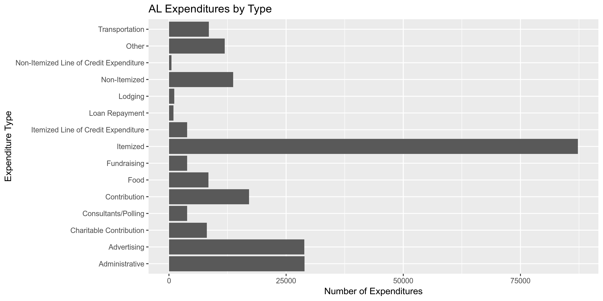
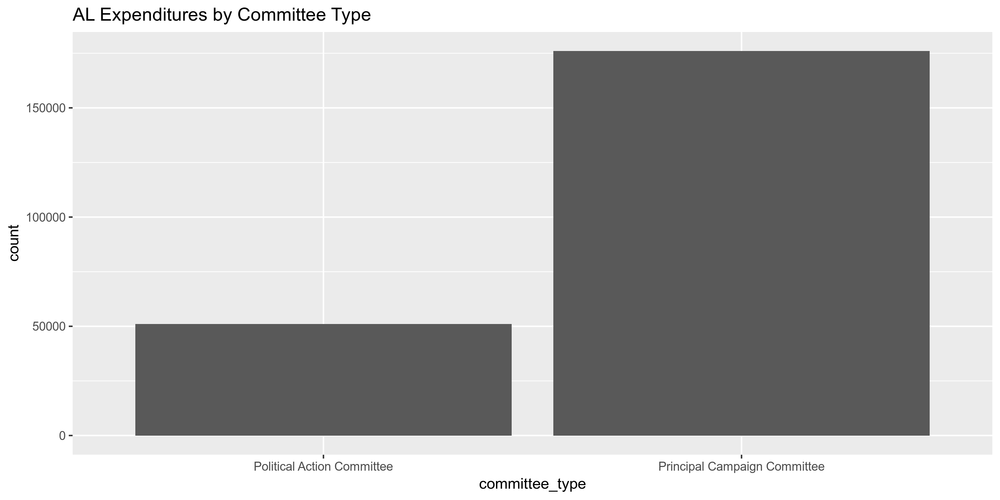
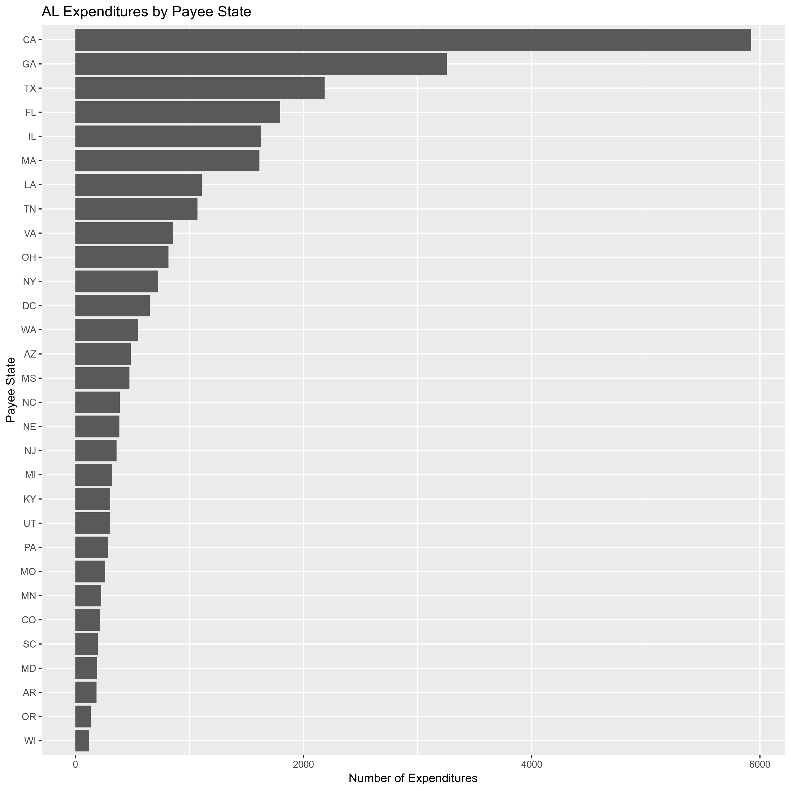
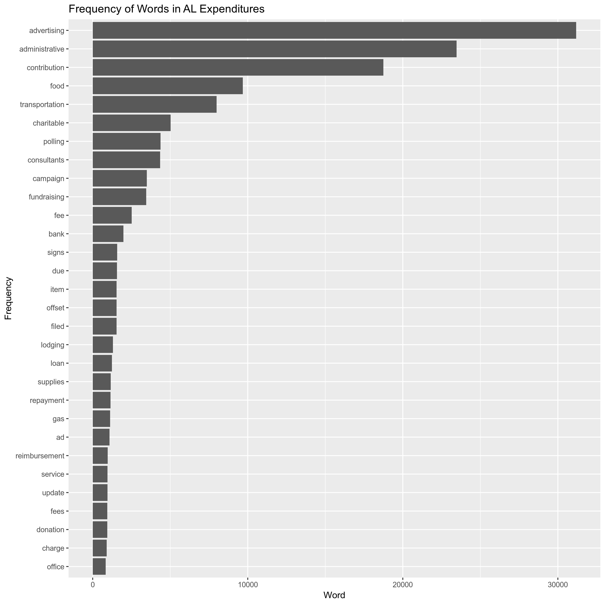
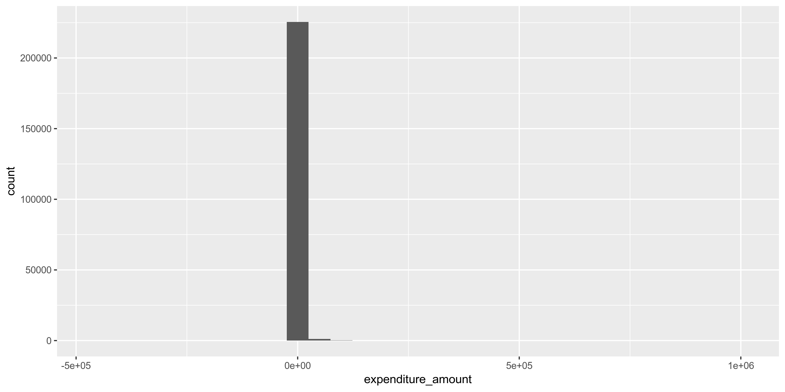
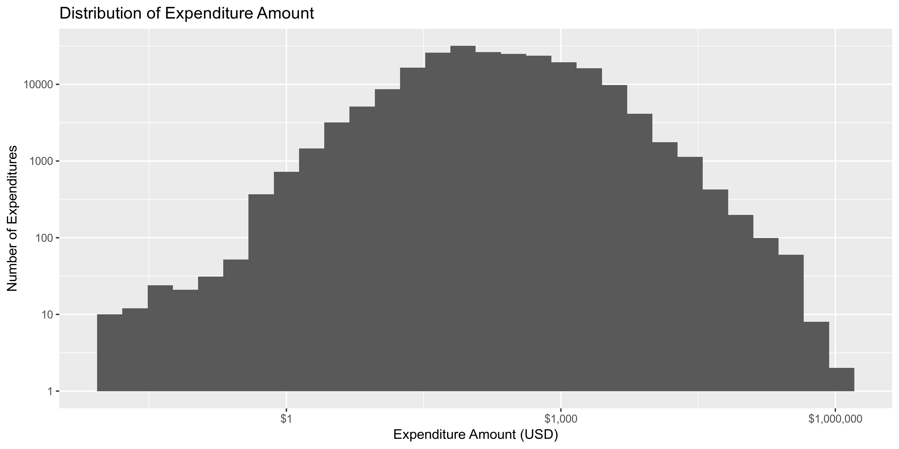
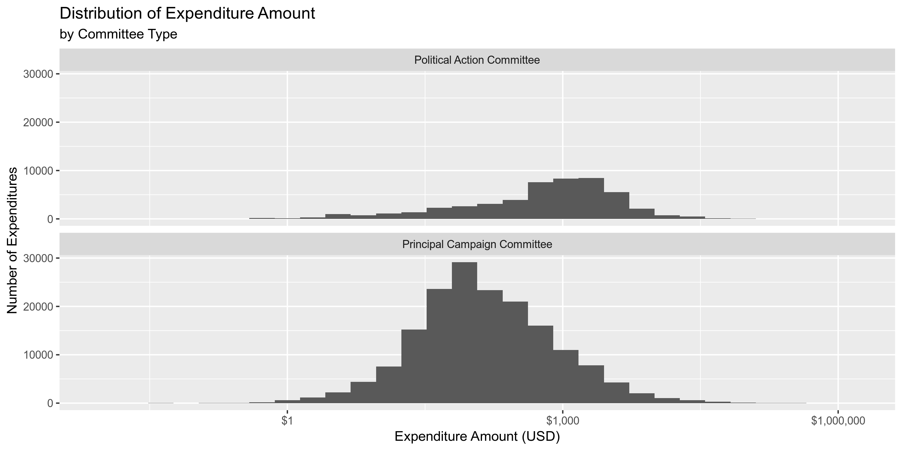
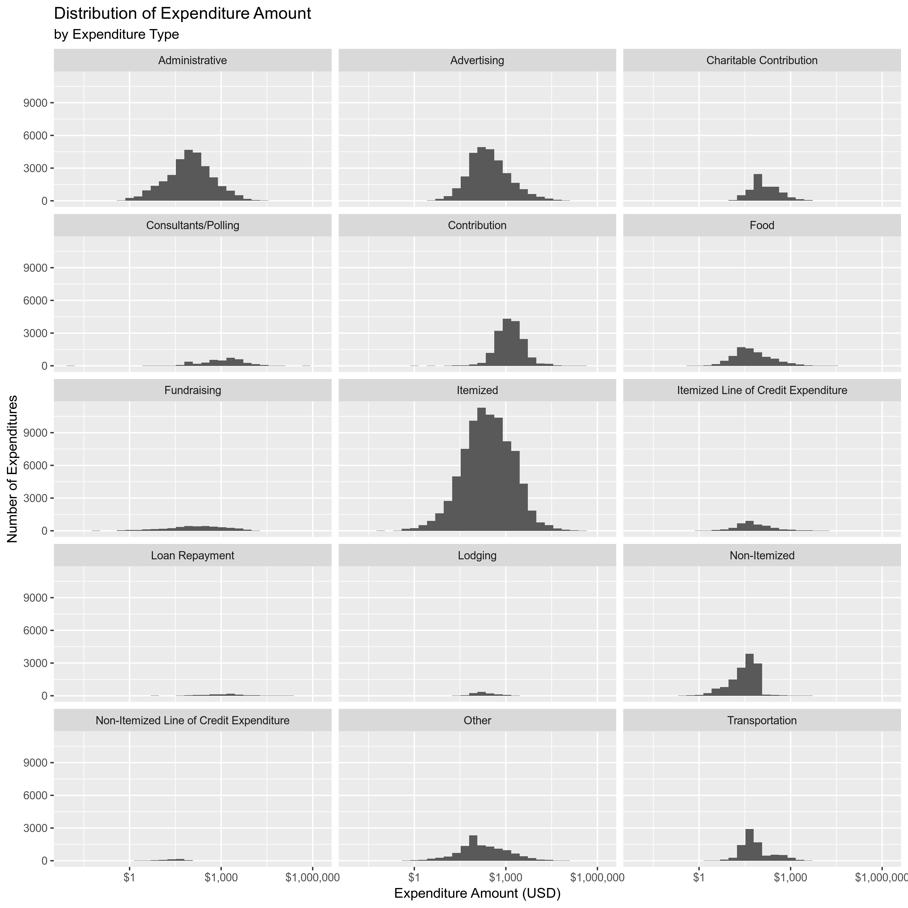
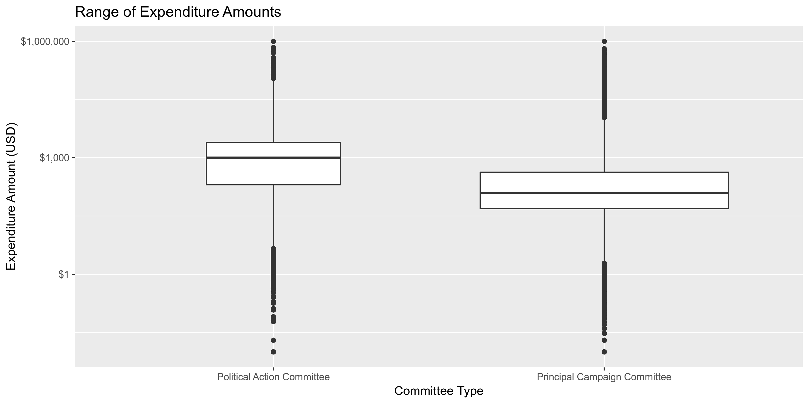
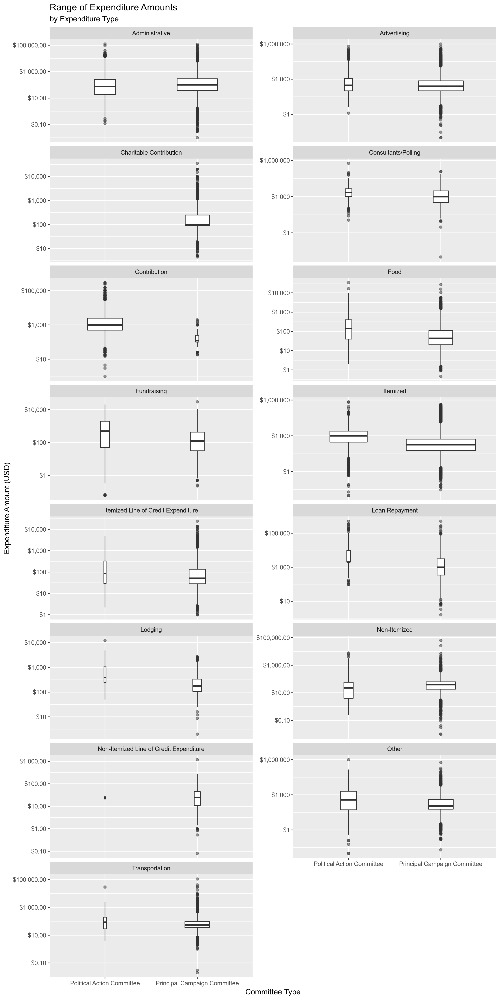

Data Diary
================
Kiernan Nicholls
2019-06-26 17:14:38

  - [Project](#project)
  - [Objectives](#objectives)
  - [Prerequisites](#prerequisites)
  - [Data](#data)
  - [Variables](#variables)
  - [Import](#import)
  - [Explore](#explore)
  - [Wrangle](#wrangle)

## Project

The Accountability Project is an effort to cut across data silos and
give journalists, policy professionals, activists, and the public at
large a simple way to search across huge volumes of public data about
people and organizations.

Our goal is to standardizing public data on a few key fields by thinking
of each dataset row as a transaction. For each transaction there should
be (at least) 3 variables:

1.  All **parties** to a transaction
2.  The **date** of the transaction
3.  The **amount** of money involved

## Objectives

This document describes the process used to complete the following
objectives:

1.  How many records are in the database?
2.  Check for duplicates
3.  Check ranges
4.  Is there anything blank or missing?
5.  Check for consistency issues
6.  Create a five-digit ZIP Code called `ZIP5`
7.  Create a `YEAR` field from the transaction date
8.  Make sure there is data on both parties to a transaction

## Prerequisites

The following packages are needed to collect, manipulate, visualize,
analyze, and communicate these results. The `pacman` package will
facilitate their installation and attachment.

``` r
pacman::p_load_gh("VerbalExpressions/RVerbalExpressions")
pacman::p_load(
  stringdist, # levenshtein value
  tidyverse, # data manipulation
  lubridate, # datetime strings
  tidytext, # text mining tools
  magrittr, # pipe opperators
  janitor, # dataframe clean
  zipcode, # clean & databse
  batman, # parse logicals
  refinr, # cluster & merge
  rvest, # scrape website
  skimr, # summary stats
  vroom, # quickly read
  glue, # combine strings
  here, # locate storage
  fs # search storage 
)
```

This document should be run as part of the `R_campfin` project, which
lives as a sub-directory of the more general, language-agnostic
`irworkshop/accountability_datacleaning` [GitHub
repository](https://github.com/irworkshop/accountability_datacleaning).

The `R_campfin` project uses the [RStudio
projects](https://support.rstudio.com/hc/en-us/articles/200526207-Using-Projects)
feature and should be run as such. The project also uses the dynamic
`here::here()` tool for file paths relative to *your* machine.

``` r
# where does this document knit?
here::here()
#> [1] "/home/ubuntu/R/accountability_datacleaning/R_campfin"
```

## Data

Data is collected from the
[AlabamaVotes.gov](http://fcpa.alabamavotes.gov) website, which
publishes data in concordance with the Alabama Electronic Fair Campaign
Practices Act (FCPA).

> Welcome to the public disclosure website for the Alabama Electronic
> Fair Campaign Practices Act (FCPA) Reporting System. My staff and I
> developed this online system pursuant to Alabama Legislative Act
> 2011-687. It requires electronic reports of contributions and
> expenditures to increase the efficiency of data entry, provide more
> accurate data, enhance reporting capabilities and improve user
> navigation of the system.
> 
> This website contains detailed financial records and related
> information that candidates and political action committees are
> required by law to disclose. You can search the system in several ways
> and review the results online, print them or extract them for further
> analysis.

Per the “[Data
Download](http://fcpa.alabamavotes.gov/PublicSite/DataDownload.aspx)”
resource page of that website:

> This page provides comma separated value (CSV) downloadable files
> which contain annual data for Cash Contributions, In-Kind
> Contributions, Other Receipts, and Expenditures in a zipped file
> format. These files can be downloaded and imported into other
> applications (Microsoft Excel, Microsoft Access, etc.) for your use.
> This data is extracted from the Alabama Electronic FCPA Reporting
> System database as it existed as of 6/21/2019 12:35 AM.

As the
“[Help](https://fcpa.alabamavotes.gov/CampaignFinance/WebHelp/Public/PublicSite/DataDownload.htm)”
page for that page explains:

> You can access the Campaign Finance Data Download page to download
> contribution and expenditure data for import into other applications
> such as Microsoft Excel or Access. A weekly batch process is run that
> captures the year-to-date information for the current year. The data
> is available for each calendar year. The file is downloaded in CSV
> format.

## Variables

The Data Download page also links to PDF files with keys to the file
format. Per the [Expenditures
Key](http://fcpa.alabamavotes.gov/PublicSite/Resources/AL_ExpendituresFileLayout.pdf):

`ORG ID`:

> This is the unique ID of the paying candidate or committee.

`EXPENDITURE AMOUNT`:

> Dollar amount of the expenditure.

`EXPENDITURE DATE`:

> Date of the expenditure.

`LAST NAME`:

> Last Name of Payee (entity paid), if an individual person. If not an
> individual, the entity full name will be in the LAST NAME field.

`FIRST NAME`:

> Payee First Name.

`ADDRESS`:

> Payee Address Number, Street, PO Box or other directional information.

`CITY`, `STATE`, `ZIP`:

> Payee City \[State, ZIP\]

`EXPENDITURE`:

> Dollar amount of the expenditure.

`EXPLANATION`:

> This is the explanation provided for the expenditure if “Other”
> purpose is used.

`EXPENDITURE ID`:

> This is the Expenditure internal ID. This ID is unique.

`FILED DATE`:

> Date the Expenditure was filed.

`PURPOSE`:

> Purpose of the Expenditure.

`EXPENDITURE TYPE`:

> Indicates the Type of Expenditure, Itemized, Non-Itemized, Itemized
> Line of Credit, Non-Itemized Line of Credit.

`COMMITTEE TYPE`:

> Type of committee making the expenditure. PCC or PAC

`COMMITTEE NAME`:

> This is the name of the Committee making the expenditure if a PAC.

`CANDIDATE NAME`:

> This is the name of the Candidate making the expenditure if a PCC.

`AMENDED`:

> Y/N Indicator to designate if this record has been amended.

## Import

To process our data in R, we will have to read each annual CSV file and
combine them into a single data frame. This combined data frame can be
cleaned and uploaded to TAP.

### Download

To read the files into R, we will first have to download them
individually from the. The files have a consistent naming convention,
all we have to do is change the year for each file.

``` r
base_url <- "http://fcpa.alabamavotes.gov/PublicSite/Docs/BulkDataDownloads/"
expend_urls <- glue(base_url, "{2013:2019}_ExpendituresExtract.csv.zip")
print(expend_urls)
```

    #> http://fcpa.alabamavotes.gov/PublicSite/Docs/BulkDataDownloads/2013_ExpendituresExtract.csv.zip
    #> http://fcpa.alabamavotes.gov/PublicSite/Docs/BulkDataDownloads/2014_ExpendituresExtract.csv.zip
    #> http://fcpa.alabamavotes.gov/PublicSite/Docs/BulkDataDownloads/2015_ExpendituresExtract.csv.zip
    #> http://fcpa.alabamavotes.gov/PublicSite/Docs/BulkDataDownloads/2016_ExpendituresExtract.csv.zip
    #> http://fcpa.alabamavotes.gov/PublicSite/Docs/BulkDataDownloads/2017_ExpendituresExtract.csv.zip
    #> http://fcpa.alabamavotes.gov/PublicSite/Docs/BulkDataDownloads/2018_ExpendituresExtract.csv.zip
    #> http://fcpa.alabamavotes.gov/PublicSite/Docs/BulkDataDownloads/2019_ExpendituresExtract.csv.zip

If recent versions of the ZIP files do not exists in the `data/raw`
directory, download them from the Alabama FCPA website with
`utils::download.file()`.

``` r
raw_dir <- here("al", "expends", "data", "raw")
dir_create(raw_dir)
if (!all_files_new(raw_dir, "zip$")) {
  for (url in expend_urls) {
    download.file(
      url = url,
      destfile = str_c(raw_dir, basename(url), sep = "/")
    ) 
  }
}
```

    #> # A tibble: 7 x 5
    #>   file                             type         size birth_time          modification_time  
    #>   <chr>                            <fct> <fs::bytes> <dttm>              <dttm>             
    #> 1 2013_ExpendituresExtract.csv.zip file       416.6K 2019-06-26 11:03:53 2019-06-26 11:03:53
    #> 2 2014_ExpendituresExtract.csv.zip file        1.94M 2019-06-26 11:03:54 2019-06-26 11:03:54
    #> 3 2015_ExpendituresExtract.csv.zip file      473.37K 2019-06-26 11:03:55 2019-06-26 11:03:55
    #> 4 2016_ExpendituresExtract.csv.zip file      898.76K 2019-06-26 11:03:56 2019-06-26 11:03:56
    #> 5 2017_ExpendituresExtract.csv.zip file      997.92K 2019-06-26 11:03:57 2019-06-26 11:03:57
    #> 6 2018_ExpendituresExtract.csv.zip file        3.72M 2019-06-26 11:04:01 2019-06-26 11:04:01
    #> 7 2019_ExpendituresExtract.csv.zip file      414.17K 2019-06-26 11:04:01 2019-06-26 11:04:01

### Unzip

Since each ZIP file only contains a single CSV, and we are using the
`readr` package to read files, we do not need to unzip these files.

``` r
dir_ls(path = raw_dir, glob = "*.zip") %>% 
  extract(1) %>% 
  unzip(list = TRUE)
```

    #> # A tibble: 1 x 3
    #>   Name                          Length Date               
    #>   <chr>                          <dbl> <dttm>             
    #> 1 2013_ExpendituresExtract.csv 2378738 2017-07-25 12:41:00

### Read

For every year except 2018, we can read the files individually using
`readr::read_delim()`.

``` r
al_good <- 
  dir_ls(raw_dir) %>% 
  extract(-6) %>% 
  map(
    read_delim,
    delim = ",",
    na = c("", "\\s", "NA"),
    escape_double = FALSE,
    col_types = cols(
      .default = col_character(),
      ExpenditureDate = col_date("%m/%d/%Y"),
      ExpenditureAmount = col_double(),
      FiledDate = col_date("%m/%d/%Y")
    )
  )
```

In the `2018_ExpendituresExtract.csv.zip` file, there are two instances
of nested quotes preventing the same `readr::read_delim()` arguments
from working.

``` r
al_bad <- read_delim(
  file = str_c(raw_dir, "2018_ExpendituresExtract.csv.zip", sep = "/"),
  delim = ",",
  na = c("", "\\s", "NA", "N/A"),
  escape_double = FALSE,
  col_types = cols(
    .default = col_character(),
    ExpenditureDate = col_date("%m/%d/%Y"),
    ExpenditureAmount = col_double(),
    FiledDate = col_date("%m/%d/%Y")
  )
)

problems(al_bad)
```

    #> # A tibble: 8 x 5
    #>     row col      expected       actual   file                                                      
    #>   <int> <chr>    <chr>          <chr>    <chr>                                                     
    #> 1 33007 FiledDa… date like %m/… 178296   '/home/ubuntu/R/accountability_datacleaning/R_campfin/al/…
    #> 2 33007 <NA>     20 columns     21 colu… '/home/ubuntu/R/accountability_datacleaning/R_campfin/al/…
    #> 3 38848 FiledDa… date like %m/… 178297   '/home/ubuntu/R/accountability_datacleaning/R_campfin/al/…
    #> 4 38848 <NA>     20 columns     21 colu… '/home/ubuntu/R/accountability_datacleaning/R_campfin/al/…
    #> 5 42978 FiledDa… date like %m/… 178298   '/home/ubuntu/R/accountability_datacleaning/R_campfin/al/…
    #> 6 42978 <NA>     20 columns     21 colu… '/home/ubuntu/R/accountability_datacleaning/R_campfin/al/…
    #> 7 52031 FiledDa… date like %m/… 111826   '/home/ubuntu/R/accountability_datacleaning/R_campfin/al/…
    #> 8 52031 <NA>     20 columns     21 colu… '/home/ubuntu/R/accountability_datacleaning/R_campfin/al/…

To fix these instances, we can read each line as a character string,
replace `\"` with `\'` in those instances, combined the strings back
into a single string (text file) and pass it to `readr::read_delim()`.

``` r
al_bad <- 
  read_lines(file = str_c(raw_dir, "2018_ExpendituresExtract.csv.zip", sep = "/")) %>% 
  str_replace("\"RUSTY\"", "\'RUSTY\'") %>% 
  str_replace("\"MIKE\"", "\'MIKE\'") %>% 
  str_c("\n") %>% 
  read_delim(
  delim = ",",
  na = c("", "\\s", "NA", "N/A"),
  escape_double = FALSE,
  escape_backslash = TRUE,
  col_types = cols(
    .default = col_character(),
    ExpenditureDate = col_date("%m/%d/%Y"),
    ExpenditureAmount = col_double(),
    FiledDate = col_date("%m/%d/%Y")
  )
)
```

We can then bind this fixed data frame with the other years.

``` r
al <- al_good %>% 
  bind_rows(al_bad) %>% 
  clean_names() %>% 
  mutate(amended = to_logical(amended))
```

This process does *not* capture every row. I need to fix this.

``` r
n_lines <- 
  dir_ls(raw_dir) %>% 
  map(read_lines) %>% 
  map(length) %>% 
  unlist() %>% 
  sum()

nrow(al) - n_lines
#> [1] -2451
```

## Explore

In the combined data frame, there are 226934 rows of 20 variables.

``` r
glimpse(al)
```

    #> Observations: 226,934
    #> Variables: 20
    #> $ org_id             <chr> "25144", "25189", "25156", "25382", "25033", "25032", "24965", "24965…
    #> $ expenditure_amount <dbl> 50.00, 100.00, 235.00, 10.00, 1.00, 45.00, 1228.15, 750.00, 2500.00, …
    #> $ expenditure_date   <date> 2013-01-01, 2013-01-01, 2013-01-01, 2013-01-01, 2013-01-01, 2013-01-…
    #> $ last_name          <chr> "CULLMAN COUNTY SPORTS HALL OF FAME", "AL.WILDLIFE FEDERATION", NA, N…
    #> $ first_name         <chr> NA, NA, NA, NA, NA, NA, NA, NA, NA, NA, NA, NA, NA, NA, NA, NA, NA, N…
    #> $ mi                 <chr> NA, NA, NA, NA, NA, NA, NA, NA, NA, NA, NA, NA, NA, NA, NA, NA, NA, N…
    #> $ suffix             <chr> NA, NA, NA, NA, NA, NA, NA, NA, NA, NA, NA, NA, NA, NA, NA, NA, NA, N…
    #> $ address1           <chr> "510 5TH ST SW", "3050 LANARK ROAD", NA, NA, NA, NA, "6001 MONTICELLO…
    #> $ city               <chr> "CULLMAN", "WETUMPKA", NA, NA, NA, NA, "MONTGOMERY", "TUSCALOOSA", "M…
    #> $ state              <chr> "AL", "AL", NA, NA, NA, NA, "AL", "AL", "AL", "AL", "AL", "AL", "GA",…
    #> $ zip                <chr> "35055", "36054", NA, NA, NA, NA, "36117", "35403", "36104", "36104",…
    #> $ explanation        <chr> "AD IN PROGRAM", NA, "ADVERTISING AND TICKET", "BANK FEE", NA, NA, NA…
    #> $ expenditure_id     <chr> "1050", "3499", "4728", "7957", "712", "763", "900", "901", "897", "1…
    #> $ filed_date         <date> 2013-07-15, 2013-10-02, 2013-10-02, 2013-11-01, 2013-07-01, 2013-07-…
    #> $ purpose            <chr> "AD IN PROGRAM", NA, "ADVERTISING AND TICKET", "BANK FEE", NA, NA, NA…
    #> $ expenditure_type   <chr> "Advertising", "Charitable Contribution", "Other", "Administrative", …
    #> $ committee_type     <chr> "Principal Campaign Committee", "Principal Campaign Committee", "Prin…
    #> $ committee_name     <chr> " ", " ", " ", "GULF PAC", "STORMING THE STATE HOUSE POLITICAL ACTION…
    #> $ candidate_name     <chr> "MARVIN MCDANIEL BUTTRAM", "RANDALL (RANDY) M DAVIS", "JAMES EDWARD B…
    #> $ amended            <lgl> FALSE, FALSE, FALSE, FALSE, FALSE, FALSE, FALSE, FALSE, FALSE, FALSE,…

### Missing

There are 1027165 missing values across all 20 variables.

``` r
al %>% 
  map(function(var) sum(is.na(var))) %>% 
  unlist() %>% 
  enframe(name = "variable", value = "n_na") %>% 
  mutate(prop_na = n_na / nrow(al)) %>% 
  print(n = length(al))
```

    #> # A tibble: 20 x 3
    #>    variable             n_na prop_na
    #>    <chr>               <int>   <dbl>
    #>  1 org_id                  0   0    
    #>  2 expenditure_amount      0   0    
    #>  3 expenditure_date        0   0    
    #>  4 last_name           32297   0.142
    #>  5 first_name         189072   0.833
    #>  6 mi                 221740   0.977
    #>  7 suffix             226292   0.997
    #>  8 address1            32518   0.143
    #>  9 city                32503   0.143
    #> 10 state               32493   0.143
    #> 11 zip                 32639   0.144
    #> 12 explanation        146603   0.646
    #> 13 expenditure_id          0   0    
    #> 14 filed_date              0   0    
    #> 15 purpose             81008   0.357
    #> 16 expenditure_type        0   0    
    #> 17 committee_type          0   0    
    #> 18 committee_name          0   0    
    #> 19 candidate_name          0   0    
    #> 20 amended                 0   0

### Distinct

Each varaibles differs in it’s number of distinct values.

``` r
al %>% 
  map(n_distinct) %>% 
  unlist() %>% 
  enframe(name = "variable", value = "n_distinct") %>% 
  mutate(prop_distinct = n_distinct / nrow(al)) %>% 
  print(n = length(al))
```

    #> # A tibble: 20 x 3
    #>    variable           n_distinct prop_distinct
    #>    <chr>                   <int>         <dbl>
    #>  1 org_id                   2630    0.0116    
    #>  2 expenditure_amount      43425    0.191     
    #>  3 expenditure_date         2361    0.0104    
    #>  4 last_name               39484    0.174     
    #>  5 first_name               3499    0.0154    
    #>  6 mi                         31    0.000137  
    #>  7 suffix                      9    0.0000397 
    #>  8 address1                51654    0.228     
    #>  9 city                     3042    0.0134    
    #> 10 state                      68    0.000300  
    #> 11 zip                      4237    0.0187    
    #> 12 explanation             34445    0.152     
    #> 13 expenditure_id         226926    1.000     
    #> 14 filed_date               1433    0.00631   
    #> 15 purpose                 18933    0.0834    
    #> 16 expenditure_type           15    0.0000661 
    #> 17 committee_type              2    0.00000881
    #> 18 committee_name            486    0.00214   
    #> 19 candidate_name           2092    0.00922   
    #> 20 amended                     2    0.00000881

For the *least* distinct of these values, we can explore the values with
`ggplot2::geom_bar()`.

<!-- -->

<!-- -->

<!-- -->

The `purpose` variable is a character string entered by the filer to
describe how the expenditure is used. This differs from
`expenditure_type` (which is a limited selection), as itemized
expenditures still have a listed `purpose`.

``` r
sample(al$purpose, 10)
```

    #>  [1] "Administrative"                                              
    #>  [2] "Advertising"                                                 
    #>  [3] "Administrative"                                              
    #>  [4] NA                                                            
    #>  [5] "Charitable Contribution"                                     
    #>  [6] "Advertising"                                                 
    #>  [7] "REIMBURSEMENT FOR FOOD FOR MOTON SENIOR THANKSGIVING DINNER."
    #>  [8] "Loan Repayment"                                              
    #>  [9] "Advertising"                                                 
    #> [10] "Food"

We can use text mining tools to analyze the most common (non-stop)
*words* in these strings.

<!-- -->

### Ranges

#### Amounts

For the continous variables, we can explore the distrobution of values
with `ggplot2::geom_histogram()` and `ggplot2::geom_boxplot()`.

<!-- -->

<!-- -->

<!-- -->

<!-- -->

<!-- -->

<!-- -->

#### Dates

The range of `expenditure_date` is entirely reasonablem, as is
`filed_date`. There are 37 expenditures made before 2013 yet the
earliest filing was made on 2013-06-27

``` r
summary(al$expenditure_date)
```

    #>         Min.      1st Qu.       Median         Mean      3rd Qu.         Max. 
    #> "2010-02-09" "2014-09-22" "2017-05-19" "2016-09-01" "2018-05-15" "2019-06-17"

``` r
summary(al$filed_date)
```

    #>         Min.      1st Qu.       Median         Mean      3rd Qu.         Max. 
    #> "2013-06-27" "2014-10-16" "2017-09-30" "2016-11-09" "2018-05-29" "2019-06-20"

### Duplicates

We can use `janitor::get_dupes()` to create a new table with only rows
duplicated more than once.

``` r
dupe_rows <- al %>% 
  select(-expenditure_id) %>% 
  get_dupes() %>% 
  distinct() %>% 
  mutate(dupe_flag = TRUE)
```

Then, join this table against the original data to add a new `dupe_flag`
variable.

``` r
al <- al %>% 
  left_join(dupe_rows) %>% 
  mutate(dupe_flag = !is.na(dupe_flag))
```

## Wrangle

### Year

``` r
al %<>% mutate(year = year(expenditure_date))
```

### Zipcode

``` r
zipcode <- zipcode %>% 
  as_tibble() %>% 
  mutate(city = str_to_upper(city)) %>% 
  select(city, state, zip)
```

``` r
al <- al %>% mutate(
  zip_clean = zip %>%
    str_remove_all(rx_whitespace()) %>%
    str_remove_all(rx_digit(inverse = TRUE)) %>% 
    str_pad(width = 5, pad = "0") %>% 
    str_sub(1, 5) %>%
    na_if("00000") %>% 
    na_if("11111") %>% 
    na_if("99999") %>% 
    na_if("")
)
```

### Address

``` r
al <- al %>% mutate(
  address_clean = address1 %>% 
  str_to_upper() %>% 
  str_remove_all(rx_alnum(inverse = TRUE)) %>% 
  str_squish() %>% 
  str_trim() %>% 
  str_replace("P O", "PO") %>% 
  na_if("")
)
```

### State

``` r
valid_states <- zipcode$state
setdiff(al$state, valid_states)
#>  [1] NA   "UN" "GE" "TE" "RO" "BC" "TH" "IO" "AB" "L"  "ON" "QC" "NL" "NB" "AJ"
```

``` r
al %>% 
  filter(state %out% valid_states) %>% 
  filter(!is.na(state)) %>%
  select(
    address1,
    city,
    state,
    zip_clean
  ) %>% 
  distinct() %>% 
  arrange(state) %>%
  left_join(zipcode, by = c("zip_clean" = "zip")) %>% 
  print_all()
```

    #> # A tibble: 29 x 6
    #>    address1                            city.x                 state.x zip_clean city.y      state.y
    #>    <chr>                               <chr>                  <chr>   <chr>     <chr>       <chr>  
    #>  1 1 WHITEHORN ROAD                    LAKE LOUISE            AB      <NA>      <NA>        <NA>   
    #>  2 2016D AIRPORT RD NE                 CALGARY                AB      <NA>      <NA>        <NA>   
    #>  3 405 SPRAY AVENUE                    BANFF                  AB      <NA>      <NA>        <NA>   
    #>  4 LAKE LOUISE DR.                     LAKE LOUISE            AB      <NA>      <NA>        <NA>   
    #>  5 P O BOX 290843                      HOMEWOOD               AJ      35229     BIRMINGHAM  AL     
    #>  6 200-171 WATER STREET                VANCOUVER              BC      00617     BARCELONETA PR     
    #>  7 1030 DELTA BOULEVARD                ATLANTA                GE      30354     ATLANTA     GA     
    #>  8 POST OFFICE BOX 105262              ATLANTA                GE      30348     ATLANTA     GA     
    #>  9 P.O. BOX 105262                     ATLANTA                GE      30348     ATLANTA     GA     
    #> 10 P.O. BOX 105083                     ATLANTA                GE      30348     ATLANTA     GA     
    #> 11 P.O. BOX 105262                     ATLANTA                GE      31132     <NA>        <NA>   
    #> 12 200 ASHFORD CENTER NORTH, SUITE 500 ATLANTA                GE      30338     ATLANTA     GA     
    #> 13 5200 SW 30TH ST.                    DAVENPORT              IO      52802     DAVENPORT   IA     
    #> 14 3401 UNIVERSITY AVE                 DES MOINES             IO      50351     <NA>        <NA>   
    #> 15 507 HILLSBORO LANE                  HELENA                 L       35007     ALABASTER   AL     
    #> 16 12312 PORT GRACE BOULEVARD          LA VISTA               NB      68128     LA VISTA    NE     
    #> 17 HUDSONWEG 8                         VENLO                  NL      05928     DERBY CENT… VT     
    #> 18 UNIT 33, 330 ESNA PARK DR.          MARKHAN                ON      36037     GREENVILLE  AL     
    #> 19 219 DUFFERIN SREET, UNIT 6A         TORONTO                ON      <NA>      <NA>        <NA>   
    #> 20 2120 RUE LETENDRE                   DRUMMONDVILLE (J2C7E9) QC      <NA>      <NA>        <NA>   
    #> 21 1810 EAST WOODCHASE                 BATON                  RO      <NA>      <NA>        <NA>   
    #> 22 11550 STONEHOLLOW DR.               AUSTIN                 TE      78758     AUSTIN      TX     
    #> 23 P.O. BOX 660108                     DALLAS                 TE      75266     DALLAS      TX     
    #> 24 PO BOX 660108                       DALLAS                 TE      75266     DALLAS      TX     
    #> 25 PO BOX 6600108                      DALLAS                 TE      75266     DALLAS      TX     
    #> 26 P.O. BOX 6600108                    DALLAS                 TE      75266     DALLAS      TX     
    #> 27 HUDSONWEG 8                         VENLO                  TH      05928     DERBY CENT… VT     
    #> 28 UNKNOWN                             UNKNOWN                UN      <NA>      <NA>        <NA>   
    #> 29 UNKNOWN                             UNKNWON                UN      <NA>      <NA>        <NA>

``` r
al <- al %>% mutate(
  state_clean = state %>% 
    str_replace("AJ", "AL") %>% 
    str_replace("GE", "GA") %>% 
    str_replace("IO", "IA") %>% 
    str_replace("^L", "AL") %>% 
    str_replace("NB", "NE") %>% 
    str_replace("TE", "TX") %>% 
    na_if("UN") 
)
```

### City
