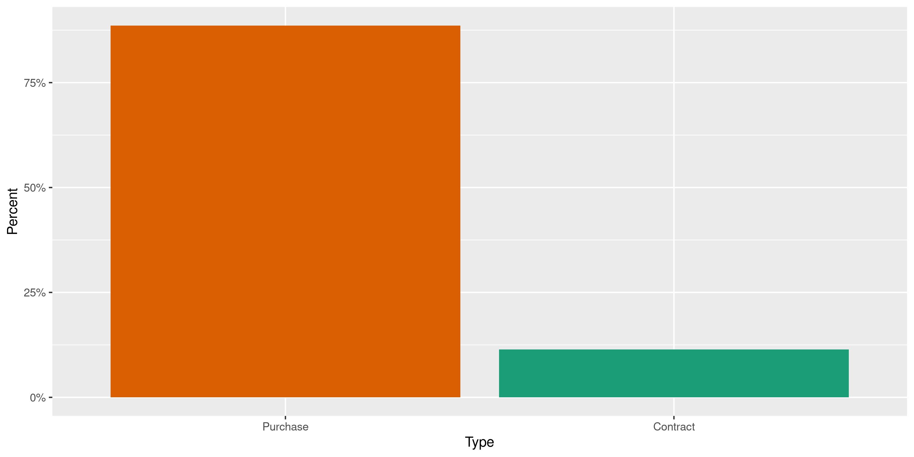
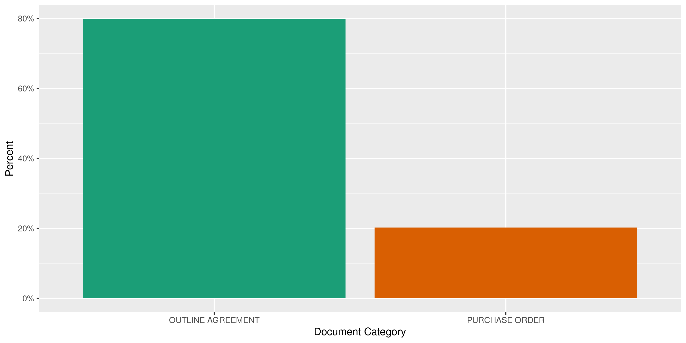

Arkansas Contracts
================
Kiernan Nicholls
2020-05-07 15:18:47

  - [Project](#project)
  - [Objectives](#objectives)
  - [Packages](#packages)
  - [Data](#data)
  - [Glossary](#glossary)
  - [Download](#download)
  - [Extract](#extract)
  - [Read](#read)
  - [Explore](#explore)
  - [Export](#export)
  - [Dictionary](#dictionary)

<!-- Place comments regarding knitting here -->

## Project

The Accountability Project is an effort to cut across data silos and
give journalists, policy professionals, activists, and the public at
large a simple way to search across huge volumes of public data about
people and organizations.

Our goal is to standardizing public data on a few key fields by thinking
of each dataset row as a transaction. For each transaction there should
be (at least) 3 variables:

1.  All **parties** to a transaction.
2.  The **date** of the transaction.
3.  The **amount** of money involved.

## Objectives

This document describes the process used to complete the following
objectives:

1.  How many records are in the database?
2.  Check for entirely duplicated records.
3.  Check ranges of continuous variables.
4.  Is there anything blank or missing?
5.  Check for consistency issues.
6.  Create a five-digit ZIP Code called `zip`.
7.  Create a `year` field from the transaction date.
8.  Make sure there is data on both parties to a transaction.

## Packages

The following packages are needed to collect, manipulate, visualize,
analyze, and communicate these results. The `pacman` package will
facilitate their installation and attachment.

The IRW’s `campfin` package will also have to be installed from GitHub.
This package contains functions custom made to help facilitate the
processing of campaign finance data.

``` r
if (!require("pacman")) install.packages("pacman")
pacman::p_load_gh("irworkshop/campfin")
pacman::p_load(
  tidyverse, # data manipulation
  lubridate, # datetime strings
  gluedown, # printing markdown
  magrittr, # pipe operators
  janitor, # clean data frames
  refinr, # cluster and merge
  scales, # format strings
  knitr, # knit documents
  vroom, # read files fast
  rvest, # html scraping
  glue, # combine strings
  here, # relative paths
  httr, # http requests
  fs # local storage 
)
```

This document should be run as part of the `R_campfin` project, which
lives as a sub-directory of the more general, language-agnostic
[`irworkshop/accountability_datacleaning`](https://github.com/irworkshop/accountability_datacleaning)
GitHub repository.

The `R_campfin` project uses the [RStudio
projects](https://support.rstudio.com/hc/en-us/articles/200526207-Using-Projects)
feature and should be run as such. The project also uses the dynamic
`here::here()` tool for file paths relative to *your* machine.

``` r
# where does this document knit?
here::here()
#> [1] "/home/kiernan/Code/accountability_datacleaning/R_campfin"
```

## Data

Arizona contracts data can be obtained from the [state transparecy
website](https://transparency.arkansas.gov/).

> Transparency.Arkansas.gov is a resource for citizens, legislators,
> news media, scholars, and nonprofit groups who want to know where the
> state, their city, town, and school district get their money, and how
> they spend it. It was created as a result of
> [Act 303](https://transparency.arkansas.gov/assets/pdf/Act303.pdf)
> which was passed in the 2011 General Session requiring the Department
> of Finance and Administration to create a free website, accessible to
> the public that contains state financial information.

> State Agencies negotiate contracts with vendors to provide services or
> goods at set prices. Contract information is available. Choose a link
> to learn more about contracts awarded in Arkansas.

> Three types of transactions are displayed on this website: 1. Standard
> contracts in excess of $25,000 and 1. Construction contracts in excess
> of $20,000 1. Single purchase orders in excess of $25,000
> 
> Data about these contracts is displayed on this website. Actual
> contracts are displayed as PDF documents. Some contract data is
> considered private or protected under state and federal laws. That
> data will be summarized to provide that privacy while also providing
> the reader with accurate details. Contracts are updated daily.

## Glossary

There are a few terms in the data which can be found in the [site
glossary](https://transparency.arkansas.gov/glossary.html):

> DBA means: Doing Business As.Vendors often have more than one name, so
> Vendor DBA is used to help identify the correct business.

> The 12-month period beginning July 1 and ending June 30 used by the
> state government for accounting purposes. Fiscal year designation is
> based on the year in which it ends \[e.g., fiscal year 2013 (FY-2013)
> runs from July 1, 2012 to June 30, 2013\].

> A vendor is an individual or company that buys and sells goods or
> services to the State of Arkansas.

## Download

The data is downloaded as ZIP archives. They can be downloaded manually
on the [search page](https://www.ark.org/dfa/transparency/contracts.php)
by selecting a fiscal year from the drop down menu.

``` r
raw_dir <- dir_create(here("ar", "contracts", "data", "raw"))
```

Or, we can use an `httr::GET()` request for each year. This will change
the URL and ask for the appropriate archive from the server.

``` r
if (length(dir_ls(raw_dir)) == 0) {
  for (year in 2013:2020) {
    get_path <- path(raw_dir, glue("contracts_overview_{year}.zip"))
    GET(
      url = glue("https://www.ark.org/dfa/transparency_{year}/contracts.php"),
      write_disk(get_path, overwrite = TRUE),
      query = list(
        # need new hash each session
        ina_sec_csrf = "6d2673540b4be801b5b58748b935dd2c",
        `do:export_contracts` = "",
        report = "contracts",
        level = "1",
        # keep as 2011
        fiscal_year = 2011,
        current_tab = "overview",
        type = "csv"
      )
    )
  }
}
```

``` r
zip_info <- as_tibble(dir_info(raw_dir))
zip_info %>% 
  select(path, size, modification_time) %>% 
  mutate(across(path, ~as_fs_path(basename(.))))
#> # A tibble: 8 x 3
#>   path                               size modification_time  
#>   <fs::path>                  <fs::bytes> <dttm>             
#> 1 contracts_overview_2013.zip     396.58K 2020-05-07 13:09:19
#> 2 contracts_overview_2014.zip       1.27M 2020-05-07 13:09:25
#> 3 contracts_overview_2015.zip       1.36M 2020-05-07 13:09:32
#> 4 contracts_overview_2016.zip     453.98K 2020-05-07 13:09:35
#> 5 contracts_overview_2017.zip     349.64K 2020-05-07 13:09:38
#> 6 contracts_overview_2018.zip       2.49M 2020-05-07 13:09:55
#> 7 contracts_overview_2019.zip       2.54M 2020-05-07 13:10:13
#> 8 contracts_overview_2020.zip       2.39M 2020-05-07 11:56:59
```

## Extract

Each ZIP archive contains two files:

1.  `Main_Contracts.csv`
2.  `Purchase_Orders_Against_Contracts.csv`

We will extract each of these files to the `data/raw/` directory and add
the fiscal year to the file name.

``` r
for (z in zip_info$path) {
  # extract csv files
  out_files <- unzip(z, exdir = raw_dir)
  # determine year from zip
  year <- str_extract(z, "\\d{4}")
  # create new file names
  out_new <- str_c(c("purchase_orders-", "main_contracts-"), year, ".csv")
  out_new <- path(raw_dir, out_new)
  # rename with year
  file_move(out_files, out_new)
}
```

## Read

Each file type contains different columns. Some overlap and some do not.
We can read both file types into the same data frame, as the key mapping
variables are present in both.

``` r
md_bullet(read_names(out_new[1])) # purchase orders
#> * Fiscal Year
#> * Agency ID
#> * Agency
#> * Contract Number
#> * Release PO
#> * Release Date
#> * PO Agency Value
#> * PO Agency Name
#> * Material Group
#> * Vendor Name
#> * Vendor DBA
#> * Amount Ordered
#> * Amount Spent
md_bullet(read_names(out_new[2])) # main contracts
#> * Fiscal Year
#> * Agency
#> * Document Category
#> * Contract Number
#> * Material Group
#> * Type of Contract
#> * Vendor Name
#> * DBA
#> * Contract Start Date
#> * Contract End Date
#> * Contract Value
#> * Amount Ordered
#> * Amount Spent
```

``` r
raw_paths <- dir_ls(raw_dir, glob = "*.csv")
md_bullet(md_code(basename(raw_paths)))
#> * `main_contracts-2013.csv`
#> * `main_contracts-2014.csv`
#> * `main_contracts-2015.csv`
#> * `main_contracts-2016.csv`
#> * `main_contracts-2017.csv`
#> * `main_contracts-2018.csv`
#> * `main_contracts-2019.csv`
#> * `main_contracts-2020.csv`
#> * `purchase_orders-2013.csv`
#> * `purchase_orders-2014.csv`
#> * `purchase_orders-2015.csv`
#> * `purchase_orders-2016.csv`
#> * `purchase_orders-2017.csv`
#> * `purchase_orders-2018.csv`
#> * `purchase_orders-2019.csv`
#> * `purchase_orders-2020.csv`
```

``` r
arc <- map_df(
  .x = raw_paths,
  .f = read_delim,
  .id = "file",
  delim = ",",
  escape_double = FALSE,
  escape_backslash = FALSE,
  col_types = cols(
    .default = col_character(),
    `Fiscal Year` = col_integer(),
    `Amount Ordered` = col_double(),
    `Amount Spent` = col_double()
  )
)
```

The added `file` variable lists the source file, but we will create a
second variable that explicitly describes whether the record is a
contract or purchase order.

``` r
arc <- mutate(
  .data = arc,
  type = if_else(
    condition = str_detect(file, "order"), 
    true = "Purchase", 
    false = "Contract")
)
```

If the files were all read properly, there should only be years in the
`fiscal_year` column.

``` r
count(arc, `Fiscal Year`)
#> # A tibble: 8 x 2
#>   `Fiscal Year`      n
#>           <int>  <int>
#> 1          2013  20509
#> 2          2014  66129
#> 3          2015  71957
#> 4          2016  22449
#> 5          2017  16450
#> 6          2018 136321
#> 7          2019 137851
#> 8          2020 133013
```

We have to do some parsing and renaming after the fact to account for
slight differences between the two types of files. Purchase orders have
a single `release_date` variable (when the purchase was made), whereas
main contracts have both `contract_start_date` and `contract_end_date`;
we will have to combine these two variables into a single date to
represent the transaction.

``` r
arc <- arc %>% 
  clean_names("snake") %>% 
  mutate(across(ends_with("date"), parse_date)) %>% 
  mutate(across(contract_value, parse_double)) %>% 
  mutate(across(file, basename)) %>% 
  mutate(date = coalesce(release_date, contract_start_date)) %>% 
  unite(
    col = vendor_dba, 
    contains("dba"), 
    sep = " ", 
    na.rm = TRUE, 
    remove = TRUE
  ) %>% 
  mutate(across(vendor_dba, na_if, ""))
#> Warning: 656 parsing failures.
#>   row col   expected     actual
#> 85235  -- valid date 0000-00-00
#> 85236  -- valid date 0000-00-00
#> 85237  -- valid date 0000-00-00
#> 85238  -- valid date 0000-00-00
#> 85239  -- valid date 0000-00-00
#> ..... ... .......... ..........
#> See problems(...) for more details.
```

For purchase orders, almost half the agency names are simply “STATEWIDE
CONTRACT” but the `po_agency_name` variable contains useful information.

``` r
arc %>% 
  filter(str_detect(file, "order")) %>% 
  count(agency, po_agency_name, sort = TRUE) %>% 
  mutate(p = n/sum(n))
#> # A tibble: 314 x 4
#>    agency                       po_agency_name                   n      p
#>    <chr>                        <chr>                        <int>  <dbl>
#>  1 STATEWIDE CONTRACT           AR DEPT OF HUMAN SERVICES    87407 0.163 
#>  2 AR DEPT OF TRANSPORTATION    AR DEPT OF TRANSPORTATION    68312 0.128 
#>  3 STATEWIDE CONTRACT           DEPT OF COMMUNITY CORRECTION 52090 0.0972
#>  4 AR DEPT OF HUMAN SERVICES    AR DEPT OF HUMAN SERVICES    36284 0.0677
#>  5 STATE HIGHWAY & TRANS DEPT   STATE HIGHWAY & TRANS DEPT   32259 0.0602
#>  6 DEPT OF COMMUNITY CORRECTION DEPT OF COMMUNITY CORRECTION 32071 0.0599
#>  7 STATEWIDE CONTRACT           DEPARTMENT OF CORRECTION     25371 0.0474
#>  8 DEPARTMENT OF CORRECTION     DEPARTMENT OF CORRECTION     22865 0.0427
#>  9 DEPT OF PARKS AND TOURISM    DEPT OF PARKS AND TOURISM    22721 0.0424
#> 10 STATEWIDE CONTRACT           DEPT OF PARKS AND TOURISM    22172 0.0414
#> # … with 304 more rows
```

The `po_agency_name` variable is not present for main contracts, so we
will have to merge these two columns in some kind of meaningful way.

``` r
arc %>% 
  filter(str_detect(file, "contract")) %>% 
  count(agency, po_agency_name, sort = TRUE) %>% 
  mutate(p = n/sum(n))
#> # A tibble: 154 x 4
#>    agency                        po_agency_name     n      p
#>    <chr>                         <chr>          <int>  <dbl>
#>  1 AR DEPT OF HUMAN SERVICES     <NA>           11529 0.167 
#>  2 STATEWIDE CONTRACT            <NA>            7964 0.116 
#>  3 AR DEPT OF TRANSPORTATION     <NA>            6388 0.0927
#>  4 AR DEPARTMENT OF HEALTH       <NA>            6090 0.0883
#>  5 DEPARTMENT OF CORRECTION      <NA>            4013 0.0582
#>  6 DEPT OF PARKS AND TOURISM     <NA>            3159 0.0458
#>  7 STATE HIGHWAY & TRANS DEPT    <NA>            2477 0.0359
#>  8 DEPT OF COMMUNITY CORRECTION  <NA>            2056 0.0298
#>  9 AR GAME AND FISH COMMISSION   <NA>            1885 0.0273
#> 10 DEPT OF ARKANSAS STATE POLICE <NA>            1613 0.0234
#> # … with 144 more rows
```

``` r
arc <- arc %>% 
  mutate(
    agency = coalesce(po_agency_name, agency),
    agency_id = coalesce(po_agency_value, agency_id),
  ) %>% 
  select(
    -po_agency_name,
    -po_agency_value
  )
```

## Explore

Combining these two file types results in a structure where matching
names are aligned and missing columns are filled with `NA` values. This
is most noticeable at the `tail()`.

``` r
glimpse(arc)
#> Rows: 604,679
#> Columns: 19
#> $ file                <chr> "main_contracts-2013.csv", "main_contracts-2013.csv", "main_contract…
#> $ fiscal_year         <int> 2013, 2013, 2013, 2013, 2013, 2013, 2013, 2013, 2013, 2013, 2013, 20…
#> $ agency              <chr> "ADMIN OFFICE OF THE COURTS", "ADMIN OFFICE OF THE COURTS", "ADMIN O…
#> $ document_category   <chr> "OUTLINE AGREEMENT", "OUTLINE AGREEMENT", "OUTLINE AGREEMENT", "OUTL…
#> $ contract_number     <chr> "4600018561", "4600014007", "4600014222", "4600013803", "4600014487"…
#> $ material_group      <chr> "LEGAL SERVICES, ATTORNEYS", "LEGAL SERVICES, ATTORNEYS", "REIMBURSA…
#> $ type_of_contract    <chr> "PROFESSIONAL SERVICES", "PROFESSIONAL SERVICES", "PROFESSIONAL SERV…
#> $ vendor_name         <chr> "FOGLEMAN ROGERS & COE", "PAMELA FISK", "GOODWIN JONES TERRY", "MAZZ…
#> $ vendor_dba          <chr> "J MATTHEW COE", NA, NA, NA, NA, NA, NA, NA, NA, NA, NA, NA, NA, NA,…
#> $ contract_start_date <date> 2012-07-01, 2012-07-01, 2012-07-01, 2012-07-01, 2012-07-01, 2012-07…
#> $ contract_end_date   <date> 2013-06-30, 2013-06-30, 2013-06-30, 2013-06-30, 2013-06-30, 2013-06…
#> $ contract_value      <dbl> 74316.33, 316138.68, 1411.44, 1411.44, 1411.44, 1411.44, 1411.44, 14…
#> $ amount_ordered      <dbl> 0.00, 0.00, 0.00, 0.00, 0.00, 0.00, 0.00, 0.00, 0.00, 0.00, 40000.00…
#> $ amount_spent        <dbl> 0.00, 0.00, 0.00, 0.00, 0.00, 0.00, 0.00, 0.00, 0.00, 0.00, 40000.00…
#> $ agency_id           <chr> NA, NA, NA, NA, NA, NA, NA, NA, NA, NA, NA, NA, NA, NA, NA, NA, NA, …
#> $ release_po          <chr> NA, NA, NA, NA, NA, NA, NA, NA, NA, NA, NA, NA, NA, NA, NA, NA, NA, …
#> $ release_date        <date> NA, NA, NA, NA, NA, NA, NA, NA, NA, NA, NA, NA, NA, NA, NA, NA, NA,…
#> $ type                <chr> "Contract", "Contract", "Contract", "Contract", "Contract", "Contrac…
#> $ date                <date> 2012-07-01, 2012-07-01, 2012-07-01, 2012-07-01, 2012-07-01, 2012-07…
tail(arc)
#> # A tibble: 6 x 19
#>   file  fiscal_year agency document_catego… contract_number material_group type_of_contract
#>   <chr>       <int> <chr>  <chr>            <chr>           <chr>          <chr>           
#> 1 purc…        2020 DEPAR… <NA>             4600042813      HARDWARE AND … <NA>            
#> 2 purc…        2020 AR DE… <NA>             4600045698      OFFICE SUPPLI… <NA>            
#> 3 purc…        2020 DEPAR… <NA>             4600044211      MISCELLANEOUS… <NA>            
#> 4 purc…        2020 DEPAR… <NA>             4600044211      TIRES AND TUB… <NA>            
#> 5 purc…        2020 AR DE… <NA>             4600045698      OFFICE SUPPLI… <NA>            
#> 6 purc…        2020 DEPAR… <NA>             4600045698      OFFICE SUPPLI… <NA>            
#> # … with 12 more variables: vendor_name <chr>, vendor_dba <chr>, contract_start_date <date>,
#> #   contract_end_date <date>, contract_value <dbl>, amount_ordered <dbl>, amount_spent <dbl>,
#> #   agency_id <chr>, release_po <chr>, release_date <date>, type <chr>, date <date>
```

### Missing

If we count the number of missing values per column, we can see a lot of
the values from the columns found only in one type of file are missing.

``` r
col_stats(arc, count_na)
#> # A tibble: 19 x 4
#>    col                 class       n         p
#>    <chr>               <chr>   <int>     <dbl>
#>  1 file                <chr>       0 0        
#>  2 fiscal_year         <int>       0 0        
#>  3 agency              <chr>      12 0.0000198
#>  4 document_category   <chr>  535741 0.886    
#>  5 contract_number     <chr>     634 0.00105  
#>  6 material_group      <chr>     807 0.00133  
#>  7 type_of_contract    <chr>  535768 0.886    
#>  8 vendor_name         <chr>     723 0.00120  
#>  9 vendor_dba          <chr>  457050 0.756    
#> 10 contract_start_date <date> 535741 0.886    
#> 11 contract_end_date   <date> 535741 0.886    
#> 12 contract_value      <dbl>  535741 0.886    
#> 13 amount_ordered      <dbl>       0 0        
#> 14 amount_spent        <dbl>       0 0        
#> 15 agency_id           <chr>   68938 0.114    
#> 16 release_po          <chr>   68938 0.114    
#> 17 release_date        <date>  69594 0.115    
#> 18 type                <chr>       0 0        
#> 19 date                <date>    656 0.00108
```

But we can flag those key values that should be present in both file
types.

``` r
arc <- arc %>% flag_na(date, agency, amount_spent, vendor_name)
percent(mean(arc$na_flag), 0.01)
#> [1] "0.13%"
```

``` r
arc %>% 
  filter(na_flag) %>% 
  select(date, agency, amount_spent, vendor_name, type) %>% 
  distinct()
#> # A tibble: 150 x 5
#>    date       agency           amount_spent vendor_name type    
#>    <date>     <chr>                   <dbl> <chr>       <chr>   
#>  1 2013-08-03 AUDITOR OF STATE       48476  <NA>        Contract
#>  2 2012-08-08 AUDITOR OF STATE      300000  <NA>        Purchase
#>  3 2012-09-28 LAND DEPARTMENT        11280  <NA>        Purchase
#>  4 2012-09-06 LAND DEPARTMENT        13020  <NA>        Purchase
#>  5 2012-08-13 LAND DEPARTMENT        46025. <NA>        Purchase
#>  6 2012-09-20 LAND DEPARTMENT       101857. <NA>        Purchase
#>  7 2012-12-05 LAND DEPARTMENT        48112. <NA>        Purchase
#>  8 2012-11-05 LAND DEPARTMENT        57388. <NA>        Purchase
#>  9 2012-12-19 LAND DEPARTMENT        11646. <NA>        Purchase
#> 10 2012-12-05 LAND DEPARTMENT        44731. <NA>        Purchase
#> # … with 140 more rows
```

### Duplicates

There are no duplicate records in this database.

``` r
arc <- flag_dupes(arc, everything())
```

### Categorical

``` r
col_stats(arc, n_distinct)
#> # A tibble: 21 x 4
#>    col                 class       n          p
#>    <chr>               <chr>   <int>      <dbl>
#>  1 file                <chr>      16 0.0000265 
#>  2 fiscal_year         <int>       8 0.0000132 
#>  3 agency              <chr>     155 0.000256  
#>  4 document_category   <chr>       3 0.00000496
#>  5 contract_number     <chr>   29853 0.0494    
#>  6 material_group      <chr>     424 0.000701  
#>  7 type_of_contract    <chr>       5 0.00000827
#>  8 vendor_name         <chr>    7413 0.0123    
#>  9 vendor_dba          <chr>    1720 0.00284   
#> 10 contract_start_date <date>   2827 0.00468   
#> 11 contract_end_date   <date>   2573 0.00426   
#> 12 contract_value      <dbl>   27287 0.0451    
#> 13 amount_ordered      <dbl>  197473 0.327     
#> 14 amount_spent        <dbl>  199126 0.329     
#> 15 agency_id           <chr>     153 0.000253  
#> 16 release_po          <chr>  225404 0.373     
#> 17 release_date        <date>   3785 0.00626   
#> 18 type                <chr>       2 0.00000331
#> 19 date                <date>   4073 0.00674   
#> 20 na_flag             <lgl>       2 0.00000331
#> 21 dupe_flag           <lgl>       2 0.00000331
```

``` r
explore_plot(arc, type)
```

<!-- -->

``` r
explore_plot(arc, document_category)
```

<!-- -->

``` r
explore_plot(arc, type_of_contract)
```

<!-- -->

### Amounts

``` r
mean(arc$amount_ordered != arc$amount_spent)
#> [1] 0.2299865
noquote(map_chr(summary(arc$amount_spent), dollar))
#>            Min.         1st Qu.          Median            Mean         3rd Qu.            Max. 
#>      -$2,389.20         $232.19       $1,093.75        $189,670         $10,700 $43,490,471,078
mean(arc$amount_spent <= 0)
#> [1] 0.0310115
```

The maximum `amount_spent` is $43,490,471,078. In this value, we can see
an enormous discrepancy between the `amount_ordered` and the
`amount_spent`.

``` r
glimpse(arc[which.max(arc$amount_spent), ])
#> Rows: 1
#> Columns: 21
#> $ file                <chr> "main_contracts-2016.csv"
#> $ fiscal_year         <int> 2016
#> $ agency              <chr> "ARKANSAS BUILDING AUTHORITY"
#> $ document_category   <chr> "OUTLINE AGREEMENT"
#> $ contract_number     <chr> "4600032490"
#> $ material_group      <chr> "JANITORIAL/CUSTODIAL SERVICES"
#> $ type_of_contract    <chr> "OTHER"
#> $ vendor_name         <chr> "D & B JANITORIAL SERVICES INC"
#> $ vendor_dba          <chr> NA
#> $ contract_start_date <date> 2014-07-01
#> $ contract_end_date   <date> 2016-06-30
#> $ contract_value      <dbl> 43490471078
#> $ amount_ordered      <dbl> 227933.5
#> $ amount_spent        <dbl> 43490471078
#> $ agency_id           <chr> NA
#> $ release_po          <chr> NA
#> $ release_date        <date> NA
#> $ type                <chr> "Contract"
#> $ date                <date> 2014-07-01
#> $ na_flag             <lgl> FALSE
#> $ dupe_flag           <lgl> FALSE
```

Turns out there are quite a few records with enormous difference between
the amount ordered and spent.

``` r
arc %>% 
  mutate(amount_dif = amount_spent - amount_ordered) %>% 
  select(agency, contains("amount"), material_group) %>% 
  arrange(amount_dif)
#> # A tibble: 604,679 x 5
#>    agency                      amount_ordered amount_spent  amount_dif material_group      
#>    <chr>                                <dbl>        <dbl>       <dbl> <chr>               
#>  1 DEPT OF FINANCE AND ADMIN       140308182.     1860782. -138447400  INSURANCE, ALL TYPES
#>  2 DEPT OF FINANCE AND ADMIN       140308182.     1860782. -138447400  INSURANCE, ALL TYPES
#>  3 ARKANSAS LOTTERY COMMISSION      81102672.           0   -81102672. LOTTERY GAMING      
#>  4 ARKANSAS LOTTERY COMMISSION      81102672.           0   -81102672. LOTTERY GAMING      
#>  5 ARKANSAS LOTTERY COMMISSION      65428723.           0   -65428723. LOTTERY GAMING      
#>  6 ARKANSAS LOTTERY COMMISSION      63343743.           0   -63343743. LOTTERY GAMING      
#>  7 ARKANSAS LOTTERY COMMISSION      63343743.           0   -63343743. LOTTERY GAMING      
#>  8 ARKANSAS LOTTERY COMMISSION      53144227.           0   -53144227. LOTTERY GAMING      
#>  9 ARKANSAS LOTTERY COMMISSION      46490179.           0   -46490179. LOTTERY GAMING      
#> 10 ARKANSAS LOTTERY COMMISSION      46490179.           0   -46490179. LOTTERY GAMING      
#> # … with 604,669 more rows

arc %>% 
  mutate(amount_dif = amount_spent - amount_ordered) %>% 
  select(agency, contains("amount"), material_group) %>% 
  arrange(desc(amount_dif))
#> # A tibble: 604,679 x 5
#>    agency              amount_ordered amount_spent  amount_dif material_group                      
#>    <chr>                        <dbl>        <dbl>       <dbl> <chr>                               
#>  1 ARKANSAS BUILDING …        227933. 43490471078.     4.35e10 JANITORIAL/CUSTODIAL SERVICES       
#>  2 AR DEPT OF HUMAN S…             0  17848960000      1.78e10 PROFESSIONAL MEDICAL SERVICES - INC…
#>  3 DEPT OF INFORMATIO…             0    873427008      8.73e 8 DATA PROCESSING, COMPUTER, AND SOFT…
#>  4 STATEWIDE CONTRACT       23297122.   165206385.     1.42e 8 COMPUTER SOFTWARE FOR MICROCOMPUTER…
#>  5 DEPT OF FINANCE AN…       2995820.   141443220.     1.38e 8 INSURANCE, ALL TYPES                
#>  6 DEPT OF FINANCE AN…      14973162.   153420562.     1.38e 8 INSURANCE, ALL TYPES                
#>  7 STATEWIDE CONTRACT        2184928.   104998044.     1.03e 8 MICROCOMPUTERS, HANDHELD, LAPTOP, A…
#>  8 STATEWIDE CONTRACT            395.    77200000      7.72e 7 MICROCOMPUTERS, DESKTOP OR TOWERBAS…
#>  9 STATEWIDE CONTRACT          20650.    67200000      6.72e 7 MICROCOMPUTERS, HANDHELD, LAPTOP, A…
#> 10 STATEWIDE CONTRACT          41433.    60000000      6.00e 7 MICROCOMPUTERS, DESKTOP OR TOWERBAS…
#> # … with 604,669 more rows
```

<!-- -->

### Dates

We can add the calendar year from `date` with `lubridate::year()`

``` r
arc <- mutate(arc, year = year(date))
```

``` r
prop_na(arc$date)
#> [1] 0.001084873
min(arc$date, na.rm = TRUE)
#> [1] "1980-01-01"
sum(arc$year < 2000, na.rm = TRUE)
#> [1] 2
max(arc$date, na.rm = TRUE)
#> [1] "9999-12-31"
sum(arc$date > today(), na.rm = TRUE)
#> [1] 10
arc$year <- na_if(arc$year, 9999)
```

<!-- -->

## Export

1.  There are 604,679 records in the database.
2.  There are 4 duplicate records in the database.
3.  The range and distribution of `amount` and `date` seem reasonable.
4.  There are 756 records missing key variables.
5.  There are no geographic variables to be normalized.
6.  The 4-digit `year` variable has been created with
    `lubridate::year()`.

Now the file can be saved on disk for upload to the Accountability
server.

``` r
clean_dir <- dir_create(here("ar", "contracts", "data", "clean"))
clean_path <- path(clean_dir, "ar_contracts_clean.csv")
write_csv(arc, clean_path, na = "")
file_size(clean_path)
#> 127M
```

The encoding of the exported file should be UTF-8 or ASCII.

``` r
enc <- system2("file", args = paste("-i", clean_path), stdout = TRUE)
str_replace_all(enc, clean_path, basename)
#> [1] "ar_contracts_clean.csv: application/csv; charset=us-ascii"
```

## Dictionary

The following table describes the variables in our final exported file:

| Column                | Type        | Overlaped | Definition                             |
| :-------------------- | :---------- | :-------- | :------------------------------------- |
| `file`                | `character` | TRUE      | Source file                            |
| `fiscal_year`         | `integer`   | TRUE      | Transaction’s fiscal year              |
| `agency`              | `character` | TRUE      | Spending agency name                   |
| `document_category`   | `character` | FALSE     | Contract category                      |
| `contract_number`     | `character` | TRUE      | Tracking contract number               |
| `material_group`      | `character` | TRUE      | Purchase order category                |
| `type_of_contract`    | `character` | FALSE     | Contract sub-type                      |
| `vendor_name`         | `character` | TRUE      | Vendor name                            |
| `vendor_dba`          | `character` | FALSE     | Vendor “doing business as”             |
| `contract_start_date` | `double`    | FALSE     | Contract start date                    |
| `contract_end_date`   | `double`    | FALSE     | Contract end date                      |
| `contract_value`      | `double`    | FALSE     | Total contract value                   |
| `amount_ordered`      | `double`    | TRUE      | Amount initially ordered               |
| `amount_spent`        | `double`    | TRUE      | Amount finally spent                   |
| `agency_id`           | `character` | FALSE     | Spending agency ID                     |
| `release_po`          | `character` | FALSE     | Releasing agency ID                    |
| `release_date`        | `double`    | FALSE     | Purchase order date                    |
| `type`                | `character` | TRUE      | Type of record (Contract or purchase)  |
| `date`                | `double`    | TRUE      | Unified transaction date               |
| `na_flag`             | `logical`   | TRUE      | Flag for missing date, amount, or name |
| `dupe_flag`           | `logical`   | TRUE      | Flag for completely duplicated record  |
| `year`                | `double`    | TRUE      | Calendar year from unified date        |

``` r
write_lines(
  x = c("# Arkansas Contracts Data Dictionary\n", dict_md),
  path = here("ar", "contracts", "ar_contracts_dict.md"),
)
```
