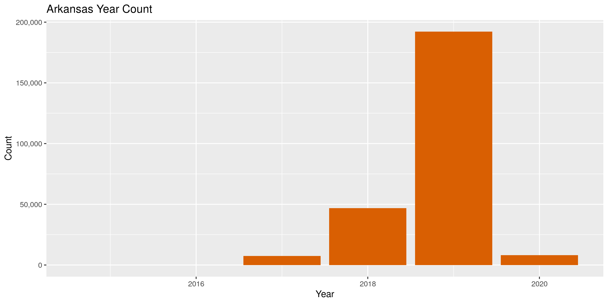

Arkansas Contributions
================
Kiernan Nicholls
2020-04-10 12:30:19

  - [Project](#project)
  - [Objectives](#objectives)
  - [Packages](#packages)
  - [Data](#data)
  - [Import](#import)
      - [Download](#download)
      - [Read](#read)
  - [Explore](#explore)
      - [Missing](#missing)
      - [Duplicates](#duplicates)
      - [Categorical](#categorical)
      - [Amounts](#amounts)
      - [Dates](#dates)
  - [Wrangle](#wrangle)
      - [Address](#address)
      - [ZIP](#zip)
      - [State](#state)
      - [City](#city)
  - [Conclude](#conclude)
  - [Export](#export)

<!-- Place comments regarding knitting here -->

## Project

The Accountability Project is an effort to cut across data silos and
give journalists, policy professionals, activists, and the public at
large a simple way to search across huge volumes of public data about
people and organizations.

Our goal is to standardizing public data on a few key fields by thinking
of each dataset row as a transaction. For each transaction there should
be (at least) 3 variables:

1.  All **parties** to a transaction
2.  The **date** of the transaction
3.  The **amount** of money involved

## Objectives

This document describes the process used to complete the following
objectives:

1.  How many records are in the database?
2.  Check for duplicates
3.  Check ranges
4.  Is there anything blank or missing?
5.  Check for consistency issues
6.  Create a five-digit ZIP Code called `ZIP5`
7.  Create a `YEAR` field from the transaction date
8.  Make sure there is data on both parties to a transaction

## Packages

The following packages are needed to collect, manipulate, visualize,
analyze, and communicate these results. The `pacman` package will
facilitate their installation and attachment.

The IRW’s `campfin` package will also have to be installed from GitHub.
This package contains functions custom made to help facilitate the
processing of campaign finance data.

``` r
if (!require("pacman")) install.packages("pacman")
pacman::p_load_gh("irworkshop/campfin")
pacman::p_load(
  tidyverse, # data manipulation
  lubridate, # datetime strings
  magrittr, # pipe opperators
  janitor, # dataframe clean
  batman, # convert logical
  refinr, # cluster and merge
  scales, # format strings
  knitr, # knit documents
  vroom, # read files fast
  rvest, # read html pages
  glue, # combine strings
  here, # relative storage
  fs # search storage 
)
```

This document should be run as part of the `R_campfin` project, which
lives as a sub-directory of the more general, language-agnostic
[`irworkshop/accountability_datacleaning`](https://github.com/irworkshop/accountability_datacleaning "TAP repo")
GitHub repository.

The `R_campfin` project uses the [RStudio
projects](https://support.rstudio.com/hc/en-us/articles/200526207-Using-Projects "Rproj")
feature and should be run as such. The project also uses the dynamic
`here::here()` tool for file paths relative to *your* machine.

``` r
# where does this document knit?
here::here()
#> [1] "/home/kiernan/Code/accountability_datacleaning/R_campfin"
```

## Data

The data is obtained from the [Arkansas Secretary of
State](https://financial-disclosures.sos.arkansas.gov/index.html#/index)
in the form of biannual CSV files.

> This page provides comma separated value (CSV) downloads of
> contribution, expenditure, and loan data for each reporting year in a
> zipped file format. These files can be downloaded and imported into
> other applications (Microsoft Excel, Microsoft Access, etc.)
> 
> This data is extracted from the Arkansas Campaign Finance database as
> it existed as of 02/03/2020 10:37 AM.

## Import

### Download

``` r
raw_dir <- dir_create(here("ar", "contribs", "data", "raw"))
```

``` r
# does not work
  raw_url <- "https://financial-disclosures.sos.arkansas.gov/modules/partials/public/dataDownload.html"
raw_page <- httr::GET(raw_url, query = list(v = "20180912.0"))
raw_page$cookies %>% 
  read_html() %>% 
  html_node(".md-table") %>% 
  html_nodes("a") %>% 
  html_attr("href") %>% 
  download.file(destfile = path(raw_dir, basename(.)))
```

``` r
raw_files <- dir_ls(raw_dir)
```

### Read

``` r
read_lines(raw_files[2]) %>% 
  str_remove_all(",\\s(?=$)") %>%
  str_replace_all("\"s", "'s") %>% 
  str_replace_all('(?<!,)"(\\w+)"(?!,)', "'\\1'") %>% 
  write_lines(raw_files[2])
```

``` r
arc <- vroom(
  file = raw_files,
  delim = ",",
  guess_max = 0,
  escape_double = FALSE,
  escape_backslash = FALSE,
  .name_repair = make_clean_names,
  col_types = cols(
    .default = col_character(),
    `Receipt Amount` = col_double(),
    `Receipt Date` = col_date("%m/%d/%Y  %H:%M:%S %p"),
    `Filed Date` = col_date("%m/%d/%Y  %H:%M:%S %p")    
  )
)
```

We can check to ensure the file was properly read by counting the number
of values from a discrete variable like `amended`.

``` r
count(arc, amended)
#> # A tibble: 2 x 2
#>   amended      n
#>   <chr>    <int>
#> 1 N       254045
#> 2 Y          437
```

``` r
arc <- arc %>%
  remove_empty("cols") %>% 
  rename_all(str_remove, "(^receipt_)|(_name$)") %>% 
  mutate_if(is_binary, to_logical)
```

## Explore

``` r
head(arc)
#> # A tibble: 6 x 23
#>   org_id amount date       last  first middle suffix address1 address2 city  state zip  
#>   <chr>   <dbl> <date>     <chr> <chr> <chr>  <chr>  <chr>    <chr>    <chr> <chr> <chr>
#> 1 219790    500 2017-07-17 Walk… Will… <NA>   <NA>   21 Rive… <NA>     Fort… AR    72903
#> 2 219790    500 2017-08-17 Dunk  Ken   <NA>   <NA>   4387 Ca… <NA>     Spri… AR    72764
#> 3 219790   1000 2017-07-17 Step… W.    R.     JR.    9 Sunse… <NA>     Litt… AR    72207
#> 4 219790   1000 2017-07-18 Step… <NA>  <NA>   <NA>   623 Gar… <NA>     Fort… AR    72901
#> 5 219790   1000 2017-08-01 Cella Char… <NA>   <NA>   226 Mer… <NA>     St. … MO    63105
#> 6 220792     50 2017-07-10 Bazz… Chir… L      <NA>   5718 Ca… <NA>     Bent… AR    7201…
#> # … with 11 more variables: description <chr>, id <chr>, filed_date <date>, source_type <chr>,
#> #   type <chr>, committee_type <chr>, candidate <chr>, amended <lgl>, employer <chr>,
#> #   occupation <chr>, occupation_comment <lgl>
tail(arc)
#> # A tibble: 6 x 23
#>   org_id amount date       last  first middle suffix address1 address2 city  state zip  
#>   <chr>   <dbl> <date>     <chr> <chr> <chr>  <chr>  <chr>    <chr>    <chr> <chr> <chr>
#> 1 362760   46.5 2020-01-10 <NA>  <NA>  <NA>   <NA>   <NA>     <NA>     <NA>  ME    <NA> 
#> 2 362760   46.5 2020-01-11 <NA>  <NA>  <NA>   <NA>   <NA>     <NA>     <NA>  ME    <NA> 
#> 3 362760   46.5 2020-01-29 <NA>  <NA>  <NA>   <NA>   <NA>     <NA>     <NA>  ME    <NA> 
#> 4 362760  100   2020-02-06 Efurd Paul  Alan   <NA>   1200 Ch… <NA>     Char… AR    72933
#> 5 362760  385   2020-02-13 Efurd Paul  Alan   <NA>   1200 Ch… <NA>     Char… AR    72933
#> 6 362760  809.  2020-01-06 Efurd Paul  Alan   <NA>   1200 Ch… <NA>     Char… AR    72933
#> # … with 11 more variables: description <chr>, id <chr>, filed_date <date>, source_type <chr>,
#> #   type <chr>, committee_type <chr>, candidate <chr>, amended <lgl>, employer <chr>,
#> #   occupation <chr>, occupation_comment <lgl>
glimpse(sample_n(arc, 20))
#> Rows: 20
#> Columns: 23
#> $ org_id             <chr> "242205", "225822", "242205", "222836", "223411", "242205", "242205",…
#> $ amount             <dbl> 0.34, 500.00, 10.33, 96.15, 15.26, 7.25, 8.00, 0.01, 2.17, 50.00, 25.…
#> $ date               <date> 2019-01-18, 2018-06-20, 2019-03-07, 2019-05-03, 2019-05-21, 2019-01-…
#> $ last               <chr> NA, "American Electric Power Committee for Responsible Government", N…
#> $ first              <chr> NA, NA, NA, "Merrill J.", NA, NA, NA, NA, NA, NA, NA, NA, NA, NA, NA,…
#> $ middle             <chr> NA, NA, NA, NA, NA, NA, NA, NA, NA, NA, NA, NA, NA, NA, NA, NA, NA, N…
#> $ suffix             <chr> NA, NA, NA, NA, NA, NA, NA, NA, NA, NA, NA, NA, NA, NA, NA, NA, NA, N…
#> $ address1           <chr> NA, "400 W. Capitol Ave, Suite 1610", NA, "8735 Henderson Road", NA, …
#> $ address2           <chr> NA, NA, NA, NA, NA, NA, NA, NA, NA, NA, NA, NA, NA, NA, NA, NA, NA, N…
#> $ city               <chr> NA, "Little Rock", NA, "Tampa", NA, NA, NA, NA, NA, NA, NA, NA, NA, N…
#> $ state              <chr> "ME", "AR", "ME", "FL", "ME", "ME", "ME", "ME", "ME", "ME", "ME", "ME…
#> $ zip                <chr> NA, "72201", NA, "33634", NA, NA, NA, NA, NA, NA, NA, NA, NA, NA, NA,…
#> $ description        <chr> NA, NA, NA, NA, NA, NA, NA, NA, NA, NA, NA, NA, NA, NA, NA, NA, NA, N…
#> $ id                 <chr> "1622130", "491817", "1725427", "1739588", "1796607", "1621212", "167…
#> $ filed_date         <date> 2019-04-17, NA, 2019-04-17, NA, NA, 2019-04-17, 2019-04-17, 2019-04-…
#> $ source_type        <chr> "Non-itemized", "Bus, Org, or Unlisted PAC", "Non-itemized", "Individ…
#> $ type               <chr> "Contributions", "Contributions", "Contributions", "Contributions", "…
#> $ committee_type     <chr> "Political Action Committee", "Candidate (CC&E)", "Political Action C…
#> $ candidate          <chr> NA, "Larry R Teague", NA, NA, NA, NA, NA, NA, NA, "C Brandt Smith", N…
#> $ amended            <lgl> FALSE, FALSE, FALSE, FALSE, FALSE, FALSE, FALSE, FALSE, FALSE, FALSE,…
#> $ employer           <chr> NA, NA, NA, "WellCare Health Plans, Inc.", NA, NA, NA, NA, NA, NA, NA…
#> $ occupation         <chr> NA, NA, NA, NA, NA, NA, NA, NA, NA, NA, NA, NA, NA, NA, NA, NA, "Heal…
#> $ occupation_comment <lgl> NA, FALSE, NA, NA, NA, NA, NA, NA, NA, NA, FALSE, NA, NA, NA, NA, NA,…
```

### Missing

``` r
col_stats(arc, count_na)
#> # A tibble: 23 x 4
#>    col                class       n     p
#>    <chr>              <chr>   <int> <dbl>
#>  1 org_id             <chr>       0 0    
#>  2 amount             <dbl>       0 0    
#>  3 date               <date>      0 0    
#>  4 last               <chr>  171372 0.673
#>  5 first              <chr>  180992 0.711
#>  6 middle             <chr>  236782 0.930
#>  7 suffix             <chr>  253182 0.995
#>  8 address1           <chr>  171400 0.674
#>  9 address2           <chr>  251144 0.987
#> 10 city               <chr>  171343 0.673
#> 11 state              <chr>       0 0    
#> 12 zip                <chr>  171338 0.673
#> 13 description        <chr>  252877 0.994
#> 14 id                 <chr>       0 0    
#> 15 filed_date         <date> 111757 0.439
#> 16 source_type        <chr>       0 0    
#> 17 type               <chr>       0 0    
#> 18 committee_type     <chr>       0 0    
#> 19 candidate          <chr>  186526 0.733
#> 20 amended            <lgl>       0 0    
#> 21 employer           <chr>  182150 0.716
#> 22 occupation         <chr>  191206 0.751
#> 23 occupation_comment <lgl>  205391 0.807
```

``` r
arc <- arc %>% flag_na(last, date, amount)
arc$na_flag[arc$source_type == "Non-itemized"] <- FALSE
sum(arc$na_flag)
#> [1] 575
mean(arc$na_flag)
#> [1] 0.002259492
```

### Duplicates

``` r
arc <- flag_dupes(arc, everything(), .check = TRUE)
#> Warning in flag_dupes(arc, everything(), .check = TRUE): no duplicate rows, column not created
```

### Categorical

``` r
col_stats(arc, n_distinct)
#> # A tibble: 24 x 4
#>    col                class       n          p
#>    <chr>              <chr>   <int>      <dbl>
#>  1 org_id             <chr>     792 0.00311   
#>  2 amount             <dbl>    5080 0.0200    
#>  3 date               <date>    974 0.00383   
#>  4 last               <chr>   14534 0.0571    
#>  5 first              <chr>    6405 0.0252    
#>  6 middle             <chr>     815 0.00320   
#>  7 suffix             <chr>      10 0.0000393 
#>  8 address1           <chr>   37777 0.148     
#>  9 address2           <chr>    1066 0.00419   
#> 10 city               <chr>    3286 0.0129    
#> 11 state              <chr>      76 0.000299  
#> 12 zip                <chr>    6295 0.0247    
#> 13 description        <chr>     924 0.00363   
#> 14 id                 <chr>  254471 1.00      
#> 15 filed_date         <date>    348 0.00137   
#> 16 source_type        <chr>      10 0.0000393 
#> 17 type               <chr>       3 0.0000118 
#> 18 committee_type     <chr>       5 0.0000196 
#> 19 candidate          <chr>     574 0.00226   
#> 20 amended            <lgl>       2 0.00000786
#> 21 employer           <chr>   13855 0.0544    
#> 22 occupation         <chr>      33 0.000130  
#> 23 occupation_comment <lgl>       2 0.00000786
#> 24 na_flag            <lgl>       2 0.00000786
```

``` r
explore_plot(
  data = arc,
  var = source_type,
  nbar = 4,
  title = "Arkansas Contribution Source Types",
)
```

<!-- -->

``` r
explore_plot(
  data = arc,
  var = committee_type,
  title = "Arkansas Contribution Recipient Types",
)
```

<!-- -->

### Amounts

The vast majority of contributions are less than $100 with nearly 17%
being less than $1.

``` r
summary(arc$amount)
#>      Min.   1st Qu.    Median      Mean   3rd Qu.      Max. 
#>       0.0       2.0      10.0     166.1      71.5 1699814.8
percent(mean(arc$amount < 1))
#> [1] "17%"
```

<!-- -->

### Dates

We can use the `year()` function to create a 4-digit year from the
`date`.

``` r
arc <- mutate(arc, year = year(date))
```

``` r
min(arc$date)
#> [1] "2015-01-06"
max(arc$date)
#> [1] "2020-04-03"
sum(arc$date > today())
#> [1] 0
```

<!-- -->

## Wrangle

### Address

``` r
arc <- arc %>% 
  unite(
    col = address_full,
    starts_with("address"),
    sep = " ",
    remove = FALSE,
    na.rm = TRUE
  ) %>% 
  mutate(
    address_norm = normal_address(
      address = address_full,
      abbs = usps_street,
      na = invalid_city,
      na_rep = TRUE
    )
  ) %>% 
  select(-address_full)
```

``` r
arc %>% 
  select(contains("address")) %>% 
  distinct() %>% 
  sample_frac()
#> # A tibble: 38,121 x 3
#>    address1                  address2 address_norm      
#>    <chr>                     <chr>    <chr>             
#>  1 310 N Washington          <NA>     310 N WASHINGTON  
#>  2 5 Ranch Valley Dr         <NA>     5 RNCH VLY DR     
#>  3 114 Rocky Branch Cove     <NA>     114 ROCKY BR CV   
#>  4 P. O. BOX 21440           <NA>     PO BOX 21440      
#>  5 25 Jacob Pl               <NA>     25 JACOB PL       
#>  6 798 Aurelia Street        <NA>     798 AURELIA ST    
#>  7 12 Tanglewood Ln          <NA>     12 TANGLEWOOD LN  
#>  8 34 Oakmont Dr             <NA>     34 OAKMONT DR     
#>  9 1021 South Janelle Avenue <NA>     1021 S JANELLE AVE
#> 10 904 Cedar St              <NA>     904 CEDAR ST      
#> # … with 38,111 more rows
```

### ZIP

``` r
arc <- arc %>% 
  mutate(
    zip_norm = normal_zip(
      zip = zip,
      na_rep = TRUE
    )
  )
```

``` r
progress_table(
  arc$zip,
  arc$zip_norm,
  compare = valid_zip
)
#> # A tibble: 2 x 6
#>   stage    prop_in n_distinct prop_na n_out n_diff
#>   <chr>      <dbl>      <dbl>   <dbl> <dbl>  <dbl>
#> 1 zip        0.883       6295   0.673  9689   3056
#> 2 zip_norm   0.997       4485   0.673   227    104
```

### State

``` r
arc <- arc %>% 
  mutate(
    state_norm = normal_state(
      state = state,
      abbreviate = TRUE,
      na_rep = TRUE,
      valid = valid_state
    )
  )
```

``` r
arc %>% 
  filter(state != state_norm) %>% 
  count(state, state_norm, sort = TRUE)
#> # A tibble: 15 x 3
#>    state state_norm     n
#>    <chr> <chr>      <int>
#>  1 Ar    AR           111
#>  2 oH    OH            34
#>  3 tx    TX            21
#>  4 dc    DC            19
#>  5 aR    AR            14
#>  6 fL    FL             7
#>  7 oK    OK             5
#>  8 ar    AR             3
#>  9 dC    DC             2
#> 10 Ne    NE             2
#> 11 Fl    FL             1
#> 12 iN    IN             1
#> 13 pa    PA             1
#> 14 rI    RI             1
#> 15 Wa    WA             1
```

``` r
progress_table(
  arc$state,
  arc$state_norm,
  compare = valid_state
)
#> # A tibble: 2 x 6
#>   stage      prop_in n_distinct   prop_na n_out n_diff
#>   <chr>        <dbl>      <dbl>     <dbl> <dbl>  <dbl>
#> 1 state        0.999         76 0           239     22
#> 2 state_norm   1             55 0.0000629     0      1
```

### City

The `campfin::normal_city()` function first forces consistent
capitalization, removes punctuation, and expands common abbreviations.

``` r
arc <- arc %>% 
  mutate(
    city_norm = normal_city(
      city = city, 
      abbs = usps_city,
      states = c("AR", "DC", "ARKANSAS"),
      na = invalid_city,
      na_rep = TRUE
    )
  )
```

We can further reduce these inconsistencies by comparing our normalized
value to the *expected* value for that record’s (normalized) state and
ZIP code. Using `campfin::is_abbrev()` and `campfin::str_dist()`, we can
test whether the expected value is either an abbreviation for or within
one character of our normalized value.

``` r
arc <- arc %>% 
  rename(city_raw = city) %>% 
  left_join(
    y = zipcodes,
    by = c(
      "state_norm" = "state",
      "zip_norm" = "zip"
    )
  ) %>% 
  rename(city_match = city) %>% 
  mutate(
    match_abb = is_abbrev(city_norm, city_match),
    match_dist = str_dist(city_norm, city_match),
    city_swap = if_else(
      condition = !is.na(city_match) & (match_abb | match_dist == 1),
      true = city_match,
      false = city_norm
    )
  ) %>% 
  select(
    -city_match,
    -match_dist,
    -match_abb
  ) %>% 
  rename(city = city_raw)
```

| Stage      | Prop in | N distinct | Prop NA | N out | N diff |
| :--------- | ------: | ---------: | ------: | ----: | -----: |
| city)      |   0.973 |       2923 |   0.673 |  2236 |    494 |
| city\_norm |   0.984 |       2813 |   0.674 |  1337 |    372 |
| city\_swap |   0.991 |       2567 |   0.674 |   751 |    121 |

<!-- -->

<!-- -->

## Conclude

1.  There are 254,482 records in the database.
2.  There are 0 duplicate records in the database.
3.  The range of `date` is good, but a number of `amount` are less than
    $1.
4.  There are 575 records missing the contributor or date.
5.  Consistency in goegraphic data has been improved with
    `campfin::normal_*()`.
6.  The 5-digit `zip_norm` variable has been made with
    `campfin::normal_zip()`.
7.  The 4-digit `year` variable has been made with `lubridate::year()`.

## Export

``` r
arc <- arc %>% 
  select(
    -city_norm,
    city_norm = city_swap
  ) %>% 
  rename_all(
    str_replace, "_norm", "_clean"
  )
```

``` r
glimpse(arc)
#> Rows: 254,482
#> Columns: 29
#> $ org_id             <chr> "219790", "219790", "219790", "219790", "219790", "220792", "220792",…
#> $ amount             <dbl> 500.00, 500.00, 1000.00, 1000.00, 1000.00, 50.00, 50.00, 200.00, 250.…
#> $ date               <date> 2017-07-17, 2017-08-17, 2017-07-17, 2017-07-18, 2017-08-01, 2017-07-…
#> $ last               <chr> "Walker", "Dunk", "Stephens", "Stephens Energy PAC", "Cella", "Bazzel…
#> $ first              <chr> "William", "Ken", "W.", NA, "Charles", "Chirie", "Charlene", NA, NA, …
#> $ middle             <chr> NA, NA, "R.", NA, NA, "L", NA, NA, NA, NA, NA, NA, NA, NA, NA, NA, NA…
#> $ suffix             <chr> NA, NA, "JR.", NA, NA, NA, NA, NA, NA, NA, NA, NA, NA, NA, NA, NA, NA…
#> $ address1           <chr> "21 Riverlyn Drive", "4387 Catherine Street", "9 Sunset Circle", "623…
#> $ address2           <chr> NA, NA, NA, NA, NA, NA, NA, "Ste 205", NA, NA, NA, "1401 W Capitol Av…
#> $ city               <chr> "Fort Smith", "Springdale", "Little Rock", "Fort Smith", "St. Louis",…
#> $ state              <chr> "AR", "AR", "AR", "AR", "MO", "AR", "AR", "AR", "AR", "AR", "AR", "AR…
#> $ zip                <chr> "72903", "72764", "72207", "72901", "63105", "72019-6667", "72956", "…
#> $ description        <chr> NA, NA, NA, NA, NA, NA, NA, NA, NA, NA, NA, NA, NA, NA, NA, NA, NA, N…
#> $ id                 <chr> "3149", "3150", "3147", "3148", "3350", "7446", "7447", "7456", "7462…
#> $ filed_date         <date> 2017-10-09, 2017-10-09, 2017-10-09, 2017-10-09, 2017-10-09, NA, NA, …
#> $ source_type        <chr> "Individual", "Individual", "Individual", "Bus, Org, or Unlisted PAC"…
#> $ type               <chr> "Contributions", "Contributions", "Contributions", "Contributions", "…
#> $ committee_type     <chr> "Candidate (CC&E)", "Candidate (CC&E)", "Candidate (CC&E)", "Candidat…
#> $ candidate          <chr> "Gary Don Stubblefield", "Gary Don Stubblefield", "Gary Don Stubblefi…
#> $ amended            <lgl> FALSE, FALSE, FALSE, FALSE, FALSE, FALSE, FALSE, FALSE, FALSE, FALSE,…
#> $ employer           <chr> "The Stephens Group, LLC", "Simplex Grinnell Security Systems", "The …
#> $ occupation         <chr> "Financial/Investment", "General Business", "Financial/Investment", N…
#> $ occupation_comment <lgl> NA, NA, NA, NA, NA, NA, NA, NA, NA, NA, NA, NA, NA, NA, NA, NA, NA, N…
#> $ na_flag            <lgl> FALSE, FALSE, FALSE, FALSE, FALSE, FALSE, FALSE, FALSE, FALSE, FALSE,…
#> $ year               <dbl> 2017, 2017, 2017, 2017, 2017, 2017, 2017, 2017, 2017, 2017, 2017, 201…
#> $ address_clean      <chr> "21 RIVERLYN DR", "4387 CATHERINE ST", "9 SUNSET CIR", "623 GARRISON …
#> $ zip_clean          <chr> "72903", "72764", "72207", "72901", "63105", "72019", "72956", "72201…
#> $ state_clean        <chr> "AR", "AR", "AR", "AR", "MO", "AR", "AR", "AR", "AR", "AR", "AR", "AR…
#> $ city_clean         <chr> "FORT SMITH", "SPRINGDALE", "LITTLE ROCK", "FORT SMITH", "SAINT LOUIS…
```

``` r
clean_dir <- dir_create(here("ar", "contribs", "data", "clean"))
clean_path <- path(clean_dir, "ar_contribs_clean.csv")
write_csv(x = arc, path = clean_path, na = "")
file_size(clean_path)
#> 40.3M
```
