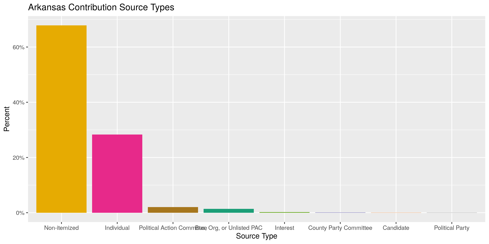
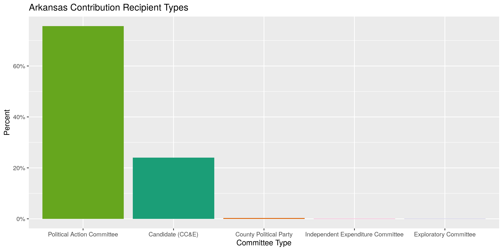
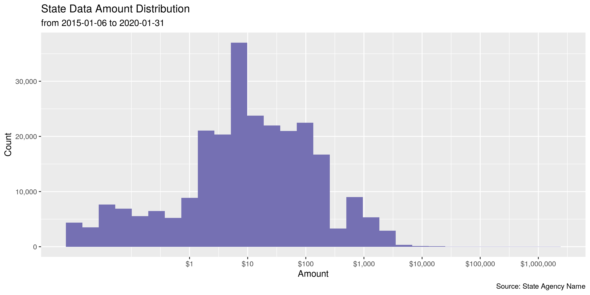
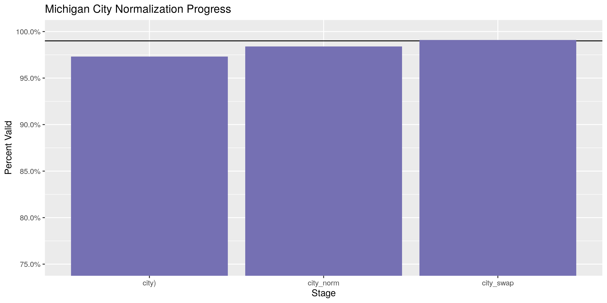
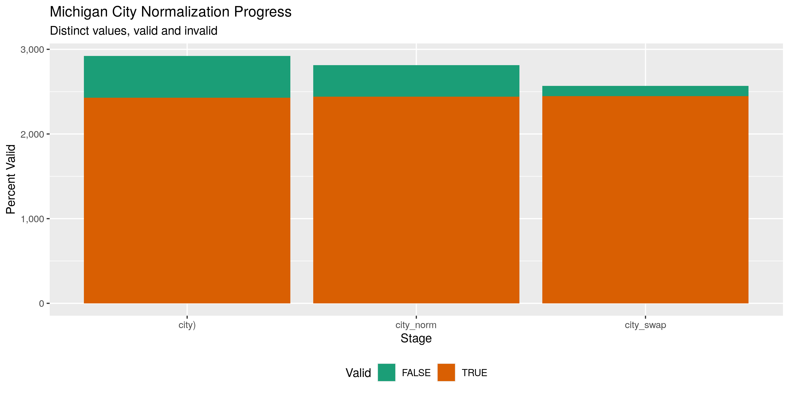

Arkansas Contributions
================
Kiernan Nicholls
2020-02-03 12:29:44

  - [Project](#project)
  - [Objectives](#objectives)
  - [Packages](#packages)
  - [Data](#data)
  - [Import](#import)
      - [Download](#download)
      - [Read](#read)
  - [Explore](#explore)
      - [Missing](#missing)
      - [Duplicates](#duplicates)
      - [Categorical](#categorical)
      - [Amounts](#amounts)
      - [Dates](#dates)
  - [Wrangle](#wrangle)
      - [Address](#address)
      - [ZIP](#zip)
      - [State](#state)
      - [City](#city)
  - [Conclude](#conclude)
  - [Export](#export)

<!-- Place comments regarding knitting here -->

## Project

The Accountability Project is an effort to cut across data silos and
give journalists, policy professionals, activists, and the public at
large a simple way to search across huge volumes of public data about
people and organizations.

Our goal is to standardizing public data on a few key fields by thinking
of each dataset row as a transaction. For each transaction there should
be (at least) 3 variables:

1.  All **parties** to a transaction
2.  The **date** of the transaction
3.  The **amount** of money involved

## Objectives

This document describes the process used to complete the following
objectives:

1.  How many records are in the database?
2.  Check for duplicates
3.  Check ranges
4.  Is there anything blank or missing?
5.  Check for consistency issues
6.  Create a five-digit ZIP Code called `ZIP5`
7.  Create a `YEAR` field from the transaction date
8.  Make sure there is data on both parties to a transaction

## Packages

The following packages are needed to collect, manipulate, visualize,
analyze, and communicate these results. The `pacman` package will
facilitate their installation and attachment.

The IRW’s `campfin` package will also have to be installed from GitHub.
This package contains functions custom made to help facilitate the
processing of campaign finance data.

``` r
if (!require("pacman")) install.packages("pacman")
pacman::p_load_gh("irworkshop/campfin")
pacman::p_load(
  tidyverse, # data manipulation
  lubridate, # datetime strings
  magrittr, # pipe opperators
  janitor, # dataframe clean
  batman, # convert logical
  refinr, # cluster and merge
  scales, # format strings
  knitr, # knit documents
  vroom, # read files fast
  rvest, # read html pages
  glue, # combine strings
  here, # relative storage
  fs # search storage 
)
```

This document should be run as part of the `R_campfin` project, which
lives as a sub-directory of the more general, language-agnostic
[`irworkshop/accountability_datacleaning`](https://github.com/irworkshop/accountability_datacleaning "TAP repo")
GitHub repository.

The `R_campfin` project uses the [RStudio
projects](https://support.rstudio.com/hc/en-us/articles/200526207-Using-Projects "Rproj")
feature and should be run as such. The project also uses the dynamic
`here::here()` tool for file paths relative to *your* machine.

``` r
# where does this document knit?
here::here()
#> [1] "/home/kiernan/Code/accountability_datacleaning/R_campfin"
```

## Data

The data is obtained from the [Arkansas Secretary of
State](https://financial-disclosures.sos.arkansas.gov/index.html#/index)
in the form of biannual CSV files.

> This page provides comma separated value (CSV) downloads of
> contribution, expenditure, and loan data for each reporting year in a
> zipped file format. These files can be downloaded and imported into
> other applications (Microsoft Excel, Microsoft Access, etc.)
> 
> This data is extracted from the Arkansas Campaign Finance database as
> it existed as of 02/03/2020 10:37 AM.

## Import

### Download

``` r
raw_dir <- dir_create(here("ar", "contribs", "data", "raw"))
```

``` r
# does not work
raw_url <- "https://financial-disclosures.sos.arkansas.gov/modules/partials/public/dataDownload.html"
raw_page <- httr::GET(raw_url, query = list(v = "20180912.0"))
raw_page$cookies %>% 
  read_html() %>% 
  html_node(".md-table") %>% 
  html_nodes("a") %>% 
  html_attr("href") %>% 
  download.file(destfile = path(raw_dir, basename(.)))
```

``` r
raw_files <- dir_ls(raw_dir)
```

### Read

``` r
arc <- map_df(
  raw_files,
  read_delim,
  delim = ",",
  escape_backslash = FALSE,
  escape_double = FALSE,
  col_types = cols(
    .default = col_character(),
    `Receipt Amount` = col_double(),
    `Receipt Date` = col_date("%m/%d/%Y  %H:%M:%S %p"),
    `Filed Date` = col_date("%m/%d/%Y  %H:%M:%S %p")
  )
)

arc <- arc %>% 
  remove_empty("cols") %>% 
  clean_names("snake") %>% 
  rename_all(str_remove, "^receipt_") %>% 
  rename_all(str_remove, "_name$") %>% 
  mutate_if(is_binary, to_logical)
```

## Explore

``` r
head(arc)
#> # A tibble: 6 x 23
#>   org_id amount date       last  first middle suffix address1 address2 city  state zip  
#>   <chr>   <dbl> <date>     <chr> <chr> <chr>  <chr>  <chr>    <chr>    <chr> <chr> <chr>
#> 1 219790   1000 2017-07-18 Step… <NA>  <NA>   <NA>   623 Gar… <NA>     Fort… AR    72901
#> 2 220792     50 2017-07-10 Bazz… Chir… L      <NA>   5718 Ca… <NA>     Bent… AR    7201…
#> 3 220792    250 2017-07-10 Amer… <NA>  <NA>   <NA>   425 W. … <NA>     Litt… AR    72203
#> 4 220792    250 2017-07-10 Whol… <NA>  <NA>   <NA>   PO Box … <NA>     Litt… AR    72203
#> 5 219790    500 2017-07-17 Walk… Will… <NA>   <NA>   21 Rive… <NA>     Fort… AR    72903
#> 6 219790    500 2017-08-17 Dunk  Ken   <NA>   <NA>   4387 Ca… <NA>     Spri… AR    72764
#> # … with 11 more variables: description <chr>, id <chr>, filed_date <date>, source_type <chr>,
#> #   type <chr>, committee_type <chr>, candidate <chr>, amended <lgl>, employer <chr>,
#> #   occupation <chr>, occupation_comment <lgl>
tail(arc)
#> # A tibble: 6 x 23
#>   org_id amount date       last  first middle suffix address1 address2 city  state zip  
#>   <chr>   <dbl> <date>     <chr> <chr> <chr>  <chr>  <chr>    <chr>    <chr> <chr> <chr>
#> 1 354389    100 2019-12-09 Godf… Dani… <NA>   <NA>   500 Jan… <NA>     Spri… AR    72762
#> 2 354389    750 2019-12-01 Fran… <NA>  <NA>   <NA>   801 E C… <NA>     Ozark AR    72949
#> 3 354389   1000 2019-12-01 Bond  Bobby <NA>   <NA>   1205 S.… <NA>     Ozark AR    72949
#> 4 355356    250 2019-10-08 Heff… Kyle  <NA>   <NA>   5208 S … <NA>     Roge… AR    72758
#> 5 359159   1000 2019-12-19 Jobs… <NA>  <NA>   <NA>   12227 F… <NA>     Litt… AR    72212
#> 6 359159   2000 2019-12-11 Arka… <NA>  <NA>   <NA>   11224 E… <NA>     Litt… AR    72211
#> # … with 11 more variables: description <chr>, id <chr>, filed_date <date>, source_type <chr>,
#> #   type <chr>, committee_type <chr>, candidate <chr>, amended <lgl>, employer <chr>,
#> #   occupation <chr>, occupation_comment <lgl>
glimpse(sample_n(arc, 20))
#> Observations: 20
#> Variables: 23
#> $ org_id             <chr> "242205", "229720", "276101", "221220", "223411", "242222", "254950",…
#> $ amount             <dbl> 1.00, 200.00, 3.00, 5.00, 15.26, 111.11, 5.00, 0.02, 60.00, 36.96, 50…
#> $ date               <date> 2019-01-18, 2018-04-24, 2019-01-11, 2019-01-08, 2019-07-21, 2019-05-…
#> $ last               <chr> NA, "Edwards", NA, NA, NA, NA, NA, NA, "Sicari", "BURNS", "Rawlings",…
#> $ first              <chr> NA, "C. Dennis", NA, NA, NA, NA, NA, NA, "Catherine", "JOHN", "Jonath…
#> $ middle             <chr> NA, NA, NA, NA, NA, NA, NA, NA, NA, NA, "J", NA, NA, NA, NA, NA, NA, …
#> $ suffix             <chr> NA, NA, NA, NA, NA, NA, NA, NA, NA, NA, NA, NA, NA, NA, NA, NA, NA, N…
#> $ address1           <chr> NA, "P.O. Box 241433", NA, NA, NA, NA, NA, NA, "2 Daltrui Dr", "2521 …
#> $ address2           <chr> NA, NA, NA, NA, NA, NA, NA, NA, NA, NA, NA, NA, NA, NA, NA, NA, NA, N…
#> $ city               <chr> NA, "Little Rock", NA, NA, NA, NA, NA, NA, "Hillsborough", "Lees Summ…
#> $ state              <chr> "ME", "AR", "ME", "ME", "ME", "ME", "ME", "ME", "NJ", "MO", "TN", "ME…
#> $ zip                <chr> NA, "72202", NA, NA, NA, NA, NA, NA, "08844", "64063-3443", "37350", …
#> $ description        <chr> NA, NA, NA, NA, NA, NA, NA, NA, NA, NA, NA, NA, NA, NA, NA, NA, NA, N…
#> $ id                 <chr> "1608614", "488018", "1639355", "1514515", "1947283", "1848969", "128…
#> $ filed_date         <date> 2019-04-17, 2018-05-16, 2019-04-15, 2019-04-08, 2019-10-10, 2019-07-…
#> $ source_type        <chr> "Non-itemized", "Individual", "Non-itemized", "Non-itemized", "Non-it…
#> $ type               <chr> "Contributions", "Contributions", "Contributions", "Contributions", "…
#> $ committee_type     <chr> "Political Action Committee", "Candidate (CC&E)", "Political Action C…
#> $ candidate          <chr> NA, "LaTonya Laird Austin", NA, NA, NA, NA, NA, NA, NA, NA, "Jared He…
#> $ amended            <lgl> FALSE, FALSE, FALSE, FALSE, FALSE, FALSE, FALSE, FALSE, FALSE, FALSE,…
#> $ employer           <chr> NA, "unknown", NA, NA, NA, NA, NA, NA, "Johnson & Johnson", "ELCO of …
#> $ occupation         <chr> NA, "Clergy/Faith-based", NA, NA, NA, NA, NA, NA, "Insurance Industry…
#> $ occupation_comment <lgl> FALSE, FALSE, FALSE, FALSE, FALSE, FALSE, FALSE, FALSE, FALSE, FALSE,…
```

### Missing

``` r
col_stats(arc, count_na)
#> # A tibble: 23 x 4
#>    col                class       n          p
#>    <chr>              <chr>   <int>      <dbl>
#>  1 org_id             <chr>       0 0         
#>  2 amount             <dbl>       0 0         
#>  3 date               <date>      0 0         
#>  4 last               <chr>  172881 0.681     
#>  5 first              <chr>  181902 0.716     
#>  6 middle             <chr>  236249 0.930     
#>  7 suffix             <chr>  252782 0.995     
#>  8 address1           <chr>  172911 0.681     
#>  9 address2           <chr>  250528 0.986     
#> 10 city               <chr>  172854 0.681     
#> 11 state              <chr>       0 0         
#> 12 zip                <chr>  172849 0.681     
#> 13 description        <chr>  252591 0.995     
#> 14 id                 <chr>       0 0         
#> 15 filed_date         <date>      0 0         
#> 16 source_type        <chr>       0 0         
#> 17 type               <chr>       0 0         
#> 18 committee_type     <chr>       0 0         
#> 19 candidate          <chr>  192976 0.760     
#> 20 amended            <lgl>       0 0         
#> 21 employer           <chr>  183032 0.721     
#> 22 occupation         <chr>  193440 0.762     
#> 23 occupation_comment <lgl>       1 0.00000394
```

``` r
arc <- arc %>% flag_na(last, date, amount)
arc$na_flag[arc$source_type == "Non-itemized"] <- FALSE
sum(arc$na_flag)
#> [1] 609
mean(arc$na_flag)
#> [1] 0.002397761
```

### Duplicates

``` r
arc <- flag_dupes(arc, everything())
#> Warning in flag_dupes(arc, everything()): no duplicate rows, column not created
```

### Categorical

``` r
col_stats(arc, n_distinct)
#> # A tibble: 24 x 4
#>    col                class       n          p
#>    <chr>              <chr>   <int>      <dbl>
#>  1 org_id             <chr>     788 0.00310   
#>  2 amount             <dbl>    5125 0.0202    
#>  3 date               <date>    929 0.00366   
#>  4 last               <chr>   14329 0.0564    
#>  5 first              <chr>    6108 0.0240    
#>  6 middle             <chr>     776 0.00306   
#>  7 suffix             <chr>      10 0.0000394 
#>  8 address1           <chr>   35618 0.140     
#>  9 address2           <chr>    1050 0.00413   
#> 10 city               <chr>    3389 0.0133    
#> 11 state              <chr>      75 0.000295  
#> 12 zip                <chr>    6600 0.0260    
#> 13 description        <chr>     809 0.00319   
#> 14 id                 <chr>  253976 1.00      
#> 15 filed_date         <date>    500 0.00197   
#> 16 source_type        <chr>      10 0.0000394 
#> 17 type               <chr>       3 0.0000118 
#> 18 committee_type     <chr>       5 0.0000197 
#> 19 candidate          <chr>     567 0.00223   
#> 20 amended            <lgl>       2 0.00000787
#> 21 employer           <chr>   13224 0.0521    
#> 22 occupation         <chr>      34 0.000134  
#> 23 occupation_comment <lgl>       2 0.00000787
#> 24 na_flag            <lgl>       2 0.00000787
```

``` r
explore_plot(
  data = filter(arc, !is.na(source_type)),
  var = source_type,
  title = "Arkansas Contribution Source Types",
)
```

<!-- -->

``` r
explore_plot(
  data = filter(arc, !is.na(committee_type)),
  var = committee_type,
  title = "Arkansas Contribution Recipient Types",
)
```

<!-- -->

### Amounts

The vast majority of contributions are less than $100 with nearly 17%
being less than $1.

``` r
summary(arc$amount)
#>      Min.   1st Qu.    Median      Mean   3rd Qu.      Max. 
#>       0.0       2.0       9.9     183.6      60.0 1699814.8
mean(arc$amount < 1)
#> [1] 0.1666581
```

<!-- -->

### Dates

``` r
arc <- mutate(arc, year = year(date))
```

``` r
min(arc$date)
#> [1] "2015-01-06"
max(arc$date)
#> [1] "2020-01-31"
sum(arc$date > today())
#> [1] 0
```

## Wrangle

### Address

``` r
arc <- arc %>% 
  # combine street addr
  unite(
    col = address_full,
    starts_with("address"),
    sep = " ",
    remove = FALSE,
    na.rm = TRUE
  ) %>% 
  # normalize combined addr
  mutate(
    address_norm = normal_address(
      address = address_full,
      abbs = usps_street,
      na = invalid_city,
      na_rep = TRUE
    )
  ) %>% 
  select(-address_full)
```

``` r
arc %>% 
  select(contains("address")) %>% 
  distinct() %>% 
  sample_frac()
#> # A tibble: 35,933 x 3
#>    address1              address2  address_norm          
#>    <chr>                 <chr>     <chr>                 
#>  1 320 Main Street       <NA>      320 MAIN ST           
#>  2 2713 Calico Creek     <NA>      2713 CALICO CRK       
#>  3 20 Rocky Top Cir      <NA>      20 ROCKY TOP CIR      
#>  4 4922 Panorama Circle  <NA>      4922 PANORAMA CIR     
#>  5 1213 S 55TH ST        <NA>      1213 S 55TH ST        
#>  6 3355 Hwy 167          <NA>      3355 HWY 167          
#>  7 1250 Lafayette 31     <NA>      1250 LAFAYETTE 31     
#>  8 307 Leatherwood Dr.   <NA>      307 LEATHERWOOD DR    
#>  9 2795 Batesville Blvd. <NA>      2795 BATESVILLE BLVD  
#> 10 1401 W. Capitol       Suite 245 1401 W CAPITOL STE 245
#> # … with 35,923 more rows
```

### ZIP

``` r
arc <- arc %>% 
  mutate(
    zip_norm = normal_zip(
      zip = zip,
      na_rep = TRUE
    )
  )
```

``` r
progress_table(
  arc$zip,
  arc$zip_norm,
  compare = valid_zip
)
#> # A tibble: 2 x 6
#>   stage    prop_in n_distinct prop_na n_out n_diff
#>   <chr>      <dbl>      <dbl>   <dbl> <dbl>  <dbl>
#> 1 zip        0.880       6600   0.681  9733   3069
#> 2 zip_norm   0.998       4736   0.681   191     98
```

### State

``` r
arc <- arc %>% 
  mutate(
    state_norm = normal_state(
      state = state,
      abbreviate = TRUE,
      na_rep = TRUE,
      valid = valid_state
    )
  )
```

``` r
arc %>% 
  filter(state != state_norm) %>% 
  count(state, sort = TRUE)
#> # A tibble: 15 x 2
#>    state     n
#>    <chr> <int>
#>  1 Ar       94
#>  2 oH       32
#>  3 tx       20
#>  4 dc       15
#>  5 aR       13
#>  6 fL        7
#>  7 oK        5
#>  8 dC        2
#>  9 Ne        2
#> 10 ar        1
#> 11 Fl        1
#> 12 iN        1
#> 13 pa        1
#> 14 rI        1
#> 15 Wa        1
```

``` r
progress_table(
  arc$state,
  arc$state_norm,
  compare = valid_state
)
#> # A tibble: 2 x 6
#>   stage      prop_in n_distinct   prop_na n_out n_diff
#>   <chr>        <dbl>      <dbl>     <dbl> <dbl>  <dbl>
#> 1 state        0.999         75 0           204     21
#> 2 state_norm   1             55 0.0000315     0      1
```

### City

The `campfin::normal_city()` function first forces consistent
capitalization, removes punctuation, and expands common abbreviations.

``` r
arc <- arc %>% 
  mutate(
    city_norm = normal_city(
      city = city, 
      abbs = usps_city,
      states = c("AR", "DC", "ARKANSAS"),
      na = invalid_city,
      na_rep = TRUE
    )
  )
```

We can further reduce these inconsistencies by comparing our normalized
value to the *expected* value for that record’s (normalized) state and
ZIP code. Using `campfin::is_abbrev()` and `campfin::str_dist()`, we can
test whether the expected value is either an abbreviation for or within
one character of our normalized value.

``` r
arc <- arc %>% 
  rename(city_raw = city) %>% 
  left_join(
    y = zipcodes,
    by = c(
      "state_norm" = "state",
      "zip_norm" = "zip"
    )
  ) %>% 
  rename(city_match = city) %>% 
  mutate(
    match_abb = is_abbrev(city_norm, city_match),
    match_dist = str_dist(city_norm, city_match),
    city_swap = if_else(
      condition = match_abb | match_dist == 1,
      true = city_match,
      false = city_norm
    )
  ) %>% 
  select(
    -city_match,
    -match_dist,
    -match_abb
  )
```

| Stage      | Prop in | N distinct | Prop NA | N out | N diff |
| :--------- | ------: | ---------: | ------: | ----: | -----: |
| city\_raw) |   0.976 |       3038 |   0.681 |  1958 |    467 |
| city\_norm |   0.981 |       2931 |   0.681 |  1567 |    386 |
| city\_swap |   0.990 |       2690 |   0.682 |   774 |    120 |

<!-- -->

<!-- -->

## Conclude

1.  There are 253,987 records in the database.
2.  There are 0 duplicate records in the database.
3.  The range of `date` is good, but a number of `amount` are less than
    $1.
4.  There are 609 records missing the contributor or date.
5.  Consistency in goegraphic data has been improved with
    `campfin::normal_*()`.
6.  The 5-digit `zip_norm` variable has been made with
    `campfin::normal_zip()`.
7.  The 4-digit `year` variable has been made with `lubridate::year()`.

## Export

``` r
proc_dir <- dir_create(here("ar", "contribs", "data", "processed"))
```

``` r
arc <- arc %>% 
  select(
    -city_norm,
    city_norm = city_swap
  ) %>% 
  rename_all(
    str_replace, "norm", "clean"
  )
```

``` r
glimpse(arc)
#> Observations: 253,987
#> Variables: 29
#> $ org_id             <chr> "219790", "220792", "220792", "220792", "219790", "219790", "220792",…
#> $ amount             <dbl> 1000, 50, 250, 250, 500, 500, 250, 300, 1000, 50, 2700, 250, 250, 100…
#> $ date               <date> 2017-07-18, 2017-07-10, 2017-07-10, 2017-07-10, 2017-07-17, 2017-08-…
#> $ last               <chr> "Stephens Energy PAC", "Bazzelle", "American Electric Power", "Wholes…
#> $ first              <chr> NA, "Chirie", NA, NA, "William", "Ken", NA, NA, "Charles", "Charlene"…
#> $ middle             <chr> NA, "L", NA, NA, NA, NA, NA, NA, NA, NA, NA, NA, NA, "R.", NA, NA, NA…
#> $ suffix             <chr> NA, NA, NA, NA, NA, NA, NA, NA, NA, NA, NA, NA, NA, "JR.", NA, NA, NA…
#> $ address1           <chr> "623 Garrison Avenue", "5718 Catalina Ave", "425 W. Capitol Ave", "PO…
#> $ address2           <chr> NA, NA, NA, NA, NA, NA, "Suite 1200", NA, NA, NA, "Suite 180", NA, NA…
#> $ city_raw           <chr> "Fort Smith", "Benton", "Little Rock", "Little Rock", "Fort Smith", "…
#> $ state              <chr> "AR", "AR", "AR", "AR", "AR", "AR", "AR", "AR", "MO", "AR", "AR", "AR…
#> $ zip                <chr> "72901", "72019-6667", "72203", "72203", "72903", "72764", "20004", "…
#> $ description        <chr> NA, NA, NA, NA, NA, NA, NA, NA, NA, NA, NA, NA, NA, NA, NA, NA, NA, N…
#> $ id                 <chr> "3148", "7446", "7462", "7451", "3149", "3150", "7469", "7470", "3350…
#> $ filed_date         <date> 2017-10-09, 2017-10-11, 2017-10-11, 2017-10-11, 2017-10-09, 2017-10-…
#> $ source_type        <chr> "Bus, Org, or Unlisted PAC", "Individual", "Bus, Org, or Unlisted PAC…
#> $ type               <chr> "Contributions", "Contributions", "Contributions", "Contributions", "…
#> $ committee_type     <chr> "Candidate (CC&E)", "Candidate (CC&E)", "Candidate (CC&E)", "Candidat…
#> $ candidate          <chr> "Gary Don Stubblefield", "Aaron Michel Pilkington", "Aaron Michel Pil…
#> $ amended            <lgl> FALSE, FALSE, FALSE, FALSE, FALSE, FALSE, FALSE, FALSE, FALSE, FALSE,…
#> $ employer           <chr> NA, NA, NA, NA, "The Stephens Group, LLC", "Simplex Grinnell Security…
#> $ occupation         <chr> NA, "Healthcare/Medical", NA, NA, "Financial/Investment", "General Bu…
#> $ occupation_comment <lgl> FALSE, FALSE, FALSE, FALSE, FALSE, FALSE, FALSE, FALSE, FALSE, FALSE,…
#> $ na_flag            <lgl> FALSE, FALSE, FALSE, FALSE, FALSE, FALSE, FALSE, FALSE, FALSE, FALSE,…
#> $ year               <dbl> 2017, 2017, 2017, 2017, 2017, 2017, 2017, 2017, 2017, 2017, 2017, 201…
#> $ address_clean      <chr> "623 GARRISON AVE", "5718 CATALINA AVE", "425 W CAPITOL AVE", "PO BOX…
#> $ zip_clean          <chr> "72901", "72019", "72203", "72203", "72903", "72764", "20004", "72023…
#> $ state_clean        <chr> "AR", "AR", "AR", "AR", "AR", "AR", "AR", "AR", "MO", "AR", "AR", "AR…
#> $ city_clean         <chr> "FORT SMITH", "BENTON", "LITTLE ROCK", "LITTLE ROCK", "FORT SMITH", "…
```

``` r
write_csv(
  x = arc,
  path = path(proc_dir, "ar_contribs_clean.csv"),
  na = ""
)
```
