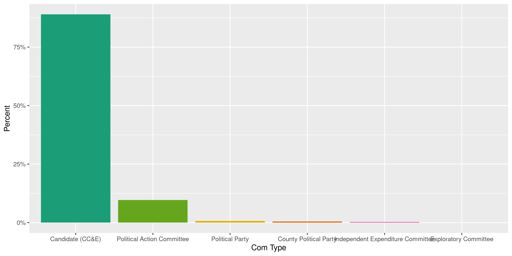
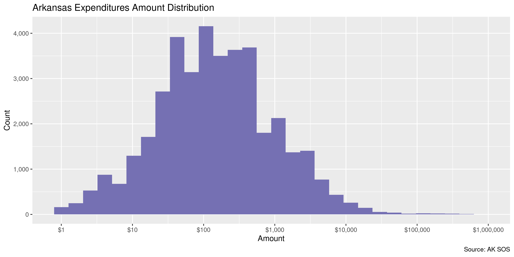
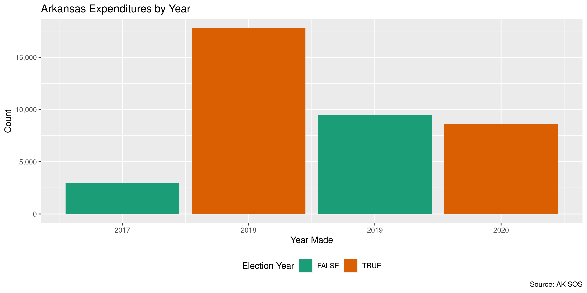
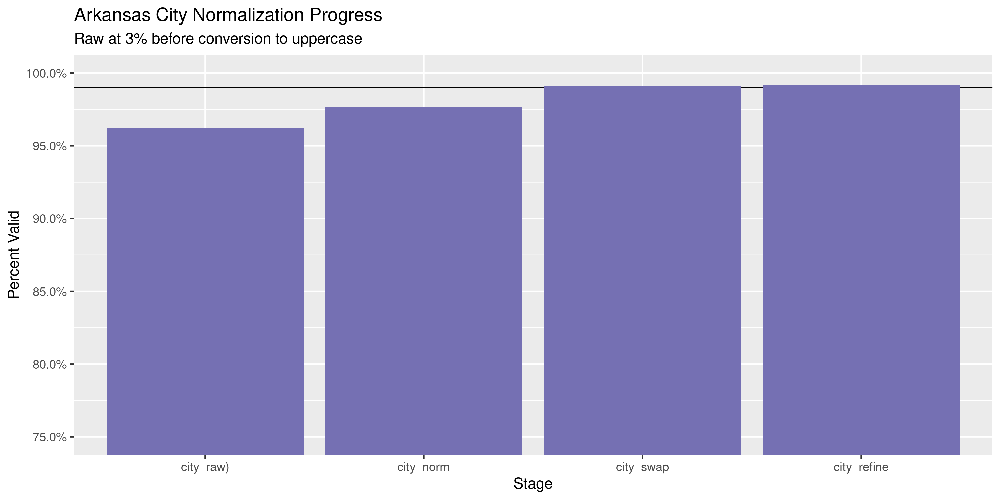

Arkansas Expenditures
================
Kiernan Nicholls
2020-06-24 13:35:24

  - [Project](#project)
  - [Objectives](#objectives)
  - [Packages](#packages)
  - [Data](#data)
  - [Download](#download)
  - [Fix](#fix)
  - [Read](#read)
  - [Explore](#explore)
  - [Wrangle](#wrangle)
  - [Conclude](#conclude)
  - [Export](#export)
  - [Upload](#upload)
  - [Dictionary](#dictionary)

<!-- Place comments regarding knitting here -->

## Project

The Accountability Project is an effort to cut across data silos and
give journalists, policy professionals, activists, and the public at
large a simple way to search across huge volumes of public data about
people and organizations.

Our goal is to standardizing public data on a few key fields by thinking
of each dataset row as a transaction. For each transaction there should
be (at least) 3 variables:

1.  All **parties** to a transaction.
2.  The **date** of the transaction.
3.  The **amount** of money involved.

## Objectives

This document describes the process used to complete the following
objectives:

1.  How many records are in the database?
2.  Check for entirely duplicated records.
3.  Check ranges of continuous variables.
4.  Is there anything blank or missing?
5.  Check for consistency issues.
6.  Create a five-digit ZIP Code called `zip`.
7.  Create a `year` field from the transaction date.
8.  Make sure there is data on both parties to a transaction.

## Packages

The following packages are needed to collect, manipulate, visualize,
analyze, and communicate these results. The `pacman` package will
facilitate their installation and attachment.

The IRW’s `campfin` package will also have to be installed from GitHub.
This package contains functions custom made to help facilitate the
processing of campaign finance data.

``` r
if (!require("pacman")) install.packages("pacman")
pacman::p_load_gh("irworkshop/campfin")
pacman::p_load(
  tidyverse, # data manipulation
  lubridate, # datetime strings
  gluedown, # printing markdown
  magrittr, # pipe operators
  janitor, # clean data frames
  refinr, # cluster and merge
  scales, # format strings
  knitr, # knit documents
  vroom, # read files fast
  rvest, # html scraping
  glue, # combine strings
  here, # relative paths
  httr, # http requests
  fs # local storage 
)
```

This document should be run as part of the `R_campfin` project, which
lives as a sub-directory of the more general, language-agnostic
[`irworkshop/accountability_datacleaning`](https://github.com/irworkshop/accountability_datacleaning)
GitHub repository.

The `R_campfin` project uses the [RStudio
projects](https://support.rstudio.com/hc/en-us/articles/200526207-Using-Projects)
feature and should be run as such. The project also uses the dynamic
`here::here()` tool for file paths relative to *your* machine.

``` r
# where does this document knit?
here::here()
#> [1] "/home/kiernan/Code/accountability_datacleaning/R_campfin"
```

## Data

Data is obtained from the Arkansas Secretary of State’s [Financial
Disclosure
portal](https://financial-disclosures.sos.arkansas.gov/index.html#/dataDownload).

> This page provides comma separated value (CSV) downloads of
> contribution, expenditure, and loan data for each reporting year in a
> zipped file format. These files can be downloaded and imported into
> other applications (Microsoft Excel, Microsoft Access, etc.)
> 
> This data is extracted from the Arkansas Campaign Finance database as
> it existed as of 06/24/2020 12:02 PM.

The AR SOS also provides a [data layout
key](https://financial-disclosures.sos.arkansas.gov//CFISAR_Service/Template/KeyDownloads/Expenditures,%20Debts,%20and%20Payments%20to%20Workers%20File%20Layout%20Key.pdf):

| Field | Field Name           | Description                                     |
| :---- | :------------------- | :---------------------------------------------- |
| A     | `ORG ID`             | Unique ID of the paying candidate or committee. |
| B     | `EXPENDITURE AMOUNT` | Expenditure Amount.                             |
| C     | `EXPENDITURE  DATE`  | Expenditure Date.                               |
| D     | `LAST NAME`          | Payee Last or Full Name.                        |
| E     | `FIRST NAME`         | Payee First Name.                               |
| F     | `MIDDLE NAME`        | Payee Middle Initial or Name if provided.       |
| G     | `SUFFIX`             | Payee Name Suffix.                              |
| H     | `ADDRESS 1`          | Payee Street, PO Box, etc.                      |
| I     | `ADDRESS 2`          | Payee Suite/Apartment number.                   |
| J     | `CITY`               | Payee City                                      |
| K     | `STATE`              | Payee State                                     |
| L     | `ZIP`                | Payee Zip Code                                  |
| M     | `EXPLANATION`        | Explanation provided for the expenditure.       |
| N     | `EXPENDITURE ID`     | Unique Expenditure internal ID.                 |
| O     | `FILED DATE`         | Expenditure Filed Date                          |
| P     | `PURPOSE`            | Purpose of the Expenditure.                     |
| Q     | `EXPENDITURE TYPE`   | Indicates Type of Expenditure.                  |
| R     | `COMMITTEE TYPE`     | Indicates Type of Committee                     |
| S     | `COMMITTEE NAME`     | Name of the paying committee.                   |
| T     | `CANDIDATE NAME`     | Name of the paying candidate.                   |
| U     | `AMENDED`            | Y/N if an amendment was filed.                  |

## Download

To download the expenditure files, we can make a series of direct
`httr::GET()` requests to the AR SOS server, downloaded the CSV files
locally.

``` r
raw_dir <- dir_create(here("ar", "expends", "data", "raw"))
raw_url <- str_c(
  base = "https://financial-disclosures.sos.arkansas.gov",
  path = "/CFISAR_Service/api/DataDownload/GetCSVDownloadReport"
)
```

``` r
ys <- seq(2017, year(today()))
if (dir_ls(raw_dir) != length(ys)) {
  for (y in ys) {
    raw_path <- path(raw_dir, glue("EXP_{y}.csv"))
    GET(
      url = raw_url,
      write_disk(raw_path, overwrite = TRUE),
      query = list(
        year = "2017",
        transactionType = "EXP",
        reportFormat = "csv",
        fileName = glue("EXP_{y}.csv")
      )
    )
  }
}
```

## Fix

``` r
raw_paths <- dir_ls(raw_dir)
fix_dir <- dir_create(path(dirname(raw_dir), "fix"))
for (f in raw_paths) {
  read_file(f) %>% 
    str_replace_all("(?<!,|^)\"(?!,|$)", "'") %>% 
    write_file(path(fix_dir, basename(f)))
}
fix_paths <- dir_ls(fix_dir)
```

## Read

``` r
are <- map_df(
  .x = fix_paths,
  .f = read_delim,
  delim = ",",
  escape_backslash = FALSE,
  escape_double = FALSE,
  col_types = cols(
    .default = col_character(),
    `Expenditure Amount` = col_double(),
    `Expenditure Date` = col_date("%m/%d/%Y %H:%M:%S %p"),
    `Filed Date` = col_date("%m/%d/%Y %H:%M:%S %p")
  )
)
```

We can count the distinct values of a discrete variable to check file
reading.

``` r
count(are, com_type)
#> # A tibble: 6 x 2
#>   com_type                              n
#>   <chr>                             <int>
#> 1 Candidate (CC&E)                  34596
#> 2 County Political Party              163
#> 3 Exploratory Committee                16
#> 4 Independent Expenditure Committee    83
#> 5 Political Action Committee         3742
#> 6 Political Party                     267
```

## Explore

``` r
glimpse(are)
#> Rows: 38,867
#> Columns: 21
#> $ org_id     <chr> "219790", "219790", "219790", "219790", "219790", "219790", "220797", "220797…
#> $ amount     <dbl> 125.00, 140.00, 350.00, 1470.00, 1550.00, 1820.00, 20.00, 20.00, 29.45, 64.00…
#> $ date       <date> 2017-09-27, 2017-08-03, 2017-09-27, 2017-09-09, 2017-08-19, 2017-09-09, 2017…
#> $ last       <chr> "KXIO Radio", "KXIO Radio", "Johnson County Fair", "South Logan County Fair",…
#> $ first      <chr> NA, NA, NA, NA, NA, NA, "Abigail", "Sarah", NA, NA, NA, NA, NA, NA, NA, NA, N…
#> $ middle     <chr> NA, NA, NA, NA, NA, NA, NA, NA, NA, NA, NA, NA, NA, NA, NA, NA, NA, NA, NA, N…
#> $ suffix     <chr> NA, NA, NA, NA, NA, NA, NA, NA, NA, NA, NA, NA, NA, NA, NA, NA, NA, NA, NA, N…
#> $ address1   <chr> "901 South Rogers Street", "901 South Rogers Street", "1586 Oakland Street", …
#> $ address2   <chr> NA, NA, NA, NA, NA, NA, NA, NA, NA, NA, NA, NA, NA, NA, NA, NA, NA, NA, NA, N…
#> $ city       <chr> "Clarksville", "Clarksville", "Clarksville", "Booneville", "Paris", "Danville…
#> $ state      <chr> "AR", "AR", "AR", "AR", "AR", "AR", NA, NA, NA, NA, NA, "AR", "AR", "AR", "AR…
#> $ zip        <chr> "72830", "72830", "72830", "72927", "72855", "72833", NA, NA, NA, NA, NA, "72…
#> $ explain    <chr> "Radio Advertising", "Radio Advertising", "County Fair Livestock Premium", "C…
#> $ id         <chr> "3349", "2867", "3348", "3346", "2866", "3347", "3170", "3169", "3411", "3410…
#> $ filed_date <date> 2017-10-09, 2017-10-09, 2017-10-09, 2017-10-09, 2017-10-09, 2017-10-09, 2017…
#> $ purpose    <chr> "Radio Advertising", "Radio Advertising", "Other (list)", "Other (list)", "Ot…
#> $ type       <chr> "Expenditures", "Expenditures", "Expenditures", "Expenditures", "Expenditures…
#> $ com_type   <chr> "Candidate (CC&E)", "Candidate (CC&E)", "Candidate (CC&E)", "Candidate (CC&E)…
#> $ committee  <chr> "Gary Don Stubblefield", "Gary Don Stubblefield", "Gary Don Stubblefield", "G…
#> $ candidate  <chr> "Stubblefield, Gary Don", "Stubblefield, Gary Don", "Stubblefield, Gary Don",…
#> $ amended    <lgl> FALSE, FALSE, FALSE, FALSE, FALSE, FALSE, FALSE, FALSE, FALSE, FALSE, FALSE, …
tail(are)
#> # A tibble: 6 x 21
#>   org_id amount date       last  first middle suffix address1 address2 city  state zip   explain
#>   <chr>   <dbl> <date>     <chr> <chr> <chr>  <chr>  <chr>    <chr>    <chr> <chr> <chr> <chr>  
#> 1 367179 6730   2019-11-04 Arka… <NA>  <NA>   <NA>   State C… <NA>     Litt… AR    72201 Filing…
#> 2 367235 6730   2019-11-06 Arka… <NA>  <NA>   <NA>   State C… <NA>     Litt… AR    72201 <NA>   
#> 3 367341   51.8 2020-03-17 <NA>  <NA>  <NA>   <NA>   <NA>     <NA>     <NA>  <NA>  <NA>  Checks 
#> 4 367341 4308.  2020-03-31 Rais… <NA>  <NA>   <NA>   P.O. Bo… <NA>     Litt… AR    72221 Proces…
#> 5 367568 6730   2019-11-05 Arka… <NA>  <NA>   <NA>   State C… <NA>     Litt… AR    72201 <NA>   
#> 6 370131 6730   2019-11-08 Arka… <NA>  <NA>   <NA>   500 Woo… <NA>     Litt… AR    72201 filing…
#> # … with 8 more variables: id <chr>, filed_date <date>, purpose <chr>, type <chr>, com_type <chr>,
#> #   committee <chr>, candidate <chr>, amended <lgl>
```

### Missing

Variables differ in the degree of values they are missing.

``` r
col_stats(are, count_na)
#> # A tibble: 21 x 4
#>    col        class      n     p
#>    <chr>      <chr>  <int> <dbl>
#>  1 org_id     <chr>      0 0    
#>  2 amount     <dbl>      0 0    
#>  3 date       <date>     0 0    
#>  4 last       <chr>   9846 0.253
#>  5 first      <chr>  32714 0.842
#>  6 middle     <chr>  37747 0.971
#>  7 suffix     <chr>  38769 0.997
#>  8 address1   <chr>  10414 0.268
#>  9 address2   <chr>  37435 0.963
#> 10 city       <chr>  10397 0.268
#> 11 state      <chr>  10397 0.268
#> 12 zip        <chr>  10397 0.268
#> 13 explain    <chr>   8246 0.212
#> 14 id         <chr>      0 0    
#> 15 filed_date <date>     0 0    
#> 16 purpose    <chr>   5609 0.144
#> 17 type       <chr>      0 0    
#> 18 com_type   <chr>      0 0    
#> 19 committee  <chr>      0 0    
#> 20 candidate  <chr>   4255 0.109
#> 21 amended    <lgl>      0 0
```

With `campfin::flag_na()`, we can flag any record missing a key
variable.

``` r
are <- are %>% flag_na(date, last, amount, committee)
percent(mean(are$na_flag), 0.1)
#> [1] "25.3%"
```

A significant amount of records are missing the `last` name.

``` r
are %>% 
  filter(na_flag) %>% 
  select(date, last, amount, committee)
#> # A tibble: 9,846 x 4
#>    date       last  amount committee                       
#>    <date>     <chr>  <dbl> <chr>                           
#>  1 2017-08-22 <NA>    29.4 CLOUD FOR STATE REP CAMPAIGN    
#>  2 2017-08-22 <NA>    64   CLOUD FOR STATE REP CAMPAIGN    
#>  3 2017-09-20 <NA>   100   CLOUD FOR STATE REP CAMPAIGN    
#>  4 2017-09-25 <NA>    23.1 Ron McNair                      
#>  5 2017-09-07 <NA>    50   Ron McNair                      
#>  6 2017-08-24 <NA>    60   Ron McNair                      
#>  7 2017-07-17 <NA>     9.8 Wade William Andrews            
#>  8 2017-07-17 <NA>    25   Wade William Andrews            
#>  9 2017-07-17 <NA>    71.6 Wade William Andrews            
#> 10 2017-07-13 <NA>    28.6 Committee To Elect Spencer Hawks
#> # … with 9,836 more rows
```

There doesn’t appear to be a pattern to which files are missing a `last`
name.

``` r
are %>% 
  filter(na_flag) %>% 
  count(com_type)
#> # A tibble: 6 x 2
#>   com_type                              n
#>   <chr>                             <int>
#> 1 Candidate (CC&E)                   9020
#> 2 County Political Party               66
#> 3 Exploratory Committee                 2
#> 4 Independent Expenditure Committee     1
#> 5 Political Action Committee          648
#> 6 Political Party                     109
```

### Duplicates

If we ignore the supposedly unique `id` variable, there are a number of
duplicate records.

``` r
are <- flag_dupes(are, -id)
percent(mean(are$dupe_flag), 0.1)
#> [1] "1.8%"
```

``` r
are %>% 
  filter(dupe_flag) %>% 
  select(date, last, amount, committee)
#> # A tibble: 710 x 4
#>    date       last                amount committee                       
#>    <date>     <chr>                <dbl> <chr>                           
#>  1 2017-07-20 <NA>                    70 John David Maddox               
#>  2 2017-07-20 <NA>                    70 John David Maddox               
#>  3 2017-08-07 Bank of Little Rock      2 Ross Allen Noland               
#>  4 2017-08-07 Bank of Little Rock      2 Ross Allen Noland               
#>  5 2017-08-10 Big Red                 25 Kim David Hammer                
#>  6 2017-08-10 Big Red                 25 Kim David Hammer                
#>  7 2017-08-22 Boys & Girls Club      100 Kim David Hammer                
#>  8 2017-08-22 Boys & Girls Club      100 Kim David Hammer                
#>  9 2018-10-12 McAlister              100 Committee To Elect Spencer Hawks
#> 10 2018-10-12 McAlister              100 Committee To Elect Spencer Hawks
#> # … with 700 more rows
```

Even more of these duplicate records are missing a `last` name.

``` r
percent(mean(is.na(are$last[are$dupe_flag])), 0.1)
#> [1] "53.5%"
```

### Categorical

``` r
col_stats(are, n_distinct)
#> # A tibble: 23 x 4
#>    col        class      n         p
#>    <chr>      <chr>  <int>     <dbl>
#>  1 org_id     <chr>   1121 0.0288   
#>  2 amount     <dbl>  13003 0.335    
#>  3 date       <date>  1059 0.0272   
#>  4 last       <chr>  10039 0.258    
#>  5 first      <chr>   1250 0.0322   
#>  6 middle     <chr>    177 0.00455  
#>  7 suffix     <chr>      8 0.000206 
#>  8 address1   <chr>  10949 0.282    
#>  9 address2   <chr>    473 0.0122   
#> 10 city       <chr>   1524 0.0392   
#> 11 state      <chr>     58 0.00149  
#> 12 zip        <chr>   1930 0.0497   
#> 13 explain    <chr>  12740 0.328    
#> 14 id         <chr>  38756 0.997    
#> 15 filed_date <date>   588 0.0151   
#> 16 purpose    <chr>     25 0.000643 
#> 17 type       <chr>      6 0.000154 
#> 18 com_type   <chr>      6 0.000154 
#> 19 committee  <chr>    972 0.0250   
#> 20 candidate  <chr>    636 0.0164   
#> 21 amended    <lgl>      2 0.0000515
#> 22 na_flag    <lgl>      2 0.0000515
#> 23 dupe_flag  <lgl>      2 0.0000515
```

``` r
explore_plot(are, type)
```

<!-- -->

``` r
explore_plot(are, com_type)
```

<!-- -->

### Amounts

``` r
summary(are$amount)
#>     Min.  1st Qu.   Median     Mean  3rd Qu.     Max. 
#>      0.0     40.0    133.1   1235.1    500.0 793658.7
mean(are$amount <= 0)
#> [1] 0
```

<!-- -->

### Dates

We can add the calendar year from `date` with `lubridate::year()`

``` r
are <- mutate(are, year = year(date))
```

``` r
min(are$date)
#> [1] "2015-01-02"
sum(are$year < 2000)
#> [1] 0
max(are$date)
#> [1] "2020-04-30"
sum(are$date > today())
#> [1] 0
```

<!-- -->

## Wrangle

To improve the searchability of the database, we will perform some
consistent, confident string normalization. For geographic variables
like city names and ZIP codes, the corresponding `campfin::normal_*()`
functions are tailor made to facilitate this process.

### Address

For the street `addresss` variable, the `campfin::normal_address()`
function will force consistence case, remove punctuation, and abbreviate
official USPS suffixes.

``` r
are <- are %>% 
  unite(
    col = address_full,
    starts_with("address"),
    sep = " ",
    remove = FALSE,
    na.rm = TRUE
  ) %>% 
  mutate(
    address_norm = normal_address(
      address = address_full,
      abbs = usps_street,
      na_rep = TRUE
    )
  ) %>% 
  select(-address_full)
```

``` r
are %>% 
  select(contains("address")) %>% 
  distinct() %>% 
  sample_n(10)
#> # A tibble: 10 x 3
#>    address1                       address2 address_norm                  
#>    <chr>                          <chr>    <chr>                         
#>  1 5326 Sherwood Ln               <NA>     5326 SHERWOOD LN              
#>  2 1025 Parkway                   <NA>     1025 PKWY                     
#>  3 11735 North Hwy 59             <NA>     11735 N HWY 59                
#>  4 Mountainburg Elementary School <NA>     MOUNTAINBURG ELEMENTARY SCHOOL
#>  5 710 Mitchell Road              <NA>     710 MITCHELL RD               
#>  6 15401 Chenal Pkwy              <NA>     15401 CHENAL PKWY             
#>  7 3912 Springs Road              <NA>     3912 SPGS RD                  
#>  8 2455 Paces Ferry Road NW       <NA>     2455 PACES FRY RD NW          
#>  9 1627 E Joyce Blvd              <NA>     1627 E JOYCE BLVD             
#> 10 1 Hack Way                     <NA>     1 HACK WAY
```

### ZIP

For ZIP codes, the `campfin::normal_zip()` function will attempt to
create valid *five* digit codes by removing the ZIP+4 suffix and
returning leading zeroes dropped by other programs like Microsoft Excel.

``` r
are <- mutate(
  .data = are,
  zip_norm = normal_zip(
    zip = zip,
    na_rep = TRUE
  )
)
```

``` r
progress_table(
  are$zip,
  are$zip_norm,
  compare = valid_zip
)
#> # A tibble: 2 x 6
#>   stage    prop_in n_distinct prop_na n_out n_diff
#>   <chr>      <dbl>      <dbl>   <dbl> <dbl>  <dbl>
#> 1 zip        0.975       1930   0.268   715    206
#> 2 zip_norm   0.995       1823   0.269   136     51
```

### State

Valid two digit state abbreviations can be made using the
`campfin::normal_state()` function.

``` r
are <- mutate(
  .data = are,
  state_norm = normal_state(
    state = state,
    abbreviate = TRUE,
    na_rep = TRUE,
    valid = valid_state
  )
)
```

``` r
are %>% 
  filter(state != state_norm) %>% 
  count(state, state_norm, sort = TRUE)
#> # A tibble: 4 x 3
#>   state state_norm     n
#>   <chr> <chr>      <int>
#> 1 ca    CA            73
#> 2 aR    AR             4
#> 3 Ar    AR             1
#> 4 tX    TX             1
```

``` r
progress_table(
  are$state,
  are$state_norm,
  compare = valid_state
)
#> # A tibble: 2 x 6
#>   stage      prop_in n_distinct prop_na n_out n_diff
#>   <chr>        <dbl>      <dbl>   <dbl> <dbl>  <dbl>
#> 1 state        0.997         58   0.268    84      7
#> 2 state_norm   1             52   0.268     0      1
```

### City

Cities are the most difficult geographic variable to normalize, simply
due to the wide variety of valid cities and formats.

#### Normal

The `campfin::normal_city()` function is a good start, again converting
case, removing punctuation, but *expanding* USPS abbreviations. We can
also remove `invalid_city` values.

``` r
are <- mutate(
  .data = are,
  city_norm = normal_city(
    city = city, 
    abbs = usps_city,
    states = c("AR", "DC", "ARKANSAS"),
    na = invalid_city,
    na_rep = TRUE
  )
)
```

#### Swap

We can further improve normalization by comparing our normalized value
against the *expected* value for that record’s state abbreviation and
ZIP code. If the normalized value is either an abbreviation for or very
similar to the expected value, we can confidently swap those two.

``` r
are <- are %>% 
  rename(city_raw = city) %>% 
  left_join(
    y = zipcodes,
    by = c(
      "state_norm" = "state",
      "zip_norm" = "zip"
    )
  ) %>% 
  rename(city_match = city) %>% 
  mutate(
    match_abb = is_abbrev(city_norm, city_match),
    match_dist = str_dist(city_norm, city_match),
    city_swap = if_else(
      condition = !is.na(match_dist) & (match_abb | match_dist == 1),
      true = city_match,
      false = city_norm
    )
  ) %>% 
  select(
    -city_match,
    -match_dist,
    -match_abb
  )
```

#### Refine

The [OpenRefine](https://openrefine.org/) algorithms can be used to
group similar strings and replace the less common versions with their
most common counterpart. This can greatly reduce inconsistency, but with
low confidence; we will only keep any refined strings that have a valid
city/state/zip combination.

``` r
good_refine <- are %>% 
  mutate(
    city_refine = city_swap %>% 
      key_collision_merge() %>% 
      n_gram_merge(numgram = 1)
  ) %>% 
  filter(city_refine != city_swap) %>% 
  inner_join(
    y = zipcodes,
    by = c(
      "city_refine" = "city",
      "state_norm" = "state",
      "zip_norm" = "zip"
    )
  )
```

    #> # A tibble: 8 x 5
    #>   state_norm zip_norm city_swap       city_refine       n
    #>   <chr>      <chr>    <chr>           <chr>         <int>
    #> 1 WA         98052    REDMONDREDMOND  REDMOND           4
    #> 2 AR         72932    CEADERVILLE     CEDARVILLE        3
    #> 3 AR         72076    JACKSONSONVILLE JACKSONVILLE      1
    #> 4 AR         72106    MAYFLOWER `     MAYFLOWER         1
    #> 5 AR         72227    LITTLE ROCKCK   LITTLE ROCK       1
    #> 6 AR         72801    RUSSELLIVE      RUSSELLVILLE      1
    #> 7 CA         94103    SAN FRANSICO    SAN FRANCISCO     1
    #> 8 OH         45202    CINCINATTI      CINCINNATI        1

Then we can join the refined values back to the database.

``` r
are <- are %>% 
  left_join(good_refine) %>% 
  mutate(city_refine = coalesce(city_refine, city_swap))
```

#### Progress

| stage        | prop\_in | n\_distinct | prop\_na | n\_out | n\_diff |
| :----------- | -------: | ----------: | -------: | -----: | ------: |
| city\_raw)   |    0.962 |        1307 |    0.268 |   1075 |     271 |
| city\_norm   |    0.976 |        1249 |    0.270 |    670 |     204 |
| city\_swap   |    0.991 |        1141 |    0.270 |    247 |      89 |
| city\_refine |    0.992 |        1133 |    0.270 |    234 |      81 |

You can see how the percentage of valid values increased with each
stage.

<!-- -->

More importantly, the number of distinct values decreased each stage. We
were able to confidently change many distinct invalid values to their
valid equivalent.

<!-- -->

## Conclude

Before exporting, we can remove the intermediary normalization columns
and rename all added variables with the `_clean` suffix.

``` r
are <- are %>% 
  select(
    -city_norm,
    -city_swap,
    city_clean = city_refine
  ) %>% 
  rename_all(~str_replace(., "_norm", "_clean")) %>% 
  rename_all(~str_remove(., "_raw"))
```

``` r
glimpse(sample_frac(are))
#> Rows: 38,867
#> Columns: 28
#> $ org_id        <chr> "333491", "342588", "237659", "226078", "223601", "226078", "223601", "252…
#> $ amount        <dbl> 4.58, 3606.00, 39.27, 6.91, 35.00, 10802.64, 4025.00, 249.89, 30.00, 140.6…
#> $ date          <date> 2019-08-31, 2020-02-06, 2018-03-16, 2018-06-28, 2020-02-06, 2018-04-27, 2…
#> $ last          <chr> "Office Depot/Office Max", "Neely", NA, NA, NA, "The Campaign Workshop", "…
#> $ first         <chr> NA, "Efrem", NA, NA, NA, NA, NA, NA, NA, NA, NA, NA, NA, "Jordan", NA, NA,…
#> $ middle        <chr> NA, NA, NA, NA, NA, NA, NA, NA, NA, NA, NA, NA, NA, NA, NA, NA, NA, NA, NA…
#> $ suffix        <chr> NA, NA, NA, NA, NA, NA, NA, NA, NA, NA, NA, NA, NA, NA, NA, NA, NA, NA, NA…
#> $ address1      <chr> "Little Rock", "506 Greenbriar Dr.", NA, NA, NA, "1660 1st St NW #506", "1…
#> $ address2      <chr> NA, NA, NA, NA, NA, NA, NA, "#201", NA, NA, NA, NA, NA, NA, NA, NA, NA, NA…
#> $ city          <chr> "Little Rock", "Pine Bluff", NA, NA, NA, "Washington", "Forest", "Louisvil…
#> $ state         <chr> "AR", "AR", NA, NA, NA, "DC", "VA", "KY", NA, "AR", NA, "CA", NA, NA, NA, …
#> $ zip           <chr> "72204", "71603", NA, NA, NA, "20036", "24551", "40222", NA, "72904", NA, …
#> $ explain       <chr> "Admin Expense", NA, "HQ decor", "Credit Card Fees", "Data: List Fulfillme…
#> $ id            <chr> "2032582", "2257404", "128429", "494305", "2372483", "477384", "2372697", …
#> $ filed_date    <date> 2019-10-25, 2020-03-02, 2018-04-12, 2018-08-13, 2020-04-15, 2018-05-15, 2…
#> $ purpose       <chr> "Office Supplies", "Repayment of Loans", "Office Supplies", "Other (list)"…
#> $ type          <chr> "Expenditures", "Expenditures", "Expenditures", "Expenditures", "Expenditu…
#> $ com_type      <chr> "Candidate (CC&E)", "Candidate (CC&E)", "Candidate (CC&E)", "Candidate (CC…
#> $ committee     <chr> "Committee to Elect Shanice Johnson", "Campaign for Efrem Neely for Distri…
#> $ candidate     <chr> "Johnson, Shanice", "Neely, Efrem Baines, SR.", "McNeely, Steven Ray", "Mc…
#> $ amended       <lgl> FALSE, FALSE, FALSE, FALSE, FALSE, FALSE, FALSE, FALSE, FALSE, FALSE, FALS…
#> $ na_flag       <lgl> FALSE, FALSE, TRUE, TRUE, TRUE, FALSE, FALSE, FALSE, TRUE, FALSE, TRUE, FA…
#> $ dupe_flag     <lgl> FALSE, FALSE, FALSE, FALSE, TRUE, FALSE, FALSE, FALSE, FALSE, FALSE, FALSE…
#> $ year          <dbl> 2019, 2020, 2018, 2018, 2020, 2018, 2020, 2018, 2017, 2019, 2019, 2018, 20…
#> $ address_clean <chr> "LITTLE ROCK", "506 GREENBRIAR DR", NA, NA, NA, "1660 1 ST ST NW 506", "12…
#> $ zip_clean     <chr> "72204", "71603", NA, NA, NA, "20036", "24551", "40222", NA, "72904", NA, …
#> $ state_clean   <chr> "AR", "AR", NA, NA, NA, "DC", "VA", "KY", NA, "AR", NA, "CA", NA, NA, NA, …
#> $ city_clean    <chr> "LITTLE ROCK", "PINE BLUFF", NA, NA, NA, "WASHINGTON", "FOREST", "LOUISVIL…
```

1.  There are 38,867 records in the database.
2.  There are 710 duplicate records in the database.
3.  The range and distribution of `amount` and `date` seem reasonable.
4.  There are 9,846 records missing key variables.
5.  Consistency in geographic data has been improved with
    `campfin::normal_*()`.
6.  The 4-digit `year` variable has been created with
    `lubridate::year()`.

## Export

Now the file can be saved on disk for upload to the Accountability
server.

``` r
clean_dir <- dir_create(here("ar", "expends", "data", "clean"))
clean_path <- path(clean_dir, "ar_expends_clean.csv")
write_csv(are, clean_path, na = "")
file_size(clean_path)
#> 9.03M
file_encoding(clean_path) %>% 
  mutate(across(path, path.abbrev))
#> # A tibble: 1 x 3
#>   path                                         mime            charset
#>   <chr>                                        <chr>           <chr>  
#> 1 ~/ar/expends/data/clean/ar_expends_clean.csv application/csv utf-8
```

## Upload

Using the [duckr](https://github.com/kiernann/duckr) R package, we can
wrap around the [duck](https://duck.sh/) command line tool to upload the
file to the IRW server.

``` r
# remotes::install_github("kiernann/duckr")
s3_dir <- "s3:/publicaccountability/csv/"
s3_path <- path(s3_dir, basename(clean_path))
if (require(duckr)) {
  duckr::duck_upload(clean_path, s3_path)
}
```

## Dictionary

The following table describes the variables in our final exported file:

| Column          | Original             | Type     | Definition                                      |
| :-------------- | :------------------- | :------- | :---------------------------------------------- |
| `org_id`        | `OrgID`              | `<chr>`  | Unique ID of the paying candidate or committee. |
| `amount`        | `Expenditure Amount` | `<dbl>`  | Expenditure Amount.                             |
| `date`          | `Expenditure Date`   | `<date>` | Expenditure Date.                               |
| `last`          | `Last Name`          | `<chr>`  | Payee Last or Full Name.                        |
| `first`         | `First Name`         | `<chr>`  | Payee First Name.                               |
| `middle`        | `Middle Name`        | `<chr>`  | Payee Middle Initial or Name if provided.       |
| `suffix`        | `Suffix`             | `<chr>`  | Payee Name Suffix.                              |
| `address1`      | `Address1`           | `<chr>`  | Payee Street, PO Box, etc.                      |
| `address2`      | `Address2`           | `<chr>`  | Payee Suite/Apartment number.                   |
| `city`          | `City`               | `<chr>`  | Payee City                                      |
| `state`         | `State`              | `<chr>`  | Payee State                                     |
| `zip`           | `Zip`                | `<chr>`  | Payee Zip Code                                  |
| `explain`       | `Explanation`        | `<chr>`  | Explanation provided for the expenditure.       |
| `id`            | `Expenditure ID`     | `<chr>`  | Unique Expenditure internal ID.                 |
| `filed_date`    | `Filed Date`         | `<date>` | Expenditure Filed Date                          |
| `purpose`       | `Purpose`            | `<chr>`  | Purpose of the Expenditure.                     |
| `type`          | `Expenditure Type`   | `<chr>`  | Indicates Type of Expenditure.                  |
| `com_type`      | `Committee Type`     | `<chr>`  | Indicates Type of Committee                     |
| `committee`     | `Committee Name`     | `<chr>`  | Name of the paying committee.                   |
| `candidate`     | `Candidate Name`     | `<chr>`  | Name of the paying candidate.                   |
| `amended`       | `Amended`            | `<lgl>`  | Y/N if an amendment was filed.                  |
| `na_flag`       |                      | `<lgl>`  | Flag for missing date, amount, or name.         |
| `dupe_flag`     |                      | `<lgl>`  | Flag for completely duplicated record.          |
| `year`          |                      | `<dbl>`  | Calendar year of contribution date              |
| `address_clean` |                      | `<chr>`  | Normalized combined street address.             |
| `zip_clean`     |                      | `<chr>`  | Normalized 5-digit ZIP code.                    |
| `state_clean`   |                      | `<chr>`  | Normalized 2-digit state abbreviation.          |
| `city_clean`    |                      | `<chr>`  | Normalized city name.                           |
