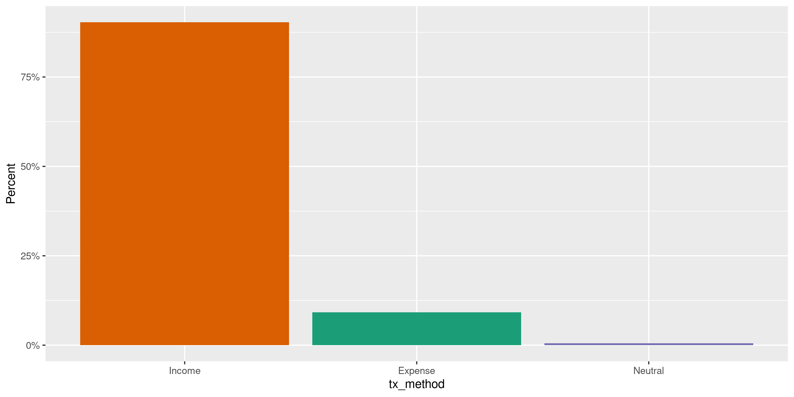
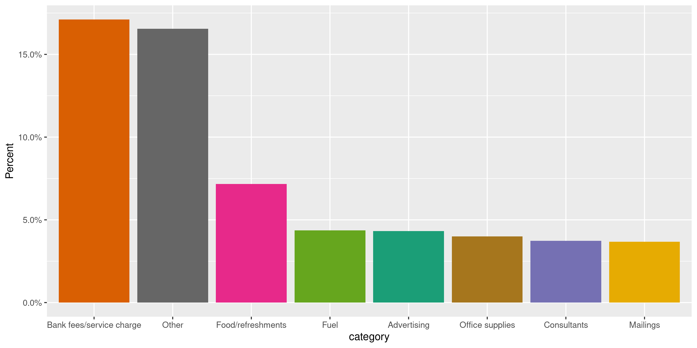
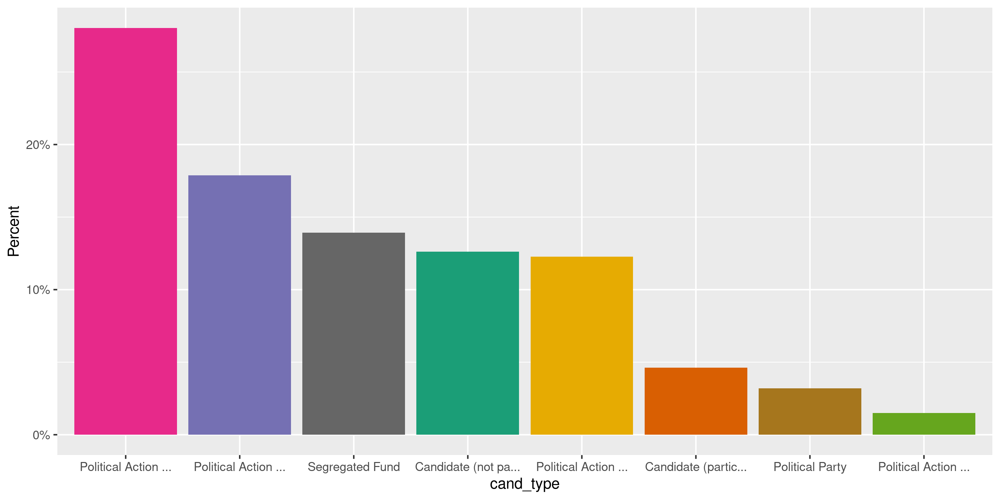
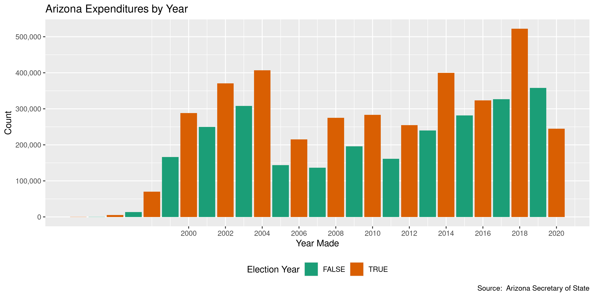
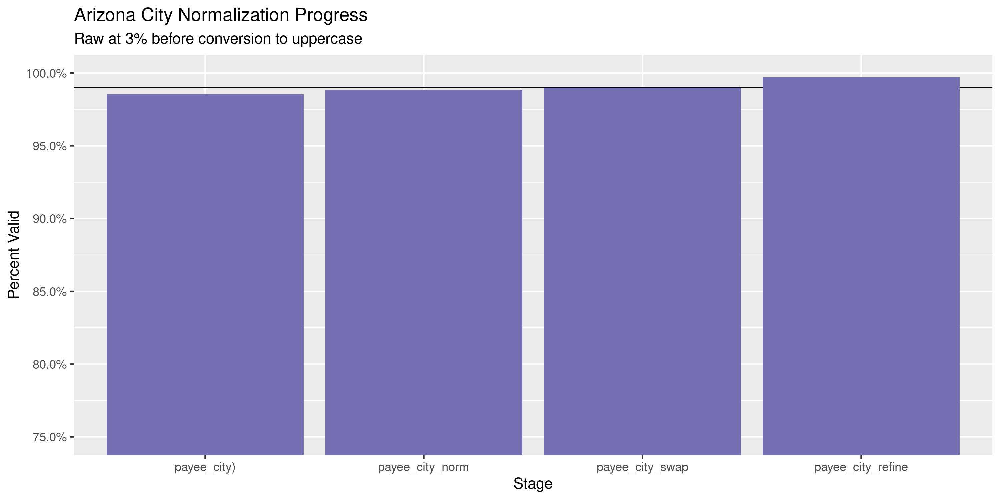

Arizona Expenditures
================
Kiernan Nicholls
2020-08-28 17:59:00

  - [Project](#project)
  - [Objectives](#objectives)
  - [Packages](#packages)
  - [Data](#data)
  - [Read](#read)
  - [Join](#join)
  - [Explore](#explore)
  - [Wrangle](#wrangle)
  - [Conclude](#conclude)
  - [Export](#export)
  - [Upload](#upload)

<!-- Place comments regarding knitting here -->

## Project

The Accountability Project is an effort to cut across data silos and
give journalists, policy professionals, activists, and the public at
large a simple way to search across huge volumes of public data about
people and organizations.

Our goal is to standardizing public data on a few key fields by thinking
of each dataset row as a transaction. For each transaction there should
be (at least) 3 variables:

1.  All **parties** to a transaction.
2.  The **date** of the transaction.
3.  The **amount** of money involved.

## Objectives

This document describes the process used to complete the following
objectives:

1.  How many records are in the database?
2.  Check for entirely duplicated records.
3.  Check ranges of continuous variables.
4.  Is there anything blank or missing?
5.  Check for consistency issues.
6.  Create a five-digit ZIP Code called `zip`.
7.  Create a `year` field from the transaction date.
8.  Make sure there is data on both parties to a transaction.

## Packages

The following packages are needed to collect, manipulate, visualize,
analyze, and communicate these results. The `pacman` package will
facilitate their installation and attachment.

The IRW’s `campfin` package will also have to be installed from GitHub.
This package contains functions custom made to help facilitate the
processing of campaign finance data.

``` r
if (!require("pacman")) install.packages("pacman")
pacman::p_load_gh("irworkshop/campfin")
pacman::p_load_gh("kiernann/mdbr")
pacman::p_load(
  tidyverse, # data manipulation
  lubridate, # datetime strings
  gluedown, # printing markdown
  magrittr, # pipe operators
  janitor, # clean data frames
  refinr, # cluster and merge
  scales, # format strings
  knitr, # knit documents
  vroom, # read files fast
  rvest, # html scraping
  glue, # combine strings
  here, # relative paths
  httr, # http requests
  fs # local storage 
)
```

This document should be run as part of the `R_campfin` project, which
lives as a sub-directory of the more general, language-agnostic
[`irworkshop/accountability_datacleaning`](https://github.com/irworkshop/accountability_datacleaning)
GitHub repository.

The `R_campfin` project uses the [RStudio
projects](https://support.rstudio.com/hc/en-us/articles/200526207-Using-Projects)
feature and should be run as such. The project also uses the dynamic
`here::here()` tool for file paths relative to *your* machine.

``` r
# where does this document knit?
here::here()
#> [1] "/home/kiernan/Code/tap/R_campfin"
```

## Data

Expenditures data for the state of Arizona was retrieved under open
records law Arizona Rev. Stat. Ann. Secs. 39-121 to 39-122. After a $25
fee was paid to the state by the Investigative Reporting Workshop we
were given access to the state’s file sharing website from which a
Microsoft Access Database was downloaded.

``` r
raw_dir <- dir_create(here("az", "expends", "data", "raw"))
mdb_file <- path(raw_dir, "CFS_Export.mdb")
```

``` r
file_size(mdb_file)
#> 763M
```

## Read

The Microsoft Access database provided by the state cannot easily be
read into R like one might with a text file. We can use the
[mdbr](https://github.com/kiernann/mdbr) package to access the open
source [MDB Tools](https://github.com/brianb/mdbtools) command line
utility. This package can list the tables in a database and read them as
data frames.

To use the mdbr package, MDB Tools must first be installed. The
`mdbtools` utility can be installed from the command line on Debian
systems:

``` bash
# https://github.com/brianb/mdbtools
sudo apt install mdbtools
```

We can use the `mdb_tableS()` function to list all the tables in the
database.

``` r
az_tables <- mdb_tables(mdb_file)
```

| Table                  | Description                                      | Rows      |
| :--------------------- | :----------------------------------------------- | :-------- |
| `BallotMeasures`       | Information on ballot measures voted on          | 50        |
| `Categories`           | Category names with codes                        | 71        |
| `Counties`             | County names with codes                          | 15        |
| `Cycles`               | Election cycle start and dates with codes        | 15        |
| `EntityTypes`          | Filing entity type names with codes              | 43        |
| `IncomeExpenseNeutral` | Filing type with codes                           | 3         |
| `Names`                | The names and addresses of recipients            | 1,197,512 |
| `Offices`              | Office names sought with codes                   | 70        |
| `Parties`              | Political party names with codes                 | 6         |
| `ReportNames`          | Filing report type, usual a time of year         | 237       |
| `Reports`              | All of the reports filed by committees           | 143,497   |
| `ReportTypes`          | Report types with codes                          | 8         |
| `TransactionTypes`     | Transaction type name and `IncomeExpenseNeutral` | 159       |
| `Committees`           | Names, IDs, and addresses of filing committees   | 4,556     |
| `Transactions`         | All expenditures with amounts and dates          | 6,241,937 |

These tables can be read with `read_mdb()`, which uses
`readr::read_csv()`. We will read every table into a single list of
multiple data frames.

``` r
a <- rep(list(NA), length(az_tables))
names(a) <- make_clean_names(az_tables)
for (i in seq_along(az_tables)) {
  a[[i]] <- read_mdb(mdb_file, az_tables[i])
}
```

## Join

These many data frames can then be joined together to create a single
collection of transactions between parties.

``` r
a$committees <- select(
  .data = a$committees, CommitteeID, NameID, 
  starts_with("Candidate"), -CandidateOtherPartyName
)
```

``` r
a$names <- select(a$names, -NameGroupID, -CountyID, Zip = ZipCode)
```

``` r
aze <- a$transactions %>% # 6,241,937
  # Transaction type, category info -------------------------------------------
  left_join(a$transaction_types, by = "TransactionTypeID") %>% 
  select(-TransactionTypeID) %>% 
  left_join(a$income_expense_neutral, by = "IncomeExpenseNeutralID") %>% 
  select(-IncomeExpenseNeutralID, TransactionMethod = IncomeExpenseNeutral) %>% 
  left_join(a$categories, by = "CategoryID") %>% 
  select(-CategoryID, -SubjectCommitteeID) %>%
  # Spending COMMITTEE info ---------------------------------------------------
  rename(PayeeID = NameID) %>% # expenditure recipient
  relocate(CommitteeID, .after = last_col()) %>% 
  left_join(a$committees, by = "CommitteeID") %>% 
  # COMMITTEE party, county, office, cycle ------------------------------------
  # join by ID, remove ID and rename columns
  left_join(a$parties, by = c("CandidatePartyID" = "PartyID")) %>% 
  select(-CandidatePartyID, CandidateParty = PartyName) %>% 
  left_join(a$offices, by = c("CandidateOfficeID" = "OfficeID")) %>% 
  select(-CandidateOfficeID, CandidateOffice = OfficeName) %>% 
  left_join(a$counties, by = c("CandidateCountyID" = "CountyID")) %>% 
  select(-CandidateCountyID, CandidateCounty = CountyName) %>%
  left_join(select(a$cycles, 1:2), by = c("CandidateCycleID" = "CycleID")) %>% 
  select(-CandidateCycleID, CandidateCycle = CycleName) %>%
  # CANDIDATE name and info ---------------------------------------------------
  left_join(a$names, by = "NameID") %>% 
  rename(CandidateID = NameID) %>% 
  left_join(a$entity_types, by = "EntityTypeID") %>% 
  select(-EntityTypeID, CandidateType = EntityTypeName) %>% 
  rename_with(~paste0("Candidate", .), .cols = 21:last_col(1)) %>% 
  # PAYEE name and info -------------------------------------------------------
  relocate(PayeeID, .after = last_col()) %>% 
  left_join(a$names, by = c("PayeeID" = "NameID")) %>% 
  left_join(a$entity_types, by = "EntityTypeID") %>% 
  select(-EntityTypeID, PayeeType = EntityTypeName) %>% 
  rename_with(~paste0("Payee", .), .cols = 33:last_col(1)) %>% 
  select(-14) %>% 
  rename_with(.fn = az_rename) %>% 
  rename(date = tx_date) %>% 
  mutate(across(ends_with("date"), as_date))
```

``` r
rm(a); flush_memory()
```

## Explore

``` r
glimpse(aze)
#> Rows: 6,241,937
#> Columns: 43
#> $ tx_id             <int> 1, 2, 3, 4, 5, 6, 7, 8, 9, 10, 11, 12, 13, 14, 15, 16, 17, 18, 19, 20,…
#> $ mod_tx_id         <int> 1, 2, 3, 4, 5, 6, 7, 8, 9, 10, 11, 12, 13, 14, 15, 16, 17, 18, 19, 20,…
#> $ date              <date> 2003-09-10, 2003-12-09, 2003-10-23, 2003-10-27, 2004-01-10, 2003-01-0…
#> $ amount            <dbl> 50.0, 100.0, 140.0, 250.0, 280.0, 160.0, 100.0, 100.0, 10.0, 10.0, 10.…
#> $ is_for_benefit    <lgl> FALSE, FALSE, FALSE, FALSE, FALSE, FALSE, FALSE, FALSE, FALSE, FALSE, …
#> $ memo              <chr> NA, NA, NA, NA, NA, NA, NA, NA, NA, NA, NA, NA, NA, NA, NA, NA, NA, NA…
#> $ account_type      <chr> NA, NA, NA, NA, NA, NA, NA, NA, NA, NA, NA, NA, NA, NA, NA, NA, NA, NA…
#> $ deleted           <lgl> FALSE, FALSE, FALSE, FALSE, FALSE, FALSE, FALSE, FALSE, FALSE, FALSE, …
#> $ tx_type           <chr> "Contribution from Individuals", "Contribution from Individuals", "Con…
#> $ tx_method         <chr> "Income", "Income", "Income", "Income", "Income", "Income", "Income", …
#> $ category          <chr> NA, NA, NA, NA, NA, NA, NA, NA, NA, NA, NA, NA, NA, NA, NA, NA, NA, NA…
#> $ com_id            <int> 200492094, 200492094, 200492094, 200492094, 200492094, 200492094, 2004…
#> $ cand_id           <int> 713544, 713544, 713544, 713544, 713544, 713544, 713544, 713544, 159530…
#> $ cand_is_incumbent <lgl> TRUE, TRUE, TRUE, TRUE, TRUE, TRUE, TRUE, TRUE, FALSE, FALSE, FALSE, F…
#> $ cand_party        <chr> "Republican", "Republican", "Republican", "Republican", "Republican", …
#> $ cand_office       <chr> "State Senator - District No. 6", "State Senator - District No. 6", "S…
#> $ cand_county       <chr> "Maricopa", "Maricopa", "Maricopa", "Maricopa", "Maricopa", "Maricopa"…
#> $ cand_cycle        <int> 2004, 2004, 2004, 2004, 2004, 2004, 2004, 2004, NA, NA, NA, NA, NA, NA…
#> $ cand_last         <chr> "VOTE DEAN MARTIN - 2004", "VOTE DEAN MARTIN - 2004", "VOTE DEAN MARTI…
#> $ cand_first        <chr> NA, NA, NA, NA, NA, NA, NA, NA, NA, NA, NA, NA, NA, NA, NA, NA, NA, NA…
#> $ cand_middle       <chr> NA, NA, NA, NA, NA, NA, NA, NA, NA, NA, NA, NA, NA, NA, NA, NA, NA, NA…
#> $ cand_suffix       <chr> NA, NA, NA, NA, NA, NA, NA, NA, NA, NA, NA, NA, NA, NA, NA, NA, NA, NA…
#> $ cand_addr1        <chr> "23227 N 23rd Pl", "23227 N 23rd Pl", "23227 N 23rd Pl", "23227 N 23rd…
#> $ cand_addr2        <chr> NA, NA, NA, NA, NA, NA, NA, NA, "Ste 700", "Ste 700", "Ste 700", "Ste …
#> $ cand_city         <chr> "Phoenix", "Phoenix", "Phoenix", "Phoenix", "Phoenix", "Phoenix", "Pho…
#> $ cand_state        <chr> "AZ", "AZ", "AZ", "AZ", "AZ", "AZ", "AZ", "AZ", "DC", "DC", "DC", "DC"…
#> $ cand_zip          <chr> "85024", "85024", "85024", "85024", "85024", "85024", "85024", "85024"…
#> $ cand_occupation   <chr> NA, NA, NA, NA, NA, NA, NA, NA, NA, NA, NA, NA, NA, NA, NA, NA, NA, NA…
#> $ cand_employer     <chr> NA, NA, NA, NA, NA, NA, NA, NA, NA, NA, NA, NA, NA, NA, NA, NA, NA, NA…
#> $ cand_type         <chr> "Candidate (not participating in Clean Elections)", "Candidate (not pa…
#> $ payee_id          <int> 541067, 541142, 541066, 541095, 541218, 541275, 541418, 541408, 307788…
#> $ payee_last        <chr> "Lopata", "Allen", "Low", "Ricks", "Wilhelm-Garcia", "Barclay", "Shipe…
#> $ payee_first       <chr> "Jaime", "Richard", "Jamie", "Ron", "Connie", "Steve", "Robert", "Tim"…
#> $ payee_middle      <chr> NA, NA, NA, NA, NA, NA, NA, NA, "Dieter", "Dieter", "Dieter", "Dieter"…
#> $ payee_suffix      <chr> NA, NA, NA, NA, NA, NA, NA, NA, NA, NA, NA, NA, NA, NA, NA, NA, NA, NA…
#> $ payee_addr1       <chr> "1053 E Sheffield Ave", "1029 E Vista Ave", "5817 E Leith Ln", "6338 A…
#> $ payee_addr2       <chr> NA, NA, NA, NA, NA, NA, NA, NA, NA, NA, NA, NA, NA, NA, NA, NA, NA, NA…
#> $ payee_city        <chr> "Chandler", "Phoenix", "Scottsdale", "Dallas", "Phoenix", "Phoenix", "…
#> $ payee_state       <chr> "AZ", "AZ", "AZ", "TX", "AZ", "AZ", "AZ", "AZ", "VA", "VA", "VA", "VA"…
#> $ payee_zip         <chr> "85225", "85020", "85254", "75230", "85013", "85048", "86515", "85259"…
#> $ payee_occupation  <chr> "Integrated Solutions Manager", "Owner", "Insurance Producer", "VP-Gov…
#> $ payee_employer    <chr> "SBC DataComm, Inc.", "Allen Tenant Services", "Low & Johnson", "South…
#> $ payee_type        <chr> "Individual", "Individual", "Individual", "Individual", "Individual", …
tail(aze)
#> # A tibble: 6 x 43
#>    tx_id mod_tx_id date       amount is_for_benefit memo  account_type deleted tx_type tx_method
#>    <int>     <int> <date>      <dbl> <lgl>          <chr> <chr>        <lgl>   <chr>   <chr>    
#> 1 8.55e6   8554698 2020-08-03    50  FALSE          <NA>  <NA>         FALSE   Contri… Income   
#> 2 8.55e6   8554749 2020-07-14   300  FALSE          <NA>  <NA>         FALSE   Contri… Income   
#> 3 8.55e6   8554752 2020-07-17  1000  FALSE          <NA>  <NA>         FALSE   Contri… Income   
#> 4 8.55e6   8554760 2020-07-06  -269. TRUE           <NA>  <NA>         FALSE   Operat… Expense  
#> 5 8.55e6   8554761 2020-07-15  -252. TRUE           <NA>  <NA>         FALSE   Operat… Expense  
#> 6 8.55e6   8554774 2020-07-06  -170  TRUE           Refu… <NA>         FALSE   Operat… Expense  
#> # … with 33 more variables: category <chr>, com_id <int>, cand_id <int>, cand_is_incumbent <lgl>,
#> #   cand_party <chr>, cand_office <chr>, cand_county <chr>, cand_cycle <int>, cand_last <chr>,
#> #   cand_first <chr>, cand_middle <chr>, cand_suffix <chr>, cand_addr1 <chr>, cand_addr2 <chr>,
#> #   cand_city <chr>, cand_state <chr>, cand_zip <chr>, cand_occupation <chr>, cand_employer <chr>,
#> #   cand_type <chr>, payee_id <int>, payee_last <chr>, payee_first <chr>, payee_middle <chr>,
#> #   payee_suffix <chr>, payee_addr1 <chr>, payee_addr2 <chr>, payee_city <chr>, payee_state <chr>,
#> #   payee_zip <chr>, payee_occupation <chr>, payee_employer <chr>, payee_type <chr>
```

### Missing

``` r
col_stats(aze, count_na)
#> # A tibble: 43 x 4
#>    col               class        n           p
#>    <chr>             <chr>    <int>       <dbl>
#>  1 tx_id             <int>        0 0          
#>  2 mod_tx_id         <int>        0 0          
#>  3 date              <date>       0 0          
#>  4 amount            <dbl>        0 0          
#>  5 is_for_benefit    <lgl>        0 0          
#>  6 memo              <chr>  4819056 0.772      
#>  7 account_type      <chr>  6036387 0.967      
#>  8 deleted           <lgl>        0 0          
#>  9 tx_type           <chr>        0 0          
#> 10 tx_method         <chr>        0 0          
#> 11 category          <chr>  5991152 0.960      
#> 12 com_id            <int>        0 0          
#> 13 cand_id           <int>       59 0.00000945 
#> 14 cand_is_incumbent <lgl>       59 0.00000945 
#> 15 cand_party        <chr>  5155267 0.826      
#> 16 cand_office       <chr>  5131892 0.822      
#> 17 cand_county       <chr>  5183575 0.830      
#> 18 cand_cycle        <int>  5150176 0.825      
#> 19 cand_last         <chr>       59 0.00000945 
#> 20 cand_first        <chr>  6239685 1.00       
#> 21 cand_middle       <chr>  6235507 0.999      
#> 22 cand_suffix       <chr>  6241937 1          
#> 23 cand_addr1        <chr>     3806 0.000610   
#> 24 cand_addr2        <chr>  4187660 0.671      
#> 25 cand_city         <chr>     5817 0.000932   
#> 26 cand_state        <chr>     3883 0.000622   
#> 27 cand_zip          <chr>     5902 0.000946   
#> 28 cand_occupation   <chr>  6241937 1          
#> 29 cand_employer     <chr>  6241937 1          
#> 30 cand_type         <chr>       59 0.00000945 
#> 31 payee_id          <int>        0 0          
#> 32 payee_last        <chr>        2 0.000000320
#> 33 payee_first       <chr>   959849 0.154      
#> 34 payee_middle      <chr>  4887905 0.783      
#> 35 payee_suffix      <chr>  6067431 0.972      
#> 36 payee_addr1       <chr>   514352 0.0824     
#> 37 payee_addr2       <chr>  5471033 0.876      
#> 38 payee_city        <chr>   514397 0.0824     
#> 39 payee_state       <chr>   231931 0.0372     
#> 40 payee_zip         <chr>   541049 0.0867     
#> 41 payee_occupation  <chr>  1375455 0.220      
#> 42 payee_employer    <chr>  1410761 0.226      
#> 43 payee_type        <chr>        0 0
```

``` r
key_vars <- c("date", "payee_last", "amount", "cand_last")
aze <- flag_na(aze, all_of(key_vars))
sum(aze$na_flag)
#> [1] 61
```

``` r
aze %>% 
  filter(na_flag) %>% 
  select(all_of(key_vars)) %>% 
  sample_frac()
#> # A tibble: 61 x 4
#>    date       payee_last    amount cand_last        
#>    <date>     <chr>          <dbl> <chr>            
#>  1 2014-05-16 Eames          -15   <NA>             
#>  2 2014-10-16 QuickTrip      -34.4 <NA>             
#>  3 2014-11-06 COSTCO         -31.9 <NA>             
#>  4 2014-08-08 Eames         -996.  <NA>             
#>  5 2014-02-03 <NA>          -135   Elect Steve Smith
#>  6 2014-10-14 Eames          300   <NA>             
#>  7 2014-07-09 FRAZEE PAINT  -151.  <NA>             
#>  8 2014-08-29 Eames           25   <NA>             
#>  9 2014-05-20 Eames          100   <NA>             
#> 10 2014-08-11 Karl         -1000   <NA>             
#> # … with 51 more rows
```

### Duplicates

``` r
dupe_file <- here("az", "expends", "dupes.txt")
if (!file_exists(dupe_file)) {
  file_create(dupe_file)
  # split file into monthly chunks
  azs <- aze %>% 
    mutate(month = month(date), year = year(date)) %>% 
    group_split(month, year, .keep = FALSE)
  pb <- txtProgressBar(max = length(azs), style = 3)
  for (i in seq_along(azs)) {
    # check dupes from both ends
    d1 <- duplicated(azs[[i]], fromLast = FALSE)
    d2 <- duplicated(azs[[i]], fromLast = TRUE)
    # append to disk
    write_lines(d1 | d2, dupe_file, append = TRUE)
    rm(d1, d2)
    azs[[i]] <- NA
    Sys.sleep(1); flush_memory(1)
    setTxtProgressBar(pb, value = i)
  }
  rm(azs)
}
#>   |                                                                                                 |                                                                                         |   0%  |                                                                                                 |=                                                                                        |   1%  |                                                                                                 |=                                                                                        |   2%  |                                                                                                 |==                                                                                       |   2%  |                                                                                                 |==                                                                                       |   3%  |                                                                                                 |===                                                                                      |   3%  |                                                                                                 |===                                                                                      |   4%  |                                                                                                 |====                                                                                     |   4%  |                                                                                                 |====                                                                                     |   5%  |                                                                                                 |=====                                                                                    |   5%  |                                                                                                 |=====                                                                                    |   6%  |                                                                                                 |======                                                                                   |   6%  |                                                                                                 |======                                                                                   |   7%  |                                                                                                 |=======                                                                                  |   7%  |                                                                                                 |=======                                                                                  |   8%  |                                                                                                 |========                                                                                 |   9%  |                                                                                                 |=========                                                                                |  10%  |                                                                                                 |==========                                                                               |  11%  |                                                                                                 |==========                                                                               |  12%  |                                                                                                 |===========                                                                              |  12%  |                                                                                                 |===========                                                                              |  13%  |                                                                                                 |============                                                                             |  13%  |                                                                                                 |============                                                                             |  14%  |                                                                                                 |=============                                                                            |  14%  |                                                                                                 |=============                                                                            |  15%  |                                                                                                 |==============                                                                           |  15%  |                                                                                                 |==============                                                                           |  16%  |                                                                                                 |===============                                                                          |  17%  |                                                                                                 |================                                                                         |  17%  |                                                                                                 |================                                                                         |  18%  |                                                                                                 |=================                                                                        |  19%  |                                                                                                 |==================                                                                       |  20%  |                                                                                                 |==================                                                                       |  21%  |                                                                                                 |===================                                                                      |  21%  |                                                                                                 |===================                                                                      |  22%  |                                                                                                 |====================                                                                     |  22%  |                                                                                                 |====================                                                                     |  23%  |                                                                                                 |=====================                                                                    |  23%  |                                                                                                 |=====================                                                                    |  24%  |                                                                                                 |======================                                                                   |  24%  |                                                                                                 |======================                                                                   |  25%  |                                                                                                 |=======================                                                                  |  26%  |                                                                                                 |========================                                                                 |  27%  |                                                                                                 |========================                                                                 |  28%  |                                                                                                 |=========================                                                                |  28%  |                                                                                                 |==========================                                                               |  29%  |                                                                                                 |==========================                                                               |  30%  |                                                                                                 |===========================                                                              |  30%  |                                                                                                 |===========================                                                              |  31%  |                                                                                                 |============================                                                             |  31%  |                                                                                                 |============================                                                             |  32%  |                                                                                                 |=============================                                                            |  32%  |                                                                                                 |=============================                                                            |  33%  |                                                                                                 |==============================                                                           |  33%  |                                                                                                 |==============================                                                           |  34%  |                                                                                                 |===============================                                                          |  34%  |                                                                                                 |===============================                                                          |  35%  |                                                                                                 |================================                                                         |  36%  |                                                                                                 |=================================                                                        |  37%  |                                                                                                 |=================================                                                        |  38%  |                                                                                                 |==================================                                                       |  38%  |                                                                                                 |==================================                                                       |  39%  |                                                                                                 |===================================                                                      |  39%  |                                                                                                 |===================================                                                      |  40%  |                                                                                                 |====================================                                                     |  40%  |                                                                                                 |====================================                                                     |  41%  |                                                                                                 |=====================================                                                    |  41%  |                                                                                                 |=====================================                                                    |  42%  |                                                                                                 |======================================                                                   |  42%  |                                                                                                 |======================================                                                   |  43%  |                                                                                                 |=======================================                                                  |  43%  |                                                                                                 |=======================================                                                  |  44%  |                                                                                                 |========================================                                                 |  45%  |                                                                                                 |=========================================                                                |  46%  |                                                                                                 |=========================================                                                |  47%  |                                                                                                 |==========================================                                               |  47%  |                                                                                                 |==========================================                                               |  48%  |                                                                                                 |===========================================                                              |  48%  |                                                                                                 |===========================================                                              |  49%  |                                                                                                 |============================================                                             |  49%  |                                                                                                 |============================================                                             |  50%  |                                                                                                 |=============================================                                            |  50%  |                                                                                                 |=============================================                                            |  51%  |                                                                                                 |==============================================                                           |  51%  |                                                                                                 |==============================================                                           |  52%  |                                                                                                 |===============================================                                          |  52%  |                                                                                                 |===============================================                                          |  53%  |                                                                                                 |================================================                                         |  53%  |                                                                                                 |================================================                                         |  54%  |                                                                                                 |=================================================                                        |  55%  |                                                                                                 |==================================================                                       |  56%  |                                                                                                 |==================================================                                       |  57%  |                                                                                                 |===================================================                                      |  57%  |                                                                                                 |===================================================                                      |  58%  |                                                                                                 |====================================================                                     |  58%  |                                                                                                 |====================================================                                     |  59%  |                                                                                                 |=====================================================                                    |  59%  |                                                                                                 |=====================================================                                    |  60%  |                                                                                                 |======================================================                                   |  60%  |                                                                                                 |======================================================                                   |  61%  |                                                                                                 |=======================================================                                  |  61%  |                                                                                                 |=======================================================                                  |  62%  |                                                                                                 |========================================================                                 |  62%  |                                                                                                 |========================================================                                 |  63%  |                                                                                                 |=========================================================                                |  64%  |                                                                                                 |==========================================================                               |  65%  |                                                                                                 |==========================================================                               |  66%  |                                                                                                 |===========================================================                              |  66%  |                                                                                                 |===========================================================                              |  67%  |                                                                                                 |============================================================                             |  67%  |                                                                                                 |============================================================                             |  68%  |                                                                                                 |=============================================================                            |  68%  |                                                                                                 |=============================================================                            |  69%  |                                                                                                 |==============================================================                           |  69%  |                                                                                                 |==============================================================                           |  70%  |                                                                                                 |===============================================================                          |  70%  |                                                                                                 |===============================================================                          |  71%  |                                                                                                 |================================================================                         |  72%  |                                                                                                 |=================================================================                        |  72%  |                                                                                                 |=================================================================                        |  73%  |                                                                                                 |==================================================================                       |  74%  |                                                                                                 |===================================================================                      |  75%  |                                                                                                 |===================================================================                      |  76%  |                                                                                                 |====================================================================                     |  76%  |                                                                                                 |====================================================================                     |  77%  |                                                                                                 |=====================================================================                    |  77%  |                                                                                                 |=====================================================================                    |  78%  |                                                                                                 |======================================================================                   |  78%  |                                                                                                 |======================================================================                   |  79%  |                                                                                                 |=======================================================================                  |  79%  |                                                                                                 |=======================================================================                  |  80%  |                                                                                                 |========================================================================                 |  81%  |                                                                                                 |=========================================================================                |  82%  |                                                                                                 |=========================================================================                |  83%  |                                                                                                 |==========================================================================               |  83%  |                                                                                                 |===========================================================================              |  84%  |                                                                                                 |===========================================================================              |  85%  |                                                                                                 |============================================================================             |  85%  |                                                                                                 |============================================================================             |  86%  |                                                                                                 |=============================================================================            |  86%  |                                                                                                 |=============================================================================            |  87%  |                                                                                                 |==============================================================================           |  87%  |                                                                                                 |==============================================================================           |  88%  |                                                                                                 |===============================================================================          |  88%  |                                                                                                 |===============================================================================          |  89%  |                                                                                                 |================================================================================         |  90%  |                                                                                                 |=================================================================================        |  91%  |                                                                                                 |==================================================================================       |  92%  |                                                                                                 |==================================================================================       |  93%  |                                                                                                 |===================================================================================      |  93%  |                                                                                                 |===================================================================================      |  94%  |                                                                                                 |====================================================================================     |  94%  |                                                                                                 |====================================================================================     |  95%  |                                                                                                 |=====================================================================================    |  95%  |                                                                                                 |=====================================================================================    |  96%  |                                                                                                 |======================================================================================   |  96%  |                                                                                                 |======================================================================================   |  97%  |                                                                                                 |=======================================================================================  |  97%  |                                                                                                 |=======================================================================================  |  98%  |                                                                                                 |======================================================================================== |  98%  |                                                                                                 |======================================================================================== |  99%  |                                                                                                 |=========================================================================================| 100%
```

``` r
aze <- mutate(aze, dupe_flag = as.logical(read_lines(dupe_file)))
if (sum(aze$dupe_flag) == 0) {
  file_delete(dupe_file)
  aze <- select(aze, -dupe_flag)
}
```

### Categorical

``` r
col_stats(aze, n_distinct)
#> # A tibble: 44 x 4
#>    col               class        n           p
#>    <chr>             <chr>    <int>       <dbl>
#>  1 tx_id             <int>  6241937 1          
#>  2 mod_tx_id         <int>  6179797 0.990      
#>  3 date              <date>    8946 0.00143    
#>  4 amount            <dbl>   114705 0.0184     
#>  5 is_for_benefit    <lgl>        2 0.000000320
#>  6 memo              <chr>   233121 0.0373     
#>  7 account_type      <chr>        3 0.000000481
#>  8 deleted           <lgl>        1 0.000000160
#>  9 tx_type           <chr>      140 0.0000224  
#> 10 tx_method         <chr>        3 0.000000481
#> 11 category          <chr>       64 0.0000103  
#> 12 com_id            <int>     4402 0.000705   
#> 13 cand_id           <int>     4402 0.000705   
#> 14 cand_is_incumbent <lgl>        3 0.000000481
#> 15 cand_party        <chr>        7 0.00000112 
#> 16 cand_office       <chr>       70 0.0000112  
#> 17 cand_county       <chr>       16 0.00000256 
#> 18 cand_cycle        <int>       16 0.00000256 
#> 19 cand_last         <chr>     4249 0.000681   
#> 20 cand_first        <chr>        3 0.000000481
#> 21 cand_middle       <chr>        3 0.000000481
#> 22 cand_suffix       <chr>        1 0.000000160
#> 23 cand_addr1        <chr>     2923 0.000468   
#> 24 cand_addr2        <chr>      586 0.0000939  
#> 25 cand_city         <chr>      295 0.0000473  
#> 26 cand_state        <chr>       41 0.00000657 
#> 27 cand_zip          <chr>      549 0.0000880  
#> 28 cand_occupation   <chr>        1 0.000000160
#> 29 cand_employer     <chr>        1 0.000000160
#> 30 cand_type         <chr>       27 0.00000433 
#> 31 payee_id          <int>  1188150 0.190      
#> 32 payee_last        <chr>   260133 0.0417     
#> 33 payee_first       <chr>    59805 0.00958    
#> 34 payee_middle      <chr>     9266 0.00148    
#> 35 payee_suffix      <chr>      340 0.0000545  
#> 36 payee_addr1       <chr>   462011 0.0740     
#> 37 payee_addr2       <chr>    24183 0.00387    
#> 38 payee_city        <chr>    13767 0.00221    
#> 39 payee_state       <chr>      444 0.0000711  
#> 40 payee_zip         <chr>    18033 0.00289    
#> 41 payee_occupation  <chr>    87290 0.0140     
#> 42 payee_employer    <chr>   116714 0.0187     
#> 43 payee_type        <chr>       43 0.00000689 
#> 44 na_flag           <lgl>        2 0.000000320
```

<!-- --><!-- --><!-- --><!-- --><!-- --><!-- --><!-- --><!-- -->

### Amounts

``` r
summary(aze$amount)
#>      Min.   1st Qu.    Median      Mean   3rd Qu.      Max. 
#> -26878591         2         8         9        25  25653327
mean(aze$amount <= 0)
#> [1] 0.09160073
```

<!-- -->

### Dates

We can add the calendar year from `date` with `lubridate::year()`

``` r
aze <- mutate(aze, year = year(date))
```

``` r
min(aze$date)
#> [1] "1994-11-29"
sum(aze$year < 2000)
#> [1] 256038
max(aze$date)
#> [1] "2020-08-12"
sum(aze$date > today())
#> [1] 0
```

<!-- -->

## Wrangle

To improve the searchability of the database, we will perform some
consistent, confident string normalization. For geographic variables
like city names and ZIP codes, the corresponding `campfin::normal_*()`
functions are tailor made to facilitate this process.

### Address

For the street `addresss` variable, the `campfin::normal_address()`
function will force consistence case, remove punctuation, and abbreviate
official USPS suffixes.

``` r
aze <- aze %>% 
  unite(
    col = payee_addr,
    starts_with("payee_addr"),
    sep = " ",
    remove = FALSE,
    na.rm = TRUE
  ) %>% 
  unite(
    col = cand_addr,
    starts_with("cand_addr"),
    sep = " ",
    remove = FALSE,
    na.rm = TRUE
  ) %>% 
  mutate(across(
    .cols = ends_with("_addr"),
    .fns = list(norm = normal_address),
    abbs = usps_street,
    na_rep = TRUE
  )) %>% 
  select(-ends_with("_addr"))
```

``` r
aze %>% 
  sample_n(10) %>% 
  select(contains("_addr"))
#> # A tibble: 10 x 6
#>    cand_addr1       cand_addr2 payee_addr1       payee_addr2 cand_addr_norm       payee_addr_norm  
#>    <chr>            <chr>      <chr>             <chr>       <chr>                <chr>            
#>  1 255 E Osborn Rd  Ste 200    <NA>              <NA>        255 E OSBORN RD STE… <NA>             
#>  2 4420 E Michelle… <NA>       4420 E Michelle … <NA>        4420 E MICHELLE DR   4420 E MICHELLE …
#>  3 26525 N Riverwo… <NA>       2147 Zack Ridge … <NA>        26525 N RIVERWOODS … 2147 ZACK RDG DR 
#>  4 5433 N 106th Ave <NA>       8131 N 12th St    <NA>        5433 N 106 TH AVE    8131 N 12 TH ST  
#>  5 13312 W Gelding… <NA>       13206 W Shadow H… <NA>        13312 W GELDING DR   13206 W SHADOW H…
#>  6 1001 Louisiana … Ste N1134s 56 Autumn Cres    <NA>        1001 LOUISIANA ST S… 56 AUTUMN CRES   
#>  7 2244 W Michigan… <NA>       2942 N 24th St    <NA>        2244 W MICHIGAN AVE  2942 N 24 TH ST  
#>  8 1001 Louisiana … Ste N1134s 19403 Lockridge … <NA>        1001 LOUISIANA ST S… 19403 LOCKRIDGE …
#>  9 PO Box 4685      <NA>       7434 E Cholla Ln  <NA>        PO BOX 4685          7434 E CHOLLA LN 
#> 10 1650 N 36th St   <NA>       1693 E Oakland St <NA>        1650 N 36 TH ST      1693 E OAKLAND ST
```

### ZIP

For ZIP codes, the `campfin::normal_zip()` function will attempt to
create valid *five* digit codes by removing the ZIP+4 suffix and
returning leading zeroes dropped by other programs like Microsoft Excel.

``` r
aze <- mutate(
  .data = aze, across(
    .cols = ends_with("_zip"),
    .fns = list(norm = normal_zip),
    na_rep = TRUE
  )
)
```

``` r
progress_table(
  aze$payee_zip,
  aze$payee_zip_norm,
  compare = valid_zip
)
#> # A tibble: 2 x 6
#>   stage          prop_in n_distinct prop_na n_out n_diff
#>   <chr>            <dbl>      <dbl>   <dbl> <dbl>  <dbl>
#> 1 payee_zip        0.993      18033  0.0867 40071    919
#> 2 payee_zip_norm   0.995      17870  0.0889 26145    747
```

### State

Valid two digit state abbreviations can be made using the
`campfin::normal_state()` function.

``` r
aze <- mutate(
  .data = aze, across(
    .cols = ends_with("_state"),
    .fns = list(norm = normal_state),
    abbreviate = TRUE,
    na_rep = TRUE,
  )
)
```

``` r
aze %>% 
  filter(payee_state != payee_state_norm) %>% 
  count(payee_state, payee_state_norm, sort = TRUE)
#> # A tibble: 237 x 3
#>    payee_state payee_state_norm     n
#>    <chr>       <chr>            <int>
#>  1 "<miss"     MISS             26281
#>  2 "az"        AZ                4133
#>  3 "Az"        AZ                3630
#>  4 "Arizo"     ARIZO              467
#>  5 "AZ "       AZ                 416
#>  6 "Reque"     REQUE              204
#>  7 "Ariz"      ARIZ               184
#>  8 "Inter"     INTER              132
#>  9 "Texas"     TX                 131
#> 10 "Fla"       FLA                127
#> # … with 227 more rows
```

``` r
progress_table(
  aze$payee_state,
  aze$payee_state_norm,
  compare = valid_state
)
#> # A tibble: 2 x 6
#>   stage            prop_in n_distinct prop_na n_out n_diff
#>   <chr>              <dbl>      <dbl>   <dbl> <dbl>  <dbl>
#> 1 payee_state        0.991        444  0.0372 56496    385
#> 2 payee_state_norm   0.995        234  0.0399 29895    176
```

### City

Cities are the most difficult geographic variable to normalize, simply
due to the wide variety of valid cities and formats.

#### Normal

The `campfin::normal_city()` function is a good start, again converting
case, removing punctuation, but *expanding* USPS abbreviations. We can
also remove `invalid_city` values.

``` r
aze <- mutate(
  .data = aze, across(
    .cols = ends_with("_city"),
    .fns = list(norm = normal_city),
    abbs = usps_city,
      states = c("AZ", "DC", "ARIZONA"),
      na = invalid_city,
      na_rep = TRUE
  )
)
```

#### Swap

We can further improve normalization by comparing our normalized value
against the *expected* value for that record’s state abbreviation and
ZIP code. If the normalized value is either an abbreviation for or very
similar to the expected value, we can confidently swap those two.

``` r
aze <- aze %>% 
  left_join(
    y = zipcodes,
    by = c(
      "payee_state_norm" = "state",
      "payee_zip_norm" = "zip"
    )
  ) %>% 
  rename(city_match = city) %>% 
  mutate(
    match_abb = is_abbrev(payee_city_norm, city_match),
    match_dist = str_dist(payee_city_norm, city_match),
    payee_city_swap = if_else(
      condition = !is.na(match_dist) & (match_abb | match_dist == 1),
      true = city_match,
      false = payee_city_norm
    )
  ) %>% 
  select(
    -city_match,
    -match_dist,
    -match_abb
  )
```

#### Refine

The [OpenRefine](https://openrefine.org/) algorithms can be used to
group similar strings and replace the less common versions with their
most common counterpart. This can greatly reduce inconsistency, but with
low confidence; we will only keep any refined strings that have a valid
city/state/zip combination.

``` r
good_refine <- aze %>% 
  mutate(
    payee_city_refine = payee_city_swap %>% 
      key_collision_merge() %>% 
      n_gram_merge(numgram = 1)
  ) %>% 
  filter(payee_city_refine != payee_city_swap) %>% 
  inner_join(
    y = zipcodes,
    by = c(
      "payee_city_refine" = "city",
      "payee_state_norm" = "state",
      "payee_zip_norm" = "zip"
    )
  )
```

    #> # A tibble: 22 x 5
    #>    payee_state_norm payee_zip_norm payee_city_swap      payee_city_refine     n
    #>    <chr>            <chr>          <chr>                <chr>             <int>
    #>  1 FL               32084          AUGUSTINE            SAINT AUGUSTINE      12
    #>  2 MS               39530          BIXOLI               BILOXI                6
    #>  3 AZ               85251          SCOTTSDALESCOTTSDALE SCOTTSDALE            4
    #>  4 AZ               85616          CHACUCA CITY         HUACHUCA CITY         4
    #>  5 CT               06033          GLATONSBURY          GLASTONBURY           3
    #>  6 SC               29406          NORTH CHARLESTON     CHARLESTON            3
    #>  7 SC               29419          NORTH CHARLESTON     CHARLESTON            3
    #>  8 OR               97228          PORTLAND OR          PORTLAND              2
    #>  9 AZ               85015          PPHOENIXHOENIX       PHOENIX               1
    #> 10 AZ               85119          APACHIE JUNTION      APACHE JUNCTION       1
    #> # … with 12 more rows

Then we can join the refined values back to the database.

``` r
aze <- aze %>% 
  left_join(good_refine, by = names(aze)) %>% 
  mutate(payee_city_refine = coalesce(payee_city_refine, payee_city_swap))
```

#### Progress

``` r
many_city <- c(valid_city, extra_city)
aze %>% 
  filter(payee_city_refine %out% many_city) %>% 
  count(payee_city_refine, payee_state_norm, payee_zip_norm, sort = TRUE) %>% 
  drop_na()
#> # A tibble: 1,304 x 4
#>    payee_city_refine payee_state_norm payee_zip_norm     n
#>    <chr>             <chr>            <chr>          <int>
#>  1 SHELBY TOWNSHIP   MI               48315           4212
#>  2 SHELBY TOWNSHIP   MI               48316           4130
#>  3 FARMINGTON HILLS  MI               48331           4069
#>  4 FARMINGTON HILLS  MI               48334           1713
#>  5 FARMINGTON HILLS  MI               48335           1564
#>  6 SADDLEBROOKE      AZ               85739           1155
#>  7 FARMINGTON HILLS  MI               48336           1086
#>  8 WAITING           AZ               85260            820
#>  9 DESERT HILLS      AZ               85086            751
#> 10 SHELBY TOWNSHIP   MI               48317            622
#> # … with 1,294 more rows
```

``` r
aze$payee_city_refine <- na_in(
  x = aze$payee_city_refine, 
  y = c("<MISSING VALUE>", "AZ")
)
```

``` r
many_city <- c(
  many_city,
  "FARMINGTON HILLS",
  "SHELBY TOWNSHIP",
  "SADDLEBROOKE",
  "DESERT HILLS"
)
```

| stage               | prop\_in | n\_distinct | prop\_na | n\_out | n\_diff |
| :------------------ | -------: | ----------: | -------: | -----: | ------: |
| payee\_city)        |    0.985 |       10478 |    0.082 |  83955 |    2455 |
| payee\_city\_norm   |    0.988 |        9766 |    0.084 |  66091 |    1725 |
| payee\_city\_swap   |    0.990 |        9245 |    0.084 |  57865 |    1197 |
| payee\_city\_refine |    0.997 |        9228 |    0.091 |  16416 |    1180 |

You can see how the percentage of valid values increased with each
stage.

<!-- -->

More importantly, the number of distinct values decreased each stage. We
were able to confidently change many distinct invalid values to their
valid equivalent.

<!-- -->

## Conclude

Before exporting, we can remove the intermediary normalization columns
and rename all added variables with the `_clean` suffix.

``` r
aze <- aze %>% 
  select(
    -payee_city_norm,
    -payee_city_swap,
    payee_city_clean = payee_city_refine
  ) %>% 
  rename_all(~str_replace(., "_norm", "_clean")) %>% 
  rename_all(~str_remove(., "_raw"))
```

``` r
glimpse(sample_n(aze, 50))
#> Rows: 50
#> Columns: 53
#> $ tx_id             <int> 2238306, 5328446, 5648327, 1323149, 3945241, 5770730, 7136476, 1107825…
#> $ mod_tx_id         <int> 2238306, 5328446, 5648327, 1323149, 3945241, 5770730, 7136476, 1107825…
#> $ date              <date> 2004-09-16, 2014-07-11, 2014-12-30, 2001-04-13, 2011-07-15, 2014-01-1…
#> $ amount            <dbl> 5.00, 0.39, 1.25, 15.00, 2.00, 58.40, 1.75, 8.00, 4.62, 5.00, 7.00, 20…
#> $ is_for_benefit    <lgl> FALSE, FALSE, FALSE, FALSE, FALSE, FALSE, FALSE, FALSE, FALSE, FALSE, …
#> $ memo              <chr> NA, "BIWEEKLY     0.39", NA, NA, "PAYROLL DEDUCTION", NA, NA, NA, NA, …
#> $ account_type      <chr> NA, NA, NA, NA, NA, NA, NA, NA, NA, NA, NA, NA, NA, NA, NA, NA, NA, NA…
#> $ deleted           <lgl> FALSE, FALSE, FALSE, FALSE, FALSE, FALSE, FALSE, FALSE, FALSE, FALSE, …
#> $ tx_type           <chr> "Aggregate Contributions less than $50", "Contribution from Individual…
#> $ tx_method         <chr> "Income", "Income", "Income", "Income", "Income", "Income", "Income", …
#> $ category          <chr> NA, NA, NA, NA, NA, NA, NA, NA, NA, NA, NA, NA, NA, NA, NA, NA, NA, NA…
#> $ com_id            <int> 1102, 1206, 2083, 200002293, 1016, 1227, 2083, 200202394, 1514, 200693…
#> $ cand_id           <int> 820669, 1440062, 1604615, 706928, 1529579, 1440068, 1604615, 884996, 1…
#> $ cand_is_incumbent <lgl> FALSE, FALSE, FALSE, TRUE, FALSE, FALSE, FALSE, FALSE, FALSE, FALSE, F…
#> $ cand_party        <chr> NA, NA, NA, NA, NA, NA, NA, NA, NA, "Democratic", NA, NA, NA, NA, NA, …
#> $ cand_office       <chr> NA, NA, NA, NA, NA, NA, NA, NA, NA, "State Representative - District 8…
#> $ cand_county       <chr> NA, NA, NA, NA, NA, NA, NA, NA, NA, "Maricopa", NA, NA, NA, NA, NA, NA…
#> $ cand_cycle        <int> NA, NA, NA, NA, NA, NA, NA, NA, NA, 2006, NA, NA, NA, NA, NA, NA, 2012…
#> $ cand_last         <chr> "HSBC North America Political Action Committee (H-PAC)", "SALT RIVER V…
#> $ cand_first        <chr> NA, NA, NA, NA, NA, NA, NA, NA, NA, NA, NA, NA, NA, NA, NA, NA, NA, NA…
#> $ cand_middle       <chr> NA, NA, NA, NA, NA, NA, NA, NA, NA, NA, NA, NA, NA, NA, NA, NA, NA, NA…
#> $ cand_suffix       <chr> NA, NA, NA, NA, NA, NA, NA, NA, NA, NA, NA, NA, NA, NA, NA, NA, NA, NA…
#> $ cand_addr1        <chr> "26525 N Riverwoods Blvd", "CORPORATE TAXES,  ISB336  PO BOX 52025", "…
#> $ cand_addr2        <chr> NA, NA, NA, "P O BOX 10566", "801 PENNSYLVANIA AVE NW, SUITE 214", NA,…
#> $ cand_city         <chr> "Mettawa", "PHOENIX", "Phoenix", "BIRMINGHAM", "WASHINGTON", "Phoenix"…
#> $ cand_state        <chr> "IL", "AZ", "AZ", "AL", "DC", "AZ", "AZ", "MI", "GA", "AZ", "AZ", "AZ"…
#> $ cand_zip          <chr> "60045", "85207", "85004", "35296", "20004", "85016", "85004", "48275"…
#> $ cand_occupation   <chr> NA, NA, NA, NA, NA, NA, NA, NA, NA, NA, NA, NA, NA, NA, NA, NA, NA, NA…
#> $ cand_employer     <chr> NA, NA, NA, NA, NA, NA, NA, NA, NA, NA, NA, NA, NA, NA, NA, NA, NA, NA…
#> $ cand_type         <chr> "Segregated Fund", "Political Action Committee (Mega Standing)", "Poli…
#> $ payee_id          <int> -1, 838975, 1166139, 303594, 1046967, 1285758, 1497771, 375650, 840751…
#> $ payee_last        <chr> "Multiple Contributors", "BUONAGURIO", "STRASSBERG", "HARDIN", "DEBENO…
#> $ payee_first       <chr> NA, "JOHN", "AARON", "ANDREW", "JEFF", "Christo", "FRYS FOOD STORES", …
#> $ payee_middle      <chr> NA, "E", NA, NA, NA, NA, NA, NA, NA, "C", NA, "A", NA, NA, NA, NA, NA,…
#> $ payee_suffix      <chr> NA, NA, NA, NA, NA, NA, NA, NA, NA, "JR", NA, NA, NA, NA, NA, NA, NA, …
#> $ payee_addr1       <chr> NA, "12718 W Milton Dr", "9818 N 7th Pl", "4408 SW 105th Dr", "PO Box …
#> $ payee_addr2       <chr> NA, NA, NA, NA, NA, NA, NA, NA, NA, NA, NA, NA, NA, "Apt 2073", NA, NA…
#> $ payee_city        <chr> NA, "Peoria", "Phoenix", "Gainesville", "Phoenix", "Chandler", "AZ", "…
#> $ payee_state       <chr> "AZ", "AZ", "AZ", "FL", "AZ", "AZ", "85", "VA", "OK", "AZ", "AZ", "AZ"…
#> $ payee_zip         <chr> NA, "85383", "85020", "32608", "85072", "85248", "$1.75", "22302", "73…
#> $ payee_occupation  <chr> NA, "MANAGER CLAIMS SERVI", "DELI CLERK", "PRIVATE BANKING EXEC I", "P…
#> $ payee_employer    <chr> NA, "SRP", "FRYS #612", "COMPASS BANCSHARES, INC.", "APS", "J.B. Hende…
#> $ payee_type        <chr> "Individual", "Individual", "Individual", "Individual", "Individual", …
#> $ na_flag           <lgl> FALSE, FALSE, FALSE, FALSE, FALSE, FALSE, FALSE, FALSE, FALSE, FALSE, …
#> $ year              <dbl> 2004, 2014, 2014, 2001, 2011, 2014, 2017, 2002, 2008, 2006, 2018, 2017…
#> $ cand_addr_clean   <chr> "26525 N RIVERWOODS BLVD", "CORPORATE TAXES ISB 336 PO BOX 52025", "24…
#> $ payee_addr_clean  <chr> NA, "12718 W MILTON DR", "9818 N 7 TH PL", "4408 SW 105 TH DR", "PO BO…
#> $ cand_zip_clean    <chr> "60045", "85207", "85004", "35296", "20004", "85016", "85004", "48275"…
#> $ payee_zip_clean   <chr> NA, "85383", "85020", "32608", "85072", "85248", "00175", "22302", "73…
#> $ cand_state_clean  <chr> "IL", "AZ", "AZ", "AL", "DC", "AZ", "AZ", "MI", "GA", "AZ", "AZ", "AZ"…
#> $ payee_state_clean <chr> "AZ", "AZ", "AZ", "FL", "AZ", "AZ", NA, "VA", "OK", "AZ", "AZ", "AZ", …
#> $ cand_city_clean   <chr> "METTAWA", "PHOENIX", "PHOENIX", "BIRMINGHAM", "WASHINGTON", "PHOENIX"…
#> $ payee_city_clean  <chr> NA, "PEORIA", "PHOENIX", "GAINESVILLE", "PHOENIX", "CHANDLER", NA, "AL…
```

1.  There are 6,241,937 records in the database.
2.  There are 0 duplicate records in the database.
3.  The range and distribution of `amount` and `date` seem reasonable.
4.  There are 61 records missing key variables.
5.  Consistency in geographic data has been improved with
    `campfin::normal_*()`.
6.  The 4-digit `year` variable has been created with
    `lubridate::year()`.

## Export

Now the file can be saved on disk for upload to the Accountability
server.

``` r
clean_dir <- dir_create(here("az", "expends", "data", "clean"))
clean_path <- path(clean_dir, "az_expends_clean.csv")
write_csv(aze, clean_path, na = "")
file_size(clean_path)
#> 2.5G
file_encoding(clean_path) %>% 
  mutate(across(path, path.abbrev))
#> # A tibble: 1 x 3
#>   path                                         mime            charset 
#>   <chr>                                        <chr>           <chr>   
#> 1 ~/az/expends/data/clean/az_expends_clean.csv application/csv us-ascii
```

## Upload

Using the [duckr](https://github.com/kiernann/duckr) R package, we can
wrap around the [duck](https://duck.sh/) command line tool to upload the
file to the IRW server.

``` r
# remotes::install_github("kiernann/duckr")
s3_dir <- "s3:/publicaccountability/csv/"
s3_path <- path(s3_dir, basename(clean_path))
if (require(duckr)) {
  duckr::duck_upload(clean_path, s3_path)
}
```
