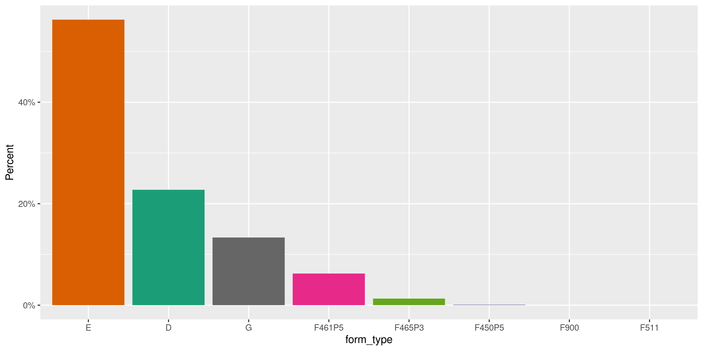
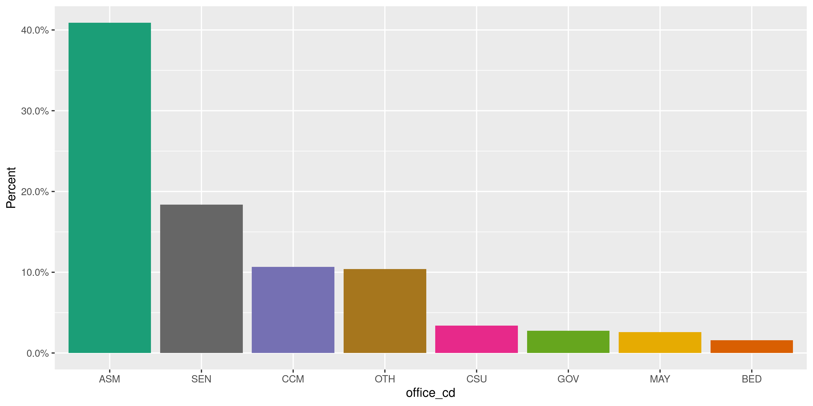
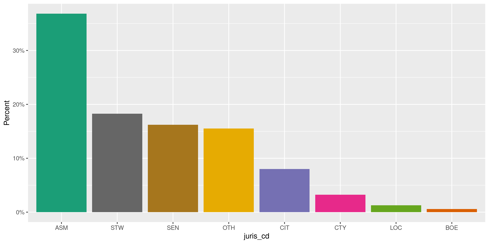
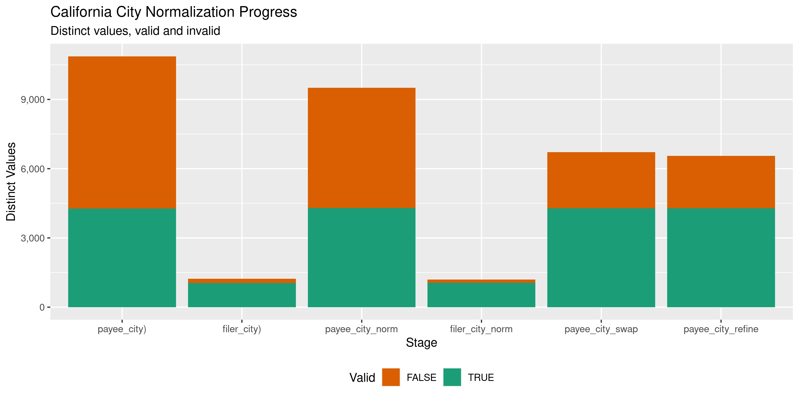

California Expenditures
================
Kiernan Nicholls
2020-08-27 13:15:07

  - [Project](#project)
  - [Objectives](#objectives)
  - [Packages](#packages)
  - [Data](#data)
  - [Download](#download)
  - [Read](#read)
  - [Explore](#explore)
  - [Wrangle](#wrangle)
  - [Conclude](#conclude)
  - [Export](#export)
  - [Upload](#upload)

<!-- Place comments regarding knitting here -->

## Project

The Accountability Project is an effort to cut across data silos and
give journalists, policy professionals, activists, and the public at
large a simple way to search across huge volumes of public data about
people and organizations.

Our goal is to standardizing public data on a few key fields by thinking
of each dataset row as a transaction. For each transaction there should
be (at least) 3 variables:

1.  All **parties** to a transaction.
2.  The **date** of the transaction.
3.  The **amount** of money involved.

## Objectives

This document describes the process used to complete the following
objectives:

1.  How many records are in the database?
2.  Check for entirely duplicated records.
3.  Check ranges of continuous variables.
4.  Is there anything blank or missing?
5.  Check for consistency issues.
6.  Create a five-digit ZIP Code called `zip`.
7.  Create a `year` field from the transaction date.
8.  Make sure there is data on both parties to a transaction.

## Packages

The following packages are needed to collect, manipulate, visualize,
analyze, and communicate these results. The `pacman` package will
facilitate their installation and attachment.

The IRW’s `campfin` package will also have to be installed from GitHub.
This package contains functions custom made to help facilitate the
processing of campaign finance data.

``` r
if (!require("pacman")) install.packages("pacman")
pacman::p_load_gh("irworkshop/campfin")
pacman::p_load(
  tidyverse, # data manipulation
  lubridate, # datetime strings
  gluedown, # printing markdown
  magrittr, # pipe operators
  janitor, # clean data frames
  refinr, # cluster and merge
  scales, # format strings
  knitr, # knit documents
  vroom, # read files fast
  rvest, # html scraping
  glue, # combine strings
  here, # relative paths
  httr, # http requests
  fs # local storage 
)
```

This document should be run as part of the `R_campfin` project, which
lives as a sub-directory of the more general, language-agnostic
[`irworkshop/accountability_datacleaning`](https://github.com/irworkshop/accountability_datacleaning)
GitHub repository.

The `R_campfin` project uses the [RStudio
projects](https://support.rstudio.com/hc/en-us/articles/200526207-Using-Projects)
feature and should be run as such. The project also uses the dynamic
`here::here()` tool for file paths relative to *your* machine.

``` r
# where does this document knit?
here::here()
#> [1] "/home/kiernan/Code/tap/R_campfin"
```

## Data

Instead of getting California campaign expenditure data from the
Secretary of State’s official [Cal-Access
database](http://cal-access.sos.ca.gov/), we will instead be using the
clean version published by the [California Civic Data Coalition
(CCDC)](https://www.californiacivicdata.org).

> The coalition was formed in 2014 by Ben Welsh and Agustin Armendariz
> to lead the development of open-source software that makes
> California’s public data easier to access and analyze. The effort
> has drawn hundreds of contributions from developers and journalists at
> dozens of news organizations.
> 
> Our primary focus is refining CAL-ACCESS, the jumbled, dirty and
> difficult government database that tracks campaign finance and
> lobbying activity in California politics.

The CCDC provides a [single
file](https://calaccess.californiacivicdata.org/documentation/raw-files/expn-cd/)
for state campaign expenditures. The page contains a list of variables
found in the data along with their definitions.

| column       | type    | unique | definition                                                             |
| :----------- | :------ | :----- | :--------------------------------------------------------------------- |
| `AGENT_NAMF` | String  | FALSE  | Agent of Ind. Contractor’s First name                                  |
| `AGENT_NAML` | String  | FALSE  | Agent of Ind. Contractor’s Last name (Sched G)                         |
| `AGENT_NAMS` | String  | FALSE  | Agent of Ind. Contractor’s Suffix                                      |
| `AGENT_NAMT` | String  | FALSE  | Agent of Ind. Contractor’s Prefix or Title                             |
| `AMEND_ID`   | Integer | TRUE   | Amendment identification number (0 is the original filing).            |
| `AMOUNT`     | Double  | FALSE  | Amount of Payment                                                      |
| `BAKREF_TID` | String  | FALSE  | Back Reference to a Tran\_ID of a ‘parent’ record                      |
| `BAL_JURIS`  | String  | FALSE  | Ballot measure’s jurisdiction                                          |
| `BAL_NAME`   | String  | FALSE  | Ballot Measure Name                                                    |
| `BAL_NUM`    | String  | FALSE  | Ballot Number or Letter                                                |
| `CAND_NAMF`  | String  | FALSE  | Candidate’s First name                                                 |
| `CAND_NAML`  | String  | FALSE  | Candidate’s Last name                                                  |
| `CAND_NAMS`  | String  | FALSE  | Candidate’s Suffix                                                     |
| `CAND_NAMT`  | String  | FALSE  | Candidate’s Prefix or Title                                            |
| `CMTE_ID`    | String  | FALSE  | Committee ID (If \[COM/RCP\] & no ID\#, Treas info Req.)               |
| `CUM_OTH`    | Double  | FALSE  | Cumulative / ‘Other’ (No Cumulative on Sched E & G)                    |
| `CUM_YTD`    | Double  | FALSE  | Cumulative / Year-to-date amount (No Cumulative on Sched E & G)        |
| `DIST_NO`    | String  | FALSE  | Office District Number (Req. if Juris\_Cd=\[SEN/ASM/BOE\]              |
| `ENTITY_CD`  | String  | FALSE  | Entity Code describing payee                                           |
| `EXPN_CHKNO` | String  | FALSE  | Check Number (Optional)                                                |
| `EXPN_CODE`  | String  | FALSE  | The type of expenditure                                                |
| `EXPN_DATE`  | Date    | FALSE  | Date of Expenditure (Note: Date not on Sched E & G)                    |
| `EXPN_DSCR`  | String  | FALSE  | Purpose of expense and/or description/explanation                      |
| `FILING_ID`  | Integer | TRUE   | Unique filing identification number                                    |
| `FORM_TYPE`  | String  | TRUE   | Name of the source filing form or schedule                             |
| `G_FROM_E_F` | String  | FALSE  | Back Reference from Sched G to Sched ‘E’ or ‘F’?                       |
| `JURIS_CD`   | String  | FALSE  | Office Jurisdiction Code                                               |
| `JURIS_DSCR` | String  | FALSE  | Office Jurisdiction Description (Req. if Juris\_Cd=\[CIT/CTY/LOC/OTH\] |
| `LINE_ITEM`  | Integer | TRUE   | Line item number of this record                                        |
| `MEMO_CODE`  | String  | FALSE  | Memo Amount? (Date/Amount are informational only).                     |
| `MEMO_REFNO` | String  | FALSE  | Reference to text contained in a TEXT record.                          |
| `OFF_S_H_CD` | String  | FALSE  | Office is sought or held code                                          |
| `OFFIC_DSCR` | String  | FALSE  | Office Sought Description (Req. if Office\_Cd=OTH)                     |
| `OFFICE_CD`  | String  | FALSE  | Identifies the office being sought                                     |
| `PAYEE_CITY` | String  | FALSE  | Payee City                                                             |
| `PAYEE_NAMF` | String  | FALSE  | Payee’s First name                                                     |
| `PAYEE_NAML` | String  | FALSE  | Payee’s Last name                                                      |
| `PAYEE_NAMS` | String  | FALSE  | Payee’s Suffix                                                         |
| `PAYEE_NAMT` | String  | FALSE  | Payee’s Prefix or Title                                                |
| `PAYEE_ST`   | String  | FALSE  | State code                                                             |
| `PAYEE_ZIP4` | String  | FALSE  | Zip+4                                                                  |
| `REC_TYPE`   | String  | TRUE   | Record Type Value: EXPN                                                |
| `SUP_OPP_CD` | String  | FALSE  | Support or opposition code                                             |
| `TRAN_ID`    | String  | FALSE  | Permanent value unique to this item                                    |
| `TRES_CITY`  | String  | FALSE  | Treasurer City                                                         |
| `TRES_NAMF`  | String  | FALSE  | Treasurer’s First name (Req if \[COM/RCP\] & no ID\#)                  |
| `TRES_NAML`  | String  | FALSE  | Treasurer’s Last name (Req if \[COM/RCP\] & no ID\#)                   |
| `TRES_NAMS`  | String  | FALSE  | Treasurer’s Suffix                                                     |
| `TRES_NAMT`  | String  | FALSE  | Treasurer’s Prefix or Title                                            |
| `TRES_ST`    | String  | FALSE  | Treasurer State                                                        |
| `TRES_ZIP4`  | String  | FALSE  | Treasurer ZIP+4                                                        |
| `XREF_MATCH` | String  | FALSE  | X = Related item on other Sched has same Tran\_ID                      |
| `XREF_SCHNM` | String  | FALSE  | Related item is included on Sched ‘C’ or ‘H2’                          |

## Download

We can download the CCDC expenditures file directly, ignoring all the
other data typically included in the Cal-Access database.

``` r
raw_dir <- here("ca", "expends", "data", "raw")
raw_source <- "https://s3-us-west-2.amazonaws.com/django-calaccess" 
raw_url <- str_c(raw_source, "latest", "expn_cd.csv", sep = "/")
raw_path <- path(raw_dir, basename(raw_url))
if (!file_exists(raw_path)) {
  download.file(raw_url, raw_path)
}
```

> ### Errata
> 
> The raw data provided by the state contains errors in how some values
> are escaped, quoted and delimited. The result is a small number of
> records in the latest download were lost when we prepared files for
> download. However, only 638 records out of 7,219,803 total rows were
> lost (you can download them
> [here](https://s3-us-west-2.amazonaws.com/django-calaccess/2020-08-26_09-50-41/expn_cd.errors.csv)).

    #> # A tibble: 638 x 3
    #>    headers fields value                                                                            
    #>      <dbl>  <dbl> <chr>                                                                            
    #>  1      53     54 1080694,0,4,EXPN,F461P5,E13,COM,CRA Issues PAC (CA Restaurant Assn.),,,,Sacramen…
    #>  2      53     54 1192517,0,4,EXPN,F461P5,EXP39,COM, ,Affordable Housing Alliance PAC,,,,San Franc…
    #>  3      53     54 1491774,1,11,EXPN,E,EXP591,COM,,CALIFORNIA PUBLIC SAFETY VOTER GUIDE, A PROJECT …
    #>  4      53     54 1491774,1,12,EXPN,E,EXP593,COM,,SAN DIEGO COUNTY REPUBLICAN LEADERSHIP VOTER GUI…
    #>  5      53     54 1464920,0,635,EXPN,G,EDT336,OTH,Extended Stay America Hotel,,,,Woodland Hills,CA…
    #>  6      53     54 1464920,0,639,EXPN,G,EDT350,OTH,Millenium Biltmore Hotel,,,,Los Angeles,CA,90071…
    #>  7      53     54 1464920,0,530,EXPN,E,EXP4938,OTH,American Express,,,,Weston,FL,33331-3626,10/20/…
    #>  8      53     54 1464920,0,667,EXPN,G,EDT330,OTH,United Airlines,,,,Chicago,IL,60601,8/4/2009 12:…
    #>  9      53     54 1464920,0,668,EXPN,G,EDT342,OTH,United Airlines,,,,Chicago,IL,60601,8/4/2009 12:…
    #> 10      53     54 1464920,0,654,EXPN,G,EDT323,OTH,Southwest Airlines,,,,Dallas,TX,75235,8/4/2009 1…
    #> # … with 628 more rows

## Read

Once downloaded, we can read the expenditures file directly, using the
variable dictionary to define the column types.

``` r
# 7,217,483 rows
cae <- vroom(
  file = raw_path,
  delim = ",",
  escape_double = TRUE,
  .name_repair = make_clean_names,
  col_types = cols(
    .default = col_character(),
    AMEND_ID = col_integer(),
    AMOUNT = col_double(),
    CUM_OTH = col_double(),
    CUM_YTD = col_double(),
    EXPN_DATE = col_date("%m/%d/%Y %H:%M:%S %p"),
    FILING_ID = col_integer(),
    LINE_ITEM = col_integer()
  )
)
```

The expenditures data does not include any identifying information on
the filers of the forms, the committees making the expenditures. There
is are three variables for *candidate* names, but the vast majority are
empty.

``` r
prop_na(cae$cand_naml)
#> [1] 0.721738
```

``` r
cae <- cae %>% 
  select_if(~prop_na(.) < 0.95) %>% 
  select(-starts_with("cand_")) %>% 
  rename(date = expn_date)
```

To get this information, we can download the cover page data from the
[campaign-disclosure
forms](https://calaccess.californiacivicdata.org/documentation/raw-files/cvr-campaign-disclosure-cd/).
These forms contains the filer names and addresses. We can also download
this file from the CCDC and read the same way.

``` r
cvr_url <- str_c(raw_source, "cvr_campaign_disclosure_cd.csv", sep = "/")
cvr_path <- path(raw_dir, basename(cvr_url))
if (!file_exists(cvr_path)) {
  download.file(cvr_url, cvr_path)
}
```

``` r
cvr <- vroom(
  file = cvr_path,
  delim = ",",
  escape_double = TRUE,
  .name_repair = make_clean_names,
  col_types = cols(
    .default = col_character(),
    AMEND_ID = col_integer(),
    FILING_ID = col_integer(),
    RPT_DATE = col_date("%m/%d/%Y %H:%M:%S %p")
  )
)
```

The CVR data has 498,248 rows and 86 columns, only a few of which are
useful to us. We also only want those records identifying those who have
filed expenditure data. We also want to ensure only one version of filer
information for each unique `filing_id`.

``` r
cvr <- cvr %>% 
  select(filing_id, amend_id, starts_with("filer"), rpt_date) %>% 
  filter(filing_id %in% cae$filing_id) %>% 
  select_if(~prop_na(.) < 0.95)
```

We can then use this new data to identify the parties in the
expenditures table using the unique `filing_id` and `amend_id`. We will
remove the useless

``` r
cae <- left_join(cae, cvr)
```

## Explore

``` r
glimpse(cae)
#> Rows: 7,217,483
#> Columns: 38
#> $ filing_id  <int> 578414, 578415, 578415, 578415, 578415, 578415, 578415, 578415, 578415, 57841…
#> $ amend_id   <int> 0, 0, 0, 0, 0, 0, 0, 0, 0, 0, 0, 0, 0, 0, 0, 0, 0, 0, 0, 0, 0, 0, 0, 0, 0, 0,…
#> $ line_item  <int> 2, 1, 2, 3, 4, 5, 6, 7, 8, 9, 10, 11, 1, 2, 3, 4, 5, 6, 7, 8, 9, 10, 11, 12, …
#> $ rec_type   <chr> "EXPN", "EXPN", "EXPN", "EXPN", "EXPN", "EXPN", "EXPN", "EXPN", "EXPN", "EXPN…
#> $ form_type  <chr> "E", "E", "E", "E", "E", "E", "E", "E", "E", "E", "E", "E", "D", "D", "D", "D…
#> $ tran_id    <chr> "EXP34", "EXP20", "EXP18", "EXP19", "EXP28", "EXP24", "EXP22", "EXP21", "EXP1…
#> $ entity_cd  <chr> "IND", "OTH", "OTH", "OTH", "IND", "OTH", "IND", "IND", "IND", "OTH", "OTH", …
#> $ payee_naml <chr> "Plotkin", "CEWAER", "California Democratic Party", "California Democratic Pa…
#> $ payee_namf <chr> "Laura", NA, NA, NA, "J. Richard", NA, "Benjamin", "Benjamin", "Brenda", NA, …
#> $ payee_city <chr> "Calabasas", "Sacramento", "Sacramento", "Sacramento", "Sacramento", "San Die…
#> $ payee_st   <chr> "CA", "CA", "CA", "CA", "CA", "CA", "CA", "CA", "CA", "AZ", "AZ", "AZ", "CA",…
#> $ payee_zip4 <chr> "91302", "95814", "95814", "95814", "95814", "92101", "92101", "92101", "9582…
#> $ date       <date> 2000-01-19, 2000-01-12, 2000-01-07, 2000-01-10, 2000-01-21, 2000-01-21, 2000…
#> $ amount     <dbl> 126.57, 100.00, 50.00, 167.00, 614.51, 120.00, 122.63, 500.00, 177.55, 104.40…
#> $ cum_ytd    <dbl> 0, 0, 0, 0, 0, 0, 0, 0, 0, 0, 0, 0, 1000, 2000, 2000, 1000, 250, 750, 1000, 5…
#> $ cum_oth    <dbl> NA, NA, NA, NA, NA, NA, NA, NA, NA, NA, NA, NA, NA, NA, NA, NA, NA, NA, NA, N…
#> $ expn_chkno <chr> NA, NA, NA, NA, NA, NA, NA, NA, NA, NA, NA, NA, NA, NA, NA, NA, NA, NA, NA, N…
#> $ expn_code  <chr> NA, "CVC", NA, "PRT", "PRO", "OFC", "OFC", "CNS", "FND", "OFC", "OFC", "OFC",…
#> $ expn_dscr  <chr> NA, NA, "Endorsement Fee", NA, NA, NA, "Subvendor: $122.63 - McClure Communic…
#> $ agent_naml <chr> NA, NA, NA, NA, NA, NA, NA, NA, NA, NA, NA, NA, NA, NA, NA, NA, NA, NA, NA, N…
#> $ cmte_id    <chr> NA, NA, NA, NA, NA, NA, NA, NA, NA, NA, NA, NA, "980012", "992113", "931656",…
#> $ office_cd  <chr> NA, NA, NA, NA, NA, NA, NA, NA, NA, NA, NA, NA, "SEN", "ASM", "ASM", "SEN", "…
#> $ juris_cd   <chr> NA, NA, NA, NA, NA, NA, NA, NA, NA, NA, NA, NA, "SEN", "ASM", "ASM", "SEN", "…
#> $ juris_dscr <chr> NA, NA, NA, NA, NA, NA, NA, NA, NA, NA, NA, NA, NA, NA, NA, NA, NA, NA, NA, N…
#> $ dist_no    <chr> NA, NA, NA, NA, NA, NA, NA, NA, NA, NA, NA, NA, "9", "40", "45", "39", NA, "1…
#> $ off_s_h_cd <chr> NA, NA, NA, NA, NA, NA, NA, NA, NA, NA, NA, NA, NA, "H", NA, "H", NA, NA, "S"…
#> $ sup_opp_cd <chr> NA, NA, NA, NA, NA, NA, NA, NA, NA, NA, NA, NA, "S", "S", "S", "S", "S", "S",…
#> $ bakref_tid <chr> NA, NA, NA, NA, NA, NA, NA, NA, NA, NA, NA, NA, NA, NA, NA, NA, NA, NA, NA, N…
#> $ g_from_e_f <chr> NA, NA, NA, NA, NA, NA, NA, NA, NA, NA, NA, NA, NA, NA, NA, NA, NA, NA, NA, N…
#> $ xref_match <chr> NA, NA, NA, NA, NA, NA, NA, NA, NA, NA, NA, NA, NA, NA, NA, NA, NA, NA, NA, N…
#> $ filer_id   <chr> "940199", "951247", "951247", "951247", "951247", "951247", "951247", "951247…
#> $ filer_naml <chr> "Kuehl  for Assembly", "Dede Alpert for Senate", "Dede Alpert for Senate", "D…
#> $ filer_city <chr> "Studio City", "San Diego", "San Diego", "San Diego", "San Diego", "San Diego…
#> $ filer_st   <chr> "CA", "CA", "CA", "CA", "CA", "CA", "CA", "CA", "CA", "CA", "CA", "CA", "CA",…
#> $ filer_zip4 <chr> "91604", "92138", "92138", "92138", "92138", "92138", "92138", "92138", "9213…
#> $ filer_phon <chr> "323-877-5835", "(619) 496-3158", "(619) 496-3158", "(619) 496-3158", "(619) …
#> $ filer_fax  <chr> NA, NA, NA, NA, NA, NA, NA, NA, NA, NA, NA, NA, NA, NA, NA, NA, NA, NA, NA, N…
#> $ rpt_date   <date> 2000-01-27, 2000-01-27, 2000-01-27, 2000-01-27, 2000-01-27, 2000-01-27, 2000…
tail(cae)
#> # A tibble: 6 x 38
#>   filing_id amend_id line_item rec_type form_type tran_id entity_cd payee_naml payee_namf
#>       <int>    <int>     <int> <chr>    <chr>     <chr>   <chr>     <chr>      <chr>     
#> 1   2478644        0     85586 EXPN     E         500172… COM       SARAH DAV… <NA>      
#> 2   2478644        0     85587 EXPN     E         500173… COM       SARAH DAV… <NA>      
#> 3   2478644        0     85588 EXPN     E         500176… COM       SARAH DAV… <NA>      
#> 4   2478644        0     85589 EXPN     E         500190… COM       SARAH DAV… <NA>      
#> 5   2478644        0     85590 EXPN     E         500153… COM       SARAH DAV… <NA>      
#> 6   2478644        0     85591 EXPN     E         500154… COM       SARAH DAV… <NA>      
#> # … with 29 more variables: payee_city <chr>, payee_st <chr>, payee_zip4 <chr>, date <date>,
#> #   amount <dbl>, cum_ytd <dbl>, cum_oth <dbl>, expn_chkno <chr>, expn_code <chr>,
#> #   expn_dscr <chr>, agent_naml <chr>, cmte_id <chr>, office_cd <chr>, juris_cd <chr>,
#> #   juris_dscr <chr>, dist_no <chr>, off_s_h_cd <chr>, sup_opp_cd <chr>, bakref_tid <chr>,
#> #   g_from_e_f <chr>, xref_match <chr>, filer_id <chr>, filer_naml <chr>, filer_city <chr>,
#> #   filer_st <chr>, filer_zip4 <chr>, filer_phon <chr>, filer_fax <chr>, rpt_date <date>
```

### Missing

Columns vary in their degree of missing values. We can flag any values
missing from key variables used to identify the transaction.

``` r
col_stats(cae, count_na)
#> # A tibble: 38 x 4
#>    col        class        n       p
#>    <chr>      <chr>    <int>   <dbl>
#>  1 filing_id  <int>        0 0      
#>  2 amend_id   <int>        0 0      
#>  3 line_item  <int>        0 0      
#>  4 rec_type   <chr>        0 0      
#>  5 form_type  <chr>        0 0      
#>  6 tran_id    <chr>        0 0      
#>  7 entity_cd  <chr>   242029 0.0335 
#>  8 payee_naml <chr>   363771 0.0504 
#>  9 payee_namf <chr>  5994053 0.830  
#> 10 payee_city <chr>   491300 0.0681 
#> 11 payee_st   <chr>  1346383 0.187  
#> 12 payee_zip4 <chr>   521622 0.0723 
#> 13 date       <date> 1657824 0.230  
#> 14 amount     <dbl>    50755 0.00703
#> 15 cum_ytd    <dbl>  1317059 0.182  
#> 16 cum_oth    <dbl>  5864878 0.813  
#> 17 expn_chkno <chr>  5567648 0.771  
#> 18 expn_code  <chr>   518864 0.0719 
#> 19 expn_dscr  <chr>  4073709 0.564  
#> 20 agent_naml <chr>  6229185 0.863  
#> 21 cmte_id    <chr>  4817977 0.668  
#> 22 office_cd  <chr>  5969571 0.827  
#> 23 juris_cd   <chr>  5889490 0.816  
#> 24 juris_dscr <chr>  6826054 0.946  
#> 25 dist_no    <chr>  6304168 0.873  
#> 26 off_s_h_cd <chr>  6797003 0.942  
#> 27 sup_opp_cd <chr>  5245453 0.727  
#> 28 bakref_tid <chr>  6623875 0.918  
#> 29 g_from_e_f <chr>  6535116 0.905  
#> 30 xref_match <chr>  6598215 0.914  
#> 31 filer_id   <chr>    14469 0.00200
#> 32 filer_naml <chr>    14469 0.00200
#> 33 filer_city <chr>    14894 0.00206
#> 34 filer_st   <chr>    17011 0.00236
#> 35 filer_zip4 <chr>    14927 0.00207
#> 36 filer_phon <chr>   150930 0.0209 
#> 37 filer_fax  <chr>  4395982 0.609  
#> 38 rpt_date   <date>   14469 0.00200
```

``` r
cae <- cae %>% 
  # unite names
  unite(
    col = payee_cmbn, 
    starts_with("payee_nam"), 
    sep = " ", 
    remove = FALSE,
    na.rm = TRUE
  ) %>%
    unite(
    col = filer_cmbn, 
    starts_with("filer_nam"), 
    sep = " ", 
    remove = FALSE,
    na.rm = TRUE
  ) %>%
  # use report date for those missing
  mutate(date = coalesce(date, rpt_date)) %>% 
  # flag missing records
  flag_na(date, payee_cmbn, amount, filer_cmbn) %>% 
  # remove combined names
  select(-ends_with("_cmbn"))
```

``` r
mean(cae$na_flag)
#> [1] 0.009030572
```

``` r
cae %>% 
  filter(na_flag) %>% 
  select(date, payee_naml, amount, filer_naml) %>% 
  sample_frac()
#> # A tibble: 65,178 x 4
#>    date       payee_naml                             amount filer_naml                             
#>    <date>     <chr>                                   <dbl> <chr>                                  
#>  1 2007-04-05 Parra for Assembly 2006                    NA Democratic State Central Committee of …
#>  2 2004-02-19 Californians for Budget Accountability     NA California State Council of Service Em…
#>  3 2007-09-17 Elect Henry Jones to CalPERS               NA American Federation of State, County a…
#>  4 NA         WOMEN DEMOCRATS OF SACRAMENTO COUNTY       45 <NA>                                   
#>  5 2002-10-07 Vince Hall for Assembly c/o Padilla &…     NA Democratic State Central Committee of …
#>  6 2005-11-02 No on 76, educators, firefighters, sc…     NA Alliance for a Better California, educ…
#>  7 2006-03-02 No on 76-Educators,Firefghtrs,School …     NA Democratic State Central Committee of …
#>  8 2002-11-04 Californians for Gray Davis c/o Smith…     NA Democratic State Central Committee of …
#>  9 NA         SUNDAY GOVER FOR ASSEMBLY 2018 FPPC #…    100 <NA>                                   
#> 10 NA         JACQUI IRWIN FOR ASSEMBLY 2018            500 <NA>                                   
#> # … with 65,168 more rows
```

``` r
cae %>% 
  filter(na_flag) %>% 
  select(date, payee_naml, amount, filer_naml) %>% 
  col_stats(count_na)
#> # A tibble: 4 x 4
#>   col        class      n        p
#>   <chr>      <chr>  <int>    <dbl>
#> 1 date       <date> 14423 0.221   
#> 2 payee_naml <chr>     45 0.000690
#> 3 amount     <dbl>  50755 0.779   
#> 4 filer_naml <chr>  14423 0.221
```

### Duplicates

``` r
dupe_file <- here("ca", "expends", "dupes.txt")
if (!file_exists(dupe_file)) {
  file_create(dupe_file)
  n <- 1e5 # rows per chunk
  nr <- nrow(cae)
  # split file into chunks
  cas <- split(
    x = arrange(cae, payee_naml), 
    f = rep(x = 1:ceiling(nr/n), each = n, length.out = nr)
  )
  pb <- txtProgressBar(max = length(cas), style = 3)
  for (i in seq_along(cas)) {
    # check dupes from both ends
    d1 <- duplicated(cas[[i]], fromLast = FALSE)
    d2 <- duplicated(cas[[i]], fromLast = TRUE)
    # append to disk
    write_lines(d1 | d2, dupe_file, append = TRUE)
    rm(d1, d2)
    cas[[i]] <- NA
    Sys.sleep(1); flush_memory()
    setTxtProgressBar(pb, value = i)
  }
  rm(cas)
}
```

``` r
cae <- mutate(cae, dupe_flag = as.logical(read_lines(dupe_file)))
```

After all that work, there are 0 duplicate records

``` r
cae %>% 
  filter(dupe_flag) %>% 
  select(date, payee_naml, amount, filer_naml)
#> # A tibble: 0 x 4
#> # … with 4 variables: date <date>, payee_naml <chr>, amount <dbl>, filer_naml <chr>
```

### Categorical

``` r
col_stats(cae, n_distinct)
#> # A tibble: 40 x 4
#>    col        class        n           p
#>    <chr>      <chr>    <int>       <dbl>
#>  1 filing_id  <int>   147361 0.0204     
#>  2 amend_id   <int>       10 0.00000139 
#>  3 line_item  <int>   107156 0.0148     
#>  4 rec_type   <chr>        1 0.000000139
#>  5 form_type  <chr>        8 0.00000111 
#>  6 tran_id    <chr>  2018596 0.280      
#>  7 entity_cd  <chr>       16 0.00000222 
#>  8 payee_naml <chr>   388823 0.0539     
#>  9 payee_namf <chr>    31444 0.00436    
#> 10 payee_city <chr>    13997 0.00194    
#> 11 payee_st   <chr>      306 0.0000424  
#> 12 payee_zip4 <chr>    49727 0.00689    
#> 13 date       <date>    7780 0.00108    
#> 14 amount     <dbl>   386447 0.0535     
#> 15 cum_ytd    <dbl>   265899 0.0368     
#> 16 cum_oth    <dbl>      337 0.0000467  
#> 17 expn_chkno <chr>   107491 0.0149     
#> 18 expn_code  <chr>      185 0.0000256  
#> 19 expn_dscr  <chr>   598169 0.0829     
#> 20 agent_naml <chr>    14527 0.00201    
#> 21 cmte_id    <chr>    47105 0.00653    
#> 22 office_cd  <chr>       86 0.0000119  
#> 23 juris_cd   <chr>       78 0.0000108  
#> 24 juris_dscr <chr>    16923 0.00234    
#> 25 dist_no    <chr>      785 0.000109   
#> 26 off_s_h_cd <chr>        9 0.00000125 
#> 27 sup_opp_cd <chr>        9 0.00000125 
#> 28 bakref_tid <chr>    47773 0.00662    
#> 29 g_from_e_f <chr>        4 0.000000554
#> 30 xref_match <chr>        2 0.000000277
#> 31 filer_id   <chr>    13516 0.00187    
#> 32 filer_naml <chr>    19712 0.00273    
#> 33 filer_city <chr>     1797 0.000249   
#> 34 filer_st   <chr>       61 0.00000845 
#> 35 filer_zip4 <chr>     3492 0.000484   
#> 36 filer_phon <chr>    11731 0.00163    
#> 37 filer_fax  <chr>     3073 0.000426   
#> 38 rpt_date   <date>    6248 0.000866   
#> 39 na_flag    <lgl>        2 0.000000277
#> 40 dupe_flag  <lgl>        1 0.000000139
```

<!-- --><!-- --><!-- --><!-- -->

### Amounts

``` r
summary(cae$amount) %>% map_chr(dollar)
#>           Min.        1st Qu.         Median           Mean        3rd Qu.           Max. 
#> "-$30,000,000"          "$99"         "$500"    "$6,570.43"       "$1,600"  "$50,783,536" 
#>           NA's 
#>      "$50,755"
mean(cae$amount <= 0, na.rm = TRUE)
#> [1] 0.004546566
```

<!-- -->

### Dates

We can add the calendar year from `date` with `lubridate::year()`

``` r
cae <- mutate(cae, year = year(date))
```

There are a number of dates with impossibly low or high values.

``` r
min(cae$date, na.rm = TRUE)
#> [1] "200-07-31"
sum(cae$year < 1999, na.rm = TRUE)
#> [1] 284
max(cae$date, na.rm = TRUE)
#> [1] "9201-03-03"
sum(cae$date > today(), na.rm = TRUE)
#> [1] 182
```

``` r
cae <- mutate(cae, date_flag = date > today() | year < 1999 | is.na(date))
percent(mean(cae$date_flag, na.rm = TRUE), 0.001)
#> [1] "0.206%"
```

<!-- -->

## Wrangle

To improve the searchability of the database, we will perform some
consistent, confident string normalization. For geographic variables
like city names and ZIP codes, the corresponding `campfin::normal_*()`
functions are tailor made to facilitate this process.

### ZIP

For ZIP codes, the `campfin::normal_zip()` function will attempt to
create valid *five* digit codes by removing the ZIP+4 suffix and
returning leading zeroes dropped by other programs like Microsoft Excel.

``` r
cae <- mutate(
  .data = cae, across(
    .cols = ends_with("_zip4"),
    .fns = list(norm = normal_zip),
    na_rep = TRUE
  )
)
```

``` r
progress_table(
  cae$payee_zip4,
  cae$payee_zip4_norm,
  compare = valid_zip
)
#> # A tibble: 2 x 6
#>   stage           prop_in n_distinct prop_na   n_out n_diff
#>   <chr>             <dbl>      <dbl>   <dbl>   <dbl>  <dbl>
#> 1 payee_zip4        0.850      49727  0.0723 1003895  39707
#> 2 payee_zip4_norm   0.997      12726  0.0726   22274   2216
```

### State

Valid two digit state abbreviations can be made using the
`campfin::normal_state()` function.

``` r
cae <- mutate(
  .data = cae, across(
    .cols = ends_with("_st"),
    .fns = list(norm = normal_state),
    abbreviate = TRUE,
    na_rep = TRUE,
  )
)
```

``` r
cae %>% 
  filter(payee_st != payee_st_norm) %>% 
  count(payee_st, payee_st_norm, sort = TRUE)
#> # A tibble: 107 x 3
#>    payee_st payee_st_norm     n
#>    <chr>    <chr>         <int>
#>  1 Ca       CA            25038
#>  2 ca       CA             3647
#>  3 Az       AZ              610
#>  4 Tx       TX              267
#>  5 Il       IL              126
#>  6 Co       CO              104
#>  7 Ga       GA               96
#>  8 Ma       MA               89
#>  9 Wa       WA               83
#> 10 Ut       UT               76
#> # … with 97 more rows
```

``` r
progress_table(
  cae$payee_st,
  cae$payee_st_norm,
  compare = valid_state
)
#> # A tibble: 2 x 6
#>   stage         prop_in n_distinct prop_na n_out n_diff
#>   <chr>           <dbl>      <dbl>   <dbl> <dbl>  <dbl>
#> 1 payee_st        0.994        306   0.187 32979    249
#> 2 payee_st_norm   1.00         195   0.187  2091    139
```

### City

Cities are the most difficult geographic variable to normalize, simply
due to the wide variety of valid cities and formats.

#### Normal

The `campfin::normal_city()` function is a good start, again converting
case, removing punctuation, but *expanding* USPS abbreviations. We can
also remove `invalid_city` values.

``` r
cae <- mutate(
  .data = cae, across(
    .cols = ends_with("_city"),
    .fns = list(norm = normal_city),
    abbs = usps_city,
      states = c("CA", "DC", "CALIFORNIA"),
      na = invalid_city,
      na_rep = TRUE
  )
)
```

#### Swap

We can further improve normalization by comparing our normalized value
against the *expected* value for that record’s state abbreviation and
ZIP code. If the normalized value is either an abbreviation for or very
similar to the expected value, we can confidently swap those two.

``` r
cae <- cae %>% 
  left_join(
    y = zipcodes,
    by = c(
      "payee_st_norm" = "state",
      "payee_zip4_norm" = "zip"
    )
  ) %>% 
  rename(city_match = city) %>% 
  mutate(
    match_abb = is_abbrev(payee_city_norm, city_match),
    match_dist = str_dist(payee_city_norm, city_match),
    payee_city_swap = if_else(
      condition = !is.na(match_dist) & (match_abb | match_dist == 1),
      true = city_match,
      false = payee_city_norm
    )
  ) %>% 
  select(
    -city_match,
    -match_dist,
    -match_abb
  )
```

#### Refine

The [OpenRefine](https://openrefine.org/) algorithms can be used to
group similar strings and replace the less common versions with their
most common counterpart. This can greatly reduce inconsistency, but with
low confidence; we will only keep any refined strings that have a valid
city/state/zip combination.

``` r
good_refine <- cae %>% 
  mutate(
    payee_city_refine = payee_city_swap %>% 
      key_collision_merge() %>% 
      n_gram_merge(numgram = 1)
  ) %>% 
  filter(payee_city_refine != payee_city_swap) %>% 
  inner_join(
    y = zipcodes,
    by = c(
      "payee_city_refine" = "city",
      "payee_st_norm" = "state",
      "payee_zip4_norm" = "zip"
    )
  )
```

    #> # A tibble: 206 x 5
    #>    payee_st_norm payee_zip4_norm payee_city_swap        payee_city_refine          n
    #>    <chr>         <chr>           <chr>                  <chr>                  <int>
    #>  1 DE            19801           WILIMGTON              WILMINGTON                64
    #>  2 CA            94107           SAN FRANSICO           SAN FRANCISCO             63
    #>  3 CA            91376           AUGORA HILLS           AGOURA HILLS              58
    #>  4 CA            92688           RANCHO SAINT MARGARITA RANCHO SANTA MARGARITA    50
    #>  5 CA            94111           SAN FRONACISCO         SAN FRANCISCO             43
    #>  6 OH            45226           CINCINATTI             CINCINNATI                43
    #>  7 CA            95814           SACRAMAMENTO           SACRAMENTO                42
    #>  8 OH            45274           CINCINATTI             CINCINNATI                32
    #>  9 MD            20814           EAST BETHESDA          BETHESDA                  23
    #> 10 CA            91011           CANADA FLINTRIDGE      LA CANADA FLINTRIDGE      20
    #> # … with 196 more rows

Then we can join the refined values back to the database.

``` r
cae <- cae %>% 
  left_join(good_refine) %>% 
  mutate(payee_city_refine = coalesce(payee_city_refine, payee_city_swap))
```

#### Progress

| stage               | prop\_in | n\_distinct | prop\_na | n\_out | n\_diff |
| :------------------ | -------: | ----------: | -------: | -----: | ------: |
| payee\_city)        |    0.981 |       10869 |    0.068 | 126746 |    6602 |
| filer\_city)        |    0.993 |        1230 |    0.002 |  50607 |     181 |
| payee\_city\_norm   |    0.990 |        9505 |    0.068 |  69026 |    5207 |
| filer\_city\_norm   |    0.995 |        1197 |    0.002 |  33986 |     141 |
| payee\_city\_swap   |    0.996 |        6713 |    0.068 |  27139 |    2429 |
| payee\_city\_refine |    0.996 |        6554 |    0.068 |  26152 |    2273 |

You can see how the percentage of valid values increased with each
stage.

<!-- -->

More importantly, the number of distinct values decreased each stage. We
were able to confidently change many distinct invalid values to their
valid equivalent.

<!-- -->

## Conclude

Before exporting, we can remove the intermediary normalization columns
and rename all added variables with the `_clean` suffix.

``` r
cae <- cae %>% 
  select(
    -payee_city_norm,
    -payee_city_swap,
    payee_city_clean = payee_city_refine
  ) %>% 
  rename_all(~str_replace(., "_norm", "_clean")) %>% 
  rename_all(~str_remove(., "_raw"))
```

``` r
glimpse(sample_n(cae, 50))
#> Rows: 50
#> Columns: 48
#> $ filing_id        <int> 1461573, 1492136, 1111264, 2455670, 1903351, 1768680, 2478644, 876202, …
#> $ amend_id         <int> 0, 1, 0, 1, 1, 0, 0, 0, 0, 0, 0, 0, 2, 0, 0, 0, 0, 0, 1, 0, 0, 1, 0, 0,…
#> $ line_item        <int> 7, 25, 3, 87, 1215, 14, 54631, 2, 4, 61, 17369, 108, 430, 14, 10776, 48…
#> $ rec_type         <chr> "EXPN", "EXPN", "EXPN", "EXPN", "EXPN", "EXPN", "EXPN", "EXPN", "EXPN",…
#> $ form_type        <chr> "E", "E", "E", "D", "E", "F465P3", "E", "D", "D", "E", "E", "E", "D", "…
#> $ tran_id          <chr> "EXP93", "EXP20981", "E518", "VNS479H8B73", "EXP39030", "D1018", "50017…
#> $ entity_cd        <chr> "OTH", "IND", "OTH", "OTH", "OTH", "IND", "OTH", "COM", "COM", "OTH", "…
#> $ payee_naml       <chr> "Olson Hagel & Fishburn LLP", "Akins", "Museum of the African Diaspora"…
#> $ payee_namf       <chr> NA, "Gayle", NA, NA, NA, "Gary", NA, "GEORGE", "Friends of Bill", NA, N…
#> $ payee_city       <chr> "Sacramento", "San Rafael", "San Francisco", "Los Angeles", "Sacramento…
#> $ payee_st         <chr> "CA", "CA", "CA", "CA", "CA", "CA", "CA", "CA", "CA", "CA", NA, "CA", N…
#> $ payee_zip4       <chr> "95814", "94901", "94102", "90017-5864", "95818", "90066", "90046-4411"…
#> $ date             <date> 2009-11-13, 2010-04-08, 2005-06-23, 2020-02-06, 2014-10-10, 2013-05-15…
#> $ amount           <dbl> 305.08, 242.00, 649.00, 485.00, 295.00, 450.00, 100.00, 1000.00, 150.00…
#> $ cum_ytd          <dbl> 0.00, 494.50, 649.00, 485.00, 295.00, 23003.50, 0.00, 1750.00, 1150.00,…
#> $ cum_oth          <dbl> NA, NA, NA, NA, NA, NA, 0, NA, NA, NA, 0, NA, 0, NA, 0, NA, NA, NA, NA,…
#> $ expn_chkno       <chr> NA, NA, "2026", NA, NA, "a/e", "400025002", NA, NA, NA, NA, NA, NA, "21…
#> $ expn_code        <chr> "PRO", "CNS", "CVC", "IND", "FND", "IND", "CTB", "MON", "MON", "FND", "…
#> $ expn_dscr        <chr> NA, NA, NA, "Voter Guide", NA, "MBR:LIT/Curren Price", "Earmarked Contr…
#> $ agent_naml       <chr> NA, NA, NA, NA, NA, NA, NA, NA, NA, NA, NA, NA, NA, NA, NA, NA, NA, NA,…
#> $ cmte_id          <chr> NA, NA, NA, NA, NA, NA, "1280745", NA, "950478", NA, "1403584", NA, NA,…
#> $ office_cd        <chr> NA, NA, NA, "ASM", NA, "CCM", NA, "ASM", "ASM", NA, NA, NA, "ASM", NA, …
#> $ juris_cd         <chr> NA, NA, NA, "ASM", NA, "CIT", NA, NA, "ASM", NA, NA, NA, "ASM", NA, NA,…
#> $ juris_dscr       <chr> NA, NA, NA, NA, NA, NA, NA, NA, NA, NA, NA, NA, NA, NA, NA, NA, NA, NA,…
#> $ dist_no          <chr> NA, NA, NA, "36", NA, "09", NA, "075", "71", NA, NA, NA, "54", NA, NA, …
#> $ off_s_h_cd       <chr> NA, NA, NA, NA, NA, NA, NA, NA, "H", NA, NA, NA, "H", NA, NA, NA, NA, N…
#> $ sup_opp_cd       <chr> NA, NA, NA, "S", NA, "S", NA, "s", "S", NA, NA, NA, "S", NA, NA, NA, NA…
#> $ bakref_tid       <chr> NA, NA, NA, NA, NA, NA, NA, NA, NA, NA, NA, NA, NA, NA, NA, NA, NA, NA,…
#> $ g_from_e_f       <chr> NA, NA, NA, NA, NA, NA, NA, NA, NA, NA, NA, NA, NA, NA, NA, NA, NA, NA,…
#> $ xref_match       <chr> NA, NA, NA, "X", NA, NA, NA, NA, NA, NA, NA, NA, NA, NA, NA, NA, NA, NA…
#> $ filer_id         <chr> "1301846", "742051", "1266855", "1367190", "741666", "744554", "1287846…
#> $ filer_naml       <chr> "Southwest Regional Council of Carpenters Issues Committee", "San Franc…
#> $ filer_city       <chr> "Los Angeles", "San Francisco", "San Francisco", "Los Angeles", "Sacram…
#> $ filer_st         <chr> "CA", "CA", "CA", "CA", "CA", "CA", "MA", "MI", "CA", "CA", "MA", "CA",…
#> $ filer_zip4       <chr> "90071", "94104", "94105", "90017", "95811", "90017-0000", "02144", "48…
#> $ filer_phon       <chr> "(213) 228-8492", "415-626-1161", "(415) 777-0310", "(213) 452-6565", "…
#> $ filer_fax        <chr> "(213) 228-8454", "323-395-0519", "(415) 441-6969", "(213) 452-6575", "…
#> $ rpt_date         <date> 2010-01-27, 2010-07-30, 2005-07-08, 2020-02-20, 2014-10-29, 2013-05-16…
#> $ na_flag          <lgl> FALSE, FALSE, FALSE, FALSE, FALSE, FALSE, FALSE, FALSE, FALSE, FALSE, F…
#> $ dupe_flag        <lgl> FALSE, FALSE, FALSE, FALSE, FALSE, FALSE, FALSE, FALSE, FALSE, FALSE, F…
#> $ year             <dbl> 2009, 2010, 2005, 2020, 2014, 2013, 2020, 2002, 2000, 2007, 2018, 2002,…
#> $ date_flag        <lgl> FALSE, FALSE, FALSE, FALSE, FALSE, FALSE, FALSE, FALSE, FALSE, FALSE, F…
#> $ payee_zip4_clean <chr> "95814", "94901", "94102", "90017", "95818", "90066", "90046", "92122",…
#> $ filer_zip4_clean <chr> "90071", "94104", "94105", "90017", "95811", "90017", "02144", "48326",…
#> $ payee_st_clean   <chr> "CA", "CA", "CA", "CA", "CA", "CA", "CA", "CA", "CA", "CA", NA, "CA", N…
#> $ filer_st_clean   <chr> "CA", "CA", "CA", "CA", "CA", "CA", "MA", "MI", "CA", "CA", "MA", "CA",…
#> $ filer_city_clean <chr> "LOS ANGELES", "SAN FRANCISCO", "SAN FRANCISCO", "LOS ANGELES", "SACRAM…
#> $ payee_city_clean <chr> "SACRAMENTO", "SAN RAFAEL", "SAN FRANCISCO", "LOS ANGELES", "SACRAMENTO…
```

1.  There are 7,217,483 records in the database.
2.  There are 0 duplicate records in the database.
3.  The range and distribution of `amount` and `date` seem reasonable.
4.  There are 65,178 records missing key variables.
5.  Consistency in geographic data has been improved with
    `campfin::normal_*()`.
6.  The 4-digit `year` variable has been created with
    `lubridate::year()`.

## Export

Now the file can be saved on disk for upload to the Accountability
server.

``` r
clean_dir <- dir_create(here("ca", "expends", "data", "clean"))
clean_path <- path(clean_dir, "ca_expends_clean.csv")
write_csv(cae, clean_path, na = "")
file_size(clean_path)
#> 2.04G
file_encoding(clean_path) %>% 
  mutate(across(path, path.abbrev))
#> # A tibble: 1 x 3
#>   path                                         mime            charset 
#>   <chr>                                        <chr>           <chr>   
#> 1 ~/ca/expends/data/clean/ca_expends_clean.csv application/csv us-ascii
```

## Upload

Using the [duckr](https://github.com/kiernann/duckr) R package, we can
wrap around the [duck](https://duck.sh/) command line tool to upload the
file to the IRW server.

``` r
# remotes::install_github("kiernann/duckr")
s3_dir <- "s3:/publicaccountability/csv/"
s3_path <- path(s3_dir, basename(clean_path))
if (require(duckr)) {
  duckr::duck_upload(clean_path, s3_path)
}
```
