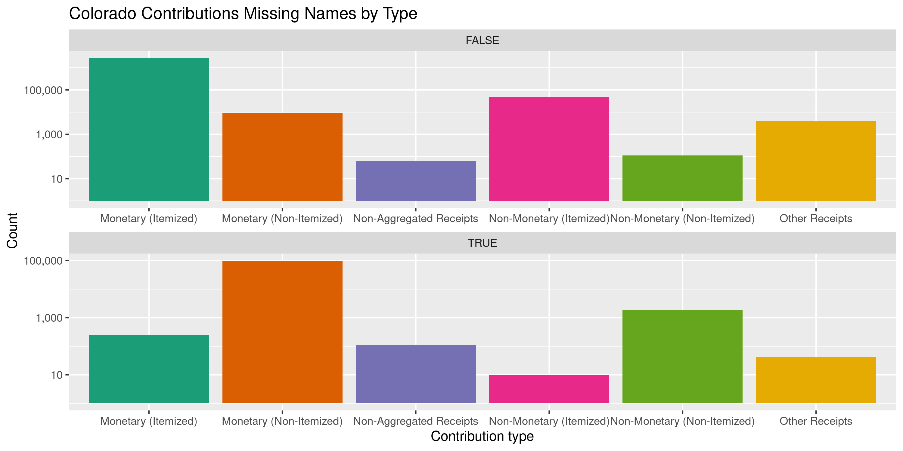
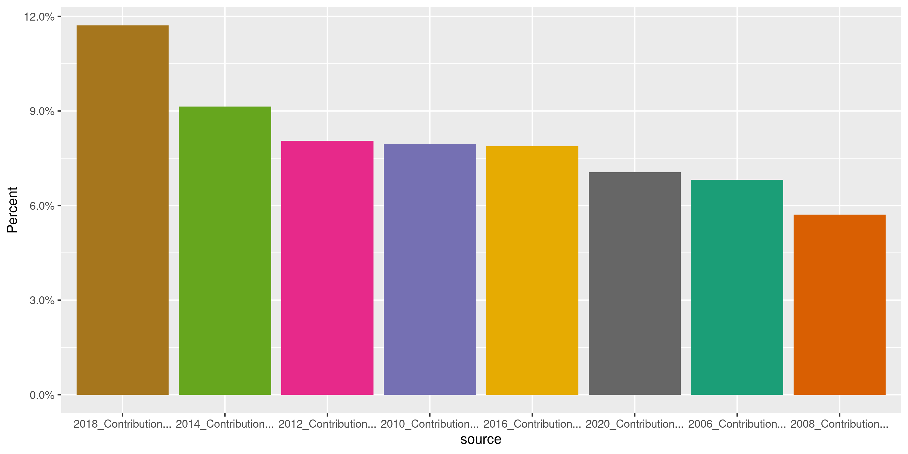
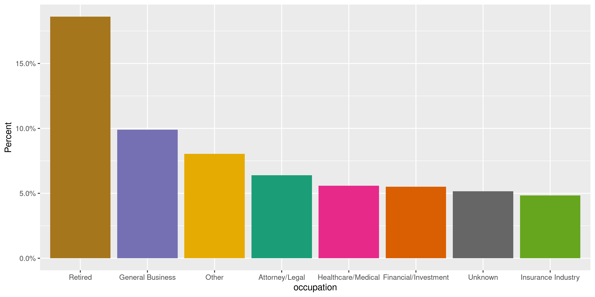

Colorado Contributions
================
Kiernan Nicholls
2020-10-01 13:50:24

  - [Project](#project)
  - [Objectives](#objectives)
  - [Packages](#packages)
  - [Import](#import)
  - [Explore](#explore)
  - [Wrangle](#wrangle)
  - [Conclude](#conclude)
  - [Export](#export)
  - [Upload](#upload)

<!-- Place comments regarding knitting here -->

## Project

The Accountability Project is an effort to cut across data silos and
give journalists, policy professionals, activists, and the public at
large a simple way to search across huge volumes of public data about
people and organizations.

Our goal is to standardizing public data on a few key fields by thinking
of each dataset row as a transaction. For each transaction there should
be (at least) 3 variables:

1.  All **parties** to a transaction.
2.  The **date** of the transaction.
3.  The **amount** of money involved.

## Objectives

This document describes the process used to complete the following
objectives:

1.  How many records are in the database?
2.  Check for entirely duplicated records.
3.  Check ranges of continuous variables.
4.  Is there anything blank or missing?
5.  Check for consistency issues.
6.  Create a five-digit ZIP Code called `zip`.
7.  Create a `year` field from the transaction date.
8.  Make sure there is data on both parties to a transaction.

## Packages

The following packages are needed to collect, manipulate, visualize,
analyze, and communicate these results. The `pacman` package will
facilitate their installation and attachment.

The IRW’s `campfin` package will also have to be installed from GitHub.
This package contains functions custom made to help facilitate the
processing of campaign finance data.

``` r
if (!require("pacman")) install.packages("pacman")
pacman::p_load_gh("irworkshop/campfin")
pacman::p_load(
  tidyverse, # data manipulation
  lubridate, # datetime strings
  gluedown, # printing markdown
  magrittr, # pipe operators
  janitor, # clean data frames
  aws.s3, # upload to aws s3
  refinr, # cluster and merge
  scales, # format strings
  knitr, # knit documents
  vroom, # read files fast
  rvest, # html scraping
  glue, # combine strings
  here, # relative paths
  httr, # http requests
  fs # local storage 
)
```

This document should be run as part of the `R_campfin` project, which
lives as a sub-directory of the more general, language-agnostic
[`irworkshop/accountability_datacleaning`](https://github.com/irworkshop/accountability_datacleaning)
GitHub repository.

The `R_campfin` project uses the [RStudio
projects](https://support.rstudio.com/hc/en-us/articles/200526207-Using-Projects)
feature and should be run as such. The project also uses the dynamic
`here::here()` tool for file paths relative to *your* machine.

``` r
here::here() # where does this document knit?
#> [1] "/home/kiernan/Code/tap/R_campfin"
```

Colorado campaign expenditures data comes courtesy of Colorado Campaign
Finance Disclosure Website, which is managed by the TRACER reporting
system (**Tra**nsparency in **C**ontribution and **E**xpenditure
**R**eporting). Files can be found on the [Data
Download](http://tracer.sos.colorado.gov/PublicSite/DataDownload.aspx)
page.

### Access

> You can access the Campaign Finance Data Download page to download
> contribution and expenditure data for import into other applications
> such as Microsoft Excel or Access. A weekly batch process is run that
> captures the year-to-date information for the current year. The data
> is available for each calendar year. The file is downloaded in CSV
> format.

> This page provides comma separated value (CSV) downloads of
> contribution/donation, expenditure, and loan data for each reporting
> year in a zipped file format. These files can be downloaded and
> imported into other applications (Microsoft Excel, Microsoft Access,
> etc.). This data is extracted from the Department of State database as
> it existed as of 7/20/2019 3:01 AM

In the [TRACER FAQ
file](http://tracer.sos.colorado.gov/PublicSite/FAQ.aspx), the Secretary
of State explains:

> The information presented in the campaign finance database is, to the
> best of the ability of the Secretary of State, an accurate
> representation of the disclosure reports filed with the applicable
> office.It is suggested that the information found from reports
> data-entered by the Secretary of State or County Clerks (which
> includes reports filed prior to 2010) be cross-checked with the
> original document or scanned image of the original document.
> 
> Beginning in 2010, all candidates, committees, and political parties
> who file disclosure reports with the Secretary of State must do so
> electronically using the TRACER system. Therefore, all data contained
> in the database dated January 2010 onward reflects that data as
> entered by the reporting person or entity.
> 
> Prior to 2010, filers had the option of filing manual disclosure
> reports. Therefore, some of the information in the campaign finance
> database dated prior to 2010was submitted in electronic form by the
> candidate, committee or party, and some of the information was
> data-entered from paper reports filed with the appropriate office.
> Sometimes items which are not consistent with filing requirements,
> such as missing names and addresses or contributions that exceed the
> allowable limits, are displayed when data is viewed online. Incorrect
> entries in the database typically reflect incorrect or incomplete
> entries on manually filed reports submitted to the Secretary of State
> or County Clerk. If you believe that there is a discrepancy in data
> dated prior to January 2010, please contact the appropriate filing
> officer for that data—the Secretary of State for statewide candidates,
> committees, and parties; or the County Clerk for county candidates and
> committees.

TRACER also provides a PDF [spreadsheet
key](http://tracer.sos.colorado.gov/PublicSite/Resources/DownloadDataFileKey.pdf).

| Field Name            | Description                                            |
| :-------------------- | :----------------------------------------------------- |
| `CO_ID`               | Alphanumeric committee ID for the recipient committee. |
| `CONTRIBUTION AMOUNT` | Contribution Amount.                                   |
| `CONTRIBUTION DATE`   | Contribution Receipt Date.                             |
| `LAST NAME`           | Last Name (or entity name) of Contributor              |
| `FIRST NAME`          | Contributor First Name                                 |
| `MI`                  | Contributor Middle Initial                             |
| `SUFFIX`              | Contributor Name Suffix                                |
| `ADDRESS 1`           | Street, PO Box, or other directional information       |
| `ADDRESS 2`           | Suite/Apartment number, directional information        |
| `CITY`                | City.                                                  |
| `STATE`               | State.                                                 |
| `ZIP`                 | Zip Code.                                              |
| `EXPLANATION`         | Description provided for the contribution.             |
| `RECORD ID`           | Contribution internal ID issued by the SOS.            |
| `FILED DATE`          |                                                        |
| `CONTRIBUTION TYPE`   | Contribution Type.                                     |
| `RECEIPT TYPE`        |                                                        |
| `CONTRIBUTOR TYPE`    |                                                        |
| `ELECTIONEERING`      | YES or blank                                           |
| `COMMITTEE TYPE`      |                                                        |
| `COMMITTEE NAME`      | Name of the recipient committee.                       |
| `CANDIDATE NAME`      | Name of the recipient candidate..                      |
| `EMPLOYER`            | Contributor’s employer.                                |
| `OCCUPATION`          | Contributor’s occupation in cases from list.           |
| `AMENDED`             | Amendment was filed for this record. (Y/N)             |
| `AMENDMENT`           | Record is an amendment to a previously file. (Y/N)     |
| `AMENDED RECORD ID`   | Original record ID that was amended.                   |
| `JURISDICTION`        | This is the jurisdiction name.                         |
| `OCCUPATION COMMENTS` | If ‘Other’ is chosen for the occupation.               |

## Import

We can download the annual ZIP archives directly from TRACER.

``` r
raw_dir <- dir_create(here("co", "contribs", "data", "raw"))
raw_base <- "http://tracer.sos.colorado.gov/PublicSite/Docs/BulkDataDownloads/"
raw_urls <- str_c(raw_base, glue("{2000:2020}_ContributionData.csv.zip"))
raw_paths <- path(raw_dir, basename(raw_urls))
if (!all_files_new(raw_dir)) {
  download.file(raw_urls, raw_paths)
}
```

Some slight adjustments need to be made properly read the text files.
Every cell is surrounded in double-quotes (`"`), meaning any
double-quotes *within* a cell result parsing errors. We can read the
lines of each file and replace these with single-quotes.

``` r
fix_dir <- dir_create(path(dirname(raw_dir), "fix"))
for (r in raw_paths) {
  f <- path(fix_dir, path_ext_remove(basename(r)))
  read_lines(r) %>% 
    str_replace_all('(?<!,(?!\\s)|\n|^)"(?!,(?!\\s)|\n|$)', "'") %>% 
    str_replace_all('\n(?!"\\d+",)', " ") %>% 
    write_lines(f)
  message(path.abbrev(f))
}
fix_paths <- dir_ls(fix_dir)
```

``` r
coc <- vroom(
  file = fix_paths,
  delim = ",",
  id = "source",
  escape_double = TRUE,
  escape_backslash = FALSE,
  .name_repair = make_clean_names,
  col_types = cols( # from key
    .default = col_character(),
    ContributionAmount = col_double(),
    ContributionDate = col_datetime(),
    FiledDate = col_datetime(),
  )
)
```

``` r
coc <- relocate(coc, source, .after = last_col())
```

We can ensure these files were properly read by counting the distinct
values of a discrete variable like the binary `amended` variable. There
should only be two values.

``` r
count(coc, amended, sort = TRUE)
#> # A tibble: 3 x 2
#>   amended       n
#>   <chr>     <int>
#> 1 N       2814493
#> 2 Y         38228
#> 3 <NA>          2
```

These binary variable should be converted to logical.

``` r
old_names <- names(coc)
coc <- coc %>% 
  mutate(across(c(amended, amendment), equals, "Y")) %>% 
  mutate(across(electioneering, ~!is.na(.))) %>% 
  mutate(across(source, basename)) %>% 
  mutate(across(ends_with("date"), as_date)) %>% 
  rename_all(str_remove, "contribution_") %>% 
  rename_all(str_remove, "_name") %>% 
  rename(
    amend_id = amended_record_id,
    cont_type = contributor_type,
    comm_type = committee_type
  )
```

## Explore

There are 2,852,723 records with 30 columns.

``` r
glimpse(coc)
#> Rows: 2,852,723
#> Columns: 30
#> $ co_id               <chr> "19991400367", "19990940003", "20065600052", "20075626156", "1999094…
#> $ amount              <dbl> 14775.99, 183.66, 43.68, 1500.00, 100.00, 100.00, 100.00, 40.00, 80.…
#> $ date                <date> 2000-01-01, 2000-01-01, 2006-01-01, 2008-01-09, 2000-01-10, 2000-01…
#> $ last                <chr> "CCVAF", "METRO BROKER REALTY", "CHARLES FOWLER", "CHUCK SHEAR", "SM…
#> $ first               <chr> NA, NA, NA, NA, NA, NA, NA, NA, NA, NA, NA, NA, NA, NA, NA, NA, NA, …
#> $ mi                  <chr> NA, NA, NA, NA, NA, NA, NA, NA, NA, NA, NA, NA, NA, NA, NA, NA, NA, …
#> $ suffix              <chr> NA, NA, NA, NA, NA, NA, NA, NA, NA, NA, NA, NA, NA, NA, NA, NA, NA, …
#> $ address1            <chr> "1536 WYNKOOP STE 4-C", "8480 E ORCHARD RD STE 1100", "4530 WITCHES …
#> $ address2            <chr> NA, NA, NA, NA, NA, NA, NA, NA, NA, NA, NA, NA, NA, NA, NA, NA, NA, …
#> $ city                <chr> "DENVER", "ENGLEWOOD", "COLORADO SPRINGS", "COLLBRAN", "DENVER", "NE…
#> $ state               <chr> "CO", "CO", "CO", "CO", "CO", "CT", "CO", "CO", "CO", "CO", "CO", "C…
#> $ zip                 <chr> "80202", "80111", "80911", "81624", "80218", "06320", "80911", "8081…
#> $ explanation         <chr> "BEG BALANCE FROM PREVIOUS MANUAL REPORTS", NA, "USE OF PERSONAL WEB…
#> $ record_id           <chr> "1555484", "738572", "2524145", "2525963", "738566", "890098", "2524…
#> $ filed_date          <date> 2000-08-14, 2000-10-10, 2000-09-08, 2000-11-07, 2000-10-10, 2000-05…
#> $ type                <chr> "Monetary (Itemized)", "Non-Monetary (Itemized)", "Non-Monetary (Ite…
#> $ receipt_type        <chr> "Unknown", "In-Kind", "In-Kind", "Unknown", "Unknown", "Unknown", "U…
#> $ cont_type           <chr> "Committee", "Unknown", "Unknown", "Individual", "Unknown", "Unknown…
#> $ electioneering      <lgl> FALSE, FALSE, FALSE, FALSE, FALSE, FALSE, FALSE, FALSE, FALSE, FALSE…
#> $ comm_type           <chr> "Political Committee", "Candidate Committee", "Candidate Committee",…
#> $ committee           <chr> "COLORADO CONSERVATION VOTER ACTION FUND (CCVAF)", "COMMITTEE TO ELE…
#> $ candidate           <chr> NA, "DEBBIE STAFFORD", "CHARLES ESTES FOWLER JR.", "CRAIG MEIS", "DE…
#> $ employer            <chr> NA, NA, NA, NA, NA, NA, NA, NA, NA, NA, NA, NA, NA, NA, NA, NA, NA, …
#> $ occupation          <chr> "Unknown", NA, NA, NA, NA, NA, NA, NA, NA, NA, NA, NA, NA, NA, NA, N…
#> $ amended             <lgl> FALSE, FALSE, FALSE, FALSE, FALSE, FALSE, FALSE, FALSE, FALSE, FALSE…
#> $ amendment           <lgl> FALSE, FALSE, FALSE, FALSE, FALSE, FALSE, FALSE, FALSE, FALSE, FALSE…
#> $ amend_id            <chr> "0", "0", "0", "0", "0", "0", "0", "0", "0", "0", "0", "0", "0", "0"…
#> $ jurisdiction        <chr> "STATEWIDE", "STATEWIDE", "STATEWIDE", "MESA", "STATEWIDE", "STATEWI…
#> $ occupation_comments <chr> NA, NA, NA, NA, NA, NA, NA, NA, NA, NA, NA, NA, NA, NA, NA, NA, NA, …
#> $ source              <chr> "2000_ContributionData.csv", "2000_ContributionData.csv", "2000_Cont…
tail(coc)
#> # A tibble: 6 x 30
#>   co_id amount date       last  first mi    suffix address1 address2 city  state zip   explanation
#>   <chr>  <dbl> <date>     <chr> <chr> <chr> <chr>  <chr>    <chr>    <chr> <chr> <chr> <chr>      
#> 1 2019…    200 2019-12-31 ZIMB… WINO… <NA>  <NA>   141 THR… <NA>     GLAS… CT    06033 <NA>       
#> 2 2016…     25 2019-12-31 WINK… JOSH  <NA>  <NA>   3560 HE… <NA>     AURO… CO    80011 <NA>       
#> 3 2016…     50 2019-12-31 ARNO… KAREN <NA>  <NA>   8201 W … <NA>     ARVA… CO    80005 <NA>       
#> 4 2016…    300 2019-12-31 WEYA… ANNA  <NA>  <NA>   2461 S … <NA>     DENV… CO    80210 <NA>       
#> 5 2016…     50 2019-12-31 LANC… RUTH  <NA>  <NA>   6315 NE… <NA>     ARVA… CO    80003 <NA>       
#> 6 2016…     25 2019-12-31 CAST… MARK  <NA>  <NA>   9503 OT… <NA>     WEST… CO    80021 <NA>       
#> # … with 17 more variables: record_id <chr>, filed_date <date>, type <chr>, receipt_type <chr>,
#> #   cont_type <chr>, electioneering <lgl>, comm_type <chr>, committee <chr>, candidate <chr>,
#> #   employer <chr>, occupation <chr>, amended <lgl>, amendment <lgl>, amend_id <chr>,
#> #   jurisdiction <chr>, occupation_comments <chr>, source <chr>
```

### Missing

Columns vary in their degree of missing values.

``` r
col_stats(coc, count_na)
#> # A tibble: 30 x 4
#>    col                 class        n           p
#>    <chr>               <chr>    <int>       <dbl>
#>  1 co_id               <chr>       47 0.0000165  
#>  2 amount              <dbl>        2 0.000000701
#>  3 date                <date>       4 0.00000140 
#>  4 last                <chr>   100680 0.0353     
#>  5 first               <chr>  1047532 0.367      
#>  6 mi                  <chr>  2429532 0.852      
#>  7 suffix              <chr>  2841999 0.996      
#>  8 address1            <chr>   112232 0.0393     
#>  9 address2            <chr>  2709374 0.950      
#> 10 city                <chr>   111759 0.0392     
#> 11 state               <chr>   104608 0.0367     
#> 12 zip                 <chr>   135709 0.0476     
#> 13 explanation         <chr>  2325654 0.815      
#> 14 record_id           <chr>        1 0.000000351
#> 15 filed_date          <date>       2 0.000000701
#> 16 type                <chr>       35 0.0000123  
#> 17 receipt_type        <chr>        1 0.000000351
#> 18 cont_type           <chr>   100350 0.0352     
#> 19 electioneering      <lgl>        0 0          
#> 20 comm_type           <chr>       48 0.0000168  
#> 21 committee           <chr>        1 0.000000351
#> 22 candidate           <chr>  1668756 0.585      
#> 23 employer            <chr>  1345684 0.472      
#> 24 occupation          <chr>  1354167 0.475      
#> 25 amended             <lgl>        2 0.000000701
#> 26 amendment           <lgl>        2 0.000000701
#> 27 amend_id            <chr>        2 0.000000701
#> 28 jurisdiction        <chr>       49 0.0000172  
#> 29 occupation_comments <chr>  2355986 0.826      
#> 30 source              <chr>        0 0
```

After creating a single contributor name variable, we can flag any
record missing a name, date, or amount.

``` r
coc <- coc %>% 
  unite(
    col = contributor,
    first, mi, last,
    sep = " ",
    na.rm = TRUE,
    remove = FALSE
  ) %>% 
  relocate(contributor, .after = last_col()) %>% 
  mutate(across(contributor, na_if, "")) %>% 
  flag_na(date, contributor, amount, committee)
```

3.5% of records are missing some value.

``` r
mean(coc$na_flag)
#> [1] 0.03526525
```

All of these records are missing the contributor `last` name.

``` r
coc %>% 
  filter(na_flag) %>% 
  select(date, contributor, amount, committee)
#> # A tibble: 100,602 x 4
#>    date       contributor                              amount committee                            
#>    <date>     <chr>                                     <dbl> <chr>                                
#>  1 NA         JERROLD GLICK                            1000   A SMARTER COLORADO                   
#>  2 NA         REALTOR ISSUES POLITICAL ACTION COMMIT…  4050   CITIZENS FOR EXCELLENCE (YSVVSC)     
#>  3 2018-06-13 <NA>                                     1000   COMMITTEE TO ELECT DANEYA ESGAR      
#>  4 2018-06-13 <NA>                                    -1000   COMMITTEE TO ELECT DANEYA ESGAR      
#>  5 2006-09-20 <NA>                                     2353.  FRIENDS OF JEFF CHOSTNER             
#>  6 2006-09-29 <NA>                                       98.3 COMMITTEE TO ELECT GILBERT ORTIZ     
#>  7 2006-10-21 <NA>                                    48076.  DAN L. CORSENTINO FOR SHERIFF        
#>  8 2016-06-23 <NA>                                     4020.  YES FOR HEALTH AND SAFETY OVER FRACK…
#>  9 2016-06-23 <NA>                                    -4020.  YES FOR HEALTH AND SAFETY OVER FRACK…
#> 10 NA         LUND, OLEN AND DEBRA                     -791.  FRIENDS THAT SUPPORT OLEN LUND       
#> # … with 100,592 more rows
```

Practically all of these values are “Non-Itemized” contributions.

``` r
coc %>% 
  filter(na_flag) %>% 
  count(type, sort = TRUE) %>% 
  add_prop()
#> # A tibble: 9 x 3
#>   type                            n          p
#>   <chr>                       <int>      <dbl>
#> 1 Monetary (Non-Itemized)     98184 0.976     
#> 2 Non-Monetary (Non-Itemized)  1904 0.0189    
#> 3 Monetary (Itemized)           251 0.00249   
#> 4 Non-Aggregated Receipts       112 0.00111   
#> 5 Returned Contributions         98 0.000974  
#> 6 Other Receipts                 41 0.000408  
#> 7 Non-Monetary (Itemized)        10 0.0000994 
#> 8 SELF                            1 0.00000994
#> 9 <NA>                            1 0.00000994
```

<!-- -->

### Duplicates

``` r
d1 <- duplicated(select(coc, -record_id), fromLast = FALSE)
d2 <- duplicated(select(coc, -record_id), fromLast = TRUE)
coc <- mutate(coc, dupe_flag = d1 | d2)
rm(d1, d2); flush_memory()
```

``` r
percent(mean(coc$dupe_flag), 0.01)
#> [1] "3.97%"
```

``` r
coc %>% 
  filter(dupe_flag) %>% 
  arrange(date) %>% 
  select(date, last, amount, committee) %>% 
  arrange(desc(date))
#> # A tibble: 113,262 x 4
#>    date       last                                              amount committee                   
#>    <date>     <chr>                                              <dbl> <chr>                       
#>  1 2020-09-20 <NA>                                                 360 POLITICAL COMMITTEE L 4056 …
#>  2 2020-09-20 <NA>                                                 360 POLITICAL COMMITTEE L 4056 …
#>  3 2020-09-19 <NA>                                                 365 POLITICAL COMMITTEE L 4056 …
#>  4 2020-09-19 <NA>                                                 365 POLITICAL COMMITTEE L 4056 …
#>  5 2020-09-19 <NA>                                                 365 POLITICAL COMMITTEE L 4056 …
#>  6 2020-09-16 ANTHEM, INC. POLITICAL ACTION COMMITTEE (ANTHEM …    200 CHAMPION4COLORADO           
#>  7 2020-09-16 ANTHEM, INC. POLITICAL ACTION COMMITTEE (ANTHEM …    200 CHAMPION4COLORADO           
#>  8 2020-09-16 OCCIDENTAL PETROLEUM CORPORATION POLITICAL ACTIO…    200 COMMITTEE TO ELECT HUGH MCK…
#>  9 2020-09-16 OCCIDENTAL PETROLEUM CORPORATION POLITICAL ACTIO…    200 COMMITTEE TO ELECT HUGH MCK…
#> 10 2020-09-16 STATE FARM FEDERAL PAC                               200 COMMITTEE TO ELECT HUGH MCK…
#> # … with 113,252 more rows
```

Most duplicate records are also missing a key value.

``` r
mean(coc$dupe_flag[coc$na_flag])
#> [1] 0.6884456
```

### Categorical

``` r
col_stats(coc, n_distinct)
#> # A tibble: 33 x 4
#>    col                 class        n           p
#>    <chr>               <chr>    <int>       <dbl>
#>  1 co_id               <chr>     8130 0.00285    
#>  2 amount              <dbl>    32484 0.0114     
#>  3 date                <date>    7690 0.00270    
#>  4 last                <chr>   528191 0.185      
#>  5 first               <chr>    35147 0.0123     
#>  6 mi                  <chr>       41 0.0000144  
#>  7 suffix              <chr>      632 0.000222   
#>  8 address1            <chr>   786017 0.276      
#>  9 address2            <chr>    13554 0.00475    
#> 10 city                <chr>    17865 0.00626    
#> 11 state               <chr>      178 0.0000624  
#> 12 zip                 <chr>    37051 0.0130     
#> 13 explanation         <chr>    90188 0.0316     
#> 14 record_id           <chr>  2847155 0.998      
#> 15 filed_date          <date>    4810 0.00169    
#> 16 type                <chr>      463 0.000162   
#> 17 receipt_type        <chr>       10 0.00000351 
#> 18 cont_type           <chr>     3226 0.00113    
#> 19 electioneering      <lgl>        2 0.000000701
#> 20 comm_type           <chr>       12 0.00000421 
#> 21 committee           <chr>     7875 0.00276    
#> 22 candidate           <chr>     4160 0.00146    
#> 23 employer            <chr>   152604 0.0535     
#> 24 occupation          <chr>       33 0.0000116  
#> 25 amended             <lgl>        3 0.00000105 
#> 26 amendment           <lgl>        3 0.00000105 
#> 27 amend_id            <chr>    28255 0.00990    
#> 28 jurisdiction        <chr>       67 0.0000235  
#> 29 occupation_comments <chr>    37385 0.0131     
#> 30 source              <chr>       21 0.00000736 
#> 31 contributor         <chr>   798648 0.280      
#> 32 na_flag             <lgl>        2 0.000000701
#> 33 dupe_flag           <lgl>        2 0.000000701
```

<!-- --><!-- --><!-- --><!-- --><!-- --><!-- -->

### Continuous

#### Amounts

``` r
summary(coc$amount)
#>     Min.  1st Qu.   Median     Mean  3rd Qu.     Max.     NA's 
#> -6212500       10       30      432      100  6212500        2
mean(coc$amount <= 0, na.rm = TRUE)
#> [1] 0.01020289
```

<!-- -->

#### Dates

``` r
coc <- mutate(coc, year = year(date))
coc$year[which(coc$year > 2020 | coc$year < 2000)] <- NA
```

``` r
min(coc$date, na.rm = TRUE)
#> [1] "1900-01-01"
sum(coc$year < 2000, na.rm = TRUE)
#> [1] 0
max(coc$date, na.rm = TRUE)
#> [1] "8220-09-20"
sum(coc$date > today(), na.rm = TRUE)
#> [1] 91
```

<!-- -->

## Wrangle

To improve the searchability of the database, we will perform some
consistent, confident string normalization. For geographic variables
like city names and ZIP codes, the corresponding `campfin::normal_*()`
functions are tailor made to facilitate this process.

### Address

For the street `addresss` variable, the `campfin::normal_address()`
function will force consistence case, remove punctuation, and abbreviate
official USPS suffixes.

``` r
coc <- coc %>% 
  unite(
    col = address_full,
    starts_with("address"),
    sep = " ",
    remove = FALSE,
    na.rm = TRUE
  ) %>% 
  mutate(
    address_norm = normal_address(
      address = address_full,
      abbs = usps_street,
      na_rep = TRUE
    )
  ) %>% 
  select(-address_full)
```

``` r
coc %>% 
  select(contains("address")) %>% 
  distinct() %>% 
  sample_n(10)
#> # A tibble: 10 x 3
#>    address1               address2 address_norm       
#>    <chr>                  <chr>    <chr>              
#>  1 967 DENMEADE WALK      <NA>     967 DENMEADE WALK  
#>  2 2253 W. VASSAR AVE     <NA>     2253 W VASSAR AVE  
#>  3 34 FLOWER ST.          <NA>     34 FLOWER ST       
#>  4 11958 EAST ARIZONA AVE <NA>     11958 E ARIZONA AVE
#>  5 1730 TANGLEWOOOD       <NA>     1730 TANGLEWOOOD   
#>  6 4404 FAIRWAY LN        <NA>     4404 FAIRWAY LN    
#>  7 800 W RUSSELL PLACE    <NA>     800 W RUSSELL PLACE
#>  8 1248 BRITTANY CIRCLE   <NA>     1248 BRITTANY CIR  
#>  9 634 SOUTH VINE STREET  <NA>     634 S VINE ST      
#> 10 3200 HACKBERRY RD      <NA>     3200 HACKBERRY RD
```

### ZIP

For ZIP codes, the `campfin::normal_zip()` function will attempt to
create valid *five* digit codes by removing the ZIP+4 suffix and
returning leading zeroes dropped by other programs like Microsoft Excel.

``` r
coc <- coc %>% 
  mutate(
    zip_norm = normal_zip(
      zip = zip,
      na_rep = TRUE
    )
  )
```

``` r
progress_table(
  coc$zip,
  coc$zip_norm,
  compare = valid_zip
)
#> # A tibble: 2 x 6
#>   stage    prop_in n_distinct prop_na n_out n_diff
#>   <chr>      <dbl>      <dbl>   <dbl> <dbl>  <dbl>
#> 1 zip        0.978      37051  0.0476 58989  19015
#> 2 zip_norm   0.998      20503  0.0489  5796   1944
```

### State

Valid two digit state abbreviations can be made using the
`campfin::normal_state()` function.

``` r
coc <- coc %>% 
  mutate(
    state_norm = normal_state(
      state = state,
      abbreviate = TRUE,
      na_rep = TRUE,
      valid = NULL
    )
  )
```

``` r
coc %>% 
  filter(state_norm %out% valid_state) %>% 
  count(state, state_norm, sort = TRUE)
#> # A tibble: 120 x 3
#>    state state_norm      n
#>    <chr> <chr>       <int>
#>  1 <NA>  <NA>       104608
#>  2 AA    <NA>          422
#>  3 (N    N             141
#>  4 D.    D              99
#>  5 UN    UN             80
#>  6 TE    TE             55
#>  7 ON    ON             49
#>  8 NO    NO             46
#>  9 80    <NA>           42
#> 10 BC    BC             36
#> # … with 110 more rows
```

``` r
progress_table(
  coc$state,
  coc$state_norm,
  compare = valid_state
)
#> # A tibble: 2 x 6
#>   stage      prop_in n_distinct prop_na n_out n_diff
#>   <chr>        <dbl>      <dbl>   <dbl> <dbl>  <dbl>
#> 1 state         1.00        178  0.0367   935    119
#> 2 state_norm    1.00        158  0.0368   865    100
```

### City

Cities are the most difficult geographic variable to normalize, simply
due to the wide variety of valid cities and formats.

#### Normal

The `campfin::normal_city()` function is a good start, again converting
case, removing punctuation, but *expanding* USPS abbreviations. We can
also remove `invalid_city` values.

``` r
coc <- coc %>% 
  mutate(
    city_norm = normal_city(
      city = city, 
      abbs = usps_city,
      states = c("CO", "DC", "COLORADO"),
      na = invalid_city,
      na_rep = TRUE
    )
  )
```

#### Swap

We can further improve normalization by comparing our normalized value
against the *expected* value for that record’s state abbreviation and
ZIP code. If the normalized value is either an abbreviation for or very
similar to the expected value, we can confidently swap those two.

``` r
coc <- coc %>% 
  rename(city_raw = city) %>% 
  left_join(
    y = zipcodes,
    by = c(
      "state_norm" = "state",
      "zip_norm" = "zip"
    )
  ) %>% 
  rename(city_match = city) %>% 
  mutate(
    match_abb = is_abbrev(city_norm, city_match),
    match_dist = str_dist(city_norm, city_match),
    city_swap = if_else(
      condition = !is.na(match_dist) & (match_abb | match_dist == 1),
      true = city_match,
      false = city_norm
    )
  ) %>% 
  select(
    -city_match,
    -match_dist,
    -match_abb
  ) %>% 
  rename(city = city_raw)
```

#### Refine

The \[OpenRefine\] algorithms can be used to group similar strings and
replace the less common versions with their most common counterpart.
This can greatly reduce inconsistency, but with low confidence; we will
only keep any refined strings that have a valid city/state/zip
combination.

``` r
good_refine <- coc %>% 
  mutate(
    city_refine = city_swap %>% 
      key_collision_merge() %>% 
      n_gram_merge(numgram = 1)
  ) %>% 
  filter(city_refine != city_swap) %>% 
  inner_join(
    y = zipcodes,
    by = c(
      "city_refine" = "city",
      "state_norm" = "state",
      "zip_norm" = "zip"
    )
  )
```

    #> # A tibble: 271 x 5
    #>    state_norm zip_norm city_swap          city_refine           n
    #>    <chr>      <chr>    <chr>              <chr>             <int>
    #>  1 CO         80816    FLORRISANT         FLORISSANT           65
    #>  2 NY         11733    SETAUKET           EAST SETAUKET        19
    #>  3 CO         80545    RED FEATHERS LAKE  RED FEATHER LAKES    17
    #>  4 IL         60010    NO BARRINGTON      BARRINGTON           17
    #>  5 CO         80521    FORT COLLINS CO    FORT COLLINS         12
    #>  6 OH         45206    CINCINATTI         CINCINNATI           11
    #>  7 OH         45232    CINCINATTI         CINCINNATI           10
    #>  8 CO         80526    FORT COLLINS CO    FORT COLLINS          9
    #>  9 CO         80905    COLORADO SPRINGSGS COLORADO SPRINGS      9
    #> 10 CO         80202    DENVERDENVER       DENVER                5
    #> # … with 261 more rows

Then we can join the refined values back to the database.

``` r
coc <- coc %>% 
  left_join(good_refine, by = names(.)) %>% 
  mutate(city_refine = coalesce(city_refine, city_swap))
```

#### Progress

``` r
many_city <- c(valid_city, extra_city, "PUEBLO WEST", "CASTLE PINES")
coc$city_refine <- na_if(coc$city_refine, "UNKNOWNCITY")
coc %>% 
  filter(city_refine %out% many_city) %>% 
  count(city_refine, state_norm, sort = TRUE)
#> # A tibble: 3,219 x 3
#>    city_refine      state_norm      n
#>    <chr>            <chr>       <int>
#>  1 <NA>             <NA>       104299
#>  2 <NA>             CO          10383
#>  3 BLACK FOREST     CO            427
#>  4 SAN MARCOS PASS  <NA>          404
#>  5 WHEATRIDGE       CO            348
#>  6 WESTMINISTER     CO            332
#>  7 CHERRY HILLS     CO            308
#>  8 GREENWOODVILLAGE CO            299
#>  9 LONETREE         CO            292
#> 10 FOXFIELD         CO            279
#> # … with 3,209 more rows
```

| stage        | prop\_in | n\_distinct | prop\_na | n\_out | n\_diff |
| :----------- | -------: | ----------: | -------: | -----: | ------: |
| city)        |    0.964 |       17822 |    0.039 |  97542 |    8710 |
| city\_norm   |    0.979 |       16460 |    0.040 |  56797 |    7296 |
| city\_swap   |    0.994 |       12424 |    0.040 |  16283 |    3243 |
| city\_refine |    0.994 |       12217 |    0.040 |  15335 |    3039 |

You can see how the percentage of valid values increased with each
stage.

<!-- -->

More importantly, the number of distinct values decreased each stage. We
were able to confidently change many distinct invalid values to their
valid equivalent.

<!-- -->

## Conclude

Before exporting, we can remove the intermediary normalization columns
and rename all added variables with the `_clean` suffix.

``` r
coc <- coc %>% 
  select(
    -city_norm,
    -city_swap,
    city_clean = city_refine
  ) %>% 
  rename_all(~str_replace(., "_norm", "_clean")) %>% 
  rename_all(~str_remove(., "_raw"))
```

``` r
glimpse(sample_frac(coc))
#> Rows: 2,852,723
#> Columns: 38
#> $ co_id               <chr> "20135025418", "20135025287", "20125025199", "20045636646", "2010501…
#> $ amount              <dbl> 25.00, 250.00, 7.50, 20.00, 40.00, 300.00, 25.00, 15.00, 2.46, 500.0…
#> $ date                <date> 2013-06-20, 2013-01-31, 2014-08-27, 2015-07-27, 2010-08-30, 2020-07…
#> $ last                <chr> "GLANZ", "MURPHY", "NELSON", "LOEWENSTEIN", "COLI", "BENAVIDEZ FOR C…
#> $ first               <chr> "SALLY", "DAN", "SHEILA", "DEBORAH", "EVELYN", NA, "DALE", "GEORGE",…
#> $ mi                  <chr> NA, NA, NA, "S", NA, NA, NA, NA, NA, NA, NA, NA, "E", "C", NA, NA, N…
#> $ suffix              <chr> NA, NA, NA, NA, NA, NA, NA, NA, NA, NA, NA, NA, NA, NA, NA, NA, NA, …
#> $ address1            <chr> "204 NORTH 48TH AVE CT", "2018 TOURNAMENT CT", "12325 GAIL AVE", "17…
#> $ address2            <chr> NA, NA, NA, NA, NA, NA, NA, NA, NA, NA, NA, NA, NA, NA, NA, NA, NA, …
#> $ city                <chr> "GREELEY", "EVERGREEN", "OMAHA", "DENVER", "SUNNYVALE", "DENVER", "A…
#> $ state               <chr> "CO", "CO", "NE", "CO", "CA", "CO", "CO", "CO", "OR", "CO", "CO", "C…
#> $ zip                 <chr> "80634", "80439", "68137", "80210", "94086", "80221", "80004", "8100…
#> $ explanation         <chr> NA, NA, NA, "PAC CONTRIBUTION", NA, NA, NA, NA, NA, NA, NA, "SILENT …
#> $ record_id           <chr> "3418636", "3396911", "3909414", "4174929", "2818728", "5555508", "2…
#> $ filed_date          <date> 2013-11-01, 2013-02-13, 2014-08-28, 2015-10-13, 2010-09-07, 2020-08…
#> $ type                <chr> "Monetary (Itemized)", "Monetary (Itemized)", "Monetary (Itemized)",…
#> $ receipt_type        <chr> "Check", "Check", "Electronic Pay System", "Cash", "Check", "Check",…
#> $ cont_type           <chr> "Individual", "Individual", "Individual", "Individual", "Individual"…
#> $ electioneering      <lgl> FALSE, FALSE, FALSE, FALSE, FALSE, FALSE, FALSE, FALSE, FALSE, FALSE…
#> $ comm_type           <chr> "Candidate Committee", "Issue Committee", "Federal PAC", "Political …
#> $ committee           <chr> "STEVE REAMS FOR WELD COUNTY SHERIFF", "EVERGREEN FIRE PROTECTION DI…
#> $ candidate           <chr> "STEVEN BRADLEY REAMS", NA, NA, NA, "TOM TANCREDO", "DAVID DANIEL OR…
#> $ employer            <chr> "RETIRED", "RETIRED", "BLACK HILLS CORPORATION", NA, NA, NA, "RETIRE…
#> $ occupation          <chr> "Retired", NA, "Other", "Real Estate Professional", NA, NA, "Retired…
#> $ amended             <lgl> FALSE, FALSE, FALSE, FALSE, FALSE, FALSE, FALSE, FALSE, FALSE, TRUE,…
#> $ amendment           <lgl> FALSE, FALSE, FALSE, FALSE, FALSE, FALSE, FALSE, FALSE, FALSE, FALSE…
#> $ amend_id            <chr> "0", "0", "0", "0", "0", "0", "0", "0", "0", "0", "0", "0", "0", "0"…
#> $ jurisdiction        <chr> "WELD", "JEFFERSON", "FEDERAL", "STATEWIDE", "STATEWIDE", "STATEWIDE…
#> $ occupation_comments <chr> NA, NA, "ASST ADMINISTRATIVE SR, SC - PUBLIC RELATIONS", NA, NA, NA,…
#> $ source              <chr> "2013_ContributionData.csv", "2013_ContributionData.csv", "2014_Cont…
#> $ contributor         <chr> "SALLY GLANZ", "DAN MURPHY", "SHEILA NELSON", "DEBORAH S LOEWENSTEIN…
#> $ na_flag             <lgl> FALSE, FALSE, FALSE, FALSE, FALSE, FALSE, FALSE, FALSE, FALSE, FALSE…
#> $ dupe_flag           <lgl> FALSE, FALSE, FALSE, FALSE, FALSE, FALSE, FALSE, FALSE, FALSE, FALSE…
#> $ year                <dbl> 2013, 2013, 2014, 2015, 2010, 2020, 2010, 2014, 2020, 2006, 2015, 20…
#> $ address_clean       <chr> "204 N 48 TH AVE CT", "2018 TOURNAMENT CT", "12325 GAIL AVE", "1701 …
#> $ zip_clean           <chr> "80634", "80439", "68137", "80210", "94086", "80221", "80004", "8100…
#> $ state_clean         <chr> "CO", "CO", "NE", "CO", "CA", "CO", "CO", "CO", "OR", "CO", "CO", "C…
#> $ city_clean          <chr> "GREELEY", "EVERGREEN", "OMAHA", "DENVER", "SUNNYVALE", "DENVER", "A…
```

1.  There are 2,852,723 records in the database.
2.  There are 113,262 duplicate records in the database.
3.  The range and distribution of `amount` and `date` seem reasonable.
4.  There are 100,602 records missing key variables.
5.  Consistency in geographic data has been improved with
    `campfin::normal_*()`.
6.  The 4-digit `year` variable has been created with
    `lubridate::year()`.

## Export

Now the file can be saved on disk for upload to the Accountability
server.

``` r
clean_dir <- dir_create(here("co", "contribs", "data", "clean"))
clean_path <- path(clean_dir, "co_contribs_clean.csv")
write_csv(coc, clean_path, na = "")
file_size(clean_path)
#> 973M
file_encoding(clean_path) %>% 
  mutate(across(path, path.abbrev))
#> # A tibble: 1 x 3
#>   path                                           mime            charset
#>   <chr>                                          <chr>           <chr>  
#> 1 ~/co/contribs/data/clean/co_contribs_clean.csv application/csv utf-8
```

## Upload

We can use the `aws.s3::put_object()` to upload the text file to the IRW
server.

``` r
s3_path <- path("csv", basename(clean_path))
if (!object_exists(s3_path, "publicaccountability")) {
  put_object(
    file = clean_path,
    object = s3_path, 
    bucket = "publicaccountability",
    acl = "public-read",
    show_progress = TRUE
  )
}
as_fs_bytes(object_size(s3_path, "publicaccountability"))
```
