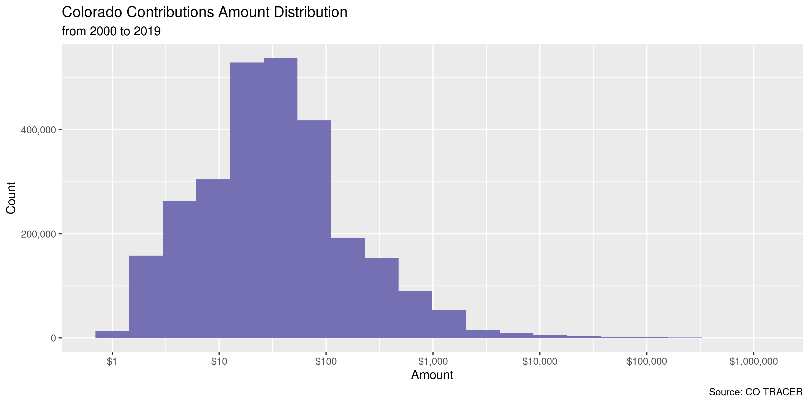
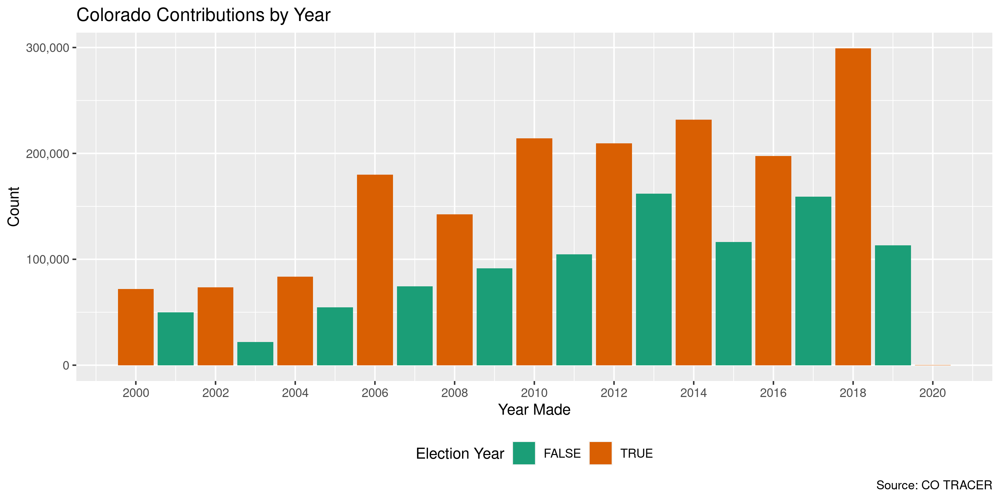
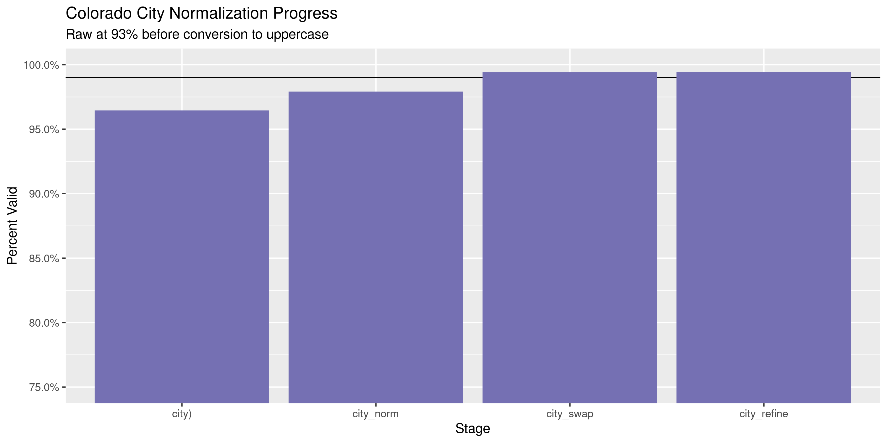
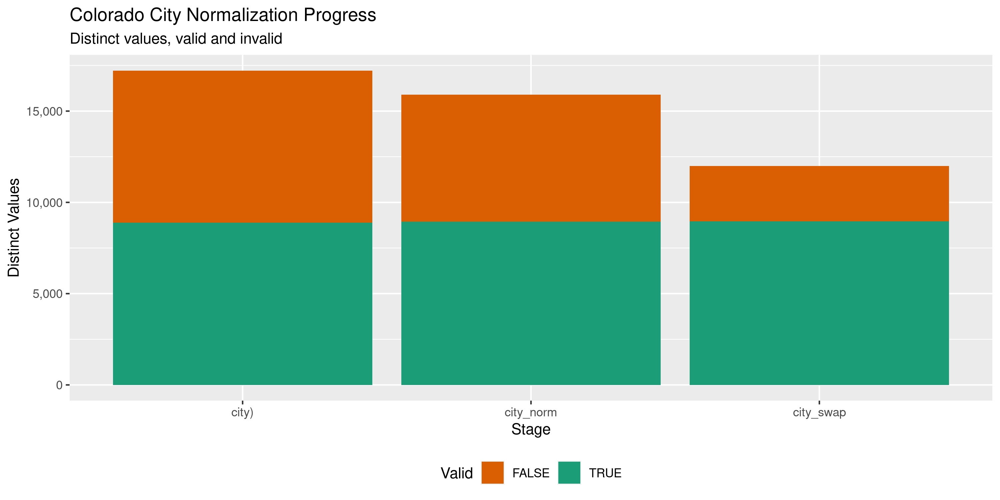

Colorado Contributions
================
Kiernan Nicholls
2020-04-15 20:55:14

  - [Project](#project)
  - [Objectives](#objectives)
  - [Packages](#packages)
  - [Import](#import)
  - [Explore](#explore)
  - [Wrangle](#wrangle)
  - [Conclude](#conclude)
  - [Export](#export)

<!-- Place comments regarding knitting here -->

## Project

The Accountability Project is an effort to cut across data silos and
give journalists, policy professionals, activists, and the public at
large a simple way to search across huge volumes of public data about
people and organizations.

Our goal is to standardizing public data on a few key fields by thinking
of each dataset row as a transaction. For each transaction there should
be (at least) 3 variables:

1.  All **parties** to a transaction.
2.  The **date** of the transaction.
3.  The **amount** of money involved.

## Objectives

This document describes the process used to complete the following
objectives:

1.  How many records are in the database?
2.  Check for entirely duplicated records.
3.  Check ranges of continuous variables.
4.  Is there anything blank or missing?
5.  Check for consistency issues.
6.  Create a five-digit ZIP Code called `zip`.
7.  Create a `year` field from the transaction date.
8.  Make sure there is data on both parties to a transaction.

## Packages

The following packages are needed to collect, manipulate, visualize,
analyze, and communicate these results. The `pacman` package will
facilitate their installation and attachment.

The IRW’s `campfin` package will also have to be installed from GitHub.
This package contains functions custom made to help facilitate the
processing of campaign finance data.

``` r
if (!require("pacman")) install.packages("pacman")
pacman::p_load_gh("irworkshop/campfin")
pacman::p_load(
  tidyverse, # data manipulation
  lubridate, # datetime strings
  magrittr, # pipe operators
  janitor, # dataframe clean
  refinr, # cluster and merge
  scales, # format strings
  knitr, # knit documents
  vroom, # read files fast
  glue, # combine strings
  here, # relative storage
  fs # search storage 
)
```

This document should be run as part of the `R_campfin` project, which
lives as a sub-directory of the more general, language-agnostic
[`irworkshop/accountability_datacleaning`](https://github.com/irworkshop/accountability_datacleaning)
GitHub repository.

The `R_campfin` project uses the [RStudio
projects](https://support.rstudio.com/hc/en-us/articles/200526207-Using-Projects)
feature and should be run as such. The project also uses the dynamic
`here::here()` tool for file paths relative to *your* machine.

``` r
here::here() # where does this document knit?
#> [1] "/home/kiernan/Code/accountability_datacleaning/R_campfin"
```

Colorado campaign expenditures data comes courtesy of Colorado Campaign
Finance Disclosure Website, which is managed by the TRACER reporting
system (**Tra**nsparency in **C**ontribution and **E**xpenditure
**R**eporting). Files can be found on the [Data
Download](http://tracer.sos.colorado.gov/PublicSite/DataDownload.aspx)
page.

### Access

> You can access the Campaign Finance Data Download page to download
> contribution and expenditure data for import into other applications
> such as Microsoft Excel or Access. A weekly batch process is run that
> captures the year-to-date information for the current year. The data
> is available for each calendar year. The file is downloaded in CSV
> format.

> This page provides comma separated value (CSV) downloads of
> contribution/donation, expenditure, and loan data for each reporting
> year in a zipped file format. These files can be downloaded and
> imported into other applications (Microsoft Excel, Microsoft Access,
> etc.). This data is extracted from the Department of State database as
> it existed as of 7/20/2019 3:01 AM

In the [TRACER FAQ
file](http://tracer.sos.colorado.gov/PublicSite/FAQ.aspx), the Secretary
of State explains:

> The information presented in the campaign finance database is, to the
> best of the ability of the Secretary of State, an accurate
> representation of the disclosure reports filed with the applicable
> office.It is suggested that the information found from reports
> data-entered by the Secretary of State or County Clerks (which
> includes reports filed prior to 2010) be cross-checked with the
> original document or scanned image of the original document.
> 
> Beginning in 2010, all candidates, committees, and political parties
> who file disclosure reports with the Secretary of State must do so
> electronically using the TRACER system. Therefore, all data contained
> in the database dated January 2010 onward reflects that data as
> entered by the reporting person or entity.
> 
> Prior to 2010, filers had the option of filing manual disclosure
> reports. Therefore, some of the information in the campaign finance
> database dated prior to 2010was submitted in electronic form by the
> candidate, committee or party, and some of the information was
> data-entered from paper reports filed with the appropriate office.
> Sometimes items which are not consistent with filing requirements,
> such as missing names and addresses or contributions that exceed the
> allowable limits, are displayed when data is viewed online. Incorrect
> entries in the database typically reflect incorrect or incomplete
> entries on manually filed reports submitted to the Secretary of State
> or County Clerk. If you believe that there is a discrepancy in data
> dated prior to January 2010, please contact the appropriate filing
> officer for that data—the Secretary of State for statewide candidates,
> committees, and parties; or the County Clerk for county candidates and
> committees.

TRACER also provides a PDF [spreadsheet
key](http://tracer.sos.colorado.gov/PublicSite/Resources/DownloadDataFileKey.pdf).

## Import

We can download the annual ZIP archives directly from TRACER.

``` r
raw_dir <- dir_create(here("co", "contribs", "data", "raw"))
raw_base <- "http://tracer.sos.colorado.gov/PublicSite/Docs/BulkDataDownloads/"
raw_urls <- str_c(raw_base, glue("{2000:2019}_ContributionData.csv.zip"))
raw_paths <- path(raw_dir, basename(raw_urls))
if (!all_files_new(raw_dir)) {
  download.file(raw_urls, raw_paths)
}
```

Some slight adjustments need to be made properly read the text files.
Every cell is surrounded in double-quotes (`"`), meaning any
double-quotes *within* a cell result parsing errors. We can read the
lines of each file and replace these with single-quotes.

``` r
fix_dir <- dir_create(path(dirname(raw_dir), "fix"))
if (!all_files_new(fix_dir)) {
  for (r in raw_paths) {
    f <- path(fix_dir, path_ext_remove(basename(r)))
    read_lines(r) %>% 
      str_replace_all('(?<!,(?!\\s)|\n|^)"(?!,(?!\\s)|\n|$)', "'") %>% 
      write_lines(f)
    message(f)
    if (str_detect(r, "2011")) {
      
    }
  }
}
fix_paths <- dir_ls(fix_dir)
```

``` r
coc <- vroom(
  file = fix_paths,
  delim = ",",
  id = "source",
  escape_double = TRUE,
  escape_backslash = FALSE,
  .name_repair = make_clean_names,
  col_types = cols( # from key
    .default = col_character(),
    ContributionAmount = col_double(),
    ContributionDate = col_datetime(),
    FiledDate = col_datetime(),
  )
)
```

We can ensure these files were properly read by counting the distinct
values of a discrete variable like the binary `amended` variable. There
should only be two values.

``` r
count(coc, amended, sort = TRUE)
#> # A tibble: 2 x 2
#>   amended       n
#>   <chr>     <int>
#> 1 N       2615058
#> 2 Y         36317
```

These binary variable should be converted to logical.

``` r
coc <- coc %>% 
  mutate_at(vars(amended, amendment), ~equals(., "Y")) %>% 
  mutate_at(vars(source), basename) %>% 
  mutate_at(vars(ends_with("date")), as_date) %>% 
  rename_all(str_remove, "contribution_")
```

## Explore

``` r
nrow(coc)
#> [1] 2651375
head(coc)
#> # A tibble: 6 x 30
#>   source co_id amount date       last_name first_name mi    suffix address1 address2 city  state
#>   <chr>  <chr>  <dbl> <date>     <chr>     <chr>      <chr> <chr>  <chr>    <chr>    <chr> <chr>
#> 1 2000_… 1999… 1.48e4 2000-01-01 CCVAF     <NA>       <NA>  <NA>   1536 WY… <NA>     DENV… CO   
#> 2 2000_… 1999… 1.84e2 2000-01-01 METRO BR… <NA>       <NA>  <NA>   8480 E … <NA>     ENGL… CO   
#> 3 2000_… 2006… 4.37e1 2006-01-01 CHARLES … <NA>       <NA>  <NA>   4530 WI… <NA>     COLO… CO   
#> 4 2000_… 2007… 1.50e3 2008-01-09 CHUCK SH… <NA>       <NA>  <NA>   P.O. BO… <NA>     COLL… CO   
#> 5 2000_… 1999… 1.00e2 2000-01-10 SMITH MA… <NA>       <NA>  <NA>   595 HIG… <NA>     DENV… CO   
#> 6 2000_… 2000… 1.00e2 2000-01-10 HEMMERDI… <NA>       <NA>  <NA>   859 PEQ… <NA>     NEW … CT   
#> # … with 18 more variables: zip <chr>, explanation <chr>, record_id <chr>, filed_date <date>,
#> #   type <chr>, receipt_type <chr>, contributor_type <chr>, electioneering <chr>,
#> #   committee_type <chr>, committee_name <chr>, candidate_name <chr>, employer <chr>,
#> #   occupation <chr>, amended <lgl>, amendment <lgl>, amended_record_id <chr>, jurisdiction <chr>,
#> #   occupation_comments <chr>
tail(coc)
#> # A tibble: 6 x 30
#>   source co_id amount date       last_name first_name mi    suffix address1 address2 city  state
#>   <chr>  <chr>  <dbl> <date>     <chr>     <chr>      <chr> <chr>  <chr>    <chr>    <chr> <chr>
#> 1 2019_… 1999…    8   2018-12-31 YEHLE     STEVE      <NA>  <NA>   29501 M… <NA>     LIND… MN   
#> 2 2019_… 1999…    8   2018-12-31 YOHE      VANESSA    <NA>  <NA>   843 POP… <NA>     DENV… CO   
#> 3 2019_… 1999…    8   2018-12-31 ZAHN      JOEY       <NA>  <NA>   6019 75… <NA>     LUBB… TX   
#> 4 2019_… 1999…    8   2018-12-31 ZERINGUE  CHARLES    <NA>  <NA>   13125 U… <NA>     HAYD… CO   
#> 5 2019_… 1999…    3.2 2018-12-31 ZICH      JONI H     <NA>  <NA>   3101 36… <NA>     ST A… MN   
#> 6 2019_… 1999…    0.8 2018-12-31 ZICH      TYREL J    <NA>  <NA>   1215 EA… <NA>     EAU … WI   
#> # … with 18 more variables: zip <chr>, explanation <chr>, record_id <chr>, filed_date <date>,
#> #   type <chr>, receipt_type <chr>, contributor_type <chr>, electioneering <chr>,
#> #   committee_type <chr>, committee_name <chr>, candidate_name <chr>, employer <chr>,
#> #   occupation <chr>, amended <lgl>, amendment <lgl>, amended_record_id <chr>, jurisdiction <chr>,
#> #   occupation_comments <chr>
glimpse(sample_n(coc, 20))
#> Rows: 20
#> Columns: 30
#> $ source              <chr> "2002_ContributionData.csv", "2008_ContributionData.csv", "2016_Cont…
#> $ co_id               <chr> "19991500072", "20075612064", "20085631158", "19991500072", "2005561…
#> $ amount              <dbl> 25.00, 350.00, 108.50, 1000.00, 525.00, 575.00, 5.00, 10.00, 50.00, …
#> $ date                <date> 2002-01-15, 2008-10-03, 2016-05-06, 2002-10-03, 2009-12-08, 2018-09…
#> $ last_name           <chr> "GOOSMANN,KATHLEEN", "CROSHAL, JAMES", NA, "THE BETTER INSURANCE", "…
#> $ first_name          <chr> NA, NA, NA, NA, "KAY", "ERIC", NA, "CARL", "TODD", "STACEY", "DIANE"…
#> $ mi                  <chr> NA, NA, NA, NA, "L", NA, NA, NA, NA, NA, NA, NA, NA, NA, NA, NA, NA,…
#> $ suffix              <chr> NA, NA, NA, NA, NA, NA, NA, NA, NA, NA, NA, NA, NA, NA, NA, NA, NA, …
#> $ address1            <chr> "9963 S HEYWOOD ST", "1 SEPULVEDA COURT", NA, "1795 MONACO PRKWY", "…
#> $ address2            <chr> NA, NA, NA, NA, NA, NA, NA, NA, NA, NA, NA, NA, NA, NA, NA, NA, NA, …
#> $ city                <chr> "HIGHLANDS RANCH", "PUEBLO", NA, "DENVER", "DENVER", "NEW YORK", NA,…
#> $ state               <chr> "CO", "CO", NA, "CO", "CO", "NY", NA, "CO", "CO", "SD", "CO", "CA", …
#> $ zip                 <chr> "80130", "81005", NA, "80220", "80207", "10011", NA, "80204", "80439…
#> $ explanation         <chr> NA, "GENERAL", NA, NA, NA, NA, NA, "PRI", NA, NA, "PAC CONTRIBUTION"…
#> $ record_id           <chr> "1286854", "2305224", "4290153", "1294148", "2556590", "5033966", "4…
#> $ filed_date          <date> 2002-04-17, 2008-10-14, 2016-05-11, 2002-10-16, 2010-01-15, 2018-10…
#> $ type                <chr> "Monetary (Itemized)", "Monetary (Itemized)", "Monetary (Non-Itemize…
#> $ receipt_type        <chr> "Unknown", "Unknown", "Other", "Unknown", "Check", "Check", "Other",…
#> $ contributor_type    <chr> "Unknown", "Individual", NA, "Unknown", "Individual", "Individual", …
#> $ electioneering      <chr> NA, NA, NA, NA, NA, NA, NA, NA, NA, NA, NA, NA, NA, NA, NA, NA, NA, …
#> $ committee_type      <chr> "Political Party Committee", "Candidate Committee", "Political Commi…
#> $ committee_name      <chr> "COLORADO REPUBLICAN COMMITTEE", "COMMITTEE FOR EVIE HUDAK", "RNDC P…
#> $ candidate_name      <chr> NA, "EVIE HUDAK", NA, NA, "BILL RITTER JR.", "PHILIP JACOB WEISER", …
#> $ employer            <chr> NA, "GRADISAR TRECHTER RIPPERGER", NA, NA, "RETIRED", "GALVAN FOUNDA…
#> $ occupation          <chr> NA, "Attorney/Legal", NA, NA, "Unknown", "Financial/Investment", NA,…
#> $ amended             <lgl> FALSE, FALSE, FALSE, FALSE, FALSE, FALSE, FALSE, FALSE, FALSE, FALSE…
#> $ amendment           <lgl> FALSE, FALSE, FALSE, FALSE, FALSE, FALSE, FALSE, FALSE, FALSE, FALSE…
#> $ amended_record_id   <chr> "0", "0", "0", "0", "0", "0", "0", "0", "0", "0", "0", "0", "0", "0"…
#> $ jurisdiction        <chr> "STATEWIDE", "STATEWIDE", "STATEWIDE", "STATEWIDE", "STATEWIDE", "ST…
#> $ occupation_comments <chr> NA, "ATTORNEY", NA, NA, NA, NA, NA, NA, NA, "PROGRAM MGR BPI, SC-PRO…
```

### Missing

``` r
col_stats(coc, count_na)
#> # A tibble: 30 x 4
#>    col                 class        n           p
#>    <chr>               <chr>    <int>       <dbl>
#>  1 source              <chr>        0 0          
#>  2 co_id               <chr>       47 0.0000177  
#>  3 amount              <dbl>        1 0.000000377
#>  4 date                <date>       3 0.00000113 
#>  5 last_name           <chr>    91829 0.0346     
#>  6 first_name          <chr>  1027802 0.388      
#>  7 mi                  <chr>  2250004 0.849      
#>  8 suffix              <chr>  2641093 0.996      
#>  9 address1            <chr>   102570 0.0387     
#> 10 address2            <chr>  2526509 0.953      
#> 11 city                <chr>   102015 0.0385     
#> 12 state               <chr>    95421 0.0360     
#> 13 zip                 <chr>   121449 0.0458     
#> 14 explanation         <chr>  2153174 0.812      
#> 15 record_id           <chr>        0 0          
#> 16 filed_date          <date>       0 0          
#> 17 type                <chr>       30 0.0000113  
#> 18 receipt_type        <chr>        0 0          
#> 19 contributor_type    <chr>    91498 0.0345     
#> 20 electioneering      <chr>  2647552 0.999      
#> 21 committee_type      <chr>       47 0.0000177  
#> 22 committee_name      <chr>        0 0          
#> 23 candidate_name      <chr>  1536264 0.579      
#> 24 employer            <chr>  1280672 0.483      
#> 25 occupation          <chr>  1285388 0.485      
#> 26 amended             <lgl>        0 0          
#> 27 amendment           <lgl>        0 0          
#> 28 amended_record_id   <chr>        0 0          
#> 29 jurisdiction        <chr>       47 0.0000177  
#> 30 occupation_comments <chr>  2166312 0.817
```

``` r
coc <- coc %>% 
  unite(
    col = cont_name,
    last_name, mi, first_name,
    sep = " ",
    na.rm = TRUE,
    remove = FALSE
  ) %>% 
  flag_na(date, cont_name, amount, committee_name) %>% 
  select(-cont_name)

sum(coc$na_flag)
#> [1] 4
```

### Duplicates

``` r
coc <- flag_dupes(coc, -record_id, .check = TRUE)
percent(mean(coc$dupe_flag), 0.01)
#> [1] "3.95%"
```

``` r
coc %>% 
  filter(dupe_flag) %>% 
  arrange(date) %>% 
  select(date, last_name, amount, committee_name)
#> # A tibble: 104,820 x 4
#>    date       last_name      amount committee_name                                                 
#>    <date>     <chr>           <dbl> <chr>                                                          
#>  1 2000-04-15 BETCHER BOB    1.00e3 CITIZENS FOR BILL OWENS                                        
#>  2 2000-04-15 BETCHER BOB    1.00e3 CITIZENS FOR BILL OWENS                                        
#>  3 2000-04-15 FRANSEN VON    1.00e3 CITIZENS FOR BILL OWENS                                        
#>  4 2000-04-15 FRANSEN VON    1.00e3 CITIZENS FOR BILL OWENS                                        
#>  5 2000-04-17 WINSLOW FLOYD  1.00e3 CITIZENS FOR BILL OWENS                                        
#>  6 2000-04-17 WINSLOW FLOYD  1.00e3 CITIZENS FOR BILL OWENS                                        
#>  7 2000-04-17 OSBORN JOHN    1.00e3 CITIZENS FOR BILL OWENS                                        
#>  8 2000-04-17 OSBORN JOHN    1.00e3 CITIZENS FOR BILL OWENS                                        
#>  9 2000-05-01 GROSJEAN DARR… 8.75e0 REALTOR CANDIDATE POLITICAL ACTION COMMITTEE (RCPAC) - FKA: CO…
#> 10 2000-05-01 GROTSTEIN TOD… 8.75e0 REALTOR CANDIDATE POLITICAL ACTION COMMITTEE (RCPAC) - FKA: CO…
#> # … with 104,810 more rows
```

### Categorical

``` r
col_stats(coc, n_distinct)
#> # A tibble: 32 x 4
#>    col                 class        n           p
#>    <chr>               <chr>    <int>       <dbl>
#>  1 source              <chr>       20 0.00000754 
#>  2 co_id               <chr>     7793 0.00294    
#>  3 amount              <dbl>    31183 0.0118     
#>  4 date                <date>    7436 0.00280    
#>  5 last_name           <chr>   521409 0.197      
#>  6 first_name          <chr>    33112 0.0125     
#>  7 mi                  <chr>       41 0.0000155  
#>  8 suffix              <chr>      619 0.000233   
#>  9 address1            <chr>   751875 0.284      
#> 10 address2            <chr>    12637 0.00477    
#> 11 city                <chr>    17263 0.00651    
#> 12 state               <chr>      167 0.0000630  
#> 13 zip                 <chr>    36177 0.0136     
#> 14 explanation         <chr>    85813 0.0324     
#> 15 record_id           <chr>  2645807 0.998      
#> 16 filed_date          <date>    4603 0.00174    
#> 17 type                <chr>      439 0.000166   
#> 18 receipt_type        <chr>        8 0.00000302 
#> 19 contributor_type    <chr>     3086 0.00116    
#> 20 electioneering      <chr>        2 0.000000754
#> 21 committee_type      <chr>       11 0.00000415 
#> 22 committee_name      <chr>     7555 0.00285    
#> 23 candidate_name      <chr>     3969 0.00150    
#> 24 employer            <chr>   145285 0.0548     
#> 25 occupation          <chr>       33 0.0000124  
#> 26 amended             <lgl>        2 0.000000754
#> 27 amendment           <lgl>        2 0.000000754
#> 28 amended_record_id   <chr>    26200 0.00988    
#> 29 jurisdiction        <chr>       67 0.0000253  
#> 30 occupation_comments <chr>    36375 0.0137     
#> 31 na_flag             <lgl>        2 0.000000754
#> 32 dupe_flag           <lgl>        2 0.000000754
```

### Continuous

#### Amounts

``` r
summary(coc$amount)
#>     Min.  1st Qu.   Median     Mean  3rd Qu.     Max.     NA's 
#> -6212500       10       35      443      100  6212500        1
mean(coc$amount <= 0, na.rm = TRUE)
#> [1] 0.01020188
```

<!-- -->

#### Dates

``` r
coc <- mutate(coc, year = year(date))
coc$year[which(coc$year > 2020 | coc$year < 2000)] <- NA
```

``` r
min(coc$date, na.rm = TRUE)
#> [1] "1900-01-01"
sum(coc$year < 2000, na.rm = TRUE)
#> [1] 0
max(coc$date, na.rm = TRUE)
#> [1] "8220-09-20"
sum(coc$date > today(), na.rm = TRUE)
#> [1] 131
```

<!-- -->

## Wrangle

To improve the searchability of the database, we will perform some
consistent, confident string normalization. For geographic variables
like city names and ZIP codes, the corresponding `campfin::normal_*()`
functions are tailor made to facilitate this process.

### Address

For the street `addresss` variable, the `campfin::normal_address()`
function will force consistence case, remove punctuation, and abbreviate
official USPS suffixes.

``` r
coc <- coc %>% 
  unite(
    col = address_full,
    starts_with("address"),
    sep = " ",
    remove = FALSE,
    na.rm = TRUE
  ) %>% 
  mutate(
    address_norm = normal_address(
      address = address_full,
      abbs = usps_street,
      na_rep = TRUE
    )
  ) %>% 
  select(-address_full)
```

``` r
coc %>% 
  select(contains("address")) %>% 
  distinct() %>% 
  sample_n(10)
#> # A tibble: 10 x 3
#>    address1                  address2 address_norm          
#>    <chr>                     <chr>    <chr>                 
#>  1 820 CHEYENNE BLVD         <NA>     820 CHEYENNE BLVD     
#>  2 4546 HOLLOW BERRY CT      <NA>     4546 HOLW BERRY CT    
#>  3 4523 EAGLE LAKE DRIVE     <NA>     4523 EAGLE LK DR      
#>  4 420 SPRUCE ST             <NA>     420 SPRUCE ST         
#>  5 2255 OLD CARROUTH PATH    <NA>     2255 OLD CARROUTH PATH
#>  6 1030 DUDLEY STREET        <NA>     1030 DUDLEY ST        
#>  7 925 BARTON CIRCLE         <NA>     925 BARTON CIR        
#>  8 6474 S JERICHO CIRCLE     <NA>     6474 S JERICHO CIR    
#>  9 5995 SEFFERS WAY          <NA>     5995 SEFFERS WAY      
#> 10 1872 S. WASHINGTON STREET <NA>     1872 S WASHINGTON ST
```

### ZIP

For ZIP codes, the `campfin::normal_zip()` function will attempt to
create valid *five* digit codes by removing the ZIP+4 suffix and
returning leading zeroes dropped by other programs like Microsoft Excel.

``` r
coc <- coc %>% 
  mutate(
    zip_norm = normal_zip(
      zip = zip,
      na_rep = TRUE
    )
  )
```

``` r
progress_table(
  coc$zip,
  coc$zip_norm,
  compare = valid_zip
)
#> # A tibble: 2 x 6
#>   stage    prop_in n_distinct prop_na n_out n_diff
#>   <chr>      <dbl>      <dbl>   <dbl> <dbl>  <dbl>
#> 1 zip        0.978      36177  0.0458 56484  18648
#> 2 zip_norm   0.998      19932  0.0473  5381   1879
```

### State

Valid two digit state abbreviations can be made using the
`campfin::normal_state()` function.

``` r
coc <- coc %>% 
  mutate(
    state_norm = normal_state(
      state = state,
      abbreviate = TRUE,
      na_rep = TRUE,
      valid = valid_state
    )
  )
```

``` r
progress_table(
  coc$state,
  coc$state_norm,
  compare = valid_state
)
#> # A tibble: 2 x 6
#>   stage      prop_in n_distinct prop_na n_out n_diff
#>   <chr>        <dbl>      <dbl>   <dbl> <dbl>  <dbl>
#> 1 state         1.00        167  0.0360   856    108
#> 2 state_norm    1            59  0.0365     0      1
```

### City

Cities are the most difficult geographic variable to normalize, simply
due to the wide variety of valid cities and formats.

#### Normal

The `campfin::normal_city()` function is a good start, again converting
case, removing punctuation, but *expanding* USPS abbreviations. We can
also remove `invalid_city` values.

``` r
coc <- coc %>% 
  mutate(
    city_norm = normal_city(
      city = city, 
      abbs = usps_city,
      states = c("CO", "DC", "COLORADO"),
      na = invalid_city,
      na_rep = TRUE
    )
  )
```

#### Swap

We can further improve normalization by comparing our normalized value
against the *expected* value for that record’s state abbreviation and
ZIP code. If the normalized value is either an abbreviation for or very
similar to the expected value, we can confidently swap those two.

``` r
coc <- coc %>% 
  rename(city_raw = city) %>% 
  left_join(
    y = zipcodes,
    by = c(
      "state_norm" = "state",
      "zip_norm" = "zip"
    )
  ) %>% 
  rename(city_match = city) %>% 
  mutate(
    match_abb = is_abbrev(city_norm, city_match),
    match_dist = str_dist(city_norm, city_match),
    city_swap = if_else(
      condition = !is.na(match_dist) & (match_abb | match_dist == 1),
      true = city_match,
      false = city_norm
    )
  ) %>% 
  select(
    -city_match,
    -match_dist,
    -match_abb
  ) %>% 
  rename(city = city_raw)
```

#### Refine

The \[OpenRefine\] algorithms can be used to group similar strings and
replace the less common versions with their most common counterpart.
This can greatly reduce inconsistency, but with low confidence; we will
only keep any refined strings that have a valid city/state/zip
combination.

``` r
good_refine <- coc %>% 
  mutate(
    city_refine = city_swap %>% 
      key_collision_merge() %>% 
      n_gram_merge(numgram = 1)
  ) %>% 
  filter(city_refine != city_swap) %>% 
  inner_join(
    y = zipcodes,
    by = c(
      "city_refine" = "city",
      "state_norm" = "state",
      "zip_norm" = "zip"
    )
  )
```

    #> # A tibble: 255 x 5
    #>    state_norm zip_norm city_swap          city_refine           n
    #>    <chr>      <chr>    <chr>              <chr>             <int>
    #>  1 CO         80816    FLORRISANT         FLORISSANT           65
    #>  2 NY         11733    SETAUKET           EAST SETAUKET        19
    #>  3 IL         60010    NO BARRINGTON      BARRINGTON           17
    #>  4 CO         80545    RED FEATHERS LAKE  RED FEATHER LAKES    15
    #>  5 CO         80521    FORT COLLINS CO    FORT COLLINS         11
    #>  6 OH         45232    CINCINATTI         CINCINNATI           10
    #>  7 CO         80526    FORT COLLINS CO    FORT COLLINS          9
    #>  8 CO         80905    COLORADO SPRINGSGS COLORADO SPRINGS      9
    #>  9 OH         45206    CINCINATTI         CINCINNATI            9
    #> 10 CO         80202    DENVERDENVER       DENVER                5
    #> # … with 245 more rows

Then we can join the refined values back to the database.

``` r
coc <- coc %>% 
  left_join(good_refine) %>% 
  mutate(city_refine = coalesce(city_refine, city_swap))
```

#### Progress

``` r
many_city <- c(valid_city, extra_city)
coc %>% 
  filter(city_swap %out% many_city) %>% 
  count(city_swap, sort = TRUE)
#> # A tibble: 3,038 x 2
#>    city_swap            n
#>    <chr>            <int>
#>  1 <NA>            105024
#>  2 PUEBLO WEST       7950
#>  3 CASTLE PINES      1692
#>  4 WORK AT HOME       591
#>  5 UNKNOWNCITY        432
#>  6 BLACK FOREST       405
#>  7 SAN MARCOS PASS    404
#>  8 WHEATRIDGE         336
#>  9 CHERRY HILLS       298
#> 10 WESTMINISTER       298
#> # … with 3,028 more rows
```

| stage      | prop\_in | n\_distinct | prop\_na | n\_out | n\_diff |
| :--------- | -------: | ----------: | -------: | -----: | ------: |
| city)      |    0.960 |       17221 |    0.038 | 102819 |    8337 |
| city\_norm |    0.975 |       15894 |    0.040 |  64092 |    6959 |
| city\_swap |    0.990 |       11990 |    0.040 |  24701 |    3038 |

You can see how the percentage of valid values increased with each
stage.

<!-- -->

More importantly, the number of distinct values decreased each stage. We
were able to confidently change many distinct invalid values to their
valid equivalent.

<!-- -->

## Conclude

``` r
coc <- coc %>% 
  select(
    -city_norm,
    -city_swap,
    city_clean = city_refine
  ) %>% 
  rename_all(~str_replace(., "_norm", "_clean"))
```

``` r
glimpse(sample_n(coc, 20))
#> Rows: 20
#> Columns: 37
#> $ source              <chr> "2018_ContributionData.csv", "2010_ContributionData.csv", "2011_Cont…
#> $ co_id               <chr> "20185033710", "20095610386", "19991500001", "20001500102", "2013502…
#> $ amount              <dbl> 25.00, 50.00, 35.00, 100.00, 10.00, 2.19, 200.00, 25.00, 1.78, 200.0…
#> $ date                <date> 2018-10-26, 2009-12-26, 2011-04-12, 2006-06-29, 2014-12-29, 2011-01…
#> $ last_name           <chr> "WINTER", "GERSTLE", "KERR", "FEW, ARTHUR", "BALTZ", "BRADFORD", "ST…
#> $ first_name          <chr> "RICK", "JOHN", "JEAN", NA, "JUSTIN", "RONALD", NA, NA, NA, NA, "JHN…
#> $ mi                  <chr> NA, NA, NA, NA, NA, "L", NA, NA, NA, NA, NA, NA, NA, NA, NA, NA, NA,…
#> $ suffix              <chr> NA, NA, NA, NA, NA, NA, NA, NA, NA, NA, NA, NA, NA, NA, NA, NA, NA, …
#> $ address1            <chr> "962 GRANDVIEW AVE", "920 JASMINE CIRCLE", "928 S HARRISON STREET", …
#> $ address2            <chr> NA, NA, NA, NA, NA, "UNIT 494", NA, NA, NA, NA, NA, NA, NA, NA, NA, …
#> $ city                <chr> "BOULDER", "BOULDER", "DENVER", "BOULDER", "DENVER", "LIBERTY LAKE",…
#> $ state               <chr> "CO", "CO", "CO", "CO", "CO", "WA", "CO", "CO", NA, "CO", "CO", "CO"…
#> $ zip                 <chr> "80302", "80304", "80209", "80302", "80205", "99019", "80203", "8114…
#> $ explanation         <chr> NA, NA, NA, NA, NA, NA, NA, "WINE/AUCTION", NA, "CHECK", NA, NA, NA,…
#> $ record_id           <chr> "5165079", "2544221", "3006026", "1741646", "4100063", "2970468", "2…
#> $ filed_date          <date> 2018-12-06, 2010-01-14, 2011-07-15, 2006-07-19, 2015-04-01, 2011-04…
#> $ type                <chr> "Monetary (Itemized)", "Monetary (Itemized)", "Monetary (Itemized)",…
#> $ receipt_type        <chr> "Credit/Debit Card", "Check", "Check", "Unknown", "Check", "Electron…
#> $ contributor_type    <chr> "Individual", "Individual", "Individual", "Individual", "Individual"…
#> $ electioneering      <chr> NA, NA, NA, NA, NA, NA, NA, NA, NA, NA, NA, NA, NA, NA, NA, NA, NA, …
#> $ committee_type      <chr> "Issue Committee", "Candidate Committee", "Political Party Committee…
#> $ committee_name      <chr> "GREAT SCHOOLS THRIVING COMMUNITIES", "O'DONNELL FOR COLORADO (BRIAN…
#> $ candidate_name      <chr> NA, "BRIAN O'DONNELL", NA, NA, NA, NA, "CHERI E. JAHN", NA, "PHILIP …
#> $ employer            <chr> NA, "TROUT UNLIMITED", NA, "RICE UNIVERSITY", "SELF", NA, NA, "STATE…
#> $ occupation          <chr> NA, "Science/Technology", NA, "Teacher/Education", "Healthcare/Medic…
#> $ amended             <lgl> FALSE, FALSE, FALSE, FALSE, FALSE, FALSE, FALSE, FALSE, FALSE, FALSE…
#> $ amendment           <lgl> FALSE, FALSE, FALSE, FALSE, FALSE, FALSE, FALSE, FALSE, FALSE, FALSE…
#> $ amended_record_id   <chr> "0", "0", "0", "0", "0", "0", "0", "0", "0", "0", "0", "0", "0", "0"…
#> $ jurisdiction        <chr> "STATEWIDE", "STATEWIDE", "STATEWIDE", "STATEWIDE", "STATEWIDE", "ST…
#> $ occupation_comments <chr> NA, NA, NA, "PROFESSOR", NA, NA, NA, "US CONGRESSMAN", NA, "TEACHER"…
#> $ na_flag             <lgl> FALSE, FALSE, FALSE, FALSE, FALSE, FALSE, FALSE, FALSE, FALSE, FALSE…
#> $ dupe_flag           <lgl> FALSE, FALSE, FALSE, FALSE, FALSE, FALSE, FALSE, FALSE, TRUE, FALSE,…
#> $ year                <dbl> 2018, 2009, 2011, 2006, 2014, 2011, 2009, 2010, 2018, 2004, 2010, 20…
#> $ address_clean       <chr> "962 GRANDVIEW AVE", "920 JASMINE CIR", "928 S HARRISON ST", "700 HL…
#> $ zip_clean           <chr> "80302", "80304", "80209", "80302", "80205", "99019", "80203", "8114…
#> $ state_clean         <chr> "CO", "CO", "CO", "CO", "CO", "WA", "CO", "CO", NA, "CO", "CO", "CO"…
#> $ city_clean          <chr> "BOULDER", "BOULDER", "DENVER", "BOULDER", "DENVER", "LIBERTY LAKE",…
```

1.  There are 2,651,375 records in the database.
2.  There are 104,820 duplicate records in the database.
3.  The range and distribution of `amount` and `date` seem reasonable.
4.  There are 4 records missing ….
5.  Consistency in geographic data has been improved with
    `campfin::normal_*()`.
6.  The 4-digit `year` variable has been created with
    `lubridate::year()`.

## Export

``` r
clean_dir <- dir_create(here("co", "contribs", "data", "clean"))
clean_path <- path(clean_dir, "co_contribs_clean.csv")
write_csv(coc, clean_path, na = "")
file_size(clean_path)
#> 850M
guess_encoding(clean_path)
#> # A tibble: 3 x 2
#>   encoding   confidence
#>   <chr>           <dbl>
#> 1 UTF-8            0.8 
#> 2 ISO-8859-1       0.34
#> 3 ISO-8859-2       0.31
```
