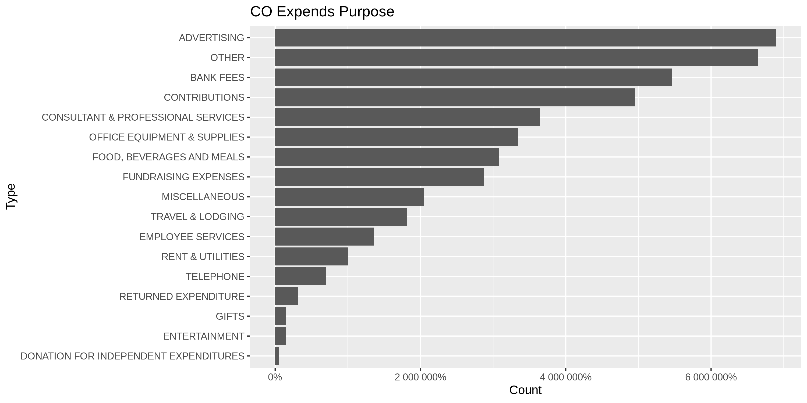
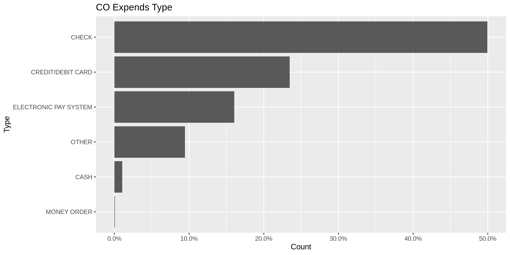
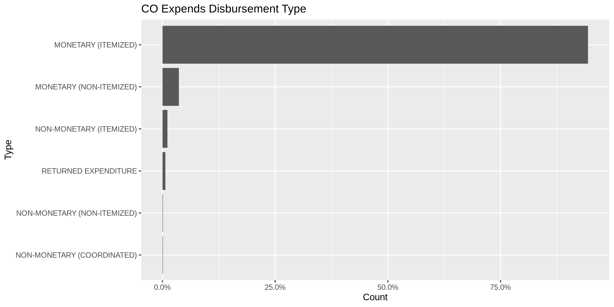
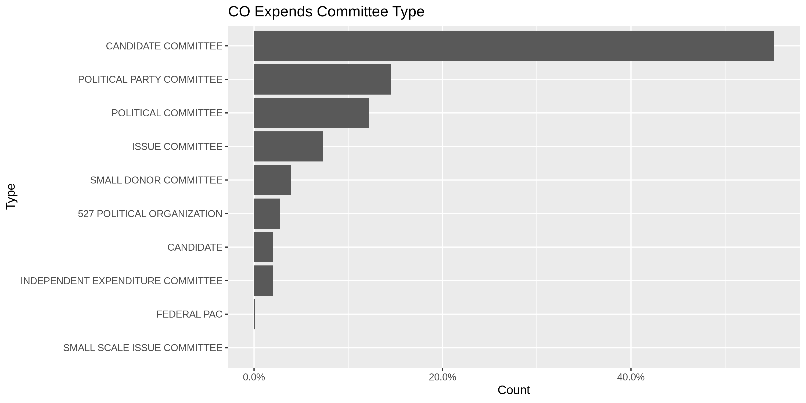
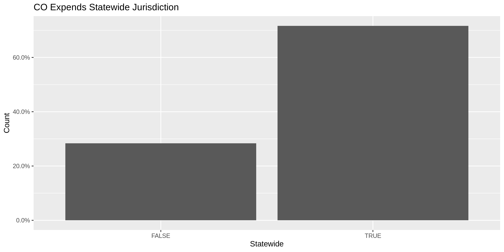
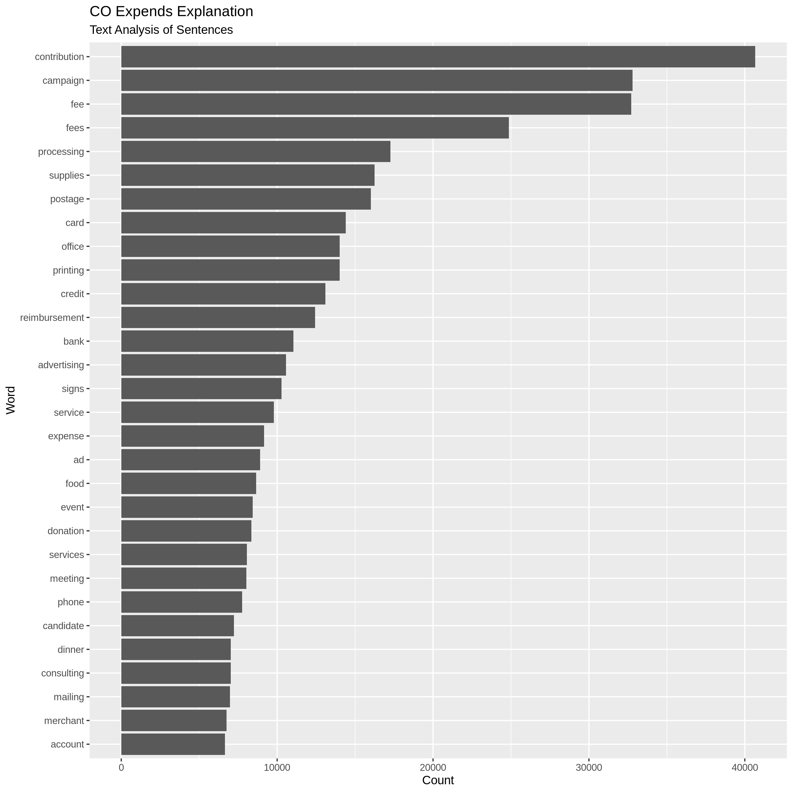
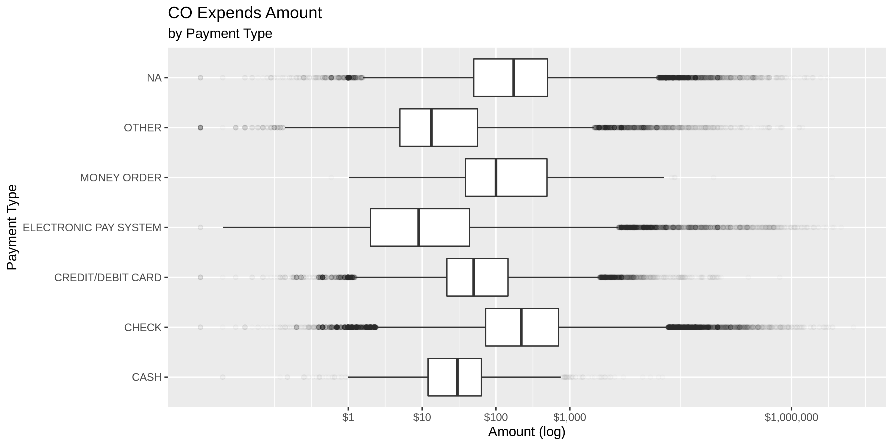
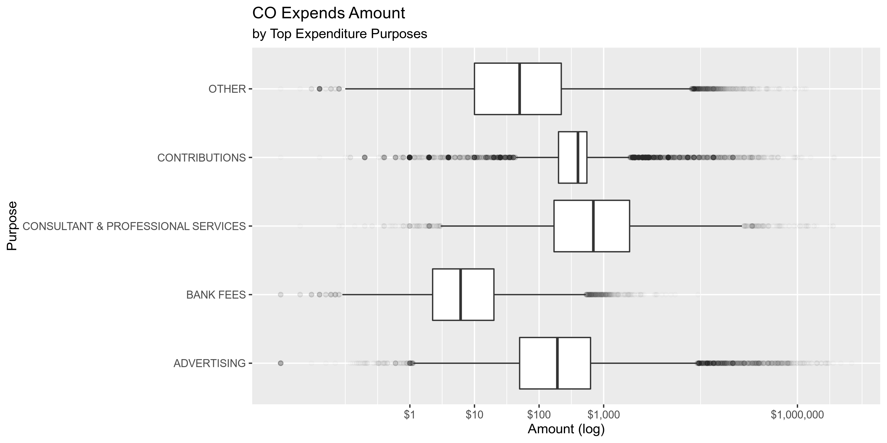
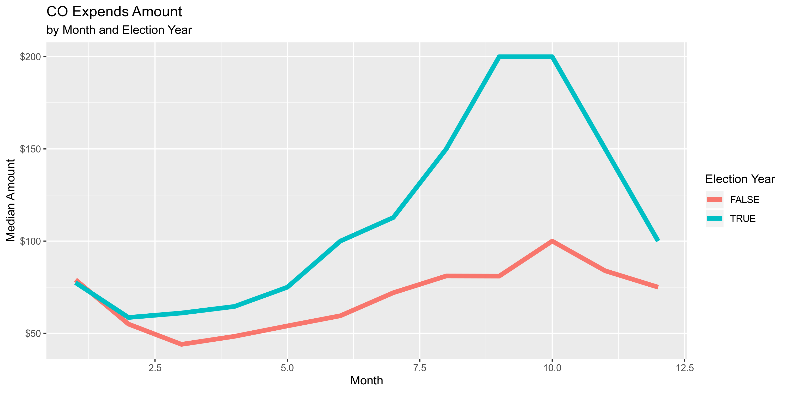
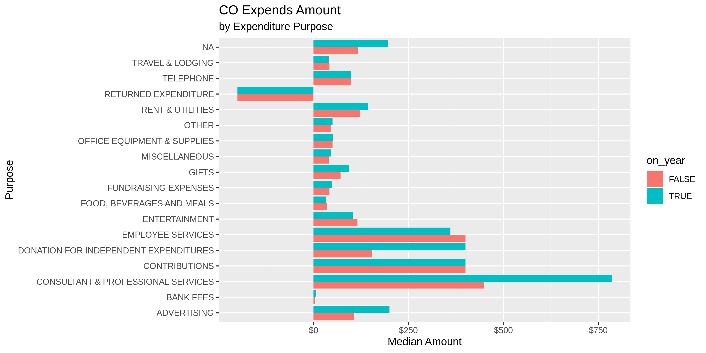

Colorado Expenditures
================
Kiernan Nicholls
2019-07-24 14:07:38

  - [Project](#project)
  - [Objectives](#objectives)
  - [Packages](#packages)
  - [Data](#data)
  - [Import](#import)
  - [Explore](#explore)
  - [Wrangle](#wrangle)
  - [Conclude](#conclude)
  - [Export](#export)

## Project

The Accountability Project is an effort to cut across data silos and
give journalists, policy professionals, activists, and the public at
large a simple way to search across huge volumes of public data about
people and organizations.

Our goal is to standardizing public data on a few key fields by thinking
of each dataset row as a transaction. For each transaction there should
be (at least) 3 variables:

1.  All **parties** to a transaction
2.  The **date** of the transaction
3.  The **amount** of money involved

## Objectives

This document describes the process used to complete the following
objectives:

1.  How many records are in the database?
2.  Check for duplicates
3.  Check ranges
4.  Is there anything blank or missing?
5.  Check for consistency issues
6.  Create a five-digit ZIP Code called `ZIP5`
7.  Create a `YEAR` field from the transaction date
8.  Make sure there is data on both parties to a transaction

## Packages

The following packages are needed to collect, manipulate, visualize,
analyze, and communicate these results. The `pacman` package will
facilitate their installation and attachment.

``` r
if (!require("pacman")) install.packages("pacman")
pacman::p_load(
  stringdist, # levenshtein value
  tidyverse, # data manipulation
  snakecase, # change string case
  lubridate, # datetime strings
  tidytext, # text analysis
  magrittr, # pipe opperators
  pdftools, # extract pdf text
  janitor, # dataframe clean
  batman, # parse NA and LGL
  scales, # text formatting
  refinr, # cluster and merge
  vroom, # quick file read
  knitr, # knit documents
  glue, # combine strings
  here, # relative storage
  fs # search storage 
)
```

The IRW’s `campfin` package will also have to be installed from GitHub.
This package contains functions custom made to help facilitate the
processing of campaign finance data.

``` r
pacman::p_load_current_gh("kiernann/campfin")
```

This document should be run as part of the `R_campfin` project, which
lives as a sub-directory of the more general, language-agnostic
[`irworkshop/accountability_datacleaning`](https://github.com/irworkshop/accountability_datacleaning "TAP repo")
GitHub repository.

The `R_campfin` project uses the [RStudio
projects](https://support.rstudio.com/hc/en-us/articles/200526207-Using-Projects "Rproj")
feature and should be run as such. The project also uses the dynamic
`here::here()` tool for file paths relative to *your* machine.

``` r
# where dfs this document knit?
here::here()
#> [1] "/home/ubuntu/R/accountability_datacleaning/R_campfin"
```

## Data

Colorado campaign expenditures data comes courtesy of Colorado Campaign
Finance Disclosure Website, which is managed by the TRACER reporting
system (**Tra**nsparency in **C**ontribution and **E**xpenditure
**R**eporting). Files can be found on the [Data
Download](http://tracer.sos.colorado.gov/PublicSite/DataDownload.aspx "source")
page.

### Access

> You can access the Campaign Finance Data Download page to download
> contribution and expenditure data for import into other applications
> such as Microsoft Excel or Access. A weekly batch process is run that
> captures the year-to-date information for the current year. The data
> is available for each calendar year. The file is downloaded in CSV
> format.

> This page provides comma separated value (CSV) downloads of
> contribution/donation, expenditure, and loan data for each reporting
> year in a zipped file format. These files can be downloaded and
> imported into other applications (Microsoft Excel, Microsoft Access,
> etc.). This data is extracted from the Department of State database as
> it existed as of 7/20/2019 3:01 AM

### Quality

In the [TRACER FAQ
file](http://tracer.sos.colorado.gov/PublicSite/FAQ.aspx), the Secretary
of State explains:

> The information presented in the campaign finance database is, to the
> best of the ability of the Secretary of State, an accurate
> representation of the disclosure reports filed with the applicable
> office.It is suggested that the information found from reports
> data-entered by the Secretary of State or County Clerks (which
> includes reports filed prior to 2010) be cross-checked with the
> original document or scanned image of the original document.
> 
> Beginning in 2010, all candidates, committees, and political parties
> who file disclosure reports with the Secretary of State must do so
> electronically using the TRACER system. Therefore, all data contained
> in the database dated January 2010 onward reflects that data as
> entered by the reporting person or entity.
> 
> Prior to 2010, filers had the option of filing manual disclosure
> reports. Therefore, some of the information in the campaign finance
> database dated prior to 2010was submitted in electronic form by the
> candidate, committee or party, and some of the information was
> data-entered from paper reports filed with the appropriate office.
> Sometimes items which are not consistent with filing requirements,
> such as missing names and addresses or contributions that exceed the
> allowable limits, are displayed when data is viewed online. Incorrect
> entries in the database typically reflect incorrect or incomplete
> entries on manually filed reports submitted to the Secretary of State
> or County Clerk. If you believe that there is a discrepancy in data
> dated prior to January 2010, please contact the appropriate filing
> officer for that data—the Secretary of State for statewide candidates,
> committees, and parties; or the County Clerk for county candidates and
> committees.

### Variables

TRACER also provides a [spreadsheet
key](http://tracer.sos.colorado.gov/PublicSite/Resources/DownloadDataFileKey.pdf).

## Import

To wrangle the expenditures files in R, we will download the data
locally and read everything into a single tabular data frame.

### Download

To download the **immutable** raw data files, we first have to create
the URLs. Files are split annually, with only the 4-digit year differing
in each the URL.

``` r
co_exp_urls <- glue(
  "http://tracer.sos.colorado.gov/PublicSite/Docs/BulkDataDownloads/{2000:2019}_ExpenditureData.csv.zip"
)
```

  - <http://tracer.sos.colorado.gov/PublicSite/Docs/BulkDataDownloads/2000_ExpenditureData.csv.zip>
  - <http://tracer.sos.colorado.gov/PublicSite/Docs/BulkDataDownloads/2001_ExpenditureData.csv.zip>
  - <http://tracer.sos.colorado.gov/PublicSite/Docs/BulkDataDownloads/2002_ExpenditureData.csv.zip>
  - <http://tracer.sos.colorado.gov/PublicSite/Docs/BulkDataDownloads/2003_ExpenditureData.csv.zip>
  - <http://tracer.sos.colorado.gov/PublicSite/Docs/BulkDataDownloads/2004_ExpenditureData.csv.zip>
  - <http://tracer.sos.colorado.gov/PublicSite/Docs/BulkDataDownloads/2005_ExpenditureData.csv.zip>
  - <http://tracer.sos.colorado.gov/PublicSite/Docs/BulkDataDownloads/2006_ExpenditureData.csv.zip>
  - <http://tracer.sos.colorado.gov/PublicSite/Docs/BulkDataDownloads/2007_ExpenditureData.csv.zip>
  - <http://tracer.sos.colorado.gov/PublicSite/Docs/BulkDataDownloads/2008_ExpenditureData.csv.zip>
  - <http://tracer.sos.colorado.gov/PublicSite/Docs/BulkDataDownloads/2009_ExpenditureData.csv.zip>
  - <http://tracer.sos.colorado.gov/PublicSite/Docs/BulkDataDownloads/2010_ExpenditureData.csv.zip>
  - <http://tracer.sos.colorado.gov/PublicSite/Docs/BulkDataDownloads/2011_ExpenditureData.csv.zip>
  - <http://tracer.sos.colorado.gov/PublicSite/Docs/BulkDataDownloads/2012_ExpenditureData.csv.zip>
  - <http://tracer.sos.colorado.gov/PublicSite/Docs/BulkDataDownloads/2013_ExpenditureData.csv.zip>
  - <http://tracer.sos.colorado.gov/PublicSite/Docs/BulkDataDownloads/2014_ExpenditureData.csv.zip>
  - <http://tracer.sos.colorado.gov/PublicSite/Docs/BulkDataDownloads/2015_ExpenditureData.csv.zip>
  - <http://tracer.sos.colorado.gov/PublicSite/Docs/BulkDataDownloads/2016_ExpenditureData.csv.zip>
  - <http://tracer.sos.colorado.gov/PublicSite/Docs/BulkDataDownloads/2017_ExpenditureData.csv.zip>
  - <http://tracer.sos.colorado.gov/PublicSite/Docs/BulkDataDownloads/2018_ExpenditureData.csv.zip>
  - <http://tracer.sos.colorado.gov/PublicSite/Docs/BulkDataDownloads/2019_ExpenditureData.csv.zip>

If the files have not yet been downloaded to the Colorado `/data/raw`
directory, we can do so now.

``` r
raw_dir <- here("co", "expends", "data", "raw")
dir_create(raw_dir)
if (!all_files_new(raw_dir)) {
  for (url in co_exp_urls) {
    download.file(
      url = url,
      destfile = glue("{raw_dir}/{basename(url)}")
    )
  }
}
```

### Read

Reading these files into a single data frame is not easy. First, we will
unzip each file.

``` r
zip_files <- dir_ls(raw_dir, glob = "*.zip")
if (!all_files_new(path = raw_dir, glob = "*.csv")) {
  for (i in seq_along(zip_files)) {
    unzip(
      zipfile = zip_files[i],
      exdir = raw_dir
    )
  }
}
```

Then we have to read the lines of each file (without separating the
columns). We need to extract a header from one file, remove the headers
from the rest, and filter out any row with an unexpected number of
delimiters.

``` r
# read as unlisted lines
co_lines <- dir_ls(raw_dir, glob = "*ExpenditureData.csv") %>% map(read_lines) %>% unlist()
# extract header line
col_names <- co_lines[1]
# remove other headers
co_lines <- co_lines[-str_which(co_lines, col_names)]
# count expected delims
n_delim <- str_count(co_lines[1], "\",")
# convert header line
col_names <- to_snake_case(unlist(str_split(col_names, ",")))
# remove if unexpected num of delims
co_lines <- co_lines[-which(str_count(co_lines, "\",") != n_delim)]
```

Then, we replace all comma delimiters with a `\v` (vertical tab) to use
as the delimiter.

``` r
co <- co_lines %>% 
  str_replace_all("\",", "\"\v") %>% 
  str_remove_all("\"") %>% 
  str_c(collapse = "\n") %>% 
  read_delim(
    delim = "\v",
    col_names = col_names,
    col_types = cols(
      .default = col_character(),
      expenditure_amount = col_double(),
      expenditure_date = col_date("%Y-%m-%d %H:%M:%S"),
      filed_date = col_date("%Y-%m-%d %H:%M:%S")
    )
  )

rm(col_names)
```

Then we should parse some quasi-logical values.

``` r
co <- co %>% 
  mutate_if(is_character, str_to_upper) %>% 
  mutate_if(is_character, na_if, "UNKNOWN") %>%
  remove_empty("cols") %>%
  remove_empty("rows") %>% 
  mutate(
    amended = to_logical(amended),
    amendment = to_logical(amendment),
  )
```

And finally save the formatted single data frame to disc.

``` r
proc_dir <- here("co", "expends", "data", "processed")
dir_create(proc_dir)

if (!all_files_new(proc_dir)) {
  write_csv(
    x = co,
    path = glue("{proc_dir}/co_expends.csv"),
    na = ""
  )
}
```

## Explore

``` r
head(co)
```

    #> # A tibble: 6 x 26
    #>   co_id expenditure_amo… expenditure_date last_name first_name mi    suffix address_1 address_2
    #>   <chr>            <dbl> <date>           <chr>     <chr>      <chr> <chr>  <chr>     <chr>    
    #> 1 1999…           100    2000-01-01       LACY ELS… <NA>       <NA>  <NA>   11637 E … <NA>     
    #> 2 2001…           100    1998-01-05       OWENS, B… <NA>       <NA>  <NA>   PO BOX 4… <NA>     
    #> 3 2000…            24    2000-01-11       PIZZA HUT <NA>       <NA>  <NA>   1355 SAN… <NA>     
    #> 4 1999…            20    2000-01-12       AURORA R… <NA>       <NA>  <NA>   UNKNOWNS… <NA>     
    #> 5 2000…             3.96 2000-01-13       OFFICEMAX <NA>       <NA>  <NA>   343 S BR… <NA>     
    #> 6 2000…            22.0  2000-01-13       HARLAND … <NA>       <NA>  <NA>   PO BOX 8… <NA>     
    #> # … with 17 more variables: city <chr>, state <chr>, zip <chr>, explanation <chr>,
    #> #   record_id <chr>, filed_date <date>, expenditure_type <chr>, payment_type <chr>,
    #> #   disbursement_type <chr>, electioneering <chr>, committee_type <chr>, committee_name <chr>,
    #> #   candidate_name <chr>, amended <lgl>, amendment <lgl>, amended_record_id <chr>,
    #> #   jurisdiction <chr>

``` r
tail(co)
```

    #> # A tibble: 6 x 26
    #>   co_id expenditure_amo… expenditure_date last_name first_name mi    suffix address_1 address_2
    #>   <chr>            <dbl> <date>           <chr>     <chr>      <chr> <chr>  <chr>     <chr>    
    #> 1 2013…             50   2018-12-31       THE ROCK… <NA>       <NA>  <NA>   675 PONC… <NA>     
    #> 2 2018…             14.5 2018-12-31       <NA>      <NA>       <NA>  <NA>   <NA>      <NA>     
    #> 3 2017…             75   2018-12-31       CHRISTEN… REBECCA    <NA>  <NA>   1850 BAS… <NA>     
    #> 4 2017…              4   2018-12-31       FIRST BA… <NA>       <NA>  <NA>   PO BOX 1… <NA>     
    #> 5 2016…              6   2018-12-31       FIRST BA… <NA>       <NA>  <NA>   3190 YOU… <NA>     
    #> 6 2017…             12   2018-12-31       FIRSTBAN… <NA>       <NA>  <NA>   PO BOX 7… <NA>     
    #> # … with 17 more variables: city <chr>, state <chr>, zip <chr>, explanation <chr>,
    #> #   record_id <chr>, filed_date <date>, expenditure_type <chr>, payment_type <chr>,
    #> #   disbursement_type <chr>, electioneering <chr>, committee_type <chr>, committee_name <chr>,
    #> #   candidate_name <chr>, amended <lgl>, amendment <lgl>, amended_record_id <chr>,
    #> #   jurisdiction <chr>

``` r
glimpse(sample_frac(co))
```

    #> Observations: 647,055
    #> Variables: 26
    #> $ co_id              <chr> "20075643212", "20055624124", "20175031960", "20065645008", "19991200…
    #> $ expenditure_amount <dbl> 250.00, 40.58, 90.90, 482.00, 11666.00, 590.00, 181.60, 134.59, 200.0…
    #> $ expenditure_date   <date> 2008-10-14, 2018-07-23, 2018-10-22, 2007-06-04, 2000-07-14, 2010-02-…
    #> $ last_name          <chr> "MARIJO RYMER", "STATE FARM", "MAIL CHIMP", "JOVIAN HOLDINGS LLC", "M…
    #> $ first_name         <chr> NA, NA, NA, NA, NA, NA, NA, NA, NA, NA, NA, NA, NA, NA, NA, NA, NA, N…
    #> $ mi                 <chr> NA, NA, NA, NA, NA, NA, NA, NA, NA, NA, NA, NA, NA, NA, NA, NA, NA, N…
    #> $ suffix             <chr> NA, NA, NA, NA, NA, NA, NA, NA, NA, NA, NA, NA, NA, NA, NA, NA, NA, N…
    #> $ address_1          <chr> "1580 LOGAN ST., STE 730", "11150 N. HURON ST  SUITE 209", "512 MEANS…
    #> $ address_2          <chr> NA, NA, NA, NA, NA, NA, NA, NA, NA, NA, NA, "STE C, #406", NA, "STE 5…
    #> $ city               <chr> "DENVER", "NORTHGLENN", "ATLANTA", "DENVER", "DENVER", "DENVER", "CHI…
    #> $ state              <chr> "CO", "CO", "GA", "CO", "CO", "CO", "IL", "CO", "CO", "CO", "CO", "CO…
    #> $ zip                <chr> "80203", "80234", "30318", "80203-1264", "80207", "80201", "60666-010…
    #> $ explanation        <chr> "FOOD FOR FUNDRAISER", "INSURANCE", NA, "RENT", "JUNE & JULY CONSULTI…
    #> $ record_id          <chr> "578254", "1149323", "1186932", "502582", "223782", "649205", "607706…
    #> $ filed_date         <date> 2008-10-27, 2018-10-15, 2018-10-28, 2007-10-31, 2000-08-03, 2010-05-…
    #> $ expenditure_type   <chr> NA, "RENT & UTILITIES", "OFFICE EQUIPMENT & SUPPLIES", NA, NA, "RENT …
    #> $ payment_type       <chr> NA, "CREDIT/DEBIT CARD", "CREDIT/DEBIT CARD", NA, NA, "CREDIT/DEBIT C…
    #> $ disbursement_type  <chr> "MONETARY (ITEMIZED)", "MONETARY (ITEMIZED)", "MONETARY (ITEMIZED)", …
    #> $ electioneering     <chr> NA, NA, NA, NA, NA, NA, NA, NA, NA, NA, NA, NA, NA, NA, NA, NA, NA, "…
    #> $ committee_type     <chr> "ISSUE COMMITTEE", "POLITICAL PARTY COMMITTEE", "CANDIDATE COMMITTEE"…
    #> $ committee_name     <chr> "END COLORADO'S DEVELOPMENTAL DISABILITY WAIT LIST", "ADAMS COUNTY DE…
    #> $ candidate_name     <chr> NA, NA, "JOSEPH ANTHONY SALAZAR", NA, NA, "MICHAEL JOHNSTON", "BILL R…
    #> $ amended            <lgl> FALSE, FALSE, FALSE, FALSE, FALSE, FALSE, FALSE, FALSE, TRUE, FALSE, …
    #> $ amendment          <lgl> FALSE, FALSE, FALSE, FALSE, FALSE, FALSE, FALSE, FALSE, FALSE, FALSE,…
    #> $ amended_record_id  <chr> "0", "0", "0", "0", "0", "0", "0", "0", "0", "0", "0", "0", "0", "0",…
    #> $ jurisdiction       <chr> "STATEWIDE", "ADAMS", "STATEWIDE", "BOULDER", "STATEWIDE", "STATEWIDE…

### Distinct

The variables range in their degree of distinctness.

``` r
glimpse_fun(co, n_distinct)
```

    #> # A tibble: 26 x 4
    #>    var                type       n          p
    #>    <chr>              <chr>  <int>      <dbl>
    #>  1 co_id              chr     9478 0.0146    
    #>  2 expenditure_amount dbl    93773 0.145     
    #>  3 expenditure_date   date    7116 0.0110    
    #>  4 last_name          chr    97924 0.151     
    #>  5 first_name         chr     3444 0.00532   
    #>  6 mi                 chr       31 0.0000479 
    #>  7 suffix             chr      119 0.000184  
    #>  8 address_1          chr   126358 0.195     
    #>  9 address_2          chr     3266 0.00505   
    #> 10 city               chr     5423 0.00838   
    #> 11 state              chr      123 0.000190  
    #> 12 zip                chr     8178 0.0126    
    #> 13 explanation        chr   135118 0.209     
    #> 14 record_id          chr   647054 1.000     
    #> 15 filed_date         date    4728 0.00731   
    #> 16 expenditure_type   chr       18 0.0000278 
    #> 17 payment_type       chr        7 0.0000108 
    #> 18 disbursement_type  chr        7 0.0000108 
    #> 19 electioneering     chr        2 0.00000309
    #> 20 committee_type     chr       10 0.0000155 
    #> 21 committee_name     chr     9240 0.0143    
    #> 22 candidate_name     chr     3821 0.00591   
    #> 23 amended            lgl        2 0.00000309
    #> 24 amendment          lgl        2 0.00000309
    #> 25 amended_record_id  chr    11315 0.0175    
    #> 26 jurisdiction       chr       66 0.000102

We can use `ggplot::geom_col()` to explore the distribution of the least
distinct categorical variables.

<!-- -->

<!-- -->

<!-- -->

<!-- -->

<!-- -->

<!-- -->

### Missing

The variables also differ in their degree of missing values.

``` r
glimpse_fun(co, count_na)
```

    #> # A tibble: 26 x 4
    #>    var                type       n       p
    #>    <chr>              <chr>  <int>   <dbl>
    #>  1 co_id              chr        0 0      
    #>  2 expenditure_amount dbl        0 0      
    #>  3 expenditure_date   date       0 0      
    #>  4 last_name          chr    19089 0.0295 
    #>  5 first_name         chr   590923 0.913  
    #>  6 mi                 chr   637489 0.985  
    #>  7 suffix             chr   646171 0.999  
    #>  8 address_1          chr    27181 0.0420 
    #>  9 address_2          chr   614885 0.950  
    #> 10 city               chr    23858 0.0369 
    #> 11 state              chr    19738 0.0305 
    #> 12 zip                chr    26694 0.0413 
    #> 13 explanation        chr   173923 0.269  
    #> 14 record_id          chr        0 0      
    #> 15 filed_date         date       0 0      
    #> 16 expenditure_type   chr   202257 0.313  
    #> 17 payment_type       chr   202322 0.313  
    #> 18 disbursement_type  chr     4998 0.00772
    #> 19 electioneering     chr   618535 0.956  
    #> 20 committee_type     chr        0 0      
    #> 21 committee_name     chr        0 0      
    #> 22 candidate_name     chr   297057 0.459  
    #> 23 amended            lgl        0 0      
    #> 24 amendment          lgl        0 0      
    #> 25 amended_record_id  chr        0 0      
    #> 26 jurisdiction       chr        0 0

It’s important to note that there are zero missing values in important
rows like `co_id`, `expenditure_amount`, or `expenditure_date`.

There are 2.95% of records missing a `last_name` value used to identify
every individual or entity. If the record has no name whatsoever, we
will flag it with a new `na_flag` variable.

``` r
co <- co %>% 
  mutate(
    na_flag = is.na(last_name) & is.na(first_name) & is.na(mi)
  )
```

### Ranges

For continuous variables, we should check the ranges.

#### Amount

``` r
summary(co$expenditure_amount)
#>     Min.  1st Qu.   Median     Mean  3rd Qu.     Max. 
#> -3566408       25      100     1581      400  6916000
sum(co$expenditure_amount < 0)
#> [1] 11893
```

From this summary, we can see the median of $100 and mean of $1,581.26
are reasonable, but the minimum and maximum should be explored.

``` r
glimpse(filter(co, expenditure_amount == min(expenditure_amount)))
```

    #> Observations: 1
    #> Variables: 27
    #> $ co_id              <chr> "20145026709"
    #> $ expenditure_amount <dbl> -3566408
    #> $ expenditure_date   <date> 2014-08-13
    #> $ last_name          <chr> "PACWEST"
    #> $ first_name         <chr> NA
    #> $ mi                 <chr> NA
    #> $ suffix             <chr> NA
    #> $ address_1          <chr> "8600 SW ST HELENS DR., SUITE 100"
    #> $ address_2          <chr> NA
    #> $ city               <chr> "WILSONVILLE"
    #> $ state              <chr> "OR"
    #> $ zip                <chr> "97070"
    #> $ explanation        <chr> "CAMPAIGN STRATEGY & MANAGEMENT, PROFESSIONAL FEES FOR PRECISION, VOT…
    #> $ record_id          <chr> "932714"
    #> $ filed_date         <date> 2014-10-14
    #> $ expenditure_type   <chr> "CONSULTANT & PROFESSIONAL SERVICES"
    #> $ payment_type       <chr> "MONEY ORDER"
    #> $ disbursement_type  <chr> "MONETARY (ITEMIZED)"
    #> $ electioneering     <chr> NA
    #> $ committee_type     <chr> "ISSUE COMMITTEE"
    #> $ committee_name     <chr> "PROTECTING COLORADO�S ENVIRONMENT, ECONOMY, AND ENERGY INDEPENDENCE"
    #> $ candidate_name     <chr> NA
    #> $ amended            <lgl> TRUE
    #> $ amendment          <lgl> TRUE
    #> $ amended_record_id  <chr> "912031"
    #> $ jurisdiction       <chr> "STATEWIDE"
    #> $ na_flag            <lgl> FALSE

> CAMPAIGN STRATEGY & MANAGEMENT, PROFESSIONAL FEES FOR PRECISION, VOTER
> FILE MAINTENANCE, WEBSITE, RESEARCH & TRACKING, MARKETING, DIGITAL AND
> TV/RADIO

``` r
glimpse(filter(co, expenditure_amount == max(expenditure_amount)))
```

    #> Observations: 1
    #> Variables: 27
    #> $ co_id              <chr> "20145027021"
    #> $ expenditure_amount <dbl> 6916000
    #> $ expenditure_date   <date> 2014-05-30
    #> $ last_name          <chr> "COLORADO MEDIA & MAIL"
    #> $ first_name         <chr> NA
    #> $ mi                 <chr> NA
    #> $ suffix             <chr> NA
    #> $ address_1          <chr> "P.O. BOX 18459"
    #> $ address_2          <chr> NA
    #> $ city               <chr> "DENVER"
    #> $ state              <chr> "CO"
    #> $ zip                <chr> "80218"
    #> $ explanation        <chr> NA
    #> $ record_id          <chr> "898464"
    #> $ filed_date         <date> 2014-06-16
    #> $ expenditure_type   <chr> "ADVERTISING"
    #> $ payment_type       <chr> "CHECK"
    #> $ disbursement_type  <chr> "MONETARY (ITEMIZED)"
    #> $ electioneering     <chr> NA
    #> $ committee_type     <chr> "ISSUE COMMITTEE"
    #> $ committee_name     <chr> "DON'T TURN RACETRACKS INTO CASINOS"
    #> $ candidate_name     <chr> NA
    #> $ amended            <lgl> FALSE
    #> $ amendment          <lgl> FALSE
    #> $ amended_record_id  <chr> "0"
    #> $ jurisdiction       <chr> "STATEWIDE"
    #> $ na_flag            <lgl> FALSE

We can use `ggplot2:geom_histogram()` and `ggplot2:geom_boxplot()` to
explore the distribution of the amount.

``` r
co %>% 
  ggplot(aes(x = expenditure_amount)) +
  geom_histogram() +
  scale_x_continuous(
    trans = "log10",
    labels = dollar
  )
```

<!-- -->

``` r
co %>% 
  ggplot(aes(y = expenditure_amount)) +
  geom_boxplot(aes(x = payment_type), outlier.alpha = 0.01) +
  scale_y_continuous(
    trans = "log10",
    labels = dollar,
    breaks = c(0, 1, 10, 100, 1000, 1000000)
  ) +
  coord_flip() +
  labs(
    title = "CO Expends Amount",
    subtitle = "by Payment Type",
    x = "Payment Type",
    y = "Amount (log)"
  )
```

<!-- -->

<!-- -->

### Dates

From the minimum and maximum expenditure dates, we can see that
something is wrong.

``` r
min(co$expenditure_date)
#> [1] "1900-01-31"
max(co$expenditure_date)
#> [1] "5200-10-10"

sum(co$expenditure_date > today())
#> [1] 38
sum(co$expenditure_date < "2002-01-01")
#> [1] 23516
```

First, we will create a new `expenditure_year` variable from the
`expenditure_date` using `lubridate::year()` (after parsing with
`readr::col_date()`).

``` r
co <- co %>% mutate(expenditure_year = year(expenditure_date))
```

Then we can see that there are a handful of expenditures supposedly made
before 2002 and after 2019.

``` r
co %>% 
  count(expenditure_year) %>% 
  print(n = n_distinct(co$expenditure_year))
```

    #> # A tibble: 44 x 2
    #>    expenditure_year     n
    #>               <dbl> <int>
    #>  1             1900     1
    #>  2             1930     1
    #>  3             1980     1
    #>  4             1993     4
    #>  5             1994     1
    #>  6             1995     1
    #>  7             1996    48
    #>  8             1997     1
    #>  9             1998     3
    #> 10             1999    30
    #> 11             2000 17204
    #> 12             2001  6221
    #> 13             2002 23131
    #> 14             2003  6993
    #> 15             2004 22976
    #> 16             2005 11054
    #> 17             2006 44457
    #> 18             2007 14074
    #> 19             2008 43571
    #> 20             2009 18423
    #> 21             2010 58069
    #> 22             2011 20163
    #> 23             2012 55596
    #> 24             2013 30604
    #> 25             2014 59022
    #> 26             2015 26095
    #> 27             2016 57486
    #> 28             2017 34124
    #> 29             2018 86207
    #> 30             2019 11456
    #> 31             2020    20
    #> 32             2022     1
    #> 33             2026     3
    #> 34             2028     1
    #> 35             2055     1
    #> 36             2066     1
    #> 37             2110     1
    #> 38             2202     1
    #> 39             2203     1
    #> 40             2205     1
    #> 41             2206     4
    #> 42             2900     1
    #> 43             3004     1
    #> 44             5200     1

We can flag these broken dates with a new `date_flag` variable.

``` r
co <- co %>% mutate(date_flag = !between(expenditure_date, as_date("2002-01-01"), today()))
sum(co$date_flag)
#> [1] 23554
```

We can also explore the intersection of `expenditure_date` and
`expenditure_anount`.

<!-- -->

<!-- -->

## Wrangle

### Address

``` r
co <- co %>% 
  unite(
    address_1, address_2,
    col = address_clean,
    sep = " ",
    remove = FALSE,
    na.rm = TRUE
  ) %>% 
  mutate(
    address_clean = normal_address(
      address = address_clean,
      add_abbs = usps,
      na_rep = TRUE
    )
  ) %>% 
  select(
    everything(),
    address_clean
  )

co %>%
  sample_n(10) %>% 
  select(
    address_1, 
    address_2, 
    address_clean
  )
```

    #> # A tibble: 10 x 3
    #>    address_1               address_2 address_clean          
    #>    <chr>                   <chr>     <chr>                  
    #>  1 1000 DRIFTWOOD DRIVE    <NA>      1000 DRIFTWOOD DRIVE   
    #>  2 2211 NORTH FIRST STREET <NA>      2211 NORTH FIRST STREET
    #>  3 1700 BROADWAY STE#200   <NA>      1700 BROADWAY STE200   
    #>  4 4821 E 38TH AVE         <NA>      4821 E 38TH AVENUE     
    #>  5 717 4TH AVE             <NA>      717 4TH AVENUE         
    #>  6 5 S. ELATI ST., UNIT 4  <NA>      5 S ELATI STREET UNIT 4
    #>  7 PO BOX 173384           <NA>      PO BOX 173384          
    #>  8 1001 4TH AVENUE         <NA>      1001 4TH AVENUE        
    #>  9 315 S. 12TH             <NA>      315 S 12TH             
    #> 10 47 THIRD ST             <NA>      47 THIRD STREET

### ZIP

``` r
mean(co$zip %in% geo$zip)
#> [1] 0.9712173

co <- co %>% 
  mutate(
    zip_clean = normal_zip(
      zip = zip,
      na_rep = TRUE,
    )
  )

# percent changed
mean(co$zip != co$zip_clean, na.rm = TRUE)
#> [1] 0.01966187
# percent valid
mean(co$zip_clean %in% geo$zip)
#> [1] 0.994985
```

### State

The `state` values appear to already be trimmed, or are otherwise
nonsense. We can make them `NA`. 99.9% of `state` values are already
valid.

``` r
n_distinct(co$state)
#> [1] 123
prop_in(co$state, geo$state, na.rm = TRUE)
#> [1] 0.9986068
setdiff(co$state, geo$state)
#>  [1] NA   "MY" "LU" "SO" "DI" "C0" "UN" "UK" "N/" "HA" "D." "CP" "BE" "IO" "KE" "NO" "TE" "LO" "EU"
#> [20] "KA" "XX" "IR" "GE" "BR" "R." "DU" "BO" "AU" "PU" "OT" "CH" "00" "WE" "GB" "2"  "CC" "C)" "ST"
#> [39] "FR" "IS" "WS" "SU" "EN" "TH" "SP" "EL" "QU" "LI" "OM" "HU" "L-" "C"  "QL" "`C" "H2" "EA" "UI"
#> [58] "SW" "0"  "CS" "M"

co <- co %>% 
  mutate(
  state_clean = normal_state(
    state = state,
    valid = unique(geo$state)
  )
)

prop_in(co$state_clean, geo$state, na.rm = TRUE)
#> [1] 1
```

### City

First, we should expand our list of valid cities. The Colorado state
government provides a PDF list of Colorado’s “Incorporated Cities and
Towns.”

> Below is a list of the incorporated cities and towns in Colorado.
> Included in this list is the municipality’s county location and its
> incorporation date. The information below primarily comes from the
> Colorado Gazetteer of Cities and Towns, published by the Colorado
> State Planning Division for inclusion in the Colorado Year Book, 1958.
> For incorporations after 1958, the information comes from The
> Directory of Municipal and County Officials in Colorado 1999-2000,
> published by the Colorado Municipal League, 1999.

``` r
co_city <- pdf_text("https://www.colorado.gov/pacific/sites/default/files/List%20of%20Incorporated%20Cities%20and%20Towns%20in%20CO.pdf")
# split and trim white text
co_city <- str_trim(unlist(str_split(co_city, "\n"))[-c(1:7)])
# remove empties
co_city <- co_city[which(co_city != "")]
# remove all after two spaces
co_city <- str_remove(co_city, "\\s{2,}(.*)")
# normalize
co_city <- normal_city(co_city, geo_abbs = usps)
# combine with others
valid_city <- unique(c(co_city, geo$city))
```

Our aim here is to reduce the number of distinct city names by
normalizing text and correcting *obvious* mispellings.

``` r
n_distinct(co$city)
#> [1] 5423
prop_in(co$city, valid_city, na.rm = TRUE)
#> [1] 0.9529699
sum(unique(co$city) %out% valid_city)
#> [1] 3007
```

#### Normalize

``` r
co <- co %>% 
  mutate(
    city_norm = normal_city(
      city = city %>% 
        str_replace("\\bCOLO\\b", "COLORADO") %>% 
        str_replace("\\bCO\\b",   "COLORADO") %>% 
        str_replace("^COS$", "COLORADO SPRINGS") %>% 
        str_replace("^LA$", "LOS ANGELES") %>% 
        str_replace("^MPLS$", "MINNEAPOLIS") %>% 
        str_replace("^SLC$", "SALT LAKE CITY") %>% 
        str_replace("^GWS$", "GLENWOOD SPRINGS"),
      geo_abbs = usps_city,
      st_abbs = c("CO", "DC", "COLORADO"),
      na = c(na_city, "UNKNOWNCITY", "REDACTED", "TBD"),
      na_rep = TRUE
    )
  )

n_distinct(co$city_norm)
#> [1] 4874
prop_in(co$city_norm, valid_city, na.rm = TRUE)
#> [1] 0.9741308
sum(unique(co$city_norm) %out% valid_city)
#> [1] 2438
```

#### Match

``` r
co <- co %>%
  left_join(
    geo,
    by = c(
      "zip_clean" = "zip",
      "state_clean" = "state"
    )
  ) %>%
  rename(
    city = city.x,
    city_match = city.y
  ) %>%
  mutate(match_dist = stringdist(city_norm, city_match))

n_distinct(co$city_match)
#> [1] 2416
prop_in(co$city_match, valid_city, na.rm = TRUE)
#> [1] 1
summary(co$match_dist)
#>    Min. 1st Qu.  Median    Mean 3rd Qu.    Max.    NA's 
#>    0.00    0.00    0.00    0.81    0.00   22.00   39479
```

#### Swap

``` r
co <- co %>% 
  mutate(
    city_swap = if_else(
      condition = match_dist <= 2 | is.na(match_dist), 
      true = city_match, 
      false = city_norm
    )
  )

# changes made
sum(co$city_swap != co$city_norm, na.rm = TRUE)
#> [1] 6782
n_distinct(co$city_swap)
#> [1] 3157
prop_in(co$city_swap, valid_city, na.rm = TRUE)
#> [1] 0.985522
# remaining bad
sum(unique(co$city_swap) %out% valid_city)
#> [1] 780
# average dist for good and bad
mean(co$match_dist[which(co$city_swap %in%  valid_city)], na.rm = TRUE)
#> [1] 0.6896384
mean(co$match_dist[which(co$city_swap %out% valid_city)], na.rm = TRUE)
#> [1] 9.308575
```

This ZIP match swapping made 6782 changes.

``` r
co %>% 
  select(
    city,
    state_clean,
    zip_clean,
    city_norm,
    city_match,
    match_dist,
    city_swap
  ) %>% 
  filter(!is.na(city_swap)) %>% 
  filter(city_swap != city_norm) %>% 
  distinct() %>% 
  sample_frac()
```

    #> # A tibble: 1,935 x 7
    #>    city            state_clean zip_clean city_norm        city_match      match_dist city_swap     
    #>    <chr>           <chr>       <chr>     <chr>            <chr>                <dbl> <chr>         
    #>  1 SOUIX FALLS     SD          57104     SOUIX FALLS      SIOUX FALLS              2 SIOUX FALLS   
    #>  2 FORST COLLINS   CO          80526     FORST COLLINS    FORT COLLINS             1 FORT COLLINS  
    #>  3 COLORAADO SPRI… CO          80916     COLORAADO SPRIN… COLORADO SPRIN…          1 COLORADO SPRI…
    #>  4 DEVNER          CO          80211     DEVNER           DENVER                   1 DENVER        
    #>  5 COLROADO SPRIN… CO          80907     COLROADO SPRINGS COLORADO SPRIN…          1 COLORADO SPRI…
    #>  6 PAGSOA SPRINGS  CO          81147     PAGSOA SPRINGS   PAGOSA SPRINGS           1 PAGOSA SPRINGS
    #>  7 WALDON          CO          80480     WALDON           WALDEN                   1 WALDEN        
    #>  8 GUNNNISON       CO          81230     GUNNNISON        GUNNISON                 1 GUNNISON      
    #>  9 LOISVILLE       CO          80027     LOISVILLE        LOUISVILLE               1 LOUISVILLE    
    #> 10 DENER           CO          80264     DENER            DENVER                   1 DENVER        
    #> # … with 1,925 more rows

There are still many valid cities not captured by our list.

``` r
co %>% 
  count(state_clean, city_swap, sort = TRUE) %>% 
  filter(city_swap %out% valid_city) %>% 
  drop_na()
```

    #> # A tibble: 783 x 3
    #>    state_clean city_swap           n
    #>    <chr>       <chr>           <int>
    #>  1 CO          HIGHLANDS RANCH  3765
    #>  2 CO          PUEBLO WEST      1076
    #>  3 CO          CASTLE PINES      241
    #>  4 MA          WEST SOMERVILLE   179
    #>  5 MN          SHOREVIEW         147
    #>  6 CO          THRONTON          140
    #>  7 PA          CHESTERBROOK      135
    #>  8 CO          WESTMINISTER      132
    #>  9 CO          THORTON            99
    #> 10 CO          BLACK FOREST       79
    #> # … with 773 more rows

#### Refine

We can use the [OpenRefine cluster and merge
algorithms](https://github.com/OpenRefine/OpenRefine/wiki/Clustering-In-Depth)
to further disambiguate the city values.

``` r
co_refine <- co %>%
  # only refine CO city
  filter(state_clean == "CO") %>% 
  mutate(
    # cluster and merge
    city_refine = city_swap %>% 
      key_collision_merge(dict = unique(c(co_city, geo$city[geo$state == "CO"]))) %>% 
      n_gram_merge(numgram = 2),
    # undo refine if match
    city_refine = if_else(
      condition = match_dist <= 2,
      true = city_swap,
      false = city_refine
    )
  ) %>%
  # filter out unchanged
  filter(city_swap != city_refine)

mean(co_refine$city_norm %in% valid_city)
#> [1] 0.2267081
mean(co_refine$city_refine %in% valid_city)
#> [1] 0.8571429
```

``` r
co_refine %>% 
  count(
    state_clean,
    city_swap,
    city_refine,
    sort = TRUE
  ) %>% 
  mutate(made_valid = city_refine %in% valid_city)
```

    #> # A tibble: 78 x 5
    #>    state_clean city_swap     city_refine      n made_valid
    #>    <chr>       <chr>         <chr>        <int> <lgl>     
    #>  1 CO          WHEATRIDGE    WHEAT RIDGE     67 TRUE      
    #>  2 CO          LONETREE      LONE TREE       47 TRUE      
    #>  3 CO          NORTHGLEN     NORTHGLENN      26 TRUE      
    #>  4 CO          CENTENIAL     CENTENNIAL      23 TRUE      
    #>  5 CO          CENNTENNIAL   CENTENNIAL      15 TRUE      
    #>  6 CO          CENNTENIAL    CENTENNIAL      12 TRUE      
    #>  7 CO          G J           GJ               8 FALSE     
    #>  8 CO          LAKEWOD       LAKEWOOD         8 TRUE      
    #>  9 CO          NEED          DEN              8 FALSE     
    #> 10 CO          BLACK FORREST BLACK FOREST     6 FALSE     
    #> # … with 68 more rows

If the new `city_refine` *and* the `state_clean` values match a valid
city in the geo table, we can fairly confident that these new city names
are valid.

``` r
co_refine <- co_refine %>% 
  select(
    city_swap,
    city_refine,
    state_clean,
    zip_clean
  ) %>% 
  inner_join(
    geo,
    by = c(
      "city_refine" = "city",
      "state_clean" = "state"
    )
  ) %>% 
  select(-zip)
```

And we can join this table back to the original.

``` r
co <- co %>% 
  left_join(co_refine) %>% 
  mutate(city_clean = coalesce(city_refine, city_swap))
```

We can see this process reduces the number of distinct city values by
2287.

``` r
n_distinct(co$city)
#> [1] 5423
n_distinct(co$city_norm)
#> [1] 4874
n_distinct(co$city_swap)
#> [1] 3157
n_distinct(co$city_clean)
#> [1] 3136
```

We also increased the percent of valid city names by 3.82%, from 93.7%
to 97.5%

``` r
prop_in(co$city, geo$city, na.rm = TRUE)
#> [1] 0.93663
prop_in(co$city_norm, geo$city, na.rm = TRUE)
#> [1] 0.9574947
prop_in(co$city_swap, geo$city, na.rm = TRUE)
#> [1] 0.9691425
prop_in(co$city_clean, geo$city, na.rm = TRUE)
#> [1] 0.9748058
```

## Conclude

1.  There are 650386 records in the database

2.  
3.  Ranges for continuous variables are reasonable.

4.  There are 18943 records with missing data, flagged with `na_flag`.

5.  Consistency issues in geographic strings has been improved with the
    `campfin` package.

6.  The 5-digit `zip_clean` variable has been created from `zip`.

7.  The 4-digit `expenditure_year` variable has been created from
    `expenditure_date`.

8.  Not all files have both parties (see `na_flag`).

## Export

``` r
if (!all_files_new(proc_dir)) {
  write_csv(
    x = co,
    na = "",
    path = glue("{proc_dir}/co_expends_clean.csv")
  )
}
```
