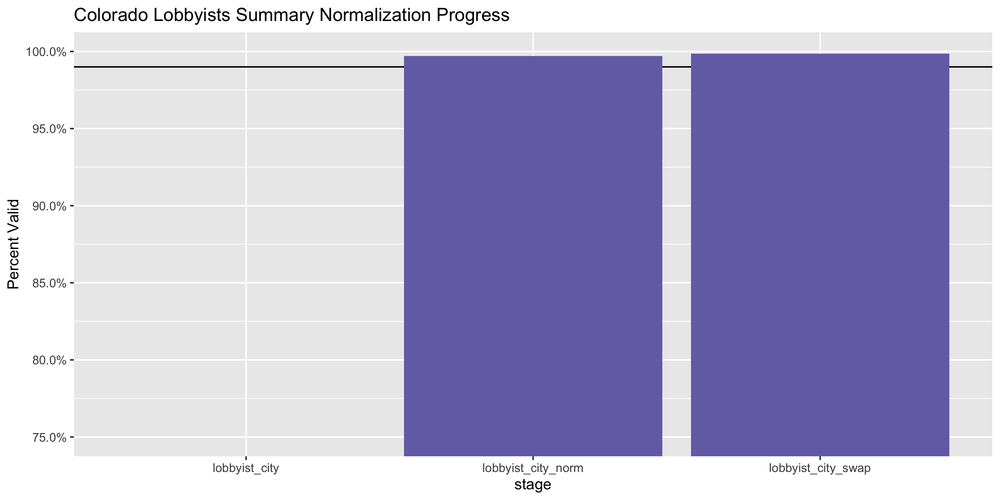
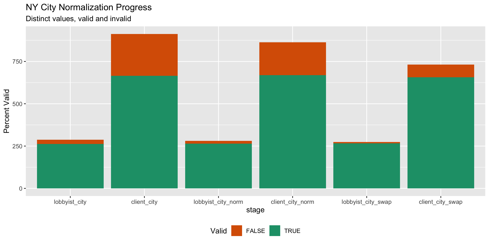

Colorado Lobbying Registration Diary
================
Yanqi Xu
2020-03-12 10:40:12

<!-- Place comments regarding knitting here -->

## Project

The Accountability Project is an effort to cut across data silos and
give journalists, policy professionals, activists, and the public at
large a simple way to search across huge volumes of public data about
people and organizations.

Our goal is to standardizing public data on a few key fields by thinking
of each dataset row as a transaction. For each transaction there should
be (at least) 3 variables:

1.  All **parties** to a transaction
2.  The **date** of the transaction
3.  The **amount** of money involved

## Objectives

This document describes the process used to complete the following
objectives:

1.  How many records are in the database?
2.  Check for duplicates
3.  Check ranges
4.  Is there anything blank or missing?
5.  Check for consistency issues
6.  Create a five-digit ZIP Code called `ZIP5`
7.  Create a `YEAR` field from the transaction date
8.  Make sure there is data on both parties to a transaction

## Packages

The following packages are needed to collect, manipulate, visualize,
analyze, and communicate these results. The `pacman` package will
facilitate their installation and attachment.

The IRW’s `campfin` package will also have to be installed from GitHub.
This package contains functions custom made to help facilitate the
processing of campaign finance data.

``` r
if (!require("pacman")) install.packages("pacman")
pacman::p_load_gh("irworkshop/campfin")
pacman::p_load(
  tidyverse, # data manipulation
  lubridate, # datetime strings
  magrittr, # pipe opperators
  janitor, # dataframe clean
  refinr, # cluster and merge
  scales, # format strings
  knitr, # knit documents
  vroom, # read files fast
  glue, # combine strings
  here, # relative storage
  fs # search storage 
)
```

This document should be run as part of the `R_campfin` project, which
lives as a sub-directory of the more general, language-agnostic
[`irworkshop/accountability_datacleaning`](https://github.com/irworkshop/accountability_datacleaning "TAP repo")
GitHub repository.

The `R_campfin` project uses the [RStudio
projects](https://support.rstudio.com/hc/en-us/articles/200526207-Using-Projects "Rproj")
feature and should be run as such. The project also uses the dynamic
`here::here()` tool for file paths relative to *your* machine.

``` r
# where does this document knit?
here::here()
#> [1] "/Users/yanqixu/code/accountability_datacleaning/R_campfin"
```

## Data

Lobbyist data is obtained from the [New Jersey Election Law Enforcement
Commission](https://www.elec.state.nj.us/forcandidates/gaa_pub_info.htm).

> #### Download
> 
> “View Quarterly Reports and Quarterly Summary” -\> “Entity Search” -\>
> “Search” -\> “Download Records”

The [Entity Search
page](https://www3-elec.mwg.state.nj.us/ELEC_AGAA/entitysearch.aspx), we
can see a table is generated and can be retrieved:

The data is downloaded on March 11, 2020.

First, we must download a reporting linking lobbyists to their
principals.

``` r
raw_dir <- dir_create(here("co", "lobby", "data", "raw", "reg"))
```

``` r
reg_url <- 'https://data.colorado.gov/api/views/35k5-cv8s/rows.csv?accessType=DOWNLOAD'

wget <- function(url, dir) {
  system2(
    command = "wget",
    args = c(
      "--no-verbose",
      "--content-disposition",
      url,
      paste("-P", raw_dir)
    )
  )
}

if (!all_files_new(raw_dir)) {
  wget(reg_url, raw_dir)
}
```

``` r
colr <- read_csv(dir_ls(raw_dir), 
                 col_types = cols(.default = col_character()))
```

We’ll do some basic cleaning by turning all text columns to uppercase
and transform column names to snake case.

``` r
colr <- colr %>% 
  mutate_if(is.character, str_to_upper) %>% 
  clean_names()
```

``` r
head(colr)
#> # A tibble: 6 x 15
#>   lobbyist_last_n… lobbyist_first_… lobbyist_addres… lobbyist_addres… lobbyist_city lobbyist_state
#>   <chr>            <chr>            <chr>            <chr>            <chr>         <chr>         
#> 1 A. TRENT & ASSO… <NA>             P. O. BOX 711    <NA>             JOHNSTOWN     CO            
#> 2 ABBOUD           GERALD           POWER SPORTS DE… 2003 W ALAMEDA   DENVER        CO            
#> 3 ABBOUD           GERALD           POWER SPORTS DE… 2003 W ALAMEDA   DENVER        CO            
#> 4 ABBOUD           GERALD           POWER SPORTS DE… 2003 W ALAMEDA   DENVER        CO            
#> 5 ABBOUD           GERALD           POWER SPORTS DE… 2003 W ALAMEDA   DENVER        CO            
#> 6 ABBOUD           GERALD           POWER SPORTS DE… 2003 W ALAMEDA   DENVER        CO            
#> # … with 9 more variables: lobbyist_zip <chr>, primary_lobbyist_id <chr>,
#> #   annual_lobbyist_registration_id <chr>, client_name <chr>, client_address1 <chr>,
#> #   client_address2 <chr>, client_city <chr>, client_state <chr>, client_zip <chr>
tail(colr)
#> # A tibble: 6 x 15
#>   lobbyist_last_n… lobbyist_first_… lobbyist_addres… lobbyist_addres… lobbyist_city lobbyist_state
#>   <chr>            <chr>            <chr>            <chr>            <chr>         <chr>         
#> 1 COLORADO LEGISL… <NA>             1410 GRANT STRE… SUITE D-110      DENVER        CO            
#> 2 COLORADO LEGISL… <NA>             1410 GRANT STRE… SUITE D-110      DENVER        CO            
#> 3 THOMSON          KRISTEN          4100 E ARKANSAS… TGS GLOBAL       DENVER        CO            
#> 4 CAPITOLINE CONS… ARLENE           10305 SPRING GR… <NA>             ENGLEWOOD     CO            
#> 5 COLORADO LEGISL… <NA>             1410 GRANT STRE… SUITE D-110      DENVER        CO            
#> 6 COLORADO LEGISL… <NA>             1410 GRANT STRE… SUITE D-110      DENVER        CO            
#> # … with 9 more variables: lobbyist_zip <chr>, primary_lobbyist_id <chr>,
#> #   annual_lobbyist_registration_id <chr>, client_name <chr>, client_address1 <chr>,
#> #   client_address2 <chr>, client_city <chr>, client_state <chr>, client_zip <chr>
glimpse(sample_n(colr, 20))
#> Observations: 20
#> Variables: 15
#> $ lobbyist_last_name              <chr> "HOLDREN", "AXIOM STRATEGIES INC DBA AXIOM POLITICS", "W…
#> $ lobbyist_first_name             <chr> "LARRY", NA, "JACOB", "STEVEN", "SEAN", NA, "MICHAEL", "…
#> $ lobbyist_address1               <chr> "2360 LAWRENCE ST.", "1600 BROADWAY", "7082 W MORRAINE D…
#> $ lobbyist_address2               <chr> NA, "SUITE 1350", NA, "SUITE 820", NA, "SUITE 1350", NA,…
#> $ lobbyist_city                   <chr> "DENVER", "DENVER", "LITTLETON", "DENVER", "DENVER", "DE…
#> $ lobbyist_state                  <chr> "CO", "CO", "CO", "CO", "CO", "CO", "CO", "CO", "CO", "C…
#> $ lobbyist_zip                    <chr> "80205", "80202", "80128", "80202", "80224", "80202", "8…
#> $ primary_lobbyist_id             <chr> "20065038052", "20017000845", "20145028329", "2007500155…
#> $ annual_lobbyist_registration_id <chr> "20061038052", "20115022638", "20165019337", "2009500654…
#> $ client_name                     <chr> "LARRY HOLDREN", "ASSOCIATION OF AMERICAN PUBLISHERS", "…
#> $ client_address1                 <chr> "2360 LAWRENCE", "455 MASSACHUSETTS AVE, NW", "900 COTTA…
#> $ client_address2                 <chr> NA, "SUITE # 700", NA, NA, NA, "# 300", NA, NA, NA, NA, …
#> $ client_city                     <chr> "DENVER", "WASHINGTON", "BLOOMFIELD", "ISLANDIA", "1625 …
#> $ client_state                    <chr> "CO", "DC", "CT", "NY", "DC", "CO", "CO", "MN", "CO", "C…
#> $ client_zip                      <chr> "80205", "20001", "06002", "11749", "20036", "80302", "8…
```

According to the [data
portal](https://data.colorado.gov/Lobbyist/Directory-of-Lobbyist-Clients-in-Colorado/35k5-cv8s):

> All of the lobbyists and all of the clients for Colorado, except for
> state lobbyists, also known as official State Liaisons, who are
> responsible for lobbying on behalf of a state agency and therefore
> have no “client”. The primaryLobbyistID field is the number assigned
> when the lobbyist registers with the state, and the first four numbers
> are the year of original registration. The annual lobbyist
> registration identification number is updated when they register in a
> current fiscal year, and the first four numbers reflect status of the
> lobbyist when registering in a current fiscal year (for example, if
> they were registered in 2015, but did not update their registration in
> 2016, then the registration id would remain 2015 until they register
> in a new fiscal year). The data is updated as necessary to the main
> lobbyist online system via manual entry, however the updates to the
> Colorado Information Marketplace is only done weekly, every Monday
> night.

### Year

We can add a year based on the first four digit of
`annual_lobbyist_registration_id`.

``` r
colr <- colr %>% 
  mutate(year = str_sub(annual_lobbyist_registration_id, start = 1L, end = 4L),
         first_year = str_sub(primary_lobbyist_id, start = 1L, end = 4L))
```

### Missing

``` r
col_stats(colr, count_na)
#> # A tibble: 17 x 4
#>    col                             class     n         p
#>    <chr>                           <chr> <int>     <dbl>
#>  1 lobbyist_last_name              <chr>     1 0.0000150
#>  2 lobbyist_first_name             <chr> 10769 0.161    
#>  3 lobbyist_address1               <chr>  1467 0.0220   
#>  4 lobbyist_address2               <chr> 38912 0.582    
#>  5 lobbyist_city                   <chr>  1467 0.0220   
#>  6 lobbyist_state                  <chr>  1467 0.0220   
#>  7 lobbyist_zip                    <chr>  1467 0.0220   
#>  8 primary_lobbyist_id             <chr>     1 0.0000150
#>  9 annual_lobbyist_registration_id <chr>     1 0.0000150
#> 10 client_name                     <chr>    39 0.000584 
#> 11 client_address1                 <chr>   264 0.00395  
#> 12 client_address2                 <chr> 51847 0.776    
#> 13 client_city                     <chr>   195 0.00292  
#> 14 client_state                    <chr>   195 0.00292  
#> 15 client_zip                      <chr>   199 0.00298  
#> 16 year                            <chr>     1 0.0000150
#> 17 first_year                      <chr>     1 0.0000150
```

``` r
colr <- colr %>% flag_na(lobbyist_last_name, client_name)
sum(colr$na_flag)
#> [1] 39
```

### Duplicates

We can see there’s no duplicate entry.

``` r
colr <- flag_dupes(colr, dplyr::everything())
sum(colr$dupe_flag)
#> [1] 2235
```

### Categorical

#### Year

We can see that the data is pretty up to date. However, there’re some
fileds indicating the annual registration was recorded in `2055`, which
is presumably a human error.

``` r
colr <- colr %>% 
  mutate(year = as.numeric(year))
tabyl(colr$year)
#> # A tibble: 28 x 4
#>    `colr$year`     n percent valid_percent
#>          <dbl> <dbl>   <dbl>         <dbl>
#>  1        1995  1173  0.0176        0.0176
#>  2        1996  1328  0.0199        0.0199
#>  3        1997  1087  0.0163        0.0163
#>  4        1998  1287  0.0193        0.0193
#>  5        1999  1905  0.0285        0.0285
#>  6        2000  1792  0.0268        0.0268
#>  7        2001  3383  0.0506        0.0506
#>  8        2002  1779  0.0266        0.0266
#>  9        2003  1986  0.0297        0.0297
#> 10        2004  2195  0.0328        0.0329
#> # … with 18 more rows
```

### Wrangle

To improve the searchability of the database, we will perform some
consistent, confident string normalization. For geographic variables
like city names and ZIP codes, the corresponding `campfin::normal_*()`
functions are taylor made to facilitate this process.

### Address

For the street `addresss` variable, the `campfin::normal_address()`
function will force consistence case, remove punctuation, and
abbreviation official USPS suffixes.

``` r
colr <- colr %>% 
    # combine street addr
  unite(
    col = lobbyist_address,
    starts_with("lobbyist_address"),
    sep = " ",
    remove = FALSE,
    na.rm = TRUE
  ) %>% 
    unite(
    col = client_address,
    starts_with("client_address"),
    sep = " ",
    remove = FALSE,
    na.rm = TRUE
  ) %>% 
  # normalize combined addr
    mutate_at(.vars = vars(ends_with('address')), .funs = list(norm = ~ normal_address(.,abbs = usps_street,
      na_rep = TRUE))) %>% 
  select(-ends_with("address"))
```

``` r
colr %>% 
  select(contains("address")) %>% 
  distinct() %>% 
  sample_n(10) %>% 
  glimpse()
#> Observations: 10
#> Variables: 6
#> $ lobbyist_address1     <chr> "1045 N LINCOLN STREET", "137O PENNSYLVANIA STREET #400", "1410 GR…
#> $ lobbyist_address2     <chr> "SUITE 303", NA, NA, "SUITE 2200", NA, NA, NA, NA, NA, NA
#> $ client_address1       <chr> "3224 E 7TH PARKWAY", "1180 CLERMONT STREET", "3075 S. SHERMAN ST.…
#> $ client_address2       <chr> NA, NA, NA, "SUITE 104", NA, NA, NA, NA, NA, NA
#> $ lobbyist_address_norm <chr> "1045 N LINCOLN ST STE 303", "137 O PENNSYLVANIA ST 400", "1410 GR…
#> $ client_address_norm   <chr> "3224 E 7 TH PKWY", "1180 CLERMONT ST", "3075 S SHERMAN ST", "1615…
```

### ZIP

For ZIP codes, the `campfin::normal_zip()` function will attempt to
create valied *five* digit codes by removing the ZIP+4 suffix and
returning leading zeroes dropped by other programs like Microsoft Excel.

``` r
colr <- colr %>% 
    mutate_at(.vars = vars(ends_with('zip')), 
              .funs = list(norm = ~ normal_zip(.))) %>% 
  rename(lobbyist_zip5 = lobbyist_zip_norm,
         client_zip5 = client_zip_norm)
```

``` r
progress_table(
  colr$lobbyist_zip,
  colr$lobbyist_zip5,
  colr$client_zip,
  colr$client_zip5,
  compare = valid_zip
)
#> # A tibble: 4 x 6
#>   stage         prop_in n_distinct prop_na n_out n_diff
#>   <chr>           <dbl>      <dbl>   <dbl> <dbl>  <dbl>
#> 1 lobbyist_zip    0.984        604 0.0220   1033     91
#> 2 lobbyist_zip5   0.998        530 0.0220    137      8
#> 3 client_zip      0.965       1831 0.00298  2299    484
#> 4 client_zip5     0.995       1460 0.00325   327     73
```

### State

Valid two digit state abbreviations can be made using the
`campfin::normal_state()` function.

``` r
prop_in(colr$lobbyist_state, valid_state, na.rm = T)
#> [1] 1
prop_in(colr$client_state, valid_state, na.rm = T)
#> [1] 0.9998349
colr <- colr %>% 
   mutate(client_state_norm = normal_state(client_state,abbreviate = TRUE,
      na_rep = TRUE,
      valid = valid_state))
```

``` r
colr %>% 
  filter(client_state != client_state_norm) %>% 
  count(client_state, sort = TRUE)
#> # A tibble: 0 x 2
#> # … with 2 variables: client_state <chr>, n <int>
```

``` r
progress_table(
  colr$client_state,
  colr$client_state_norm,
  compare = valid_state
)
#> # A tibble: 2 x 6
#>   stage             prop_in n_distinct prop_na n_out n_diff
#>   <chr>               <dbl>      <dbl>   <dbl> <dbl>  <dbl>
#> 1 client_state         1.00         57 0.00292    11      9
#> 2 client_state_norm    1            49 0.00308     0      1
```

### City

Cities are the most difficult geographic variable to normalize, simply
due to the wide variety of valid cities and formats. \#\#\#\# Normal

The `campfin::normal_city()` function is a good colrart, again
converting case, removing punctuation, but *expanding* USPS
abbreviations. We can also remove `invalid_city` values.

``` r
colr <- colr %>% 
      mutate_at(.vars = vars(ends_with('city')), .funs = list(norm = ~ normal_city(.,abbs = usps_city,
      states = usps_state,
      na = invalid_city,
      na_rep = TRUE)))

prop_in(colr$lobbyist_city_norm, valid_city, na.rm = T)
#> [1] 0.9789601
prop_in(colr$client_city_norm, valid_city, na.rm = T)
#> [1] 0.9580837
```

#### Swap

We can further improve normalization by comparing our normalized value
against the *expected* value for that record’s state abbreviation and
ZIP code. If the normalized value is either an abbreviation for or very
similar to the expected value, we can confidently swap those two.

``` r
colr <- colr %>% 
  left_join(
    y = zipcodes,
    by = c(
      "lobbyist_state" = "state",
      "lobbyist_zip5" = "zip"
    )
  ) %>% 
  rename(lobbyist_city_match = city) %>% 
  mutate(
    match_abb = is_abbrev(lobbyist_city_norm, lobbyist_city_match),
    match_dist = str_dist(lobbyist_city_norm, lobbyist_city_match),
    lobbyist_city_swap = if_else(
      condition = !is.na(match_dist) & match_abb | match_dist == 1,
      true = lobbyist_city_match,
      false = lobbyist_city_norm
    )
  ) %>% 
  select(
    -lobbyist_city_match,
    -match_dist,
    -match_abb
  )
```

``` r
colr <- colr %>% 
  left_join(
    y = zipcodes,
    by = c(
      "client_state_norm" = "state",
      "client_zip5" = "zip"
    )
  ) %>% 
  rename(client_city_match = city) %>% 
  mutate(
    match_abb = is_abbrev(client_city_norm, client_city_match),
    match_dist = str_dist(client_city_norm, client_city_match),
    client_city_swap = if_else(
      condition = !is.na(match_dist) & match_abb | match_dist == 1,
      true = client_city_match,
      false = client_city_norm
    )
  ) %>% 
  select(
    -client_city_match,
    -match_dist,
    -match_abb
  )
```

After the two normalization steps, the percentage of valid cities is at
100%. \#\#\#\#
Progress

| stage                | prop\_in | n\_distinct | prop\_na | n\_out | n\_diff |
| :------------------- | -------: | ----------: | -------: | -----: | ------: |
| lobbyist\_city       |    0.998 |         287 |    0.022 |    143 |      25 |
| client\_city         |    0.977 |         912 |    0.003 |   1557 |     247 |
| lobbyist\_city\_norm |    0.999 |         281 |    0.022 |     97 |      17 |
| client\_city\_norm   |    0.985 |         863 |    0.003 |    992 |     194 |
| lobbyist\_city\_swap |    1.000 |         274 |    0.024 |     24 |       8 |
| client\_city\_swap   |    0.992 |         732 |    0.012 |    518 |      75 |

You can see how the percentage of valid values increased with each
stage.

<!-- -->

More importantly, the number of distinct values decreased each stage. We
were able to confidently change many distinct invalid values to their
valid equivalent.

``` r
progress %>% 
  select(
    stage, 
    all = n_distinct,
    bad = n_diff
  ) %>% 
  mutate(good = all - bad) %>% 
  pivot_longer(c("good", "bad")) %>% 
  mutate(name = name == "good") %>% 
  ggplot(aes(x = stage, y = value)) +
  geom_col(aes(fill = name)) +
  scale_fill_brewer(palette = "Dark2", direction = -1) +
  scale_y_continuous(labels = comma) +
  theme(legend.position = "bottom") +
  labs(
    title = "NY City Normalization Progress",
    subtitle = "Distinct values, valid and invalid",
    x = "stage",
    y = "Percent Valid",
    fill = "Valid"
  )
```

<!-- -->

## Conclude

``` r
glimpse(sample_n(colr, 20))
#> Observations: 20
#> Variables: 28
#> $ lobbyist_last_name              <chr> "KLINE", "MANTELLI", "THE CAPSTONE GROUP, LLC", "REES", …
#> $ lobbyist_first_name             <chr> "SALLY", "LUCILLE", NA, "DIANE", "JASON", "ANDREW", "PAM…
#> $ lobbyist_address1               <chr> "1099 18TH STREET", "2000 HOWARD SMITH AVENUE WEST", "15…
#> $ lobbyist_address2               <chr> "SUITE 2150", NA, NA, NA, NA, NA, NA, "APT-1705", NA, "U…
#> $ lobbyist_city                   <chr> "DENVER", "WINDSOR", "DENVER", "DENVER", "DENVER", "DENV…
#> $ lobbyist_state                  <chr> "CO", "CO", "CO", "CO", "CO", "CO", "CO", "CO", "CO", "C…
#> $ lobbyist_zip                    <chr> "80202", "80550", "80203", "80202", "80203", "80202", "8…
#> $ primary_lobbyist_id             <chr> "20025000097", "20017000735", "20035003105", "1990700030…
#> $ annual_lobbyist_registration_id <chr> "20025001678", "20017000735", "20175022149", "2005500265…
#> $ client_name                     <chr> "ACS", "KODAK COLO DIV/EASTMAN KODAK CO", "GENERAL MOTOR…
#> $ client_address1                 <chr> "1200 K STREET N.W.", "9952 EASTMAN PARK DR", "300 RENAI…
#> $ client_address2                 <chr> "SUITE 1200", NA, NA, NA, "SUITE 200", NA, NA, NA, NA, "…
#> $ client_city                     <chr> "WASHINGTON", "WINDSOR", "DETROIT", "ENGLEWOOD", "DENVER…
#> $ client_state                    <chr> "DC", "CO", "MI", "CO", "CO", "CO", "CO", "OR", "CO", "C…
#> $ client_zip                      <chr> "20005", "80551", "48265", "80112", "80222", "80237-2722…
#> $ year                            <dbl> 2002, 2001, 2017, 2005, 2015, 1998, 1996, 2011, 1998, 20…
#> $ first_year                      <chr> "2002", "2001", "2003", "1990", "2006", "1998", "1992", …
#> $ na_flag                         <lgl> FALSE, FALSE, FALSE, FALSE, FALSE, FALSE, FALSE, FALSE, …
#> $ dupe_flag                       <lgl> FALSE, FALSE, FALSE, FALSE, TRUE, FALSE, FALSE, FALSE, F…
#> $ lobbyist_address_norm           <chr> "1099 18 TH ST STE 2150", "2000 HOWARD SMITH AVE W", "15…
#> $ client_address_norm             <chr> "1200 K ST N W STE 1200", "9952 EASTMAN PARK DR", "300 R…
#> $ lobbyist_zip5                   <chr> "80202", "80550", "80203", "80202", "80203", "80202", "8…
#> $ client_zip5                     <chr> "20005", "80551", "48265", "80112", "80222", "80237", "8…
#> $ client_state_norm               <chr> "DC", "CO", "MI", "CO", "CO", "CO", "CO", "OR", "CO", "C…
#> $ lobbyist_city_norm              <chr> "DENVER", "WINDSOR", "DENVER", "DENVER", "DENVER", "DENV…
#> $ client_city_norm                <chr> "WASHINGTON", "WINDSOR", "DETROIT", "ENGLEWOOD", "DENVER…
#> $ lobbyist_city_swap              <chr> "DENVER", "WINDSOR", "DENVER", "DENVER", "DENVER", "DENV…
#> $ client_city_swap                <chr> "WASHINGTON", "WINDSOR", "DETROIT", "ENGLEWOOD", "DENVER…
```

1.  There are 66819 records in the database.
2.  There are 2235 duplicate records in the database.
3.  The range and distribution of `amount` seems mostly reasonable
    except for a few entries.
4.  There are 39 records missing either recipient or date.
5.  Consistency in goegraphic data has been improved with
    `campfin::normal_*()`.
6.  The 4-digit `year` variable has been created with
    `lubridate::year()`.

## Export

``` r
clean_dir <- dir_create(here("co", "lobby", "data", "reg","clean"))
```

``` r
write_csv(
  x = colr %>% rename(lobbyist_city_clean = lobbyist_city_swap) %>% rename(client_city_clean = client_city_swap),
  path = path(clean_dir, "co_lob_reg_clean.csv"),
  na = ""
)
```
