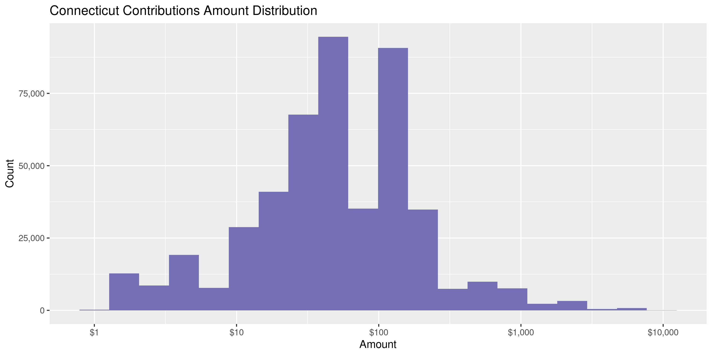
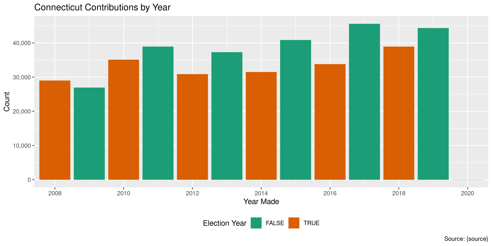
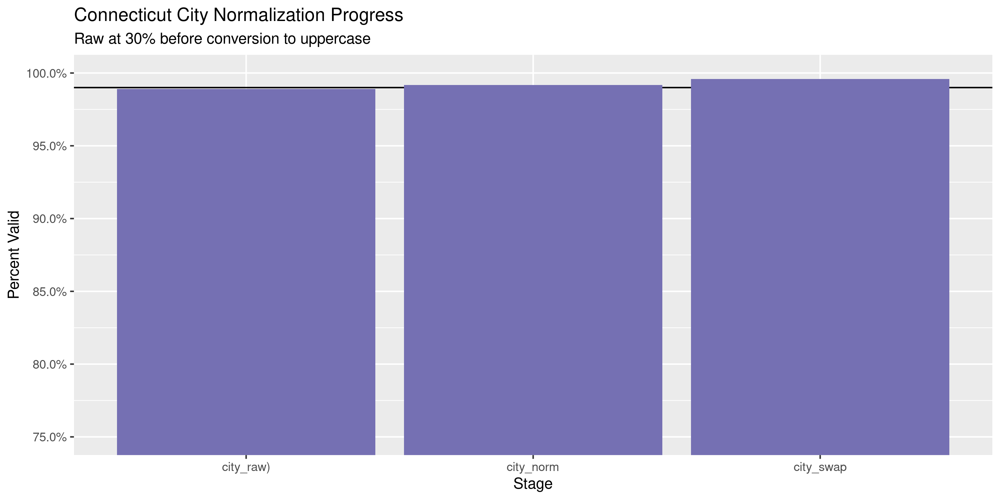
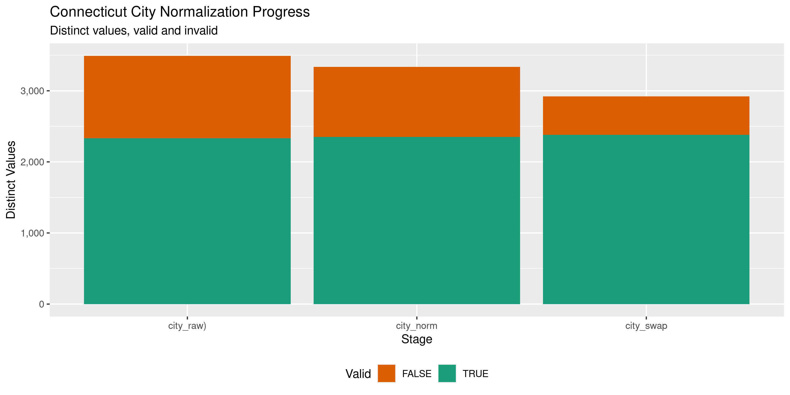

Connecticut Contributions
================
Kiernna Nicholls
2020-10-05 12:48:50

  - [Project](#project)
  - [Objectives](#objectives)
  - [Packages](#packages)
  - [Data](#data)
  - [Download](#download)
  - [Read](#read)
  - [Explore](#explore)
  - [Missing](#missing)
  - [Duplicates](#duplicates)
  - [Amounts](#amounts)
  - [Dates](#dates)
  - [Wrangle](#wrangle)
  - [Conclude](#conclude)
  - [Export](#export)
  - [Upload](#upload)

<!-- Place comments regarding knitting here -->

## Project

The Accountability Project is an effort to cut across data silos and
give journalists, policy professionals, activists, and the public at
large a simple way to search across huge volumes of public data about
people and organizations.

Our goal is to standardizing public data on a few key fields by thinking
of each dataset row as a transaction. For each transaction there should
be (at least) 3 variables:

1.  All **parties** to a transaction.
2.  The **date** of the transaction.
3.  The **amount** of money involved.

## Objectives

This document describes the process used to complete the following
objectives:

1.  How many records are in the database?
2.  Check for entirely duplicated records.
3.  Check ranges of continuous variables.
4.  Is there anything blank or missing?
5.  Check for consistency issues.
6.  Create a five-digit ZIP Code called `zip`.
7.  Create a `year` field from the transaction date.
8.  Make sure there is data on both parties to a transaction.

## Packages

The following packages are needed to collect, manipulate, visualize,
analyze, and communicate these results. The `pacman` package will
facilitate their installation and attachment.

The IRW’s `campfin` package will also have to be installed from GitHub.
This package contains functions custom made to help facilitate the
processing of campaign finance data.

``` r
if (!require("pacman")) install.packages("pacman")
pacman::p_load_gh("irworkshop/campfin")
pacman::p_load(
  tidyverse, # data manipulation
  lubridate, # datetime strings
  gluedown, # printing markdown
  magrittr, # pipe operators
  janitor, # clean data frames
  aws.s3, # upload to aws s3
  refinr, # cluster and merge
  scales, # format strings
  knitr, # knit documents
  vroom, # read files fast
  rvest, # html scraping
  glue, # combine strings
  here, # relative paths
  httr, # http requests
  fs # local storage 
)
```

This document should be run as part of the `R_campfin` project, which
lives as a sub-directory of the more general, language-agnostic
[`irworkshop/accountability_datacleaning`](https://github.com/irworkshop/accountability_datacleaning)
GitHub repository.

The `R_campfin` project uses the [RStudio
projects](https://support.rstudio.com/hc/en-us/articles/200526207-Using-Projects)
feature and should be run as such. The project also uses the dynamic
`here::here()` tool for file paths relative to *your* machine.

``` r
# where does this document knit?
here::here()
#> [1] "/home/kiernan/Code/tap/R_campfin"
```

## Data

Campaign contribution data for the state of Connecticut is managed by
the [State Elections Enforcement Commission
(SEEC)](https://portal.ct.gov/seec). The data can be obtained from the
SEEC [Campaign Reporting Information System
(eCRIS)](https://seec.ct.gov/Portal/eCRIS/eCRISlanding) public [search
portal](https://seec.ct.gov/Portal/eCRIS/eCrisSearch).

> This page allows the public to search, browse and download information
> from campaign finance reports filed by committees with the SEEC’s
> Disclosure and Audit Unit. The term committees for purposes of this
> summary includes: Candidate committees, Exploratory committees, Party
> committees and Political Action committees (also known as PACs). We
> shall refer to all four distinct committee types as political
> committees in order to accent the political nature of their purpose in
> relationship to the financing of election campaigns for elective
> public office in Connecticut.The Commission strives to offer fast and
> easy public access to the filings by committees.

The SEEC also provides a [bulk download
page](https://seec.ct.gov/Portal/eCRIS/CurPreYears) with annual CSV
files.

> Receipts Data for Party, Political, Candidate and Exploratory
> Committees (e-filed in eCRIS and paper report transactions were
> entered by the State Election Enforcement Comission staff using a data
> entry module.)

## Download

We can scrape this page and find any CSV files containing contribution
receipts.

``` r
# read the seec cris page
read_html("https://seec.ct.gov/Portal/eCRIS/CurPreYears") %>% 
  # grab all urls on the page
  html_nodes("a") %>% html_attr("href") %>% 
  # filter the receit csv files
  str_subset("Receipts.*(csv|CSV)$") -> raw_urls
```

These URLs will be downloaded to the local raw directory.

``` r
raw_dir <- dir_create(here("ct", "contribs", "data", "raw"))
raw_paths <- path(raw_dir, basename(raw_urls))
for (i in seq_along(raw_urls)) {
  if (!file_exists(raw_paths[i])) {
    download.file(
      url = raw_urls[i], 
      destfile = raw_paths[i]
    )
  }
}
```

## Read

There are three types of files, with each varying slightly year to year:

1.  Party and PAC receipts
    1.  2008-2013 (23 columns)
    2.  2014-2020 (35 columns)
2.  Candidate exploratory committee receipts
    1.  2008-2013 (23 columns)
    2.  2014-2015 (37 columns)
    3.  2016-2020 (41 columns)
3.  General committee receipts
    1.  2002-2007 (26 columns)

We will have to do some work to read these files into a single data
frame and match the columns.

### Older files

The oldest files have 26 columns with capitalized names. The 2006
receipts file lacks column names, so we will read it last and then
combine it separately to the other years.

``` r
old_files <- str_subset(raw_paths, "Cifs_Receipts")
md_bullet(md_code(basename(old_files)))
```

  - `Cifs_Receipts_2007.csv`
  - `Cifs_Receipts_2006.csv`
  - `Cifs_Receipts_2005.csv`
  - `Cifs_Receipts_2004.csv`
  - `Cifs_Receipts_2003.csv`
  - `Cifs_Receipts_1999_2001.csv`
  - `Cifs_Receipts_2002.csv`

<!-- end list -->

``` r
ct_old <- map_df(
  .x = old_files[-2],
  .f = read_delim,
  .id = "source_file",
  delim = ",",
  escape_backslash = FALSE, 
  escape_double = FALSE,
  col_types = cols(
    .default = col_character(),
    # FILED_TO_STATE_DATE = col_date_usa(),
    # SUBMITTED_DATE = col_date_usa(),
    # CONTRIB_DATE = col_date_usa(),
    CONTRIB_AMOUNT = col_double(),
    LOAN_AMOUNT = col_double(),
    INTEREST_EARNED_AMOUNT = col_double()
  )
)
```

``` r
ct_2006 <- read_delim(
  file = old_files[2],
  delim = ",",
  escape_backslash = FALSE,
  escape_double = FALSE,
  col_names = names(ct_old)[-1],
  col_types = spec(ct_old)
)
```

``` r
ct_old <- relocate(ct_old, source_file, .after = last_col())
ct_old$source_file <- basename(old_files[as.integer(ct_old$source_file)])
ct_2006 <- mutate(ct_2006, source_file = basename(raw_paths[2]))
```

``` r
ct_old <- ct_old %>% 
  bind_rows(ct_2006) %>% 
  clean_names("snake") %>% 
  mutate(across(source_file, basename))
```

These files include 155,685 columns of 27 columns.

We can create a single column for the contributor name to make the later
files.

``` r
ct_old <- ct_old %>% 
  unite(
    col = contributor,
    first, middle, last,
    sep = " ",
    remove = FALSE,
    na.rm = TRUE
  ) %>% 
  relocate(
    contributor,
    .after = last_col()
  ) %>% 
  mutate(
    contributor = na_if(contributor, ""),
    date_clean = mdy(date)
  )
```

### Candidate files

After 2007, contribution receipts were divided between filer types. We
can now read all of the contributions made to candidate exploratory
committees.

``` r
cand_files <- str_subset(raw_paths, "Candidate")
md_bullet(md_code(basename(cand_files)))
```

  - `Receipts2020ElectionYearCandidateExploratoryCommittees.csv`
  - `Receipts2019ElectionYearCandidateExploratoryCommittees.csv`
  - `Receipts2018ElectionYearCandidateExploratoryCommittees.csv`
  - `Receipts2017ElectionYearCandidateExploratoryCommittees.csv`
  - `Receipts2016ElectionYearCandidateExploratoryCommittees.csv`
  - `Receipts2015ElectionYearCandidateExploratoryCommittees.csv`
  - `Receipts2014ElectionYearCandidateExploratoryCommittees.csv`
  - `Receipts2013ElectionYearCandidateExploratoryCommittees.csv`
  - `Receipts2012ElectionYearCandidateExploratoryCommittees.csv`
  - `Receipts2011ElectionYearCandidateExploratoryCommittees.csv`
  - `Receipts2011ElectionYearCandidateExploratoryCommittees.csv`
  - `Receipts2010ElectionYearCandidateExploratoryCommittees.csv`
  - `Receipts2008ElectionYearCandidateExploratoryCommittees.CSV`

<!-- end list -->

``` r
ct_cand <- map(
  .x = cand_files,
  .f = read_delim,
  delim = ",",
  na = c("", "NA", "N/A", "NULL", "NO"),
  escape_double = TRUE,
  col_types = cols(
    .default = col_character(),
    `Amount` = col_number(),
    # use lubridate::mdy() instead
    # `Transaction Date` = col_date_usa()
  )
)
```

The number of columns in a file increased over time.

``` r
map_dbl(ct_cand, length)
#>  [1] 41 41 41 41 41 37 37 23 23 22 22 22 21
```

However, all the columns present in the old files are present in the
newer ones. Only additional columns are added over time.

    #>  [1] 1.000000 1.000000 1.000000 1.000000 1.000000 1.000000 1.000000 1.000000 1.000000 1.000000
    #> [11] 1.000000 1.000000 0.952381

That means we can safely `bind_rows()` and create a single dataframe.

``` r
ct_cand <- bind_rows(ct_cand, .id = "source_file")
ct_cand <- relocate(ct_cand, source_file, .after = last_col())
ct_cand$source_file <- basename(cand_files[as.integer(ct_cand$source_file)])
```

``` r
try_date <- function(date) {
  out <- suppressWarnings(parse_date_time(date, orders = c("mdy", "dmy")))
  out <- as_date(out)
  return(out)
}
```

``` r
date_cols <- which(map_lgl(ct_cand, ~str_detect(.[1], "\\d+/\\d+/\\d")))
ct_cand <- mutate(ct_cand, date_clean = try_date(date))
```

### PAC files

After 2007, contribution receipts were divided between filer types. We
can now read all of the contributions made to candidate exploratory
committees.

``` r
pac_files <- str_subset(raw_paths, "PAC")
md_bullet(md_code(basename(pac_files)))
```

  - `Receipts2020CalendarYearPartyPACCommittees.csv`
  - `Receipts2019CalendarYearPartyPACCommittees.csv`
  - `Receipts2018CalendarYearPartyPACCommittees.csv`
  - `Receipts2017CalendarYearPartyPACCommittees.csv`
  - `Receipts2016CalendarYearPartyPACCommittees.csv`
  - `Receipts2015CalendarYearPartyPACCommittees.csv`
  - `Receipts2014CalendarYearPartyPACCommittees.csv`
  - `Receipts2013CalendarYearPartyPACCommittees.csv`
  - `Receipts2012CalendarYearPartyPACCommittees.csv`
  - `Receipts2011CalendarYearPartyPACCommittees.csv`
  - `Receipts2010CalendarYearPartyPACCommittees.csv`
  - `Receipts2009CalendarYearPartyPACCommittees.CSV`
  - `Receipts2008CalendarYearPartyPACCommittees.CSV`

<!-- end list -->

``` r
ct_pac <- map(
  .x = pac_files,
  .f = read_delim,
  delim = ",",
  na = c("", "NA", "N/A", "NULL", "UNKNOWN"),
  escape_double = TRUE,
  col_types = cols(
    .default = col_character(),
    `Amount` = col_number(),
    # use lubridate::mdy() instead
    # `Transaction Date` = col_date_usa()
  )
)
```

The number of columns in a file increased over time.

``` r
map_dbl(ct_pac, length)
#>  [1] 35 35 35 35 35 34 34 23 24 24 24 21 21
```

However, all the columns present in the old files are present in the
newer ones. Only additional columns are added over time.

    #>  [1] 1.000000 1.000000 1.000000 1.000000 1.000000 1.000000 1.000000 1.000000 1.000000 1.000000
    #> [11] 1.000000 0.952381 0.952381

That means we can safely `bind_rows()` and create a single dataframe.

``` r
ct_pac <- map(ct_pac, clean_names)
ct_pac <- bind_rows(ct_pac, .id = "source_file")
ct_pac <- relocate(ct_pac, source_file, .after = last_col())
ct_pac$source_file <- basename(cand_files[as.integer(ct_pac$source_file)])
```

``` r
ct_pac <- mutate(ct_pac, date_clean = try_date(date))
```

### Bind files

Now we can combine these three different file type dataframes together.
There is sufficient overlap in the columns for our purposes.

``` r
prop_in(names(ct_pac), names(ct_cand))
#> [1] 1
prop_in(names(ct_old), names(ct_cand))
#> [1] 0.5862069
intersect(names(ct_cand), names(ct_old))
#>  [1] "committee"   "contributor" "fil_type"    "date"        "filed"       "amount"     
#>  [7] "occupation"  "city"        "state"       "zip"         "fil_id"      "first"      
#> [13] "middle"      "last"        "method"      "source_file" "date_clean"
```

``` r
ctc <- bind_rows(ct_cand, ct_pac, ct_old, .id = "source_type")
ctc <- relocate(ctc, source_type, .after = last_col())
ctc$source_type <- c("PAC", "CAND", "OLD")[as.numeric(ctc$source_type)]
ctc <- mutate(ctc, across(where(is.character), str_squish))
```

Here, we see how each of the three file types has

``` r
key_vars <- c("contributor", "date_clean", "amount", "committee")
ctc %>% 
  select(all_of(key_vars), source_type) %>% 
  sample_n(20)
#> # A tibble: 20 x 5
#>    contributor        date_clean amount committee                                       source_type
#>    <chr>              <date>      <dbl> <chr>                                           <chr>      
#>  1 Carol Rizzolo      2018-03-30  100   Bronin for Connecticut                          PAC        
#>  2 Michelle Robles    2008-05-12   20   Carlos Silva For State Rep. 08                  PAC        
#>  3 CARL JONES         2010-06-16    5   Campaign Mccrory 2010                           PAC        
#>  4 Richard Berkensto… 2018-04-08   10   Haines2018                                      PAC        
#>  5 Marshall T Segar   2002-10-11   40   Stillman 2002                                   OLD        
#>  6 Lynne Moore        2013-03-17   25   District D Democratic Committee Of Norwalk      CAND       
#>  7 JAMES M CRAWFORD   2016-06-16   50   Elect Needleman For Senate 2016                 PAC        
#>  8 John Olsen         2006-08-01   35   DeStefano for Connecticut                       OLD        
#>  9 George Dreyer      2002-10-28  500   Friends of John Rowland                         OLD        
#> 10 Liba H Furhman     2013-01-23   60   New Milford Democratic Town Committee           CAND       
#> 11 Joanne S. Conant   2006-07-07   50   Jodi Rell '06                                   OLD        
#> 12 LINDA J CUNNINGHAM 2016-04-30   50   Suffield Democratic Town Committee              CAND       
#> 13 ANTHONY HENRY      2010-06-18    5   Rojas 2010                                      PAC        
#> 14 Arthur Adduci Jr   2017-07-07   39.3 International Brotherhood Of Electrical Worker… CAND       
#> 15 FRANCIS COOK       2014-10-14   50   Somers Democratic Town Committee                CAND       
#> 16 NANCY R CLAPP      2010-04-13   25   Joan Lewis For State Representative             PAC        
#> 17 Gilbert Strickler  2005-10-05   25   District A Democratic Committee                 OLD        
#> 18 John Lantelme      2012-06-13   50   Lavery Campaign Committee                       PAC        
#> 19 Edward Anderson    2019-06-30   44.8 IRON PAC 424                                    CAND       
#> 20 David Weir         2014-03-24   25   Tim For Connecticut                             PAC
```

## Explore

``` r
head(ctc)
#> # A tibble: 6 x 57
#>   committee contributor district office employer rec_type fil_type date  filed amount receipt
#>   <chr>     <chr>       <chr>    <chr>  <chr>    <chr>    <chr>    <chr> <chr>  <dbl> <chr>  
#> 1 2020 Bar… Jeffrey St… <NA>     Undet… <NA>     Itemize… Explora… 4/8/… 6/8/…    100 Origin…
#> 2 2020 Bar… Cynthia Je… <NA>     Undet… <NA>     Itemize… Explora… 4/16… 6/8/…    100 Origin…
#> 3 2020 Bar… Cynthia Je… <NA>     Undet… <NA>     Itemize… Explora… 4/25… 6/8/…    250 Origin…
#> 4 2020 Bar… Norbert Ri… <NA>     Undet… Marine … Itemize… Explora… 5/6/… 6/8/…    375 Origin…
#> 5 2020 Bar… David Buch… <NA>     Undet… Self Em… Itemize… Explora… 5/7/… 6/8/…    375 Origin…
#> 6 2020 Bar… Horacio Ca… <NA>     Undet… Integri… Itemize… Explora… 5/9/… 6/8/…    250 Origin…
#> # … with 46 more variables: occupation <chr>, election_year <chr>, con_exec <chr>, con_leg <chr>,
#> #   contractor <chr>, lobbyist <chr>, source <chr>, refiled <chr>, address <chr>, city <chr>,
#> #   state <chr>, zip <chr>, event <chr>, report <chr>, fil_id <chr>, sec_letter <chr>,
#> #   sec_name <chr>, period_start <chr>, period_end <chr>, first <chr>, middle <chr>, last <chr>,
#> #   candidate_first_name <chr>, candidate_middle_intial <chr>, candidate_last_name <chr>,
#> #   report_id <chr>, form <chr>, is_reimbursement_claimed <chr>, description <chr>, method <chr>,
#> #   election_year_2 <chr>, source_file <chr>, date_clean <date>, fil_sub <chr>, trans_sub <chr>,
#> #   trans_type <chr>, trans_name <chr>, is_contrib <chr>, submitted <chr>, comm_to <chr>,
#> #   loan <dbl>, inkind_desc <chr>, inkind_est <chr>, interest <dbl>, occup_desc <chr>,
#> #   source_type <chr>
tail(ctc)
#> # A tibble: 6 x 57
#>   committee contributor district office employer rec_type fil_type date  filed amount receipt
#>   <chr>     <chr>       <chr>    <chr>  <chr>    <chr>    <chr>    <chr> <chr>  <dbl> <chr>  
#> 1 Jodi Rel… Philip L. … <NA>     <NA>   <NA>     <NA>     CA       3/2/… 4/10…   -250 <NA>   
#> 2 Tom Gaff… <NA>        <NA>     <NA>   <NA>     <NA>     CA       9/30… 10/1…      0 <NA>   
#> 3 Connecti… Steven W L… <NA>     <NA>   <NA>     <NA>     PO       10/5… 10/3…    -75 <NA>   
#> 4 Nappier … Michael J … <NA>     <NA>   <NA>     <NA>     CA       10/4… 10/1…    -75 <NA>   
#> 5 Madison … Kristine M… <NA>     <NA>   <NA>     <NA>     PA       3/29… 7/10…   -100 <NA>   
#> 6 Madison … Kristine M… <NA>     <NA>   <NA>     <NA>     PA       3/29… 7/10…   -100 <NA>   
#> # … with 46 more variables: occupation <chr>, election_year <chr>, con_exec <chr>, con_leg <chr>,
#> #   contractor <chr>, lobbyist <chr>, source <chr>, refiled <chr>, address <chr>, city <chr>,
#> #   state <chr>, zip <chr>, event <chr>, report <chr>, fil_id <chr>, sec_letter <chr>,
#> #   sec_name <chr>, period_start <chr>, period_end <chr>, first <chr>, middle <chr>, last <chr>,
#> #   candidate_first_name <chr>, candidate_middle_intial <chr>, candidate_last_name <chr>,
#> #   report_id <chr>, form <chr>, is_reimbursement_claimed <chr>, description <chr>, method <chr>,
#> #   election_year_2 <chr>, source_file <chr>, date_clean <date>, fil_sub <chr>, trans_sub <chr>,
#> #   trans_type <chr>, trans_name <chr>, is_contrib <chr>, submitted <chr>, comm_to <chr>,
#> #   loan <dbl>, inkind_desc <chr>, inkind_est <chr>, interest <dbl>, occup_desc <chr>,
#> #   source_type <chr>
glimpse(sample_n(ctc, 20))
#> Rows: 20
#> Columns: 57
#> $ committee                <chr> "Southington Democratic Town Committee", "Bridgeport Republican…
#> $ contributor              <chr> "John Moise", "Michael Hoffman", "Hilary Frisch", "Dwight Harri…
#> $ district                 <chr> NA, NA, NA, NA, NA, "6", NA, NA, NA, NA, NA, "72", "92", "151",…
#> $ office                   <chr> NA, NA, "Undetermined", NA, NA, "State Senator", NA, NA, "Undet…
#> $ employer                 <chr> "CT Transit", NA, "Student", NA, NA, "Mooreland Hill School", "…
#> $ rec_type                 <chr> "Itemized Contributions from Individuals", NA, "Itemized Contri…
#> $ fil_type                 <chr> "Party Committee", "PA", "Exploratory Committee", "Party Commit…
#> $ date                     <chr> "9/18/2015", "10/21/2002", "2/5/2017", "6/7/2008", "9/10/2013",…
#> $ filed                    <chr> "10/10/2015", "10/29/2002", "4/10/2017", "7/8/2008", "10/29/201…
#> $ amount                   <dbl> 100.00, 3.00, 5.00, 60.00, 10.00, 5.00, 50.00, 2000.00, 50.00, …
#> $ receipt                  <chr> "Original", NA, "Original", "Original", "Original", "Original",…
#> $ occupation               <chr> NA, NA, "Student", NA, NA, "Teacher", NA, NA, "retired", "Other…
#> $ election_year            <chr> NA, NA, "2018", "2008", NA, "2012", NA, NA, "2018", NA, NA, "20…
#> $ con_exec                 <chr> NA, NA, NA, NA, "NO", NA, NA, NA, NA, NA, "NO", NA, NA, NA, NA,…
#> $ con_leg                  <chr> NA, NA, NA, NA, "NO", NA, NA, NA, NA, NA, "NO", NA, NA, NA, NA,…
#> $ contractor               <chr> "NO", NA, NA, "NO", "NO", NA, "NO", NA, NA, NA, "NO", NA, NA, N…
#> $ lobbyist                 <chr> "NO", NA, NA, "NO", "NO", NA, "NO", NA, NA, NA, "NO", NA, NA, N…
#> $ source                   <chr> "eFILE", NA, "eFILE", "eFILE", "Data Entry", "eFILE", "eFILE", …
#> $ refiled                  <chr> "NO", NA, NA, "NO", "NO", NA, "NO", "NO", NA, NA, "NO", NA, NA,…
#> $ address                  <chr> "238 Stonegate Rd", NA, "PO Box 15", NA, "16 tanglewood Lane", …
#> $ city                     <chr> "Southington", "Bridgeport", "Middlefield", "Burlington", "BOLT…
#> $ state                    <chr> "CT", "CT", "CT", "CT", "ct", "CT", "CT", "CT", "CT", "FL", "CT…
#> $ zip                      <chr> "06489-", "06606", "06455-0015", NA, "06043", "06052-", "06473-…
#> $ event                    <chr> "09182015A", NA, NA, NA, NA, NA, NA, "09192016A", "09162017A", …
#> $ report                   <chr> "October 10 Filing", NA, "April 10 Filing", NA, NA, NA, NA, "Oc…
#> $ fil_id                   <chr> "2178", NA, "10519", NA, NA, NA, NA, "8838", "10472", NA, NA, N…
#> $ sec_letter               <chr> "B", NA, "B", NA, NA, NA, NA, "C1", "B", NA, NA, NA, "O", "B", …
#> $ sec_name                 <chr> "Itemized Contributions from Individuals", NA, "Itemized Contri…
#> $ period_start             <chr> "7/1/2015", NA, "1/2/2017", NA, NA, NA, NA, "7/1/2016", "7/1/20…
#> $ period_end               <chr> "9/30/2015", NA, "3/31/2017", NA, NA, NA, NA, "9/30/2016", "9/3…
#> $ first                    <chr> "John", "Michael", "Hilary", NA, NA, NA, NA, NA, "yrtes", "Sher…
#> $ middle                   <chr> NA, NA, NA, NA, NA, NA, NA, NA, NA, NA, NA, NA, NA, NA, NA, "L"…
#> $ last                     <chr> "Moise", "Hoffman", "Frisch", NA, NA, NA, NA, NA, "kambo", "Ber…
#> $ candidate_first_name     <chr> NA, NA, "Daniel", NA, NA, NA, NA, NA, "Pjerin \"Peter\"", NA, N…
#> $ candidate_middle_intial  <chr> NA, NA, "T", NA, NA, NA, NA, NA, NA, NA, NA, NA, NA, NA, NA, "B…
#> $ candidate_last_name      <chr> NA, NA, "Drew", NA, NA, NA, NA, NA, "Lumaj", NA, NA, NA, "Dillo…
#> $ report_id                <chr> "E34564", NA, "E47031", NA, NA, NA, NA, "E39225", "E50637", NA,…
#> $ form                     <chr> NA, NA, "30", NA, NA, NA, NA, NA, "30", NA, NA, NA, "30", "30",…
#> $ is_reimbursement_claimed <chr> NA, NA, NA, NA, NA, NA, NA, NA, NA, NA, NA, NA, "Yes", NA, NA, …
#> $ description              <chr> NA, NA, NA, NA, NA, NA, NA, NA, NA, NA, NA, NA, NA, NA, NA, NA,…
#> $ method                   <chr> NA, "CA", "Credit/Debit Card", NA, NA, NA, NA, NA, "Cash", "PC"…
#> $ election_year_2          <chr> NA, NA, NA, NA, NA, NA, NA, NA, NA, NA, NA, NA, NA, NA, NA, NA,…
#> $ source_file              <chr> "Receipts2015ElectionYearCandidateExploratoryCommittees.csv", "…
#> $ date_clean               <date> 2015-09-18, 2002-10-21, 2017-02-05, 2008-06-07, 2013-09-10, 20…
#> $ fil_sub                  <chr> NA, NA, NA, NA, NA, NA, NA, NA, NA, NA, NA, NA, NA, NA, NA, NA,…
#> $ trans_sub                <chr> NA, "Contribution from an Individual", NA, NA, NA, NA, NA, NA, …
#> $ trans_type               <chr> NA, "Monetary gift (receipt) at other than a fundraising affair…
#> $ trans_name               <chr> NA, NA, NA, NA, NA, NA, NA, NA, NA, NA, NA, NA, NA, NA, NA, NA,…
#> $ is_contrib               <chr> NA, "Y", NA, NA, NA, NA, NA, NA, NA, "Y", NA, NA, NA, NA, NA, N…
#> $ submitted                <chr> NA, "10/29/2002", NA, NA, NA, NA, NA, NA, NA, "1/28/2004", NA, …
#> $ comm_to                  <chr> NA, NA, NA, NA, NA, NA, NA, NA, NA, NA, NA, NA, NA, NA, NA, NA,…
#> $ loan                     <dbl> NA, 0, NA, NA, NA, NA, NA, NA, NA, 0, NA, NA, NA, NA, NA, NA, N…
#> $ inkind_desc              <chr> NA, NA, NA, NA, NA, NA, NA, NA, NA, NA, NA, NA, NA, NA, NA, NA,…
#> $ inkind_est               <chr> NA, "0", NA, NA, NA, NA, NA, NA, NA, "0", NA, NA, NA, NA, NA, N…
#> $ interest                 <dbl> NA, 0, NA, NA, NA, NA, NA, NA, NA, 0, NA, NA, NA, NA, NA, NA, N…
#> $ occup_desc               <chr> NA, NA, NA, NA, NA, NA, NA, NA, NA, "real estate", NA, NA, NA, …
#> $ source_type              <chr> "CAND", "OLD", "PAC", "CAND", "CAND", "PAC", "CAND", "CAND", "P…
```

## Missing

While most of the files from 2008 to 2020 share the same \~20 columns,
some of the more recent files have an additional \~10 columns. Those
files will contribute empty columns for rows from the earlier files.

``` r
col_stats(ctc, count_na)
#> # A tibble: 57 x 4
#>    col                      class        n         p
#>    <chr>                    <chr>    <int>     <dbl>
#>  1 committee                <chr>       71 0.0000500
#>  2 contributor              <chr>    30087 0.0212   
#>  3 district                 <chr>   848587 0.598    
#>  4 office                   <chr>   655285 0.462    
#>  5 employer                 <chr>   534476 0.377    
#>  6 rec_type                 <chr>   155757 0.110    
#>  7 fil_type                 <chr>       72 0.0000507
#>  8 date                     <chr>    48281 0.0340   
#>  9 filed                    <chr>       71 0.0000500
#> 10 amount                   <dbl>     1188 0.000837 
#> 11 receipt                  <chr>   155789 0.110    
#> 12 occupation               <chr>   430899 0.304    
#> 13 election_year            <chr>   699742 0.493    
#> 14 con_exec                 <chr>  1282877 0.904    
#> 15 con_leg                  <chr>  1283105 0.904    
#> 16 contractor               <chr>  1043816 0.736    
#> 17 lobbyist                 <chr>  1017848 0.717    
#> 18 source                   <chr>   155756 0.110    
#> 19 refiled                  <chr>   927891 0.654    
#> 20 address                  <chr>   454250 0.320    
#> 21 city                     <chr>    24477 0.0173   
#> 22 state                    <chr>    28991 0.0204   
#> 23 zip                      <chr>   191564 0.135    
#> 24 event                    <chr>  1171699 0.826    
#> 25 report                   <chr>   690740 0.487    
#> 26 fil_id                   <chr>   683135 0.481    
#> 27 sec_letter               <chr>   690740 0.487    
#> 28 sec_name                 <chr>   690740 0.487    
#> 29 period_start             <chr>   691248 0.487    
#> 30 period_end               <chr>   691249 0.487    
#> 31 first                    <chr>   591244 0.417    
#> 32 middle                   <chr>  1139352 0.803    
#> 33 last                     <chr>   590571 0.416    
#> 34 candidate_first_name     <chr>   943532 0.665    
#> 35 candidate_middle_intial  <chr>  1095563 0.772    
#> 36 candidate_last_name      <chr>   943532 0.665    
#> 37 report_id                <chr>   690741 0.487    
#> 38 form                     <chr>  1057547 0.745    
#> 39 is_reimbursement_claimed <chr>  1412613 0.996    
#> 40 description              <chr>  1413549 0.996    
#> 41 method                   <chr>   764512 0.539    
#> 42 election_year_2          <chr>  1335460 0.941    
#> 43 source_file              <chr>        0 0        
#> 44 date_clean               <date>   52990 0.0373   
#> 45 fil_sub                  <chr>  1385619 0.977    
#> 46 trans_sub                <chr>  1263125 0.890    
#> 47 trans_type               <chr>  1275182 0.899    
#> 48 trans_name               <chr>  1406852 0.992    
#> 49 is_contrib               <chr>  1263225 0.890    
#> 50 submitted                <chr>  1268607 0.894    
#> 51 comm_to                  <chr>  1411204 0.995    
#> 52 loan                     <dbl>  1275072 0.899    
#> 53 inkind_desc              <chr>  1417274 0.999    
#> 54 inkind_est               <chr>  1275027 0.899    
#> 55 interest                 <dbl>  1274969 0.899    
#> 56 occup_desc               <chr>  1373629 0.968    
#> 57 source_type              <chr>        0 0
```

We know the variables like `first` and `last` exist for only the more
recent files but simply repeat the information from `contributor`.

Even from the main variables, quite a few are missing values.

``` r
ctc <- flag_na(ctc, all_of(key_vars))
percent(mean(ctc$na_flag), 0.1)
#> [1] "5.8%"
```

``` r
ctc %>% 
  filter(na_flag) %>% 
  select(all_of(key_vars)) %>% 
  sample_frac()
#> # A tibble: 82,310 x 4
#>    contributor       date_clean amount committee                                             
#>    <chr>             <date>      <dbl> <chr>                                                 
#>  1 JAMES ABRIOLA     NA          145   Trumbull Republican Town Committee                    
#>  2 BARBARA EDWARDS   NA           33.1 Connecticut Health Care District 1199 PAC             
#>  3 <NA>              2000-12-19  250   Citizens for Jepsen                                   
#>  4 Soltoski Adam     NA           19.9 International Brotherhood Of Electrical Workers 42 PAC
#>  5 DONALD P KONOW    NA           10   Osten 2012                                            
#>  6 MICHAEL A DEBARBA NA           10   Connecticut Police & Fire Union PAC                   
#>  7 Robert Rutkowski  NA           12.1 International Brotherhood Of Electrical Workers 42 PAC
#>  8 Richard Dieckman  NA          150   Trumbull Republican Town Committee                    
#>  9 <NA>              2018-07-25  100   EVA for CT                                            
#> 10 ELIZABETH NUGENT  NA          200   Trumbull Democratic Town Committee                    
#> # … with 82,300 more rows
```

Most of these records missing values are missing a date.

``` r
ctc %>% 
  filter(na_flag) %>% 
  select(all_of(key_vars)) %>% 
  col_stats(count_na)
#> # A tibble: 4 x 4
#>   col         class      n        p
#>   <chr>       <chr>  <int>    <dbl>
#> 1 contributor <chr>  30087 0.366   
#> 2 date_clean  <date> 52990 0.644   
#> 3 amount      <dbl>   1188 0.0144  
#> 4 committee   <chr>     71 0.000863
```

Not much of these missing values were created when parsing the date.

``` r
prop_na(ctc$date)
#> [1] 0.03402922
prop_na(ctc$date_clean)
#> [1] 0.0373482
```

## Duplicates

``` r
ctc <- flag_dupes(ctc, everything())
percent(mean(ctc$dupe_flag), 0.1)
#> [1] "2.0%"
```

``` r
ctc %>% 
  filter(dupe_flag) %>% 
  select(all_of(key_vars))
#> # A tibble: 28,903 x 4
#>    contributor      date_clean amount committee                   
#>    <chr>            <date>      <dbl> <chr>                       
#>  1 David Rogan      2020-03-01     10 Arata 2020                  
#>  2 David Rogan      2020-03-01     10 Arata 2020                  
#>  3 Bonnie Cuprak    2020-05-05     10 Bell 2020                   
#>  4 Bonnie Cuprak    2020-05-05     10 Bell 2020                   
#>  5 Mildred L Hudson 2020-07-13     25 Billie Miller 2020          
#>  6 Mildred L Hudson 2020-07-13     25 Billie Miller 2020          
#>  7 Kenneth Trice    2020-02-06      5 Brenda 2020                 
#>  8 Kenneth Trice    2020-02-06      5 Brenda 2020                 
#>  9 Michael Farina   2020-01-27      5 Concepcion For Hartford 2020
#> 10 Michael Farina   2020-01-27      5 Concepcion For Hartford 2020
#> # … with 28,893 more rows
```

## Amounts

``` r
summary(ctc$amount)
#>     Min.  1st Qu.   Median     Mean  3rd Qu.     Max.     NA's 
#>  -108842       11       50      247      100 10000000     1188
mean(ctc$amount <= 0, na.rm = TRUE)
#> [1] 0.002890756
```

<!-- -->

``` r
ctc %>% 
  count(cents = amount %% 1, sort = TRUE) %>% 
  add_prop()
#> # A tibble: 999 x 3
#>      cents       n        p
#>      <dbl>   <int>    <dbl>
#>  1  0      1355868 0.956   
#>  2  0.5       8977 0.00633 
#>  3  0.300     1991 0.00140 
#>  4  0.25      1836 0.00129 
#>  5 NA         1188 0.000837
#>  6  0.75       981 0.000691
#>  7  0.03       634 0.000447
#>  8  0.02       607 0.000428
#>  9  0.0200     486 0.000343
#> 10  0.200      480 0.000338
#> # … with 989 more rows
```

## Dates

``` r
ctc <- mutate(ctc, year_clean = year(date_clean))
```

``` r
min(ctc$date_clean, na.rm = TRUE)
#> [1] "200-05-17"
sum(ctc$year_clean < 2000, na.rm = TRUE)
#> [1] 1501
max(ctc$date_clean, na.rm = TRUE)
#> [1] "3007-11-30"
sum(ctc$date_clean > today(), na.rm = TRUE)
#> [1] 7
ctc$year_clean[which(ctc$year_clean > 2020)] <- NA
ctc$year_clean[which(ctc$year_clean < 1998)] <- NA
```

<!-- -->

## Wrangle

To improve the searchability of the database, we will perform some
consistent, confident string normalization. For geographic variables
like city names and ZIP codes, the corresponding `campfin::normal_*()`
functions are tailor made to facilitate this process.

### Address

For the street `addresss` variable, the `campfin::normal_address()`
function will force consistence case, remove punctuation, and abbreviate
official USPS suffixes.

``` r
ctc <- ctc %>%
  mutate(
    address_norm = normal_address(
      address = address,
      abbs = usps_street,
      na_rep = TRUE
    )
  )
```

``` r
ctc %>% 
  select(contains("address")) %>% 
  distinct() %>% 
  sample_n(10)
#> # A tibble: 10 x 2
#>    address             address_norm       
#>    <chr>               <chr>              
#>  1 896 ETHAN ALLEN HWY 896 ETHAN ALLEN HWY
#>  2 Lexington Avenue    LEXINGTON AVE      
#>  3 1275 Chapel St      1275 CHAPEL ST     
#>  4 223 West Walk       223 W WALK         
#>  5 260 Andrew St       260 ANDREW ST      
#>  6 85 Catherie Dr      85 CATHERIE DR     
#>  7 PO Box 4265         PO BOX 4265        
#>  8 120 WALNUT STREET   120 WALNUT ST      
#>  9 793 Capital Ave     793 CAPITAL AVE    
#> 10 104 Williamsburg Rd 104 WILLIAMSBURG RD
```

### ZIP

For ZIP codes, the `campfin::normal_zip()` function will attempt to
create valid *five* digit codes by removing the ZIP+4 suffix and
returning leading zeroes dropped by other programs like Microsoft Excel.

``` r
ctc <- ctc %>% 
  mutate(
    zip_norm = normal_zip(
      zip = zip,
      na_rep = TRUE
    )
  )
```

``` r
progress_table(
  ctc$zip,
  ctc$zip_norm,
  compare = valid_zip
)
#> # A tibble: 2 x 6
#>   stage    prop_in n_distinct prop_na  n_out n_diff
#>   <chr>      <dbl>      <dbl>   <dbl>  <dbl>  <dbl>
#> 1 zip        0.211      39520   0.135 967843  35917
#> 2 zip_norm   0.997       8586   0.171   3168    923
```

### State

Valid two digit state abbreviations can be made using the
`campfin::normal_state()` function.

``` r
ctc <- ctc %>% 
  mutate(
    state_norm = normal_state(
      state = state,
      abbreviate = TRUE,
      na_rep = TRUE,
      valid = valid_state
    )
  )
```

``` r
ctc %>% 
  filter(state != state_norm) %>% 
  count(state, state_norm, sort = TRUE)
#> # A tibble: 34 x 3
#>    state state_norm     n
#>    <chr> <chr>      <int>
#>  1 Ct    CT          8207
#>  2 ct    CT          1019
#>  3 cT    CT           137
#>  4 CT.   CT            72
#>  5 ny    NY            18
#>  6 Va    VA            18
#>  7 nc    NC            16
#>  8 Fl    FL             7
#>  9 CT5   CT             6
#> 10 Ma    MA             6
#> # … with 24 more rows
```

``` r
progress_table(
  ctc$state,
  ctc$state_norm,
  compare = valid_state
)
#> # A tibble: 2 x 6
#>   stage      prop_in n_distinct prop_na n_out n_diff
#>   <chr>        <dbl>      <dbl>   <dbl> <dbl>  <dbl>
#> 1 state        0.993        239  0.0204  9906    183
#> 2 state_norm   1             56  0.0207     0      1
```

### City

Cities are the most difficult geographic variable to normalize, simply
due to the wide variety of valid cities and formats.

#### Normal

The `campfin::normal_city()` function is a good start, again converting
case, removing punctuation, but *expanding* USPS abbreviations. We can
also remove `invalid_city` values.

``` r
ctc <- ctc %>% 
  mutate(
    city_norm = normal_city(
      city = city, 
      abbs = usps_city,
      states = c("CT", "DC", "CONNECTICUT"),
      na = invalid_city,
      na_rep = TRUE
    )
  )
```

#### Swap

We can further improve normalization by comparing our normalized value
against the *expected* value for that record’s state abbreviation and
ZIP code. If the normalized value is either an abbreviation for or very
similar to the expected value, we can confidently swap those two.

``` r
ctc <- ctc %>% 
  rename(city_raw = city) %>% 
  left_join(
    y = zipcodes,
    by = c(
      "state_norm" = "state",
      "zip_norm" = "zip"
    )
  ) %>% 
  rename(city_match = city) %>% 
  mutate(
    match_abb = is_abbrev(city_norm, city_match),
    match_dist = str_dist(city_norm, city_match),
    city_swap = if_else(
      condition = !is.na(match_dist) & (match_abb | match_dist == 1),
      true = city_match,
      false = city_norm
    )
  ) %>% 
  select(
    -city_match,
    -match_dist,
    -match_abb
  )
```

#### Refine

The [OpenRefine](https://openrefine.org/) algorithms can be used to
group similar strings and replace the less common versions with their
most common counterpart. This can greatly reduce inconsistency, but with
low confidence; we will only keep any refined strings that have a valid
city/state/zip combination.

``` r
good_refine <- ctc %>% 
  mutate(
    city_refine = city_swap %>% 
      key_collision_merge() %>% 
      n_gram_merge(numgram = 1)
  ) %>% 
  filter(city_refine != city_swap) %>% 
  inner_join(
    y = zipcodes,
    by = c(
      "city_refine" = "city",
      "state_norm" = "state",
      "zip_norm" = "zip"
    )
  )
```

    #> # A tibble: 53 x 5
    #>    state_norm zip_norm city_swap                  city_refine          n
    #>    <chr>      <chr>    <chr>                      <chr>            <int>
    #>  1 CT         06896    REDDING RIDGE              REDDING             19
    #>  2 MA         01073    SOUTH HAMPTON              SOUTHAMPTON         11
    #>  3 CT         06066    ROCKVILLE VERNON           VERNON ROCKVILLE     4
    #>  4 NY         11733    SETAUKET                   EAST SETAUKET        4
    #>  5 SC         29406    NORTH CHARLESTON           CHARLESTON           4
    #>  6 CA         94103    SAN FRANSICO               SAN FRANCISCO        2
    #>  7 CT         06074    SOUTH WINDSORSOUTH WINDSOR SOUTH WINDSOR        2
    #>  8 CT         06614    STAFFORD                   STRATFORD            2
    #>  9 MA         01060    NORTH HAMPTON              NORTHAMPTON          2
    #> 10 CA         94102    SAN FRANCISCOSAN FRANCISO  SAN FRANCISCO        1
    #> # … with 43 more rows

Then we can join the refined values back to the database.

``` r
ctc <- ctc %>% 
  left_join(good_refine, by = names(.)) %>% 
  mutate(city_refine = coalesce(city_refine, city_swap))
```

#### Progress

| stage        | prop\_in | n\_distinct | prop\_na | n\_out | n\_diff |
| :----------- | -------: | ----------: | -------: | -----: | ------: |
| city\_raw)   |    0.989 |        6946 |    0.017 |  15184 |    2852 |
| city\_norm   |    0.991 |        6565 |    0.017 |  12314 |    2440 |
| city\_swap   |    0.995 |        5552 |    0.017 |   6788 |    1400 |
| city\_refine |    0.995 |        5510 |    0.017 |   6717 |    1358 |

You can see how the percentage of valid values increased with each
stage.

<!-- -->

More importantly, the number of distinct values decreased each stage. We
were able to confidently change many distinct invalid values to their
valid equivalent.

<!-- -->

## Conclude

``` r
ctc <- ctc %>% 
  select(
    -city_norm,
    -city_swap,
    city_clean = city_refine
  ) %>% 
  rename_all(~str_replace(., "_norm", "_clean")) %>% 
  rename_all(~str_remove(., "_raw"))
```

``` r
glimpse(sample_n(ctc, 50))
#> Rows: 50
#> Columns: 64
#> $ committee                <chr> "April for CT Senate", "East Hampton Democratic Town Committee"…
#> $ contributor              <chr> "William S Longbardi", "Ray Krupa", "John L Ingersoll", "David …
#> $ district                 <chr> "34", NA, "143", "20", "109", "5", NA, NA, "123", NA, "9", "121…
#> $ office                   <chr> "State Senator", NA, "State Representative", "State Representat…
#> $ employer                 <chr> "Yale New Haven Hospital", NA, NA, "Peterson Landscaping Servic…
#> $ rec_type                 <chr> "Itemized Contributions from Individuals", "In Kind NCC", "Item…
#> $ fil_type                 <chr> "Candidate Committee", "Party Committee", "Candidate Committee"…
#> $ date                     <chr> "5/8/2020", "9/27/2015", NA, "7/12/2010", "6/5/2012", "6/26/201…
#> $ filed                    <chr> "6/8/2020", "10/8/2015", "5/8/2008", "9/23/2010", "7/8/2012", "…
#> $ amount                   <dbl> 5.00, 65.00, 75.00, 25.00, 0.04, 25.00, 1500.00, 100.00, 10.00,…
#> $ receipt                  <chr> "Original", "Original", "Original", "Original", "Original", "Or…
#> $ occupation               <chr> "Security", NA, "Retired", "landscape contractor", NA, "PRESIDE…
#> $ election_year            <chr> "2020", NA, NA, "2010", "2012", "2018", NA, NA, "2012", NA, "20…
#> $ con_exec                 <chr> NA, NA, NA, NA, NA, NA, NA, NA, NA, "NO", NA, NA, NA, NA, NA, N…
#> $ con_leg                  <chr> NA, NA, NA, NA, NA, NA, NA, NA, NA, "NO", NA, NA, NA, NA, NA, N…
#> $ contractor               <chr> NA, NA, NA, NA, NA, NA, NA, NA, NA, NA, NA, NA, NA, NA, NA, NA,…
#> $ lobbyist                 <chr> NA, NA, NA, NA, NA, NA, NA, NA, NA, NA, NA, NA, NA, NA, NA, NA,…
#> $ source                   <chr> "eFILE", "eFILE", "Data Entry", "eFILE", "eFILE", "eFILE", NA, …
#> $ refiled                  <chr> NA, "NO", NA, NA, NA, NA, NA, NA, NA, "NO", NA, NA, NA, NA, NA,…
#> $ address                  <chr> "16 Wood Ter", "28 Keighley Pond Rd", NA, NA, "20 Trinity St", …
#> $ city                     <chr> "East Haven", "Middle Haddam", "WILTON", "West Hartford", "Hart…
#> $ state                    <chr> "CT", "CT", "CT", "CT", "CT", "CT", "CT", "CT", "CT", "CT", "CT…
#> $ zip                      <chr> "06513-", "06456-", NA, "06119-", "06106-1628", "06032-3040", "…
#> $ event                    <chr> NA, "09272015A", NA, NA, NA, "06262018A", NA, NA, NA, NA, NA, N…
#> $ report                   <chr> "Itemized Statement accompanying application for Public Grant",…
#> $ fil_id                   <chr> "12542", "1997", NA, NA, NA, "12010", NA, NA, NA, NA, NA, "1004…
#> $ sec_letter               <chr> "B", "L4", NA, NA, NA, "B", NA, NA, NA, NA, NA, "B", "B", "B", …
#> $ sec_name                 <chr> "Itemized Contributions from Individuals", "In-Kind Donations N…
#> $ period_start             <chr> "4/13/2020", "7/1/2015", NA, NA, NA, "5/14/2018", NA, NA, NA, N…
#> $ period_end               <chr> "6/1/2020", "9/30/2015", NA, NA, NA, "6/30/2018", NA, NA, NA, N…
#> $ first                    <chr> "William", NA, NA, NA, NA, "ANNA", "Zadelle", "Frank", NA, NA, …
#> $ middle                   <chr> "S", NA, NA, NA, NA, "S", NA, NA, NA, NA, NA, NA, NA, "J", NA, …
#> $ last                     <chr> "Longbardi", NA, NA, NA, NA, "AVENOSO", "Krasow Greenblatt", "M…
#> $ candidate_first_name     <chr> "April", NA, NA, NA, NA, "Phillip", NA, NA, NA, NA, NA, "Joseph…
#> $ candidate_middle_intial  <chr> NA, NA, NA, NA, NA, "J", NA, NA, NA, NA, NA, "P", NA, "C", NA, …
#> $ candidate_last_name      <chr> "Capone", NA, NA, NA, NA, "Chabot", NA, NA, NA, NA, NA, "Gresko…
#> $ report_id                <chr> "E74395", "E34836", NA, NA, NA, "E56451", NA, NA, NA, NA, NA, "…
#> $ form                     <chr> "30", NA, NA, NA, NA, "30", NA, NA, NA, NA, NA, "30", "30", NA,…
#> $ is_reimbursement_claimed <chr> NA, NA, NA, NA, NA, NA, NA, NA, NA, NA, NA, NA, NA, NA, NA, NA,…
#> $ description              <chr> NA, NA, NA, NA, NA, NA, NA, NA, NA, NA, NA, NA, NA, NA, NA, NA,…
#> $ method                   <chr> "Cash", NA, NA, NA, NA, "Personal Check", "PC", "PC", NA, NA, N…
#> $ election_year_2          <chr> NA, NA, "2008", NA, NA, NA, NA, NA, NA, NA, NA, NA, NA, NA, NA,…
#> $ source_file              <chr> "Receipts2020ElectionYearCandidateExploratoryCommittees.csv", "…
#> $ date_clean               <date> 2020-05-08, 2015-09-27, NA, 2010-07-12, 2012-06-05, 2018-06-26…
#> $ fil_sub                  <chr> NA, NA, NA, NA, NA, NA, NA, NA, NA, NA, NA, NA, NA, NA, NA, NA,…
#> $ trans_sub                <chr> NA, NA, NA, NA, NA, NA, "Contribution from an Individual", "Con…
#> $ trans_type               <chr> NA, NA, NA, NA, NA, NA, "Monetary gift (receipt) at other than …
#> $ trans_name               <chr> NA, NA, NA, NA, NA, NA, NA, NA, NA, NA, NA, NA, NA, NA, NA, NA,…
#> $ is_contrib               <chr> NA, NA, NA, NA, NA, NA, "Y", "Y", NA, NA, NA, NA, NA, NA, NA, N…
#> $ submitted                <chr> NA, NA, NA, NA, NA, NA, "10/6/2006", NA, NA, NA, NA, NA, NA, NA…
#> $ comm_to                  <chr> NA, NA, NA, NA, NA, NA, NA, NA, NA, NA, NA, NA, NA, NA, NA, NA,…
#> $ loan                     <dbl> NA, NA, NA, NA, NA, NA, 0, 0, NA, NA, NA, NA, NA, NA, NA, NA, 0…
#> $ inkind_desc              <chr> NA, NA, NA, NA, NA, NA, NA, NA, NA, NA, NA, NA, NA, NA, NA, NA,…
#> $ inkind_est               <chr> NA, NA, NA, NA, NA, NA, "0", "0", NA, NA, NA, NA, NA, NA, NA, N…
#> $ interest                 <dbl> NA, NA, NA, NA, NA, NA, 0, 0, NA, NA, NA, NA, NA, NA, NA, NA, 0…
#> $ occup_desc               <chr> NA, NA, NA, NA, NA, NA, NA, NA, NA, NA, NA, NA, NA, NA, NA, NA,…
#> $ source_type              <chr> "PAC", "CAND", "PAC", "PAC", "PAC", "PAC", "OLD", "OLD", "PAC",…
#> $ na_flag                  <lgl> FALSE, FALSE, TRUE, FALSE, FALSE, FALSE, FALSE, FALSE, FALSE, T…
#> $ dupe_flag                <lgl> FALSE, FALSE, FALSE, FALSE, FALSE, FALSE, FALSE, FALSE, FALSE, …
#> $ year_clean               <dbl> 2020, 2015, NA, 2010, 2012, 2018, 2006, 2002, 2012, NA, 2012, 2…
#> $ address_clean            <chr> "16 WOOD TER", "28 KEIGHLEY POND RD", NA, NA, "20 TRINITY ST", …
#> $ zip_clean                <chr> "06513", "06456", NA, "06119", "06106", "06032", "06117", "0685…
#> $ state_clean              <chr> "CT", "CT", "CT", "CT", "CT", "CT", "CT", "CT", "CT", "CT", "CT…
#> $ city_clean               <chr> "EAST HAVEN", "MIDDLE HADDAM", "WILTON", "WEST HARTFORD", "HART…
```

1.  There are 1,418,816 records in the database.
2.  There are 28,909 duplicate records in the database.
3.  The range and distribution of `amount` and `date` seem reasonable.
4.  There are 82,310 records missing key variables.
5.  Consistency in geographic data has been improved with
    `campfin::normal_*()`.
6.  The 4-digit `year` variable has been created with
    `lubridate::year()`.

## Export

Now the file can be saved on disk for upload to the Accountability
server.

``` r
clean_dir <- dir_create(here("ct", "contribs", "data", "clean"))
clean_path <- path(clean_dir, "ct_contribs_clean.csv")
write_csv(ctc, clean_path, na = "")
file_size(clean_path)
#> 595M
file_encoding(clean_path) %>% 
  mutate(across(path, path.abbrev))
#> # A tibble: 1 x 3
#>   path                                           mime            charset
#>   <chr>                                          <chr>           <chr>  
#> 1 ~/ct/contribs/data/clean/ct_contribs_clean.csv application/csv utf-8
```

## Upload

We can use the `aws.s3::put_object()` to upload the text file to the IRW
server.

``` r
s3_path <- path("csv", basename(clean_path))
if (!object_exists(s3_path, "publicaccountability")) {
  put_object(
    file = clean_path,
    object = s3_path, 
    bucket = "publicaccountability",
    acl = "public-read",
    show_progress = TRUE
  )
}
as_fs_bytes(object_size(s3_path, "publicaccountability"))
```
