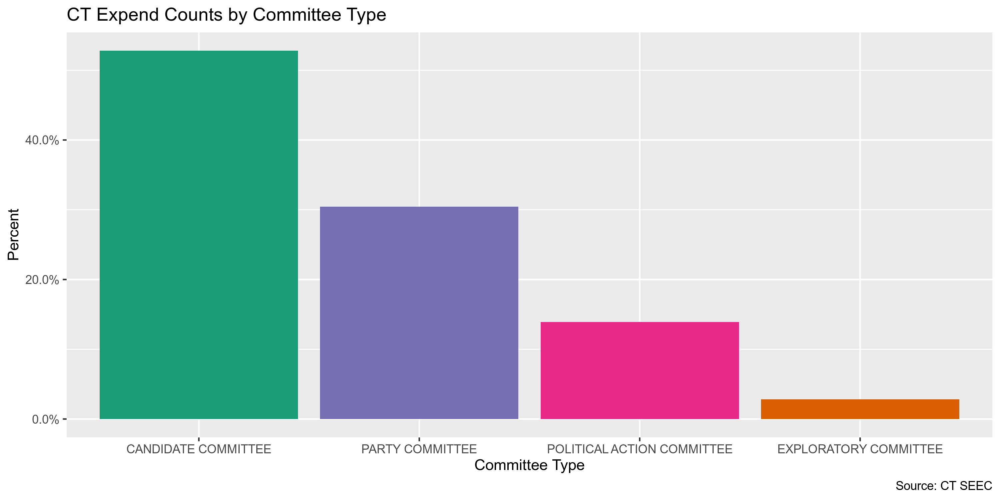
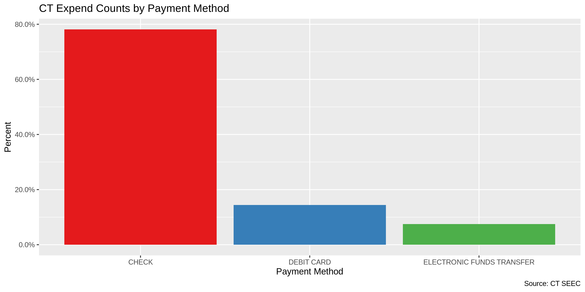
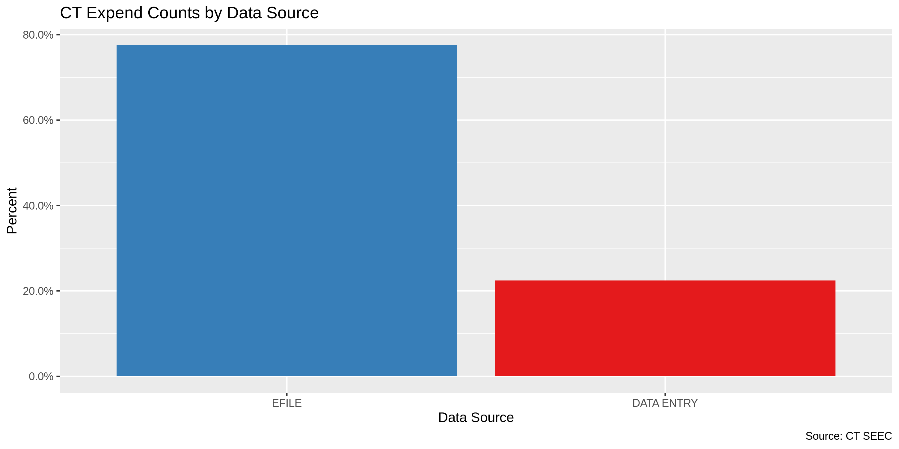
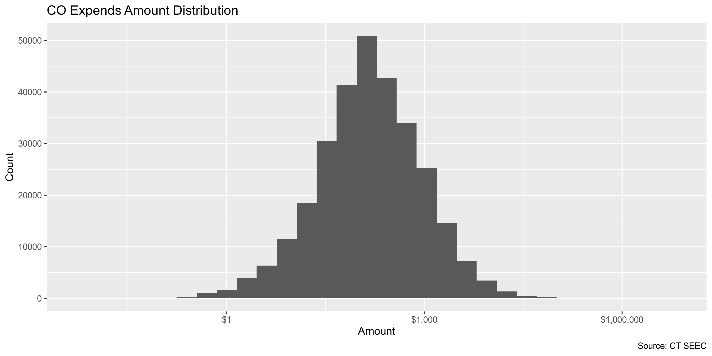
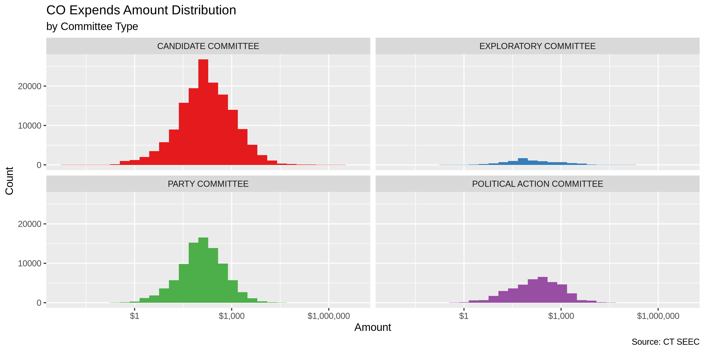
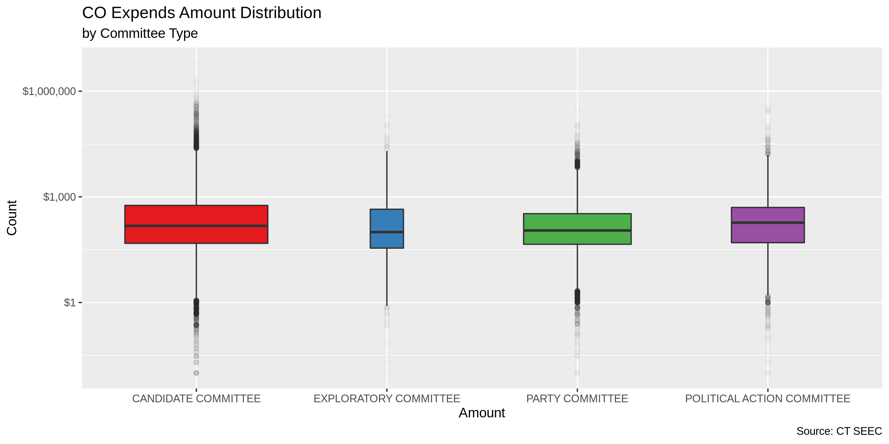
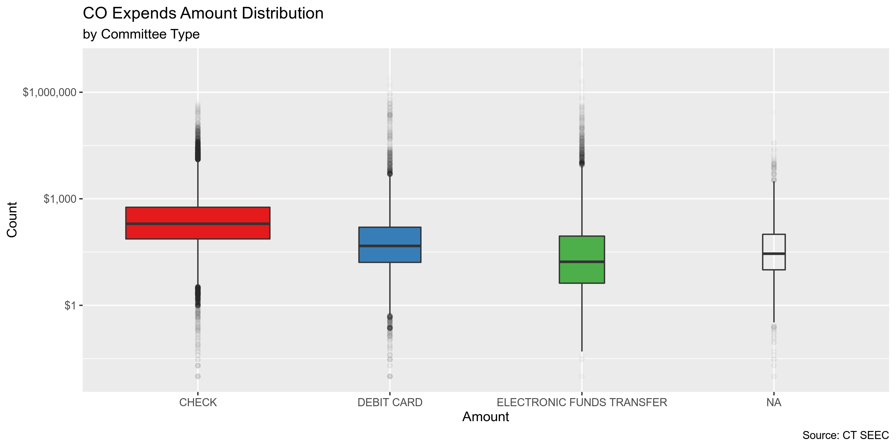

Connecticut Expenditures
================
Kiernan Nicholls
2019-09-30 11:19:44

  - [Project](#project)
  - [Objectives](#objectives)
  - [Packages](#packages)
  - [Data](#data)
  - [Import](#import)
  - [Explore](#explore)
  - [Wrangle](#wrangle)
  - [Conclude](#conclude)
  - [Export](#export)
  - [Lookup](#lookup)

## Project

The Accountability Project is an effort to cut across data silos and
give journalists, policy professionals, activists, and the public at
large a simple way to search across huge volumes of public data about
people and organizations.

Our goal is to standardizing public data on a few key fields by thinking
of each dataset row as a transaction. For each transaction there should
be (at least) 3 variables:

1.  All **parties** to a transaction
2.  The **date** of the transaction
3.  The **amount** of money involved

## Objectives

This document describes the process used to complete the following
objectives:

1.  How many records are in the database?
2.  Check for duplicates
3.  Check ranges
4.  Is there anything blank or missing?
5.  Check for consistency issues
6.  Create a five-digit ZIP Code called `ZIP5`
7.  Create a `YEAR` field from the transaction date
8.  Make sure there is data on both parties to a transaction

## Packages

The following packages are needed to collect, manipulate, visualize,
analyze, and communicate these results. The `pacman` package will
facilitate their installation and attachment.

``` r
if (!require("pacman")) install.packages("pacman")
pacman::p_load(
  stringdist, # levenshtein value
  tidyverse, # data manipulation
  lubridate, # datetime strings
  tidytext, # text analysis
  magrittr, # pipe opperators
  janitor, # dataframe clean
  zipcode, # clean & database
  batman, # parse logicals
  scales, # format values
  vroom, # read many files fast
  knitr, # knit documents
  glue, # combine strings
  here, # relative storage
  fs # search storage 
)
```

The IRW’s `campfin` package will also have to be installed from GitHub.
This package contains functions custom made to help facilitate the
processing of campaign finance data.

``` r
pacman::p_load_current_gh("kiernann/campfin")
```

This document should be run as part of the `R_campfin` project, which
lives as a sub-directory of the more general, language-agnostic
[`irworkshop/accountability_datacleaning`](https://github.com/irworkshop/accountability_datacleaning "TAP repo")
GitHub repository.

The `R_campfin` project uses the [RStudio
projects](https://support.rstudio.com/hc/en-us/articles/200526207-Using-Projects "Rproj")
feature and should be run as such. The project also uses the dynamic
`here::here()` tool for file paths relative to *your* machine.

``` r
# where dfs this document knit?
here::here()
#> [1] "/home/kiernan/R/accountability_datacleaning/R_campfin"
```

## Data

Data is provided by the [Connecticut State Elections Enforcment
Commission (SEEC)](https://portal.ct.gov/seec "seec"). The data is
processed through the [SEEC Campaign Reporting Information System
(eCRIS)](https://seec.ct.gov/eCrisHome/ "ecris").

### About

On the [eCRIS search
page](https://seec.ct.gov/eCrisHome/eCRIS_Search/eCrisSearchHome "about"),
SEEC provides an explanation on that can be found:

> This page allows the public to search, browse and download information
> from campaign finance reports filed by committees with the SEEC’s
> Disclosure and Audit Unit. The term committees for purposes of this
> summary includes: Candidate committees, Exploratory committees, Party
> committees and Political Action committees (also known as PACs). We
> shall refer to all four distinct committee types as political
> committees in order to accent the political nature of their purpose in
> relationship to the financing of election campaigns for elective
> public office in Connecticut. The Commission strives to offer fast and
> easy public access to the filings by committees.
> 
> In most instances the Commission staff is able to make these documents
> and information accessible for the public to search and view in a
> matter of hours.
> 
> In pursuit of SEEC’s mission to make information specific to political
> activities accessible in a user friendly manner to the public, we
> offer five distinct search options. Each option has been carefully
> designed to cater to the needs of its specific public audience. Our
> audience may include citizens generally interested in the democracy,
> researchers, reporters, students, politicians, political campaign
> staff, legislators, lobbyists and many others.

From that page, we can go the [bulk downloads
page](https://seec.ct.gov/eCrisHome/eCRIS_Search/PreviousYears.aspx "bulk"),
where four links are organized by year:

  - Disbursements Data for Party and PAC Committees
  - Receipts Data for Party and PAC Committees
  - Disbursements Data for Candidate and Exploratory Committees
  - Receipts Data for Candidate and Exploratory Committees

Data is available from 1999 to 2019.

## Import

Anual files can be downloaded as CSV from this page. We only want the
“disbursment” files.

> Disbursements Data for Party, Political, Candidate and Exploratory
> Committees (e-filed in eCRIS and paper report transactions were
> entered by the State Election Enforcement Comission staff using a data
> entry module.)

### Download

To download **immutable** raw data files, we first need to create the
download URLs for both PAC and Candidate expenditures.

``` r
base_url <- "http://seec.ct.gov/ecrisreporting/Data/eCrisDownloads/exportdatafiles"
pac_url <- glue("{base_url}/Disbursements{2008:2019}CalendarYearPartyPACCommittees.csv")
can_url <- glue("{base_url}/Disbursements{2008:2019}ElectionYearCandidateExploratoryCommittees.csv")
ct_urls <- c(pac_url, can_url)
```

``` r
raw_dir <- here("ct", "expends", "data", "raw")
dir_create(raw_dir)

if (!all_files_new(raw_dir)) {
  for (url in ct_urls) {
    tryCatch(
      error = function(e) print("No file"),
      download.file(
        url = url,
        destfile = glue("{raw_dir}/{basename(url)}")
      )
    )
  }
}

ct_files <- dir_ls(raw_dir, glob = "*.csv")
```

### Read

The files differ slightly in structure over time, so they can’t all be
read together. We can read each into a list by using `purrr::map()` and
`readr::read_csv()` and then collapse them into a single comprehensive
data frame with `dplyr::bind_rows()`.

``` r
ct <- map(
  ct_files,
  read_csv,
  na = c("", "NA", "NULL"),
  col_types = cols(.default = "c")
)
```

The files from earlier years have less columns.

``` r
names(ct) <- tools::file_path_sans_ext(basename(names(ct)))
ct %>% 
  map(dim) %>% 
  enframe(
    name = "file",
    value = "dim"
  ) %>% 
  mutate(
    dim = str_c(dim)
  ) %>% 
  print(n = length(ct))
```

    #> # A tibble: 23 x 2
    #>    file                                                        dim         
    #>    <chr>                                                       <chr>       
    #>  1 Disbursements2008CalendarYearPartyPACCommittees             c(12445, 18)
    #>  2 Disbursements2008ElectionYearCandidateExploratoryCommittees c(16879, 18)
    #>  3 Disbursements2009CalendarYearPartyPACCommittees             c(8239, 18) 
    #>  4 Disbursements2010CalendarYearPartyPACCommittees             c(11579, 18)
    #>  5 Disbursements2010ElectionYearCandidateExploratoryCommittees c(32495, 18)
    #>  6 Disbursements2011CalendarYearPartyPACCommittees             c(13760, 18)
    #>  7 Disbursements2011ElectionYearCandidateExploratoryCommittees c(1236, 18) 
    #>  8 Disbursements2012CalendarYearPartyPACCommittees             c(4333, 18) 
    #>  9 Disbursements2012ElectionYearCandidateExploratoryCommittees c(19551, 18)
    #> 10 Disbursements2013CalendarYearPartyPACCommittees             c(13376, 18)
    #> 11 Disbursements2013ElectionYearCandidateExploratoryCommittees c(564, 18)  
    #> 12 Disbursements2014CalendarYearPartyPACCommittees             c(12145, 24)
    #> 13 Disbursements2014ElectionYearCandidateExploratoryCommittees c(26961, 27)
    #> 14 Disbursements2015CalendarYearPartyPACCommittees             c(12461, 24)
    #> 15 Disbursements2015ElectionYearCandidateExploratoryCommittees c(1043, 27) 
    #> 16 Disbursements2016CalendarYearPartyPACCommittees             c(11499, 24)
    #> 17 Disbursements2016ElectionYearCandidateExploratoryCommittees c(19825, 29)
    #> 18 Disbursements2017CalendarYearPartyPACCommittees             c(13528, 24)
    #> 19 Disbursements2017ElectionYearCandidateExploratoryCommittees c(2896, 29) 
    #> 20 Disbursements2018CalendarYearPartyPACCommittees             c(13667, 24)
    #> 21 Disbursements2018ElectionYearCandidateExploratoryCommittees c(42725, 29)
    #> 22 Disbursements2019CalendarYearPartyPACCommittees             c(4462, 24) 
    #> 23 Disbursements2019ElectionYearCandidateExploratoryCommittees c(740, 29)

But the newer files simply *add* more information, and the first 18
columns are consistent across all 23 files.

``` r
names(ct[[1]]) %in% names(ct[[23]])
```

    #>  [1] TRUE TRUE TRUE TRUE TRUE TRUE TRUE TRUE TRUE TRUE TRUE TRUE TRUE TRUE TRUE TRUE TRUE TRUE

``` r
names(ct[[23]]) %in% names(ct[[1]])
```

    #>  [1]  TRUE  TRUE  TRUE  TRUE  TRUE  TRUE  TRUE  TRUE  TRUE  TRUE  TRUE  TRUE  TRUE  TRUE  TRUE
    #> [16]  TRUE  TRUE  TRUE FALSE FALSE FALSE FALSE FALSE FALSE FALSE FALSE FALSE FALSE FALSE

When binding the rows from each list into a single data frame, the
records from earier years will simply be filled with `NA` for variables
that didn’t exist.

``` r
ct <- ct %>% 
  bind_rows(.id = "file") %>% 
  clean_names() %>% 
  mutate_all(str_to_upper) %>% 
  na_if("VOID") %>% 
  na_if("VOIDED") %>%
  na_if("-") %>% 
  na_if("NO")
```

Since we read every column as character vectors, we will have to use
`readr::parse_*()` after the fact to convert dates, logicals, and
numbers to their approproate class.

``` r
parse_usa_date <- function(x, ...) {
  parse_date(x, format = "%m/%d/%Y", ...)
}
```

``` r
ct <- ct %>% 
  mutate(
    amount = parse_number(amount),
    file_to_state = parse_usa_date(file_to_state),
    period_start = parse_usa_date(period_start),
    period_end = parse_usa_date(period_end),
    election_year = parse_integer(election_year),
    refiled_electronically = to_logical(refiled_electronically),
    amended = equals(status, "AMENDMENT"),
    efiled = equals(data_source, "EFILE")
  )
#> Warning: 1 parsing failure.
#>   row col expected actual
#> 91491  -- a number      -

# some dates will fail, make NA in new col
sample(unique(ct$payment_date[str_which(ct$payment_date, "\\d+\\-\\w+$")]), 10)
#>  [1] "29-JAN"      "4/30 - 9-30" "2.27-2015"   "30-OCT"      "27-MAR"      "14-MAR"     
#>  [7] "31-DEC"      "4-MAY"       "3-FEB"       "8-OCT"
ct <- mutate(ct, date_clean = mdy(payment_date))
#> Warning: 801 failed to parse.
```

## Explore

There are 296409 rows of 33 columns.

``` r
dim(ct)
```

    #> [1] 296409     33

``` r
head(ct)
```

    #> # A tibble: 6 x 33
    #>   file  committee committee_type payee purpose_of_expe… description payment_method payment_date
    #>   <chr> <chr>     <chr>          <chr> <chr>            <chr>       <chr>          <chr>       
    #> 1 DISB… 12TH DIS… POLITICAL ACT… LARS… CONTRI()         <NA>        CHECK          10/2/2008   
    #> 2 DISB… 12TH DIS… POLITICAL ACT… COUR… CONTRI()         <NA>        CHECK          4/21/2008   
    #> 3 DISB… 12TH DIS… POLITICAL ACT… MANC… CONTRI()         <NA>        CHECK          6/30/2008   
    #> 4 DISB… 12TH DIS… POLITICAL ACT… MANC… CONTRI()         <NA>        CHECK          10/2/2008   
    #> 5 DISB… 139TH DI… POLITICAL ACT… DEMO… CNTRB()          <NA>        <NA>           10/23/2008  
    #> 6 DISB… 139TH DI… POLITICAL ACT… HOUS… CNTRB()          <NA>        <NA>           10/23/2008  
    #> # … with 25 more variables: amount <dbl>, file_to_state <date>, period_start <date>,
    #> #   period_end <date>, election_year <int>, status <chr>, data_source <chr>,
    #> #   refiled_electronically <lgl>, street_address <chr>, city <chr>, state <chr>,
    #> #   fundraising_event <chr>, report_name <chr>, committee_id <chr>, section_letter <chr>,
    #> #   section_name <chr>, report_id <chr>, candidate_first_name <chr>,
    #> #   candidate_middle_intial <chr>, candidate_last_name <chr>, form <chr>, description_1 <chr>,
    #> #   amended <lgl>, efiled <lgl>, date_clean <date>

``` r
tail(ct)
```

    #> # A tibble: 6 x 33
    #>   file  committee committee_type payee purpose_of_expe… description payment_method payment_date
    #>   <chr> <chr>     <chr>          <chr> <chr>            <chr>       <chr>          <chr>       
    #> 1 DISB… ZULLO FO… CANDIDATE COM… SHOR… A-NEWS(ADVERTIS… COURIER NE… CHECK          3/9/2019    
    #> 2 DISB… ZULLO FO… CANDIDATE COM… FACE… A-WEB(ADVERTISE… AD BOOST    DEBIT CARD     3/13/2019   
    #> 3 DISB… ZULLO FO… CANDIDATE COM… QUIC… MISC *(MISCELLA… DATA HOSTI… DEBIT CARD     3/18/2019   
    #> 4 DISB… ZULLO FO… CANDIDATE COM… CITI… BNK(BANK FEES, … STATEMENT … DEBIT CARD     3/29/2019   
    #> 5 DISB… ZULLO FO… CANDIDATE COM… CLIF… OVHD(OVERHEAD O… RENT- HEAD… CHECK          3/31/2019   
    #> 6 DISB… ZULLO FO… CANDIDATE COM… CITI… BNK(BANK FEES, … STATEMENT … DEBIT CARD     4/30/2019   
    #> # … with 25 more variables: amount <dbl>, file_to_state <date>, period_start <date>,
    #> #   period_end <date>, election_year <int>, status <chr>, data_source <chr>,
    #> #   refiled_electronically <lgl>, street_address <chr>, city <chr>, state <chr>,
    #> #   fundraising_event <chr>, report_name <chr>, committee_id <chr>, section_letter <chr>,
    #> #   section_name <chr>, report_id <chr>, candidate_first_name <chr>,
    #> #   candidate_middle_intial <chr>, candidate_last_name <chr>, form <chr>, description_1 <chr>,
    #> #   amended <lgl>, efiled <lgl>, date_clean <date>

``` r
glimpse(ct)
```

    #> Observations: 296,409
    #> Variables: 33
    #> $ file                    <chr> "DISBURSEMENTS2008CALENDARYEARPARTYPACCOMMITTEES", "DISBURSEMENT…
    #> $ committee               <chr> "12TH DISTRICT DEMOCRATS", "12TH DISTRICT DEMOCRATS", "12TH DIST…
    #> $ committee_type          <chr> "POLITICAL ACTION COMMITTEE", "POLITICAL ACTION COMMITTEE", "POL…
    #> $ payee                   <chr> "LARSON FOR CONGRESS", "COURTNEY FOR CONGRESS", "MANCHESTER DEMO…
    #> $ purpose_of_expenditure  <chr> "CONTRI()", "CONTRI()", "CONTRI()", "CONTRI()", "CNTRB()", "CNTR…
    #> $ description             <chr> NA, NA, NA, NA, NA, NA, NA, NA, "DONATION", "DONATION", "DONATIO…
    #> $ payment_method          <chr> "CHECK", "CHECK", "CHECK", "CHECK", NA, NA, "CHECK", "CHECK", "C…
    #> $ payment_date            <chr> "10/2/2008", "4/21/2008", "6/30/2008", "10/2/2008", "10/23/2008"…
    #> $ amount                  <dbl> 150.00, 500.00, 300.00, 1200.00, 50.00, 100.00, 200.00, 50.00, 1…
    #> $ file_to_state           <date> 2008-10-28, 2008-10-28, 2008-10-28, 2008-10-28, 2009-01-06, 200…
    #> $ period_start            <date> 2008-10-01, 2008-10-01, 2008-10-01, 2008-10-01, 2008-10-22, 200…
    #> $ period_end              <date> 2008-10-21, 2008-10-21, 2008-10-21, 2008-10-21, 2008-12-31, 200…
    #> $ election_year           <int> NA, NA, NA, NA, NA, NA, NA, NA, NA, NA, NA, NA, NA, NA, NA, NA, …
    #> $ status                  <chr> "ORIGINAL", "ORIGINAL", "ORIGINAL", "ORIGINAL", "ORIGINAL", "ORI…
    #> $ data_source             <chr> "DATA ENTRY", "DATA ENTRY", "DATA ENTRY", "DATA ENTRY", "DATA EN…
    #> $ refiled_electronically  <lgl> NA, NA, NA, NA, NA, NA, NA, NA, NA, NA, NA, NA, NA, NA, NA, NA, …
    #> $ street_address          <chr> "PO BOX 261172", "P.O BOX 1372", "116 CROFT DRIVE", "116 CROFT D…
    #> $ city                    <chr> "HARTFORD", "VERNON", "MANCHESTER", "MANCHESTER", "WASHINGTON", …
    #> $ state                   <chr> "CT", "CT", "CT", "CT", "DC", "CT", "CT", "CT", "CT", "CT", "CT"…
    #> $ fundraising_event       <chr> NA, NA, NA, NA, NA, NA, NA, NA, NA, NA, NA, NA, NA, NA, NA, NA, …
    #> $ report_name             <chr> NA, NA, NA, NA, NA, NA, NA, NA, NA, NA, NA, NA, NA, NA, NA, NA, …
    #> $ committee_id            <chr> NA, NA, NA, NA, NA, NA, NA, NA, NA, NA, NA, NA, NA, NA, NA, NA, …
    #> $ section_letter          <chr> NA, NA, NA, NA, NA, NA, NA, NA, NA, NA, NA, NA, NA, NA, NA, NA, …
    #> $ section_name            <chr> NA, NA, NA, NA, NA, NA, NA, NA, NA, NA, NA, NA, NA, NA, NA, NA, …
    #> $ report_id               <chr> NA, NA, NA, NA, NA, NA, NA, NA, NA, NA, NA, NA, NA, NA, NA, NA, …
    #> $ candidate_first_name    <chr> NA, NA, NA, NA, NA, NA, NA, NA, NA, NA, NA, NA, NA, NA, NA, NA, …
    #> $ candidate_middle_intial <chr> NA, NA, NA, NA, NA, NA, NA, NA, NA, NA, NA, NA, NA, NA, NA, NA, …
    #> $ candidate_last_name     <chr> NA, NA, NA, NA, NA, NA, NA, NA, NA, NA, NA, NA, NA, NA, NA, NA, …
    #> $ form                    <chr> NA, NA, NA, NA, NA, NA, NA, NA, NA, NA, NA, NA, NA, NA, NA, NA, …
    #> $ description_1           <chr> NA, NA, NA, NA, NA, NA, NA, NA, NA, NA, NA, NA, NA, NA, NA, NA, …
    #> $ amended                 <lgl> FALSE, FALSE, FALSE, FALSE, FALSE, FALSE, FALSE, FALSE, FALSE, F…
    #> $ efiled                  <lgl> FALSE, FALSE, FALSE, FALSE, FALSE, FALSE, FALSE, FALSE, FALSE, F…
    #> $ date_clean              <date> 2008-10-02, 2008-04-21, 2008-06-30, 2008-10-02, 2008-10-23, 200…

### Distinct

The categorical variables differ in their degree of distinctness.

``` r
glimpse_fun(ct, n_distinct)
```

    #> # A tibble: 33 x 4
    #>    col                     type       n          p
    #>    <chr>                   <chr>  <dbl>      <dbl>
    #>  1 file                    chr       23 0.0000776 
    #>  2 committee               chr     3351 0.0113    
    #>  3 committee_type          chr        4 0.0000135 
    #>  4 payee                   chr    77717 0.262     
    #>  5 purpose_of_expenditure  chr     1260 0.00425   
    #>  6 description             chr   108706 0.367     
    #>  7 payment_method          chr        4 0.0000135 
    #>  8 payment_date            chr     4846 0.0163    
    #>  9 amount                  dbl    58453 0.197     
    #> 10 file_to_state           date    2869 0.00968   
    #> 11 period_start            date    1776 0.00599   
    #> 12 period_end              date    1988 0.00671   
    #> 13 election_year           int       12 0.0000405 
    #> 14 status                  chr        2 0.00000675
    #> 15 data_source             chr        2 0.00000675
    #> 16 refiled_electronically  lgl        2 0.00000675
    #> 17 street_address          chr    72110 0.243     
    #> 18 city                    chr     2437 0.00822   
    #> 19 state                   chr      142 0.000479  
    #> 20 fundraising_event       chr     2669 0.00900   
    #> 21 report_name             chr       73 0.000246  
    #> 22 committee_id            chr     2166 0.00731   
    #> 23 section_letter          chr        3 0.0000101 
    #> 24 section_name            chr        2 0.00000675
    #> 25 report_id               chr    22602 0.0763    
    #> 26 candidate_first_name    chr      451 0.00152   
    #> 27 candidate_middle_intial chr       51 0.000172  
    #> 28 candidate_last_name     chr      845 0.00285   
    #> 29 form                    chr        3 0.0000101 
    #> 30 description_1           chr    24458 0.0825    
    #> 31 amended                 lgl        2 0.00000675
    #> 32 efiled                  lgl        2 0.00000675
    #> 33 date_clean              date    4231 0.0143

<!-- -->

<!-- -->

<!-- -->

``` r
unique(na.omit(ct$section_name))
#> [1] "EXPENSES PAID BY COMMITTEE"
percent(mean(ct$amended))
#> [1] "4.57%"
percent(mean(ct$refiled_electronically, na.rm = TRUE))
#> [1] "100%"
```

``` r
ct %>%
  mutate(description_2 = coalesce(description, description_1)) %>% 
  filter(!is.na(description_2)) %>% 
  unnest_tokens(word, description_2) %>% 
  anti_join(stop_words) %>% 
  count(word, sort = TRUE) %>% 
  head(25) %>% 
  ggplot(aes(reorder(word, n), n)) +
  geom_col() +
  coord_flip() +
  labs(
    title = "CO Expend Description",
    caption = "Source: CT SEEC",
    x = "Word",
    y = "Count"
  )
```

<!-- -->

### Ranges

For continuous variables, we should instead check the ranges and
distribution of values.

#### Amount

``` r
summary(ct$amount)
#>    Min. 1st Qu.  Median    Mean 3rd Qu.    Max.    NA's 
#>   -7500      46     137     975     500 6300000     242
sum(ct$amount < 0, na.rm = TRUE)
#> [1] 257
```

``` r
glimpse(ct %>% filter(amount == min(ct$amount, na.rm = TRUE)))
```

    #> Observations: 1
    #> Variables: 33
    #> $ file                    <chr> "DISBURSEMENTS2013CALENDARYEARPARTYPACCOMMITTEES"
    #> $ committee               <chr> "CONNECTICUT DENTAL POLITICAL ACTION COMMITTEE"
    #> $ committee_type          <chr> "POLITICAL ACTION COMMITTEE"
    #> $ payee                   <chr> "CONNECTICUT REPUBLICANS"
    #> $ purpose_of_expenditure  <chr> "CNTRB()"
    #> $ description             <chr> NA
    #> $ payment_method          <chr> "CHECK"
    #> $ payment_date            <chr> "4/10/2013"
    #> $ amount                  <dbl> -7500
    #> $ file_to_state           <date> 2013-07-05
    #> $ period_start            <date> 2013-04-01
    #> $ period_end              <date> 2013-06-30
    #> $ election_year           <int> NA
    #> $ status                  <chr> "ORIGINAL"
    #> $ data_source             <chr> "DATA ENTRY"
    #> $ refiled_electronically  <lgl> NA
    #> $ street_address          <chr> "BUILDING 17 STE 501 321 ELLIS ST."
    #> $ city                    <chr> NA
    #> $ state                   <chr> NA
    #> $ fundraising_event       <chr> NA
    #> $ report_name             <chr> NA
    #> $ committee_id            <chr> NA
    #> $ section_letter          <chr> NA
    #> $ section_name            <chr> NA
    #> $ report_id               <chr> NA
    #> $ candidate_first_name    <chr> NA
    #> $ candidate_middle_intial <chr> NA
    #> $ candidate_last_name     <chr> NA
    #> $ form                    <chr> NA
    #> $ description_1           <chr> NA
    #> $ amended                 <lgl> FALSE
    #> $ efiled                  <lgl> FALSE
    #> $ date_clean              <date> 2013-04-10

``` r
glimpse(ct %>% filter(amount == max(ct$amount, na.rm = TRUE)))
```

    #> Observations: 1
    #> Variables: 33
    #> $ file                    <chr> "DISBURSEMENTS2018ELECTIONYEARCANDIDATEEXPLORATORYCOMMITTEES"
    #> $ committee               <chr> "DAVID STEMERMAN FOR GOVERNOR, INC."
    #> $ committee_type          <chr> "CANDIDATE COMMITTEE"
    #> $ payee                   <chr> "DAVID STEMERMAN"
    #> $ purpose_of_expenditure  <chr> "LOAN(PAYMENT OF COMMITTEE'S LOAN)"
    #> $ description             <chr> NA
    #> $ payment_method          <chr> "ELECTRONIC FUNDS TRANSFER"
    #> $ payment_date            <chr> "8/20/2018"
    #> $ amount                  <dbl> 6300000
    #> $ file_to_state           <date> 2018-09-11
    #> $ period_start            <date> 2018-08-08
    #> $ period_end              <date> 2018-08-31
    #> $ election_year           <int> 2018
    #> $ status                  <chr> "ORIGINAL"
    #> $ data_source             <chr> "EFILE"
    #> $ refiled_electronically  <lgl> NA
    #> $ street_address          <chr> "517 LAKE AVE"
    #> $ city                    <chr> "GREENWICH"
    #> $ state                   <chr> "CT"
    #> $ fundraising_event       <chr> NA
    #> $ report_name             <chr> "30 DAYS FOLLOWING PRIMARY"
    #> $ committee_id            <chr> "11446"
    #> $ section_letter          <chr> "N"
    #> $ section_name            <chr> "EXPENSES PAID BY COMMITTEE"
    #> $ report_id               <chr> "E59366"
    #> $ candidate_first_name    <chr> "DAVID"
    #> $ candidate_middle_intial <chr> "I"
    #> $ candidate_last_name     <chr> "STEMERMAN"
    #> $ form                    <chr> "30"
    #> $ description_1           <chr> NA
    #> $ amended                 <lgl> FALSE
    #> $ efiled                  <lgl> TRUE
    #> $ date_clean              <date> 2018-08-20

<!-- -->

<!-- -->

<!-- -->

<!-- -->

#### Date

Despite using `lubridate::mdy()` on the original `payment_date`, the
date values are still very dirty.

``` r
min(ct$date_clean, na.rm = TRUE)
```

    #> [1] "215-08-27"

``` r
max(ct$date_clean, na.rm = TRUE)
```

    #> [1] "3023-10-06"

``` r
ct %>% 
  count(year = year(date_clean)) %>%
  print(n = 25)
```

    #> # A tibble: 24 x 2
    #>     year     n
    #>    <dbl> <int>
    #>  1   215     1
    #>  2   216     1
    #>  3  2000     1
    #>  4  2001     1
    #>  5  2003     1
    #>  6  2004     5
    #>  7  2006     3
    #>  8  2007    60
    #>  9  2008 28212
    #> 10  2009  9685
    #> 11  2010 39949
    #> 12  2011 16759
    #> 13  2012 22817
    #> 14  2013 14776
    #> 15  2014 37585
    #> 16  2015 14020
    #> 17  2016 30514
    #> 18  2017 20707
    #> 19  2018 51762
    #> 20  2019  6027
    #> 21  2020     2
    #> 22  2106     1
    #> 23  3023     2
    #> 24    NA  3518

``` r
ct$date_clean[which(ct$date_clean == "215-08-27")] <- as_date("2015-08-27")
ct$date_clean[which(ct$date_clean == "216-10-03")] <- as_date("2016-10-03")
ct$date_clean[which(year(ct$date_clean) > 2019)] <- NA
```

Then we can create a `year_clean` variable from the

``` r
ct <- mutate(ct, year_clean = year(date_clean))
```

### Missing

This amount of missing values is complicated by the combination of
multiple file structures. For example,

``` r
glimpse_fun(ct, count_na)
```

    #> # A tibble: 34 x 4
    #>    col                     type       n        p
    #>    <chr>                   <chr>  <dbl>    <dbl>
    #>  1 file                    chr        0 0       
    #>  2 committee               chr        0 0       
    #>  3 committee_type          chr        0 0       
    #>  4 payee                   chr      227 0.000766
    #>  5 purpose_of_expenditure  chr     6402 0.0216  
    #>  6 description             chr    65753 0.222   
    #>  7 payment_method          chr     5657 0.0191  
    #>  8 payment_date            chr     2717 0.00917 
    #>  9 amount                  dbl      242 0.000816
    #> 10 file_to_state           date       0 0       
    #> 11 period_start            date     315 0.00106 
    #> 12 period_end              date     320 0.00108 
    #> 13 election_year           int   131494 0.444   
    #> 14 status                  chr        0 0       
    #> 15 data_source             chr        0 0       
    #> 16 refiled_electronically  lgl   296277 1.000   
    #> 17 street_address          chr     4656 0.0157  
    #> 18 city                    chr     3078 0.0104  
    #> 19 state                   chr     3064 0.0103  
    #> 20 fundraising_event       chr   284069 0.958   
    #> 21 report_name             chr   134612 0.454   
    #> 22 committee_id            chr   134457 0.454   
    #> 23 section_letter          chr   134457 0.454   
    #> 24 section_name            chr   134457 0.454   
    #> 25 report_id               chr   134457 0.454   
    #> 26 candidate_first_name    chr   202219 0.682   
    #> 27 candidate_middle_intial chr   231743 0.782   
    #> 28 candidate_last_name     chr   202219 0.682   
    #> 29 form                    chr   230223 0.777   
    #> 30 description_1           chr   246384 0.831   
    #> 31 amended                 lgl        0 0       
    #> 32 efiled                  lgl        0 0       
    #> 33 date_clean              date    3523 0.0119  
    #> 34 year_clean              dbl     3523 0.0119

If we look at only the files from 2014 to 2019, there are zero missing
values for variables like `committee_id` or `report_id`.

``` r
new_ct_files <- basename(str_to_upper(tools::file_path_sans_ext(ct_files[12:23])))
ct %>% 
  filter(file %in% new_ct_files) %>% 
  glimpse_fun(count_na)
```

    #> # A tibble: 34 x 4
    #>    col                     type       n        p
    #>    <chr>                   <chr>  <dbl>    <dbl>
    #>  1 file                    chr        0 0       
    #>  2 committee               chr        0 0       
    #>  3 committee_type          chr        0 0       
    #>  4 payee                   chr       35 0.000216
    #>  5 purpose_of_expenditure  chr     1565 0.00966 
    #>  6 description             chr    39318 0.243   
    #>  7 payment_method          chr     1215 0.00750 
    #>  8 payment_date            chr      667 0.00412 
    #>  9 amount                  dbl       50 0.000309
    #> 10 file_to_state           date       0 0       
    #> 11 period_start            date     153 0.000945
    #> 12 period_end              date     153 0.000945
    #> 13 election_year           int    67762 0.418   
    #> 14 status                  chr        0 0       
    #> 15 data_source             chr        0 0       
    #> 16 refiled_electronically  lgl   161914 1.000   
    #> 17 street_address          chr      685 0.00423 
    #> 18 city                    chr      729 0.00450 
    #> 19 state                   chr      892 0.00551 
    #> 20 fundraising_event       chr   149612 0.924   
    #> 21 report_name             chr      155 0.000957
    #> 22 committee_id            chr        0 0       
    #> 23 section_letter          chr        0 0       
    #> 24 section_name            chr        0 0       
    #> 25 report_id               chr        0 0       
    #> 26 candidate_first_name    chr    67762 0.418   
    #> 27 candidate_middle_intial chr    97286 0.601   
    #> 28 candidate_last_name     chr    67762 0.418   
    #> 29 form                    chr    95766 0.591   
    #> 30 description_1           chr   111927 0.691   
    #> 31 amended                 lgl        0 0       
    #> 32 efiled                  lgl        0 0       
    #> 33 date_clean              date     984 0.00608 
    #> 34 year_clean              dbl      984 0.00608

We can should flag any variable missing the key values needed to
identify a transaction: both parties, how much, and when.

``` r
ct <- flag_na(ct, payee, amount, date_clean, committee)
sum(ct$na_flag)
#> [1] 3658
percent(mean(ct$na_flag))
#> [1] "1.23%"
```

### Duplicates

``` r
ct <- flag_dupes(ct, everything())
sum(ct$dupe_flag)
percent(mean(ct$dupe_flag))
```

## Wrangle

### Address

``` r
ct <- ct %>% 
  mutate(
    address_clean = normal_address(
      address = street_address,
      add_abbs = usps_street,
      na_rep = TRUE
    )
  )

ct %>% 
  select(
    street_address,
    address_clean
  )
```

    #> # A tibble: 296,409 x 2
    #>    street_address           address_clean         
    #>    <chr>                    <chr>                 
    #>  1 PO BOX 261172            PO BOX 261172         
    #>  2 P.O BOX 1372             PO BOX 1372           
    #>  3 116 CROFT DRIVE          116 CROFT DRIVE       
    #>  4 116 CROFT DRIVE          116 CROFT DRIVE       
    #>  5 P.O. BOX 96047           PO BOX 96047          
    #>  6 31 PRATT ST.             31 PRATT STREET       
    #>  7 111 APPLE HILL           111 APPLE HILL        
    #>  8 35 MARSHALL RD.          35 MARSHALL ROAD      
    #>  9 574 NEW LONDON TPK       574 NEW LONDON TPK    
    #> 10 289 NORWICH / NEW LONDON 289 NORWICH NEW LONDON
    #> # … with 296,399 more rows

### ZIP

There are no ZIP codes in the data base.

### State

``` r
n_distinct(ct$state)
#> [1] 142
prop_in(ct$state, valid_state, na.rm = TRUE)
#> [1] 0.9992671
sum(na.omit(ct$state) %out% valid_state)
#> [1] 215
sample(setdiff(ct$state, valid_state), 10)
#>  [1] "QC"          "CN"          "BALTIC"      "6410"        "BNK"         "NL"         
#>  [7] "MA CT"       "UI"          "WILLIMANTIC" "CALIF"


ct <- ct %>% 
  mutate(
    state_clean = normal_state(
      abbreviate = TRUE,
      na_rep = TRUE,
      valid = unique(valid_state),
      state = state %>% 
        str_replace("^CONN$", "CT") %>% 
        str_replace("^C\\sT$", "CT") %>% 
        str_replace("^CCT$", "CT") %>% 
        str_replace("^CTT$", "CT") %>% 
        str_replace("^FLA$", "FL") %>%
        str_replace("^C$", "CT") %>%
        str_replace("^CY$", "CT")
    )
  )

n_distinct(ct$state_clean)
#> [1] 53
prop_in(ct$state_clean, valid_state, na.rm = TRUE)
#> [1] 1
sum(na.omit(ct$state_clean) %out% valid_state)
#> [1] 0
```

### City

``` r
n_distinct(ct$city)
```

    #> [1] 2437

``` r
prop_in(ct$city, valid_city, na.rm = TRUE)
```

    #> [1] 0.9807044

``` r
sum(na.omit(ct$city) %out% valid_city)
```

    #> [1] 5660

``` r
sample(setdiff(ct$city, valid_city), 10)
```

    #>  [1] "NORTH GROSVENOR DALE"      "N PROVIDENCE"              "PAYMENT FOR PO BOX 127 FO"
    #>  [4] "EAST HAVENT"               "NORWICHTOWN"               "NORTH. HAVEN"             
    #>  [7] "EAST HEAVEN"               "CLAF."                     "NORTH BRIDGETON"          
    #> [10] "AURORA, COLORADO"

``` r
ct <- ct %>% 
  mutate(
    city_norm = normal_city(
      city = city,
      geo_abbs = usps_city,
      st_abbs = c("CO"),
      na = c("",  "NA", "N/A"),
      na_rep = TRUE
    )
  )
```

``` r
ct$city_norm <- ct$city_norm %>% 
  str_replace("HTFD",   "HARTFORD") %>% 
  str_replace("^N\\b",  "NORTH") %>% 
  str_replace("^NO\\b", "NORTH") %>% 
  str_replace("^S\\b",  "SOUTH") %>% 
  str_replace("^SO\\b", "SOUTH") %>% 
  str_replace("^W\\b",  "WEST") %>% 
  str_replace("^E\\b",  "EAST") %>% 
  str_replace("^WHARTFORD$", "WEST HARTFORD") %>% 
  str_replace("^E\\sH$",     "EAST HARTFORD") %>% 
  str_replace("^EH$",        "EAST HARTFORD") %>% 
  na_if("COURT")
```

``` r
ct %>% 
  filter(city != city_norm) %>% 
  count(state_clean, city, city_norm, sort = TRUE)
```

    #> # A tibble: 192 x 4
    #>    state_clean city                 city_norm           n
    #>    <chr>       <chr>                <chr>           <int>
    #>  1 MN          ST PAUL              SAINT PAUL        185
    #>  2 CT          HTFD                 HARTFORD           89
    #>  3 CT          W. HARTFORD          WEST HARTFORD      66
    #>  4 MN          ST. PAUL             SAINT PAUL         52
    #>  5 MO          ST LOUIS             SAINT LOUIS        52
    #>  6 CT          W HARTFORD           WEST HARTFORD      35
    #>  7 <NA>        SURRY HILLS NSW 2010 SURRY HILLS NSW    26
    #>  8 FL          FT LAUDERDALE        FORT LAUDERDALE    23
    #>  9 CT          E. HTFD              EAST HARTFORD      17
    #> 10 CT          W. HTFD              WEST HARTFORD      16
    #> # … with 182 more rows

## Conclude

1.  There are 296409 records in the database.
2.  We did not check for duplicates.
3.  Ranges and distributions for continuous variables were checked and
    explored. Dates from the past or future were either fixed or
    removed.
4.  There are 3658 records missing data flagged with `na_flag`.
5.  Consistency issues in categorical variables was improved with the
    `campfin` package.
6.  The 5-digit `zip_clean` variable was created with
    `campfin::normal_zip(ct$zip)`
7.  The 4-digit `year_clean` variable was created with
    `lubridate::year(ct$payment_date)`
8.  Not every record has all key values (see above), but 98.8% do.

## Export

``` r
proc_dir <- here("ct", "expends", "data", "processed")
dir_create(proc_dir)

ct %>% 
  select(
    -street_address,
    -state,
    -city
  ) %>% 
  write_csv(
    na = "",
    path = glue("{proc_dir}/ct_expends_clean.csv")
  )
```

## Lookup

``` r
lookup <- read_csv("ct/expends/data/ct_city_lookup.csv") %>% select(1:2)
ct <- left_join(ct, lookup)
progress_table(ct$city_norm, ct$city_clean, compare = valid_city)
```

    #> # A tibble: 2 x 6
    #>   stage      prop_in n_distinct prop_na n_out n_diff
    #>   <chr>        <dbl>      <dbl>   <dbl> <dbl>  <dbl>
    #> 1 city_norm    0.984       2324  0.0105  4832    876
    #> 2 city_clean   0.988       1821  0.0108  3586    385

``` r
write_csv(
  x = ct,
  path = glue("{proc_dir}/mi_expends_clean.csv"),
  na = ""
)
```
