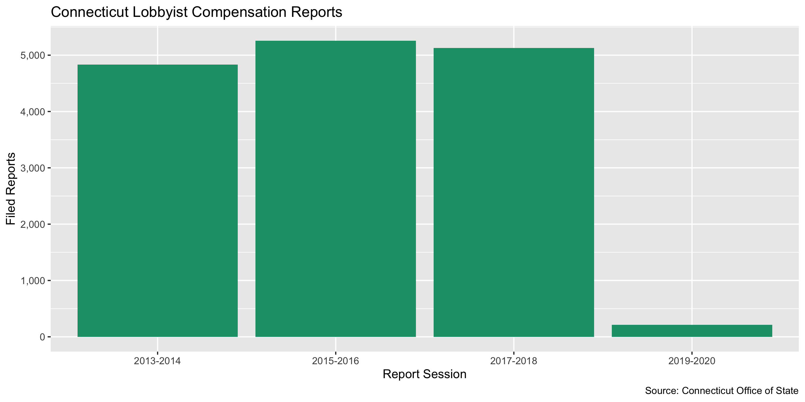

Connecticut Lobbying Compensation Data Diary
================
Yanqi Xu
2019-12-28 14:34:55

-   [Project](#project)
-   [Objectives](#objectives)
-   [Packages](#packages)
-   [Download](#download)
-   [Import](#import)
-   [Explore](#explore)
-   [Export](#export)

Project
-------

The Accountability Project is an effort to cut across data silos and give journalists, policy professionals, activists, and the public at large a simple way to search across huge volumes of public data about people and organizations.

Our goal is to standardizing public data on a few key fields by thinking of each dataset row as a transaction. For each transaction there should be (at least) 3 variables:

1.  All **parties** to a transaction
2.  The **date** of the transaction
3.  The **amount** of money involved

Objectives
----------

This document describes the process used to complete the following objectives:

1.  How many records are in the database?
2.  Check for duplicates
3.  Check ranges
4.  Is there anything blank or missing?
5.  Check for consistency issues
6.  Create a five-digit ZIP Code called `ZIP5`
7.  Create a `YEAR` field from the transaction date
8.  Make sure there is data on both parties to a transaction

Packages
--------

The following packages are needed to collect, manipulate, visualize, analyze, and communicate these results. The `pacman` package will facilitate their installation and attachment.

``` r
if (!require("pacman")) install.packages("pacman")
pacman::p_load_current_gh("irworkshop/campfin")
pacman::p_load(
  rvest, # read html tables
  httr, # interact with http requests
  stringdist, # levenshtein value
  tidyverse, # data manipulation
  lubridate, # datetime strings
  tidytext, # string analysis
  magrittr, # pipe opperators
  janitor, # dataframe clean
  refinr, # cluster and merge
  knitr, # knit documents
  glue, # combine strings
  scales, #format strings
  here, # relative storage
  fs, # search storage 
  vroom, #read deliminated files
  readxl #read excel files
)
```

This document should be run as part of the `R_campfin` project, which lives as a sub-directory of the more general, language-agnostic \[`irworkshop/accountability_datacleaning`\]\[01\] GitHub repository.

The `R_campfin` project uses the \[RStudio projects\]\[02\] feature and should be run as such. The project also uses the dynamic `here::here()` tool for file paths relative to *your* machine.

Download
--------

Set the download directory first.

``` r
# create a directory for the raw data
raw_dir <- here("ct", "lobby", "data", "raw","exp")

dir_create(raw_dir)
```

According to [CT Office of State Ethics](https://www.oseapps.ct.gov/NewLobbyist/PublicReports/LobbyistFAQ.aspx),

> Lobbying in Connecticut is defined as "communicating directly or soliciting others to communicate with any official or his or her staff in the legislative or executive branch of government or in a quasi-public agency, for the purpose of influencing any legislative or administrative action."

Lobbyist terms:
&gt; A Client Lobbyist is the party paying for lobbying services on its behalf. In other words, the client lobbyist is expending or agreeing to expend the threshold amount of $3,000 in a calendar year. A Communicator Lobbyist receives payment and does the actual lobbying legwork (i.e., communicating or soliciting others to communicate).
&gt; A Communicator Lobbyist receives or agrees to receive $3,000 for lobbying activities in a calendar year. A communicator lobbyist can be:
1. An individual; or 2. A member of a Business Organization (e.g., a firm or association that is owned by or employs a number of lobbyists), Conn. Gen. Stat. § 1-91 (t); or 3. An In-house Communicator (a lobbyist who is a salaried employee of a client lobbyist).

Registration and Filing Specifics:

> Individuals or entities are required by law to register as a lobbyist with the Office of State Ethics (OSE) if they:
> 1. Expend or agree to expend $3,000 or more in a calendar year in lobbying; OR 2. Receive or agree to receive $3,000 or more in a calendar year in lobbying. Once the $3,000 threshold is met, registration with the OSE is required. Registration occurs biennially (every two years) by January 15, or prior to the commencement of lobbying, whichever is later.

Client Lobbyists:
&gt; Client lobbyists file quarterly financial reports, with the third and fourth quarters combined. These reports are filed between the 1st and 10th days of April, July and January.
2. To ensure timely transparency, if a client lobbyist spends or agrees to spend more than $100 in legislative lobbying while the Legislature is in regular session, that lobbyist must file monthly financial reports.
3. The quarterly and monthly reports gather information such as compensation, sales tax and money expended in connection with lobbying; expenditures benefiting a public official or his/her staff or immediate family; all other lobbying expenditures; and the fundamental terms of any lobbying contract or agreement.

Communicator Lobbyists:

    > Communicator lobbyists also register upon meeting the threshold amount. Communicator lobbyists generally file a financial report once a year, due by January 10. These reports capture compensation, reimbursements from the client lobbyist and sales tax for the previous year.  
    If a communicator lobbyist makes unreimbursed expenditures of $10 or more for the benefit of a public official, a member of his/her staff, or his/her immediate family, that lobbyist must also file on the client lobbyist’s schedule (either monthly or quarterly).

This Rmd file documents the data processing workflow for CT lobbying compensation only, whereas the registration data is wrangled in a separate data diary.

Import
------

To create a single clean data file of lobbyist compensation, we will merge the data tables of each year into a master data frame.

### Download

We'll download the `Communicator Detail Compensation` reports from [Office of State Ethics](https://www.oseapps.ct.gov/NewLobbyist/PublicReports/AdditionalReports.aspx#) =&gt; Additional Reports +&gt; Issue/Financial Reports, as they specify the payors (clients) and payees (lobbyists) in a single data frame. The data is separated by year.

We can download each TXT file to the `/ct/data/raw` directory.

    #> # A tibble: 4 x 4
    #>   path                                       type         size birth_time         
    #>   <chr>                                      <fct> <fs::bytes> <dttm>             
    #> 1 /ct/lobby/data/raw/exp/lobby_comp_2013.csv file       533.7K 2019-12-23 13:08:09
    #> 2 /ct/lobby/data/raw/exp/lobby_comp_2015.csv file         581K 2019-12-23 12:51:37
    #> 3 /ct/lobby/data/raw/exp/lobby_comp_2017.csv file       569.2K 2019-12-23 12:51:15
    #> 4 /ct/lobby/data/raw/exp/lobby_comp_2019.csv file        22.5K 2019-12-23 12:32:21

### Read

We will remove the commas and dollar signs in currency expressions.

``` r
ctlc <- map_dfr(
  .x = dir_ls(raw_dir),
  .f = read_csv,
  .id = "source_file",
  col_types = cols(
    .default = col_character()
      ))

ctlc <- clean_names(ctlc)

ctlc <- ctlc %>% mutate_if(.predicate = str_detect(.,"\\$"),
                           .funs = ~str_remove_all(.,"\\$|,"))

ctlc[5:8] <-  ctlc[5:8] %>% map(as.numeric)
```

Explore
-------

``` r
head(ctlc)
#> # A tibble: 6 x 8
#>   source_file              communicator  client   selected_type comp_amt sales_tax exp_reimb  total
#>   <chr>                    <chr>         <chr>    <chr>            <dbl>     <dbl>     <dbl>  <dbl>
#> 1 /Users/soc/accountabili… 3D Consultin… Eversou… Administrati…        0         0         0      0
#> 2 /Users/soc/accountabili… 3D Consultin… Eversou… Legislative     240000         0       750 240750
#> 3 /Users/soc/accountabili… 3D Consultin… Eversou… ClientTotal     240000         0       750 240750
#> 4 /Users/soc/accountabili… Aaron Cheever Advance… Administrati…        0         0         0      0
#> 5 /Users/soc/accountabili… Aaron Cheever Advance… Legislative          0         0         0      0
#> 6 /Users/soc/accountabili… Aaron Cheever Advance… ClientTotal          0         0         0      0
tail(ctlc)
#> # A tibble: 6 x 8
#>   source_file               communicator client    selected_type comp_amt sales_tax exp_reimb total
#>   <chr>                     <chr>        <chr>     <chr>            <dbl>     <dbl>     <dbl> <dbl>
#> 1 /Users/soc/accountabilit… Ward Law LLC Estate o… Administrati…       0          0       0      0 
#> 2 /Users/soc/accountabilit… Ward Law LLC Estate o… Legislative         0          0       0      0 
#> 3 /Users/soc/accountabilit… Ward Law LLC Estate o… ClientTotal         0          0       0      0 
#> 4 /Users/soc/accountabilit… Wendy Simmo… CT Voice… Administrati…     643.         0       0    643.
#> 5 /Users/soc/accountabilit… Wendy Simmo… CT Voice… Legislative      2490.         0      22.6 2513.
#> 6 /Users/soc/accountabilit… Wendy Simmo… CT Voice… ClientTotal      3133.         0      22.6 3155.
glimpse(sample_frac(ctlc))
#> Observations: 15,436
#> Variables: 8
#> $ source_file   <chr> "/Users/soc/accountability/accountability_datacleaning/R_campfin/ct/lobby/…
#> $ communicator  <chr> "Lorelei Mottese", "Halloran & Sage Government Affairs, LLC", "Cassandra H…
#> $ client        <chr> "Wakefern Food Corporation", "CT Society of Plastic and Reconstructive Sur…
#> $ selected_type <chr> "Administrative", "ClientTotal", "Administrative", "Legislative", "Adminis…
#> $ comp_amt      <dbl> 0.00, 14000.00, 1939.00, 8116.36, 94029.24, 0.00, 18910.30, 180000.00, 182…
#> $ sales_tax     <dbl> 0.00, 0.00, 0.00, 0.00, 5970.84, 0.00, 0.00, 11430.01, 1337.23, 0.00, 0.00…
#> $ exp_reimb     <dbl> 0.00, 0.00, 0.00, 2066.79, 0.00, 0.00, 1171.60, 0.00, 500.00, 561.83, 250.…
#> $ total         <dbl> 0.00, 14000.00, 1939.00, 10183.15, 100000.08, 0.00, 20081.90, 191430.01, 2…
```

``` r
ctlc <- distinct(ctlc)
```

### Session

The original data doesn't contain fields indicative of time. We'll use the file name to identify the legislative sessions they correspond to by creating a variable `session`.

``` r
ctlc <- ctlc %>% mutate(session = str_extract(source_file, "\\d{4}")) %>% 
                          mutate(session = case_when(session == "2013" ~ "2013-2014",
                            session == "2015" ~ "2015-2016",
                             session == "2017" ~ "2017-2018",
                             session == "2019" ~ "2019-2020")) %>% 
        select(-source_file)
```

 We can use the data to find out who are the top spenders, and how their payment amounts are distributed. 

We'll need the ID information from the registration list that we previously processed. Note that the registration data is arranged by year and not session, so a session may include multiple `client-communicator` intances.Since duplicates will be joined multiple times to the actual compensation data frame, and thus we do not wish to introduce duplicates in this joined data frame. We will de-dupe the registration data for each year and prioritize years that have more comprehensive information than the other year of the same session. That is, we will create a column `na_count` counting the `NA` values of each row and only maintain the intance with a smaller `na_count` value.

``` r
reg_dir <- here("ct", "lobby", "data", "processed","reg")
ct_reg <- read_csv(glue("{reg_dir}/ct_lobby_reg.csv"),col_types = cols(.default = col_character()))

ct_reg <- ct_reg %>% 
  mutate(session = case_when(str_detect(client_year, "2013|2014") ~ "2013-2014",
                             str_detect(client_year, "2015|2016") ~ "2015-2016",
                             str_detect(client_year, "2017|2018") ~ "2017-2018",
                             str_detect(client_year, "2019|2020") ~ "2019-2020"))

ct_join <- ct_reg %>% 
  select(client_name,client_year, lobbyist_first_name,lobbyist_last_name,lobbyist_year, session,client_phone,client_city_clean,client_email, client_zip, client_state, lobbyist_city_clean, lobbyist_address_norm, lobbyist_state, lobbyist_zip, lobbyist_email) %>% 
  # we can safely de-dupe the rows where only the lobbyist_year is different from one another 
  flag_dupes(-c(lobbyist_year)) %>% 
  filter(!dupe_flag)

ct_count <- ct_join %>% count(client_name, lobbyist_first_name, lobbyist_last_name, session) %>% arrange(desc(n))
  #count(client_name, lobbyist_first_name, lobbyist_last_name, )
```

Our goal is to reduce the number of rows in the `ct_reg` table to 11811, which is the total number of ct\_reg tows (each row represents a distinct relationship between a client and a lobbyist for a session).

``` r
ct_join <- ct_join %>% 
  add_count(client_name, lobbyist_first_name, lobbyist_last_name, session)
#the ct_dedupe dataframe contains twice as many rows as the difference between nrow(ct_join) and nrow(ct_count)
ct_dupe <- ct_join %>% filter(n==2) %>% 
  mutate(row_sum = rowSums(is.na(.)))

ct_dedupe <- ct_dupe %>% group_split(client_name, lobbyist_first_name, lobbyist_last_name, session)


for (i in seq_along(ct_dedupe)){
ct_dedupe[[i]] <- ct_dedupe[[i]] %>% 
  mutate(early_more_info = ct_dedupe[[i]]$row_sum[1] - ct_dedupe[[i]]$row_sum[2] < 0 ) 
  if (ct_dedupe[[i]]$early_more_info[1]) {
  ct_dedupe[[i]] <- ct_dedupe[[i]][1,]
  }
  else{
  ct_dedupe[[i]] <- ct_dedupe[[i]][2,]
  }
}

ct_deduped <- ct_dedupe %>% plyr::ldply() %>% select(-c(row_sum,early_more_info,n))

ct_join<- ct_join %>% filter(n != 2) %>% 
  unite(remove = T, col = "communicator", lobbyist_first_name, lobbyist_last_name,sep = ",") %>% 
  rename(client = client_name)
```

``` r
ctlc <- ctlc %>% 
  left_join(ct_join, by = c("client", "communicator", "session")) 
         
sample_frac(ctlc)
#> # A tibble: 15,434 x 22
#>    communicator client selected_type comp_amt sales_tax exp_reimb  total session client_year
#>    <chr>        <chr>  <chr>            <dbl>     <dbl>     <dbl>  <dbl> <chr>   <chr>      
#>  1 Jennifer Wi… CT Co… Administrati…    2831.        0       193. 3.02e3 2013-2… <NA>       
#>  2 Sullivan & … Lyft,… Legislative     19200      1219.      375  2.08e4 2013-2… <NA>       
#>  3 Edwin Durso  ESPN,… Administrati…    9505.        0         0  9.50e3 2013-2… <NA>       
#>  4 Barry Fadem  Natio… Legislative         0         0     15496. 1.55e4 2013-2… <NA>       
#>  5 Gaffney, Be… Bridg… ClientTotal     33507.     2128.        0  3.56e4 2017-2… <NA>       
#>  6 Gaffney, Be… Wine … ClientTotal    240000     15240         0  2.55e5 2013-2… <NA>       
#>  7 Connecticut… Conne… ClientTotal    256132.    16264.     5766. 2.78e5 2015-2… <NA>       
#>  8 Lorelei Mot… Wakef… Administrati…       0         0         0  0.     2015-2… <NA>       
#>  9 Gloria Dimon Conne… Legislative      1718.        0         0  1.72e3 2015-2… <NA>       
#> 10 Brown Rudni… Boehr… ClientTotal    125000      7938.      500  1.33e5 2013-2… <NA>       
#> # … with 15,424 more rows, and 13 more variables: lobbyist_year <chr>, client_phone <chr>,
#> #   client_city_clean <chr>, client_email <chr>, client_zip <chr>, client_state <chr>,
#> #   lobbyist_city_clean <chr>, lobbyist_address_norm <chr>, lobbyist_state <chr>,
#> #   lobbyist_zip <chr>, lobbyist_email <chr>, dupe_flag <lgl>, n <int>
```

Export
------

``` r
clean_dir <- here("ct", "lobby", "data", "processed","exp")
dir_create(clean_dir)
ctlc %>% 
  select(-dupe_flag) %>% 
  mutate_if(is.character, str_to_upper) %>% 
  write_csv(
    path = glue("{clean_dir}/ct_lobby_exp.csv"),
    na = ""
  )
```
