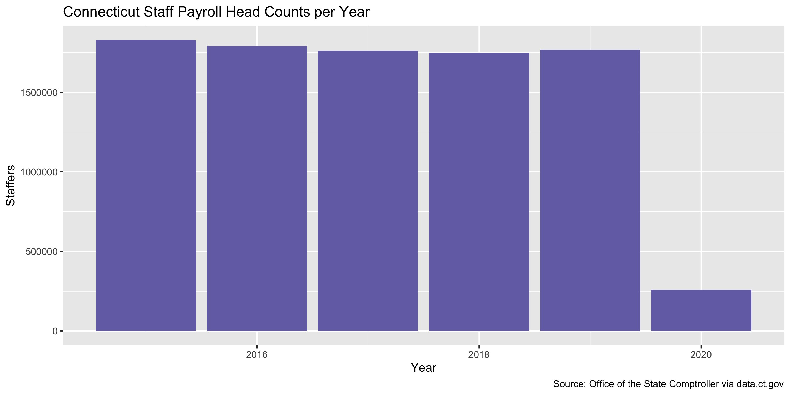
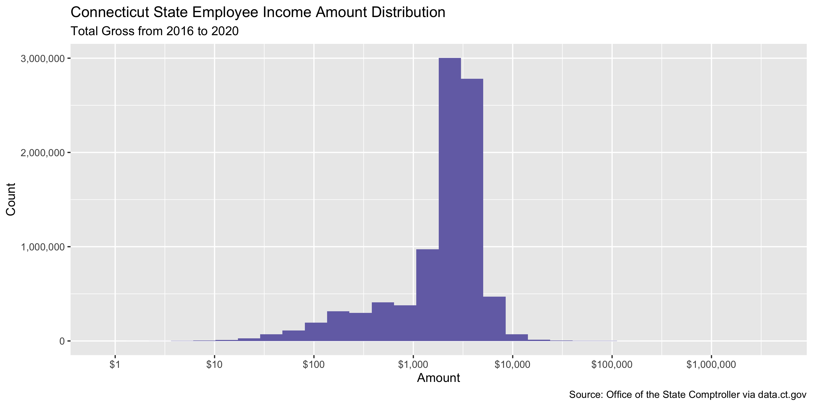
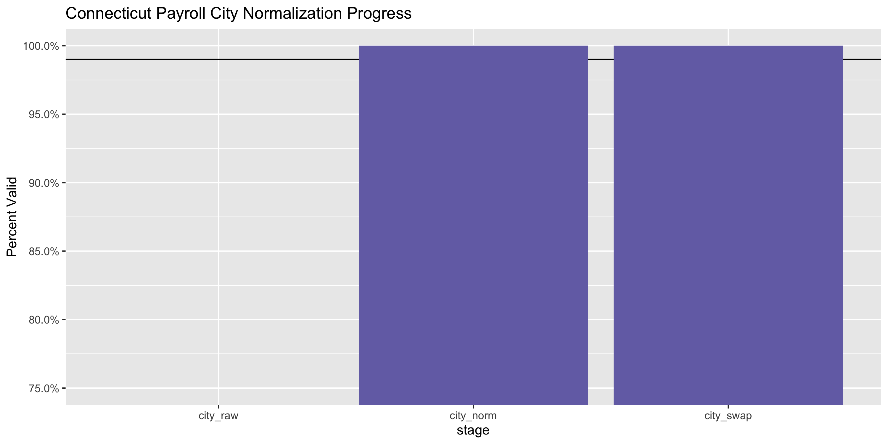
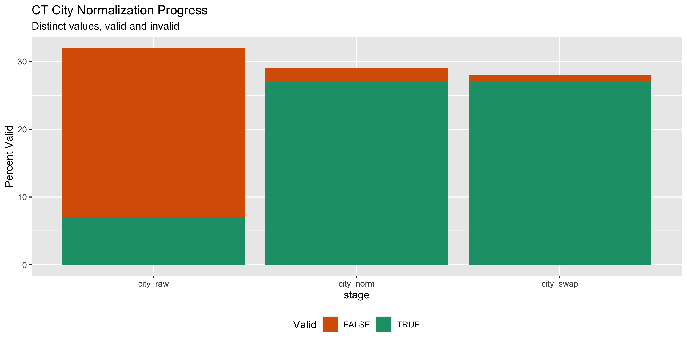

Connecticut Payroll Data Diary
================
Yanqi Xu
2020-04-02 09:28:57

<!-- Place comments regarding knitting here -->

## Project

The Accountability Project is an effort to cut across data silos and
give journalists, policy professionals, activists, and the public at
large a simple way to search across huge volumes of public data about
people and organizations.

Our goal is to standardizing public data on a few key fields by thinking
of each dataset row as a transaction. For each transaction there should
be (at least) 3 variables:

1.  All **parties** to a transaction
2.  The **date** of the transaction
3.  The **amount** of money involved

## Objectives

This document describes the process used to complete the following
objectives:

1.  How many records are in the database?
2.  Check for duplicates
3.  Check ranges
4.  Is there anything blank or missing?
5.  Check for consistency issues
6.  Create a five-digit ZIP Code called `ZIP5`
7.  Create a `YEAR` field from the transaction date
8.  Make sure there is data on both parties to a transaction

## Packages

The following packages are needed to collect, manipulate, visualize,
analyze, and communicate these results. The `pacman` package will
facilitate their installation and attachment.

The IRW’s `campfin` package will also have to be installed from GitHub.
This package contains functions custom made to help facilitate the
processing of campaign finance data.

``` r
if (!require("pacman")) install.packages("pacman")
pacman::p_load_gh("irworkshop/campfin")
pacman::p_load(
  readxl, # read excel files
  tidyverse, # data manipulation
  lubridate, # datetime strings
  gluedown, # printing markdown
  magrittr, # pipe opperators
  janitor, # dataframe clean
  refinr, # cluster and merge
  scales, # format strings
  knitr, # knit documents
  vroom, # read files fast
  glue, # combine strings
  here, # relative storage
  fs # search storage 
)
```

This document should be run as part of the `R_campfin` project, which
lives as a sub-directory of the more general, language-agnostic
[`irworkshop/accountability_datacleaning`](https://github.com/irworkshop/accountability_datacleaning "TAP repo")
GitHub repository.

The `R_campfin` project uses the [RStudio
projects](https://support.rstudio.com/hc/en-us/articles/200526207-Using-Projects "Rproj")
feature and should be run as such. The project also uses the dynamic
`here::here()` tool for file paths relative to *your* machine.

``` r
# where does this document knit?
here::here()
#> [1] "/Users/yanqixu/code/accountability_datacleaning/R_campfin"
```

## Data

Data is obtained from the [State of Connecitut’s data
portal](https://data.ct.gov/Government/State-Employee-Payroll-Data-Calendar-Year-2015-thr/virr-yb6n).
According to the website, the data was created September 21, 2016 and
Last Updated on February 19, 2020. It comes from the Office of the State
Comptroller and is updated annually.

> Payroll Data, including Calendar Year 2015 through the most recent pay
> period. Data used in the Open Payroll application

``` r
raw_dir <- dir_create(here("ct", "payroll", "data", "raw"))
data_dir <- here("ct", "payroll", "data")
```

### Download

``` r
ctp_url <- "https://data.ct.gov/api/views/virr-yb6n/rows.csv?accessType=DOWNLOAD"
wget <- function(url, dir) {
  system2(
    command = "wget",
    args = c(
      "--no-verbose", 
      "--content-disposition", 
      url, 
      paste("-P", raw_dir)
    )
  )
}

if (!all_files_new(raw_dir)) {
  wget(ctp_url, raw_dir)
}
```

### Import

``` r
ctp <- dir_ls(raw_dir) %>% read_csv() 
# change column names into snake case, i.e. snake_case
ctp <- ctp %>% clean_names()
```

### Column Specs

Some of the date columns are read as plain text, which can be changed by
applying `as.Date`.

``` r
ctp <- ctp %>% 
  mutate_at(.vars = vars(c(orig_hire, check_dt)), as.Date, format = "%m/%d/%Y")
```

### Explore

``` r
head(ctp)
#> # A tibble: 6 x 38
#>   pyrl_fiscal_yr calendar_year dept_id empl_id_empl_rcd first_name middle_initial last_name
#>            <dbl>         <dbl> <chr>   <chr>            <chr>      <chr>          <chr>    
#> 1           2018          2018 BOR855… DC242A8389843B2… Min        J.             Yoon     
#> 2           2018          2018 BOR850… B106F376C9E1D14… Edward     John           Roman    
#> 3           2018          2018 AES480… 3295631FC4E8257… Angela     B.             Bransfie…
#> 4           2018          2018 MHA555… 675BD72D3B9B8C1… Curran     M              McKenzie 
#> 5           2018          2018 BOR850… 01ECFBEC48B92AD… Jack       Paul           Gesino   
#> 6           2018          2018 DOC881… 3BBFC99309A859D… Jeffrey    H              Jones    
#> # … with 31 more variables: name_suffix <chr>, check_number <dbl>, check_dt <date>,
#> #   chk_option <chr>, chk_status <chr>, annnual_rate <dbl>, bi_weekly_comp_rate <dbl>,
#> #   other <dbl>, fringe <dbl>, overtime <dbl>, salaries_wages <dbl>, fringe_amt_no_retire <dbl>,
#> #   sers_amount <dbl>, arp_amount <dbl>, teachers_amount <dbl>, judges_amount <dbl>,
#> #   tot_gross <dbl>, age <dbl>, job_cd_descr <chr>, ee_class_descr <chr>, job_indicator <chr>,
#> #   ethnic_grp <chr>, sex <chr>, full_part <chr>, orig_hire <date>, term_date <dttm>, city <chr>,
#> #   postal <chr>, state <chr>, union_descr <chr>, agency <chr>
tail(ctp)
#> # A tibble: 6 x 38
#>   pyrl_fiscal_yr calendar_year dept_id empl_id_empl_rcd first_name middle_initial last_name
#>            <dbl>         <dbl> <chr>   <chr>            <chr>      <chr>          <chr>    
#> 1           2020          2020 CII470… 456DC65920CABAC… Patrick    Joseph         O'Neill  
#> 2           2020          2020 BOR855… 3F7CFA6E46042FF… Undisclos… Undisclosed    Undisclo…
#> 3           2020          2020 UOC010… B94CEC3D706DFB3… Nancy      M              Kuhn     
#> 4           2020          2020 MHA550… 3872FD463E22391… Yanitza    <NA>           Guzman   
#> 5           2020          2020 UOC010… 93029E0248822A2… Simran     <NA>           Khatri   
#> 6           2020          2020 BOR783… B66E282BA5335C3… Undisclos… Undisclosed    Undisclo…
#> # … with 31 more variables: name_suffix <chr>, check_number <dbl>, check_dt <date>,
#> #   chk_option <chr>, chk_status <chr>, annnual_rate <dbl>, bi_weekly_comp_rate <dbl>,
#> #   other <dbl>, fringe <dbl>, overtime <dbl>, salaries_wages <dbl>, fringe_amt_no_retire <dbl>,
#> #   sers_amount <dbl>, arp_amount <dbl>, teachers_amount <dbl>, judges_amount <dbl>,
#> #   tot_gross <dbl>, age <dbl>, job_cd_descr <chr>, ee_class_descr <chr>, job_indicator <chr>,
#> #   ethnic_grp <chr>, sex <chr>, full_part <chr>, orig_hire <date>, term_date <dttm>, city <chr>,
#> #   postal <chr>, state <chr>, union_descr <chr>, agency <chr>
glimpse(sample_frac(ctp))
#> Rows: 9,160,153
#> Columns: 38
#> $ pyrl_fiscal_yr       <dbl> 2015, 2017, 2020, 2016, 2017, 2018, 2017, 2015, 2019, 2018, 2017, 2…
#> $ calendar_year        <dbl> 2015, 2016, 2019, 2016, 2016, 2017, 2017, 2015, 2019, 2018, 2016, 2…
#> $ dept_id              <chr> "UOC67000", "MHA53350", "BOR84000", "DDS51000", "DOC88700", "APT595…
#> $ empl_id_empl_rcd     <chr> "6781AD80C016FE46CB54A96C1C84B938", "A923F7DDE9C53866237F16571564C1…
#> $ first_name           <chr> "Sridevi", "Maria", "Stephen", "Tina", "Linda", "Eric", "MariLynne"…
#> $ middle_initial       <chr> NA, "Elena", "P.", "P", "M", "W", NA, "C", "O.", NA, "Undisclosed",…
#> $ last_name            <chr> "Krishnan", "Shabazz", "Villanti", "Jordan", "Bailey", "Chapman", "…
#> $ name_suffix          <chr> NA, NA, NA, NA, NA, NA, NA, NA, NA, NA, "Undisclosed", NA, "Jr", NA…
#> $ check_number         <dbl> 42898320, 45418920, 50912969, 44625358, 45421297, 47653982, 4692951…
#> $ check_dt             <date> 2015-02-06, 2016-07-22, 2019-11-08, 2016-02-05, 2016-07-22, 2017-1…
#> $ chk_option           <chr> "A", "A", "A", "A", "A", "A", "A", "A", "A", "A", "A", "A", "A", "A…
#> $ chk_status           <chr> "F", "F", "F", "F", "F", "F", "F", "F", "F", "F", "F", "F", "F", "F…
#> $ annnual_rate         <dbl> 46269.297, 39465.027, 0.000, 85597.038, 46957.032, 60618.033, 58034…
#> $ bi_weekly_comp_rate  <dbl> 1772.77000, 1512.07000, 0.00000, 3279.58000, 1799.12000, 2322.53000…
#> $ other                <dbl> 0.00, 0.00, 0.00, 0.00, 339.93, 0.00, 0.00, 0.00, 0.00, 0.00, 0.00,…
#> $ fringe               <dbl> 709.10, 1240.86, 134.40, 2736.29, 3906.37, 1923.61, 1153.85, 3182.7…
#> $ overtime             <dbl> 0.00, 0.00, 0.00, 0.00, 2447.87, 15.49, 0.00, 0.00, 0.00, 0.00, 0.0…
#> $ salaries_wages       <dbl> 1772.77, 1512.07, 603.76, 3279.58, 1799.12, 2289.36, 2223.57, 4050.…
#> $ fringe_amt_no_retire <dbl> 709.10, 409.37, 46.19, 979.09, 698.28, 619.53, 888.57, 1137.33, 109…
#> $ sers_amount          <dbl> 0.00, 831.49, 0.00, 1757.20, 3208.09, 1304.08, 0.00, 2045.45, 896.9…
#> $ arp_amount           <dbl> 0.00, 0.00, 88.21, 0.00, 0.00, 0.00, 265.28, 0.00, 0.00, 0.00, 0.00…
#> $ teachers_amount      <dbl> 0, 0, 0, 0, 0, 0, 0, 0, 0, 0, 0, 0, 0, 0, 0, 0, 0, 0, 0, 0, 0, 0, 0…
#> $ judges_amount        <dbl> 0, 0, 0, 0, 0, 0, 0, 0, 0, 0, 0, 0, 0, 0, 0, 0, 0, 0, 0, 0, 0, 0, 0…
#> $ tot_gross            <dbl> 1772.77, 1512.07, 603.76, 3279.58, 4586.92, 2304.85, 2223.57, 4050.…
#> $ age                  <dbl> 38, 49, 57, 52, 46, 47, 56, 56, 27, 76, 27, 34, 59, 49, 62, 49, 71,…
#> $ job_cd_descr         <chr> "UConnFaculty/Staff", "Custodian", "SULecturer", "Fiscal/Administra…
#> $ ee_class_descr       <chr> "Permanent", "Permanent", "Contractual - University", "Permanent", …
#> $ job_indicator        <chr> "P", "P", "S", "P", "P", "P", "P", "P", "P", "P", "P", "P", "P", "P…
#> $ ethnic_grp           <chr> "ASIAN", "HISPA", "WHITE", "WHITE", "WHITE", "WHITE", "WHITE", "WHI…
#> $ sex                  <chr> "F", "F", "M", "F", "F", "M", "F", "M", "F", "M", "M", "F", "M", "F…
#> $ full_part            <chr> "F", "F", "P", "F", "F", "F", "F", "F", "P", "P", "P", "F", "F", "F…
#> $ orig_hire            <date> 2014-05-08, 2008-01-04, 1985-09-04, 1985-08-02, 2015-03-06, 2010-0…
#> $ term_date            <dttm> NA, NA, NA, NA, NA, NA, NA, NA, NA, NA, NA, NA, NA, NA, NA, NA, NA…
#> $ city                 <chr> NA, "Middletown", "New Britain", "East Hartford", "Wethersfield", "…
#> $ postal               <chr> NA, "06457", "06050", "06108", "06109", "06096", "06708", "06106", …
#> $ state                <chr> NA, "CT", "CT", "CT", "CT", "CT", "CT", "CT", "CT", "CT", "CT", "CT…
#> $ union_descr          <chr> "UConn - Exempt", "Service/Maintenance (NP-2)", "State University F…
#> $ agency               <chr> "University of Connecticut", "Mental Heath & Addiction Serv.", "CSU…
```

Then we can take a look at the *NA* fields and number of distinct values
for each column.

``` r
col_stats(ctp, count_na)
#> # A tibble: 38 x 4
#>    col                  class        n          p
#>    <chr>                <chr>    <int>      <dbl>
#>  1 pyrl_fiscal_yr       <dbl>        0 0         
#>  2 calendar_year        <dbl>        0 0         
#>  3 dept_id              <chr>        0 0         
#>  4 empl_id_empl_rcd     <chr>        0 0         
#>  5 first_name           <chr>       24 0.00000262
#>  6 middle_initial       <chr>  2426392 0.265     
#>  7 last_name            <chr>        0 0         
#>  8 name_suffix          <chr>  8231926 0.899     
#>  9 check_number         <dbl>        0 0         
#> 10 check_dt             <date>       0 0         
#> 11 chk_option           <chr>        0 0         
#> 12 chk_status           <chr>        0 0         
#> 13 annnual_rate         <dbl>        0 0         
#> 14 bi_weekly_comp_rate  <dbl>        0 0         
#> 15 other                <dbl>        0 0         
#> 16 fringe               <dbl>        0 0         
#> 17 overtime             <dbl>        0 0         
#> 18 salaries_wages       <dbl>        0 0         
#> 19 fringe_amt_no_retire <dbl>        0 0         
#> 20 sers_amount          <dbl>        0 0         
#> 21 arp_amount           <dbl>        0 0         
#> 22 teachers_amount      <dbl>        0 0         
#> 23 judges_amount        <dbl>        0 0         
#> 24 tot_gross            <dbl>        0 0         
#> 25 age                  <dbl>        0 0         
#> 26 job_cd_descr         <chr>        0 0         
#> 27 ee_class_descr       <chr>        0 0         
#> 28 job_indicator        <chr>        0 0         
#> 29 ethnic_grp           <chr>  1571982 0.172     
#> 30 sex                  <chr>        0 0         
#> 31 full_part            <chr>        0 0         
#> 32 orig_hire            <date>   32813 0.00358   
#> 33 term_date            <dttm> 9106533 0.994     
#> 34 city                 <chr>   512629 0.0560    
#> 35 postal               <chr>   512629 0.0560    
#> 36 state                <chr>   512629 0.0560    
#> 37 union_descr          <chr>        0 0         
#> 38 agency               <chr>       24 0.00000262
col_stats(ctp, n_distinct) 
#> # A tibble: 38 x 4
#>    col                  class        n           p
#>    <chr>                <chr>    <int>       <dbl>
#>  1 pyrl_fiscal_yr       <dbl>        6 0.000000655
#>  2 calendar_year        <dbl>        6 0.000000655
#>  3 dept_id              <chr>      495 0.0000540  
#>  4 empl_id_empl_rcd     <chr>   190865 0.0208     
#>  5 first_name           <chr>    18016 0.00197    
#>  6 middle_initial       <chr>     5236 0.000572   
#>  7 last_name            <chr>    45702 0.00499    
#>  8 name_suffix          <chr>        7 0.000000764
#>  9 check_number         <dbl>  9155798 1.00       
#> 10 check_dt             <date>     869 0.0000949  
#> 11 chk_option           <chr>        4 0.000000437
#> 12 chk_status           <chr>        2 0.000000218
#> 13 annnual_rate         <dbl>    51457 0.00562    
#> 14 bi_weekly_comp_rate  <dbl>    45721 0.00499    
#> 15 other                <dbl>   103494 0.0113     
#> 16 fringe               <dbl>   630129 0.0688     
#> 17 overtime             <dbl>   301730 0.0329     
#> 18 salaries_wages       <dbl>   345860 0.0378     
#> 19 fringe_amt_no_retire <dbl>   205606 0.0224     
#> 20 sers_amount          <dbl>   458948 0.0501     
#> 21 arp_amount           <dbl>    83040 0.00907    
#> 22 teachers_amount      <dbl>    12067 0.00132    
#> 23 judges_amount        <dbl>      481 0.0000525  
#> 24 tot_gross            <dbl>   625016 0.0682     
#> 25 age                  <dbl>       95 0.0000104  
#> 26 job_cd_descr         <chr>     3299 0.000360   
#> 27 ee_class_descr       <chr>       47 0.00000513 
#> 28 job_indicator        <chr>        3 0.000000328
#> 29 ethnic_grp           <chr>        9 0.000000983
#> 30 sex                  <chr>        3 0.000000328
#> 31 full_part            <chr>        2 0.000000218
#> 32 orig_hire            <date>    9461 0.00103    
#> 33 term_date            <dttm>    2162 0.000236   
#> 34 city                 <chr>       32 0.00000349 
#> 35 postal               <chr>      216 0.0000236  
#> 36 state                <chr>        2 0.000000218
#> 37 union_descr          <chr>       88 0.00000961 
#> 38 agency               <chr>       97 0.0000106
```

We’ll use the `campfin:na()` function to flag the records without any
names and title description

``` r
ctp <- ctp %>% 
  flag_na(first_name, agency)
```

#### Categorical

<!-- -->

#### Continuous

<!-- -->

### Wrangle

To improve the searchability of the database, we will perform some
consistent, confident string normalization. For geographic variables
like city names and ZIP codes, the corresponding `campfin::normal_*()`
functions are taylor made to facilitate this process.

### ZIP

For ZIP codes, the `campfin::normal_zip()` function will attempt to
create valied *five* digit codes by removing the ZIP+4 suffix and
returning leading zeroes dropped by other programs like Microsoft Excel.

``` r
prop_in(ctp$postal, valid_zip, na.rm = T)
#> [1] 0.7173352

ctp <- ctp %>% 
    mutate(zip5 = normal_zip(postal, na_rep = TRUE))
```

### State

Running the following code, we will find that the `state` column does
not need further normalization.

``` r
prop_in(ctp$state, valid_state, na.rm = T)
#> [1] 1
```

### City

Cities are the most difficult geographic variable to normalize, simply
due to the wide variety of valid cities and formats. \#\#\#\# Normal

The `campfin::normal_city()` function is a good ctpart, again converting
case, removing punctuation, but *expanding* USPS abbreviations. We can
also remove `invalid_city` values.

``` r
ctp <- ctp %>% 
      mutate(city_norm = normal_city(city,abbs = usps_city,
      states = usps_state,
      na = invalid_city,
      na_rep = TRUE))

prop_in(ctp$city_norm, valid_city, na.rm = T)
#> [1] 0.9999906
```

#### Swap

We can further improve normalization by comparing our normalized value
against the *expected* value for that record’s state abbreviation and
ZIP code. If the normalized value is either an abbreviation for or very
similar to the expected value, we can confidently swap those two.

``` r
ctp <- ctp %>% 
  rename(city_raw = city) %>% 
  left_join(
    y = zipcodes,
    by = c(
      "state" = "state",
      "zip5" = "zip"
    )
  ) %>% 
  rename(city_match = city) %>% 
  mutate(
    match_abb = is_abbrev(city_norm, city_match),
    match_dist = str_dist(city_norm, city_match),
    city_swap = if_else(
      condition = !is.na(match_dist) & match_abb | match_dist == 1,
      true = city_match,
      false = city_norm
    )
  ) %>% 
  select(
    -city_match,
    -match_dist,
    -match_abb
  )
```

After the two normalization steps, the percentage of valid cities is at
100%. \#\#\#\# Progress

| stage      | prop\_in | n\_distinct | prop\_na |  n\_out | n\_diff |
| :--------- | -------: | ----------: | -------: | ------: | ------: |
| city\_raw  |    0.132 |          32 |    0.056 | 7508076 |      25 |
| city\_norm |    1.000 |          29 |    0.056 |      81 |       2 |
| city\_swap |    1.000 |          28 |    0.056 |       0 |       1 |

You can see how the percentage of valid values increased with each
stage.

<!-- -->

More importantly, the number of distinct values decreased each stage. We
were able to confidently change many distinct invalid values to their
valid equivalent.

``` r
progress %>% 
  select(
    stage, 
    all = n_distinct,
    bad = n_diff
  ) %>% 
  mutate(good = all - bad) %>% 
  pivot_longer(c("good", "bad")) %>% 
  mutate(name = name == "good") %>% 
  ggplot(aes(x = stage, y = value)) +
  geom_col(aes(fill = name)) +
  scale_fill_brewer(palette = "Dark2", direction = -1) +
  scale_y_continuous(labels = comma) +
  theme(legend.position = "bottom") +
  labs(
    title = "CT City Normalization Progress",
    subtitle = "Distinct values, valid and invalid",
    x = "stage",
    y = "Percent Valid",
    fill = "Valid"
  )
```

<!-- -->

## Conclude

``` r
glimpse(sample_n(ctp, 20))
#> Rows: 20
#> Columns: 42
#> $ pyrl_fiscal_yr       <dbl> 2019, 2018, 2016, 2016, 2020, 2016, 2017, 2019, 2017, 2016, 2016, 2…
#> $ calendar_year        <dbl> 2019, 2017, 2015, 2015, 2019, 2015, 2017, 2019, 2017, 2015, 2016, 2…
#> $ dept_id              <chr> "BOR85000", "DDS51000", "DOC88650", "DSS60000", "DAS23000", "DCJ300…
#> $ empl_id_empl_rcd     <chr> "8A92338972E562A0D518387D9F29F1AE", "3982D93FC6F2E20E6AB5750A7FF810…
#> $ first_name           <chr> "Christian", "Tanikka", "Gregory", "Rachel", "Mark", "Peter", "Char…
#> $ middle_initial       <chr> "P", "D", NA, NA, "H", "M.", NA, "A.", "P.", "Undisclosed", "M", "T…
#> $ last_name            <chr> "Heidkamp", "Davis", "Earley", "Figueroa", "Jacques", "Stevens", "F…
#> $ name_suffix          <chr> NA, NA, NA, NA, NA, NA, NA, NA, NA, "Undisclosed", NA, NA, NA, NA, …
#> $ check_number         <dbl> 49997829, 47115309, 44290374, 43852322, 50662886, 43850384, 3684725…
#> $ check_dt             <date> 2019-04-26, 2017-08-04, 2015-11-27, 2015-09-04, 2019-09-13, 2015-0…
#> $ chk_option           <chr> "A", "A", "A", "A", "A", "A", "C", "A", "A", "A", "A", "A", "A", "A…
#> $ chk_status           <chr> "F", "F", "F", "F", "F", "F", "F", "F", "F", "F", "F", "F", "F", "F…
#> $ annnual_rate         <dbl> 87746.90, 20115.27, 84357.03, 60849.02, 104646.12, 71706.10, 151679…
#> $ bi_weekly_comp_rate  <dbl> 3361.950, 22.020, 3232.070, 2331.380, 4009.430, 2747.360, 5811.470,…
#> $ other                <dbl> 791.77, 16.50, 98.50, 0.00, 0.00, 0.00, 237.30, 0.00, 0.00, 0.00, 0…
#> $ fringe               <dbl> 3757.35, 972.53, 4133.01, 2185.95, 3101.11, 2050.89, 1863.64, 2358.…
#> $ overtime             <dbl> 0.00, 66.06, 863.76, 0.00, 0.00, 0.00, 31.78, 0.00, 0.00, 0.00, 0.0…
#> $ salaries_wages       <dbl> 3564.19, 627.57, 3232.07, 2142.53, 4009.44, 2747.36, 4746.00, 2215.…
#> $ fringe_amt_no_retire <dbl> 956.47, 458.83, 1511.13, 1037.98, 695.85, 578.85, 1265.34, 934.50, …
#> $ sers_amount          <dbl> 2800.88, 513.70, 2621.88, 1147.97, 2405.26, 1472.04, 0.00, 1424.37,…
#> $ arp_amount           <dbl> 0.00, 0.00, 0.00, 0.00, 0.00, 0.00, 598.30, 0.00, 0.00, 0.00, 0.00,…
#> $ teachers_amount      <dbl> 0, 0, 0, 0, 0, 0, 0, 0, 0, 0, 0, 0, 0, 0, 0, 0, 0, 0, 0, 0
#> $ judges_amount        <dbl> 0, 0, 0, 0, 0, 0, 0, 0, 0, 0, 0, 0, 0, 0, 0, 0, 0, 0, 0, 0
#> $ tot_gross            <dbl> 4355.96, 810.13, 4194.33, 2142.53, 4009.44, 2747.36, 5015.08, 2215.…
#> $ age                  <dbl> 48, 39, 50, 44, 58, 72, 56, 26, 67, 21, 47, 56, 62, 55, 57, 70, 56,…
#> $ job_cd_descr         <chr> "SUProfr(10Months)", "DevelopmentalServicesWorker1", "CorrectionalL…
#> $ ee_class_descr       <chr> "Tenured", "Permanent", "Permanent", "Permanent", "Permanent", "Per…
#> $ job_indicator        <chr> "P", "P", "P", "P", "P", "P", "P", "P", "P", "P", "P", "P", "P", "P…
#> $ ethnic_grp           <chr> "WHITE", "BLACK", "BLACK", "HISPA", "WHITE", "WHITE", "WHITE", "WHI…
#> $ sex                  <chr> "M", "F", "M", "F", "M", "M", "F", "F", "F", "U", "M", "F", "M", "F…
#> $ full_part            <chr> "F", "P", "F", "F", "F", "F", "F", "F", "F", "F", "F", "F", "F", "P…
#> $ orig_hire            <date> 2007-08-31, 2014-10-31, 1994-08-19, 2007-12-07, 1988-07-15, 1990-0…
#> $ term_date            <dttm> NA, NA, NA, NA, NA, NA, NA, NA, NA, NA, NA, NA, NA, NA, NA, NA, NA…
#> $ city_raw             <chr> "New Haven", "Cheshire", "Wethersfield", "Hartford", "Hartford", "R…
#> $ postal               <chr> "06515", "06410", "06109", "06105-3725", "06103", "06067", "0603440…
#> $ state                <chr> "CT", "CT", "CT", "CT", "CT", "CT", "CT", "CT", "CT", NA, "CT", "CT…
#> $ union_descr          <chr> "State University Faculty", "Health NonProfessional (NP-6)", "Corre…
#> $ agency               <chr> "CSU - Southern", "Department of Development Serv", "Dept. of Corre…
#> $ na_flag              <lgl> FALSE, FALSE, FALSE, FALSE, FALSE, FALSE, FALSE, FALSE, FALSE, FALS…
#> $ zip5                 <chr> "06515", "06410", "06109", "06105", "06103", "06067", "06034", "060…
#> $ city_norm            <chr> "NEW HAVEN", "CHESHIRE", "WETHERSFIELD", "HARTFORD", "HARTFORD", "R…
#> $ city_swap            <chr> "NEW HAVEN", "CHESHIRE", "WETHERSFIELD", "HARTFORD", "HARTFORD", "R…
```

1.  There are 9160153 records in the database.
2.  There are 0 duplicate records in the database.
3.  The range and distribution of `year` seems mostly reasonable except
    for a few entries.
4.  There are 48 records missing either recipient or date.
5.  Consistency in goegraphic data has been improved with
    `campfin::normal_*()`.

## Export

``` r
proc_dir <- dir_create(here("ct", "payroll", "data", "processed"))
```

``` r
write_csv(
  x = ctp %>% rename(city_clean = city_swap) %>% 
    select(-city_norm),
  path = path(proc_dir, "ct_payroll_clean.csv"),
  na = ""
)
```
