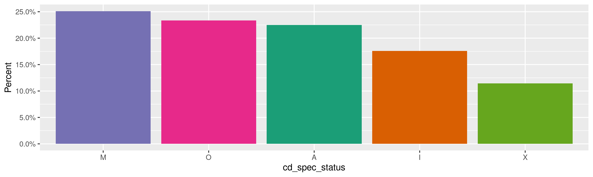
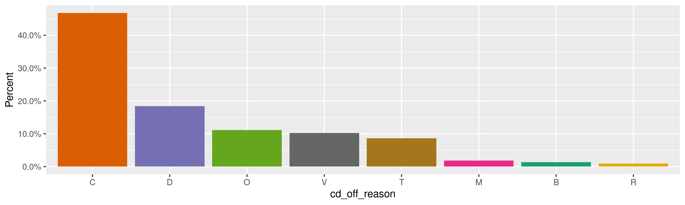
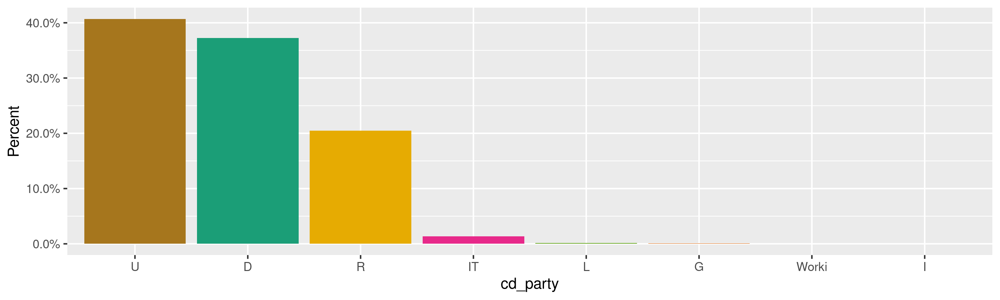
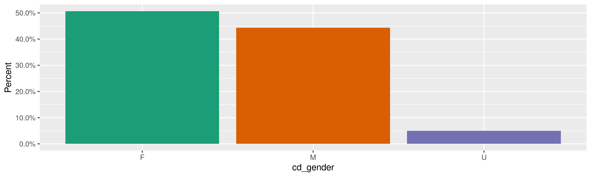
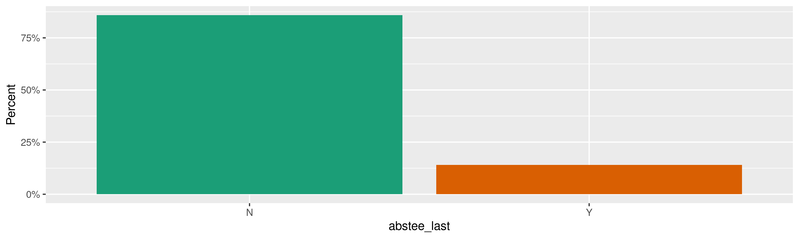
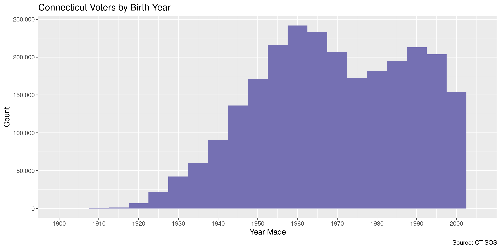
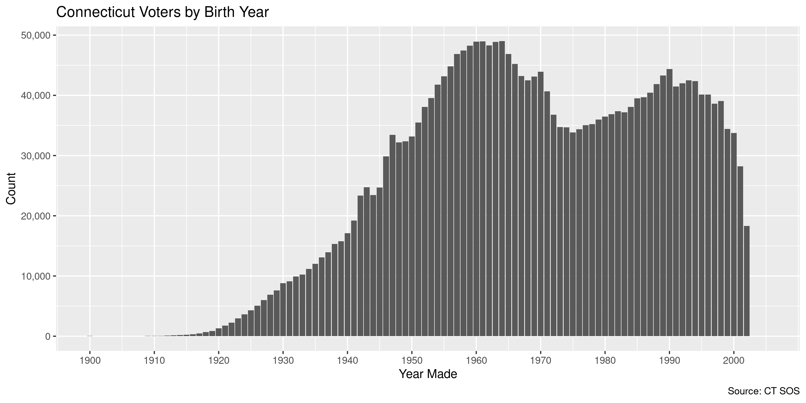

Connecticut Voters
================
Kiernan Nicholls
Mon Nov 16 16:42:07 2020

  - [Project](#project)
  - [Objectives](#objectives)
  - [Packages](#packages)
  - [Data](#data)
  - [Download](#download)
  - [About](#about)
      - [Contents](#contents)
      - [Codes](#codes)
      - [Towns](#towns)
      - [Columns](#columns)
  - [Read](#read)
      - [Old](#old)
      - [Join](#join)
      - [Trim](#trim)
  - [Explore](#explore)
      - [Missing](#missing)
      - [Duplicates](#duplicates)
      - [Categorical](#categorical)
      - [Dates](#dates)
  - [Wrangle](#wrangle)
      - [Address](#address)
      - [ZIP](#zip)
      - [State](#state)
      - [City](#city)
  - [Conclude](#conclude)
  - [Export](#export)
  - [Upload](#upload)
  - [Dictionary](#dictionary)

<!-- Place comments regarding knitting here -->

## Project

The Accountability Project is an effort to cut across data silos and
give journalists, policy professionals, activists, and the public at
large a simple way to search across huge volumes of public data about
people and organizations.

Our goal is to standardizing public data on a few key fields by thinking
of each dataset row as a transaction. For each transaction there should
be (at least) 3 variables:

1.  All **parties** to a transaction.
2.  The **date** of the transaction.
3.  The **amount** of money involved.

## Objectives

This document describes the process used to complete the following
objectives:

1.  How many records are in the database?
2.  Check for entirely duplicated records.
3.  Check ranges of continuous variables.
4.  Is there anything blank or missing?
5.  Check for consistency issues.
6.  Create a five-digit ZIP Code called `zip`.
7.  Create a `year` field from the transaction date.
8.  Make sure there is data on both parties to a transaction.

## Packages

The following packages are needed to collect, manipulate, visualize,
analyze, and communicate these results. The `pacman` package will
facilitate their installation and attachment.

The IRW’s `campfin` package will also have to be installed from GitHub.
This package contains functions custom made to help facilitate the
processing of campaign finance data.

``` r
if (!require("pacman")) install.packages("pacman")
pacman::p_load(
  tidyverse, # data manipulation
  lubridate, # datetime strings
  textreadr, # read doc files
  gluedown, # printing markdown
  janitor, # clean data frames
  campfin, # custom irw tools
  aws.s3, # aws cloud storage
  refinr, # cluster & merge
  scales, # format strings
  knitr, # knit documents
  vroom, # fast reading
  rvest, # scrape html
  glue, # code strings
  here, # project paths
  httr, # http requests
  fs # local storage 
)
```

This document should be run as part of the `R_campfin` project, which
lives as a sub-directory of the more general, language-agnostic
[`irworkshop/accountability_datacleaning`](https://github.com/irworkshop/accountability_datacleaning)
GitHub repository.

The `R_campfin` project uses the [RStudio
projects](https://support.rstudio.com/hc/en-us/articles/200526207-Using-Projects)
feature and should be run as such. The project also uses the dynamic
`here::here()` tool for file paths relative to *your* machine.

``` r
# where does this document knit?
here::dr_here(show_reason = FALSE)
```

## Data

The database of registered voters in Connecticut was obtained by
Secretary of State’s office for a fee of $300 and delivered on compact
disc.

> The Centralized Voter Registration System is utilized by all towns in
> Connecticut. It is the exclusive means by which a town produces an
> official voter registry list. The system includes information
> contained in voter registration applications, indicates whether
> eligible voters participated in past elections and primaries, and
> whether they voted in person or by absentee ballot. This election
> history information is required to be updated by all towns within 60
> days after each election or primary.

> The cost of the file is $300 and can be paid by check or credit card;
> cash is also accepted. We must receive payment before releasing the
> voter registry file. If you have any questions you can contact us by
> phone at 860-509-6100 or by email at <LEAD@ct.gov>.

## Download

The raw data from the disk can be downloaded from the Workshop’s AWS
server.

``` r
aws_info <- get_bucket_df(
  bucket = "publicaccountability", 
  prefix = "FOR_REVIEW/ct_voters"
)
```

    #> # A tibble: 10 x 3
    #>    path                                                                size modification_time  
    #>    <fs::path>                                                     <fs::byt> <dttm>             
    #>  1 FOR_REVIEW/ct_voters                                                   0 2020-11-04 17:35:48
    #>  2 FOR_REVIEW/ct_voters/OTHER_VOTER_CODES.doc                           23K 2020-11-04 17:35:38
    #>  3 FOR_REVIEW/ct_voters/PARTY_CODE.xlsx                              17.47K 2020-11-04 17:35:39
    #>  4 FOR_REVIEW/ct_voters/Secretary of State Voter Registration In…       19K 2020-11-04 17:35:39
    #>  5 FOR_REVIEW/ct_voters/VOTELCT1.ZIP                                 42.08M 2020-11-04 17:35:40
    #>  6 FOR_REVIEW/ct_voters/VOTELCT2.ZIP                                 66.32M 2020-11-04 17:35:41
    #>  7 FOR_REVIEW/ct_voters/VOTELCT3.ZIP                                 55.08M 2020-11-04 17:35:44
    #>  8 FOR_REVIEW/ct_voters/VOTELCT4.ZIP                                 67.62M 2020-11-04 17:35:46
    #>  9 FOR_REVIEW/ct_voters/elctext.txt                                   7.68K 2020-11-04 17:35:47
    #> 10 FOR_REVIEW/ct_voters/town.txt                                      7.96K 2020-11-04 17:35:47

``` r
raw_dir <- dir_create(here("ct", "voters", "data", "raw"))
```

We will save each object to a local directory.

``` r
for (key in aws_info$path[-1]) {
  p <- path(raw_dir, basename(key))
  if (!file_exists(p)) {
    save_object(
      object = key,
      bucket = "publicaccountability",
      file = p
    )
  }
}
```

``` r
raw_info <- dir_info(raw_dir)
sum(raw_info$size)
#> 900M
raw_info %>% 
  select(path, size, modification_time) %>% 
  mutate(across(path, path.abbrev))
#> # A tibble: 11 x 3
#>    path                                                                size modification_time  
#>    <chr>                                                          <fs::byt> <dttm>             
#>  1 ~/ct/voters/data/raw/OTHER_VOTER_CODES.doc                           23K 2020-11-11 10:02:05
#>  2 ~/ct/voters/data/raw/PARTY_CODE.xlsx                              17.47K 2020-11-11 10:02:05
#>  3 ~/ct/voters/data/raw/Secretary of State Voter Registration In…       19K 2020-11-11 10:02:05
#>  4 ~/ct/voters/data/raw/VOTELCT1                                         4K 2020-11-11 10:03:58
#>  5 ~/ct/voters/data/raw/VOTELCT1.ZIP                                 42.08M 2020-11-11 10:02:07
#>  6 ~/ct/voters/data/raw/VOTELCT2.ZIP                                 66.32M 2020-11-11 10:02:09
#>  7 ~/ct/voters/data/raw/VOTELCT3.ZIP                                 55.08M 2020-11-11 10:02:11
#>  8 ~/ct/voters/data/raw/VOTELCT4.ZIP                                 67.62M 2020-11-11 10:02:14
#>  9 ~/ct/voters/data/raw/ct_voters_old.csv                           668.49M 2020-11-16 12:16:03
#> 10 ~/ct/voters/data/raw/elctext.txt                                   7.68K 2020-11-11 10:02:14
#> 11 ~/ct/voters/data/raw/town.txt                                      7.96K 2020-11-11 10:02:14
```

## About

### Contents

The extract includes a Microsoft Word file describing the contents.

> The extract is broken into 4 zipped files. The towns are sequenced
> alphabetically with a corresponding id tax town code(001-169). The
> extract files both fixed length and comma delimited and are assembled
> as follows:

| File    |                             Towns |
| :------ | --------------------------------: |
| `FILE1` | Andover 001 thru East Hampton 042 |
| `FILE2` | East Hartford 043 thru Monroe 085 |
| `FILE3` |    Montville 086 thru Sherman 127 |
| `FILE4` |   Simsbury 128 thru Woodstock 169 |

### Codes

There’s also a file to provide code descriptions.

    #> # A tibble: 3 x 2
    #>   CD_STATUS_CODE CD_STATUS
    #>   <chr>          <chr>    
    #> 1 A              Active   
    #> 2 I              Inactive 
    #> 3 O              Off

    #> # A tibble: 12 x 2
    #>    CD_OFF_REASON CD_OFF_DESC              
    #>    <chr>         <chr>                    
    #>  1 F             Felon                    
    #>  2 D             Death                    
    #>  3 C             Move Out Of State        
    #>  4 V             Voter Cancel             
    #>  5 M             DMV                      
    #>  6 R             Notice-No Reply          
    #>  7 U             Duplicate                
    #>  8 O             Canvass - Moved Out      
    #>  9 T             CVR Returned by Voter    
    #> 10 E             ED-683 Return by Voter   
    #> 11 B             Inactive 4 Yrs           
    #> 12 I             Canvass - Inactive to Off

    #> # A tibble: 5 x 2
    #>   CD_SPEC_CODE CD_SPEC_STATUS                                 
    #>   <chr>        <chr>                                          
    #> 1 A            None –may be used for non displayable addresses
    #> 2 M            MILITARY                                       
    #> 3 I            INSTITUTION                                    
    #> 4 O            OVERSEAS                                       
    #> 5 X            OTHER

    #> # A tibble: 6 x 2
    #>   ELECT_TYPE_CODe ELECT_TYPE_DESC       
    #>   <chr>           <chr>                 
    #> 1 S               SPECIAL               
    #> 2 P               PRIMARY               
    #> 3 R               REFERENDUM            
    #> 4 E               GENERAL ELECTION      
    #> 5 D               DELEGATE CAUCAS       
    #> 6 T               TOWN COMMITTEE PRIMARY

    #> # A tibble: 2 x 2
    #>   ABSENTEE_FLAG ABSENTEE_DESC               
    #>   <chr>         <chr>                       
    #> 1 Y             VOTING USING ABSENTEE BALLOT
    #> 2 N             VOTING IN PERSON

### Towns

The `town.txt` file contains the town names and corresponding numeric
codes.

    #> # A tibble: 169 x 2
    #>    ID_TOWN NM_NAME     
    #>    <chr>   <chr>       
    #>  1 001     Andover     
    #>  2 002     Ansonia     
    #>  3 003     Ashford     
    #>  4 004     Avon        
    #>  5 005     Barkhamsted 
    #>  6 006     Beacon Falls
    #>  7 007     Berlin      
    #>  8 008     Bethany     
    #>  9 009     Bethel      
    #> 10 010     Bethlehem   
    #> # … with 159 more rows

### Columns

The `elctext.txt` file contains a layout key for the voter files.

> THIS FILE REPRESENTS THE RECORD LAYOUT FOR THE FOUR 4 FILE.  
> “PIC” IS THE LENGTH OF EACH FIELD.  
> “COMM\#” IS A COMMA USED TO DELIMIT EACH FIELD. THIS WILL HELP IN
> CREATE AN EXCEL SPREADSHEET.

The first 43 columns have unique descriptions.

``` r
raw_cols$column <- raw_cols$column %>% 
  make_clean_names(case = "snake") %>% 
  str_remove("ws_") %>% 
  str_remove("vtr_")

raw_cols %>% 
  mutate(across(column, md_code)) %>% 
  mutate(across(desc, str_to_sentence)) %>% 
  kable()
```

| column            | length | desc                                            |
| :---------------- | -----: | :---------------------------------------------- |
| `town_id`         |      3 | Town id                                         |
| `id_voter`        |      9 | Voter id                                        |
| `nm_last`         |     35 | Last name                                       |
| `nm_first`        |     20 | First name                                      |
| `nm_mid`          |     15 | Middle name                                     |
| `nm_prefix`       |      5 | Name prefix                                     |
| `nm_suff`         |      5 | Name suffix                                     |
| `cd_status`       |      1 | See other voter codes                           |
| `cd_spec_status`  |      1 | See other voter codes                           |
| `cd_off_reason`   |      1 | See other voter codes                           |
| `dist`            |      3 | State/fed voting district                       |
| `prec`            |      2 | State/fed voting precinct                       |
| `congress`        |      3 | State congress code                             |
| `senate`          |      3 | State senate code                               |
| `assembly`        |      3 | State assembly code                             |
| `poll_pl_name`    |     40 | State/fed poll place name                       |
| `loc_dist`        |      3 | Local voting district if applicable             |
| `loc_prec`        |      2 | Local voting precinct if applicable             |
| `spc_dist`        |      3 | Special voting district if applicable           |
| `spc_prec`        |      2 | Special voting precinct if applicable           |
| `ad_num`          |      6 | Address number                                  |
| `ad_unit`         |      8 | Address unit                                    |
| `nm_street`       |     40 | Street name                                     |
| `town_name`       |     18 | Town name                                       |
| `st`              |      2 | State                                           |
| `zip5`            |      5 | Zip5                                            |
| `zip4`            |      4 | Zip4                                            |
| `carrier`         |      4 | Carrier route number                            |
| `mail_num`        |      6 | Mail address number                             |
| `mail_unit`       |      8 | Mail address unit                               |
| `mail_str1`       |     40 | Mail street name                                |
| `mail_str2`       |     20 | Mail street name 2                              |
| `mail_city`       |     30 | Mail city                                       |
| `mail_st`         |      2 | Mail state                                      |
| `mail_country`    |     20 | Mail country                                    |
| `mail_zip`        |     10 | Mail zip                                        |
| `mail_carrier`    |      4 | Mail carrier route number                       |
| `dt_birth`        |     10 | Date of birth                                   |
| `phone`           |     10 | Phone number                                    |
| `cd_party`        |      5 | Party code see party codes spreadsheet          |
| `cd_party_unqual` |      5 | Unqualified parties see party codes spreadsheet |
| `cd_gender`       |      1 | Gender                                          |
| `dt_accept`       |     10 | Registation date                                |

The last 60 columns are the same 3 columns repeated *up to* 20 times.
Each group of 3 is the date of an election, the type of election, and
whether or not the voter voted absentee. The columns groups are ordered
with the most recent election to the first election in which that voter
participated.

We need to create column names and lengths for these 60 new columns. We
can add these to the descriptions of the other columns.

``` r
raw_cols <- bind_rows(
  raw_cols,
  tibble(
    column = paste(
      rep(c("date", "type", "abstee"), 20),
      rep(x = 1:20, each = 3), sep = "_elect"
    ),
    length = rep(c(10, 1, 1), length.out = length(column)),
    desc = ""
  )
)
```

## Read

Each file is both comma separated *and* fixed width. Fixed width files
are more complicated to read but can be read faster and more safely as
each column is at the same location for every row. This makes it worth
going through the effort to read the file as fixed width and *ignore*
the commas.

To build the column position specification needed by
`readr::read_fwf()`, we can use the column lengths provided in the
`elctext.txt` file. We have to shift the lengths of each column to
account for the commas between them.

``` r
col_length <- rep(list(c(NA, NA)), nrow(raw_cols))
for (i in seq_along(raw_cols$length)) {
  if (i == 1) {
    # col starting position
    col_length[[i]][1] <- 0
  } else {
    col_length[[i]][1] <- col_length[[i - 1]][2] + 1
  }
  # col ending position
  col_length[[i]][2] <- col_length[[i]][1] + raw_cols$length[i]
}
```

We can then separate the start and end positions of each column.

``` r
col_start <- vapply(col_length, `[[`, double(1), 1) + 1
col_end   <- vapply(col_length, `[[`, double(1), 2)
```

These numbers can be converted to the data frame expected by a fixed
width file.

``` r
raw_fwf <- fwf_positions(
  start = col_start,
  end = col_end,
  col_names = raw_cols$column
)
```

    #> # A tibble: 103 x 3
    #>    begin   end col_names     
    #>    <dbl> <dbl> <chr>         
    #>  1     0     3 town_id       
    #>  2     4    13 id_voter      
    #>  3    14    49 nm_last       
    #>  4    50    70 nm_first      
    #>  5    71    86 nm_mid        
    #>  6    87    92 nm_prefix     
    #>  7    93    98 nm_suff       
    #>  8    99   100 cd_status     
    #>  9   101   102 cd_spec_status
    #> 10   103   104 cd_off_reason 
    #> # … with 93 more rows

Each voter file is a compressed archive. We can extract them to a
temporary directory to facilitate the file reading.

``` r
raw_paths <- str_subset(raw_info$path, "ZIP$")
tmp_paths <- character()
for (i in seq_along(raw_paths)) {
  tmp <- unzip(raw_paths[i], exdir = tempdir(), junkpaths = TRUE)
  tmp_paths <- append(tmp_paths, tmp)
}
```

Then, all the raw temporary files can be read at once into a single data
frame.

``` r
ctv <- vroom_fwf(
  file = tmp_paths,
  col_positions = raw_fwf,
  col_types = cols(
    .default = col_character(),
    dt_birth = col_date_usa(),
    dt_accept = col_date_usa()
  )
)
```

``` r
comma(nrow(ctv))
#> [1] "2,442,877"
```

### Old

The same Connecticut voter registration data was previously requested in
the summer of 2019, similarly processed, and uploaded to the IRW server.

``` r
old_head <- head_object("csv/ct_voters.csv", "publicaccountability")
attr(old_head, "last-modified")
#> [1] "Thu, 27 Jun 2019 21:48:54 GMT"
```

We can downloaded that old file locally.

``` r
old_file <- path(raw_dir, "ct_voters_old.csv")
```

``` r
if (!file_exists(old_file)) {
  save_object(
    object = "csv/ct_voters.csv",
    bucket = "publicaccountability",
    file = old_file,
    show_progress = TRUE
  )
}
```

It can then be read into a data frame like the newer data.

``` r
cto <- vroom(
  file = old_file,
  delim = ",",
  col_select = 1:103,
  skip = 1,
  col_names = raw_cols$column,
  col_types = cols(
    .default = col_character(),
    dt_birth = col_date_usa(),
    dt_accept = col_date_usa()
  )
)
```

``` r
comma(nrow(cto))
#> [1] "1,991,498"
max(cto$dt_accept, na.rm = TRUE)
#> [1] "2019-01-16"
```

### Join

We want the most comprehensive voter roll possible, so we will keep any
voters found in the older data but *not* the newer data. We can use the
unique `id_voter` column to filter duplicates out.

``` r
cto <- filter(cto, id_voter %out% ctv$id_voter)
cto$cd_status <- "I"
ctv <- ctv %>% 
  bind_rows(cto, .id = "source_file") %>% 
  arrange(id_voter) %>% 
  relocate(source_file, .after = dt_accept)
```

``` r
comma(nrow(ctv))
#> [1] "2,552,211"
```

### Trim

I am going to remove all but the most recent election and convert the
voter history in a more readable format.

``` r
vote_hist <- select(ctv, id_voter, 45:103)
ctv <- select(
  .data = ctv, 1:44,
  dt_last = date_elect1,
  cd_last = type_elect1,
  abstee_last = abstee_elect1
)
```

``` r
hist_file <- path(dirname(raw_dir), "voter_history.tsv.xz")
```

Instead of 60 columns in groups of 3 per voter, we can create 20 rows of
3 columns, removing any empty rows in which they did not vote.

``` r
if (!file_exists(hist_file)) {
  vote_hist <- pivot_longer(
    data = vote_hist,
    cols = !id_voter,
    names_to = c(".value", "elect"),
    names_sep = "_",
    values_drop_na = TRUE
  )
}
```

``` r
if (!file_exists(hist_file)) {
  vote_hist <- mutate(
    .data = vote_hist,
    elect = as.integer(str_remove_all(elect, "\\D")),
    date = mdy(date),
    abstee = (abstee == "Y")
  )
}
```

This separate voter file can be written and compressed.

``` r
if (!file_exists(hist_file)) {
  vroom_write(vote_hist, xzfile(hist_file))
}
```

``` r
file_size(hist_file)
#> 31.8M
```

## Explore

There are 2,552,211 rows of 47 columns. Each row is a single voter
registered in Connecticut.

``` r
glimpse(ctv)
#> Rows: 2,552,211
#> Columns: 47
#> $ town_id         <chr> "030", "030", "030", "030", "132", "078", "030", "030", "030", "030"…
#> $ id_voter        <chr> "000000001", "000000002", "000000003", "000000004", "000000006", "00…
#> $ nm_last         <chr> "Santos", "Santos", "Marshall", "Buckland", "Myers", "Abell", "Giuli…
#> $ nm_first        <chr> "James", "Shaune", "S", "Raymond", "Donna", "Lori", "Teresa", "Charl…
#> $ nm_mid          <chr> "A", "D", "Brenda", NA, "L", "Ann", NA, "K", "R", "A", NA, "F", "Car…
#> $ nm_prefix       <chr> "Mr", "Mr", "Ms", "Mr", NA, NA, "Mrs", "Mr", "Mr", "Mr", "Ms", "Mr",…
#> $ nm_suff         <chr> NA, NA, NA, NA, NA, NA, NA, NA, NA, "Jr.", NA, NA, NA, NA, NA, NA, N…
#> $ cd_status       <chr> "A", "A", "A", "A", "A", "A", "A", "I", "A", "A", "A", "A", "A", "A"…
#> $ cd_spec_status  <chr> NA, NA, NA, NA, NA, NA, NA, NA, NA, NA, NA, NA, NA, NA, NA, NA, NA, …
#> $ cd_off_reason   <chr> NA, NA, NA, NA, NA, NA, NA, NA, NA, NA, NA, NA, NA, NA, NA, NA, NA, …
#> $ dist            <chr> "001", "001", "001", "001", "003", "003", "001", "001", "001", "001"…
#> $ prec            <chr> "00", "00", "00", "00", "00", "00", "00", "00", "00", "00", "00", "0…
#> $ congress        <chr> "002", "002", "002", "002", "001", "002", "002", "002", "002", "002"…
#> $ senate          <chr> "019", "019", "019", "019", "003", "029", "019", "019", "019", "019"…
#> $ assembly        <chr> "008", "008", "008", "008", "014", "054", "008", "008", "008", "008"…
#> $ poll_pl_name    <chr> "Horace W Porter School", "Horace W Porter School", "Horace W Porter…
#> $ loc_dist        <chr> NA, NA, NA, NA, NA, NA, NA, NA, NA, NA, NA, NA, NA, NA, NA, "007", N…
#> $ loc_prec        <chr> NA, NA, NA, NA, NA, NA, NA, NA, NA, NA, NA, NA, NA, NA, NA, "00", NA…
#> $ spc_dist        <chr> NA, NA, NA, NA, NA, NA, NA, NA, NA, NA, NA, NA, NA, NA, NA, "002", N…
#> $ spc_prec        <chr> NA, NA, NA, NA, NA, NA, NA, NA, NA, NA, NA, NA, NA, NA, NA, "00", NA…
#> $ ad_num          <chr> "216", "216", "321", "61", "307", "29", "34", "72", "19", "7", "14",…
#> $ ad_unit         <chr> NA, NA, NA, NA, NA, NA, NA, NA, NA, NA, NA, NA, NA, NA, NA, "38", NA…
#> $ nm_street       <chr> "Route 87", "Route 87", "Route 66", "Doubleday Road", "Twin Circle D…
#> $ town_name       <chr> "Columbia", "Columbia", "Columbia", "Columbia", "South Windsor", "Ma…
#> $ st              <chr> "CT", "CT", "CT", "CT", "CT", "CT", "CT", "CT", "CT", "CT", "CT", "C…
#> $ zip5            <chr> "06237", "06237", "06237", "06237", "06074", "06250", "06237", "0623…
#> $ zip4            <chr> "1051", "1051", "1529", "1400", "2697", "1109", "1328", "1405", "150…
#> $ carrier         <chr> "R001", "R001", "R004", "R003", "R006", "R022", "R004", "R003", "R00…
#> $ mail_num        <chr> NA, NA, NA, NA, "307", NA, NA, NA, NA, NA, "14", "14", NA, NA, NA, N…
#> $ mail_unit       <chr> NA, NA, NA, NA, NA, NA, NA, NA, NA, NA, NA, NA, NA, NA, NA, NA, NA, …
#> $ mail_str1       <chr> NA, NA, NA, NA, "Twin Circle Drive", NA, NA, NA, NA, NA, "Cards Mill…
#> $ mail_str2       <chr> NA, NA, NA, NA, NA, NA, NA, NA, NA, NA, "PO Box 373", "PO Box 373", …
#> $ mail_city       <chr> NA, NA, NA, NA, "South Windsor", NA, NA, NA, NA, NA, "Willimantic", …
#> $ mail_st         <chr> NA, NA, NA, NA, "CT", NA, NA, NA, NA, NA, "CT", "CT", NA, NA, NA, NA…
#> $ mail_country    <chr> NA, NA, NA, NA, "United States", NA, NA, NA, NA, NA, NA, NA, NA, NA,…
#> $ mail_zip        <chr> NA, NA, NA, NA, "06074", NA, NA, NA, NA, NA, "06226", "06226", NA, N…
#> $ mail_carrier    <chr> NA, NA, NA, NA, "R006", NA, NA, NA, NA, NA, NA, NA, NA, NA, NA, NA, …
#> $ dt_birth        <date> 1960-08-01, 1961-01-13, 1961-09-20, 1952-06-17, 1951-06-29, 1963-06…
#> $ phone           <chr> "8602283538", "8602283538", "8602283872", "8602281846", "8606484461"…
#> $ cd_party        <chr> "U", "U", "D", "D", "D", "U", "U", "R", "U", "U", "D", "R", "D", "D"…
#> $ cd_party_unqual <chr> NA, NA, NA, NA, NA, NA, NA, NA, NA, NA, NA, NA, NA, NA, NA, NA, NA, …
#> $ cd_gender       <chr> "M", "M", "F", "M", "F", "F", "F", "M", "M", "M", "F", "M", "F", "M"…
#> $ dt_accept       <date> 1988-10-31, 1988-10-31, 1990-12-03, 1990-12-11, 2003-06-09, 2008-08…
#> $ source_file     <chr> "1", "1", "1", "1", "1", "1", "1", "2", "1", "1", "1", "1", "1", "1"…
#> $ dt_last         <chr> "11/06/2018", "11/06/2018", "11/06/2018", "08/11/2020", "08/11/2020"…
#> $ cd_last         <chr> "E", "E", "E", "P", "P", "E", "E", "E", "E", "E", "E", "E", "E", "E"…
#> $ abstee_last     <chr> "N", "N", "N", "Y", "Y", "N", "N", "N", "N", "N", "N", "N", "N", "N"…
tail(ctv)
#> # A tibble: 6 x 47
#>   town_id id_voter nm_last nm_first nm_mid nm_prefix nm_suff cd_status cd_spec_status
#>   <chr>   <chr>    <chr>   <chr>    <chr>  <chr>     <chr>   <chr>     <chr>         
#> 1 103     9999991… Lawren… Sharon   <NA>   <NA>      <NA>    A         <NA>          
#> 2 135     9999991… Weiss   Stella   M      <NA>      <NA>    I         <NA>          
#> 3 103     9999991… Levy    David    A      <NA>      <NA>    A         <NA>          
#> 4 103     9999991… Skidmo… Trish    A      <NA>      <NA>    A         <NA>          
#> 5 103     9999991… Caviola Richard  J      <NA>      <NA>    A         <NA>          
#> 6 135     9999991… Marcan… Roy      <NA>   <NA>      <NA>    A         <NA>          
#> # … with 38 more variables: cd_off_reason <chr>, dist <chr>, prec <chr>, congress <chr>,
#> #   senate <chr>, assembly <chr>, poll_pl_name <chr>, loc_dist <chr>, loc_prec <chr>,
#> #   spc_dist <chr>, spc_prec <chr>, ad_num <chr>, ad_unit <chr>, nm_street <chr>,
#> #   town_name <chr>, st <chr>, zip5 <chr>, zip4 <chr>, carrier <chr>, mail_num <chr>,
#> #   mail_unit <chr>, mail_str1 <chr>, mail_str2 <chr>, mail_city <chr>, mail_st <chr>,
#> #   mail_country <chr>, mail_zip <chr>, mail_carrier <chr>, dt_birth <date>, phone <chr>,
#> #   cd_party <chr>, cd_party_unqual <chr>, cd_gender <chr>, dt_accept <date>,
#> #   source_file <chr>, dt_last <chr>, cd_last <chr>, abstee_last <chr>
```

### Missing

Columns vary in their degree of missing values.

``` r
col_stats(ctv, count_na)
#> # A tibble: 47 x 4
#>    col             class        n        p
#>    <chr>           <chr>    <int>    <dbl>
#>  1 town_id         <chr>        0 0       
#>  2 id_voter        <chr>        0 0       
#>  3 nm_last         <chr>        0 0       
#>  4 nm_first        <chr>        0 0       
#>  5 nm_mid          <chr>   511156 0.200   
#>  6 nm_prefix       <chr>  2169451 0.850   
#>  7 nm_suff         <chr>  2437982 0.955   
#>  8 cd_status       <chr>        0 0       
#>  9 cd_spec_status  <chr>  2538475 0.995   
#> 10 cd_off_reason   <chr>  2551771 1.00    
#> 11 dist            <chr>        0 0       
#> 12 prec            <chr>        0 0       
#> 13 congress        <chr>        0 0       
#> 14 senate          <chr>        0 0       
#> 15 assembly        <chr>        0 0       
#> 16 poll_pl_name    <chr>        0 0       
#> 17 loc_dist        <chr>  1407705 0.552   
#> 18 loc_prec        <chr>  1407705 0.552   
#> 19 spc_dist        <chr>  2325848 0.911   
#> 20 spc_prec        <chr>  2325848 0.911   
#> 21 ad_num          <chr>     5273 0.00207 
#> 22 ad_unit         <chr>  2151061 0.843   
#> 23 nm_street       <chr>     2235 0.000876
#> 24 town_name       <chr>     2235 0.000876
#> 25 st              <chr>     2235 0.000876
#> 26 zip5            <chr>     2843 0.00111 
#> 27 zip4            <chr>    13496 0.00529 
#> 28 carrier         <chr>    58304 0.0228  
#> 29 mail_num        <chr>  2411211 0.945   
#> 30 mail_unit       <chr>  2530832 0.992   
#> 31 mail_str1       <chr>  2355832 0.923   
#> 32 mail_str2       <chr>  2533496 0.993   
#> 33 mail_city       <chr>  2355775 0.923   
#> 34 mail_st         <chr>  2359129 0.924   
#> 35 mail_country    <chr>  2416967 0.947   
#> 36 mail_zip        <chr>  2356353 0.923   
#> 37 mail_carrier    <chr>  2426640 0.951   
#> 38 dt_birth        <date>    2235 0.000876
#> 39 phone           <chr>  1005974 0.394   
#> 40 cd_party        <chr>        0 0       
#> 41 cd_party_unqual <chr>  2544200 0.997   
#> 42 cd_gender       <chr>        0 0       
#> 43 dt_accept       <date>       0 0       
#> 44 source_file     <chr>        0 0       
#> 45 dt_last         <chr>   461867 0.181   
#> 46 cd_last         <chr>   461867 0.181   
#> 47 abstee_last     <chr>   462627 0.181
```

We can flag any record missing a key variable needed to identify a
transaction.

``` r
key_vars <- c("nm_last", "dt_birth", "dt_accept")
ctv <- flag_na(ctv, all_of(key_vars))
sum(ctv$na_flag)
#> [1] 2235
```

``` r
ctv %>% 
  filter(na_flag) %>% 
  select(all_of(key_vars))
#> # A tibble: 2,235 x 3
#>    nm_last  dt_birth   dt_accept 
#>    <chr>    <date>     <date>    
#>  1 Clark    NA         1987-03-04
#>  2 Cassens  NA         1988-08-17
#>  3 Gould    NA         1996-08-28
#>  4 Gould    NA         1996-08-28
#>  5 Hallden  NA         2012-05-01
#>  6 Mc Keon  NA         1956-10-13
#>  7 Hilliker NA         1988-10-24
#>  8 Montros  NA         1996-07-03
#>  9 Morris   NA         1971-09-01
#> 10 Lefebvre NA         1990-05-15
#> # … with 2,225 more rows
```

All these records are missing a voter birth date.

``` r
ctv %>% 
  filter(na_flag) %>% 
  select(all_of(key_vars)) %>% 
  col_stats(count_na)
#> # A tibble: 3 x 4
#>   col       class      n     p
#>   <chr>     <chr>  <int> <dbl>
#> 1 nm_last   <chr>      0     0
#> 2 dt_birth  <date>  2235     1
#> 3 dt_accept <date>     0     0
```

### Duplicates

We can also flag any record completely duplicated across every column.

``` r
dupe_file <- here("ct", "voters", "dupes.csv.xz")
```

``` r
if (!file_exists(dupe_file)) {
  file_create(dupe_file)
  cts <- ctv %>% 
    select(-id_voter) %>% 
    group_split(town_id)
  split_id <- split(ctv$id_voter, ctv$town_id)
  pb <- txtProgressBar(max = length(cts), style = 3)
  for (i in seq_along(cts)) {
    d1 <- duplicated(cts[[i]], fromLast = FALSE)
    if (any(d1)) {
      d2 <- duplicated(cts[[i]], fromLast = TRUE)
      dupes <- tibble(id_voter = split_id[[i]], dupe_flag = d1 | d2)
      dupes <- filter(dupes, dupe_flag == TRUE)
      vroom_write(dupes, xzfile(dupe_file), append = TRUE)
      rm(d2, dupes)
    }
    rm(d1)
    flush_memory(1)
    setTxtProgressBar(pb, i)
  }
  rm(cts)
}
```

``` r
file_size(dupe_file)
#> 2.54K
dupes <- read_tsv(
  file = xzfile(dupe_file),
  col_names = c("id_voter", "dupe_flag"),
  col_types = cols(
    id_voter = col_character(),
    dupe_flag = col_logical()
  )
)
dupes <- distinct(dupes)
```

``` r
nrow(ctv)
#> [1] 2552211
ctv <- left_join(ctv, dupes, by = "id_voter")
ctv <- mutate(ctv, dupe_flag = !is.na(dupe_flag))
sum(ctv$dupe_flag)
#> [1] 104
```

We can see that, despite unique IDs, there are duplicate voters.

``` r
ctv %>% 
  filter(dupe_flag) %>% 
  select(id_voter, all_of(key_vars), town_name) %>% 
  arrange(nm_last)
#> # A tibble: 104 x 5
#>    id_voter  nm_last dt_birth   dt_accept  town_name 
#>    <chr>     <chr>   <date>     <date>     <chr>     
#>  1 005186873 Abrams  1952-12-08 2020-09-06 Brooklyn  
#>  2 005186874 Abrams  1952-12-08 2020-09-06 Brooklyn  
#>  3 005123988 Angle   2001-12-21 2020-03-03 Brooklyn  
#>  4 005123994 Angle   2001-12-21 2020-03-03 Brooklyn  
#>  5 005191714 Arevalo 1986-05-18 2020-09-11 Bridgeport
#>  6 005191727 Arevalo 1986-05-18 2020-09-11 Bridgeport
#>  7 005165329 Barker  2000-02-18 2020-08-13 New Canaan
#>  8 005165330 Barker  2000-02-18 2020-08-13 New Canaan
#>  9 005161329 Barton  1952-04-05 2020-08-04 Putnam    
#> 10 005161331 Barton  1952-04-05 2020-08-04 Putnam    
#> # … with 94 more rows
```

### Categorical

``` r
col_stats(ctv, n_distinct)
#> # A tibble: 49 x 4
#>    col             class        n           p
#>    <chr>           <chr>    <int>       <dbl>
#>  1 town_id         <chr>      169 0.0000662  
#>  2 id_voter        <chr>  2552211 1          
#>  3 nm_last         <chr>   258340 0.101      
#>  4 nm_first        <chr>   123587 0.0484     
#>  5 nm_mid          <chr>    64206 0.0252     
#>  6 nm_prefix       <chr>      244 0.0000956  
#>  7 nm_suff         <chr>      121 0.0000474  
#>  8 cd_status       <chr>        2 0.000000784
#>  9 cd_spec_status  <chr>        6 0.00000235 
#> 10 cd_off_reason   <chr>       11 0.00000431 
#> 11 dist            <chr>       68 0.0000266  
#> 12 prec            <chr>       26 0.0000102  
#> 13 congress        <chr>        5 0.00000196 
#> 14 senate          <chr>       36 0.0000141  
#> 15 assembly        <chr>      151 0.0000592  
#> 16 poll_pl_name    <chr>      739 0.000290   
#> 17 loc_dist        <chr>       69 0.0000270  
#> 18 loc_prec        <chr>       17 0.00000666 
#> 19 spc_dist        <chr>       17 0.00000666 
#> 20 spc_prec        <chr>        3 0.00000118 
#> 21 ad_num          <chr>    12873 0.00504    
#> 22 ad_unit         <chr>    26288 0.0103     
#> 23 nm_street       <chr>    31953 0.0125     
#> 24 town_name       <chr>      903 0.000354   
#> 25 st              <chr>        2 0.000000784
#> 26 zip5            <chr>      718 0.000281   
#> 27 zip4            <chr>     8854 0.00347    
#> 28 carrier         <chr>      160 0.0000627  
#> 29 mail_num        <chr>     5744 0.00225    
#> 30 mail_unit       <chr>     5959 0.00233    
#> 31 mail_str1       <chr>    53451 0.0209     
#> 32 mail_str2       <chr>    10005 0.00392    
#> 33 mail_city       <chr>     5374 0.00211    
#> 34 mail_st         <chr>       62 0.0000243  
#> 35 mail_country    <chr>      133 0.0000521  
#> 36 mail_zip        <chr>    74604 0.0292     
#> 37 mail_carrier    <chr>      331 0.000130   
#> 38 dt_birth        <date>   32346 0.0127     
#> 39 phone           <chr>  1226713 0.481      
#> 40 cd_party        <chr>       34 0.0000133  
#> 41 cd_party_unqual <chr>      318 0.000125   
#> 42 cd_gender       <chr>        3 0.00000118 
#> 43 dt_accept       <date>   21541 0.00844    
#> 44 source_file     <chr>        2 0.000000784
#> 45 dt_last         <chr>     1268 0.000497   
#> 46 cd_last         <chr>        7 0.00000274 
#> 47 abstee_last     <chr>        3 0.00000118 
#> 48 na_flag         <lgl>        2 0.000000784
#> 49 dupe_flag       <lgl>        2 0.000000784
```

<!-- --><!-- --><!-- --><!-- --><!-- --><!-- --><!-- --><!-- --><!-- -->

### Dates

It looks like January 1st, 1800 is the default year for voters missing a
birth date. We can remove these values.

``` r
count(ctv, dt_accept, sort = TRUE)
#> # A tibble: 21,541 x 2
#>    dt_accept       n
#>    <date>      <int>
#>  1 1800-01-01 136318
#>  2 2016-11-08  25634
#>  3 2016-11-01  17805
#>  4 2018-11-06  15964
#>  5 1980-01-01  11446
#>  6 1992-10-20  11419
#>  7 2008-10-28   8786
#>  8 1990-01-01   8155
#>  9 2014-11-04   7568
#> 10 2018-10-30   7306
#> # … with 21,531 more rows
ctv$dt_accept[ctv$dt_accept == "1800-01-01"] <- NA
```

We can add the year registered from `dt_accept` with
`lubridate::year()`.

``` r
ctv <- mutate(
  .data = ctv, 
  yr_accept = year(dt_accept),
  yr_birth = year(dt_birth)
)
```

``` r
min(ctv$dt_accept, na.rm = TRUE)
#> [1] "1918-01-01"
max(ctv$dt_accept, na.rm = TRUE)
#> [1] "2020-09-27"
```

<!-- -->

<!-- -->

<!-- -->

## Wrangle

To improve the searchability of the database, we will perform some
consistent, confident string normalization. For geographic variables
like city names and ZIP codes, the corresponding `campfin::normal_*()`
functions are tailor made to facilitate this process.

### Address

For the street `addresss` variable, the `campfin::normal_address()`
function will force consistence case, remove punctuation, and abbreviate
official USPS suffixes.

``` r
addr_norm_full <- ctv %>% 
  select(ad_num, nm_street, ad_unit) %>% 
  distinct() %>% 
  unite(
    col = ad_full,
    everything(),
    sep = " ",
    remove = FALSE,
    na.rm = TRUE
  ) %>% 
  mutate(
    ad_norm = normal_address(
      address = ad_full,
      abbs = usps_street,
      na_rep = TRUE
    )
  ) %>% 
  select(-ad_full)
```

``` r
ctv <- left_join(ctv, addr_norm_full)
```

``` r
ctv %>% 
  sample_n(10) %>% 
  select(ad_num, nm_street, ad_unit, ad_norm)
#> # A tibble: 10 x 4
#>    ad_num nm_street          ad_unit ad_norm           
#>    <chr>  <chr>              <chr>   <chr>             
#>  1 55     Milici Circle      <NA>    55 MILICI CIR     
#>  2 16     Hurlburt Street    <NA>    16 HURLBURT ST    
#>  3 27     Perry Avenue       B       27 PERRY AVE B    
#>  4 18     Apple Street       1       18 APPLE ST 1     
#>  5 115    Putting Green Road <NA>    115 PUTTING GRN RD
#>  6 78     Jarvis Court       <NA>    78 JARVIS CT      
#>  7 16     Casco Street       <NA>    16 CASCO ST       
#>  8 113    Rockwell Avenue    <NA>    113 ROCKWELL AVE  
#>  9 319    Rimmon Road        <NA>    319 RIMMON RD     
#> 10 4      Brittania Drive    <NA>    4 BRITTANIA DR
```

### ZIP

The data has separate `zip5` and `zip4` columns, so we only need to
remove a handful of invalid “00000” ZIP codes to normalize the data.

``` r
ctv <- mutate(ctv, zip_norm = na_if(zip5, "00000"))
```

``` r
progress_table(
  ctv$zip5,
  ctv$zip_norm,
  compare = valid_zip
)
#> # A tibble: 2 x 6
#>   stage    prop_in n_distinct prop_na n_out n_diff
#>   <chr>      <dbl>      <dbl>   <dbl> <dbl>  <dbl>
#> 1 zip5       0.993        718 0.00111 16589    240
#> 2 zip_norm   1.00         717 0.00749   326    239
```

### State

The `st` variable does not need to be normalized.

``` r
prop_in(ctv$st, valid_state)
#> [1] 1
```

### City

Similarly, the `town_name` column only needs to be converted to
uppercase.

``` r
ctv <- mutate(ctv, town_norm = str_to_upper(town_name))
prop_in(ctv$town_norm, valid_city)
#> [1] 0.9912776
```

## Conclude

Before exporting, we can remove the intermediary normalization columns
and rename all added variables with the `_clean` suffix.

``` r
ctv <- ctv %>% 
  rename_all(~str_replace(., "_norm", "_clean")) %>% 
  relocate(town_clean, .after = ad_clean)
```

``` r
glimpse(sample_n(ctv, 50))
#> Rows: 50
#> Columns: 54
#> $ town_id         <chr> "130", "101", "156", "146", "169", "047", "036", "155", "034", "093"…
#> $ id_voter        <chr> "004456717", "003077635", "003242612", "004175228", "001584914", "00…
#> $ nm_last         <chr> "McLaughlan", "Lawlor", "Melendez", "Brocuglio", "Parks", "Sirois", …
#> $ nm_first        <chr> "James", "Kevin", "Jason", "Cynthia", "Francis", "Jessica", "Laura",…
#> $ nm_mid          <chr> "R", "D.", "Christopher", "Marie", NA, "L", "L", "S", "Joel", NA, "J…
#> $ nm_prefix       <chr> "Mr", "Mr.", "Mr", NA, "Mr", "Ms", NA, NA, NA, "Mr", NA, NA, NA, NA,…
#> $ nm_suff         <chr> NA, NA, NA, NA, NA, NA, NA, NA, NA, NA, NA, "Jr", NA, NA, NA, NA, "J…
#> $ cd_status       <chr> "A", "A", "A", "A", "A", "A", "A", "A", "A", "I", "I", "A", "A", "A"…
#> $ cd_spec_status  <chr> NA, NA, NA, NA, NA, NA, NA, NA, NA, NA, NA, NA, NA, NA, NA, NA, NA, …
#> $ cd_off_reason   <chr> NA, NA, NA, NA, NA, NA, NA, NA, NA, NA, NA, NA, NA, NA, NA, NA, NA, …
#> $ dist            <chr> "002", "003", "007", "002", "001", "001", "001", "004", "007", "017"…
#> $ prec            <chr> "00", "00", "00", "00", "00", "02", "00", "00", "38", "00", "00", "0…
#> $ congress        <chr> "005", "003", "003", "002", "002", "001", "002", "001", "005", "003"…
#> $ senate          <chr> "032", "034", "010", "035", "035", "003", "033", "005", "024", "011"…
#> $ assembly        <chr> "069", "087", "116", "056", "050", "059", "036", "020", "138", "097"…
#> $ poll_pl_name    <chr> "Southbury Public Library District #2", "Ridge Road Elementary Schoo…
#> $ loc_dist        <chr> "006", NA, "007", NA, NA, "001", NA, NA, "007", "014", NA, NA, NA, N…
#> $ loc_prec        <chr> "00", NA, "00", NA, NA, "00", NA, NA, "00", "00", NA, NA, NA, NA, NA…
#> $ spc_dist        <chr> NA, NA, "002", NA, NA, NA, NA, NA, NA, NA, NA, NA, NA, NA, NA, NA, N…
#> $ spc_prec        <chr> NA, NA, "00", NA, NA, NA, NA, NA, NA, NA, NA, NA, NA, NA, NA, NA, NA…
#> $ ad_num          <chr> "527C", "126", "72", "17", "28", "32", "155", "15", "46", "191", "58…
#> $ ad_unit         <chr> NA, NA, NA, "89", NA, "B", NA, NA, NA, NA, NA, NA, NA, NA, "5", NA, …
#> $ nm_street       <chr> "Heritage Condo 13", "Buell Street", "Ormond Street", "Regan Road", …
#> $ town_name       <chr> "Southbury", "North Haven", "West Haven", "Vernon", "Woodstock", "Ea…
#> $ st              <chr> "CT", "CT", "CT", "CT", "CT", "CT", "CT", "CT", "CT", "CT", "CT", "C…
#> $ zip5            <chr> "06488", "06473", "06516", "06066", "06281", "06088", "06417", "0611…
#> $ zip4            <chr> "6501", "4313", "2335", "2819", "1719", "9673", "2117", "1032", "534…
#> $ carrier         <chr> "C004", "C015", "C028", "C024", "R002", "R024", "C003", "C023", "C00…
#> $ mail_num        <chr> NA, NA, NA, NA, NA, NA, NA, NA, NA, NA, NA, NA, NA, NA, NA, NA, NA, …
#> $ mail_unit       <chr> NA, NA, NA, NA, NA, NA, NA, NA, NA, NA, NA, NA, NA, NA, NA, NA, NA, …
#> $ mail_str1       <chr> NA, NA, NA, NA, NA, NA, "PO Box 899", NA, NA, NA, NA, NA, "P O Box 1…
#> $ mail_str2       <chr> NA, NA, NA, NA, NA, NA, NA, NA, NA, NA, NA, NA, NA, NA, NA, NA, NA, …
#> $ mail_city       <chr> NA, NA, NA, NA, NA, NA, "Deep River", NA, NA, NA, NA, NA, "Chester",…
#> $ mail_st         <chr> NA, NA, NA, NA, NA, NA, "CT", NA, NA, NA, NA, NA, "CT", NA, NA, NA, …
#> $ mail_country    <chr> NA, NA, NA, NA, NA, NA, "United States", NA, NA, NA, NA, NA, "United…
#> $ mail_zip        <chr> NA, NA, NA, NA, NA, NA, "06417-0899", NA, NA, NA, NA, NA, "06412-019…
#> $ mail_carrier    <chr> NA, NA, NA, NA, NA, NA, "B004", NA, NA, NA, NA, NA, "B002", NA, NA, …
#> $ dt_birth        <date> 1958-12-31, 1968-08-22, 1983-06-06, 1993-08-25, 1956-09-09, 1988-01…
#> $ phone           <chr> "2034051956", NA, "2036234016", NA, "8609639547", NA, "8605264308", …
#> $ cd_party        <chr> "U", "D", "D", "U", "D", "U", "U", "L", "U", "D", "U", "U", "D", "U"…
#> $ cd_party_unqual <chr> NA, NA, NA, NA, NA, NA, NA, NA, NA, NA, NA, NA, NA, NA, NA, NA, NA, …
#> $ cd_gender       <chr> "M", "M", "M", "F", "U", "F", "F", "M", "M", "M", "F", "M", "F", "F"…
#> $ dt_accept       <date> 2014-11-17, 2008-07-03, 2009-09-04, 2017-08-10, 2005-07-11, 2018-10…
#> $ source_file     <chr> "1", "1", "1", "1", "1", "1", "1", "1", "1", "1", "1", "1", "1", "1"…
#> $ dt_last         <chr> "11/06/2018", "08/11/2020", "11/07/2017", NA, "08/11/2020", NA, "11/…
#> $ cd_last         <chr> "E", "P", "E", NA, "P", NA, "E", "E", NA, "E", "E", "E", "E", "E", "…
#> $ abstee_last     <chr> "N", "N", "Y", NA, "Y", NA, "N", "N", NA, "N", "N", "N", "N", "N", "…
#> $ na_flag         <lgl> FALSE, FALSE, FALSE, FALSE, FALSE, FALSE, FALSE, FALSE, FALSE, FALSE…
#> $ dupe_flag       <lgl> FALSE, FALSE, FALSE, FALSE, FALSE, FALSE, FALSE, FALSE, FALSE, FALSE…
#> $ yr_accept       <dbl> 2014, 2008, 2009, 2017, 2005, 2018, 2000, 2008, 2018, 2002, 1999, 20…
#> $ yr_birth        <dbl> 1958, 1968, 1983, 1993, 1956, 1988, 1939, 1967, 1997, 1963, 1950, 19…
#> $ ad_clean        <chr> "527 C HERITAGE CONDO 13", "126 BUELL ST", "72 ORMOND ST", "17 REGAN…
#> $ town_clean      <chr> "SOUTHBURY", "NORTH HAVEN", "WEST HAVEN", "VERNON", "WOODSTOCK", "EA…
#> $ zip_clean       <chr> "06488", "06473", "06516", "06066", "06281", "06088", "06417", "0611…
```

1.  There are 2,552,211 records in the database.
2.  There are 104 duplicate records in the database.
3.  The range and distribution of `amount` and `date` seem reasonable.
4.  There are 2,235 records missing key variables.
5.  Consistency in geographic data has been improved with
    `campfin::normal_*()`.
6.  The 4-digit `year` variable has been created with
    `lubridate::year()`.

## Export

Now the file can be saved on disk for upload to the Accountability
server.

``` r
clean_dir <- dir_create(here("ct", "voters", "data", "clean"))
clean_path <- path(clean_dir, "ct_voters_clean.csv")
vroom_write(ctv, clean_path, delim = ",", na = "", progress = TRUE)
#> wrote 6.34MB in  0s, 185.86GB/swrote 127.65MB in  0s, 627.96MB/swrote 134.04MB in  0s, 630.87MB/swrote 140.49MB in  0s, 623.96MB/swrote 147.04MB in  0s, 626.52MB/swrote 153.33MB in  0s, 631.82MB/swrote 159.40MB in  0s, 621.38MB/swrote 165.59MB in  0s, 628.86MB/swrote 171.93MB in  0s, 621.96MB/swrote 178.39MB in  0s, 629.72MB/swrote 184.76MB in  0s, 618.36MB/swrote 191.06MB in  0s, 625.80MB/swrote 197.30MB in  0s, 615.57MB/swrote 203.54MB in  0s, 625.02MB/swrote 209.80MB in  0s, 620.89MB/swrote 216.16MB in  0s, 623.63MB/swrote 222.58MB in  0s, 616.43MB/swrote 229.16MB in  0s, 614.96MB/swrote 235.66MB in  0s, 618.38MB/swrote 242.13MB in  0s, 610.78MB/swrote 248.63MB in  0s, 619.22MB/swrote 255.11MB in  0s, 618.87MB/swrote 261.58MB in  0s, 616.38MB/swrote 268.04MB in  0s, 610.72MB/swrote 274.50MB in  0s, 611.51MB/swrote 280.93MB in  0s, 607.81MB/swrote 287.38MB in  0s, 610.93MB/swrote 293.82MB in  0s, 612.67MB/swrote 300.26MB in  0s, 607.53MB/swrote 306.68MB in  1s, 612.07MB/swrote 313.12MB in  1s, 608.71MB/swrote 319.55MB in  1s, 606.57MB/swrote 325.97MB in  1s, 607.15MB/swrote 332.41MB in  1s, 604.45MB/swrote 338.82MB in  1s, 601.66MB/swrote 345.21MB in  1s, 601.57MB/swrote 351.63MB in  1s, 602.64MB/swrote 358.04MB in  1s, 598.20MB/swrote 364.45MB in  1s, 601.75MB/swrote 370.85MB in  1s, 592.66MB/swrote 377.23MB in  1s, 597.64MB/swrote 383.64MB in  1s, 593.02MB/swrote 390.04MB in  1s, 590.85MB/swrote 396.47MB in  1s, 594.99MB/swrote 402.87MB in  1s, 591.67MB/swrote 409.30MB in  1s, 594.91MB/swrote 415.75MB in  1s, 590.38MB/swrote 422.19MB in  1s, 593.30MB/swrote 428.61MB in  1s, 594.38MB/swrote 434.95MB in  1s, 590.28MB/swrote 441.33MB in  1s, 594.00MB/swrote 447.73MB in  1s, 591.93MB/swrote 454.17MB in  1s, 593.91MB/swrote 460.53MB in  1s, 589.95MB/swrote 466.96MB in  1s, 594.34MB/swrote 473.41MB in  1s, 588.72MB/swrote 479.85MB in  1s, 589.54MB/swrote 486.28MB in  1s, 591.63MB/swrote 492.66MB in  1s, 586.59MB/swrote 499.04MB in  1s, 587.49MB/swrote 505.47MB in  1s, 585.46MB/swrote 511.90MB in  1s, 588.63MB/swrote 518.32MB in  1s, 584.46MB/swrote 524.75MB in  1s, 588.06MB/swrote 531.06MB in  1s, 585.57MB/swrote 537.26MB in  1s, 582.86MB/swrote 543.47MB in  1s, 583.00MB/swrote 549.72MB in  1s, 580.25MB/swrote 555.96MB in  1s, 582.76MB/swrote 562.20MB in  1s, 581.57MB/swrote 568.52MB in  1s, 579.20MB/swrote 574.93MB in  1s, 578.02MB/swrote 581.27MB in  1s, 579.71MB/swrote 587.39MB in  1s, 579.35MB/swrote 593.52MB in  1s, 578.27MB/swrote 599.72MB in  1s, 578.18MB/swrote 605.89MB in  1s, 580.24MB/swrote 612.10MB in  1s, 576.69MB/swrote 618.31MB in  1s, 579.15MB/swrote 624.51MB in  1s, 576.23MB/swrote 630.73MB in  1s, 579.49MB/swrote 636.99MB in  1s, 578.25MB/s                                                                                             wrote 1.00TB in  1s, 907.60GB/s                                                                                             
(clean_size <- file_size(clean_path))
#> 608M
file_encoding(clean_path) %>% 
  mutate(across(path, path.abbrev))
#> # A tibble: 1 x 3
#>   path                                       mime            charset 
#>   <chr>                                      <chr>           <chr>   
#> 1 ~/ct/voters/data/clean/ct_voters_clean.csv application/csv us-ascii
```

## Upload

We can use the `aws.s3::put_object()` to upload the text file to the IRW
server.

``` r
aws_path <- path("csv", basename(clean_path))
if (!object_exists(aws_path, "publicaccountability")) {
  put_object(
    file = clean_path,
    object = aws_path, 
    bucket = "publicaccountability",
    acl = "public-read",
    show_progress = TRUE,
    multipart = TRUE
  )
}
aws_head <- head_object(aws_path, "publicaccountability")
(aws_size <- as_fs_bytes(attr(aws_head, "content-length")))
unname(aws_size == clean_size)
```

## Dictionary

The following table describes the variables in our final exported file:

| Column            | Length | Type      | Definition                                      |
| :---------------- | :----- | :-------- | :---------------------------------------------- |
| `town_id`         | 3      | character | TOWN ID                                         |
| `id_voter`        | 9      | character | VOTER ID                                        |
| `nm_last`         | 35     | character | LAST NAME                                       |
| `nm_first`        | 20     | character | FIRST NAME                                      |
| `nm_mid`          | 15     | character | MIDDLE NAME                                     |
| `nm_prefix`       | 5      | character | NAME PREFIX                                     |
| `nm_suff`         | 5      | character | NAME SUFFIX                                     |
| `cd_status`       | 1      | character | SEE OTHER VOTER CODES                           |
| `cd_spec_status`  | 1      | character | SEE OTHER VOTER CODES                           |
| `cd_off_reason`   | 1      | character | SEE OTHER VOTER CODES                           |
| `dist`            | 3      | character | STATE/FED VOTING DISTRICT                       |
| `prec`            | 2      | character | STATE/FED VOTING PRECINCT                       |
| `congress`        | 3      | character | STATE CONGRESS CODE                             |
| `senate`          | 3      | character | STATE SENATE CODE                               |
| `assembly`        | 3      | character | STATE ASSEMBLY CODE                             |
| `poll_pl_name`    | 40     | character | STATE/FED POLL PLACE NAME                       |
| `loc_dist`        | 3      | character | LOCAL VOTING DISTRICT IF APPLICABLE             |
| `loc_prec`        | 2      | character | LOCAL VOTING PRECINCT IF APPLICABLE             |
| `spc_dist`        | 3      | character | SPECIAL VOTING DISTRICT IF APPLICABLE           |
| `spc_prec`        | 2      | character | SPECIAL VOTING PRECINCT IF APPLICABLE           |
| `ad_num`          | 6      | character | ADDRESS NUMBER                                  |
| `ad_unit`         | 8      | character | ADDRESS UNIT                                    |
| `nm_street`       | 40     | character | STREET NAME                                     |
| `town_name`       | 18     | character | TOWN NAME                                       |
| `st`              | 2      | character | STATE                                           |
| `zip5`            | 5      | character | ZIP5                                            |
| `zip4`            | 4      | character | ZIP4                                            |
| `carrier`         | 4      | character | CARRIER ROUTE NUMBER                            |
| `mail_num`        | 6      | character | MAIL ADDRESS NUMBER                             |
| `mail_unit`       | 8      | character | MAIL ADDRESS UNIT                               |
| `mail_str1`       | 40     | character | MAIL STREET NAME                                |
| `mail_str2`       | 20     | character | MAIL STREET NAME 2                              |
| `mail_city`       | 30     | character | MAIL CITY                                       |
| `mail_st`         | 2      | character | MAIL STATE                                      |
| `mail_country`    | 20     | character | MAIL COUNTRY                                    |
| `mail_zip`        | 10     | character | MAIL ZIP                                        |
| `mail_carrier`    | 4      | character | MAIL CARRIER ROUTE NUMBER                       |
| `dt_birth`        | 10     | double    | DATE OF BIRTH                                   |
| `phone`           | 10     | character | PHONE NUMBER                                    |
| `cd_party`        | 5      | character | PARTY CODE SEE PARTY CODES SPREADSHEET          |
| `cd_party_unqual` | 5      | character | UNQUALIFIED PARTIES SEE PARTY CODES SPREADSHEET |
| `cd_gender`       | 1      | character | GENDER                                          |
| `dt_accept`       | 10     | double    | REGISTATION DATE                                |
| `source_file`     | 1      | character | Source file (new, old)                          |
| `dt_last`         | 10     | character | Date of last election                           |
| `cd_last`         | 1      | character | Type of last election                           |
| `abstee_last`     | 1      | character | Voted absentee last election                    |
| `na_flag`         | 5      | logical   | Flag indicating missing name                    |
| `dupe_flag`       | 5      | logical   | Flag indicating duplicate row                   |
| `yr_accept`       | 4      | double    | Year voter registered                           |
| `yr_birth`        | 4      | double    | Year voter born                                 |
| `ad_clean`        | 44     | character | Full normalized address                         |
| `town_clean`      | 18     | character | Uppercase town name                             |
| `zip_clean`       | 5      | character | Normalized ZIP code                             |
