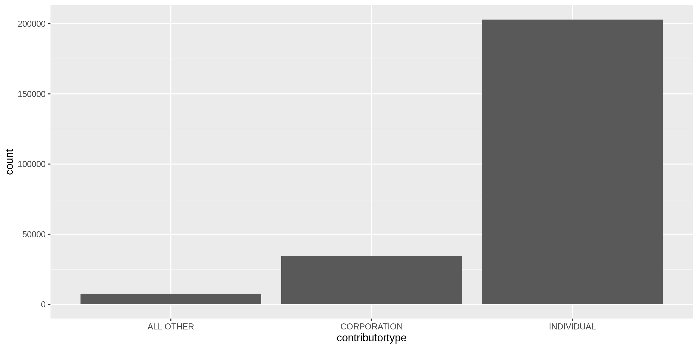
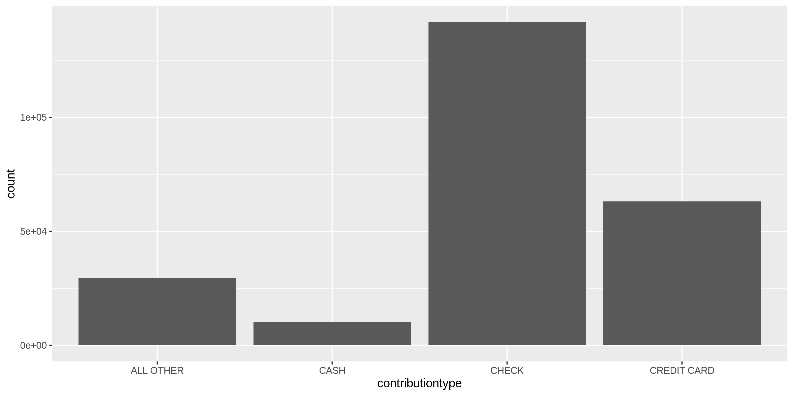
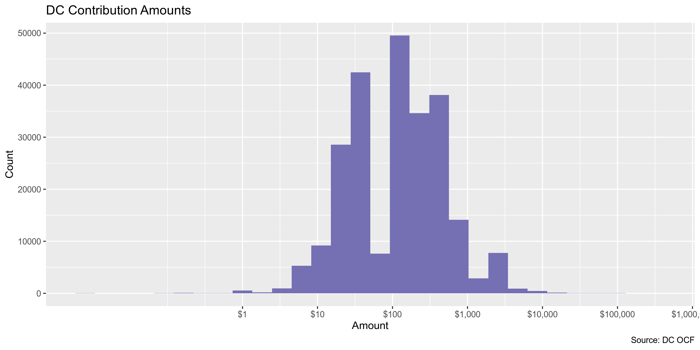
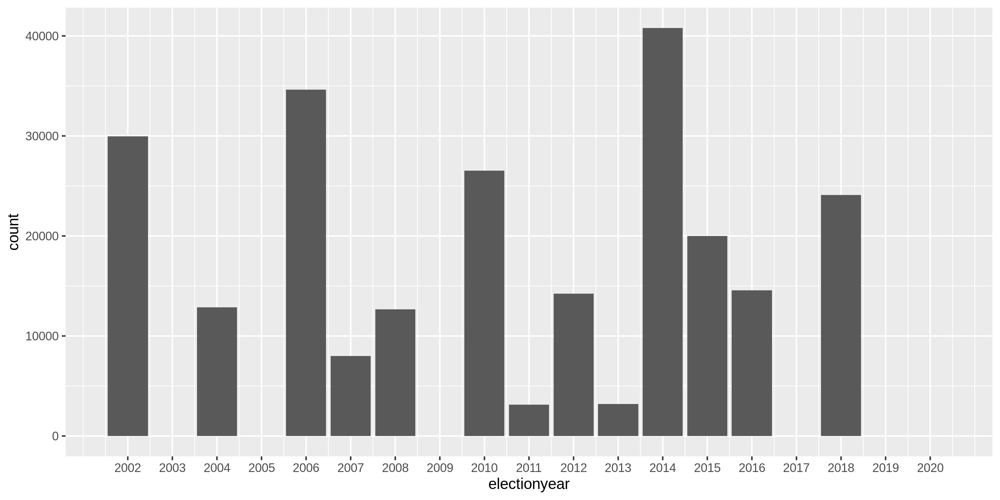
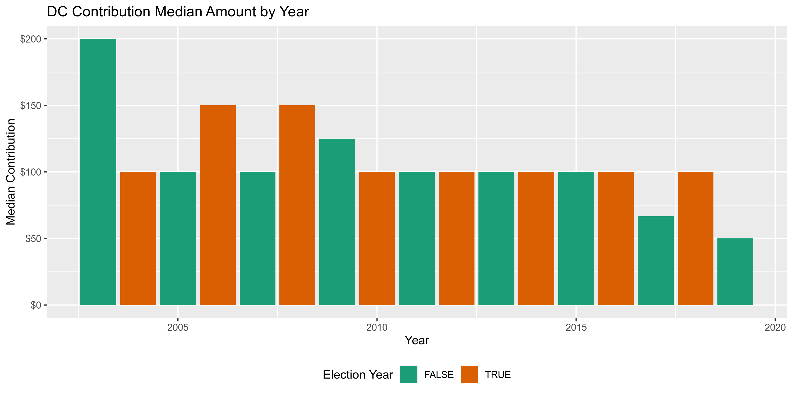
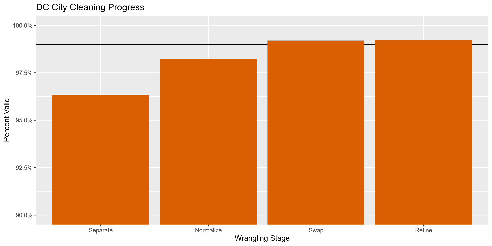

District Contributions
================
Kiernan Nicholls
2019-10-01 14:09:35

  - [Project](#project)
  - [Objectives](#objectives)
  - [Project](#project-1)
  - [Objectives](#objectives-1)
  - [Packages](#packages)
  - [Data](#data)
  - [Import](#import)
  - [Explore](#explore)
  - [Separate](#separate)
  - [Normalize](#normalize)
  - [Conclude](#conclude)
  - [Write](#write)

## Project

The Accountability Project is an effort to cut across data silos and
give journalists, policy professionals, activists, and the public at
large a simple way to search across huge volumes of public data about
people and organizations.

Our goal is to standardizing public data on a few key fields by thinking
of each dataset row as a transaction. For each transaction there should
be (at least) 3 variables:

1.  All **parties** to a transaction
2.  The **date** of the transaction
3.  The **amount** of money involved

## Objectives

This document describes the process used to complete the following
objectives:

1.  How many records are in the database?
2.  Check for duplicates
3.  Check ranges
4.  Is there anything blank or missing?
5.  Check for consistency issues
6.  Create a five-digit ZIP Code called `ZIP5`
7.  Create a `YEAR` field from the transaction date
8.  Make sure there is data on both parties to a transaction

## Project

The Accountability Project is an effort to cut across data silos and
give journalists, policy professionals, activists, and the public at
large a simple way to search across huge volumes of public data about
people and organizations.

Our goal is to standardizing public data on a few key fields by thinking
of each dataset row as a transaction. For each transaction there should
be (at least) 3 variables:

1.  All **parties** to a transaction
2.  The **date** of the transaction
3.  The **amount** of money involved

## Objectives

This document describes the process used to complete the following
objectives:

1.  How many records are in the database?
2.  Check for duplicates
3.  Check ranges
4.  Is there anything blank or missing?
5.  Check for consistency issues
6.  Create a five-digit ZIP Code called `ZIP5`
7.  Create a `YEAR` field from the transaction date
8.  Make sure there is data on both parties to a transaction

## Packages

The following packages are needed to collect, manipulate, visualize,
analyze, and communicate these results. The `pacman` package will
facilitate their installation and attachment.

The IRW’s `campfin` package will also have to be installed from GitHub.
This package contains functions custom made to help facilitate the
processing of campaign finance data.

``` r
if (!require("pacman")) install.packages("pacman")
pacman::p_load_gh("irworkshop/campfin")
pacman::p_load(
  tidyverse, # data manipulation
  lubridate, # datetime strings
  tidytext, # text analysis
  magrittr, # pipe opperators
  janitor, # dataframe clean
  refinr, # cluster and merge
  scales, # format strings
  knitr, # knit documents
  vroom, # read files fast
  glue, # combine strings
  here, # relative storage
  fs # search storage 
)
```

This document should be run as part of the `R_campfin` project, which
lives as a sub-directory of the more general, language-agnostic
[`irworkshop/accountability_datacleaning`](https://github.com/irworkshop/accountability_datacleaning "TAP repo")
GitHub repository.

The `R_campfin` project uses the [RStudio
projects](https://support.rstudio.com/hc/en-us/articles/200526207-Using-Projects "Rproj")
feature and should be run as such. The project also uses the dynamic
`here::here()` tool for file paths relative to *your* machine.

``` r
# where does this document knit?
here::here()
#> [1] "/home/kiernan/R/accountability_datacleaning/R_campfin"
```

## Data

Data comes courtesy of the Washington, [DC Office of Campaign Finance
(OCF)](https://ocf.dc.gov/ "OCF").

As the [OCF
website](https://ocf.dc.gov/service/view-contributions-expenditures)
explains:

> The Office of Campaign Finance (OCF) provides easy access to all
> contributions and expenditures reported from 2003, through the current
> reporting period. Because the system is updated on a daily basis, you
> may be able to retrieve data received by OCF after the latest
> reporting period. This data is as reported, but may not be complete.

### About

The data is found on the dc.gov [OpenData
website](https://opendata.dc.gov/datasets/campaign-financial-expenditures).
The file abstract reads:

> The Office of Campaign Finance (OCF) is pleased to publicly share
> election campaign contribution data. The Campaign Finance Office is
> charged with administering and enforcing the District of Columbia laws
> pertaining to campaign finance operations, lobbying activities,
> conflict of interest matters, the ethical conduct of public officials,
> and constituent service and statehood fund programs. OCF provides easy
> access to all contributions and expenditures reported from 2003,
> through the current reporting period. Because the system is updated on
> a daily basis, you may be able to retrieve data received by OCF after
> the latest reporting period. This data is as reported, but may not be
> complete. Visit the <http://ocf.dc.gov> for more information.

## Import

The most recent file can be read directly from the OCF with
`readr::read_csv()`.

``` r
dir_raw <- here("dc", "contribs", "data", "raw")
dir_create(dir_raw)
raw_url <- "https://opendata.arcgis.com/datasets/6443e0b5b2454e86a3208b8a38fdee84_34.csv"

dc <- 
  read_csv(raw_url) %>% 
  clean_names("snake") %>%
  mutate_if(is_character, str_to_upper)
```

## Explore

There are 244678 records of 20 variables in the full database.

``` r
head(dc)
#> # A tibble: 6 x 20
#>   objectid committeename candidatename electionyear contributorname address contributortype
#>      <dbl> <chr>         <chr>                <dbl> <chr>           <chr>   <chr>          
#> 1     1001 WARD 4 CONST… BRANDON  TODD         2015 KATE MOORE      7032 3… INDIVIDUAL     
#> 2     1002 BOWSER 2012   MURIEL BOWSER         2012 BETH LAMOREAUX  7034 O… INDIVIDUAL     
#> 3     1003 DC CANNABIS … <NA>                  2014 ELLEN  MCNAMARA 7035 B… INDIVIDUAL     
#> 4     1004 MURIEL BOWSE… MURIEL BOWSER         2014 JAMES SLATTERY  7035 B… INDIVIDUAL     
#> 5     1005 MURIEL BOWSE… MURIEL BOWSER         2014 ETHAN HASE      7035 B… INDIVIDUAL     
#> 6     1006 MURIEL BOWSE… MURIEL BOWSER         2014 JAMES SLATTERY  7035 B… INDIVIDUAL     
#> # … with 13 more variables: contributiontype <chr>, employer <chr>, employeraddress <chr>,
#> #   amount <dbl>, dateofreceipt <dttm>, address_id <dbl>, xcoord <dbl>, ycoord <dbl>,
#> #   latitude <dbl>, longitude <dbl>, fulladdress <chr>, gis_last_mod_dttm <dttm>, ward <chr>
tail(dc)
#> # A tibble: 6 x 20
#>   objectid committeename candidatename electionyear contributorname address contributortype
#>      <dbl> <chr>         <chr>                <dbl> <chr>           <chr>   <chr>          
#> 1   244673 WASHINGTON D… <NA>                  2002 KATIE BOLT      3201 N… INDIVIDUAL     
#> 2   244674 WASHINGTON D… <NA>                  2002 SALLY YICK      3201 N… INDIVIDUAL     
#> 3   244675 WASHINGTON D… <NA>                  2002 DANA LANDRY     3201 N… INDIVIDUAL     
#> 4   244676 WASHINGTON D… <NA>                  2002 LAURIE OSERAN   3201 N… INDIVIDUAL     
#> 5   244677 WASHINGTON D… <NA>                  2002 KATHLEEN MCGRA… 3201 N… INDIVIDUAL     
#> 6   244678 WASHINGTON D… <NA>                  2002 CATHIE GILL     3201 N… INDIVIDUAL     
#> # … with 13 more variables: contributiontype <chr>, employer <chr>, employeraddress <chr>,
#> #   amount <dbl>, dateofreceipt <dttm>, address_id <dbl>, xcoord <dbl>, ycoord <dbl>,
#> #   latitude <dbl>, longitude <dbl>, fulladdress <chr>, gis_last_mod_dttm <dttm>, ward <chr>
glimpse(dc)
#> Observations: 244,678
#> Variables: 20
#> $ objectid          <dbl> 1001, 1002, 1003, 1004, 1005, 1006, 1007, 1008, 1009, 1010, 1011, 1012…
#> $ committeename     <chr> "WARD 4 CONSTITUENT SERVICES FUND", "BOWSER 2012", "DC CANNABIS CAMPAI…
#> $ candidatename     <chr> "BRANDON  TODD", "MURIEL BOWSER", NA, "MURIEL BOWSER", "MURIEL BOWSER"…
#> $ electionyear      <dbl> 2015, 2012, 2014, 2014, 2014, 2014, 2014, 2018, 2014, 2010, 2012, 2018…
#> $ contributorname   <chr> "KATE MOORE", "BETH LAMOREAUX", "ELLEN  MCNAMARA", "JAMES SLATTERY", "…
#> $ address           <chr> "7032 31ST ST NW, WASHINGTON, DC 20015", "7034 OREGON AVENUE NW, WASHI…
#> $ contributortype   <chr> "INDIVIDUAL", "INDIVIDUAL", "INDIVIDUAL", "INDIVIDUAL", "INDIVIDUAL", …
#> $ contributiontype  <chr> "CHECK", "CHECK", "CREDIT CARD", "CREDIT CARD", "CREDIT CARD", "CREDIT…
#> $ employer          <chr> "RETIRED", "N/A", NA, "DC COUNCIL", "NOVITEX", "DC COUNCIL", "DC GOVER…
#> $ employeraddress   <chr> NA, "WASHINGTON, DC", NA, NA, NA, NA, "WASHINGTON, DC", "1155 15TH ST …
#> $ amount            <dbl> 35, 100, 20, 25, 25, 25, 250, 100, 500, 100, 50, 200, 50, 35, 250, 100…
#> $ dateofreceipt     <dttm> 2018-05-03, 2012-01-11, 2015-03-26, 2013-04-01, 2014-03-29, 2014-03-2…
#> $ address_id        <dbl> 261229, 261282, 307022, 307022, 307022, 307022, 307022, 2936, 2936, 29…
#> $ xcoord            <dbl> 395313.3, 395348.8, 398369.1, 398369.1, 398369.1, 398369.1, 398369.1, …
#> $ ycoord            <dbl> 146104.6, 146291.9, 145300.6, 145300.6, 145300.6, 145300.6, 145300.6, …
#> $ latitude          <dbl> 38.98286, 38.98454, 38.97563, 38.97563, 38.97563, 38.97563, 38.97563, …
#> $ longitude         <dbl> -77.05409, -77.05368, -77.01882, -77.01882, -77.01882, -77.01882, -77.…
#> $ fulladdress       <chr> "7032 31ST STREET NW", "7034 OREGON AVENUE NW", "7035 BLAIR ROAD NW", …
#> $ gis_last_mod_dttm <dttm> 2019-09-30 06:20:49, 2019-09-30 06:20:49, 2019-09-30 06:20:49, 2019-0…
#> $ ward              <chr> "WARD 4", "WARD 4", "WARD 4", "WARD 4", "WARD 4", "WARD 4", "WARD 4", …
```

### Distinct

The variables range in their degree of distinctness.

``` r
glimpse_fun(dc, n_distinct)
#> # A tibble: 20 x 4
#>    col               type       n          p
#>    <chr>             <chr>  <dbl>      <dbl>
#>  1 objectid          dbl   244678 1         
#>  2 committeename     chr     1522 0.00622   
#>  3 candidatename     chr      429 0.00175   
#>  4 electionyear      dbl       17 0.0000695 
#>  5 contributorname   chr   111821 0.457     
#>  6 address           chr   139770 0.571     
#>  7 contributortype   chr       27 0.000110  
#>  8 contributiontype  chr        9 0.0000368 
#>  9 employer          chr    35410 0.145     
#> 10 employeraddress   chr    21049 0.0860    
#> 11 amount            dbl     5125 0.0209    
#> 12 dateofreceipt     dttm    5681 0.0232    
#> 13 address_id        dbl    28688 0.117     
#> 14 xcoord            dbl    28101 0.115     
#> 15 ycoord            dbl    28085 0.115     
#> 16 latitude          dbl    37487 0.153     
#> 17 longitude         dbl    37678 0.154     
#> 18 fulladdress       chr    28721 0.117     
#> 19 gis_last_mod_dttm dttm       1 0.00000409
#> 20 ward              chr        9 0.0000368
```

<!-- -->

<!-- -->

### Missing

There are several variables missing key values:

``` r
glimpse_fun(dc, count_na)
#> # A tibble: 20 x 4
#>    col               type       n        p
#>    <chr>             <chr>  <dbl>    <dbl>
#>  1 objectid          dbl        0 0       
#>  2 committeename     chr        0 0       
#>  3 candidatename     chr    22054 0.0901  
#>  4 electionyear      dbl       28 0.000114
#>  5 contributorname   chr     1164 0.00476 
#>  6 address           chr     1149 0.00470 
#>  7 contributortype   chr     1452 0.00593 
#>  8 contributiontype  chr     2425 0.00991 
#>  9 employer          chr    96892 0.396   
#> 10 employeraddress   chr   140419 0.574   
#> 11 amount            dbl      367 0.00150 
#> 12 dateofreceipt     dttm       0 0       
#> 13 address_id        dbl    93949 0.384   
#> 14 xcoord            dbl    93949 0.384   
#> 15 ycoord            dbl    93949 0.384   
#> 16 latitude          dbl    93949 0.384   
#> 17 longitude         dbl    93949 0.384   
#> 18 fulladdress       chr    93949 0.384   
#> 19 gis_last_mod_dttm dttm       0 0       
#> 20 ward              chr    93949 0.384
```

Any row with a missing either the `candidatename`, `committeename`
`dateofreceipt`, *or* `amount` will have a `TRUE` value in the new
`na_flag` variable.

``` r
dc <- flag_na(dc, candidatename, committeename, amount, dateofreceipt)
sum(dc$na_flag)
#> [1] 22054
percent(mean(dc$na_flag))
#> [1] "9.01%"
```

### Duplicates

There are no duplicate records.

``` r
dc <- flag_dupes(dc, everything())
sum(dc$dupe_flag)
#> [1] 0
if (sum(dc$dupe_flag == 0)) {
  dc <- select(dc, -dupe_flag)
}
```

### Ranges

#### Amounts

The `amount` varies from $-31,889.24 to $400,000.

``` r
summary(dc$amount)
#>     Min.  1st Qu.   Median     Mean  3rd Qu.     Max.     NA's 
#> -31889.2     50.0    100.0    373.7    400.0 400000.0      367
sum(dc$amount < 0, na.rm = TRUE)
#> [1] 58
```

<!-- -->

#### Dates

The dates range from  and -. There are 0 records with a date greater
than 2019-10-01.

``` r
summary(as_date(dc$dateofreceipt))
#>         Min.      1st Qu.       Median         Mean      3rd Qu.         Max. 
#> "2003-01-01" "2007-07-20" "2012-01-25" "2011-09-28" "2015-01-02" "2019-05-08"
sum(dc$dateofreceipt > today())
#> [1] 0
```

<!-- -->

<!-- -->

Since we’ve already used `readr::parse_datetime()`, we can use
`lubridate::year()` to create a new variable representing the year of
the receipt.

``` r
dc <- mutate(dc, transactionyear = year(dateofreceipt))
```

## Separate

We will have to break the `address` variable into distinct variables for
each component (address, city, state, ZIP).

``` r
select(sample_frac(dc), address)
#> # A tibble: 244,678 x 1
#>    address                                            
#>    <chr>                                              
#>  1 1715 P ST NW APT 402, WASHINGTON, DC 20036         
#>  2 5034 WISCONSIN AVE NW, WASHINGTON, DC 20016        
#>  3 1101 N. KENTUCKY ST., ARLINGTON, DC 22205          
#>  4 3751 CRESTWAY DRIVE, VIEW PARK, CA 90043           
#>  5 401 CAMERON STATION BOULEVARD, ALEXANDRIA, DC 22304
#>  6 2339 GOLF VIEW LANE, HAMPSTEAD, MD 21074           
#>  7 1819 KENYON STREET, NW, WASHINGTON, DC 20010       
#>  8 1801 OTIS STREET NE, WASHINGTON, DC 20018          
#>  9 614 W BRADDOCK ROAD, ALEXANDRIA, DC 22302          
#> 10 9401 CYPRESS SPRING COURT, #1, RICHMOND, VA 25294  
#> # … with 244,668 more rows
```

First, we can split the `address` variable into new columns at each
comma in the original variable using `tidyr::separate()`

``` r
dc %>% separate(
  col = address,
  into = c(glue("street{1:5}"), "city_sep", "state_zip"),
  sep = ",\\s",
  remove = FALSE,
  extra = "merge",
  fill = "left"
) -> dc
```

Since the street address portion of the `address` variable can contain a
wide variety of components, we have split the original column into an
excessive number of new columns. Now, we can use `tidyr::unite()` to
merge those many columns back into a single `address_sep` variable.

``` r
dc %>% unite(
  starts_with("street"),
  col = "address_sep",
  sep = " ",
  na.rm = TRUE,
  remove = TRUE
) -> dc
```

Finally, the state and ZIP code portion of the string is not separated
by a comma, so we will have to separate this into two strings based on
the space before the ZIP code digits.

``` r
dc %>% separate(
  col = state_zip,
  into = c("state_sep", "zip_sep"),  
  sep = "\\s{1,}(?=\\d)",
  remove = TRUE
) -> dc
```

    #> # A tibble: 244,678 x 5
    #>    address                                   address_sep              city_sep  state_sep zip_sep  
    #>    <chr>                                     <chr>                    <chr>     <chr>     <chr>    
    #>  1 2125 14TH STREET, NW, APT 906, WASHINGTO… 2125 14TH STREET NW APT… WASHINGT… DC        20009    
    #>  2 1050 CONNECTICUT AVE., NW, WASHINGTON, D… 1050 CONNECTICUT AVE. NW WASHINGT… DC        20036    
    #>  3 3310 CLAVIER PL., WASHINGTON, DC 20735    3310 CLAVIER PL.         WASHINGT… DC        20735    
    #>  4 912 INDEPENDENCE AVENUE SE, WASHINGTON, … 912 INDEPENDENCE AVENUE… WASHINGT… DC        20003    
    #>  5 3113 LYFARNE LN, KESWICK, DC 22947        3113 LYFARNE LN          KESWICK   DC        22947    
    #>  6 1905 BRENTWOOD RD NE, WASHINGTON, DC 200… 1905 BRENTWOOD RD NE     WASHINGT… DC        20018    
    #>  7 7 STABLER CIRCLE, WILMINGTON, DC 19807    7 STABLER CIRCLE         WILMINGT… DC        19807    
    #>  8 612 ONEIDA PLACE, NW, WASHINGTON, DC 200… 612 ONEIDA PLACE NW      WASHINGT… DC        20011    
    #>  9 1300 I ST NW, WASHINGTON, DC 20005-3314   1300 I ST NW             WASHINGT… DC        20005-33…
    #> 10 1919 M STREET, NW., WASHINGTON, DC 20036  1919 M STREET NW.        WASHINGT… DC        20036    
    #> # … with 244,668 more rows

There are a number of columns where the lack of a component in the
original `address` has caused the separation to incorrectly shift
content.

    #> # A tibble: 350 x 5
    #>    address                                 address_sep       city_sep     state_sep         zip_sep
    #>    <chr>                                   <chr>             <chr>        <chr>             <chr>  
    #>  1 1612 CARLIN LN, MCLEAN, VIRGINIA  22101 1612 CARLIN LN    MCLEAN       VIRGINIA          22101  
    #>  2 219 T ST NE #102, WASHINGTON 20002      ""                219 T ST NE… WASHINGTON        20002  
    #>  3 6523 DRYLOG, CAPITOL HEIGHTS, MARYLAND… 6523 DRYLOG       CAPITOL HEI… MARYLAND          20743  
    #>  4 7703 13TH STREET, NW, WASHNGTON, DISTR… 7703 13TH STREET… WASHNGTON    DISTRICT OF THE … 20012  
    #>  5 3847 N RIVER STREET, ARLINGTON, VIRGIN… 3847 N RIVER STR… ARLINGTON    VIRGINIA          22207  
    #>  6 1372 BUTTONWILLOW TRL, PENSACOLA, FLOR… 1372 BUTTONWILLO… PENSACOLA    FLORIDA           32506  
    #>  7 6120 ENTERPRISE DRIVE, PENSACOLA, FLOR… 6120 ENTERPRISE … PENSACOLA    FLORIDA           32505  
    #>  8 PO BOX 1142, FALLS CHURCH, VIRGINIA 22… PO BOX 1142       FALLS CHURCH VIRGINIA          22041  
    #>  9 900 F STREET, NW, WASHINGTON, DISTICT … 900 F STREET NW   WASHINGTON   DISTICT OF COLUM… 20004  
    #> 10 929 GIST AVE, SILVER SPRING 20910       ""                929 GIST AVE SILVER SPRING     20910  
    #> # … with 340 more rows

We can fix many of these errors using index subsetting. The most common
error is the original `address` leaving out the “DC” part of the string.

``` r
z <- dc[which(dc$state_sep == "WASHINGTON" & dc$address_sep == ""), ]
z$address_sep <- z$city_sep
z$city_sep <- z$state_sep
z$state_sep <- "DC"
dc[which(dc$state_sep == "WASHINGTON" & dc$address_sep == ""), ] <- z
z <- dc[which(dc$state_sep %out% valid_state & !is.na(dc$state_sep) & dc$address_sep == ""), ]
z$address_sep <- z$city_sep
z$city_sep <- z$state_sep
z$state_sep <- NA
dc[which(dc$state_sep %out% valid_state & !is.na(dc$state_sep) & dc$address_sep == ""), ] <- z
```

There are only 19 remaining rows with a unique `state_sep` value outside
of `valid_state` of `valid_name`.

    #> # A tibble: 29 x 4
    #>    address_sep                                                  city_sep  state_sep         zip_sep
    #>    <chr>                                                        <chr>     <chr>             <chr>  
    #>  1 1877 CHANNING ST.                                            NE        WASH              20018  
    #>  2 84 HULME COURT                                               STANFORD  CALIFORRNIA       94305  
    #>  3 900 F STREET NW                                              WASHINGT… DISTICT OF COLUM… 20004  
    #>  4 720 13TH STREET NW                                           WASHINGT… DISTICT OF COLUM… 20002  
    #>  5 7703 13TH STREET NW                                          WASHNGTON DISTRICT OF THE … 20012  
    #>  6 1350 PENNSYLVANIA AVENUE                                     NW        SUITE             406    
    #>  7 101-2304 YONGSAN PARK TOWER 67 SEOBINGO-RO YONGSAN-DONG 5-1… SEOUL     SOUTH KOREA, DC   140    
    #>  8 CALLE 84 #105                                                BOGATA    COLOMBIA          00000  
    #>  9 1212 NEW YORK AVENUE #300-A                                  WASHINGT… DISTICT OF COLUM… 20005  
    #> 10 131 INDUSTRY LN                                              #2        FOREST HILL       21050  
    #> # … with 19 more rows

## Normalize

Once these components of `address` have been separated into their
respective columns, we can use the `campfin::normal_*()` functions to
improve searchability.

### Address

The `campfin::normal_address()` function can be used to improve
consistency by removing punctuation and expanding abbreviations.

``` r
dc <- dc %>% 
  mutate(
    address_norm = normal_address(
      address = address_sep,
      add_abbs = usps_street,
      na_rep = TRUE
    )
  )
```

    #> # A tibble: 124,731 x 2
    #>    address_sep               address_norm                            
    #>    <chr>                     <chr>                                   
    #>  1 122 HESKETH STREET        122 HESKETH STREET                      
    #>  2 9912 SIDNEY RD            9912 SIDNEY ROAD                        
    #>  3 "3155 BERRY ROAD NE "     3155 BERRY ROAD NORTHEAST               
    #>  4 149 W STREET NW #22       149 WEST STREET NORTHWEST 22            
    #>  5 2806 BATTERY PLACE. NW    2806 BATTERY PLACE NORTHWEST            
    #>  6 5078 11TH ST. NE          5078 11TH STREET NORTHEAST              
    #>  7 3426 16TH ST. NW APT. 203 3426 16TH STREET NORTHWEST APARTMENT 203
    #>  8 1050 17TH ST NW STE 600   1050 17TH STREET NORTHWEST SUITE 600    
    #>  9 3502 N HILTON RD          3502 NORTH HILTON ROAD                  
    #> 10 603 JEFFERSON ST. NE      603 JEFFERSON STREET NORTHEAST          
    #> # … with 124,721 more rows

### ZIP

Similarly, the `campfin::normal_zip()` function can be used to form
valid 5-digit US ZIP codes.

``` r
dc <- dc %>% 
  mutate(
    zip_norm = normal_zip(
      zip = zip_sep,
      na_rep = TRUE
    )
  )
```

    #> # A tibble: 1,114 x 2
    #>    zip_sep    zip_norm
    #>    <chr>      <chr>   
    #>  1 20012-1004 20012   
    #>  2 900352641  90035   
    #>  3 208542553  20854   
    #>  4 200103237  20010   
    #>  5 20037-2301 20037   
    #>  6 20010-3017 20010   
    #>  7 480701515  48070   
    #>  8 230058181  23005   
    #>  9 200095552  20009   
    #> 10 200244230  20024   
    #> # … with 1,104 more rows

This process improves the consistency of our ZIP code variable and
removes some obviously invalid ZIP codes (e.g., 00000, 99999).

``` r
progress_table(
  dc$zip_sep,
  dc$zip_norm,
  compare = valid_zip
)
#> # A tibble: 2 x 6
#>   stage    prop_in n_distinct prop_na n_out n_diff
#>   <chr>      <dbl>      <dbl>   <dbl> <dbl>  <dbl>
#> 1 zip_sep    0.973       7478 0.00482  6672   1493
#> 2 zip_norm   0.996       6394 0.0101    885    386
```

### State

We can use `campfin::normal_state()` to improve the `state_sep` variable
by abbreviating state names and removing invalid values.

``` r
setdiff(dc$state_sep, valid_state)
#>  [1] NA                         "DISTICT OF COLUMBIA"      "WASHINGTON"              
#>  [4] "VIRGINIA"                 "MARYLAND"                 "OHIO"                    
#>  [7] "NORTH CAROLINA"           "WISCONSIN"                "CALIFORNIA"              
#> [10] "FLORIDA"                  "PENNSYLVANIA"             "NEW YORK"                
#> [13] "TEXAS"                    "NEW JERSEY"               "WASH"                    
#> [16] "DC INFOR"                 "MARYALND"                 "REQUESTED"               
#> [19] "DISTRICT OF THE COLUMBIA" "CONNECTICUT"              "DISTRICT OF COLUMBIA"    
#> [22] "FOREST HILL"              "SUITE"                    "GEORGIA"                 
#> [25] " #400"                    "UNIT A"                   "KINSHASA"                
#> [28] "BALTIMORE"                "ARLINGTON"                "COLOMBIA"                
#> [31] "D.C."                     "MISSISSIPPI"              "MISSOURI"                
#> [34] "ALABAMA"                  "ILLINOIS"                 ""                        
#> [37] "SOUTH KOREA, DC"          "MASSACHUSETTES"           "CALIFORRNIA"
```

``` r
dc <- dc %>% 
  mutate(
    state_norm = normal_state(
      state = state_sep,
      abbreviate = TRUE,
      na = c("", "NA"),
      na_rep = TRUE,
      valid = NULL
    )
  )
```

``` r
progress_table(
  dc$state_sep,
  dc$state_norm,
  compare = valid_state
)
#> # A tibble: 2 x 6
#>   stage      prop_in n_distinct prop_na n_out n_diff
#>   <chr>        <dbl>      <dbl>   <dbl> <dbl>  <dbl>
#> 1 state_sep    0.999         95 0.00518   226     39
#> 2 state_norm   1.000         73 0.00520    47     17
```

There are still a handful of invalid state names we can repair by hand.

``` r
dc %>% 
  filter(state_norm %out% valid_state) %>% 
  drop_na(state_norm) %>% 
  count(state_norm, sort = TRUE)
#> # A tibble: 16 x 2
#>    state_norm                   n
#>    <chr>                    <int>
#>  1 REQUESTED                   16
#>  2 DISTICT OF COLUMBIA         10
#>  3 MARYALND                     4
#>  4 SUITE                        3
#>  5 UNIT A                       3
#>  6 ARLINGTON                    1
#>  7 BALTIMORE                    1
#>  8 CALIFORRNIA                  1
#>  9 COLOMBIA                     1
#> 10 DC INFOR                     1
#> 11 DISTRICT OF THE COLUMBIA     1
#> 12 FOREST HILL                  1
#> 13 KINSHASA                     1
#> 14 MASSACHUSETTES               1
#> 15 SOUTH KOREA DC               1
#> 16 WASH                         1
```

``` r
dc <- dc %>% 
  mutate(
    state_norm = state_norm %>% 
      str_replace("^DISTICT OF COLUMBIA$",      "DC") %>%
      str_replace("^MARYALND$",                 "MD") %>%
      str_replace("^ARLINGTON$",                "VA") %>%
      str_replace("^BALTIMORE$",                "MD") %>%
      str_replace("^CALIFORRNIA$",              "CA") %>%
      str_replace("^COLOMBIA$",                 "DC") %>%
      str_replace("^DC INFOR$",                 "DC") %>%
      str_replace("^DISTRICT OF THE COLUMBIA$", "DC") %>%
      str_replace("^MASSACHUSETTES$",           "MA") %>%
      str_replace("^WASH$",                     "DC")
  )

dc$state_norm[which(dc$state_norm %out% valid_state)] <- NA
```

### City

The `city_sep` variable is the most difficult to normalize due to the
sheer number of possible valid values and the variety in which those
values can be types. There is a four stage process we can use to make
extremely confident changes.

1.  **Normalize** the values with `campfin::normal_zip()`.
2.  **Compare** to the *expected* value with `dplyr::left_join()`.
3.  **Swap** with some expected values using `campfin::str_dist()` and
    `campfin::is_abbrev()`.
4.  **Refine** the remaining similar values with
    `refinr::n_gram_merge()`.

#### Normal City

``` r
dc <- dc %>% 
  mutate(
    city_norm = normal_city(
      city = str_replace(city_sep, "DC", "WASHINGTON"),
      geo_abbs = usps_city,
      st_abbs = c("DC", "D C"),
      na = invalid_city,
      na_rep = TRUE
    )
  )
```

    #> # A tibble: 410 x 4
    #>    city_sep       city_norm             state_norm     n
    #>    <chr>          <chr>                 <chr>      <int>
    #>  1 FT. WASHINGTON FORT WASHINGTON       MD           117
    #>  2 FT WASHINGTON  FORT WASHINGTON       MD            78
    #>  3 ST. LOUIS      SAINT LOUIS           MO            71
    #>  4 FT. WASHINGTON FORT WASHINGTON       DC            55
    #>  5 FT WASHINGTON  FORT WASHINGTON       DC            48
    #>  6 WASHINGTON DC  WASHINGTON WASHINGTON DC            45
    #>  7 ST. PETERSBURG SAINT PETERSBURG      FL            19
    #>  8 NW             NORTHWEST             <NA>          15
    #>  9 DC             WASHINGTON            DC            14
    #> 10 ST LOUIS       SAINT LOUIS           MO            12
    #> # … with 400 more rows

#### Match City

To assess the normalization of city values, it’s useful to compare our
`city_norm` value to the *expected* city value for that record’s state
and ZIP code. To do this, we can use `dplyr::left_join()` with the
`campfin::zipcodes` data frame.

``` r
dc <- dc %>% 
  left_join(zipcodes, by = c("zip_norm" = "zip", "state_norm" = "state")) %>% 
  rename(city_match = city)
```

Most of our `city_match` values are the same as `city_norm`, and most of
the different values are records where no matched city could be found
for a record’s state and/or ZIP code.

``` r
percent(mean(dc$city_norm == dc$city_match, na.rm = TRUE))
#> [1] "97.0%"
percent(prop_na(dc$city_match))
#> [1] "7.89%"
```

#### Swap city

The next step involves comparing our `city_norm` values to `city_match`.
We want to check whether `city_match` might be the valid value for any
invalid `city_norm`. We only want to use this matched value if we can be
very confident. To do this, we’ll use two tests: (1)
`campfin::str_dist()` checks the string distance between the two values,
(2) `campfin::is_abbrev()` checks whether `city_norm` might be an
abbreviation of `city_match`. See the help files (`?is_abbrev`) to
understand exactly what these two functions test.

``` r
dc <- dc %>%
  mutate(
    match_dist = str_dist(city_norm, city_match),
    match_abb = is_abbrev(city_norm, city_match)
  )
```

``` r
summary(dc$match_dist)
#>    Min. 1st Qu.  Median    Mean 3rd Qu.    Max.    NA's 
#>    0.00    0.00    0.00    0.22    0.00   27.00   19332
sum(dc$match_abb, na.rm = TRUE)
#> [1] 281
```

Here we can see the 281 records where `city_norm` appears to be an
abbreviation of `city_match`, so the later was used in `city_swap`.

``` r
dc %>% 
  filter(match_abb) %>% 
  count(state_norm, zip_norm, city_norm, city_match, match_abb, sort = TRUE)
#> # A tibble: 148 x 6
#>    state_norm zip_norm city_norm   city_match           match_abb     n
#>    <chr>      <chr>    <chr>       <chr>                <lgl>     <int>
#>  1 MD         21093    LUTHERVILLE LUTHERVILLE TIMONIUM TRUE         30
#>  2 MD         21152    SPARKS      SPARKS GLENCOE       TRUE         19
#>  3 VA         22039    FAIRFAX     FAIRFAX STATION      TRUE         16
#>  4 MD         20769    GLENDALE    GLENN DALE           TRUE         13
#>  5 MD         21090    LINTHICUM   LINTHICUM HEIGHTS    TRUE         10
#>  6 FL         33139    MIAMI       MIAMI BEACH          TRUE          5
#>  7 MA         02460    NEWTON      NEWTONVILLE          TRUE          5
#>  8 VA         20132    PURCEVILLE  PURCELLVILLE         TRUE          5
#>  9 FL         33141    MIAMI       MIAMI BEACH          TRUE          4
#> 10 KS         66217    SHAWNEE     SHAWNEE MISSION      TRUE          4
#> # … with 138 more rows
```

Furthermore, 1652 records has a string distance of only 1, meaning only
1 character was different between `city_norm` and `city_match`, so again
the later was used in `city_swap`.

``` r
dc %>% 
  filter(match_dist == 1) %>% 
  count(state_norm, zip_norm, city_norm, city_match, match_abb, sort = TRUE)
#> # A tibble: 850 x 6
#>    state_norm zip_norm city_norm   city_match   match_abb     n
#>    <chr>      <chr>    <chr>       <chr>        <lgl>     <int>
#>  1 DC         20005    WASHNGTON   WASHINGTON   FALSE        61
#>  2 MD         20646    LAPLATA     LA PLATA     FALSE        34
#>  3 MD         21117    OWINGS MILL OWINGS MILLS FALSE        34
#>  4 VA         22101    MC LEAN     MCLEAN       FALSE        30
#>  5 VA         22003    ANNADALE    ANNANDALE    FALSE        27
#>  6 VA         22191    WOODBRIGE   WOODBRIDGE   FALSE        27
#>  7 VA         22101    MCCLEAN     MCLEAN       FALSE        23
#>  8 MD         20769    GLEN DALE   GLENN DALE   FALSE        21
#>  9 PA         15230    PITTSBURG   PITTSBURGH   FALSE        20
#> 10 PA         15219    PITTSBURG   PITTSBURGH   FALSE        17
#> # … with 840 more rows
```

If a `city_norm` value has either (1) a really small string distance or
(2) appears to be an abbreviation of `city_match`, we can confidently
use the matched value of the messy `city_norm`.

``` r
dc <- dc %>% 
  mutate(
    city_swap = if_else(
      condition = match_abb | match_dist == 1,
      true = city_match,
      false = city_norm
    )
  )
```

#### Refine City

The above steps catch most changes, but we can do one last check using
the OpenRefine key collision and n-gram merging algorithms to check for
any further valid fixes. These algorithms group similar values and use
the most common value in each group.

``` r
good_refine <- dc %>% 
  mutate(
    city_refine = city_swap %>% 
      key_collision_merge(dict = valid_city) %>% 
      n_gram_merge(numgram = 1)
  ) %>% 
  # keep only rows where a change was made
  filter(city_refine != city_swap) %>% 
  # keep only rows where a _correct_ change was made
  inner_join(
    y = zipcodes,
    by = c(
      "city_refine" = "city",
      "state_norm" = "state",
      "zip_norm" = "zip"
    )
  )
```

Very few changes were made this way, but they are useful changes
nonetheless.

``` r
count(x = good_refine, state_norm, city_swap, city_refine, sort = TRUE)
#> # A tibble: 27 x 4
#>    state_norm city_swap             city_refine           n
#>    <chr>      <chr>                 <chr>             <int>
#>  1 DC         WASHINGTON WASHINGTON WASHINGTON           47
#>  2 FL         PONTE VERDE BEACH     PONTE VEDRA BEACH     2
#>  3 MD         BRYAN ROADS           BRYANS ROAD           2
#>  4 MD         OWNINGS MILL          OWINGS MILLS          2
#>  5 NY         SETAUKET              EAST SETAUKET         2
#>  6 CA         SAN FRANCISCO CA      SAN FRANCISCO         1
#>  7 DC         WASHINGONT            WASHINGTON            1
#>  8 GA         ALPHERTTA             ALPHARETTA            1
#>  9 GA         MARRIETA              MARIETTA              1
#> 10 LA         NEWS ORLEAN           NEW ORLEANS           1
#> # … with 17 more rows
```

``` r
dc <- dc %>% 
  left_join(good_refine) %>% 
  mutate(city_refine = coalesce(city_refine, city_swap))
```

#### City Progress

``` r
dc %>% 
  filter(city_refine %out% valid_city) %>% 
  count(state_norm, zip_norm, city_refine, sort = TRUE) %>% 
  drop_na()
#> # A tibble: 623 x 4
#>    state_norm zip_norm city_refine        n
#>    <chr>      <chr>    <chr>          <int>
#>  1 MD         20785    LANDOVER         326
#>  2 MD         20746    CAMP SPRINGS      95
#>  3 MD         20785    CHEVERLY          80
#>  4 MD         20878    NORTH POTOMAC     74
#>  5 FL         33134    CORAL GABLES      72
#>  6 MD         20852    NORTH BETHESDA    63
#>  7 FL         33133    COCONUT GROVE     55
#>  8 MD         20882    LAYTONSVILLE      35
#>  9 MD         20784    NEW CARROLLTON    34
#> 10 MD         20706    GLENARDEN         28
#> # … with 613 more rows
```

By two common Washington/Maryland suburbs to our list of common cities,
we can see our normalization process has brought us above 99% “valid.”

``` r
valid_city <- c(valid_city, "LANDOVER", "CHEVERLY")
```

``` r
progress_table(
  dc$city_sep,
  dc$city_norm,
  dc$city_swap,
  dc$city_refine,
  compare = valid_city
)
#> # A tibble: 4 x 6
#>   stage       prop_in n_distinct prop_na n_out n_diff
#>   <chr>         <dbl>      <dbl>   <dbl> <dbl>  <dbl>
#> 1 city_sep      0.963       4963 0.00470  8892   2334
#> 2 city_norm     0.982       4160 0.00529  4286   1474
#> 3 city_swap     0.992       3058 0.0792   1804    545
#> 4 city_refine   0.992       3031 0.0792   1727    518
```

<!-- -->

<!-- -->

## Conclude

1.  How are 244678 records in the database.
2.  There are 0 duplicate records.
3.  The `amount` values range from $-31,889.24 to $400,000.
4.  The `dateofreceipt` ranges from to .
5.  The 22054 records missing a `candidatename` or `payee` value are
    flagged with the logical `na_flag` variable.
6.  Consistency in ZIP codes and state abbreviations has been fixed from
    `address`.
7.  The `zip_clean` variable contains the 5 digit ZIP from `address`.
8.  The `transactionyear` variable contains the 4 digit year of the
    receipt.
9.  Only 91.0% of records contain all the data needed to identify the
    transaction.

## Write

``` r
dir_proc <- here("dc", "contribs", "data", "processed")
dir_create(dir_proc)
```

``` r
write_csv(
  x = dc,
  na = "",
  path = glue("{dir_proc}/dc_contribs_clean.csv")
)
```
