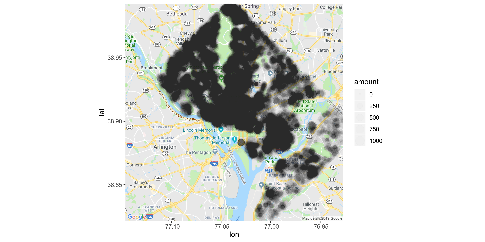
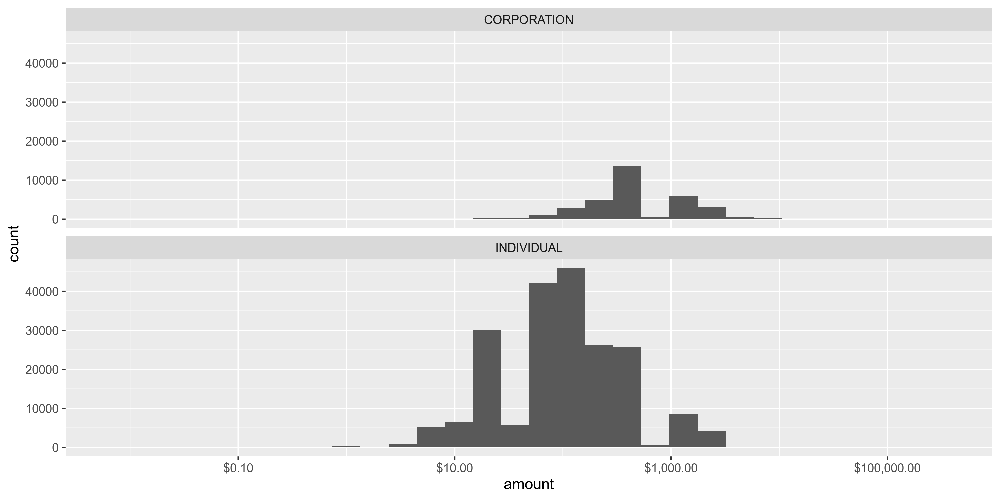
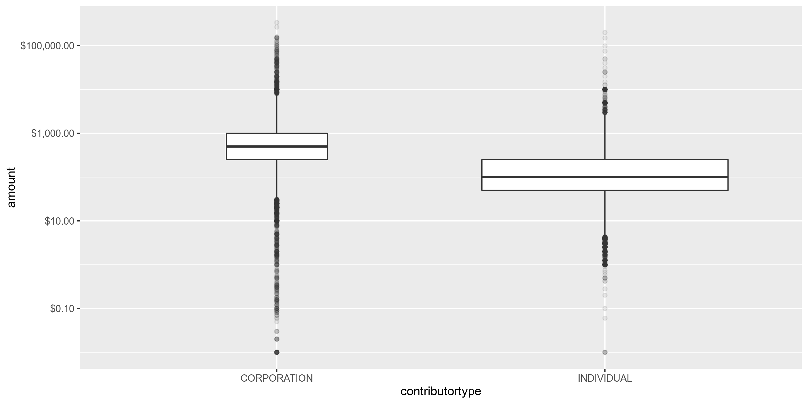
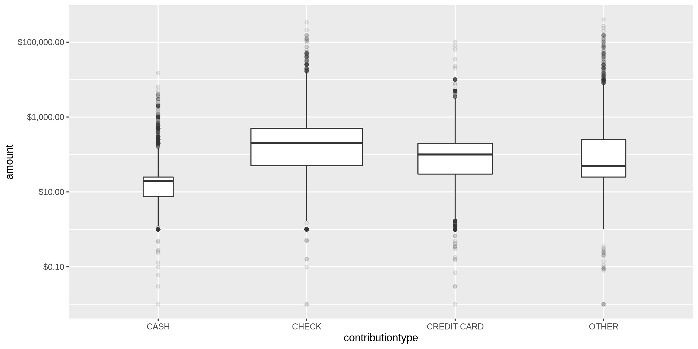
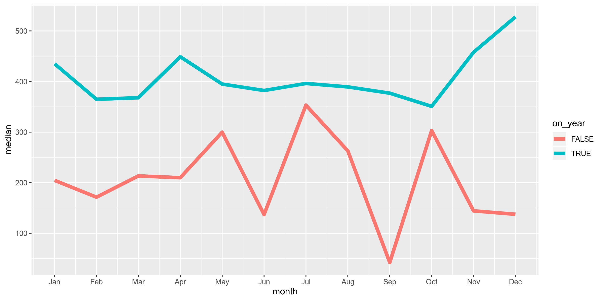

District Contributions
================
Kiernan Nicholls
2019-07-11 16:14:40

  - [Project](#project)
  - [Objectives](#objectives)
  - [Packages](#packages)
  - [Data](#data)
  - [Import](#import)
  - [Explore](#explore)
  - [Wrangle](#wrangle)

## Project

The Accountability Project is an effort to cut across data silos and
give journalists, policy professionals, activists, and the public at
large a simple way to search across huge volumes of public data about
people and organizations.

Our goal is to standardizing public data on a few key fields by thinking
of each dataset row as a transaction. For each transaction there should
be (at least) 3 variables:

1.  All **parties** to a transaction
2.  The **date** of the transaction
3.  The **amount** of money involved

## Objectives

This document describes the process used to complete the following
objectives:

1.  How many records are in the database?
2.  Check for duplicates
3.  Check ranges
4.  Is there anything blank or missing?
5.  Check for consistency issues
6.  Create a five-digit ZIP Code called `ZIP5`
7.  Create a `YEAR` field from the transaction date
8.  Make sure there is data on both parties to a transaction

## Packages

The following packages are needed to collect, manipulate, visualize,
analyze, and communicate these results. The `pacman` package will
facilitate their installation and attachment.

``` r
if (!require("pacman")) install.packages("pacman")
pacman::p_load(
  stringdist, # levenshtein value
  tidyverse, # data manipulation
  lubridate, # datetime strings
  magrittr, # pipe opperators
  jsonlite, # reading JSON
  janitor, # dataframe clean
  zipcode, # clean & database
  refinr, # cluster & merge
  vroom, # quickly read files
  ggmap, # google maps API
  knitr, # knit documents
  glue, # combine strings
  here, # relative storage
  fs, # search storage 
  sf # spatial data
)
```

This document should be run as part of the `R_campfin` project, which
lives as a sub-directory of the more general, language-agnostic
[`irworkshop/accountability_datacleaning`](https://github.com/irworkshop/accountability_datacleaning "TAP repo")
GitHub repository.

The `R_campfin` project uses the [RStudio
projects](https://support.rstudio.com/hc/en-us/articles/200526207-Using-Projects "Rproj")
feature and should be run as such. The project also uses the dynamic
`here::here()` tool for file paths relative to *your* machine.

``` r
# where dcs this document knit?
here::here()
#> [1] "/home/kiernan/R/accountability_datacleaning/R_campfin"
```

## Data

Data comes courtesy of the Washington, [DC Office of Campaign Finance
(OCF)](https://ocf.dc.gov/ "OCF").

The data was published 2016-10-06 and was last updated 2019-05-07. Each
record represents a single contribution made.

As the [OCF
website](https://ocf.dc.gov/service/view-contributions-expenditures)
explains:

> The Office of Campaign Finance (OCF) provides easy access to all
> contributions and expenditures reported from 2003, through the current
> reporting period. Because the system is updated on a daily basis, you
> may be able to retrieve data received by OCF after the latest
> reporting period. This data is as reported, but may not be complete.

### About

The data is found on the dc.gov [OpenData
website](https://opendata.dc.gov/datasets/campaign-financial-contributions).
The file abstract reads:

> The Office of Campaign Finance (OCF) is pleased to publicly share
> election campaign contribution data. The Campaign Finance Office is
> charged with administering and enforcing the District of Columbia laws
> pertaining to campaign finance operations, lobbying activities,
> conflict of interest matters, the ethical conduct of public officials,
> and constituent service and statehood fund programs. OCF provides easy
> access to all contributions and expenditures reported from 2003,
> through the current reporting period. Because the system is updated on
> a daily basis, you may be able to retrieve data received by OCF after
> the latest reporting period. This data is as reported, but may not be
> complete. Visit the <http://ocf.dc.gov> for more information.
> 
> Users may also visit the [Candidate
> Campaign](http://geospatial.dcgis.dc.gov/ocf/) Contributions web
> application to find financial data by zip codes.

> Keywords: \* contributions \* dc \* dc gis \* elections \*
> expenditures \* finance \* money \* oct2016 \* political \* public
> service \* vote \* washington dc

> Contact: \* Organization: D.C. Office of the Chief Technology Officer
> \* Person: GIS Data Coordinator \* Address: Address: 200 I Street SE,
> 5th Floor, Washington DC 20003 USA \* Facsimile Telephone: (202)
> 727-5660 \* Electronic Mail Address: <dcgis@dc.gov> \* Hours: 8:30 am
> - 5 pm

## Import

We can retreive the data from the GeoJSON API using the
`jsonlite::fromJSON()` function.

``` r
dir_raw <- here("dc", "contribs", "data", "raw")
dir_create(dir_raw)

dc <- 
  fromJSON("https://opendata.arcgis.com/datasets/6443e0b5b2454e86a3208b8a38fdee84_34.geojson") %>% 
  use_series(features) %>% 
  use_series(properties) %>% 
  as_tibble() %>% 
  clean_names() %>%
  mutate_if(is_character, str_to_upper) %>% 
  mutate_at(vars(dateofreceipt), parse_datetime) %>% 
  select(
    -xcoord, 
    -ycoord, 
    -fulladdress, 
    -gis_last_mod_dttm,
  )
```

Then save a copy of the data frame to the disk in the `/data/raw`
directory.

``` r
write_delim(
  x = dc,
  path = glue("{dir_raw}/Campaign_Financial_Contributions.csv"),
  delim = ";",
  na = "",
  append = FALSE,
  col_names = TRUE,
  quote_escape = "double"
)
```

## Explore

There are 244678 records of 16 variables in the full database.

``` r
head(dc)
```

    #> # A tibble: 6 x 16
    #>   objectid committeename candidatename electionyear contributorname address contributortype
    #>      <int> <chr>         <chr>                <int> <chr>           <chr>   <chr>          
    #> 1        1 REID 4 WARD … SHEIKA REID           2018 WAYNE AGNEW     3600 R… INDIVIDUAL     
    #> 2        2 REID 4 WARD … SHEIKA REID           2018 WAYNE AGNEW     3600 R… INDIVIDUAL     
    #> 3        3 ED LAZERE FO… ED LAZERE             2018 SHARON FARMER   3601 1… INDIVIDUAL     
    #> 4        4 ELISSA 2014   ELISSA SILVE…         2014 MICHAEL SAPPOL  3601 3… INDIVIDUAL     
    #> 5        5 ELISSA 2013   ELISSA SILVE…         2013 MICHAEL SAPPOL  3601 3… INDIVIDUAL     
    #> 6        6 THE MICHAEL … MICHAEL BROWN         2008 GUY ROHLING     3601 4… INDIVIDUAL     
    #> # … with 9 more variables: contributiontype <chr>, employer <chr>, employeraddress <chr>,
    #> #   amount <dbl>, dateofreceipt <dttm>, address_id <int>, latitude <dbl>, longitude <dbl>,
    #> #   ward <chr>

``` r
tail(dc)
```

    #> # A tibble: 6 x 16
    #>   objectid committeename candidatename electionyear contributorname address contributortype
    #>      <int> <chr>         <chr>                <int> <chr>           <chr>   <chr>          
    #> 1   244673 WASHINGTON D… <NA>                  2002 SARAH BERNARDI  4400 J… INDIVIDUAL     
    #> 2   244674 WASHINGTON D… <NA>                  2002 CHRISTINE BARM… 4400 J… INDIVIDUAL     
    #> 3   244675 WASHINGTON D… <NA>                  2002 MIMI STANSBURY  4400 J… INDIVIDUAL     
    #> 4   244676 WASHINGTON D… <NA>                  2002 EMILY KAROLYI   4400 J… INDIVIDUAL     
    #> 5   244677 WASHINGTON D… <NA>                  2002 ELLEN SANDLER   4400 J… INDIVIDUAL     
    #> 6   244678 WASHINGTON D… <NA>                  2002 ROBERT JENNINGS 4400 J… INDIVIDUAL     
    #> # … with 9 more variables: contributiontype <chr>, employer <chr>, employeraddress <chr>,
    #> #   amount <dbl>, dateofreceipt <dttm>, address_id <int>, latitude <dbl>, longitude <dbl>,
    #> #   ward <chr>

``` r
glimpse(dc)
```

    #> Observations: 244,678
    #> Variables: 16
    #> $ objectid         <int> 1, 2, 3, 4, 5, 6, 7, 8, 9, 10, 11, 12, 13, 14, 15, 16, 17, 18, 19, 20, …
    #> $ committeename    <chr> "REID 4 WARD 1 2018", "REID 4 WARD 1 2018", "ED LAZERE FOR DC CHAIR", "…
    #> $ candidatename    <chr> "SHEIKA REID", "SHEIKA REID", "ED LAZERE", "ELISSA SILVERMAN", "ELISSA …
    #> $ electionyear     <int> 2018, 2018, 2018, 2014, 2013, 2008, 2014, 2012, 2007, 2010, 2006, 2014,…
    #> $ contributorname  <chr> "WAYNE AGNEW", "WAYNE AGNEW", "SHARON FARMER", "MICHAEL SAPPOL", "MICHA…
    #> $ address          <chr> "3600 ROCK CREEK CHURCH RD NW, WASHINGTON, DC 20010", "3600 ROCK CREEK …
    #> $ contributortype  <chr> "INDIVIDUAL", "INDIVIDUAL", "INDIVIDUAL", "INDIVIDUAL", "INDIVIDUAL", "…
    #> $ contributiontype <chr> "CREDIT CARD", "CREDIT CARD", "CHECK", "CREDIT CARD", "CREDIT CARD", "O…
    #> $ employer         <chr> "A CUT ABOVE G.C", "A CUT ABOVE G.C", NA, "NATIONAL LIBRARY OF MEDICINE…
    #> $ employeraddress  <chr> "WASHINGTON, DC", "WASHINGTON, DC", NA, "8600 ROCKVILLE PIKE BLD 38, BE…
    #> $ amount           <dbl> 50, 50, 50, 50, 10, 500, 250, 500, 500, 50, 50, 51, 100, 50, 100, 150, …
    #> $ dateofreceipt    <dttm> 2018-07-10, 2017-12-10, 2018-05-25, 2014-08-27, 2013-04-17, 2012-01-28…
    #> $ address_id       <int> 230549, 230549, 230417, 223204, 223204, 266658, 266658, 266658, 266658,…
    #> $ latitude         <dbl> 38.93425, 38.93425, 38.93466, 38.93709, 38.93709, 38.93629, 38.93629, 3…
    #> $ longitude        <dbl> -77.02647, -77.02647, -77.02832, -77.07737, -77.07737, -77.09576, -77.0…
    #> $ ward             <chr> "WARD 1", "WARD 1", "WARD 1", "WARD 3", "WARD 3", "WARD 3", "WARD 3", "…

### Distinct

The variables range in their degree of distinctness.

``` r
dc %>% glimpse_fun(n_distinct)
```

    #> # A tibble: 16 x 4
    #>    var              type       n         p
    #>    <chr>            <chr>  <int>     <dbl>
    #>  1 objectid         int   244678 1        
    #>  2 committeename    chr     1524 0.00623  
    #>  3 candidatename    chr      430 0.00176  
    #>  4 electionyear     int       17 0.0000695
    #>  5 contributorname  chr   113061 0.462    
    #>  6 address          chr   139777 0.571    
    #>  7 contributortype  chr       27 0.000110 
    #>  8 contributiontype chr        9 0.0000368
    #>  9 employer         chr    36593 0.150    
    #> 10 employeraddress  chr    21055 0.0861   
    #> 11 amount           dbl     5125 0.0209   
    #> 12 dateofreceipt    dttm    5681 0.0232   
    #> 13 address_id       int    28692 0.117    
    #> 14 latitude         dbl    28692 0.117    
    #> 15 longitude        dbl    28692 0.117    
    #> 16 ward             chr        9 0.0000368

<!-- -->

<!-- -->

<!-- -->

### Map

    #> Warning: Removed 87704 rows containing missing values (geom_point).

<!-- -->

### Missing

There are several variables missing key values:

``` r
dc %>% glimpse_fun(count_na)
```

    #> # A tibble: 16 x 4
    #>    var              type       n        p
    #>    <chr>            <chr>  <int>    <dbl>
    #>  1 objectid         int        0 0       
    #>  2 committeename    chr        0 0       
    #>  3 candidatename    chr    22054 0.0901  
    #>  4 electionyear     int       28 0.000114
    #>  5 contributorname  chr     1161 0.00475 
    #>  6 address          chr     1149 0.00470 
    #>  7 contributortype  chr     1452 0.00593 
    #>  8 contributiontype chr     2425 0.00991 
    #>  9 employer         chr    96609 0.395   
    #> 10 employeraddress  chr   140419 0.574   
    #> 11 amount           dbl      367 0.00150 
    #> 12 dateofreceipt    dttm       0 0       
    #> 13 address_id       int    93945 0.384   
    #> 14 latitude         dbl    93945 0.384   
    #> 15 longitude        dbl    93945 0.384   
    #> 16 ward             chr    93945 0.384

Any row with a missing `contributorname` *or* `amount` value will have a
`TRUE` value in the new `na_flag` variable.

``` r
dc <- dc %>% mutate(na_flag = is.na(contributorname) | is.na(amount))
```

### Duplicates

There are no duplicate records.

``` r
dc_dupes <- get_dupes(dc)
nrow(dc_dupes)
#> [1] 0
```

### Ranges

#### Amounts

The `amount` varies from $-31,889.24 to $400,000.

``` r
summary(dc$amount)
#>     Min.  1st Qu.   Median     Mean  3rd Qu.     Max.     NA's 
#> -31889.2     50.0    100.0    373.7    400.0 400000.0      367
sum(dc$amount < 0, na.rm = TRUE)
#> [1] 58
```

    #> Warning in self$trans$transform(x): NaNs produced

    #> Warning: Transformation introduced infinite values in continuous x-axis

    #> Warning: Removed 803 rows containing non-finite values (stat_bin).

<!-- -->

    #> Warning in self$trans$transform(x): NaNs produced

    #> Warning: Transformation introduced infinite values in continuous x-axis

    #> Warning: Removed 165 rows containing non-finite values (stat_bin).

<!-- -->

    #> Warning in self$trans$transform(x): NaNs produced

    #> Warning: Transformation introduced infinite values in continuous y-axis

    #> Warning: Removed 165 rows containing non-finite values (stat_boxplot).

<!-- -->

    #> Warning in self$trans$transform(x): NaNs produced

    #> Warning: Transformation introduced infinite values in continuous y-axis

    #> Warning: Removed 169 rows containing non-finite values (stat_boxplot).

<!-- -->

### Dates

The dates range from  and -. There are 0 records with a date greater
than 2019-07-11.

``` r
summary(dc$dateofreceipt)
#>                  Min.               1st Qu.                Median                  Mean 
#> "2003-01-01 00:00:00" "2007-07-20 00:00:00" "2012-01-25 00:00:00" "2011-09-28 23:02:33" 
#>               3rd Qu.                  Max. 
#> "2015-01-02 00:00:00" "2019-05-08 00:00:00"
sum(dc$dateofreceipt > today())
#> [1] 0
```

    #> Warning: Removed 28 rows containing non-finite values (stat_count).

<!-- -->

<!-- -->

## Wrangle

We will have to break the `address` variable into `address`, `city`,
`state`, and `zip`.

``` r
head(dc$address)
```

    #> [1] "3600 ROCK CREEK CHURCH RD NW, WASHINGTON, DC 20010"
    #> [2] "3600 ROCK CREEK CHURCH RD NW, WASHINGTON, DC 20010"
    #> [3] "3601 11TH ST NW, WASHINGTON, DC 20010"             
    #> [4] "3601 39TH ST NW, WASHINGTON, DC 20016"             
    #> [5] "3601 39TH ST NW, WASHINGTON, DC 20016"             
    #> [6] "3601 49TH ST NW, WASHINGTON, DC 20016"

First, we will extract the ZIP digits from the end of the `address`
string.

``` r
dc <- dc %>% 
  mutate(
    zip_clean = address %>% 
      str_extract("\\d{5}(?:-\\d{4})?$") %>% 
      normalize_zip(na_rep = TRUE)
  )
```

Then we can get the two digit state abbreviation preceding those digits.

``` r
dc <- dc %>% 
  mutate(
    state_clean = address %>% 
      str_extract(",\\s[:alpha:]+(?=[:space:]+[:digit:]{5}(?:-[:digit:]{4})?$)") %>% 
      normalize_state(
        na = c("UNKNOWN", "TBD", "INFORMATION", "REQUESTED"), 
        expand = TRUE
      )
  )

n_distinct(dc$state_clean)
```

    #> [1] 90
