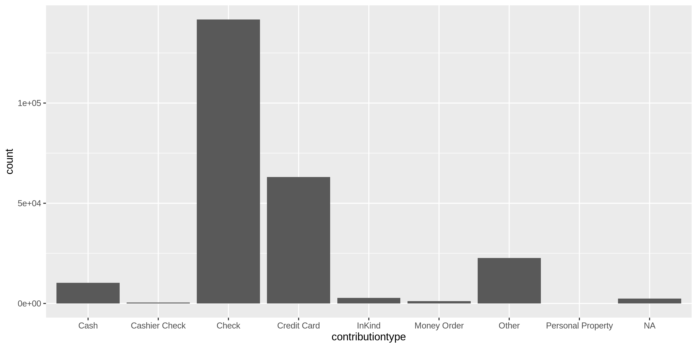
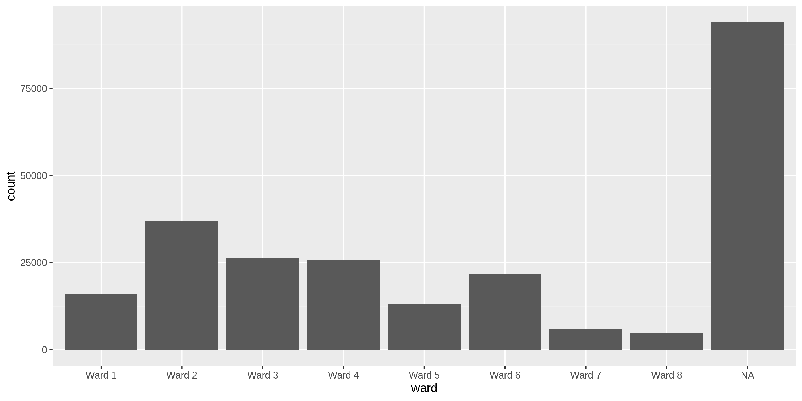

District Contributions
================
Kiernan Nicholls
2019-07-10 17:13:17

  - [Project](#project)
  - [Objectives](#objectives)
  - [Packages](#packages)
  - [Data](#data)
  - [Import](#import)
  - [Explore](#explore)

## Project

The Accountability Project is an effort to cut across data silos and
give journalists, policy professionals, activists, and the public at
large a simple way to search across huge volumes of public data about
people and organizations.

Our goal is to standardizing public data on a few key fields by thinking
of each dataset row as a transaction. For each transaction there should
be (at least) 3 variables:

1.  All **parties** to a transaction
2.  The **date** of the transaction
3.  The **amount** of money involved

## Objectives

This document describes the process used to complete the following
objectives:

1.  How many records are in the database?
2.  Check for duplicates
3.  Check ranges
4.  Is there anything blank or missing?
5.  Check for consistency issues
6.  Create a five-digit ZIP Code called `ZIP5`
7.  Create a `YEAR` field from the transaction date
8.  Make sure there is data on both parties to a transaction

## Packages

The following packages are needed to collect, manipulate, visualize,
analyze, and communicate these results. The `pacman` package will
facilitate their installation and attachment.

``` r
if (!require("pacman")) install.packages("pacman")
pacman::p_load(
  stringdist, # levenshtein value
  tidyverse, # data manipulation
  lubridate, # datetime strings
  magrittr, # pipe opperators
  janitor, # dataframe clean
  zipcode, # clean & database
  refinr, # cluster & merge
  vroom, # quickly read files
  knitr, # knit documents
  glue, # combine strings
  here, # relative storage
  fs # search storage 
)
```

This document should be run as part of the `R_campfin` project, which
lives as a sub-directory of the more general, language-agnostic
[`irworkshop/accountability_datacleaning`](https://github.com/irworkshop/accountability_datacleaning "TAP repo")
GitHub repository.

The `R_campfin` project uses the [RStudio
projects](https://support.rstudio.com/hc/en-us/articles/200526207-Using-Projects "Rproj")
feature and should be run as such. The project also uses the dynamic
`here::here()` tool for file paths relative to *your* machine.

``` r
# where dcs this document knit?
here::here()
#> [1] "/home/ubuntu/R/accountability_datacleaning/R_campfin"
```

## Data

Data comes courtesy of the Washington, [DC Office of Campaign Finance
(OCF)](https://ocf.dc.gov/ "OCF").

The data was published 2016-10-06 and was last updated 2019-05-07. Each
record represents a single contribution made.

As the [OCF
website](https://ocf.dc.gov/service/view-contributions-expenditures)
explains:

> The Office of Campaign Finance (OCF) provides easy access to all
> contributions and expenditures reported from 2003, through the current
> reporting period. Because the system is updated on a daily basis, you
> may be able to retrieve data received by OCF after the latest
> reporting period. This data is as reported, but may not be complete.

### About

The data is found on the dc.gov [OpenData
website](https://opendata.dc.gov/datasets/campaign-financial-contributions).
The file abstract reads:

> The Office of Campaign Finance (OCF) is pleased to publicly share
> election campaign contribution data. The Campaign Finance Office is
> charged with administering and enforcing the District of Columbia laws
> pertaining to campaign finance operations, lobbying activities,
> conflict of interest matters, the ethical conduct of public officials,
> and constituent service and statehood fund programs. OCF provides easy
> access to all contributions and expenditures reported from 2003,
> through the current reporting period. Because the system is updated on
> a daily basis, you may be able to retrieve data received by OCF after
> the latest reporting period. This data is as reported, but may not be
> complete. Visit the <http://ocf.dc.gov> for more information.
> 
> Users may also visit the [Candidate
> Campaign](http://geospatial.dcgis.dc.gov/ocf/) Contributions web
> application to find financial data by zip codes.

## Import

### Download

We can directly download the raw, **immutable** text file from the
OpenData website.

``` r
dir_raw <- here("dc", "contribs", "data", "raw")
dir_create(dir_raw)
download.file(
  url = "https://opendata.arcgis.com/datasets/6443e0b5b2454e86a3208b8a38fdee84_34.csv",
  destfile = glue("{dir_raw}/Campaign_Financial_Contributions.csv")
)
```

### Read

The file can be read using `vroom::vroom()` with expected variable
formats.

``` r
dc <- vroom(
  file = glue("{dir_raw}/Campaign_Financial_Contributions.csv"),
  locale = locale(tz = "US/Eastern"),
  .name_repair = make_clean_names,
  col_types = cols(
    .default = col_character(),
    ELECTIONYEAR = col_integer(),
    AMOUNT = col_double(),
    DATEOFRECEIPT = col_datetime()
  )
)

dc <- dc %>% 
  select(
    -xcoord, 
    -ycoord, 
    -fulladdress, 
    -gis_last_mod_dttm,
  )
```

## Explore

There are 244678 records of 16 variables in the full database.

``` r
head(dc)
```

    #> # A tibble: 6 x 16
    #>   objectid committeename candidatename electionyear contributorname address contributortype
    #>   <chr>    <chr>         <chr>                <int> <chr>           <chr>   <chr>          
    #> 1 1001     Re-Elect Bra… Brandon Todd          2016 Joigie Hayes    7503 1… Individual     
    #> 2 1002     Allen for DC  S. Kathryn A…         2018 Camille Mosley  7504 1… Individual     
    #> 3 1003     Fenty 2006    Adrian Fenty          2006 Camille Riggs-… 7504 1… Individual     
    #> 4 1004     Michael Brow… Michael Brown         2007 Peyton McCall … 7504 A… Corporation    
    #> 5 1005     Friends of M… Michael Brown         2008 Herbert Scott   7504 A… Individual     
    #> 6 1006     Fenty 2006    Adrian Fenty          2006 Peyton McCall,… 7504 A… Corporation    
    #> # … with 9 more variables: contributiontype <chr>, employer <chr>, employeraddress <chr>,
    #> #   amount <dbl>, dateofreceipt <dttm>, address_id <chr>, latitude <chr>, longitude <chr>,
    #> #   ward <chr>

``` r
tail(dc)
```

    #> # A tibble: 6 x 16
    #>   objectid committeename candidatename electionyear contributorname address contributortype
    #>   <chr>    <chr>         <chr>                <int> <chr>           <chr>   <chr>          
    #> 1 184995   Robert White… Robert White          2014 Jana Robinson   10817 … Individual     
    #> 2 184996   Robert White… Robert White          2014 Daniel Van Hoo… 3533 O… Individual     
    #> 3 184997   Robert White… Robert White          2014 Marcus Williams 5045 C… Individual     
    #> 4 184998   Robert White… Robert White          2014 Corey Johns     9272 A… Individual     
    #> 5 184999   Robert White… Robert White          2014 Christine Musc… 274 Ha… Individual     
    #> 6 185000   Robert White… Robert White          2014 Marianna Boyd   816 Ea… Individual     
    #> # … with 9 more variables: contributiontype <chr>, employer <chr>, employeraddress <chr>,
    #> #   amount <dbl>, dateofreceipt <dttm>, address_id <chr>, latitude <chr>, longitude <chr>,
    #> #   ward <chr>

``` r
glimpse(dc)
```

    #> Observations: 244,678
    #> Variables: 16
    #> $ objectid         <chr> "1001", "1002", "1003", "1004", "1005", "1006", "1007", "1008", "1009",…
    #> $ committeename    <chr> "Re-Elect Brandon Todd for Ward 4", "Allen for DC", "Fenty 2006", "Mich…
    #> $ candidatename    <chr> "Brandon Todd", "S. Kathryn Allen", "Adrian Fenty", "Michael Brown", "M…
    #> $ electionyear     <int> 2016, 2018, 2006, 2007, 2008, 2006, 2006, 2015, 2002, 2008, 2018, 2008,…
    #> $ contributorname  <chr> "Joigie Hayes", "Camille Mosley", "Camille Riggs-Mosley", "Peyton McCal…
    #> $ address          <chr> "7503 12th Street, NW, Washington, DC 20012", "7504 14th St NW, Washing…
    #> $ contributortype  <chr> "Individual", "Individual", "Individual", "Corporation", "Individual", …
    #> $ contributiontype <chr> "Credit Card", "Credit Card", "Check", "Check", "Check", "Check", "Chec…
    #> $ employer         <chr> NA, "Aramark", "Lee Hecht Harrisson", NA, NA, NA, "Self-employed", NA, …
    #> $ employeraddress  <chr> NA, "1101 Market St, Philadelphia, PA 19107", "Washington, DC", NA, NA,…
    #> $ amount           <dbl> 51.00, 100.00, 100.00, 250.00, 250.00, 150.00, 100.00, 100.00, 100.00, …
    #> $ dateofreceipt    <dttm> 2016-06-07 20:00:00, 2018-06-04 20:00:00, 2006-11-03 19:00:00, 2007-04…
    #> $ address_id       <chr> "253514", "256263", "256263", "257290", "257290", "257290", "257290", "…
    #> $ latitude         <chr> "38.980585260416", "38.9807376195575", "38.9807376195575", "38.98080075…
    #> $ longitude        <chr> "-77.027585850335", "-77.033663303987", "-77.033663303987", "-77.030430…
    #> $ ward             <chr> "Ward 4", "Ward 4", "Ward 4", "Ward 4", "Ward 4", "Ward 4", "Ward 4", "…

### Distinct

The variables range in their degree of distinctness.

``` r
dc %>% glimpse_fun(n_distinct)
```

    #> # A tibble: 16 x 4
    #>    var              type       n         p
    #>    <chr>            <chr>  <int>     <dbl>
    #>  1 objectid         chr   244678 1        
    #>  2 committeename    chr     1525 0.00623  
    #>  3 candidatename    chr      430 0.00176  
    #>  4 electionyear     int       17 0.0000695
    #>  5 contributorname  chr   115953 0.474    
    #>  6 address          chr   143627 0.587    
    #>  7 contributortype  chr       28 0.000114 
    #>  8 contributiontype chr        9 0.0000368
    #>  9 employer         chr    37254 0.152    
    #> 10 employeraddress  chr    21453 0.0877   
    #> 11 amount           dbl     5125 0.0209   
    #> 12 dateofreceipt    dttm    5681 0.0232   
    #> 13 address_id       chr    28692 0.117    
    #> 14 latitude         chr    37815 0.155    
    #> 15 longitude        chr    38158 0.156    
    #> 16 ward             chr        9 0.0000368

    #> Warning: Removed 28 rows containing non-finite values (stat_count).

<!-- -->

<!-- -->

<!-- -->

<!-- -->

### Missing

``` r
dc %>% glimpse_fun(count_na)
```

    #> # A tibble: 16 x 4
    #>    var              type       n        p
    #>    <chr>            <chr>  <int>    <dbl>
    #>  1 objectid         chr        0 0       
    #>  2 committeename    chr        0 0       
    #>  3 candidatename    chr    22054 0.0901  
    #>  4 electionyear     int       28 0.000114
    #>  5 contributorname  chr     1164 0.00476 
    #>  6 address          chr     1149 0.00470 
    #>  7 contributortype  chr     1452 0.00593 
    #>  8 contributiontype chr     2425 0.00991 
    #>  9 employer         chr    96892 0.396   
    #> 10 employeraddress  chr   140419 0.574   
    #> 11 amount           dbl      367 0.00150 
    #> 12 dateofreceipt    dttm       0 0       
    #> 13 address_id       chr    93945 0.384   
    #> 14 latitude         chr    93945 0.384   
    #> 15 longitude        chr    93945 0.384   
    #> 16 ward             chr    93945 0.384

``` r
dc <- dc %>% mutate(na_flag = is.na(contributorname) | is.na(amount))
```

### Duplicates

``` r
dc_dupes <- get_dupes(dc)
nrow(dc_dupes)
#> [1] 0
```

### Ranges

#### Amounts

``` r
summary(dc$amount)
#>     Min.  1st Qu.   Median     Mean  3rd Qu.     Max.     NA's 
#> -31889.2     50.0    100.0    373.7    400.0 400000.0      367
```

### Dates

``` r
summary(dc$dateofreceipt)
#>                  Min.               1st Qu.                Median                  Mean 
#> "2002-12-31 19:00:00" "2007-07-19 20:00:00" "2012-01-24 19:00:00" "2011-09-28 19:02:33" 
#>               3rd Qu.                  Max. 
#> "2015-01-01 19:00:00" "2019-05-07 20:00:00"
sum(dc$dateofreceipt > today())
#> [1] 0
```
