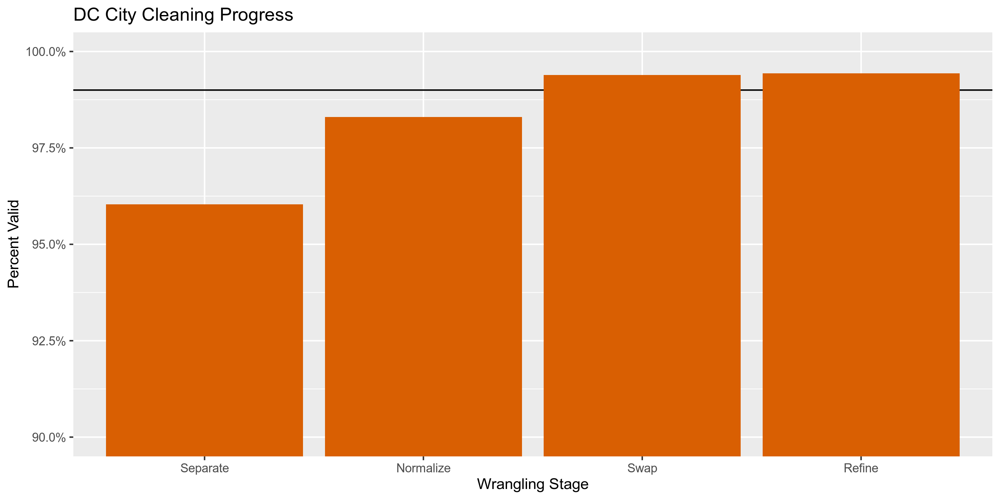

District Contributions
================
Kiernan Nicholls
2019-09-30 16:57:27

  - [Project](#project)
  - [Objectives](#objectives)
  - [Project](#project-1)
  - [Objectives](#objectives-1)
  - [Packages](#packages)
  - [Data](#data)
  - [Import](#import)
  - [Explore](#explore)
  - [Separate](#separate)
  - [Normalize](#normalize)
  - [Conclude](#conclude)
  - [Write](#write)

## Project

The Accountability Project is an effort to cut across data silos and
give journalists, policy professionals, activists, and the public at
large a simple way to search across huge volumes of public data about
people and organizations.

Our goal is to standardizing public data on a few key fields by thinking
of each dataset row as a transaction. For each transaction there should
be (at least) 3 variables:

1.  All **parties** to a transaction
2.  The **date** of the transaction
3.  The **amount** of money involved

## Objectives

This document describes the process used to complete the following
objectives:

1.  How many records are in the database?
2.  Check for duplicates
3.  Check ranges
4.  Is there anything blank or missing?
5.  Check for consistency issues
6.  Create a five-digit ZIP Code called `ZIP5`
7.  Create a `YEAR` field from the transaction date
8.  Make sure there is data on both parties to a transaction

## Project

The Accountability Project is an effort to cut across data silos and
give journalists, policy professionals, activists, and the public at
large a simple way to search across huge volumes of public data about
people and organizations.

Our goal is to standardizing public data on a few key fields by thinking
of each dataset row as a transaction. For each transaction there should
be (at least) 3 variables:

1.  All **parties** to a transaction
2.  The **date** of the transaction
3.  The **amount** of money involved

## Objectives

This document describes the process used to complete the following
objectives:

1.  How many records are in the database?
2.  Check for duplicates
3.  Check ranges
4.  Is there anything blank or missing?
5.  Check for consistency issues
6.  Create a five-digit ZIP Code called `ZIP5`
7.  Create a `YEAR` field from the transaction date
8.  Make sure there is data on both parties to a transaction

## Packages

The following packages are needed to collect, manipulate, visualize,
analyze, and communicate these results. The `pacman` package will
facilitate their installation and attachment.

The IRW’s `campfin` package will also have to be installed from GitHub.
This package contains functions custom made to help facilitate the
processing of campaign finance data.

``` r
if (!require("pacman")) install.packages("pacman")
pacman::p_load_current_gh("irworkshop/campfin")
pacman::p_load(
  tidyverse, # data manipulation
  lubridate, # datetime strings
  tidytext, # text analysis
  magrittr, # pipe opperators
  janitor, # dataframe clean
  refinr, # cluster and merge
  scales, # format strings
  knitr, # knit documents
  vroom, # read files fast
  glue, # combine strings
  here, # relative storage
  fs # search storage 
)
```

This document should be run as part of the `R_campfin` project, which
lives as a sub-directory of the more general, language-agnostic
[`irworkshop/accountability_datacleaning`](https://github.com/irworkshop/accountability_datacleaning "TAP repo")
GitHub repository.

The `R_campfin` project uses the [RStudio
projects](https://support.rstudio.com/hc/en-us/articles/200526207-Using-Projects "Rproj")
feature and should be run as such. The project also uses the dynamic
`here::here()` tool for file paths relative to *your* machine.

``` r
# where does this document knit?
here::here()
#> [1] "/home/kiernan/R/accountability_datacleaning/R_campfin"
```

## Data

Data comes courtesy of the Washington, [DC Office of Campaign Finance
(OCF)](https://ocf.dc.gov/ "OCF").

The data was published 2016-10-06 and was last updated 2019-05-07. Each
record represents a single contribution made.

As the [OCF
website](https://ocf.dc.gov/service/view-contributions-expenditures)
explains:

> The Office of Campaign Finance (OCF) provides easy access to all
> contributions and expenditures reported from 2003, through the current
> reporting period. Because the system is updated on a daily basis, you
> may be able to retrieve data received by OCF after the latest
> reporting period. This data is as reported, but may not be complete.

### About

The data is found on the dc.gov [OpenData
website](https://opendata.dc.gov/datasets/campaign-financial-expenditures).
The file abstract reads:

> The Office of Campaign Finance (OCF), in cooperation with OCTO, is
> pleased to publicly share election campaign expenditures data. The
> Campaign Finance Office is charged with administering and enforcing
> the District of Columbia laws pertaining to campaign finance
> operations, lobbying activities, conflict of interest matters, the
> ethical conduct of public officials, and constituent service and
> statehood fund programs. OCF provides easy access to all contributions
> and expenditures reported from 2003, through the current reporting
> period. Because the system is updated on a daily basis, you may be
> able to retrieve data received by OCF after the latest reporting
> period. This data is as reported, but may not be complete. Visit the
> <http://ocf.dc.gov> for more information.

## Import

The most recent file can be read directly from the OCF with
`readr::read_csv()`.

``` r
dir_raw <- here("dc", "expends", "data", "raw")
dir_create(dir_raw)
raw_url <- "https://opendata.arcgis.com/datasets/f9d727168d204aa79c8be9091c967604_35.csv"

dc <- 
  read_csv(raw_url) %>% 
  clean_names("snake") %>%
  mutate_if(is_character, str_to_upper) %>% 
  select(1:7, 8)
```

## Explore

There are 101437 records of 8 variables in the full database.

``` r
head(dc)
```

    #> # A tibble: 6 x 8
    #>   objectid candidatename payee      address          purpose  amount transactiondate     address_id
    #>      <dbl> <chr>         <chr>      <chr>            <chr>     <dbl> <dttm>                   <dbl>
    #> 1     1001 PATRICK MARA  DC WATER … 810 FIRST STREE… UTILITY  1.32e1 2008-08-30 00:00:00      79999
    #> 2     1002 PATRICK MARA  DANIEL HU… 2350 H STREET N… POSTAGE  2.07e1 2008-08-30 00:00:00     243315
    #> 3     1003 PATRICK MARA  DANIEL HU… 2350 H STREET N… SUPPLIES 4.60e1 2008-08-30 00:00:00     243315
    #> 4     1004 PATRICK MARA  DANIEL HU… 2350 H STREET N… SALARY/… 7.50e2 2008-08-30 00:00:00     243315
    #> 5     1005 PATRICK MARA  DANIEL HU… 2350 H STREET N… POSTAGE  1.58e0 2008-08-30 00:00:00     243315
    #> 6     1006 <NA>          WASHINGTO… "1725 \"I\" STR… TRANSFER 3.06e3 2006-07-14 00:00:00     279349

``` r
tail(dc)
```

    #> # A tibble: 6 x 8
    #>   objectid candidatename  payee   address          purpose    amount transactiondate     address_id
    #>      <dbl> <chr>          <chr>   <chr>            <chr>       <dbl> <dttm>                   <dbl>
    #> 1   101432 WILLIAM SIMONS HELEN … 514 A. ST. SE, … PRINTING     110. 2004-02-25 00:00:00      12651
    #> 2   101433 JOHN SALATTI   ALEX S… 514 D ST., SE, … REFUND       500  2012-02-29 00:00:00      12654
    #> 3   101434 <NA>           JERALD… 514 G ST NE, WA… SALARY/ST…   174. 2014-07-21 00:00:00      12663
    #> 4   101435 VINCENT GRAY   STACEY… 514 IRVING STRE… RENTAL       100  2006-06-01 00:00:00     229423
    #> 5   101436 KENYAN MCDUFF… MBR PA… 514 RHODE ISLAN… <NA>        4400  2018-03-27 00:00:00     288529
    #> 6   101437 KWAME BROWN    SAFEWAY 514 RHODE ISLAN… **CONSTIT…   100  2006-12-18 00:00:00     288529

``` r
glimpse(dc)
```

    #> Observations: 101,437
    #> Variables: 8
    #> $ objectid        <dbl> 1001, 1002, 1003, 1004, 1005, 1006, 1007, 1008, 1009, 1010, 1011, 1012, …
    #> $ candidatename   <chr> "PATRICK MARA", "PATRICK MARA", "PATRICK MARA", "PATRICK MARA", "PATRICK…
    #> $ payee           <chr> "DC WATER AND SEWER AUTHORITY", "DANIEL HUEY", "DANIEL HUEY", "DANIEL HU…
    #> $ address         <chr> "810 FIRST STREET NE SUITE 1100, WASHINGTON, DC 20002", "2350 H STREET N…
    #> $ purpose         <chr> "UTILITY", "POSTAGE", "SUPPLIES", "SALARY/STIPEND", "POSTAGE", "TRANSFER…
    #> $ amount          <dbl> 13.24, 20.66, 46.00, 750.00, 1.58, 3061.00, 125.00, 16.30, 3.00, 16.99, …
    #> $ transactiondate <dttm> 2008-08-30, 2008-08-30, 2008-08-30, 2008-08-30, 2008-08-30, 2006-07-14,…
    #> $ address_id      <dbl> 79999, 243315, 243315, 243315, 243315, 279349, 301545, 241782, 303170, N…

### Distinct

The variables range in their degree of distinctness.

``` r
glimpse_fun(dc, n_distinct)
```

    #> # A tibble: 8 x 4
    #>   col             type       n       p
    #>   <chr>           <chr>  <dbl>   <dbl>
    #> 1 objectid        dbl   101437 1      
    #> 2 candidatename   chr      429 0.00423
    #> 3 payee           chr    30184 0.298  
    #> 4 address         chr    37955 0.374  
    #> 5 purpose         chr     7234 0.0713 
    #> 6 amount          dbl    23020 0.227  
    #> 7 transactiondate dttm    5597 0.0552 
    #> 8 address_id      dbl     9641 0.0950

The `purpose` variable is an open ended text field.

``` r
sample(dc$purpose, 10) %>% 
  cat(sep = "\n")
```

    #> BANK FEES
    #> NA
    #> IN-KIND**
    #> **PIZZA FOR BALD EAGLE HEADBANGER'S BOXING CLUB
    #> **DONATION
    #> NA
    #> UTILITY
    #> SALARY/STIPEND
    #> BANK FEES
    #> LOAN REPAYMENT

But we can perform token analysis on the strings.

``` r
dc %>% 
  filter(!is.na(purpose)) %>% 
  unnest_tokens(word, purpose) %>% 
  anti_join(stop_words) %>% 
  count(word, sort = TRUE) %>% 
  head(20) %>% 
  ggplot(aes(reorder(word, n), n)) +
  geom_col(aes(fill = n)) +
  scale_y_continuous(labels = comma) +
  scale_fill_continuous(guide = FALSE) +
  coord_flip() +
  labs(
    title = "DC Expenditure Purposes",
    x = "Word", 
    y = "Frequency"
  )
```

<!-- -->

### Missing

There are several variables missing key values:

``` r
glimpse_fun(dc, count_na)
```

    #> # A tibble: 8 x 4
    #>   col             type      n       p
    #>   <chr>           <chr> <dbl>   <dbl>
    #> 1 objectid        dbl       0 0      
    #> 2 candidatename   chr   11807 0.116  
    #> 3 payee           chr     956 0.00942
    #> 4 address         chr     959 0.00945
    #> 5 purpose         chr   21621 0.213  
    #> 6 amount          dbl     347 0.00342
    #> 7 transactiondate dttm      0 0      
    #> 8 address_id      dbl   46733 0.461

Any row with a missing `candidatename`, `payee`, *or* `amount` will have
a `TRUE` value in the new `na_flag` variable.

``` r
dc <- flag_na(dc, candidatename, payee, amount)
sum(dc$na_flag)
#> [1] 11866
percent(mean(dc$na_flag))
#> [1] "11.7%"
```

### Duplicates

There are no duplicate records.

``` r
dc <- flag_dupes(dc, everything())
sum(dc$dupe_flag)
#> [1] 0
dc <- select(dc, -dupe_flag)
```

### Ranges

#### Amounts

The `amount` varies from $-96,037.71 to $513,240.

``` r
summary(dc$amount)
#>     Min.  1st Qu.   Median     Mean  3rd Qu.     Max.     NA's 
#> -96037.7     40.0    135.4    945.8    500.0 513240.0      347
sum(dc$amount < 0, na.rm = TRUE)
#> [1] 91
```

<!-- -->

#### Dates

The dates range from  and -. There are 0 records with a date greater
than 2019-09-30.

``` r
summary(as_date(dc$transactiondate))
#>         Min.      1st Qu.       Median         Mean      3rd Qu.         Max. 
#> "2003-01-01" "2007-04-30" "2011-11-04" "2011-08-08" "2014-11-04" "2019-05-08"
sum(dc$transactiondate > today())
#> [1] 0
```

<!-- -->

<!-- -->

Since we’ve already used `readr::parse_datetime()`, we can use
`lubridate::year()` to create a new variable representing the year of
the receipt.

``` r
dc <- mutate(dc, transactionyear = year(transactiondate))
```

## Separate

We will have to break the `address` variable into distinct variables for
each component (address, city, state, ZIP).

``` r
select(sample_frac(dc), address)
```

    #> # A tibble: 101,437 x 1
    #>    address                                    
    #>    <chr>                                      
    #>  1 PO BOX 11496 , WASHINGTON, DC 20008        
    #>  2 4512 CURTIS AVE., BALTIMORE, MD 21226      
    #>  3 7815 WOODMONT AVE, BETHESDA, MD 20814      
    #>  4 816 E STREET NE, WASHINGTON, DC 20002      
    #>  5 555 MARKET  STREET, SAN FRANCISCO, CA 94104
    #>  6 2411 18TH STREET, SE, WASHINGTON, DC 20003 
    #>  7 3903 MEADOWHILL ROAD, SPRINGDALE, MD 20774 
    #>  8 9930 LOGAN DRIVE, POTOMAC, MD 20854        
    #>  9 3717 GEORGIA AVE NW, WASHINGTON, DC 20010  
    #> 10 184 BERRY ST, SAN FRACISCO, CA 94107       
    #> # … with 101,427 more rows

First, we can split the `address` variable into new columns at each
comma in the original variable using `tidyr::separate()`

``` r
dc %>% separate(
  col = address,
  into = c(glue("street{1:5}"), "city_sep", "state_zip"),
  sep = ",\\s",
  remove = FALSE,
  extra = "merge",
  fill = "left"
) -> dc
```

Since the street address portion of the `address` variable can contain a
wide variety of components, we have split the original column into an
excessive number of new columns. Now, we can use `tidyr::unite()` to
merge those many columns back into a single `address_sep` variable.

``` r
dc %>% unite(
  starts_with("street"),
  col = "address_sep",
  sep = " ",
  na.rm = TRUE,
  remove = TRUE
) -> dc
```

Finally, the state and ZIP code portion of the string is not separated
by a comma, so we will have to separate this into two strings based on
the space before the ZIP code digits.

``` r
dc %>% separate(
  col = state_zip,
  into = c("state_sep", "zip_sep"),  
  sep = "\\s{1,}(?=\\d)",
  remove = TRUE
) -> dc
```

    #> # A tibble: 101,437 x 5
    #>    address                                     address_sep        city_sep        state_sep zip_sep
    #>    <chr>                                       <chr>              <chr>           <chr>     <chr>  
    #>  1 2441 LINDEN LANE, SILVER SPRING, MD 20910   2441 LINDEN LANE   SILVER SPRING   MD        20910  
    #>  2 MAIN CITY ADDRESS, WASHINGTON, DC 20000     MAIN CITY ADDRESS  WASHINGTON      DC        20000  
    #>  3 1512 14TH STREET NW, WASHINGTON, DC 20010   1512 14TH STREET … WASHINGTON      DC        20010  
    #>  4 1653 BENNING RD., NE, WASHINGTON, DC 20002  1653 BENNING RD. … WASHINGTON      DC        20002  
    #>  5 1612 K STREET NW, WASHINGTON, DC 20006      1612 K STREET NW   WASHINGTON      DC        20006  
    #>  6 6115 MARLBORO PIKE, DISTRICT HEIGHTS, MD 2… 6115 MARLBORO PIKE DISTRICT HEIGH… MD        20747  
    #>  7 335 O STREET, SW, WASHINGTON, DC 20024      335 O STREET SW    WASHINGTON      DC        20024  
    #>  8 PO BOX 62401, WASHINGTON, DC 20019          PO BOX 62401       WASHINGTON      DC        20019  
    #>  9 1625 16TH STREET NW, WASHINGTON, DC 20009   1625 16TH STREET … WASHINGTON      DC        20009  
    #> 10 601 EDGEWOOD ST NE, WASHINGTON, DC 20017    601 EDGEWOOD ST NE WASHINGTON      DC        20017  
    #> # … with 101,427 more rows

There are a number of columns where the lack of a component in the
original `address` has caused the separation to incorrectly shift
content.

    #> # A tibble: 83 x 5
    #>    address                                address_sep        city_sep           state_sep   zip_sep
    #>    <chr>                                  <chr>              <chr>              <chr>       <chr>  
    #>  1 1712 SURREY LANE NW, WASHINGTON 20007  ""                 1712 SURREY LANE … WASHINGTON  20007  
    #>  2 P.O. BOX 64468, ST PAUL, MINNESOTA 55… P.O. BOX 64468     ST PAUL            MINNESOTA   55164  
    #>  3 2211 NORTH FIRST STREET , SAN JOSE 94… ""                 "2211 NORTH FIRST… SAN JOSE    94043  
    #>  4 22505 4TH ST NW, WASHINGTON 22059      ""                 22505 4TH ST NW    WASHINGTON  22059  
    #>  5 1514 SHIPPEN LN SE, WASHINGTON 20020   ""                 1514 SHIPPEN LN SE WASHINGTON  20020  
    #>  6 ONE WEST FOURTH STREET, WINSTON-SALEM… ONE WEST FOURTH S… WINSTON-SALEM      NORTH CARO… 27101  
    #>  7 URELL ST. NW, WASHINGTON 00000         ""                 URELL ST. NW       WASHINGTON  00000  
    #>  8 1200 H STREET NE, WASHINGTON  20014    ""                 1200 H STREET NE   WASHINGTON  20014  
    #>  9 2100 19TH ST NW APT 402, WASHINGTON 2… ""                 2100 19TH ST NW A… WASHINGTON  20009  
    #> 10 P.O. BOX 2308, OMAHA, NEBRASKA 68103   P.O. BOX 2308      OMAHA              NEBRASKA    68103  
    #> # … with 73 more rows

We can fix many of these errors using index subsetting. The most common
error is the original `address` leaving out the “DC” part of the string.

``` r
z <- dc[which(dc$state_sep == "WASHINGTON" & dc$address_sep == ""), ]
z$address_sep <- z$city_sep
z$city_sep <- z$state_sep
z$state_sep <- "DC"
dc[which(dc$state_sep == "WASHINGTON" & dc$address_sep == ""), ] <- z
z <- dc[which(dc$state_sep %out% valid_state & !is.na(dc$state_sep) & dc$address_sep == ""), ]
z$address_sep <- z$city_sep
z$city_sep <- z$state_sep
z$state_sep <- NA
dc[which(dc$state_sep %out% valid_state & !is.na(dc$state_sep) & dc$address_sep == ""), ] <- z
```

The remaining invalid separations are simply long-form state names,
which can be fixed in the normalization stage.

    #> # A tibble: 28 x 5
    #>    address                                address_sep            city_sep         state_sep zip_sep
    #>    <chr>                                  <chr>                  <chr>            <chr>     <chr>  
    #>  1 1914 WINDHAM LANE, SILVER SPRING, MAR… 1914 WINDHAM LANE      SILVER SPRING    MARYLAND  20902  
    #>  2 2 LACEY STREET LEVEL 2 SURRY HILLS, N… 2 LACEY STREET LEVEL … NEW SOUTH WALES… NA        02010  
    #>  3 2021 E. LAKE MARY BLVD, SANFORD, FLOR… 2021 E. LAKE MARY BLVD SANFORD          FLORIDA   32773  
    #>  4 270 18TH STREET, BRANDON, MANITOBA, C… 270 18TH STREET BRAND… MANITOBA         CANADA    70609  
    #>  5 6150 OXON HILL ROAD, OXON HILL, MARYL… 6150 OXON HILL ROAD    OXON HILL        MARYLAND  20745  
    #>  6 P.O. BOX 64468, ST PAUL, MINNESOTA 55… P.O. BOX 64468         ST PAUL          MINNESOTA 55164  
    #>  7 829 QUINCY STREET NW, WASHINGTON,  20… 829 QUINCY STREET NW   WASHINGTON       ""        20011  
    #>  8 6422 GEORGIA AVENUE, N.W., WASHINGTON… 6422 GEORGIA AVENUE    N.W.             WASHINGT… 20011  
    #>  9 1715 MINNESOTA AVE, SE SUITE 307, WAS… 1715 MINNESOTA AVE SE… WASHINGTON       ""        20020  
    #> 10 11400 W.OLYMPIC BLVD. SUITE 200, LOS … 11400 W.OLYMPIC BLVD.… LOS ANGELES      CALIFORN… 90064  
    #> # … with 18 more rows

## Normalize

Once these components of `address` have been separated into their
respective columns, we can use the `campfin::normal_*()` functions to
improve searchability.

### Address

The `campfin::normal_address()` function can be used to improve
consistency by removing punctuation and expanding abbreviations.

``` r
dc <- dc %>% 
  mutate(
    address_norm = normal_address(
      address = address_sep,
      add_abbs = usps_street,
      na_rep = TRUE
    )
  )
```

    #> # A tibble: 33,344 x 2
    #>    address_sep                      address_norm                               
    #>    <chr>                            <chr>                                      
    #>  1 901 RI AVE. NE.                  901 RI AVENUE NORTHEAST                    
    #>  2 1130 CONNECTICUT AVE. NW STE 200 1130 CONNECTICUT AVENUE NORTHWEST SUITE 200
    #>  3 900 SECOND ST. NE #206           900 SECOND STREET NORTHEAST 206            
    #>  4 "15955 LA CANTERA PARKWAY "      15955 LA CANTERA PARKWAY                   
    #>  5 "5911 APPLEGATE PL "             5911 APPLEGATE PLACE                       
    #>  6 4809 COLONEL ASHTON PL           4809 COLONEL ASHTON PLACE                  
    #>  7 2725 DUMBARTON STREET NW         2725 DUMBARTON STREET NORTHWEST            
    #>  8 2537 18TH STREET SE              2537 18TH STREET SOUTHEAST                 
    #>  9 2500 MINNESOTA AVE SE            2500 MINNESOTA AVENUE SOUTHEAST            
    #> 10 716 QUACKENBOS STREET N.W.       716 QUACKENBOS STREET NORTHWEST            
    #> # … with 33,334 more rows

### ZIP

Similarly, the `campfin::normal_zip()` function can be used to form
valid 5-digit US ZIP codes.

``` r
dc <- dc %>% 
  mutate(
    zip_norm = normal_zip(
      zip = zip_sep,
      na_rep = TRUE
    )
  )
```

    #> # A tibble: 124 x 2
    #>    zip_sep    zip_norm
    #>    <chr>      <chr>   
    #>  1 027252525  02725   
    #>  2 084016621  08401   
    #>  3 20010-2619 20010   
    #>  4 20002-4406 20002   
    #>  5 8530974350 85309   
    #>  6 201513229  20151   
    #>  7 372305183  37230   
    #>  8 20010-2002 20010   
    #>  9 45274-2572 45274   
    #> 10 482363758  48236   
    #> # … with 114 more rows

This process improves the consistency of our ZIP code variable and
removes some obviously invalid ZIP codes (e.g., 00000, 99999).

``` r
progress_table(
  dc$zip_sep,
  dc$zip_norm,
  compare = valid_zip
)
```

    #> # A tibble: 2 x 6
    #>   stage    prop_in n_distinct prop_na n_out n_diff
    #>   <chr>      <dbl>      <dbl>   <dbl> <dbl>  <dbl>
    #> 1 zip_sep    0.960       2482 0.00946  4057    281
    #> 2 zip_norm   0.992       2366 0.0396    774    153

### State

There also a handful of invalid state abbreviations in `state_sep`,
which can be repaired or removed with `campfin::normal_state()`

``` r
setdiff(dc$state_sep, valid_state)
```

    #>  [1] NA               "CALIFORNIA"     "MARYLAND"       "WASHINGTON"     "NJ -7076"      
    #>  [6] "MINNESOTA"      "NORTH CAROLINA" "NEBRASKA"       "FLORIDA"        "CANADA"        
    #> [11] "PENNSYLVANIA"   "MASSACHUSETTS"  ""               "NA"

``` r
dc <- dc %>% 
  mutate(
    state_norm = normal_state(
      state = state_sep,
      abbreviate = TRUE,
      na = c("", "NA"),
      na_rep = TRUE,
      valid = NULL
    )
  )
```

``` r
progress_table(
  dc$state_sep,
  dc$state_norm,
  compare = valid_state
)
```

    #> # A tibble: 2 x 6
    #>   stage      prop_in n_distinct prop_na n_out n_diff
    #>   <chr>        <dbl>      <dbl>   <dbl> <dbl>  <dbl>
    #> 1 state_sep    1.000         65 0.00998    31     14
    #> 2 state_norm   1.000         53 0.0100      1      2

### City

The `city_sep` variable is the most difficult to normalize due to the
sheer number of possible valid values and the variety in which those
values can be types. There is a four stage process we can use to make
extremely confident changes.

1.  **Normalize** the values with `campfin::normal_zip()`.
2.  **Compare** to the *expected* value with `dplyr::left_join()`.
3.  **Swap** with some expected values using `campfin::str_dist()` and
    `campfin::is_abbrev()`.
4.  **Refine** the remaining similar values with
    `refinr::n_gram_merge()`.

#### Normal City

``` r
dc <- dc %>% 
  mutate(
    city_norm = normal_city(
      city = str_replace(city_sep, "DC", "WASHINGTON"),
      geo_abbs = usps_city,
      st_abbs = c("DC", "D C"),
      na = invalid_city,
      na_rep = TRUE
    ),
    city_norm = expand_abbrev(city_norm, c("HTS" = "HEIGHTS"))
  )
```

    #> # A tibble: 159 x 4
    #>    city_sep       city_norm       state_norm     n
    #>    <chr>          <chr>           <chr>      <int>
    #>  1 DC             WASHINGTON      DC            57
    #>  2 FT. WASHINGTON FORT WASHINGTON MD            43
    #>  3 WINSTON-SALEM  WINSTON SALEM   NC            40
    #>  4 FT. LAUDERDALE FORT LAUDERDALE FL            39
    #>  5 "DC "          WASHINGTON      DC            33
    #>  6 FT WASHINGTON  FORT WASHINGTON MD            29
    #>  7 FT LAUDERDALE  FORT LAUDERDALE FL            28
    #>  8 ROCHESTER,     ROCHESTER       NY            23
    #>  9 MT. RAINIER    MOUNT RAINIER   MD            21
    #> 10 ST. LOUIS      SAINT LOUIS     MO            17
    #> # … with 149 more rows

#### Match City

To assess the normalization of city values, it’s useful to compare our
`city_norm` value to the *expected* city value for that record’s state
and ZIP code. To do this, we can use `dplyr::left_join()` with the
`campfin::zipcodes` data frame.

``` r
dc <- dc %>% 
  left_join(zipcodes, by = c("zip_norm" = "zip", "state_norm" = "state")) %>% 
  rename(city_match = city)
```

Most of our `city_match` values are the same as `city_norm`, and most of
the different values are records where no matched city could be found
for a record’s state and/or ZIP code.

``` r
percent(mean(dc$city_norm == dc$city_match, na.rm = TRUE))
```

    #> [1] "96.2%"

``` r
percent(prop_na(dc$city_match))
```

    #> [1] "5.58%"

#### Swap city

The next step involves comparing our `city_norm` values to `city_match`.
We want to check whether `city_match` might be the valid value for any
invalid `city_norm`. We only want to use this matched value if we can be
very confident. To do this, we’ll use two tests: (1)
`campfin::str_dist()` checks the string distance between the two values,
(2) `campfin::is_abbrev()` checks whether `city_norm` might be an
abbreviation of `city_match`. See the help files (`?is_abbrev`) to
understand exactly what these two functions test.

``` r
dc <- dc %>%
  # remove any empty strings
  map_if(is_character, na_if, "") %>% 
  as_tibble() %>% 
  mutate(
    match_dist = str_dist(city_norm, city_match),
    match_abb = is_abbrev(city_norm, city_match)
  )
```

``` r
summary(dc$match_dist)
```

    #>    Min. 1st Qu.  Median    Mean 3rd Qu.    Max.    NA's 
    #>   0.000   0.000   0.000   0.252   0.000  20.000    5742

``` r
sum(dc$match_abb, na.rm = TRUE)
```

    #> [1] 112

If a `city_norm` value has either (1) a really small string distance or
(2) appears to be an abbreviation of `city_match`, we can confidently
use the matched value of the messy `city_norm`.

``` r
dc <- dc %>% 
  mutate(
    city_swap = if_else(
      condition = match_abb | match_dist == 1,
      true = city_match,
      false = city_norm
    )
  )
```

Here we can see the 112 records where `city_norm` appears to be an
abbreviation of `city_match`, so the later was used in `city_swap`.

``` r
dc %>% 
  filter(match_abb) %>% 
  count(state_norm, zip_norm, city_norm, city_match, match_abb, sort = TRUE)
```

    #> # A tibble: 55 x 6
    #>    state_norm zip_norm city_norm    city_match       match_abb     n
    #>    <chr>      <chr>    <chr>        <chr>            <lgl>     <int>
    #>  1 NJ         07646    NEWFORD      NEW MILFORD      TRUE         13
    #>  2 CA         90013    LA           LOS ANGELES      TRUE          9
    #>  3 IL         60611    CHI          CHICAGO          TRUE          8
    #>  4 VA         22305    ALEX         ALEXANDRIA       TRUE          6
    #>  5 MD         20769    GLENDALE     GLENN DALE       TRUE          5
    #>  6 MD         21152    SPARKS       SPARKS GLENCOE   TRUE          5
    #>  7 CA         94025    MENLO        MENLO PARK       TRUE          4
    #>  8 DC         20005    WASHIN       WASHINGTON       TRUE          3
    #>  9 CA         94103    SAN          SAN FRANCISCO    TRUE          2
    #> 10 CT         06250    MANSFIELD CT MANSFIELD CENTER TRUE          2
    #> # … with 45 more rows

Furthermore, 985 records has a string distance of only 1, meaning only 1
character was different between `city_norm` and `city_match`, so again
the later was used in `city_swap`.

``` r
dc %>% 
  filter(match_dist == 1) %>% 
  count(state_norm, zip_norm, city_norm, city_match, match_abb, sort = TRUE)
```

    #> # A tibble: 330 x 6
    #>    state_norm zip_norm city_norm       city_match      match_abb     n
    #>    <chr>      <chr>    <chr>           <chr>           <lgl>     <int>
    #>  1 MD         20743    CAPITAL HEIGHTS CAPITOL HEIGHTS FALSE        84
    #>  2 PA         15230    PITTSBURG       PITTSBURGH      FALSE        47
    #>  3 CA         94107    SAN FRACISCO    SAN FRANCISCO   FALSE        39
    #>  4 CA         94103    SAN FRACISCO    SAN FRANCISCO   FALSE        33
    #>  5 MA         02144    SOMMERVILLE     SOMERVILLE      FALSE        33
    #>  6 AZ         85260    SCOTTESDALE     SCOTTSDALE      FALSE        28
    #>  7 CA         94043    MOUNTAINVIEW    MOUNTAIN VIEW   FALSE        28
    #>  8 MD         20646    LAPLATA         LA PLATA        FALSE        27
    #>  9 MD         20712    MOUNT RANIER    MOUNT RAINIER   FALSE        19
    #> 10 CA         94107    SAN FRANSISCO   SAN FRANCISCO   FALSE        18
    #> # … with 320 more rows

#### Refine City

The above steps catch most changes, but we can do one last check using
the OpenRefine key collision and n-gram merging algorithms to check for
any further valid fixes. These algorithms group similar values and use
the most common value in each group.

``` r
good_refine <- dc %>% 
  mutate(
    city_refine = city_swap %>% 
      key_collision_merge(dict = valid_city) %>% 
      n_gram_merge(numgram = 1)
  ) %>% 
  # keep only rows where a change was made
  filter(city_refine != city_swap) %>% 
  # keep only rows where a _correct_ change was made
  inner_join(
    y = zipcodes,
    by = c(
      "city_refine" = "city",
      "state_norm" = "state",
      "zip_norm" = "zip"
    )
  )
```

Very few changes were made this way, but they are useful changes
nonetheless.

``` r
count(x = good_refine, state_norm, city_swap, city_refine, sort = TRUE)
```

    #> # A tibble: 15 x 4
    #>    state_norm city_swap             city_refine        n
    #>    <chr>      <chr>                 <chr>          <int>
    #>  1 DC         WASHINGTON WASHINGTON WASHINGTON        20
    #>  2 OH         CINCINATTI            CINCINNATI         4
    #>  3 PA         PHILADEPHILA          PHILADELPHIA       4
    #>  4 CA         SAN FRANSICO          SAN FRANCISCO      2
    #>  5 PA         PHILIDEPHIA           PHILADELPHIA       2
    #>  6 WV         SO CHARLESTON         CHARLESTON         2
    #>  7 DC         WASHGINTTON           WASHINGTON         1
    #>  8 DC         WASHINGTONWASHINGTON  WASHINGTON         1
    #>  9 KY         LOUSIVLLE             LOUISVILLE         1
    #> 10 MD         UPPER MARLOBOR        UPPER MARLBORO     1
    #> 11 NM         ALBURQURQUE           ALBUQUERQUE        1
    #> 12 OH         VERSALLIES            VERSAILLES         1
    #> 13 PA         PHILLIDELPHIA         PHILADELPHIA       1
    #> 14 SD         SOUIX FALLS           SIOUX FALLS        1
    #> 15 VA         FAIRRRFAX             FAIRFAX            1

``` r
dc <- dc %>% 
  left_join(good_refine) %>% 
  mutate(city_refine = coalesce(city_refine, city_swap))
```

#### City Progress

``` r
dc %>% 
  filter(city_refine %out% valid_city) %>% 
  count(state_norm, zip_norm, city_refine, sort = TRUE) %>% 
  drop_na()
```

    #> # A tibble: 236 x 4
    #>    state_norm zip_norm city_refine           n
    #>    <chr>      <chr>    <chr>             <int>
    #>  1 MD         20785    LANDOVER            353
    #>  2 MD         20785    CHEVERLY             77
    #>  3 MD         20781    CHEVERLY             56
    #>  4 MN         55126    SHOREVIEW            28
    #>  5 MD         20784    LANDOVER             20
    #>  6 DC         20009    ISRAEL               18
    #>  7 MD         20743    SEAT PLEASANT        15
    #>  8 DC         20009    ADAMS MORGAN         14
    #>  9 MD         20852    NORTH BETHESDA       14
    #> 10 CO         80111    GREENWOOD VILLAGE    13
    #> # … with 226 more rows

By two common Washington/Maryland suburbs to our list of common cities,
we can see our normalization process has brought us above 99% “valid.”

``` r
valid_city <- c(valid_city, "LANDOVER", "CHEVERLY")
```

``` r
progress_table(
  dc$city_sep,
  dc$city_norm,
  dc$city_swap,
  dc$city_refine,
  compare = valid_city
)
```

    #> # A tibble: 4 x 6
    #>   stage       prop_in n_distinct prop_na n_out n_diff
    #>   <chr>         <dbl>      <dbl>   <dbl> <dbl>  <dbl>
    #> 1 city_sep      0.960       1813 0.00998  3984    855
    #> 2 city_norm     0.983       1512 0.0122   1705    517
    #> 3 city_swap     0.994       1184 0.0566    583    212
    #> 4 city_refine   0.994       1169 0.0566    540    197

<!-- -->

<!-- -->

## Conclude

1.  How are 101437 records in the database.
2.  There are 0 duplicate records.
3.  The `amount` values range from $-96,037.71 to $513,240.
4.  The `transactiondate` ranges from to .
5.  The 11866 records missing a `candidatename` or `payee` value are
    flagged with the logical `na_flag` variable.
6.  Consistency in ZIP codes and state abbreviations has been fixed from
    `address`.
7.  The `zip_clean` variable contains the 5 digit ZIP from `address`.
8.  The `transactionyear` variable contains the 4 digit year of the
    receipt.
9.  Only 88.3% of records contain all the data needed to identify the
    transaction.

## Write

``` r
dir_proc <- here("dc", "expends", "data", "processed")
dir_create(dir_proc)

write_csv(
  x = dc,
  na = "",
  path = glue("{dir_proc}/dc_expends_clean.csv")
)
```
