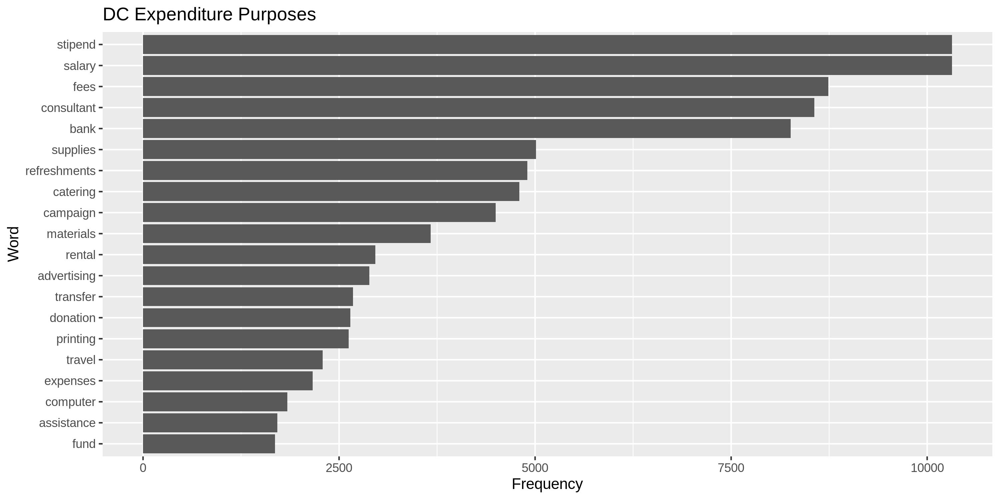
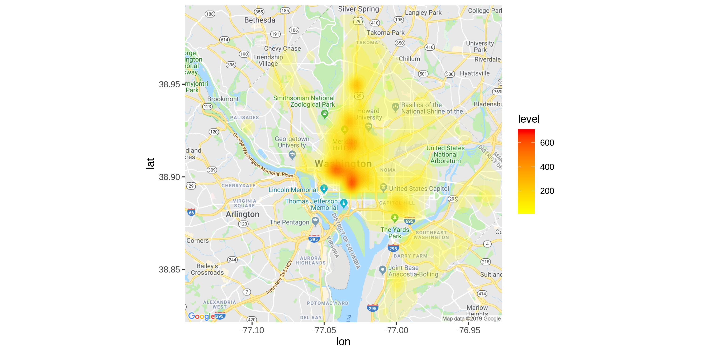
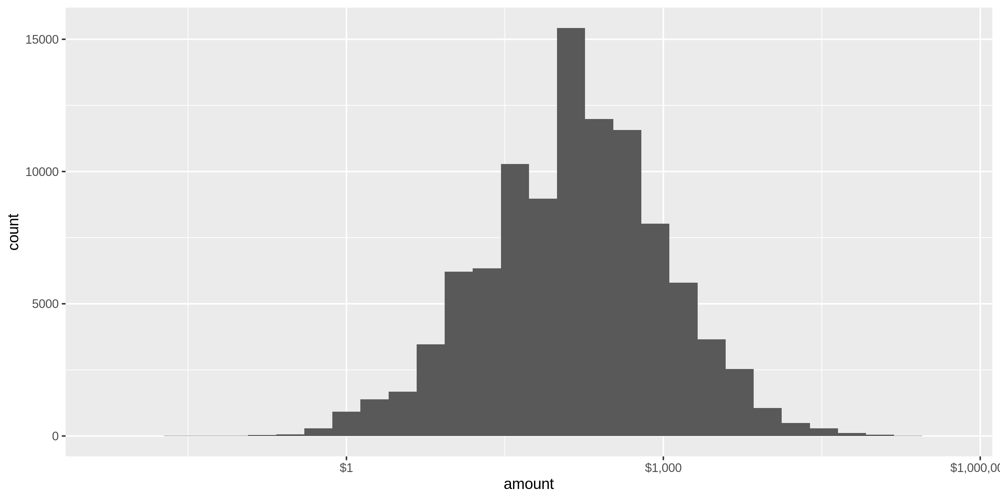
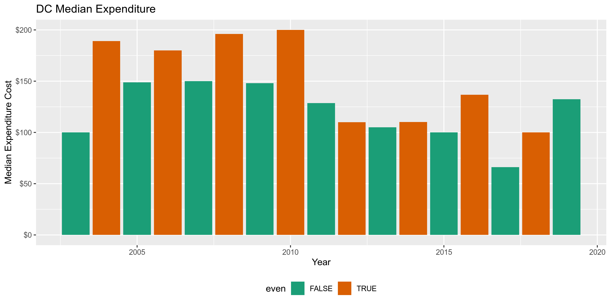

District Contributions
================
Kiernan Nicholls
2019-07-15 14:07:25

  - [Project](#project)
  - [Objectives](#objectives)
  - [Packages](#packages)
  - [Data](#data)
  - [Import](#import)
  - [Explore](#explore)
  - [Wrangle](#wrangle)
  - [Conclude](#conclude)
  - [Write](#write)

## Project

The Accountability Project is an effort to cut across data silos and
give journalists, policy professionals, activists, and the public at
large a simple way to search across huge volumes of public data about
people and organizations.

Our goal is to standardizing public data on a few key fields by thinking
of each dataset row as a transaction. For each transaction there should
be (at least) 3 variables:

1.  All **parties** to a transaction
2.  The **date** of the transaction
3.  The **amount** of money involved

## Objectives

This document describes the process used to complete the following
objectives:

1.  How many records are in the database?
2.  Check for duplicates
3.  Check ranges
4.  Is there anything blank or missing?
5.  Check for consistency issues
6.  Create a five-digit ZIP Code called `ZIP5`
7.  Create a `YEAR` field from the transaction date
8.  Make sure there is data on both parties to a transaction

## Packages

The following packages are needed to collect, manipulate, visualize,
analyze, and communicate these results. The `pacman` package will
facilitate their installation and attachment.

``` r
if (!require("pacman")) install.packages("pacman")
pacman::p_load(
  stringdist, # levenshtein value
  tidyverse, # data manipulation
  lubridate, # datetime strings
  tidytext, # text analysis
  magrittr, # pipe opperators
  jsonlite, # reading JSON
  janitor, # dataframe clean
  zipcode, # clean & database
  refinr, # cluster & merge
  vroom, # quickly read files
  ggmap, # google maps API
  knitr, # knit documents
  glue, # combine strings
  here, # relative storage
  fs, # search storage 
  sf # spatial data
)
```

This document should be run as part of the `R_campfin` project, which
lives as a sub-directory of the more general, language-agnostic
[`irworkshop/accountability_datacleaning`](https://github.com/irworkshop/accountability_datacleaning "TAP repo")
GitHub repository.

The `R_campfin` project uses the [RStudio
projects](https://support.rstudio.com/hc/en-us/articles/200526207-Using-Projects "Rproj")
feature and should be run as such. The project also uses the dynamic
`here::here()` tool for file paths relative to *your* machine.

``` r
# where dcs this document knit?
here::here()
#> [1] "/home/ubuntu/R/accountability_datacleaning/R_campfin"
```

## Data

Data comes courtesy of the Washington, [DC Office of Campaign Finance
(OCF)](https://ocf.dc.gov/ "OCF").

The data was published 2016-10-06 and was last updated 2019-05-07. Each
record represents a single contribution made.

As the [OCF
website](https://ocf.dc.gov/service/view-contributions-expenditures)
explains:

> The Office of Campaign Finance (OCF) provides easy access to all
> contributions and expenditures reported from 2003, through the current
> reporting period. Because the system is updated on a daily basis, you
> may be able to retrieve data received by OCF after the latest
> reporting period. This data is as reported, but may not be complete.

### About

The data is found on the dc.gov [OpenData
website](https://opendata.dc.gov/datasets/campaign-financial-expenditures).
The file abstract reads:

> The Office of Campaign Finance (OCF), in cooperation with OCTO, is
> pleased to publicly share election campaign expenditures data. The
> Campaign Finance Office is charged with administering and enforcing
> the District of Columbia laws pertaining to campaign finance
> operations, lobbying activities, conflict of interest matters, the
> ethical conduct of public officials, and constituent service and
> statehood fund programs. OCF provides easy access to all contributions
> and expenditures reported from 2003, through the current reporting
> period. Because the system is updated on a daily basis, you may be
> able to retrieve data received by OCF after the latest reporting
> period. This data is as reported, but may not be complete. Visit the
> <http://ocf.dc.gov> for more information.

## Import

We can retreive the data from the GeoJSON API using the
`jsonlite::fromJSON()` function.

``` r
dir_raw <- here("dc", "expends", "data", "raw")
dir_create(dir_raw)

dc <- 
  fromJSON("https://opendata.arcgis.com/datasets/f9d727168d204aa79c8be9091c967604_35.geojson") %>% 
  use_series(features) %>% 
  use_series(properties) %>% 
  as_tibble() %>% 
  clean_names() %>%
  mutate_if(is_character, str_to_upper) %>% 
  mutate_at(vars(transactiondate), parse_datetime) %>% 
  select(
    -xcoord, 
    -ycoord, 
    -fulladdress, 
    -gis_last_mod_dttm,
  )
```

Then save a copy of the data frame to the disk in the `/data/raw`
directory.

``` r
write_delim(
  x = dc,
  path = glue("{dir_raw}/Campaign_Financial_Expenditures.csv"),
  delim = ";",
  na = "",
  quote_escape = "double"
)
```

## Explore

There are 101437 records of 11 variables in the full database.

``` r
head(dc)
```

    #> # A tibble: 6 x 11
    #>   objectid candidatename payee address purpose amount transactiondate     address_id latitude
    #>      <int> <chr>         <chr> <chr>   <chr>    <dbl> <dttm>                   <int>    <dbl>
    #> 1     1001 KARL RACINE   VENA… 600 MA… <NA>    1342   2018-01-10 00:00:00     311076     38.9
    #> 2     1002 JIM GRAHAM    BOBB… 600 MO… **CONT…  150   2014-07-08 00:00:00     285293     38.9
    #> 3     1003 JIM GRAHAM    ROBI… 600 MO… **CONR…   80   2010-08-31 00:00:00     285293     38.9
    #> 4     1004 T.A. UQDAH    HESS  600 NE… TRAVEL    25.0 2007-04-30 00:00:00     300811     38.9
    #> 5     1005 T.A. UQDAH    "HES… 600 NE… TRAVEL    30   2007-03-16 00:00:00     300811     38.9
    #> 6     1006 <NA>          USPS  600 PE… <NA>     108   2017-12-12 00:00:00     238718     38.9
    #> # … with 2 more variables: longitude <dbl>, ward <chr>

``` r
tail(dc)
```

    #> # A tibble: 6 x 11
    #>   objectid candidatename payee address purpose amount transactiondate     address_id latitude
    #>      <int> <chr>         <chr> <chr>   <chr>    <dbl> <dttm>                   <int>    <dbl>
    #> 1   100995 SHARON AMBRO… STEW… 4001 B… **BURI…   3461 2007-01-11 00:00:00     288067     38.9
    #> 2   100996 MICHAEL BROWN STEW… 4001 B… **CONT…    100 2010-01-20 00:00:00     288067     38.9
    #> 3   100997 MURIEL BOWSER WRC … 4001 N… ADVERT…   5000 2014-03-29 00:00:00     222922     38.9
    #> 4   100998 ADRIAN FENTY  WRC-… 4001 N… ADVERT…  39950 2006-08-30 00:00:00     222922     38.9
    #> 5   100999 JIM GRAHAM    STEW… 4001BE… **BURI…    100 2010-05-14 00:00:00     288067     38.9
    #> 6   101000 HAROLD BRAZIL ROMA… 4003 2… **SUPP…     47 2003-06-10 00:00:00      28211     38.9
    #> # … with 2 more variables: longitude <dbl>, ward <chr>

``` r
glimpse(dc)
```

    #> Observations: 101,437
    #> Variables: 11
    #> $ objectid        <int> 1001, 1002, 1003, 1004, 1005, 1006, 1007, 1008, 1009, 1010, 1011, 1012, …
    #> $ candidatename   <chr> "KARL RACINE", "JIM GRAHAM", "JIM GRAHAM", "T.A. UQDAH", "T.A. UQDAH", N…
    #> $ payee           <chr> "VENABLE LLP", "BOBBY HOLMES", "ROBIN HENDERSON", "HESS", "HESS ", "USPS…
    #> $ address         <chr> "600 MASS AVE NW, WASHINGTON, DC 20001", "600 MORTON STREET NW #31, WASH…
    #> $ purpose         <chr> NA, "**CONTRIBUTION TO SUPPORT COMMUNITY EVENT", "**CONRIBUTION/REPLACE …
    #> $ amount          <dbl> 1342.00, 150.00, 80.00, 25.01, 30.00, 108.00, 1420.07, 50.00, 100.00, 78…
    #> $ transactiondate <dttm> 2018-01-10, 2014-07-08, 2010-08-31, 2007-04-30, 2007-03-16, 2017-12-12,…
    #> $ address_id      <int> 311076, 285293, 285293, 300811, 300811, 238718, 5839, 5839, 5839, 5839, …
    #> $ latitude        <dbl> 38.90140, 38.93191, 38.93191, 38.89783, 38.89783, 38.89274, 38.88567, 38…
    #> $ longitude       <dbl> -77.02053, -77.02105, -77.02105, -77.01260, -77.01260, -77.02116, -76.99…
    #> $ ward            <chr> "WARD 2", "WARD 1", "WARD 1", "WARD 6", "WARD 6", "WARD 2", "WARD 6", "W…

### Distinct

The variables range in their degree of distinctness.

``` r
dc %>% glimpse_fun(n_distinct)
```

    #> # A tibble: 11 x 4
    #>    var             type       n         p
    #>    <chr>           <chr>  <int>     <dbl>
    #>  1 objectid        int   101437 1        
    #>  2 candidatename   chr      430 0.00424  
    #>  3 payee           chr    30662 0.302    
    #>  4 address         chr    37977 0.374    
    #>  5 purpose         chr     7352 0.0725   
    #>  6 amount          dbl    23020 0.227    
    #>  7 transactiondate dttm    5597 0.0552   
    #>  8 address_id      int     9639 0.0950   
    #>  9 latitude        dbl     9639 0.0950   
    #> 10 longitude       dbl     9639 0.0950   
    #> 11 ward            chr        9 0.0000887

The `purpose` variable is an open ended text field.

``` r
sample(dc$purpose, 10) %>% 
  cat(sep = "\n")
```

    #> SUPPLIES
    #> CATERING/REFRESHMENTS
    #> TRANSFER
    #> **REIMBURSED EXPENSES
    #> TRANSFER
    #> NA
    #> ADVERTISING
    #> EQUIPMENT PURCHASES
    #> REFUND
    #> NA

But we can perform token analysis on the strings.

``` r
dc %>% 
  filter(!is.na(purpose)) %>% 
  unnest_tokens(word, purpose) %>% 
  anti_join(stop_words) %>% 
  count(word, sort = TRUE) %>% 
  head(20) %>% 
  ggplot(aes(reorder(word, n), n)) +
  geom_col() +
  coord_flip() +
  labs(
    title = "DC Expenditure Purposes",
    x = "Word", 
    y = "Frequency"
  )
```

<!-- -->

### Map

<!-- -->

### Missing

There are several variables missing key values:

``` r
dc %>% glimpse_fun(count_na)
```

    #> # A tibble: 11 x 4
    #>    var             type      n       p
    #>    <chr>           <chr> <int>   <dbl>
    #>  1 objectid        int       0 0      
    #>  2 candidatename   chr   11807 0.116  
    #>  3 payee           chr     956 0.00942
    #>  4 address         chr     959 0.00945
    #>  5 purpose         chr   21621 0.213  
    #>  6 amount          dbl     347 0.00342
    #>  7 transactiondate dttm      0 0      
    #>  8 address_id      int   46715 0.461  
    #>  9 latitude        dbl   46715 0.461  
    #> 10 longitude       dbl   46715 0.461  
    #> 11 ward            chr   46715 0.461

Any row with a missing `candidatename`, `payee`, *or* `amount` will have
a `TRUE` value in the new `na_flag` variable.

``` r
dc <- dc %>% mutate(na_flag = is.na(candidatename) | is.na(payee) | is.na(amount))
mean(dc$na_flag)
#> [1] 0.116979
```

### Duplicates

There are no duplicate records.

``` r
dc_dupes <- get_dupes(dc)
nrow(dc_dupes)
#> [1] 0
```

### Ranges

#### Amounts

The `amount` varies from $-96,037.71 to $513,240.

``` r
summary(dc$amount)
#>     Min.  1st Qu.   Median     Mean  3rd Qu.     Max.     NA's 
#> -96037.7     40.0    135.4    945.8    500.0 513240.0      347
sum(dc$amount < 0, na.rm = TRUE)
#> [1] 91
```

<!-- -->

#### Dates

The dates range from  and -. There are 0 records with a date greater
than 2019-07-15.

``` r
summary(as_date(dc$transactiondate))
#>         Min.      1st Qu.       Median         Mean      3rd Qu.         Max. 
#> "2003-01-01" "2007-04-30" "2011-11-04" "2011-08-08" "2014-11-04" "2019-05-08"
sum(dc$transactiondate > today())
#> [1] 0
```

<!-- -->

<!-- -->

Since we’ve already used `readr::parse_datetime()`, we can use
`lubridate::year()` to create a new variable representng the year of the
reciept.

``` r
dc <- dc %>% mutate(transactionyear = year(transactiondate))
```

## Wrangle

We will have to break the `address` variable into `address`, `city`,
`state`, and `zip`.

``` r
head(dc$address) %>% 
  cat(sep = "\n")
```

    #> 600 MASS AVE NW, WASHINGTON, DC 20001
    #> 600 MORTON STREET NW #31, WASHINGTON, DC 20010
    #> 600 MORTON STREET NW , WASHINGTON, DC 20010
    #> 600 NEW JERSEY AVE., N.W., WASHINGTON, DC 20002
    #> 600 NEW JERSEY AVE., NW, WASHINGTON, DC 20002
    #> 600 PENNSYLVANIA AVE NW, WASHINGTON, DC 20005

First, we will extract the ZIP digits from the end of the `address`
string.

``` r
dc <- dc %>% 
  mutate(
    zip_clean = address %>% 
      str_extract("\\d{5}(?:-\\d{4})?$") %>% 
      normalize_zip(na_rep = TRUE)
  )

sample(dc$zip_clean, 10)
#>  [1] NA      "20017" "20774" NA      "95131" "20001" "20004" "20005" "20746" "94103"
```

Then we can get the two digit state abbreviation preceding those digits.

``` r
dc <- dc %>% 
  mutate(
    state_clean = address %>% 
      str_extract("[:alpha:]+(?=[:space:]+[:digit:]{5}(?:-[:digit:]{4})?$)") %>%
      normalize_state(
        na = c("N/A", "NA", "A", "ONLINE", "DISCLOSED", "REQUESTED", "UNKNOWN", "TBD"), 
        expand = TRUE
      )
  )

n_distinct(dc$state_clean)
#> [1] 61
sample(dc$state_clean, 10)
#>  [1] "NY" "DC" "DC" "MD" "IL" "DC" "DC" "DC" "PA" "NY"
```

``` r
setdiff(dc$state_clean, geo$state)
```

    #>  [1] NA             "WILLIAMSBURG" "SCOTTSDALE"   "CAROLINA"     "PARK"         "CHASE"       
    #>  [7] "DUNCAN"       "JOSE"         "CANADA"       "VIEW"

``` r
dc %>% 
  filter(state_clean %out% geo$state) %>% 
  select(address, state_clean) %>%
  filter(!is.na(state_clean)) %>% 
  distinct()
```

    #> # A tibble: 11 x 2
    #>    address                                                     state_clean 
    #>    <chr>                                                       <chr>       
    #>  1 1215 MT VERNON AVENUE, WILLIAMSBURG 23185                   WILLIAMSBURG
    #>  2 14455 N HADYEN RD SUITE 219, SCOTTSDALE  85260              SCOTTSDALE  
    #>  3 ONE WEST FOURTH STREET, WINSTON-SALEM, NORTH CAROLINA 27101 CAROLINA    
    #>  4 605 ETHAN ALLEN AVE, TAKOMA PARK 20912                      PARK        
    #>  5 3815 BRADLEY LANE, CHEVY CHASE 20816                        CHASE       
    #>  6 1564 NIMPKISH PLACE, DUNCAN 20001                           DUNCAN      
    #>  7 2211 N. 1ST  STREET, SAN JOSE 95131                         JOSE        
    #>  8 270 18TH STREET, BRANDON, MANITOBA, CANADA 70609            CANADA      
    #>  9 2211 NORTH FIRST STREET , SAN JOSE 94043                    JOSE        
    #> 10 1600 AMPHITHEATRE PKWY, MOUNTAIN VIEW 94043                 VIEW        
    #> 11 2211 NORTH FIRST STREET, SAN JOSE 94043                     JOSE

Some `address` strings lack the two character abbreviation, so we will
have to infer from their city names.

``` r
dc$state_clean <- dc$state_clean %>% 
  na_if("CANADA") %>% 
  str_replace("WILLIAMSBURG", "VA") %>% 
  str_replace("SCOTTSDALE", "AZ") %>% 
  str_replace("CAROLINA", "NC") %>% 
  str_replace("PARK", "MD") %>% 
  str_replace("CHASE", "MD") %>% 
  str_replace("DUNCAN", "BC") %>% 
  str_replace("JOSE", "CA") %>% 
  str_replace("VIEW", "CA")
```

## Conclude

1.  How are 101437 records in the database
2.  There are 0 duplicate records
3.  The `amount` values range from $-96,037.71 to $513,240; the
    `transactiondate` ranges from to .
4.  There are 11866 records missing a `candidatename` or `payee` value
    (flagged with the logical `na_flag` variable)
5.  Consistency in ZIP codes and state abbreviations has been fixed from
    `address`
6.  The `zip_clean` variable contains the 5 digit ZIP from `address`
7.  The `transactionyear` variable contains the 4 digit year of the
    receipt.
8.  Only 88.3% of records contain all the data needed to identify the
    transaction

## Write

``` r
dir_proc <- here("dc", "contribs", "data", "processed")
dir_create(dir_proc)

write_csv(
  x = dc,
  na = "",
  path = glue("{dir_proc}/dc_contribs_clean.csv")
)
```
