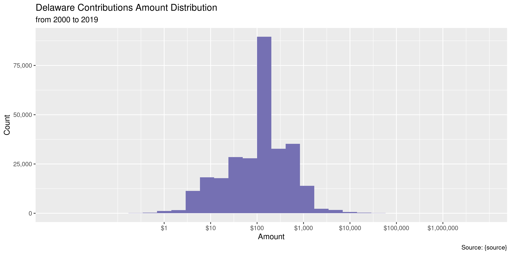
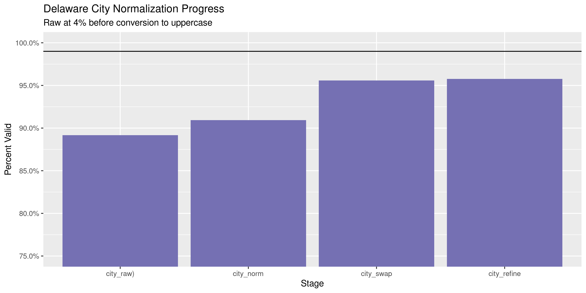
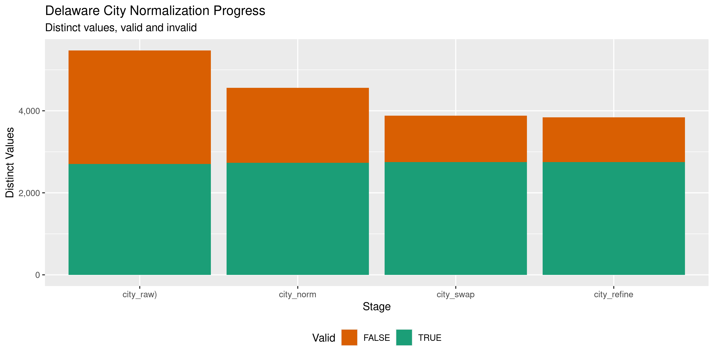

Delaware Contributions
================
Kiernan Nicholls
2020-04-29 15:43:02

<!-- Place comments regarding knitting here -->

## Project

The Accountability Project is an effort to cut across data silos and
give journalists, policy professionals, activists, and the public at
large a simple way to search across huge volumes of public data about
people and organizations.

Our goal is to standardizing public data on a few key fields by thinking
of each dataset row as a transaction. For each transaction there should
be (at least) 3 variables:

1.  All **parties** to a transaction.
2.  The **date** of the transaction.
3.  The **amount** of money involved.

## Objectives

This document describes the process used to complete the following
objectives:

1.  How many records are in the database?
2.  Check for entirely duplicated records.
3.  Check ranges of continuous variables.
4.  Is there anything blank or missing?
5.  Check for consistency issues.
6.  Create a five-digit ZIP Code called `zip`.
7.  Create a `year` field from the transaction date.
8.  Make sure there is data on both parties to a transaction.

## Packages

The following packages are needed to collect, manipulate, visualize,
analyze, and communicate these results. The `pacman` package will
facilitate their installation and attachment.

The IRW’s `campfin` package will also have to be installed from GitHub.
This package contains functions custom made to help facilitate the
processing of campaign finance data.

``` r
if (!require("pacman")) install.packages("pacman")
pacman::p_load_gh("irworkshop/campfin")
pacman::p_load(
  tidyverse, # data manipulation
  lubridate, # datetime strings
  gluedown, # print markdown
  magrittr, # pipe operators
  janitor, # dataframe clean
  batman, # parse logical
  refinr, # cluster and merge
  scales, # format strings
  knitr, # knit documents
  vroom, # read files fast
  glue, # combine strings
  here, # relative storage
  httr, # http requests
  fs # search storage 
)
```

This document should be run as part of the `R_campfin` project, which
lives as a sub-directory of the more general, language-agnostic
[`irworkshop/accountability_datacleaning`](https://github.com/irworkshop/accountability_datacleaning)
GitHub repository.

The `R_campfin` project uses the [RStudio
projects](https://support.rstudio.com/hc/en-us/articles/200526207-Using-Projects)
feature and should be run as such. The project also uses the dynamic
`here::here()` tool for file paths relative to *your* machine.

``` r
# where does this document knit?
here::here()
#> [1] "/home/kiernan/Code/accountability_datacleaning/R_campfin"
```

## Data

This data is obtained from the [Campaign Finance Reporting System
(CFRS)](https://cfrs.elections.delaware.gov/).

On the \[Contributions search page\]\[04\], the CFRS describes the data
that can be searched.

> An expenditure is defined as a gift, transfer, disbursement, debt
> incurred, or promise of money or valuable thing by or on behalf of a
> political committee to promote or assist in promoting the success or
> defeat of a candidate, political party, or question at an election.
> Expenditures must be election related; that is, they must enhance the
> candidate’s election chances, such that they would not have been
> incurred if there had been no candidacy. Furthermore, expenditures,
> including loans, may not be for the personal use of the candidate or
> any other individual. Debt Incurred is any unpaid debt that the
> committee is obligated to pay.

On the CFRS [FAQ
page](https://cfrs.elections.delaware.gov/Public/ViewReceipts), the CFRS
defines exactly what expenditures are reported.

> All receipts over $100 must be itemized and all sales items over $50
> must be itemized. All contributions from a political committee shall
> be itemized no matter what amount. If the person who made the
> contribution is an organization, and the total amount of contributions
> by such organization during the election period exceeds $1,200, then
> the report shall also include the name and address of one responsible
> party for the organization.

## Import

### Download

``` r
raw_dir <- dir_create(here("de", "contribs", "data", "raw"))
raw_path <- path(raw_dir, "ViewContributionsList.csv")
raw_exist <- !file_exists(raw_path) # eval next if not
```

While we can replicate a download using `httr::GET()`, the initial
export is more easily done through the search portal. The cookies from
that search can then be passed to `httr::set_cookies()` to replicate.

``` r
de_get <- GET( # eval=raw_exist
  url = "https://cfrs.elections.delaware.gov/Public/ExportCSVNew",
  write_disk(raw_path, overwrite = TRUE),
  set_cookies(
      `__cfduid` = "d9c63dde432a4aa70b00dcefcac063e421588180459",
      `ASP.NET_SessionId` = "wybexmghashkv3jnz1b4vcbs"
  ),
  query = list(
    `page` = "1",
    `orderBy` = "~",
    `filter` = "~",
    `Grid-size` = "15",
    `theme` = "vista"
  )
)
```

### Read

Some errors with new line (`\n`) and double quote (`"`) characters needs
to be fixed with regular expressions and saved to a new text file.

``` r
fix_path <- file_temp(ext = "csv")
read_file(raw_path) %>%
  str_remove("(?<=Fixed Asset),") %>% 
  str_replace_all("(?<!,No|Asset)\n", " ") %>% 
  str_replace_all("\"", "\'") %>% 
  write_lines(fix_path)
```

The fixed file can be read with `readr::read_delim()`.

``` r
dec <- read_delim(
  file = fix_path,
  delim = ",",
  escape_backslash = FALSE,
  escape_double = FALSE,
  col_types = cols(
    .default = col_character(),
    `Contribution Date` = col_date_usa(),
    `Contribution Amount` = col_double()
  )
)
```

For convenience, we can rename some character and remove empty columns.

``` r
raw_names <- names(dec)
dec <- dec %>% 
  clean_names("snake") %>% 
  remove_empty("cols") %>% 
  mutate_at(vars(fixed_asset), to_logical) %>% 
  rename_all(str_remove, "contributor_") %>% 
  rename(
    contributor = name,
    recipient = receiving_committee,
    employer = employer_name,
    occupation = employer_occupation,
    method = contribution_type,
    period = filing_period,
  ) %>% 
  rename_all(str_replace, "address_line_", "addr") %>% 
  rename_all(str_remove, "contribution_")
```

Check the distinct values of a discrete variable to checking file
reading.

``` r
count(dec, fixed_asset)
#> # A tibble: 1 x 2
#>   fixed_asset      n
#>   <lgl>        <int>
#> 1 FALSE       284440
```

## Explore

``` r
glimpse(dec)
#> Rows: 284,440
#> Columns: 17
#> $ date        <date> 2013-01-24, 2013-01-24, 2013-01-24, 2013-01-24, 2013-01-24, 2013-01-24, 201…
#> $ contributor <chr> "Douglas M Beatson", "Stephen F Freebery", "Lee Ann A Blessing", "Timothy A …
#> $ addr1       <chr> "120 Fairhill Dr", "12 Van Dyke Drive", "5218 New Kent Rd", "227 E State St"…
#> $ addr2       <chr> NA, NA, NA, NA, NA, NA, NA, NA, NA, NA, NA, NA, NA, NA, NA, NA, NA, NA, NA, …
#> $ city        <chr> "Wilmington", "New Castle", "Wilmington", "Kennett Square", "Ridley Park", "…
#> $ state       <chr> "DE", "DE", "DE", "PA", "PA", "DE", "DE", "DE", "DE", "PA", "DE", "PA", "DE"…
#> $ zip         <chr> "19808", "19720", "19808", "19348", "19078", "19806", "19702", "19701", "198…
#> $ type        <chr> "Individual", "Individual", "Individual", "Individual", "Individual", "Indiv…
#> $ employer    <chr> "Patterson-Schwartz & Assoc.\tNH", "Joe Tucker Realty", "Coldwell Banker Pre…
#> $ occupation  <chr> "Real Estate", "Real Estate", "Real Estate", "Real Estate", "Real Estate", "…
#> $ method      <chr> "Check", "Check", "Check", "Check", "Check", "Check", "Check", "Check", "Che…
#> $ amount      <dbl> 35, 35, 35, 35, 35, 35, 35, 35, 35, 5, 35, 35, 35, 35, 35, 35, 35, 10, 35, 3…
#> $ cf_id       <chr> "02000483", "02000483", "02000483", "02000483", "02000483", "02000483", "020…
#> $ recipient   <chr> "Delaware Association of Realtors DEL-PAC", "Delaware Association of Realtor…
#> $ period      <chr> "2013  Annual", "2013  Annual", "2013  Annual", "2013  Annual", "2013  Annua…
#> $ office      <chr> NA, NA, NA, NA, NA, NA, NA, NA, NA, NA, NA, NA, NA, NA, NA, NA, NA, NA, NA, …
#> $ fixed_asset <lgl> FALSE, FALSE, FALSE, FALSE, FALSE, FALSE, FALSE, FALSE, FALSE, FALSE, FALSE,…
tail(dec)
#> # A tibble: 6 x 17
#>   date       contributor addr1 addr2 city  state zip   type  employer occupation method amount
#>   <date>     <chr>       <chr> <chr> <chr> <chr> <chr> <chr> <chr>    <chr>      <chr>   <dbl>
#> 1 2008-08-15 Clifford L… Laur… <NA>  <NA>  DE    <NA>  Cand… <NA>     <NA>       Data …   855 
#> 2 2008-08-13 Thurmon  M… Peli… <NA>  Long… DE    19966 Indi… <NA>     <NA>       Data …   235.
#> 3 2005-10-12 Small Dona… Misc. <NA>  <NA>  <NA>  <NA>  Indi… <NA>     <NA>       Data …   925 
#> 4 2008-08-26 Cannon  Jo… 117 … <NA>  Rd.   DE    19711 Indi… <NA>     <NA>       Data …    25 
#> 5 2008-10-08 Stephan  J… 2606… <NA>  <NA>  DE    <NA>  Indi… <NA>     <NA>       Data …   100 
#> 6 2008-10-12 Rappa  She… 235 … <NA>  Hock… DE    19707 Indi… <NA>     <NA>       Data …  2000 
#> # … with 5 more variables: cf_id <chr>, recipient <chr>, period <chr>, office <chr>,
#> #   fixed_asset <lgl>
```

### Missing

``` r
col_stats(dec, count_na)
#> # A tibble: 17 x 4
#>    col         class       n         p
#>    <chr>       <chr>   <int>     <dbl>
#>  1 date        <date>      0 0        
#>  2 contributor <chr>      22 0.0000773
#>  3 addr1       <chr>   10428 0.0367   
#>  4 addr2       <chr>  276194 0.971    
#>  5 city        <chr>   22899 0.0805   
#>  6 state       <chr>    9931 0.0349   
#>  7 zip         <chr>   21318 0.0749   
#>  8 type        <chr>       0 0        
#>  9 employer    <chr>  262348 0.922    
#> 10 occupation  <chr>  259679 0.913    
#> 11 method      <chr>       0 0        
#> 12 amount      <dbl>       0 0        
#> 13 cf_id       <chr>       0 0        
#> 14 recipient   <chr>       0 0        
#> 15 period      <chr>       0 0        
#> 16 office      <chr>  121522 0.427    
#> 17 fixed_asset <lgl>       0 0
```

Records missing a date, amount, or name need to be flagged.

``` r
dec <- dec %>% flag_na(date, contributor, amount, recipient)
percent(mean(dec$na_flag), 0.001)
#> [1] "0.008%"
```

### Duplicates

The same can be done for records entirely duplicated more than once.

``` r
dec <- flag_dupes(dec, everything())
percent(mean(dec$dupe_flag), 0.001)
#> [1] "1.701%"
```

``` r
dec %>% 
  filter(dupe_flag) %>% 
  select(date, contributor, amount, recipient) %>% 
  arrange(date)
#> # A tibble: 4,838 x 4
#>    date       contributor                       amount recipient                        
#>    <date>     <chr>                              <dbl> <chr>                            
#>  1 2004-01-13 Fraternal Order of Police Lodge 1   2000 F O P LODGE #1 PAC COMMITTEE     
#>  2 2004-01-13 Fraternal Order of Police Lodge 1   2000 F O P LODGE #1 PAC COMMITTEE     
#>  3 2004-02-25 Robert Krapf  Jean   &               200 James M. Baker Campaign Committee
#>  4 2004-02-25 Robert Krapf  Jean   &               200 James M. Baker Campaign Committee
#>  5 2004-02-27 Dr. Regina Turner  Mark   &          100 James M. Baker Campaign Committee
#>  6 2004-02-27 Dr. Regina Turner  Mark   &          100 James M. Baker Campaign Committee
#>  7 2004-03-01 AIA Delaware PAC                     100 James M. Baker Campaign Committee
#>  8 2004-03-01 AIA Delaware PAC                     100 James M. Baker Campaign Committee
#>  9 2004-03-04 Andrea Levine  Richard   &           100 James M. Baker Campaign Committee
#> 10 2004-03-04 Andrea Levine  Richard   &           100 James M. Baker Campaign Committee
#> # … with 4,828 more rows
```

### Continuous

#### Amounts

``` r
summary(dec$amount)
#>    Min. 1st Qu.  Median    Mean 3rd Qu.    Max. 
#>   -5577      35     100     567     300 8331771
mean(dec$amount <= 0, na.rm = TRUE)
#> [1] 0.002088314
```

<!-- -->

#### Dates

The calendar year can be added from the `date` column with
`lubridate::year()`.

``` r
dec <- mutate(dec, year = year(date))
```

Aside from a handful of missing values, the `date` and `year` are fairly
clean.

``` r
prop_na(dec$date)
#> [1] 0
min(dec$date, na.rm = TRUE)
#> [1] "2000-08-03"
sum(dec$year < 2000, na.rm = TRUE)
#> [1] 0
max(dec$date, na.rm = TRUE)
#> [1] "2020-03-14"
sum(dec$date > today(), na.rm = TRUE)
#> [1] 0
```

<!-- -->

## Wrangle

To improve the searchability of the database, we will perform some
consistent, confident string normalization. For geographic variables
like city names and ZIP codes, the corresponding `campfin::normal_*()`
functions are tailor made to facilitate this process.

### Address

For the street `addresss` variable, the `campfin::normal_address()`
function will force consistence case, remove punctuation, and abbreviate
official USPS suffixes.

``` r
dec <- dec %>% 
  unite(
    col = addr_full,
    starts_with("addr"),
    sep = " ",
    remove = FALSE,
    na.rm = TRUE
  ) %>% 
  mutate(
    addr_norm = normal_address(
      address = addr_full,
      abbs = usps_street,
      na_rep = TRUE
    )
  ) %>% 
  select(-addr_full)
```

``` r
dec %>% 
  select(starts_with("addr")) %>% 
  distinct() %>% 
  sample_n(10)
#> # A tibble: 10 x 3
#>    addr1                     addr2 addr_norm              
#>    <chr>                     <chr> <chr>                  
#>  1 2 ASHBURN DRIVE           <NA>  2 ASHBURN DR           
#>  2 5704 Bradley Blvd         <NA>  5704 BRADLEY BLVD      
#>  3 4 Blackstone Lane Malvern <NA>  4 BLACKSTONE LN MALVERN
#>  4 2812 Landon Dr.           <NA>  2812 LANDON DR         
#>  5 102 Lansing Ave.          <NA>  102 LANSING AVE        
#>  6 131 Clear Creek Drive     <NA>  131 CLEAR CRK DR       
#>  7 2 Foxhill Lane Wilmington <NA>  2 FOXHILL LN WILMINGTON
#>  8 2208 Highland             <NA>  2208 HIGHLAND          
#>  9 47 Haggis St.             <NA>  47 HAGGIS ST           
#> 10 1803 Stark Dr Crofton     <NA>  1803 STARK DR CROFTON
```

### ZIP

For ZIP codes, the `campfin::normal_zip()` function will attempt to
create valid *five* digit codes by removing the ZIP+4 suffix and
returning leading zeroes dropped by other programs like Microsoft Excel.

``` r
dec <- dec %>% 
  mutate(
    zip_norm = normal_zip(
      zip = zip,
      na_rep = TRUE
    )
  )
```

``` r
progress_table(
  dec$zip,
  dec$zip_norm,
  compare = valid_zip
)
#> # A tibble: 2 x 6
#>   stage    prop_in n_distinct prop_na n_out n_diff
#>   <chr>      <dbl>      <dbl>   <dbl> <dbl>  <dbl>
#> 1 zip        0.676      13174  0.0749 85340   9053
#> 2 zip_norm   0.997       5246  0.0755   895    311
```

### State

Valid two digit state abbreviations can be made using the
`campfin::normal_state()` function.

``` r
dec <- dec %>% 
  mutate(
    state_norm = normal_state(
      state = state,
      abbreviate = TRUE,
      na_rep = TRUE,
      valid = valid_state
    )
  )
```

``` r
dec %>% 
  filter(state != state_norm) %>% 
  count(state, state_norm, sort = TRUE)
#> # A tibble: 34 x 3
#>    state state_norm     n
#>    <chr> <chr>      <int>
#>  1 De    DE          1998
#>  2 Pa    PA          1060
#>  3 de    DE           396
#>  4 Ct    CT            45
#>  5 Md    MD            38
#>  6 pa    PA            27
#>  7 Il    IL            21
#>  8 dc    DC            17
#>  9 nj    NJ            17
#> 10 Fl    FL            16
#> # … with 24 more rows
```

``` r
progress_table(
  dec$state,
  dec$state_norm,
  compare = valid_state
)
#> # A tibble: 2 x 6
#>   stage      prop_in n_distinct prop_na n_out n_diff
#>   <chr>        <dbl>      <dbl>   <dbl> <dbl>  <dbl>
#> 1 state        0.986         88  0.0349  3729     35
#> 2 state_norm   1             54  0.0349     0      1
```

### City

Cities are the most difficult geographic variable to normalize, simply
due to the wide variety of valid cities and formats.

#### Normal

The `campfin::normal_city()` function is a good start, again converting
case, removing punctuation, but *expanding* USPS abbreviations. We can
also remove `invalid_city` values.

``` r
dec <- dec %>% 
  mutate(
    city_norm = normal_city(
      city = city, 
      abbs = usps_city,
      states = c("DE", "DC", "DELAWARE"),
      na = invalid_city,
      na_rep = TRUE
    )
  )
```

#### Swap

We can further improve normalization by comparing our normalized value
against the *expected* value for that record’s state abbreviation and
ZIP code. If the normalized value is either an abbreviation for or very
similar to the expected value, we can confidently swap those two.

``` r
dec <- dec %>% 
  rename(city_raw = city) %>% 
  left_join(
    y = zipcodes,
    by = c(
      "state_norm" = "state",
      "zip_norm" = "zip"
    )
  ) %>% 
  rename(city_match = city) %>% 
  mutate(
    match_abb = is_abbrev(city_norm, city_match),
    match_dist = str_dist(city_norm, city_match),
    city_swap = if_else(
      condition = !is.na(match_dist) & (match_abb | match_dist == 1),
      true = city_match,
      false = city_norm
    )
  ) %>% 
  select(
    -city_match,
    -match_dist,
    -match_abb
  )
```

#### Refine

The \[OpenRefine\] algorithms can be used to group similar strings and
replace the less common versions with their most common counterpart.
This can greatly reduce inconsistency, but with low confidence; we will
only keep any refined strings that have a valid city/state/zip
combination.

``` r
good_refine <- dec %>% 
  mutate(
    city_refine = city_swap %>% 
      key_collision_merge() %>% 
      n_gram_merge(numgram = 1)
  ) %>% 
  filter(city_refine != city_swap) %>% 
  inner_join(
    y = zipcodes,
    by = c(
      "city_refine" = "city",
      "state_norm" = "state",
      "zip_norm" = "zip"
    )
  )
```

    #> [1] 82
    #> # A tibble: 64 x 5
    #>    state_norm zip_norm city_swap        city_refine        n
    #>    <chr>      <chr>    <chr>            <chr>          <int>
    #>  1 CA         92037    JOLLA            LA JOLLA           4
    #>  2 DE         19710    MONTCHANIN CT    MONTCHANIN         3
    #>  3 DE         19904    DOVER DE         DOVER              3
    #>  4 NY         11733    SETAUKET         EAST SETAUKET      3
    #>  5 CA         92625    CORONADO DEL MAR CORONA DEL MAR     2
    #>  6 CA         94023    ALTOS            LOS ALTOS          2
    #>  7 CA         94109    FRANCISCO        SAN FRANCISCO      2
    #>  8 CA         94121    FRANCISCO        SAN FRANCISCO      2
    #>  9 CA         94131    FRANCISCO        SAN FRANCISCO      2
    #> 10 DE         19801    WILMINGONT       WILMINGTON         2
    #> # … with 54 more rows

Then we can join the refined values back to the database.

``` r
dec <- dec %>% 
  left_join(good_refine) %>% 
  mutate(city_refine = coalesce(city_refine, city_swap))
```

#### Progress

``` r
many_city <- c(valid_city, extra_city)
dec %>% 
  filter(city_refine %out% many_city) %>% 
  count(city_refine, sort = TRUE) %>% 
  print(n = 30)
#> # A tibble: 1,090 x 2
#>    city_refine      n
#>    <chr>        <int>
#>  1 <NA>         24138
#>  2 DE            1723
#>  3 ROAD           970
#>  4 SQUARE         716
#>  5 RD             556
#>  6 LONG NECK      523
#>  7 SUITE          450
#>  8 SAINT          444
#>  9 DRIVE          421
#> 10 WILM           410
#> 11 DR             275
#> 12 NECK           230
#> 13 DEWEY BEACH    209
#> 14 VIEW           194
#> 15 MEETING        130
#> 16 VEGAS          129
#> 17 CITY           120
#> 18 ND FLOOR       110
#> 19 SHEPARDSTOWN    93
#> 20 WAY             90
#> 21 STATION         86
#> 22 CHURCH          84
#> 23 CYNWYD          80
#> 24 COURT           79
#> 25 MAWR            79
#> 26 CT              76
#> 27 PA              76
#> 28 TOWNSHIP        73
#> 29 NORTHWEST       62
#> 30 STE             61
#> # … with 1,060 more rows
```

``` r
dec <- dec %>% 
  mutate(
    city_refine = city_refine %>% 
      str_replace("^WILM$", "WILMINGTON")
  )
```

| stage        | prop\_in | n\_distinct | prop\_na | n\_out | n\_diff |
| :----------- | -------: | ----------: | -------: | -----: | ------: |
| city\_raw)   |    0.892 |        5473 |    0.081 |  28344 |    2772 |
| city\_norm   |    0.909 |        4562 |    0.085 |  23587 |    1829 |
| city\_swap   |    0.956 |        3881 |    0.085 |  11509 |    1131 |
| city\_refine |    0.958 |        3838 |    0.085 |  11030 |    1089 |

You can see how the percentage of valid values increased with each
stage.

<!-- -->

More importantly, the number of distinct values decreased each stage. We
were able to confidently change many distinct invalid values to their
valid equivalent.

<!-- -->

## Conclude

``` r
dec <- dec %>% 
  select(
    -city_norm,
    -city_swap,
    city_clean = city_refine
  ) %>% 
  rename_all(~str_replace(., "_norm", "_clean")) %>% 
  rename_all(~str_remove(., "_raw"))
```

``` r
glimpse(sample_n(dec, 20))
#> Rows: 20
#> Columns: 24
#> $ date        <date> 2012-02-22, 2009-06-10, 2019-07-31, 2008-09-01, 2016-03-25, 2019-04-18, 201…
#> $ contributor <chr> "Stellini  Mark", "Rucker  Willie   B.", "Citizens Bank", "Christman  Jacque…
#> $ addr1       <chr> "14 Pheasants Ridge North Greenville", "614 N. Front", "PO Box 7000", "118 O…
#> $ addr2       <chr> NA, NA, NA, NA, NA, NA, NA, NA, NA, NA, NA, NA, NA, NA, NA, NA, NA, NA, NA, …
#> $ city        <chr> "Greenville", "Street", "Providence", "Dover", "Dover", "Doylestown", "Seafo…
#> $ state       <chr> "DE", "PA", "RI", "DE", "DE", "PA", "DE", "DE", "de", "DE", "DE", "DE", "DE"…
#> $ zip         <chr> "19807", "19123", "02940", "19901", "19904", "18901-3208", "19973-    ", "19…
#> $ type        <chr> "Individual", "Individual", "Business/Group/Organization", "Individual", "Bu…
#> $ employer    <chr> NA, NA, NA, NA, NA, "self-employed", NA, NA, NA, NA, NA, "Richards  Layton &…
#> $ occupation  <chr> NA, NA, NA, NA, NA, "Other", NA, NA, NA, NA, NA, "Other", NA, NA, NA, NA, NA…
#> $ method      <chr> "Data Conversion", "Data Conversion", "Check", "Data Conversion", "Check", "…
#> $ amount      <dbl> 500.00, 20.00, 0.52, 50.00, 400.00, 100.00, 25.00, 100.00, 100.00, 6.00, 23.…
#> $ cf_id       <chr> "01001573", "02000550", "02000527", "01001807", "01000020", "02000548", "010…
#> $ recipient   <chr> "Markell for Delaware", "Teamsters Joint Council No. 53 PAC-DRIVE", "Boilerm…
#> $ period      <chr> "2012 2012 General 11/06/2012 30 Day", "2008  Annual", "2019  Annual", "2008…
#> $ office      <chr> "Governor", NA, NA, "District 04 (State Senator)", "District 13 (State Senat…
#> $ fixed_asset <lgl> FALSE, FALSE, FALSE, FALSE, FALSE, FALSE, FALSE, FALSE, FALSE, FALSE, FALSE,…
#> $ na_flag     <lgl> FALSE, FALSE, FALSE, FALSE, FALSE, FALSE, FALSE, FALSE, FALSE, FALSE, FALSE,…
#> $ dupe_flag   <lgl> FALSE, FALSE, FALSE, FALSE, FALSE, FALSE, FALSE, FALSE, FALSE, FALSE, FALSE,…
#> $ year        <dbl> 2012, 2009, 2019, 2008, 2016, 2019, 2018, 2008, 2009, 2010, 2016, 2016, 2006…
#> $ addr_clean  <chr> "14 PHEASANTS RDG N GREENVILLE", "614 N FRNT", "PO BOX 7000", "118 OVERLOOK …
#> $ zip_clean   <chr> "19807", "19123", "02940", "19901", "19904", "18901", "19973", "19806", "197…
#> $ state_clean <chr> "DE", "PA", "RI", "DE", "DE", "PA", "DE", "DE", "DE", "DE", "DE", "DE", "DE"…
#> $ city_clean  <chr> "GREENVILLE", "STREET", "PROVIDENCE", "DOVER", "DOVER", "DOYLESTOWN", "SEAFO…
```

1.  There are 284,440 records in the database.
2.  There are 4,838 duplicate records in the database.
3.  The range and distribution of `amount` and `date` seem reasonable.
4.  There are 22 records missing ….
5.  Consistency in geographic data has been improved with
    `campfin::normal_*()`.
6.  The 4-digit `year` variable has been created with
    `lubridate::year()`.

## Export

``` r
clean_dir <- dir_create(here("de", "contribs", "data", "clean"))
clean_path <- path(clean_dir, "de_contribs_clean.csv")
write_csv(dec, clean_path, na = "")
file_size(clean_path)
#> 67.2M
guess_encoding(clean_path)
#> # A tibble: 3 x 2
#>   encoding   confidence
#>   <chr>           <dbl>
#> 1 UTF-8            0.8 
#> 2 ISO-8859-1       0.47
#> 3 ISO-8859-2       0.32
```

## Dictionary

| Column        | Type        | Definition                                        |
| :------------ | :---------- | :------------------------------------------------ |
| `date`        | `double`    | Date contribution was made                        |
| `contributor` | `character` | Contributor full name                             |
| `addr1`       | `character` | Contributor street address                        |
| `addr2`       | `character` | Contributor secondary address                     |
| `city`        | `character` | Contributor city name                             |
| `state`       | `character` | Contributor 2-digit state abbreviation            |
| `zip`         | `character` | Contributor ZIP+4 code                            |
| `type`        | `character` | Contributor type                                  |
| `employer`    | `character` | Contributor employer name                         |
| `occupation`  | `character` | Contributor occupation                            |
| `method`      | `character` | Contribution method                               |
| `amount`      | `double`    | Contribution amount or correction                 |
| `cf_id`       | `character` | Unique campaign finance ID                        |
| `recipient`   | `character` | Recipient committee name                          |
| `period`      | `character` | Report filing period                              |
| `office`      | `character` | Office sought by recipient                        |
| `fixed_asset` | `logical`   | Fix asset flag                                    |
| `na_flag`     | `logical`   | Flag for missing date, amount, or name            |
| `dupe_flag`   | `logical`   | Flag for completely duplicated record             |
| `year`        | `double`    | Calendar year of contribution date                |
| `addr_clean`  | `character` | Normalized contributor street address             |
| `zip_clean`   | `character` | Normalized contributor 5-digit ZIP code           |
| `state_clean` | `character` | Normalized contributor 2-digit state abbreviation |
| `city_clean`  | `character` | Normalized contributor city name                  |

``` r
write_lines(
  x = c("# Deleware Contributions Data Dictionary\n", dict_md),
  path = here("de", "contribs", "de_contribs_dict.md"),
)
```
