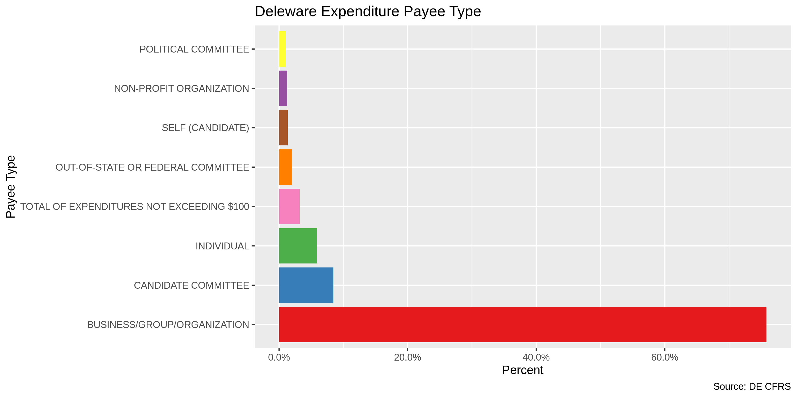
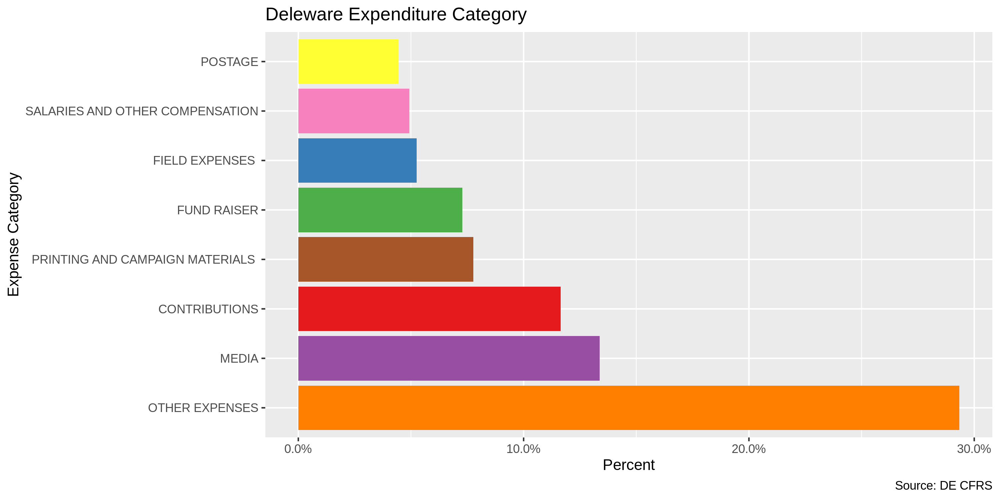
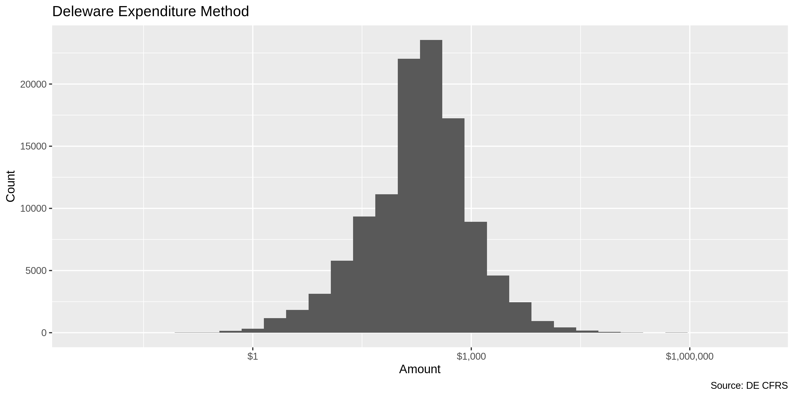

State Data
================
First Last
2019-08-07 17:26:46

  - [Project](#project)
  - [Objectives](#objectives)
  - [Packages](#packages)
  - [Data](#data)
  - [Explore](#explore)
  - [Wrangle](#wrangle)
  - [Conclude](#conclude)
  - [Export](#export)

## Project

The Accountability Project is an effort to cut across data silos and
give journalists, policy professionals, activists, and the public at
large a simple way to search across huge volumes of public data about
people and organizations.

Our goal is to standardizing public data on a few key fields by thinking
of each dataset row as a transaction. For each transaction there should
be (at least) 3 variables:

1.  All **parties** to a transaction
2.  The **date** of the transaction
3.  The **amount** of money involved

## Objectives

This document describes the process used to complete the following
objectives:

1.  How many records are in the database?
2.  Check for duplicates
3.  Check ranges
4.  Is there anything blank or missing?
5.  Check for consistency issues
6.  Create a five-digit ZIP Code called `ZIP5`
7.  Create a `YEAR` field from the transaction date
8.  Make sure there is data on both parties to a transaction

## Packages

The following packages are needed to collect, manipulate, visualize,
analyze, and communicate these results. The `pacman` package will
facilitate their installation and attachment.

The IRW’s `campfin` package will also have to be installed from GitHub.
This package contains functions custom made to help facilitate the
processing of campaign finance data.

``` r
if (!require("pacman")) install.packages("pacman")
pacman::p_load_current_gh("kiernann/campfin")
```

    #> 
    #>   
       checking for file ‘/tmp/RtmpP3eH0l/remotes2702a93e64/kiernann-campfin-6bdab10/DESCRIPTION’ ...
      
    ✔  checking for file ‘/tmp/RtmpP3eH0l/remotes2702a93e64/kiernann-campfin-6bdab10/DESCRIPTION’
    #> 
      
    ─  preparing ‘campfin’:
    #> 
      
       checking DESCRIPTION meta-information ...
      
    ✔  checking DESCRIPTION meta-information
    #> 
      
    ─  checking for LF line-endings in source and make files and shell scripts
    #> 
      
    ─  checking for empty or unneeded directories
    #> ─  looking to see if a ‘data/datalist’ file should be added
    #> 
      
    ─  building ‘campfin_0.0.1.tar.gz’
    #> 
      
       
    #> 

``` r
pacman::p_load(
  stringdist, # levenshtein value
  tidyverse, # data manipulation
  RSelenium, # remote browser
  lubridate, # datetime strings
  magrittr, # pipe opperators
  tidytext, # text analysis
  janitor, # dataframe clean
  batman, # parse logical
  refinr, # cluster and merge
  scales, # format strings
  rvest, # read html files
  knitr, # knit documents
  vroom, # read files fast
  glue, # combine strings
  here, # relative storage
  fs # search storage 
)
```

This document should be run as part of the `R_campfin` project, which
lives as a sub-directory of the more general, language-agnostic
\[`irworkshop/accountability_datacleaning`\]\[01\] GitHub repository.

The `R_campfin` project uses the \[RStudio projects\]\[02\] feature and
should be run as such. The project also uses the dynamic `here::here()`
tool for file paths relative to *your* machine.

``` r
# where does this document knit?
here::here()
#> [1] "/home/ubuntu/R/accountability_datacleaning/R_campfin"
```

## Data

This data is obtained from the Delaware [Campaign Finance Reporting
System (CFRS)](https://cfrs.elections.delaware.gov/).

On the [Expenditures search
page](https://cfrs.elections.delaware.gov/Public/ViewExpensesMain), the
CFRS describes the data that can be searched.

> An expenditure is defined as a gift, transfer, disbursement, debt
> incurred, or promise of money or valuable thing by or on behalf of a
> political committee to promote or assist in promoting the success or
> defeat of a candidate, political party, or question at an election.
> Expenditures must be election related; that is, they must enhance the
> candidate’s election chances, such that they would not have been
> incurred if there had been no candidacy. Furthermore, expenditures,
> including loans, may not be for the personal use of the candidate or
> any other individual. Debt Incurred is any unpaid debt that the
> committee is obligated to pay.

On the [their FAQ page](https://cfrs.elections.delaware.gov/Public/FAQ),
the CFRS defines exactly what expenditures are reported.

> All receipts over $100 must be itemized and all sales items over $50
> must be itemized. All contributions from a political committee shall
> be itemized no matter what amount. If the person who made the
> contribution is an organization, and the total amount of contributions
> by such organization during the election period exceeds $1,200, then
> the report shall also include the name and address of one responsible
> party for the organization.

### Download

``` r
raw_dir <- here("de", "expends", "data", "raw")
dir_create(raw_dir)
```

The data can only be downloaded through the CFRS search portal. We can
use the RSelenium package to programatically navigate to the page, fill
out the form, and download the results to the `/raw` directory.

``` r
# open the driver with auto download options
remote_driver <- rsDriver(
  port = 4444L,
  browser = "firefox",
  extraCapabilities = makeFirefoxProfile(
    list(
      browser.download.dir = raw_dir,
      browser.download.folderList = 2L,
      browser.helperApps.neverAsk.saveToDisk = "text/csv"
    )
  )
)
# navigate to the download site
remote_browser <- remote_driver$client
remote_browser$navigate("https://cfrs.elections.delaware.gov/Public/ViewExpenses")
# enter Jan 1 2008 as start date
remote_browser$findElement("css", "#dtStartDate")$sendKeysToElement(list("01/01/2008"))
# enter today as end date
remote_browser$findElement("css", "#dtEndDate")$sendKeysToElement(list(format(today(),"%m/%d/%Y")))
# click the submit button
remote_browser$findElement("css", "#btnSearch")$clickElement()
# click CSV export
remote_browser$findElement("css", "a.t-button:nth-child(1)")$clickElement()
# close the browser and driver
remote_browser$close()
remote_driver$server$stop()
```

### Read

The file can then me read into R using `readr::read_csv()`

``` r
de <- read_csv(
  file = glue("{raw_dir}/Expensesinfo.csv"),
  col_types = cols(
    .default = col_character(),
    `Expenditure Date` = col_date("%m/%d/%Y"),
    `Amount($)` = col_double()
  )
)
```

The file does not use quotation marks to distinguish character strings,
causing R to erroneously shift columsn when one is unexpectedly present.

``` r
problems(de) %>% 
  select(col, expected, actual) %>%
  filter(!is.na(col)) %>% 
  distinct()
```

    #> # A tibble: 23 x 3
    #>    col              expected           actual                      
    #>    <chr>            <chr>              <chr>                       
    #>  1 Expenditure Date date like %m/%d/%Y Suite 210                   
    #>  2 Amount($)        a double           THE SIMPLER CAMPAIGN  LLC   
    #>  3 Expenditure Date date like %m/%d/%Y Newport Industrial Park     
    #>  4 Expenditure Date date like %m/%d/%Y Suite 189                   
    #>  5 Expenditure Date date like %m/%d/%Y 675 Ponce De Leon Avenue  NE
    #>  6 Expenditure Date date like %m/%d/%Y Suite 5000                  
    #>  7 Expenditure Date date like %m/%d/%Y The Mill                    
    #>  8 Expenditure Date date like %m/%d/%Y 4th Floor                   
    #>  9 Expenditure Date date like %m/%d/%Y 140 58th Street             
    #> 10 Expenditure Date date like %m/%d/%Y Suite 5B                    
    #> # … with 13 more rows

We can improve the usability and uniformity of the data set before
exploration.

``` r
de <- de %>% 
  clean_names() %>% 
  remove_empty("cols") %>% 
  mutate_if(is_character, str_to_upper) %>% 
  mutate(fixed_asset = to_logical(fixed_asset))
```

``` r
# this is an absolute mess
de <- 
  read_lines(file = glue("{raw_dir}/Expensesinfo.csv")) %>% 
  str_split(",") %>%
  map(str_c, collapse = "\v") %>% 
  str_remove_all("\\\"") %>% 
  enframe(
    name = NULL,
    value = "line"
  ) %>% 
  mutate(delim_count = str_count(line, "\v")) %>% 
  mutate(
    new = if_else(
      condition = equals(delim_count, 2),
      true = str_c(line, lead(line), sep = "\v"),
      false = line
    )
  ) %>% 
  mutate(delim_recount = str_count(new, "\v")) %>% 
  filter(delim_recount == 16) %>%
  pull(new) %>% 
  str_c(collapse = "\n") %>% 
  read_delim(
    delim = "\v",
    col_types = cols(
      .default = col_character(),
      `Expenditure Date` = col_date("%m/%d/%Y"),
      `Amount($)` = col_double()
    )
  ) %>% 
  clean_names() %>% 
  remove_empty("cols") %>% 
  mutate_if(is_character, str_to_upper) %>% 
  mutate(fixed_asset = to_logical(fixed_asset))
```

## Explore

``` r
head(de)
```

    #> # A tibble: 6 x 16
    #>   expenditure_date payee_name payee_address_l… payee_address_l… payee_city payee_state payee_zip
    #>   <date>           <chr>      <chr>            <chr>            <chr>      <chr>       <chr>    
    #> 1 2008-05-01       HADDON HE… 625 STATION AVE. <NA>             HADDON HE… NJ          08035    
    #> 2 2008-05-01       CAMDEN ST… RUTGERS U-CAMDE… <NA>             CAMDEN     NJ          08102    
    #> 3 2008-06-11       COMMITTEE… 127 ST. AUGUSTI… <NA>             MIDDLETOWN DE          19709    
    #> 4 2008-04-09       HAZEL PLA… 523 EASTLAWN     <NA>             AVE.       DE          19802    
    #> 5 2008-04-09       JAMES JOH… 105 SKELTON      <NA>             DRIVE      DE          19720    
    #> 6 2008-04-09       DONNA STO… 1155 WOODSEDGE   <NA>             RD.        DE          19904    
    #> # … with 9 more variables: payee_type <chr>, amount <dbl>, cf_id <chr>, committee_name <chr>,
    #> #   expense_category <chr>, expense_purpose <chr>, expense_method <chr>, filing_period <chr>,
    #> #   fixed_asset <lgl>

``` r
tail(de)
```

    #> # A tibble: 6 x 16
    #>   expenditure_date payee_name payee_address_l… payee_address_l… payee_city payee_state payee_zip
    #>   <date>           <chr>      <chr>            <chr>            <chr>      <chr>       <chr>    
    #> 1 2018-09-25       FRIENDS O… 302 AUDREY LANE  <NA>             SMYRNA     DE          19977    
    #> 2 2018-09-25       FRIENDS O… 226 N MAIN STRE… <NA>             SMYRNA     DE          "19977- …
    #> 3 2018-09-25       FRIENDS O… 206 WALKER ROAD  <NA>             DOVER      DE          19904-72…
    #> 4 2018-09-25       YEARICK F… 33 EMERSON DRIVE <NA>             DOVER      DE          19901    
    #> 5 2018-09-25       FRIENDS F… P.O. BOX 634     <NA>             FREDERICA  DE          19946    
    #> 6 2018-09-25       FRIENDS O… 176 EVERGREEN DR <NA>             DOVER      DE          "19901- …
    #> # … with 9 more variables: payee_type <chr>, amount <dbl>, cf_id <chr>, committee_name <chr>,
    #> #   expense_category <chr>, expense_purpose <chr>, expense_method <chr>, filing_period <chr>,
    #> #   fixed_asset <lgl>

``` r
glimpse(sample_frac(de))
```

    #> Observations: 117,524
    #> Variables: 16
    #> $ expenditure_date     <date> 2014-10-24, 2008-09-09, 2012-04-12, 2014-08-21, 2018-08-04, 2012-0…
    #> $ payee_name           <chr> "FRIENDS OF TERRY PEPPER FOR LEVY COURT", "BRANDYWINE REPUBLICAN CO…
    #> $ payee_address_line_1 <chr> "672 RAVEN CIRCLE", "#308 BRANMAR PLAZA  1812 MARSH ROAD WILMINGTON…
    #> $ payee_address_line_2 <chr> NA, NA, NA, NA, NA, NA, NA, NA, NA, NA, NA, NA, NA, NA, NA, NA, NA,…
    #> $ payee_city           <chr> "WYOMING", "WILMINGTON", NA, "FRANKFORD", "LAUREL", "RD", "DOVER", …
    #> $ payee_state          <chr> "DE", "DE", "DE", "DE", "DE", "DE", "DE", "DE", "DE", "DE", "PA", "…
    #> $ payee_zip            <chr> "19934", "19810", NA, "19945-    ", "19956-    ", NA, "19901-    ",…
    #> $ payee_type           <chr> "CANDIDATE COMMITTEE", "BUSINESS/GROUP/ORGANIZATION", "BUSINESS/GRO…
    #> $ amount               <dbl> 495.00, 600.00, 65.00, 50.00, 375.00, 226.35, 50.00, 100.00, 85.00,…
    #> $ cf_id                <chr> "01003137", "01001803", "01000194", "01002936", "03000661", "030006…
    #> $ committee_name       <chr> "RE-ELECT BETTY LOU MCKENNA", "CITIZENS FOR COPELAND  INC", "DELAWA…
    #> $ expense_category     <chr> "OTHER EXPENSES", "FUND RAISER", "OTHER EXPENSES", "RETURN CONTRIBU…
    #> $ expense_purpose      <chr> "MEDIA - NEWSPAPER", "DATA CONVERSION", "DATA CONVERSION", NA, "FUN…
    #> $ expense_method       <chr> "CHECK", NA, NA, "CHECK", "CHECK", NA, "CASH", NA, NA, "CHECK", "CR…
    #> $ filing_period        <chr> "2014 8 DAY GENERAL", "2008 30 DAY GENERAL", "2012 30 DAY PRIMARY",…
    #> $ fixed_asset          <lgl> FALSE, FALSE, FALSE, FALSE, FALSE, FALSE, FALSE, FALSE, FALSE, FALS…

### Missing

``` r
glimpse_fun(de, count_na)
```

    #> # A tibble: 16 x 4
    #>    var                  type       n         p
    #>    <chr>                <chr>  <int>     <dbl>
    #>  1 expenditure_date     date       0 0        
    #>  2 payee_name           chr     3831 0.0326   
    #>  3 payee_address_line_1 chr     5115 0.0435   
    #>  4 payee_address_line_2 chr   113014 0.962    
    #>  5 payee_city           chr    13841 0.118    
    #>  6 payee_state          chr     4183 0.0356   
    #>  7 payee_zip            chr    15598 0.133    
    #>  8 payee_type           chr        4 0.0000340
    #>  9 amount               dbl        0 0        
    #> 10 cf_id                chr        2 0.0000170
    #> 11 committee_name       chr        0 0        
    #> 12 expense_category     chr        0 0        
    #> 13 expense_purpose      chr     5595 0.0476   
    #> 14 expense_method       chr    50770 0.432    
    #> 15 filing_period        chr        0 0        
    #> 16 fixed_asset          lgl        0 0

Any record missing one of the parties, an amount, or date will be
flagged with `na_flag`.

``` r
de <- de %>% 
  mutate(
    na_flag = is.na(committee_name) | is.na(payee_name) | is.na(amount) | is.na(expenditure_date)
  )

sum(de$na_flag)
#> [1] 3831
```

### Duplicates

Any duplicate rows (after the inital appearance) can be flagged with
`campfin::flag_dupes()`.

``` r
de <- flag_dupes(de)
sum(de$dupe_flag)
```

    #> [1] 2006

### Categorical

``` r
glimpse_fun(de, n_distinct)
```

    #> # A tibble: 18 x 4
    #>    var                  type      n         p
    #>    <chr>                <chr> <int>     <dbl>
    #>  1 expenditure_date     date   4060 0.0345   
    #>  2 payee_name           chr   25775 0.219    
    #>  3 payee_address_line_1 chr   28049 0.239    
    #>  4 payee_address_line_2 chr     870 0.00740  
    #>  5 payee_city           chr    2689 0.0229   
    #>  6 payee_state          chr      51 0.000434 
    #>  7 payee_zip            chr    3901 0.0332   
    #>  8 payee_type           chr      15 0.000128 
    #>  9 amount               dbl   24524 0.209    
    #> 10 cf_id                chr    1246 0.0106   
    #> 11 committee_name       chr    1236 0.0105   
    #> 12 expense_category     chr      23 0.000196 
    #> 13 expense_purpose      chr      84 0.000715 
    #> 14 expense_method       chr      12 0.000102 
    #> 15 filing_period        chr     195 0.00166  
    #> 16 fixed_asset          lgl       2 0.0000170
    #> 17 na_flag              lgl       2 0.0000170
    #> 18 dupe_flag            lgl       2 0.0000170

<!-- -->

<!-- -->

<!-- -->

### Continuous

#### Amounts

``` r
summary(de$amount)
```

    #>    Min. 1st Qu.  Median    Mean 3rd Qu.    Max. 
    #>  -16811      56     192    1167     500 7558376

``` r
sum(de$amount < 0)
```

    #> [1] 130

<!-- -->

<!-- -->

#### Dates

The range of `expenditure_date` is very good, there are 0 dates beyond
`today()`.

``` r
min(de$expenditure_date)
```

    #> [1] "2008-01-01"

``` r
max(de$expenditure_date)
```

    #> [1] "2019-08-02"

``` r
sum(de$expenditure_date > today())
```

    #> [1] 0

We can use `lubridate::year()` to create a `expenditure_year()`
variable.

``` r
de <- mutate(de, expenditure_year = year(expenditure_date))
```

<!-- -->

<!-- -->

## Wrangle

### Address

``` r
de <- de %>% 
  unite(
    col = payee_address_combine,
    starts_with("payee_address"),
    sep = " ",
    remove = FALSE,
    na.rm = TRUE
  ) %>% 
  mutate(
    address_norm = normal_address(
      address = payee_address_combine,
      add_abbs = usps,
      na_rep = TRUE
    )
  )
```

``` r
sample_frac(de) %>% 
  select(payee_address_line_1, payee_address_line_2, address_norm)
```

    #> # A tibble: 117,524 x 3
    #>    payee_address_line_1                    payee_address_line… address_norm                        
    #>    <chr>                                   <chr>               <chr>                               
    #>  1 LEWES                                   <NA>                LEWES                               
    #>  2 2535 ORTHODOX STREET                    <NA>                2535 ORTHODOX STREET                
    #>  3 105 CARSON DRIVE                        <NA>                105 CARSON DRIVE                    
    #>  4 14455 NORTH HAYDEN RD SUITE 219         <NA>                14455 NORTH HAYDEN ROAD SUITE 219   
    #>  5 <NA>                                    <NA>                <NA>                                
    #>  6 3 GUYENNE RD WILMINGTON                 <NA>                3 GUYENNE ROAD WILMINGTON           
    #>  7 EAST LEBANON ROAD                       <NA>                EAST LEBANON ROAD                   
    #>  8 1 HACKER WAY                            <NA>                1 HACKER WAY                        
    #>  9 <NA>                                    <NA>                <NA>                                
    #> 10 BAND BOOSTERS  C/O LISA GRIER  103 SIE… <NA>                BAND BOOSTERS CO LISA GRIER 103 SIE…
    #> # … with 117,514 more rows

### ZIP

``` r
n_distinct(de$payee_zip)
#> [1] 3901
prop_in(de$payee_zip, geo$zip, na.rm = TRUE)
#> [1] 0.6603811
length(setdiff(de$payee_zip, geo$zip))
#> [1] 2419
```

``` r
de <- de %>% 
  mutate(
    zip_norm = normal_zip(
      zip = payee_zip,
      na_rep = TRUE
    )
  )
```

``` r
n_distinct(de$zip_norm)
#> [1] 2371
prop_in(de$zip_norm, geo$zip, na.rm = TRUE)
#> [1] 0.9958533
length(setdiff(de$zip_norm, geo$zip))
#> [1] 185
```

### State

The `payee_state` variable does not need to be cleaned.

``` r
n_distinct(de$payee_state)
#> [1] 51
prop_in(de$payee_state, geo$state, na.rm = TRUE)
#> [1] 1
length(setdiff(de$payee_state, geo$state))
#> [1] 1
```

### City

``` r
n_distinct(de$payee_city)
#> [1] 2689
prop_in(de$payee_city, geo$city, na.rm = TRUE)
#> [1] 0.897148
length(setdiff(de$payee_city, geo$city))
#> [1] 1514
```

#### Normalize

``` r
de <- de %>% 
  mutate(
    city_norm = normal_city(
      city = payee_city, 
      geo_abbs = usps_city,
      st_abbs = c("DE", "DC", "DELEWARE"),
      na = na_city,
      na_rep = TRUE
    )
  )
```

``` r
n_distinct(de$city_norm)
#> [1] 2163
prop_in(de$city_norm, geo$city, na.rm = TRUE)
#> [1] 0.9152067
length(setdiff(de$city_norm, geo$city))
#> [1] 976
```

#### Swap

``` r
de <- de %>% 
  left_join(
    y = geo,
    by = c(
      "payee_state" = "state",
      "zip_norm" = "zip"
    )
  ) %>% 
  rename(city_match = city) %>% 
  mutate(
    match_dist = stringdist(city_norm, city_match),
    city_swap = if_else(
      condition = equals(match_dist, 1),
      true = city_match,
      false = city_norm
    )
  )
```

``` r
n_distinct(de$city_swap)
#> [1] 1657
prop_in(de$city_swap, geo$city, na.rm = TRUE)
#> [1] 0.9321107
length(setdiff(de$city_swap, geo$city))
#> [1] 517
```

    #> # A tibble: 3 x 4
    #>   step  n_distinct prop_in unique_bad
    #>   <chr>      <int>   <dbl>      <int>
    #> 1 raw         2689   0.897       1514
    #> 2 norm        2163   0.915        976
    #> 3 swap        1657   0.932        517

## Conclude

1.  There are 117524 records in the database.
2.  There are 2006 duplicate records in the database.
3.  The range and distribution of `amount` and `expenditure_date` seem
    reasonable.
4.  There are `sum(mi$na_flag)` records missing either recipient or
    date.
5.  Consistency in goegraphic data has been improved with
    `campfin::normal_*()`.
6.  The 5-digit `zip_norm` variable has been created with
    `campfin::normal_zip()`.
7.  The 4-digit `expenditure_year` variable has been created with
    `lubridate::year()`.

## Export

``` r
proc_dir <- here("de", "expends", "data", "processed")
dir_create(proc_dir)
```

``` r
write_csv(
  x = de,
  na = "na",
  path = glue("{proc_dir}/de_expends_clean.csv")
)
```
