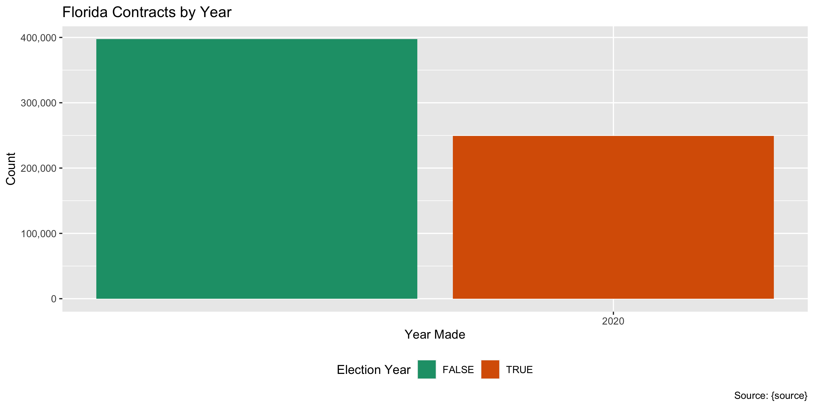
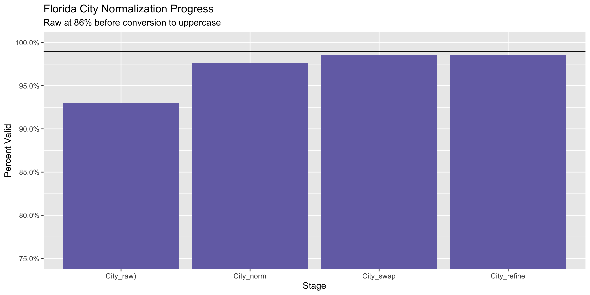

Florida Campaign Contributions Diary
================
Yanqi Xu
2020-09-08 12:27:50

  - [Project](#project)
  - [Objectives](#objectives)
  - [Packages](#packages)
  - [Data](#data)
  - [Download](#download)
  - [Read](#read)
  - [Explore](#explore)
  - [Wrangle](#wrangle)
  - [Conclude](#conclude)
  - [Export](#export)
  - [Upload](#upload)
  - [Dictionary](#dictionary)

<!-- Place comments regarding knitting here -->

## Project

The Accountability Project is an effort to cut across data silos and
give journalists, policy professionals, activists, and the public at
large a simple way to search across huge volumes of public data about
people and organizations.

Our goal is to standardizing public data on a few key fields by thinking
of each dataset row as a transaction. For each transaction there should
be (at least) 3 variables:

1.  All **parties** to a transaction.
2.  The **date** of the transaction.
3.  The **amount** of money involved.

## Objectives

This document describes the process used to complete the following
objectives:

1.  How many records are in the database?
2.  Check for entirely duplicated records.
3.  Check ranges of continuous variables.
4.  Is there anything blank or missing?
5.  Check for consistency issues.
6.  Create a five-digit ZIP Code called `zip`.
7.  Create a `year` field from the transaction date.
8.  Make sure there is data on both parties to a transaction.

## Packages

The following packages are needed to collect, manipulate, visualize,
analyze, and communicate these results. The `pacman` package will
facilitate their installation and attachment.

The IRW’s `campfin` package will also have to be installed from GitHub.
This package contains functions custom made to help facilitate the
processing of campaign finance data.

``` r
if (!require("pacman")) install.packages("pacman")
pacman::p_load_gh("irworkshop/campfin")
pacman::p_load(
  tidyverse, # data manipulation
  lubridate, # datetime strings
  gluedown, # printing markdown
  magrittr, # pipe operators
  janitor, # clean data frames
  refinr, # cluster and merge
  scales, # format strings
  knitr, # knit documents
  vroom, # read files fast
  rvest, # html scraping
  glue, # combine strings
  here, # relative paths
  httr, # http requests
  fs # local storage 
)
```

This document should be run as part of the `R_campfin` project, which
lives as a sub-directory of the more general, language-agnostic
[`irworkshop/accountability_datacleaning`](https://github.com/irworkshop/accountability_datacleaning)
GitHub repository.

The `R_campfin` project uses the [RStudio
projects](https://support.rstudio.com/hc/en-us/articles/200526207-Using-Projects)
feature and should be run as such. The project also uses the dynamic
`here::here()` tool for file paths relative to *your* machine.

``` r
# where does this document knit?
here::here()
#> [1] "/Users/yanqixu/code/accountability_datacleaning/R_campfin"
```

## Data

## Download

Files (in Tab-delimited .txt) were downloaded from [Florida Department
of State’s Campaign Finance
Database](https://dos.elections.myflorida.com/campaign-finance/contributions/#both):
The Accountability Project already hosts data from 01/01/2008 to
08/01/2020. We’ll set the date range to

``` r
raw_dir <- dir_create(here("fl", "contribs", "data", "raw"))
```

## Read

We can see that sometimes quotes are not closed and thus cause confusion
for R to parse. After examining the use of quotes, we can see that they
don’t really Therefore, we can safely remove the quote

``` r
flc <- read_lines(file = dir_ls(raw_dir))
flc <- flc %>% str_remove_all('"') %>% read_delim(delim = "\t",
                                                  col_types = cols(.default = col_character(),
                                                                    Amount = col_double()))
```

To keep consistency with TAP’s previous data structure, we will rename
some columns.

``` r
flc <- flc %>% 
  rename(Candidate_Committee = `Candidate/Committee`,
         ContribName=`Contributor Name`,
         City_State_Zip=`City State Zip`,
         InkindDesc = `Inkind Desc`,
         Type = Typ)
```

## Explore

``` r
glimpse(flc)
#> Rows: 646,712
#> Columns: 9
#> $ Candidate_Committee <chr> "Floridians for Honest Government (PAC)", "Gulf Coast Citizen's Alli…
#> $ Date                <chr> "08/10/2020", "07/28/2020", "08/13/2020", "06/02/2020", "06/02/2020"…
#> $ Amount              <dbl> 0, 1000, 50000, 3, 3, 3, 3, 3, 5, 3, 3, 3, 3, 3, 3, 3, 3, 3, 3, 3, 3…
#> $ Type                <chr> "X", "CHE", "CHE", "CHE", "CHE", "CHE", "CHE", "CHE", "CHE", "CHE", …
#> $ ContribName         <chr> NA, NA, NA, "AILING, JR KENNETH", "ANDREWS, JR REFUSE", "BAKER, JR J…
#> $ Address             <chr> NA, "1808 JAMES REDMAN PARKWAY 178", "3701 NEWTON STREET", "4111 WOO…
#> $ City_State_Zip      <chr> ",  ", "PLANT CITY, FL 33563", "DENVER, CO 80211", "MINERVA, OH 4465…
#> $ Occupation          <chr> NA, "COMMERCIAL PLAYGROUNDS", "POLITICAL ORGANIZATION", "NELSON TREE…
#> $ InkindDesc          <chr> NA, NA, NA, NA, NA, NA, NA, NA, NA, NA, NA, NA, NA, NA, NA, NA, NA, …
tail(flc)
#> # A tibble: 6 x 9
#>   Candidate_Committee Date   Amount Type  ContribName Address  City_State_Zip Occupation InkindDesc
#>   <chr>               <chr>   <dbl> <chr> <chr>       <chr>    <chr>          <chr>      <chr>     
#> 1 Local Union 915 IB… 02/26…   5.9  CHE   ZYTCZAK JA… 22711 G… LUTZ, FL 33549 ELECTRICI… <NA>      
#> 2 Local Union 915 IB… 03/11…   7.55 CHE   ZYTCZAK JA… 22711 G… LUTZ, FL 33549 ELECTRICI… <NA>      
#> 3 Local Union 915 IB… 05/14…   9.65 CHE   ZYTCZAK JA… 22711 G… LUTZ, FL 33549 ELECTRICI… <NA>      
#> 4 Local Union 915 IB… 06/16…   7.15 CHE   ZYTCZAK JA… 22711 G… LUTZ, FL 33549 ELECTRICI… <NA>      
#> 5 FAIAPAC (PAC)       08/01…  75    CHE   ZYWAVE      10100 W… MILWAUKEE, WI… INSURANCE  <NA>      
#> 6 FAIAPAC (PAC)       07/15…  75    CHE   ZYWAVE      10100 W… MILWAUKEE, WI… INSURANCE  <NA>
```

### Missing

``` r
col_stats(flc, count_na)
#> # A tibble: 9 x 4
#>   col                 class      n          p
#>   <chr>               <chr>  <int>      <dbl>
#> 1 Candidate_Committee <chr>      0 0         
#> 2 Date                <chr>      0 0         
#> 3 Amount              <dbl>      0 0         
#> 4 Type                <chr>      0 0         
#> 5 ContribName         <chr>      3 0.00000464
#> 6 Address             <chr>    376 0.000581  
#> 7 City_State_Zip      <chr>      0 0         
#> 8 Occupation          <chr> 259480 0.401     
#> 9 InkindDesc          <chr> 640211 0.990
```

``` r
flc <- flc %>% flag_na(Address, ContribName)
sum(flc$na_flag)
#> [1] 378
```

``` r
flc %>% 
  filter(na_flag) %>% 
  select(Candidate_Committee,Date, Amount, Type, InkindDesc)
#> # A tibble: 378 x 5
#>    Candidate_Committee                    Date       Amount Type  InkindDesc
#>    <chr>                                  <chr>       <dbl> <chr> <chr>     
#>  1 Floridians for Honest Government (PAC) 08/10/2020      0 X     <NA>      
#>  2 Gulf Coast Citizen's Alliance (PAC)    07/28/2020   1000 CHE   <NA>      
#>  3 Parents for Great Schools (ECO)        08/13/2020  50000 CHE   <NA>      
#>  4 Florida ACRE (PAC)                     03/10/2020    100 MUC   <NA>      
#>  5 Florida ACRE (PAC)                     06/01/2020    104 MUC   <NA>      
#>  6 Florida ACRE (PAC)                     06/01/2020    530 MUC   <NA>      
#>  7 Florida ACRE (PAC)                     08/25/2020     11 MUC   <NA>      
#>  8 Florida ACRE (PAC)                     05/06/2020     11 MUC   <NA>      
#>  9 Florida ACRE (PAC)                     04/22/2020     44 MUC   <NA>      
#> 10 Florida ACRE (PAC)                     04/09/2019   2825 MUC   <NA>      
#> # … with 368 more rows
```

### Duplicates

``` r
flc <- flag_dupes(flc, everything())
sum(flc$dupe_flag)
#> [1] 9488
```

``` r
flc %>% 
  filter(dupe_flag) %>% 
  select(Candidate_Committee,Date, Amount, Type, InkindDesc)
#> # A tibble: 9,488 x 5
#>    Candidate_Committee                            Date       Amount Type  InkindDesc
#>    <chr>                                          <chr>       <dbl> <chr> <chr>     
#>  1 Duval Teachers United Tiger Cope (PAC)         04/23/2020    4.2 MUC   <NA>      
#>  2 Duval Teachers United Tiger Cope (PAC)         04/23/2020    4.2 MUC   <NA>      
#>  3 Alachua - Totally Involved in Government (PAC) 09/30/2019   25   MUC   <NA>      
#>  4 Alachua - Totally Involved in Government (PAC) 09/30/2019   25   MUC   <NA>      
#>  5 Duval Teachers United Tiger Cope (PAC)         04/23/2020   43.2 MUC   <NA>      
#>  6 Duval Teachers United Tiger Cope (PAC)         04/23/2020   43.2 MUC   <NA>      
#>  7 United TIGER/COPE South (PAC)                  07/16/2019  166.  MUC   <NA>      
#>  8 United TIGER/COPE South (PAC)                  07/16/2019  166.  MUC   <NA>      
#>  9 United TIGER/COPE North (PAC)                  03/01/2019  172.  MUC   <NA>      
#> 10 United TIGER/COPE North (PAC)                  03/01/2019  172.  MUC   <NA>      
#> # … with 9,478 more rows
```

### Categorical

``` r
col_stats(flc, n_distinct)
#> # A tibble: 11 x 4
#>    col                 class      n          p
#>    <chr>               <chr>  <int>      <dbl>
#>  1 Candidate_Committee <chr>   1298 0.00201   
#>  2 Date                <chr>    607 0.000939  
#>  3 Amount              <dbl>   7616 0.0118    
#>  4 Type                <chr>      9 0.0000139 
#>  5 ContribName         <chr> 230634 0.357     
#>  6 Address             <chr> 227277 0.351     
#>  7 City_State_Zip      <chr>  20287 0.0314    
#>  8 Occupation          <chr>  12482 0.0193    
#>  9 InkindDesc          <chr>    862 0.00133   
#> 10 na_flag             <lgl>      2 0.00000309
#> 11 dupe_flag           <lgl>      2 0.00000309
```

``` r
explore_plot(flc, Type)
```

<!-- -->

### Amounts

``` r
summary(flc$amount)
#> Length  Class   Mode 
#>      0   NULL   NULL
mean(flc$amount <= 0)
#> [1] NaN
```

<!-- -->

### Dates

We can add the calendar year from `date` with `lubridate::year()`

``` r
flc$Date <- as.Date(flc$Date,format = "%m/%d/%Y")
flc <- mutate(flc, YEAR = year(Date))
```

``` r
min(flc$date)
#> [1] Inf
sum(flc$year < 2000)
#> [1] 0
max(flc$date)
#> [1] -Inf
sum(flc$date > today())
#> [1] 0
```

<!-- -->

## Wrangle

To improve the searchability of the database, we will perform some
consistent, confident string normalization. For geographic variables
like city names and ZIP codes, the corresponding `campfin::normal_*()`
functions are tailor made to facilitate this process.

### Address

For the street `addresss` variable, the `campfin::normal_address()`
function will force consistence case, remove punctuation, and abbreviate
official USPS suffixes.

``` r
flc <- flc %>% 
  mutate(
    Address_norm = normal_address(
      address = Address,
      abbs = usps_street,
      na_rep = TRUE
    )
  )
```

``` r
flc %>% 
  select(contains("Address")) %>% 
  distinct() %>% 
  sample_n(10)
#> # A tibble: 10 x 2
#>    Address                      Address_norm           
#>    <chr>                        <chr>                  
#>  1 950 SPOONBILL CT             950 SPOONBILL CT       
#>  2 260 BERGEN ST. #4F           260 BERGEN ST 4 F      
#>  3 1416 HAMPSTEAD AVE.          1416 HAMPSTEAD AVE     
#>  4 96271 PALM BLUFF DRIVE       96271 PALM BLF DR      
#>  5 1687 PASSION VINE CR         1687 PASSION VINE CR   
#>  6 679 S. REED CT.  APT. #3-201 679 S REED CT APT 3201 
#>  7 13354 SW 58TH AVENUE         13354 SW 58 TH AVE     
#>  8 101 N 12TH ST UNIT 401       101 N 12 TH ST UNIT 401
#>  9 4801 NAHANE WAY              4801 NAHANE WAY        
#> 10 1210 SE MCFARLANE AVE        1210 SE MCFARLANE AVE
```

### ZIP

To normalize the City, State and ZIP fields, we will need to separate
them first.

``` r
flc <- flc %>% 
  mutate(Zip= str_extract(City_State_Zip, "\\d{2,}"))
```

For ZIP codes, the `campfin::normal_zip()` function will attempt to
create valid *five* digit codes by removing the ZIP+4 suffix and
returning leading zeroes dropped by other programs like Microsoft Excel.

``` r
flc <- flc %>% 
  mutate(
    ZIP5 = normal_zip(
      zip = Zip,
      na_rep = TRUE
    )
  ) 
```

``` r
progress_table(
  flc$Zip,
  flc$ZIP5,
  compare = valid_zip
)
#> # A tibble: 2 x 6
#>   stage prop_in n_distinct prop_na n_out n_diff
#>   <chr>   <dbl>      <dbl>   <dbl> <dbl>  <dbl>
#> 1 Zip     0.997      13446 0.00786  1765    696
#> 2 ZIP5    0.998      13362 0.00790  1549    581
```

### State

``` r
flc <- flc %>% 
  mutate(State = str_extract(City_State_Zip, "(?<=,\\s)[A-Z]{2}(?=\\s)"))

flc$State[str_detect(flc$City_State_Zip,"F 3\\d*")] <- "FL"
```

Valid two digit state abbreviations can be made using the
`campfin::normal_state()` function.

``` r
flc <- flc %>% 
  mutate(
    State_norm = normal_state(
      state = State,
      abbreviate = TRUE,
      na_rep = TRUE,
      valid = valid_state
    )
  )
```

``` r
flc %>% 
  filter(State != State_norm) %>% 
  count(State, sort = TRUE)
#> # A tibble: 0 x 2
#> # … with 2 variables: State <chr>, n <int>
```

``` r
progress_table(
  flc$State,
  flc$State_norm,
  compare = valid_state
)
#> # A tibble: 2 x 6
#>   stage      prop_in n_distinct prop_na n_out n_diff
#>   <chr>        <dbl>      <dbl>   <dbl> <dbl>  <dbl>
#> 1 State         1.00         77 0.00258    83     19
#> 2 State_norm    1            59 0.00271     0      1
```

### City

Cities are the most difficult geographic variable to normalize, simply
due to the wide variety of valid cities and formats.

``` r
flc <- flc %>% 
  mutate(City = str_extract(City_State_Zip,".+(?=,\\s)"))
```

#### Normal

The `campfin::normal_city()` function is a good start, again converting
case, removing punctuation, but *expanding* USPS abbreviations. We can
also remove `invalid_city` values.

``` r
flc <- flc %>% 
  mutate(
    City_norm = normal_city(
      city = City, 
      abbs = usps_city,
      states = c("FL", "DC", "FLORIDA"),
      na = invalid_city,
      na_rep = TRUE
    )
  )
```

#### Swap

We can further improve normalization by comparing our normalized value
against the *expected* value for that record’s state abbreviation and
ZIP code. If the normalized value is either an abbreviation for or very
similar to the expected value, we can confidently swap those two.

``` r
flc <- flc %>% 
  rename(City_raw = City) %>% 
  left_join(
    y = zipcodes,
    by = c(
      "State_norm" = "state",
      "ZIP5" = "zip"
    )
  ) %>% 
  rename(City_match = city) %>% 
  mutate(
    match_abb = is_abbrev(City_norm, City_match),
    match_dist = str_dist(City_norm, City_match),
    City_swap = if_else(
      condition = !is.na(match_dist) & (match_abb | match_dist == 1),
      true = City_match,
      false = City_norm
    )
  ) %>% 
  select(
    -City_match,
    -match_dist,
    -match_abb
  )
```

#### Refine

The [OpenRefine](https://openrefine.org/) algorithms can be used to
group similar strings and replace the less common versions with their
most common counterpart. This can greatly reduce inconsistency, but with
low confidence; we will only keep any refined strings that have a valid
city/state/zip combination.

``` r
good_refine <- flc %>% 
  mutate(
    City_refine = City_swap %>% 
      key_collision_merge() %>% 
      n_gram_merge(numgram = 1)
  ) %>% 
  filter(City_refine != City_swap) %>% 
  inner_join(
    y = zipcodes,
    by = c(
      "City_refine" = "city",
      "State_norm" = "state",
      "ZIP5" = "zip"
    )
  )
```

    #> # A tibble: 59 x 5
    #>    State_norm ZIP5  City_swap        City_refine         n
    #>    <chr>      <chr> <chr>            <chr>           <int>
    #>  1 FL         34653 NEW POINT RICHEY NEW PORT RICHEY    72
    #>  2 FL         34655 NEW POINT RICHEY NEW PORT RICHEY    56
    #>  3 FL         34654 NEW POINT RICHEY NEW PORT RICHEY    50
    #>  4 CA         94127 SAN FRANCISCO CA SAN FRANCISCO      12
    #>  5 FL         33433 BACO RATON       BOCA RATON         12
    #>  6 FL         33948 PORT CHAROLETTE  PORT CHARLOTTE     10
    #>  7 FL         32801 ORLANDONDO       ORLANDO             8
    #>  8 FL         33647 TAMPAPA          TAMPA               6
    #>  9 FL         32132 EDAGWATER        EDGEWATER           3
    #> 10 CA         94104 SAN FRANSICO     SAN FRANCISCO       2
    #> # … with 49 more rows

Then we can join the refined values back to the database.

``` r
flc <- flc %>% 
  left_join(good_refine) %>% 
  mutate(City_refine = coalesce(City_refine, City_swap))
```

#### Check

We can use the `campfin::check_city()` function to pass the remaining
unknown `city_refine` values (and their `state_norm`) to the Google
Geocode API. The function returns the name of the city or locality which
most associated with those values.

This is an easy way to both check for typos and check whether an unknown
`city_refine` value is actually a completely acceptable neighborhood,
census designated place, or some other locality not found in our
`valid_city` vector from our `zipcodes` database.

First, we’ll filter out any known valid city and aggregate the remaining
records by their city and state. Then, we will only query those unknown
cities which appear at least ten times.

``` r
flc_out <- flc %>% 
  filter(City_refine %out% c(valid_city, extra_city)) %>% 
  count(City_refine, State_norm, sort = TRUE) %>% 
  drop_na() %>% 
  filter(n > 1)
```

Passing these values to `campfin::check_city()` with `purrr::pmap_dfr()`
will return a single tibble of the rows returned by each city/state
combination.

First, we’ll check to see if the API query has already been done and a
file exist on disk. If such a file exists, we can read it using
`readr::read_csv()`. If not, the query will be sent and the file will be
written using `readr::write_csv()`.

``` r
check_file <- here("fl", "contribs", "data", "api_check.csv")
if (file_exists(check_file)) {
  check <- read_csv(
    file = check_file
  )
} else {
  check <- pmap_dfr(
    .l = list(
      flc_out$City_refine, 
      flc_out$State_norm
    ), 
    .f = check_city, 
    key = Sys.getenv("GEOCODE_KEY"), 
    guess = TRUE
  ) %>% 
    mutate(guess = coalesce(guess_city, guess_place)) %>% 
    select(-guess_city, -guess_place)
  write_csv(
    x = check,
    path = check_file
  )
}
```

Any city/state combination with a `check_city_flag` equal to `TRUE`
returned a matching city string from the API, indicating this
combination is valid enough to be ignored.

``` r
valid_locality <- check$guess[check$check_city_flag]
```

Then we can perform some simple comparisons between the queried city and
the returned city. If they are extremely similar, we can accept those
returned locality strings and add them to our list of accepted
additional localities.

``` r
valid_locality <- check %>% 
  filter(!check_city_flag) %>% 
  mutate(
    abb = is_abbrev(original_city, guess),
    dist = str_dist(original_city, guess)
  ) %>%
  filter(abb | dist <= 3) %>% 
  pull(guess) %>% 
  c(valid_locality)
```

#### Progress

| stage        | prop\_in | n\_distinct | prop\_na | n\_out | n\_diff |
| :----------- | -------: | ----------: | -------: | -----: | ------: |
| City\_raw)   |    0.930 |        8836 |    0.003 |  45168 |    2485 |
| City\_norm   |    0.977 |        8391 |    0.003 |  14955 |    1999 |
| City\_swap   |    0.985 |        7317 |    0.003 |   9418 |     911 |
| City\_refine |    0.986 |        7264 |    0.003 |   9132 |     858 |

You can see how the percentage of valid values increased with each
stage.

<!-- -->

More importantly, the number of distinct values decreased each stage. We
were able to confidently change many distinct invalid values to their
valid equivalent.

<!-- -->

## Conclude

Before exporting, we can remove the intermediary normalization columns
and rename all added variables with the `_clean` suffix.

``` r
flc <- flc %>% 
  select(
    -City_norm,
    -City_swap,
    -City_raw,
    -State,
    -Zip,
    City_clean = City_refine
  ) %>% 
  rename_all(~str_replace(., "_norm", "_clean")) %>% 
  rename_all(~str_remove(., "_raw"))
```

``` r
glimpse(sample_n(flc, 20))
#> Rows: 20
#> Columns: 16
#> $ Candidate_Committee <chr> "Realtors Political Advocacy Committee (PAC)", "Realtors Political A…
#> $ Date                <date> 2020-01-27, 2020-07-06, 2019-02-14, 2019-05-21, 2019-04-30, 2020-05…
#> $ Amount              <dbl> 99.00, 20.00, 8.10, 15.00, 0.42, 2.00, 3.00, 30.00, 30.00, 59.00, 20…
#> $ Type                <chr> "CHE", "CHE", "CHE", "MUC", "CHE", "CHE", "CHE", "CHE", "CHE", "CHE"…
#> $ ContribName         <chr> "LYNCH AMBER", "KOTASKA THERESA ANN", "TROUTMAN GEORGE L", "2 DONORS…
#> $ Address             <chr> "5254 WINDING WAY", "7107 WESTHILL CT", "12501 NW 17TH PL", "150 SOU…
#> $ City_State_Zip      <chr> "SARASOTA, FL 34242", "LAKEWOOD RANCH, FL 34202", "MIAMI, FL 33167",…
#> $ Occupation          <chr> NA, NA, NA, NA, NA, "FIRE FIGHTER", "BROWARD SHERIFF'S OFFICE", "REA…
#> $ InkindDesc          <chr> NA, NA, NA, NA, NA, NA, NA, NA, NA, NA, NA, NA, NA, NA, NA, NA, NA, …
#> $ na_flag             <lgl> FALSE, FALSE, FALSE, FALSE, FALSE, FALSE, FALSE, FALSE, FALSE, FALSE…
#> $ dupe_flag           <lgl> FALSE, FALSE, FALSE, FALSE, FALSE, FALSE, FALSE, FALSE, FALSE, FALSE…
#> $ YEAR                <dbl> 2020, 2020, 2019, 2019, 2019, 2020, 2019, 2020, 2020, 2020, 2020, 20…
#> $ Address_clean       <chr> "5254 WINDING WAY", "7107 WESTHILL CT", "12501 NW 17 TH PL", "150 S …
#> $ ZIP5                <chr> "34242", "34202", "33167", "32301", "32780", "33312", "33407", "4850…
#> $ State_clean         <chr> "FL", "FL", "FL", "FL", "FL", "FL", "FL", "MI", "FL", "FL", "FL", "I…
#> $ City_clean          <chr> "SARASOTA", "LAKEWOOD RANCH", "MIAMI", "TALLAHASSEE", "TITUSVILLE", …
```

1.  There are 646,712 records in the database.
2.  There are 9,488 duplicate records in the database.
3.  The range and distribution of `amount` and `date` seem reasonable.
4.  There are 378 records missing key variables.
5.  Consistency in geographic data has been improved with
    `campfin::normal_*()`.
6.  The 4-digit `year` variable has been created with
    `lubridate::year()`.

## Export

Now the file can be saved on disk for upload to the Accountability
server.

``` r
clean_dir <- dir_create(here("fl", "contribs", "data", "clean"))
clean_path <- path(clean_dir, "fl_contribs_clean.csv")
write_csv(flc, clean_path, na = "")
file_size(clean_path)
#> 111M
file_encoding(clean_path)
#> # A tibble: 1 x 3
#>   path                                                                                mime  charset
#>   <fs::path>                                                                          <chr> <chr>  
#> 1 /Users/yanqixu/code/accountability_datacleaning/R_campfin/fl/contribs/data/clean/f… <NA>  <NA>
```

## Upload

``` r
s3write_using(
  x = sdc,
  FUN = write_csv,
  object = "csv/sd_contracts.csv",
  bucket = "publicaccountability",
  na = ""
)
```

## Dictionary

The following table describes the variables in our final exported file:

| Column                | Type        | Definition                             |
| :-------------------- | :---------- | :------------------------------------- |
| `Candidate_Committee` | `character` | Recipient candidate or committee       |
| `Date`                | `double`    | Date of contribution made              |
| `Amount`              | `double`    | Contribution amount                    |
| `Type`                | `character` | Contributor type                       |
| `ContribName`         | `character` | Contributor name                       |
| `Address`             | `character` | Contributor street address             |
| `City_State_Zip`      | `character` | Contributor City, State and ZIP code   |
| `Occupation`          | `character` | Contributor occupation                 |
| `InkindDesc`          | `character` | Description of Inkind Contributions    |
| `na_flag`             | `logical`   | Flag for missing date, amount, or name |
| `dupe_flag`           | `logical`   | Flag for completely duplicated record  |
| `YEAR`                | `double`    | Calendar year of contribution date     |
| `Address_clean`       | `character` | Normalized combined street address     |
| `ZIP5`                | `character` | Normalized 5-digit ZIP code            |
| `State_clean`         | `character` | Normalized 2-digit state abbreviation  |
| `City_clean`          | `character` | Normalized city name                   |

``` r
write_lines(
  x = c("# Florida Contribution Data Dictionary\n", dict_md),
  path = here("fl", "contribs", "fl_contribs_dict.md"),
)
```
