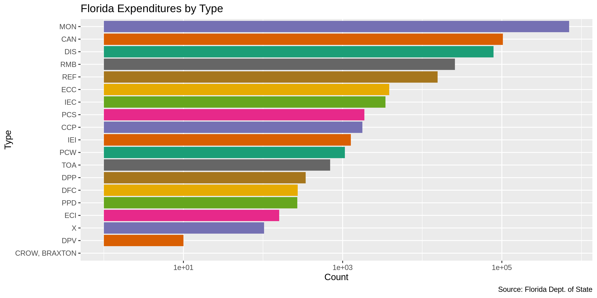
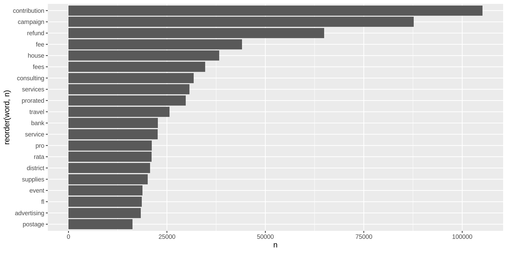
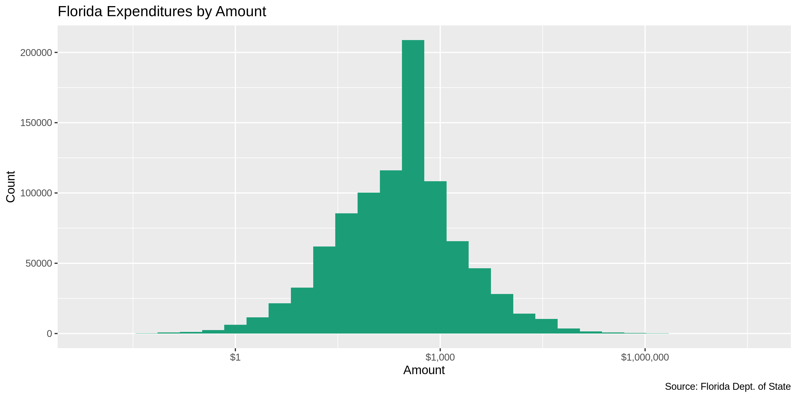
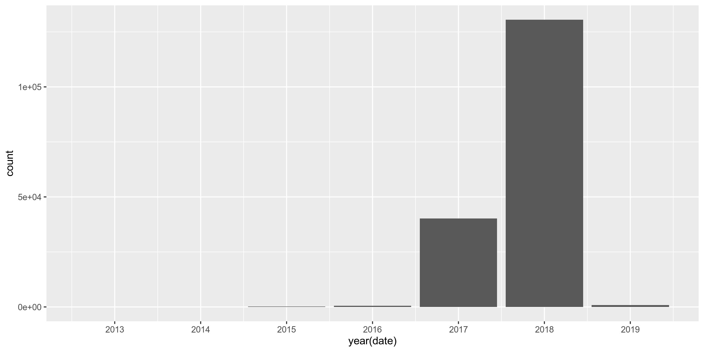
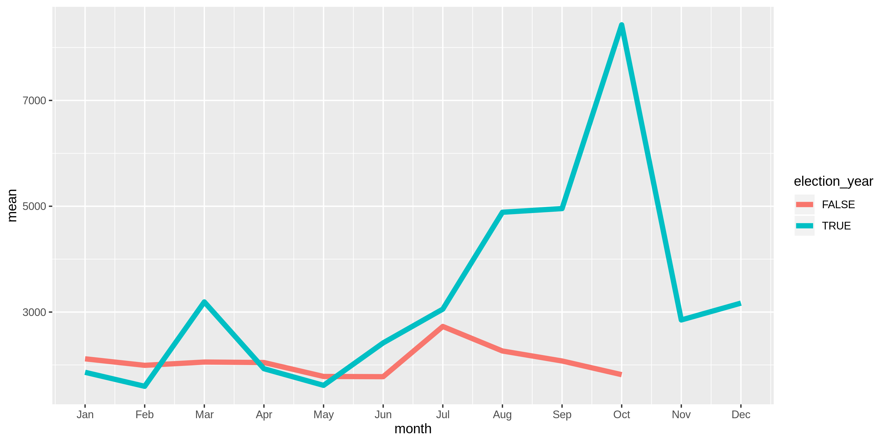

Florida Expenditures
================
Kienan Nicholls
2019-10-03 15:32:26

  - [Project](#project)
  - [Objectives](#objectives)
  - [Packages](#packages)
  - [Data](#data)
  - [Import](#import)
  - [Explore](#explore)
  - [Clean](#clean)
  - [Lookup](#lookup)
  - [Export](#export)

## Project

The Accountability Project is an effort to cut across data silos and
give journalists, policy professionals, activists, and the public at
large a simple way to search across huge volumes of public data about
people and organizations.

Our goal is to standardizing public data on a few key fields by thinking
of each dataset row as a transaction. For each transaction there should
be (at least) 3 variables:

1.  All **parties** to a transaction
2.  The **date** of the transaction
3.  The **amount** of money involved

## Objectives

This document describes the process used to complete the following
objectives:

1.  How many records are in the database?
2.  Check for duplicates
3.  Check ranges
4.  Is there anything blank or missing?
5.  Check for consistency issues
6.  Create a five-digit ZIP Code called `ZIP5`
7.  Create a `YEAR` field from the transaction date
8.  Make sure there is data on both parties to a transaction

## Packages

The following packages are needed to collect, manipulate, visualize,
analyze, and communicate these results. The `pacman` package will
facilitate their installation and attachment.

The IRW’s `campfin` package will also have to be installed from GitHub.
This package contains functions custom made to help facilitate the
processing of campaign finance data.

``` r
if (!require("pacman")) install.packages("pacman")
pacman::p_load_current_gh("irworkshop/campfin")
pacman::p_load(
  stringdist, # levenshtein value
  RSelenium, # remote browser
  tidyverse, # data manipulation
  lubridate, # datetime strings
  tidytext, # string analysis
  magrittr, # pipe opperators
  janitor, # dataframe clean
  refinr, # cluster and merge
  scales, # format strings
  knitr, # knit documents
  vroom, # read files fast
  glue, # combine strings
  here, # relative storage
  fs # search storage 
)
```

This document should be run as part of the `R_campfin` project, which
lives as a sub-directory of the more general, language-agnostic
[`irworkshop/accountability_datacleaning`](https://github.com/irworkshop/accountability_datacleaning "TAP repo")
GitHub repository.

The `R_campfin` project uses the [RStudio
projects](https://support.rstudio.com/hc/en-us/articles/200526207-Using-Projects "Rproj")
feature and should be run as such. The project also uses the dynamic
`here::here()` tool for file paths relative to *your* machine.

``` r
# where dfs this document knit?
here::here()
#> [1] "/home/kiernan/R/accountability_datacleaning/R_campfin"
```

## Data

Data is obtained from the Florida Division of Elections.

As the [agency home
page](https://dos.myflorida.com/elections/candidates-committees/campaign-finance/ "source")
explains:

> By Florida law, campaigns, committees, and electioneering
> communications organizations are required to disclose detailed
> financial records of campaign contributions and expenditures. Chapter
> 106, Florida Statutes, regulates campaign financing for all
> candidates, including judicial candidates, political committees,
> electioneering communication organizations, affiliated party
> committees, and political parties. It does not regulate campaign
> financing for candidates for federal office.

### About

A more detailed description of available data can be found on the
[Campaign Finance
page](https://dos.myflorida.com/elections/candidates-committees/campaign-finance/campaign-finance-database/):

> #### Quality of Data
> 
> The information presented in the campaign finance database is an
> accurate representation of the reports filed with the Florida Division
> of Elections.
> 
> Some of the information in the campaign finance database was submitted
> in electronic form, and some of the information was key-entered from
> paper reports. Sometimes items which are not consistent with filing
> requirements, such as incorrect codes or incorrectly formatted or
> blank items, are present in the results of a query. They are incorrect
> in the database because they were incorrect on reports submitted to
> the division.

> #### What does the Database Contain?
> 
> By law candidates and committees are required to disclose detailed
> financial records of contributions received and expenditures made. For
> committees, the campaign finance database contains all contributions
> and expenditures reported to the Florida Division of Elections since
> January 1, 1996. For candidates, the campaign finance database
> contains all contributions and expenditures reported to the Division
> since the candidacy was announced, beginning with the 1996 election.

> #### Whose Records are Included?
> 
> Included are campaign finance reports which have been filed by
> candidates for any multi-county office, with the exception of U.S.
> Senator and U.S. Representative, and by organizations that receive
> contributions or make expenditures of more than $500 in a calendar
> year to support or oppose any multi-county candidate, issue, or party.
> To obtain reports from local county or municipal candidates and
> committees, contact county or city filing offices.

> #### When are the Records Available?
> 
> Campaign finance reports are posted to the database as they are
> received from the candidates and committees. Our data is as current as
> possible, consistent with the reporting requirements of Florida law.

## Import

### Download

We will use the [Expenditure
Records](https://dos.elections.myflorida.com/campaign-finance/expenditures/)
querey form to download three separate files covering all campaign
expenditures. [The previous
page](https://dos.myflorida.com/elections/candidates-committees/campaign-finance/campaign-finance-database/)
lists instructions on how to download the desired files:

> #### How to Use the Campaign Finance Database
> 
> 1.  Specify a subset of the \[Expenditure\]…
> 2.  Select an election year entry from the list box
> 3.  Select a candidate/committee option:
> 4.  Select contribution criteria (for Detail report only):
> 5.  Select how you would like the records sorted.
> 6.  Select the format in which you would like the data returned.
> 7.  Limit the number of records to return.
> 8.  Click on the Submit Query button.

To get all files covering all expenditures:

1.  Select “All” from the **Election Year** drop down menu
2.  In the **From Date Range** text box, enter “01/01/2008”
3.  Delete “500” from the **Limit Records** text box
4.  Select “Return Results in a Tab Delimited Text File” **Retrieval
    Format** option
5.  Save to the `/fl/expends/data/raw` directory

We can automate this process using the `RSelenium` package:

``` r
# create a directory for the raw data
raw_dir <- here("fl", "expends", "data", "raw")
dir_create(raw_dir)
```

``` r
# open the driver with auto download options
remote_driver <- rsDriver(
  port = 4444L,
  browser = "firefox",
  extraCapabilities = makeFirefoxProfile(
    list(
      browser.download.dir = raw_dir,
      browser.download.folderList = 2L,
      browser.helperApps.neverAsk.saveToDisk = "text/txt"
    )
  )
)

# navigate to the FL DOE download site
remote_browser <- remote_driver$client
expends_url <- "https://dos.elections.myflorida.com/campaign-finance/expenditures/"
remote_browser$navigate(expends_url)

# chose "All" from elections list
year_menu <- "/html/body/div/div[1]/div/div/div/div/div/div/div/div/form/select[1]/option[@value = 'All']"
remote_browser$findElement("xpath", year_menu)$clickElement()

# remove the records limit text of 500
limit_box <- "div.marginBot:nth-child(64) > input:nth-child(1)"
remote_browser$findElement("css", limit_box)$clearElement()

# enter Jan 1 2008 as start date
date_box <- "div.indent:nth-child(2) > input:nth-child(1)"
remote_browser$findElement("css", )$sendKeysToElement(list("01/01/2008"))

# chose "txt" as export option
txt_button <- "ul.noBullet:nth-child(70) > li:nth-child(2) > input:nth-child(1)"
remote_browser$findElement("css", txt_button)$clickElement()

# click the submit button
submit_button <- "#rightContent > form:nth-child(6) > div:nth-child(71) > input:nth-child(2)"
remote_browser$findElement("css", submit_button)$clickElement()

# close the browser and driver
remote_browser$close()
remote_driver$server$stop()
```

### Read

``` r
fl <- 
  read_delim(
    file = dir_ls(path = raw_dir),
    delim = "\t",
    escape_double = FALSE,
    escape_backslash = FALSE,
    trim_ws = TRUE,
    col_types = cols(
      .default = col_character(),
      Date = col_date("%m/%d/%Y"),
      Amount = col_double()
    )
  ) %>% 
  select(-starts_with("X")) %>% 
  clean_names() %>% 
  mutate_if(is_character, str_to_upper)
```

## Explore

``` r
head(fl)
```

    #> # A tibble: 6 x 8
    #>   candidate_committee date       amount payee_name   address      city_state_zip  purpose     type 
    #>   <chr>               <date>      <dbl> <chr>        <chr>        <chr>           <chr>       <chr>
    #> 1 MERRITT, KEITH P. … 2008-05-01  550   SWEENEY, JA… 1038 COSMOS… LAKELAND, FL 3… YARD SIGNS  MON  
    #> 2 MERRITT, KEITH P. … 2008-08-02   34.1 LAWPAY       3700 N CAPI… AUSTIN, TX 787… MERCHANT S… MON  
    #> 3 MORRIS, ROBERT  (N… 2013-09-30   12   SUNTRUST BA… PO BOX 3051… NASHVILLE, TN … BANK FEE    MON  
    #> 4 RICHARDSON, DAVID … 2014-07-21   98.9 DELUXE CORP… 3680 VICTOR… SHOREVIEW, MN … CHECKS      MON  
    #> 5 BRACY, RANDOLPH  (… 2014-09-23  500   ORANGE CO. … P. O. BOX 1… ORLANDO, FL 32… DEC GALA    MON  
    #> 6 BRACY, RANDOLPH  (… 2014-09-24  500   EAST WINTER… 830 KLONDIK… WINTER GARDEN,… GALA SPONS… MON

``` r
tail(fl)
```

    #> # A tibble: 6 x 8
    #>   candidate_committee date        amount payee_name  address    city_state_zip  purpose       type 
    #>   <chr>               <date>       <dbl> <chr>       <chr>      <chr>           <chr>         <chr>
    #> 1 GRAHAM, GWEN  (DEM… 2019-08-20 34967.  DEPARTMENT… 500 S. BR… TALLAHASSEE, F… RETURNING MA… DIS  
    #> 2 BODDICKER, JENNIFE… 2019-09-28    19.1 STRIPE      510 TOWNS… SAN FRANCISCO,… STRIPE PROCE… MON  
    #> 3 BROWN, REGINALD LA… 2019-09-30    40   BROWN, REG… 3063 RAY … JACKSONVILLE, … REFUNDED REM… DIS  
    #> 4 GILLUM, ANDREW  (D… 2019-10-26    35.0 ZOOM.US     55 ALMADE… SAN JOSE, CA 9… SOFTWARE EXP… X    
    #> 5 KEEP FLORIDA STRON… 2019-10-31    25   REGIONS BA… 517 W MOR… WINTER PARK, F… BANK FEE      MON  
    #> 6 SHEELEY, VITO D. (… 3018-08-27  1000   MINIER, MA… 201 5TH S… ST PETERSBURG,… CAMPAIGN MAN… MON

``` r
glimpse(fl)
```

    #> Observations: 172,352
    #> Variables: 8
    #> $ candidate_committee <chr> "MERRITT, KEITH P. (NOP)(CTJ)", "MERRITT, KEITH P. (NOP)(CTJ)", "MOR…
    #> $ date                <date> 2008-05-01, 2008-08-02, 2013-09-30, 2014-07-21, 2014-09-23, 2014-09…
    #> $ amount              <dbl> 550.00, 34.11, 12.00, 98.91, 500.00, 500.00, 300.00, 1383.44, 212.99…
    #> $ payee_name          <chr> "SWEENEY, JAMES", "LAWPAY", "SUNTRUST BANK", "DELUXE CORPORATION", "…
    #> $ address             <chr> "1038 COSMOS DRIVE", "3700 N CAPITAL OF TEXAS HWY SUITE 300", "PO BO…
    #> $ city_state_zip      <chr> "LAKELAND, FL 33813", "AUSTIN, TX 78746", "NASHVILLE, TN 37230", "SH…
    #> $ purpose             <chr> "YARD SIGNS", "MERCHANT SERVICES - BANKCARD SERVICES", "BANK FEE", "…
    #> $ type                <chr> "MON", "MON", "MON", "MON", "MON", "MON", "MON", "MON", "MON", "MON"…

### Categorical

We can explore the least distinct variables with `ggplot::geom_bar()` or
perform tidytext analysis on complex character strings.

``` r
fl %>% glimpse_fun(n_distinct)
```

    #> # A tibble: 8 x 4
    #>   col                 type      n         p
    #>   <chr>               <chr> <dbl>     <dbl>
    #> 1 candidate_committee chr    2144 0.0124   
    #> 2 date                date   1121 0.00650  
    #> 3 amount              dbl   38800 0.225    
    #> 4 payee_name          chr   41047 0.238    
    #> 5 address             chr   47370 0.275    
    #> 6 city_state_zip      chr    6521 0.0378   
    #> 7 purpose             chr   25958 0.151    
    #> 8 type                chr      17 0.0000986

<!-- -->

<!-- -->

### Continuous

``` r
fl <- mutate(fl, year = year(date))
```

<!-- -->

<!-- -->

<!-- -->

### Duplicates

The `flag_dupes()` function can flag records with duplicate values
across every variable.

``` r
fl <- flag_dupes(fl, everything())
sum(fl$dupe_flag)
#> [1] 2748
mean(fl$dupe_flag)
#> [1] 0.01594411
```

### Missing

There are a number of rows missing key information.

``` r
fl %>% glimpse_fun(count_na)
```

    #> # A tibble: 10 x 4
    #>    col                 type      n         p
    #>    <chr>               <chr> <dbl>     <dbl>
    #>  1 candidate_committee chr       0 0        
    #>  2 date                date      0 0        
    #>  3 amount              dbl       0 0        
    #>  4 payee_name          chr       3 0.0000174
    #>  5 address             chr     326 0.00189  
    #>  6 city_state_zip      chr       0 0        
    #>  7 purpose             chr      22 0.000128 
    #>  8 type                chr       0 0        
    #>  9 year                dbl       0 0        
    #> 10 dupe_flag           lgl       0 0

The `flag_na()` function can flag records missing values key values in
any key variable.

``` r
fl <- flag_na(fl, payee_name, candidate_committee, date, amount)
sum(fl$na_flag)
```

    #> [1] 3

## Clean

We need to separate the `city_state_zip` variable into their respective
variables. Then we can clean each part.

``` r
fl <- fl %>% 
  separate(
    col = city_state_zip,
    into = c("city_sep", "state_zip"),
    sep = ",\\s",
    remove = FALSE
  ) %>% 
  separate(
    col = state_zip,
    into = c("state_sep", "zip_sep"),
    sep = "\\s",
    remove = TRUE
  )
```

### Address

The database seems to use repeating astricks characters as `NA` values.
We can remove any value with a single repeating character.

``` r
fl <- fl %>% 
  mutate(
    address_clean = normal_address(
      address = address,
      add_abbs = usps_street,
      na_rep = TRUE
    )
  )
```

### Zip

``` r
sample(fl$zip_sep[which(nchar(fl$zip_sep) != 5)], 10)
#>  [1] "CANADA" "68"     "2063"   "3725"   ""       "3331"   "325"    "403"    "021"    "940"
```

``` r
fl <- fl %>% mutate(zip_clean = normal_zip(zip_sep, na_rep = TRUE))
```

``` r
prop_in(fl$zip_clean, valid_zip)
```

    #> [1] 0.996401

### State

``` r
n_distinct(fl$state_sep)
#> [1] 89
prop_in(fl$state_sep, valid_state)
#> [1] 0.9986467
count_out(fl$state_sep, valid_state)
#> [1] 232
sample(unique(na.omit(fl$state_sep[fl$state_sep %out% valid_state])), 20)
#>  [1] "UK"      "XC"      "V"       "XE"      "NS"      "JOHNS"   "F"       "BRITISH" "FL."    
#> [10] "HM"      "ALBERTA" "BC"      "BOCA"    "FF"      "THE"     "SO"      "AUS"     "**"     
#> [19] "QU"      "HANOI"
```

``` r
fl <- fl %>% mutate(
  state_clean = normal_state(
    state = state_sep,
    abbreviate = TRUE,
    valid = valid_state
  )
)
```

### City

``` r
n_distinct(fl$city_sep)
#> [1] 2344

mean(fl$city_sep %in% valid_city)
#> [1] 0.8824035

sum(fl$city_sep %out% valid_city)
#> [1] 20268

sample(unique(na.omit(fl$city_sep[fl$city_sep %out% valid_city])), 20)
#>  [1] "BELLE BLADE"     "HOLLOYWOOD"      "RIVERA BEACH"    "WAUCHULLA"       "JACKSONVILLELLE"
#>  [6] "PA;M BAY"        "FT LAUDEDALE"    "DEERFIELS BEACH" "LW"              "MERRIT ISLAND"  
#> [11] "GAINVESVILLE"    "BELLAIR BLUFFS"  "HIGHLAND BEACH"  "WELLINGTON,"     "RED WOOD"       
#> [16] "NEW PORT RICHET" "ORLAN"           "MICCO"           "JACKSONILLE"     "CALABASSAS"
```

### Normalize

``` r
fl <- fl %>% 
  mutate(
    city_norm = normal_city(
      city = city_sep,
      na_rep = TRUE,
      st_abbs = c("FL", "DC"),
      geo_abbs = usps_city
    )
  )

n_distinct(fl$city_norm)
```

    #> [1] 2161

### Match

``` r
fl <- fl %>% 
  left_join(
    y = zipcodes, 
    by = c(
      "zip_clean" = "zip", 
      "state_clean" = "state"
    )
  ) %>% 
  rename(city_match = city)
```

### Swap

``` r
fl <- fl %>% 
  mutate(
    match_dist = stringdist(city_norm, city_match),
    city_swap = if_else(
      condition = match_dist <= 2,
      true = city_match,
      false = city_norm
    )
  )

summary(fl$match_dist)
```

    #>    Min. 1st Qu.  Median    Mean 3rd Qu.    Max.    NA's 
    #>     0.0     0.0     0.0     1.1     0.0    20.0    6551

``` r
sum(fl$match_dist == 1, na.rm = TRUE)
```

    #> [1] 1557

``` r
n_distinct(fl$city_swap)
```

    #> [1] 1572

### Refine

``` r
fl_refine <- fl %>% 
  filter(state_clean == "FL") %>% 
  mutate(
    city_refine = city_swap %>% 
      key_collision_merge() %>% 
      n_gram_merge()
  ) %>% 
  filter(city_refine != city_swap)

fl_refine %>% 
  count(
    city_swap, 
    city_refine,
    sort = TRUE
  )
```

    #> # A tibble: 33 x 3
    #>    city_swap       city_refine          n
    #>    <chr>           <chr>            <int>
    #>  1 HALLANDALE BEAC HALLANDALE BEACH    14
    #>  2 DEL RAY BEACH   DELRAY BEACH         6
    #>  3 NORTH LAUDERDAL NORTH LAUDERDALE     6
    #>  4 ANNA MARIA      MARIANNA             5
    #>  5 CHAMPIONSGATE   CHAMPIONS GATE       4
    #>  6 CUTTLER BAY     CUTLER BAY           2
    #>  7 AVENUTURA       AVENUTRA             1
    #>  8 COCONUT GROVER  COCONUT GROVE        1
    #>  9 CORAL GABLESL   CORAL GABLES         1
    #> 10 CORAL SPRING    CORAL SPRINGS        1
    #> # … with 23 more rows

``` r
fl <- fl %>% 
  left_join(fl_refine) %>% 
  mutate(city_clean = coalesce(city_refine, city_swap))
```

``` r
n_distinct(fl$city_sep)
#> [1] 2344
n_distinct(fl$city_norm)
#> [1] 2161
n_distinct(fl$city_swap)
#> [1] 1572
n_distinct(fl$city_clean)
#> [1] 1539
```

## Lookup

``` r
lookup <- read_csv("fl/expends/data/fl_city_lookup.csv")
fl <- left_join(fl, select(lookup, 1, 2))
```

``` r
n_distinct(fl$city_new)
```

    #> [1] 1409

``` r
prop_in(fl$city_new, valid_city)
```

    #> [1] 0.9329042

``` r
count_out(fl$city_new, valid_city)
```

    #> [1] 11121

## Export

``` r
clean_dir <- here("fl", "expends", "data", "processed")
dir_create(clean_dir)
fl %>% 
  select(
    -address,
    -city_state_zip,
    -city_sep,
    -state_sep,
    -zip_sep,
    -city_norm,
    -city_match,
    -match_dist,
    -city_swap,
    -city_clean
  ) %>% 
  write_csv(
    path = glue("{clean_dir}/fl_expends_clean.csv"),
    na = ""
  )
```
