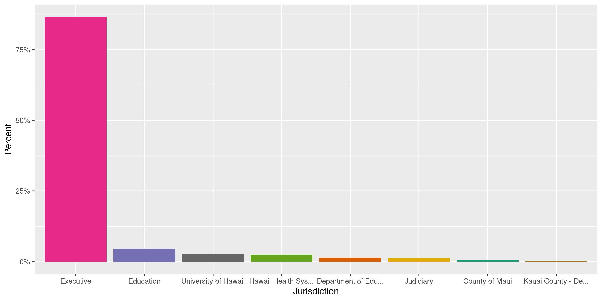
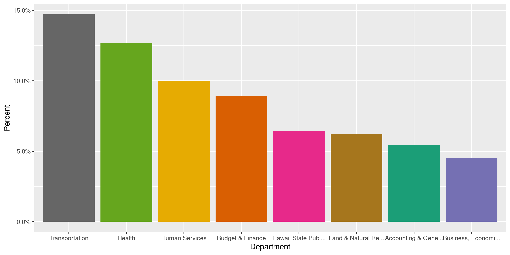
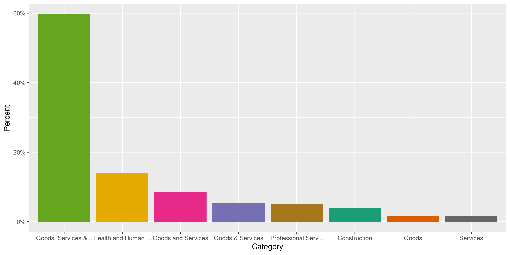
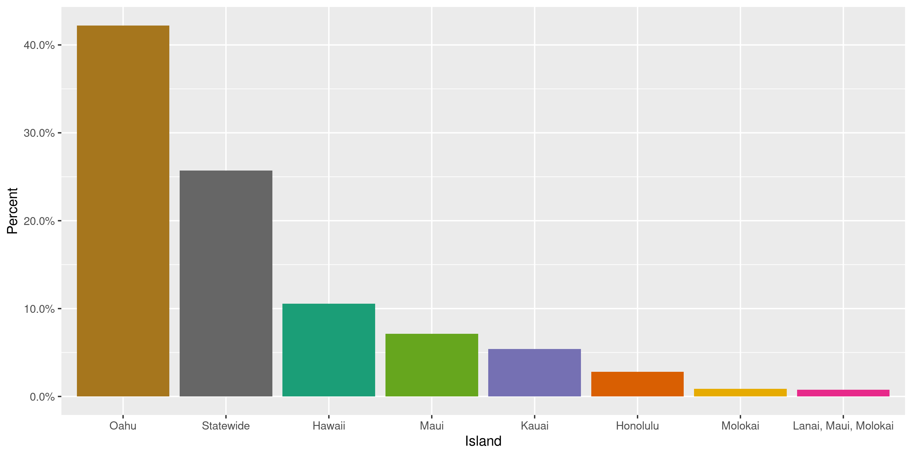

Hawaii Contracts
================
Kiernan Nicholls
2020-05-14 13:39:24

  - [Project](#project)
  - [Objectives](#objectives)
  - [Packages](#packages)
  - [Data](#data)
  - [Explore](#explore)
  - [Conclude](#conclude)
  - [Export](#export)
  - [Dictionary](#dictionary)

<!-- Place comments regarding knitting here -->

## Project

The Accountability Project is an effort to cut across data silos and
give journalists, policy professionals, activists, and the public at
large a simple way to search across huge volumes of public data about
people and organizations.

Our goal is to standardizing public data on a few key fields by thinking
of each dataset row as a transaction. For each transaction there should
be (at least) 3 variables:

1.  All **parties** to a transaction.
2.  The **date** of the transaction.
3.  The **amount** of money involved.

## Objectives

This document describes the process used to complete the following
objectives:

1.  How many records are in the database?
2.  Check for entirely duplicated records.
3.  Check ranges of continuous variables.
4.  Is there anything blank or missing?
5.  Check for consistency issues.
6.  Create a five-digit ZIP Code called `zip`.
7.  Create a `year` field from the transaction date.
8.  Make sure there is data on both parties to a transaction.

## Packages

The following packages are needed to collect, manipulate, visualize,
analyze, and communicate these results. The `pacman` package will
facilitate their installation and attachment.

The IRW’s `campfin` package will also have to be installed from GitHub.
This package contains functions custom made to help facilitate the
processing of campaign finance data.

``` r
if (!require("pacman")) install.packages("pacman")
pacman::p_load_gh("irworkshop/campfin")
pacman::p_load(
  tidyverse, # data manipulation
  lubridate, # datetime strings
  gluedown, # printing markdown
  magrittr, # pipe operators
  janitor, # clean data frames
  refinr, # cluster and merge
  scales, # format strings
  readxl, # read excel files
  knitr, # knit documents
  vroom, # read files fast
  rvest, # html scraping
  glue, # combine strings
  here, # relative paths
  httr, # http requests
  fs # local storage 
)
```

This document should be run as part of the `R_campfin` project, which
lives as a sub-directory of the more general, language-agnostic
[`irworkshop/accountability_datacleaning`](https://github.com/irworkshop/accountability_datacleaning)
GitHub repository.

The `R_campfin` project uses the [RStudio
projects](https://support.rstudio.com/hc/en-us/articles/200526207-Using-Projects)
feature and should be run as such. The project also uses the dynamic
`here::here()` tool for file paths relative to *your* machine.

``` r
# where does this document knit?
here::here()
#> [1] "/home/kiernan/Code/accountability_datacleaning/R_campfin"
```

## Data

Contracts data is obtained from the [Hawaii Awards & Notices Data
System](https://hands.ehawaii.gov/hands/awards) where we can export
active and archived contracts as an excel file.

> This page displays the notice of awards for procurements done by the
> State and its municipalities. These are Award Notices ONLY,
> procurement records are maintained by the agency that conducted the
> solicitation.

### Read

The raw file can be read using `readxl::read_excel()`.

``` r
raw_dir <- dir_create(here("hi", "contracts", "data", "raw"))
raw_path <- path(raw_dir, "contract-awards-05142020045537AM.xlsx")
```

``` r
hic <- read_excel(
  path = raw_path,
  skip = 3,
  .name_repair = make_clean_names
)
```

A few columns can be renamed for simplicity.

``` r
hic <- rename(
  .data = hic,
  date = date_awarded,
  amount = original_award_amount,
  id = solicitation_number
)
```

## Explore

``` r
glimpse(hic)
#> Rows: 62,612
#> Columns: 10
#> $ date         <dttm> 2106-06-20, 2106-04-26, 2103-12-17, 2103-12-06, 2101-11-25, 2020-07-01, 20…
#> $ id           <chr> NA, NA, NA, NA, NA, NA, NA, NA, NA, NA, NA, "B20001418", "B20001475", "Q200…
#> $ title        <chr> "3 YR Service Agreement for MAGPIX SN 14037704  Coverage Period  06/10/2017…
#> $ amount       <dbl> 16327.00, 4712.00, 495595.00, 2604.00, 4972.00, 0.00, 0.00, 0.00, 225000.00…
#> $ awardee      <chr> "Luminex Corporation", "Jacob Electric LLC", "IHS The Institute for Human S…
#> $ jurisdiction <chr> "Executive", "Executive", "Executive", "Executive", "Executive", "Executive…
#> $ department   <chr> "Health", "Defense", "Health", "Defense", "Defense", "Health", "Health", "H…
#> $ division     <chr> "State Laboratories Division", "Hawaii Army National Guard", "Adult Mental …
#> $ category     <chr> "Goods, Services & Construction", "Goods, Services & Construction", "Health…
#> $ island       <chr> NA, NA, "Oahu", NA, NA, "Statewide", "Statewide", "Statewide", "Statewide",…
tail(hic)
#> # A tibble: 6 x 10
#>   date                id    title  amount awardee  jurisdiction department division category island
#>   <dttm>              <chr> <chr>   <dbl> <chr>    <chr>        <chr>      <chr>    <chr>    <chr> 
#> 1 1899-12-30 00:00:00 <NA>  Polli…   2562 Garden … Executive    Defense    Hawaii … Goods, … <NA>  
#> 2 1899-12-30 00:00:00 <NA>  Inspe…   2604 AccuPes… Executive    Hawaii St… Other    Goods, … <NA>  
#> 3 1899-12-30 00:00:00 <NA>  Child… 558000 PATCH (… Executive    Human Ser… Benefit… Health … State…
#> 4 1899-12-30 00:00:00 <NA>  Graph…  24000 Hirasak… Executive    Business,… Strateg… Goods, … <NA>  
#> 5 1899-12-30 00:00:00 <NA>  Woode…  41520 Harlan … Executive    Transport… Airports Goods, … <NA>  
#> 6 1899-12-30 00:00:00 <NA>  Commu… 652422 Hawaii … Executive    Labor & I… Office … Health … Hawaii
```

### Missing

A number of records are missing one of the names, dates, or numbers
needed to properly identify a transaction.

``` r
col_stats(hic, count_na)
#> # A tibble: 10 x 4
#>    col          class      n         p
#>    <chr>        <chr>  <int>     <dbl>
#>  1 date         <dttm>  7486 0.120    
#>  2 id           <chr>  51529 0.823    
#>  3 title        <chr>   3316 0.0530   
#>  4 amount       <dbl>      0 0        
#>  5 awardee      <chr>   3473 0.0555   
#>  6 jurisdiction <chr>   6756 0.108    
#>  7 department   <chr>   2084 0.0333   
#>  8 division     <chr>   7664 0.122    
#>  9 category     <chr>      1 0.0000160
#> 10 island       <chr>  39977 0.638
```

We can flag these records with `campfin::flag_na()`.

``` r
key_vars <- c("date", "department", "amount", "awardee")
hic <- hic %>% flag_na(all_of(key_vars))
sum(hic$na_flag)
#> [1] 7772
```

``` r
hic %>% 
  filter(na_flag) %>% 
  select(all_of(key_vars)) %>% 
  sample_frac(1)
#> # A tibble: 7,772 x 4
#>    date                department              amount awardee                                      
#>    <dttm>              <chr>                    <dbl> <chr>                                        
#>  1 NA                  Human Services          135069 Rainbow Rehabilitation Services, Inc.        
#>  2 NA                  Health                       0 <NA>                                         
#>  3 NA                  <NA>                         0 <NA>                                         
#>  4 NA                  Health                       0 <NA>                                         
#>  5 NA                  Health                     114 Liu, Jeffrey E., MD                          
#>  6 NA                  Human Services          125000 Boys and Girls Club of Hawaii                
#>  7 NA                  NONE                         0 <NA>                                         
#>  8 NA                  Labor & Industrial Rel… 232960 Catholic Charities Hawaii - Community and Im…
#>  9 NA                  NONE                         0 <NA>                                         
#> 10 NA                  Human Services           60000 Pikunas, Kristina A.                         
#> # … with 7,762 more rows
```

### Duplicates

A significant number of records are entirely duplicated across all
columns, including the supposedly unique contract `id` variable. We can
flag these rows as well.

``` r
hic <- flag_dupes(hic, everything())
percent(mean(hic$dupe_flag), 0.01)
#> [1] "6.26%"
```

``` r
hic %>% 
  filter(dupe_flag) %>% 
  select(all_of(key_vars))
#> # A tibble: 3,917 x 4
#>    date                department                    amount awardee                      
#>    <dttm>              <chr>                          <dbl> <chr>                        
#>  1 2020-03-20 00:00:00 Agriculture                   35000  University of Hawaii         
#>  2 2020-03-20 00:00:00 Agriculture                   35000  University of Hawaii         
#>  3 2020-03-20 00:00:00 Agriculture                   35000  University of Hawaii         
#>  4 2020-02-25 00:00:00 Accounting & General Services 37848  AKINAKA & ASSOCIATES, LTD.   
#>  5 2020-02-25 00:00:00 Accounting & General Services 37848  AKINAKA & ASSOCIATES, LTD.   
#>  6 2019-09-27 00:00:00 Agriculture                   57000  JAXIE CORPORATION            
#>  7 2019-09-27 00:00:00 Agriculture                   57000  JAXIE CORPORATION            
#>  8 2019-09-19 00:00:00 Health                        10128. LIFE TECHNOLOGIES CORPORATION
#>  9 2019-09-19 00:00:00 Health                        10128. LIFE TECHNOLOGIES CORPORATION
#> 10 2019-08-12 00:00:00 Health                        13000  Lily Wan Hing Wong           
#> # … with 3,907 more rows
```

### Categorical

``` r
col_stats(hic, n_distinct)
#> # A tibble: 12 x 4
#>    col          class      n         p
#>    <chr>        <chr>  <int>     <dbl>
#>  1 date         <dttm>  4283 0.0684   
#>  2 id           <chr>   9383 0.150    
#>  3 title        <chr>  45401 0.725    
#>  4 amount       <dbl>  31106 0.497    
#>  5 awardee      <chr>  12366 0.198    
#>  6 jurisdiction <chr>     14 0.000224 
#>  7 department   <chr>     41 0.000655 
#>  8 division     <chr>    286 0.00457  
#>  9 category     <chr>     10 0.000160 
#> 10 island       <chr>     59 0.000942 
#> 11 na_flag      <lgl>      2 0.0000319
#> 12 dupe_flag    <lgl>      2 0.0000319
```

``` r
explore_plot(hic, jurisdiction) + scale_x_truncate()
```

<!-- -->

``` r
explore_plot(hic, department) + scale_x_truncate()
```

<!-- -->

``` r
explore_plot(hic, category) + scale_x_truncate()
```

<!-- -->

``` r
explore_plot(hic, island) + scale_x_truncate()
```

<!-- -->

### Amounts

A fair number of records have an `amount` value equal or less than zero.
This is sometimes used to indicate a correction, but there is no way to
tell.

``` r
percent(mean(hic$amount <= 0), 0.01)
#> [1] "8.06%"
```

``` r
hic %>% 
  select(all_of(key_vars)) %>% 
  filter(amount <= 0)
#> # A tibble: 5,048 x 4
#>    date                department     amount awardee                                               
#>    <dttm>              <chr>           <dbl> <chr>                                                 
#>  1 2020-07-01 00:00:00 Health              0 Habilitation Center, LLC dba Millcreek of Arkansas    
#>  2 2020-07-01 00:00:00 Health              0 RTC Resource Acq. Corporation                         
#>  3 2020-07-01 00:00:00 Health              0 Mingus Mountain Estate Residential Center Inc.        
#>  4 2020-05-08 00:00:00 Budget & Fina…      0 Humana Insurance Company                              
#>  5 2020-04-30 00:00:00 Transportation      0 JNR Environmental LLC                                 
#>  6 2020-04-30 00:00:00 Transportation      0 H.T.M. Contractors, Inc.                              
#>  7 2020-04-30 00:00:00 Transportation      0 H.T.M. Contractors, Inc.                              
#>  8 2020-04-30 00:00:00 Education           0 CDW GOVERNMENT LLC                                    
#>  9 2020-04-28 00:00:00 Education           0 Ahead Of The Class Educational Services, Inc., AMERIC…
#> 10 2020-04-28 00:00:00 Budget & Fina…      0 CAREMARKPCS HEALTH, L.L.C.                            
#> # … with 5,038 more rows
```

We should also view the smallest and largest transactions for any
discrepancies.

``` r
noquote(map_chr(summary(hic$amount), dollar))
#>            Min.         1st Qu.          Median            Mean         3rd Qu.            Max. 
#>       -$213,730          $3,785         $15,951        $911,884        $101,482 $17,000,000,000
glimpse(hic[which.min(hic$amount), ]) # smallest
#> Rows: 1
#> Columns: 12
#> $ date         <dttm> NA
#> $ id           <chr> NA
#> $ title        <chr> NA
#> $ amount       <dbl> -213730
#> $ awardee      <chr> NA
#> $ jurisdiction <chr> "Executive"
#> $ department   <chr> "Health"
#> $ division     <chr> NA
#> $ category     <chr> "Health and Human Services"
#> $ island       <chr> NA
#> $ na_flag      <lgl> TRUE
#> $ dupe_flag    <lgl> FALSE
glimpse(hic[which.max(hic$amount), ]) # largest
#> Rows: 1
#> Columns: 12
#> $ date         <dttm> 2020-01-22
#> $ id           <chr> "RFP–MQD–2019-002"
#> $ title        <chr> "QUEST Integration (QI)  Managed Care to Cover Medicaid and Other Eligible …
#> $ amount       <dbl> 1.7e+10
#> $ awardee      <chr> "Hawaii Medical Service Association, United HealthCare Insurance Company, W…
#> $ jurisdiction <chr> "Executive"
#> $ department   <chr> "Human Services"
#> $ division     <chr> "MEDQUEST"
#> $ category     <chr> "Health and Human Services"
#> $ island       <chr> "Statewide"
#> $ na_flag      <lgl> FALSE
#> $ dupe_flag    <lgl> FALSE
```

Aside from those records equal to zero and a handful of fairly small
`amount` values, the overall distribution of `amount` looks to be what
we’d expect.

<!-- -->

### Dates

We can add the calendar year from `date` with `lubridate::year()`

``` r
hic <- mutate(hic, year = year(date))
```

A fair number of `date` values are `NA`, preventing us from creating the
`year`. There are also a handful of dates outside the range we would
expect.

``` r
percent(prop_na(hic$date), 0.01)
#> [1] "11.96%"
min(hic$date, na.rm = TRUE)
#> [1] "1899-12-30 UTC"
sum(hic$year < 2000, na.rm = TRUE)
#> [1] 35
max(hic$date, na.rm = TRUE)
#> [1] "2106-06-20 UTC"
sum(hic$date > today(), na.rm = TRUE)
#> [1] 10
```

We can convert dates from the 22nd century to their 21st century
equivalent.

``` r
hic <- mutate(hic, across(date, ~as.Date(str_replace(., "^(21)", "20"))))
hic <- mutate(hic, across(date, ~as.Date(str_replace(., "^(18)", "19"))))
hic <- mutate(hic, year = year(date))
```

<!-- -->

## Conclude

``` r
glimpse(sample_n(hic, 20))
#> Rows: 20
#> Columns: 13
#> $ date         <date> 2020-03-06, 2018-11-20, NA, 2019-10-23, NA, 2009-04-02, 2016-12-09, 2009-1…
#> $ id           <chr> NA, NA, NA, NA, NA, NA, NA, NA, "Q20000686", NA, NA, NA, NA, NA, "Q17000712…
#> $ title        <chr> "HAWAII SMALL BUSINESS INNOVATION RESEARCH PHASE 2 & 3 GRANT", "Wahiawa   F…
#> $ amount       <dbl> 69428.57, 4850.00, 0.00, 5923.88, 2522.00, 4391.00, 1971.00, 489305.00, 636…
#> $ awardee      <chr> "TRIDENTIS ADVANCED MARINE VEHICLES LLC", "D.Y.C ELECTRIC SRVC LLC", NA, "A…
#> $ jurisdiction <chr> "Executive", "Executive", "Executive", "Executive", "Executive", "Executive…
#> $ department   <chr> "Business, Economic Development, & Tourism", "Defense", "Human Services", "…
#> $ division     <chr> "High Technology Development Corporation", "Hawaii Army National Guard", "B…
#> $ category     <chr> "Goods & Services", "Goods & Services", "Health and Human Services", "Goods…
#> $ island       <chr> "Statewide", "Oahu", NA, "Statewide", NA, NA, NA, NA, "Oahu", NA, NA, NA, N…
#> $ na_flag      <lgl> FALSE, FALSE, TRUE, FALSE, TRUE, FALSE, FALSE, FALSE, FALSE, FALSE, TRUE, F…
#> $ dupe_flag    <lgl> FALSE, FALSE, TRUE, FALSE, FALSE, FALSE, FALSE, FALSE, FALSE, FALSE, TRUE, …
#> $ year         <dbl> 2020, 2018, NA, 2019, NA, 2009, 2016, 2009, 2020, 2016, NA, 2006, 2012, 200…
```

1.  There are 62,612 records in the database.
2.  There are 3,917 duplicate records in the database.
3.  The range and distribution of `amount` and `date` seem reasonable.
4.  There are 7,772 records missing key variables.
5.  Consistency in geographic data has been improved with
    `campfin::normal_*()`.
6.  The 4-digit `year` variable has been created with
    `lubridate::year()`.

## Export

Now the file can be saved on disk for upload to the Accountability
server.

``` r
clean_dir <- dir_create(here("hi", "contracts", "data", "clean"))
clean_path <- path(clean_dir, "hi_contracts_clean.csv")
write_csv(hic, clean_path, na = "")
file_size(clean_path)
#> 12.5M
mutate(file_encoding(clean_path), across(path, basename))
#> # A tibble: 1 x 3
#>   path                   mime            charset
#>   <chr>                  <chr>           <chr>  
#> 1 hi_contracts_clean.csv application/csv utf-8
```

## Dictionary

The following table describes the variables in our final exported file:

| Column         | Type        | Definition                     |
| :------------- | :---------- | :----------------------------- |
| `date`         | `double`    | Contract award date            |
| `id`           | `character` | Unique contract ID             |
| `title`        | `character` | Contract title                 |
| `amount`       | `double`    | Contract award amount          |
| `awardee`      | `character` | Awardee vendor name            |
| `jurisdiction` | `character` | Awarding agency jurisdiction   |
| `department`   | `character` | Awarding agency department     |
| `division`     | `character` | Awarding agency division       |
| `category`     | `character` | Contract category              |
| `island`       | `character` | Vendor island                  |
| `na_flag`      | `logical`   | Flag for missing key variables |
| `dupe_flag`    | `logical`   | Flag for deplicate records     |
| `year`         | `double`    | Calendar year awarded          |

``` r
write_lines(
  x = c("# Hawaii Contracts Data Dictionary\n", dict_md),
  path = here("hi", "contracts", "hi_contracts_dict.md"),
)
```
