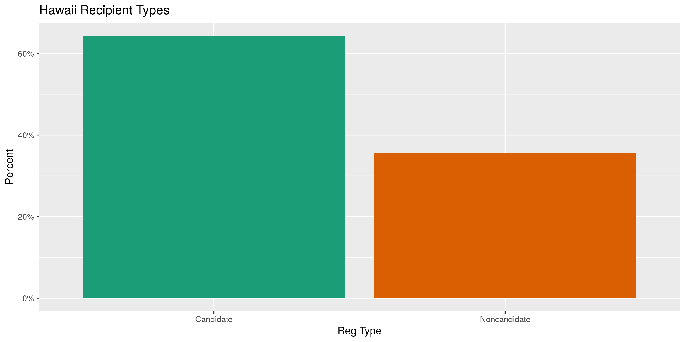
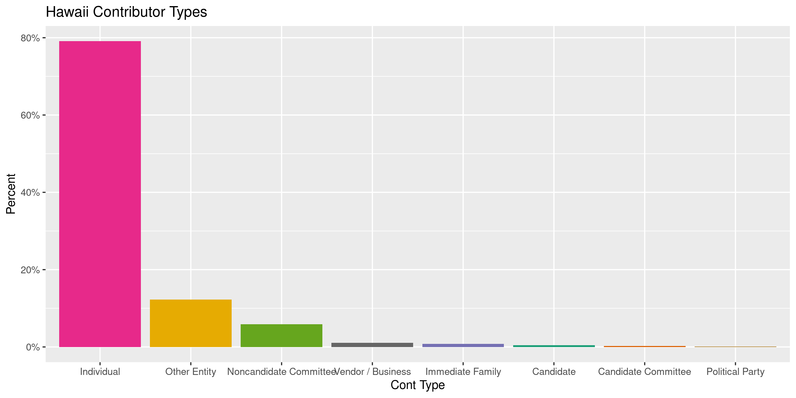
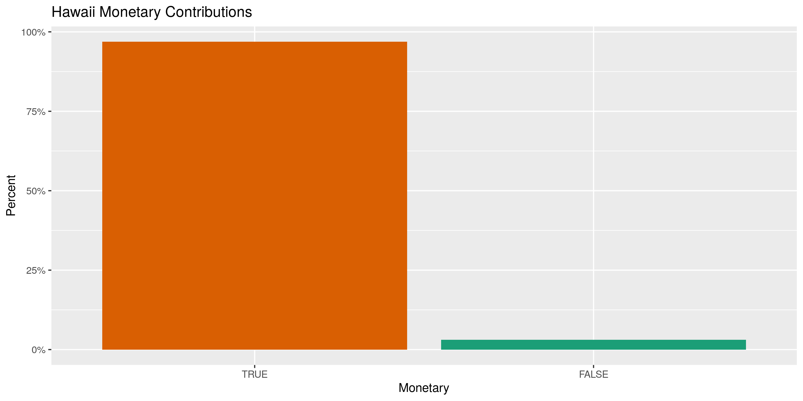
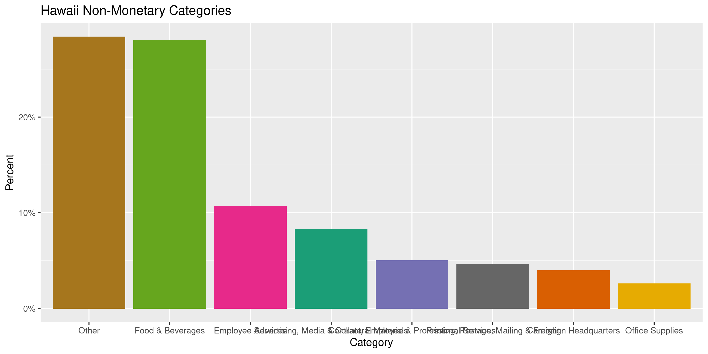
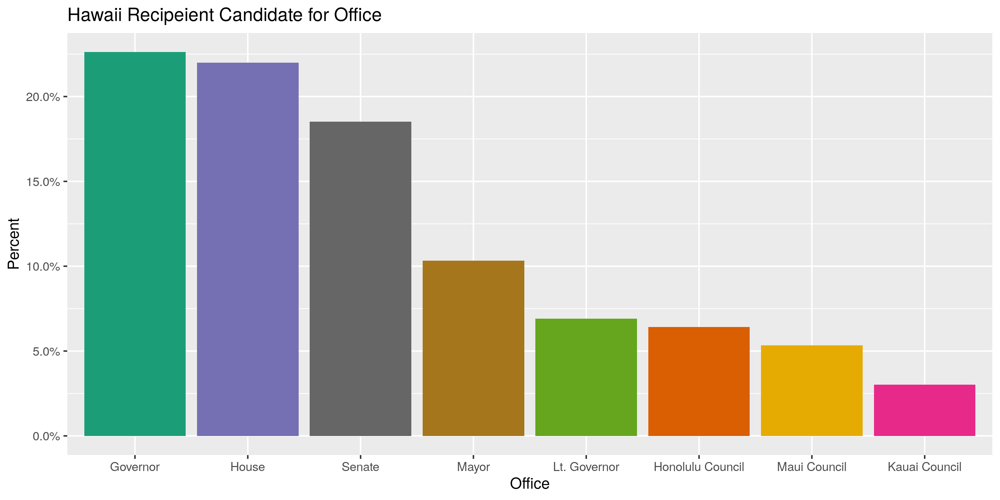
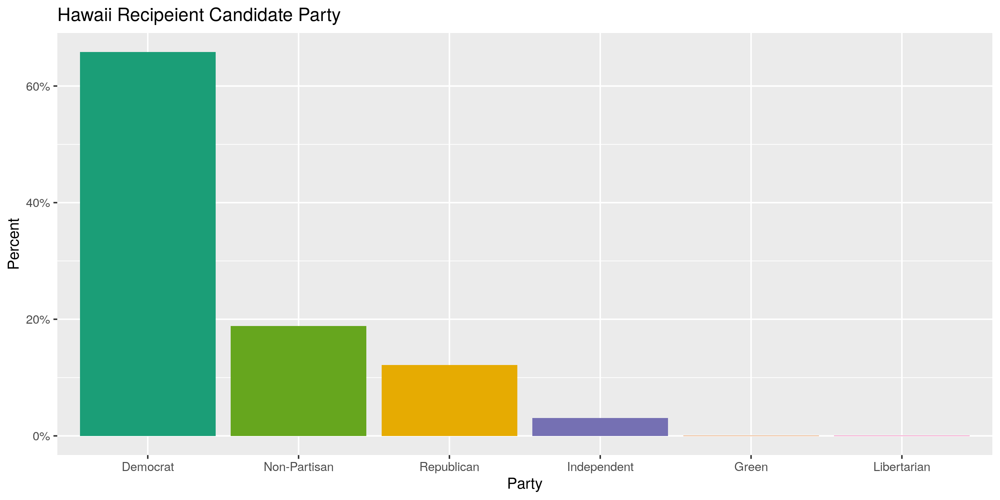
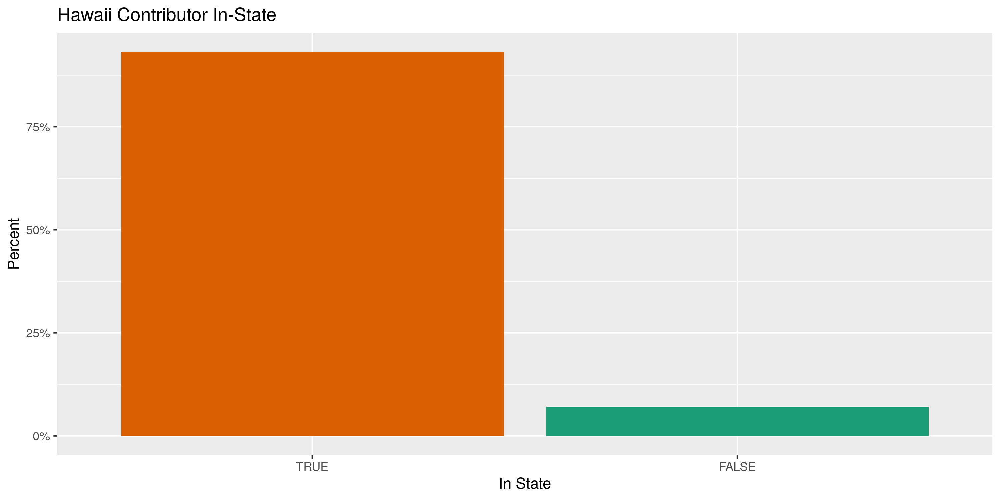
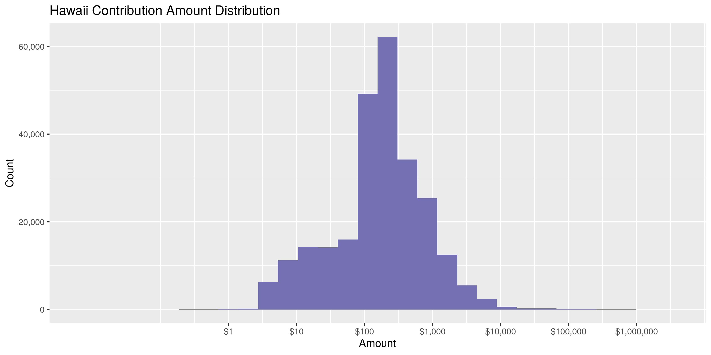
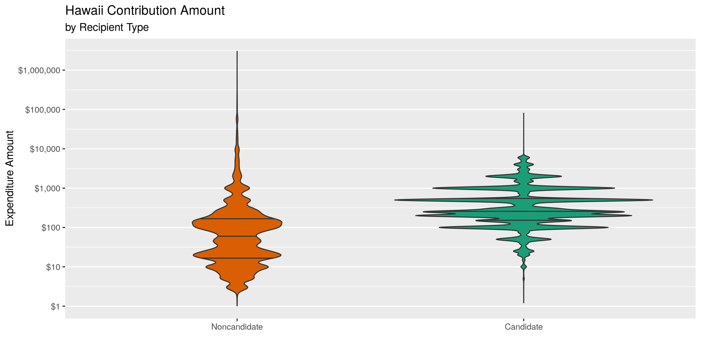
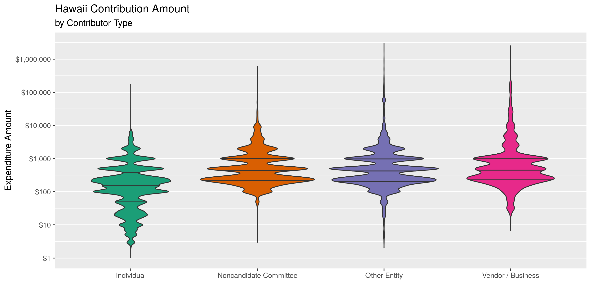

Hawaii Contributions
================
Kiernan Nicholls
2020-04-10 14:14:20

  - [Project](#project)
  - [Objectives](#objectives)
  - [Packages](#packages)
  - [Data](#data)
  - [Import](#import)
  - [Explore](#explore)
  - [Wrangle](#wrangle)
  - [Conclude](#conclude)
  - [Export](#export)

<!-- Place comments regarding knitting here -->

## Project

The Accountability Project is an effort to cut across data silos and
give journalists, policy professionals, activists, and the public at
large a simple way to search across huge volumes of public data about
people and organizations.

Our goal is to standardizing public data on a few key fields by thinking
of each dataset row as a transaction. For each transaction there should
be (at least) 3 variables:

1.  All **parties** to a transaction
2.  The **date** of the transaction
3.  The **amount** of money involved

## Objectives

This document describes the process used to complete the following
objectives:

1.  How many records are in the database?
2.  Check for duplicates
3.  Check ranges
4.  Is there anything blank or missing?
5.  Check for consistency issues
6.  Create a five-digit ZIP Code called `ZIP5`
7.  Create a `YEAR` field from the transaction date
8.  Make sure there is data on both parties to a transaction

## Packages

The following packages are needed to collect, manipulate, visualize,
analyze, and communicate these results. The `pacman` package will
facilitate their installation and attachment.

The IRW’s `campfin` package will also have to be installed from GitHub.
This package contains functions custom made to help facilitate the
processing of campaign finance data.

``` r
if (!require("pacman")) install.packages("pacman")
pacman::p_load_gh("irworkshop/campfin")
pacman::p_load(
  tidyverse, # data manipulation
  lubridate, # datetime strings
  magrittr, # pipe opperators
  janitor, # dataframe clean
  refinr, # cluster and merge
  scales, # format strings
  knitr, # knit documents
  vroom, # read files fast
  glue, # combine strings
  here, # relative storage
  fs # search storage 
)
```

This document should be run as part of the `R_campfin` project, which
lives as a sub-directory of the more general, language-agnostic
[`irworkshop/accountability_datacleaning`](https://github.com/irworkshop/accountability_datacleaning "TAP repo")
GitHub repository.

The `R_campfin` project uses the [RStudio
projects](https://support.rstudio.com/hc/en-us/articles/200526207-Using-Projects "Rproj")
feature and should be run as such. The project also uses the dynamic
`here::here()` tool for file paths relative to *your* machine.

``` r
# where does this document knit?
here::here()
#> [1] "/home/kiernan/Code/accountability_datacleaning/R_campfin"
```

## Data

Data is obtained from the [Hawaii Campaign Spending
Commission](https://ags.hawaii.gov/campaign/) (CSC). The file can be
found on the \[Hawaii Open Data portal\]\[odp\]. There are two files,
one contributions received by Candidate committees and one for
Noncandidate committees. In both files, each record represents a
campaign contribution made from an individual, political party, or some
other entity.

## Import

We can read both files into a single data frame with `purrr::map_df()`
and `readr::read_csv()`.

``` r
hic <- map_df(
  .x = c(
    "https://data.hawaii.gov/api/views/jexd-xbcg/rows.csv", # Candidates
    "https://data.hawaii.gov/api/views/rajm-32md/rows.csv" # Committees
  ),
  .f = read_csv,
  .id = "reg_type",
  col_types = cols(
    .default = col_character(),
    Date = col_date_usa(),
    Amount = col_double(),
    Aggregate = col_double()
  )
)
```

Then we will do some slight wrangling to the column names, types, and
positions for clarity.

``` r
hic <- hic %>%
  clean_names(case = "snake") %>%
  rename(
    cand_name = candidate_name,
    comm_name = noncandidate_committee_name,
    cont_type = contributor_type,
    cont_name = contributor_name,
    monetary = non_monetary_yes_or_no,
    category = non_monetary_category,
    description = non_monetary_description,
    in_state = in_out_state,
    zip = zip_code,
    reg_id = reg_no,
  ) %>% 
  mutate(
    reg_type = recode(reg_type, "1" = "Candidate", "2" = "Noncandidate"),
    reg_name = coalesce(cand_name, comm_name),
    monetary = equals(monetary, "N"),
    in_state = equals(in_state, "HI")
  ) %>% 
  select(
    date,
    reg_id,
    reg_type,
    reg_name,
    everything(),
    -comm_name,
    -cand_name
  )
```

## Explore

The data base has 254,927 rows of 26 variables.

``` r
head(hic)
#> # A tibble: 6 x 26
#>   date       reg_id reg_type reg_name cont_type cont_name amount aggregate employer occupation
#>   <date>     <chr>  <chr>    <chr>    <chr>     <chr>      <dbl>     <dbl> <chr>    <chr>     
#> 1 2008-09-02 CC104… Candida… Carvalh… Other En… Lelan Ni…    200       200 <NA>     <NA>      
#> 2 2012-08-01 CC102… Candida… Caldwel… Individu… Tengan, …    100       350 <NA>     <NA>      
#> 3 2012-07-16 CC108… Candida… Cayetan… Individu… Tucker, …    500       500 <NA>     <NA>      
#> 4 2017-03-28 CC102… Candida… Caldwel… Individu… Kwok, Wa…   2000      2000 Executi… Adler Inv…
#> 5 2013-05-02 CC104… Candida… Carvalh… Individu… Showe, K…    500       500 Kauai D… Managing …
#> 6 2014-08-05 CC110… Candida… Chung, … Individu… Lim, Ste…    500       500 <NA>     <NA>      
#> # … with 16 more variables: address_1 <chr>, address_2 <chr>, city <chr>, state <chr>, zip <chr>,
#> #   monetary <lgl>, category <chr>, description <chr>, office <chr>, district <chr>, county <chr>,
#> #   party <chr>, election_period <chr>, mapping_location <chr>, in_state <lgl>, range <chr>
tail(hic)
#> # A tibble: 6 x 26
#>   date       reg_id reg_type reg_name cont_type cont_name amount aggregate employer occupation
#>   <date>     <chr>  <chr>    <chr>    <chr>     <chr>      <dbl>     <dbl> <chr>    <chr>     
#> 1 2016-10-24 NC206… Noncand… Save Ou… Individu… Uyemura,… 1.00e3     1000  KMJ Rea… Broker    
#> 2 2012-08-07 NC201… Noncand… Plumber… Individu… FAJOTINA… 1.58e1      231. TRANE P… REFRIGERA…
#> 3 2010-10-20 NC202… Noncand… Republi… Vendor /… Eli Lilly 5.00e2      500  <NA>     <NA>      
#> 4 2010-05-30 NC202… Noncand… Republi… Individu… DeFranci… 3.75e2      375  America… Chief Pub…
#> 5 2010-11-02 NC201… Noncand… Plumber… Individu… OKUBO, W… 9.12e0      231. R M NAK… PLUMBER   
#> 6 2018-08-21 NC201… Noncand… Realtor… Individu… Fukumae,… 3.33e1      392. Marcus … Member    
#> # … with 16 more variables: address_1 <chr>, address_2 <chr>, city <chr>, state <chr>, zip <chr>,
#> #   monetary <lgl>, category <chr>, description <chr>, office <chr>, district <chr>, county <chr>,
#> #   party <chr>, election_period <chr>, mapping_location <chr>, in_state <lgl>, range <chr>
glimpse(sample_frac(hic))
#> Rows: 254,927
#> Columns: 26
#> $ date             <date> 2008-09-20, 2019-09-17, 2017-05-16, 2016-09-20, 2010-10-14, 2017-06-30…
#> $ reg_id           <chr> "CC10343", "CC11511", "NC20007", "CC11254", "CC10300", "NC20134", "NC20…
#> $ reg_type         <chr> "Candidate", "Candidate", "Noncandidate", "Candidate", "Candidate", "No…
#> $ reg_name         <chr> "Aipoalani, Hanalei", "Kau, Megan", "Alexander & Baldwin, Inc. HiPAC", …
#> $ cont_type        <chr> "Individual", "Individual", "Individual", "Other Entity", "Individual",…
#> $ cont_name        <chr> "Fuata, Hahn", "Kamada, Marisa", "Chin, Rodney", "Maguire Bearing Compa…
#> $ amount           <dbl> 300.00, 200.00, 88.00, 500.00, 10.00, 171.82, 20.83, 1000.00, 250.00, 2…
#> $ aggregate        <dbl> 300.00, 200.00, 264.00, 500.00, 500.00, 193.56, 374.94, 2000.00, 250.00…
#> $ employer         <chr> NA, NA, "Alexander & Baldwin", NA, NA, "DORVIN D LEIS CO INC", "Central…
#> $ occupation       <chr> NA, NA, "Mgr, Keahua Farm", NA, NA, "REFRIGERATION FITTER", "Banking", …
#> $ address_1        <chr> "85-1400 Kapaekahi Street", "1221 Kapiolani Blvd Suite 248", "956 Makaa…
#> $ address_2        <chr> NA, NA, NA, NA, NA, NA, NA, NA, NA, NA, NA, NA, "728", "Ste 907", NA, N…
#> $ city             <chr> "Waianae", "Honolulu", "Wailuku", "Honolulu", "Wailuku", "KULA", "Honol…
#> $ state            <chr> "HI", "HI", "HI", "HI", "HI", "HI", "HI", "HI", "HI", "HI", "HI", "HI",…
#> $ zip              <chr> "96792", "96814", "96793", "96805", "96793", "96790", "96816", "96816",…
#> $ monetary         <lgl> FALSE, TRUE, TRUE, TRUE, TRUE, TRUE, TRUE, TRUE, TRUE, TRUE, TRUE, TRUE…
#> $ category         <chr> "Other", NA, NA, NA, NA, NA, NA, NA, NA, NA, NA, NA, NA, NA, NA, NA, NA…
#> $ description      <chr> "TVs for Mahalo Paina", NA, NA, NA, NA, NA, NA, NA, NA, NA, NA, NA, NA,…
#> $ office           <chr> "House", "Prosecuting Attorney", NA, "Hawaii Council", "Mayor", NA, NA,…
#> $ district         <chr> "44", NA, NA, "9", NA, NA, NA, "2", "13", NA, NA, NA, NA, NA, NA, "9", …
#> $ county           <chr> NA, "Honolulu", NA, "Hawaii", "Maui", NA, NA, "Honolulu", NA, NA, "Hono…
#> $ party            <chr> "Democrat", "Non-Partisan", NA, "Non-Partisan", "Non-Partisan", NA, NA,…
#> $ election_period  <chr> "2006-2008", "2018-2020", "2016-2018", "2014-2016", "2008-2010", "2016-…
#> $ mapping_location <chr> "85-1400 Kapaekahi Street\nWaianae, HI 96792\n(21.455802, -158.162025)"…
#> $ in_state         <lgl> TRUE, TRUE, TRUE, TRUE, TRUE, TRUE, TRUE, TRUE, TRUE, TRUE, TRUE, TRUE,…
#> $ range            <chr> "0-1000", "0-1000", "0-1000", "0-1000", "0-1000", "0-1000", "0-1000", "…
```

### Missing

``` r
col_stats(hic, count_na)
#> # A tibble: 26 x 4
#>    col              class       n          p
#>    <chr>            <chr>   <int>      <dbl>
#>  1 date             <date>      0 0         
#>  2 reg_id           <chr>       0 0         
#>  3 reg_type         <chr>       0 0         
#>  4 reg_name         <chr>       0 0         
#>  5 cont_type        <chr>       0 0         
#>  6 cont_name        <chr>       0 0         
#>  7 amount           <dbl>       0 0         
#>  8 aggregate        <dbl>       0 0         
#>  9 employer         <chr>  107782 0.423     
#> 10 occupation       <chr>  106089 0.416     
#> 11 address_1        <chr>      18 0.0000706 
#> 12 address_2        <chr>  241392 0.947     
#> 13 city             <chr>       5 0.0000196 
#> 14 state            <chr>       0 0         
#> 15 zip              <chr>       0 0         
#> 16 monetary         <lgl>      39 0.000153  
#> 17 category         <chr>  246979 0.969     
#> 18 description      <chr>  246982 0.969     
#> 19 office           <chr>   92016 0.361     
#> 20 district         <chr>  159563 0.626     
#> 21 county           <chr>  208950 0.820     
#> 22 party            <chr>   92016 0.361     
#> 23 election_period  <chr>       1 0.00000392
#> 24 mapping_location <chr>   43250 0.170     
#> 25 in_state         <lgl>       0 0         
#> 26 range            <chr>       0 0
```

There are no columns missing the name, date, or amount used to identify
a unique contribution.

### Duplicates

``` r
hic <- flag_dupes(hic, everything())
```

There are 213 rows that are complete duplicated of another. They are
flagged.

### Categorical

``` r
col_stats(hic, n_distinct)
#> # A tibble: 27 x 4
#>    col              class      n          p
#>    <chr>            <chr>  <int>      <dbl>
#>  1 date             <date>  4447 0.0174    
#>  2 reg_id           <chr>   1564 0.00614   
#>  3 reg_type         <chr>      2 0.00000785
#>  4 reg_name         <chr>   1476 0.00579   
#>  5 cont_type        <chr>      9 0.0000353 
#>  6 cont_name        <chr>  69299 0.272     
#>  7 amount           <dbl>  16818 0.0660    
#>  8 aggregate        <dbl>  31016 0.122     
#>  9 employer         <chr>  15484 0.0607    
#> 10 occupation       <chr>   7578 0.0297    
#> 11 address_1        <chr>  72072 0.283     
#> 12 address_2        <chr>   4246 0.0167    
#> 13 city             <chr>   3480 0.0137    
#> 14 state            <chr>     57 0.000224  
#> 15 zip              <chr>   6210 0.0244    
#> 16 monetary         <lgl>      3 0.0000118 
#> 17 category         <chr>     29 0.000114  
#> 18 description      <chr>   5400 0.0212    
#> 19 office           <chr>     13 0.0000510 
#> 20 district         <chr>     68 0.000267  
#> 21 county           <chr>      5 0.0000196 
#> 22 party            <chr>      7 0.0000275 
#> 23 election_period  <chr>     11 0.0000431 
#> 24 mapping_location <chr>  62290 0.244     
#> 25 in_state         <lgl>      2 0.00000785
#> 26 range            <chr>      3 0.0000118 
#> 27 dupe_flag        <lgl>      2 0.00000785
```

``` r
explore_plot(
  data = filter(hic, !is.na(reg_type)),
  var = reg_type,
  title = "Hawaii Recipient Types"
)
```

<!-- -->

``` r
explore_plot(
  data = hic,
  var = cont_type,
  title = "Hawaii Contributor Types"
)
```

<!-- -->

``` r
explore_plot(
  data = hic,
  var = monetary,
  title = "Hawaii Monetary Contributions"
)
```

<!-- -->

``` r
explore_plot(
  data = filter(hic, !is.na(category)),
  var = category,
  title = "Hawaii Non-Monetary Categories"
)
```

<!-- -->

``` r
explore_plot(
  data = filter(hic, !is.na(office)),
  var = office,
  title = "Hawaii Recipeient Candidate for Office"
)
```

<!-- -->

``` r
explore_plot(
  data = filter(hic, !is.na(party)),
  var = party,
  title = "Hawaii Recipeient Candidate Party"
)
```

<!-- -->

``` r
explore_plot(
  data = filter(hic, !is.na(in_state)),
  var = in_state,
  title = "Hawaii Contributor In-State"
)
```

<!-- -->

``` r
hic <- mutate(hic, range = str_remove_all(range, "\\s"))
```

``` r
explore_plot(
  data = filter(hic, !is.na(range)),
  var = range,
  title = "Hawaii Contributor In-State"
)
```

<!-- -->

### Continuous

#### Amounts

``` r
summary(hic$amount)
#>      Min.   1st Qu.    Median      Mean   3rd Qu.      Max. 
#>  -59078.3      84.5     200.0     783.6     500.0 3000000.0
```

<!-- -->

<!-- -->

<!-- -->

#### Dates

``` r
hic <- mutate(hic, year = year(date))
```

``` r
min(hic$date)
#> [1] "2006-11-08"
sum(hic$year < 2000)
#> [1] 0
max(hic$date)
#> [1] "2020-01-28"
sum(hic$date > today())
#> [1] 0
```

## Wrangle

### Address

``` r
hic <- hic %>% 
  # combine street addr
  unite(
    col = adress_full,
    starts_with("address"),
    sep = " ",
    remove = FALSE,
    na.rm = TRUE
  ) %>% 
  # normalize combined addr
  mutate(
    address_norm = normal_address(
      address = adress_full,
      abbs = usps_street,
      na_rep = TRUE
    )
  ) %>% 
  select(-adress_full)
```

``` r
hic %>% 
  select(starts_with("address")) %>% 
  distinct() %>% 
  sample_frac()
#> # A tibble: 74,931 x 3
#>    address_1               address_2 address_norm         
#>    <chr>                   <chr>     <chr>                
#>  1 P.O. Box 511            <NA>      PO BOX 511           
#>  2 4162 HILI ST            <NA>      4162 HILI ST         
#>  3 321 Kulalani Dr         <NA>      321 KULALANI DR      
#>  4 800 Bethel St Suite 501 <NA>      800 BETHEL ST STE 501
#>  5 2070 Aamanu St.         <NA>      2070 AAMANU ST       
#>  6 385 Lakee Ln            <NA>      385 LAKEE LN         
#>  7 336 Hollybrook Road     <NA>      336 HOLLYBROOK RD    
#>  8 46-048 Kuneki St.       <NA>      46048 KUNEKI ST      
#>  9 P. O. Box 187           <NA>      PO BOX 187           
#> 10 68-1724 Hulukoa Pl.     <NA>      681724 HULUKOA PL    
#> # … with 74,921 more rows
```

### ZIP

``` r
hic <- hic %>% 
  mutate(
    zip_norm = normal_zip(
      zip = zip,
      na_rep = TRUE
    )
  )
```

``` r
progress_table(
  hic$zip,
  hic$zip_norm,
  compare = valid_zip
)
#> # A tibble: 2 x 6
#>   stage    prop_in n_distinct prop_na n_out n_diff
#>   <chr>      <dbl>      <dbl>   <dbl> <dbl>  <dbl>
#> 1 zip        0.959       6210 0       10562   2880
#> 2 zip_norm   0.998       3640 0.00182   399    131
```

### State

``` r
prop_in(hic$state, valid_state)
#> [1] 1
count_vec(hic$state)
#> # A tibble: 57 x 2
#>    value      n
#>    <chr>  <int>
#>  1 HI    237361
#>  2 CA      5266
#>  3 DC      1465
#>  4 MO      1373
#>  5 WA       939
#>  6 VA       936
#>  7 TX       855
#>  8 FL       775
#>  9 IL       592
#> 10 NY       589
#> # … with 47 more rows
```

### City

``` r
hic <- hic %>% 
  mutate(
    city_norm = normal_city(
      city = city, 
      abbs = usps_city,
      states = c("HI", "DC", "HAWAII"),
      na = invalid_city,
      na_rep = TRUE
    )
  )
```

``` r
hic <- hic %>% 
  rename(cont_city = city) %>% 
  left_join(
    y = zipcodes,
    by = c(
      "state" = "state",
      "zip_norm" = "zip"
    )
  ) %>% 
  rename(city_match = city) %>% 
  mutate(
    match_abb = is_abbrev(city_norm, city_match),
    match_dist = str_dist(city_norm, city_match),
    city_swap = if_else(
      condition = !is.na(city_match) & (match_abb | match_dist == 1),
      true = city_match,
      false = city_norm
    )
  ) %>% 
  select(
    -match_abb,
    -match_dist,
    -city_match
  ) %>% 
  rename(city = cont_city)
```

``` r
progress_table(
  hic$city,
  hic$city_norm,
  hic$city_swap,
  compare = c(valid_city, extra_city)
)
#> # A tibble: 3 x 6
#>   stage     prop_in n_distinct   prop_na  n_out n_diff
#>   <chr>       <dbl>      <dbl>     <dbl>  <dbl>  <dbl>
#> 1 city        0.203       3480 0.0000196 203105   2839
#> 2 city_norm   0.974       2606 0.00198     6653    774
#> 3 city_swap   0.993       2150 0.00198     1897    310
```

## Conclude

``` r
glimpse(sample_frac(hic))
#> Rows: 254,927
#> Columns: 32
#> $ date             <date> 2019-11-13, 2009-11-05, 2018-07-28, 2016-09-26, 2019-10-11, 2013-12-31…
#> $ reg_id           <chr> "CC10158", "CC10556", "CC11024", "NC20024", "CC11509", "NC20134", "CC10…
#> $ reg_type         <chr> "Candidate", "Candidate", "Candidate", "Noncandidate", "Candidate", "No…
#> $ reg_name         <chr> "Menor, Ron", "White, John", "Waters, Tommy", "Central Pacific Bank Sta…
#> $ cont_type        <chr> "Individual", "Individual", "Individual", "Individual", "Individual", "…
#> $ cont_name        <chr> "Huang, Ming S.", "CHEUNG, JOHN", "Kimura, Chelsea", "Fukuyama, Gwen Y.…
#> $ amount           <dbl> 3000.00, 500.00, 250.00, 10.00, 4000.00, 82.20, 200.00, 250.00, 1000.00…
#> $ aggregate        <dbl> 3000.00, 500.00, 250.00, 230.00, 4000.00, 156.44, 450.00, 500.00, 1000.…
#> $ employer         <chr> "Coral Phong Factory", "CC Engineering & Construction", NA, "Central Pa…
#> $ occupation       <chr> "Owner", "President", NA, "Banking", "Retired", "REFRIGERATION FITTER",…
#> $ address_1        <chr> "1988 Laukahi St.", "P.O. BOX 4349", "6225 Kawaihae Place", "389 S Lana…
#> $ address_2        <chr> NA, NA, NA, NA, NA, NA, NA, NA, NA, NA, NA, NA, NA, NA, NA, NA, NA, NA,…
#> $ city             <chr> "Honolulu", "KANEOHE", "Honolulu", "Kahului", "Kailua", "EWA BEACH", "H…
#> $ state            <chr> "HI", "HI", "HI", "HI", "HI", "HI", "HI", "HI", "HI", "HI", "HI", "HI",…
#> $ zip              <chr> "96821", "96744", "96825", "96732-2848", "96734", "96707", "96813", "96…
#> $ monetary         <lgl> TRUE, TRUE, TRUE, TRUE, TRUE, TRUE, TRUE, TRUE, TRUE, TRUE, TRUE, TRUE,…
#> $ category         <chr> NA, NA, NA, NA, NA, NA, NA, NA, NA, NA, NA, NA, NA, NA, NA, NA, NA, NA,…
#> $ description      <chr> NA, NA, NA, NA, NA, NA, NA, NA, NA, NA, NA, NA, NA, NA, NA, NA, NA, NA,…
#> $ office           <chr> "Lt. Governor", "Honolulu Council", "Honolulu Council", NA, "Mayor", NA…
#> $ district         <chr> NA, "2", "4", NA, NA, NA, "10", "24", NA, NA, NA, "At-Large", NA, NA, N…
#> $ county           <chr> NA, "Honolulu", "Honolulu", NA, "Honolulu", NA, NA, NA, NA, NA, NA, "Ka…
#> $ party            <chr> "Democrat", "Non-Partisan", "Democrat", NA, "Non-Partisan", NA, "Democr…
#> $ election_period  <chr> "2018-2020", "2008-2010", "2016-2018", "2014-2016", "2018-2020", "2012-…
#> $ mapping_location <chr> "1988 Laukahi St.\nHonolulu, HI 96821\n(21.289491, -157.764463)", NA, "…
#> $ in_state         <lgl> TRUE, TRUE, TRUE, TRUE, TRUE, TRUE, TRUE, TRUE, TRUE, TRUE, TRUE, TRUE,…
#> $ range            <chr> ">1000", "0-1000", "0-1000", "0-1000", ">1000", "0-1000", "0-1000", "0-…
#> $ dupe_flag        <lgl> FALSE, FALSE, FALSE, FALSE, FALSE, FALSE, FALSE, FALSE, FALSE, FALSE, F…
#> $ year             <dbl> 2019, 2009, 2018, 2016, 2019, 2013, 2014, 2014, 2009, 2008, 2018, 2012,…
#> $ address_norm     <chr> "1988 LAUKAHI ST", "PO BOX 4349", "6225 KAWAIHAE PLACE", "389 S LANAI S…
#> $ zip_norm         <chr> "96821", "96744", "96825", "96732", "96734", "96707", "96813", "96813",…
#> $ city_norm        <chr> "HONOLULU", "KANEOHE", "HONOLULU", "KAHULUI", "KAILUA", "EWA BEACH", "H…
#> $ city_swap        <chr> "HONOLULU", "KANEOHE", "HONOLULU", "KAHULUI", "KAILUA", "EWA BEACH", "H…
```

1.  There are 254927 records in the database.
2.  There are 213 duplicate records in the database.
3.  The range and distribution of `amount` and `date` seem reasonable.
4.  There are 0 records missing either recipient or date.
5.  Consistency in geographic data has been improved with
    `campfin::normal_*()`.
6.  The 5-digit `zip_norm` variable has been created with
    `campfin::normal_zip(hic$zip)`.
7.  The 4-digit `year` variable has been created with
    `lubridate::year()`.

## Export

``` r
proc_dir <- dir_create(here("df", "type", "data", "processed"))
```

``` r
hic %>% 
  select(
    -city_norm,
    city_norm = city_swap
  ) %>% 
  write_csv(
    path = glue("{proc_dir}/hi_cont_clean.csv"),
    na = ""
  )
```
