Hawaii Expenditures
================
Kiernan Nicholls
2019-07-29 10:59:30

  - [Project](#project)
  - [Objectives](#objectives)
  - [Packages](#packages)
  - [Data](#data)
  - [Import](#import)
  - [Explore](#explore)
  - [Wrangle](#wrangle)
  - [Conclude](#conclude)
  - [Export](#export)

## Project

The Accountability Project is an effort to cut across data silos and
give journalists, policy professionals, activists, and the public at
large a simple way to search across huge volumes of public data about
people and organizations.

Our goal is to standardizing public data on a few key fields by thinking
of each dataset row as a transaction. For each transaction there should
be (at least) 3 variables:

1.  All **parties** to a transaction
2.  The **date** of the transaction
3.  The **amount** of money involved

## Objectives

This document describes the process used to complete the following
objectives:

1.  How many records are in the database?
2.  Check for duplicates
3.  Check ranges
4.  Is there anything blank or missing?
5.  Check for consistency issues
6.  Create a five-digit ZIP Code called `ZIP5`
7.  Create a `YEAR` field from the transaction date
8.  Make sure there is data on both parties to a transaction

## Packages

The following packages are needed to collect, manipulate, visualize,
analyze, and communicate these results. The `pacman` package will
facilitate their installation and attachment.

``` r
if (!require("pacman")) install.packages("pacman")
pacman::p_load(
  stringdist, # levenshtein value
  tidyverse, # data manipulation
  lubridate, # datetime strings
  tidytext, # sentence analysis
  RSocrata, # read SODA API
  magrittr, # pipe opperators
  janitor, # dataframe clean
  zipcode, # clean & database
  scales, # frormat values
  knitr, # knit documents
  glue, # combine strings
  here, # relative storage
  fs # search storage 
)
```

The IRW’s `campfin` package will also have to be installed from GitHub.
This package contains functions custom made to help facilitate the
processing of campaign finance data.

``` r
pacman::p_load_current_gh("kiernann/campfin")
```

This document should be run as part of the `R_campfin` project, which
lives as a sub-directory of the more general, language-agnostic
[`irworkshop/accountability_datacleaning`](https://github.com/irworkshop/accountability_datacleaning "TAP repo")
GitHub repository.

The `R_campfin` project uses the [RStudio
projects](https://support.rstudio.com/hc/en-us/articles/200526207-Using-Projects "Rproj")
feature and should be run as such. The project also uses the dynamic
`here::here()` tool for file paths relative to *your* machine.

``` r
# where dfs this document knit?
here::here()
#> [1] "/home/ubuntu/R/accountability_datacleaning/R_campfin"
```

## Data

Data is provided by the Hawaii Campaign Spending Committee’s Socrata
open data portal. From the [Primer metadata
page](https://data.hawaii.gov/Community/Expenditures-Made-By-Hawaii-State-and-County-Candi/3maa-4fgr),
we can find more informat. The Records Reporting System RSN is 38832.
The file was created on February 26, 2013 and last updated May 15, 2019.

## Import

The data can be directly read using `RSocrata::read.socrata()`.

``` r
hi <- as_tibble(read.socrata("https://data.hawaii.gov/resource/smzs-eax2.json"))
```

Then we can make some general changes to the structure and format of the
data frame.

``` r
hi <- hi %>%
  mutate_if(
    is_character, 
    str_to_upper
  ) %>% 
  separate(
    col = location_1.coordinates,
    into = c("lat", "lon"),
    sep = ",\\s"
  ) %>% 
  mutate(
    amount = as.double(amount),
    lat = as.double(str_remove(lat, "c\\(")),
    lon = as.double(str_remove(lon, "\\)")),
    in_state = equals(inoutstate, "HI")
  ) %>% 
  select(
    -starts_with("location_1")
  )
```

## Explore

``` r
head(hi)
```

    #> # A tibble: 6 x 23
    #>   candidate_name vendor_type vendor_name date                amount expenditure_cat…
    #>   <chr>          <chr>       <chr>       <dttm>               <dbl> <chr>           
    #> 1 ICHIYAMA, LIN… OTH         CARDINAL S… 2012-10-03 00:00:00 1.55e3 POSTAGE/MAILING 
    #> 2 PRENTISS, MER… OTH         ISLAND PRI… 2008-07-02 00:00:00 3.77e0 PRINTING        
    #> 3 GAPOL, DEREK   PP          HAWAII REP… 2008-09-05 22:44:42 1.97e2 SURVEYS, POLLS …
    #> 4 SCHATZ, BRIAN  OTH         BANK OF HA… 2010-08-23 00:00:00 1.20e2 OTHER           
    #> 5 HOCHULI, RONA… OTH         DATACRAFT … 2016-08-08 00:00:00 2.48e2 POSTAGE/MAILING 
    #> 6 KOBAYASHI, ANN OTH         MCDONALD'S  2008-09-02 00:00:00 2.82e0 FOOD & BEVERAGES
    #> # … with 17 more variables: purpose_of_expenditure <chr>, address_1 <chr>, address_2 <chr>,
    #> #   city <chr>, state <chr>, zip_code <chr>, office <chr>, district <chr>, party <chr>,
    #> #   reg_no <chr>, election_period <chr>, inoutstate <chr>, lat <dbl>, lon <dbl>, county <chr>,
    #> #   authorized_use <chr>, in_state <lgl>

``` r
tail(hi)
```

    #> # A tibble: 6 x 23
    #>   candidate_name vendor_type vendor_name date                amount expenditure_cat…
    #>   <chr>          <chr>       <chr>       <dttm>               <dbl> <chr>           
    #> 1 WATERS, TOMMY  OTH         MCCOY CONS… 2019-03-31 00:00:00 3600   PROFESSIONAL SE…
    #> 2 OZAWA, TREVOR  OTH         DROPBOX     2019-04-08 00:00:00   90   OTHER           
    #> 3 OZAWA, TREVOR  OTH         PAYPAL      2019-04-13 00:00:00    3.2 BANK CHARGES & …
    #> 4 WATERS, TOMMY  OTH         STRIPE, IN… 2019-04-09 00:00:00    3.2 PROFESSIONAL SE…
    #> 5 OZAWA, TREVOR  OTH         PAYPAL      2019-04-05 00:00:00    3.2 BANK CHARGES & …
    #> 6 WATERS, TOMMY  OTH         GOOGLE      2019-04-09 00:00:00  500   ADVERTISING     
    #> # … with 17 more variables: purpose_of_expenditure <chr>, address_1 <chr>, address_2 <chr>,
    #> #   city <chr>, state <chr>, zip_code <chr>, office <chr>, district <chr>, party <chr>,
    #> #   reg_no <chr>, election_period <chr>, inoutstate <chr>, lat <dbl>, lon <dbl>, county <chr>,
    #> #   authorized_use <chr>, in_state <lgl>

``` r
glimpse(hi)
```

    #> Observations: 177,567
    #> Variables: 23
    #> $ candidate_name         <chr> "ICHIYAMA, LINDA", "PRENTISS, MERRILY", "GAPOL, DEREK", "SCHATZ, …
    #> $ vendor_type            <chr> "OTH", "OTH", "PP", "OTH", "OTH", "OTH", "OTH", "IND", "OTH", "OT…
    #> $ vendor_name            <chr> "CARDINAL SERVICES, LTD.", "ISLAND PRINTING", "HAWAII REPUBLICAN …
    #> $ date                   <dttm> 2012-10-03 00:00:00, 2008-07-02 00:00:00, 2008-09-05 22:44:42, 2…
    #> $ amount                 <dbl> 1553.68, 3.77, 197.36, 120.00, 247.73, 2.82, 35.00, 19.31, 75.39,…
    #> $ expenditure_category   <chr> "POSTAGE/MAILING", "PRINTING", "SURVEYS, POLLS & VOTER LISTS", "O…
    #> $ purpose_of_expenditure <chr> "POSTAGE", "PRINTING", "SURVEY ANALYSIS", "PHOTOCOPY FEE", "REIMB…
    #> $ address_1              <chr> "197 SAND ISLAND ACCESS ROAD", "25 MALUNIU AVE.", "725 KAPIOLANI …
    #> $ address_2              <chr> "UNIT A", NA, NA, NA, NA, NA, NA, NA, NA, NA, NA, NA, NA, NA, "11…
    #> $ city                   <chr> "HONOLULU", "KAILUA", "HONOLULU", "HONOLULU", "KAILUA", "WAIANAE"…
    #> $ state                  <chr> "HI", "HI", "HI", "HI", "HI", "HI", "HI", "HI", "HI", "HI", "MA",…
    #> $ zip_code               <chr> "96819", "96734", "96813", "96813", "96734", "96792", "96797", "9…
    #> $ office                 <chr> "HOUSE", "HONOLULU COUNCIL", "HOUSE", "LT. GOVERNOR", "MAYOR", "H…
    #> $ district               <chr> "32", "3", "45", NA, NA, "5", "41", "11", "11", "33", "6", "4", "…
    #> $ party                  <chr> "DEMOCRAT", "DEMOCRAT", "REPUBLICAN", "DEMOCRAT", "NON-PARTISAN",…
    #> $ reg_no                 <chr> "CC10561", "CC10402", "CC10390", "CC10522", "CC11292", "CC10150",…
    #> $ election_period        <chr> "2010-2012", "2006-2008", "2006-2008", "2008-2010", "2014-2016", …
    #> $ inoutstate             <chr> "HI", "HI", "HI", "HI", "HI", "HI", "HI", "HI", "HI", "HI", "OUT …
    #> $ lat                    <dbl> -157.88936, -157.74135, -157.85442, -157.86198, -157.74567, -158.…
    #> $ lon                    <dbl> 21.32539, 21.39683, 21.30122, 21.30903, 21.39413, 21.38709, NA, 2…
    #> $ county                 <chr> NA, "HONOLULU", NA, NA, "HONOLULU", "HONOLULU", NA, NA, NA, NA, "…
    #> $ authorized_use         <chr> NA, NA, NA, NA, "DIRECTLY RELATED TO CANDIDATE'S CAMPAIGN", NA, "…
    #> $ in_state               <lgl> TRUE, TRUE, TRUE, TRUE, TRUE, TRUE, TRUE, TRUE, TRUE, TRUE, FALSE…

### Distinct

``` r
glimpse_fun(hi, n_distinct)
```

    #> # A tibble: 23 x 4
    #>    var                    type      n         p
    #>    <chr>                  <chr> <int>     <dbl>
    #>  1 candidate_name         chr    1000 0.00563  
    #>  2 vendor_type            chr       6 0.0000338
    #>  3 vendor_name            chr   32304 0.182    
    #>  4 date                   dttm   5223 0.0294   
    #>  5 amount                 dbl   44504 0.251    
    #>  6 expenditure_category   chr      23 0.000130 
    #>  7 purpose_of_expenditure chr   75710 0.426    
    #>  8 address_1              chr   35455 0.200    
    #>  9 address_2              chr    2635 0.0148   
    #> 10 city                   chr    1626 0.00916  
    #> 11 state                  chr      53 0.000298 
    #> 12 zip_code               chr    2656 0.0150   
    #> 13 office                 chr      12 0.0000676
    #> 14 district               chr      70 0.000394 
    #> 15 party                  chr       6 0.0000338
    #> 16 reg_no                 chr    1103 0.00621  
    #> 17 election_period        chr       9 0.0000507
    #> 18 inoutstate             chr       2 0.0000113
    #> 19 lat                    dbl   12855 0.0724   
    #> 20 lon                    dbl   12796 0.0721   
    #> 21 county                 chr       5 0.0000282
    #> 22 authorized_use         chr       9 0.0000507
    #> 23 in_state               lgl       2 0.0000113

We can use `campfin::explore_plot()` and/or `ggplot2::geom_bar()` to
explore the distribution of distinct categorical variables.

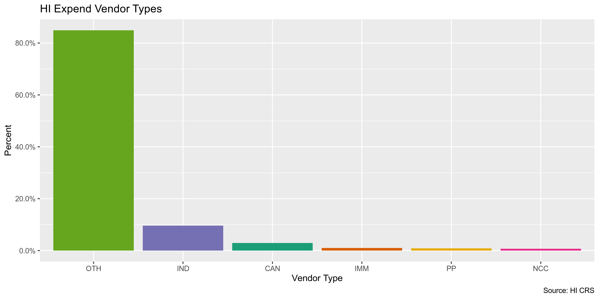<!-- -->

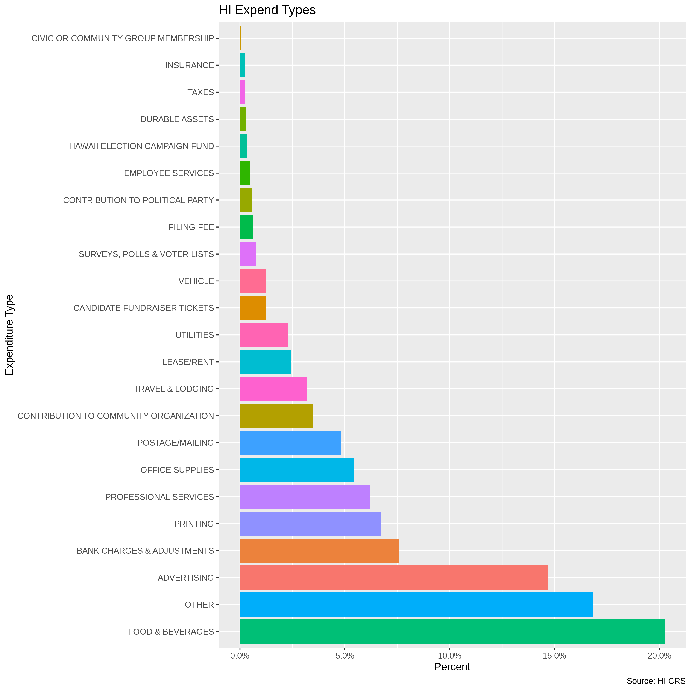<!-- -->

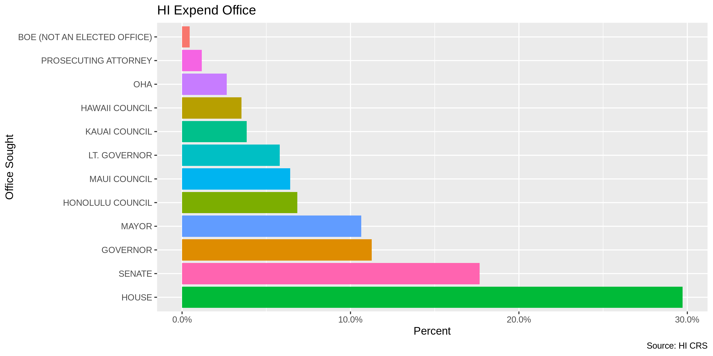<!-- -->

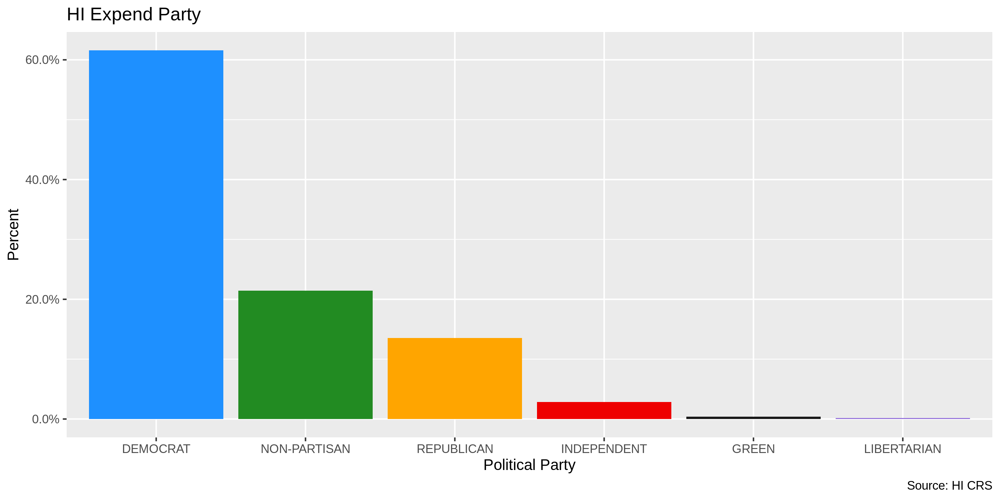<!-- -->

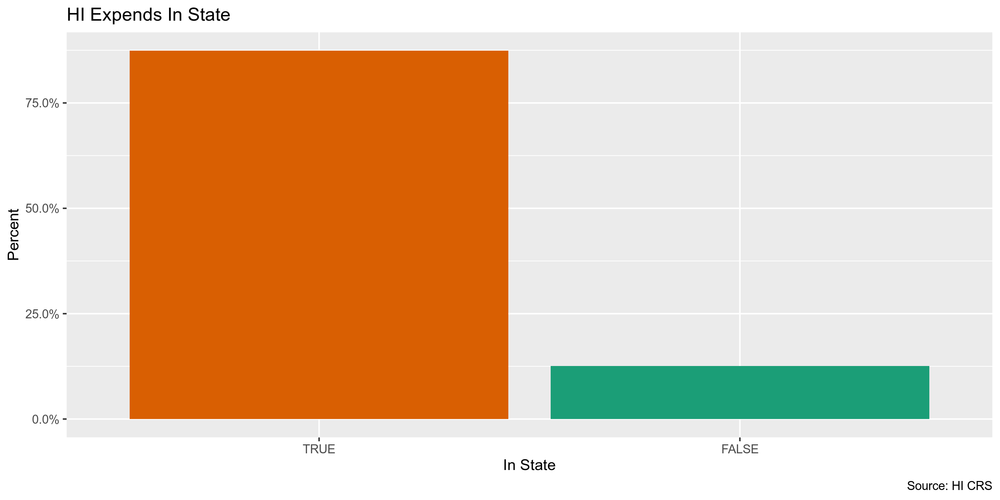<!-- -->

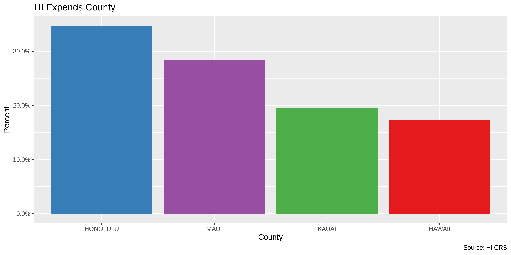<!-- -->

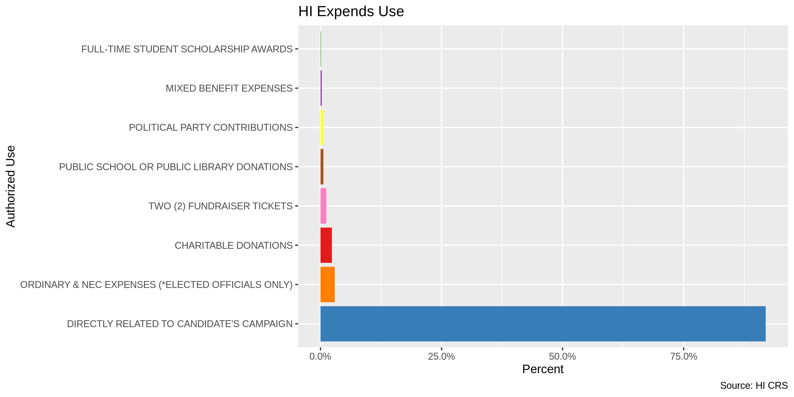<!-- -->

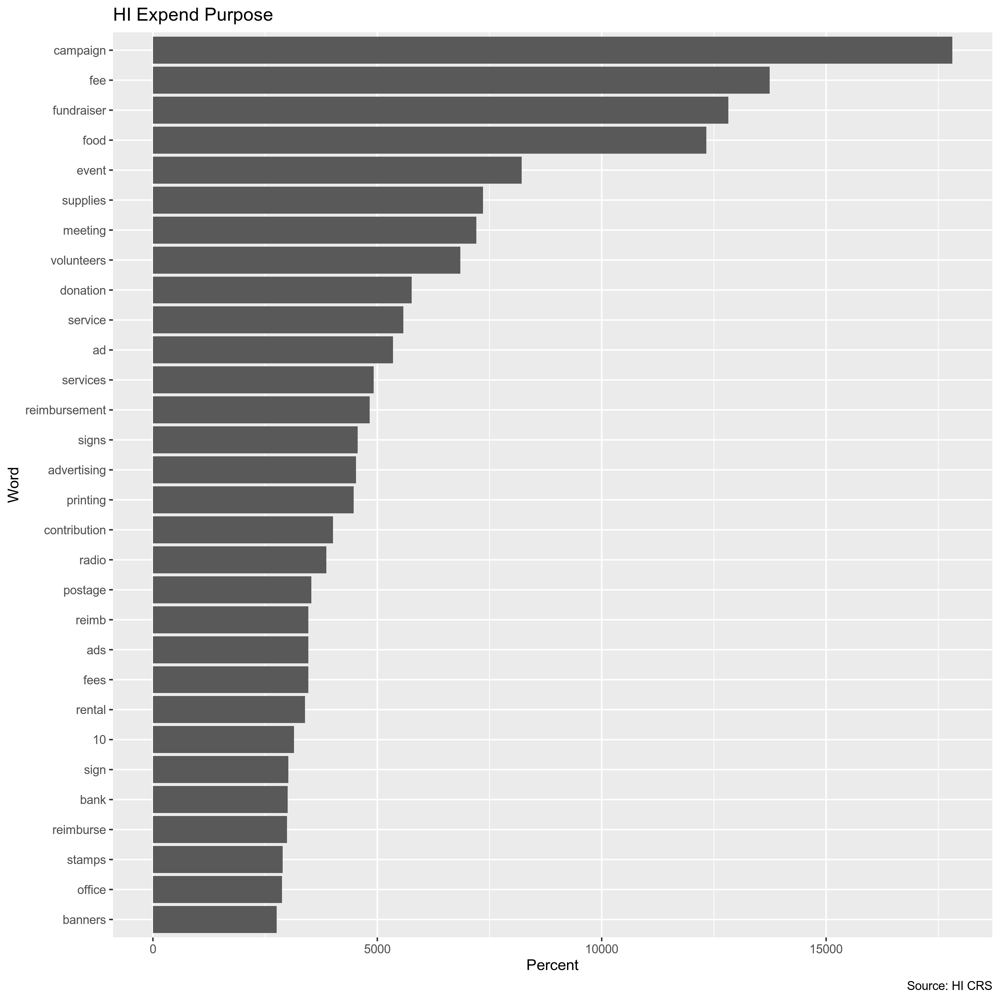<!-- -->

### Duplicates

We can use `janitor::get_dupes()` to create a separate table of
duplicate rows, then flag those rows on the original data frame.

``` r
hi_dupes <- distinct(get_dupes(hi))

nrow(hi_dupes)
#> [1] 848
sum(hi_dupes$dupe_count)
#> [1] 1874
n_distinct(hi_dupes$candidate_name)
#> [1] 254
```

``` r
hi <- hi %>% 
  left_join(hi_dupes) %>% 
  mutate(dupe_flag = !is.na(dupe_count)) %>% 
  select(-dupe_count)

rm(hi_dupes)
sum(hi$dupe_flag)
#> [1] 1874
```

### Missing

There are relatively few missing values. There are no missing values
that need to be flagged.

``` r
glimpse_fun(hi, count_na)
```

    #> # A tibble: 24 x 4
    #>    var                    type       n         p
    #>    <chr>                  <chr>  <int>     <dbl>
    #>  1 candidate_name         chr        0 0        
    #>  2 vendor_type            chr        0 0        
    #>  3 vendor_name            chr        0 0        
    #>  4 date                   dttm       0 0        
    #>  5 amount                 dbl        0 0        
    #>  6 expenditure_category   chr        0 0        
    #>  7 purpose_of_expenditure chr        0 0        
    #>  8 address_1              chr       71 0.000400 
    #>  9 address_2              chr   166400 0.937    
    #> 10 city                   chr       16 0.0000901
    #> 11 state                  chr        0 0        
    #> 12 zip_code               chr        0 0        
    #> 13 office                 chr        0 0        
    #> 14 district               chr    51273 0.289    
    #> 15 party                  chr        0 0        
    #> 16 reg_no                 chr        0 0        
    #> 17 election_period        chr        0 0        
    #> 18 inoutstate             chr        0 0        
    #> 19 lat                    dbl    48666 0.274    
    #> 20 lon                    dbl    48666 0.274    
    #> 21 county                 chr   119968 0.676    
    #> 22 authorized_use         chr    97691 0.550    
    #> 23 in_state               lgl        0 0        
    #> 24 dupe_flag              lgl        0 0

### Ranges

#### Amount

``` r
summary(hi$amount)
#>     Min.  1st Qu.   Median     Mean  3rd Qu.     Max. 
#>  -6452.5     30.0    100.0    587.2    350.0 271096.0
sum(hi$amount < 0)
#> [1] 256
```

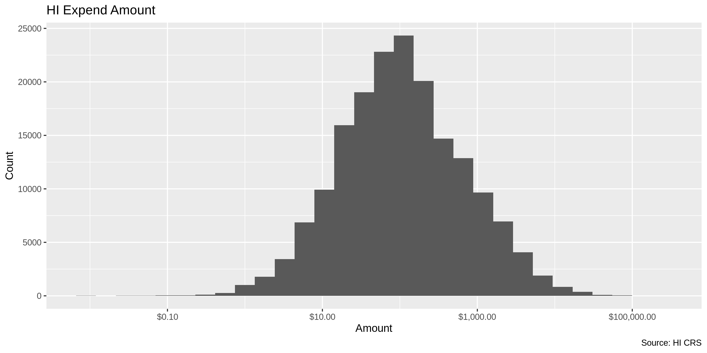<!-- -->

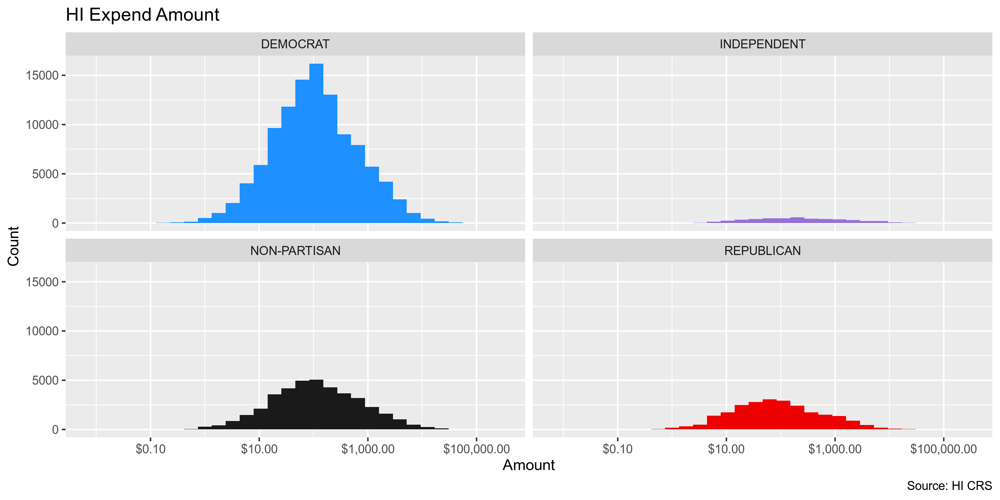<!-- -->

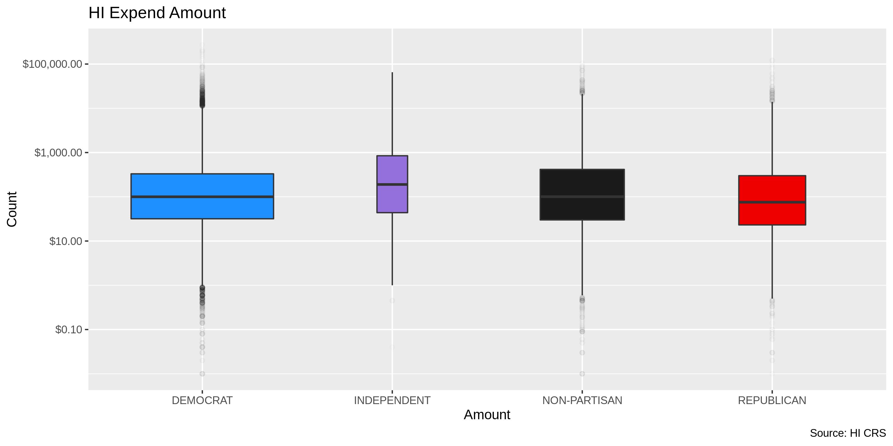<!-- -->

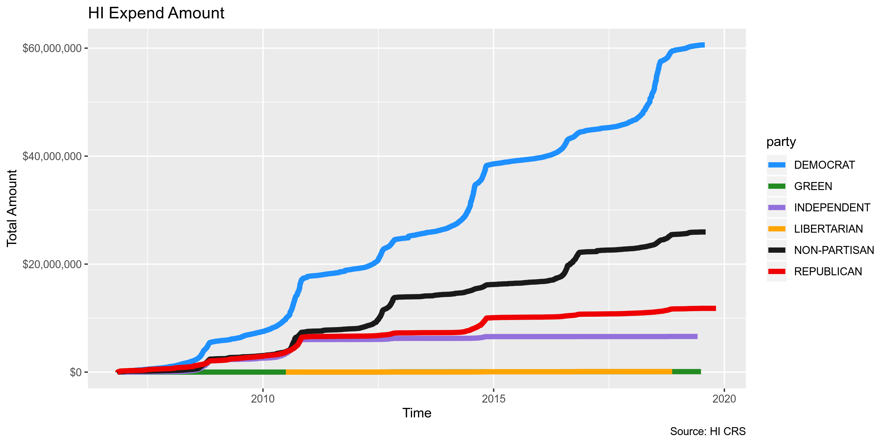<!-- -->

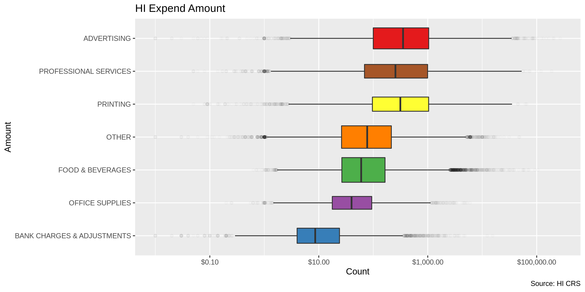<!-- -->

#### Date

There are no dates before 2006-11-08 and 0 dates past the creation of
this document.

``` r
min(hi$date)
#> [1] "2006-11-08 13:13:16 EST"
max(hi$date)
#> [1] "2019-06-30 EDT"
sum(hi$date > today())
#> [1] 0
```

To better explore the distribution of dates and track expendtures, we
will create a `year_clean` variable from `date` using
`lubridate::year()`.

``` r
hi <- mutate(hi, year_clean = year(date))
```

We can see the expenditures naturally increase in frequency every other
year, during the elections.

``` r
hi %>%
  ggplot(aes(year_clean)) +
  geom_bar() +
  labs(
    title = "HI Expends per Year",
    caption = "Source: HI CRS",
    x = "Year",
    y = "Count"
  )
```

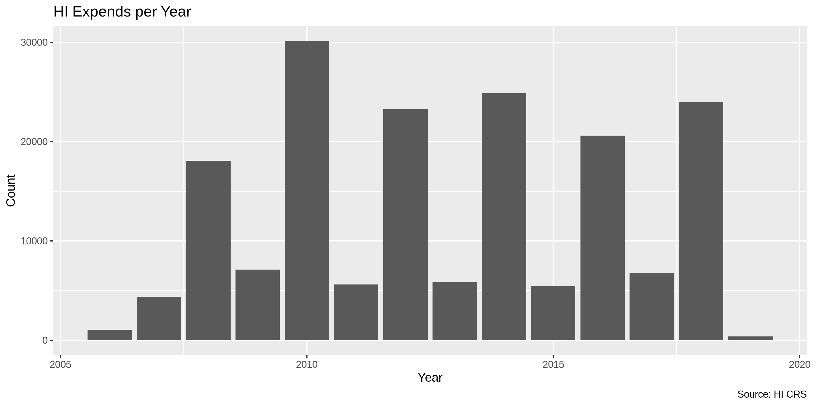<!-- -->

``` r
is_even <- function(x) x %% 2 == 0
hi %>% 
  mutate(election_year = is_even(year_clean)) %>% 
  group_by(year_clean, election_year) %>% 
  summarize(mean = mean(amount)) %>% 
  ggplot(aes(year_clean, mean)) +
  geom_col(aes(fill = election_year)) +
  scale_y_continuous(labels = dollar) +
  labs(
    title = "HI Expend Mean Amount per Year",
    caption = "Source: HI CRS",
    fill = "Election Year",
    x = "Amount",
    y = "Mean Amount"
  )
```

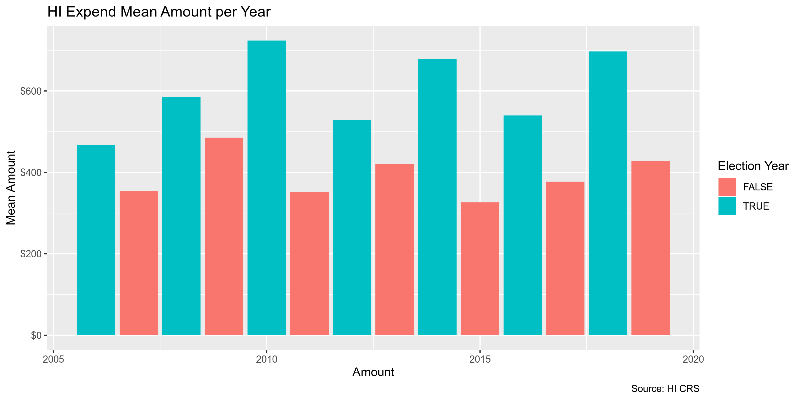<!-- -->

``` r
hi %>% 
  mutate(
    month = month(date),
    election_year = is_even(year_clean)
  ) %>%
  group_by(month, election_year) %>% 
  summarize(mean = mean(amount)) %>% 
  ggplot(aes(month, mean)) +
  scale_y_continuous(labels = dollar) +
  geom_line(size = 2, aes(color = election_year)) +
  labs(
    title = "HI Expend Mean Amount over Year",
    caption = "Source: HI CRS",
    fill = "Election Year",
    x = "Amount",
    y = "Mean Amount"
  )
```

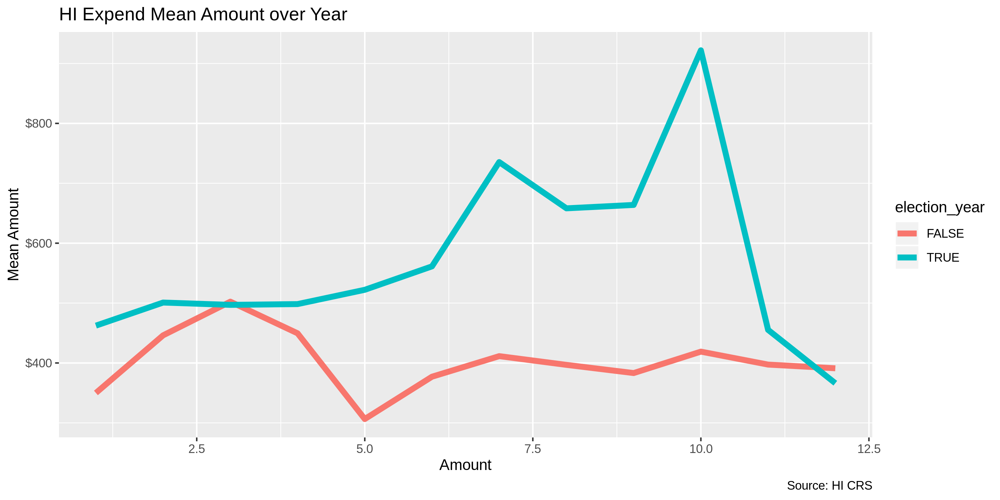<!-- -->

## Wrangle

To improve the searchability of the database, we can perform some
functional data cleaning and text normalization, using the
`campfin::normal_*()` functions, which wrap around `stringr::str_*()`
functions.

### Address

``` r
hi <- hi %>% 
  unite(
    col = address_combine,
    address_1, address_2,
    sep = " ",
    remove = FALSE,
    na.rm = TRUE
  ) %>% 
  mutate(
    address_norm = normal_address(
      address = address_combine,
      add_abbs = usps,
      na_rep = TRUE
    )
  )
```

``` r
hi %>% 
  select(
    address_1,
    address_2,
    address_norm
  )
```

    #> # A tibble: 177,567 x 3
    #>    address_1                    address_2 address_norm                      
    #>    <chr>                        <chr>     <chr>                             
    #>  1 197 SAND ISLAND ACCESS ROAD  UNIT A    197 SAND ISLAND ACCESS ROAD UNIT A
    #>  2 25 MALUNIU AVE.              <NA>      25 MALUNIU AVENUE                 
    #>  3 725 KAPIOLANI BLVD, #C-105   <NA>      725 KAPIOLANI BOULEVARD C 105     
    #>  4 111 S KING ST                <NA>      111 S KING STREET                 
    #>  5 28 KAINEHE ST., SUITE A-1    <NA>      28 KAINEHE STREET SUITE A 1       
    #>  6 87-2028 FARRINGTON HWY.      <NA>      87 2028 FARRINGTON HIGHWAY        
    #>  7 WAIPAHU POST OFFICE          <NA>      WAIPAHU POST OFFICE               
    #>  8 2140 ARMSTRONG STREET        <NA>      2140 ARMSTRONG STREET             
    #>  9 2955 E. MANOA ROAD           <NA>      2955 E MANOA ROAD                 
    #> 10 99-185 MOANALUA RD SUITE 107 <NA>      99 185 MOANALUA ROAD SUITE 107    
    #> # … with 177,557 more rows

### ZIP

``` r
n_distinct(hi$zip_code)
#> [1] 2656
prop_in(hi$zip_code, geo$zip)
#> [1] 0.9576667
sum(hi$zip_code %out% geo$zip)
#> [1] 7517
```

``` r
hi <- hi %>% 
  mutate(
    zip_norm = normal_zip(
      zip = zip_code,
      na_rep = TRUE
    )
  )
```

``` r
n_distinct(hi$zip_norm)
#> [1] 1808
prop_in(hi$zip_norm, geo$zip)
#> [1] 0.9977594
sum(hi$zip_norm %out% geo$zip)
#> [1] 396
```

### State

100% of `state` values are valid.

``` r
n_distinct(hi$state)
#> [1] 53
prop_in(hi$state, geo$state)
#> [1] 1
sum(hi$state %out% geo$state)
#> [1] 0
```

### City

#### Normal

``` r
n_distinct(hi$city)
#> [1] 1626
prop_in(hi$city, geo$city)
#> [1] 0.9542723
sum(unique(hi$city) %out% geo$city)
#> [1] 838
```

``` r
hi %>% 
  count(city, sort = TRUE) %>% 
  filter(city %out% geo$city)
```

    #> # A tibble: 838 x 2
    #>    city               n
    #>    <chr>          <int>
    #>  1 KAILUA-KONA     2288
    #>  2 95131            226
    #>  3 HON              189
    #>  4 IWILEI           182
    #>  5 ONLINE           155
    #>  6 ???              139
    #>  7 KANE'OHE         132
    #>  8 -                127
    #>  9 HONOLULU, OAHU   124
    #> 10 SOMMERVILLE      116
    #> # … with 828 more rows

``` r
hi <- hi %>% 
  mutate(
    city_norm = normal_city(
      city = city,
      geo_abbs = usps_city,
      st_abbs = c("HI", "HAWAII", "DC"),
      na = na_city,
      na_rep = TRUE
    )
  )

n_distinct(hi$city_norm)
```

    #> [1] 1467

``` r
prop_in(hi$city_norm, geo$city)
```

    #> [1] 0.97888

``` r
sum(unique(hi$city_norm) %out% geo$city)
```

    #> [1] 670

#### Swap

``` r
hi <- hi %>% 
  rename(city_raw = city) %>% 
  left_join(
    y = geo,
    by = c(
      "zip_norm" = "zip", 
      "state" = "state"
    )
  ) %>% 
  rename(city_match = city) %>% 
  mutate(
    match_dist = stringdist(city_norm, city_match),
    city_swap = if_else(
      condition = match_dist == 1,
      true = city_match,
      false = city_norm
    )
  )

mean(hi$match_dist, na.rm = TRUE)
#> [1] 0.1751593
max(hi$match_dist, na.rm = TRUE)
#> [1] 27
sum(hi$match_dist == 1, na.rm = TRUE)
#> [1] 1545
n_distinct(hi$city_swap)
#> [1] 1078
prop_in(hi$city_swap, geo$city)
#> [1] 0.9890686
sum(unique(hi$city_swap) %out% geo$city)
#> [1] 290
```

``` r
hi %>% 
  count(state, city_swap, sort = TRUE) %>% 
  filter(city_swap %out% geo$city) %>% 
  drop_na()
```

    #> # A tibble: 291 x 3
    #>    state city_swap         n
    #>    <chr> <chr>         <int>
    #>  1 HI    HON             211
    #>  2 HI    IWILEI          182
    #>  3 HI    HONOLULU OAHU   123
    #>  4 HI    KONA             81
    #>  5 HI    WAILEA           74
    #>  6 PA    CHESTERBROOK     62
    #>  7 HI    KAHULUI MAUI     41
    #>  8 HI    NANAKULI         41
    #>  9 CA    MOUNT VIEW       36
    #> 10 HI    HI               35
    #> # … with 281 more rows

``` r
hi$city_swap <- hi$city_swap %>% 
  str_replace("HON", "HONOLULU") %>% 
  na_if("HI")
```

## Conclude

1.  There are 177,567 records in the database.
2.  There are 1874 duplicate records, flagged with `dupe_flag`.
3.  Ranges for `amount` and `date` are both reasonable.
4.  There are no missing records of importance.
5.  Consistency issues in geographic values have been improved.
6.  The 5-digit `zip_norm` variable has been created with
    `campfin::normal_zip(hi$zip_code)`
7.  The 4-gitit `year_clean` variable has been created with
    `lubridate::year(hi$date)`
8.  Every record has a payer, payee, date, and amount.

## Export

``` r
proc_dir <- here("hi", "expends", "data", "processed")
dir_create(proc_dir)

hi %>% 
  select(
    -inoutstate,
    -zip_code,
    -city_raw,
    -address_1,
    -address_2,
    -address_combine,
    -city_norm,
    -city_match,
    -match_dist
  ) %>% 
  write_csv(
    na = "",
    path = glue("{proc_dir}/hi_expends_clean.csv")
  )
```
