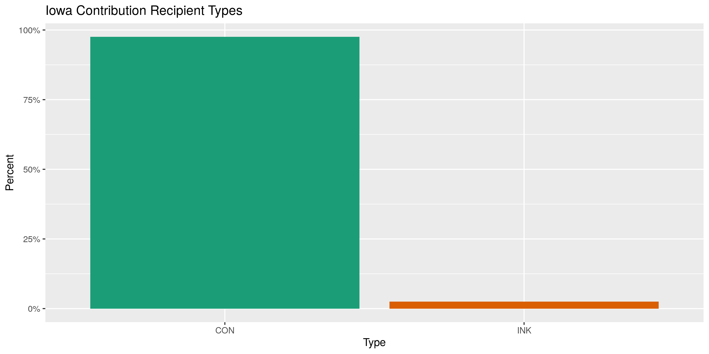
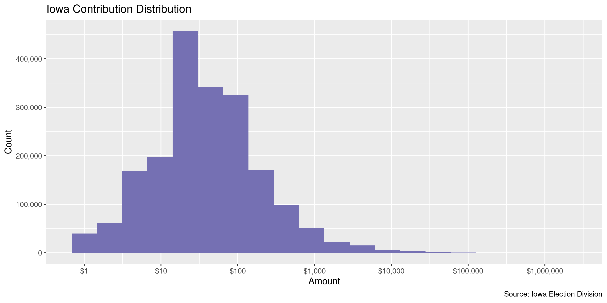
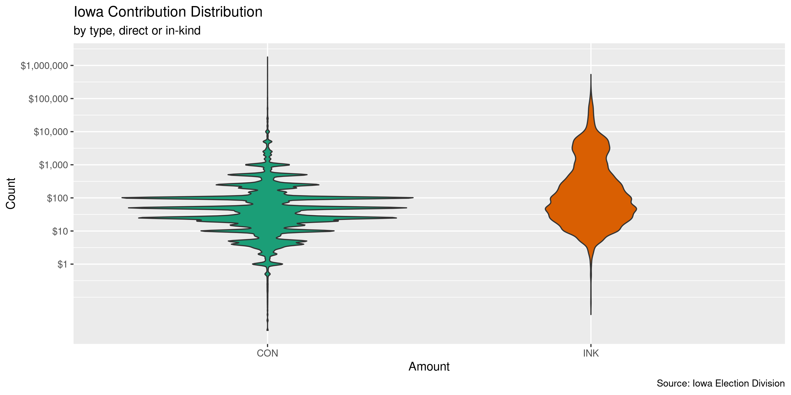
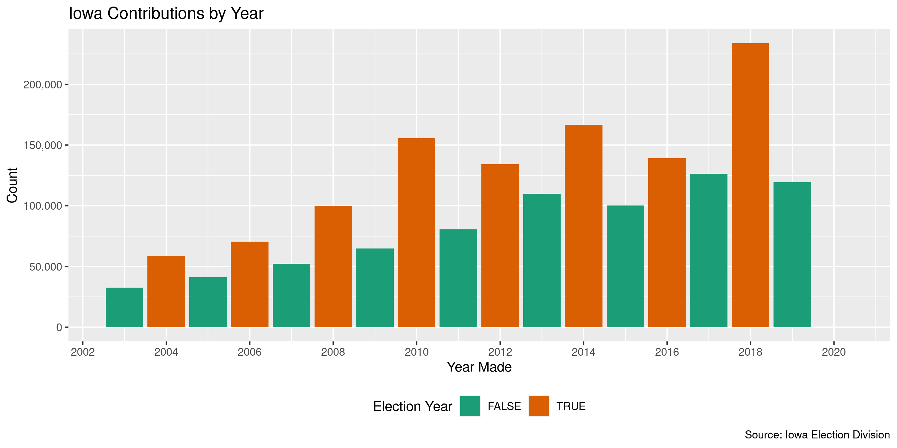
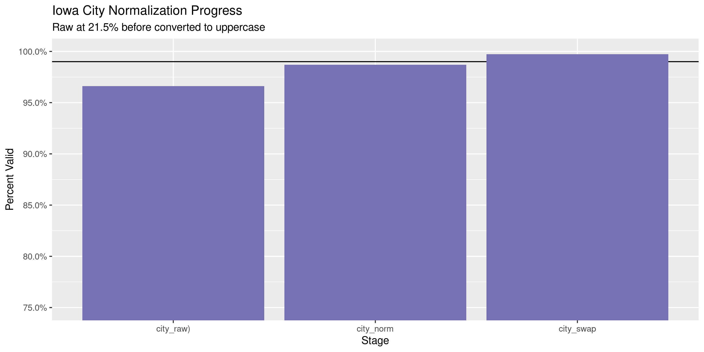
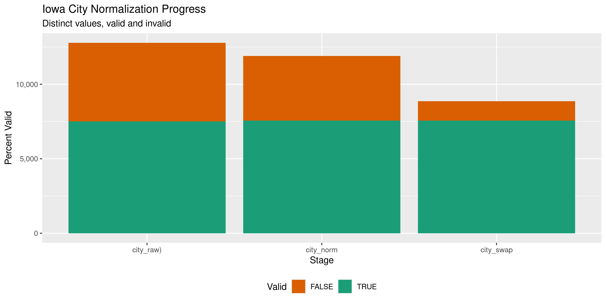

Iowa Contributions
================
Kiernan Nicholls
2020-02-05 16:44:32

  - [Project](#project)
  - [Objectives](#objectives)
  - [Packages](#packages)
  - [Data](#data)
  - [Import](#import)
  - [Explore](#explore)
  - [Wrangle](#wrangle)
  - [Conclude](#conclude)
  - [Export](#export)

<!-- Place comments regarding knitting here -->

## Project

The Accountability Project is an effort to cut across data silos and
give journalists, policy professionals, activists, and the public at
large a simple way to search across huge volumes of public data about
people and organizations.

Our goal is to standardizing public data on a few key fields by thinking
of each dataset row as a transaction. For each transaction there should
be (at least) 3 variables:

1.  All **parties** to a transaction.
2.  The **date** of the transaction.
3.  The **amount** of money involved.

## Objectives

This document describes the process used to complete the following
objectives:

1.  How many records are in the database?
2.  Check for entirely duplicated records.
3.  Check ranges of continuous variables.
4.  Is there anything blank or missing?
5.  Check for consistency issues.
6.  Create a five-digit ZIP Code called `zip`.
7.  Create a `year` field from the transaction date.
8.  Make sure there is data on both parties to a transaction.

## Packages

The following packages are needed to collect, manipulate, visualize,
analyze, and communicate these results. The `pacman` package will
facilitate their installation and attachment.

The IRW’s `campfin` package will also have to be installed from GitHub.
This package contains functions custom made to help facilitate the
processing of campaign finance data.

``` r
if (!require("pacman")) install.packages("pacman")
pacman::p_load_gh("irworkshop/campfin")
pacman::p_load(
  tidyverse, # data manipulation
  lubridate, # datetime strings
  jsonlite, # import json api
  magrittr, # pipe operators
  gluedown, # print markdown
  janitor, # dataframe clean
  refinr, # cluster and merge
  scales, # format strings
  rvest, # read html pages
  knitr, # knit documents
  vroom, # read files fast
  glue, # combine strings
  here, # relative storage
  fs # search storage 
)
```

This document should be run as part of the `R_campfin` project, which
lives as a sub-directory of the more general, language-agnostic
[`irworkshop/accountability_datacleaning`](https://github.com/irworkshop/accountability_datacleaning)
GitHub repository.

The `R_campfin` project uses the [RStudio
projects](https://support.rstudio.com/hc/en-us/articles/200526207-Using-Projects)
feature and should be run as such. The project also uses the dynamic
`here::here()` tool for file paths relative to *your* machine.

``` r
# where does this document knit?
here::here()
#> [1] "/home/kiernan/Code/accountability_datacleaning/R_campfin"
```

## Data

Data is obtained from the [Iowa Ethics and Campaign Disclosure
Board](https://ethics.iowa.gov/).

> In order to accomplish its Mission, the Board will enforce the
> provisions of the “Campaign Disclosure Act” in Iowa Code chapter 68A,
> the “Government Ethics and Lobbying Act” in Iowa Code chapter 68B, the
> reporting of gifts and bequests received by agencies under Iowa Code
> section 8.7, and the Board’s administrative rules in Chapter 351 of
> the Iowa Administrative Code.

## Import

The Board provides the file through the [state open data
portal](https://data.iowa.gov/) under the title “Iowa Campaign
Contributions Received.” The data can be accessed as a tabular CSV file
or through a number of direct APIs.

The database was created June 18, 2015 and last updated December 10,
2019.

> This dataset contains information on contributions and in kind
> donations made by organizations and individuals to state-wide,
> legislative or local candidate committees, state PACs, county central
> committees, state parties, and state and local ballot issue committees
> in Iowa. Data is available beginning in 2003 for all reports filed
> electronically, and some paper filed reports.

> Data is provided through reports submitted by candidate committees,
> state political committees, federal/out-of-state political committees,
> county central committees, ballot issue committees and organizations
> making contributions or independent expenditures. Quality of the data
> provided in the dataset is dependent upon the accuracy of the data
> reported electronically.

The Board also provides a disclaimer on the completness of the database:

> Data on paper filed reports is not available except for the following:
> contributions to individual candidates between 2003 and 2006 from
> political and party committees; contributions to individual candidates
> 2007 on; contributions to party committees between 2003 and 2007 from
> political and candidate committees; contributions from State Political
> Committees to candidates between 2003 and 2004; contributions from
> Federal/Out-of-State Political Committees over $50 from 2005 on; and
> contributions from county central committees from 2008 on.

The database license is as follows:

> Pursuant to Iowa Code section 68B.32A(7), the information obtained
> from statements or reports filed with the board under Iowa Code
> chapter 68A, Iowa Code chapter 68B, Iowa Code section 8.7, or rules
> adopted by the board shall not be copied or otherwise used for any
> commercial purpose. For purposes of this rule, “commercial purposes”
> shall include solicitations by a business or charitable organization.
> Information used in newspapers, magazines, books, or other similar
> communications, so long as the principal purpose of such
> communications is for providing information to the public and not for
> other commercial purpose, and for soliciting political campaign
> contributions is permissable.

### Read

These fixed files can be read into a single data frame with
`purrr::map_df()` and `readr::read_delim()`.

``` r
iac <- read_csv(
  file = "https://data.iowa.gov/api/views/smfg-ds7h/rows.csv",
  na = c("", "N/A", "NA", "n/a", "na"),
  col_types = cols(
    .default = col_character(),
    Date = col_date_usa(),
    `Contribution Amount` = col_double()
  )
)
```

## Explore

``` r
head(iac)
#> # A tibble: 6 x 14
#>   id    date       comm_cd comm_nm type  first mi    last  address1 address2 city  state zip  
#>   <chr> <date>     <chr>   <chr>   <chr> <chr> <chr> <chr> <chr>    <chr>    <chr> <chr> <chr>
#> 1 {140… 2003-01-01 6160    Commun… CON   <NA>  <NA>  Unit… 123 str… <NA>     anyw… IA    00000
#> 2 {150… 2003-01-01 6356    Planne… CON   Alta  <NA>  Price 4888 Sc… <NA>     Bett… IA    52722
#> 3 {170… 2003-01-01 1040    Citize… CON   <NA>  <NA>  Veri… 1827 An… <NA>     Wate… IA    50701
#> 4 {060… 2003-01-02 6096    Manufa… CON   Al    <NA>  Streb PO Box … <NA>     Nort… IA    52317
#> 5 {090… 2003-01-02 6155    Iowans… CON   Stev… J     Pfan… 1204 No… <NA>     Boone IA    50036
#> 6 {250… 2003-01-02 6063    Iowa D… CON   Nancy <NA>  Urba… 110 N. … <NA>     Mars… IA    50158
#> # … with 1 more variable: amount <dbl>
tail(iac)
#> # A tibble: 6 x 14
#>   id    date       comm_cd comm_nm type  first mi    last  address1 address2 city  state zip  
#>   <chr> <date>     <chr>   <chr>   <chr> <chr> <chr> <chr> <chr>    <chr>    <chr> <chr> <chr>
#> 1 {6B6… 2020-01-17 14135   Chris … CON   Dan   <NA>  Hunz… 4400 Ti… <NA>     Ames  IA    50014
#> 2 {4A3… 2020-01-17 14135   Chris … CON   Doug  <NA>  Waite 3001 Se… <NA>     Ames  IA    50010
#> 3 {7B5… 2020-01-18 9109    Keokuk… CON   <NA>  <NA>  Un-i… 123 str… <NA>     anyw… IA    00000
#> 4 {6BD… 2020-01-19 2238    Gorman… CON   James <NA>  Norr… 2479 B … <NA>     Red … IA    51566
#> 5 {984… 2020-01-31 19722   Commit… INK   LeAnn D     Black 900 1st… <NA>     Spen… IA    51301
#> 6 {D63… 2020-02-04 14603   Commit… CON   Kym   <NA>  Gall… 4606 Ki… <NA>     des … IA    50311
#> # … with 1 more variable: amount <dbl>
glimpse(sample_n(iac, 20))
#> Observations: 20
#> Variables: 14
#> $ id       <chr> "{24120520-0804-8611-2723-000000000000}", "{3CE5657E-1EBD-4C5D-AEF2-DEC1018FB11…
#> $ date     <date> 2005-08-15, 2018-09-18, 2012-05-22, 2011-01-11, 2018-04-08, 2006-07-28, 2018-1…
#> $ comm_cd  <chr> "5111", "2425", "1963", "6125", "2415", "6449", "2386", "6432", "5152", "1762",…
#> $ comm_nm  <chr> "Fallon for Governor", "Williams for Iowa House", "Guth for Senate", "Iowa Real…
#> $ type     <chr> "CON", "CON", "CON", "CON", "CON", "CON", "CON", "CON", "CON", "CON", "CON", "C…
#> $ first    <chr> "Dennis", NA, "Bonnie", "Matthew", "Linda", NA, "Harris", "WILLIAM", "James", "…
#> $ mi       <chr> "R", NA, NA, NA, NA, NA, NA, "J", NA, NA, NA, NA, NA, NA, NA, NA, "W", NA, NA, …
#> $ last     <chr> "Coon", "Iowa Conservation Voters", "Iverson", "Grohe", "Bigley", "Great Plains…
#> $ address1 <chr> "1438 11th St", "686 Foster Drive", "15195 490th Street", "3424 EP True", "504 …
#> $ address2 <chr> NA, NA, NA, NA, NA, NA, NA, NA, NA, NA, NA, NA, NA, NA, NA, NA, NA, NA, NA, NA
#> $ city     <chr> "Des Moines", "Des Moines", "Scarville", "WEst Des Moines", "Mount Vernon", "Pe…
#> $ state    <chr> "IA", "IA", "IA", "IA", "IA", "IL", "CA", "IL", "MD", "IA", "IA", "IA", "IL", "…
#> $ zip      <chr> "50314", "50312", "50473", "50265", "52314", "61615", "90069", "61401", "21783"…
#> $ amount   <dbl> 50.00, 250.00, 12.00, 1000.00, 50.00, 2983.30, 20.18, 2.88, 2.78, 25.00, 25.00,…
```

### Missing

``` r
col_stats(iac, count_na)
#> # A tibble: 14 x 4
#>    col      class        n        p
#>    <chr>    <chr>    <int>    <dbl>
#>  1 id       <chr>        0 0       
#>  2 date     <date>       0 0       
#>  3 comm_cd  <chr>        0 0       
#>  4 comm_nm  <chr>        0 0       
#>  5 type     <chr>        0 0       
#>  6 first    <chr>   221630 0.124   
#>  7 mi       <chr>  1515952 0.849   
#>  8 last     <chr>      278 0.000156
#>  9 address1 <chr>     7839 0.00439 
#> 10 address2 <chr>  1709469 0.957   
#> 11 city     <chr>     6564 0.00368 
#> 12 state    <chr>     2766 0.00155 
#> 13 zip      <chr>     1654 0.000926
#> 14 amount   <dbl>        0 0
```

``` r
iac <- iac %>% flag_na(date, last, amount, comm_nm)
sum(iac$na_flag)
#> [1] 278
```

### Duplicates

``` r
iac <- flag_dupes(iac, -id)
sum(iac$dupe_flag)
#> [1] 27848
```

``` r
iac %>% 
  filter(dupe_flag) %>% 
  select(date, last, amount, comm_nm)
#> # A tibble: 27,848 x 4
#>    date       last                amount comm_nm                                       
#>    <date>     <chr>                <dbl> <chr>                                         
#>  1 2003-01-15 Iowa Health PAC        500 Iowa Democratic Party                         
#>  2 2003-01-15 Iowa Health PAC        500 Iowa Democratic Party                         
#>  3 2003-01-17 Pedersen                10 Black Hawk County Republican Central Committee
#>  4 2003-01-17 unidentified            20 Citizens for Excellence in Government         
#>  5 2003-01-17 Pedersen                10 Black Hawk County Republican Central Committee
#>  6 2003-01-17 unidentified            20 Citizens for Excellence in Government         
#>  7 2003-01-29 Smith                  100 Linn Phoenix Club                             
#>  8 2003-01-29 Smith                  100 Linn Phoenix Club                             
#>  9 2003-01-31 IDP Federal Account  10000 Iowa Democratic Party                         
#> 10 2003-01-31 IDP Federal Account  10000 Iowa Democratic Party                         
#> # … with 27,838 more rows
```

### Categorical

``` r
col_stats(iac, n_distinct)
#> # A tibble: 16 x 4
#>    col       class        n          p
#>    <chr>     <chr>    <int>      <dbl>
#>  1 id        <chr>  1785669 1         
#>  2 date      <date>    6202 0.00347   
#>  3 comm_cd   <chr>     4810 0.00269   
#>  4 comm_nm   <chr>     4910 0.00275   
#>  5 type      <chr>        2 0.00000112
#>  6 first     <chr>    83753 0.0469    
#>  7 mi        <chr>       69 0.0000386 
#>  8 last      <chr>   124390 0.0697    
#>  9 address1  <chr>   487673 0.273     
#> 10 address2  <chr>     6940 0.00389   
#> 11 city      <chr>    17326 0.00970   
#> 12 state     <chr>       74 0.0000414 
#> 13 zip       <chr>    68688 0.0385    
#> 14 amount    <dbl>    33963 0.0190    
#> 15 na_flag   <lgl>        2 0.00000112
#> 16 dupe_flag <lgl>        2 0.00000112
```

<!-- -->

### Continuous

#### Amounts

``` r
summary(iac$amount)
#>      Min.   1st Qu.    Median      Mean   3rd Qu.      Max. 
#> -106521.5      16.0      40.0     324.5     100.0 1800000.0
mean(iac$amount <= 0)
#> [1] 0.0009010629
```

<!-- -->

<!-- -->

#### Dates

``` r
iac <- mutate(iac, year = year(date))
```

``` r
iac %>% 
  count(year) %>% 
  mutate(even = is_even(year)) %>% 
  ggplot(aes(x = year, y = n)) +
  geom_col(aes(fill = even)) + 
  scale_fill_brewer(palette = "Dark2") +
  scale_y_continuous(labels = comma) +
  scale_x_continuous(breaks = seq(1998, 2020, by = 2)) +
  theme(legend.position = "bottom") +
  labs(
    title = "Iowa Contributions by Year",
    caption = "Source: Iowa Election Division",
    fill = "Election Year",
    x = "Year Made",
    y = "Count"
  )
```

<!-- -->

## Wrangle

To improve the searchability of the database, we will perform some
consistent, confident string normalization. For geographic variables
like city names and ZIP codes, the corresponding `campfin::normal_*()`
functions are taylor made to facilitate this process.

### Address

For the street `addresss` variable, the `campfin::normal_address()`
function will force consistence case, remove punctuation, and
abbreviation official USPS suffixes.

``` r
iac <- iac %>%
  unite(
    starts_with("address"),
    col = address_full,
    sep = " ",
    remove = FALSE,
    na.rm = TRUE
  ) %>% 
  mutate(
    address_norm = normal_address(
      address = address_full,
      abbs = usps_street,
      na_rep = TRUE
    )
  ) %>% 
  select(-address_full)
```

We can see how this process improved consistency.

``` r
iac %>% 
  select(contains("address")) %>% 
  distinct() %>% 
  sample_n(10)
#> # A tibble: 10 x 3
#>    address1               address2 address_norm      
#>    <chr>                  <chr>    <chr>             
#>  1 1920 Willowmere Dr     <NA>     1920 WILLOWMERE DR
#>  2 5410 SHRIVER AVE       <NA>     5410 SHRIVER AVE  
#>  3 230 Essex Lane         <NA>     230 ESSEX LN      
#>  4 411 N. Brookside Drive <NA>     411 N BROOKSIDE DR
#>  5 1333 330 Ave           <NA>     1333 330 AVE      
#>  6 135 Bass Rd            <NA>     135 BASS RD       
#>  7 200 SE Hartford        <NA>     200 SE HARTFORD   
#>  8 2917 Sportsman Dr      <NA>     2917 SPORTSMAN DR 
#>  9 111 S 6TH STREET       <NA>     111 S 6 TH ST     
#> 10 1021 E 10TH STREET     <NA>     1021 E 10 TH ST
```

### ZIP

For ZIP codes, the `campfin::normal_zip()` function will attempt to
create valied *five* digit codes by removing the ZIP+4 suffix and
returning leading zeroes dropped by other programs like Microsoft Excel.

``` r
iac <- iac %>% 
  mutate(
    zip_norm = normal_zip(
      zip = zip,
      na_rep = TRUE
    )
  )
```

``` r
progress_table(
  iac$zip,
  iac$zip_norm,
  compare = valid_zip
)
#> # A tibble: 2 x 6
#>   stage    prop_in n_distinct  prop_na  n_out n_diff
#>   <chr>      <dbl>      <dbl>    <dbl>  <dbl>  <dbl>
#> 1 zip        0.849      68688 0.000926 270272  55543
#> 2 zip_norm   0.998      15961 0.0144     4087    985
```

### State

Very little needs to be done to clean the `state` variable.

``` r
x <- iac$state
length(x)
#> [1] 1785669
prop_in(x, valid_state)
#> [1] 0.9999764
count_out(x, valid_state)
#> [1] 42
st_zip <- iac$zip %in% zipcodes$zip[zipcodes$state == "IA"]
st_out <- x %out% valid_state
st_rx <- str_detect(x, "^[Ii]|[Aa]$")
st_na <- !is.na(x)
# has ia zip, ia regex, not valid, not na
x[st_zip & st_rx & st_out & st_na] <- "IA"
length(x)
#> [1] 1785669
iac <- mutate(iac, state_norm = x)
```

### City

Cities are the most difficult geographic variable to normalize, simply
due to the wide variety of valid cities and formats. The
`campfin::normal_city()` function is a good start, again converting
case, removing punctuation, but *expanding* USPS abbreviations. We can
also remove `invalid_city` values.

``` r
iac <- iac %>% 
  mutate(
    city_norm = normal_city(
      city = city, 
      abbs = usps_city,
      states = c("IA", "DC", "IOWA"),
      na = invalid_city,
      na_rep = TRUE
    )
  )
```

Again, we can further improve normalization by comparing our normalized
value agaist the *expected* value for that record’s state abbreviation
and ZIP code. If the normalized value is either an abbreviation for or
very similar to the expected value, we can confidently swap those two.

``` r
iac <- iac %>% 
  rename(city_raw = city) %>% 
  left_join(
    y = zipcodes,
    by = c(
      "state_norm" = "state",
      "zip_norm" = "zip"
    )
  ) %>% 
  rename(city_match = city) %>% 
  mutate(
    match_abb = is_abbrev(city_norm, city_match),
    match_dist = str_dist(city_norm, city_match),
    city_swap = if_else(
      condition = !is.na(city_match) & match_abb | match_dist == 1,
      true = city_match,
      false = city_norm
    )
  ) %>% 
  select(
    -city_match,
    -match_dist,
    -match_abb
  )
```

``` r
many_city <- c(valid_city, extra_city)
iac %>% 
  count(city_swap, state_norm, sort = TRUE) %>% 
  filter(!is.na(city_swap), city_swap %out% many_city)
#> # A tibble: 1,139 x 3
#>    city_swap            state_norm     n
#>    <chr>                <chr>      <int>
#>  1 OVERLAND PARKS       KS           642
#>  2 RESEARCH TRIANGLE PK NC           318
#>  3 ELK RUN HEIGHTS      IA           179
#>  4 UNITEMIZED           IA           114
#>  5 WASHINGTON D C       DC            83
#>  6 FARMINGTON HILLS     MI            80
#>  7 P B GARDENS          FL            77
#>  8 SAINT LOUIS PARKS    MN            67
#>  9 NEW YORK CITY        NY            58
#> 10 IA                   IA            55
#> # … with 1,129 more rows
```

``` r
iac <- iac %>% 
  mutate(
    city_swap = city_swap %>% 
      str_replace("^OVERLAND PARKS$", "OVERLAND PARK") %>% 
      str_replace("\\sPK$", "PARK") %>% 
      str_remove("\\sD\\sC$") %>% 
      str_remove("\\sIN$") %>% 
      na_if("UNITEMIZED") %>% 
      na_if("IA")
  )
```

| stage      | prop\_in | n\_distinct | prop\_na | n\_out | n\_diff |
| :--------- | -------: | ----------: | -------: | -----: | ------: |
| city\_raw) |    0.966 |       12784 |    0.004 |  60375 |    5283 |
| city\_norm |    0.985 |       11894 |    0.014 |  26029 |    4436 |
| city\_swap |    0.998 |        8619 |    0.030 |   3610 |    1126 |

You can see how the percentage of valid values increased with each
stage.

<!-- -->

More importantly, the number of distinct values decreased each stage. We
were able to confidently change many distinct invalid values to their
valid equivalent.

``` r
progress %>% 
  select(
    stage, 
    all = n_distinct,
    bad = n_diff
  ) %>% 
  mutate(good = all - bad) %>% 
  pivot_longer(c("good", "bad")) %>% 
  mutate(name = name == "good") %>% 
  ggplot(aes(x = stage, y = value)) +
  geom_col(aes(fill = name)) +
  scale_fill_brewer(palette = "Dark2", direction = -1) +
  scale_y_continuous(labels = comma) +
  theme(legend.position = "bottom") +
  labs(
    title = "Iowa City Normalization Progress",
    subtitle = "Distinct values, valid and invalid",
    x = "Stage",
    y = "Percent Valid",
    fill = "Valid"
  )
```

<!-- -->

## Conclude

``` r
glimpse(sample_n(iac, 20))
#> Observations: 20
#> Variables: 22
#> $ id           <chr> "{58069CFA-5C8D-4692-8170-2E91B6FB7CC5}", "{AF8984AC-5B20-459F-B9FC-DCFEC46…
#> $ date         <date> 2016-07-21, 2014-10-10, 2010-08-23, 2016-02-03, 2014-03-27, 2006-11-24, 20…
#> $ comm_cd      <chr> "9156", "5152", "5140", "6237", "6056", "6021", "9048", "13729", "1535", "1…
#> $ comm_nm      <chr> "Polk County Republican Central Committee", "Anderson for Iowa", "Governor …
#> $ type         <chr> "CON", "CON", "CON", "CON", "CON", "CON", "CON", "CON", "CON", "CON", "CON"…
#> $ first        <chr> "Paul", "Gerald", "Sandra", "Craig", "Craig", "Jenny", "William", "Toby", N…
#> $ mi           <chr> NA, NA, NA, NA, "A", NA, NA, NA, NA, NA, NA, NA, NA, NA, NA, NA, "A", NA, N…
#> $ last         <chr> "Waddell", "Leibowitz", "Benedett", "Jones", "Marquardt", "Lorenz", "Stamme…
#> $ address1     <chr> "4114 Pleasant St", "75-34 Bell Blvd", "133 Elmridge Road", "1854 W 3RD EXT…
#> $ address2     <chr> NA, NA, NA, NA, NA, NA, NA, NA, NA, NA, NA, NA, NA, NA, NA, NA, NA, NA, NA,…
#> $ city_raw     <chr> "Des Moines", "Oakland Gardens", "Waterloo", "Boone", "Paton", "Marion", "D…
#> $ state        <chr> "IA", "NY", "IA", "IA", "IA", "IA", "IA", "IA", "IA", "IA", "IA", "IA", "NC…
#> $ zip          <chr> "50312", "11364", "50701", "50036", "50217-0000", "52302", "50063", "52803"…
#> $ amount       <dbl> 200.00, 15.00, 125.00, 5.00, 50.00, 90.00, 7.00, 65.00, 250.00, 150.00, 57.…
#> $ na_flag      <lgl> FALSE, FALSE, FALSE, FALSE, FALSE, FALSE, FALSE, FALSE, FALSE, FALSE, FALSE…
#> $ dupe_flag    <lgl> FALSE, FALSE, FALSE, FALSE, FALSE, FALSE, FALSE, FALSE, FALSE, FALSE, FALSE…
#> $ year         <dbl> 2016, 2014, 2010, 2016, 2014, 2006, 2016, 2015, 2010, 2006, 2019, 2007, 201…
#> $ address_norm <chr> "4114 PLEASANT ST", "7534 BELL BLVD", "133 ELMRIDGE RD", "1854 W 3 RD EXT S…
#> $ zip_norm     <chr> "50312", "11364", "50701", "50036", "50217", "52302", "50063", "52803", "50…
#> $ state_norm   <chr> "IA", "NY", "IA", "IA", "IA", "IA", "IA", "IA", "IA", "IA", "IA", "IA", "NC…
#> $ city_norm    <chr> "DES MOINES", "OAKLAND GARDENS", "WATERLOO", "BOONE", "PATON", "MARION", "D…
#> $ city_swap    <chr> "DES MOINES", "OAKLAND GARDENS", "WATERLOO", "BOONE", "PATON", "MARION", "D…
```

1.  There are 1,785,669 records in the database.
2.  There are 27,848 duplicate records in the database (1.56%).
3.  The range and distribution of `amount` and `date` seem reasonable.
4.  There are 278 records missing a contributor or recipient name, date,
    or amount (0.02%).
5.  Consistency in goegraphic data has been improved with
    `campfin::normal_*()`.
6.  The 4-digit `year` variable has been created with
    `lubridate::year()`.

## Export

``` r
clean_dir <- dir_create(here("in", "contribs", "data", "clean"))
```

``` r
iac <- iac %>% 
  select(
    -city_norm,
    city_norm = city_swap
  ) %>% 
  rename_all(~str_replace(., "_norm", "_clean"))

write_csv(
  x = iac,
  path = path(clean_dir, "in_contribs_clean.csv"),
  na = ""
)
```
