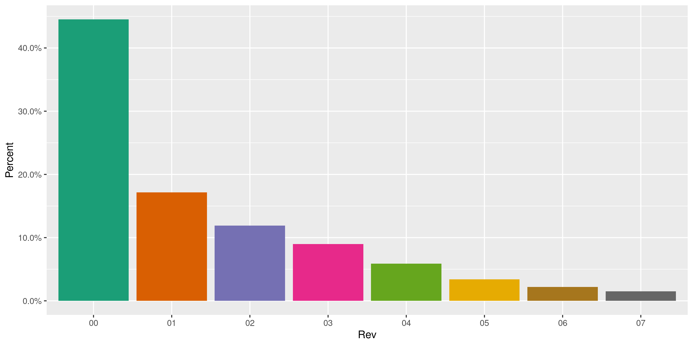
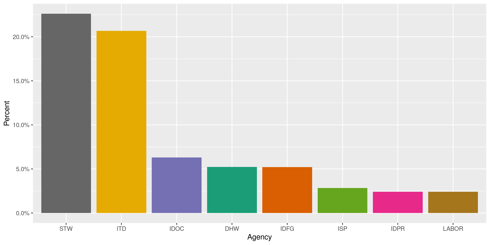
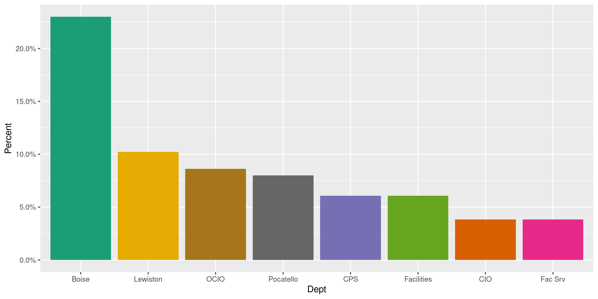
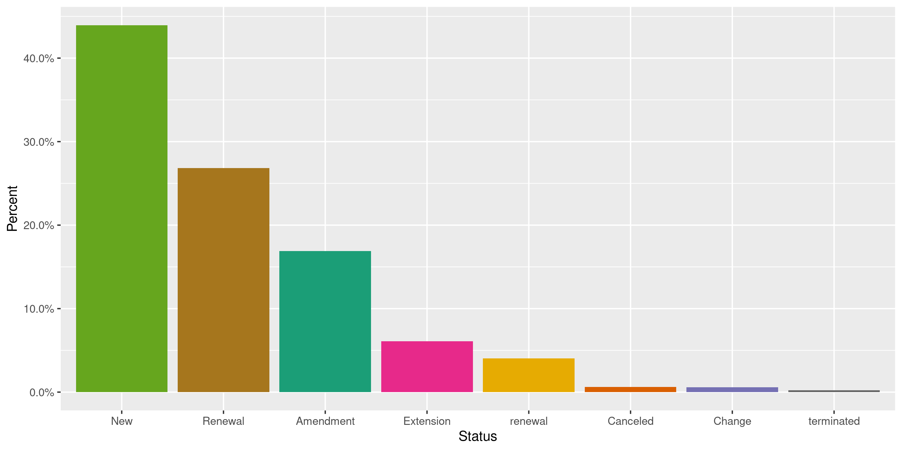
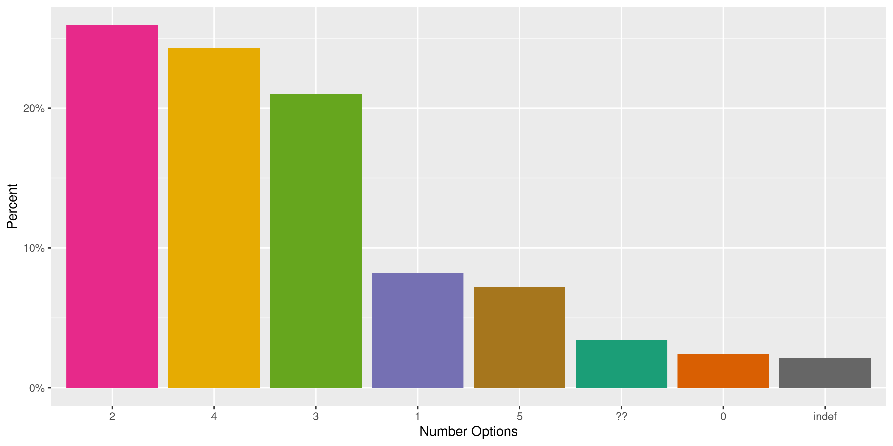
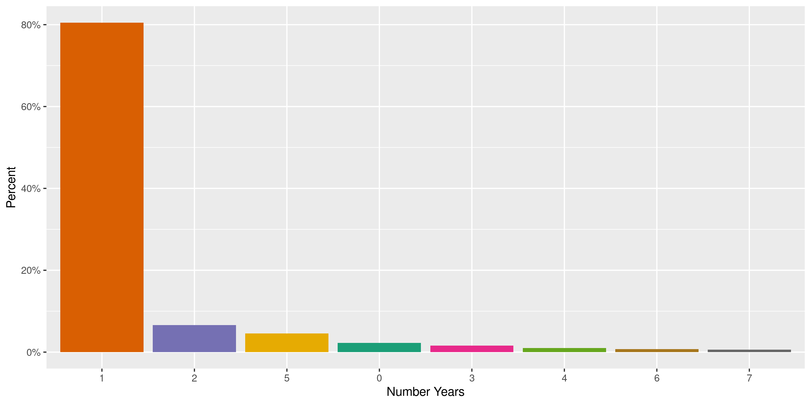
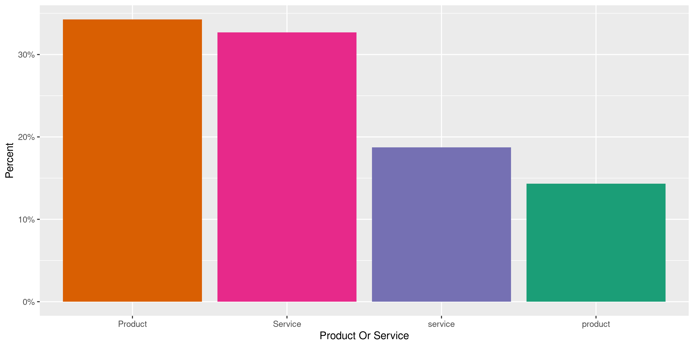
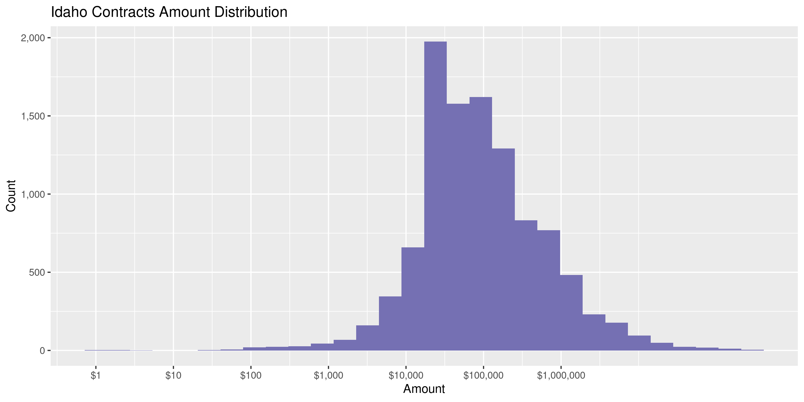
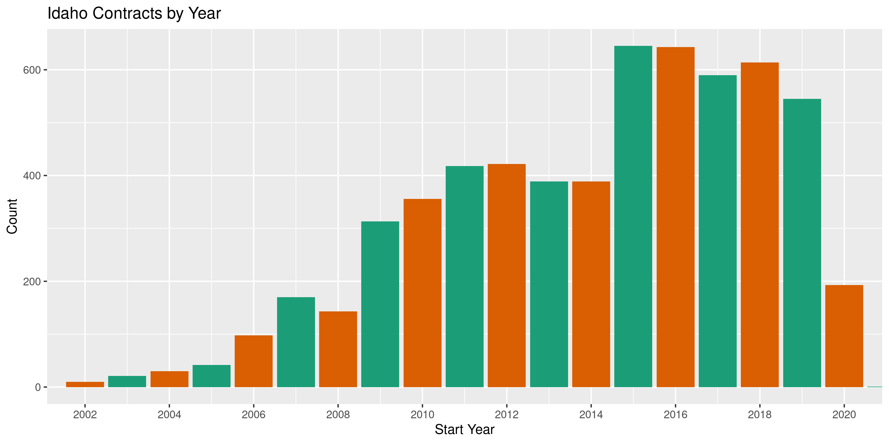

Idaho Contracts
================
Kiernan Nicholls
2020-05-20 13:13:42

  - [Project](#project)
  - [Objectives](#objectives)
  - [Packages](#packages)
  - [Data](#data)
  - [Read](#read)
  - [Explore](#explore)
  - [Conclude](#conclude)
  - [Export](#export)
  - [Dictionary](#dictionary)

<!-- Place comments regarding knitting here -->

## Project

The Accountability Project is an effort to cut across data silos and
give journalists, policy professionals, activists, and the public at
large a simple way to search across huge volumes of public data about
people and organizations.

Our goal is to standardizing public data on a few key fields by thinking
of each dataset row as a transaction. For each transaction there should
be (at least) 3 variables:

1.  All **parties** to a transaction.
2.  The **date** of the transaction.
3.  The **amount** of money involved.

## Objectives

This document describes the process used to complete the following
objectives:

1.  How many records are in the database?
2.  Check for entirely duplicated records.
3.  Check ranges of continuous variables.
4.  Is there anything blank or missing?
5.  Check for consistency issues.
6.  Create a five-digit ZIP Code called `zip`.
7.  Create a `year` field from the transaction date.
8.  Make sure there is data on both parties to a transaction.

## Packages

The following packages are needed to collect, manipulate, visualize,
analyze, and communicate these results. The `pacman` package will
facilitate their installation and attachment.

The IRW’s `campfin` package will also have to be installed from GitHub.
This package contains functions custom made to help facilitate the
processing of campaign finance data.

``` r
if (!require("pacman")) install.packages("pacman")
pacman::p_load_gh("irworkshop/campfin")
pacman::p_load(
  tidyverse, # data manipulation
  lubridate, # datetime strings
  gluedown, # printing markdown
  magrittr, # pipe operators
  janitor, # clean data frames
  refinr, # cluster and merge
  scales, # format strings
  readxl, # read excel files
  knitr, # knit documents
  vroom, # read files fast
  rvest, # html scraping
  glue, # combine strings
  here, # relative paths
  httr, # http requests
  fs # local storage 
)
```

This document should be run as part of the `R_campfin` project, which
lives as a sub-directory of the more general, language-agnostic
[`irworkshop/accountability_datacleaning`](https://github.com/irworkshop/accountability_datacleaning)
GitHub repository.

The `R_campfin` project uses the [RStudio
projects](https://support.rstudio.com/hc/en-us/articles/200526207-Using-Projects)
feature and should be run as such. The project also uses the dynamic
`here::here()` tool for file paths relative to *your* machine.

``` r
# where does this document knit?
here::here()
#> [1] "/home/kiernan/Code/accountability_datacleaning/R_campfin"
```

## Data

Bulk contracts data for the state of Idaho was received via a Idaho
Public Records Act request.

``` r
raw_dir <- dir_create(here("id", "contracts", "data", "raw"))
raw_zip <- path(raw_dir, "Response.zip")
file_size(raw_zip)
#> 1.76M
```

The archive contains a number of excel files listing contracts by fiscal
year.

``` r
as_tibble(unzip(raw_zip, list = TRUE))
#> # A tibble: 8 x 3
#>   Name                                         Length Date               
#>   <chr>                                         <dbl> <dttm>             
#> 1 Response/Master List 5-19-20.xlsx           1002890 2020-05-19 10:36:00
#> 2 Response/PO List MGS.pdf                     101306 2020-05-19 14:11:00
#> 3 Response/Purchase Order Log Sheet FY15.xlsx  223358 2016-07-01 10:57:00
#> 4 Response/Purchase Order Log Sheet FY16.xlsx  186340 2016-07-01 10:57:00
#> 5 Response/Purchase Order Log Sheet FY17.xlsx  108810 2017-10-25 16:23:00
#> 6 Response/Purchase Order Log Sheet FY18.xlsx  141520 2018-09-11 10:21:00
#> 7 Response/Purchase Order Log Sheet FY19.xlsx  118002 2019-06-28 13:42:00
#> 8 Response/Purchase Order Log Sheet FY20.xlsx   19643 2020-04-20 12:54:00
```

We only require the master contracts list.

``` r
raw_path <- unzip(
  zipfile = raw_zip, 
  files = "Response/Master List 5-19-20.xlsx",
  exdir = raw_dir
)
```

## Read

That master excel file can be read as a data frame.

``` r
idc <- read_excel(
  path = raw_path,
  col_types = "text"
)
```

Then we can parse date and numeric columns after the fact.

``` r
idc <- idc %>% 
  clean_names("snake") %>% 
  na_if("N/A") %>% 
  mutate(across(c(9:11, 15), ~excel_numeric_to_date(as.numeric(.)))) %>% 
  mutate(across(contract_amount, parse_number))
```

## Explore

``` r
glimpse(idc)
#> Rows: 7,316
#> Columns: 23
#> $ contract_number       <chr> "BPO01205", "BPO01205", "BPO01205", "BPO01205", "BPO01205", "BPO01…
#> $ rev                   <chr> "00", "01", "02", "03", "04", "05", "06", "00", "01", "02", "03", …
#> $ buyer                 <chr> "BS", "BS", "BS", "BS", "BS", "SJW", "SJW", "DV", "DV", "DV", "DV"…
#> $ agency                <chr> "ISP", "ISP", "ISP", "ISP", "ISP", "ISP", "ISP", "ITD", "ITD", "IT…
#> $ dept                  <chr> NA, NA, NA, NA, NA, NA, NA, NA, NA, NA, NA, NA, NA, NA, NA, NA, NA…
#> $ pa                    <chr> NA, NA, NA, NA, NA, NA, NA, "BPO75", NA, NA, NA, NA, NA, NA, NA, N…
#> $ solicitation          <chr> NA, NA, NA, NA, NA, NA, NA, NA, NA, NA, NA, NA, NA, NA, NA, NA, NA…
#> $ status                <chr> "Renewal", "Renewal", "Renewal", "Renewal", "Renewal", "Renewal", …
#> $ issue                 <date> 2002-09-03, 2004-08-31, 2006-08-15, 2008-08-13, 2010-08-31, 2013-…
#> $ start                 <date> 2002-08-16, 2004-08-16, 2006-08-16, 2008-06-16, 2010-08-16, 2013-…
#> $ expires               <date> 2004-08-15, 2006-08-15, 2008-08-15, 2010-08-15, 2013-08-15, 2016-…
#> $ contract_amount       <dbl> 57000, 57000, 96000, 96000, 144000, 144000, 144000, 3000, 3000, 50…
#> $ number_options        <chr> NA, NA, NA, NA, NA, NA, NA, NA, NA, NA, NA, NA, NA, NA, NA, NA, NA…
#> $ number_years          <chr> NA, NA, NA, NA, NA, NA, NA, NA, NA, NA, NA, NA, NA, NA, NA, NA, NA…
#> $ max_end               <date> NA, NA, NA, NA, NA, NA, NA, NA, NA, NA, NA, NA, NA, NA, NA, NA, N…
#> $ vendor                <chr> "NLETS", "NLETS", "NLETS", "NLETS", "NLETS", "NLETS", "NLETS", "Ac…
#> $ commodity             <chr> "Data Processing Services", "Data Processing Services", "Data Proc…
#> $ commodity_code        <chr> "92002", "92002", "92002", "92002", "92002", "92002", "92002", "54…
#> $ product_or_service    <chr> "Service", "Service", "Service", "Service", "Service", "Service", …
#> $ fee_language          <chr> NA, NA, NA, NA, "6/28/10 t&c", "No", "No", NA, NA, NA, NA, NA, NA,…
#> $ admin_fee             <chr> NA, NA, NA, NA, "1.2500000000000001E-2", NA, NA, NA, NA, NA, NA, N…
#> $ previous_solicitation <chr> NA, NA, NA, NA, NA, NA, NA, NA, NA, NA, NA, NA, NA, NA, NA, NA, NA…
#> $ notes                 <chr> NA, NA, NA, NA, NA, NA, NA, NA, NA, NA, NA, NA, NA, NA, NA, NA, "I…
tail(idc)
#> # A tibble: 6 x 23
#>   contract_number rev   buyer agency dept  pa    solicitation status issue      start     
#>   <chr>           <chr> <chr> <chr>  <chr> <chr> <chr>        <chr>  <date>     <date>    
#> 1 SBPO20200181    00    DD    STW    <NA>  <NA>  ITB17200380  New    2019-11-05 2019-11-05
#> 2 SBPO20200219    00    JU    STW    <NA>  <NA>  RFP15000097  New    2019-12-23 2020-01-01
#> 3 SBPO20200234    00    DD    STW    <NA>  <NA>  ITB20200260  New    2019-12-30 2019-12-30
#> 4 SBPO20200388    00    JN    STW    <NA>  <NA>  RFQ20200486  New    2020-05-04 2020-05-04
#> 5 SBPO20200389    00    JN    STW    <NA>  <NA>  RFQ20200486  New    2020-05-04 2020-05-04
#> 6 SBPO20200390    00    JN    STW    <NA>  <NA>  RFQ20200486  New    2020-05-04 2020-05-04
#> # … with 13 more variables: expires <date>, contract_amount <dbl>, number_options <chr>,
#> #   number_years <chr>, max_end <date>, vendor <chr>, commodity <chr>, commodity_code <chr>,
#> #   product_or_service <chr>, fee_language <chr>, admin_fee <chr>, previous_solicitation <chr>,
#> #   notes <chr>
```

### Missing

Columns vary in their number of missing values.

``` r
col_stats(idc, count_na)
#> # A tibble: 23 x 4
#>    col                   class      n        p
#>    <chr>                 <chr>  <int>    <dbl>
#>  1 contract_number       <chr>      0 0       
#>  2 rev                   <chr>     22 0.00301 
#>  3 buyer                 <chr>      0 0       
#>  4 agency                <chr>      0 0       
#>  5 dept                  <chr>   7003 0.957   
#>  6 pa                    <chr>   5833 0.797   
#>  7 solicitation          <chr>   4069 0.556   
#>  8 status                <chr>     45 0.00615 
#>  9 issue                 <date>    13 0.00178 
#> 10 start                 <date>  1284 0.176   
#> 11 expires               <date>    27 0.00369 
#> 12 contract_amount       <dbl>     54 0.00738 
#> 13 number_options        <chr>   6526 0.892   
#> 14 number_years          <chr>   6511 0.890   
#> 15 max_end               <date>  6505 0.889   
#> 16 vendor                <chr>      5 0.000683
#> 17 commodity             <chr>      9 0.00123 
#> 18 commodity_code        <chr>   1586 0.217   
#> 19 product_or_service    <chr>   1456 0.199   
#> 20 fee_language          <chr>   4249 0.581   
#> 21 admin_fee             <chr>   5463 0.747   
#> 22 previous_solicitation <chr>   7250 0.991   
#> 23 notes                 <chr>   5854 0.800
```

Any record missing a variable needed to identify the transaction will be
flagged with `campfin::flag_na()`.

``` r
idc <- idc %>% flag_na(issue, agency, contract_amount, vendor)
sum(idc$na_flag)
#> [1] 64
```

``` r
idc %>% 
  filter(na_flag) %>% 
  select(contract_number, issue, agency, contract_amount, vendor)
#> # A tibble: 64 x 5
#>    contract_number issue      agency contract_amount vendor                            
#>    <chr>           <date>     <chr>            <dbl> <chr>                             
#>  1 BPO01697        2010-07-01 ITD                 NA IBM                               
#>  2 BPO15701118     2015-06-19 AGRI                 0 <NA>                              
#>  3 BPO162400454    2019-11-15 ITD              74090 <NA>                              
#>  4 BPO182400387    2020-04-07 ITD                 NA Freightliner of Idaho, LLC        
#>  5 CPO00044        NA         ISP                 NA Western Identification Network    
#>  6 CPO01199        2002-03-27 TAX                 NA Fast Enterprises, LLC             
#>  7 CPO01860        NA         IDOC                NA Corrections Corporation of America
#>  8 CPO01860        NA         IDOC                NA Corrections Corporation of America
#>  9 CPO01873        2009-06-06 IDOC                NA Correctional Medical Services     
#> 10 CPO01977        2007-07-31 ISP                 NA Thornton Oliver Keller CRE        
#> # … with 54 more rows
```

### Duplicates

Ignoring the supposedly unique `contract_number`, there are a handful of
duplicated records.

``` r
idc <- flag_dupes(idc, -contract_number)
sum(idc$dupe_flag)
#> [1] 53
```

``` r
idc %>% 
  filter(dupe_flag) %>% 
  select(contract_number, issue, agency, contract_amount, vendor)
#> # A tibble: 53 x 5
#>    contract_number issue      agency contract_amount vendor                            
#>    <chr>           <date>     <chr>            <dbl> <chr>                             
#>  1 CPO01860        NA         IDOC               NA  Corrections Corporation of America
#>  2 CPO01860        NA         IDOC               NA  Corrections Corporation of America
#>  3 CPO02486        2018-07-13 ISBD             6000  Southworth Associates             
#>  4 CPO02486        2018-07-13 ISBD             6000  Southworth Associates             
#>  5 EXPO15200043    2014-07-30 ISP             21797. Smith Chevrolet                   
#>  6 EXPO15200044    2014-07-30 ISP             21797. Smith Chevrolet                   
#>  7 EXPO15200110    2014-08-14 DHW            128136. Corwin Ford                       
#>  8 EXPO15200113    2014-08-14 DHW            128136. Corwin Ford                       
#>  9 EXPO15700631    2015-02-23 AGRI            19485. Rob Green Auto Group              
#> 10 EXPO15700632    2015-02-23 AGRI            19485. Rob Green Auto Group              
#> # … with 43 more rows
```

### Categorical

``` r
col_stats(idc, n_distinct)
#> # A tibble: 25 x 4
#>    col                   class      n        p
#>    <chr>                 <chr>  <int>    <dbl>
#>  1 contract_number       <chr>   3291 0.450   
#>  2 rev                   <chr>     28 0.00383 
#>  3 buyer                 <chr>     46 0.00629 
#>  4 agency                <chr>     84 0.0115  
#>  5 dept                  <chr>     38 0.00519 
#>  6 pa                    <chr>    110 0.0150  
#>  7 solicitation          <chr>   1851 0.253   
#>  8 status                <chr>     21 0.00287 
#>  9 issue                 <date>  2567 0.351   
#> 10 start                 <date>  1866 0.255   
#> 11 expires               <date>  2139 0.292   
#> 12 contract_amount       <dbl>   3807 0.520   
#> 13 number_options        <chr>     20 0.00273 
#> 14 number_years          <chr>     20 0.00273 
#> 15 max_end               <date>   437 0.0597  
#> 16 vendor                <chr>   1368 0.187   
#> 17 commodity             <chr>   2355 0.322   
#> 18 commodity_code        <chr>    539 0.0737  
#> 19 product_or_service    <chr>      5 0.000683
#> 20 fee_language          <chr>     27 0.00369 
#> 21 admin_fee             <chr>     22 0.00301 
#> 22 previous_solicitation <chr>     26 0.00355 
#> 23 notes                 <chr>   1159 0.158   
#> 24 na_flag               <lgl>      2 0.000273
#> 25 dupe_flag             <lgl>      2 0.000273
```

``` r
explore_plot(idc, rev)
```

<!-- -->

``` r
explore_plot(idc, buyer)
```

<!-- -->

``` r
explore_plot(idc, agency)
```

<!-- -->

``` r
explore_plot(idc, dept)
```

<!-- -->

``` r
explore_plot(idc, status)
```

<!-- -->

``` r
explore_plot(idc, number_options)
```

<!-- -->

``` r
explore_plot(idc, number_years)
```

<!-- -->

``` r
explore_plot(idc, product_or_service)
```

<!-- -->

### Amounts

``` r
noquote(map_chr(summary(idc$contract_amount), dollar))
#>            Min.         1st Qu.          Median            Mean         3rd Qu.            Max. 
#> -$1,885,781,211      $19,532.18         $64,980        $667,347        $252,773    $310,000,000 
#>            NA's 
#>             $54
prop_na(idc$contract_amount)
#> [1] 0.007381083
mean(idc$contract_amount <= 0, na.rm = TRUE)
#> [1] 0.1188378
```

Here are the minimum and maximum contract amount values.

``` r
idc[which.min(idc$contract_amount), ] %>% 
  mutate(across(contract_amount, dollar)) %>% 
  glimpse()
#> Rows: 1
#> Columns: 25
#> $ contract_number       <chr> "CPO02617"
#> $ rev                   <chr> "14"
#> $ buyer                 <chr> "JU"
#> $ agency                <chr> "IDOC"
#> $ dept                  <chr> NA
#> $ pa                    <chr> NA
#> $ solicitation          <chr> NA
#> $ status                <chr> "Amendment"
#> $ issue                 <date> 2019-10-23
#> $ start                 <date> 2019-01-01
#> $ expires               <date> 2020-12-31
#> $ contract_amount       <chr> "-$1,885,781,211"
#> $ number_options        <chr> NA
#> $ number_years          <chr> NA
#> $ max_end               <date> NA
#> $ vendor                <chr> "Corizon, Inc."
#> $ commodity             <chr> "Offender Health Care Services"
#> $ commodity_code        <chr> "94874"
#> $ product_or_service    <chr> "Service"
#> $ fee_language          <chr> NA
#> $ admin_fee             <chr> NA
#> $ previous_solicitation <chr> NA
#> $ notes                 <chr> NA
#> $ na_flag               <lgl> FALSE
#> $ dupe_flag             <lgl> FALSE
idc[which.max(idc$contract_amount), ] %>% 
  mutate(across(contract_amount, dollar)) %>% 
  glimpse()
#> Rows: 1
#> Columns: 25
#> $ contract_number       <chr> "SBPO1391"
#> $ rev                   <chr> "00"
#> $ buyer                 <chr> "JU"
#> $ agency                <chr> "STW"
#> $ dept                  <chr> NA
#> $ pa                    <chr> "Y"
#> $ solicitation          <chr> NA
#> $ status                <chr> "New"
#> $ issue                 <date> 2012-07-31
#> $ start                 <date> 2012-08-01
#> $ expires               <date> 2017-07-31
#> $ contract_amount       <chr> "$310,000,000"
#> $ number_options        <chr> NA
#> $ number_years          <chr> NA
#> $ max_end               <date> NA
#> $ vendor                <chr> "Bank of America"
#> $ commodity             <chr> "Purchasing Card"
#> $ commodity_code        <chr> "94635"
#> $ product_or_service    <chr> "service"
#> $ fee_language          <chr> "Rebates"
#> $ admin_fee             <chr> NA
#> $ previous_solicitation <chr> NA
#> $ notes                 <chr> "Changed from $200,000,000 to $310,000,000 per the actual spend in…
#> $ na_flag               <lgl> FALSE
#> $ dupe_flag             <lgl> FALSE
```

<!-- -->

### Dates

We can add the calendar year from `date` with `lubridate::year()`

``` r
idc <- mutate(idc, year = year(start))
```

``` r
min(idc$start, na.rm = TRUE)
#> [1] "2002-01-01"
sum(idc$year < 2000, na.rm = TRUE)
#> [1] 0
max(idc$start, na.rm = TRUE)
#> [1] "2906-09-01"
sum(idc$start > today(), na.rm = TRUE)
#> [1] 14
```

``` r
idc %>% 
  filter(year > 2020) %>% 
  count(year, sort = TRUE)
#> # A tibble: 2 x 2
#>    year     n
#>   <dbl> <int>
#> 1  2906     3
#> 2  2021     1
```

``` r
idc <- mutate(idc, across(start, str_replace, "^(29)", "20"))
idc <- mutate(idc, year = year(start))
```

<!-- -->

## Conclude

1.  There are 7,316 records in the database.
2.  There are 53 duplicate records in the database.
3.  The range and distribution of `amount` and `date` seem reasonable.
4.  There are 64 records missing key variables.
5.  The 4-digit `year` variable has been created with
    `lubridate::year()`.

## Export

Now the file can be saved on disk for upload to the Accountability
server.

``` r
clean_dir <- dir_create(here("id", "contracts", "data", "clean"))
clean_path <- path(clean_dir, "id_contracts_clean.csv")
write_csv(idc, clean_path, na = "")
file_size(clean_path)
#> 1.26M
mutate(file_encoding(clean_path), across(path, basename))
#> # A tibble: 1 x 3
#>   path                   mime            charset
#>   <chr>                  <chr>           <chr>  
#> 1 id_contracts_clean.csv application/csv utf-8
```

## Dictionary

The following table describes the variables in our final exported file:

| Column                  | Type      | Definition |
| :---------------------- | :-------- | :--------- |
| `contract_number`       | character |            |
| `rev`                   | character |            |
| `buyer`                 | character |            |
| `agency`                | character |            |
| `dept`                  | character |            |
| `pa`                    | character |            |
| `solicitation`          | character |            |
| `status`                | character |            |
| `issue`                 | double    |            |
| `start`                 | character |            |
| `expires`               | double    |            |
| `contract_amount`       | double    |            |
| `number_options`        | character |            |
| `number_years`          | character |            |
| `max_end`               | double    |            |
| `vendor`                | character |            |
| `commodity`             | character |            |
| `commodity_code`        | character |            |
| `product_or_service`    | character |            |
| `fee_language`          | character |            |
| `admin_fee`             | character |            |
| `previous_solicitation` | character |            |
| `notes`                 | character |            |
| `na_flag`               | logical   |            |
| `dupe_flag`             | logical   |            |
| `year`                  | double    |            |

``` r
write_lines(
  x = c("# Idaho Contracts Data Dictionary\n", dict_md),
  path = here("id", "contracts", "id_contracts_dict.md"),
)
```
