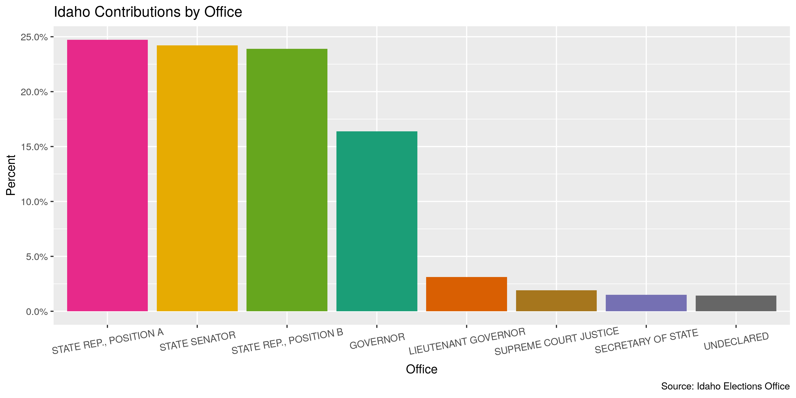
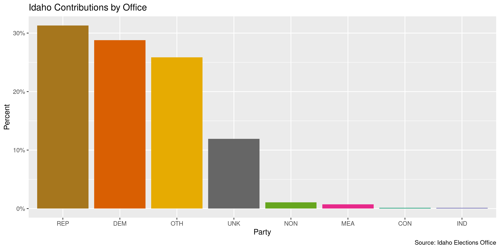
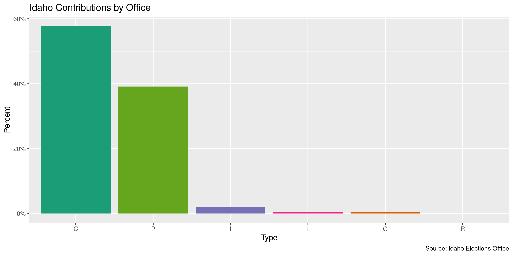
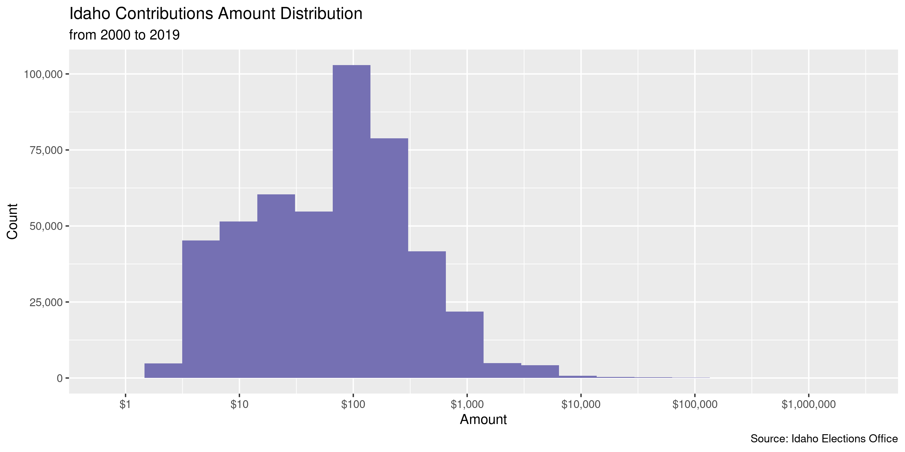
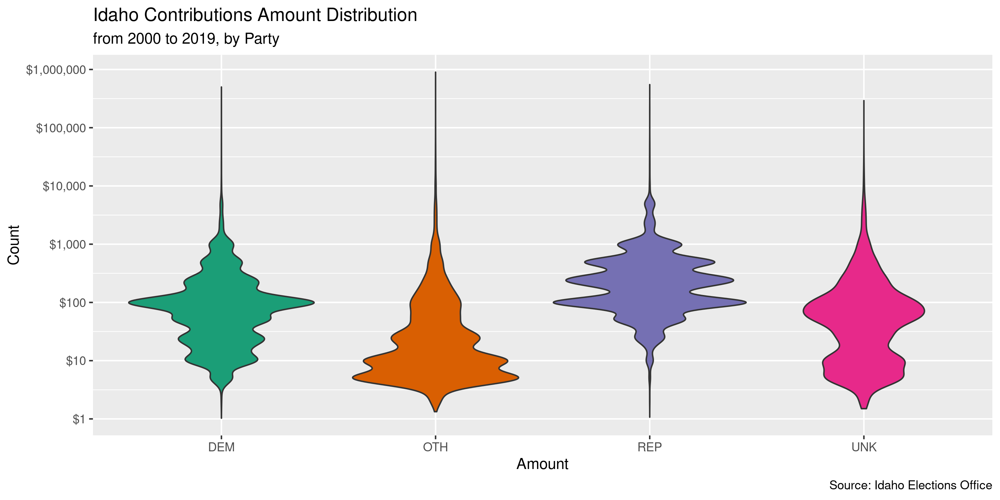
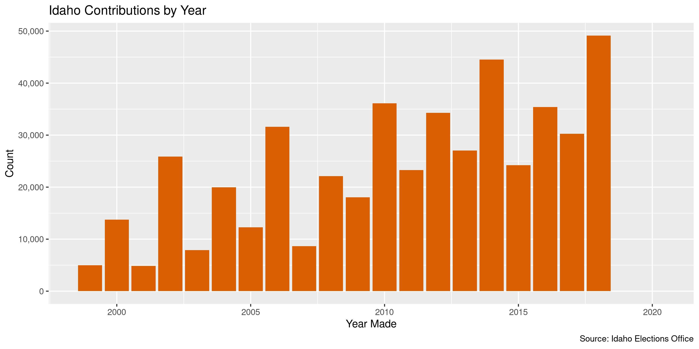
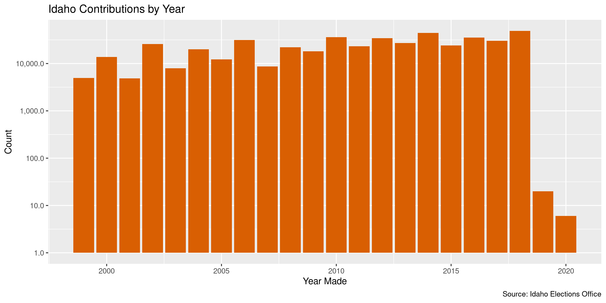

Idaho Contributions
================
Kiernan Nicholls
2020-01-31 16:34:37

  - [Project](#project)
  - [Objectives](#objectives)
  - [Packages](#packages)
  - [Data](#data)
  - [Import](#import)
  - [Explore](#explore)
  - [Wrangle](#wrangle)
  - [Conclude](#conclude)
  - [Export](#export)

<!-- Place comments regarding knitting here -->

## Project

The Accountability Project is an effort to cut across data silos and
give journalists, policy professionals, activists, and the public at
large a simple way to search across huge volumes of public data about
people and organizations.

Our goal is to standardizing public data on a few key fields by thinking
of each dataset row as a transaction. For each transaction there should
be (at least) 3 variables:

1.  All **parties** to a transaction
2.  The **date** of the transaction
3.  The **amount** of money involved

## Objectives

This document describes the process used to complete the following
objectives:

1.  How many records are in the database?
2.  Check for duplicates
3.  Check ranges
4.  Is there anything blank or missing?
5.  Check for consistency issues
6.  Create a five-digit ZIP Code called `zip`
7.  Create a `year` field from the transaction date
8.  Make sure there is data on both parties to a transaction

## Packages

The following packages are needed to collect, manipulate, visualize,
analyze, and communicate these results. The `pacman` package will
facilitate their installation and attachment.

The IRW’s `campfin` package will also have to be installed from GitHub.
This package contains functions custom made to help facilitate the
processing of campaign finance data.

``` r
if (!require("pacman")) install.packages("pacman")
pacman::p_load_gh("irworkshop/campfin")
pacman::p_load(
  tidyverse, # data manipulation
  snakecase, # column naming
  lubridate, # datetime strings
  magrittr, # pipe opperators
  gluedown, # printing markdown
  janitor, # dataframe clean
  refinr, # cluster and merge
  scales, # format strings
  readxl, # read excel files
  knitr, # knit documents
  rvest, # read html pages
  vroom, # read files fast
  glue, # combine strings
  here, # relative storage
  fs # search storage 
)
```

This document should be run as part of the `R_campfin` project, which
lives as a sub-directory of the more general, language-agnostic
[`irworkshop/accountability_datacleaning`](https://github.com/irworkshop/accountability_datacleaning)
GitHub repository.

The `R_campfin` project uses the [RStudio
projects](https://support.rstudio.com/hc/en-us/articles/200526207-Using-Projects)
feature and should be run as such. The project also uses the dynamic
`here::here()` tool for file paths relative to *your* machine.

``` r
# where does this document knit?
here::here()
#> [1] "/home/kiernan/R/accountability_datacleaning/R_campfin"
```

## Data

This data is obtained from the Michigan [Board of Elections
(BOE)](https://www.michigan.gov/sos/0,4670,7-127-1633---,00.html)
[Campaign Finance Reporting
(CFR)](https://www.michigan.gov/sos/0,4670,7-127-1633_8723---,00.html)
system. The data is provided as [annual ZIP archive
files](https://miboecfr.nictusa.com/cfr/dumpall/cfrdetail/) for the
years 1998 through 2020. These files are updated nightly.

## Import

To import the data for processing, we will have to download each archive
file and read them together into a single data frame object.

### Download

We will scrape the download page for every archive link, then
downloading each to a local directory.

``` r
raw_dir <- dir_create(here("id", "contribs", "data", "raw"))
raw_base <- "https://sos.idaho.gov/elect/finance/downloads.html"
raw_page <- read_html(raw_base)
raw_urls <- raw_page %>% 
  html_node("table") %>% 
  html_nodes("a") %>% 
  html_attr("href") %>% 
  str_subset("con") %>%
  str_subset("^2") %>% 
  str_c(dirname(raw_base), ., sep = "/")
raw_paths <- path(raw_dir, basename(raw_urls))
if (!all(this_file_new(raw_paths))) {
  for(i in seq_along(raw_urls)) {
    download.file(raw_urls[i], raw_paths[i])
    Sys.sleep(runif(1))
  }
}
```

### Read

Each file has a different column order and names. We will first use
`purrr::map()` to use `readxl::read_excel()` and create a list of data
frames.

``` r
idc <- map(
  .x = raw_paths,
  .f = read_excel,
  col_types = "text"
)
```

Since the variety of column names is so great, we will have to chain
together a number of `stringr::str_replace()` functions to create some
consistency.

``` r
consistent_names <- function(nm) {
  nm %>% 
    to_snake_case() %>% 
    str_replace("contributor_", "contr_") %>% 
    str_replace("contrib_", "contr_") %>% 
    str_replace("contr_name", "contr_last") %>% 
    str_replace("^first_name$", "cand_first") %>% 
    str_replace("^last_name$", "cand_last") %>% 
    str_replace("^middle_name$", "cand_mi") %>% 
    str_replace("suf$", "suffix") %>% 
    str_replace("_mid$", "_mi") %>% 
    str_replace("middle", "mi") %>% 
    str_replace("_cp$", "_type") %>% 
    str_remove("_name$") %>% 
    str_replace("zipcode", "zip") %>% 
    str_replace("_st$", "_state") %>% 
    str_replace("mailing", "address") %>% 
    str_replace("line_1", "address_1") %>% 
    str_replace("line_2", "address_2") %>% 
    str_remove("^contr_") %>% 
    str_remove("^contributing_") %>% 
    str_remove("^contribution_") %>% 
    str_replace("^address$", "address_1")
}

new_names <- idc %>% 
  map(names) %>% 
  map(consistent_names)

for (i in seq_along(idc)) {
  names(idc[[i]]) <- new_names[[i]]
}
```

Now that each individual data frame has similar column names, we can use
`dplyr::bind_rows()` to bind all 20 data frames together.

``` r
idc <- bind_rows(idc, .id = "file")
```

Then, we can apply `readr::parse_guess()` to every column that were
previously all read as character vectors.

``` r
idc <- mutate_all(idc, parse_guess)
```

We also need to reorder and recode these variables to be consistent
across each year.

``` r
idc <- idc %>% 
  mutate_if(is_character, str_to_upper) %>% 
  mutate(
    office = office %>% 
      str_replace("REPRESENTATIVE", "REP."),
    cand_suffix = cand_suffix %>% 
      str_remove_all("[:punct:]"),
    party = party %>% 
      str_replace("OTHER", "OTH") %>% 
      str_replace("REPUBLICAN", "REP") %>% 
      str_replace("DEMOCRATIC", "DEM") %>% 
      str_replace("INDEPENDENT", "IND") %>% 
      str_replace("LIBERTARIAN", "LIB") %>% 
      str_replace("CONSTITUTION", "CON") %>% 
      str_replace("NON-PARTISAN", "NON"),
    type = type %>% 
      str_replace("COMPANY", "C") %>% 
      str_replace("PERSON", "P") %>% 
      str_replace("LOAN", "L") %>% 
      str_replace("IN KIND", "I"),
    election = election %>% 
      str_replace("GENERAL", "G") %>% 
      str_replace("PRIMARY", "P")
  )

count_na(idc$date) # 1276
#> [1] 1276
slash_dates <- str_which(idc$date, "\\d+/\\d+/\\d{4}")
idc$date[slash_dates] <- as.character(mdy(idc$date[slash_dates]))
excel_dates <- str_which(idc$date, "[:punct:]", negate = TRUE)
idc$date[excel_dates] %>% 
  as.numeric() %>% 
  excel_numeric_to_date() %>% 
  as.character() -> idc$date[excel_dates]

idc$date <- as_date(idc$date)
count_na(idc$date) # 1276
#> [1] 1276
```

## Explore

``` r
head(idc)
#> # A tibble: 6 x 24
#>    file party cand_first cand_mi cand_last cand_suffix committee office district type  amount
#>   <dbl> <chr> <chr>      <chr>   <chr>     <chr>       <chr>     <chr>     <dbl> <chr>  <dbl>
#> 1     1 DEM   CHRISTOPH… G       ABERNATHY <NA>        <NA>      STATE…       29 <NA>    1000
#> 2     1 DEM   CHRISTOPH… G       ABERNATHY <NA>        <NA>      STATE…       29 <NA>     950
#> 3     1 DEM   CHRISTOPH… G       ABERNATHY <NA>        <NA>      STATE…       29 <NA>    2000
#> 4     1 DEM   CHRISTOPH… G       ABERNATHY <NA>        <NA>      STATE…       29 <NA>     200
#> 5     1 DEM   CHRISTOPH… G       ABERNATHY <NA>        <NA>      STATE…       29 <NA>     286
#> 6     1 DEM   CHRISTOPH… G       ABERNATHY <NA>        <NA>      STATE…       29 <NA>     500
#> # … with 13 more variables: date <date>, last <chr>, first <chr>, mi <chr>, suffix <chr>,
#> #   address_1 <chr>, address_2 <chr>, city <chr>, state <chr>, zip <chr>, country <chr>,
#> #   election <chr>, election_type <chr>
tail(idc)
#> # A tibble: 6 x 24
#>    file party cand_first cand_mi cand_last cand_suffix committee office district type  amount
#>   <dbl> <chr> <chr>      <chr>   <chr>     <chr>       <chr>     <chr>     <dbl> <chr>  <dbl>
#> 1    20 UNK   <NA>       <NA>    <NA>      <NA>        WELLS FA… <NA>         NA C         10
#> 2    20 UNK   <NA>       <NA>    <NA>      <NA>        WELLS FA… <NA>         NA C         10
#> 3    20 UNK   <NA>       <NA>    <NA>      <NA>        WELLS FA… <NA>         NA C         10
#> 4    20 UNK   <NA>       <NA>    <NA>      <NA>        WELLS FA… <NA>         NA C       2000
#> 5    20 UNK   <NA>       <NA>    <NA>      <NA>        WELLS FA… <NA>         NA C          0
#> 6    20 UNK   <NA>       <NA>    <NA>      <NA>        WELLS FA… <NA>         NA C          0
#> # … with 13 more variables: date <date>, last <chr>, first <chr>, mi <chr>, suffix <chr>,
#> #   address_1 <chr>, address_2 <chr>, city <chr>, state <chr>, zip <chr>, country <chr>,
#> #   election <chr>, election_type <chr>
glimpse(sample_frac(idc))
#> Observations: 418,656
#> Variables: 24
#> $ file          <dbl> 4, 1, 6, 2, 13, 5, 2, 12, 12, 5, 15, 6, 13, 2, 1, 15, 8, 5, 15, 1, 4, 8, 7…
#> $ party         <chr> "OTH", "REP", "OTH", "OTH", "DEM", "DEM", "OTH", "UNK", "DEM", "DEM", "DEM…
#> $ cand_first    <chr> NA, "TOM", NA, NA, "ELAINE", "JANIE", NA, NA, NA, "BRANDEN", "DAVID", NA, …
#> $ cand_mi       <chr> NA, NA, NA, NA, NA, NA, NA, NA, NA, "J", NA, NA, "C.", NA, NA, NA, NA, "D"…
#> $ cand_last     <chr> NA, "KEALEY", NA, NA, "SMITH", "WARD-ENGELKING", NA, NA, NA, "DURST", "LAN…
#> $ cand_suffix   <chr> NA, NA, NA, NA, NA, NA, NA, NA, NA, NA, NA, NA, NA, NA, NA, NA, NA, NA, NA…
#> $ committee     <chr> "FEAPAC (FARMERS EMPLOYEES AND AGENTS POLITICAL ACTION COMMITTEE)", NA, "B…
#> $ office        <chr> NA, "STATE TREASURER", NA, NA, "STATE REP., POSITION B", "STATE SENATOR", …
#> $ district      <dbl> NA, NA, NA, NA, 30, 18, NA, NA, NA, NA, 16, NA, 15, NA, NA, 19, NA, 26, 12…
#> $ type          <chr> "P", NA, "P", NA, "C", "P", NA, "C", "C", "P", "C", "P", "C", NA, NA, "C",…
#> $ amount        <dbl> 5.0, 250.0, 10.0, 200.0, 200.0, 60.0, 10.0, 40.0, 100.0, 709.8, 100.0, 5.0…
#> $ date          <date> 2015-10-15, 2017-12-27, 2013-10-01, 2017-07-04, 2004-08-12, 2014-08-19, 2…
#> $ last          <chr> "NOORDA-STRADINGER", "CREIGHTON", "MCCULLOGH", "WEIBER", "AMERICAN ECOLOGY…
#> $ first         <chr> "DEVERY", "SKIP", "JJ", "TRISHA", NA, "BETTY", "BENJAMIN", "CATHY", "JANET…
#> $ mi            <chr> NA, NA, NA, NA, NA, NA, "ROBERT", NA, NA, NA, NA, NA, NA, NA, NA, NA, NA, …
#> $ suffix        <chr> NA, NA, NA, NA, NA, NA, NA, NA, NA, NA, NA, NA, NA, NA, NA, NA, NA, NA, NA…
#> $ address_1     <chr> "804 REDMAN ST", "2181 S. PEBBLECREEK LN", "9989 W DYLAN CT", "4980 COLLIS…
#> $ address_2     <chr> NA, NA, NA, NA, NA, NA, NA, NA, NA, NA, NA, NA, NA, NA, NA, NA, NA, NA, NA…
#> $ city          <chr> "CHUBBUCK", "BOISE", "STAR", "BOISE", "BOISE", "BOISE", "HAYDEN", "BOISE",…
#> $ state         <chr> "ID", "ID", "ID", "ID", "ID", "ID", "ID", "ID", "ID", "ID", "ID", "ID", "I…
#> $ zip           <chr> "83202", "83706", "83669", "83703", "83706", "83713", "83835", "83709", "8…
#> $ country       <chr> "USA", "USA", "USA", "USA", NA, "USA", "USA", NA, NA, "USA", NA, "USA", NA…
#> $ election      <chr> NA, NA, NA, NA, NA, "G", NA, NA, NA, "P", NA, NA, NA, NA, NA, NA, NA, "G",…
#> $ election_type <chr> NA, "P", NA, NA, NA, NA, NA, NA, NA, NA, NA, NA, NA, NA, "P", NA, NA, NA, …
```

We should first identify which columns are missing the kinds of key
information we need to properly identify all parties to a contribution.
We can do this with `campfin::flag_na()` after creating a new

``` r
col_stats(idc, count_na)
#> # A tibble: 24 x 4
#>    col           class       n         p
#>    <chr>         <chr>   <int>     <dbl>
#>  1 file          <dbl>       0 0        
#>  2 party         <chr>       0 0        
#>  3 cand_first    <chr>  247380 0.591    
#>  4 cand_mi       <chr>  364160 0.870    
#>  5 cand_last     <chr>  247362 0.591    
#>  6 cand_suffix   <chr>  417858 0.998    
#>  7 committee     <chr>  171294 0.409    
#>  8 office        <chr>  247362 0.591    
#>  9 district      <dbl>  292983 0.700    
#> 10 type          <chr>   75127 0.179    
#> 11 amount        <dbl>       0 0        
#> 12 date          <date>   1276 0.00305  
#> 13 last          <chr>     210 0.000502 
#> 14 first         <chr>   96327 0.230    
#> 15 mi            <chr>  393171 0.939    
#> 16 suffix        <chr>  418093 0.999    
#> 17 address_1     <chr>    1905 0.00455  
#> 18 address_2     <chr>  403543 0.964    
#> 19 city          <chr>    1078 0.00257  
#> 20 state         <chr>      29 0.0000693
#> 21 zip           <chr>    4045 0.00966  
#> 22 country       <chr>  150370 0.359    
#> 23 election      <chr>  372603 0.890    
#> 24 election_type <chr>  380471 0.909
```

``` r
idc <- idc %>% 
  # combine cand and comm names in new col
  mutate(recip = coalesce(cand_last, committee)) %>% 
  flag_na(last, recip, date, amount)

sum(idc$na_flag)
#> [1] 1280
mean(idc$na_flag)
#> [1] 0.003057403
```

Records that are entirely duplicated at least once across all columns
should also be identified with `campfin::flag_dupes()`. The first
occurrence of the record is not flagged, but all subsequent duplicates
are. Not all these records are true duplicates, since it is technically
possible to make the same contribution to the same person on the same
day for the same amount.

``` r
idc <- flag_dupes(idc, everything(), .check = TRUE)
sum(idc$dupe_flag)
#> [1] 2410
mean(idc$dupe_flag)
#> [1] 0.005756516
idc %>% 
  filter(dupe_flag) %>% 
  select(recip, last, date, amount)
#> # A tibble: 2,410 x 4
#>    recip     last                                                   date       amount
#>    <chr>     <chr>                                                  <date>      <dbl>
#>  1 ABERNATHY IRON WORKERS DISTRICT COUNCIL OF THE PACIFIC NORTHWEST 2018-07-05    500
#>  2 ABERNATHY LANDON                                                 2018-06-12    500
#>  3 ADDIS     ADDIS                                                  2018-09-30      0
#>  4 AHLQUIST  SCARLETT IV                                            2017-09-14   1000
#>  5 AHLQUIST  WRIGHT                                                 2017-08-24   1000
#>  6 AHRENS    ACKERMAN                                               2017-09-30    100
#>  7 AHRENS    BILLETT                                                2018-05-03     50
#>  8 AHRENS    SCHWAB                                                 2018-03-29     40
#>  9 BALUKOFF  MEADOWS                                                2018-01-30     50
#> 10 BEDKE     IHCA                                                   2017-12-18    500
#> # … with 2,400 more rows
```

### Categorical

``` r
col_stats(idc, n_distinct)
#> # A tibble: 27 x 4
#>    col           class      n          p
#>    <chr>         <chr>  <int>      <dbl>
#>  1 file          <dbl>     20 0.0000478 
#>  2 party         <chr>     11 0.0000263 
#>  3 cand_first    <chr>    528 0.00126   
#>  4 cand_mi       <chr>    104 0.000248  
#>  5 cand_last     <chr>    841 0.00201   
#>  6 cand_suffix   <chr>      5 0.0000119 
#>  7 committee     <chr>    436 0.00104   
#>  8 office        <chr>     16 0.0000382 
#>  9 district      <dbl>     36 0.0000860 
#> 10 type          <chr>      7 0.0000167 
#> 11 amount        <dbl>   8338 0.0199    
#> 12 date          <date>  4454 0.0106    
#> 13 last          <chr>  33770 0.0807    
#> 14 first         <chr>  12901 0.0308    
#> 15 mi            <chr>    632 0.00151   
#> 16 suffix        <chr>      6 0.0000143 
#> 17 address_1     <chr>  70577 0.169     
#> 18 address_2     <chr>   1526 0.00364   
#> 19 city          <chr>   2614 0.00624   
#> 20 state         <chr>     72 0.000172  
#> 21 zip           <chr>   8307 0.0198    
#> 22 country       <chr>      8 0.0000191 
#> 23 election      <chr>      3 0.00000717
#> 24 election_type <chr>      3 0.00000717
#> 25 recip         <chr>   1275 0.00305   
#> 26 na_flag       <lgl>      2 0.00000478
#> 27 dupe_flag     <lgl>      2 0.00000478
```

<!-- -->

<!-- -->

<!-- -->

### Amounts

``` r
summary(idc$amount)
#>      Min.   1st Qu.    Median      Mean   3rd Qu.      Max. 
#> -100000.0      20.0      94.0     327.8     200.0 2000000.0
sum(idc$amount <= 0)
#> [1] 1272
```

<!-- -->

<!-- -->

### Dates

``` r
idc <- mutate(idc, year = year(date))
```

``` r
min(idc$date, na.rm = TRUE)
#> [1] "1930-07-06"
max(idc$date, na.rm = TRUE)
#> [1] "3831-12-01"
idc <- mutate(idc, date_flag = date > today() | year < 1999 | is.na(date))
count_na(idc$date) # 1276
#> [1] 1276
sum(idc$date_flag) # 1339 = 63
#> [1] 1339
mean(idc$date_flag)
#> [1] 0.00319833
```

``` r
x <- idc$date[idc$date_flag & !is.na(idc$date)]
x <- str_replace(x, "^202(?=[^2])", "201")
x <- str_replace(x, "^19([^9])", "199")
x <- str_replace(x, "^2([^2])", "20")
x <- str_replace(x, "2061", "2016")
x[which(x > today() | year(x) < 1999)] <- NA
idc$date[idc$date_flag & !is.na(idc$date)] <- as_date(x)
idc <- mutate(
  .data = idc,
  date_flag = date > today() | year < 1999 | is.na(date),
  year = year(date)
)
count_na(idc$date) # 1307
#> [1] 1307
sum(idc$date_flag) # 1307
#> [1] 1307
```

For some reason there no records from 2005 to 2010.

<!-- --><!-- -->

We know these files were read by comparing the `file` variable to the
urls downloaded. For the records loaded from the file downloaded from
2008, the year of the `date` variable seems to primarily be from 2003
and 2004.

``` r
idc %>% 
  filter(file %in% str_which(raw_urls, "2008")) %>% 
  count(year = year(date))
#> # A tibble: 11 x 2
#>     year     n
#>    <dbl> <int>
#>  1  2000     1
#>  2  2001     6
#>  3  2002    18
#>  4  2003  7891
#>  5  2004 19964
#>  6  2005    28
#>  7  2006     3
#>  8  2007     2
#>  9  2008     3
#> 10  2014     1
#> 11    NA   114
```

## Wrangle

### Address

``` r
idc <- idc %>% 
  # combine street addr
  unite(
    col = address_full,
    starts_with("address"),
    sep = " ",
    remove = FALSE,
    na.rm = TRUE
  ) %>% 
  # normalize combined addr
  mutate(
    address_norm = normal_address(
      address = address_full,
      abbs = usps_street,
      na_rep = TRUE
    )
  ) %>% 
  select(-address_full)
```

``` r
idc %>% 
  select(contains("address")) %>% 
  distinct() %>% 
  sample_frac()
#> # A tibble: 71,702 x 3
#>    address_1               address_2 address_norm        
#>    <chr>                   <chr>     <chr>               
#>  1 10051 W PRESERVER ST    <NA>      10051 W PRESERVER ST
#>  2 3105 STONEBRIDGE CIRCLE <NA>      3105 STONEBRIDGE CIR
#>  3 PO BOX 385              <NA>      PO BOX 385          
#>  4 107 E IDAHO ST          <NA>      107 E IDAHO ST      
#>  5 7611 E. LEWIS LN.       <NA>      7611 E LEWIS LN     
#>  6 3481 N. 3000 E.         <NA>      3481 N 3000 E       
#>  7 5137 FREE AVE           <NA>      5137 FREE AVE       
#>  8 147 STAGECOACH RD       <NA>      147 STAGECOACH RD   
#>  9 2348 E 200 N            <NA>      2348 E 200 N        
#> 10 7350 S EISENMAN RD      <NA>      7350 S EISENMAN RD  
#> # … with 71,692 more rows
```

### ZIP

``` r
idc <- idc %>% 
  mutate(
    zip_norm = normal_zip(
      zip = zip,
      na_rep = TRUE
    )
  )
```

``` r
progress_table(
  idc$zip,
  idc$zip_norm,
  compare = valid_zip
)
#> # A tibble: 2 x 6
#>   stage    prop_in n_distinct prop_na n_out n_diff
#>   <chr>      <dbl>      <dbl>   <dbl> <dbl>  <dbl>
#> 1 zip        0.937       8307 0.00966 25968   4706
#> 2 zip_norm   0.999       4065 0.00967   506    145
```

### State

``` r
idc <- idc %>% 
  mutate(
    state_norm = normal_state(
      state = state,
      abbreviate = TRUE,
      na_rep = TRUE,
      valid = NULL
    )
  )
```

``` r
progress_table(
  idc$state,
  idc$state_norm,
  compare = valid_state
)
#> # A tibble: 2 x 6
#>   stage      prop_in n_distinct   prop_na n_out n_diff
#>   <chr>        <dbl>      <dbl>     <dbl> <dbl>  <dbl>
#> 1 state         1.00         72 0.0000693   125     17
#> 2 state_norm    1.00         66 0.000246     51     11
```

### City

``` r
idc <- idc %>% 
  mutate(
    city_norm = normal_city(
      city = city, 
      abbs = usps_city,
      states = c("ID", "DC", "IDAHO"),
      na = invalid_city,
      na_rep = TRUE
    )
  )
```

``` r
idc <- idc %>%
  rename(city_raw = city) %>% 
  left_join(
    y = zipcodes,
    by = c(
      "state_norm" = "state",
      "zip_norm" = "zip"
    )
  ) %>% 
  rename(city_match = city) %>% 
  mutate(
    match_abb = is_abbrev(city_norm, city_match),
    match_dist = str_dist(city_norm, city_match),
    city_swap = if_else(
      condition = match_abb | match_dist == 1,
      true = city_match,
      false = city_norm
    )
  ) %>% 
  select(
    -match_abb,
    -match_dist,
    -city_match
  )
```

``` r
many_city <- c(valid_city, extra_city)
progress_table(
  idc$city_raw,
  idc$city_norm,
  idc$city_swap,
  compare = many_city
)
#> # A tibble: 3 x 6
#>   stage     prop_in n_distinct prop_na n_out n_diff
#>   <chr>       <dbl>      <dbl>   <dbl> <dbl>  <dbl>
#> 1 city_raw    0.953       2614 0.00257 19729    395
#> 2 city_norm   0.992       2549 0.00259  3316    351
#> 3 city_swap   0.997       2308 0.0127   1401    102
```

``` r
idc %>% 
  filter(city_swap %out% many_city) %>% 
  count(city_swap, sort = TRUE)
#> # A tibble: 102 x 2
#>    city_swap                   n
#>    <chr>                   <int>
#>  1 <NA>                     5297
#>  2 HAYDEN LAKE               570
#>  3 DALTON GARDENS            264
#>  4 OVERLAND PARKS             81
#>  5 LAKE FOREST PARKS          56
#>  6 PRIEST LAKE                49
#>  7 HIDDEN SPRINGS             43
#>  8 RESEARCH TRIANGLE PARKS    26
#>  9 KCDA                       24
#> 10 CHUBUCK                    20
#> # … with 92 more rows
```

## Conclude

1.  There are 418,656 records in the database.
2.  There are 2,410 duplicate records in the database.
3.  The range and distribution of `amount` and `date` seem reasonable.
4.  There are 1,280 records missing either recipient or date.
5.  Consistency in goegraphic data has been improved with
    `campfin::normal_*()`.
6.  The 5-digit `zip_norm` variable has been created with
    `campfin::normal_zip(df$zip)`.
7.  The 4-digit `year` variable has been created with
    `lubridate::year()`.

## Export

``` r
proc_dir <- dir_create(here("id", "contribs", "data", "processed"))
```

``` r
idc <- idc %>% 
  select(
    -city_norm,
    city_norm = city_swap
  ) %>%
  rename_at(
    .vars = vars(ends_with("norm")),
    .funs = ~str_replace(., "_(.*)", "_clean")
  )

write_csv(
  x = idc,
  path = path(proc_dir, "id_contribs_clean.csv"),
  na = ""
)
```
