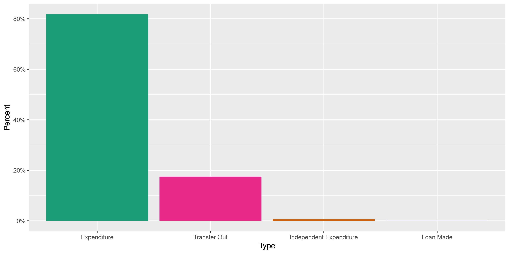
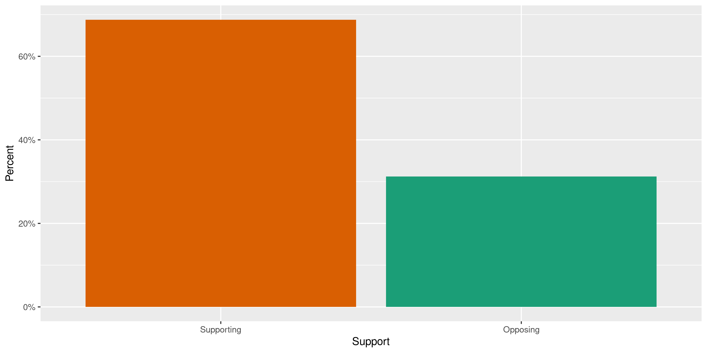
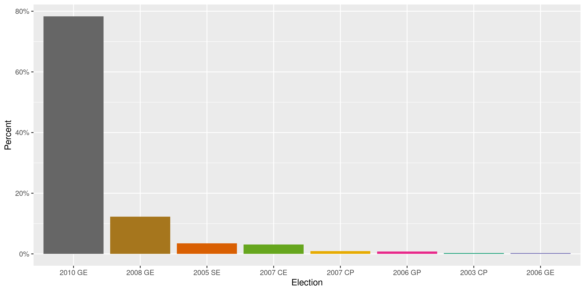
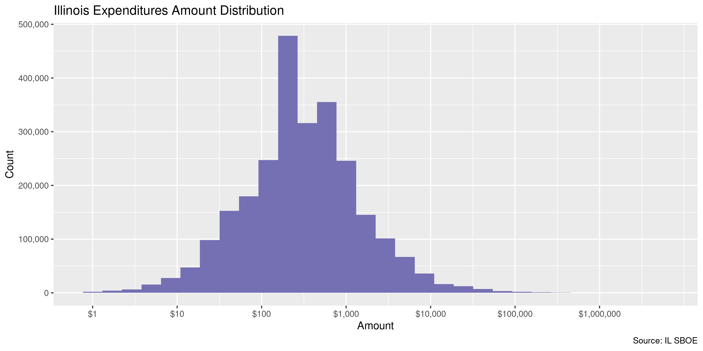
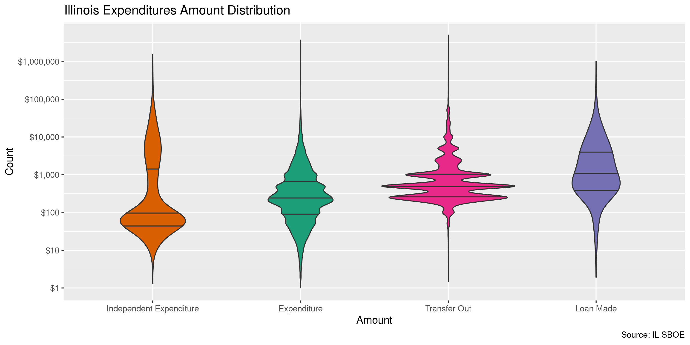
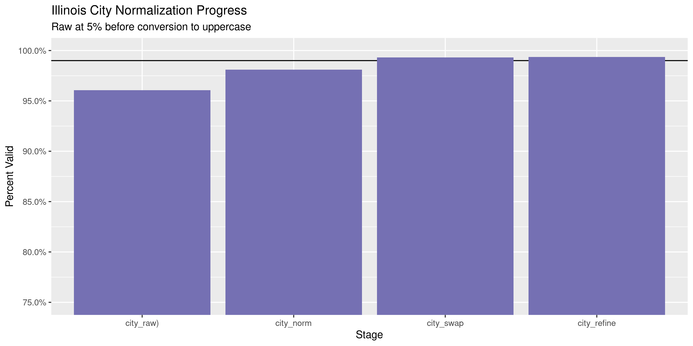

Illinois Expenditures
================
Kiernan Nicholls
2020-06-26 14:10:18

  - [Project](#project)
  - [Objectives](#objectives)
  - [Packages](#packages)
  - [Data](#data)
  - [Download](#download)
  - [Fix](#fix)
  - [Read](#read)
  - [Explore](#explore)
  - [Wrangle](#wrangle)
  - [Conclude](#conclude)
  - [Export](#export)
  - [Upload](#upload)
  - [Dictionary](#dictionary)

<!-- Place comments regarding knitting here -->

## Project

The Accountability Project is an effort to cut across data silos and
give journalists, policy professionals, activists, and the public at
large a simple way to search across huge volumes of public data about
people and organizations.

Our goal is to standardizing public data on a few key fields by thinking
of each dataset row as a transaction. For each transaction there should
be (at least) 3 variables:

1.  All **parties** to a transaction.
2.  The **date** of the transaction.
3.  The **amount** of money involved.

## Objectives

This document describes the process used to complete the following
objectives:

1.  How many records are in the database?
2.  Check for entirely duplicated records.
3.  Check ranges of continuous variables.
4.  Is there anything blank or missing?
5.  Check for consistency issues.
6.  Create a five-digit ZIP Code called `zip`.
7.  Create a `year` field from the transaction date.
8.  Make sure there is data on both parties to a transaction.

## Packages

The following packages are needed to collect, manipulate, visualize,
analyze, and communicate these results. The `pacman` package will
facilitate their installation and attachment.

The IRW’s `campfin` package will also have to be installed from GitHub.
This package contains functions custom made to help facilitate the
processing of campaign finance data.

``` r
if (!require("pacman")) install.packages("pacman")
pacman::p_load_gh("irworkshop/campfin")
pacman::p_load(
  tidyverse, # data manipulation
  lubridate, # datetime strings
  gluedown, # printing markdown
  magrittr, # pipe operators
  janitor, # clean data frames
  refinr, # cluster and merge
  scales, # format strings
  knitr, # knit documents
  vroom, # read files fast
  rvest, # html scraping
  glue, # combine strings
  here, # relative paths
  httr, # http requests
  fs # local storage 
)
```

This document should be run as part of the `R_campfin` project, which
lives as a sub-directory of the more general, language-agnostic
[`irworkshop/accountability_datacleaning`](https://github.com/irworkshop/accountability_datacleaning)
GitHub repository.

The `R_campfin` project uses the [RStudio
projects](https://support.rstudio.com/hc/en-us/articles/200526207-Using-Projects)
feature and should be run as such. The project also uses the dynamic
`here::here()` tool for file paths relative to *your* machine.

``` r
# where does this document knit?
here::here()
#> [1] "/home/kiernan/Code/accountability_datacleaning/R_campfin"
```

## Data

Data is obtained from the [Illinois State Board of Election
(SBOE)](https://www.elections.il.gov). Using the [SBOE search
portal](https://www.elections.il.gov/CampaignDisclosure/ExpenditureSearchByAllExpenditures.aspx),
we can search for all expenditures between two dates and export them to
a tab-delimited file.

Infuriatingly, a maximum of 25,000 records can be downloaded at a time.
This is typically the number of expenditures made in 1-3 months,
depending on the year. To obtain all records between 2000 and 2020, we
will have export hundreds of small files.

> Click the link below for the file type desired. Choose “Save” to copy
> the file to your computer. The maximum number of records available for
> download is 25,000. File Type:
> 
>   - Tab-Delimited Text File
>   - CSV File
>   - XML File

> Chapter 10 ICLS 5/9-17, Illinois Compiled Statutes, governs the
> dissemination and use of campaign disclosure data.
> 
>   - Any person who shall sell or utilize information from statements
>     and reports filed with the State Board of Elections for the
>     purpose of soliciting contributions or for the purpose of business
>     solicitation is guilty of a Class B misdemeanor.
>   - Any person who alters or falsifies this information and publishes,
>     circulates, or distributes such altered or falsified information
>     with the intent to misrepresent contributions received or
>     expenditures made by a candidate or political committee is guilty
>     of a Class B misdemeanor.

> Please review the following facts concerning campaign disclosure data
> files:
> 
>   - Data is updated continuously.
>   - *This data may contain errors that have not yet been identified
>     and corrected.*
>   - The Board provides files of campaign disclosure data; the Board
>     does not provide software to process this data.

## Download

Ideally, we would automate the download of these hundreds of files using
a combination of `httr::POST()` and `httr::GET()`, but the SBOE portal
uses a confusing back-end HTML structure we can’t easily replicate.
Instead, we have downloaded the files manually.

``` r
raw_dir <- dir_create(here("il", "expends", "data", "raw"))
raw_info <- as_tibble(dir_info(raw_dir))
nrow(raw_info)
#> [1] 138
sum(raw_info$size)
#> 623M
raw_info %>% 
  select(path, size, modification_time) %>% 
  mutate(across(path, path.abbrev))
#> # A tibble: 138 x 3
#>    path                                                            size modification_time  
#>    <chr>                                                    <fs::bytes> <dttm>             
#>  1 ~/il/expends/data/raw/Expenditures-20000101-20000228.txt       3.38M 2020-06-25 12:55:13
#>  2 ~/il/expends/data/raw/Expenditures-20000301-20000531.txt       5.39M 2020-06-25 12:57:09
#>  3 ~/il/expends/data/raw/Expenditures-20000601-20000831.txt       5.67M 2020-06-25 12:59:00
#>  4 ~/il/expends/data/raw/Expenditures-20000801-20000930.txt       5.01M 2020-06-25 13:00:01
#>  5 ~/il/expends/data/raw/Expenditures-20001001-20001031.txt       4.09M 2020-06-25 13:01:15
#>  6 ~/il/expends/data/raw/Expenditures-20001101-20001231.txt       3.83M 2020-06-25 13:02:07
#>  7 ~/il/expends/data/raw/Expenditures-20010101-20010331.txt       5.31M 2020-06-25 13:05:54
#>  8 ~/il/expends/data/raw/Expenditures-20010401-20010630.txt       4.54M 2020-06-25 13:10:14
#>  9 ~/il/expends/data/raw/Expenditures-20010701-20010930.txt       5.05M 2020-06-25 13:11:18
#> 10 ~/il/expends/data/raw/Expenditures-20011001-20011231.txt       5.37M 2020-06-25 13:12:26
#> # … with 128 more rows
```

## Fix

To improve the reading of these files, we can make new versions of the
data by reading the lines of each and looking for any double-quote
character (`"`) not next to a tab delimiter. These quotation marks are
used *inside* a cell, often around nicknames (e.g., “Committee to Elect
JP”Rick" Carney").

Use of double quotations in this way can cause parsing errors, so we can
identify them with a regular expression and replace them with a single
quote (`'`).

``` r
fix_dir <- dir_create(path(dirname(raw_dir), "fix"))
pb <- txtProgressBar(max = nrow(raw_info), style = 3)
#>   |                                                                                                 |                                                                                         |   0%
for (i in seq_along(raw_info$path)) {
  read_file(f <- raw_info$path[i]) %>% 
    # any quote not next to tab or end
    str_replace_all("(?<!\t|^|\r\n)\"(?!\t|$|\r\n)", "\'") %>% 
    write_file(path(fix_dir, basename(f)))
  setTxtProgressBar(pb, i)
}
#>   |                                                                                                 |=                                                                                        |   1%  |                                                                                                 |==                                                                                       |   2%  |                                                                                                 |===                                                                                      |   3%  |                                                                                                 |===                                                                                      |   4%  |                                                                                                 |====                                                                                     |   4%  |                                                                                                 |=====                                                                                    |   5%  |                                                                                                 |=====                                                                                    |   6%  |                                                                                                 |======                                                                                   |   7%  |                                                                                                 |=======                                                                                  |   8%  |                                                                                                 |========                                                                                 |   9%  |                                                                                                 |=========                                                                                |  10%  |                                                                                                 |==========                                                                               |  11%  |                                                                                                 |==========                                                                               |  12%  |                                                                                                 |===========                                                                              |  12%  |                                                                                                 |============                                                                             |  13%  |                                                                                                 |============                                                                             |  14%  |                                                                                                 |=============                                                                            |  14%  |                                                                                                 |==============                                                                           |  15%  |                                                                                                 |==============                                                                           |  16%  |                                                                                                 |===============                                                                          |  17%  |                                                                                                 |================                                                                         |  18%  |                                                                                                 |=================                                                                        |  19%  |                                                                                                 |=================                                                                        |  20%  |                                                                                                 |==================                                                                       |  20%  |                                                                                                 |===================                                                                      |  21%  |                                                                                                 |===================                                                                      |  22%  |                                                                                                 |====================                                                                     |  22%  |                                                                                                 |=====================                                                                    |  23%  |                                                                                                 |=====================                                                                    |  24%  |                                                                                                 |======================                                                                   |  25%  |                                                                                                 |=======================                                                                  |  25%  |                                                                                                 |=======================                                                                  |  26%  |                                                                                                 |========================                                                                 |  27%  |                                                                                                 |=========================                                                                |  28%  |                                                                                                 |==========================                                                               |  29%  |                                                                                                 |==========================                                                               |  30%  |                                                                                                 |===========================                                                              |  30%  |                                                                                                 |============================                                                             |  31%  |                                                                                                 |============================                                                             |  32%  |                                                                                                 |=============================                                                            |  33%  |                                                                                                 |==============================                                                           |  33%  |                                                                                                 |==============================                                                           |  34%  |                                                                                                 |===============================                                                          |  35%  |                                                                                                 |================================                                                         |  36%  |                                                                                                 |=================================                                                        |  37%  |                                                                                                 |==================================                                                       |  38%  |                                                                                                 |===================================                                                      |  39%  |                                                                                                 |===================================                                                      |  40%  |                                                                                                 |====================================                                                     |  41%  |                                                                                                 |=====================================                                                    |  41%  |                                                                                                 |=====================================                                                    |  42%  |                                                                                                 |======================================                                                   |  43%  |                                                                                                 |=======================================                                                  |  43%  |                                                                                                 |=======================================                                                  |  44%  |                                                                                                 |========================================                                                 |  45%  |                                                                                                 |=========================================                                                |  46%  |                                                                                                 |==========================================                                               |  47%  |                                                                                                 |===========================================                                              |  48%  |                                                                                                 |===========================================                                              |  49%  |                                                                                                 |============================================                                             |  49%  |                                                                                                 |============================================                                             |  50%  |                                                                                                 |=============================================                                            |  51%  |                                                                                                 |==============================================                                           |  51%  |                                                                                                 |==============================================                                           |  52%  |                                                                                                 |===============================================                                          |  53%  |                                                                                                 |================================================                                         |  54%  |                                                                                                 |=================================================                                        |  55%  |                                                                                                 |==================================================                                       |  56%  |                                                                                                 |==================================================                                       |  57%  |                                                                                                 |===================================================                                      |  57%  |                                                                                                 |====================================================                                     |  58%  |                                                                                                 |====================================================                                     |  59%  |                                                                                                 |=====================================================                                    |  59%  |                                                                                                 |======================================================                                   |  60%  |                                                                                                 |======================================================                                   |  61%  |                                                                                                 |=======================================================                                  |  62%  |                                                                                                 |========================================================                                 |  63%  |                                                                                                 |=========================================================                                |  64%  |                                                                                                 |==========================================================                               |  65%  |                                                                                                 |===========================================================                              |  66%  |                                                                                                 |===========================================================                              |  67%  |                                                                                                 |============================================================                             |  67%  |                                                                                                 |=============================================================                            |  68%  |                                                                                                 |=============================================================                            |  69%  |                                                                                                 |==============================================================                           |  70%  |                                                                                                 |===============================================================                          |  70%  |                                                                                                 |===============================================================                          |  71%  |                                                                                                 |================================================================                         |  72%  |                                                                                                 |=================================================================                        |  73%  |                                                                                                 |==================================================================                       |  74%  |                                                                                                 |==================================================================                       |  75%  |                                                                                                 |===================================================================                      |  75%  |                                                                                                 |====================================================================                     |  76%  |                                                                                                 |====================================================================                     |  77%  |                                                                                                 |=====================================================================                    |  78%  |                                                                                                 |======================================================================                   |  78%  |                                                                                                 |======================================================================                   |  79%  |                                                                                                 |=======================================================================                  |  80%  |                                                                                                 |========================================================================                 |  80%  |                                                                                                 |========================================================================                 |  81%  |                                                                                                 |=========================================================================                |  82%  |                                                                                                 |==========================================================================               |  83%  |                                                                                                 |===========================================================================              |  84%  |                                                                                                 |===========================================================================              |  85%  |                                                                                                 |============================================================================             |  86%  |                                                                                                 |=============================================================================            |  86%  |                                                                                                 |=============================================================================            |  87%  |                                                                                                 |==============================================================================           |  88%  |                                                                                                 |===============================================================================          |  88%  |                                                                                                 |===============================================================================          |  89%  |                                                                                                 |================================================================================         |  90%  |                                                                                                 |=================================================================================        |  91%  |                                                                                                 |==================================================================================       |  92%  |                                                                                                 |===================================================================================      |  93%  |                                                                                                 |====================================================================================     |  94%  |                                                                                                 |====================================================================================     |  95%  |                                                                                                 |=====================================================================================    |  96%  |                                                                                                 |======================================================================================   |  96%  |                                                                                                 |======================================================================================   |  97%  |                                                                                                 |=======================================================================================  |  98%  |                                                                                                 |======================================================================================== |  99%  |                                                                                                 |=========================================================================================| 100%
fix_info <- dir_info(fix_dir)
```

``` r
nrow(fix_info) == nrow(raw_info)
#> [1] TRUE
sum(fix_info$size) == sum(raw_info$size)
#> [1] TRUE
```

## Read

All the 138 fixed files can be read into a single data frame using
`vroom::vroom()`

``` r
ile <- vroom(
  file = fix_info$path,
  id = "file",
  delim = "\t",
  escape_backslash = FALSE,
  escape_double = FALSE,
  na = c("", " ", "       "),
  num_threads = 1,
  col_types = cols(
    .default = col_character(),
    ExpndDate = col_date("%m/%d/%Y"),
    Amount  = col_double(),
    RptPdBegDate = col_date("%m/%d/%Y"),
    RptPdEndDate = col_date("%m/%d/%Y"),
    RptRcvdDate = col_date("%m/%d/%Y")
  )
)
```

If all these files were correctly read into a single data frame, we
should be able count the distinct values fo a discrete variable like
`doc_name`.

``` r
comma(nrow(ile))
#> [1] "2,572,073"
count(ile, DocName)
#> # A tibble: 6 x 2
#>   DocName            n
#>   <chr>          <int>
#> 1 B-1               54
#> 2 Final          28152
#> 3 Pre-election     773
#> 4 Quarterly    1225625
#> 5 Semiannual   1317193
#> 6 <NA>             276
```

``` r
old_names <- names(ile)
ile <- ile %>% 
  clean_names("snake") %>% 
  remove_empty("rows") %>% 
  remove_empty("cols") %>% 
  remove_constant() %>% 
  rename(
    comm_id = committee_id,
    vendor = received_by,
    date = expnd_date,
    type = expended_by_type,
    support = supporting_opposing,
    candidate = candidate_name,
    report_begin = rpt_pd_beg_date,
    report_end = rpt_pd_end_date,
    committee = expended_by
  )
```

## Explore

There are 2,572,073 records with 22 variables.

``` r
glimpse(ile)
#> Rows: 2,572,073
#> Columns: 22
#> $ file            <chr> "Expenditures-20000101-20000228.txt", "Expenditures-20000101-20000228.tx…
#> $ comm_id         <chr> NA, "634", "634", "634", "634", "634", "634", "634", "634", "634", "1056…
#> $ vendor          <chr> NA, "Citizens for Dan Cronin", "Friends for Eileen Lyons", "Friends of L…
#> $ date            <date> NA, 2000-02-25, 2000-02-25, 2000-02-25, 2000-02-21, 2000-02-18, 2000-02…
#> $ amount          <dbl> NA, 400.00, 500.00, 3000.00, 300.00, 328.00, 500.00, 200.00, 1000.00, 75…
#> $ address1        <chr> NA, "PO Box 612", "PO Box 322", "PO Box 33", "PO Box 946", "2100 Clearwa…
#> $ address2        <chr> NA, NA, NA, NA, NA, NA, NA, NA, NA, NA, NA, NA, "PMB 88", NA, NA, NA, NA…
#> $ city            <chr> NA, "Villa Park", "Western Springs", "Elmhurst", "Naperville", "Oak Broo…
#> $ state           <chr> NA, "IL", "IL", "IL", "IL", "IL", "IL", "IL", "IL", "IL", "IL", "IL", "I…
#> $ zip             <chr> NA, "60181     ", "60558     ", "60126     ", "60566     ", "60523     "…
#> $ type            <chr> NA, "Transfer Out", "Transfer Out", "Transfer Out", "Transfer Out", "Exp…
#> $ purpose         <chr> NA, "Tickets", "Tickets", "Leaders Memberships", "Tickets", "Accounting/…
#> $ beneficiary     <chr> NA, "Citizens for Dan Cronin", "Friends for Eileen Lyons", "Friends of L…
#> $ candidate       <chr> NA, NA, NA, NA, NA, NA, NA, NA, NA, NA, NA, NA, NA, NA, NA, NA, NA, NA, …
#> $ office_district <chr> NA, NA, NA, NA, NA, NA, NA, NA, NA, NA, NA, NA, NA, NA, NA, NA, NA, NA, …
#> $ support         <chr> NA, NA, NA, NA, NA, NA, NA, NA, NA, NA, NA, NA, NA, NA, NA, NA, NA, NA, …
#> $ doc_name        <chr> NA, "Semiannual", "Semiannual", "Semiannual", "Semiannual", "Semiannual"…
#> $ election        <chr> NA, NA, NA, NA, NA, NA, NA, NA, NA, NA, NA, NA, NA, NA, NA, NA, NA, NA, …
#> $ report_begin    <date> NA, 2000-01-01, 2000-01-01, 2000-01-01, 2000-01-01, 2000-01-01, 2000-01…
#> $ report_end      <date> NA, 2000-06-30, 2000-06-30, 2000-06-30, 2000-06-30, 2000-06-30, 2000-06…
#> $ rpt_rcvd_date   <date> NA, 2005-02-04, 2005-02-04, 2005-02-04, 2005-02-04, 2005-02-04, 2005-02…
#> $ committee       <chr> NA, "IPAC-Sponsored by the Inland Group", "IPAC-Sponsored by the Inland …
tail(ile)
#> # A tibble: 6 x 22
#>   file  comm_id vendor date       amount address1 address2 city  state zip   type  purpose
#>   <chr> <chr>   <chr>  <date>      <dbl> <chr>    <chr>    <chr> <chr> <chr> <chr> <chr>  
#> 1 Expe… 35889   Berli… 2020-03-04  4499  15 Maid… S1600    New … NY    "100… Inde… Media …
#> 2 Expe… 35889   Daily… 2020-03-04  5000  436 14t… <NA>     Oakl… CA    "946… Inde… Media …
#> 3 Expe… 24961   St. B… 2020-03-06  1782. 110 N B… <NA>     Edwa… IL    "620… Expe… Donati…
#> 4 Expe… 35889   The P… 2020-03-03 12500  Faceboo… 1659 W … Chic… IL    "606… Inde… Media …
#> 5 Expe… 35889   Soul … 2020-03-03  8217. 11211 S… <NA>     Chic… IL    "606… Inde… Field …
#> 6 Expe… <NA>    <NA>   NA            NA  <NA>     <NA>     <NA>  <NA>   <NA> <NA>  <NA>   
#> # … with 10 more variables: beneficiary <chr>, candidate <chr>, office_district <chr>,
#> #   support <chr>, doc_name <chr>, election <chr>, report_begin <date>, report_end <date>,
#> #   rpt_rcvd_date <date>, committee <chr>
```

### Missing

Variables differ in the degree of values they are missing.

``` r
col_stats(ile, count_na)
#> # A tibble: 22 x 4
#>    col             class        n        p
#>    <chr>           <chr>    <int>    <dbl>
#>  1 file            <chr>        0 0       
#>  2 comm_id         <chr>      276 0.000107
#>  3 vendor          <chr>      276 0.000107
#>  4 date            <date>     276 0.000107
#>  5 amount          <dbl>      276 0.000107
#>  6 address1        <chr>    28592 0.0111  
#>  7 address2        <chr>  2357239 0.916   
#>  8 city            <chr>    16656 0.00648 
#>  9 state           <chr>      702 0.000273
#> 10 zip             <chr>    12549 0.00488 
#> 11 type            <chr>      276 0.000107
#> 12 purpose         <chr>    11011 0.00428 
#> 13 beneficiary     <chr>    16061 0.00624 
#> 14 candidate       <chr>  2556529 0.994   
#> 15 office_district <chr>  2556529 0.994   
#> 16 support         <chr>  2556529 0.994   
#> 17 doc_name        <chr>      276 0.000107
#> 18 election        <chr>  2571298 1.00    
#> 19 report_begin    <date>     276 0.000107
#> 20 report_end      <date>     276 0.000107
#> 21 rpt_rcvd_date   <date>     276 0.000107
#> 22 committee       <chr>      276 0.000107
```

We can flag any record missing a key variable used to identify a
transaction.

``` r
ile <- ile %>% flag_na(date, vendor, amount, committee)
sum(ile$na_flag)
#> [1] 276
```

If a record is *any* of these values, they are missing all of them.

``` r
ile %>% 
  filter(na_flag) %>% 
  select(date, vendor, amount, committee) %>% 
  distinct()
#> # A tibble: 1 x 4
#>   date       vendor amount committee
#>   <date>     <chr>   <dbl> <chr>    
#> 1 NA         <NA>       NA <NA>
```

The only variable present for any of these records is the `file` one we
added.

``` r
ile %>% 
  filter(na_flag) %>% 
  col_stats(count_na)
#> # A tibble: 23 x 4
#>    col             class      n     p
#>    <chr>           <chr>  <int> <dbl>
#>  1 file            <chr>      0     0
#>  2 comm_id         <chr>    276     1
#>  3 vendor          <chr>    276     1
#>  4 date            <date>   276     1
#>  5 amount          <dbl>    276     1
#>  6 address1        <chr>    276     1
#>  7 address2        <chr>    276     1
#>  8 city            <chr>    276     1
#>  9 state           <chr>    276     1
#> 10 zip             <chr>    276     1
#> 11 type            <chr>    276     1
#> 12 purpose         <chr>    276     1
#> 13 beneficiary     <chr>    276     1
#> 14 candidate       <chr>    276     1
#> 15 office_district <chr>    276     1
#> 16 support         <chr>    276     1
#> 17 doc_name        <chr>    276     1
#> 18 election        <chr>    276     1
#> 19 report_begin    <date>   276     1
#> 20 report_end      <date>   276     1
#> 21 rpt_rcvd_date   <date>   276     1
#> 22 committee       <chr>    276     1
#> 23 na_flag         <lgl>      0     0
```

We can simply remove these rows because they hold no data.

``` r
file_col <- ile$file[!ile$na_flag]
ile <- ile %>% 
  select(-file, -na_flag) %>% 
  remove_empty("rows") %>% 
  mutate(file = file_col, .before = 1)
```

Now, no records are missing any of these key variables.

``` r
ile %>% 
  select(date, vendor, amount, committee) %>% 
  col_stats(count_na)
#> # A tibble: 4 x 4
#>   col       class      n     p
#>   <chr>     <chr>  <int> <dbl>
#> 1 date      <date>     0     0
#> 2 vendor    <chr>      0     0
#> 3 amount    <dbl>      0     0
#> 4 committee <chr>      0     0
```

### Duplicates

``` r
dupe_file <- file_temp(pattern = "dupes")
if (!file_exists(dupe_file)) {
  file_create(dupe_file)
  n <- 1e5 # rows per chunk
  nr <- nrow(ile)
  # split file into chunks
  ils <- split(ile, rep(1:ceiling(nr/n), each = n, length.out = nr))
  for (i in seq_along(ils)) {
    # check dupes from both ends
    d1 <- duplicated(ils[[i]], fromLast = FALSE)
    d2 <- duplicated(ils[[i]], fromLast = TRUE)
    # append to disk
    write_lines(d1 | d2, dupe_file, append = TRUE)
    rm(d1, d2)
    ils[[i]] <- NA
    message(percent(i/length(ils)))
    Sys.sleep(10)
    flush_memory()
  }
  rm(ils)
}
```

``` r
ile <- mutate(ile, dupe_flag = as.logical(read_lines(dupe_file)))
percent(mean(ile$dupe_flag), 0.1)
#> [1] "1.5%"
```

``` r
ile %>% 
  filter(dupe_flag) %>% 
  select(date, vendor, amount, committee)
#> # A tibble: 38,237 x 4
#>    date       vendor                      amount committee                            
#>    <date>     <chr>                        <dbl> <chr>                                
#>  1 2000-01-18 Moya, Mario                1721    Citizens For Lopez                   
#>  2 2000-01-18 Moya, Mario                1721    Citizens For Lopez                   
#>  3 2000-02-09 Theater District Self Park  255    Citizens for Jim Ryan                
#>  4 2000-02-09 Theater District Self Park  255    Citizens for Jim Ryan                
#>  5 2000-01-04 INVEST FINANCIAL CORP.        4.25 Betty Loren-Maltese Committeeman Fund
#>  6 2000-01-04 INVEST FINANCIAL CORP.        4.25 Betty Loren-Maltese Committeeman Fund
#>  7 2000-01-31 Quinn, Martin              1250.   Friends of Michael J Madigan         
#>  8 2000-01-31 Quinn, Martin              1250.   Friends of Michael J Madigan         
#>  9 2000-01-13 U.S. Postal Service          90.2  Friends of Tom Berns                 
#> 10 2000-01-13 U.S. Postal Service          90.2  Friends of Tom Berns                 
#> # … with 38,227 more rows
```

### Categorical

``` r
col_stats(ile, n_distinct)
#> # A tibble: 23 x 4
#>    col             class       n           p
#>    <chr>           <chr>   <int>       <dbl>
#>  1 file            <chr>     138 0.0000537  
#>  2 comm_id         <chr>   10487 0.00408    
#>  3 vendor          <chr>  331405 0.129      
#>  4 date            <date>   7395 0.00288    
#>  5 amount          <dbl>  215135 0.0837     
#>  6 address1        <chr>  353023 0.137      
#>  7 address2        <chr>   20537 0.00799    
#>  8 city            <chr>   13414 0.00522    
#>  9 state           <chr>     165 0.0000642  
#> 10 zip             <chr>   34696 0.0135     
#> 11 type            <chr>       4 0.00000156 
#> 12 purpose         <chr>  281623 0.110      
#> 13 beneficiary     <chr>   76660 0.0298     
#> 14 candidate       <chr>    1241 0.000483   
#> 15 office_district <chr>    1101 0.000428   
#> 16 support         <chr>       3 0.00000117 
#> 17 doc_name        <chr>       5 0.00000194 
#> 18 election        <chr>      12 0.00000467 
#> 19 report_begin    <date>   2150 0.000836   
#> 20 report_end      <date>   1770 0.000688   
#> 21 rpt_rcvd_date   <date>   5610 0.00218    
#> 22 committee       <chr>   10387 0.00404    
#> 23 dupe_flag       <lgl>       2 0.000000778
```

``` r
explore_plot(ile, type)
```

<!-- -->

``` r
explore_plot(ile, support)
```

<!-- -->

``` r
explore_plot(ile, doc_name)
```

<!-- -->

``` r
explore_plot(ile, election)
```

<!-- -->

### Amounts

The max `amount` value is $5,000,000 and 0.0% of values are less than or
equal to $0.

``` r
noquote(map_chr(summary(ile$amount), dollar))
#>       Min.    1st Qu.     Median       Mean    3rd Qu.       Max. 
#>      $0.01    $113.64       $280  $1,570.49    $756.50 $5,000,000
mean(ile$amount <= 0)
#> [1] 0
```

Here is the record with the largest `amount` value.

``` r
glimpse(ile[which.max(ile$amount), ])
#> Rows: 1
#> Columns: 23
#> $ file            <chr> "Expenditures-20160501-20160630.txt"
#> $ comm_id         <chr> "25185"
#> $ vendor          <chr> "Illinois Republican Party"
#> $ date            <date> 2016-05-04
#> $ amount          <dbl> 5e+06
#> $ address1        <chr> "PO Box 64897"
#> $ address2        <chr> NA
#> $ city            <chr> "Chicago"
#> $ state           <chr> "IL"
#> $ zip             <chr> "60603-0897"
#> $ type            <chr> "Transfer Out"
#> $ purpose         <chr> "Contribution"
#> $ beneficiary     <chr> "Illinois Republican Party"
#> $ candidate       <chr> NA
#> $ office_district <chr> NA
#> $ support         <chr> NA
#> $ doc_name        <chr> "Quarterly"
#> $ election        <chr> NA
#> $ report_begin    <date> 2016-04-01
#> $ report_end      <date> 2016-06-30
#> $ rpt_rcvd_date   <date> 2017-04-17
#> $ committee       <chr> "Citizens for Rauner, Inc"
#> $ dupe_flag       <lgl> FALSE
```

<!-- -->

<!-- -->

### Dates

We can add the calendar year from `date` with `lubridate::year()`

``` r
ile <- mutate(ile, year = year(date))
```

Since we exported the records from the search portal based on year,
there are none outside the expected range.

``` r
min(ile$date)
#> [1] "2000-01-01"
sum(ile$year < 2000)
#> [1] 0
max(ile$date)
#> [1] "2020-06-20"
sum(ile$date > today())
#> [1] 0
```

<!-- -->

## Wrangle

To improve the searchability of the database, we will perform some
consistent, confident string normalization. For geographic variables
like city names and ZIP codes, the corresponding `campfin::normal_*()`
functions are tailor made to facilitate this process.

### Address

For the street `addresss` variable, the `campfin::normal_address()`
function will force consistence case, remove punctuation, and abbreviate
official USPS suffixes.

``` r
ile <- ile %>% 
  unite(
    col = address_full,
    starts_with("address"),
    sep = " ",
    remove = FALSE,
    na.rm = TRUE
  ) %>% 
  mutate(
    address_norm = normal_address(
      address = address_full,
      abbs = usps_street,
      na_rep = TRUE
    )
  ) %>% 
  select(-address_full)
```

``` r
ile %>% 
  select(contains("address")) %>% 
  distinct() %>% 
  sample_n(10)
#> # A tibble: 10 x 3
#>    address1                 address2    address_norm              
#>    <chr>                    <chr>       <chr>                     
#>  1 1170 East Main Rd        PO Box 1290 1170 E MAIN RD PO BOX 1290
#>  2 37W171 Winhaven Dr       <NA>        37 W 171 WINHAVEN DR      
#>  3 760 Village Center Drive Suite 200   760 VLG CTR DR STE 200    
#>  4 3500 N. Glenview Ave     Apt 3       3500 N GLENVIEW AVE APT 3 
#>  5 5801 N. Natoma Ave.      <NA>        5801 N NATOMA AVE         
#>  6 P. O. Box 673            <NA>        PO BOX 673                
#>  7 4010 N. Illinois St.     <NA>        4010 N ILLINOIS ST        
#>  8 1008 Harrison Street     <NA>        1008 HARRISON ST          
#>  9 2391 W 5th               <NA>        2391 W 5 TH               
#> 10 2601 Albert Avenue       <NA>        2601 ALBERT AVE
```

### ZIP

For ZIP codes, the `campfin::normal_zip()` function will attempt to
create valid *five* digit codes by removing the ZIP+4 suffix and
returning leading zeroes dropped by other programs like Microsoft Excel.

``` r
ile <- ile %>% 
  mutate(
    zip_norm = normal_zip(
      zip = zip,
      na_rep = TRUE
    )
  )
```

``` r
progress_table(
  ile$zip,
  ile$zip_norm,
  compare = valid_zip
)
#> # A tibble: 2 x 6
#>   stage    prop_in n_distinct prop_na   n_out n_diff
#>   <chr>      <dbl>      <dbl>   <dbl>   <dbl>  <dbl>
#> 1 zip        0          34696 0.00477 2559524  34696
#> 2 zip_norm   0.994      11411 0.0123    14792   1232
```

### State

Valid two digit state abbreviations can be made using the
`campfin::normal_state()` function.

``` r
ile <- ile %>% 
  mutate(
    state_norm = normal_state(
      state = state,
      abbreviate = TRUE,
      na_rep = TRUE,
      valid = valid_state
    )
  )
```

``` r
ile %>% 
  filter(state != state_norm) %>% 
  count(state, state_norm, sort = TRUE)
#> # A tibble: 36 x 3
#>    state state_norm     n
#>    <chr> <chr>      <int>
#>  1 Il    IL           188
#>  2 Ca    CA            50
#>  3 Tx    TX            32
#>  4 il    IL            28
#>  5 Co    CO            20
#>  6 Wi    WI            19
#>  7 Al    AL            16
#>  8 co    CO            13
#>  9 md    MD            12
#> 10 Ia    IA            11
#> # … with 26 more rows
```

``` r
progress_table(
  ile$state,
  ile$state_norm,
  compare = valid_state
)
#> # A tibble: 2 x 6
#>   stage      prop_in n_distinct  prop_na n_out n_diff
#>   <chr>        <dbl>      <dbl>    <dbl> <dbl>  <dbl>
#> 1 state        0.999        165 0.000166  3406    108
#> 2 state_norm   1             57 0.00131      0      1
```

### City

Cities are the most difficult geographic variable to normalize, simply
due to the wide variety of valid cities and formats.

#### Normal

The `campfin::normal_city()` function is a good start, again converting
case, removing punctuation, but *expanding* USPS abbreviations. We can
also remove `invalid_city` values.

``` r
ile <- ile %>% 
  mutate(
    city_norm = normal_city(
      city = city, 
      abbs = usps_city,
      states = c("IL", "DC", "ILLINOIS"),
      na = invalid_city,
      na_rep = TRUE
    )
  )
```

#### Swap

We can further improve normalization by comparing our normalized value
against the *expected* value for that record’s state abbreviation and
ZIP code. If the normalized value is either an abbreviation for or very
similar to the expected value, we can confidently swap those two.

``` r
ile <- ile %>% 
  rename(city_raw = city) %>% 
  left_join(
    y = zipcodes,
    by = c(
      "state_norm" = "state",
      "zip_norm" = "zip"
    )
  ) %>% 
  rename(city_match = city) %>% 
  mutate(
    match_abb = is_abbrev(city_norm, city_match),
    match_dist = str_dist(city_norm, city_match),
    city_swap = if_else(
      condition = !is.na(match_dist) & (match_abb | match_dist == 1),
      true = city_match,
      false = city_norm
    )
  ) %>% 
  select(
    -city_match,
    -match_dist,
    -match_abb
  )
```

#### Refine

The [OpenRefine](https://openrefine.org/) algorithms can be used to
group similar strings and replace the less common versions with their
most common counterpart. This can greatly reduce inconsistency, but with
low confidence; we will only keep any refined strings that have a valid
city/state/zip combination.

``` r
good_refine <- ile %>% 
  mutate(
    city_refine = city_swap %>% 
      key_collision_merge() %>% 
      n_gram_merge(numgram = 1)
  ) %>% 
  filter(city_refine != city_swap) %>% 
  inner_join(
    y = zipcodes,
    by = c(
      "city_refine" = "city",
      "state_norm" = "state",
      "zip_norm" = "zip"
    )
  )
```

    #> # A tibble: 165 x 5
    #>    state_norm zip_norm city_swap          city_refine         n
    #>    <chr>      <chr>    <chr>              <chr>           <int>
    #>  1 IL         60411    SO CHICAGO HEIGHTS CHICAGO HEIGHTS   258
    #>  2 NE         68103    OHAMA              OMAHA             254
    #>  3 OH         45274    CINCINATTI         CINCINNATI        232
    #>  4 IL         60429    EAST HAZEL CREST   HAZEL CREST       138
    #>  5 SC         29406    NORTH CHARLESTON   CHARLESTON         58
    #>  6 OH         45274    CINNCINATI         CINCINNATI         43
    #>  7 IL         61821    CHAMAPGIN          CHAMPAIGN          34
    #>  8 OH         45263    CINCINATTI         CINCINNATI         27
    #>  9 OH         45999    CINCINATTI         CINCINNATI         25
    #> 10 MD         21403    ANNAPILOS          ANNAPOLIS          24
    #> # … with 155 more rows

Then we can join the refined values back to the database.

``` r
ile <- ile %>% 
  left_join(good_refine) %>% 
  mutate(city_refine = coalesce(city_refine, city_swap))
```

#### Progress

| stage        | prop\_in | n\_distinct | prop\_na | n\_out | n\_diff |
| :----------- | -------: | ----------: | -------: | -----: | ------: |
| city\_raw)   |    0.961 |       10599 |    0.006 | 100651 |    6128 |
| city\_norm   |    0.981 |        9614 |    0.007 |  48225 |    5103 |
| city\_swap   |    0.993 |        6696 |    0.007 |  17549 |    2178 |
| city\_refine |    0.994 |        6576 |    0.007 |  16055 |    2058 |

You can see how the percentage of valid values increased with each
stage.

<!-- -->

More importantly, the number of distinct values decreased each stage. We
were able to confidently change many distinct invalid values to their
valid equivalent.

<!-- -->

## Conclude

Before exporting, we can remove the intermediary normalization columns
and rename all added variables with the `_clean` suffix.

``` r
ile <- ile %>% 
  select(
    -city_norm,
    -city_swap,
    city_clean = city_refine
  ) %>% 
  rename_all(~str_replace(., "_norm", "_clean")) %>% 
  rename_all(~str_remove(., "_raw"))
```

``` r
glimpse(sample_n(ile, 100))
#> Rows: 100
#> Columns: 28
#> $ file            <chr> "Expenditures-20110801-20110930.txt", "Expenditures-20110301-20110430.tx…
#> $ comm_id         <chr> "10591", "1126", "4415", "539", "19891", "12467", "7639", "119", "17385"…
#> $ vendor          <chr> "TARGET-INSYGHT", "Citizens to Elect John Gerl", "Wheaton Park District"…
#> $ date            <date> 2011-08-17, 2011-03-01, 2013-05-19, 2014-10-30, 2008-01-06, 2008-09-04,…
#> $ amount          <dbl> 200.00, 300.00, 150.00, 65.35, 5.53, 300.00, 139.27, 250.00, 250.00, 350…
#> $ address1        <chr> "PO BOX 80505", "3911 Sierra Rose Circle", "102 E Wesley Street", "1701 …
#> $ address2        <chr> NA, NA, NA, NA, NA, NA, NA, NA, NA, NA, NA, NA, NA, NA, NA, NA, "#1", NA…
#> $ city            <chr> "LANSING", "Joliet", "Wheaton", "Bloomington", "Cambridge", "Eureka", "w…
#> $ state           <chr> "MI", "IL", "IL", "IL", "MA", "MO", "IL", "IL", "IL", "IL", "IL", "IL", …
#> $ zip             <chr> "48908     ", "60431-4900", "60187     ", "61701     ", "02139     ", "6…
#> $ type            <chr> "Expenditure", "Transfer Out", "Expenditure", "Independent Expenditure",…
#> $ purpose         <chr> "DONATION", "Contribution", "4th of July Parade Fee", "Advertising - mag…
#> $ beneficiary     <chr> "Friends of Walter Burnett, Jr.", "Citizens to Elect John Gerl", "Milton…
#> $ candidate       <chr> NA, NA, NA, "Michael E Hastings", NA, NA, NA, NA, NA, NA, NA, NA, NA, NA…
#> $ office_district <chr> NA, NA, NA, "State Senate", NA, NA, NA, NA, NA, NA, NA, NA, NA, NA, NA, …
#> $ support         <chr> NA, NA, NA, "Supporting", NA, NA, NA, NA, NA, NA, NA, NA, NA, NA, NA, NA…
#> $ doc_name        <chr> "Quarterly", "Quarterly", "Quarterly", "Quarterly", "Semiannual", "Semia…
#> $ election        <chr> NA, NA, NA, NA, NA, NA, NA, NA, NA, NA, NA, NA, NA, NA, NA, NA, NA, NA, …
#> $ report_begin    <date> 2011-07-01, 2011-01-01, 2013-04-01, 2014-10-01, 2008-01-01, 2008-07-01,…
#> $ report_end      <date> 2011-09-30, 2011-03-31, 2013-06-30, 2014-12-31, 2008-06-30, 2008-12-31,…
#> $ rpt_rcvd_date   <date> 2011-10-17, 2011-05-11, 2013-07-01, 2015-03-18, 2008-10-21, 2012-12-13,…
#> $ committee       <chr> "Friends of Walter Burnett, Jr", "REALTORS® Political Action Committee",…
#> $ dupe_flag       <lgl> FALSE, FALSE, FALSE, FALSE, FALSE, FALSE, FALSE, FALSE, FALSE, FALSE, FA…
#> $ year            <dbl> 2011, 2011, 2013, 2014, 2008, 2008, 2012, 2004, 2014, 2020, 2008, 2011, …
#> $ address_clean   <chr> "PO BOX 80505", "3911 SIERRA ROSE CIR", "102 E WESLEY ST", "1701 TOWANDA…
#> $ zip_clean       <chr> "48908", "60431", "60187", "61701", "02139", "63025", NA, "60025", "6063…
#> $ state_clean     <chr> "MI", "IL", "IL", "IL", "MA", "MO", "IL", "IL", "IL", "IL", "IL", "IL", …
#> $ city_clean      <chr> "LANSING", "JOLIET", "WHEATON", "BLOOMINGTON", "CAMBRIDGE", "EUREKA", "W…
```

1.  There are 2,571,817 records in the database.
2.  1.49% of records are duplicates.
3.  The range and distribution of `amount` and `date` seem reasonable.
4.  There are 0 records missing key variables.
5.  Consistency in geographic data has been improved with
    `campfin::normal_*()`.
6.  The 4-digit `year` variable has been created with
    `lubridate::year()`.

## Export

Now the file can be saved on disk for upload to the Accountability
server.

``` r
clean_dir <- dir_create(here("il", "expends", "data", "clean"))
clean_path <- path(clean_dir, "il_expends_clean.csv")
write_csv(ile, clean_path, na = "")
file_size(clean_path)
#> 728M
file_encoding(clean_path) %>% 
  mutate(across(path, path.abbrev))
#> # A tibble: 1 x 3
#>   path                                         mime            charset
#>   <chr>                                        <chr>           <chr>  
#> 1 ~/il/expends/data/clean/il_expends_clean.csv application/csv utf-8
```

## Upload

Using the [duckr](https://github.com/kiernann/duckr) R package, we can
wrap around the [duck](https://duck.sh/) command line tool to upload the
file to the IRW server.

``` r
# remotes::install_github("kiernann/duckr")
s3_dir <- "s3:/publicaccountability/csv/"
s3_path <- path(s3_dir, basename(clean_path))
if (require(duckr)) {
  duckr::duck_upload(clean_path, s3_path)
}
```

## Dictionary

The following table describes the variables in our final exported file:

| Column            | Original Name        | Type        | Definition                                 |
| :---------------- | :------------------- | :---------- | :----------------------------------------- |
| `file`            | `file`               | `character` | Raw file (period) containing the record    |
| `comm_id`         | `CommitteeID`        | `character` | Unique expending committee ID              |
| `vendor`          | `ReceivedBy`         | `character` | Receiving vendor name                      |
| `date`            | `ExpndDate`          | `double`    | Date expenditure was made                  |
| `amount`          | `Amount`             | `double`    | Expenditure amount or correction           |
| `address1`        | `Address1`           | `character` | Vendor street address                      |
| `address2`        | `Address2`           | `character` | Vendor secondary address                   |
| `city`            | `City`               | `character` | Vendor city name                           |
| `state`           | `State`              | `character` | Vendor state abbreviation                  |
| `zip`             | `Zip`                | `character` | Vendor ZIP+4 code                          |
| `type`            | `ExpendedByType`     | `character` | Vendor type                                |
| `purpose`         | `Purpose`            | `character` | Expenditure purpose                        |
| `beneficiary`     | `Beneficiary`        | `character` | For whom the expenditure was made          |
| `candidate`       | `CandidateName`      | `character` | Expending candidate name                   |
| `office_district` | `OfficeDistrict`     | `character` | Office and district sought                 |
| `support`         | `SupportingOpposing` | `character` | Whether committee suports or opposes       |
| `doc_name`        | `DocName`            | `character` | Document name expenditure reported on      |
| `election`        | `Election`           | `character` | Election during which expenditure was made |
| `report_begin`    | `RptPdBegDate`       | `double`    | Reporting period begining date             |
| `report_end`      | `RptPdEndDate`       | `double`    | Reporting period end date                  |
| `rpt_rcvd_date`   | `RptRcvdDate`        | `double`    | Report received date                       |
| `committee`       | `ExpendedBy`         | `character` | Spending committee name                    |
| `dupe_flag`       |                      | `logical`   | Flag for completely duplicated record      |
| `year`            |                      | `double`    | Calendar year of contribution date         |
| `address_clean`   |                      | `character` | Normalized combined street address         |
| `zip_clean`       |                      | `character` | Normalized 5-digit ZIP code                |
| `state_clean`     |                      | `character` | Normalized 2-digit state abbreviation      |
| `city_clean`      |                      | `character` | Normalized city name                       |
