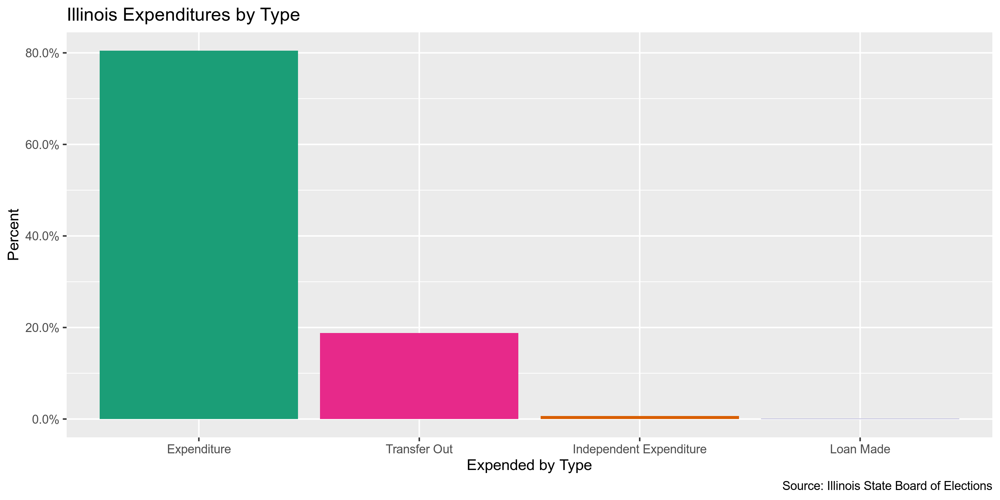
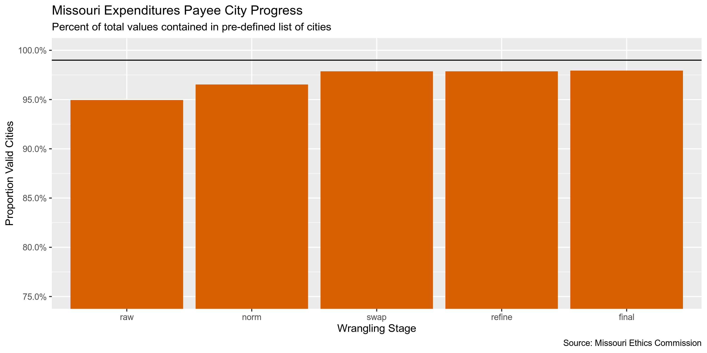

State Data
================
First Last
2019-08-28 16:36:44

  - [Project](#project)
  - [Objectives](#objectives)
  - [Packages](#packages)
  - [Data](#data)
  - [Import](#import)
  - [Explore](#explore)
  - [Wrangle](#wrangle)
  - [Conclude](#conclude)
  - [Export](#export)

<!-- Place comments regarding knitting here -->

## Project

The Accountability Project is an effort to cut across data silos and
give journalists, policy professionals, activists, and the public at
large a simple way to search across huge volumes of public data about
people and organizations.

Our goal is to standardizing public data on a few key fields by thinking
of each dataset row as a transaction. For each transaction there should
be (at least) 3 variables:

1.  All **parties** to a transaction
2.  The **date** of the transaction
3.  The **amount** of money involved

## Objectives

This document describes the process used to complete the following
objectives:

1.  How many records are in the database?
2.  Check for duplicates
3.  Check ranges
4.  Is there anything blank or missing?
5.  Check for consistency issues
6.  Create a five-digit ZIP Code called `ZIP5`
7.  Create a `YEAR` field from the transaction date
8.  Make sure there is data on both parties to a transaction

## Packages

The following packages are needed to collect, manipulate, visualize,
analyze, and communicate these results. The `pacman` package will
facilitate their installation and attachment.

The IRW’s `campfin` package will also have to be installed from GitHub.
This package contains functions custom made to help facilitate the
processing of campaign finance data.

``` r
if (!require("pacman")) install.packages("pacman")
pacman::p_load_current_gh("kiernann/campfin")
pacman::p_load(
  stringdist, # levenshtein value
  RSelenium, # remote browser
  tidyverse, # data manipulation
  lubridate, # datetime strings
  magrittr, # pipe opperators
  janitor, # dataframe clean
  refinr, # cluster and merge
  scales, # format strings  
  knitr, # knit documents
  vroom, # read files fast
  glue, # combine strings
  here, # relative storage
  fs # search storage 
)
```

This document should be run as part of the `R_campfin` project, which
lives as a sub-directory of the more general, language-agnostic
[`irworkshop/accountability_datacleaning`](https://github.com/irworkshop/accountability_datacleaning "TAP repo")
GitHub repository.

The `R_campfin` project uses the [RStudio
projects](https://support.rstudio.com/hc/en-us/articles/200526207-Using-Projects "Rproj")
feature and should be run as such. The project also uses the dynamic
`here::here()` tool for file paths relative to *your* machine.

``` r
# where dfs this document knit?
here::here()
#> [1] "/home/ubuntu/R/accountability_datacleaning/R_campfin"
```

## Data

> Chapter 10 ICLS 5/9-17, Illinois Compiled Statutes, governs the
> dissemination and use of campaign disclosure data.
> 
> Any person who shall sell or utilize information from statements and
> reports filed with the State Board of Elections for the purpose of
> soliciting contributions or for the purpose of business solicitation
> is guilty of a Class B misdemeanor.
> 
> Any person who alters or falsifies this information and publishes,
> circulates, or distributes such altered or falsified information with
> the intent to misrepresent contributions received or expenditures made
> by a candidate or political committee is guilty of a Class B
> misdemeanor.
> 
> Please review the following facts concerning campaign disclosure data
> files:
> 
>   - Data is updated continuously.
>   - This data may contain errors that have not yet been identified and
>     corrected.
>   - The Board provides files of campaign disclosure data; the Board
>     does not provide software to process this data.

``` r
raw_dir <- here("il", "expends", "data", "raw")
dir_create(raw_dir)
```

## Import

``` r
il <- map_df(
  .x = dir_ls(raw_dir),
  .f = read_delim,
  delim = "\t",
  escape_double = FALSE,
  escape_backslash = FALSE,
  col_types = cols(
    .default = col_character(),
    ExpndDate = col_date_usa(),
    Amount = col_double(),
    RptPdBegDate = col_date_usa(),
    RptPdEndDate = col_date_usa(),
    RptRcvdDate = col_date_usa()
  )
)

il <- il %>% 
  clean_names("snake") %>% 
  remove_empty("rows")
```

## Explore

``` r
head(il)
#> # A tibble: 6 x 21
#>   committee_id received_by expnd_date amount address1 address2 city  state zip   expended_by_type
#>   <chr>        <chr>       <date>      <dbl> <chr>    <chr>    <chr> <chr> <chr> <chr>           
#> 1 23815        The Monogr… 2011-09-16   164. 1741 In… <NA>     Ster… IL    "610… Expenditure     
#> 2 23815        RUNandWIN.… 2011-09-14  1558  P.O. Bo… <NA>     Aiken SC    "298… Expenditure     
#> 3 22358        State Boar… 2011-12-29   395. 100 Ran… <NA>     Chic… IL    "606… Expenditure     
#> 4 22799        Estate of … 2011-12-12   432. c/o Sar… 455 Oli… Syca… IL    "601… Transfer Out    
#> 5 22443        Internatio… 2011-09-27   480  150 N. … Suite 2… Chic… IL    "606… Expenditure     
#> 6 22443        GARCIA, Je… 2011-09-27   170. 4226 W.… <NA>     Chic… IL    "606… Expenditure     
#> # … with 11 more variables: purpose <chr>, beneficiary <chr>, candidate_name <chr>,
#> #   office_district <chr>, supporting_opposing <chr>, doc_name <chr>, election <chr>,
#> #   rpt_pd_beg_date <date>, rpt_pd_end_date <date>, rpt_rcvd_date <date>, expended_by <chr>
tail(il)
#> # A tibble: 6 x 21
#>   committee_id received_by expnd_date amount address1 address2 city  state zip   expended_by_type
#>   <chr>        <chr>       <date>      <dbl> <chr>    <chr>    <chr> <chr> <chr> <chr>           
#> 1 175          Murphy, Fr… 2019-02-04    500 PO Box   <NA>     Spri… IL    "627… Transfer Out    
#> 2 175          Hoffman, C… 2019-02-04   1000 Post Of… <NA>     Coll… IL    6223… Transfer Out    
#> 3 175          Cullerton,… 2019-02-04    500 506 Wes… <NA>     Addi… IL    "601… Transfer Out    
#> 4 175          Ellman for… 2019-02-04    500 329 W G… <NA>     Nape… IL    "605… Transfer Out    
#> 5 175          Melissa fo… 2019-02-01   2500 PO Box … <NA>     Chic… IL    "606… Transfer Out    
#> 6 175          Joan M. Et… 2019-01-09   1500 1229 S.… <NA>     Park… IL    "600… Expenditure     
#> # … with 11 more variables: purpose <chr>, beneficiary <chr>, candidate_name <chr>,
#> #   office_district <chr>, supporting_opposing <chr>, doc_name <chr>, election <chr>,
#> #   rpt_pd_beg_date <date>, rpt_pd_end_date <date>, rpt_rcvd_date <date>, expended_by <chr>
glimpse(sample_frac(il))
#> Observations: 193,306
#> Variables: 21
#> $ committee_id        <chr> "34589", "22807", "349", "25651", "1085", "26021", "1132", "34270", …
#> $ received_by         <chr> "625 W. Adams Parking Garage", "I.U.O.E. Local 399 Political Educati…
#> $ expnd_date          <date> 2018-11-23, 2011-07-19, 2019-05-16, 2017-08-06, 2017-08-23, 2019-01…
#> $ amount              <dbl> 19.00, 1000.00, 750.00, 1069.19, 1000.00, 1800.00, 295.27, 205.60, 2…
#> $ address1            <chr> "626 W. Adams", "2260 S Grove St", "500 16th Street", "4333 Amon Car…
#> $ address2            <chr> NA, NA, NA, NA, NA, NA, NA, NA, NA, NA, NA, NA, NA, NA, NA, NA, NA, …
#> $ city                <chr> "Chicago", "Chicago", "Rock Island", "Ft. Worth", "East Peoria", "Ch…
#> $ state               <chr> "IL", "IL", "IL", "TX", "IL", "IL", "IL", "MA", "IL", "KY", "IL", "I…
#> $ zip                 <chr> "60661-3604", "60616     ", "61201     ", "76511     ", "61611     "…
#> $ expended_by_type    <chr> "Expenditure", "Expenditure", "Expenditure", "Expenditure", "Transfe…
#> $ purpose             <chr> "Parking", "Building Fund", "Rent", "Transportation", "Contribution"…
#> $ beneficiary         <chr> "Lightfoot for Chicago", "Cunningham, Friends of Bill", "Rock Island…
#> $ candidate_name      <chr> NA, NA, NA, NA, NA, NA, NA, NA, NA, NA, NA, NA, NA, NA, NA, NA, NA, …
#> $ office_district     <chr> NA, NA, NA, NA, NA, NA, NA, NA, NA, NA, NA, NA, NA, NA, NA, NA, NA, …
#> $ supporting_opposing <chr> NA, NA, NA, NA, NA, NA, NA, NA, NA, NA, NA, NA, NA, NA, NA, NA, NA, …
#> $ doc_name            <chr> "Quarterly", "Quarterly", "Quarterly", "Quarterly", "Quarterly", "Qu…
#> $ election            <chr> "       ", "       ", "       ", "       ", "       ", "       ", " …
#> $ rpt_pd_beg_date     <date> 2018-10-01, 2011-07-01, 2019-04-01, 2017-07-01, 2017-07-01, 2019-01…
#> $ rpt_pd_end_date     <date> 2018-12-31, 2011-09-30, 2019-06-30, 2017-09-30, 2017-09-30, 2019-03…
#> $ rpt_rcvd_date       <date> 2019-01-15, 2011-10-02, 2019-07-14, 2017-10-16, 2017-10-02, 2019-05…
#> $ expended_by         <chr> "Lightfoot for Chicago", "Friends of Bill Cunningham", "Rock Island …
```

### Missing

``` r
glimpse_fun(il, count_na)
#> # A tibble: 21 x 4
#>    var                 type       n       p
#>    <chr>               <chr>  <int>   <dbl>
#>  1 committee_id        chr        0 0      
#>  2 received_by         chr        0 0      
#>  3 expnd_date          date       0 0      
#>  4 amount              dbl        0 0      
#>  5 address1            chr     2292 0.0119 
#>  6 address2            chr   174443 0.902  
#>  7 city                chr     1624 0.00840
#>  8 state               chr        0 0      
#>  9 zip                 chr        0 0      
#> 10 expended_by_type    chr        0 0      
#> 11 purpose             chr      421 0.00218
#> 12 beneficiary         chr     1226 0.00634
#> 13 candidate_name      chr   192085 0.994  
#> 14 office_district     chr   192085 0.994  
#> 15 supporting_opposing chr   192085 0.994  
#> 16 doc_name            chr        0 0      
#> 17 election            chr        0 0      
#> 18 rpt_pd_beg_date     date       0 0      
#> 19 rpt_pd_end_date     date       0 0      
#> 20 rpt_rcvd_date       date       0 0      
#> 21 expended_by         chr        0 0
```

``` r
il <- il %>% 
  mutate(payee_name = coalesce(beneficiary, candidate_name)) %>% 
  flag_na(received_by, payee_name, expnd_date, amount) %>% 
  select(-payee_name)

sum(il$na_flag)
#> [1] 5
```

### Duplicates

``` r
il <- flag_dupes(il, everything())
sum(il$dupe_flag)
#> [1] 3940
```

### Categorical

``` r
glimpse_fun(il, n_distinct)
#> # A tibble: 23 x 4
#>    var                 type      n          p
#>    <chr>               <chr> <int>      <dbl>
#>  1 committee_id        chr    4158 0.0215    
#>  2 received_by         chr   49453 0.256     
#>  3 expnd_date          date   1369 0.00708   
#>  4 amount              dbl   46787 0.242     
#>  5 address1            chr   56246 0.291     
#>  6 address2            chr    3668 0.0190    
#>  7 city                chr    3699 0.0191    
#>  8 state               chr      73 0.000378  
#>  9 zip                 chr    8975 0.0464    
#> 10 expended_by_type    chr       4 0.0000207 
#> 11 purpose             chr   22228 0.115     
#> 12 beneficiary         chr   13974 0.0723    
#> 13 candidate_name      chr     128 0.000662  
#> 14 office_district     chr     110 0.000569  
#> 15 supporting_opposing chr       3 0.0000155 
#> 16 doc_name            chr       3 0.0000155 
#> 17 election            chr       1 0.00000517
#> 18 rpt_pd_beg_date     date    371 0.00192   
#> 19 rpt_pd_end_date     date    306 0.00158   
#> 20 rpt_rcvd_date       date    714 0.00369   
#> 21 expended_by         chr    4149 0.0215    
#> 22 na_flag             lgl       2 0.0000103 
#> 23 dupe_flag           lgl       2 0.0000103
```

<!-- -->

<!-- -->

### Continuous

#### Amounts

``` r
summary(il$amount)
#>    Min. 1st Qu.  Median    Mean 3rd Qu.    Max. 
#>       0     133     300    1679     900 3700354
```

<!-- -->

#### Dates

``` r
il <- mutate(il, expnd_year = year(expnd_date))
```

``` r
min(il$expnd_date)
#> [1] "2011-05-31"
max(il$expnd_date)
#> [1] "2019-08-26"
sum(il$expnd_date > today())
#> [1] 0
```

## Wrangle

### Address

``` r
if (packageVersion("tidyr") >= "0.8.3.9") {
  il <- il %>% 
  unite(
    col = address_full,
    starts_with("address"),
    remove = FALSE,
    na.rm = TRUE
  ) %>% 
  mutate(
    address_norm = normal_address(
      address = address_full,
      add_abbs = usps,
      na_rep = TRUE
    )
  )
} else {
  stop("Require tidyr 0.8.3.9000")
}
```

    #> # A tibble: 18,863 x 4
    #>    address_full                    address1            address2      address_norm                  
    #>    <chr>                           <chr>               <chr>         <chr>                         
    #>  1 Jane Russell, President_500 Oa… Jane Russell, Pres… 500 Oakmont … JANE RUSSELL PRESIDENT 500 OA…
    #>  2 142 E Ontario St_Ste 1600       142 E Ontario St    Ste 1600      142 EAST ONTARIO STREET STE 1…
    #>  3 800 Market St_Fl 7              800 Market St       Fl 7          800 MARKET STREET FL 7        
    #>  4 Susan_573 Hancock Ave.          Susan               573 Hancock … SUSAN 573 HANCOCK AVENUE      
    #>  5 4238 W. Washington Blvd._2nd F… 4238 W. Washington… 2nd Floor     4238 WEST WASHINGTON BOULEVAR…
    #>  6 1403 Walnut St_PO Box 219       1403 Walnut St      PO Box 219    1403 WALNUT STREET PO BOX 219 
    #>  7 11 Dupont Cir NW_Ste 800        11 Dupont Cir NW    Ste 800       11 DUPONT CIRCLE NW STE 800   
    #>  8 548 Market St_Ste 68514         548 Market St       Ste 68514     548 MARKET STREET STE 68514   
    #>  9 4770 N Manor Ave_Apt 303        4770 N Manor Ave    Apt 303       4770 NORTH MANOR AVENUE APT 3…
    #> 10 541 N. Fairbanks_Suite 800      541 N. Fairbanks    Suite 800     541 NORTH FAIRBANKS SUITE 800 
    #> # … with 18,853 more rows

### ZIP

``` r
n_distinct(il$zip)
#> [1] 8975
prop_in(str_trim(il$zip), valid_zip, na.rm = TRUE)
#> [1] 0.8391462
length(setdiff(il$zip, valid_zip))
#> [1] 8975
```

``` r
il <- il %>% 
  mutate(
    zip_norm = normal_zip(
      zip = zip,
      na_rep = TRUE
    )
  )
```

``` r
n_distinct(il$zip_norm)
#> [1] 3645
prop_in(il$zip_norm, valid_zip, na.rm = TRUE)
#> [1] 0.9959823
length(setdiff(il$zip_norm, valid_zip))
#> [1] 205
```

### State

``` r
n_distinct(il$state)
#> [1] 73
prop_in(il$state, valid_state, na.rm = TRUE)
#> [1] 0.9980601
length(setdiff(il$state, valid_state))
#> [1] 15
```

``` r
il <- il %>% 
  mutate(
    state_norm = normal_state(
      state = state,
      abbreviate = TRUE,
      na_rep = TRUE,
      valid = valid_state
    )
  )
```

``` r
n_distinct(il$state_norm)
#> [1] 59
prop_in(il$state_norm, valid_state, na.rm = TRUE)
#> [1] 1
length(setdiff(il$state_norm, valid_state))
#> [1] 1
```

### City

``` r
n_distinct(il$city)
#> [1] 3699
prop_in(str_to_upper(il$city), valid_city, na.rm = TRUE)
#> [1] 0.9496092
length(setdiff(il$city, valid_city))
#> [1] 3241
```

#### Normalize

``` r
il <- il %>% 
  mutate(
    city_norm = normal_city(
      city = city, 
      geo_abbs = usps_city,
      st_abbs = c("IL", "DC", "ILLINOIS"),
      na = na_city,
      na_rep = TRUE
    )
  )
```

``` r
n_distinct(il$city_norm)
#> [1] 2695
prop_in(il$city_norm, valid_city, na.rm = TRUE)
#> [1] 0.965386
length(setdiff(il$city_norm, valid_city))
#> [1] 881
```

#### Swap

``` r
il <- il %>% 
  rename(city_raw = city) %>% 
  left_join(
    y = geo,
    by = c(
      "state_norm" = "state",
      "zip_norm" = "zip"
    )
  ) %>% 
  rename(city_match = city) %>% 
  mutate(
    match_dist = stringdist(city_norm, city_match),
    city_swap = if_else(
      condition = is_less_than(match_dist, 3),
      true = city_match,
      false = city_norm
    )
  )
```

``` r
n_distinct(il$city_swap)
#> [1] 2025
prop_in(il$city_swap, valid_city, na.rm = TRUE)
#> [1] 0.9786182
length(setdiff(il$city_swap, valid_city))
#> [1] 271
```

#### Refine

``` r
good_refine <- il %>% 
  mutate(
    city_refine = city_swap %>% 
      key_collision_merge() %>% 
      n_gram_merge(numgram = 1)
  ) %>% 
  filter(city_refine != city_swap) %>% 
  inner_join(
    y = geo,
    by = c(
      "city_refine" = "city",
      "state_norm" = "state",
      "zip_norm" = "zip"
    )
  )

nrow(good_refine)
#> [1] 29
```

    #> # A tibble: 3 x 5
    #>   state_norm zip_norm city_swap        city_refine        n
    #>   <chr>      <chr>    <chr>            <chr>          <int>
    #> 1 IL         60429    EAST HAZEL CREST HAZEL CREST       15
    #> 2 SC         29406    NORTH CHARLESTON CHARLESTON        13
    #> 3 IN         47906    WEST LAYFETTE    WEST LAFAYETTE     1

``` r
il <- il %>% 
  left_join(good_refine) %>% 
  mutate(city_refine = coalesce(city_refine, city_swap))
```

#### Progress

We can make very few manual changes to capture the last few big invalid
values. Local city abbreviations (e.g., SPFD) often need to be changed
by hand.

``` r
il %>%
  filter(city_refine %out% valid_city) %>% 
  count(state_norm, city_refine, sort = TRUE) %>% 
  drop_na(city_refine)
#> # A tibble: 270 x 3
#>    state_norm city_refine          n
#>    <chr>      <chr>            <int>
#>  1 IL         BURR RIDGE         537
#>  2 IL         COUNTRYSIDE        316
#>  3 MA         WEST SOMERVILLE    230
#>  4 IL         NORRIDGE           210
#>  5 IL         CAHOKIA            181
#>  6 IL         ROUND LAKE BEACH   154
#>  7 IL         NORTH RIVERSIDE    131
#>  8 IL         WILLOWBROOK        125
#>  9 IL         OAKBROOK TERRACE   100
#> 10 IL         CHGO                99
#> # … with 260 more rows
```

``` r
il <- il %>% 
  mutate(
    city_final = city_refine %>% 
      str_replace("^STLOUIS$", "SAINT LOUIS") %>% 
      str_replace("^CHGO$", "CHICAGO") %>% 
      str_replace("^SPFLD$", "SPRINGFIELD")
  )
```

Still, our progress is significant without having to make a single
manual or unconfident change. The percent of valid cities increased from
95.0% to 97.9%. The number of total distinct city values decreased from
2,930 to 2,020. The number of distinct invalid city names decreased from
1,134 to only 266, a change of -76.5%.

| Normalization Stage | Total Distinct | Percent Valid | Unique Invalid |
| :------------------ | -------------: | ------------: | -------------: |
| raw                 |         0.9496 |          2930 |           1134 |
| norm                |         0.9654 |          2695 |            881 |
| swap                |         0.9786 |          2025 |            271 |
| refine              |         0.9787 |          2023 |            269 |
| final               |         0.9794 |          2020 |            266 |

<!-- -->

<!-- -->

## Conclude

1.  There are 193307 records in the database.
2.  There are 3940 duplicate records in the database (`dupe_flag`).
3.  The range and distribution of `amount` and `date` are reasomable.
4.  There are 5 records missing either a payee name (`na_flag`).
5.  Consistency in geographic data has been improved with
    `campfin::normal_*()`.
6.  The 5-digit `zip_norm` variable has been created with
    `campfin::normal_zip()`.
7.  The 4-digit `expnd_year` variable has been created with
    `lubridate::year()`.

## Export

``` r
proc_dir <- here("il", "expends", "data", "processed")
dir_create(proc_dir)
```

``` r
il %>% 
  select(
    -city_norm,
    -city_swap,
    -city_match,
    -city_swap,
    -match_dist,
    -city_refine
  ) %>% 
  write_csv(
    path = glue("{proc_dir}/il_expends_clean.csv"),
    na = ""
  )
```
