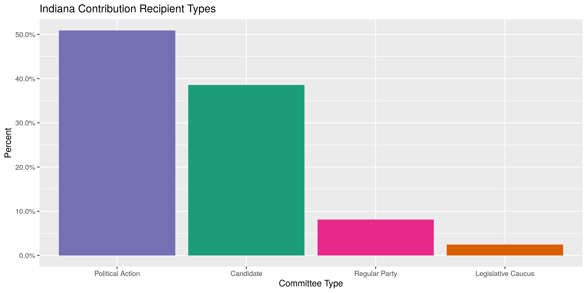
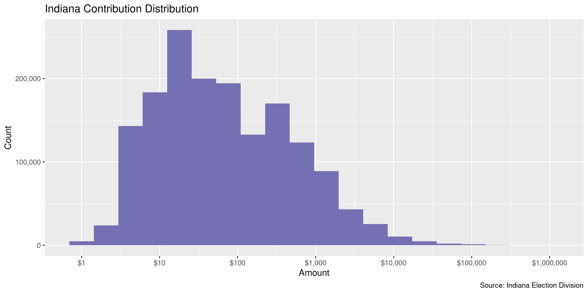
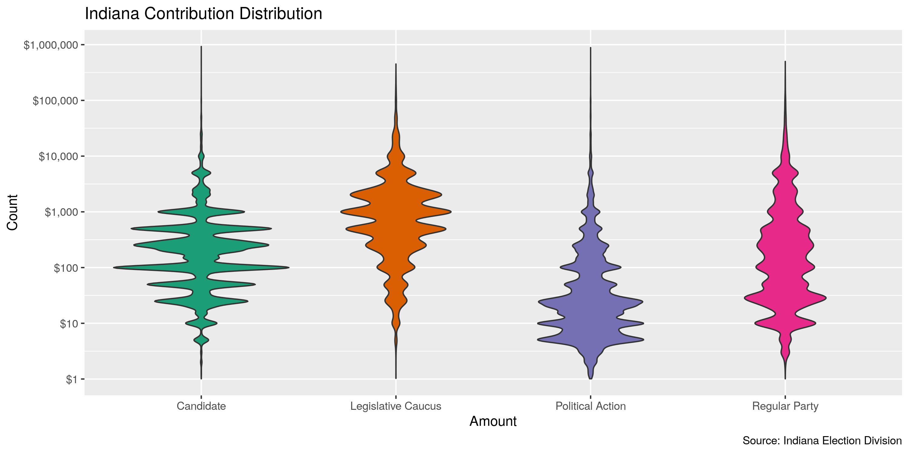
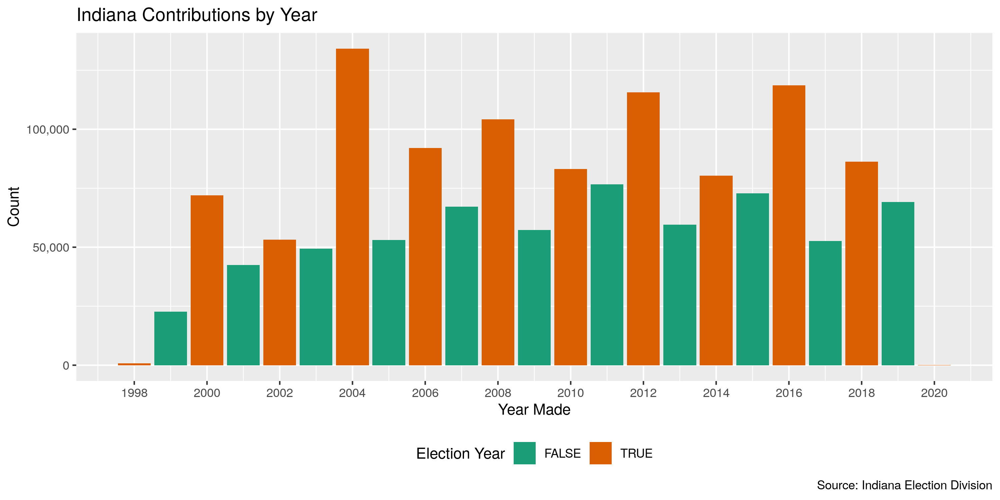
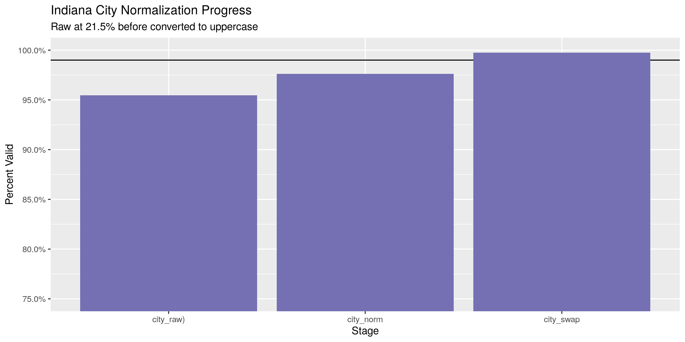
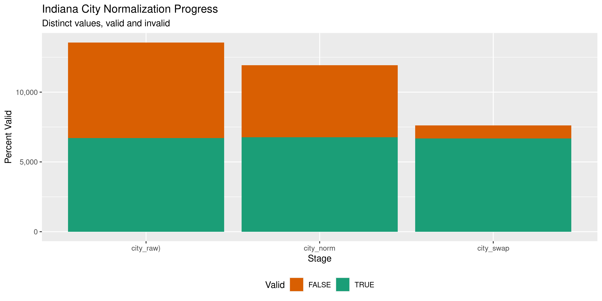

Indiana Contributions
================
Kiernan Nicholls
2020-02-05 13:10:34

  - [Project](#project)
  - [Objectives](#objectives)
  - [Packages](#packages)
  - [Data](#data)
  - [Import](#import)
  - [Explore](#explore)
  - [Wrangle](#wrangle)
  - [Conclude](#conclude)
  - [Export](#export)

<!-- Place comments regarding knitting here -->

## Project

The Accountability Project is an effort to cut across data silos and
give journalists, policy professionals, activists, and the public at
large a simple way to search across huge volumes of public data about
people and organizations.

Our goal is to standardizing public data on a few key fields by thinking
of each dataset row as a transaction. For each transaction there should
be (at least) 3 variables:

1.  All **parties** to a transaction.
2.  The **date** of the transaction.
3.  The **amount** of money involved.

## Objectives

This document describes the process used to complete the following
objectives:

1.  How many records are in the database?
2.  Check for entirely duplicated records.
3.  Check ranges of continuous variables.
4.  Is there anything blank or missing?
5.  Check for consistency issues.
6.  Create a five-digit ZIP Code called `zip`.
7.  Create a `year` field from the transaction date.
8.  Make sure there is data on both parties to a transaction.

## Packages

The following packages are needed to collect, manipulate, visualize,
analyze, and communicate these results. The `pacman` package will
facilitate their installation and attachment.

The IRW’s `campfin` package will also have to be installed from GitHub.
This package contains functions custom made to help facilitate the
processing of campaign finance data.

``` r
if (!require("pacman")) install.packages("pacman")
pacman::p_load_gh("irworkshop/campfin")
pacman::p_load(
  tidyverse, # data manipulation
  lubridate, # datetime strings
  magrittr, # pipe operators
  gluedown, # print markdown
  janitor, # dataframe clean
  refinr, # cluster and merge
  scales, # format strings
  rvest, # read html pages
  knitr, # knit documents
  vroom, # read files fast
  glue, # combine strings
  here, # relative storage
  fs # search storage 
)
```

This document should be run as part of the `R_campfin` project, which
lives as a sub-directory of the more general, language-agnostic
[`irworkshop/accountability_datacleaning`](https://github.com/irworkshop/accountability_datacleaning)
GitHub repository.

The `R_campfin` project uses the [RStudio
projects](https://support.rstudio.com/hc/en-us/articles/200526207-Using-Projects)
feature and should be run as such. The project also uses the dynamic
`here::here()` tool for file paths relative to *your* machine.

``` r
# where does this document knit?
here::here()
#> [1] "/home/kiernan/Code/accountability_datacleaning/R_campfin"
```

## Data

Data is obtained from the [Indiana Election
Division](https://campaignfinance.in.gov/PublicSite/Homepage.aspx).

> ##### What is the quality of the data?
> 
> The information presented in the campaign finance database is, to the
> best of our ability, an accurate representation of the reports filed
> with the Election Division. This information is being provided as a
> service to the public, has been processed by the Election Division and
> should be cross-referenced with the original report on file with the
> Election Division.
> 
> Some of the information in the campaign finance database was submitted
> in electronic form. Most of the information was key-entered from paper
> reports. Sometimes items which are inconsistent with filing
> requirements, such as incorrect codes or incorrectly formatted or
> blank items, are present in the results of a query. They are incorrect
> or missing in the database because they were incorrect or missing on
> the reports submitted to the Election Division. For some incorrect or
> missing data in campaign finance reports, the Election Division has
> requested that the filer supply an amended report. The campaign
> finance database will be updated to reflect amendments received.

> ##### What does the database contain?
> 
> By Indiana law, candidates and committees are required to disclose
> detailed financial records of contributions received and expenditures
> made and debts owed by or to the committee. For committees, the
> campaign finance database contains all contributions, expenditures,
> and debts reported to the Election Division since January 1, 1998.

## Import

The IED provides annuel files for both campaign contributions and
expenditures.

> This page provides comma separated value (CSV) downloads of
> contribution and expenditure data for each reporting year in a zipped
> file format. These files can be downloaded and imported into other
> applications (Microsoft Excel, Microsoft Access, etc.).
> 
> This data was extracted from the Campaign Finance database as it
> existed as of 2/4/2020 1:00 AM.

### Download

We can read the [IED download
page](https://campaignfinance.in.gov/PublicSite/Reporting/DataDownload.aspx)
to get the list of URLs to each file.

``` r
raw_dir <- dir_create(here("in", "contribs", "data", "raw"))
```

``` r
aspx <- "https://campaignfinance.in.gov/PublicSite/Reporting/DataDownload.aspx"
raw_urls <- aspx %>% 
  read_html() %>% 
  html_node("#_ctl0_Content_dlstDownloadFiles") %>% 
  html_nodes("a") %>% 
  html_attr("href") %>% 
  str_subset("Contribution") %>% 
  str_replace("\\\\", "/")

md_bullet(raw_urls)
```

  - <https://campaignfinance.in.gov/PublicSite/Docs/BulkDataDownloads/2000_ContributionData.csv.zip>
  - <https://campaignfinance.in.gov/PublicSite/Docs/BulkDataDownloads/2001_ContributionData.csv.zip>
  - <https://campaignfinance.in.gov/PublicSite/Docs/BulkDataDownloads/2002_ContributionData.csv.zip>
  - <https://campaignfinance.in.gov/PublicSite/Docs/BulkDataDownloads/2003_ContributionData.csv.zip>
  - <https://campaignfinance.in.gov/PublicSite/Docs/BulkDataDownloads/2004_ContributionData.csv.zip>
  - <https://campaignfinance.in.gov/PublicSite/Docs/BulkDataDownloads/2005_ContributionData.csv.zip>
  - <https://campaignfinance.in.gov/PublicSite/Docs/BulkDataDownloads/2006_ContributionData.csv.zip>
  - <https://campaignfinance.in.gov/PublicSite/Docs/BulkDataDownloads/2007_ContributionData.csv.zip>
  - <https://campaignfinance.in.gov/PublicSite/Docs/BulkDataDownloads/2008_ContributionData.csv.zip>
  - <https://campaignfinance.in.gov/PublicSite/Docs/BulkDataDownloads/2009_ContributionData.csv.zip>
  - <https://campaignfinance.in.gov/PublicSite/Docs/BulkDataDownloads/2010_ContributionData.csv.zip>
  - <https://campaignfinance.in.gov/PublicSite/Docs/BulkDataDownloads/2011_ContributionData.csv.zip>
  - <https://campaignfinance.in.gov/PublicSite/Docs/BulkDataDownloads/2012_ContributionData.csv.zip>
  - <https://campaignfinance.in.gov/PublicSite/Docs/BulkDataDownloads/2013_ContributionData.csv.zip>
  - <https://campaignfinance.in.gov/PublicSite/Docs/BulkDataDownloads/2014_ContributionData.csv.zip>
  - <https://campaignfinance.in.gov/PublicSite/Docs/BulkDataDownloads/2015_ContributionData.csv.zip>
  - <https://campaignfinance.in.gov/PublicSite/Docs/BulkDataDownloads/2016_ContributionData.csv.zip>
  - <https://campaignfinance.in.gov/PublicSite/Docs/BulkDataDownloads/2017_ContributionData.csv.zip>
  - <https://campaignfinance.in.gov/PublicSite/Docs/BulkDataDownloads/2018_ContributionData.csv.zip>
  - <https://campaignfinance.in.gov/PublicSite/Docs/BulkDataDownloads/2019_ContributionData.csv.zip>
  - <https://campaignfinance.in.gov/PublicSite/Docs/BulkDataDownloads/2020_ContributionData.csv.zip>

We can download each of these files to the raw directory.

``` r
raw_paths <- path(raw_dir, basename(raw_urls))
if (!all(this_file_new(raw_paths))) {
  download.file(raw_urls, raw_paths, method = "libcurl")
}
```

Then, we will unzip each file and delete the original.

``` r
if (length(dir_ls(raw_dir, regexp = ".csv$")) == 0) {
  raw_paths <- as_fs_path(map_chr(raw_paths, unzip, exdir = raw_dir))
} else {
  raw_paths <- dir_ls(raw_dir, regexp = ".csv$")
}
```

### Read

There are two problems with each of these files: 1. When the second line
of an address was entered, a `\n` newline character was enteted between
the two lines *within the same field*. The fields are surrounded in
double-quotes, but when reading the files these newlines mess things up.
2. Whenever a string itself contains `"` double-quotes, the first
occurance is registered as the end of the field itself, which begun with
a `"`.

To fix these issues, we will read each file as a single character string
and use regular expressions to find and replace these errant `\n` and
`"` characters. We will then write the edited strings to a new file.

``` r
fix_dir <- dir_create(here("in", "contribs", "data", "fix"))
if (!any(file_exists(dir_ls(fix_dir)))) {
  for (file in raw_paths) {
    read_file(file) %>% 
      # find newlines not at end of line
      str_replace_all("(?<!\"(\r|1|0)\")\n(?!\"\\d{1,10}\")", " ") %>%
      # find quotes not at end of field
      str_replace_all("(?<!(\n|^|,))\"(?!(,(?=\"))|$|\r)", "\'") %>% 
      str_trim(side = "both") %>% 
      # save to disk
      write_file(path = path(fix_dir, basename(file)))
    gc()
  }
}
fix_paths <- dir_ls(fix_dir)
```

These fixed files can be read into a single data frame with
`purrr::map_df()` and `readr::read_delim()`.

``` r
inc <- map_df(
  fix_paths,
  read_delim,
  delim = ",",
  quote = "\"",
  na = c("", "n/a", "NA", "N/A"),
  escape_backslash = FALSE,
  escape_double = FALSE,
  col_types = cols(
    .default = col_character(),
    FileNumber = col_integer(),
    Amount = col_double(),
    ContributionDate = col_datetime(),
    Amended = col_logical()
  )
)
```

``` r
inc <- inc %>% 
  clean_names("snake") %>% 
  rename(
    file = file_number,
    type = contributor_type,
    date = contribution_date,
    method = type
  )
```

## Explore

``` r
head(inc)
#> # A tibble: 6 x 17
#>    file committee_type committee candidate_name type  name  address city  state zip   occupation
#>   <int> <chr>          <chr>     <chr>          <chr> <chr> <chr>   <chr> <chr> <chr> <chr>     
#> 1    17 Regular Party  Indiana … <NA>           Borr… Sue … <NA>    <NA>  <NA>  <NA>  <NA>      
#> 2    17 Regular Party  Indiana … <NA>           Borr… Sue … 200 So… Indi… IN    46227 <NA>      
#> 3    17 Regular Party  Indiana … <NA>           Corp… 4 Ma… 9800 C… Indi… IN    46256 <NA>      
#> 4    17 Regular Party  Indiana … <NA>           Corp… Accr… 118 Ko… LaPo… IN    46350 <NA>      
#> 5    17 Regular Party  Indiana … <NA>           Corp… Accu… Mr. Jo… LaPo… IN    46350 <NA>      
#> 6    17 Regular Party  Indiana … <NA>           Corp… Ad-V… 712 11… Lawr… IL    62439 <NA>      
#> # … with 6 more variables: method <chr>, description <chr>, amount <dbl>, date <dttm>,
#> #   received_by <chr>, amended <lgl>
tail(inc)
#> # A tibble: 6 x 17
#>    file committee_type committee candidate_name type  name  address city  state zip   occupation
#>   <int> <chr>          <chr>     <chr>          <chr> <chr> <chr>   <chr> <chr> <chr> <chr>     
#> 1  7329 Candidate      Friends … Ian Russell G… Indi… Bria… 1519 w… Prin… IN    4760  <NA>      
#> 2  7329 Candidate      Friends … Ian Russell G… Indi… Ian … 1201 E… Prin… IN    47670 Teacher/E…
#> 3  7329 Candidate      Friends … Ian Russell G… Indi… Ian … 1201 E… Prin… IN    47670 Teacher/E…
#> 4  7329 Candidate      Friends … Ian Russell G… Indi… Ian … 1201 E… Prin… IN    47670 Teacher/E…
#> 5  7329 Candidate      Friends … Ian Russell G… Indi… Ian … 1201 E… Prin… IN    47670 Teacher/E…
#> 6  7329 Candidate      Friends … Ian Russell G… Indi… Jaco… 412 w … Prin… IN    47670 <NA>      
#> # … with 6 more variables: method <chr>, description <chr>, amount <dbl>, date <dttm>,
#> #   received_by <chr>, amended <lgl>
glimpse(sample_n(inc, 20))
#> Observations: 20
#> Variables: 17
#> $ file           <int> 439, 363, 3222, 7054, 4697, 396, 374, 4960, 3970, 790, 1772, 4019, 5429, …
#> $ committee_type <chr> "Regular Party", "Regular Party", "Political Action", "Candidate", "Polit…
#> $ committee      <chr> "Marion County Republican Central Committee", "Marion County Democratic C…
#> $ candidate_name <chr> NA, NA, NA, "Amie Lynne Neiling", NA, NA, NA, "Mitchell Elias Daniels, Jr…
#> $ type           <chr> "Individual", "Individual", "Individual", "Individual", "Individual", "In…
#> $ name           <chr> "Bryan J. Collins", "Russell L. Brown", "Dale C Adams", "Mary Lynda Child…
#> $ address        <chr> "6150 Autumn Ln", "6637 Meadowgreen Dr", "1017 Sunflower Trail", "498 Kno…
#> $ city           <chr> "Indianapolis", "Indianapolis", "Orlando", "Evans", "Zionsville", "Indian…
#> $ state          <chr> "IN", "IN", "Fl", "GA", "IN", "IN", "IN", "IN", "IN", "IN", "IN", "IN", "…
#> $ zip            <chr> "46220", "46236-8004", "32828", "30809", "46077", "46226", "46814", "4681…
#> $ occupation     <chr> NA, NA, NA, "Not Currently Employed", NA, NA, "Other", NA, NA, "Science/T…
#> $ method         <chr> "Direct", "Direct", "Direct", "Direct", "Direct", "Direct", "Direct", "Di…
#> $ description    <chr> NA, NA, NA, NA, NA, NA, NA, NA, NA, NA, NA, NA, NA, NA, NA, NA, NA, NA, N…
#> $ amount         <dbl> 250.0, 10.0, 20.0, 10.0, 60.0, 250.0, 1000.0, 10.0, 100.0, 15.0, 36.0, 5.…
#> $ date           <dttm> 2001-05-31, 2009-03-26, 2008-02-26, 2018-07-16, 2001-12-27, 2017-08-28, …
#> $ received_by    <chr> "Buell", "Leslie Barnes", "Bruce McDivitt", "Amie Lynne Neiling", "S. Sho…
#> $ amended        <lgl> FALSE, FALSE, FALSE, FALSE, FALSE, FALSE, FALSE, FALSE, FALSE, FALSE, FAL…
```

### Missing

``` r
col_stats(inc, count_na)
#> # A tibble: 17 x 4
#>    col            class        n         p
#>    <chr>          <chr>    <int>     <dbl>
#>  1 file           <int>        0 0        
#>  2 committee_type <chr>        0 0        
#>  3 committee      <chr>       33 0.0000211
#>  4 candidate_name <chr>   962859 0.614    
#>  5 type           <chr>    17342 0.0111   
#>  6 name           <chr>    17644 0.0113   
#>  7 address        <chr>    44350 0.0283   
#>  8 city           <chr>    40100 0.0256   
#>  9 state          <chr>    35839 0.0229   
#> 10 zip            <chr>    51335 0.0328   
#> 11 occupation     <chr>  1294427 0.826    
#> 12 method         <chr>        0 0        
#> 13 description    <chr>  1521771 0.971    
#> 14 amount         <dbl>        0 0        
#> 15 date           <dttm>    4154 0.00265  
#> 16 received_by    <chr>   102507 0.0654   
#> 17 amended        <lgl>        0 0
```

``` r
inc <- inc %>% flag_na(committee, name, amount, date)
mean(inc$na_flag)
#> [1] 0.01384448
```

### Duplicates

``` r
inc <- flag_dupes(inc, everything())
mean(inc$dupe_flag)
#> [1] 0.004561231
```

### Categorical

``` r
col_stats(inc, n_distinct)
#> # A tibble: 19 x 4
#>    col            class       n          p
#>    <chr>          <chr>   <int>      <dbl>
#>  1 file           <int>    2702 0.00172   
#>  2 committee_type <chr>       4 0.00000255
#>  3 committee      <chr>    4262 0.00272   
#>  4 candidate_name <chr>    1762 0.00112   
#>  5 type           <chr>      13 0.00000829
#>  6 name           <chr>  420065 0.268     
#>  7 address        <chr>  404270 0.258     
#>  8 city           <chr>   17757 0.0113    
#>  9 state          <chr>     284 0.000181  
#> 10 zip            <chr>   38859 0.0248    
#> 11 occupation     <chr>      33 0.0000211 
#> 12 method         <chr>      11 0.00000702
#> 13 description    <chr>    9992 0.00638   
#> 14 amount         <dbl>   45701 0.0292    
#> 15 date           <dttm>   9676 0.00617   
#> 16 received_by    <chr>    7698 0.00491   
#> 17 amended        <lgl>       2 0.00000128
#> 18 na_flag        <lgl>       2 0.00000128
#> 19 dupe_flag      <lgl>       2 0.00000128
```

<!-- -->

<!-- -->

<!-- -->

### Continuous

#### Amounts

``` r
summary(inc$amount)
#>      Min.   1st Qu.    Median      Mean   3rd Qu.      Max. 
#> -12301513        15        50       718       250  55452555
mean(inc$amount <= 0)
#> [1] 0.009021655
```

<!-- -->

<!-- -->

#### Dates

``` r
inc <- mutate(
  .data = inc,
  date = as_date(date),
  year = year(date),
  year = case_when(
    year < 1998 ~ 1998,
    year > 2020 ~ 2020,
    year %>% between(1998, 2020) ~ year
  )
)
```

``` r
inc %>% 
  count(year) %>% 
  mutate(even = is_even(year)) %>% 
  ggplot(aes(x = year, y = n)) +
  geom_col(aes(fill = even)) + 
  scale_fill_brewer(palette = "Dark2") +
  scale_y_continuous(labels = comma) +
  scale_x_continuous(breaks = seq(1998, 2020, by = 2)) +
  theme(legend.position = "bottom") +
  labs(
    title = "Indiana Contributions by Year",
    caption = "Source: Indiana Election Division",
    fill = "Election Year",
    x = "Year Made",
    y = "Count"
  )
```

<!-- -->

## Wrangle

To improve the searchability of the database, we will perform some
consistent, confident string normalization. For geographic variables
like city names and ZIP codes, the corresponding `campfin::normal_*()`
functions are taylor made to facilitate this process.

### Address

For the street `addresss` variable, the `campfin::normal_address()`
function will force consistence case, remove punctuation, and
abbreviation official USPS suffixes.

``` r
inc <- inc %>%
  mutate(
    address_norm = normal_address(
      address = address,
      abbs = usps_street,
      na_rep = TRUE
    )
  )
```

We can see how this process improved consistency.

``` r
inc %>% 
  select(contains("address")) %>% 
  distinct() %>% 
  sample_n(10)
#> # A tibble: 10 x 2
#>    address                             address_norm                    
#>    <chr>                               <chr>                           
#>  1 7014 Shay Ct                        7014 SHAY CT                    
#>  2 3420 LAWRENCE BANER RD              3420 LAWRENCE BANER RD          
#>  3 510 Paris Drive                     510 PARIS DR                    
#>  4 8542 N. Harper Road                 8542 N HARPER RD                
#>  5 327 CAROLYN COURT                   327 CAROLYN CT                  
#>  6 600 E 96th St #585                  600 E 96 TH ST 585              
#>  7 2562 W MAYBELLE AVENUE              2562 W MAYBELLE AVE             
#>  8 1275 Pennsylvania Ave., NW Suite700 1275 PENNSYLVANIA AVE NW STE 700
#>  9 607 Glade Place                     607 GLADE PLACE                 
#> 10 4444 Knolltop Dr                    4444 KNOLLTOP DR
```

### ZIP

For ZIP codes, the `campfin::normal_zip()` function will attempt to
create valied *five* digit codes by removing the ZIP+4 suffix and
returning leading zeroes dropped by other programs like Microsoft Excel.

``` r
inc <- inc %>% 
  mutate(
    zip_norm = normal_zip(
      zip = zip,
      na_rep = TRUE
    )
  )
```

``` r
progress_table(
  inc$zip,
  inc$zip_norm,
  compare = valid_zip
)
#> # A tibble: 2 x 6
#>   stage    prop_in n_distinct prop_na  n_out n_diff
#>   <chr>      <dbl>      <dbl>   <dbl>  <dbl>  <dbl>
#> 1 zip        0.915      38859  0.0328 129256  26037
#> 2 zip_norm   0.997      14997  0.0342   4947   1513
```

### State

Valid two digit state abbreviations can be made using the
`campfin::normal_state()` function.

``` r
inc <- inc %>% 
  mutate(
    state_norm = normal_state(
      state = state,
      abbreviate = TRUE,
      na_rep = TRUE,
      valid = NULL
    )
  )
```

``` r
inc %>% 
  filter(state != state_norm) %>% 
  count(state, state_norm, sort = TRUE)
#> # A tibble: 123 x 3
#>    state state_norm     n
#>    <chr> <chr>      <int>
#>  1 In    IN          3721
#>  2 Un    UN           886
#>  3 in    IN           500
#>  4 D.    D            111
#>  5 Va    VA           102
#>  6 Oh    OH            91
#>  7 Il    IL            85
#>  8 Ky    KY            53
#>  9 Fl    FL            43
#> 10 iN    IN            33
#> # … with 113 more rows
```

We can further improve these values by checking the state abbreviation
against the *expected* abbreviation for that record’s `zip_norm`
variable. If the invalid abbreviation is only 1 letter off the expected
value, we can confidently repair these typos.

``` r
inc <- inc %>% 
  left_join(
    y = select(zipcodes, -city), 
    by = c("zip_norm" = "zip"),
    suffix = c("_raw", "_match")
  ) %>% 
  mutate(
    match_dist = str_dist(state_raw, state_match),
    state_norm = if_else(
      condition = !is.na(state_match) & match_dist == 1,
      true = state_match,
      false = state_norm
    )
  ) %>% 
  rename(state = state_raw)

inc %>% 
  filter(match_dist == 1) %>% 
  count(state, state_norm, sort = TRUE)
#> # A tibble: 213 x 3
#>    state state_norm     n
#>    <chr> <chr>      <int>
#>  1 In    IN          3633
#>  2 IN    IL          1136
#>  3 IL    IN           150
#>  4 IN    TN           131
#>  5 D.    DC           107
#>  6 Oh    OH            90
#>  7 Il    IL            83
#>  8 Ky    KY            52
#>  9 NY    NJ            52
#> 10 Fl    FL            42
#> # … with 203 more rows
```

``` r
progress_table(
  inc$state,
  inc$state_norm,
  compare = valid_state
)
#> # A tibble: 2 x 6
#>   stage      prop_in n_distinct prop_na n_out n_diff
#>   <chr>        <dbl>      <dbl>   <dbl> <dbl>  <dbl>
#> 1 state        0.996        284  0.0229  6622    226
#> 2 state_norm   0.999        138  0.0229  1189     82
```

### City

Cities are the most difficult geographic variable to normalize, simply
due to the wide variety of valid cities and formats. The
`campfin::normal_city()` function is a good start, again converting
case, removing punctuation, but *expanding* USPS abbreviations. We can
also remove `invalid_city` values.

``` r
inc <- inc %>% 
  mutate(
    city_norm = normal_city(
      city = city, 
      abbs = usps_city,
      states = c("IN", "DC", "INDIANA"),
      na = invalid_city,
      na_rep = TRUE
    )
  )
```

Again, we can further improve normalization by comparing our normalized
value agaist the *expected* value for that record’s state abbreviation
and ZIP code. If the normalized value is either an abbreviation for or
very similar to the expected value, we can confidently swap those two.

``` r
inc <- inc %>% 
  rename(city_raw = city) %>% 
  left_join(
    y = zipcodes,
    by = c(
      "state_norm" = "state",
      "zip_norm" = "zip"
    )
  ) %>% 
  rename(city_match = city) %>% 
  mutate(
    match_abb = is_abbrev(city_norm, city_match),
    match_dist = str_dist(city_norm, city_match),
    city_swap = if_else(
      condition = !is.na(city_match) & match_abb | match_dist <= 2,
      true = city_match,
      false = city_norm
    )
  ) %>% 
  select(
    -city_match,
    -match_dist,
    -match_abb
  )
```

``` r
many_city <- c(valid_city, extra_city)
inc %>% 
  count(city_swap, state_norm, sort = TRUE) %>% 
  filter(!is.na(city_swap), city_swap %out% many_city)
#> # A tibble: 921 x 3
#>    city_swap        state_norm     n
#>    <chr>            <chr>      <int>
#>  1 INDY             IN          1193
#>  2 ABBOTT PARKS     IL           636
#>  3 DEER PARKS       IL           228
#>  4 OVERLAND PARKS   KS           193
#>  5 FARMINGTON HILLS MI           112
#>  6 INDIANAPOLIS IN  IN            69
#>  7 INDPLS           IN            69
#>  8 COLLEGE PARKS    GA            62
#>  9 SHELBY TOWNSHIP  MI            60
#> 10 WAUSATOSA        WI            57
#> # … with 911 more rows
```

``` r
inc <- inc %>% 
  mutate(
    city_swap = city_swap %>% 
      str_replace("^INDY$", "INDIANAPOLIS") %>% 
      str_replace("^INDPLS$", "INDIANAPOLIS") %>% 
      str_replace("^ABBOTT PARKS$", "ABBOTT PARK") %>% 
      str_replace("^OVERLAND PARKS$", "OVERLAND PARK") %>% 
      str_remove("\\sIN$")
  )
```

| stage      | prop\_in | n\_distinct | prop\_na | n\_out | n\_diff |
| :--------- | -------: | ----------: | -------: | -----: | ------: |
| city\_raw) |    0.955 |       12943 |    0.026 |  69418 |    6642 |
| city\_norm |    0.976 |       11346 |    0.029 |  36242 |    5087 |
| city\_swap |    0.998 |        7167 |    0.041 |   3614 |     897 |

You can see how the percentage of valid values increased with each
stage.

<!-- -->

More importantly, the number of distinct values decreased each stage. We
were able to confidently change many distinct invalid values to their
valid equivalent.

``` r
progress %>% 
  select(
    stage, 
    all = n_distinct,
    bad = n_diff
  ) %>% 
  mutate(good = all - bad) %>% 
  pivot_longer(c("good", "bad")) %>% 
  mutate(name = name == "good") %>% 
  ggplot(aes(x = stage, y = value)) +
  geom_col(aes(fill = name)) +
  scale_fill_brewer(palette = "Dark2", direction = -1) +
  scale_y_continuous(labels = comma) +
  theme(legend.position = "bottom") +
  labs(
    title = "Indiana City Normalization Progress",
    subtitle = "Distinct values, valid and invalid",
    x = "Stage",
    y = "Percent Valid",
    fill = "Valid"
  )
```

<!-- -->

## Conclude

``` r
glimpse(sample_n(inc, 20))
#> Observations: 20
#> Variables: 25
#> $ file           <int> 866, 5001, 4376, 1312, 3447, 26, 790, 116, 3268, 4479, 3450, 1772, 1772, …
#> $ committee_type <chr> "Political Action", "Political Action", "Candidate", "Political Action", …
#> $ committee      <chr> "INDIANA MORTGAGE BANKERS POLITICAL ACTION COMMITTEE", "COCA-COLA ENTERPR…
#> $ candidate_name <chr> NA, NA, "Peggy McDaniel Welch", NA, NA, NA, NA, NA, NA, NA, NA, NA, NA, N…
#> $ type           <chr> "Corporation", "Individual", "Corporation", "Individual", "Individual", "…
#> $ name           <chr> "Regions Bank", "CARL LEE", "Humana", "Huy NGUYEN", "Michael Curtis", "Sa…
#> $ address        <chr> "One Indiana Square", "P O BOX 701447", "P. O. Box 1438", "1307 W Pinecre…
#> $ city_raw       <chr> "Indianapolis", "SAN ANTONIO", "Louisville", "Peoria", "Seattle", "Bloomi…
#> $ state          <chr> "IN", "TX", "KY", "IL", "WA", "IN", "KY", "IN", "IN", "IN", NA, "IN", "KY…
#> $ zip            <chr> "46204", "78270", "40201-1438", "61614", "98134", "47403", "40220", "4620…
#> $ occupation     <chr> NA, NA, NA, NA, NA, NA, NA, NA, NA, NA, NA, "Manufacturing", "Manufacturi…
#> $ method         <chr> "Direct", "Direct", "Direct", "Direct", "Direct", "Direct", "Direct", "Mi…
#> $ description    <chr> NA, NA, NA, NA, NA, NA, NA, NA, NA, NA, NA, NA, NA, NA, NA, NA, NA, NA, N…
#> $ amount         <dbl> 100.00, 10.00, 250.00, 10.00, 25.00, 50.00, 25.00, 3000.00, 65.00, 23.08,…
#> $ date           <date> 2015-01-07, 2006-12-20, 2001-12-31, 2003-11-25, 2012-12-18, 2006-06-03, …
#> $ received_by    <chr> "Gary Avery", "GENE RACKLEY", "Helga Gustin", "Gary Vest", NA, "IDP", "Mi…
#> $ amended        <lgl> FALSE, FALSE, FALSE, FALSE, FALSE, FALSE, FALSE, FALSE, FALSE, FALSE, FAL…
#> $ na_flag        <lgl> FALSE, FALSE, FALSE, FALSE, FALSE, FALSE, FALSE, FALSE, FALSE, FALSE, FAL…
#> $ dupe_flag      <lgl> FALSE, FALSE, FALSE, FALSE, FALSE, FALSE, FALSE, FALSE, FALSE, FALSE, FAL…
#> $ year           <dbl> 2015, 2006, 2001, 2003, 2012, 2006, 2013, 2008, 2014, 2014, 2006, 2017, 2…
#> $ address_norm   <chr> "ONE INDIANA SQ", "PO BOX 701447", "PO BOX 1438", "1307 W PINECREST DR", …
#> $ zip_norm       <chr> "46204", "78270", "40201", "61614", "98134", "47403", "40220", "46204", "…
#> $ state_norm     <chr> "IN", "TX", "KY", "IL", "WA", "IN", "KY", "IN", "IN", "IN", NA, "IN", "KY…
#> $ city_norm      <chr> "INDIANAPOLIS", "SAN ANTONIO", "LOUISVILLE", "PEORIA", "SEATTLE", "BLOOMI…
#> $ city_swap      <chr> "INDIANAPOLIS", "SAN ANTONIO", "LOUISVILLE", "PEORIA", "SEATTLE", "BLOOMI…
```

1.  There are 1,567,340 records in the database.
2.  There are 7,149 duplicate records in the database (0.46%).
3.  The range and distribution of `amount` and `date` seem reasonable.
4.  There are 21,699 records missing a contributor or recipient name,
    date, or amount (1.38%).
5.  Consistency in goegraphic data has been improved with
    `campfin::normal_*()`.
6.  The 4-digit `year` variable has been created with
    `lubridate::year()`.

## Export

``` r
clean_dir <- dir_create(here("in", "contribs", "data", "clean"))
```

``` r
inc <- inc %>% 
  select(
    -city_norm,
    city_norm = city_swap
  ) %>% 
  rename_all(~str_replace(., "_norm", "_clean"))

write_csv(
  x = inc,
  path = path(clean_dir, "in_contribs_clean.csv"),
  na = ""
)
```
