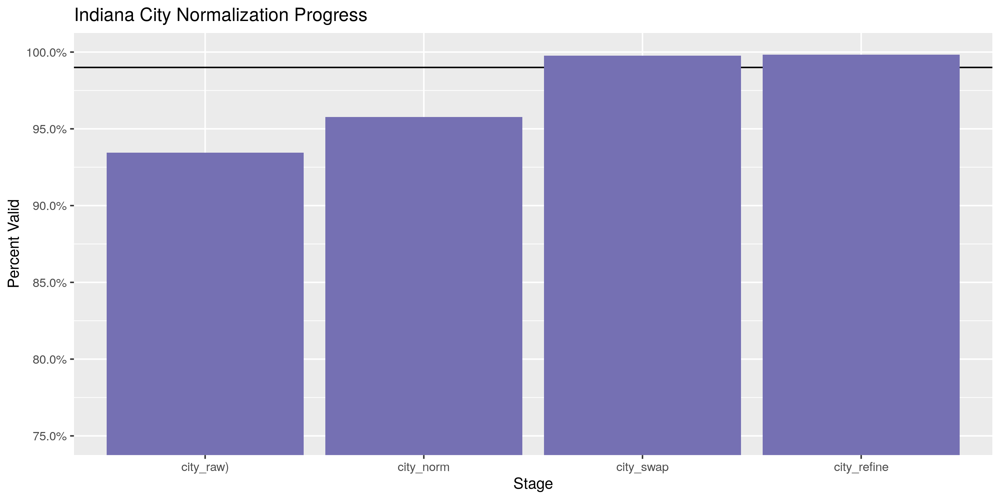

Indiana Expenditures
================
Kiernan Nicholls
2019-11-19 14:52:53

<!-- Place comments regarding knitting here -->

## Project

The Accountability Project is an effort to cut across data silos and
give journalists, policy professionals, activists, and the public at
large a simple way to search across huge volumes of public data about
people and organizations.

Our goal is to standardizing public data on a few key fields by thinking
of each dataset row as a transaction. For each transaction there should
be (at least) 3 variables:

1.  All **parties** to a transaction
2.  The **date** of the transaction
3.  The **amount** of money involved

## Objectives

This document describes the process used to complete the following
objectives:

1.  How many records are in the database?
2.  Check for duplicates
3.  Check ranges
4.  Is there anything blank or missing?
5.  Check for consistency issues
6.  Create a five-digit ZIP Code called `ZIP5`
7.  Create a `YEAR` field from the transaction date
8.  Make sure there is data on both parties to a transaction

## Packages

The following packages are needed to collect, manipulate, visualize,
analyze, and communicate these results. The `pacman` package will
facilitate their installation and attachment.

The IRW’s `campfin` package will also have to be installed from GitHub.
This package contains functions custom made to help facilitate the
processing of campaign finance data.

``` r
if (!require("pacman")) install.packages("pacman")
pacman::p_load_gh("irworkshop/campfin")
pacman::p_load(
  tidyverse, # data manipulation
  lubridate, # datetime strings
  tidytext, # text analysis
  magrittr, # pipe opperators
  janitor, # dataframe clean
  refinr, # cluster and merge
  scales, # format strings
  rvest, # scrape html pages
  knitr, # knit documents
  vroom, # read files fast
  glue, # combine strings
  here, # relative storage
  fs # search storage 
)
```

This document should be run as part of the `R_campfin` project, which
lives as a sub-directory of the more general, language-agnostic
[`irworkshop/accountability_datacleaning`](https://github.com/irworkshop/accountability_datacleaning "TAP repo")
GitHub repository.

The `R_campfin` project uses the [RStudio
projects](https://support.rstudio.com/hc/en-us/articles/200526207-Using-Projects "Rproj")
feature and should be run as such. The project also uses the dynamic
`here::here()` tool for file paths relative to *your* machine.

``` r
# where dfs this document knit?
here::here()
#> [1] "/home/kiernan/R/accountability_datacleaning/R_campfin"
```

## Data

Data is obtained from the [Indiana Election
Division](http://campaignfinance.in.gov/PublicSite/Homepage.aspx) (IED).
Their data can be downloaded as anual files on their [data download
page](http://campaignfinance.in.gov/PublicSite/Reporting/DataDownload.aspx).

> The campaign finance database contains detailed financial records that
> campaigns and committees are required by law to disclose. Through this
> database, you can view contribution and expense records from
> candidate, PAC, regular party, legislative caucus, and exploratory
> committees. You can select specific reports based on the candidate,
> office, party, caucus, or PAC name or keyword. You can also search
> across one or more finance reports according to specific criteria that
> you choose. You can review the results on screen, print them, or
> extract the information for further analysis.

The IDE provides [some background
information](http://campaignfinance.in.gov/PublicSite/AboutDatabase.aspx)
on their campaign finance database.

> ### What is the quality of the data?
> 
> The information presented in the campaign finance database is, to the
> best of our ability, an accurate representation of the reports filed
> with the Election Division. This information is being provided as a
> service to the public, has been processed by the Election Division and
> should be cross-referenced with the original report on file with the
> Election Division.
> 
> Some of the information in the campaign finance database was submitted
> in electronic form. Most of the information was key-entered from paper
> reports. Sometimes items which are inconsistent with filing
> requirements, such as incorrect codes or incorrectly formatted or
> blank items, are present in the results of a query. They are incorrect
> or missing in the database because they were incorrect or missing on
> the reports submitted to the Election Division. For some incorrect or
> missing data in campaign finance reports, the Election Division has
> requested that the filer supply an amended report. The campaign
> finance database will be updated to reflect amendments received.

> ### What does the database contain?
> 
> By Indiana law, candidates and committees are required to disclose
> detailed financial records of contributions received and expenditures
> made and debts owed by or to the committee. For committees, the
> campaign finance database contains all contributions, expenditures,
> and debts reported to the Election Division since January 1, 1998.

## Import

We can import each file into R as a single data frame to be explored,
wrangled, and exported as a single file to be indexed on the TAP
database.

### Download

``` r
raw_dir <- here("in", "expends", "data", "raw")
dir_create(raw_dir)
```

> This page provides comma separated value (CSV) downloads of
> contribution and expenditure data for each reporting year in a zipped
> file format. These files can be downloaded and imported into other
> applications (Microsoft Excel, Microsoft Access, etc.). This data was
> extracted from the Campaign Finance database as it existed as of
> 8/6/2019 1:00 AM.

The download URL to each file follows a consistent structure. We can
create a URL for each file by using `glue::glue()` to change the year in
the character
string.

``` r
base_url <- "http://campaignfinance.in.gov/PublicSite/Docs/BulkDataDownloads"
exp_urls <- glue("{base_url}/{2000:2019}_ExpenditureData.csv.zip")
```

The files range in size, which we can check before downloading with
`campfin::url_file_size()`.

``` r
file_sizes <- map_dbl(exp_urls, url_file_size)
number_bytes(sum(file_sizes))
#> [1] "14 MiB"
```

If the files haven’t yet been downloaded, we can download each to the
`/in/data/raw` subdirectory.

``` r
if (!all_files_new(raw_dir, "*.zip$")) {
  for (year_url in exp_urls) {
    year_file <- glue("{raw_dir}/{basename(year_url)}")
    download.file(
      url = year_url,
      destfile = year_file
    )
  }
}
```

### Read

We can read each file as a data frame into a list of data frames by
using `purrr::map_df()` and `readr::read_delim()`. We don’t need to
unzip the files.

``` r
ind <- map_df(
  .x = dir_ls(raw_dir, glob = "*.csv.zip$"),
  .f = read_delim,
  delim = ",",
  escape_backslash = FALSE,
  escape_double = FALSE,
  col_types = cols(
    .default = col_character(),
    Amount = col_double(),
    Expenditure_Date = col_date("%Y-%m-%d %H:%M:%S"),
    Amended = col_logical()
  )
) %>% clean_names("snake")
```

There were about a dozen parsing errors, so we will remove these rows by
using `dplyr::filter()` to remove any record with an invalid
`file_number` (typically numeric nominal values) or
`committee_type`/`expenditure_code` values (fixed categorical).

``` r
ind <- ind %>%
  filter(
    str_detect(file_number, "\\d+"),
    str_detect(committee_type, "^\\d+.\\d+$", negate = TRUE),
    expenditure_code %out% "Thomas Lewis Andrews"
  )
```

## Explore

``` r
head(ind)
#> # A tibble: 6 x 18
#>   file_number committee_type committee candidate_name expenditure_code name  address city  state
#>   <chr>       <chr>          <chr>     <chr>          <chr>            <chr> <chr>   <chr> <chr>
#> 1 17          Regular Party  Indiana … <NA>           Missing          <NA>  PO Box… Fort… IN   
#> 2 17          Regular Party  Indiana … <NA>           Missing          Acce… P.O. B… Char… IN   
#> 3 17          Regular Party  Indiana … <NA>           Missing          Acce… P.O. B… Char… NC   
#> 4 17          Regular Party  Indiana … <NA>           Missing          Acce… PO Box… Char… IN   
#> 5 17          Regular Party  Indiana … <NA>           Missing          Acce… PO Box… Char… IN   
#> 6 17          Regular Party  Indiana … <NA>           Missing          Acce… PO Box… Char… IN   
#> # … with 9 more variables: zip <chr>, occupation <chr>, office_sought <chr>,
#> #   expenditure_type <chr>, description <chr>, purpose <chr>, amount <dbl>,
#> #   expenditure_date <date>, amended <lgl>
tail(ind)
#> # A tibble: 6 x 18
#>   file_number committee_type committee candidate_name expenditure_code name  address city  state
#>   <chr>       <chr>          <chr>     <chr>          <chr>            <chr> <chr>   <chr> <chr>
#> 1 7262        Political Act… Citizens… <NA>           Advertising      Next… 26899 … Beav… MI   
#> 2 7262        Political Act… Citizens… <NA>           Fundraising      Ohlu… 7833 N… "LaP… IN   
#> 3 7262        Political Act… Citizens… <NA>           Operations       Faeg… 300 N … Indi… IN   
#> 4 7263        Political Act… Democrat… <NA>           Operations       Amal… 275 7t… New … NY   
#> 5 7263        Political Act… Democrat… <NA>           Operations       Demo… 1225 E… Wash… DC   
#> 6 7264        Political Act… Supporti… <NA>           Contributions    Fady… 8901 R… Indi… IN   
#> # … with 9 more variables: zip <chr>, occupation <chr>, office_sought <chr>,
#> #   expenditure_type <chr>, description <chr>, purpose <chr>, amount <dbl>,
#> #   expenditure_date <date>, amended <lgl>
glimpse(sample_frac(ind))
#> Observations: 591,205
#> Variables: 18
#> $ file_number      <chr> "4902", "4681", "3745", "3511", "17", "5138", "3598", "71", "5556", "26…
#> $ committee_type   <chr> "Candidate", "Regular Party", "Political Action", "Candidate", "Regular…
#> $ committee        <chr> "Hoosiers for Kelty", "Porter County Republican Central Committee", "IN…
#> $ candidate_name   <chr> "Matthew Gerard Kelty", NA, NA, "ROBERT BEHNING", NA, "Richard Allen Do…
#> $ expenditure_code <chr> "Contributions", "Operations", "Unitemized", "Operations", "Operations"…
#> $ name             <chr> "Whirlwind Pictures", "KLT Consulting, LLC", NA, "Avery Paper Co.", "CA…
#> $ address          <chr> "4930 Illinois Road", "306 Napoleon Street", NA, "1021 W. Pennsylvania"…
#> $ city             <chr> "Fort Wayne", "Valparaiso", NA, "Indianapolis", "Logansport", "Auburn",…
#> $ state            <chr> "IN", "IN", NA, "In", "IN", "IN", "IN", "IN", "IN", "IN", "IN", "IN", N…
#> $ zip              <chr> "46804", "46368", NA, "46204", "46947", "46706", "46818", "46804", "463…
#> $ occupation       <chr> NA, NA, NA, NA, NA, NA, NA, NA, NA, NA, NA, NA, NA, NA, "Other", NA, NA…
#> $ office_sought    <chr> NA, NA, NA, NA, NA, NA, NA, "State Senator", "Newton County Council", N…
#> $ expenditure_type <chr> "Direct - Contributions", "Direct - Operations", "Unitemized - Unitemiz…
#> $ description      <chr> NA, NA, NA, NA, NA, NA, NA, NA, NA, NA, NA, NA, NA, NA, NA, NA, NA, NA,…
#> $ purpose          <chr> NA, "congress of counties", NA, "Paper", NA, NA, "Expense reimb for pos…
#> $ amount           <dbl> 2000.00, 313.68, 3.00, 1285.05, 187.50, 68.12, 520.70, 500.00, 200.00, …
#> $ expenditure_date <date> 2002-11-08, 2018-01-19, 2019-09-03, 2014-04-25, 2005-07-21, 2010-04-28…
#> $ amended          <lgl> FALSE, FALSE, FALSE, FALSE, FALSE, FALSE, FALSE, FALSE, FALSE, FALSE, F…
```

### Missing

``` r
glimpse_fun(ind, count_na)
#> # A tibble: 18 x 4
#>    col              type        n          p
#>    <chr>            <chr>   <dbl>      <dbl>
#>  1 file_number      <chr>       0 0         
#>  2 committee_type   <chr>       0 0         
#>  3 committee        <chr>     152 0.000257  
#>  4 candidate_name   <chr>  334567 0.566     
#>  5 expenditure_code <chr>       0 0         
#>  6 name             <chr>    9678 0.0164    
#>  7 address          <chr>   51966 0.0879    
#>  8 city             <chr>   34455 0.0583    
#>  9 state            <chr>   33113 0.0560    
#> 10 zip              <chr>   53759 0.0909    
#> 11 occupation       <chr>  565166 0.956     
#> 12 office_sought    <chr>  462350 0.782     
#> 13 expenditure_type <chr>       3 0.00000507
#> 14 description      <chr>  591199 1.000     
#> 15 purpose          <chr>  272015 0.460     
#> 16 amount           <dbl>      21 0.0000355 
#> 17 expenditure_date <date>   1905 0.00322   
#> 18 amended          <lgl>      21 0.0000355
```

There are a fairly significant number of records missing one of the four
variables needed to fully identify a transaction (who, what, and when).
We will use `campfin::flag_na()` to flag them with `TRUE` values in the
new `na_flag` variable. Most of these records are missing the payee
`name` value.

``` r
ind <- ind %>% flag_na(committee, name, expenditure_date, amount)
sum(ind$na_flag)
#> [1] 11700
percent(mean(ind$na_flag))
#> [1] "2%"
```

### Duplicates

There are very few duplicate records in the database. They have `TRUE`
values in the new `dupe_flag` variable.

``` r
ind <- mutate(ind, dupe_flag = duplicated(ind))
sum(ind$dupe_flag)
#> [1] 1381
percent(mean(ind$dupe_flag))
#> [1] "0%"
```

### Categorical

``` r
glimpse_fun(ind, n_distinct)
#> # A tibble: 20 x 4
#>    col              type        n          p
#>    <chr>            <chr>   <dbl>      <dbl>
#>  1 file_number      <chr>    2681 0.00453   
#>  2 committee_type   <chr>       4 0.00000677
#>  3 committee        <chr>    4362 0.00738   
#>  4 candidate_name   <chr>    1737 0.00294   
#>  5 expenditure_code <chr>       7 0.0000118 
#>  6 name             <chr>  128941 0.218     
#>  7 address          <chr>  130437 0.221     
#>  8 city             <chr>    9343 0.0158    
#>  9 state            <chr>     232 0.000392  
#> 10 zip              <chr>   12064 0.0204    
#> 11 occupation       <chr>      35 0.0000592 
#> 12 office_sought    <chr>   17893 0.0303    
#> 13 expenditure_type <chr>      40 0.0000677 
#> 14 description      <chr>       3 0.00000507
#> 15 purpose          <chr>   59413 0.100     
#> 16 amount           <dbl>   93911 0.159     
#> 17 expenditure_date <date>   7718 0.0131    
#> 18 amended          <lgl>       3 0.00000507
#> 19 na_flag          <lgl>       2 0.00000338
#> 20 dupe_flag        <lgl>       2 0.00000338
```

For categorical variables, we can use `ggplo2::geom_col()` to explore
the count of each variable.

<!-- -->

<!-- -->

<!-- -->

<!-- -->

<!-- -->

### Continuous

For continuous variables, we should explore both the range and
distribution. This can be done with visually with
`ggplot2::geom_histogram()` and `ggplot2::geom_violin()`.

#### Amounts

``` r
summary(ind$amount)
#>     Min.  1st Qu.   Median     Mean  3rd Qu.     Max.     NA's 
#>  -250000       83      251     1735      780 27050288       21
sum(ind$amount < 0, na.rm = TRUE)
#> [1] 3749
sum(ind$amount > 100000, na.rm = TRUE)
#> [1] 771
```

<!-- -->

#### Dates

``` r
ind <- mutate(ind, expenditure_year = year(expenditure_date))
```

``` r
count_na(ind$expenditure_date)
#> [1] 1905
min(ind$expenditure_date, na.rm = TRUE)
#> [1] "1800-10-01"
sum(ind$expenditure_year < 1998, na.rm = TRUE)
#> [1] 29
max(ind$expenditure_date, na.rm = TRUE)
#> [1] "5008-05-01"
sum(ind$expenditure_date > today(), na.rm = TRUE)
#> [1] 29
```

``` r
count(ind, expenditure_year) %>% print(n = 52)
#> # A tibble: 52 x 2
#>    expenditure_year     n
#>               <dbl> <int>
#>  1             1800     1
#>  2             1802     1
#>  3             1899     2
#>  4             1930     4
#>  5             1931     1
#>  6             1932     1
#>  7             1940     5
#>  8             1970     1
#>  9             1977     1
#> 10             1980     1
#> 11             1990     1
#> 12             1994     3
#> 13             1995     2
#> 14             1996     1
#> 15             1997     4
#> 16             1998   481
#> 17             1999 10108
#> 18             2000 33713
#> 19             2001 16003
#> 20             2002 36753
#> 21             2003 27267
#> 22             2004 39741
#> 23             2005 19453
#> 24             2006 38792
#> 25             2007 22926
#> 26             2008 43633
#> 27             2009 17292
#> 28             2010 38047
#> 29             2011 21828
#> 30             2012 40187
#> 31             2013 19114
#> 32             2014 34487
#> 33             2015 22793
#> 34             2016 37919
#> 35             2017 19258
#> 36             2018 37148
#> 37             2019 12299
#> 38             2020     9
#> 39             2021     2
#> 40             2022     1
#> 41             2023     3
#> 42             2024     3
#> 43             2025     1
#> 44             2026     2
#> 45             2027     1
#> 46             2040     1
#> 47             2600     1
#> 48             2800     2
#> 49             2802     1
#> 50             3101     1
#> 51             5008     1
#> 52               NA  1905
```

``` r
ind <- ind %>% 
  mutate(
    date_flag = expenditure_year < 1998 | expenditure_date > today(),
    date_clean = case_when(
      date_flag~ as.Date(NA),
      not(date_flag) ~ expenditure_date
    ),
    year_clean = year(date_clean)
  )

sum(ind$date_flag, na.rm = TRUE)
#> [1] 58
```

<!-- -->

<!-- -->

<!-- -->

<!-- -->

## Wrangle

We should use the `campfin::normal_*()` functions to perform some basic,
high-confidence text normalization to improve the searchability of the
database.

### Address

First, we will normalize the street address by removing punctuation and
expanding abbreviations.

``` r
ind <- ind %>% 
  mutate(
    address_norm = normal_address(
      address = address,
      abbs = usps_street,
      na_rep = TRUE
    )
  )
```

We can see how this improves consistency across the `address` field.

    #> # A tibble: 10 x 2
    #>    address                    address_norm                 
    #>    <chr>                      <chr>                        
    #>  1 777 Big Timber Rd.         777 BIG TIMBER ROAD          
    #>  2 150 W. Market              150 WEST MARKET              
    #>  3 3665 Priority Way S. Drive 3665 PRIORITY WAY SOUTH DRIVE
    #>  4 2301 Churchman Ave         2301 CHURCHMAN AVENUE        
    #>  5 210 E Michigan St          210 EAST MICHIGAN STREET     
    #>  6 3315 S. Tibbs Ave.         3315 SOUTH TIBBS AVENUE      
    #>  7 501 W. Memorial St.        501 WEST MEMORIAL STREET     
    #>  8 PO Box 26267               PO BOX 26267                 
    #>  9 c/o Alma Moolenaar         C O ALMA MOOLENAAR           
    #> 10 47 S. Penn                 47 SOUTH PENN

### ZIP

The `zip` address is already pretty good, with 94% of the values already
in our 95% comprehensive `valid_zip` list.

We can improve this further by lopping off the uncommon four-digit
extensions and removing common invalid codes like 00000 and 99999.

``` r
ind <- ind %>% 
  mutate(
    zip_norm = normal_zip(
      zip = zip,
      na_rep = TRUE
    )
  )
```

This brings our valid percentage to 99%.

``` r
progress_table(
  ind$zip,
  ind$zip_norm,
  compare = valid_zip
)
#> # A tibble: 2 x 6
#>   stage    prop_in n_distinct prop_na n_out n_diff
#>   <chr>      <dbl>      <dbl>   <dbl> <dbl>  <dbl>
#> 1 zip        0.940      12064  0.0909 32329   5005
#> 2 zip_norm   0.993       8312  0.0938  3571    993
```

### State

The `state` variable is also very clean, already at 99%.

There are still 177 invalid values which we can remove.

``` r
ind <- ind %>% 
  mutate(
    state_norm = normal_state(
      state = str_replace(str_trim(state), "^I$", "IN"),
      abbreviate = TRUE,
      na_rep = TRUE,
      valid = valid_state
    )
  )
```

``` r
progress_table(
  ind$state,
  ind$state_norm,
  compare = valid_state
)
#> # A tibble: 2 x 6
#>   stage      prop_in n_distinct prop_na n_out n_diff
#>   <chr>        <dbl>      <dbl>   <dbl> <dbl>  <dbl>
#> 1 state        0.991        232  0.0560  4822    177
#> 2 state_norm   1             56  0.0570     0      1
```

### City

The `city` value is the hardest to normalize. We can use a four-step
system to functionally improve the searchablity of the database.

1.  **Normalize** the raw values with `campfin::normal_city()`
2.  **Match** the normal values with the *expected* value for that ZIP
    code
3.  **Swap** the normal values with the expected value if they are
    *very* similar
4.  **Refine** the swapped values the [OpenRefine
    algorithms](https://github.com/OpenRefine/OpenRefine/wiki/Clustering-In-Depth)
    and keep good changes

The raw `city` values are not very normal, with only 13% already in
`valid_city`, mostly due to case difference. If we simply convert to
uppcase that numbers increases to 93%. We will aim to get this number
over 99% using the other steps in the process.

#### Normalize

``` r
ind <- ind %>% 
  mutate(
    city_norm = normal_city(
      city = city %>% str_replace(rx_break("Indianapol;is"), "INDIANAPOLIS"), 
      abbs = usps_city,
      states = c("IN", "DC", "INDIANA"),
      na = invalid_city,
      na_rep = TRUE
    )
  )
```

This process brought us to 95% valid.

It also increased the proportion of `NA` values by 0%. These new `NA`
values were either a single (possibly repeating) character, or contained
in the `na_city` vector.

    #> # A tibble: 75 x 4
    #>    zip_norm state_norm city       city_norm
    #>    <chr>    <chr>      <chr>      <chr>    
    #>  1 <NA>     IN         *          <NA>     
    #>  2 46250    IN         unknown    <NA>     
    #>  3 47374    IN         332        <NA>     
    #>  4 <NA>     IN         online     <NA>     
    #>  5 <NA>     IN         none given <NA>     
    #>  6 <NA>     IN         None given <NA>     
    #>  7 46312    IN         E.         <NA>     
    #>  8 <NA>     <NA>       1111       <NA>     
    #>  9 <NA>     IN         u          <NA>     
    #> 10 <NA>     IN         i          <NA>     
    #> # … with 65 more rows

#### Swap

Then, we will compare these normalized `city_norm` values to the
*expected* city value for that vendor’s ZIP code. If the [levenshtein
distance](https://en.wikipedia.org/wiki/Levenshtein_distance) is less
than 3, we can confidently swap these two values.

``` r
ind <- ind %>% 
  rename(city_raw = city) %>% 
  left_join(
    y = zipcodes,
    by = c(
      "state_norm" = "state",
      "zip_norm" = "zip"
    )
  ) %>% 
  rename(city_match = city) %>% 
  mutate(
    match_abb = is_abbrev(city_norm, city_match),
    match_dist = str_dist(city_norm, city_match),
    city_swap = if_else(
      condition = match_dist < 3 | match_abb,
      true = city_match,
      false = city_norm
    )
  )
```

This is a very fast way to increase the valid proportion to 99% and
reduce the number of distinct *invalid* values from 2996 to only 533

#### Refine

Additionally, we can pass these swapped `city_swap` values to the
OpenRefine cluster and merge algorithms. These two algorithms cluster
similar values and replace infrequent values with their more common
counterparts. This process can be harmful by making *incorrect* changes.
We will only keep changes where the state, ZIP code, *and* new city
value all match a valid combination.

``` r
good_refine <- ind %>% 
  mutate(
    city_refine = city_swap %>% 
      key_collision_merge() %>% 
      n_gram_merge(numgram = 1)
  ) %>% 
  filter(city_refine != city_swap) %>% 
  inner_join(
    y = zipcodes,
    by = c(
      "city_refine" = "city",
      "state_norm" = "state",
      "zip_norm" = "zip"
    )
  )
```

    #> # A tibble: 22 x 5
    #>    state_norm zip_norm city_swap        city_refine         n
    #>    <chr>      <chr>    <chr>            <chr>           <int>
    #>  1 IN         47150    NEW ALBANY LANE  NEW ALBANY         64
    #>  2 IN         46184    NEW WHITELAND    WHITELAND          34
    #>  3 IN         46590    WINNIOA LAKE     WINONA LAKE         4
    #>  4 IN         47978    RENESSLEAR       RENSSELAER          4
    #>  5 CA         94107    FRANCISCO        SAN FRANCISCO       3
    #>  6 IA         50265    WEST DEMONIS     WEST DES MOINES     3
    #>  7 SC         29419    NORTH CHARLESTON CHARLESTON          3
    #>  8 IN         46410    MERRERVILLE      MERRILLVILLE        2
    #>  9 OH         45999    CINNATTI         CINCINNATI          2
    #> 10 CA         94102    SAN FRANCISCO CA SAN FRANCISCO       1
    #> # … with 12 more rows

We can join these good refined values back to the original data and use
them over their incorrect `city_swap` counterparts in a new
`city_refine` variable.

``` r
ind <- ind %>% 
  left_join(good_refine) %>% 
  mutate(city_refine = coalesce(city_refine, city_swap))
```

This brings us to 99% valid values.

We can make very few manual changes to capture the last few big invalid
values. Local city abbreviations (e.g., INDPLS) often need to be changed
by hand.

``` r
ind %>%
  filter(city_refine %out% valid_city) %>% 
  count(state_norm, city_refine, sort = TRUE) %>% 
  drop_na(city_refine)
#> # A tibble: 519 x 3
#>    state_norm city_refine          n
#>    <chr>      <chr>            <int>
#>  1 IL         COUNTRYSIDE        405
#>  2 IN         SPEEDWAY           404
#>  3 IN         INDY               157
#>  4 IL         OAKBROOK TERRACE    86
#>  5 IN         OGDEN DUNES         60
#>  6 MA         FITCHBONS           59
#>  7 IN         INDPLS              56
#>  8 MA         WEST SOMERVILLE     53
#>  9 FL         PLANTATION          52
#> 10 TX         DFW AIRPORT         52
#> # … with 509 more rows
```

``` r
ind <- ind %>% 
  mutate(
    city_refine = city_refine %>% 
      str_replace("^INDPLS$", "INDIANAPOLIS") %>% 
      str_replace("^EC$", "EAST CHICAGO") %>% 
      str_replace("^INDY$", "INDIANAPOLIS") %>% 
      str_replace("^MERR$", "MERRILLVILLE")
  )
```

#### Check

We can use the `check_city()` function to pass the remaining unknown
`city_refine` values (and their `state_norm`) to the Google Geocode API.
The function returns the name of the city or locality which most
associated with those values.

This is an easy way to both check for typos and check whether an unknown
`city_refine` value is actually a completely acceptable neighborhood,
census designated place, or some other locality not found in our
`valid_city` vector from our `zipcodes` database.

First, we’ll filter out any known valid city and aggregate the remaining
records by their city and state. Then, we will only query those unknown
cities which appear at least ten times.

``` r
ind_out <- ind %>% 
  filter(city_refine %out% c(valid_city, extra_city)) %>% 
  count(city_refine, state_norm, sort = TRUE) %>% 
  drop_na() %>% 
  filter(n > 1)
```

Passing these values to `check_city()` with `purrr::pmap_dfr()` will
return a single tibble of the rows returned by each city/state
combination.

First, we’ll check to see if the API query has already been done and a
file exist on disk. If such a file exists, we can read it using
`readr::read_csv()`. If not, the query will be sent and the file will be
written using `readr::write_csv()`.

``` r
check_file <- here("in", "expends", "data", "api_check.csv")
if (file_exists(check_file)) {
  check <- read_csv(
    file = check_file
  )
} else {
  check <- pmap_dfr(
    .l = list(
      ind_out$city_refine, 
      ind_out$state_norm
    ), 
    .f = check_city, 
    key = Sys.getenv("GEOCODE_KEY"), 
    guess = TRUE
  ) %>% 
    mutate(guess = coalesce(guess_city, guess_place)) %>% 
    select(-guess_city, -guess_place)
  write_csv(
    x = check,
    path = check_file
  )
}
```

Any city/state combination with a `check_city_flag` equal to `TRUE`
returned a matching city string from the API, indicating this
combination is valid enough to be ignored.

``` r
valid_locality <- check$guess[check$check_city_flag]
```

Then we can perform some simple comparisons between the queried city and
the returned city. If they are extremelly similar, we can accept those
returned locality strings and add them to our list of accepted
additional localities.

``` r
valid_locality <- check %>% 
  filter(!check_city_flag) %>% 
  mutate(
    abb = is_abbrev(original_city, guess),
    dist = str_dist(original_city, guess)
  ) %>%
  filter(abb | dist <= 3) %>% 
  pull(guess) %>% 
  c(valid_locality)
```

This list of acceptable localities can be added with our `valid_city`
and `extra_city` vectors from the `campfin` package. The cities checked
will eventually be added to `extra_city`.

``` r
many_city <- c(valid_city, extra_city, valid_locality)
```

``` r
prop_in(ind$city_refine, valid_city)
#> [1] 0.995189
prop_in(ind$city_refine, many_city)
#> [1] 0.9983626
```

| stage        | prop\_in | n\_distinct | prop\_na | n\_out | n\_diff |
| :----------- | -------: | ----------: | -------: | -----: | ------: |
| city\_raw)   |   0.9346 |        7246 |   0.0583 |  36426 |    4046 |
| city\_norm   |   0.9577 |        6155 |   0.0591 |  23507 |    2906 |
| city\_swap   |   0.9977 |        3640 |   0.1137 |   1198 |     444 |
| city\_refine |   0.9984 |        3618 |   0.1137 |    858 |     423 |

You can see how the percentage of valid values increased with each
stage.

<!-- -->

More importantly, the number of distinct values decreased each stage. We
were able to confidently change many distinct invalid values to their
valid equivilent.

``` r
progress %>% 
  select(
    stage, 
    all = n_distinct,
    bad = n_diff
  ) %>% 
  mutate(good = all - bad) %>% 
  pivot_longer(c("good", "bad")) %>% 
  mutate(name = name == "good") %>% 
  ggplot(aes(x = stage, y = value)) +
  geom_col(aes(fill = name)) +
  scale_fill_brewer(palette = "Dark2") +
  scale_y_continuous(labels = comma) +
  theme(legend.position = "bottom") +
  labs(
    title = "Indiana City Normalization Progress",
    subtitle = "Distinct values, valid and invalid",
    x = "Stage",
    y = "Distinct Values",
    fill = "Valid"
  )
```

<!-- -->

## Conclude

1.  There are 591205 records in the database.
2.  There are 1381 duplicate records in the database.
3.  The range and distribution of `amount` seems reasomable, and `date`
    has been cleaned by removing 58 values from the distance past or
    future.
4.  There are 11700 records missing either recipient or date.
5.  Consistency in geographic data has been improved with
    `campfin::normal_*()`.
6.  The 5-digit `zip_norm` variable has been created with
    `campfin::normal_zip()`.
7.  The 4-digit `year_clean` variable has been created with
    `lubridate::year()`.

## Export

``` r
proc_dir <- here("in", "expends", "data", "processed")
dir_create(proc_dir)
```

``` r
ind %>% 
  select(
    -city_norm,
    -city_swap,
    -city_match,
    -city_swap,
    -match_abb,
    -match_dist,
    -expenditure_year
  ) %>% 
  rename(
    city = city_raw,
    address_clean = address_norm,
    zip_clean = zip_norm,
    state_clean = state_norm,
    city_clean = city_refine
  ) %>% 
  write_csv(
    path = glue("{proc_dir}/in_expends_clean.csv"),
    na = ""
  )
```
