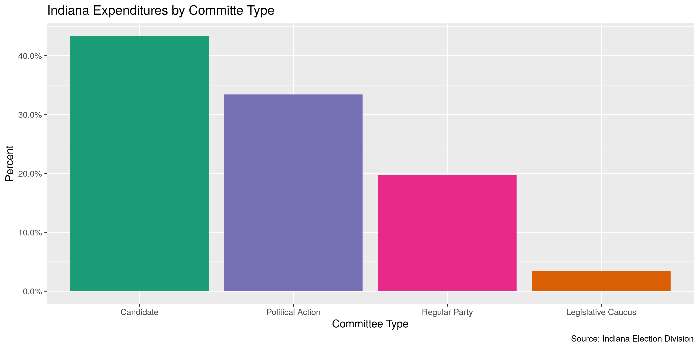
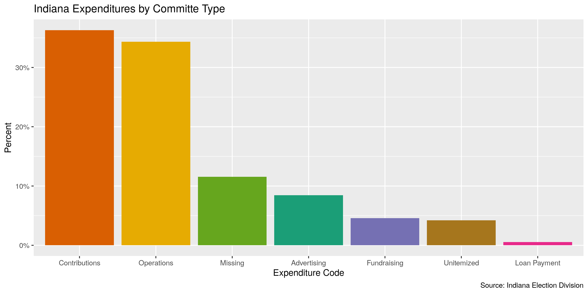
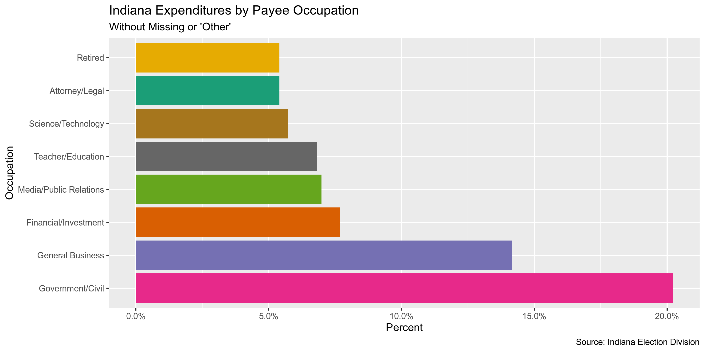
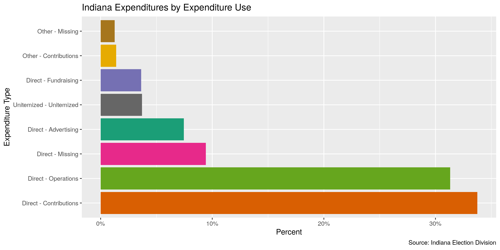
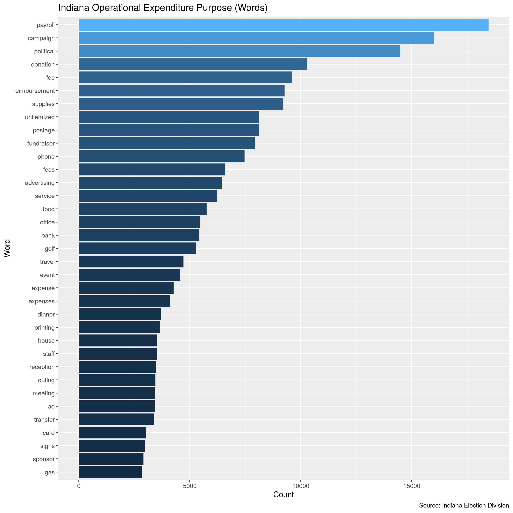
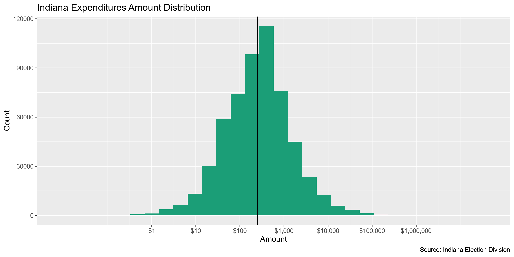
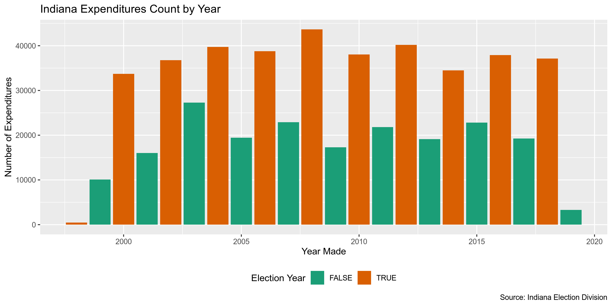
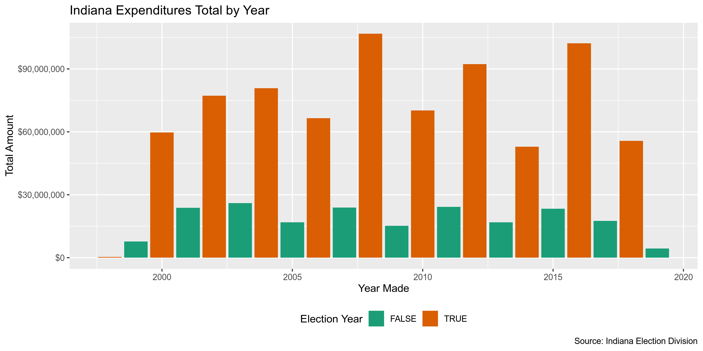
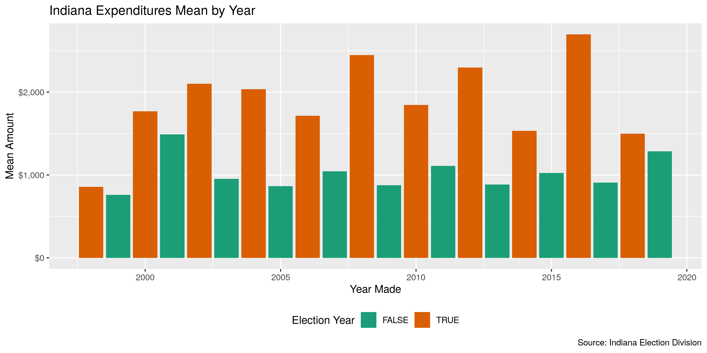
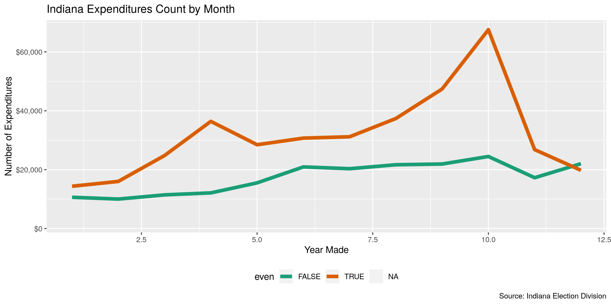

Indiana Expenditures
================
Kiernan Nicholls
2019-08-21 13:32:03

  - [Project](#project)
  - [Objectives](#objectives)
  - [Packages](#packages)
  - [Data](#data)
  - [Import](#import)
  - [Explore](#explore)
  - [Wrangle](#wrangle)
  - [Conclude](#conclude)
  - [Export](#export)

<!-- Place comments regarding knitting here -->

## Project

The Accountability Project is an effort to cut across data silos and
give journalists, policy professionals, activists, and the public at
large a simple way to search across huge volumes of public data about
people and organizations.

Our goal is to standardizing public data on a few key fields by thinking
of each dataset row as a transaction. For each transaction there should
be (at least) 3 variables:

1.  All **parties** to a transaction
2.  The **date** of the transaction
3.  The **amount** of money involved

## Objectives

This document describes the process used to complete the following
objectives:

1.  How many records are in the database?
2.  Check for duplicates
3.  Check ranges
4.  Is there anything blank or missing?
5.  Check for consistency issues
6.  Create a five-digit ZIP Code called `ZIP5`
7.  Create a `YEAR` field from the transaction date
8.  Make sure there is data on both parties to a transaction

## Packages

The following packages are needed to collect, manipulate, visualize,
analyze, and communicate these results. The `pacman` package will
facilitate their installation and attachment.

The IRW’s `campfin` package will also have to be installed from GitHub.
This package contains functions custom made to help facilitate the
processing of campaign finance data.

``` r
if (!require("pacman")) install.packages("pacman")
pacman::p_load_current_gh("kiernann/campfin")
pacman::p_load(
  stringdist, # levenshtein value
  RSelenium, # remote browser
  tidyverse, # data manipulation
  lubridate, # datetime strings
  tidytext, # text analysis
  magrittr, # pipe opperators
  janitor, # dataframe clean
  refinr, # cluster and merge
  scales, # format strings
  rvest, # scrape html pages
  knitr, # knit documents
  vroom, # read files fast
  glue, # combine strings
  here, # relative storage
  fs # search storage 
)
```

This document should be run as part of the `R_campfin` project, which
lives as a sub-directory of the more general, language-agnostic
[`irworkshop/accountability_datacleaning`](https://github.com/irworkshop/accountability_datacleaning "TAP repo")
GitHub repository.

The `R_campfin` project uses the [RStudio
projects](https://support.rstudio.com/hc/en-us/articles/200526207-Using-Projects "Rproj")
feature and should be run as such. The project also uses the dynamic
`here::here()` tool for file paths relative to *your* machine.

``` r
# where dfs this document knit?
here::here()
#> [1] "/home/ubuntu/R/accountability_datacleaning/R_campfin"
```

## Data

Data is obtained from the [Indiana Election
Division](http://campaignfinance.in.gov/PublicSite/Homepage.aspx) (IED).
Their data can be downloaded as anual files on their [data download
page](http://campaignfinance.in.gov/PublicSite/Reporting/DataDownload.aspx).

> The campaign finance database contains detailed financial records that
> campaigns and committees are required by law to disclose. Through this
> database, you can view contribution and expense records from
> candidate, PAC, regular party, legislative caucus, and exploratory
> committees. You can select specific reports based on the candidate,
> office, party, caucus, or PAC name or keyword. You can also search
> across one or more finance reports according to specific criteria that
> you choose. You can review the results on screen, print them, or
> extract the information for further analysis.

The IDE provides [some background
information](http://campaignfinance.in.gov/PublicSite/AboutDatabase.aspx)
on their campaign finance database.

> ### What is the quality of the data?
> 
> The information presented in the campaign finance database is, to the
> best of our ability, an accurate representation of the reports filed
> with the Election Division. This information is being provided as a
> service to the public, has been processed by the Election Division and
> should be cross-referenced with the original report on file with the
> Election Division.
> 
> Some of the information in the campaign finance database was submitted
> in electronic form. Most of the information was key-entered from paper
> reports. Sometimes items which are inconsistent with filing
> requirements, such as incorrect codes or incorrectly formatted or
> blank items, are present in the results of a query. They are incorrect
> or missing in the database because they were incorrect or missing on
> the reports submitted to the Election Division. For some incorrect or
> missing data in campaign finance reports, the Election Division has
> requested that the filer supply an amended report. The campaign
> finance database will be updated to reflect amendments received.

> ### What does the database contain?
> 
> By Indiana law, candidates and committees are required to disclose
> detailed financial records of contributions received and expenditures
> made and debts owed by or to the committee. For committees, the
> campaign finance database contains all contributions, expenditures,
> and debts reported to the Election Division since January 1, 1998.

## Import

We can import each file into R as a single data frame to be explored,
wrangled, and exported as a single file to be indexed on the TAP
database.

### Download

``` r
raw_dir <- here("in", "expends", "data", "raw")
dir_create(raw_dir)
```

> This page provides comma separated value (CSV) downloads of
> contribution and expenditure data for each reporting year in a zipped
> file format. These files can be downloaded and imported into other
> applications (Microsoft Excel, Microsoft Access, etc.). This data was
> extracted from the Campaign Finance database as it existed as of
> 8/6/2019 1:00 AM.

The download URL to each file follows a consistent structure. We can
create a URL for each file by using `glue::glue()` to change the year in
the character string.

``` r
base_url <- "http://campaignfinance.in.gov/PublicSite/Docs/BulkDataDownloads"
exp_urls <- glue("{base_url}/{2000:2019}_ExpenditureData.csv.zip")
```

The files range in size, which we can check before downloading with
`campfin::url_file_size()`.

``` r
file_sizes <- map_dbl(exp_urls, url_file_size)
number_bytes(sum(file_sizes))
#> [1] "13 Mb"
```

If the files haven’t yet been downloaded, we can download each to the
`/in/data/raw` subdirectory.

``` r
if (!all_files_new(raw_dir, "*.zip$")) {
  for (year_url in exp_urls) {
    year_file <- glue("{raw_dir}/{basename(year_url)}")
    download.file(
      url = year_url,
      destfile = year_file
    )
  }
}
```

### Read

We can read each file as a data frame into a list of data frames by
using `purrr::map_df()` and `readr::read_delim()`. We don’t need to
unzip the files.

``` r
ind <- map_df(
  .x = dir_ls(raw_dir, glob = "*.csv.zip$"),
  .f = read_delim,
  delim = ",",
  escape_backslash = FALSE,
  escape_double = FALSE,
  col_types = cols(
    .default = col_character(),
    Amount = col_double(),
    Expenditure_Date = col_date("%Y-%m-%d %H:%M:%S"),
    Amended = col_logical()
  )
) %>% clean_names("snake")
```

There were about a dozen parsing errors, so we will remove these rows by
using `dplyr::filter()` to remove any record with an invalid
`file_number` (typically numeric nominal values) or
`committee_type`/`expenditure_code` values (fixed categorical).

``` r
ind <- ind %>%
  filter(
    str_detect(file_number, "\\d+"),
    str_detect(committee_type, "^\\d+.\\d+$", negate = TRUE),
    expenditure_code %out% "Thomas Lewis Andrews"
  )
```

## Explore

``` r
head(ind)
#> # A tibble: 6 x 18
#>   file_number committee_type committee candidate_name expenditure_code name  address city  state
#>   <chr>       <chr>          <chr>     <chr>          <chr>            <chr> <chr>   <chr> <chr>
#> 1 17          Regular Party  Indiana … <NA>           Missing          <NA>  PO Box… Fort… IN   
#> 2 17          Regular Party  Indiana … <NA>           Missing          Acce… P.O. B… Char… IN   
#> 3 17          Regular Party  Indiana … <NA>           Missing          Acce… P.O. B… Char… NC   
#> 4 17          Regular Party  Indiana … <NA>           Missing          Acce… PO Box… Char… IN   
#> 5 17          Regular Party  Indiana … <NA>           Missing          Acce… PO Box… Char… IN   
#> 6 17          Regular Party  Indiana … <NA>           Missing          Acce… PO Box… Char… IN   
#> # … with 9 more variables: zip <chr>, occupation <chr>, office_sought <chr>,
#> #   expenditure_type <chr>, description <chr>, purpose <chr>, amount <dbl>,
#> #   expenditure_date <date>, amended <lgl>
tail(ind)
#> # A tibble: 6 x 18
#>   file_number committee_type committee candidate_name expenditure_code name  address city  state
#>   <chr>       <chr>          <chr>     <chr>          <chr>            <chr> <chr>   <chr> <chr>
#> 1 7231        Regular Party  Hancock … <NA>           Fundraising      Hanc… 610 N … Gree… IN   
#> 2 7231        Regular Party  Hancock … <NA>           Operations       Indi… PO Box… Indi… IN   
#> 3 7232        Political Act… Citizens… <NA>           Contributions    Jaso… P O Bo… Sout… IN   
#> 4 7232        Political Act… Citizens… <NA>           Unitemized       <NA>  <NA>    <NA>  <NA> 
#> 5 7233        Political Act… Stonewal… <NA>           Unitemized       <NA>  <NA>    <NA>  <NA> 
#> 6 7238        Political Act… DLCC Ind… <NA>           Contributions    Iowa… 5661 F… Des … IA   
#> # … with 9 more variables: zip <chr>, occupation <chr>, office_sought <chr>,
#> #   expenditure_type <chr>, description <chr>, purpose <chr>, amount <dbl>,
#> #   expenditure_date <date>, amended <lgl>
glimpse(sample_frac(ind))
#> Observations: 582,201
#> Variables: 18
#> $ file_number      <chr> "1272", "4981", "6047", "6489", "5588", "1194", "6060", "4252", "26", "…
#> $ committee_type   <chr> "Candidate", "Candidate", "Regular Party", "Regular Party", "Candidate"…
#> $ committee        <chr> "FRIENDS TO ELECT VANETA BECKER", "Andy Miller 2004", "Wells County Rep…
#> $ candidate_name   <chr> "VANETA G. BECKER", "Andrew John Miller", NA, NA, "Mary Ann Sullivan", …
#> $ expenditure_code <chr> "Unitemized", "Operations", "Operations", "Operations", "Operations", "…
#> $ name             <chr> NA, "Andy Miller", "Verizon Wireless", "Target", "Tavern on South", "TU…
#> $ address          <chr> NA, NA, "PO Box 25505", NA, "423 W. South Street", "5541 SOUTH HAMMAN S…
#> $ city             <chr> NA, "Carmel", "Lehigh", "Streamwood", "Indianapolis", "MARION", "Bloomi…
#> $ state            <chr> NA, "IN", "PA", "IL", "IN", "IN", "IN", "IN", "VA", "IN", "AZ", "IN", "…
#> $ zip              <chr> NA, "46032", "18002", "60107", "46225", "46953", "47401", "46307", "223…
#> $ occupation       <chr> NA, NA, NA, NA, NA, NA, NA, NA, NA, NA, NA, NA, NA, NA, NA, NA, NA, NA,…
#> $ office_sought    <chr> NA, NA, NA, "Regular Party", NA, "STATE REP", "State Representative Dis…
#> $ expenditure_type <chr> "Unitemized - Unitemized", "Returned Contribution - Operations", "Direc…
#> $ description      <chr> NA, NA, NA, NA, NA, NA, NA, NA, NA, NA, NA, NA, NA, NA, NA, NA, NA, NA,…
#> $ purpose          <chr> "Contribution", "returned contribution", "Telephone", "Equipment for op…
#> $ amount           <dbl> 100.00, 1158.79, 75.08, 8.10, 74.68, 500.00, 1500.00, 250.00, 2631.74, …
#> $ expenditure_date <date> 2017-12-04, 2004-12-01, 2015-12-31, 2013-05-20, 2012-07-26, 2003-10-20…
#> $ amended          <lgl> FALSE, FALSE, FALSE, FALSE, FALSE, FALSE, FALSE, FALSE, FALSE, FALSE, F…
```

### Missing

``` r
glimpse_fun(ind, count_na)
#> # A tibble: 18 x 4
#>    var              type       n          p
#>    <chr>            <chr>  <int>      <dbl>
#>  1 file_number      chr        0 0         
#>  2 committee_type   chr        0 0         
#>  3 committee        chr      152 0.000261  
#>  4 candidate_name   chr   325620 0.559     
#>  5 expenditure_code chr        0 0         
#>  6 name             chr     9424 0.0162    
#>  7 address          chr    51174 0.0879    
#>  8 city             chr    33934 0.0583    
#>  9 state            chr    32800 0.0563    
#> 10 zip              chr    52920 0.0909    
#> 11 occupation       chr   557040 0.957     
#> 12 office_sought    chr   455744 0.783     
#> 13 expenditure_type chr        3 0.00000515
#> 14 description      chr   582195 1.000     
#> 15 purpose          chr   269317 0.463     
#> 16 amount           dbl       21 0.0000361 
#> 17 expenditure_date date    1905 0.00327   
#> 18 amended          lgl       21 0.0000361
```

There are a fairly significant number of records missing one of the four
variables needed to fully identify a transaction (who, what, and when).
We will use `campfin::flag_na()` to flag them with `TRUE` values in the
new `na_flag` variable. Most of these records are missing the payee
`name` value.

``` r
ind <- ind %>% flag_na(committee, name, expenditure_date, amount)
sum(ind$na_flag)
#> [1] 11446
percent(mean(ind$na_flag))
#> [1] "1.97%"
```

### Duplicates

There are very few duplicate records in the database. They have `TRUE`
values in the new `dupe_flag` variable.

``` r
ind <- mutate(ind, dupe_flag = duplicated(ind))
sum(ind$dupe_flag)
#> [1] 1381
percent(mean(ind$dupe_flag))
#> [1] "0.237%"
```

### Categorical

``` r
glimpse_fun(ind, n_distinct)
#> # A tibble: 20 x 4
#>    var              type       n          p
#>    <chr>            <chr>  <int>      <dbl>
#>  1 file_number      chr     2664 0.00458   
#>  2 committee_type   chr        4 0.00000687
#>  3 committee        chr     4343 0.00746   
#>  4 candidate_name   chr     1736 0.00298   
#>  5 expenditure_code chr        7 0.0000120 
#>  6 name             chr   127791 0.219     
#>  7 address          chr   129438 0.222     
#>  8 city             chr     9314 0.0160    
#>  9 state            chr      232 0.000398  
#> 10 zip              chr    12033 0.0207    
#> 11 occupation       chr       35 0.0000601 
#> 12 office_sought    chr    17747 0.0305    
#> 13 expenditure_type chr       40 0.0000687 
#> 14 description      chr        3 0.00000515
#> 15 purpose          chr    58564 0.101     
#> 16 amount           dbl    93202 0.160     
#> 17 expenditure_date date    7595 0.0130    
#> 18 amended          lgl        3 0.00000515
#> 19 na_flag          lgl        2 0.00000344
#> 20 dupe_flag        lgl        2 0.00000344
```

For categorical variables, we can use `ggplo2::geom_col()` to explore
the count of each variable.

<!-- -->

<!-- -->

<!-- -->

<!-- -->

<!-- -->

### Continuous

For continuous variables, we should explore both the range and
distribution. This can be done with visually with
`ggplot2::geom_histogram()` and `ggplot2::geom_violin()`.

#### Amounts

``` r
summary(ind$amount)
#>     Min.  1st Qu.   Median     Mean  3rd Qu.     Max.     NA's 
#>  -250000       83      250     1742      777 27050288       21
sum(ind$amount < 0, na.rm = TRUE)
#> [1] 3744
sum(ind$amount > 100000, na.rm = TRUE)
#> [1] 764
```

<!-- -->

#### Dates

``` r
ind <- mutate(ind, expenditure_year = year(expenditure_date))
```

``` r
count_na(ind$expenditure_date)
#> [1] 1905
min(ind$expenditure_date, na.rm = TRUE)
#> [1] "1800-10-01"
sum(ind$expenditure_year < 1998, na.rm = TRUE)
#> [1] 29
max(ind$expenditure_date, na.rm = TRUE)
#> [1] "5008-05-01"
sum(ind$expenditure_date > today(), na.rm = TRUE)
#> [1] 29
```

``` r
count(ind, expenditure_year) %>% print(n = 52)
#> # A tibble: 52 x 2
#>    expenditure_year     n
#>               <dbl> <int>
#>  1             1800     1
#>  2             1802     1
#>  3             1899     2
#>  4             1930     4
#>  5             1931     1
#>  6             1932     1
#>  7             1940     5
#>  8             1970     1
#>  9             1977     1
#> 10             1980     1
#> 11             1990     1
#> 12             1994     3
#> 13             1995     2
#> 14             1996     1
#> 15             1997     4
#> 16             1998   481
#> 17             1999 10108
#> 18             2000 33713
#> 19             2001 16003
#> 20             2002 36753
#> 21             2003 27267
#> 22             2004 39741
#> 23             2005 19453
#> 24             2006 38792
#> 25             2007 22926
#> 26             2008 43633
#> 27             2009 17292
#> 28             2010 38047
#> 29             2011 21828
#> 30             2012 40187
#> 31             2013 19114
#> 32             2014 34487
#> 33             2015 22793
#> 34             2016 37917
#> 35             2017 19258
#> 36             2018 37141
#> 37             2019  3304
#> 38             2020     9
#> 39             2021     2
#> 40             2022     1
#> 41             2023     3
#> 42             2024     3
#> 43             2025     1
#> 44             2026     2
#> 45             2027     1
#> 46             2040     1
#> 47             2600     1
#> 48             2800     2
#> 49             2802     1
#> 50             3101     1
#> 51             5008     1
#> 52               NA  1905
```

``` r
ind <- ind %>% 
  mutate(
    date_flag = expenditure_year < 1998 | expenditure_date > today(),
    date_clean = case_when(
      date_flag~ as.Date(NA),
      not(date_flag) ~ expenditure_date
    ),
    year_clean = year(date_clean)
  )

sum(ind$date_flag, na.rm = TRUE)
#> [1] 58
```

<!-- -->

<!-- -->

<!-- -->

<!-- -->

## Wrangle

We should use the `campfin::normal_*()` functions to perform some basic,
high-confidence text normalization to improve the searchability of the
database.

### Address

First, we will normalize the street address by removing punctuation and
expanding abbreviations.

``` r
ind <- ind %>% 
  mutate(
    address_norm = normal_address(
      address = address,
      add_abbs = usps,
      na_rep = TRUE
    )
  )
```

We can see how this improves consistency across the `address` field.

    #> # A tibble: 10 x 2
    #>    address                                     address_norm                               
    #>    <chr>                                       <chr>                                      
    #>  1 PO Box 861                                  PO BOX 861                                 
    #>  2 500 N Main St                               500 NORTH MAIN STREET                      
    #>  3 350 East Sherman                            350 EAST SHERMAN                           
    #>  4 115 W Washington st, #1165                  115 WEST WASHINGTON STREET 1165            
    #>  5 1811 West 455 South                         1811 WEST 455 SOUTH                        
    #>  6 PO Box 2688                                 PO BOX 2688                                
    #>  7 8464 N. SYRACUSE-WEBSTER RD.                8464 NORTH SYRACUSE WEBSTER ROAD           
    #>  8 135 S. Lafayette Blvd.                      135 SOUTH LAFAYETTE BOULEVARD              
    #>  9 One North Capitol Avenue Suite 200          ONE NORTH CAPITOL AVENUE SUITE 200         
    #> 10 National Vice President and General Counsel NATIONAL VICE PRESIDENT AND GENERAL COUNSEL

### ZIP

The `zip` address is already pretty good, with 93.9% of the values
already in our 95% comprehensive `valid_zip` list.

``` r
n_distinct(ind$zip)
#> [1] 12033
prop_in(ind$zip, valid_zip)
#> [1] 0.9392856
length(setdiff(ind$zip, valid_zip))
#> [1] 4994
```

We can improve this further by lopping off the uncommon four-digit
extensions and removing common invalid codes like 00000 and 99999.

``` r
ind <- ind %>% 
  mutate(
    zip_norm = normal_zip(
      zip = zip,
      na_rep = TRUE
    )
  )
```

This brings our valid percentage to 99.3%.

``` r
n_distinct(ind$zip_norm)
#> [1] 8288
prop_in(ind$zip_norm, valid_zip)
#> [1] 0.9932284
length(setdiff(ind$zip_norm, valid_zip))
#> [1] 991
count_na(ind$zip_norm) - count_na(ind$zip)
#> [1] 1635
```

### State

The `state` variable is also very clean, already at 99.2%.

``` r
n_distinct(ind$state)
#> [1] 232
prop_in(ind$state, valid_state, na.rm = TRUE)
#> [1] 0.9917183
length(setdiff(ind$state, valid_state))
#> [1] 174
setdiff(ind$state, valid_state)
#>   [1] NA            "IO"          "WE"          "In"          "NW"          "AU"         
#>   [7] "in"          "Charleston," "PH"          "Richmond"    "`"           "Washington" 
#>  [13] "TY"          "II"          "I"           "Evansville"  "46"          "VO"         
#>  [19] "D"           "CN"          "CS"          "V"           "47"          "`I"         
#>  [25] "JY"          "CI"          "C"           "az"          "Wv"          "ky"         
#>  [31] "wi"          "iN"          "S"           "O"           "IM"          "IJ"         
#>  [37] "GR"          "O;"          "FR"          "34"          "??"          "ST"         
#>  [43] "Va"          "`A"          "N"           "UA"          "Fl"          "QD"         
#>  [49] "D."          "Mn"          "An"          "I "          "OM"          "75"         
#>  [55] "IS"          "Oh"          "Az"          "0"           "Il"          "M"          
#>  [61] "IT"          "d"           "ne"          "N/"          "UN"          "nO"         
#>  [67] "95"          "KA"          "Mo"          "Ky"          "tx"          "oh"         
#>  [73] "Vi"          "11"          "Rh"          "va"          "Te"          "Fr"         
#>  [79] "No"          "Pu"          "RD"          "DW"          "Po"          "Ga"         
#>  [85] "BH"          "Ke"          "Fo"          "NI"          "JJ"          "IW"         
#>  [91] "no"          "JN"          "Io"          "fl"          "ma"          "Ma"         
#>  [97] "mn"          "Sa"          "Fi"          "Ge"          "Ko"          "Wi"         
#> [103] "De"          "Da"          "ny"          "la"          "ca"          "Sp"         
#> [109] "Ne"          "vA"          "Be"          "XX"          "un"          "Tx"         
#> [115] "Co"          "Ev"          "xx"          "Ar"          "Gr"          "Hu"         
#> [121] "Ca"          "Me"          "na"          "on"          "Cr"          "**"         
#> [127] "BE"          "So"          "Sc"          "La"          ","           "On"         
#> [133] "Br"          "co"          "Al"          "Pa"          "Pe"          "UI"         
#> [139] "Mi"          "pa"          "Ch"          "Au"          "Ka"          "ia"         
#> [145] "il"          "md"          "nc"          "n/"          "PN"          "Wa"         
#> [151] "AW"          "55"          "He"          "Mt"          "GB"          "Is"         
#> [157] "HK"          " I"          "tX"          "ar"          "Th"          "94"         
#> [163] "21"          "IC"          "Di"          "Ha"          "Ut"          "sc"         
#> [169] "BA"          "IE"          "UB"          "Un"          "ga"          "Ia"
```

There are still 174 invalid values which we can remove.

``` r
ind <- ind %>% 
  mutate(
    state_norm = normal_state(
      state = str_replace(str_trim(state), "^I$", "IN"),
      abbreviate = TRUE,
      na_rep = TRUE,
      valid = valid_state
    )
  )
```

``` r
n_distinct(ind$state_norm)
#> [1] 52
prop_in(ind$state_norm, valid_state)
#> [1] 1
```

### City

The `city` value is the hardest to normalize. We can use a four-step
system to functionally improve the searchablity of the database.

1.  **Normalize** the raw values with `campfin::normal_city()`
2.  **Match** the normal values with the *expected* value for that ZIP
    code
3.  **Swap** the normal values with the expected value if they are
    *very* similar
4.  **Refine** the swapped values the [OpenRefine
    algorithms](https://github.com/OpenRefine/OpenRefine/wiki/Clustering-In-Depth)
    and keep good changes

The raw `city` values are not very normal, with only 12.9% already in
`valid_city`, mostly due to case difference. If we simply convert to
uppcase that numbers increases to 93.1%. We will aim to get this number
over 99% using the other steps in the process.

``` r
n_distinct(ind$city)
#> [1] 9314
prop_in(ind$city, valid_city, na.rm = TRUE)
#> [1] 0.1290612
length(setdiff(ind$city, valid_city))
#> [1] 7790
prop_na(ind$city)
#> [1] 0.05828571
```

#### Normalize

``` r
ind <- ind %>% 
  mutate(
    city_norm = normal_city(
      city = city, 
      geo_abbs = usps_city,
      st_abbs = c("IN", "DC", "INDIANA"),
      na = na_city,
      na_rep = TRUE
    )
  )
```

This process brought us to 95.1% valid.

``` r
n_distinct(ind$city_norm)
#> [1] 6149
prop_in(ind$city_norm, valid_city, na.rm = TRUE)
#> [1] 0.950849
length(setdiff(ind$city_norm, valid_city))
#> [1] 3009
prop_na(ind$city_norm)
#> [1] 0.05905005
```

It also increased the proportion of `NA` values by 0.0764%. These new
`NA` values were either a single (possibly repeating) character, or
contained in the `na_city` vector.

    #> # A tibble: 70 x 4
    #>    zip_norm state_norm city       city_norm
    #>    <chr>    <chr>      <chr>      <chr>    
    #>  1 46016    IN         requested  <NA>     
    #>  2 <NA>     IN         *          <NA>     
    #>  3 <NA>     WA         2151       <NA>     
    #>  4 00046    IN         46268      <NA>     
    #>  5 46250    IN         unknown    <NA>     
    #>  6 <NA>     <NA>       ***        <NA>     
    #>  7 <NA>     <NA>       Online     <NA>     
    #>  8 47601    IN         Unknown    <NA>     
    #>  9 <NA>     IN         OOOOOOOOOO <NA>     
    #> 10 <NA>     IN         xxx        <NA>     
    #> # … with 60 more rows

#### Swap

Then, we will compare these normalized `city_norm` values to the
*expected* city value for that vendor’s ZIP code. If the [levenshtein
distance](https://en.wikipedia.org/wiki/Levenshtein_distance) is less
than 3, we can confidently swap these two values.

``` r
ind <- ind %>% 
  rename(city_raw = city) %>% 
  left_join(
    y = geo,
    by = c(
      "state_norm" = "state",
      "zip_norm" = "zip"
    )
  ) %>% 
  rename(city_match = city) %>% 
  mutate(
    match_dist = stringdist(city_norm, city_match),
    city_swap = if_else(
      condition = is_less_than(match_dist, 3),
      true = city_match,
      false = city_norm
    )
  )
```

This is a very fast way to increase the valid proportion to 97.6% and
reduce the number of distinct *invalid* values from 3009 to only 660

``` r
n_distinct(ind$city_swap)
#> [1] 3747
prop_in(ind$city_swap, valid_city, na.rm = TRUE)
#> [1] 0.9755157
length(setdiff(ind$city_swap, valid_city))
#> [1] 660
```

#### Refine

Finally, we can pass these swapped `city_swap` values to the OpenRefine
cluster and merge algorithms. These two algorithms cluster similar
values and replace infrequent values with their more common
counterparts. This process can be harmful by making *incorrect* changes.
We will only keep changes where the state, ZIP code, *and* new city
value all match a valid combination.

``` r
good_refine <- ind %>% 
  mutate(
    city_refine = city_swap %>% 
      key_collision_merge() %>% 
      n_gram_merge(numgram = 1)
  ) %>% 
  filter(city_refine != city_swap) %>% 
  inner_join(
    y = geo,
    by = c(
      "city_refine" = "city",
      "state_norm" = "state",
      "zip_norm" = "zip"
    )
  )
```

    #> # A tibble: 39 x 5
    #>    state_norm zip_norm city_raw        city_refine        n
    #>    <chr>      <chr>    <chr>           <chr>          <int>
    #>  1 DC         20006    N.W. Washington WASHINGTON         6
    #>  2 CA         94107    Francisco       SAN FRANCISCO      3
    #>  3 IN         47978    Reneeslear      RENSSELAER         1
    #>  4 IN         47978    Renesslear      RENSSELAER         4
    #>  5 IN         47150    New Albany Lane NEW ALBANY        53
    #>  6 IN         47906    West Lafaye     WEST LAFAYETTE     1
    #>  7 IN         46375    Schervile       SCHERERVILLE       1
    #>  8 IN         46410    MERRERVILLE     MERRILLVILLE       1
    #>  9 IN         46184    New Whiteland   WHITELAND         22
    #> 10 IN         47577    ST. MEINRAD     SAINT MEINRAD      9
    #> # … with 29 more rows

We can join these good refined values back to the original data and use
them over their incorrect `city_swap` counterparts in a new
`city_refine` variable.

``` r
ind <- ind %>% 
  left_join(good_refine) %>% 
  mutate(city_refine = coalesce(city_refine, city_swap))
```

This brings us to 97.6% valid values.

``` r
n_distinct(ind$city_refine)
#> [1] 3720
prop_in(ind$city_refine, valid_city, na.rm = TRUE)
#> [1] 0.9758084
length(setdiff(ind$city_refine, valid_city))
#> [1] 634
```

#### Progress

We can make very few manual changes to capture the last few big invalid
values. Local city abbreviations (e.g., INDPLS) often need to be changed
by hand.

``` r
ind %>%
  filter(city_refine %out% valid_city) %>% 
  count(state_norm, city_refine, sort = TRUE) %>% 
  drop_na(city_refine)
#> # A tibble: 647 x 3
#>    state_norm city_refine           n
#>    <chr>      <chr>             <int>
#>  1 IN         INDPLS             7595
#>  2 MO         STREET LOUIS        746
#>  3 IN         SPEEDWAY            400
#>  4 IL         COUNTRYSIDE         392
#>  5 MN         STREET PAUL         226
#>  6 IN         STREET JOHN         192
#>  7 IN         INDY                157
#>  8 MN         STREET CLOUD        114
#>  9 FL         STREET PETERSBURG   102
#> 10 IL         OAKBROOK TERRACE     86
#> # … with 637 more rows
```

``` r
ind <- ind %>% 
  mutate(
    city_final = city_refine %>% 
      str_replace("^INDPLS$", "INDIANAPOLIS") %>% 
      str_replace("^EC$", "EAST CHICAGO") %>% 
      str_replace("^INDY$", "INDIANAPOLIS") %>% 
      str_replace("^MERR$", "MERRILLVILLE")
  )
```

By making less than a dozen manual string replacements, we bring our
final valid percentage to 99.1%, above our 99% goal. There are still 630
different *invalid* values that could be checked, but they make up less
than 1% of records. Many of these values are actually valid and simply
not in our list (which doesn’t contain very small towns and census
desginated places).

Still, our progress is significant without having to make a single
manual or unconfident change. The percent of valid cities increased from
12.9% to 99.1%. The number of total distinct city values decreased from
9,314 to 3,716. The number of distinct invalid city names decreased from
7,790 to only 630, a change of -91.9%.

| Normalization Stage | Total Distinct | Percent Valid | Unique Invalid |
| :------------------ | -------------: | ------------: | -------------: |
| raw                 |           9314 |        0.1291 |           7790 |
| norm                |           6149 |        0.9508 |           3009 |
| swap                |           3747 |        0.9755 |            660 |
| refine              |           3720 |        0.9758 |            634 |
| final               |           3716 |        0.9911 |            630 |

## Conclude

1.  There are 582201 records in the database.
2.  There are 1381 duplicate records in the database.
3.  The range and distribution of `amount` seems reasomable, and `date`
    has been cleaned by removing 58 values from the distance past or
    future.
4.  There are 11446 records missing either recipient or date.
5.  Consistency in geographic data has been improved with
    `campfin::normal_*()`.
6.  The 5-digit `zip_norm` variable has been created with
    `campfin::normal_zip()`.
7.  The 4-digit `year_clean` variable has been created with
    `lubridate::year()`.

## Export

``` r
proc_dir <- here("in", "expends", "data", "processed")
dir_create(proc_dir)
```

``` r
ind %>% 
  select(
    -city_norm,
    -city_swap,
    -city_match,
    -city_swap,
    -match_dist,
    -city_refine,
    -expenditure_year
  ) %>% 
  write_csv(
    path = glue("{proc_dir}/in_expends_clean.csv"),
    na = ""
  )
```
