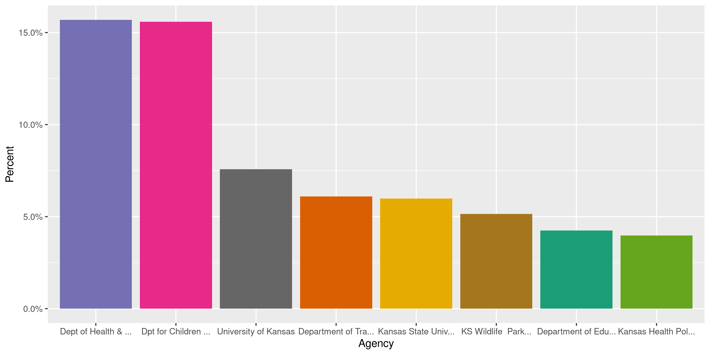
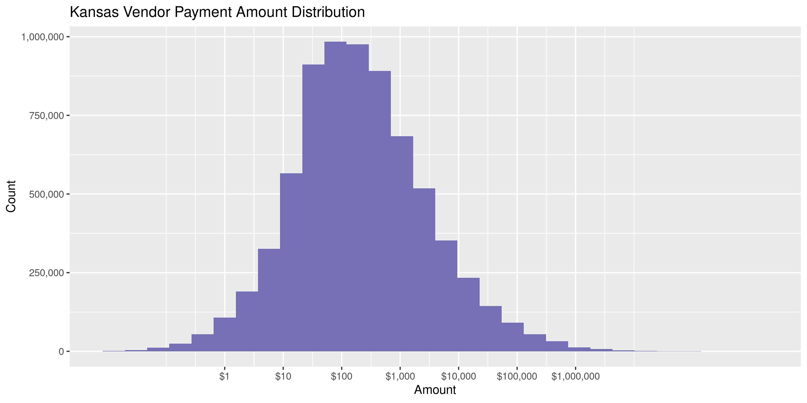
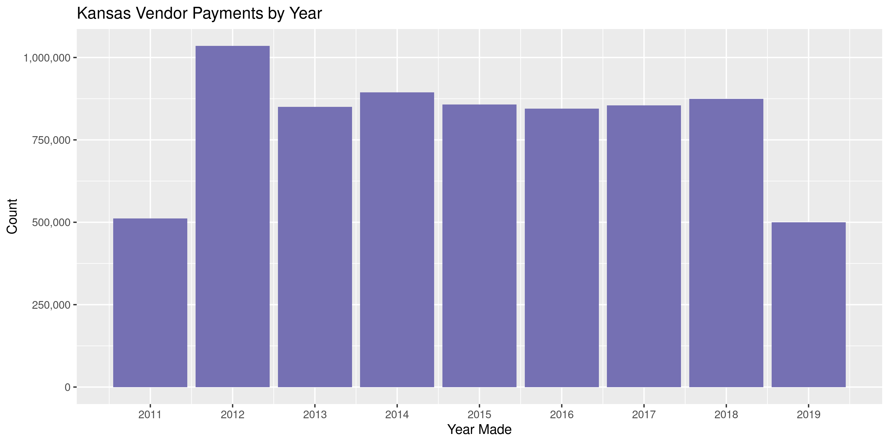

Kansas Contracts
================
Kiernan Nicholls
2020-06-30 18:32:28

  - [Project](#project)
  - [Objectives](#objectives)
  - [Packages](#packages)
  - [Data](#data)
  - [Download](#download)
  - [Read](#read)
  - [Explore](#explore)
  - [Wrangle](#wrangle)
  - [Conclude](#conclude)
  - [Export](#export)
  - [Upload](#upload)
  - [Dictionary](#dictionary)

<!-- Place comments regarding knitting here -->

## Project

The Accountability Project is an effort to cut across data silos and
give journalists, policy professionals, activists, and the public at
large a simple way to search across huge volumes of public data about
people and organizations.

Our goal is to standardizing public data on a few key fields by thinking
of each dataset row as a transaction. For each transaction there should
be (at least) 3 variables:

1.  All **parties** to a transaction.
2.  The **date** of the transaction.
3.  The **amount** of money involved.

## Objectives

This document describes the process used to complete the following
objectives:

1.  How many records are in the database?
2.  Check for entirely duplicated records.
3.  Check ranges of continuous variables.
4.  Is there anything blank or missing?
5.  Check for consistency issues.
6.  Create a five-digit ZIP Code called `zip`.
7.  Create a `year` field from the transaction date.
8.  Make sure there is data on both parties to a transaction.

## Packages

The following packages are needed to collect, manipulate, visualize,
analyze, and communicate these results. The `pacman` package will
facilitate their installation and attachment.

The IRW’s `campfin` package will also have to be installed from GitHub.
This package contains functions custom made to help facilitate the
processing of campaign finance data.

``` r
if (!require("pacman")) install.packages("pacman")
pacman::p_load_gh("irworkshop/campfin")
pacman::p_load(
  tidyverse, # data manipulation
  lubridate, # datetime strings
  gluedown, # printing markdown
  magrittr, # pipe operators
  janitor, # clean data frames
  refinr, # cluster and merge
  scales, # format strings
  knitr, # knit documents
  vroom, # read files fast
  rvest, # html scraping
  glue, # combine strings
  here, # relative paths
  httr, # http requests
  fs # local storage 
)
```

This document should be run as part of the `R_campfin` project, which
lives as a sub-directory of the more general, language-agnostic
[`irworkshop/accountability_datacleaning`](https://github.com/irworkshop/accountability_datacleaning)
GitHub repository.

The `R_campfin` project uses the [RStudio
projects](https://support.rstudio.com/hc/en-us/articles/200526207-Using-Projects)
feature and should be run as such. The project also uses the dynamic
`here::here()` tool for file paths relative to *your* machine.

``` r
# where does this document knit?
here::here()
#> [1] "/home/kiernan/Code/accountability_datacleaning/R_campfin"
```

## Data

Data is retrieved from the [KanView Download
Center](http://kanview.ks.gov/DataDownload.aspx):

> KanView is an online solution that brings better visibility, openness,
> and accountability to Kansas State Government. KanView contains data
> related to Government spending and income, allowing Kansas taxpayers
> an inside look at Government financial activity.

> The State of Kansas government operates on a fiscal year basis defined
> as July 1 through June 30. KanView presents data beginning with FY
> 2006 and each completed fiscal year therafter. For detailed
> transactions please visit the [Data Download
> Center](http://kanview.ks.gov/DataDownload.aspx).

The Download Center provides three types of data: Agency expenditures
and revenues, vendor payments, and employee compensation. We are
interested in the payments made from the state to outside vendors.

> Vendor Payments: “Checkbook” payments made to vendors are available
> through KanView. Download results will show payments made to vendors
> from all state agencies and include the following key data elements:
> fiscal year, agency (Business Unit), account description, funding,
> vendor name, document number, payment date and amount. Due to data
> volumes, downloads are available on a monthly or quarterly basis per
> each download request. Select the Fiscal Year, then select either the
> quarter or month. If month is selected KanView ignores any selection
> of a specific quarter.

## Download

Vendor payment data can be downloaded in files by fiscal year (July 1 to
June 30). We can download the files manually from the Download Center,
or we can make a series of `POST()` requests via curl.

``` r
raw_dir <- dir_create(here("ks", "contracts", "data", "raw"))
```

``` r
raw_curl <- read_file(here("ks", "contracts", "raw_curl.txt"))
if (length(dir_ls(raw_dir)) == 0) {
  for (year in 2011:2019) {
    message("------", year, "------")
    raw_path <- path(raw_dir, glue("VendorData_{year}.csv"))
    raw_curl %>% 
      str_replace("(?<=VendorYearList\\=)\\d{4}", as.character(year)) %>% 
      system(intern = TRUE) %>% 
      write_lines(raw_path)
  }
}
```

``` r
raw_info <- dir_info(raw_dir)
raw_info$path %>% 
  path.abbrev() %>% 
  md_code() %>% 
  md_bullet()
```

  - `~/ks/contracts/data/raw/VendorData_2011.csv`
  - `~/ks/contracts/data/raw/VendorData_2012.csv`
  - `~/ks/contracts/data/raw/VendorData_2013.csv`
  - `~/ks/contracts/data/raw/VendorData_2014.csv`
  - `~/ks/contracts/data/raw/VendorData_2015.csv`
  - `~/ks/contracts/data/raw/VendorData_2016.csv`
  - `~/ks/contracts/data/raw/VendorData_2017.csv`
  - `~/ks/contracts/data/raw/VendorData_2018.csv`
  - `~/ks/contracts/data/raw/VendorData_2019.csv`

## Read

``` r
ksc <- map_df(
  .x = raw_info$path,
  .f = read_delim,
  delim = ",",
  na = "",
  trim_ws = TRUE,
  guess_max = 0,
  escape_backslash = FALSE,
  escape_double = FALSE,
  col_types = cols(
    .default = col_character(),
    Fiscal_Year = col_integer(),
    # Payment_Date = col_date("%Y%m%d"),
    Amount = col_double(),
    X9 = col_skip()
  )
)
```

``` r
x <- ksc$date
mdy_dates <- str_detect(x, "/")
x[mdy_dates] <- as.character(mdy(x[mdy_dates]))
x[!mdy_dates] <- as.character(ymd(x[!mdy_dates]))
ksc$date <- parse_date(x)
count_na(ksc$date)
#> [1] 0
rm(x)
```

## Explore

``` r
glimpse(ksc)
#> Rows: 7,221,898
#> Columns: 8
#> $ fiscal   <int> 2012, 2012, 2012, 2012, 2012, 2012, 2012, 2012, 2012, 2012, 2012, 2012, 2012, 2…
#> $ agency   <chr> "Board of Accountancy", "Board of Accountancy", "Board of Accountancy", "Board …
#> $ account  <chr> "INTERGOV POSTAGE OP DISC", "INTERGOV LCL COMM SVC OP DISC", "INTERGOV LCL COMM…
#> $ fund     <chr> NA, NA, NA, NA, NA, NA, NA, NA, NA, NA, NA, NA, NA, NA, NA, NA, NA, NA, NA, NA,…
#> $ vendor   <chr> "DEPARTMENT OF ADMINISTRATION", "DEPARTMENT OF ADMINISTRATION", "DEPARTMENT OF …
#> $ document <chr> "220", "221", "221", "222", "222", "223", "218", "218", "12556", "12559", "1256…
#> $ date     <date> 2011-07-01, 2011-07-01, 2011-07-01, 2011-07-01, 2011-07-01, 2011-07-01, 2011-0…
#> $ amount   <dbl> 415.73, 109.50, 2.64, 425.00, 10.60, 59.09, 8.00, 11.40, 306.30, 245.10, 838.23…
tail(ksc)
#> # A tibble: 6 x 8
#>   fiscal agency           account          fund           vendor         document date       amount
#>    <int> <chr>            <chr>            <chr>          <chr>          <chr>    <date>      <dbl>
#> 1   2019 Dpt for Childre… DIR FED WELFARE… SOC SEC-DISAB… DIMITRI GOLFI… 461164   2019-10-09   -30 
#> 2   2019 Dpt for Childre… DIR FED WELFARE… SOC SEC-DISAB… THE WOMENS HE… 461230   2019-10-09   -30 
#> 3   2019 Dpt for Childre… DIR FED WELFARE… SOC SEC-DISAB… ADVANCED CANC… 461488   2019-10-09   -30 
#> 4   2019 Dpt for Childre… DIR FED WELFARE… TEMP ASST-NEE… RED ROCK AUTO… 21178309 2019-10-09   -80 
#> 5   2019 Kansas Dept of … AGRICULTURAL CO… STATE WATER P… C & L RVOC TR  90041607 2019-10-10  -186.
#> 6   2019 State Treasurer  MEALS AND LODGI… UNCLAIMED PRO… HUTCHINSON HO… 548296   2019-10-18 -4623.
```

### Missing

The only variable missing any values is the `fund` code.

``` r
col_stats(ksc, count_na)
#> # A tibble: 8 x 4
#>   col      class        n     p
#>   <chr>    <chr>    <int> <dbl>
#> 1 fiscal   <int>        0 0    
#> 2 agency   <chr>        0 0    
#> 3 account  <chr>        0 0    
#> 4 fund     <chr>  1953551 0.271
#> 5 vendor   <chr>        0 0    
#> 6 document <chr>        0 0    
#> 7 date     <date>       0 0    
#> 8 amount   <dbl>        0 0
```

This variable was not recorded from 2011 to 2013.

``` r
ksc %>% 
  group_by(fiscal) %>% 
  summarise(prop_na = percent(prop_na(fund)))
#> # A tibble: 8 x 2
#>   fiscal prop_na
#>    <int> <chr>  
#> 1   2012 100%   
#> 2   2013 100%   
#> 3   2014 0%     
#> 4   2015 0%     
#> 5   2016 0%     
#> 6   2017 0%     
#> 7   2018 0%     
#> 8   2019 0%
```

### Duplicates

``` r
tmp_files <- dir_ls(tempdir())
dupe_file <- if (any(str_detect(tmp_files, "dupes"))) {
  str_subset(tmp_files, "dupes")
} else {
  file_temp(pattern = "dupes")
}
if (!file_exists(dupe_file)) {
  file_create(dupe_file)
  n <- 1e5 # rows per chunk
  nr <- nrow(ksc)
  # split file into chunks
  kss <- split(ksc, rep(1:ceiling(nr/n), each = n, length.out = nr))
  pb <- txtProgressBar(max = length(kss), style = 3)
  for (i in seq_along(kss)) {
    # check dupes from both ends
    d1 <- duplicated(kss[[i]], fromLast = FALSE)
    d2 <- duplicated(kss[[i]], fromLast = TRUE)
    # append to disk
    write_lines(d1 | d2, dupe_file, append = TRUE)
    rm(d1, d2)
    kss[[i]] <- NA
    Sys.sleep(10)
    flush_memory()
    setTxtProgressBar(pb, i)
  }
  rm(kss)
}
#>   |                                                                                                 |                                                                                         |   0%  |                                                                                                 |=                                                                                        |   1%  |                                                                                                 |==                                                                                       |   3%  |                                                                                                 |====                                                                                     |   4%  |                                                                                                 |=====                                                                                    |   5%  |                                                                                                 |======                                                                                   |   7%  |                                                                                                 |=======                                                                                  |   8%  |                                                                                                 |=========                                                                                |  10%  |                                                                                                 |==========                                                                               |  11%  |                                                                                                 |===========                                                                              |  12%  |                                                                                                 |============                                                                             |  14%  |                                                                                                 |=============                                                                            |  15%  |                                                                                                 |===============                                                                          |  16%  |                                                                                                 |================                                                                         |  18%  |                                                                                                 |=================                                                                        |  19%  |                                                                                                 |==================                                                                       |  21%  |                                                                                                 |====================                                                                     |  22%  |                                                                                                 |=====================                                                                    |  23%  |                                                                                                 |======================                                                                   |  25%  |                                                                                                 |=======================                                                                  |  26%  |                                                                                                 |========================                                                                 |  27%  |                                                                                                 |==========================                                                               |  29%  |                                                                                                 |===========================                                                              |  30%  |                                                                                                 |============================                                                             |  32%  |                                                                                                 |=============================                                                            |  33%  |                                                                                                 |==============================                                                           |  34%  |                                                                                                 |================================                                                         |  36%  |                                                                                                 |=================================                                                        |  37%  |                                                                                                 |==================================                                                       |  38%  |                                                                                                 |===================================                                                      |  40%  |                                                                                                 |=====================================                                                    |  41%  |                                                                                                 |======================================                                                   |  42%  |                                                                                                 |=======================================                                                  |  44%  |                                                                                                 |========================================                                                 |  45%  |                                                                                                 |=========================================                                                |  47%  |                                                                                                 |===========================================                                              |  48%  |                                                                                                 |============================================                                             |  49%  |                                                                                                 |=============================================                                            |  51%  |                                                                                                 |==============================================                                           |  52%  |                                                                                                 |================================================                                         |  53%  |                                                                                                 |=================================================                                        |  55%  |                                                                                                 |==================================================                                       |  56%  |                                                                                                 |===================================================                                      |  58%  |                                                                                                 |====================================================                                     |  59%  |                                                                                                 |======================================================                                   |  60%  |                                                                                                 |=======================================================                                  |  62%  |                                                                                                 |========================================================                                 |  63%  |                                                                                                 |=========================================================                                |  64%  |                                                                                                 |===========================================================                              |  66%  |                                                                                                 |============================================================                             |  67%  |                                                                                                 |=============================================================                            |  68%  |                                                                                                 |==============================================================                           |  70%  |                                                                                                 |===============================================================                          |  71%  |                                                                                                 |=================================================================                        |  73%  |                                                                                                 |==================================================================                       |  74%  |                                                                                                 |===================================================================                      |  75%  |                                                                                                 |====================================================================                     |  77%  |                                                                                                 |=====================================================================                    |  78%  |                                                                                                 |=======================================================================                  |  79%  |                                                                                                 |========================================================================                 |  81%  |                                                                                                 |=========================================================================                |  82%  |                                                                                                 |==========================================================================               |  84%  |                                                                                                 |============================================================================             |  85%  |                                                                                                 |=============================================================================            |  86%  |                                                                                                 |==============================================================================           |  88%  |                                                                                                 |===============================================================================          |  89%  |                                                                                                 |================================================================================         |  90%  |                                                                                                 |==================================================================================       |  92%  |                                                                                                 |===================================================================================      |  93%  |                                                                                                 |====================================================================================     |  95%  |                                                                                                 |=====================================================================================    |  96%  |                                                                                                 |=======================================================================================  |  97%  |                                                                                                 |======================================================================================== |  99%  |                                                                                                 |=========================================================================================| 100%
```

``` r
ksc <- mutate(ksc, dupe_flag = as.logical(read_lines(dupe_file)))
sum(ksc$dupe_flag)
#> [1] 144
```

``` r
ksc %>% 
  filter(dupe_flag) %>% 
  select(date, vendor, amount, agency)
#> # A tibble: 144 x 4
#>    date       vendor                                amount agency                 
#>    <date>     <chr>                                  <dbl> <chr>                  
#>  1 2013-07-24 CHARLSON WILSON INSURANCE AGENCY INC   124   Kansas State University
#>  2 2013-07-24 CHARLSON WILSON INSURANCE AGENCY INC   124   Kansas State University
#>  3 2013-07-30 OPAL RT TECHNOLOGIES INC              8774   Kansas State University
#>  4 2013-07-30 OPAL RT TECHNOLOGIES INC              8774   Kansas State University
#>  5 2013-08-19 PB CRC LIMITED                       18750   Kansas State University
#>  6 2013-08-19 PB CRC LIMITED                       18750   Kansas State University
#>  7 2013-08-26 SANTA CRUZ BIOTECHNOLOGY INC           304.  Kansas State University
#>  8 2013-08-26 SANTA CRUZ BIOTECHNOLOGY INC           304.  Kansas State University
#>  9 2013-09-09 VERIZON WIRELESS SERVICES LLC           65.2 Kansas State University
#> 10 2013-09-09 VERIZON WIRELESS SERVICES LLC           65.2 Kansas State University
#> # … with 134 more rows
```

### Categorical

``` r
col_stats(ksc, n_distinct)
#> # A tibble: 9 x 4
#>   col       class        n           p
#>   <chr>     <chr>    <int>       <dbl>
#> 1 fiscal    <int>        8 0.00000111 
#> 2 agency    <chr>      112 0.0000155  
#> 3 account   <chr>      556 0.0000770  
#> 4 fund      <chr>     1259 0.000174   
#> 5 vendor    <chr>   129738 0.0180     
#> 6 document  <chr>  2875770 0.398      
#> 7 date      <date>    2073 0.000287   
#> 8 amount    <dbl>   995196 0.138      
#> 9 dupe_flag <lgl>        2 0.000000277
```

``` r
explore_plot(ksc, agency) + scale_x_truncate()
```

<!-- -->

### Amounts

``` r
summary(ksc$amount)
#>      Min.   1st Qu.    Median      Mean   3rd Qu.      Max. 
#> -22137198        34       172     23900      1026 974678300
mean(ksc$amount <= 0)
#> [1] 0.005419351
```

<!-- -->

### Dates

We can add the calendar year from `date` with `lubridate::year()`

``` r
ksc <- mutate(ksc, year = year(date))
```

``` r
min(ksc$date)
#> [1] "2011-07-01"
sum(ksc$year < 2000)
#> [1] 0
max(ksc$date)
#> [1] "2019-10-18"
sum(ksc$date > today())
#> [1] 0
```

<!-- -->

## Wrangle

``` r
ksc <- mutate(ksc, agency_state = "KS", .after = agency)
```

## Conclude

``` r
glimpse(sample_n(ksc, 20))
#> Rows: 20
#> Columns: 11
#> $ fiscal       <int> 2016, 2015, 2017, 2014, 2018, 2012, 2016, 2015, 2012, 2019, 2013, 2018, 201…
#> $ agency       <chr> "Dpt for Children and Families", "KS Wildlife  Parks & Tourism", "KS Wildli…
#> $ agency_state <chr> "KS", "KS", "KS", "KS", "KS", "KS", "KS", "KS", "KS", "KS", "KS", "KS", "KS…
#> $ account      <chr> "EQUIPMENT RENTAL", "AG SUPPLIES AND MATERIALS", "REPAIR AND SVC BLDG GROUN…
#> $ fund         <chr> "SNAP EMPLOY & TRAIN PILOT", "ST AGRICULTURAL PRODUCTION FD", "WILDLIFE FF"…
#> $ vendor       <chr> "PITNEY BOWES INC", "CARD SERVICES", "WORLD PEST CONTROL INC", "CARD SERVIC…
#> $ document     <chr> "159689", "142482", "171995", "40439", "V18F1669", "10030697", "50148466", …
#> $ date         <date> 2016-03-09, 2015-06-11, 2016-11-22, 2014-04-22, 2018-04-13, 2011-08-31, 20…
#> $ amount       <dbl> 3.75, 198.46, 33.75, 17.68, 4500.00, 300.13, 35.89, 382.37, 2924.27, 34778.…
#> $ dupe_flag    <lgl> FALSE, FALSE, FALSE, FALSE, FALSE, FALSE, FALSE, FALSE, FALSE, FALSE, FALSE…
#> $ year         <dbl> 2016, 2015, 2016, 2014, 2018, 2011, 2015, 2015, 2012, 2018, 2013, 2017, 201…
```

1.  There are 7,221,898 records in the database.
2.  There are 144 duplicate records in the database.
3.  The range and distribution of `amount` and `date` seem reasonable.
4.  There are 0 records missing key variables.
5.  Consistency in geographic data has been improved with
    `campfin::normal_*()`.
6.  The 4-digit `year` variable has been created with
    `lubridate::year()`.

## Export

Now the file can be saved on disk for upload to the Accountability
server.

``` r
clean_dir <- dir_create(here("ks", "contracts", "data", "clean"))
clean_path <- path(clean_dir, "ks_contracts_clean.csv")
write_csv(ksc, clean_path, na = "")
file_size(clean_path)
#> 918M
file_encoding(clean_path) %>% 
  mutate(across(path, path.abbrev))
#> # A tibble: 1 x 3
#>   path                                             mime            charset 
#>   <chr>                                            <chr>           <chr>   
#> 1 ~/ks/contracts/data/clean/ks_contracts_clean.csv application/csv us-ascii
```

## Upload

Using the [duckr](https://github.com/kiernann/duckr) R package, we can
wrap around the [duck](https://duck.sh/) comand line tool to upload the
file to the IRW server.

``` r
# remotes::install_github("kiernann/duckr")
s3_dir <- "s3:/publicaccountability/csv/"
s3_path <- path(s3_dir, basename(clean_path))
if (require(duckr)) {
  duckr::duck_upload(clean_path, s3_path)
}
```

## Dictionary

The following table describes the variables in our final exported file:

| Column         | Original Name         | Type        | Definition           |
| :------------- | :-------------------- | :---------- | :------------------- |
| `fiscal`       | `Fiscal_Year`         | `integer`   | Fiscal year paid     |
| `agency`       | `Business_Unit_Descr` | `character` | Spending agency      |
| `agency_state` | `Account_Descr`       | `character` | Agency state (KS)    |
| `account`      | `Fund_Code_Descr`     | `character` | Funds source account |
| `fund`         | `Vendor_Name`         | `character` | Fund name            |
| `vendor`       | `Document_Number`     | `character` | Vendor name          |
| `document`     | `Payment_Date`        | `character` | Document number      |
| `date`         | `Amount`              | `double`    | Daid paid            |
| `amount`       |                       | `double`    | Payment amount       |
| `dupe_flag`    |                       | `logical`   | Duplicate record     |
| `year`         |                       | `double`    | Calendar year paid   |
