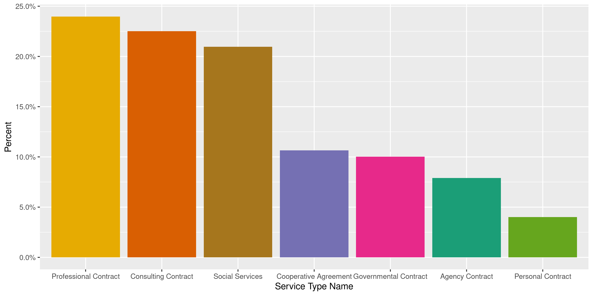
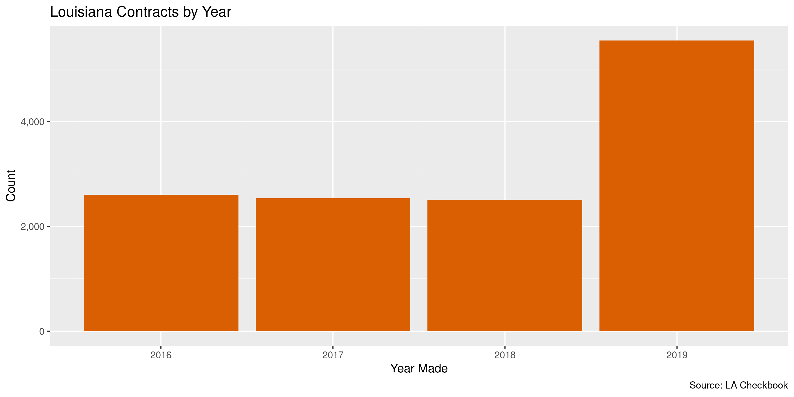

Louisiana Contracts
================
Kiernan Nicholls
2020-06-03 11:45:48

  - [Project](#project)
  - [Objectives](#objectives)
  - [Packages](#packages)
  - [Data](#data)
  - [Download](#download)
  - [Read](#read)
  - [Explore](#explore)
  - [Wrangle](#wrangle)
  - [Conclude](#conclude)
  - [Export](#export)
  - [Upload](#upload)
  - [Dictionary](#dictionary)

<!-- Place comments regarding knitting here -->

## Project

The Accountability Project is an effort to cut across data silos and
give journalists, policy professionals, activists, and the public at
large a simple way to search across huge volumes of public data about
people and organizations.

Our goal is to standardizing public data on a few key fields by thinking
of each dataset row as a transaction. For each transaction there should
be (at least) 3 variables:

1.  All **parties** to a transaction.
2.  The **date** of the transaction.
3.  The **amount** of money involved.

## Objectives

This document describes the process used to complete the following
objectives:

1.  How many records are in the database?
2.  Check for entirely duplicated records.
3.  Check ranges of continuous variables.
4.  Is there anything blank or missing?
5.  Check for consistency issues.
6.  Create a five-digit ZIP Code called `zip`.
7.  Create a `year` field from the transaction date.
8.  Make sure there is data on both parties to a transaction.

## Packages

The following packages are needed to collect, manipulate, visualize,
analyze, and communicate these results. The `pacman` package will
facilitate their installation and attachment.

The IRW’s `campfin` package will also have to be installed from GitHub.
This package contains functions custom made to help facilitate the
processing of campaign finance data.

``` r
if (!require("pacman")) install.packages("pacman")
pacman::p_load_gh("irworkshop/campfin")
pacman::p_load(
  tidyverse, # data manipulation
  lubridate, # datetime strings
  gluedown, # printing markdown
  magrittr, # pipe operators
  janitor, # clean data frames
  refinr, # cluster and merge
  scales, # format strings
  readxl, # read excel files
  knitr, # knit documents
  vroom, # read files fast
  rvest, # html scraping
  glue, # combine strings
  here, # relative paths
  httr, # http requests
  fs # local storage 
)
```

This document should be run as part of the `R_campfin` project, which
lives as a sub-directory of the more general, language-agnostic
[`irworkshop/accountability_datacleaning`](https://github.com/irworkshop/accountability_datacleaning)
GitHub repository.

The `R_campfin` project uses the [RStudio
projects](https://support.rstudio.com/hc/en-us/articles/200526207-Using-Projects)
feature and should be run as such. The project also uses the dynamic
`here::here()` tool for file paths relative to *your* machine.

``` r
# where does this document knit?
here::here()
#> [1] "/home/kiernan/Code/accountability_datacleaning/R_campfin"
```

## Data

Contracts data can be obtained from the [Louisiana Checkbook
website](https://checkbook.la.gov/contracts/index.cfm). We can download
“Annual Report Source Data” in Microsoft Excel format. This data was
last updated June 1, 2020.

## Download

Data is available from 2016 through 2019.

``` r
raw_dir <- dir_create(here("la", "contracts", "data", "raw"))
raw_source <- "https://checkbook.la.gov/Reports/AnnualSource/"
raw_names <- glue("FY{16:19}AnnualReportSourceDataAct589.xlsx")
raw_urls <- str_c(raw_source, raw_names)
raw_paths <- path(raw_dir, raw_names)
if (!all(file_exists(raw_paths))) {
  download.file(raw_names, raw_paths)
}
```

## Read

The four Excel spreadsheets can be read into a single data frame using
`purrr::map_df()` and `readxl::read_excel()`.

``` r
lac <- map_df(
  .x = raw_paths,
  .f = read_excel,
  .id = "source",
  skip = 3,
  col_types = "text"
)
```

After reading every column as text, we can clean the variable names and
parse the numeric columns accordingly. We can also change the `source`
variable from combining files into the corresponding fiscal year.

``` r
lac <- lac %>% 
  clean_names("snake") %>% 
  filter(vendor_name != "Sum:") %>% 
  mutate(across(total_amount, parse_double)) %>% 
  mutate(across(total_count, parse_integer)) %>% 
  mutate(
    source = basename(raw_paths[as.integer(source)]),
    year = source %>% 
      str_extract("(?<=FY)\\d{2}") %>% 
      str_c("20", .) %>% 
      as.integer()
  ) %>% 
  mutate(
    description = coalesce(
      description, published_description, published_text
    )
  ) %>% 
  select(-published_description, -published_text)
```

Records belonging to contracts have a `contract_no` and single purchase
orders have a `po_number` variable and the inverse is missing for each.
We will create a new variable indicating the record *type*, combine
these two numbers as a new single `id` variable, and then remove the two
original number columns.

``` r
lac <- lac %>% 
  mutate(
    .before = contract_no,
    id = coalesce(po_number, contract_no)
  ) %>% 
  mutate(
    .after = id,
    .keep = "unused",
    type = case_when(
      is.na(contract_no) ~ "purchase",
      is.na(po_number) ~ "contract"
    )
  )
```

## Explore

``` r
glimpse(lac)
#> Rows: 13,195
#> Columns: 14
#> $ source            <chr> "FY16AnnualReportSourceDataAct589.xlsx", "FY16AnnualReportSourceDataAc…
#> $ id                <chr> "2000151101", "4400009344", "2000115741", "2000156009", "2000115873", …
#> $ type              <chr> "purchase", "contract", "purchase", "purchase", "purchase", "purchase"…
#> $ service_type      <chr> "PRO", "PRO", "PRO", "GOV", "GOV", "PRO", "PRO", "GOV", "GOV", "GOV", …
#> $ service_type_name <chr> "Professional Contract", "Professional Contract", "Professional Contra…
#> $ dept              <chr> "015", "033", "014", "014", "014", "014", "014", "014", "014", "014", …
#> $ department_name   <chr> "DEPT OF PUBLIC SAFETY AND CORRECTIONS", "BOARDS, COMMISSIONS, AND AUT…
#> $ common_vendor     <chr> "310103513", "310119061", "310081403", "310080901", "310080616", "3100…
#> $ vendor            <chr> "310103513", "310119061", "310081403", "310080901", "310080616", "3100…
#> $ vendor_name       <chr> "BRIAN PERRY", "GLENNON EVERETT", "11TH JUDICIAL DISTRICT", "12TH JUDI…
#> $ total_amount      <dbl> 11200.00, 225000.00, 0.00, 0.00, 0.00, 0.00, 0.00, 10589.51, 0.00, 0.0…
#> $ total_count       <int> 1, 1, 1, 1, 1, 1, 1, 1, 1, 1, 1, 1, 1, 1, 1, 1, 2, 2, 1, 1, 1, 1, 1, 1…
#> $ description       <chr> "Provide orthopedic services to offenders at Elayn Hunt Correctional C…
#> $ year              <int> 2016, 2016, 2016, 2016, 2016, 2016, 2016, 2016, 2016, 2016, 2016, 2016…
tail(lac)
#> # A tibble: 6 x 14
#>   source id    type  service_type service_type_na… dept  department_name common_vendor vendor
#>   <chr>  <chr> <chr> <chr>        <chr>            <chr> <chr>           <chr>         <chr> 
#> 1 FY19A… 2000… purc… SOC          Social Services  008   DEPT OF INSURA… 310084732     31008…
#> 2 FY19A… 2000… purc… SOC          Social Services  013   DEPT OF HEALTH… 310082131     31008…
#> 3 FY19A… 2000… purc… SOC          Social Services  014   DEPT OF SOCIAL… 310083868     31008…
#> 4 FY19A… 2000… purc… SOC          Social Services  013   DEPT OF HEALTH… 310136341     31013…
#> 5 FY19A… 2000… purc… SOC          Social Services  013   DEPT OF HEALTH… 310083056     31008…
#> 6 FY19A… 2000… purc… SOC          Social Services  013   DEPT OF HEALTH… 310081951     31008…
#> # … with 5 more variables: vendor_name <chr>, total_amount <dbl>, total_count <int>,
#> #   description <chr>, year <int>
```

### Missing

The only variables missing any values are the `description` variable and
similar free-form text cells at the end of each spreadsheets. They do
not need to be flagged.

``` r
col_stats(lac, count_na)
#> # A tibble: 14 x 4
#>    col               class     n      p
#>    <chr>             <chr> <int>  <dbl>
#>  1 source            <chr>     0 0     
#>  2 id                <chr>     0 0     
#>  3 type              <chr>     0 0     
#>  4 service_type      <chr>     0 0     
#>  5 service_type_name <chr>     0 0     
#>  6 dept              <chr>     0 0     
#>  7 department_name   <chr>     0 0     
#>  8 common_vendor     <chr>     0 0     
#>  9 vendor            <chr>     0 0     
#> 10 vendor_name       <chr>     0 0     
#> 11 total_amount      <dbl>     0 0     
#> 12 total_count       <int>     0 0     
#> 13 description       <chr>  1305 0.0989
#> 14 year              <int>     0 0
```

### Duplicates

If we ignore the supposedly unique `id` variable, there are a few
records that are entirely duplicated at least once across every
variable. Without an exact data column, these could very well be
contracts or purchase orders made for the same amount in the same year.

``` r
lac <- flag_dupes(lac, -id)
sum(lac$dupe_flag)
#> [1] 174
```

``` r
lac %>% 
  filter(dupe_flag) %>% 
  select(id, year, vendor_name, department_name, total_amount)
#> # A tibble: 174 x 5
#>    id          year vendor_name                department_name                       total_amount
#>    <chr>      <int> <chr>                      <chr>                                        <dbl>
#>  1 2000122581  2016 ALLIANCE DESIGN GROUP, LLC EXECUTIVE DEPT                                  0 
#>  2 2000125106  2016 ALLIANCE DESIGN GROUP, LLC EXECUTIVE DEPT                                  0 
#>  3 2000137207  2016 COMM CARE CORP             DEPT OF HEALTH AND HOSPITALS                11000 
#>  4 2000138255  2016 COMM CARE CORP             DEPT OF HEALTH AND HOSPITALS                11000 
#>  5 2000142844  2016 COMM CARE CORP             DEPT OF HEALTH AND HOSPITALS                11000 
#>  6 2000155735  2016 HARMONY CENTER INC         DEPT OF PUBLIC SAFETY AND CORRECTIONS     1652286.
#>  7 2000156148  2016 HARMONY CENTER INC         DEPT OF PUBLIC SAFETY AND CORRECTIONS     1652286.
#>  8 2000156286  2016 HARMONY CENTER INC         DEPT OF PUBLIC SAFETY AND CORRECTIONS     1652286.
#>  9 2000085414  2016 LCPA                       EXECUTIVE DEPT                                  0 
#> 10 2000104636  2016 LCPA                       EXECUTIVE DEPT                                  0 
#> # … with 164 more rows
```

### Categorical

``` r
col_stats(lac, n_distinct)
#> # A tibble: 15 x 4
#>    col               class     n        p
#>    <chr>             <chr> <int>    <dbl>
#>  1 source            <chr>     4 0.000303
#>  2 id                <chr>  8754 0.663   
#>  3 type              <chr>     2 0.000152
#>  4 service_type      <chr>     7 0.000531
#>  5 service_type_name <chr>     7 0.000531
#>  6 dept              <chr>    28 0.00212 
#>  7 department_name   <chr>    28 0.00212 
#>  8 common_vendor     <chr>  3318 0.251   
#>  9 vendor            <chr>  3605 0.273   
#> 10 vendor_name       <chr>  3369 0.255   
#> 11 total_amount      <dbl>  4787 0.363   
#> 12 total_count       <int>     8 0.000606
#> 13 description       <chr>  8253 0.625   
#> 14 year              <int>     4 0.000303
#> 15 dupe_flag         <lgl>     2 0.000152
```

``` r
explore_plot(lac, type)
```

<!-- -->

``` r
explore_plot(lac, service_type_name)
```

<!-- -->

``` r
explore_plot(lac, department_name) + scale_x_truncate()
```

<!-- -->

### Amounts

A significant portion of the `total_amount` variable are less than or
equal to zero.

``` r
summary(lac$total_amount)
#>       Min.    1st Qu.     Median       Mean    3rd Qu.       Max. 
#>  -40484140          0      30000    2900717     148498 4748537099
percent(mean(lac$total_amount < 0), 0.1)
#> [1] "2.0%"
percent(mean(lac$total_amount == 0), 0.1)
#> [1] "28.1%"
```

<!-- -->

It’s not clear what the `total_count` variable represents. Perhaps the
total number of each contract ordered.

``` r
lac %>% 
  group_by(total_count) %>% 
  summarise(mean_amount = mean(total_amount))
#> # A tibble: 8 x 2
#>   total_count  mean_amount
#>         <int>        <dbl>
#> 1           0        -13.5
#> 2           1    1385199. 
#> 3           2    5427466. 
#> 4           3   25343711. 
#> 5           4    7879833. 
#> 6           5 1714362353. 
#> 7           6     525000  
#> 8           8      13500
```

### Dates

We already added the fiscal year based on the source file. Without a
start date, we can’t add the calendar year.

<!-- -->

## Wrangle

There are no geographic variables that require normalization. At the
very least, we know that each `department_name` value has an associated
state in Louisiana.

``` r
lac <- mutate(lac, state = "LA", .after = department_name)
```

## Conclude

1.  There are 13,195 records in the database.
2.  There are 174 duplicate records in the database.
3.  The range and distribution of `amount` and `date` seem reasonable.
4.  There are 0 records missing key variables.
5.  There are no geographic variables to normalize, `state` was added
    manually.
6.  The 4-digit fiscal `year` was determined from source file.

## Export

Now the file can be saved on disk for upload to the Accountability
server.

``` r
clean_dir <- dir_create(here("la", "contracts", "data", "clean"))
clean_path <- path(clean_dir, "la_contracts_clean.csv")
write_csv(lac, clean_path, na = "")
file_size(clean_path)
#> 3.86M
mutate(file_encoding(clean_path), across(path, path.abbrev))
#> # A tibble: 1 x 3
#>   path                                             mime            charset
#>   <chr>                                            <chr>           <chr>  
#> 1 ~/la/contracts/data/clean/la_contracts_clean.csv application/csv utf-8
```

## Upload

Using the [duckr](https://github.com/kiernann/duckr) R package, we can
wrap around the [duck](https://duck.sh/) command line tool to upload the
file to the IRW server.

``` r
# remotes::install_github("kiernann/duckr")
s3_dir <- "s3:/publicaccountability/csv/"
s3_path <- path(s3_dir, basename(clean_path))
if (require(duckr)) {
  duckr::duck_upload(clean_path, s3_path)
}
```

## Dictionary

The following table describes the variables in our final exported file:

| Column              | Type        | Definition                              |
| :------------------ | :---------- | :-------------------------------------- |
| `source`            | `character` | Source Excel file name                  |
| `id`                | `character` | Unique contract or purchase ID          |
| `type`              | `character` | Contract or single purchase order       |
| `service_type`      | `character` | Service type code                       |
| `service_type_name` | `character` | Service type full name                  |
| `dept`              | `character` | Spending department code                |
| `department_name`   | `character` | Spending department name                |
| `state`             | `character` | Spending department state abbreviation  |
| `common_vendor`     | `character` | Common vendor ID                        |
| `vendor`            | `character` | Unique vendor ID                        |
| `vendor_name`       | `character` | Vendor full name                        |
| `total_amount`      | `double`    | Total contract or purchase amount       |
| `total_count`       | `integer`   | Total number of contracts ordered       |
| `description`       | `character` | Free-form text description of contracts |
| `year`              | `integer`   | Fiscal year ordered from source file    |
| `dupe_flag`         | `logical`   | Flag indicating duplicate record        |

``` r
write_lines(
  x = c("# Louisiana Contracts Data Dictionary\n", dict_md),
  path = here("la", "contracts", "la_contracts_dict.md"),
)
```
