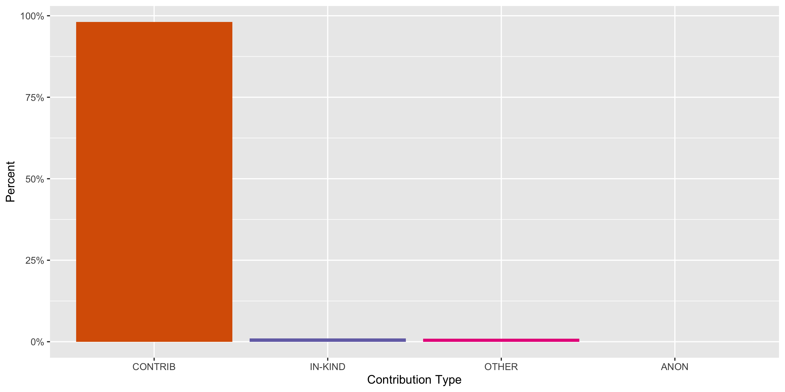
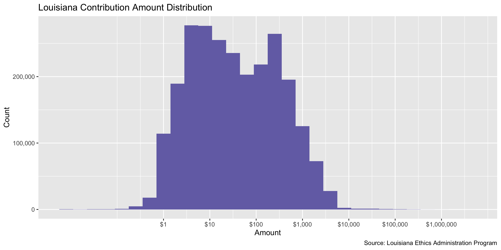
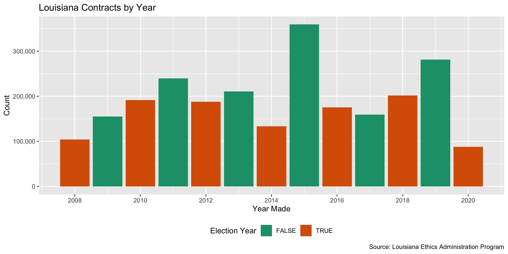

Louisiana Contracts
================
Yanqi Xu
2020-10-02 21:22:27

  - [Project](#project)
  - [Objectives](#objectives)
  - [Packages](#packages)
  - [Data](#data)
  - [Download](#download)
  - [Read](#read)
  - [Explore](#explore)
  - [Wrangle](#wrangle)
  - [Conclude](#conclude)
  - [Export](#export)
  - [Upload](#upload)
  - [Dictionary](#dictionary)

<!-- Place comments regarding knitting here -->

## Project

The Accountability Project is an effort to cut across data silos and
give journalists, policy professionals, activists, and the public at
large a simple way to search across huge volumes of public data about
people and organizations.

Our goal is to standardizing public data on a few key fields by thinking
of each dataset row as a transaction. For each transaction there should
be (at least) 3 variables:

1.  All **parties** to a transaction.
2.  The **date** of the transaction.
3.  The **amount** of money involved.

## Objectives

This document describes the process used to complete the following
objectives:

1.  How many records are in the database?
2.  Check for entirely duplicated records.
3.  Check ranges of continuous variables.
4.  Is there anything blank or missing?
5.  Check for consistency issues.
6.  Create a five-digit ZIP Code called `zip`.
7.  Create a `year` field from the transaction date.
8.  Make sure there is data on both parties to a transaction.

## Packages

The following packages are needed to collect, manipulate, visualize,
analyze, and communicate these results. The `pacman` package will
facilitate their installation and attachment.

The IRW’s `campfin` package will also have to be installed from GitHub.
This package contains functions custom made to help facilitate the
processing of campaign finance data.

``` r
if (!require("pacman")) install.packages("pacman")
pacman::p_load_gh("irworkshop/campfin")
pacman::p_load(
  tidyverse, # data manipulation
  lubridate, # datetime strings
  gluedown, # printing markdown
  magrittr, # pipe operators
  janitor, # clean data frames
  refinr, # cluster and merge
  scales, # format strings
  knitr, # knit documents
  vroom, # read files fast
  rvest, # html scraping
  glue, # combine strings
  here, # relative paths
  httr, # http requests
  fs # local storage 
)
```

This document should be run as part of the `R_campfin` project, which
lives as a sub-directory of the more general, language-agnostic
[`irworkshop/accountability_datacleaning`](https://github.com/irworkshop/accountability_datacleaning)
GitHub repository.

The `R_campfin` project uses the [RStudio
projects](https://support.rstudio.com/hc/en-us/articles/200526207-Using-Projects)
feature and should be run as such. The project also uses the dynamic
`here::here()` tool for file paths relative to *your* machine.

``` r
# where does this document knit?
here::here()
#> [1] "/Users/yanqixu/code/accountability_datacleaning/R_campfin"
```

## Data

## Download

Campaign contribution data is available from the [Louisiana Ethics
Administration
Program](http://www.ethics.la.gov/CampaignFinanceSearch/SearchResultsByContributions.aspx).

Since the website is only able to export 100,000 records at a time, we
separated the year into two halves. The first from 01/01 to 06/30, and
the second from 07/01 to 12/31. We can see that the record counts of
these two files add up to the total count of a year.

``` r
raw_dir <- dir_create(here("la", "contribs", "data", "raw"))
source <- "Louisiana Ethics Administration Program"
```

## Read

More in formation about the types of forms that are filed can be found
on the Louisiana Ethics Administration Program’s
[website](http://ethics.la.gov/CampFinanForms.aspx#CandidateForms)

``` r
lac <- map_dfr(dir_ls(raw_dir), read_csv, col_types = cols(.default = col_character())) %>% clean_names()

lac <- lac %>% 
  mutate(contribution_date = contribution_date %>% as.Date(format = "%m/%d/%Y"))
```

## Explore

``` r
glimpse(lac)
#> Rows: 2,485,922
#> Columns: 15
#> $ filer_last_name          <chr> "ABC Merit PAC", "ABC Merit PAC", "ABC Merit PAC", "ABC Merit P…
#> $ filer_first_name         <chr> NA, NA, NA, NA, NA, NA, NA, NA, NA, NA, NA, NA, NA, NA, NA, NA,…
#> $ report_code              <chr> "F202", "F202", "F202", "F202", "F202", "F202", "F202", "F202",…
#> $ report_type              <chr> "30P", "30P", "30P", "30P", "30P", "30P", "30P", "30P", "30P", …
#> $ report_number            <chr> "LA-15838", "LA-15838", "LA-15838", "LA-15838", "LA-15838", "LA…
#> $ contributor_name         <chr> "SATTERFIELD & PONTIKES CONSTRUCTION GROUP LLC", "BARRIERE CONS…
#> $ contributor_addr1        <chr> "13551 River Rd", "#1 Galleria Blvd", "P.O. Box 4278", "P.O. Bo…
#> $ contributor_addr2        <chr> NA, "Suite 1650", NA, NA, NA, NA, NA, NA, NA, NA, NA, NA, NA, N…
#> $ contributor_city         <chr> "Luling", "Metairie", "New Orleans", "New Orleans", "New Orlean…
#> $ contributor_state        <chr> "LA", "LA", "LA", "LA", "LA", "LA", "LA", "LA", "LA", "LA", "LA…
#> $ contributor_zip          <chr> "70070", "70001", "70178", "70183-3730", "70123", "70448", "701…
#> $ contribution_type        <chr> "CONTRIB", "CONTRIB", "CONTRIB", "CONTRIB", "CONTRIB", "CONTRIB…
#> $ contribution_description <chr> NA, NA, NA, NA, NA, NA, NA, NA, NA, NA, NA, NA, NA, NA, NA, NA,…
#> $ contribution_date        <date> 2008-02-22, 2008-04-17, 2008-02-22, 2008-02-22, 2008-02-22, 20…
#> $ contribution_amt         <chr> "$250.00", "$250.00", "$250.00", "$250.00", "$250.00", "$250.00…
tail(lac)
#> # A tibble: 6 x 15
#>   filer_last_name filer_first_name report_code report_type report_number contributor_name
#>   <chr>           <chr>            <chr>       <chr>       <chr>         <chr>           
#> 1 Zuckerman       Jason            F102        10P         LA-88852      FL+WB ARCHITECT…
#> 2 Zuckerman       Jason            F103        SPCL        LA-88955      NEEL-SCHAFFER   
#> 3 Zuckerman       Jason            F102        10G         LA-89297      FALGOUST CO., L…
#> 4 Zuckerman       Jason            F102        10G         LA-89297      RANDALL W. BROW…
#> 5 Zuckerman       Jason            F102        10G         LA-89297      TOM SCHEDLER CA…
#> 6 Zuckerman       Jason            F102        10P         LA-88852      TERESA JEFFRIES 
#> # … with 9 more variables: contributor_addr1 <chr>, contributor_addr2 <chr>,
#> #   contributor_city <chr>, contributor_state <chr>, contributor_zip <chr>,
#> #   contribution_type <chr>, contribution_description <chr>, contribution_date <date>,
#> #   contribution_amt <chr>
```

### Missing

``` r
col_stats(lac, count_na)
#> # A tibble: 15 x 4
#>    col                      class        n         p
#>    <chr>                    <chr>    <int>     <dbl>
#>  1 filer_last_name          <chr>        0 0        
#>  2 filer_first_name         <chr>  1576100 0.634    
#>  3 report_code              <chr>        0 0        
#>  4 report_type              <chr>        0 0        
#>  5 report_number            <chr>        0 0        
#>  6 contributor_name         <chr>       88 0.0000354
#>  7 contributor_addr1        <chr>     6852 0.00276  
#>  8 contributor_addr2        <chr>  2262079 0.910    
#>  9 contributor_city         <chr>     4770 0.00192  
#> 10 contributor_state        <chr>     4604 0.00185  
#> 11 contributor_zip          <chr>    11627 0.00468  
#> 12 contribution_type        <chr>        0 0        
#> 13 contribution_description <chr>  2335942 0.940    
#> 14 contribution_date        <date>       0 0        
#> 15 contribution_amt         <chr>        0 0
```

``` r
lac <- lac %>% flag_na(contributor_name, contributor_city,contributor_addr1)
sum(lac$na_flag)
#> [1] 8018
```

``` r
lac %>% 
  filter(na_flag) %>% 
  select(contributor_name, contributor_city,contributor_addr1)
#> # A tibble: 8,018 x 3
#>    contributor_name            contributor_city contributor_addr1
#>    <chr>                       <chr>            <chr>            
#>  1 CHEVRON PHILLIPS CHEM CO LP Houston          <NA>             
#>  2 BBI                         <NA>             <NA>             
#>  3 LARRY MORAN CONSTRUCTION    Gonzales         <NA>             
#>  4 EVE MCMULLIN                <NA>             <NA>             
#>  5 DE GAULLE PROPERTIES        METAIRIE         <NA>             
#>  6 PSI PAC                     <NA>             <NA>             
#>  7 JOHN F STUMPF, JR           <NA>             <NA>             
#>  8 HIGH HORIZONS INC           <NA>             <NA>             
#>  9 JULIE STAFFORD              <NA>             <NA>             
#> 10 RIC SMITH                   METAIRIE         <NA>             
#> # … with 8,008 more rows
```

### Duplicates

``` r
lac <- flag_dupes(lac,dplyr::everything())
sum(lac$dupe_flag)
#> [1] 211357
```

``` r
lac %>% 
  filter(dupe_flag)
#> # A tibble: 211,357 x 17
#>    filer_last_name filer_first_name report_code report_type report_number contributor_name
#>    <chr>           <chr>            <chr>       <chr>       <chr>         <chr>           
#>  1 Baker           Pam              F102        SUP         LA-34442      POWERS HIGHTOWE…
#>  2 Baker           Pam              F102        SUP         LA-34442      POWERS HIGHTOWE…
#>  3 Blossman        Jay              F102        SUP         LA-16746      SCOTT DOYLE     
#>  4 Blossman        Jay              F102        SUP         LA-16746      SCOTT DOYLE     
#>  5 Broussard       Aaron            F102        SUP         LA-16666      LMAD INC. DBA S…
#>  6 Broussard       Aaron            F102        SUP         LA-16666      LMAD INC. DBA S…
#>  7 Buras           Camille          F102        90P         LA-14992      TULANE AVE LAW …
#>  8 Buras           Camille          F102        90P         LA-14992      TULANE AVE LAW …
#>  9 Buras           Camille          F102        90P         LA-14992      MARTIN E. REAGA…
#> 10 Buras           Camille          F102        90P         LA-14992      MARTIN E. REAGA…
#> # … with 211,347 more rows, and 11 more variables: contributor_addr1 <chr>,
#> #   contributor_addr2 <chr>, contributor_city <chr>, contributor_state <chr>,
#> #   contributor_zip <chr>, contribution_type <chr>, contribution_description <chr>,
#> #   contribution_date <date>, contribution_amt <chr>, na_flag <lgl>, dupe_flag <lgl>
```

### Categorical

``` r
col_stats(lac, n_distinct)
#> # A tibble: 17 x 4
#>    col                      class       n           p
#>    <chr>                    <chr>   <int>       <dbl>
#>  1 filer_last_name          <chr>    2651 0.00107    
#>  2 filer_first_name         <chr>    2284 0.000919   
#>  3 report_code              <chr>       8 0.00000322 
#>  4 report_type              <chr>      14 0.00000563 
#>  5 report_number            <chr>   35086 0.0141     
#>  6 contributor_name         <chr>  469046 0.189      
#>  7 contributor_addr1        <chr>  428581 0.172      
#>  8 contributor_addr2        <chr>   23425 0.00942    
#>  9 contributor_city         <chr>   16483 0.00663    
#> 10 contributor_state        <chr>      95 0.0000382  
#> 11 contributor_zip          <chr>   92215 0.0371     
#> 12 contribution_type        <chr>       4 0.00000161 
#> 13 contribution_description <chr>   33699 0.0136     
#> 14 contribution_date        <date>   4499 0.00181    
#> 15 contribution_amt         <chr>   26515 0.0107     
#> 16 na_flag                  <lgl>       2 0.000000805
#> 17 dupe_flag                <lgl>       2 0.000000805
```

``` r
explore_plot(lac, contribution_type)
```

<!-- -->

### Amounts

``` r
summary(lac$contribution_amt)
#>    Length     Class      Mode 
#>   2485922 character character
mean(lac$contribution_amt <= 0)
#> [1] 1
```

<!-- -->

### Dates

We can add the calendar year from `date` with `lubridate::year()`

``` r
lac <- mutate(lac, year = year(contribution_date))
```

``` r
min(lac$contribution_date)
#> [1] "2008-01-01"
sum(lac$year < 2000)
#> [1] 0
max(lac$contribution_date)
#> [1] "2020-08-31"
sum(lac$contribution_date > today())
#> [1] 0
```

<!-- -->

## Wrangle

To improve the searchability of the database, we will perform some
consistent, confident string normalization. For geographic variables
like city names and ZIP codes, the corresponding `campfin::normal_*()`
functions are tailor made to facilitate this process.

### Address

For the street `addresss` variable, the `campfin::normal_address()`
function will force consistence case, remove punctuation, and abbreviate
official USPS suffixes.

``` r
lac <- lac %>% 
  unite(
    col = address_full,
    contains("addr"),
    sep = " ",
    remove = FALSE,
    na.rm = TRUE
  ) %>% 
  mutate(
    contributor_address_norm = normal_address(
      address = address_full,
      abbs = usps_street,
      na_rep = TRUE
    )
  ) %>% 
  select(-address_full)
```

``` r
lac %>% 
  select(contains("address")) %>% 
  distinct() %>% 
  sample_n(10)
#> # A tibble: 10 x 1
#>    contributor_address_norm                    
#>    <chr>                                       
#>  1 1539 JACKSON AVE 100                        
#>  2 60461 DOSS RD                               
#>  3 102 PARIS ST                                
#>  4 306 S 13 TH ST                              
#>  5 15229 WADESBORO RD                          
#>  6 3839 SE 113 TH AVE                          
#>  7 7673 PERKINS RD STE A 5                     
#>  8 NATIONAL ASSN OF REALTORS 430 N MICHIGAN AVE
#>  9 9890 ELLERBE RD                             
#> 10 1921 GENERAL TAYLOR 4
```

### ZIP

For ZIP codes, the `campfin::normal_zip()` function will attempt to
create valid *five* digit codes by removing the ZIP+4 suffix and
returning leading zeroes dropped by other programs like Microsoft Excel.

``` r
lac <- lac %>% 
  mutate(
    contributor_zip_norm = normal_zip(
      zip = contributor_zip,
      na_rep = TRUE
    )
  )
```

``` r
progress_table(
  lac$contributor_zip,
  lac$contributor_zip_norm,
  compare = valid_zip
)
#> # A tibble: 2 x 6
#>   stage                prop_in n_distinct prop_na   n_out n_diff
#>   <chr>                  <dbl>      <dbl>   <dbl>   <dbl>  <dbl>
#> 1 contributor_zip        0.565      92215 0.00468 1075987  80843
#> 2 contributor_zip_norm   0.998      17531 0.00487    4536    919
```

### State

Valid two digit state abbreviations can be made using the
`campfin::normal_state()` function.

``` r
lac <- lac %>% 
  mutate(
    contributor_state_norm = normal_state(
      state = contributor_state,
      abbreviate = TRUE,
      na_rep = TRUE,
      valid = valid_state
    )
  )
```

``` r
lac %>% 
  filter(contributor_state != contributor_state_norm) %>% 
  count(contributor_state, sort = TRUE)
#> # A tibble: 16 x 2
#>    contributor_state     n
#>    <chr>             <int>
#>  1 La                   41
#>  2 ms                   28
#>  3 Ne                   14
#>  4 Ca                   11
#>  5 Ma                    6
#>  6 Tx                    5
#>  7 la                    3
#>  8 tx                    3
#>  9 Ar                    2
#> 10 Co                    2
#> 11 Ct                    1
#> 12 Fl                    1
#> 13 Il                    1
#> 14 Mi                    1
#> 15 Vi                    1
#> 16 Wa                    1
```

``` r
progress_table(
  lac$contributor_state,
  lac$contributor_state_norm,
  compare = valid_state
)
#> # A tibble: 2 x 6
#>   stage                  prop_in n_distinct prop_na n_out n_diff
#>   <chr>                    <dbl>      <dbl>   <dbl> <dbl>  <dbl>
#> 1 contributor_state         1.00         95 0.00185   300     39
#> 2 contributor_state_norm    1            56 0.00193     0      1
```

### City

Cities are the most difficult geographic variable to normalize, simply
due to the wide variety of valid cities and formats.

#### Normal

The `campfin::normal_city()` function is a good start, again converting
case, removing punctuation, but *expanding* USPS abbreviations. We can
also remove `invalid_city` values.

``` r
lac <- lac %>% 
  mutate(
    contributor_city_norm = normal_city(
      city = contributor_city, 
      abbs = usps_city,
      states = c("LA", "DC", "LOUISIANA"),
      na = invalid_city,
      na_rep = TRUE
    )
  )
```

#### Swap

We can further improve normalization by comparing our normalized value
against the *expected* value for that record’s state abbreviation and
ZIP code. If the normalized value is either an abbreviation for or very
similar to the expected value, we can confidently swap those two.

``` r
lac <- lac %>% 
  rename(contributor_city_raw = contributor_city) %>% 
  left_join(
    y = zipcodes,
    by = c(
      "contributor_state_norm" = "state",
      "contributor_zip_norm" = "zip"
    )
  ) %>% 
  rename(contributor_city_match = city) %>% 
  mutate(
    match_abb = is_abbrev(contributor_city_norm, contributor_city_match),
    match_dist = str_dist(contributor_city_norm, contributor_city_match),
    contributor_city_swap = if_else(
      condition = !is.na(match_dist) & (match_abb | match_dist == 1),
      true = contributor_city_match,
      false = contributor_city_norm
    )
  ) %>% 
  select(
    -contributor_city_match,
    -match_dist,
    -match_abb
  )
```

#### Refine

The [OpenRefine](https://openrefine.org/) algorithms can be used to
group similar strings and replace the less common versions with their
most common counterpart. This can greatly reduce inconsistency, but with
low confidence; we will only keep any refined strings that have a valid
city/state/zip combination.

``` r
good_refine <- lac %>% 
  mutate(
    contributor_city_refine = contributor_city_swap %>% 
      key_collision_merge() %>% 
      n_gram_merge(numgram = 1)
  ) %>% 
  filter(contributor_city_refine != contributor_city_swap) %>% 
  inner_join(
    y = zipcodes,
    by = c(
      "contributor_city_refine" = "city",
      "contributor_state_norm" = "state",
      "contributor_zip_norm" = "zip"
    )
  )
```

    #> # A tibble: 161 x 5
    #>    contributor_state_norm contributor_zip_norm contributor_city_swap contributor_city_refine     n
    #>    <chr>                  <chr>                <chr>                 <chr>                   <int>
    #>  1 LA                     70508                LAFAYETTE LA          LAFAYETTE                  99
    #>  2 LA                     70611                LAKE CHARLES LA       LAKE CHARLES               81
    #>  3 LA                     70427                BOGALUSA LA           BOGALUSA                   77
    #>  4 LA                     70448                MANDEVILLE LA         MANDEVILLE                 56
    #>  5 LA                     70506                LAFAYETTE LA          LAFAYETTE                  17
    #>  6 LA                     70503                LAFAYETTE LA          LAFAYETTE                  15
    #>  7 LA                     70570                OPELOUSAS LA          OPELOUSAS                  15
    #>  8 LA                     70068                LAPALCE               LA PLACE                   10
    #>  9 LA                     71325                CHEYNEVILLE           CHENEYVILLE                 9
    #> 10 LA                     70001                METIAIRE              METAIRIE                    8
    #> # … with 151 more rows

Then we can join the refined values back to the database.

``` r
lac <- lac %>% 
  left_join(good_refine) %>% 
  mutate(contributor_city_refine = coalesce(contributor_city_refine, contributor_city_swap))
```

#### Progress

| stage                     | prop\_in | n\_distinct | prop\_na | n\_out | n\_diff |
| :------------------------ | -------: | ----------: | -------: | -----: | ------: |
| contributor\_city\_raw)   |    0.980 |       12345 |    0.002 |  50696 |    4217 |
| contributor\_city\_norm   |    0.989 |       11498 |    0.002 |  27167 |    3346 |
| contributor\_city\_swap   |    0.996 |        9382 |    0.002 |   9259 |    1214 |
| contributor\_city\_refine |    0.997 |        9258 |    0.002 |   8525 |    1090 |

You can see how the percentage of valid values increased with each
stage.

<!-- -->

More importantly, the number of distinct values decreased each stage. We
were able to confidently change many distinct invalid values to their
valid equivalent.

<!-- -->

## Conclude

Before exporting, we can remove the intermediary normalization columns
and rename all added variables with the `_clean` suffix.

``` r
lac <- lac %>% 
  select(
    -contributor_city_norm,
    -contributor_city_swap,
     contributor_city_clean = contributor_city_refine
  ) %>% 
  rename_all(~str_replace(., "_norm", "_clean")) %>% 
  rename_all(~str_remove(., "_raw"))
```

``` r
glimpse(sample_n(lac, 20))
#> Rows: 20
#> Columns: 22
#> $ filer_last_name           <chr> "Troxler", "Valero Energy Corporation PAC (VALPAC)", "Acadian …
#> $ filer_first_name          <chr> "Tab", NA, NA, NA, "James", NA, NA, NA, "John Bel", NA, NA, NA…
#> $ report_code               <chr> "F102", "F202", "F202", "F202", "F102", "F202", "F202", "F202"…
#> $ report_type               <chr> "ANN", "ANN", "MON", "ANN", "30P", "10G", "MON", "ANN", "30P",…
#> $ report_number             <chr> "LA-69585", "LA-39403", "LA-37745", "LA-56471", "LA-31856", "L…
#> $ contributor_name          <chr> "A. DENIS AND LISA LANAUX III", "KIT C MURRAY", "IAN P SCHEXNA…
#> $ contributor_addr1         <chr> "132 Cottage Drive", "One Valero Place", "2124 Sunshine Lane",…
#> $ contributor_addr2         <chr> NA, NA, NA, NA, NA, NA, NA, NA, NA, NA, NA, NA, NA, NA, "765 B…
#> $ contributor_city          <chr> "Luling", "San Antonio", "Abbeville", "CALVERT", "Metairie", "…
#> $ contributor_state         <chr> "LA", "TX", "LA", "AL", "LA", "LA", "AR", "MS", "LA", "LA", "L…
#> $ contributor_zip           <chr> "70070-3200", "78249", "70510-0000", "36513", "70001", "71301"…
#> $ contribution_type         <chr> "CONTRIB", "CONTRIB", "CONTRIB", "CONTRIB", "CONTRIB", "CONTRI…
#> $ contribution_description  <chr> NA, NA, NA, NA, NA, NA, NA, NA, NA, NA, NA, NA, NA, NA, NA, NA…
#> $ contribution_date         <date> 2017-01-20, 2013-01-31, 2013-11-30, 2015-12-28, 2011-03-22, 2…
#> $ contribution_amt          <dbl> NA, NA, NA, NA, NA, NA, NA, NA, NA, NA, NA, NA, NA, NA, NA, NA…
#> $ na_flag                   <lgl> FALSE, FALSE, FALSE, FALSE, FALSE, FALSE, FALSE, FALSE, FALSE,…
#> $ dupe_flag                 <lgl> FALSE, FALSE, FALSE, FALSE, FALSE, FALSE, FALSE, TRUE, FALSE, …
#> $ year                      <dbl> 2017, 2013, 2013, 2015, 2011, 2017, 2013, 2015, 2019, 2013, 20…
#> $ contributor_address_clean <chr> "132 COTTAGE DR", "ONE VALERO PLACE", "2124 SUNSHINE LN", "PO …
#> $ contributor_zip_clean     <chr> "70070", "78249", "70510", "36513", "70001", "71301", "72802",…
#> $ contributor_state_clean   <chr> "LA", "TX", "LA", "AL", "LA", "LA", "AR", "MS", "LA", "LA", "L…
#> $ contributor_city_clean    <chr> "LULING", "SAN ANTONIO", "ABBEVILLE", "CALVERT", "METAIRIE", "…
```

1.  There are 2,485,988 records in the database.
2.  There are 211,423 duplicate records in the database.
3.  The range and distribution of `amount` and `date` seem reasonable.
4.  There are 8,018 records missing key variables.
5.  Consistency in geographic data has been improved with
    `campfin::normal_*()`.
6.  The 4-digit `year` variable has been created with
    `lubridate::year()`.

## Export

Now the file can be saved on disk for upload to the Accountability
server.

``` r
clean_dir <- dir_create(here("la", "contribs", "data", "clean"))
clean_path <- path(clean_dir, "la_contribs_clean.csv")
write_csv(lac, clean_path, na = "")
file_size(clean_path)
#> 424M
file_encoding(clean_path)
#> # A tibble: 1 x 3
#>   path                                                                                mime  charset
#>   <fs::path>                                                                          <chr> <chr>  
#> 1 /Users/yanqixu/code/accountability_datacleaning/R_campfin/la/contribs/data/clean/l… <NA>  <NA>
```

## Upload

Using the `aws.s3` package, we can upload the file to the IRW server.

``` r
s3_path <- path("csv", basename(clean_path))
put_object(
  file = clean_path,
  object = s3_path, 
  bucket = "publicaccountability",
  acl = "public-read",
  multipart = TRUE,
  show_progress = TRUE
)
as_fs_bytes(object_size(s3_path, "publicaccountability"))
```

## Dictionary

The following table describes the variables in our final exported file:

| Column                      | Type        | Definition                             |
| :-------------------------- | :---------- | :------------------------------------- |
| `filer_last_name`           | `character` | Last name of filer                     |
| `filer_first_name`          | `character` | First name of filer                    |
| `report_code`               | `character` | Type of document filed                 |
| `report_type`               | `character` | Form schedule                          |
| `report_number`             | `character` | Date contribution was made             |
| `contributor_name`          | `character` | Contributor name                       |
| `contributor_addr1`         | `character` | Contributor street address             |
| `contributor_addr2`         | `character` | Contributor secondary address          |
| `contributor_city`          | `character` | Contributor city name                  |
| `contributor_state`         | `character` | Contributor state abbreviation         |
| `contributor_zip`           | `character` | Contributor ZIP+4 code                 |
| `contribution_type`         | `character` | Contribution method                    |
| `contribution_description`  | `character` | Contribution description               |
| `contribution_date`         | `double`    | Contribution date                      |
| `contribution_amt`          | `double`    | Contribution amount or correction      |
| `na_flag`                   | `logical`   | Flag for missing date, amount, or name |
| `dupe_flag`                 | `logical`   | Flag for completely duplicated record  |
| `year`                      | `double`    | Calendar year of contribution date     |
| `contributor_address_clean` | `character` | Normalized combined street address     |
| `contributor_zip_clean`     | `character` | Normalized 5-digit ZIP code            |
| `contributor_state_clean`   | `character` | Normalized 2-digit state abbreviation  |
| `contributor_city_clean`    | `character` | Normalized city name                   |

``` r
write_lines(
  x = c("# Louisiana Contributions Data Dictionary\n", dict_md),
  path = here("la", "contribs", "la_contribs_dict.md"),
)
```
