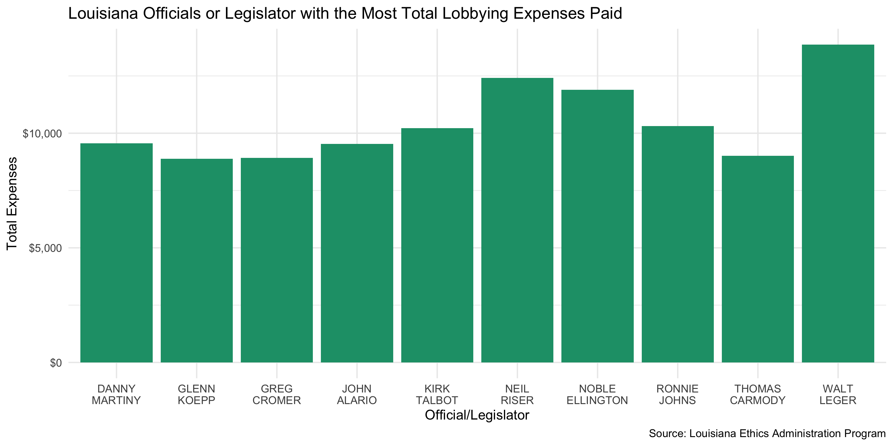

Louisiana Lobbying Expenditure Data Diary
================
Yanqi Xu
2020-01-14 12:46:18

-   [Project](#project)
-   [Objectives](#objectives)
-   [Packages](#packages)
-   [Data sources](#data-sources)
-   [Reading](#reading)
    -   [Duplicates](#duplicates)
    -   [Missing](#missing)
    -   [Join](#join)
    -   [Explore](#explore)
    -   [Wrangle](#wrangle)
    -   [Writing](#writing)

Project
-------

The Accountability Project is an effort to cut across data silos and give journalists, policy professionals, activists, and the public at large a simple way to search across huge volumes of public data about people and organizations.

Our goal is to standardizing public data on a few key fields by thinking of each dataset row as a transaction. For each transaction there should be (at least) 3 variables:

1.  All **parties** to a transaction
2.  The **date** of the transaction
3.  The **amount** of money involved

Objectives
----------

This document describes the process used to complete the following objectives:

1.  How many records are in the database?
2.  Check for duplicates
3.  Check ranges
4.  Is there anything blank or missing?
5.  Check for consistency issues
6.  Create a five-digit ZIP Code called `ZIP5`
7.  Create a `YEAR` field from the transaction date
8.  Make sure there is data on both parties to a transaction

Packages
--------

The following packages are needed to collect, manipulate, visualize, analyze, and communicate these results. The `pacman` package will facilitate their installation and attachment.

``` r
if (!require("pacman")) install.packages("pacman")
pacman::p_load_gh("irworkshop/campfin")
pacman::p_load(
  stringdist, # levenshtein value
  tidyverse, # data manipulation
  readxl, # import excel files
  lubridate, # datetime strings
  tidytext, # string analysis
  magrittr, # pipe opperators
  janitor, # dataframe clean
  refinr, # cluster and merge
  knitr, # knit documents
  glue, # combine strings
  patchwork, # position plots
  scales, #format strings
  here, # relative storage
  fs, # search storage 
  vroom, #read deliminated files
  readxl #read excel files
)
```

This document should be run as part of the `R_campfin` project, which lives as a sub-directory of the more general, language-agnostic \[`irworkshop/accountability_datacleaning`\]\[01\] GitHub repository.

The `R_campfin` project uses the \[RStudio projects\]\[02\] feature and should be run as such. The project also uses the dynamic `here::here()` tool for file paths relative to *your* machine.

Data sources
============

The data was obtained from the Louisiana Ethics Administration Program via a public record request. Expenditures are as current as December 9, 2020.

``` r
# where dfs this document knit?
here::here()
#> [1] "/Users/soc/accountability/accountability_datacleaning/R_campfin"
raw_dir <- here("la","lobbyists","data","raw","exp")
reg_proc <- here("la","lobbyists","data","processed","reg")
```

Reading
=======

We will notice that some rows were delimited incorrectly, as a supposedly single rows is separated into two lines with the first row of the overflow line an invalid forward slash.

``` r

la_lines <- read_lines(dir_ls(raw_dir, glob = "*.csv"))
la_cols <- str_split(la_lines[1], ",", simplify = TRUE)
la_lines <- la_lines[-1]

sum(str_detect(la_lines, "^\\D"))
#> [1] 4373
#> 4373

for (i in rev(seq_along(la_lines))) {
  if (is.na(la_lines[i])) {
    next()
  }
  if (str_detect(la_lines[i], "^\\D")) {
    la_lines[i - 1] <- str_c(la_lines[i - 1], la_lines[i], collapse = ",")
    la_lines[i] <- NA_character_
  }
}

la_lines <- na.omit(la_lines)

la_exp <- read_csv(la_lines, col_names = la_cols) %>% clean_names() %>% 
  mutate_if(is.character, str_to_upper) %>% 
  rename(unique_id = fake_unique_id)
```

``` r
la_exp %>% glimpse()
#> Observations: 170,718
#> Variables: 15
#> $ unique_id            <dbl> 2038, 2038, 2058, 2039, 2109, 2059, 2059, 2059, 2158, 2421, 2133, 2…
#> $ last_name_first_name <chr> "FAHRENTHOLD, BRIAN COLE", "FAHRENTHOLD, BRIAN COLE", "BRIGGS, DONA…
#> $ report_period        <chr> "JANUARY 09", "JANUARY 09", "JANUARY 09", "JANUARY 09", "JANUARY 09…
#> $ branch               <chr> "LEGISLATIVE", "EXECUTIVE", "LEGISLATIVE", "LEGISLATIVE", "LEGISLAT…
#> $ expence_type         <chr> "NOEXPENSE", "NOEXPENSE", "LEGISLATOR", "NOEXPENSE", "NOEXPENSE", "…
#> $ first_name           <chr> "NULL", "NULL", "JP", "NULL", "NULL", "SHARON", "FRANKLIN", "HUNTER…
#> $ last_name            <chr> "NULL", "NULL", "MORRELL", "NULL", "NULL", "BROOME", "FOIL", "GREEN…
#> $ department           <chr> "NULL", "NULL", "NULL", "NULL", "NULL", "NULL", "NULL", "NULL", "NU…
#> $ agency               <chr> "NULL", "NULL", "NULL", "NULL", "NULL", "NULL", "NULL", "NULL", "NU…
#> $ group_name           <chr> "NULL", "NULL", "NULL", "NULL", "NULL", "NULL", "NULL", "NULL", "NU…
#> $ group_event_date     <chr> "NULL", "NULL", "NULL", "NULL", "NULL", "NULL", "NULL", "NULL", "NU…
#> $ group_description    <chr> "NULL", "NULL", "NULL", "NULL", "NULL", "NULL", "NULL", "NULL", "NU…
#> $ amount               <dbl> 0.00, 0.00, 17.85, 0.00, 0.00, 31.00, 32.00, 37.00, 0.00, 0.00, 0.0…
#> $ description          <chr> "NO EXPENSE", "NO EXPENSE", "LEGISLATOR JP MORRELL", "NO EXPENSE", …
#> $ date_filed           <dttm> 2009-02-06 07:38:00, 2009-02-06 07:38:00, 2009-02-06 08:04:00, 200…
```

We'll clean the fields that contain strings like "NULL" a bit.

``` r
la_exp <- la_exp %>% 
  mutate_if(is.character,na_if, "NULL")
```

Duplicates
----------

``` r
la_exp <- flag_dupes(la_exp, dplyr::everything())
```

Missing
-------

``` r
col_stats(la_exp, count_na)
#> # A tibble: 16 x 4
#>    col                  class       n     p
#>    <chr>                <chr>   <int> <dbl>
#>  1 unique_id            <dbl>       0 0    
#>  2 last_name_first_name <chr>       0 0    
#>  3 report_period        <chr>       0 0    
#>  4 branch               <chr>       0 0    
#>  5 expence_type         <chr>       0 0    
#>  6 first_name           <chr>  128370 0.752
#>  7 last_name            <chr>  128370 0.752
#>  8 department           <chr>  159522 0.934
#>  9 agency               <chr>  157600 0.923
#> 10 group_name           <chr>  160836 0.942
#> 11 group_event_date     <chr>  160801 0.942
#> 12 group_description    <chr>  160804 0.942
#> 13 amount               <dbl>       0 0    
#> 14 description          <chr>       0 0    
#> 15 date_filed           <dttm>      0 0    
#> 16 dupe_flag            <lgl>       0 0
```

We'll flag that instances where the lobbyist name is missing.

``` r
la_exp <- la_exp %>% flag_na(last_name_first_name, report_period, amount)
```

Join
----

``` r
la_reg <- read_csv(file.path(here("la", "lobbyists", "data", "processed", "reg"), "la_reg_clean.csv"))

la_exp <- la_exp %>% mutate(year = as.numeric(year(date_filed)))

la_reg <- la_reg %>% select(unique_id, first_name, middle, last_name, m_street_norm, m_city_clean, m_state_norm, year_registered) %>% 
  rename(year = year_registered,
         lob_first_name = first_name,
         lob_middle = middle,
         lob_last_name = last_name)
la_reg <- flag_dupes(la_reg, dplyr::everything())
  # unite(first_name, middle, col = lob_first_middle, na.rm = TRUE, remove = FALSE, sep = " ") %>% 
  # unite(last_name, lob_first_middle, col = lob_full_name, na.rm = TRUE, remove = FALSE, sep = ", ") %>% 
la_exp <- la_reg %>% filter(!dupe_flag) %>% 
right_join(la_exp, by = c('unique_id', 'year'))
```

Explore
-------


``` r
la_exp %>% 
  group_by(branch) %>% 
  ggplot(aes(branch)) +
  geom_bar(fill = RColorBrewer::brewer.pal(3, "Dark2")[1]) +
  labs(
    title = "Louisiana Lobbying Expenditure Amount by Lobbying Branch",
    caption = "Source: Louisiana Ethics Administration Program",
    x = "Branch",
    y = "Count"
  )
```

 \#\#\# Top officials with highest total associated lobbying expenses 

Wrangle
-------

### Date

We'll tweak the `report_period` column to follow the 4-digit format.

``` r
la_exp <- la_exp %>% 
  mutate(year = str_extract(str_replace(report_period, " 09", " 2009"), "\\d{4}"))
```

### Name

Writing
-------

``` r
clean_exp_dir <- here("la", "lobbyists", "data", "processed", "exp")
dir_create(clean_exp_dir)
la_exp %>%
  write_csv(path = glue("{clean_exp_dir}/la_exp_clean.csv"),
            na = "")
```
