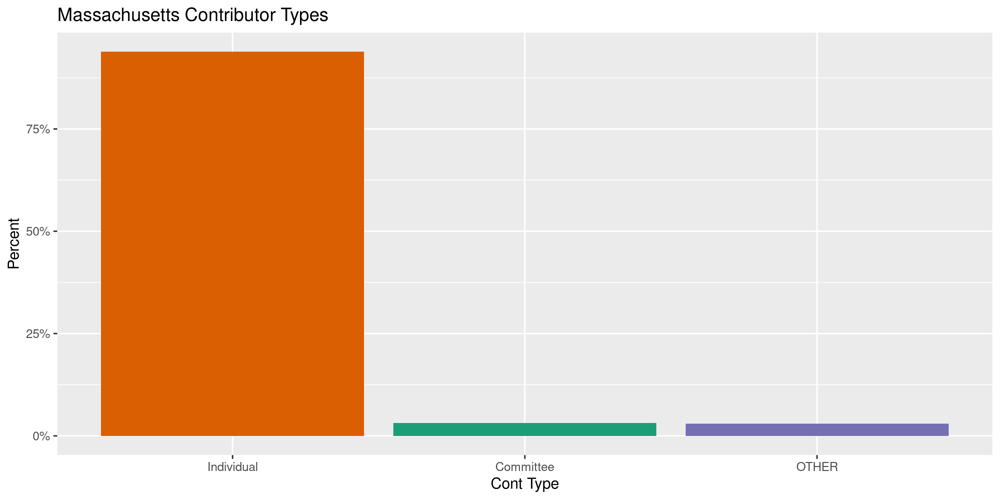
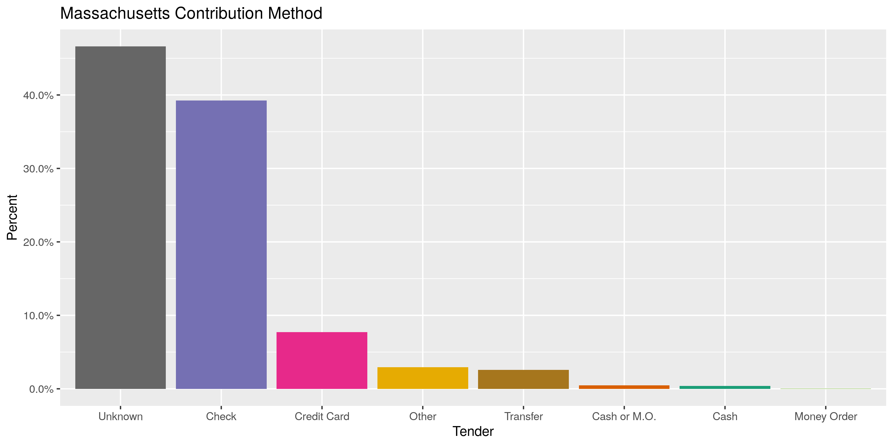
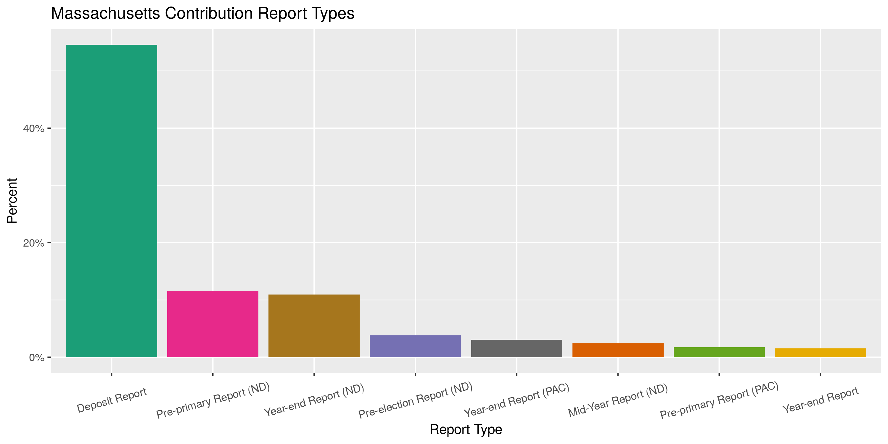
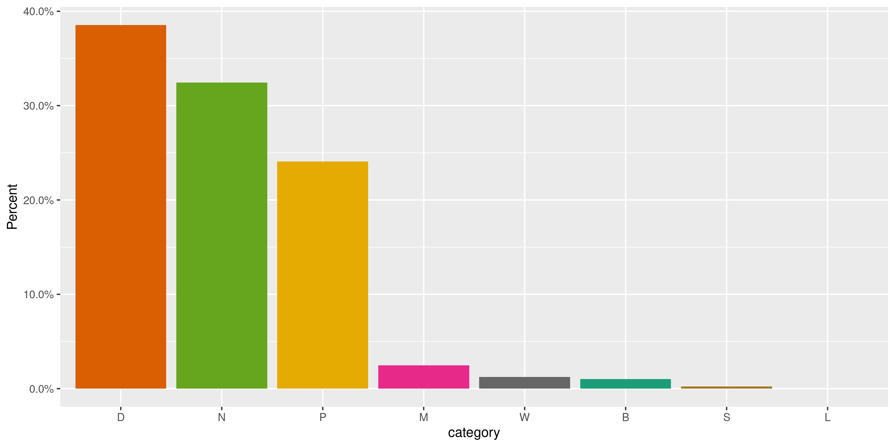
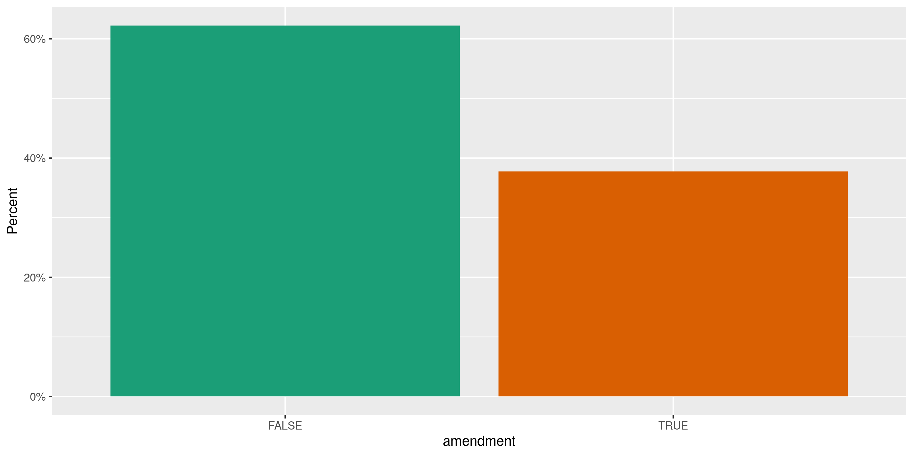
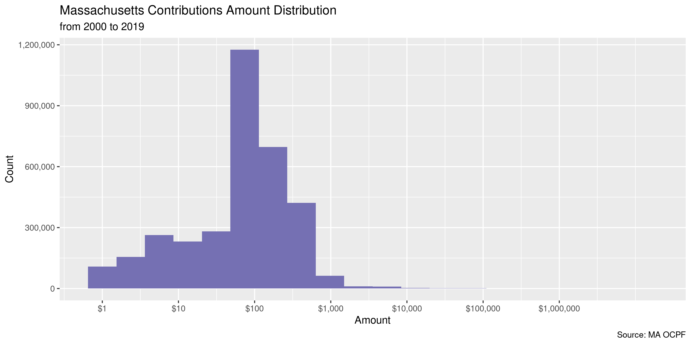
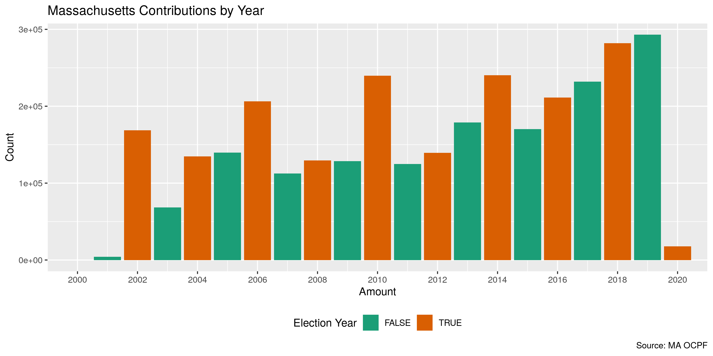
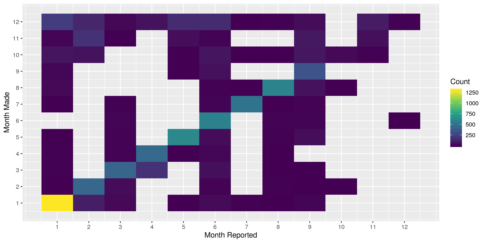
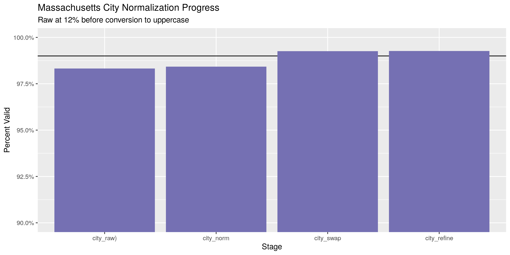
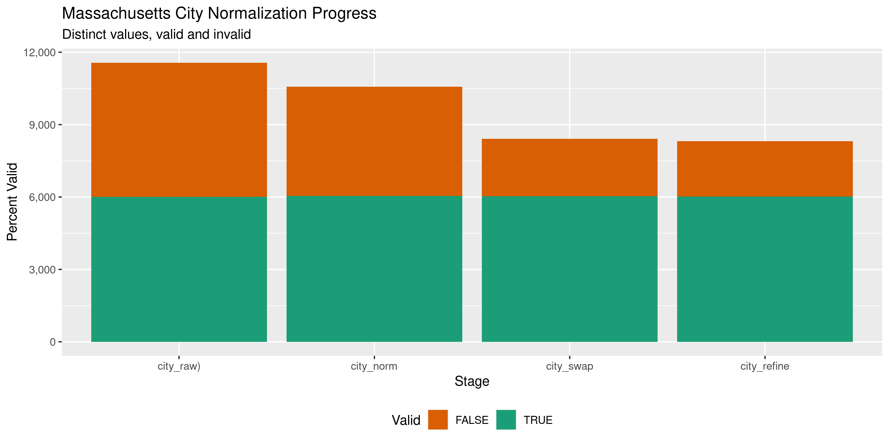

Massachusetts Contributions
================
Kiernan Nicholls
2020-11-02 12:46:30

  - [Project](#project)
  - [Objectives](#objectives)
  - [Packages](#packages)
  - [Data](#data)
  - [Download](#download)
  - [Read](#read)
  - [Explore](#explore)
  - [Missing](#missing)
  - [Duplicates](#duplicates)
  - [Categorical](#categorical)
  - [Amounts](#amounts)
  - [Dates](#dates)
  - [Wrangle](#wrangle)
  - [Conclude](#conclude)
  - [Export](#export)
  - [Upload](#upload)
  - [Dictionary](#dictionary)

<!-- Place comments regarding knitting here -->

## Project

The Accountability Project is an effort to cut across data silos and
give journalists, policy professionals, activists, and the public at
large a simple way to search across huge volumes of public data about
people and organizations.

Our goal is to standardizing public data on a few key fields by thinking
of each dataset row as a transaction. For each transaction there should
be (at least) 3 variables:

1.  All **parties** to a transaction.
2.  The **date** of the transaction.
3.  The **amount** of money involved.

## Objectives

This document describes the process used to complete the following
objectives:

1.  How many records are in the database?
2.  Check for entirely duplicated records.
3.  Check ranges of continuous variables.
4.  Is there anything blank or missing?
5.  Check for consistency issues.
6.  Create a five-digit ZIP Code called `zip`.
7.  Create a `year` field from the transaction date.
8.  Make sure there is data on both parties to a transaction.

## Packages

The following packages are needed to collect, manipulate, visualize,
analyze, and communicate these results. The `pacman` package will
facilitate their installation and attachment.

The IRW’s `campfin` package will also have to be installed from GitHub.
This package contains functions custom made to help facilitate the
processing of campaign finance data.

``` r
if (!require("pacman")) install.packages("pacman")
pacman::p_load_gh("irworkshop/campfin")
pacman::p_load_gh("kiernann/mdbr")
pacman::p_load(
  tidyverse, # data manipulation
  lubridate, # datetime strings
  magrittr, # pipe operators
  gluedown, # print markdown
  janitor, # dataframe clean
  aws.s3, # aws cloud storage
  refinr, # cluster and merge
  scales, # format strings
  knitr, # knit documents
  vroom, # read files fast
  glue, # combine strings
  here, # relative storage
  fs # search storage 
)
```

This document should be run as part of the `R_campfin` project, which
lives as a sub-directory of the more general, language-agnostic
[`irworkshop/accountability_datacleaning`](https://github.com/irworkshop/accountability_datacleaning)
GitHub repository.

The `R_campfin` project uses the [RStudio
projects](https://support.rstudio.com/hc/en-us/articles/200526207-Using-Projects)
feature and should be run as such. The project also uses the dynamic
`here::here()` tool for file paths relative to *your* machine.

``` r
# where does this document knit?
here::here()
#> [1] "/home/kiernan/Code/tap/R_campfin"
```

## Data

Data is obtained from the Massachusetts \[Office of Campaign and
Political Finance (OCPF)\]\[<https://www.ocpf.us/>\].

> The Office of Campaign and Political Finance is an independent state
> agency that administers Massachusetts General Law
> [Chapter 55](https://www.ocpf.us/Legal/CampaignFinanceLaw) the
> campaign finance law, and
> [Chapter 55C](https://www.ocpf.us/Legal/PublicFinancingLaw), the
> limited public financing program for statewide candidates. Established
> in 1973, OCPF is the depository for disclosure reports filed by
> candidates and political committees under M.G.L. Chapter 55.

## Download

The data is provided as an archived [Microsoft Access (MDB)
file](http://ocpf2.blob.core.windows.net/downloads/data/campaign-finance-reports.zip).
This file is updated nightly at 3:00am.

> Download a zipped Microsoft Access 2000 format (`.mdb`) database that
> includes report summaries, receipts, expenditures, in-kind
> contributions, liabilities, assets disposed, savings accounts, credit
> card reports, reimbursement reports and subvendor reports.

We can download this archive and extract the file to the
`ma/contribs/data/raw` directory.

``` r
raw_dir <- dir_create(here("ma", "contribs", "data", "raw"))
zip_name <- "campaign-finance-reports.zip"
zip_url <- str_c("http://ocpf2.blob.core.windows.net/downloads/data/", zip_name)
zip_path <- path(raw_dir, zip_name) 
```

``` r
if (!this_file_new(zip_path)) {
  download.file(zip_url, zip_path)
  unzip(zip_path, exdir = raw_dir)
}
```

``` r
mdb_path <- dir_ls(raw_dir, regexp = "mdb")
```

The mdbr package can be used to readr Microsoft Access files as if the
tables were flat text files. The package can be installed from GitHub.
The open-source MDB tools package must also be installed on your system.

``` r
remotes::install_github("kiernann/mdbr")
```

``` bash
$ sudo apt install mdbtools
```

``` r
mdb_tables <- mdb_tables(mdb_path)
md_bullet(md_code(mdb_tables))
```

  - `vUPLOAD_MASTER`
  - `vUPLOAD_tCURRENT_ASSETS_DISPOSED`
  - `vUPLOAD_tCURRENT_BANK_CREDITS`
  - `vUPLOAD_tCURRENT_CPF9_DETAIL`
  - `vUPLOAD_tCURRENT_CPF9_SUMMARIES`
  - `vUPLOAD_tCURRENT_EXPENDITURES`
  - `vUPLOAD_tCURRENT_INKINDS`
  - `vUPLOAD_tCURRENT_LIABILITIES`
  - `vUPLOAD_tCURRENT_R1_DETAIL`
  - `vUPLOAD_tCURRENT_R1_SUMMARIES`
  - `vUPLOAD_tCURRENT_RECEIPTS`
  - `vUPLOAD_tCURRENT_SAVINGS`
  - `vUPLOAD_tCURRENT_SUBVENDOR_ITEMS`
  - `vUPLOAD_tCURRENT_SUBVENDOR_SUMMARIES`

## Read

We can use this method to first read the `UPLOAD_CURRENT_RECEIPTS` file,
which contains all contributions made to Massachusetts political
committees.

``` r
mac <- read_mdb(
  file = mdb_path,
  table = "vUPLOAD_tCURRENT_RECEIPTS",
  na = c("", "NA", "N/A"),
  col_types = cols(
    .default = col_character(),
    Date = col_date(),
    Amount = col_double()
  )
)
```

The records of the receipts file are provided to OCPF on reports,
identified by the `rpt_id` variable. The receipt records themselves do
not contain the information on the committee recipients of each
contribution. The information on the receiving committee are contained
in the `UPLOAD_MASTER` database. We can read that table using the same
method as above.

``` r
master <- read_mdb(
  file = mdb_path,
  table = "vUPLOAD_MASTER",,
  na = c("", "NA", "N/A"),
  col_types = cols(
    .default = col_character(),
    Amendment = col_logical(),
    Filing_Date = col_datetime(),
    Report_Year = col_integer(),
    Beginning_Date = col_date(),
    Ending_Date = col_date()
  )
)
```

The records of this file contain the identifying information for the
receiving committees making each report. We can use
`dplyr::inner_join()` to join this table with the contributions table
along the `rpt_id` variable.

``` r
mac <- inner_join(mac, master, by = "rpt_id")
rm(master); flush_memory()
```

## Explore

There are 3,472,480 rows of 33 columns.

``` r
glimpse(mac)
#> Rows: 3,472,480
#> Columns: 33
#> $ id          <chr> "5358033", "5358034", "5358035", "5358036", "5358037", "5358038", "5358039",…
#> $ rpt_id      <chr> "39", "39", "39", "39", "39", "39", "39", "39", "39", "39", "39", "39", "39"…
#> $ line        <chr> "5358033", "5358034", "5358035", "5358036", "5358037", "5358038", "5358039",…
#> $ date        <date> 2002-01-02, 2002-01-02, 2002-01-02, 2002-01-02, 2002-01-02, 2002-01-02, 200…
#> $ cont_type   <chr> "Individual", "Individual", "Individual", "Individual", "Individual", "Indiv…
#> $ first       <chr> "E.A.", "Jacqueline", "Suzanne", "Willam", "Dave", "Trent", "Isabella", "Ros…
#> $ last        <chr> "Drake", "Michael", "Beale", "Beale", "Hemang", "Fisher", "Cataldo", "Del Ne…
#> $ address     <chr> "PO Box 452", "19 Gould Avenue", "8 Aspen Circle", "8 Aspen Circle", "1 Heri…
#> $ city        <chr> "Bedford", "Bedford", "Bedford", "Bedford", "Bedford", "Woburn", "Leominster…
#> $ state       <chr> "MA", "MA", "MA", "MA", "MA", "MA", "MA", "MA", "MA", "MA", "MA", "MA", "MA"…
#> $ zip         <chr> "01730", NA, NA, NA, NA, "01801", "01453", "01720", NA, "01754", "02148", "0…
#> $ occupation  <chr> NA, NA, NA, NA, NA, NA, NA, NA, NA, NA, NA, NA, NA, NA, NA, NA, NA, NA, NA, …
#> $ employer    <chr> NA, NA, NA, NA, NA, NA, NA, NA, NA, NA, NA, NA, NA, NA, NA, NA, NA, NA, NA, …
#> $ officer     <chr> NA, NA, NA, NA, NA, NA, NA, NA, NA, NA, NA, NA, NA, NA, NA, NA, NA, NA, NA, …
#> $ cont_id     <chr> NA, NA, NA, NA, NA, NA, NA, NA, NA, NA, NA, NA, NA, NA, NA, NA, NA, NA, NA, …
#> $ amount      <dbl> 5, 5, 5, 5, 5, 50, 5, 5, 5, 5, 5, 5, 5, 5, 5, 5, 5, 5, 5, 5, 10, 5, 10, 10, …
#> $ tender      <chr> "Other", "Other", "Other", "Other", "Other", "Other", "Other", "Other", "Oth…
#> $ guid        <chr> "{3ebe3d7f-a373-4fea-f491-b2e788d5f877}", "{b460d7a4-38a4-490f-8785-10a560a6…
#> $ rpt_year    <int> 2002, 2002, 2002, 2002, 2002, 2002, 2002, 2002, 2002, 2002, 2002, 2002, 2002…
#> $ filing_date <dttm> 2002-01-02 11:01:44, 2002-01-02 11:01:44, 2002-01-02 11:01:44, 2002-01-02 1…
#> $ start_date  <date> NA, NA, NA, NA, NA, NA, NA, NA, NA, NA, NA, NA, NA, NA, NA, NA, NA, NA, NA,…
#> $ end_date    <date> 2002-01-02, 2002-01-02, 2002-01-02, 2002-01-02, 2002-01-02, 2002-01-02, 200…
#> $ cpf_id      <chr> "13771", "13771", "13771", "13771", "13771", "13771", "13771", "13771", "137…
#> $ rpt_type    <chr> "Deposit Report", "Deposit Report", "Deposit Report", "Deposit Report", "Dep…
#> $ cand_name   <chr> "Jill Stein", "Jill Stein", "Jill Stein", "Jill Stein", "Jill Stein", "Jill …
#> $ office      <chr> "Constitutional", "Constitutional", "Constitutional", "Constitutional", "Con…
#> $ district    <chr> "Governor", "Governor", "Governor", "Governor", "Governor", "Governor", "Gov…
#> $ comm_name   <chr> "Jill Stein For Governor Campaign", "Jill Stein For Governor Campaign", "Jil…
#> $ comm_city   <chr> NA, NA, NA, NA, NA, NA, NA, NA, NA, NA, NA, NA, NA, NA, NA, NA, NA, NA, NA, …
#> $ comm_state  <chr> NA, NA, NA, NA, NA, NA, NA, NA, NA, NA, NA, NA, NA, NA, NA, NA, NA, NA, NA, …
#> $ comm_zip    <chr> NA, NA, NA, NA, NA, NA, NA, NA, NA, NA, NA, NA, NA, NA, NA, NA, NA, NA, NA, …
#> $ category    <chr> "D", "D", "D", "D", "D", "D", "D", "D", "D", "D", "D", "D", "D", "D", "D", "…
#> $ amendment   <lgl> FALSE, FALSE, FALSE, FALSE, FALSE, FALSE, FALSE, FALSE, FALSE, FALSE, FALSE,…
tail(mac)
#> # A tibble: 6 x 33
#>   id    rpt_id line  date       cont_type first last  address city  state zip   occupation employer
#>   <chr> <chr>  <chr> <date>     <chr>     <chr> <chr> <chr>   <chr> <chr> <chr> <chr>      <chr>   
#> 1 1410… 759427 1410… 2020-10-29 Individu… Joyce Simon 15 Ple… Sher… MA    01770 <NA>       <NA>    
#> 2 1410… 759427 1410… 2020-10-29 Individu… Judi… Shub… 38 Dov… Well… MA    02482 Not Emplo… Not Emp…
#> 3 1410… 759427 1410… 2020-10-29 Individu… David Letts 300 Pi… Bost… MA    02210 Not Emplo… Not Emp…
#> 4 1410… 759427 1410… 2020-10-29 Individu… Elyse Park  19 Wal… Need… MA    02492 Researcher MGH     
#> 5 1410… 759427 1410… 2020-10-29 Individu… Elyse Park  19 Wal… Need… MA    02492 Researcher MGH     
#> 6 1410… 759427 1410… 2020-10-29 Individu… Elea… Perk… 15 Che… Well… MA    02481 <NA>       <NA>    
#> # … with 20 more variables: officer <chr>, cont_id <chr>, amount <dbl>, tender <chr>, guid <chr>,
#> #   rpt_year <int>, filing_date <dttm>, start_date <date>, end_date <date>, cpf_id <chr>,
#> #   rpt_type <chr>, cand_name <chr>, office <chr>, district <chr>, comm_name <chr>,
#> #   comm_city <chr>, comm_state <chr>, comm_zip <chr>, category <chr>, amendment <lgl>
```

## Missing

We should flag any records missing one of the key variables needed to
properly identify a unique contribution.

``` r
col_stats(mac, count_na)
#> # A tibble: 33 x 4
#>    col         class        n      p
#>    <chr>       <chr>    <int>  <dbl>
#>  1 id          <chr>        0 0     
#>  2 rpt_id      <chr>        0 0     
#>  3 line        <chr>        0 0     
#>  4 date        <date>       0 0     
#>  5 cont_type   <chr>        0 0     
#>  6 first       <chr>   217717 0.0627
#>  7 last        <chr>    34939 0.0101
#>  8 address     <chr>   124847 0.0360
#>  9 city        <chr>   106770 0.0307
#> 10 state       <chr>   142019 0.0409
#> 11 zip         <chr>   152457 0.0439
#> 12 occupation  <chr>  1439295 0.414 
#> 13 employer    <chr>  1441294 0.415 
#> 14 officer     <chr>  3448263 0.993 
#> 15 cont_id     <chr>  3378129 0.973 
#> 16 amount      <dbl>        0 0     
#> 17 tender      <chr>        0 0     
#> 18 guid        <chr>        0 0     
#> 19 rpt_year    <int>        0 0     
#> 20 filing_date <dttm>       0 0     
#> 21 start_date  <date> 2006225 0.578 
#> 22 end_date    <date>       0 0     
#> 23 cpf_id      <chr>        0 0     
#> 24 rpt_type    <chr>        0 0     
#> 25 cand_name   <chr>        0 0     
#> 26 office      <chr>   689208 0.198 
#> 27 district    <chr>   443664 0.128 
#> 28 comm_name   <chr>    93399 0.0269
#> 29 comm_city   <chr>   919473 0.265 
#> 30 comm_state  <chr>   915046 0.264 
#> 31 comm_zip    <chr>   919528 0.265 
#> 32 category    <chr>        0 0     
#> 33 amendment   <lgl>        0 0
```

We can first `dplyr::coalesce()` the contributor and recipient variables
to only flag records missing *any* kind of name.

``` r
mac <- mac %>% 
  unite(
    col = contrib_any,
    first, last, 
    sep = " ",
    na.rm = TRUE,
    remove = FALSE
  ) %>% 
  relocate(contrib_any, .after = last_col()) %>% 
  mutate(across(contrib_any, na_if, "")) %>% 
  mutate(
    recip_any = coalesce(comm_name, cand_name)
  ) %>% 
  flag_na(contrib_any, recip_any, date, amount)
```

The only variable missing from theses columns is the coalesced
contributor name.

``` r
mac %>% 
  filter(na_flag) %>% 
  select(contrib_any, recip_any, date, amount) %>% 
  col_stats(count_na)
#> # A tibble: 4 x 4
#>   col         class      n     p
#>   <chr>       <chr>  <int> <dbl>
#> 1 contrib_any <chr>  32390     1
#> 2 recip_any   <chr>      0     0
#> 3 date        <date>     0     0
#> 4 amount      <dbl>      0     0
```

For all records with a `cont_type` of “OTHER”, there is no given
contributor name. We can remove these flags.

``` r
prop_na(mac$contrib_any[which(mac$cont_type != "OTHER")])
#> [1] 0.0003485177
prop_na(mac$contrib_any[which(mac$cont_type == "OTHER")])
#> [1] 0.308879
mac$na_flag[which(mac$cont_type == "OTHER")] <- FALSE
# very few remain
percent(mean(mac$na_flag), accuracy = 0.01)
#> [1] "0.03%"
```

## Duplicates

We can create a file containing every duplicate record in the data.

``` r
dupe_file <- path(dirname(raw_dir), "dupes.tsv")
if (!file_exists(dupe_file)) {
  file_create(dupe_file)
  mac <- mutate(mac, group = str_sub(date, end = 7))
  ma_id <- split(mac$id, mac$group)
  mas <- mac %>%
    select(-id, -line, -guid) %>% 
    group_split(group, .keep = FALSE)
  pb <- txtProgressBar(max = length(mas), style = 3)
  for (i in seq_along(mas)) {
    d1 <- duplicated(mas[[i]], fromLast = FALSE)
    d2 <- duplicated(mas[[i]], fromLast = TRUE)
    dupes <- data.frame(id = ma_id[[i]], dupe_flag = d1 | d2)
    dupes <- filter(dupes, dupe_flag)
    vroom_write(
      x = dupes,
      path = dupe_file,
      append = TRUE,
      progress = FALSE,
    )
    rm(d1, d2, dupes)
    mas[[i]] <- NA
    flush_memory(1)
    setTxtProgressBar(pb, i)
  }
}
```

``` r
dupes <- vroom(
  file = dupe_file,
  col_names = c("id", "dupe_flag"),
  col_types = cols(
    id = col_character(),
    dupe_flag = col_logical()
  )
)
```

This file can then be joined against the contributions using the
transaction ID.

``` r
mac <- left_join(mac, dupes, by = "id")
mac <- mutate(mac, dupe_flag = !is.na(dupe_flag))
percent(mean(mac$dupe_flag), 0.1)
#> [1] "2.4%"
```

``` r
mac %>% 
  filter(dupe_flag) %>% 
  select(contrib_any, recip_any, date, amount) %>% 
  arrange(date, contrib_any)
#> # A tibble: 83,052 x 4
#>    contrib_any           recip_any                        date       amount
#>    <chr>                 <chr>                            <date>      <dbl>
#>  1 DUSTY S. RHODES       COMMITTEE TO ELECT DANIEL BOSLEY 2001-01-03    500
#>  2 DUSTY S. RHODES       COMMITTEE TO ELECT DANIEL BOSLEY 2001-01-03    500
#>  3 Hans Bellerman        Steve Brewer Committee           2001-01-25     50
#>  4 Hans Bellerman        Steve Brewer Committee           2001-01-25     50
#>  5 JAMES T. MORRIS       THE WALSH COMMITTEE              2001-02-13    200
#>  6 JAMES T. MORRIS       THE WALSH COMMITTEE              2001-02-13    200
#>  7 ROBERT P. MURRAY, JR. THE WALSH COMMITTEE              2001-02-13    100
#>  8 ROBERT P. MURRAY, JR. THE WALSH COMMITTEE              2001-02-13    100
#>  9 ROBERT WHITE          THE WALSH COMMITTEE              2001-02-13    100
#> 10 ROBERT WHITE          THE WALSH COMMITTEE              2001-02-13    100
#> # … with 83,042 more rows
```

## Categorical

``` r
col_stats(mac, n_distinct)
#> # A tibble: 37 x 4
#>    col         class        n           p
#>    <chr>       <chr>    <int>       <dbl>
#>  1 id          <chr>  3472480 1          
#>  2 rpt_id      <chr>   162837 0.0469     
#>  3 line        <chr>  3472480 1          
#>  4 date        <date>    7216 0.00208    
#>  5 cont_type   <chr>        3 0.000000864
#>  6 first       <chr>   125329 0.0361     
#>  7 last        <chr>   261601 0.0753     
#>  8 address     <chr>   922950 0.266      
#>  9 city        <chr>    17069 0.00492    
#> 10 state       <chr>      319 0.0000919  
#> 11 zip         <chr>   131390 0.0378     
#> 12 occupation  <chr>    92049 0.0265     
#> 13 employer    <chr>   274531 0.0791     
#> 14 officer     <chr>     7766 0.00224    
#> 15 cont_id     <chr>     6813 0.00196    
#> 16 amount      <dbl>    31313 0.00902    
#> 17 tender      <chr>        8 0.00000230 
#> 18 guid        <chr>  3469204 0.999      
#> 19 rpt_year    <int>       24 0.00000691 
#> 20 filing_date <dttm>  162756 0.0469     
#> 21 start_date  <date>    1591 0.000458   
#> 22 end_date    <date>    6441 0.00185    
#> 23 cpf_id      <chr>     4441 0.00128    
#> 24 rpt_type    <chr>       72 0.0000207  
#> 25 cand_name   <chr>     4707 0.00136    
#> 26 office      <chr>       58 0.0000167  
#> 27 district    <chr>      371 0.000107   
#> 28 comm_name   <chr>     5911 0.00170    
#> 29 comm_city   <chr>      758 0.000218   
#> 30 comm_state  <chr>       36 0.0000104  
#> 31 comm_zip    <chr>      912 0.000263   
#> 32 category    <chr>        8 0.00000230 
#> 33 amendment   <lgl>        2 0.000000576
#> 34 contrib_any <chr>   904905 0.261      
#> 35 recip_any   <chr>     6092 0.00175    
#> 36 na_flag     <lgl>        2 0.000000576
#> 37 dupe_flag   <lgl>        2 0.000000576
```

<!-- -->

<!-- -->

<!-- -->

<!-- -->

<!-- -->

## Amounts

``` r
summary(mac$amount)
#>     Min.  1st Qu.   Median     Mean  3rd Qu.     Max. 
#>  -100000       25      100      383      200 12588840
mean(mac$amount <= 0)
#> [1] 0.007409978
```

<!-- -->

## Dates

The actual year a contribution was made sometimes differs from the year
in which it was reported. The later is identified int eh `rpt_year`
variable but we will create a new `year` variable from `date` using
`lubridate::year()`. This will more accurately identify the
contribution.

``` r
mac <- mutate(mac, year = year(date))
```

``` r
mac %>%
  count(year) %>%
  mutate(even = is_even(year)) %>% 
  ggplot(aes(x = year, y = n)) +
  geom_col(aes(fill = even)) +
  coord_cartesian(xlim = c(2000, 2020)) +
  scale_fill_brewer(palette = "Dark2") +
  scale_x_continuous(breaks = seq(2000, 2020, by = 2)) +
  theme(legend.position = "bottom") +
  labs(
    title = "Massachusetts Contributions by Year",
    caption = "Source: MA OCPF",
    fill = "Election Year",
    x = "Amount",
    y = "Count"
  )
```

<!-- -->

<!-- -->

``` r
min(mac$date)
#> [1] "1916-07-05"
sum(mac$year < 2001)
#> [1] 4
max(mac$date)
#> [1] "2097-05-24"
sum(mac$date > today())
#> [1] 6
```

## Wrangle

To improve the searchability of the database, we will perform some
consistent, confident string normalization. For geographic variables
like city names and ZIP codes, the corresponding `campfin::normal_*()`
functions are tailor made to facilitate this process.

``` r
comma(nrow(mac))
#> [1] "3,472,480"
```

### Address

For the street `addresss` variable, the `campfin::normal_address()`
function will force consistence case, remove punctuation, and abbreviate
official USPS suffixes.

This can be done by creating a separate table of unique normalized
addresses.

``` r
addr_norm <- mac %>%
  count(address, sort = TRUE) %>% 
  select(-n) %>% 
  mutate(
    address_norm = normal_address(
      address = address,
      abbs = usps_street,
      na_rep = TRUE
    )
  )
```

``` r
print(addr_norm)
#> # A tibble: 922,950 x 2
#>    address                     address_norm        
#>    <chr>                       <chr>               
#>  1 <NA>                        <NA>                
#>  2 159 South Main Street       159 S MAIN ST       
#>  3 159 S Main Street           159 S MAIN ST       
#>  4 159 S. Main St.             159 S MAIN ST       
#>  5 7 Laborers' Way             7 LABORERS WAY      
#>  6 33 Arch Street 26th Floor   33 ARCH ST 26TH FL  
#>  7 195 Old Colony Avenue       195 OLD COLONY AVE  
#>  8 11 Beacon Street  Suite 309 11 BEACON ST STE 309
#>  9 PO Box 441146               PO BOX 441146       
#> 10 35 Travis Street            35 TRAVIS ST        
#> # … with 922,940 more rows
```

Then joining that table on to the original contributions.

``` r
mac <- left_join(mac, addr_norm, by = "address")
rm(addr_norm)
```

### ZIP

For ZIP codes, the `campfin::normal_zip()` function will attempt to
create valid *five* digit codes by removing the ZIP+4 suffix and
returning leading zeroes dropped by other programs like Microsoft Excel.

``` r
zip_norm <- mac %>%
  count(zip, sort = TRUE) %>% 
  select(-n) %>% 
  mutate(
    zip_norm = normal_zip(
      zip = zip,
      na_rep = TRUE
    )
  )
```

``` r
mac <- left_join(mac, zip_norm, by = "zip")
rm(zip_norm)
```

``` r
progress_table(
  mac$zip,
  mac$zip_norm,
  compare = valid_zip
)
#> # A tibble: 2 x 6
#>   stage    prop_in n_distinct prop_na  n_out n_diff
#>   <chr>      <dbl>      <dbl>   <dbl>  <dbl>  <dbl>
#> 1 zip        0.856     131390  0.0439 477382 119656
#> 2 zip_norm   0.999      14010  0.0440   4731   1604
```

### State

Valid two digit state abbreviations can be made using the
`campfin::normal_state()` function.

``` r
state_norm <- mac %>%
  count(state, sort = TRUE) %>% 
  select(-n) %>% 
  mutate(
    state_norm = normal_state(
      state = state,
      abbreviate = TRUE,
      na_rep = TRUE,
      valid = NULL
    )
  )
```

``` r
mac <- left_join(mac, state_norm, by = "state")
rm(state_norm)
```

``` r
mac %>%
  filter(state != state_norm) %>%
  count(state, state_norm, sort = TRUE)
#> # A tibble: 140 x 3
#>    state state_norm     n
#>    <chr> <chr>      <int>
#>  1 ma    MA          2103
#>  2 Ma    MA          1759
#>  3 nh    NH           222
#>  4 ct    CT           175
#>  5 ri    RI           170
#>  6 Fl    FL           151
#>  7 ny    NY           125
#>  8 ca    CA           113
#>  9 Ca    CA            93
#> 10 fl    FL            85
#> # … with 130 more rows
```

``` r
progress_table(
  mac$state,
  mac$state_norm,
  compare = valid_state
)
#> # A tibble: 2 x 6
#>   stage      prop_in n_distinct prop_na n_out n_diff
#>   <chr>        <dbl>      <dbl>   <dbl> <dbl>  <dbl>
#> 1 state        0.998        319  0.0409  6575    257
#> 2 state_norm   1.00         173  0.0410   447    112
```

### City

Cities are the most difficult geographic variable to normalize, simply
due to the wide variety of valid cities and formats.

#### Normal

The `campfin::normal_city()` function is a good start, again converting
case, removing punctuation, but *expanding* USPS abbreviations. We can
also remove `invalid_city` values.

``` r
usps_city <- usps_city %>% 
  add_row(abb = "SO", full = "SOUTH")
```

``` r
city_norm <- mac %>%
  count(city, state_norm, zip_norm, sort = TRUE) %>% 
  select(-n) %>% 
  mutate(
    city_norm = normal_city(
      city = city,
      abbs = usps_city,
      states = c("MA", "DC", "MASSACHUSETTS"),
      na = invalid_city,
      na_rep = TRUE
    )
  )
```

#### Swap

We can further improve normalization by comparing our normalized value
against the *expected* value for that record’s state abbreviation and
ZIP code. If the normalized value is either an abbreviation for or very
similar to the expected value, we can confidently swap those two.

``` r
city_norm <- city_norm %>%
  rename(city_raw = city) %>%
  left_join(
    y = zipcodes,
    by = c(
      "state_norm" = "state",
      "zip_norm" = "zip"
    )
  ) %>%
  rename(city_match = city) %>%
  mutate(
    match_abb = is_abbrev(city_norm, city_match),
    match_dist = str_dist(city_norm, city_match),
    city_swap = if_else(
      condition = !is.na(match_dist) & (match_abb | match_dist == 1),
      true = city_match,
      false = city_norm
    )
  ) %>%
  select(
    -city_match,
    -match_dist,
    -match_abb
  ) %>% 
  rename(city = city_raw)
```

#### Refine

The [OpenRefine](https://openrefine.org/) algorithms can be used to
group similar strings and replace the less common versions with their
most common counterpart. This can greatly reduce inconsistency, but with
low confidence; we will only keep any refined strings that have a valid
city/state/zip combination.

``` r
good_refine <- city_norm %>%
  mutate(
    city_refine = city_swap %>%
      key_collision_merge() %>%
      n_gram_merge(numgram = 1)
  ) %>%
  filter(city_refine != city_swap) %>%
  inner_join(
    y = zipcodes,
    by = c(
      "city_refine" = "city",
      "state_norm" = "state",
      "zip_norm" = "zip"
    )
  ) %>% 
  select(
    city_swap, 
    city_refine
  )
```

    #> # A tibble: 105 x 3
    #>    city_swap        city_refine       n
    #>    <chr>            <chr>         <int>
    #>  1 CINCINATTI       CINCINNATI        8
    #>  2 NEW YORK NY      NEW YORK          6
    #>  3 SAN FRANSICO     SAN FRANCISCO     6
    #>  4 MARSHFIELD HILLS MARSHFIELD        2
    #>  5 NORTH HAMPTON    NORTHAMPTON       2
    #>  6 SOUTH HAMPTON    SOUTHAMPTON       2
    #>  7 WEST WINCHESTER  WINCHESTER        2
    #>  8 ACHUSHENT        ACUSHNET          1
    #>  9 ACHUSNET         ACUSHNET          1
    #> 10 ALBEQUREQUE      ALBUQUERQUE       1
    #> # … with 95 more rows

Then we can join the refined values back to the database.

``` r
city_norm <- city_norm %>%
  left_join(good_refine, by = "city_swap") %>%
  mutate(city_refine = coalesce(city_refine, city_swap))
```

``` r
city_norm %>% 
  filter(city_norm != city_refine) %>% 
  sample_n(10)
#> # A tibble: 10 x 6
#>    city             state_norm zip_norm city_norm        city_swap       city_refine    
#>    <chr>            <chr>      <chr>    <chr>            <chr>           <chr>          
#>  1 CHAPAQUA         NY         10514    CHAPAQUA         CHAPPAQUA       CHAPPAQUA      
#>  2 WORCCESTER       MA         01604    WORCCESTER       WORCESTER       WORCESTER      
#>  3 New York, Ny     NY         10024    NEW YORK NY      NEW YORK NY     NEW YORK       
#>  4 Hummarock        MA         02047    HUMMAROCK        HUMAROCK        HUMAROCK       
#>  5 NEW YORK, NY     NY         10016    NEW YORK NY      NEW YORK NY     NEW YORK       
#>  6 East Greeenwich  RI         02818    EAST GREEENWICH  EAST GREENWICH  EAST GREENWICH 
#>  7 Clevland         OH         44113    CLEVLAND         CLEVELAND       CLEVELAND      
#>  8 WEst Hartforfd   CT         06107    WEST HARTFORFD   WEST HARTFORD   WEST HARTFORD  
#>  9 SWANPSCOTT       MA         01907    SWANPSCOTT       SWAMPSCOTT      SWAMPSCOTT     
#> 10 Ranchos Santa Fe CA         92067    RANCHOS SANTA FE RANCHO SANTA FE RANCHO SANTA FE
```

``` r
mac <- left_join(
  x = mac,
  y = distinct(city_norm),
  by = c("city", "state_norm", "zip_norm")
)
```

``` r
comma(nrow(mac))
#> [1] "3,472,480"
```

#### Progress

| stage        | prop\_in | n\_distinct | prop\_na | n\_out | n\_diff |
| :----------- | -------: | ----------: | -------: | -----: | ------: |
| city)        |    0.976 |       12715 |    0.031 |  81954 |    6628 |
| city\_norm   |    0.989 |       10760 |    0.031 |  37919 |    4636 |
| city\_swap   |    0.992 |        8589 |    0.031 |  26334 |    2476 |
| city\_refine |    0.992 |        8484 |    0.031 |  25975 |    2376 |

You can see how the percentage of valid values increased with each
stage.

<!-- -->

More importantly, the number of distinct values decreased each stage. We
were able to confidently change many distinct invalid values to their
valid equivalent.

``` r
progress %>%
  select(
    stage,
    all = n_distinct,
    bad = n_diff
  ) %>%
  mutate(good = all - bad) %>%
  pivot_longer(c("good", "bad")) %>%
  mutate(name = name == "good") %>%
  ggplot(aes(x = stage, y = value)) +
  geom_col(aes(fill = name)) +
  scale_fill_brewer(palette = "Dark2", direction = -1) +
  scale_y_continuous(labels = comma) +
  theme(legend.position = "bottom") +
  labs(
    title = "Massachusetts City Normalization Progress",
    subtitle = "Distinct values, valid and invalid",
    x = "Stage",
    y = "Percent Valid",
    fill = "Valid"
  )
```

<!-- -->

#### Committee

The same normalization should be done for the recipient committee
address.

``` r
comm_geo <- mac %>% 
  count(comm_city, comm_state, comm_zip, sort = TRUE) %>% 
  select(-n) %>% 
  mutate(
    comm_city_norm = normal_city(
      city = comm_city,
      abbs = usps_city,
      states = "MA",
      na = invalid_city
    ),
    comm_zip_norm = normal_zip(comm_zip, na_rep = TRUE),
    comm_state_norm = comm_state %>% 
      str_trim(side = "both") %>% 
      str_replace("^M$", "MA") %>% 
      normal_state(valid = valid_state)
  )
```

``` r
mac <- left_join(mac, comm_geo)
```

``` r
prop_in(mac$comm_city_norm, many_city)
#> [1] 0.9958944
prop_in(mac$comm_state_norm, valid_state)
#> [1] 1
prop_in(mac$comm_zip_norm, valid_zip)
#> [1] 0.9990786
```

## Conclude

``` r
mac <- mac %>% 
  select(
    -city_norm,
    -city_swap,
    city_clean = city_refine
  ) %>% 
  rename_all(~str_replace(., "_norm", "_clean")) %>% 
  relocate(state_clean, zip_clean, .after = city_clean)
```

``` r
glimpse(sample_n(mac, 100))
#> Rows: 100
#> Columns: 45
#> $ id               <chr> "5608601", "14101780", "7461684", "12059877", "8738311", "8192618", "81…
#> $ rpt_id           <chr> "14950", "758590", "109024", "611682", "188874", "152878", "147331", "1…
#> $ line             <chr> "5608601", "14101780", "7461684", "12059877", "8738311", "8192618", "81…
#> $ date             <date> 2002-09-04, 2020-09-24, 2010-03-11, 2017-06-01, 2013-11-10, 2012-05-09…
#> $ cont_type        <chr> "Individual", "Individual", "Individual", "Individual", "Individual", "…
#> $ first            <chr> "Richard", "Virgina", "KIMATHI", "Guy", "Gordon", "Michael", "James M."…
#> $ last             <chr> "Battin", "Neill", "FOSTER", "Clemente", "Pulsifer", "HARRINGTON", "Gar…
#> $ address          <chr> "15 Paul Revere Rd.", "224 Longhill St.", "23 JAY STREET PL B", "15 Cap…
#> $ city             <chr> "Lexington", "Springfield", "CAMBRIDGE", "Newton", "Norwell", "LITTLE C…
#> $ state            <chr> "MA", "MA", "MA", "MA", "MA", "RI", "MA", "MA", "MA", "MA", "MA", "MA",…
#> $ zip              <chr> "02421", "01108", "02139", "02458", "02061", "02837", "01028", "02481",…
#> $ occupation       <chr> "senior lecturer", "Homemaker", NA, NA, "Principal", "ATTORNEY", NA, NA…
#> $ employer         <chr> "MIT", NA, NA, NA, "First Resource Companies", "SELF-EMPLOYED", NA, NA,…
#> $ officer          <chr> NA, NA, NA, NA, NA, NA, NA, NA, NA, NA, NA, NA, NA, NA, NA, NA, NA, NA,…
#> $ cont_id          <chr> NA, NA, NA, NA, NA, NA, NA, NA, NA, NA, NA, NA, NA, NA, NA, NA, NA, NA,…
#> $ amount           <dbl> 30.00, 500.00, 50.00, 50.00, 300.00, 200.00, 125.00, 100.00, 50.00, 26.…
#> $ tender           <chr> "Check", "Credit Card", "Credit Card", "Cash", "Unknown", "Check", "Unk…
#> $ guid             <chr> "{deb94894-d0a2-4db0-0993-5d2f7f45f023}", "{23ddb0aa-9001-eb11-58a9-0d0…
#> $ rpt_year         <int> 2002, 2020, 2010, 2017, 2013, 2012, 2011, 2013, 2018, 2013, 2009, 2018,…
#> $ filing_date      <dttm> 2003-10-11 10:40:54, 2020-10-26 09:02:59, 2010-03-11 11:06:07, 2017-06…
#> $ start_date       <date> NA, NA, NA, NA, 2013-07-01, NA, 2011-07-01, NA, 2018-01-01, 2013-07-01…
#> $ end_date         <date> 2002-09-04, 2020-09-24, 2010-03-11, 2017-06-01, 2013-12-31, 2012-05-09…
#> $ cpf_id           <chr> "13821", "14831", "14376", "16655", "14191", "13089", "13164", "15566",…
#> $ rpt_type         <chr> "Deposit Report", "Deposit Report", "Deposit Report", "Deposit Report",…
#> $ cand_name        <chr> "Robert Reich", "Nick Boldyga", "Deval L. Patrick", "Franco Cedrone", "…
#> $ office           <chr> "Constitutional", "House", "Constitutional", "City Councilor", "Senate"…
#> $ district         <chr> "Governor", "3rd Hampden", "Governor", "Newton ", "Hampden", "Bristol C…
#> $ comm_name        <chr> "Robert Reich for Governor Committee", "Boldyga Committee", "The Deval …
#> $ comm_city        <chr> NA, "Southwick", NA, "Newton", "W. Springfield", NA, "Wilbraham", NA, "…
#> $ comm_state       <chr> NA, "MA", NA, "MA", "MA", NA, "MA", NA, "MA", "MA", "MA", "MA", "NY", "…
#> $ comm_zip         <chr> NA, "01077", NA, "02495", "01090", NA, "01095", NA, "02331", "02124", "…
#> $ category         <chr> "D", "N", "D", "D", "N", "D", "N", "D", "N", "P", "D", "P", "P", "N", "…
#> $ amendment        <lgl> TRUE, FALSE, FALSE, FALSE, FALSE, FALSE, FALSE, FALSE, TRUE, TRUE, FALS…
#> $ contrib_any      <chr> "Richard Battin", "Virgina Neill", "KIMATHI FOSTER", "Guy Clemente", "G…
#> $ recip_any        <chr> "Robert Reich for Governor Committee", "Boldyga Committee", "The Deval …
#> $ na_flag          <lgl> FALSE, FALSE, FALSE, FALSE, FALSE, FALSE, FALSE, FALSE, FALSE, FALSE, F…
#> $ dupe_flag        <lgl> FALSE, FALSE, FALSE, FALSE, FALSE, FALSE, FALSE, FALSE, FALSE, FALSE, F…
#> $ year             <dbl> 2002, 2020, 2010, 2017, 2013, 2012, 2011, 2013, 2018, 2013, 2009, 2018,…
#> $ address_clean    <chr> "15 PAUL REVERE RD", "224 LONGHILL ST", "23 JAY ST PL B", "15 CAPITIAL …
#> $ city_clean       <chr> "LEXINGTON", "SPRINGFIELD", "CAMBRIDGE", "NEWTON", "NORWELL", "LITTLE C…
#> $ state_clean      <chr> "MA", "MA", "MA", "MA", "MA", "RI", "MA", "MA", "MA", "MA", "MA", "MA",…
#> $ zip_clean        <chr> "02421", "01108", "02139", "02458", "02061", "02837", "01028", "02481",…
#> $ comm_city_clean  <chr> NA, "SOUTHWICK", NA, "NEWTON", "WEST SPRINGFIELD", NA, "WILBRAHAM", NA,…
#> $ comm_zip_clean   <chr> NA, "01077", NA, "02495", "01090", NA, "01095", NA, "02331", "02124", "…
#> $ comm_state_clean <chr> NA, "MA", NA, "MA", "MA", NA, "MA", NA, "MA", "MA", "MA", "MA", "NY", "…
```

1.  There are 3,472,480 records in the database.
2.  There are 83,052 duplicate records in the database.
3.  The range and distribution of `amount` and `date` seem reasonable.
4.  There are 1,175 records missing a recipient or date.
5.  Consistency in geographic data has been improved with
    `campfin::normal_*()`.
6.  The 4-digit `year` variable has been created with
    `lubridate::year()`.

## Export

Now the file can be saved on disk for upload to the Accountability
server.

``` r
clean_dir <- dir_create(here("ma", "contribs", "data", "clean"))
clean_path <- path(clean_dir, "ma_contribs_clean.csv")
write_csv(mac, clean_path, na = "")
(clean_size <- file_size(clean_path))
#> 1.45G
file_encoding(clean_path) %>% 
  mutate(across(path, path.abbrev))
#> # A tibble: 1 x 3
#>   path                                           mime            charset 
#>   <chr>                                          <chr>           <chr>   
#> 1 ~/ma/contribs/data/clean/ma_contribs_clean.csv application/csv us-ascii
```

## Upload

We can use the `aws.s3::put_object()` to upload the text file to the IRW
server.

``` r
aws_path <- path("csv", basename(clean_path))
if (!object_exists(aws_path, "publicaccountability")) {
  put_object(
    file = clean_path,
    object = aws_path, 
    bucket = "publicaccountability",
    acl = "public-read",
    show_progress = TRUE,
    multipart = TRUE
  )
}
aws_head <- head_object(aws_path, "publicaccountability")
(aws_size <- as_fs_bytes(attr(aws_head, "content-length")))
#> 1.45G
unname(aws_size == clean_size)
#> [1] TRUE
```

## Dictionary

The following table describes the variables in our final exported file:

| Column             | Type        | Definition                            |
| :----------------- | :---------- | :------------------------------------ |
| `id`               | `character` | *Unique* transaction ID               |
| `rpt_id`           | `character` | Report ID number                      |
| `line`             | `character` | *Unique* transaction line number      |
| `date`             | `double`    | **Date** contribution was made        |
| `cont_type`        | `character` | Contributor type (individual or not)  |
| `first`            | `character` | Contributor first name                |
| `last`             | `character` | Contributor last name                 |
| `address`          | `character` | Contributor street address            |
| `city`             | `character` | Contributor city name                 |
| `state`            | `character` | Contributor state                     |
| `zip`              | `character` | Contributor ZIP+4 code                |
| `occupation`       | `character` | Contributor occupation                |
| `employer`         | `character` | Contributor employer name             |
| `officer`          | `character` | Committee officer filing report       |
| `cont_id`          | `character` | Contributor ID number                 |
| `amount`           | `double`    | Contribution **amount** or correction |
| `tender`           | `character` | Method by which contribution was made |
| `guid`             | `character` | *Unique* transaction ID hash          |
| `rpt_year`         | `integer`   | Year report was filed                 |
| `filing_date`      | `double`    | Date report was filed                 |
| `start_date`       | `double`    | Date reporting period began           |
| `end_date`         | `double`    | Date reporting period ended           |
| `cpf_id`           | `character` | Recipient committee ID                |
| `rpt_type`         | `character` | Report on which contribution reported |
| `cand_name`        | `character` | Recieving candidate name              |
| `office`           | `character` | Office sought by candidate            |
| `district`         | `character` | District in which election held       |
| `comm_name`        | `character` | Recieving committee name              |
| `comm_city`        | `character` | Committee city name                   |
| `comm_state`       | `character` | Committee state                       |
| `comm_zip`         | `character` | Committee ZIP+4 code                  |
| `category`         | `character` | Contribution category                 |
| `amendment`        | `logical`   | Flag indicating amended report        |
| `contrib_any`      | `character` | Full combined contributor name        |
| `recip_any`        | `character` | Coalesced recipient name              |
| `na_flag`          | `logical`   | Flag indicating missing values        |
| `dupe_flag`        | `logical`   | Flag indicating duplicate record      |
| `year`             | `double`    | Calendar year contribution made       |
| `address_clean`    | `character` | Normalized full street address        |
| `city_clean`       | `character` | Normalized city name                  |
| `state_clean`      | `character` | Normalized 2-letter state             |
| `zip_clean`        | `character` | Normalized 5-digit ZIP code           |
| `comm_city_clean`  | `character` | Normalized committee city             |
| `comm_zip_clean`   | `character` | Normalized committee state            |
| `comm_state_clean` | `character` | Normalized committee ZIP              |
