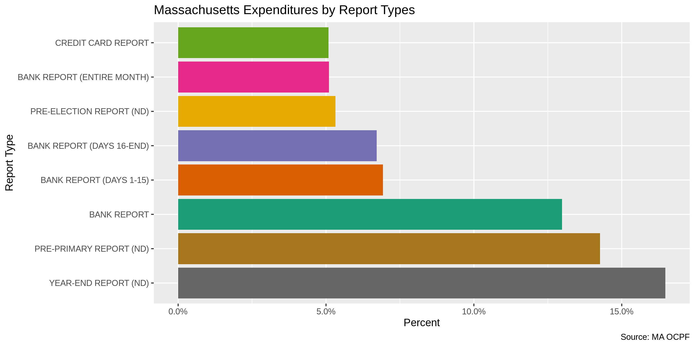
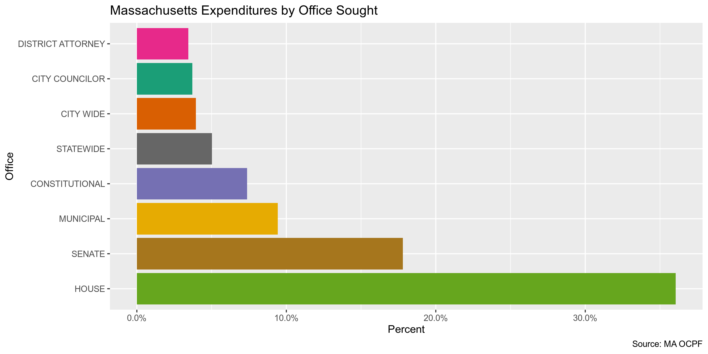
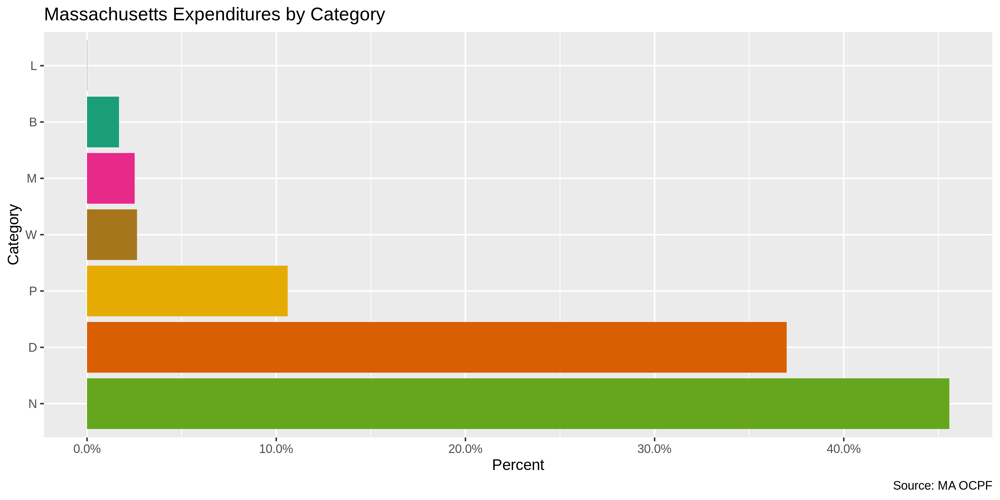
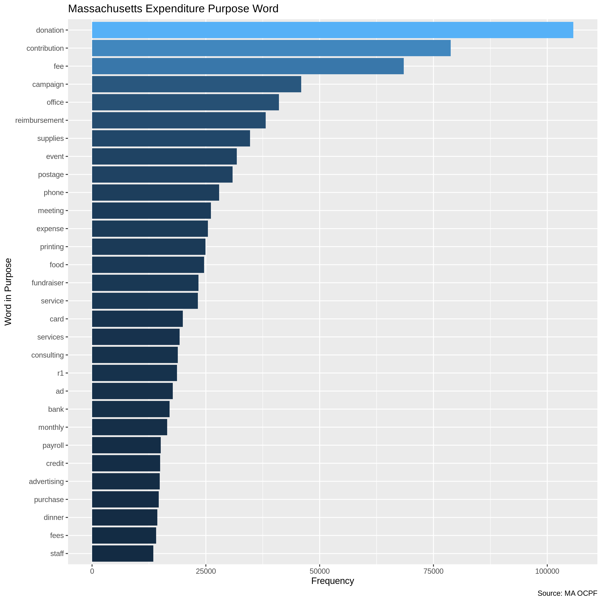
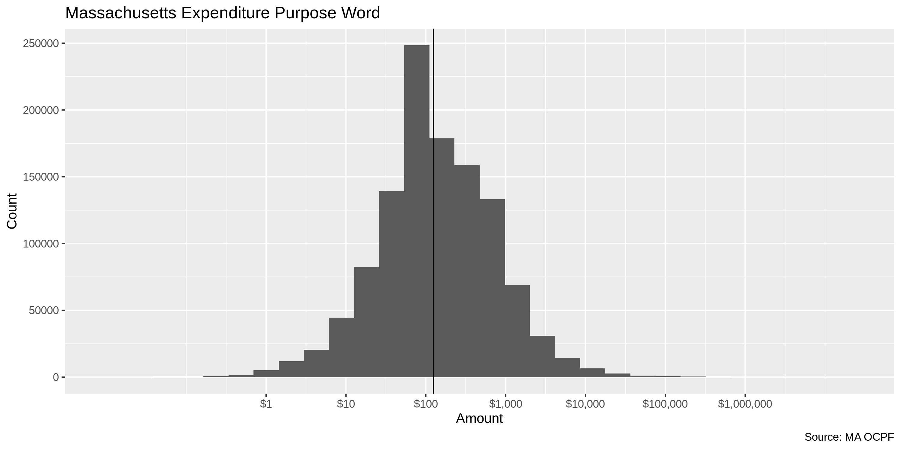
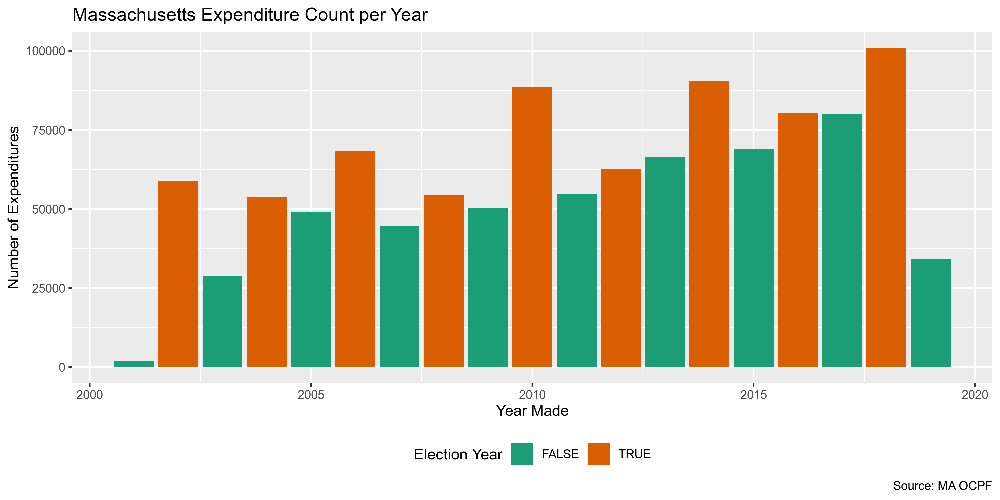
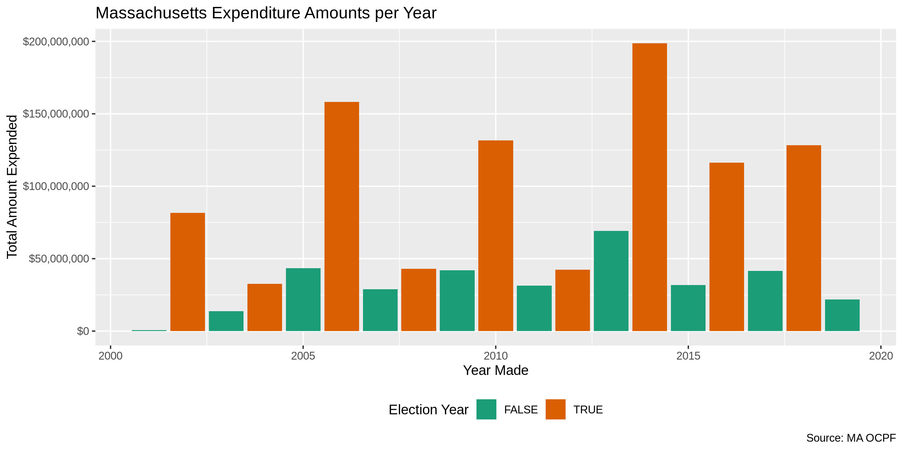
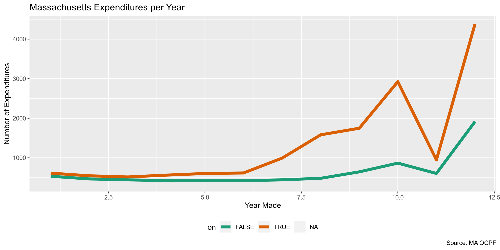
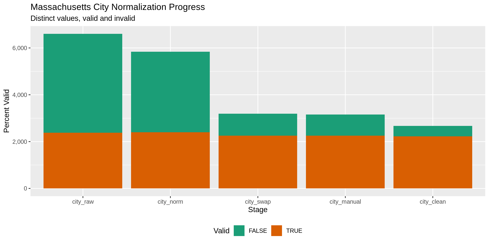

Massachusetts Expenditures
================
Kiernan Nicholls
2019-11-04 13:24:58

<!-- Need to install mdbtools -->

## Project

The Accountability Project is an effort to cut across data silos and
give journalists, policy professionals, activists, and the public at
large a simple way to search across huge volumes of public data about
people and organizations.

Our goal is to standardizing public data on a few key fields by thinking
of each dataset row as a transaction. For each transaction there should
be (at least) 3 variables:

1.  All **parties** to a transaction
2.  The **date** of the transaction
3.  The **amount** of money involved

## Objectives

This document describes the process used to complete the following
objectives:

1.  How many records are in the database?
2.  Check for duplicates
3.  Check ranges
4.  Is there anything blank or missing?
5.  Check for consistency issues
6.  Create a five-digit ZIP Code called `ZIP5`
7.  Create a `YEAR` field from the transaction date
8.  Make sure there is data on both parties to a transaction

## Packages

The following packages are needed to collect, manipulate, visualize,
analyze, and communicate these results. The `pacman` package will
facilitate their installation and attachment.

The IRW’s `campfin` package will also have to be installed from GitHub.
This package contains functions custom made to help facilitate the
processing of campaign finance data.

``` r
if (!require("pacman")) install.packages("pacman")
pacman::p_load_gh("irworkshop/campfin")
pacman::p_load(
  snakecase, # change string case
  tidyverse, # data manipulation
  lubridate, # datetime strings
  tidytext, # text analysis
  magrittr, # pipe opperators
  janitor, # dataframe clean
  batman, # rep(NA, 8) Batman!
  refinr, # cluster and merge
  scales, # format strings
  knitr, # knit documents
  vroom, # read files fast
  glue, # combine strings
  here, # relative storage
  httr, # http query
  fs # search storage 
)
```

This document should be run as part of the `R_campfin` project, which
lives as a sub-directory of the more general, language-agnostic
[`irworkshop/accountability_datacleaning`](https://github.com/irworkshop/accountability_datacleaning "TAP repo")
GitHub repository.

The `R_campfin` project uses the [RStudio
projects](https://support.rstudio.com/hc/en-us/articles/200526207-Using-Projects "Rproj")
feature and should be run as such. The project also uses the dynamic
`here::here()` tool for file paths relative to *your* machine.

``` r
# where dfs this document knit?
here::here()
#> [1] "/home/kiernan/R/accountability_datacleaning/R_campfin"
```

## Data

Data is obtained from the [Massachusetts Office of Campaign and
Political Finance (OCPF)](https://www.ocpf.us/Home/Index).

> #### The Agency
> 
> The Office of Campaign and Political Finance is an independent state
> agency that administers Massachusetts General Law Chapter 55, the
> campaign finance law, and Chapter 55C, the limited public financing
> program for statewide candidates. Established in 1973, OCPF is the
> depository for disclosure reports filed by candidates and political
> committees under M.G.L. Chapter 55.
> 
> Specifically, candidates who report to OCPF are those seeking
> statewide, legislative, county and district office, Governor’s Council
> candidates and two groups of municipal candidates: Candidates for
> mayor, city council or alderman in the state’s 14 cities with
> populations of 65,000 or more… Candidates for mayor in cities with
> populations of less than 65,000
> 
> OCPF receives reports filed by hundreds of candidates and committees,
> reviews them to ensure accurate disclosure and legal compliance, and,
> where appropriate, conducts legal reviews of campaign finance
> activity.

> #### Our Mission
> 
> The fundamental purpose of the Massachusetts campaign finance law is
> to assist in maintaining the integrity of the Commonwealth’s electoral
> system. OCPF’s primary mission is to ensure that accurate and complete
> disclosure of campaign finance activity by those involved in the
> electoral process is available in a transparent, easily accessible and
> timely manner and that stakeholders in the process fully understand
> and comply with the statute. Stakeholders must have full confidence in
> the integrity of OCPF’s procedures in transmittal and disclosure of
> activity. OCPF is committed to providing easily accessed resources,
> both in the form of disclosure and education, to all participants
> seeking to influence the outcome of political campaigns. OCPF is also
> committed to analyzing developments in campaign finance regulation and
> reform at the federal level and in other jurisdictions, so that OCPF
> can suggest legislative amendments to strengthen Chapters 55 and 55C.

## Import

We will obtain raw immutable data and import it into R as a data frame.

``` r
raw_dir <- here("ma", "expends", "data", "raw")
dir_create(raw_dir)
```

### Download

Data can be obtained from the OCPF in one of two ways: (1) Up to 250,000
search results can be downloaded in text format from the [OCPF search
page](https://www.ocpf.us/Reports/SearchItems); (2) A single [`.zip`
file](http://ocpf2.blob.core.windows.net/downloads/data/campaign-finance-reports.zip)
containing a `.mdb` file can be downloaded from the [OCPF data
page](https://www.ocpf.us/Data). We will use the later.

> Download a zipped Microsoft Access 2000 format (.mdb) database that
> includes report summaries, receipts, expenditures, in-kind
> contributions, liabilities, assets disposed, savings accounts, credit
> card reports, reimbursement reports and subvendor
reports.

``` r
zip_url <- "http://ocpf2.blob.core.windows.net/downloads/data/campaign-finance-reports.zip"
zip_path <- url2path(zip_url, raw_dir)
```

First, check the file size before downloading.

``` r
url_file_size(zip_url, format = TRUE)
#> [1] "389 Mb"
```

Then download the file to the `/data/raw` directory and unzip.

``` r
if (!all_files_new(raw_dir, "*.zip$")) {
  download.file(url = zip_url, destfile = zip_path)
}

if (!all_files_new(raw_dir, "*.mdb$")) {
  unzip(zipfile = zip_path, exdir = raw_dir)
}
```

### Read

To read this file, we will use `campfin::read_mdb()`, which wraps around
`readr::read_csv()` and the `mdb-export` command from [MDB
Tools](https://github.com/brianb/mdbtools), which must first be
installed from GitHub or your package manager.

``` bash
$ sudo apt install mdbtools
```

We can use `campfin:::mdb_tables()` to find the table name we are
interested in from the database.

``` r
# get file name
mdb_file <- dir_ls(raw_dir, glob = "*.mdb$")
# list tables in file
campfin:::mdb_tables(file = mdb_file)
#>  [1] "vUPLOAD_MASTER"                       "vUPLOAD_tCURRENT_ASSETS_DISPOSED"    
#>  [3] "vUPLOAD_tCURRENT_BANK_CREDITS"        "vUPLOAD_tCURRENT_CPF9_DETAIL"        
#>  [5] "vUPLOAD_tCURRENT_CPF9_SUMMARIES"      "vUPLOAD_tCURRENT_EXPENDITURES"       
#>  [7] "vUPLOAD_tCURRENT_INKINDS"             "vUPLOAD_tCURRENT_LIABILITIES"        
#>  [9] "vUPLOAD_tCURRENT_R1_DETAIL"           "vUPLOAD_tCURRENT_R1_SUMMARIES"       
#> [11] "vUPLOAD_tCURRENT_RECEIPTS"            "vUPLOAD_tCURRENT_SAVINGS"            
#> [13] "vUPLOAD_tCURRENT_SUBVENDOR_ITEMS"     "vUPLOAD_tCURRENT_SUBVENDOR_SUMMARIES"
```

Then, use `campfin::read_mdb()` to read the table as a data frame.

``` r
ma <- read_mdb(
  file = mdb_file,
  table = "vUPLOAD_tCURRENT_EXPENDITURES",
  na = c("", "NA", "N/A"),
  locale = locale(tz = "US/Eastern"),
  col_types = cols(
    .default = col_character(),
    Date = col_date(),
    Amount = col_double()
  )
)
```

Finally, we can standardize the data frame structure with the `janitor`
package.

``` r
ma <- ma %>% 
  clean_names("snake") %>% 
  remove_empty("cols") %>% 
  mutate_if(is_character, str_to_upper)
```

The `report_id` variable links to the “vUPLOAD\_MASTER” table of the
database, which gives more information on the *filers* of the reports,
whose expenditures are listed in “vUPLOAD\_tCURRENT\_EXPENDITURES”.

``` r
master <- read_mdb(
  file = mdb_file,
  table = "vUPLOAD_MASTER",
  na = c("", "NA", "N/A", "Unknown/ N/A"),
  col_types = cols(.default = col_character())
)

master <- master %>%
  clean_names("snake") %>% 
  filter(report_id %in% ma$report_id) %>% 
  mutate_all(str_to_upper) %>% 
  select(
    report_id,
    cpf_id,
    report_type = report_type_description,
    cand_name = full_name,
    office,
    district,
    comm_name = report_comm_name,
    comm_city = report_comm_city,
    comm_state = report_comm_state,
    comm_zip = report_comm_zip,
    category
  )
```

Then join these two tables together.

``` r
ma <- left_join(ma, master)
```

## Explore

``` r
head(ma)
```

    #> # A tibble: 6 x 27
    #>   id    report_id line_sequence date       vendor address city  state zip   amount purpose
    #>   <chr> <chr>     <chr>         <date>     <chr>  <chr>   <chr> <chr> <chr>  <dbl> <chr>  
    #> 1 9181… 60        9181367       2001-12-30 DONEL… 217 EA… ORAN… MA    01364   83   SUPPLI…
    #> 2 1067… 60        10676858      2001-12-31 <NA>   <NA>    <NA>  <NA>  <NA>    49.8 <NA>   
    #> 3 9181… 63        9181368       2001-06-10 WILBR… <NA>    <NA>  MA    <NA>    22.8 DINNER 
    #> 4 9181… 63        9181369       2001-01-13 WILLI… <NA>    <NA>  MA    <NA>   100   DONATI…
    #> 5 9181… 63        9181370       2001-06-06 WNEC   <NA>    <NA>  MA    <NA>   100   DONALD…
    #> 6 9181… 63        9181371       2001-02-07 WOMEN… <NA>    <NA>  MA    <NA>    50   1/2 PA…
    #> # … with 16 more variables: check_number <chr>, candidate_clarification <chr>,
    #> #   recipient_cpf_id <chr>, clarified_name <chr>, clarified_purpose <chr>, guid <chr>,
    #> #   cpf_id <chr>, report_type <chr>, cand_name <chr>, office <chr>, district <chr>,
    #> #   comm_name <chr>, comm_city <chr>, comm_state <chr>, comm_zip <chr>, category <chr>

``` r
tail(ma)
```

    #> # A tibble: 6 x 27
    #>   id    report_id line_sequence date       vendor address city  state zip   amount purpose
    #>   <chr> <chr>     <chr>         <date>     <chr>  <chr>   <chr> <chr> <chr>  <dbl> <chr>  
    #> 1 1347… 717473    13471512      2019-10-17 STRIPE <NA>    <NA>  <NA>  <NA>    3.98 PROCES…
    #> 2 1347… 717474    13471514      2019-10-18 STRIPE <NA>    <NA>  <NA>  <NA>    2.75 PROCES…
    #> 3 1347… 717475    13471516      2019-10-23 STRIPE <NA>    <NA>  <NA>  <NA>    1.53 PROCES…
    #> 4 1347… 717476    13471518      2019-10-30 STRIPE <NA>    <NA>  <NA>  <NA>    1.53 PROCES…
    #> 5 1347… 717479    13471596      2019-10-31 ACT B… <NA>    <NA>  <NA>  <NA>  212.   PROCES…
    #> 6 1347… 717481    13471603      2019-09-30 STRIPE <NA>    <NA>  <NA>  <NA>   38.3  PROCES…
    #> # … with 16 more variables: check_number <chr>, candidate_clarification <chr>,
    #> #   recipient_cpf_id <chr>, clarified_name <chr>, clarified_purpose <chr>, guid <chr>,
    #> #   cpf_id <chr>, report_type <chr>, cand_name <chr>, office <chr>, district <chr>,
    #> #   comm_name <chr>, comm_city <chr>, comm_state <chr>, comm_zip <chr>, category <chr>

``` r
glimpse(sample_frac(ma))
```

    #> Observations: 1,154,088
    #> Variables: 27
    #> $ id                      <chr> "9358834", "10315890", "10146341", "9447348", "12862329", "10982…
    #> $ report_id               <chr> "23914", "203658", "163287", "40321", "675428", "84483", "679972…
    #> $ line_sequence           <chr> "9358834", "10315890", "10146341", "9447348", "12862329", "10982…
    #> $ date                    <date> 2004-12-28, 2014-05-09, 2012-12-07, 2006-01-03, 2018-03-05, 200…
    #> $ vendor                  <chr> "WELLINGTON NEWS SERVICE", "COMMITTEE TO ELECT JOSEPH PACHECO", …
    #> $ address                 <chr> "P.O. BOX 15727", "775 ORCHARD STREET", "1101 15TH ST, NW SUITE …
    #> $ city                    <chr> "BOSTON", "RAYNHAM", "WASHINGTON", "WATERTOWN", "RAYNHAM", "WILM…
    #> $ state                   <chr> "MA", "MA", "DC", "MA", "MA", "DE", "FL", NA, NA, "MA", "MA", "M…
    #> $ zip                     <chr> "02115", "02767", "20005", NA, "02767", "19886", "32258", NA, NA…
    #> $ amount                  <dbl> 84.09, 500.00, 100.00, 250.00, 15.93, 724.53, 40791.42, 100.00, …
    #> $ purpose                 <chr> "SUBSCRIPTION", "CONTRIBUTION FOR 2014 GENERAL", "WEBHOSTING", "…
    #> $ check_number            <chr> NA, NA, "1675", "2965", NA, NA, "1788", "3818", "0", NA, "1352",…
    #> $ candidate_clarification <chr> NA, NA, NA, NA, NA, NA, NA, NA, NA, NA, NA, NA, NA, NA, NA, NA, …
    #> $ recipient_cpf_id        <chr> NA, "0", NA, NA, NA, "0", NA, NA, NA, "0", NA, NA, "0", "0", "0"…
    #> $ clarified_name          <chr> NA, NA, NA, NA, NA, NA, NA, NA, NA, NA, NA, NA, NA, NA, NA, NA, …
    #> $ clarified_purpose       <chr> NA, NA, NA, NA, NA, NA, NA, NA, NA, NA, NA, NA, NA, NA, NA, NA, …
    #> $ guid                    <chr> "{96B8D07F-8EB1-44D8-44A6-2637EB03DD66}", "{F3B8515F-F8A7-4E47-4…
    #> $ cpf_id                  <chr> "13802", "80527", "13783", "10328", "16927", "10130", "11035", "…
    #> $ report_type             <chr> "YEAR-END REPORT (ND)", "PRE-PRIMARY REPORT (PAC)", "BANK REPORT…
    #> $ cand_name               <chr> "STEVEN A. BADDOUR", "BROTHERHOOD OF LOCOMOTIVE ENG LEGISLATIVE …
    #> $ office                  <chr> "SENATE", NA, "MUNICIPAL", "CITY WIDE", "HOUSE", "HOUSE", NA, "S…
    #> $ district                <chr> "1ST ESSEX", NA, "CAMBRIDGE", "BOSTON", "12TH BRISTOL", "3RD SUF…
    #> $ comm_name               <chr> "COMMITTEE TO ELECT STEVEN A. BADDOUR", "BROTHERHOOD OF LOCOMOTI…
    #> $ comm_city               <chr> "METHUEN", "CLEVELAND", NA, NA, "MIDDLEBOROUGH", "BOSTON", "BOST…
    #> $ comm_state              <chr> "MA", "OH", NA, NA, "MA", "MA", "MA", "MA", NA, "MA", "MA", NA, …
    #> $ comm_zip                <chr> "01844", "44113-1702", NA, NA, "02346", "02108", "02114", "02747…
    #> $ category                <chr> "N", "P", "D", "D", "N", "N", "D", "D", "D", "N", "N", "D", "N",…

### Missing

``` r
glimpse_fun(ma, count_na)
```

    #> # A tibble: 27 x 4
    #>    col                     type        n           p
    #>    <chr>                   <chr>   <dbl>       <dbl>
    #>  1 id                      chr         0 0          
    #>  2 report_id               chr         0 0          
    #>  3 line_sequence           chr         0 0          
    #>  4 date                    date       28 0.0000243  
    #>  5 vendor                  chr     27983 0.0242     
    #>  6 address                 chr    226719 0.196      
    #>  7 city                    chr    223458 0.194      
    #>  8 state                   chr    218646 0.189      
    #>  9 zip                     chr    305655 0.265      
    #> 10 amount                  dbl         0 0          
    #> 11 purpose                 chr     47208 0.0409     
    #> 12 check_number            chr    764169 0.662      
    #> 13 candidate_clarification chr   1136126 0.984      
    #> 14 recipient_cpf_id        chr    848706 0.735      
    #> 15 clarified_name          chr   1151154 0.997      
    #> 16 clarified_purpose       chr   1136126 0.984      
    #> 17 guid                    chr         0 0          
    #> 18 cpf_id                  chr         0 0          
    #> 19 report_type             chr         0 0          
    #> 20 cand_name               chr         1 0.000000866
    #> 21 office                  chr    180630 0.157      
    #> 22 district                chr    154016 0.133      
    #> 23 comm_name               chr     34824 0.0302     
    #> 24 comm_city               chr    276376 0.239      
    #> 25 comm_state              chr    276893 0.240      
    #> 26 comm_zip                chr    276650 0.240      
    #> 27 category                chr         0 0

``` r
ma <- ma %>% flag_na(date, amount, vendor, cand_name)
sum(ma$na_flag)
#> [1] 28011
mean(ma$na_flag)
#> [1] 0.02427111
```

### Duplicates

``` r
# repeated variable
all(ma$id == ma$line_sequence)
n_distinct(ma$id) == n_distinct(ma$line_sequence)
ma <- select(ma, -line_sequence)
ma <- ma %>% flag_dupes(-id, -line_sequence, -guid)
sum(ma$dupe_flag)
mean(ma$dupe_flag)
```

### Categorical

``` r
glimpse_fun(ma, n_distinct)
```

    #> # A tibble: 28 x 4
    #>    col                     type        n          p
    #>    <chr>                   <chr>   <dbl>      <dbl>
    #>  1 id                      chr   1154088 1         
    #>  2 report_id               chr    129324 0.112     
    #>  3 line_sequence           chr   1154088 1         
    #>  4 date                    date     6904 0.00598   
    #>  5 vendor                  chr    243209 0.211     
    #>  6 address                 chr    165382 0.143     
    #>  7 city                    chr      6603 0.00572   
    #>  8 state                   chr       186 0.000161  
    #>  9 zip                     chr     13536 0.0117    
    #> 10 amount                  dbl    117413 0.102     
    #> 11 purpose                 chr    230246 0.200     
    #> 12 check_number            chr     18636 0.0161    
    #> 13 candidate_clarification chr      8331 0.00722   
    #> 14 recipient_cpf_id        chr      1823 0.00158   
    #> 15 clarified_name          chr      1614 0.00140   
    #> 16 clarified_purpose       chr      8331 0.00722   
    #> 17 guid                    chr   1153471 0.999     
    #> 18 cpf_id                  chr      4416 0.00383   
    #> 19 report_type             chr        75 0.0000650 
    #> 20 cand_name               chr      4612 0.00400   
    #> 21 office                  chr       131 0.000114  
    #> 22 district                chr       319 0.000276  
    #> 23 comm_name               chr      5932 0.00514   
    #> 24 comm_city               chr       605 0.000524  
    #> 25 comm_state              chr        32 0.0000277 
    #> 26 comm_zip                chr       925 0.000801  
    #> 27 category                chr         7 0.00000607
    #> 28 na_flag                 lgl         2 0.00000173

<!-- -->

<!-- -->

<!-- -->

<!-- -->

### Continuous

#### Amounts

``` r
summary(ma$amount) %>% map_chr(dollar)
#>          Min.       1st Qu.        Median          Mean       3rd Qu.          Max. 
#>   "$-489,762"         "$50"        "$125"   "$1,089.36"     "$395.82" "$13,293,721"
sum(ma$amount <= 0)
#> [1] 1833
sum(ma$amount >= 1000000)
#> [1] 132
```

We can view the smallest and largest expenditures to check for range
issues.

From this, we can see the minimum `amount` value from an expenditure
with a `purpose` of TRANSFERS BETWEEN CHECKING AND SAVING. This isn’t
really an expenditure in the normal sense.

``` r
glimpse(filter(ma, amount == min(amount)))
#> Observations: 1
#> Variables: 28
#> $ id                      <chr> "9361212"
#> $ report_id               <chr> "24047"
#> $ line_sequence           <chr> "9361212"
#> $ date                    <date> 2002-01-01
#> $ vendor                  <chr> NA
#> $ address                 <chr> NA
#> $ city                    <chr> NA
#> $ state                   <chr> "MA"
#> $ zip                     <chr> NA
#> $ amount                  <dbl> -489761.5
#> $ purpose                 <chr> "TRANSFERS BETWEEN CHECKING AND SAVING"
#> $ check_number            <chr> NA
#> $ candidate_clarification <chr> NA
#> $ recipient_cpf_id        <chr> NA
#> $ clarified_name          <chr> NA
#> $ clarified_purpose       <chr> NA
#> $ guid                    <chr> "{96FD26BB-D325-4968-6091-F2885683571B}"
#> $ cpf_id                  <chr> "20585"
#> $ report_type             <chr> "YEAR-END REPORT (D102)"
#> $ cand_name               <chr> "WARREN  E. TOLMAN"
#> $ office                  <chr> "CONSTITUTIONAL"
#> $ district                <chr> "GOVERNOR"
#> $ comm_name               <chr> "THE TOLMAN COMMITTEE -- CLEAN ELECTIONS ACCOUNT"
#> $ comm_city               <chr> "WATERTOWN"
#> $ comm_state              <chr> "MA"
#> $ comm_zip                <chr> "02471"
#> $ category                <chr> "D"
#> $ na_flag                 <lgl> TRUE
```

The maximum `amount` of $13,293,721 was made by the THE KERRY HEALEY
COMMITTEE on 2006-12-31. However, both the `vendor` and `purpose` values
for that expenditure are missing. Searching the OCPF database online
does not return this expenditure.

``` r
glimpse(filter(ma, amount == max(amount)))
#> Observations: 1
#> Variables: 28
#> $ id                      <chr> "10682105"
#> $ report_id               <chr> "61089"
#> $ line_sequence           <chr> "10682105"
#> $ date                    <date> 2006-12-31
#> $ vendor                  <chr> NA
#> $ address                 <chr> NA
#> $ city                    <chr> NA
#> $ state                   <chr> NA
#> $ zip                     <chr> NA
#> $ amount                  <dbl> 13293721
#> $ purpose                 <chr> NA
#> $ check_number            <chr> NA
#> $ candidate_clarification <chr> NA
#> $ recipient_cpf_id        <chr> NA
#> $ clarified_name          <chr> NA
#> $ clarified_purpose       <chr> NA
#> $ guid                    <chr> "{419AF33B-D19C-4CDF-47B9-1E37E8EB0B36}"
#> $ cpf_id                  <chr> "13911"
#> $ report_type             <chr> "YEAR-END REPORT (D102)"
#> $ cand_name               <chr> "KERRY MURPHY HEALEY"
#> $ office                  <chr> "CONSTITUTIONAL"
#> $ district                <chr> "GOVERNOR"
#> $ comm_name               <chr> "THE KERRY HEALEY COMMITTEE"
#> $ comm_city               <chr> "MELROSE"
#> $ comm_state              <chr> "MA"
#> $ comm_zip                <chr> "02176"
#> $ category                <chr> "D"
#> $ na_flag                 <lgl> TRUE
```

We can use `ggplot2::geom_histogram()` to ensure a typical log-normal
distribution of expenditures.

<!-- -->

#### Dates

We can add a `year` variable from `date` using `lubridate::year()`.

``` r
ma <- mutate(ma, year = year(date))
```

There are a number of `date` values from the distant past or future.

``` r
min(ma$date, na.rm = TRUE)
#> [1] "1943-06-05"
sum(ma$year < 2001, na.rm = TRUE)
#> [1] 15
max(ma$date, na.rm = TRUE)
#> [1] "2706-08-27"
sum(ma$date > today(), na.rm = TRUE)
#> [1] 52
count_na(ma$date)
#> [1] 28
```

We can flag these dates with a new `date_flag` variable.

``` r
ma <- mutate(ma, date_flag = is.na(date) | date > today() | year < 2001)
sum(ma$date_flag, na.rm = TRUE)
#> [1] 95
```

Using this new flag, we can create a `date_clean` variable that’s
missing these erronous dates.

``` r
ma <- ma %>% 
  mutate(
    date_clean = as_date(ifelse(date_flag, NA, date)),
    year_clean = year(date_clean)
    )
```

The Massachusetts Governor serves four-year terms, and we can see the
number of expenditures spike every four years.

<!-- -->

If we look at the *total* amount spent, we can spot a fairly regular
spike in the total cost of expenditures made. One outlier seems to be
2016, when there was no Governor’s race but there was still $116,189,457
spent, similar to 2018.

<!-- -->

<!-- -->

## Wrangle

We should use the `campfin::normal_*()` functions to perform some basic,
high-confidence text normalization to improve the searchability of the
database.

### Address

First, we will normalize the street address by removing punctuation and
expanding abbreviations.

``` r
ma <- ma %>% 
  mutate(
    address_norm = normal_address(
      address = address,
      add_abbs = usps_street,
      na_rep = TRUE
    )
  )
```

We can see how this improves consistency across the `address` field.

    #> # A tibble: 897,121 x 2
    #>    address                               address_norm                        
    #>    <chr>                                 <chr>                               
    #>  1 217 EAST MAIN ST.                     217 EAST MAIN STREET                
    #>  2 ONE ASHBURTON PLACE                   ONE ASHBURTON PLACE                 
    #>  3 1874 MASSACHUSETTS AVE                1874 MASSACHUSETTS AVENUE           
    #>  4 126 HIGH ST                           126 HIGH STREET                     
    #>  5 PO BOX 170305                         PO BOX 170305                       
    #>  6 30 GERMANIA ST                        30 GERMANIA STREET                  
    #>  7 1557 MASSACHUSETTS AVE                1557 MASSACHUSETTS AVENUE           
    #>  8 11 ALCOTT RD                          11 ALCOTT ROAD                      
    #>  9 PERMIT FEE WINDON, FORT POINT STATION PERMIT FEE WINDON FORT POINT STATION
    #> 10 304 SILVER HILL ROAD                  304 SILVER HILL ROAD                
    #> # … with 897,111 more rows

### ZIP

The `zip` address is already fairly clean, with 95.0% of the values
already in our comprehensive `valid_zip` list.

``` r
n_distinct(ma$zip)
#> [1] 13536
prop_in(ma$zip, valid_zip, na.rm = TRUE)
#> [1] 0.9504557
length(setdiff(ma$zip, valid_zip))
#> [1] 8133
```

We can improve this further by lopping off the uncommon four-digit
extensions and removing common invalid codes like 00000 and 99999.

``` r
ma <- ma %>% 
  mutate(
    zip_norm = normal_zip(
      zip = zip,
      na_rep = TRUE
    )
  )
```

This brings our valid percentage to 99.5%.

``` r
n_distinct(ma$zip_norm)
#> [1] 7019
prop_in(ma$zip_norm, valid_zip, na.rm = TRUE)
#> [1] 0.9949882
length(setdiff(ma$zip_norm, valid_zip))
#> [1] 1450
```

### State

The `state` variable is also very clean, already at 99.5%.

``` r
n_distinct(ma$state)
#> [1] 186
prop_in(ma$state, valid_state, na.rm = TRUE)
#> [1] 0.9953455
length(setdiff(ma$state, valid_state))
#> [1] 126
setdiff(ma$state, valid_state)
#>   [1] NA   "IO" "ON" "AM" "CN" "ML" "QC" "NB" "CH" "MC" "RO" "NA" "EN" "IR" "IE" "GB" "02" "M" 
#>  [19] "KE" "IW" "TZ" "NK" "D." "BR" "WS" "KA" "LI" "ST" "VY" "UK" "`"  "X"  "XX" "BC" "RU" "S" 
#>  [37] "MQ" "CR" "HP" "D"  "PK" "WU" "QU" "IS" "TA" "TW" "LE" "MM" "JP" "TF" "VJ" "HA" "CI" "ZA"
#>  [55] "SZ" "*"  "AX" "NZ" "AU" "HT" "CC" "YN" "2"  "9A" "PO" "TY" "C"  "MY" "FR" "II" "NT" "N."
#>  [73] "*C" "I"  "WZ" "NS" "CV" "`M" "*M" "NW" "G"  "SP" "01" "RD" "GM" "SW" "MB" "L"  "DK" "S."
#>  [91] "?`" "PS" "PH" "TE" "QA" ",A" "WO" "A*" "*A" "AB" "N"  "CU" "UA" "W"  "MV" "PT" "PI" "NG"
#> [109] "GR" "DR" "]]" "U"  "MG" "BV" "0H" "OC" "Q"  "NL" "TH" "MX" "CS" "AC" "RE" "HK" "DV" "OZ"
```

There are still 126 invalid values which we can remove.

``` r
ma <- ma %>% 
  mutate(
    state_norm = normal_state(
      state = str_replace(state, "^M$", "MA"),
      abbreviate = TRUE,
      na_rep = TRUE,
      valid = valid_state
    )
  )
```

``` r
n_distinct(ma$state_norm)
#> [1] 60
prop_in(ma$state_norm, valid_state, na.rm = TRUE)
#> [1] 1
```

### City

The `city` value is the hardest to normalize. We can use a four-step
system to functionally improve the searchablity of the database.

1.  **Normalize** the raw values with `campfin::normal_city()`
2.  **Match** the normal values with the *expected* value for that ZIP
    code
3.  **Swap** the normal values with the expected value if they are
    *very* similar
4.  **Refine** the swapped values the [OpenRefine
    algorithms](https://github.com/OpenRefine/OpenRefine/wiki/Clustering-In-Depth)
    and keep good changes

The raw `city` values are relatively normal, with 94.8% already in
`valid_city` (which is not comprehensive). We will aim to get this
number over 99%.

``` r
n_distinct(ma$city)
#> [1] 6603
prop_in(ma$city, valid_city, na.rm = TRUE)
#> [1] 0.9477397
length(setdiff(ma$city, valid_city))
#> [1] 4224
prop_na(ma$city)
#> [1] 0.193623
```

#### Normalize

``` r
ma <- ma %>% 
  mutate(
    city_norm = normal_city(
      city = city, 
      geo_abbs = usps_city,
      st_abbs = c("MA", "DC", "MASSACHUSETTS"),
      na = invalid_city,
      na_rep = TRUE
    )
  )
```

This process brought us to 95.5% valid.

``` r
n_distinct(ma$city_norm)
#> [1] 5837
prop_in(ma$city_norm, valid_city, na.rm = TRUE)
#> [1] 0.9547867
length(setdiff(ma$city_norm, valid_city))
#> [1] 3434
prop_na(ma$city_norm)
#> [1] 0.1940805
```

It also increased the proportion of `NA` values by 0.0458%. These new
`NA` values were either a single (possibly repeating) character, or
contained in the `na_city` vector.

    #> # A tibble: 61 x 4
    #>    zip_norm state_norm city        city_norm
    #>    <chr>    <chr>      <chr>       <chr>    
    #>  1 14240    NY         PO BOX 0377 <NA>     
    #>  2 <NA>     MA         INTERNET    <NA>     
    #>  3 <NA>     <NA>       INTERNET    <NA>     
    #>  4 <NA>     MA         ON-LINE     <NA>     
    #>  5 <NA>     CA         WEBSITE     <NA>     
    #>  6 <NA>     DC         ON-LINE     <NA>     
    #>  7 <NA>     MA         N/A         <NA>     
    #>  8 02743    MA         UNKNOWN     <NA>     
    #>  9 02026    MA         UNKNOWN     <NA>     
    #> 10 02568    MA         UNKNOWN     <NA>     
    #> # … with 51 more rows

#### Swap

Then, we will compare these normalized `city_norm` values to the
*expected* city value for that vendor’s ZIP code. If the [levenshtein
distance](https://en.wikipedia.org/wiki/Levenshtein_distance) is less
than 3, we can confidently swap these two values.

``` r
ma <- ma %>% 
  rename(city_raw = city) %>% 
  left_join(
    y = zipcodes,
    by = c(
      "state_norm" = "state",
      "zip_norm" = "zip"
    )
  ) %>% 
  rename(city_match = city) %>% 
  mutate(
    match_dist = str_dist(city_norm, city_match),
    city_swap = if_else(
      condition = is_less_than(match_dist, 3),
      true = city_match,
      false = city_norm
    )
  )
```

This is a very fast way to increase the valid proportion to 98.9% and
reduce the number of distinct *invalid* values from 3434 to only 937

``` r
n_distinct(ma$city_swap)
#> [1] 3191
prop_in(ma$city_swap, valid_city, na.rm = TRUE)
#> [1] 0.9888746
length(setdiff(ma$city_swap, valid_city))
#> [1] 937
```

#### Refine

Finally, we can pass these swapped `city_swap` values to the OpenRefine
cluster and merge algorithms. These two algorithms cluster similar
values and replace infrequent values with their more common
counterparts. This process can be harmful by making *incorrect* changes.
We will only keep changes where the state, ZIP code, *and* new city
value all match a valid combination.

``` r
good_refine <- ma %>% 
  mutate(
    city_refine = city_swap %>% 
      key_collision_merge() %>% 
      n_gram_merge(numgram = 1)
  ) %>% 
  filter(city_refine != city_swap) %>% 
  inner_join(
    y = zipcodes,
    by = c(
      "city_refine" = "city",
      "state_norm" = "state",
      "zip_norm" = "zip"
    )
  )
```

    #> # A tibble: 67 x 5
    #>    state_norm zip_norm city_raw                     city_refine             n
    #>    <chr>      <chr>    <chr>                        <chr>               <int>
    #>  1 MA         02125    SO. BOSTON                   BOSTON                  2
    #>  2 MA         02648    "MARSTONS \r\nMARSTON MILLS" MARSTONS MILLS          1
    #>  3 MA         02176    "MELROSE\r\nELROSE"          MELROSE                 1
    #>  4 MA         02127    SOS BOSTON                   BOSTON                  1
    #>  5 NY         10279    NEW YORK, N.Y.               NEW YORK                1
    #>  6 CT         06255    N GROVERSDALE                NORTH GROSVENORDALE     1
    #>  7 MA         01201    PITTSFIELD (ID 13009)        PITTSFIELD              1
    #>  8 MA         02324    BRIDGEWATER (ID 13396)       BRIDGEWATER             1
    #>  9 MA         02205    SO. BOSTON                   BOSTON                  1
    #> 10 MA         02119    SO. BOSTON                   BOSTON                  1
    #> # … with 57 more rows

We can join these good refined values back to the original data and use
them over their incorrect `city_swap` counterparts in a new
`city_refine` variable.

``` r
ma <- ma %>% 
  left_join(good_refine) %>% 
  mutate(city_refine = coalesce(city_refine, city_swap))
```

This brings us to 99.0% valid values.

``` r
n_distinct(ma$city_refine)
#> [1] 3165
prop_in(ma$city_refine, valid_city, na.rm = TRUE)
#> [1] 0.9895295
length(setdiff(ma$city_refine, valid_city))
#> [1] 911
```

#### Manual

We can make very few manual changes to capture the last few big invalid
values. Local city abbreviations (BOS, DORC, WORD, CAMB) often need to
be changed by hand.

``` r
ma %>%
  filter(city_refine %out% valid_city) %>% 
  count(state_norm, zip_norm, city_refine, sort = TRUE) %>% 
  drop_na(city_refine) %>% 
  print(n = 20)
#> # A tibble: 1,248 x 4
#>    state_norm zip_norm city_refine            n
#>    <chr>      <chr>    <chr>              <int>
#>  1 MA         02125    DORC                 946
#>  2 MA         02171    NORTH QUINCY         495
#>  3 MA         02346    MIDDLEBOROUGH        473
#>  4 MA         02144    WEST SOMERVILLE      300
#>  5 MA         02532    BOURNE               256
#>  6 MA         02760    NORTH ATTLEBOROUGH   241
#>  7 MA         02190    SOUTH WEYMOUTH       236
#>  8 MA         02127    SO BOS               234
#>  9 MA         02191    NORTH WEYMOUTH       184
#> 10 MA         01237    LANESBOROUGH         177
#> 11 MA         01879    TYNGSBOROUGH         163
#> 12 MN         55126    SHOREVIEW            145
#> 13 MA         02536    WAQUOIT              106
#> 14 MA         01654    WORC                 104
#> 15 PA         19087    CHESTERBROOK          94
#> 16 MA         01331    PHILLIPSTON           90
#> 17 MA         02494    NEEDHAM HEIGHTS       89
#> 18 MA         02568    TISBURY               88
#> 19 MA         02703    SOUTH ATTLEBORO       86
#> 20 MA         02536    TEATICKET             83
#> # … with 1,228 more rows
```

``` r
ma <- ma %>% 
  mutate(
    city_manual = city_refine %>% 
      str_replace("\bBOS\b", "BOSTON") %>% 
      str_replace("^DORC$", "DORCHESTER") %>% 
      str_replace("^WORC$", "WORCHESTER") %>% 
      str_replace("^HP$", "HYDE PARK") %>% 
      str_replace("^JP$", "JAMAICA PLAIN") %>% 
      str_replace("^NY$", "NEW YORK") %>% 
      str_replace("^CRLSTRM$", "CAROL STREAM") %>% 
      str_replace("^SPFLD$", "SPRINGFIELD") %>% 
      str_replace("^SPGFLD$", "SPRINGFIELD") %>% 
      str_replace("^PLY$", "PLYMOUTH") %>% 
      str_replace("^CAMB$", "CAMBRIDGE")
  )
```

## Conclude

1.  There are 1154088 records in the database.
2.  There are `sum(ma$dupe_flag)` duplicate records in the database.
3.  The range and distribution of `amount` and `date` seem reasonable.
4.  There are 28011 records missing either recipient or date.
5.  Consistency in geographic data has been improved with
    `campfin::normal_*()`.
6.  The 5-digit `zip_norm` variable has been created with
    `campfin::normal_zip(ma$zip)`.
7.  The 4-digit `year` variable has been created with
    `lubridate::year(ma$date)`.

## Lookup

``` r
lookup_file <- here("ma", "expends", "data", "ma_city_lookup.csv")
if (file.exists(lookup_file)) {
  lookup <- read_csv(lookup_file) %>% select(1:2)
  ma <- left_join(ma, lookup, by = c("city_manual" = "city_final"))
  progress_table(
    ma$city_raw,
    ma$city_norm,
    ma$city_swap,
    ma$city_manual,
    ma$city_clean,
    compare = valid_city
  )
}
#> # A tibble: 5 x 6
#>   stage       prop_in n_distinct prop_na n_out n_diff
#>   <chr>         <dbl>      <dbl>   <dbl> <dbl>  <dbl>
#> 1 city_raw      0.924       6603   0.303 78434   4224
#> 2 city_norm     0.932       5837   0.303 70225   3434
#> 3 city_swap     0.989       3191   0.436  9258    937
#> 4 city_manual   0.991       3156   0.436  7205    902
#> 5 city_clean    0.994       2672   0.436  5344    443
```

``` r
progress <- progress_table(
  ma$city_raw,
  ma$city_norm,
  ma$city_swap,
  ma$city_manual,
  ma$city_clean,
  compare = valid_city
) %>% mutate(stage = as_factor(stage))
```

| stage        | prop\_in | n\_distinct | prop\_na | n\_out | n\_diff |
| :----------- | -------: | ----------: | -------: | -----: | ------: |
| city\_raw    |    0.924 |        6603 |    0.303 |  78434 |    4224 |
| city\_norm   |    0.932 |        5837 |    0.303 |  70225 |    3434 |
| city\_swap   |    0.989 |        3191 |    0.436 |   9258 |     937 |
| city\_manual |    0.991 |        3156 |    0.436 |   7205 |     902 |
| city\_clean  |    0.994 |        2672 |    0.436 |   5344 |     443 |

You can see how the percentage of valid values increased with each
stage.

<!-- -->

More importantly, the number of distinct values decreased each stage. We
were able to confidently change many distinct invalid values to their
valid equivilent.

``` r
progress %>% 
  select(
    stage, 
    all = n_distinct,
    bad = n_diff
  ) %>% 
  mutate(good = all - bad) %>% 
  pivot_longer(c("good", "bad")) %>% 
  mutate(name = name == "good") %>% 
  ggplot(aes(x = stage, y = value)) +
  geom_col(aes(fill = name)) +
  scale_fill_brewer(palette = "Dark2") +
  scale_y_continuous(labels = comma) +
  theme(legend.position = "bottom") +
  labs(
    title = "Massachusetts City Normalization Progress",
    subtitle = "Distinct values, valid and invalid",
    x = "Stage",
    y = "Percent Valid",
    fill = "Valid"
  )
```

<!-- -->

## Export

``` r
proc_dir <- here("ma", "expends", "data", "processed")
dir_create(proc_dir)
```

``` r
ma %>% 
  select(
    -city_norm,
    -city_swap,
    -city_match,
    -city_swap,
    -match_dist
  ) %>% 
  write_csv(
    path = glue("{proc_dir}/ma_expends_clean.csv"),
    na = ""
  )
```
