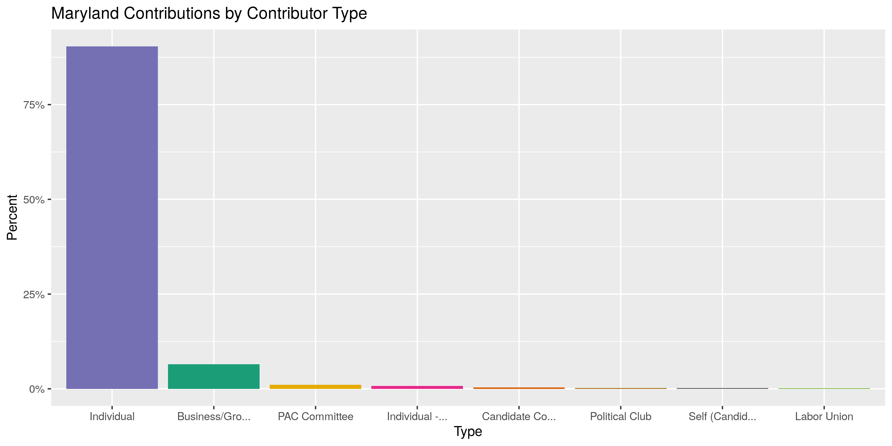
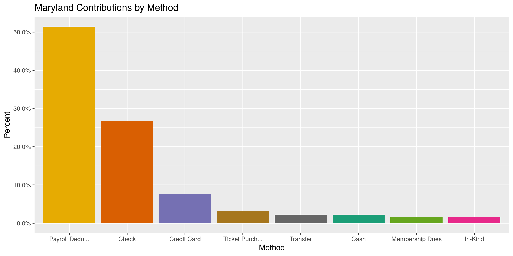
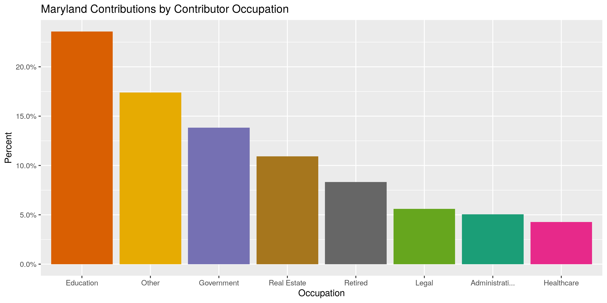
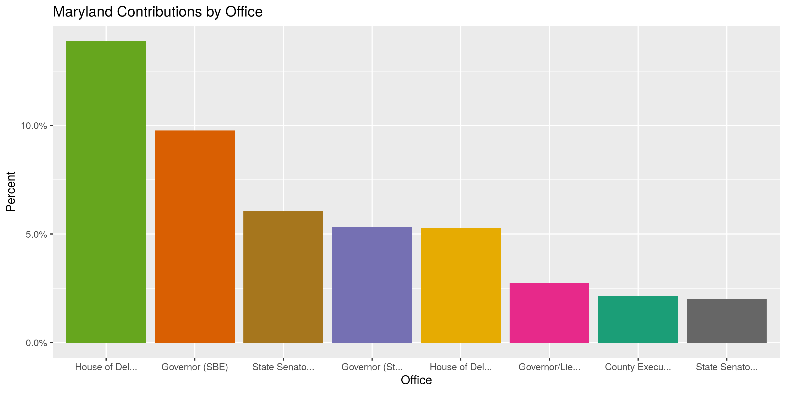
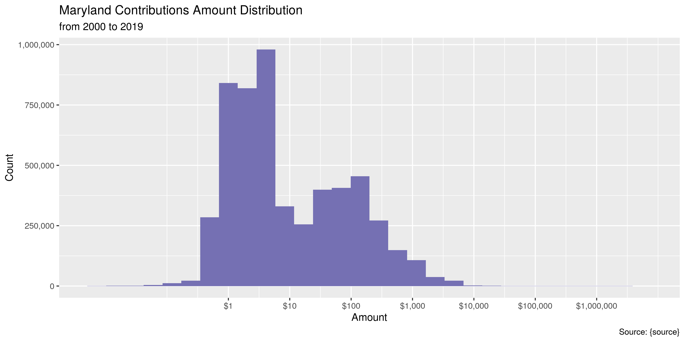
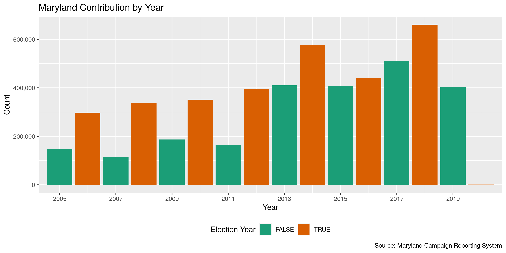
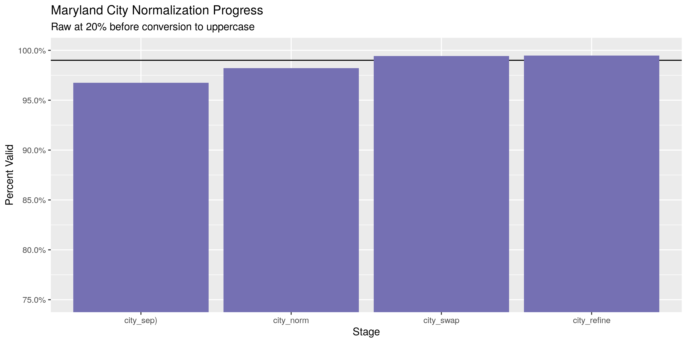
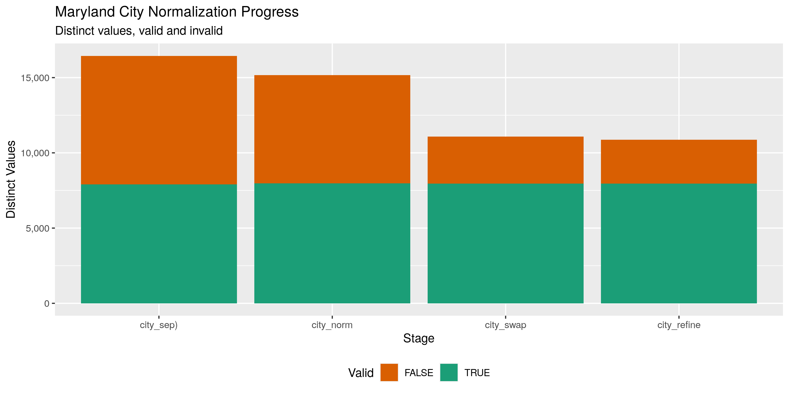

Maryland Contributions
================
Kiernan Nicholls
2020-03-12 15:34:17

  - [Project](#project)
  - [Objectives](#objectives)
  - [Packages](#packages)
  - [Data](#data)
  - [Download](#download)
  - [Read](#read)
  - [Wrangle](#wrangle)
  - [Explore](#explore)
  - [Wrangle](#wrangle-1)
  - [Conclude](#conclude)
  - [Export](#export)
  - [Encoding](#encoding)

<!-- Place comments regarding knitting here -->

## Project

The Accountability Project is an effort to cut across data silos and
give journalists, policy professionals, activists, and the public at
large a simple way to search across huge volumes of public data about
people and organizations.

Our goal is to standardizing public data on a few key fields by thinking
of each dataset row as a transaction. For each transaction there should
be (at least) 3 variables:

1.  All **parties** to a transaction.
2.  The **date** of the transaction.
3.  The **amount** of money involved.

## Objectives

This document describes the process used to complete the following
objectives:

1.  How many records are in the database?
2.  Check for entirely duplicated records.
3.  Check ranges of continuous variables.
4.  Is there anything blank or missing?
5.  Check for consistency issues.
6.  Create a five-digit ZIP Code called `zip`.
7.  Create a `year` field from the transaction date.
8.  Make sure there is data on both parties to a transaction.

## Packages

The following packages are needed to collect, manipulate, visualize,
analyze, and communicate these results. The `pacman` package will
facilitate their installation and attachment.

The IRW’s `campfin` package will also have to be installed from GitHub.
This package contains functions custom made to help facilitate the
processing of campaign finance data.

``` r
if (!require("pacman")) install.packages("pacman")
pacman::p_load_gh("irworkshop/campfin")
pacman::p_load(
  tidyverse, # data manipulation
  lubridate, # datetime strings
  magrittr, # pipe operators
  janitor, # dataframe clean
  refinr, # cluster and merge
  scales, # format strings
  knitr, # knit documents
  vroom, # read files fast
  glue, # combine strings
  here, # relative storage
  fs # search storage 
)
```

This document should be run as part of the `R_campfin` project, which
lives as a sub-directory of the more general, language-agnostic
[`irworkshop/accountability_datacleaning`](https://github.com/irworkshop/accountability_datacleaning)
GitHub repository.

The `R_campfin` project uses the [RStudio
projects](https://support.rstudio.com/hc/en-us/articles/200526207-Using-Projects)
feature and should be run as such. The project also uses the dynamic
`here::here()` tool for file paths relative to *your* machine.

``` r
# where does this document knit?
here::here()
#> [1] "/home/kiernan/Code/accountability_datacleaning/R_campfin"
```

## Data

Data is obtained from the Maryland [Campaign Reporting System
(CRS)](https://campaignfinance.maryland.gov/Public/ViewReceipts?theme=vista).

> A contribution is money or anything of value given to a political
> committee to promote or assist in promoting the success or defeat of a
> candidate, political party, or question. A contribution can be made by
> any individual or by an entity, including a corporation or other
> business entity, a political club, a federal committee, or a labor
> union…

> A person may contribute directly or indirectly no more than $6,000 to
> one political committee, and a total of $24,000 to all political
> committees, during the four-year cycle.

## Download

As of now, this `GET()` request fails to return anything but an empty
file. To download the file manually, go to the [CRS search
poral](https://campaignfinance.maryland.gov/Public/ViewReceipts?theme=vista)
and run a query for everything from January 1st 2000 to January of the
2020.

This will return a list of 5,407,055 results which can be downloaded as
a CSV file to the disk.

``` r
raw_dir <- dir_create(here("md", "contribs", "data", "raw"))
```

``` r
raw_csv <- path(raw_dir, "ContributionsList.csv")
if (!file_exists(raw_csv)) {
  response <- GET(
    url = "https://campaignfinance.maryland.gov/Public/ExportCsv",
    write_disk(raw_csv, overwrite = TRUE),
    query = list(
      page = "1",
      orderBy = "~",
      filter = "~",
      `Grid-size` = 15,
      theme = "vista"
    )
  )
}
```

## Read

To properly read the file into R, we first have to do some simple string
processing to the text file.

``` r
fix_csv <- path(here("md", "contribs", "data"), "fix_file.csv")
if (!file_exists(fix_csv)) {
  read_file(raw_csv) %>% 
    str_remove_all("(?<!((Electoral|Administrative|,),))\n") %>% 
    str_replace_all("\"", "\'") %>% 
    str_remove_all(",(?=\n|\n$)") %>% 
    write_lines(fix_csv)
}
```

``` r
# 5,407,055
mdc <- read_delim(
  file = fix_csv,
  delim = ",",
  escape_backslash = FALSE,
  escape_double = FALSE,
  na = c("", "NA", "N/A", "NULL", "Not Included"),
  col_types = cols(
    .default = col_character(),
    `Contribution Date` = col_date_usa(),
    `Contribution Amount` = col_double()
  )
)
```

``` r
mdc <- mdc %>% 
  remove_empty("cols") %>% 
  rename(
    committee = `Receiving Committee`,
    period = `Filing Period`,
    date = `Contribution Date`,
    name = `Contributor Name`,
    address = `Contributor Address`,
    type = `Contributor Type`,
    method = `Contribution Type`,
    amount = `Contribution Amount`,
    employer = `Employer Name`,
    occupation = `Employer Occupation`,
    office = `Office`,
    fund = `Fundtype`
  )
```

## Separate

To better map the columns of the database, we will have to `separate()`
the `address` column into it’s components.

``` r
mdc <- mdc %>%
  mutate(
    address = address %>% 
      str_remove("-(\\s+|\\d+)$") %>% 
      # address in DC with quad in sep col
      str_replace("(\\s{2})(?=(NW|NE|SW|SE)\\.?\\s{2})", " ") %>% 
      str_replace("(\\s{2})(?=(N.W.|N.E.|S.W.|S.E.)\\.?\\s{2})", " ")
  ) %>% 
  separate(
    col = address,
    into = c(glue("split_addr{1:10}"), "city_sep", "state_zip"),
    sep = "\\s{2,}",
    remove = FALSE,
    extra = "merge",
    fill = "left"
  ) %>% 
  unite(
    starts_with("split_addr"),
    col = "address_sep",
    na.rm = TRUE,
    sep = " "
  ) %>% 
  mutate_if(is_character, na_if, "") %>% 
  separate(
    col = state_zip,
    into = c("state_sep", "zip_sep"),
    sep = "\\s(?=\\d)",
    extra = "merge",
    fill = "right"
  ) %>% 
  separate(
    col = name,
    into = c("last", "first"),
    sep = "\\s{2}",
    extra = "merge",
    fill = "right"
  )
```

This process does not work for the few addresses missing a state
abbreviation or some other geographic variable within the string. We can
identify any extracted ZIP codes in the new `state` column and adjust
their position appropriately.

``` r
mdc %>% 
  select("address", ends_with("_sep")) %>% 
  filter(state_sep %out% valid_state, !is.na(state_sep)) %>% 
  sample_frac()
#> # A tibble: 2,180 x 5
#>    address                                    address_sep          city_sep   state_sep     zip_sep
#>    <chr>                                      <chr>                <chr>      <chr>         <chr>  
#>  1 20733                                      <NA>                 <NA>       20733         <NA>   
#>  2 20772                                      <NA>                 <NA>       20772         <NA>   
#>  3 2409 Hillford Road  baltimore  md 21234    2409 Hillford Road   baltimore  md            21234  
#>  4 21045                                      <NA>                 <NA>       21045         <NA>   
#>  5 26 Rue Singer                              <NA>                 <NA>       26 Rue Singer <NA>   
#>  6 1356 Carpenter pt rd  Perryville  md 21903 1356 Carpenter pt rd Perryville md            21903  
#>  7 21502                                      <NA>                 <NA>       21502         <NA>   
#>  8 20685                                      <NA>                 <NA>       20685         <NA>   
#>  9 20716                                      <NA>                 <NA>       20716         <NA>   
#> 10 20657                                      <NA>                 <NA>       20657         <NA>   
#> # … with 2,170 more rows
```

``` r
mdc <- mutate_if(mdc, is_character, na_if, "Null Zip Code")
```

``` r
# identify zips in state
zip_states <- str_which(mdc$state_sep, "\\d+(?:-\\d+|\\s+)?$")
# shift those cols left
mdc[zip_states, ] %>% select("address", ends_with("_sep"))
#> # A tibble: 1,063 x 5
#>    address                           address_sep                 city_sep         state_sep zip_sep
#>    <chr>                             <chr>                       <chr>            <chr>     <chr>  
#>  1 5877 Union Ridge Drive  21710     <NA>                        5877 Union Ridg… 21710     <NA>   
#>  2 8902 Fort Foot Rd.  Fort Washing… 8902 Fort Foot Rd.          Fort Washington  20744     <NA>   
#>  3 10302 Duke of Wellington Ct.  Up… 10302 Duke of Wellington C… Upper Marlboro   20772     <NA>   
#>  4 7272 Wisconsin Ave  Bethesda  20… 7272 Wisconsin Ave          Bethesda         20814     <NA>   
#>  5 7272 Wisconsin Ave  Bethesda  20… 7272 Wisconsin Ave          Bethesda         20814     <NA>   
#>  6 408 16TH STREET SE  WASHINGTON  … 408 16TH STREET SE          WASHINGTON       DC -2424  <NA>   
#>  7 P.O. Box 457  Arecibo  00613      P.O. Box 457                Arecibo          00613     <NA>   
#>  8 CMR 416 Box 1639  APO  AE  09140  CMR 416 Box 1639 APO        AE               09140     <NA>   
#>  9 1301 Highland Drive  Silver Spri… 1301 Highland Drive         Silver Spring    20910     <NA>   
#> 10 C. Btry 1-6 FA  Unit 27543 Box 2… C. Btry 1-6 FA Unit 27543 … AE               09139     <NA>   
#> # … with 1,053 more rows
mdc$zip_sep[zip_states] <- mdc$state_sep[zip_states]
mdc$state_sep[zip_states] %>% 
  str_remove_all("\\d+") %>% 
  str_remove_all("[:punct:]") %>% 
  str_trim() %>% 
  na_if("") -> mdc$state_sep[zip_states]
mdc[zip_states, ] %>% select("address", ends_with("_sep"))
#> # A tibble: 1,063 x 5
#>    address                           address_sep                 city_sep         state_sep zip_sep
#>    <chr>                             <chr>                       <chr>            <chr>     <chr>  
#>  1 5877 Union Ridge Drive  21710     <NA>                        5877 Union Ridg… <NA>      21710  
#>  2 8902 Fort Foot Rd.  Fort Washing… 8902 Fort Foot Rd.          Fort Washington  <NA>      20744  
#>  3 10302 Duke of Wellington Ct.  Up… 10302 Duke of Wellington C… Upper Marlboro   <NA>      20772  
#>  4 7272 Wisconsin Ave  Bethesda  20… 7272 Wisconsin Ave          Bethesda         <NA>      20814  
#>  5 7272 Wisconsin Ave  Bethesda  20… 7272 Wisconsin Ave          Bethesda         <NA>      20814  
#>  6 408 16TH STREET SE  WASHINGTON  … 408 16TH STREET SE          WASHINGTON       DC        DC -24…
#>  7 P.O. Box 457  Arecibo  00613      P.O. Box 457                Arecibo          <NA>      00613  
#>  8 CMR 416 Box 1639  APO  AE  09140  CMR 416 Box 1639 APO        AE               <NA>      09140  
#>  9 1301 Highland Drive  Silver Spri… 1301 Highland Drive         Silver Spring    <NA>      20910  
#> 10 C. Btry 1-6 FA  Unit 27543 Box 2… C. Btry 1-6 FA Unit 27543 … AE               <NA>      09139  
#> # … with 1,053 more rows
```

``` r
addr_city <- which(str_starts(mdc$city_sep, "\\d") & is.na(mdc$address_sep))
mdc[addr_city, ] %>% select("address", ends_with("_sep"))
#> # A tibble: 12,307 x 5
#>    address                          address_sep city_sep               state_sep zip_sep
#>    <chr>                            <chr>       <chr>                  <chr>     <chr>  
#>  1 "3400 Wolford Drive       "      <NA>        3400 Wolford Drive     <NA>      <NA>   
#>  2 "119 Hammonds Lane   MD 21225"   <NA>        119 Hammonds Lane      MD        21225  
#>  3 "5877 Union Ridge Drive  21710"  <NA>        5877 Union Ridge Drive <NA>      21710  
#>  4 "718 12TH Street N.W.  DC 20002" <NA>        718 12TH Street N.W.   DC        20002  
#>  5 "26 Oak Dr.       "              <NA>        26 Oak Dr.             <NA>      <NA>   
#>  6 "358 WEYMOUTH RD  NJ 08310"      <NA>        358 WEYMOUTH RD        NJ        08310  
#>  7 "119 Hammonds Lane   MD 21225"   <NA>        119 Hammonds Lane      MD        21225  
#>  8 "1222 Ingraham Street  DC 20011" <NA>        1222 Ingraham Street   DC        20011  
#>  9 "2422 Plainfield Rd  MD 21222"   <NA>        2422 Plainfield Rd     MD        21222  
#> 10 "823 Woodmount Ct  MD 21085"     <NA>        823 Woodmount Ct       MD        21085  
#> # … with 12,297 more rows
mdc$address_sep[addr_city] <- mdc$city_sep[addr_city]
mdc$city_sep[addr_city] <- NA
```

``` r
addr_state <- which(str_starts(mdc$state_sep, "\\d") & is.na(mdc$address_sep))
mdc[addr_state, ] %>% select("address", ends_with("_sep"))
#> # A tibble: 262 x 5
#>    address                              address_sep city_sep state_sep                      zip_sep
#>    <chr>                                <chr>       <chr>    <chr>                          <chr>  
#>  1 3024 N Calvert                       <NA>        <NA>     3024 N Calvert                 <NA>   
#>  2 828 E.A. St.                         <NA>        <NA>     828 E.A. St.                   <NA>   
#>  3 4008 Rosemary StreetChevy Chase MD … <NA>        <NA>     4008 Rosemary StreetChevy Cha… 20815  
#>  4 300 E Pulaski Hwy                    <NA>        <NA>     300 E Pulaski Hwy              <NA>   
#>  5 4 Farview RD                         <NA>        <NA>     4 Farview RD                   <NA>   
#>  6 9003 Gentle Wind's                   <NA>        <NA>     9003 Gentle Wind's             <NA>   
#>  7 65 Meremere St.                      <NA>        <NA>     65 Meremere St.                <NA>   
#>  8 9003 Gentle Wind's                   <NA>        <NA>     9003 Gentle Wind's             <NA>   
#>  9 212-150 MacLaren St                  <NA>        <NA>     212-150 MacLaren St            <NA>   
#> 10 17508 LEXINGTON AVE                  <NA>        <NA>     17508 LEXINGTON AVE            <NA>   
#> # … with 252 more rows
mdc$address_sep[addr_state] <- mdc$state_sep[addr_state]
mdc$state_sep[addr_state] <- NA
```

``` r
city_state <- which(nchar(mdc$state_sep) > 2 & is.na(mdc$city_sep))
mdc[city_state, ] %>% select("address", ends_with("_sep"))
#> # A tibble: 328 x 5
#>    address                               address_sep                 city_sep state_sep zip_sep
#>    <chr>                                 <chr>                       <chr>    <chr>     <chr>  
#>  1 56LL NEW HAMPSHIRE AVE N.E.  WA HINGT 56LL NEW HAMPSHIRE AVE N.E. <NA>     WA HINGT  <NA>   
#>  2 56LL NEW HAMPSHIRE AVE N.E.  WA HINGT 56LL NEW HAMPSHIRE AVE N.E. <NA>     WA HINGT  <NA>   
#>  3 56LL NEW HAMPSHIRE AVE N.E.  WA HINGT 56LL NEW HAMPSHIRE AVE N.E. <NA>     WA HINGT  <NA>   
#>  4 56LL NEW HAMPSHIRE AVE N.E.  WA HINGT 56LL NEW HAMPSHIRE AVE N.E. <NA>     WA HINGT  <NA>   
#>  5 56LL NEW HAMPSHIRE AVE N.E.  WA HINGT 56LL NEW HAMPSHIRE AVE N.E. <NA>     WA HINGT  <NA>   
#>  6 2295 North Ridge Trail  Oakville      2295 North Ridge Trail      <NA>     Oakville  <NA>   
#>  7 2295 North Ridge Trail  Oakville      2295 North Ridge Trail      <NA>     Oakville  <NA>   
#>  8 2295 North Ridge Trail  Oakville      2295 North Ridge Trail      <NA>     Oakville  <NA>   
#>  9 4725 Silver Hill Rd  Suitland         4725 Silver Hill Rd         <NA>     Suitland  <NA>   
#> 10 4725 Silver Hill Rd  Suitland         4725 Silver Hill Rd         <NA>     Suitland  <NA>   
#> # … with 318 more rows
city_abb <- str_extract(mdc$state_sep[city_state], "(?<=\\s)[:upper:]{2}$")
city_name <- str_remove(mdc$state_sep[city_state], "\\s[:upper:]{2}$")
mdc$city_sep[city_state] <- city_name
mdc$state_sep[city_state] <- city_abb
mdc$state_sep[city_state] <- NA
```

``` r
bad_st <- str_to_upper(mdc$state_sep) %out% valid_state
nan_st <- !is.na(mdc$state_sep)
add_st <- str_ends(mdc$city_sep, "\\d")
addr2_city <- which(bad_st & nan_st & add_st)

mdc$address_sep[addr2_city] <- mdc$address_sep[addr2_city] %>% 
  paste(mdc$city_sep[addr2_city]) %>% 
  str_remove("NA\\s")
mdc$city_sep[addr2_city] <- mdc$state_sep[addr2_city]
mdc$state_sep[addr2_city] <- str_extract(mdc$state_sep[addr2_city], "[:upper:]{2}$")
```

``` r
mdc %>% 
  filter(
    str_to_upper(state_sep) %out% valid_state,
    !is.na(state_sep)
  ) %>% 
  select("address", ends_with("_sep"))
#> # A tibble: 89 x 5
#>    address                              address_sep                 city_sep    state_sep zip_sep  
#>    <chr>                                <chr>                       <chr>       <chr>     <chr>    
#>  1 21 Tennyson Road  Shepperton  Ashfo… 21 Tennyson Road Shepperto… Surrey TW1… UK        <NA>     
#>  2 7020-21 Ave  Edmonton  Alberta       7020-21 Ave                 Edmonton    Alberta   <NA>     
#>  3 3333 Netherby Rd. RR#2  Stevensvill… 3333 Netherby Rd. RR#2 Ste… Ontario     L0S       1S0      
#>  4 Flat 2  121 Trinity Road  London  U… Flat 2 121 Trinity Road     London      UK SW     UK SW17  
#>  5 229 Phoenix Way  Portishead  Bristo… 229 Phoenix Way Portishead  Bristol     NS BS     NS BS20  
#>  6 7020-21 Ave  Edmonton  Ab T6K 2H4 A… 7020-21 Ave                 Edmonton    Ab T6K    2H4 Albe…
#>  7 Psje Las Magnolias Mz J1 Lt 26 Los … Psje Las Magnolias Mz J1 L… Lima        ZZ        <NA>     
#>  8 122 Finborough Road  London  Englan… 122 Finborough Road London… London      England   <NA>     
#>  9 257 Balham High Rd  London  England… 257 Balham High Rd London … London      England   <NA>     
#> 10 6-21-4  Matsubara  Tokyo  Japan  To… 6-21-4 Matsubara Tokyo Jap… Tokyo       Japan     <NA>     
#> # … with 79 more rows
```

``` r
mdc <- mutate_if(mdc, is_character, ~str_squish(str_trim(.)))
```

## Explore

``` r
head(mdc)
#> # A tibble: 6 x 17
#>   committee period date       last  first address address_sep city_sep state_sep zip_sep type 
#>   <chr>     <chr>  <date>     <chr> <chr> <chr>   <chr>       <chr>    <chr>     <chr>   <chr>
#> 1 Rosapepe… 2005 … 2004-01-30 Rosa… Jame… 1828 L… 1828 L Str… Washing… DC        20036   Indi…
#> 2 Rosapepe… 2006 … 2005-04-02 Bruno Haro… 3414 C… 3414 Cummi… Chevy C… MD        20815   Indi…
#> 3 Rosapepe… 2006 … 2005-04-27 Craig Greg… 3155 H… 3155 Highl… Washing… DC        20008   Indi…
#> 4 Rosapepe… 2006 … 2005-05-28 Kerr  Robe… 2634 W… 2634 Wild … Reston   VA        20191   Indi…
#> 5 Rosapepe… 2006 … 2005-05-20 Kovl… Pete… 1250 2… 1250 24th … Washing… DC        20037   Indi…
#> 6 Rosapepe… 2006 … 2005-02-16 Schi… Rich… 6907 C… 6907 Crail… Bethesda MD        20817   Indi…
#> # … with 6 more variables: method <chr>, amount <dbl>, employer <chr>, occupation <chr>,
#> #   office <chr>, fund <chr>
tail(mdc)
#> # A tibble: 6 x 17
#>   committee period date       last  first address address_sep city_sep state_sep zip_sep type 
#>   <chr>     <chr>  <date>     <chr> <chr> <chr>   <chr>       <chr>    <chr>     <chr>   <chr>
#> 1 Anne Aru… 2020 … 2019-12-27 Dent  Clau… 8907 R… 8907 Rosew… Jessup   MD        20794   Indi…
#> 2 Anne Aru… 2020 … 2019-12-27 Pete… Eric  1307 G… 1307 Gloha… Prince … MD        20678   Indi…
#> 3 Anne Aru… 2020 … 2019-12-27 Graf  Ryan… 802 Oa… 802 Oakwoo… Glenold… PA        19036   Indi…
#> 4 Anne Aru… 2020 … 2019-12-27 Hami… Keith 471 Ca… 471 Cardif… Severna… MD        21146   Indi…
#> 5 Williams… 2020 … 2019-12-30 Guer… Mari… 105 Ri… 105 Ridge … Greenbe… MD        20770   Indi…
#> 6 Williams… 2020 … 2019-12-30 Jive… Grac… 9809 B… 9809 Bald … Mitchel… MD        20721   Indi…
#> # … with 6 more variables: method <chr>, amount <dbl>, employer <chr>, occupation <chr>,
#> #   office <chr>, fund <chr>
glimpse(sample_n(mdc, 20))
#> Observations: 20
#> Variables: 17
#> $ committee   <chr> "MSEA's Fund For Children And Public Education PAC", "Harford County Deputy …
#> $ period      <chr> "2015 Annual", "2010 Gubernatorial Pre-Primary2", "2013 Annual", "2012 Presi…
#> $ date        <date> 2014-12-19, 2010-08-28, 2012-11-20, 2012-01-20, 2014-03-05, 2016-09-27, 201…
#> $ last        <chr> "STURGES", "Alban", "NETO", "Moore", "Romani", "Robinson", "DANIELS", "Morse…
#> $ first       <chr> "CAROLINE", "Richard F.", "HEIDI", "Buddy R", "William", "Trinita", "ELLEN B…
#> $ address     <chr> "503 E 41ST ST APT 1 BALTIMORE MD 21218", "34 West Gordon Street Bel Air MD …
#> $ address_sep <chr> "503 E 41ST ST APT 1", "34 West Gordon Street", "7227 MILLCREST TER", "165 P…
#> $ city_sep    <chr> "BALTIMORE", "Bel Air", "DERWOOD", "Abilene", "Baltimore", "Upper Marlboro",…
#> $ state_sep   <chr> "MD", "MD", "MD", "TX", "MD", "MD", "MD", "MD", "MD", "MD", "MD", "MD", "MD"…
#> $ zip_sep     <chr> "21218", "21014", "20855", "79602", "21230", "20772", "20912", "21061", "210…
#> $ type        <chr> "Individual", "Individual", "Individual", "Individual", "Individual", "Indiv…
#> $ method      <chr> "Payroll Deductions", "Payroll Deductions", "Payroll Deductions", "Payroll D…
#> $ amount      <dbl> 2.33, 10.00, 8.00, 0.19, 100.00, 100.00, 2.25, 50.00, 100.00, 0.90, 0.90, 8.…
#> $ employer    <chr> NA, NA, "HEIDI", NA, "AARP Experience Corps", NA, NA, NA, NA, NA, NA, NA, NA…
#> $ occupation  <chr> NA, NA, NA, NA, "Education", NA, NA, NA, NA, NA, NA, NA, NA, NA, NA, NA, NA,…
#> $ office      <chr> NA, NA, NA, NA, "City Council (Baltimore City)", NA, NA, NA, NA, NA, NA, NA,…
#> $ fund        <chr> "Electoral", "Electoral", "Electoral", "Electoral", "Electoral", "Electoral"…
```

### Missing

``` r
col_stats(mdc, count_na)
#> # A tibble: 17 x 4
#>    col         class        n        p
#>    <chr>       <chr>    <int>    <dbl>
#>  1 committee   <chr>        0 0       
#>  2 period      <chr>        0 0       
#>  3 date        <date>       0 0       
#>  4 last        <chr>     9877 0.00183 
#>  5 first       <chr>   329258 0.0609  
#>  6 address     <chr>    63218 0.0117  
#>  7 address_sep <chr>    73726 0.0136  
#>  8 city_sep    <chr>    78586 0.0145  
#>  9 state_sep   <chr>    78351 0.0145  
#> 10 zip_sep     <chr>    78880 0.0146  
#> 11 type        <chr>        0 0       
#> 12 method      <chr>        0 0       
#> 13 amount      <dbl>        0 0       
#> 14 employer    <chr>  4453900 0.824   
#> 15 occupation  <chr>  4765331 0.881   
#> 16 office      <chr>  4635273 0.857   
#> 17 fund        <chr>     1523 0.000282
```

``` r
mdc <- mdc %>% flag_na(date, last, amount, committee)
percent(mean(mdc$na_flag), 0.01)
#> [1] "0.18%"
sum(mdc$na_flag)
#> [1] 9877
```

### Duplicates

There are quite a lot of duplicate records in the database. We can flag
these variables with `campfin::flag_dupes()` but not remove them.

``` r
mdc <- flag_dupes(mdc, everything())
percent(mean(mdc$dupe_flag), 0.01)
#> [1] "5.54%"
mdc %>% 
  filter(dupe_flag) %>% 
  select(date, last, amount, committee)
#> # A tibble: 299,772 x 4
#>    date       last             amount committee                               
#>    <date>     <chr>             <dbl> <chr>                                   
#>  1 2005-06-05 CROSS-BENNETT        35 Nathan-Pulliam Shirley Friends Of       
#>  2 2005-06-23 Andrews Farm LLC    500 Brochin Jim Committee To Elect          
#>  3 2005-07-01 Lo                  250 Brochin Jim Committee To Elect          
#>  4 2005-06-23 Andrews Farm LLC    500 Brochin Jim Committee To Elect          
#>  5 2005-06-05 CROSS-BENNETT        35 Nathan-Pulliam Shirley Friends Of       
#>  6 2005-06-07 Dixon                25 Marriott Salima Siler Campaign Committee
#>  7 2005-07-01 Lo                  250 Brochin Jim Committee To Elect          
#>  8 2005-06-06 Grubman             100 Zylak David For Sheriff                 
#>  9 2005-06-06 Grubman             100 Zylak David For Sheriff                 
#> 10 2005-06-07 Dixon                25 Marriott Salima Siler Campaign Committee
#> # … with 299,762 more rows
```

### Categorical

``` r
col_stats(mdc, n_distinct)
#> # A tibble: 19 x 4
#>    col         class       n           p
#>    <chr>       <chr>   <int>       <dbl>
#>  1 committee   <chr>    5128 0.000948   
#>  2 period      <chr>     135 0.0000250  
#>  3 date        <date>   5774 0.00107    
#>  4 last        <chr>  278118 0.0514     
#>  5 first       <chr>  149158 0.0276     
#>  6 address     <chr>  861464 0.159      
#>  7 address_sep <chr>  808075 0.149      
#>  8 city_sep    <chr>   21103 0.00390    
#>  9 state_sep   <chr>     133 0.0000246  
#> 10 zip_sep     <chr>   17973 0.00332    
#> 11 type        <chr>      23 0.00000425 
#> 12 method      <chr>      22 0.00000407 
#> 13 amount      <dbl>   25132 0.00465    
#> 14 employer    <chr>   66175 0.0122     
#> 15 occupation  <chr>      31 0.00000573 
#> 16 office      <chr>     866 0.000160   
#> 17 fund        <chr>       3 0.000000555
#> 18 na_flag     <lgl>       2 0.000000370
#> 19 dupe_flag   <lgl>       2 0.000000370
```

<!-- -->

<!-- -->

<!-- -->

<!-- -->

<!-- -->

### Continuous

#### Amounts

``` r
summary(mdc$amount)
#>    Min. 1st Qu.  Median    Mean 3rd Qu.    Max. 
#>  -13000       2       4     158      50 7700000
mean(mdc$amount <= 0)
#> [1] 0.000445529
```

<!-- -->

#### Dates

``` r
mdc <- mutate(mdc, year = year(date))
```

``` r
min(mdc$date)
#> [1] "2000-08-14"
sum(mdc$year < 2000)
#> [1] 0
max(mdc$date)
#> [1] "2020-01-01"
sum(mdc$date > today())
#> [1] 0
```

<!-- -->

## Wrangle

To improve the searchability of the database, we will perform some
consistent, confident string normalization. For geographic variables
like city names and ZIP codes, the corresponding `campfin::normal_*()`
functions are tailor made to facilitate this process.

### Address

For the street `addresss` variable, the `campfin::normal_address()`
function will force consistence case, remove punctuation, and abbreviate
official USPS suffixes.

``` r
mdc <- mdc %>% 
  mutate(
    address_norm = normal_address(
      address = address_sep,
      abbs = usps_street,
      na_rep = TRUE
    )
  )
```

``` r
mdc %>% 
  select(contains("address")) %>% 
  distinct() %>% 
  sample_n(10)
#> # A tibble: 10 x 3
#>    address                                   address_sep                 address_norm              
#>    <chr>                                     <chr>                       <chr>                     
#>  1 11401 Trillum St Prince George’s Bowie M… 11401 Trillum St Prince Ge… 11401 TRILLUM ST PRINCE G…
#>  2 360 Taylor St. NE Apartment R-32 Washing… 360 Taylor St. NE Apartmen… 360 TAYLOR ST NE APT R 32 
#>  3 1607 Northwood Drive Unit 102 Salisbury … 1607 Northwood Drive Unit … 1607 NORTHWOOD DR UNIT 102
#>  4 58 Benkert Avenue Baltimore MD 21229      58 Benkert Avenue           58 BENKERT AVE            
#>  5 PO Box 1381 Frederick Frederick MD 21702  PO Box 1381 Frederick       PO BOX 1381 FREDERICK     
#>  6 5046 Greenhouse Terrace Centerville VA 2… 5046 Greenhouse Terrace     5046 GREENHOUSE TER       
#>  7 317 Hometown Way Cockeysville MD 21030    317 Hometown Way            317 HOMETOWN WAY          
#>  8 7300 Moore Road Brandywine MD 20613       7300 Moore Road             7300 MOORE RD             
#>  9 15324 Falls Road P.O. Box 148 Butler MD … 15324 Falls Road P.O. Box … 15324 FLS RD P O BOX 148  
#> 10 3 Stevenage Circle Montgomery Rockville … 3 Stevenage Circle Montgom… 3 STEVENAGE CIR MONTGOMERY
```

### ZIP

For ZIP codes, the `campfin::normal_zip()` function will attempt to
create valid *five* digit codes by removing the ZIP+4 suffix and
returning leading zeroes dropped by other programs like Microsoft Excel.

``` r
mdc <- mdc %>% 
  mutate(
    zip_norm = normal_zip(
      zip = zip_sep,
      na_rep = TRUE,
      na = c("", "Null Zip Code")
    )
  )
```

``` r
progress_table(
  mdc$zip_sep,
  mdc$zip_norm,
  compare = valid_zip
)
#> # A tibble: 2 x 6
#>   stage    prop_in n_distinct prop_na n_out n_diff
#>   <chr>      <dbl>      <dbl>   <dbl> <dbl>  <dbl>
#> 1 zip_sep    0.999      17973  0.0146  6802   1937
#> 2 zip_norm   0.999      17857  0.0147  6006   1779
```

### State

Valid two digit state abbreviations can be made using the
`campfin::normal_state()` function.

``` r
mdc %>% 
  count(state_sep, sort = TRUE) %>% 
  filter(state_sep %out% valid_state)
#> # A tibble: 73 x 2
#>    state_sep        n
#>    <chr>        <int>
#>  1 <NA>         78351
#>  2 Md             268
#>  3 md             110
#>  4 Annapolis MD     7
#>  5 Va               7
#>  6 Ca               6
#>  7 0626 NZ          5
#>  8 Fl               5
#>  9 073-0 JA         4
#> 10 MD MD            4
#> # … with 63 more rows
```

``` r
mdc <- mdc %>% 
  mutate(
    state_norm = normal_state(
      state = state_sep,
      abbreviate = TRUE,
      na_rep = TRUE,
      valid = valid_state
    )
  )
```

``` r
mdc %>% 
  filter(state_sep != state_norm) %>% 
  count(state_sep, state_norm, sort = TRUE)
#> # A tibble: 18 x 3
#>    state_sep state_norm     n
#>    <chr>     <chr>      <int>
#>  1 Md        MD           268
#>  2 md        MD           110
#>  3 Va        VA             7
#>  4 Ca        CA             6
#>  5 Fl        FL             5
#>  6 Dc        DC             3
#>  7 D.C.      DC             2
#>  8 ky        KY             2
#>  9 M5A       MA             2
#> 10 Me        ME             2
#> 11 Oh        OH             2
#> 12 Al        AL             1
#> 13 Co        CO             1
#> 14 De        DE             1
#> 15 Il        IL             1
#> 16 mD        MD             1
#> 17 Ny        NY             1
#> 18 va        VA             1
```

``` r
progress_table(
  mdc$state_sep,
  mdc$state_norm,
  compare = valid_state
)
#> # A tibble: 2 x 6
#>   stage      prop_in n_distinct prop_na n_out n_diff
#>   <chr>        <dbl>      <dbl>   <dbl> <dbl>  <dbl>
#> 1 state_sep     1.00        133  0.0145   501     73
#> 2 state_norm    1            61  0.0145     0      1
```

### City

Cities are the most difficult geographic variable to normalize, simply
due to the wide variety of valid cities and formats.

#### Normal

The `campfin::normal_city()` function is a good start, again converting
case, removing punctuation, but *expanding* USPS abbreviations. We can
also remove `invalid_city` values.

``` r
mdc <- mdc %>% 
  mutate(
    city_norm = normal_city(
      city = city_sep %>% str_remove("(?<=Baltimore)\\sCity$"), 
      abbs = usps_city,
      states = c("MD", "DC", "MARYLAND"),
      na = invalid_city,
      na_rep = TRUE
    )
  )
```

#### Swap

We can further improve normalization by comparing our normalized value
against the *expected* value for that record’s state abbreviation and
ZIP code. If the normalized value is either an abbreviation for or very
similar to the expected value, we can confidently swap those two.

``` r
mdc <- mdc %>% 
  left_join(
    y = zipcodes,
    by = c(
      "state_norm" = "state",
      "zip_norm" = "zip"
    )
  ) %>% 
  rename(city_match = city) %>% 
  mutate(
    match_abb = is_abbrev(city_norm, city_match),
    match_dist = str_dist(city_norm, city_match),
    city_swap = if_else(
      condition = !is.na(match_dist) & (match_abb | match_dist == 1),
      true = city_match,
      false = city_norm
    )
  ) %>% 
  select(
    -city_match,
    -match_dist,
    -match_abb
  )
```

#### Refine

The \[OpenRefine\] algorithms can be used to group similar strings and
replace the less common versions with their most common counterpart.
This can greatly reduce inconsistency, but with low confidence; we will
only keep any refined strings that have a valid city/state/zip
combination.

``` r
good_refine <- mdc %>% 
  mutate(
    city_refine = city_swap %>% 
      key_collision_merge() %>% 
      n_gram_merge(numgram = 1)
  ) %>% 
  filter(city_refine != city_swap) %>% 
  inner_join(
    y = zipcodes,
    by = c(
      "city_refine" = "city",
      "state_norm" = "state",
      "zip_norm" = "zip"
    )
  )
```

    #> # A tibble: 225 x 5
    #>    state_norm zip_norm city_swap        city_refine          n
    #>    <chr>      <chr>    <chr>            <chr>            <int>
    #>  1 MD         21050    FORREST HILLS    FOREST HILL         36
    #>  2 MD         20676    PORT REBUPLIC    PORT REPUBLIC       34
    #>  3 MD         21117    OWNING MILLS     OWINGS MILLS        16
    #>  4 MD         20602    WALFORD          WALDORF             14
    #>  5 OH         45241    CINCINATTI       CINCINNATI          13
    #>  6 DC         20032    WASHGINTON       WASHINGTON          10
    #>  7 MD         20646    PLATA            LA PLATA            10
    #>  8 MD         20622    CHAROLETTE HALL  CHARLOTTE HALL       9
    #>  9 SC         29406    NORTH CHARLESTON CHARLESTON           9
    #> 10 MD         20732    CHESEAPKE BEACH  CHESAPEAKE BEACH     8
    #> # … with 215 more rows

Then we can join the refined values back to the database.

``` r
mdc <- mdc %>% 
  left_join(good_refine) %>% 
  mutate(city_refine = coalesce(city_refine, city_swap))
```

#### Check

We can use the `campfin::check_city()` function to pass the remaining
unknown `city_refine` values (and their `state_norm`) to the Google
Geocode API. The function returns the name of the city or locality which
most associated with those values.

This is an easy way to both check for typos and check whether an unknown
`city_refine` value is actually a completely acceptable neighborhood,
census designated place, or some other locality not found in our
`valid_city` vector from our `zipcodes` database.

First, we’ll filter out any known valid city and aggregate the remaining
records by their city and state. Then, we will only query those unknown
cities which appear at least ten times.

``` r
mdc_out <- mdc %>% 
  filter(city_refine %out% c(valid_city, extra_city)) %>% 
  count(city_refine, state_norm, sort = TRUE) %>% 
  drop_na() %>% 
  slice(1:500)
```

Passing these values to `campfin::check_city()` with `purrr::pmap_dfr()`
will return a single tibble of the rows returned by each city/state
combination.

First, we’ll check to see if the API query has already been done and a
file exist on disk. If such a file exists, we can read it using
`readr::read_csv()`. If not, the query will be sent and the file will be
written using `readr::write_csv()`.

``` r
check_file <- here("md", "contribs", "data", "api_check.csv")
if (file_exists(check_file)) {
  check <- read_csv(
    file = check_file
  )
} else {
  check <- pmap_dfr(
    .l = list(
      mdc_out$city_refine, 
      mdc_out$state_norm
    ), 
    .f = check_city, 
    key = Sys.getenv("GEOCODE_KEY"), 
    guess = TRUE
  ) %>% 
    mutate(guess = coalesce(guess_city, guess_place)) %>% 
    select(-guess_city, -guess_place)
  write_csv(
    x = check,
    path = check_file
  )
}
```

Any city/state combination with a `check_city_flag` equal to `TRUE`
returned a matching city string from the API, indicating this
combination is valid enough to be ignored.

``` r
valid_locality <- check$guess[check$check_city_flag]
```

Then we can perform some simple comparisons between the queried city and
the returned city. If they are extremely similar, we can accept those
returned locality strings and add them to our list of accepted
additional localities.

``` r
valid_locality <- check %>% 
  filter(!check_city_flag) %>% 
  mutate(
    abb = is_abbrev(original_city, guess),
    dist = str_dist(original_city, guess)
  ) %>%
  filter(abb | dist <= 3) %>% 
  pull(guess) %>% 
  c(valid_locality)
```

#### Progress

``` r
many_city <- c(valid_city, extra_city, valid_locality)
mdc %>% 
  filter(city_refine %out% many_city) %>% 
  count(city_refine, sort = TRUE)
#> # A tibble: 2,921 x 2
#>    city_refine           n
#>    <chr>             <int>
#>  1 <NA>              79322
#>  2 MD                10999
#>  3 MOUNT LAKE PARK     802
#>  4 STE                 780
#>  5 BALTO               726
#>  6 DC                  430
#>  7 SCAGGSVILLE         350
#>  8 POTOMAC FALLS       321
#>  9 PRAIRIE FREDERICK   269
#> 10 JOPPATOWNE          258
#> # … with 2,911 more rows
```

``` r
mdc <- mdc %>% 
  mutate(
    city_refine = city_refine %>% 
      str_replace("^BALTO$", "BALTIMORE")
  )
```

| stage        | prop\_in | n\_distinct | prop\_na | n\_out | n\_diff |
| :----------- | -------: | ----------: | -------: | -----: | ------: |
| city\_sep)   |    0.968 |       16447 |    0.015 | 172967 |    8540 |
| city\_norm   |    0.982 |       15158 |    0.015 |  95290 |    7185 |
| city\_swap   |    0.994 |       11074 |    0.015 |  29890 |    3125 |
| city\_refine |    0.995 |       10868 |    0.015 |  28660 |    2920 |

You can see how the percentage of valid values increased with each
stage.

<!-- -->

More importantly, the number of distinct values decreased each stage. We
were able to confidently change many distinct invalid values to their
valid equivalent.

<!-- -->

## Conclude

``` r
mdc <- mdc %>% 
  select(
    -city_norm,
    -city_swap,
    city_clean = city_refine
  ) %>% 
  rename_all(~str_replace(., "_norm", "_clean"))
```

``` r
glimpse(sample_n(mdc, 20))
#> Observations: 20
#> Variables: 24
#> $ committee     <chr> "PAC For Metro Washington Chapter Of ABC", "Jimeno Phil Citizens For", "Ro…
#> $ period        <chr> "2016 Annual", "2006 Annual", "2018 Annual", "2014 Gubernatorial Pre-Gener…
#> $ date          <date> 2015-01-15, 2005-09-19, 2017-12-14, 2014-10-13, 2014-09-05, 2018-02-21, 2…
#> $ last          <chr> "Miller & Long DC", "BAY COUNTRY CONSUMER FINANCE", "Burnett", "FLORIO", "…
#> $ first         <chr> "Inc.", "INC.", "Amanda", "PEGGY", "Christopher", "DAVID", "John", "Joshua…
#> $ address       <chr> "5151 Wisconsin Avenue NW Suite 307 Washington DC 20016", "6619 RITCHIE HI…
#> $ address_sep   <chr> "5151 Wisconsin Avenue NW Suite 307", "6619 RITCHIE HIGHWAY SUITE 13", "12…
#> $ city_sep      <chr> "Washington", "GLEN BURNIE", "Bowie", "BEL AIR", "Columbia", "CHEVY CHASE"…
#> $ state_sep     <chr> "DC", "MD", "MD", "MD", "MD", "MD", "MD", "MD", "MD", "MD", "MD", "MD", "M…
#> $ zip_sep       <chr> "20016", "21061", "20715", "21014", "21045", "20815", "21401", "21211", "2…
#> $ type          <chr> "Business/Group/Organization", "Business/Group/Organization", "Individual"…
#> $ method        <chr> "Check", "Ticket Purchases Check", "Cash", "Payroll Deductions", "Payroll …
#> $ amount        <dbl> 175.00, 200.00, 25.00, 3.34, 4.00, 5.00, 30.00, 2.00, 0.90, 2.50, 2.26, 4.…
#> $ employer      <chr> NA, NA, NA, NA, "Howard County Fire and Rescue", NA, NA, NA, NA, NA, NA, "…
#> $ occupation    <chr> NA, NA, NA, NA, "Government", NA, NA, NA, NA, NA, NA, "Government", NA, NA…
#> $ office        <chr> NA, NA, "State’s Attorney (Anne Arundel)", NA, NA, NA, NA, NA, NA, NA, NA,…
#> $ fund          <chr> "Electoral", "Electoral", "Electoral", "Electoral", "Electoral", "Electora…
#> $ na_flag       <lgl> FALSE, FALSE, FALSE, FALSE, FALSE, FALSE, FALSE, FALSE, FALSE, FALSE, FALS…
#> $ dupe_flag     <lgl> FALSE, FALSE, FALSE, FALSE, FALSE, FALSE, FALSE, FALSE, FALSE, FALSE, FALS…
#> $ year          <dbl> 2015, 2005, 2017, 2014, 2014, 2018, 2007, 2016, 2017, 2008, 2016, 2013, 20…
#> $ address_clean <chr> "5151 WISCONSIN AVE NW STE 307", "6619 RITCHIE HWY STE 13", "12612 BLACKWE…
#> $ zip_clean     <chr> "20016", "21061", "20715", "21014", "21045", "20815", "21401", "21211", "2…
#> $ state_clean   <chr> "DC", "MD", "MD", "MD", "MD", "MD", "MD", "MD", "MD", "MD", "MD", "MD", "M…
#> $ city_clean    <chr> "WASHINGTON", "GLEN BURNIE", "BOWIE", "BEL AIR", "COLUMBIA", "CHEVY CHASE"…
```

1.  There are 5,407,105 records in the database.
2.  There are 299,822 duplicate records in the database.
3.  The range and distribution of `amount` and `date` seem reasonable.
4.  There are 9,877 records missing ….
5.  Consistency in geographic data has been improved with
    `campfin::normal_*()`.
6.  The 4-digit `year` variable has been created with
    `lubridate::year()`.

## Export

``` r
clean_dir <- dir_create(here("md", "contribs", "data", "clean"))
```

``` r
md_file <- path(clean_dir, "md_contribs_clean.csv")
write_csv(mdc, path = md_file, na = "")
```

## Encoding

``` r
Encoding(md_file)
#> [1] "unknown"
```
