Maryland Expenditures
================
Kiernan Nicholls
2019-09-23 15:53:15

  - [Project](#project)
  - [Objectives](#objectives)
  - [Packages](#packages)
  - [Data](#data)
  - [Import](#import)
  - [Wrangle](#wrangle)
  - [Explore](#explore)
  - [Conclude](#conclude)
  - [Export](#export)

<!-- Place comments regarding knitting here -->

## Project

The Accountability Project is an effort to cut across data silos and
give journalists, policy professionals, activists, and the public at
large a simple way to search across huge volumes of public data about
people and organizations.

Our goal is to standardizing public data on a few key fields by thinking
of each dataset row as a transaction. For each transaction there should
be (at least) 3 variables:

1.  All **parties** to a transaction
2.  The **date** of the transaction
3.  The **amount** of money involved

## Objectives

This document describes the process used to complete the following
objectives:

1.  How many records are in the database?
2.  Check for duplicates
3.  Check ranges
4.  Is there anything blank or missing?
5.  Check for consistency issues
6.  Create a five-digit ZIP Code called `ZIP5`
7.  Create a `YEAR` field from the transaction date
8.  Make sure there is data on both parties to a transaction

## Packages

The following packages are needed to collect, manipulate, visualize,
analyze, and communicate these results. The `pacman` package will
facilitate their installation and attachment.

The IRW’s `campfin` package will also have to be installed from GitHub.
This package contains functions custom made to help facilitate the
processing of campaign finance data.

``` r
if (!require("pacman")) install.packages("pacman")
pacman::p_load_gh("irworkshop/campfin")
pacman::p_load(
  stringdist, # levenshtein value
  RSelenium, # remote browser
  tidyverse, # data manipulation
  lubridate, # datetime strings
  magrittr, # pipe opperators
  janitor, # dataframe clean
  refinr, # cluster and merge
  scales, # format strings
  knitr, # knit documents
  vroom, # read files fast
  glue, # combine strings
  here, # relative storage
  fs # search storage 
)
```

This document should be run as part of the `R_campfin` project, which
lives as a sub-directory of the more general, language-agnostic
[`irworkshop/accountability_datacleaning`](https://github.com/irworkshop/accountability_datacleaning "TAP repo")
GitHub repository.

The `R_campfin` project uses the [RStudio
projects](https://support.rstudio.com/hc/en-us/articles/200526207-Using-Projects "Rproj")
feature and should be run as such. The project also uses the dynamic
`here::here()` tool for file paths relative to *your* machine.

``` r
# where dfs this document knit?
here::here()
#> [1] "/home/kiernan/R/accountability_datacleaning/R_campfin"
```

## Data

Data is obtained from the [Maryland Campaign Reporting Information
System](https://campaignfinance.maryland.gov/Home/Logout) (CRIS).

As explained by this [CRIS help
page](https://campaignfinance.maryland.gov/home/viewpage?title=View%20Expenditures%20/%20Outstanding%20Obligations&link=Public/ViewExpenses):

> ## General Information on Expenditures and Outstanding Obligations
> 
> An ***expenditure*** is defined as a gift, transfer, disbursement, or
> promise of money or valuable thing by or on behalf of a political
> committee to promote or assist in promoting the success or defeat of a
> candidate, political party, or question at an election.
> 
> Expenditures must be election related; that is, they must enhance the
> candidates election chances, such that they would not have been
> incurred if there had been no candidacy. Furthermore, expenditures,
> including loans, may not be for the personal use of the candidate or
> any other individual.
> 
> An outstanding obligation is any unpaid debt that the committee has
> incurred at the end of a reporting period.

## Import

### Download

The data must be exported from the results page of an [expenditure
search](https://campaignfinance.maryland.gov/Public/ViewExpenses). We
can automate this process using the RSelenium package.

``` r
raw_dir <- here("md", "expends", "data", "raw")
dir_create(raw_dir)
```

``` r
remote_driver <- rsDriver(browser = "firefox")
remote_browser <- remote_driver$client
remote_browser$navigate("https://campaignfinance.maryland.gov/Public/ViewExpenses")
remote_browser$findElement("css", "#dtStartDate")$sendKeysToElement(list("01/01/2008"))
end_date <- format(today(), "%m/%d/%Y")
remote_browser$findElement("css", "#dtEndDate")$sendKeysToElement(list(end_date))
remote_browser$findElement("css", "#btnSearch")$clickElement()
remote_browser$findElement("css", "a.t-button:nth-child(1)")$clickElement()
remote_driver$server$stop()
```

``` r
raw_file <- dir_ls(raw_dir)
```

### Read

``` r
md <- read_delim(
  file = raw_file,
  delim = ",",
  escape_double = FALSE,
  escape_backslash = FALSE,
  col_types = cols(
    .default = col_character(),
    `Expenditure Date` = col_date_usa(),
    `Amount($)` = col_double()
  )
)
```

Our search result above indicated that 503,676 records were available
for download, yet we were only able to correctly read 500,772. From
`readr::problems()` we can see the types of issues found when reading
the file.

``` r
md_probs <- problems(md)
nrow(md_probs)
#> [1] 2110
distinct(select(md_probs, -row, -file))
#> # A tibble: 146 x 3
#>    col             expected         actual                                                         
#>    <chr>           <chr>            <chr>                                                          
#>  1 <NA>            13 columns       14 columns                                                     
#>  2 <NA>            13 columns       12 columns                                                     
#>  3 Expenditure Da… date like %m/%d… " Sponsored a get out the vote bus trip to Philadelpha  PA for…
#>  4 <NA>            13 columns       2 columns                                                      
#>  5 Expenditure Da… date like %m/%d… " Election Night Party - Venue rental and food"                
#>  6 Expenditure Da… date like %m/%d… " meeting"                                                     
#>  7 Expenditure Da… date like %m/%d… " Fall fundraiser"                                             
#>  8 Expenditure Da… date like %m/%d… " ROOMS  GAS  FOOD  TOLLS "                                    
#>  9 Expenditure Da… date like %m/%d… " Inv 427397"                                                  
#> 10 Expenditure Da… date like %m/%d… " sledge hammers and sign post cable ties"                     
#> # … with 136 more rows
```

These issues almost assuredly stem from extraneous or erroneous commas
or quotation marks. We are going to remove rows with these problems (for
now).

``` r
# identify bad rows
bad_rows <- unique(md_probs$row)
# bad rows make up small part
percent(length(bad_rows)/nrow(md))
#> [1] "0.384%"
# filter out bad rows and cols
md <- md %>% 
  extract(-bad_rows, ) %>% 
  remove_empty("cols") %>% 
  clean_names("snake")
```

## Wrangle

To better understand the database, we will first have to perform some
rudimentary wrangling.

### Separate

The `address` feild contains many not only the street address, but also
the city, state, and ZIP code. Each element of the address is separated
by *two* space characters (`\\s`). We can use the
[`tidyr::separate()`](https://tidyr.tidyverse.org/reference/separate.html)
function to split this single column into four new columns. There are a
few rows containing more than four instances of double spaces; The first
half of the address is the most troublesome, sometimes containing a name
or additional address information. The city, state, and ZIP code are
always the last 3 elements, so we can set `extra = "merge"` and `fill =
"left"` to push ensure our data is pushed to the rightmost column.

``` r
md %>% separate(
  col    = address,
  into   = c("address1", "address2", "city_sep", "state_zip"),
  sep    = "\\s{2}",
  remove = FALSE,
  extra  = "merge",
  fill   = "left"
) -> md
```

Since we `fill = "left"`, any record without a secondary address unit
(e.g., Apartment number) will have their primary street address shifted
into the new rightmost `address2` column. We do not need the complex
street address separated, so we can use
[`tidyr::unite()`](https://tidyr.tidyverse.org/reference/unite.html) to
combine them into a single `address_sep` column.

``` r
md %>% unite(
  address1, address2,
  col    = "address_sep",
  sep    = " ",
  remove = TRUE,
  na.rm  = TRUE
) -> md
```

Unlike the rest of the original `address` string, the state and ZIP code
are separated by only *one* space character. We can again use
`tidyr::separate()`, this time only splitting the two elements by the
single space preceding the fist digit (`\\d`) of the ZIP code.

``` r
md %>% separate(
  col    = state_zip,
  into   = c("state_sep", "zip_sep"),
  sep    = "\\s{1,}(?=\\d)",
  remove = TRUE,
  extra  = "merge"
) -> md
```

Below, you can see how this makes wrangling these individual components
much easier. Now we can more easily search the database for a certain
state or ZIP code.

    #> # A tibble: 10 x 1
    #>    address                                          
    #>    <chr>                                            
    #>  1 7846 Quarterfield Park Rd.  Severn  MD 21144     
    #>  2 102 N Symington Ave  Catonsville  MD 21228       
    #>  3 18243 Swiss Circle  Germantown  MD 20874         
    #>  4 107 Quincy Street  Chevy Chase  Maryland 20815   
    #>  5 2763 Dorchester Square  Cambridge  MD 21613      
    #>  6 2112 N. Charles Street  Baltimore  Maryland 21218
    #>  7 15833 Crabbs Branch Way  Rockville  MD 20855     
    #>  8 2601 N. Howard Street  Baltimore  Maryland 21218 
    #>  9 PO Box 7000  College Park  MD 20740              
    #> 10 4115 Hamilton Street  Hyattsville  MD 20781
    #> # A tibble: 10 x 4
    #>    address_sep                city_sep     state_sep zip_sep
    #>    <chr>                      <chr>        <chr>     <chr>  
    #>  1 7846 Quarterfield Park Rd. Severn       MD        21144  
    #>  2 102 N Symington Ave        Catonsville  MD        21228  
    #>  3 18243 Swiss Circle         Germantown   MD        20874  
    #>  4 107 Quincy Street          Chevy Chase  Maryland  20815  
    #>  5 2763 Dorchester Square     Cambridge    MD        21613  
    #>  6 2112 N. Charles Street     Baltimore    Maryland  21218  
    #>  7 15833 Crabbs Branch Way    Rockville    MD        20855  
    #>  8 2601 N. Howard Street      Baltimore    Maryland  21218  
    #>  9 PO Box 7000                College Park MD        20740  
    #> 10 4115 Hamilton Street       Hyattsville  MD        20781

### Normalize

Now that each geographic element in a separate column, we can use the
`campfin::normal_*()` functions to improve the searchability of the
database.

#### ZIP

``` r
progress_table(
  md$zip_sep,
  compare = valid_zip
)
#> # A tibble: 1 x 6
#>   stage   prop_in n_distinct prop_na n_out n_diff
#>   <chr>     <dbl>      <dbl>   <dbl> <dbl>  <dbl>
#> 1 zip_sep   0.935       8296  0.0571 30807   4311
```

The `campfin::normal_zip()` function is used to form a valid 5-digit US
ZIP code from messy data. It removes the unnecessary ZIP+4 suffix, pads
the left of short strings with zeroes, and removes any values which are
a single repeating digit (e.g., 00000, XXXXX).

``` r
md <- mutate(md, zip_norm = normal_zip(zip_sep, na_rep = TRUE))
```

This process puts our percentage of valid `zip_norm` values well over
99%.

``` r
progress_table(
  md$zip_sep,
  md$zip_norm,
  compare = valid_zip
)
#> # A tibble: 2 x 6
#>   stage    prop_in n_distinct prop_na n_out n_diff
#>   <chr>      <dbl>      <dbl>   <dbl> <dbl>  <dbl>
#> 1 zip_sep    0.935       8296  0.0571 30807   4311
#> 2 zip_norm   0.997       4565  0.0579  1462    401
```

#### Address

We can perform similar normalization on the `address_sep` variable,
although it’s impractical to compare these values against a fixed set of
known valid addresses. The primary function of
`campfin::normal_address()` is to replace all USPS abbreviations with
their full string equivalent. This improves consistency in our database
and makes addresses more searchable.

``` r
md <- md %>% 
  mutate(
    address_norm = normal_address(
      address = address_sep,
      add_abbs = usps_street,
      na_rep = TRUE
    )
  )
```

    #> # A tibble: 10 x 2
    #>    address_sep                 address_norm               
    #>    <chr>                       <chr>                      
    #>  1 2 on the Circle             2 ON THE CIRCLE            
    #>  2 3180 18th St                3180 18TH STREET           
    #>  3 90 Russell Street Suite 300 90 RUSSELL STREET SUITE 300
    #>  4 1200 Light Street #B        1200 LIGHT STREET B        
    #>  5 312 Highland Terrace        312 HIGHLAND TERRACE       
    #>  6 Georgia Avenue              GEORGIA AVENUE             
    #>  7 8912 WOODYARD ROAD          8912 WOODYARD ROAD         
    #>  8 ""                          <NA>                       
    #>  9 3806 12th St NE             3806 12TH STREET NORTHEAST 
    #> 10 2211 N 1st St               2211 NORTH 1ST STREET

#### State

``` r
progress_table(
  md$state_sep,
  compare = valid_state
)
#> # A tibble: 1 x 6
#>   stage     prop_in n_distinct prop_na  n_out n_diff
#>   <chr>       <dbl>      <dbl>   <dbl>  <dbl>  <dbl>
#> 1 state_sep   0.640        760  0.0413 172015    705
```

The `campfin::normal_state()` function aims to form a valid 2-letter
state abbreviation from our `state_sep` variable.

``` r
md <- md %>% 
  mutate(
    state_norm =
      normal_state(
      state = state_sep,
      abbreviate = TRUE,
      na_rep = TRUE
    )
  )
```

There are still a fair number of invalid `state_norm` values that we can
try and fix more manually, although they account for less than 1.66% of
the total values.

We will create a list of all `state_norm` values not found in our
comprehensive `valid_state` vector. Many of these are longer strings
which contain a valid abbreviation or name.

``` r
bad_states <- md$state_norm[which(md$state_norm %out% valid_state)]
count_vec(bad_states)
#> # A tibble: 523 x 2
#>    value                               n
#>    <chr>                           <int>
#>  1 <NA>                            20624
#>  2 WASHINGTON DC                    1638
#>  3 BALTIMORE MD                      846
#>  4 BEL AIR MD                        750
#>  5 WASHINGTON DISTRICT OF COLUMBIA   579
#>  6 SUITE                             289
#>  7 ANNAPOLIS MD                      200
#>  8 CALVERTON MD                      107
#>  9 DC DISTRICT OF COLUMBIA           102
#> 10 STE                                98
#> # … with 513 more rows
```

We can abbreviate these full strings and attempt to extract a valid
abbreviation from the end of the invalid string.

``` r
bad_states <- abbrev_full(bad_states, full = valid_name, rep = valid_state)
fixed_states <- if_else(
  condition = str_extract(bad_states, "\\b[:upper:]{2}$") %in% valid_state,
  true = str_extract(bad_states, "\\b[:upper:]{2}$"),
  false = bad_states
)
```

    #> # A tibble: 523 x 4
    #>    orig                            new   fixed     n
    #>    <chr>                           <chr> <lgl> <int>
    #>  1 <NA>                            <NA>  FALSE 20624
    #>  2 WASHINGTON DC                   DC    TRUE   1638
    #>  3 BALTIMORE MD                    MD    TRUE    846
    #>  4 BEL AIR MD                      MD    TRUE    750
    #>  5 WASHINGTON DISTRICT OF COLUMBIA DC    TRUE    579
    #>  6 SUITE                           SUITE FALSE   289
    #>  7 ANNAPOLIS MD                    MD    TRUE    200
    #>  8 CALVERTON MD                    MD    TRUE    107
    #>  9 DC DISTRICT OF COLUMBIA         DC    TRUE    102
    #> 10 STE                             STE   FALSE    98
    #> # … with 513 more rows

``` r
md <- mutate(md, state_clean = state_norm)
md$state_clean[which(md$state_clean %out% valid_state)] <- fixed_states
```

``` r
progress_table(
  md$state_sep,
  md$state_norm,
  md$state_clean,
  compare = valid_state
)
#> # A tibble: 3 x 6
#>   stage       prop_in n_distinct prop_na  n_out n_diff
#>   <chr>         <dbl>      <dbl>   <dbl>  <dbl>  <dbl>
#> 1 state_sep     0.640        760  0.0413 172015    705
#> 2 state_norm    0.983        579  0.0413   7954    523
#> 3 state_clean   0.998        172  0.0413    973    116
```

``` r
md %>% 
  filter(state_clean %out% valid_state) %>% 
  count(state_clean, sort = TRUE)
#> # A tibble: 116 x 2
#>    state_clean           n
#>    <chr>             <int>
#>  1 <NA>              20624
#>  2 SUITE               289
#>  3 STE                  98
#>  4 NETHERLANDS          72
#>  5 CANADA               46
#>  6 PO BOX               43
#>  7 WATER ST             41
#>  8 AUSTRALIA            39
#>  9 HULL STREET SUITE    28
#> 10 UNITED KINGDOM       24
#> # … with 106 more rows
```

#### City

The `city_sep` portion of the `address` is the hardest to normalize. The
sheer potential variation makes it difficult to assess how clean the
data is. There is a five-step process we use to make *confident*
improvements to the data.

1.  Normalize with `campfin::normal_city()`.
2.  Match against an *expected* city for that ZIP code.
3.  Compare that expected city against our normalized city.
4.  Swap for our expected value if it meets our criteria.
5.  Refine by cluster and merging remaining similar values.

<!-- end list -->

``` r
progress_table(
  md$city_sep,
  compare = valid_city
)
#> # A tibble: 1 x 6
#>   stage    prop_in n_distinct prop_na  n_out n_diff
#>   <chr>      <dbl>      <dbl>   <dbl>  <dbl>  <dbl>
#> 1 city_sep  0.0604       6791  0.0503 445124   6230
```

##### Normalize

First, we will use `campfin::normal_city()` to force consistent
capitalization, abbreviations, punctuation, and remove known invalid
values.

``` r
md <- md %>% 
  mutate(
    city_norm = normal_city(
      city = city_sep,
      geo_abbs = usps_city,
      st_abbs = c("MD", "DC", "MARYLAND"),
      na = c(invalid_city, ""),
      na_rep = TRUE
    )
  )
```

##### Match

Then, we can use `dplyr::left_join()` to perform a relational join with
the `campfin::zipcodes` dataframe, matching each `zip_norm` and
`state_norm` value with their *expect* city.

``` r
md <- md %>% 
  left_join(
    y = zipcodes,
    by = c(
      "state_norm" = "state",
      "zip_norm" = "zip"
    )
  ) %>% 
  rename(city_match = city)
```

``` r
# no matching value
percent(prop_na(md$city_match)- prop_na(md$city_norm))
#> [1] "2.91%"
```

##### Compare

By using `campfin::str_dist()` and `campfin::is_abbrev()` we can compare
our `city_norm` value against the expected `city_match` value. These two
functions are programmatic methods of checking for fixed consistency
issues.

``` r
md <- md %>% 
  mutate(
    match_dist = str_dist(city_norm, city_match),
    match_abb = is_abbrev(city_norm, city_match)
  )
```

``` r
summary(md$match_dist)
#>    Min. 1st Qu.  Median    Mean 3rd Qu.    Max.    NA's 
#>    0.00    0.00    0.00    0.99    0.00   21.00   41276
sum(md$match_abb, na.rm = TRUE)
#> [1] 3133
```

Here, we can see `city_norm` values that appear to be abbreviations of
their expected `city_match`.

``` r
md %>% 
  filter(match_abb) %>% 
  count(city_norm, city_match, sort = TRUE)
#> # A tibble: 137 x 3
#>    city_norm       city_match               n
#>    <chr>           <chr>                <int>
#>  1 LINTHICUM       LINTHICUM HEIGHTS      951
#>  2 LUTHERVILLE     LUTHERVILLE TIMONIUM   921
#>  3 SPARKS          SPARKS GLENCOE         283
#>  4 LUTHERVILLE TIM LUTHERVILLE TIMONIUM   108
#>  5 BALTO           BALTIMORE              102
#>  6 POCOMOKE        POCOMOKE CITY           84
#>  7 LEHIGH          LEHIGH VALLEY           48
#>  8 MARION          MARION STATION          43
#>  9 HAG             HAGERSTOWN              35
#> 10 NY              NEW YORK                28
#> # … with 127 more rows
```

Here, we can see `city_norm` values that are only 1 character change
different than their `city_match` counterpart.

``` r
md %>% 
  filter(match_dist == 1) %>% 
  count(city_norm, city_match, sort = TRUE)
#> # A tibble: 1,116 x 3
#>    city_norm       city_match          n
#>    <chr>           <chr>           <int>
#>  1 LAPLATA         LA PLATA         1152
#>  2 CAPITAL HEIGHTS CAPITOL HEIGHTS   413
#>  3 BELAIR          BEL AIR           379
#>  4 PITTSBURG       PITTSBURGH        278
#>  5 OWINGS MILL     OWINGS MILLS      216
#>  6 MOUNT RAINER    MOUNT RAINIER     166
#>  7 MOUNT RANIER    MOUNT RAINIER     158
#>  8 ABINGTON        ABINGDON          147
#>  9 MOUNTAINVIEW    MOUNTAIN VIEW     107
#> 10 POOLSVILLE      POOLESVILLE       107
#> # … with 1,106 more rows
```

##### Swap

If `city_norm` is *either* an abbreviation for `city_match` or only 1
edit away, we can confidently use the expected value in place of the
typo/abbreviation.

``` r
md <- md %>% 
  mutate(
    city_swap = if_else(
      condition = match_abb | match_dist == 1,
      true = city_match,
      false = city_norm
    )
  )
```

##### Refine

One further step to mass check for inconsistencies is a cluster and
merge method relying on the OpenRefine algorithms to match similar
values and rely on the most common. We will use `dplyr::inner_join()` to
only keep any values where a *correct* refine was made.

``` r
good_refine <- md %>% 
  filter(state_norm == "MD") %>% 
  mutate(
    city_refine = city_swap %>% 
      key_collision_merge() %>% 
      n_gram_merge(numgram = 1)
  ) %>%
  filter(city_refine != city_swap) %>% 
  inner_join(
    y = zipcodes,
    by = c(
      "city_refine" = "city",
      "state_norm" = "state",
      "zip_norm" = "zip"
    )
  )
```

In this dataset, not many additional changes we made.

``` r
good_refine %>% 
  count(city_swap, city_refine, sort = TRUE)
#> # A tibble: 35 x 3
#>    city_swap         city_refine         n
#>    <chr>             <chr>           <int>
#>  1 EILLOTT CITY      ELLICOTT CITY      19
#>  2 BALTIMORE CO      BALTIMORE          13
#>  3 HYSTTAVILLE       HYATTSVILLE         9
#>  4 WEST FRIENDERSHIP WEST FRIENDSHIP     7
#>  5 BURTSONVILLE      BURTONSVILLE        3
#>  6 LAPALATA          LA PLATA            3
#>  7 SETEVENSILLE      STEVENSVILLE        3
#>  8 SIMPONSVILLE      SIMPSONVILLE        3
#>  9 BALIMTORE         BALTIMORE           2
#> 10 ELLOCITT CITY     ELLICOTT CITY       2
#> # … with 25 more rows
```

Nevertheless, it’s still an improvement and we can add these changes to
our data.

``` r
md <- md %>% 
  left_join(good_refine) %>% 
  mutate(city_refine = coalesce(city_refine, city_swap))
```

##### Evaluate

Maryland is a state with a large number of residents living in [census
designated places
(CDP)](https://en.wikipedia.org/wiki/Census-designated_place). We can
get a list of Census Designated Places in Maryland from the [Maryland
OpenData
portal](https://data.imap.maryland.gov/datasets/008cbfc9d1d34644864b6b0110f318ab_1).
This is a shape file, but we are only interested in the *names* of each
CDP. These are names people will often use when listing their residence.

> Places always nest within a State, but may extend across county and
> county subdivision boundaries. An incorporated place usually is a
> city, town, village, or borough, but can have other legal
> descriptions. CDPs are delineated for the decennial census as the
> statistical counterparts of incorporated places. CDPs are delineated
> to provide data for settled concentrations of population that are
> identifiable by name, but are not legally incorporated under the laws
> of the State in which they are located.

``` r
cdp <- read_csv("https://opendata.arcgis.com/datasets/008cbfc9d1d34644864b6b0110f318ab_1.csv")
designated_place <- normal_city(cdp$NAME10, geo_abbs = usps_city)
```

``` r
valid_city2 <- c(valid_city, designated_place)
```

We will add the four most common invalid city names. These have been
checked and are valid city names, primarily small towns in Maryland or
CDPs in other states that appear frequently in the dataset.

``` r
valid_city3 <- c(valid_city2, "CHEVERLY", "PRINCE GEORGES" ,"BERWYN HEIGHTS", "SYMMES TOWNSHIP")
```

We will fix four typos manually in a new `city_clean` variable.

``` r
md <- md %>% 
  mutate(
    city_clean = city_refine %>% 
      str_replace("^BALTO$", "BALTIMORE") %>% 
      str_replace("^LAVALE$", "LA VALE") %>% 
      str_replace("^SYMMES$", "SYMMES TOWNSHIP") %>% 
      str_replace("^BALTIMORE CITY$", "BALTIMORE")
  )
```

There are still many `city_clean` variables not contained in our list of
valid cities and census designated places. Many of them are actually
valid, but some are still errors that could be corrected with more
effort.

``` r
md %>%
  filter(city_clean %out% valid_city3) %>% 
  count(city_clean, state_clean, city_match, sort = TRUE) %>% 
  drop_na(city_clean)
#> # A tibble: 800 x 4
#>    city_clean      state_clean city_match          n
#>    <chr>           <chr>       <chr>           <int>
#>  1 COLMAR MANOR    MD          BRENTWOOD         181
#>  2 WEST SOMERVILLE MA          SOMERVILLE        180
#>  3 GLENARDEN       MD          LANHAM            147
#>  4 NEW CARROLLTON  MD          HYATTSVILLE       145
#>  5 SEAT PLEASANT   MD          CAPITOL HEIGHTS   128
#>  6 SHOREVIEW       MN          SAINT PAUL        106
#>  7 ANNE ARUNDEL    MD          ANNAPOLIS         104
#>  8 TYSONS CORNER   VA          VIENNA            104
#>  9 MOUNT LAKE PARK MD          OAKLAND            87
#> 10 MAPLE LAWN      MD          FULTON             83
#> # … with 790 more rows
```

However, this five-step process has allowed us to go from 94.6% of our
(capitalized) `city_sep` values being recognized as valid, to over
99.0%.

``` r
progress_table(
  str_to_upper(md$city_sep),
  md$city_norm,
  md$city_swap,
  md$city_refine,
  md$city_clean,
  compare = valid_city3
) -> progress_table
```

| Stage        | Percent Valid | Total Distinct | Prop NA | Total Invalid | Unique Invalid |
| :----------- | :------------ | :------------- | :------ | :------------ | :------------- |
| city\_sep    | 94.56%        | 5,564          | 5.03%   | 25,783        | 3,488          |
| city\_norm   | 95.79%        | 4,600          | 5.31%   | 19,894        | 2,503          |
| city\_swap   | 98.80%        | 2,667          | 8.27%   | 5,497         | 651            |
| city\_refine | 98.82%        | 2,634          | 8.27%   | 5,402         | 618            |
| city\_clean  | 99.03%        | 2,631          | 8.27%   | 4,458         | 614            |

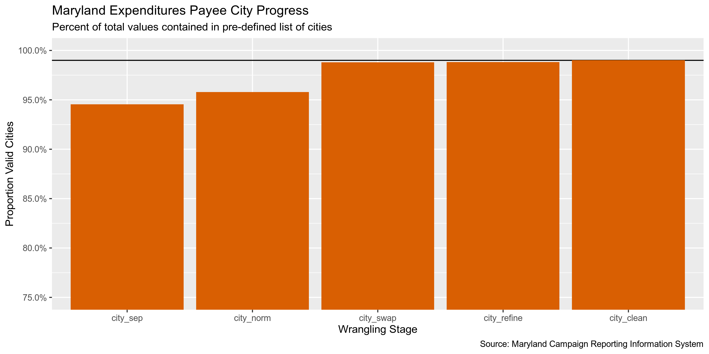<!-- -->

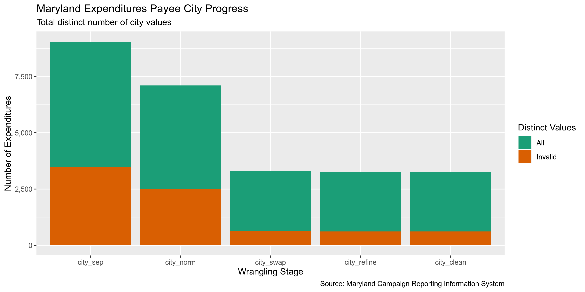<!-- -->

## Explore

Now that the data is sufficiently wrangled and normalized, we should
explore it a little for consistency issues.

``` r
head(md)
#> # A tibble: 6 x 27
#>   expenditure_date payee_name address address_sep city_sep state_sep zip_sep payee_type amount
#>   <date>           <chr>      <chr>   <chr>       <chr>    <chr>     <chr>   <chr>       <dbl>
#> 1 2008-01-06       Webster C… 18804 … 18804 Keif… Montgom… MD        20886   Business/…   290 
#> 2 2008-01-07       Verizon W… Box 40… Box 4009    Silver … MD        20914   Business/…   759.
#> 3 2008-05-04       MCDCC      3720 F… 3720 Farra… Kensing… MD        20895   Business/…   100 
#> 4 2008-05-27       Creative … 1257 P… 1257 Pine … Annapol… MD        21409   Business/…   250 
#> 5 2008-07-07       Webster C… 18804 … 18804 Keif… Montgom… MD        20886   Business/…   205 
#> 6 2008-07-07       Gaithersb… 4 Prof… 4 Professi… Gaither… MD        20879   Business/…   100 
#> # … with 18 more variables: committee_name <chr>, expense_category <chr>, expense_purpose <chr>,
#> #   expense_method <chr>, vendor <chr>, fundtype <chr>, comments <chr>, zip_norm <chr>,
#> #   address_norm <chr>, state_norm <chr>, state_clean <chr>, city_norm <chr>, city_match <chr>,
#> #   match_dist <dbl>, match_abb <lgl>, city_swap <chr>, city_refine <chr>, city_clean <chr>
tail(md)
#> # A tibble: 6 x 27
#>   expenditure_date payee_name address address_sep city_sep state_sep zip_sep payee_type amount
#>   <date>           <chr>      <chr>   <chr>       <chr>    <chr>     <chr>   <chr>       <dbl>
#> 1 2019-04-25       Cristi De… 4329 H… 4329 Harfo… Baltimo… Maryland  21214   Individual  300  
#> 2 2019-05-01       Staples    5835 Y… 5835 York … Baltimo… Maryland  21212   Business/…   22.6
#> 3 2019-05-09       Work Prin… 762 Wa… 762 Washin… Baltimo… Maryland  21230   Business/…  297. 
#> 4 2019-05-20       <NA>       <NA>    ""          <NA>     <NA>      <NA>    Reimburse    53.3
#> 5 2019-05-20       <NA>       <NA>    ""          <NA>     <NA>      <NA>    Reimburse    96  
#> 6 2019-05-30       <NA>       <NA>    ""          <NA>     <NA>      <NA>    Reimburse    27.2
#> # … with 18 more variables: committee_name <chr>, expense_category <chr>, expense_purpose <chr>,
#> #   expense_method <chr>, vendor <chr>, fundtype <chr>, comments <chr>, zip_norm <chr>,
#> #   address_norm <chr>, state_norm <chr>, state_clean <chr>, city_norm <chr>, city_match <chr>,
#> #   match_dist <dbl>, match_abb <lgl>, city_swap <chr>, city_refine <chr>, city_clean <chr>
glimpse(sample_frac(md))
#> Observations: 498,852
#> Variables: 27
#> $ expenditure_date <date> 2012-05-30, 2018-05-16, 2017-09-05, 2013-06-13, 2017-10-05, 2010-05-05…
#> $ payee_name       <chr> "Harford Bank", "CSS Direct", "Google  Inc.", "Steve Hurvitz", "Montgom…
#> $ address          <chr> "P.O. Box 159  Elkton  MD 21922", "3707 N 200th St  Omaha  Nebraska 680…
#> $ address_sep      <chr> "P.O. Box 159", "3707 N 200th St", "1600 Amphitheatre Pkwy.", "1600 S. …
#> $ city_sep         <chr> "Elkton", "Omaha", "Mountain View", "Arlington", "Gaithersburg", "San J…
#> $ state_sep        <chr> "MD", "Nebraska", "California", "VA", "Maryland", "CA", "MD", "MD", NA,…
#> $ zip_sep          <chr> "21922", "68022", "94043", "22202", "20879", "95131", "20636", "20613",…
#> $ payee_type       <chr> "Business/Group/Organization", "Business/Group/Organization", "Business…
#> $ amount           <dbl> 8.06, 175.00, 30.00, 2000.00, 25.00, 3.20, 250.00, 150.00, 12.52, 100.0…
#> $ committee_name   <chr> "Murray  Jane Friend of Judge", "Washington  Mary People Uniting to Ele…
#> $ expense_category <chr> "Other Expenses", "Other Expenses", "Media", "Salaries and Other compen…
#> $ expense_purpose  <chr> "Bank Charges", "Other", "Online Advertising", "Wages - Campaign Staff"…
#> $ expense_method   <chr> "EFT", "EFT", "Debit Card", "Check", "Check", NA, "Check", "Check", "Ch…
#> $ vendor           <chr> NA, NA, NA, NA, NA, NA, NA, NA, "301 Travel Plaza BP", NA, NA, NA, NA, …
#> $ fundtype         <chr> "Electoral", "Electoral", "Administrative", "Electoral", "Electoral", "…
#> $ comments         <chr> "bank charge", "Phone list", NA, NA, NA, "credit card fee - J. Nieman",…
#> $ zip_norm         <chr> "21922", "68022", "94043", "22202", "20879", "95131", "20636", "20613",…
#> $ address_norm     <chr> "PO BOX 159", "3707 NORTH 200TH STREET", "1600 AMPHITHEATRE PARKWAY", "…
#> $ state_norm       <chr> "MD", "NE", "CA", "VA", "MD", "CA", "MD", "MD", NA, "MD", "CA", "MD", "…
#> $ state_clean      <chr> "MD", "NE", "CA", "VA", "MD", "CA", "MD", "MD", NA, "MD", "CA", "MD", "…
#> $ city_norm        <chr> "ELKTON", "OMAHA", "MOUNTAIN VIEW", "ARLINGTON", "GAITHERSBURG", "SAN J…
#> $ city_match       <chr> "ELKTON", "ELKHORN", "MOUNTAIN VIEW", "ARLINGTON", "GAITHERSBURG", "SAN…
#> $ match_dist       <dbl> 0, 6, 0, 0, 0, 0, 0, 0, NA, 8, 0, 0, 0, 0, 0, 0, NA, 0, 0, 9, 0, 0, 0, …
#> $ match_abb        <lgl> FALSE, FALSE, FALSE, FALSE, FALSE, FALSE, FALSE, FALSE, FALSE, FALSE, F…
#> $ city_swap        <chr> "ELKTON", "OMAHA", "MOUNTAIN VIEW", "ARLINGTON", "GAITHERSBURG", "SAN J…
#> $ city_refine      <chr> "ELKTON", "OMAHA", "MOUNTAIN VIEW", "ARLINGTON", "GAITHERSBURG", "SAN J…
#> $ city_clean       <chr> "ELKTON", "OMAHA", "MOUNTAIN VIEW", "ARLINGTON", "GAITHERSBURG", "SAN J…
```

### Missing

There are a number of records missing one of the four key variables we
need to identify a unique transaction (primarily `payee_name`).

``` r
glimpse_fun(md, count_na)
#> # A tibble: 27 x 4
#>    col              type       n        p
#>    <chr>            <chr>  <dbl>    <dbl>
#>  1 expenditure_date date       0 0       
#>  2 payee_name       chr    19246 0.0386  
#>  3 address          chr    20617 0.0413  
#>  4 address_sep      chr        0 0       
#>  5 city_sep         chr    25093 0.0503  
#>  6 state_sep        chr    20617 0.0413  
#>  7 zip_sep          chr    28465 0.0571  
#>  8 payee_type       chr        0 0       
#>  9 amount           dbl        0 0       
#> 10 committee_name   chr        0 0       
#> 11 expense_category chr        0 0       
#> 12 expense_purpose  chr    10333 0.0207  
#> 13 expense_method   chr   145400 0.291   
#> 14 vendor           chr   460165 0.922   
#> 15 fundtype         chr      841 0.00169 
#> 16 comments         chr   204859 0.411   
#> 17 zip_norm         chr    28860 0.0579  
#> 18 address_norm     chr    29434 0.0590  
#> 19 state_norm       chr    20624 0.0413  
#> 20 state_clean      chr    20624 0.0413  
#> 21 city_norm        chr    26510 0.0531  
#> 22 city_match       chr    41041 0.0823  
#> 23 match_dist       dbl    41276 0.0827  
#> 24 match_abb        lgl      235 0.000471
#> 25 city_swap        chr    41276 0.0827  
#> 26 city_refine      chr    41276 0.0827  
#> 27 city_clean       chr    41276 0.0827
```

We will flag these records with a new `na_flag` variable using the
`campfin::flag_na()` function.

``` r
md <- md %>% flag_na(expenditure_date, amount, payee_name, committee_name)
sum(md$na_flag)
#> [1] 19246
percent(mean(md$na_flag))
#> [1] "3.86%"
```

### Duplicates

There are also a number of records that are complete duplicates of
another row. It’s possible that a campaign made multiple valid
expenditures for the same amount, to the same vendor, on the same day.
However, we will flag these two variables just to be safe. We can create
a new `dupe_flag` variable using the `campfin::flag_dupes()` function.

``` r
md <- flag_dupes(md, everything())
sum(md$dupe_flag)
#> [1] 7735
percent(mean(md$dupe_flag))
#> [1] "1.55%"
```

``` r
md %>% 
  filter(dupe_flag) %>% 
  select(expenditure_date, amount, payee_name, committee_name) %>% 
  arrange(expenditure_date)
#> # A tibble: 7,735 x 4
#>    expenditure_date amount payee_name                         committee_name                       
#>    <date>            <dbl> <chr>                              <chr>                                
#>  1 2008-01-01          20  Pasadena Business Association      Kipke  Friends of Nic                
#>  2 2008-01-01           0  Wink Suder                         Muldowney  Paul Citizens For         
#>  3 2008-01-06         288. " Gaithersburg Party Rental"       Reznik  Kirill Friends Of            
#>  4 2008-01-07           0  Federalsburg Volunteer Fire Depar… Colburn  (Richard) Citizens For Comm…
#>  5 2008-01-08       22283. LSG STRATEGIES SERVICES  CORP.     Muse  C. Anthony Friends Of          
#>  6 2008-01-08       22283. LSG STRATEGIES SERVICES  CORP.     Muse  C. Anthony Friends Of          
#>  7 2008-01-08       22283. LSG STRATEGIES SERVICES  CORP.     Muse  C. Anthony Friends Of          
#>  8 2008-01-08       22283. LSG STRATEGIES SERVICES  CORP.     Muse  C. Anthony Friends Of          
#>  9 2008-01-08       22283. LSG STRATEGIES SERVICES  CORP.     Muse  C. Anthony Friends Of          
#> 10 2008-01-08       22283. LSG STRATEGIES SERVICES  CORP.     Muse  C. Anthony Friends Of          
#> # … with 7,725 more rows
```

### Categorical

``` r
glimpse_fun(md, n_distinct)
#> # A tibble: 29 x 4
#>    col              type       n          p
#>    <chr>            <chr>  <dbl>      <dbl>
#>  1 expenditure_date date    4146 0.00831   
#>  2 payee_name       chr    85226 0.171     
#>  3 address          chr   112208 0.225     
#>  4 address_sep      chr    88181 0.177     
#>  5 city_sep         chr     6791 0.0136    
#>  6 state_sep        chr      760 0.00152   
#>  7 zip_sep          chr     8296 0.0166    
#>  8 payee_type       chr       21 0.0000421 
#>  9 amount           dbl    73425 0.147     
#> 10 committee_name   chr     4631 0.00928   
#> 11 expense_category chr       19 0.0000381 
#> 12 expense_purpose  chr      106 0.000212  
#> 13 expense_method   chr        9 0.0000180 
#> 14 vendor           chr    10273 0.0206    
#> 15 fundtype         chr        3 0.00000601
#> 16 comments         chr   139133 0.279     
#> 17 zip_norm         chr     4565 0.00915   
#> 18 address_norm     chr    66103 0.133     
#> 19 state_norm       chr      579 0.00116   
#> 20 state_clean      chr      172 0.000345  
#> 21 city_norm        chr     4600 0.00922   
#> 22 city_match       chr     1926 0.00386   
#> 23 match_dist       dbl       23 0.0000461 
#> 24 match_abb        lgl        3 0.00000601
#> 25 city_swap        chr     2667 0.00535   
#> 26 city_refine      chr     2634 0.00528   
#> 27 city_clean       chr     2631 0.00527   
#> 28 na_flag          lgl        2 0.00000401
#> 29 dupe_flag        lgl        2 0.00000401
```

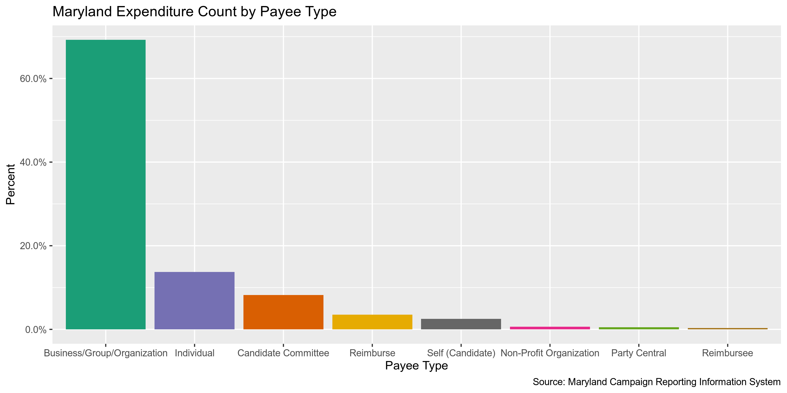<!-- -->

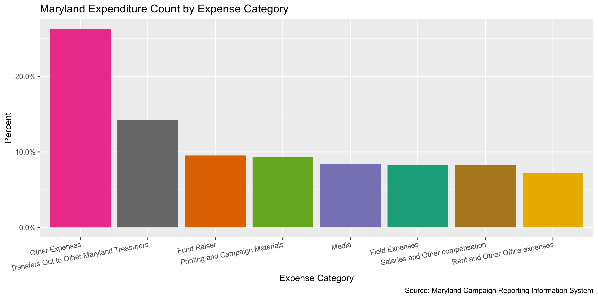<!-- -->

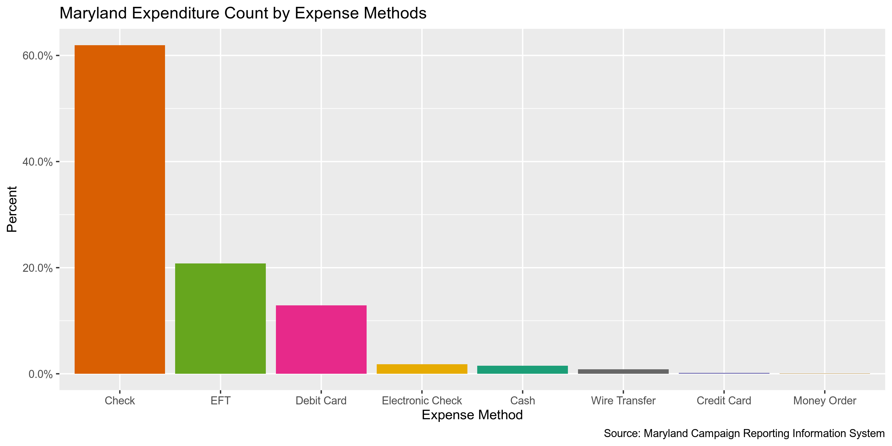<!-- -->

### Continuous

#### Amounts

``` r
summary(md$amount)
#>    Min. 1st Qu.  Median    Mean 3rd Qu.    Max. 
#>  -14000      38     150    1333     500 5019519
sum(md$amount <= 0)
#> [1] 4927
sum(md$amount > 1000000)
#> [1] 43
```

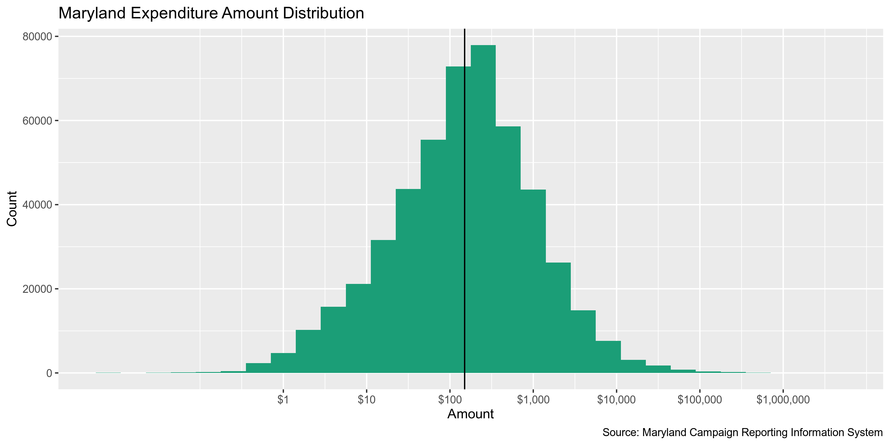<!-- -->

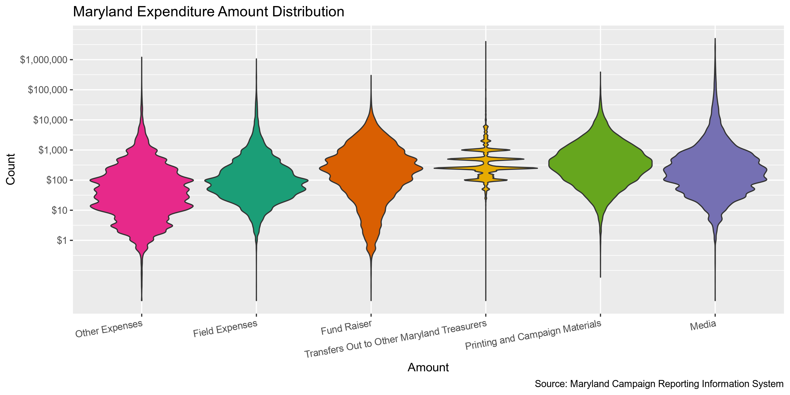<!-- -->

#### Dates

The `expenditure_date` is very clean, given that our data was downloaded
from a search result bounded by 2008-01-01 and `lubridate::today()`.

``` r
min(md$expenditure_date)
#> [1] "2008-01-01"
max(md$expenditure_date)
#> [1] "2019-09-17"
sum(md$expenditure_date > today())
#> [1] 0
```

We can use `lubridate::year()` to create an `expenditure_year` variable
from the `expenditure_date`.

``` r
md <- mutate(md, expenditure_year = year(expenditure_date))
```

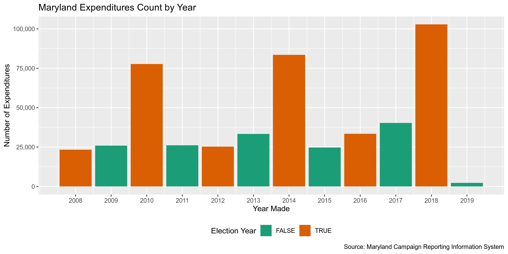<!-- -->

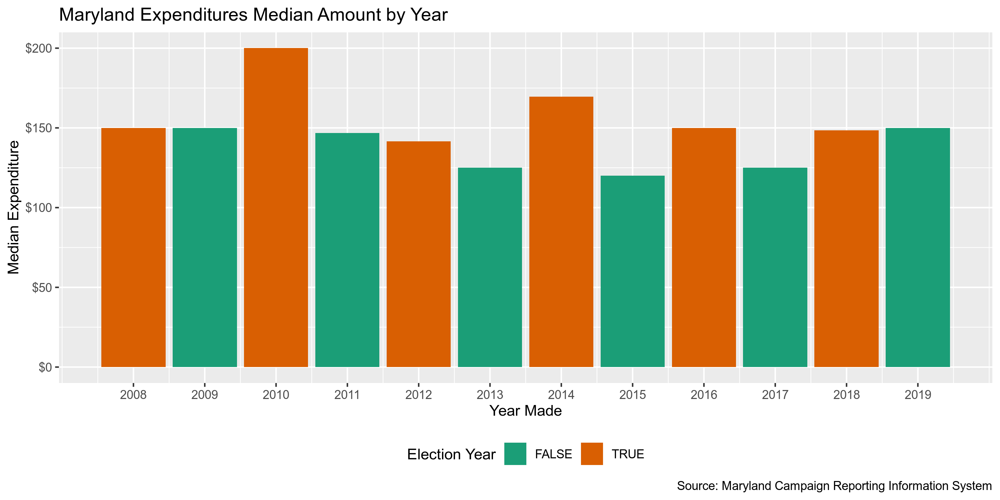<!-- -->

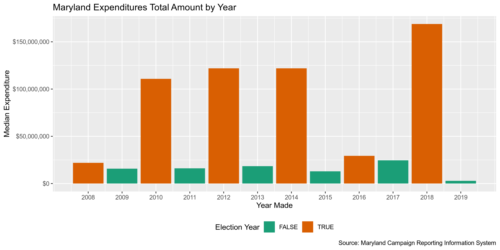<!-- -->

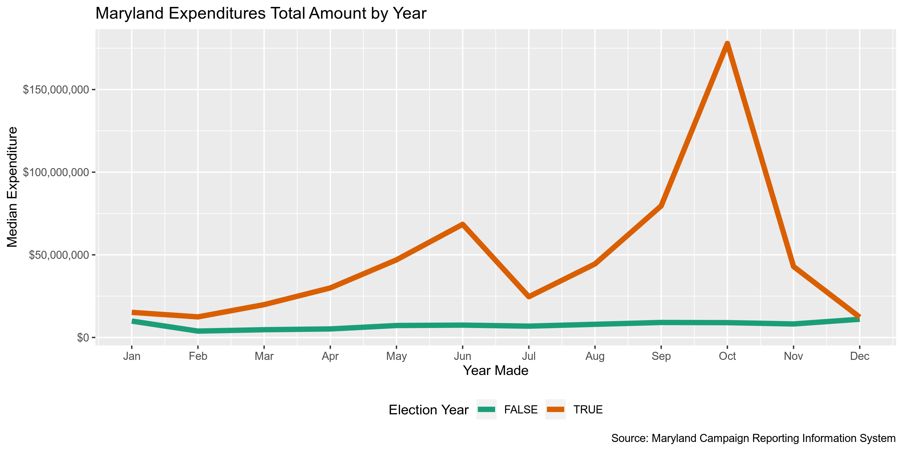<!-- -->

## Conclude

1.  There are 498852 records in the database.
2.  There are 7735 duplicate records in the database.
3.  The range and distribution of `amount` and `date` seem reasonable.
4.  There are 19246 records missing a `payee_name`.
5.  Consistency in geographic data has been improved with
    `campfin::normal_*()`.
6.  The 5-digit `zip_norm` variable has been created with
    `campfin::normal_zip()`.
7.  The 4-digit `expenditure_year` variable has been created with
    `lubridate::year()`.

## Export

``` r
proc_dir <- here("md", "expends", "data", "processed")
dir_create(proc_dir)
```

``` r
md %>% 
  select(
    -address_sep,
    -zip_sep,
    -state_sep,
    -state_norm,
    -city_sep,
    -city_norm,
    -city_match,
    -city_swap,
    -city_swap,
    -match_dist,
    -match_abb,
    -city_refine,
  ) %>% 
  write_csv(
    path = glue("{proc_dir}/md_expends_clean.csv"),
    na = ""
  )
```
